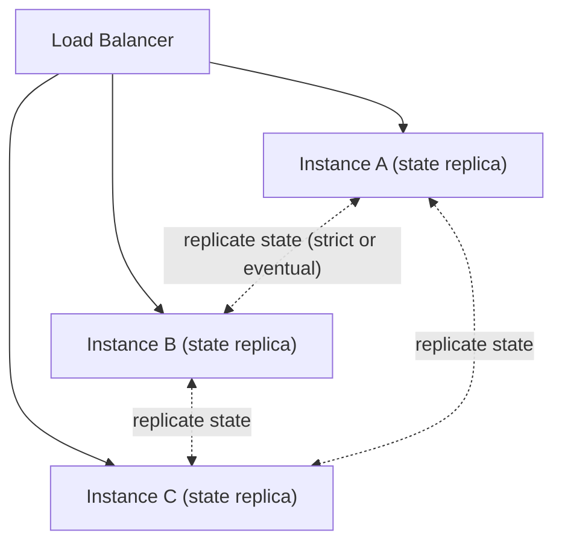
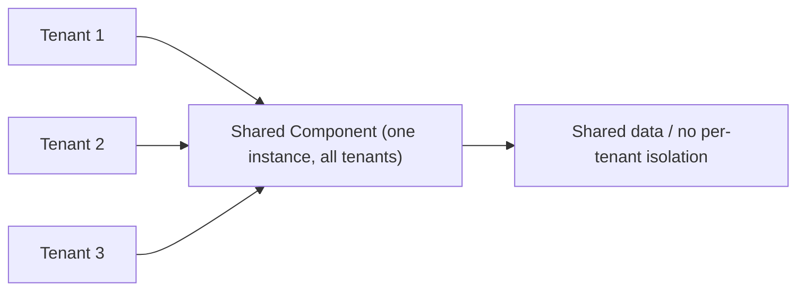
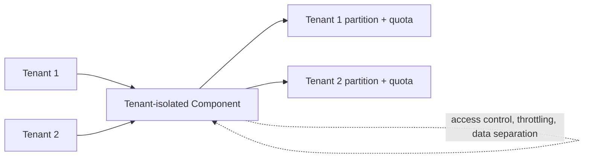
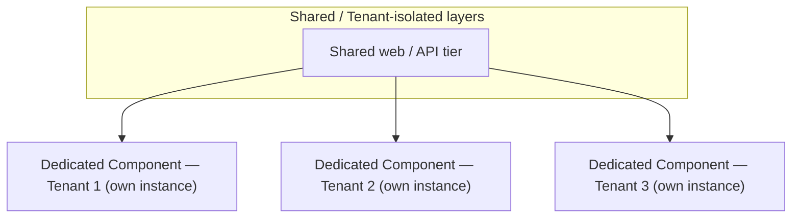
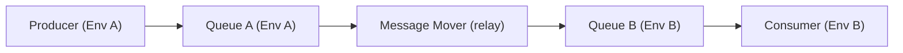
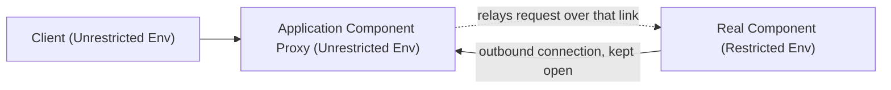
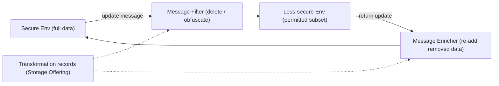
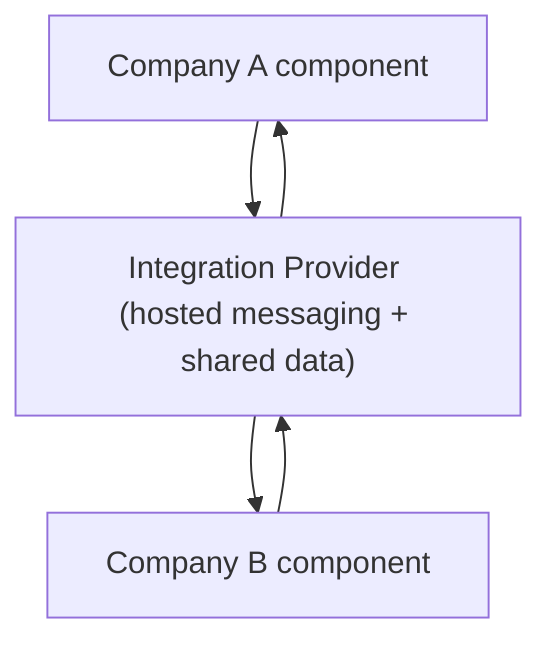

# Cloud Application Architectures: State, Multi-Tenancy & Integration

This topic is part of the **Cloud Computing Patterns** group (`ccp-`), based on the
vendor-neutral pattern language *Cloud Computing Patterns* by Fehling, Leymann, Retter,
Schupeck & Arbitter (Springer, 2014), catalogued at
[cloudcomputingpatterns.org](https://www.cloudcomputingpatterns.org/). These are
**abstract, technology-independent** solutions — the mechanisms that underpin
cloud-native design regardless of AWS/Azure/GCP. Products are named only as
*illustrations* of each abstract pattern.

This topic covers three related concerns for structuring a distributed cloud
application: **where component state lives**, **how one application serves many tenants**
(the sharing-vs-isolation spectrum), and **how components integrate across restricted
environments** (hybrid cloud).

> [!KEY-TAKEAWAY]
> The through-line is **isolation vs. sharing as a cost/control dial**. Stateful vs
> stateless decides *where mutable data lives*; Shared → Tenant-isolated → Dedicated
> is a *tenancy* dial from cheapest/weakest-isolation to priciest/strongest; and the
> integration patterns (Message Mover, Proxy, Compliant Replication, Integration
> Provider) let components reach across trust boundaries **without** collapsing those
> boundaries.

> [!INTERVIEW]
> Name the **forces** before the pattern: how many tenants, how much they trust each
> other, what regulations bind the data, and which environments a firewall separates.
> The pattern falls out of the forces — don't lead with the product.

**Cross-reference boundary note.** This library already deep-dives the mechanisms these
patterns abstract over. Give the **pattern-level** treatment (intent / solution /
trade-off + vocabulary) and defer depth:

- Multi-tenancy isolation depth → `system-design/multi-tenancy-and-saas-isolation`
- Consistency of replicated state (strict vs eventual) → `system-design/cap-theorem-and-consistency`
- Messaging middleware & delivery semantics → `system-design/message-queues-and-async`,
  `system-design/event-driven-cqrs-saga-cdc`
- Provider-specific hybrid/networking → `system-design/aws-networking-vpc-privatelink`,
  `system-design/aws-migration-modernization`, `system-design/aws-messaging-sqs-sns-eventbridge`
- Data residency / compliance operations → `system-design/multi-tenancy-and-saas-isolation`
  and the AWS security topics.

The **counterpart** patterns Stateless Component, Managed Configuration, Elastic
Queue/Load Balancer, Strict/Eventual Consistency, and the cloud-type patterns
(Public/Private/Community/Hybrid Cloud) live in sibling `ccp-` topics; they are
referenced here where relevant.

---

## Stateful Component

**Intent.** *How can application components that are scaled out maintain a synchronized
internal state?*

**Problem / context.** In an elastic cloud, a component is scaled out into many
interchangeable instances behind a load balancer. If a component holds **mutable
internal state**, every instance must present a **unified behavior** — a request routed
to instance B must see the effect of a change made through instance A. Because the
cloud may add, kill, or reschedule instances at any time, state that lives *only* in one
instance's memory is lost on scale-in or failure. This is the explicit counterpoint to
the **Stateless Component**, which externalizes all session/state so instances are
disposable.

**Solution (abstract).** The internal state maintained by instances is **replicated
among all instances** so they behave consistently. To keep this tractable, keep the
replicated state **minimal** (e.g., a small shared configuration rather than large
session data) and choose a **consistency model**: synchronous **Strict Consistency**
(all replicas agree before acknowledging — safe, slower, harder to scale) or
asynchronous **Eventual Consistency** (replicas converge over time — faster, may read
stale). When state can instead be pushed to a data store, prefer making the component
**stateless** and holding state in a Storage Offering.

**Modern equivalent.** In-memory data grids / gossip-replicated clusters:
Hazelcast, Apache Ignite, Redis Cluster/Redis Enterprise CRDTs; Akka Cluster sharding;
sticky sessions on a load balancer as a *weak* form. In practice most teams push state
out to a shared store (Redis/ElastiCache, DynamoDB, Cloud Spanner) and keep the compute
tier **stateless** rather than replicate state peer-to-peer.

**Trade-offs / when to use.** Replicating state costs bandwidth and coordination and
limits how far you can scale out — the more state and the stricter the consistency, the
worse it scales. Use Stateful Component only for **small, hot shared state** where the
round-trip to an external store is too costly; otherwise externalize state and go
stateless.

**Related patterns.** Stateless Component (counterpart), Managed Configuration, Strict
Consistency, Eventual Consistency, Storage Offering, Elastic Load Balancer.
**Deep dive:** consistency models → `system-design/cap-theorem-and-consistency`.

---

## Multi-Component Image

*How you **package** components into server images is the other side of the elasticity
coin: the Stateful/Stateless split decides where state lives, while image packaging
decides how quickly and cheaply you can spin up (and repurpose) the stateless compute that
runs it.*

**Intent.** *How can a virtual server provide the functionality of multiple application
components so it can be used flexibly?*

**Problem / context.** In an elastic infrastructure you provision servers from **images**.
If each image (and each running server) hosts exactly **one** component, servers are
often **underutilized** — a small component wastes most of a VM — and every distinct
component needs its own provisioning/decommissioning lifecycle. You want an image whose
running servers can be **repurposed** without spinning up new machines.

**Solution (abstract).** Bundle **multiple application components** (optionally including
middleware) into a **single virtual-server image**. A server started from that image can
then serve *any* of those components — you enable the ones you need per server. Already
running servers can be reused for different purposes **without provisioning or
decommissioning operations**, improving utilization and provisioning speed. The
counterpart, the single-purpose image, packages exactly one component for clean scaling
and small blast radius.

**Modern equivalent.** A "fat" VM image / golden AMI carrying several services; a
container image with multiple processes managed by a supervisor (an anti-pattern for
strict container purists but common in edge/appliance builds); Kubernetes **sidecar /
multi-container Pods** where several containers share one scheduling unit;
`docker-compose`-style co-located stacks. The modern *single-purpose* counterpoint is
"one process per container," the immutable-infrastructure default.

**Trade-offs / when to use.** Consolidation raises utilization and flexibility but
**couples the components' lifecycles**: you cannot scale or patch one without the other,
the blast radius of a bad deploy is larger, and resource contention is harder to reason
about. Favor Multi-Component Image for small/low-traffic components, tightly bundled
helper processes, or edge/appliance deployments; favor single-purpose images/containers
when components must scale or fail independently.

**Related patterns.** Stateless Component, Elasticity Manager, Elastic Infrastructure,
Node-based Availability.

---

## Shared Component

**Intent.** *How can an application component be shared between multiple tenants while
still allowing some individual configuration?*

**Problem / context.** A distributed application is offered to **multiple tenants** who
pool IT resources to cut cost. To be efficient you want to **minimize** the portion of
the stack deployed *exclusively* per tenant. The simplest case: functionality that is
**identical for every tenant** and carries no strong isolation requirement.

**Solution (abstract).** Provide **one component instance that serves all tenants**,
offering **equal functionality** to each. All tenants are treated as a **uniform user
group** with a common user experience and service level; per-tenant behavior is limited
to lightweight configuration. This is the **cheapest, highest-density** point on the
tenancy spectrum, with the **weakest isolation**.

**Modern equivalent.** A single stateless service tier (with per-tenant config flags)
serving all customers; a shared database with a **tenant_id** column (pooled model); a
shared multi-tenant SaaS control plane. Feature-flag / config services (LaunchDarkly,
AppConfig) supply the "individual configuration" without splitting the instance.

**Trade-offs / when to use.** Highest resource efficiency and lowest per-tenant cost,
but **no performance/data isolation** — a noisy or hostile tenant affects everyone
("noisy neighbor"), and a bug/leak can cross tenants. Use when tenants trust the
provider (not each other necessarily), functionality is uniform, and regulations don't
demand separation.

**Related patterns.** Tenant-isolated Component (more isolation), Dedicated Component
(full separation), Restricted Data Access Component.
**Deep dive:** pooled/silo/bridge SaaS models → `system-design/multi-tenancy-and-saas-isolation`.

---

## Tenant-isolated Component

**Intent.** *How can a component be shared between multiple tenants while enabling
individual configuration and **isolation** regarding performance, data volume, and
access privileges?*

**Problem / context.** Same multi-tenant setting, but now tenants have **differing
needs**, may **not trust each other**, and each expects the application to behave *as if
it were the only tenant*. Pure sharing (Shared Component) can't guarantee that; fully
dedicated deployments are too expensive at scale. You want the density of sharing with
the *illusion* of exclusivity.

**Solution (abstract).** Build **isolation into the component itself**, across every
layer of the stack. Components are specifically developed to be multi-tenant and enforce
three controls: **access isolation** (a tenant only sees its own data/operations),
**performance isolation** (quotas/throttling so one tenant can't starve others), and
**data separation** (logical partitioning of stored data per tenant). Tenants share the
*instance* but are **logically isolated** within it.

**Modern equivalent.** Row-level-security multi-tenant DBs (PostgreSQL RLS), separate
schemas per tenant in one instance, per-tenant rate limits/quotas at the API gateway,
per-tenant namespaces in Kubernetes with ResourceQuotas, DynamoDB partition keys keyed
by tenant. The "bridge" model in SaaS taxonomy.

**Trade-offs / when to use.** Middle of the spectrum: much better isolation than Shared
at far lower cost than Dedicated, but the isolation is **only as strong as the code and
config that enforce it** — a logic bug can leak across tenants, and it adds development
complexity. Use for most B2B SaaS where tenants distrust each other but per-tenant
hardware is uneconomical.

**Related patterns.** Shared Component (less isolation), Dedicated Component (full
separation), Restricted Data Access Component.
**Deep dive:** isolation techniques & noisy-neighbor mitigation →
`system-design/multi-tenancy-and-saas-isolation`.

---

## Dedicated Component

**Intent.** *How can application components that **cannot be shared** be integrated into
a multi-tenant application?*

**Problem / context.** In a multi-tenant application, some components provide
**critical/sensitive functionality** — or legacy components not built for tenancy — that
simply **cannot** be shared (regulatory, security, trust, or technical reasons), even
though other components in the same app can be shared.

**Solution (abstract).** Provision the non-shareable component **exclusively per tenant**
— each tenant gets its own instance — while the rest of the application continues to use
Shared or Tenant-isolated Components. This is the **strongest isolation** (physical
separation) and the **most expensive / lowest density** point on the spectrum.

**Modern equivalent.** Per-tenant database instance (silo model), per-tenant Kubernetes
namespace/cluster, single-tenant VPC/account per customer (AWS Control Tower
account-per-tenant), dedicated instances for a regulated customer. Often mixed: shared
front door + dedicated data plane for the sensitive part.

**Trade-offs / when to use.** Best isolation and simplest per-tenant reasoning
(compliance, blast radius, custom SLAs), but cost and operational overhead scale
**linearly with tenant count** and utilization is low. Reserve for the components that
genuinely can't be shared — regulated data, enterprise customers paying for a silo, or
components not architected for multi-tenancy.

**Related patterns.** Shared Component, Tenant-isolated Component (the other two points
on the isolation/cost dial), Restricted Data Access Component.
**Deep dive:** silo-vs-pool economics → `system-design/multi-tenancy-and-saas-isolation`.

> [!TIP]
> **The tenancy dial, in one line:** Shared (one instance, all tenants — cheapest,
> weakest isolation) → Tenant-isolated (one instance, *logical* per-tenant isolation) →
> Dedicated (one instance *per tenant* — priciest, strongest, physical isolation).
> Real systems mix all three across layers.

### Worked example — why the cost curve bends (1,000 tenants × 5 GB)

Take **1,000 tenants averaging 5 GB of data each → 5 TB total**, and price each option's
database tier. Watch what happens to **cost per tenant**:

| Model | Infrastructure | Monthly infra cost | Cost / tenant | Storage utilization |
|---|---|---|---|---|
| **Shared** | 1 right-sized instance holding the pooled 5 TB | ~$2,000 | $2,000 / 1,000 = **$2** | pooled — near 100% of what you pay for |
| **Tenant-isolated** | *same* 1 instance + per-tenant RLS + quotas | ~$2,000 (infra unchanged) | ~**$2** | still pooled |
| **Dedicated** | 1,000 separate instances | 1,000 × $150 = **$150,000** | $150,000 / 1,000 = **$150** | 5 GB used on a ~100 GB min instance = **~5%** |

The bend is the **minimum-instance floor**. A tenant needs 5 GB, but the smallest managed
DB instance you can rent still costs ~$150/mo — you pay for a floor of vCPU/RAM/storage,
not for 5 GB. So Dedicated cost is `tenants × floor`: it **scales linearly with tenant
count** (1,000 instances → $150k) and each instance runs at **~5% utilization**. Shared
pools all 1,000 tenants onto one bill, so per-tenant cost collapses to **$2 — a 75×
difference**. Tenant-isolated keeps that same ~$2 infra cost; what you *add* is
**engineering cost** (building access/performance/data isolation into the code), not
hardware. That is exactly why you reserve Dedicated for the few components that genuinely
can't be pooled.

---

## Restricted Data Access Component

**Intent.** *How can an application component **alter the data it provides** based on the
access restrictions imposed by different environments?*

**Problem / context.** When an application is distributed across multiple providers /
environments (a hybrid cloud), each environment differs in privacy, security, and trust.
The **same data element may not be equally permissible** in every environment — a field
allowed in the trusted private cloud may be forbidden (by law or corporate policy) in a
public-cloud environment.

**Solution (abstract).** Associate **storage rules and access privileges with individual
data elements**, and route all access through dedicated **Restricted Data Access
Components** that **interpret** those rules and **modify the data at request time** —
**deleting or obfuscating** the disallowed portions on every access. The enforcement is
data-element-aware and environment-aware, not just a coarse allow/deny at the endpoint.

**Worked example — one row, transformed at request time.** The stored row is
`{name:"Ada", email:"ada@x.com", ssn:"123-45-6789"}`, tagged: `name` = public,
`email` = obfuscate-outside-EU, `ssn` = never-leave-secure-env. Two identical `GET` calls
hit the *same* Restricted Data Access Component but from different environments:

- **Request from the trusted secure env** → rules say all three are permissible here →
  returns the row **verbatim**: `{name:"Ada", email:"ada@x.com", ssn:"123-45-6789"}`.
- **Request from a public/EU env** → the component reads the full row, then **modifies it
  on the way out**: masks `ssn → null` (never allowed here) and hashes `email →
  "sha256:9c1f…"` → returns `{name:"Ada", email:"sha256:9c1f…", ssn:null}`.

Same query, same underlying record, **two different payloads** — decided by the caller's
environment and the per-element tags. Nothing was copied or pre-computed; the transform
happened **per request**. That is the defining trait versus plain authz (which would just
return 403) and versus Compliant Data Replication below (which transforms *once* at
replication time and stores the reduced view).

**Modern equivalent.** Column/field-level masking and dynamic data masking (Snowflake
Dynamic Data Masking, BigQuery column-level security, PostgreSQL RLS + masking views);
tokenization/redaction gateways; policy engines (OPA, AWS Lake Formation cell-level
filters) that strip PII from a response based on where/who is asking. Distinct from
plain authz: it *transforms* the payload rather than only permitting/denying it.

**Trade-offs / when to use.** Lets one dataset serve environments with different legal
reach without maintaining separate copies, but adds per-request processing cost and
demands accurate per-element metadata (mis-tagging leaks data). Use where the *same*
logical data must be exposed with different fidelity across trust zones.

**Related patterns.** Data Access Component, Managed Configuration, Application Component
Proxy, Compliant Data Replication (the replication-time analogue).
**Deep dive:** data residency & tenant data controls →
`system-design/multi-tenancy-and-saas-isolation`.

---

## Message Mover

**Intent.** *How can message queues of **different providers** be integrated **without
impact** on the application components that use them?*

**Problem / context.** Components communicate asynchronously via messaging. In a hybrid
cloud the queues live in **separate environments**, and a component deployed in one
environment may be **unable to reach** a queue in another (firewalls, network isolation,
different providers). You want cross-environment messaging without rewriting the
components or exposing them to the topology.

**Solution (abstract).** Introduce a **Message Mover** that **receives messages from a
source queue and forwards them to a queue in another environment**. Each component keeps
talking to its **local** queue as if nothing changed; the mover relays across the
boundary, unifying messaging across providers transparently.

**Modern equivalent.** Cross-region/cross-account queue bridges: AWS EventBridge
cross-account/cross-region event buses, SQS→SQS relays, MirrorMaker 2 for Kafka,
Azure Service Bus geo-replication / forwarding, Camel/Spring Integration routing bridges,
Google Pub/Sub push forwarders. Any "connector" that copies messages from one broker to
another is a Message Mover.

**Trade-offs / when to use.** Decouples components from topology and lets you swap or
span providers, but the mover is an extra hop (added latency), a potential bottleneck /
single point of failure, and must handle delivery semantics (at-least-once → possible
duplicates) and ordering carefully. Use to bridge queues across clouds/regions/accounts
without touching the components.

**How you actually handle those hard parts (senior turn).** A relay across a broker
boundary is inherently at-least-once — on a crash mid-transfer it re-reads and re-forwards
the in-flight message — so make **consumers idempotent**: dedup on a stable message key
(or an idempotency key) so a re-delivered copy is a no-op. Accept that **only per-key /
per-partition ordering** survives the bridge; global ordering across the two brokers is
lost, so don't design consumers that assume it. Pin the mover's **failure/replay window**:
on restart it re-delivers anything not yet acked, which is where the duplicates come from.
And define the **DLQ story** — when the destination broker is unreachable, messages should
land in a dead-letter queue for replay rather than block or silently drop.

**Related patterns.** Message-oriented Middleware, Application Component Proxy, Hybrid
Cloud, At-least-once Delivery.
**Deep dive:** delivery semantics & broker internals →
`system-design/message-queues-and-async`, `system-design/event-driven-cqrs-saga-cdc`.

---

## Application Component Proxy

**Intent.** *How can an application component be accessed if **direct access to its
hosting environment is restricted**?*

**Problem / context.** In a hybrid cloud, a component sits in a **locked-down**
environment (private cloud / on-prem) that firewalls block inbound to, but components in
an **open** environment need to reach it. You can't open an inbound hole in the
restricted environment (that's the whole point of the restriction).

**Solution (abstract).** **Duplicate the restricted component's interface** in the
unrestricted environment to form a **proxy**. Critically, the connection is **initiated
and maintained from the restricted side outward** — since the restricted environment is
allowed to reach the unrestricted one, it opens and holds the link, and the proxy relays
calls back in. No inbound port is opened on the restricted side.

**Modern equivalent.** Reverse-tunnel / outbound-only connectivity: AWS
Systems Manager Session Manager, Azure Relay / Hybrid Connections, `ngrok`, Cloudflare
Tunnel, `frp`, self-hosted-runner "phone-home" agents, and service-mesh east-west
gateways that expose a private service via an outbound-established mTLS link.

**Traced walkthrough — how a request travels "backward."** The counterintuitive part is
that the client→server arrow points the *opposite* way from the connection that carries
it. Follow one call:

1. **Startup (restricted side dials out).** The on-prem agent opens a **persistent TLS
   connection outbound** to the proxy in the public env — e.g. `agent → proxy:443`. The
   firewall allows this because it is an *outbound* connection from the trusted side; **no
   inbound rule is ever added** to the private network.
2. **Client calls the proxy.** A public-env client does an ordinary call —
   `POST proxy.example.com/orders` — believing the proxy *is* the real component.
3. **Proxy enqueues onto the open tunnel.** The proxy doesn't dial into the private
   network (it can't). It writes the request as a frame **down the already-open connection
   from step 1**, which the agent is holding.
4. **Agent reads and invokes locally.** The agent, sitting inside the restricted env,
   reads that frame off the tunnel and calls the **real component over localhost** —
   `localhost:8080/orders`.
5. **Response goes back up the same link.** The agent writes the real component's response
   **up the same outbound connection**.
6. **Proxy returns it.** The proxy hands the response back to the client as its own HTTP
   response.

The request logically flowed public → private, but **every packet rode a connection the
private side originated**. The firewall only ever saw one outbound session; it never had
to accept an inbound one.

**Trade-offs / when to use.** Exposes a private component safely without weakening the
firewall posture, but the proxy adds a hop and must faithfully mirror the interface;
the persistent outbound link is a dependency to monitor. Use when a private/on-prem
component must be reachable from the public side but inbound access is forbidden.

**Related patterns.** Message Mover, Distributed Application, Hybrid Cloud, Restricted
Data Access Component, Integration Provider.
**Deep dive:** provider hybrid connectivity →
`system-design/aws-networking-vpc-privatelink`, `system-design/aws-migration-modernization`.

---

## Compliant Data Replication

**Intent.** *How can data be replicated between environments if some environments may
**only handle a subset** of the data due to **laws and corporate regulations**?*

**Problem / context.** Components in a globally distributed hybrid cloud need shared data
access; keeping one central copy hurts performance, so you replicate. But some locations
**may legally hold only a subset** of the data, or must hold it **obfuscated** (data
residency, privacy law). A naïve replica copies everything — which is non-compliant.

**Solution (abstract).** Replicate **asynchronously via messaging**, and transform the
stream at the trust boundary:

- A **message filter** **deletes or obfuscates** disallowed data elements *as messages
  leave the trusted environment* (so the less-trusted replica only ever holds its
  permitted view).
- The transformations are **recorded in a storage offering**.
- When a change originates in the less-secure environment and flows back, a **message
  enricher** **re-adds the removed data** *as the update enters the secure environment*,
  using those records — so bidirectional updates reconcile correctly.

**Worked example — one record's round trip through filter → enricher.** Replicate
`{id:42, name:"Ada", email:"ada@x.com", ssn:"123-45-6789"}` from the secure region to a
less-trusted region that may **not hold raw SSNs**.

1. **Egress (filter).** As the update message leaves the secure env, the message filter
   **tokenizes** the SSN: it mints `tok_abc`, writes `tok_abc → "123-45-6789"` into the
   **transformation-records store**, and rewrites the message to
   `{id:42, name:"Ada", email:"ada@x.com", ssn:"tok_abc"}`.
2. **Less-secure region stores the permitted view.** That region now holds
   `{id:42, …, ssn:"tok_abc"}` — a token, never the real SSN. Compliant.
3. **A change originates there and returns.** Someone in that region updates the email:
   the return message is `{id:42, name:"Ada", email:"ada@new.com", ssn:"tok_abc"}`.
4. **Ingress (enricher).** As it enters the secure env, the message enricher sees
   `ssn:"tok_abc"`, **looks it up** in the transformation-records store → `"123-45-6789"`,
   and **re-inserts the real value** → `{id:42, name:"Ada", email:"ada@new.com",
   ssn:"123-45-6789"}` lands in the secure store. The email change is preserved and the
   SSN is restored intact — a full round trip with no data loss and no illegal copy abroad.

This is exactly **why the mapping store must exist**: without `tok_abc → SSN`, the
returning update would either wipe the real SSN (data loss) or the region would have had
to hold it (compliance breach). And it is why **a bug there is a compliance incident** —
a mis-keyed lookup either leaks the SSN to the wrong place or corrupts the secure record.

**Modern equivalent.** Compliant CDC/replication pipelines: filtered logical replication,
Debezium + stream transforms (SMTs) that mask/drop PII columns, Kafka Connect
transforms, DynamoDB Global Tables *with* field-level masking layers, tokenization on
egress with a vault mapping to reverse it on ingress. The filter+enricher pair is the
key distinguishing shape versus plain multi-region replication.

**Trade-offs / when to use.** Enables global performance and legal compliance
simultaneously, but adds pipeline complexity, asynchronous (eventual) consistency, and a
sensitive mapping store; a filter/enricher bug is a compliance incident. Use when data
residency/privacy law forbids a full replica but you still need low-latency regional
access.

**Related patterns.** Restricted Data Access Component (request-time analogue),
Eventual Consistency, Message-oriented Middleware, Hybrid Cloud, Integration Provider.
**Deep dive:** consistency → `system-design/cap-theorem-and-consistency`; residency
controls → `system-design/multi-tenancy-and-saas-isolation`.

---

## Integration Provider

**Intent.** *How can application components that reside in **different environments** —
possibly across **different companies** — be integrated through a **third-party
provider**?*

**Problem / context.** Applications are spread across environments because of company
collaboration or merging regional/office systems. **Direct** communication between the
environments is **restricted**, and *enabling* it is **hindered by corporate
regulations** — neither side wants to (or can) open its network to the other.

**Solution (abstract).** Instead of point-to-point links, the components communicate
through **integration components offered by a neutral third-party provider** —
principally **messaging** and **shared data/storage** hosted externally. The provider
sits **in the middle** as a trusted intermediary that both environments are permitted to
reach, bridging otherwise-separated parties without either exposing its internals.

**Modern equivalent.** Integration-Platform-as-a-Service (iPaaS) and hosted brokers:
MuleSoft Anypoint, Dell Boomi, Azure Logic Apps / Integration Service Environment,
Workato, AWS EventBridge partner event buses / API Destinations, Confluent Cloud as a
shared Kafka, or an EDI/B2B gateway. The distinguishing trait: the *integration itself*
is consumed **as a service** from a third party, not run by either participant.

**Trade-offs / when to use.** Removes the need for direct connectivity and offloads
integration operations, but introduces a **third party in the data path** (trust,
compliance, cost, availability dependency) and potential lock-in. Use for cross-company
/ cross-org integration where direct links are politically or legally impossible and a
neutral broker is acceptable.

**Related patterns.** Message Mover (self-hosted relay alternative), Application
Component Proxy, Message-oriented Middleware, Hybrid Cloud, Compliant Data Replication.
**Deep dive:** managed messaging → `system-design/aws-messaging-sqs-sns-eventbridge`.

> [!WARNING]
> **Don't conflate the three integration patterns.** *Message Mover* = **you** run a
> relay between two brokers. *Application Component Proxy* = expose one **restricted**
> component, connection initiated **outbound from the restricted side**. *Integration
> Provider* = a **third party** hosts the messaging/shared-data middleware for you.

---

## Common Interview Follow-ups

- **"Stateful or stateless component here?"** Default to stateless + externalized state
  (Storage Offering) for elasticity; reach for Stateful Component only for small hot
  shared state, and then pick Strict vs Eventual Consistency deliberately.
- **"Walk me up the tenancy dial."** Shared (cheapest, weakest isolation) →
  Tenant-isolated (logical isolation, middle cost) → Dedicated (physical isolation,
  priciest). Justify each choice by tenant trust, regulation, SLA, and cost per tenant.
  Note real systems mix them per layer.
- **"A regulated tenant needs its data physically separated."** Dedicated Component for
  the sensitive part, shared/tenant-isolated for the rest — don't silo the whole app.
- **"Same data, different legal reach per region — replicate or transform?"** At request
  time → Restricted Data Access Component; at replication time → Compliant Data
  Replication (filter on egress, enrich on ingress).
- **"Private component must be callable from the cloud but no inbound holes."**
  Application Component Proxy with an outbound-established link from the restricted side.
- **"Bridge two clouds' queues" vs "let a third party integrate two companies."**
  Message Mover (you own the relay) vs Integration Provider (integration-as-a-service).
- **"Why not just one big image with everything?"** Multi-Component Image raises
  utilization but couples lifecycles/blast radius — trade density against independent
  scaling and patching.

## References

- Fehling, Leymann, Retter, Schupeck, Arbitter. *Cloud Computing Patterns:
  Fundamentals to Design, Build, and Manage Cloud Applications.* Springer, 2014.
- Pattern catalogue: [cloudcomputingpatterns.org](https://www.cloudcomputingpatterns.org/)
  — Stateful Component, Multi-Component Image, Shared Component, Tenant-isolated
  Component, Dedicated Component, Restricted Data Access Component, Message Mover,
  Application Component Proxy, Compliant Data Replication, Integration Provider.
- Cross-references within this library: `system-design/multi-tenancy-and-saas-isolation`,
  `system-design/cap-theorem-and-consistency`, `system-design/message-queues-and-async`,
  `system-design/event-driven-cqrs-saga-cdc`, `system-design/aws-networking-vpc-privatelink`,
  `system-design/aws-migration-modernization`, `system-design/aws-messaging-sqs-sns-eventbridge`.
