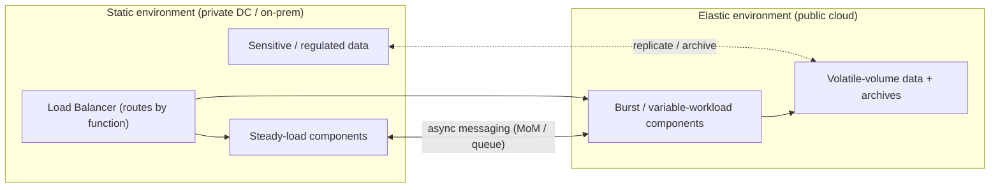

# Composite Cloud Applications: Hybrid Cloud Architectures

This topic covers the **hybrid cloud composition patterns** from *Cloud Computing
Patterns* (Fehling, Leymann, Retter, Schupeck, Arbitter — Springer, 2014;
catalogued at [cloudcomputingpatterns.org](https://www.cloudcomputingpatterns.org/)).
These are **vendor-neutral, technology-independent patterns** describing how to
split ONE distributed application across a **static environment** (a private data
center / on-premises) and an **elastic environment** (a public cloud) — and,
crucially, *which part lives where and why*.

Every hybrid pattern answers the same shaped question: given components with
different **forces** — workload shape (steady vs. spiky/bursty), data-volume
volatility, compliance/data-residency, cost, latency, and lifecycle stage — where
should each component be deployed, and how do the two halves stay **loosely
coupled** across the environment boundary? The recurring mechanism is:
place the variable/burst/regulated part in the environment that fits it, and
connect the halves with **asynchronous messaging** so demand or failure on one
side does not destabilize the other.

> [!KEY-TAKEAWAY]
> A hybrid pattern is never "use two clouds." It is a **placement decision per
> component**, driven by a *specific force*: burst workload → Hybrid Processing;
> volatile data volume → Hybrid Data; sensitive/regulated data must stay private →
> the residency driver behind Hybrid Data / Hybrid Application Functions;
> archival/DR → Hybrid Backup; global streaming media → Hybrid Multimedia Web
> Application; lifecycle-stage fit → Hybrid Development Environment. Name the
> *force*, then the pattern falls out.

**Boundary note (cross-reference, do not re-teach).** This library already deep-dives
the mechanisms these patterns *rely on*. Keep this topic at the **pattern altitude**
(intent / solution / trade-off / vocabulary) and defer depth:
- Elasticity, cloud bursting mechanics, load balancing → `system-design/scalability-and-load-balancing`
- Workload/capacity shaping and tail latency → `system-design/capacity-modeling-and-tail-latency`
- Async messaging / delivery guarantees / message-oriented middleware → `system-design/message-queues-and-async`
- Consistency (strict vs. eventual), replication → `system-design/cap-theorem-and-consistency`, `system-design/databases-sql-nosql-sharding-replication`
- CDN / edge caching → `system-design/caching-and-cdn`
- Backup / DR (RPO/RTO), operational resilience → `reliability-ops/disaster-recovery-rpo-rto-strategies`
- Tenant isolation → `system-design/multi-tenancy-and-saas-isolation`
- Provider-specific hybrid depth (Outposts, DX/VPN, migration) → `system-design/aws-migration-modernization`

---

## Hybrid User Interface

**Intent.** *How can a user-interface component that faces a user group with
**variable, hard-to-forecast workload** be hosted in an elastic cloud while the
rest of the application stays in a static data center?*

**Problem / context.** An application serves multiple user groups with different
demand patterns. Some groups produce steady, predictable load; others (e.g.
customers during a promotion, or the public-facing portion of a portal) generate
unpredictable spikes. Hosting the whole UI statically means either over-provisioning
for the peak or letting spikes degrade the entire application.

**Solution.** Deploy the **presentation/UI tier that faces the spiky user group**
in the elastic environment so it can scale out/in with demand; keep the rest of the
application (processing, data) in the static environment. The two halves communicate
through **asynchronous messaging** so that a UI-tier spike is absorbed by the elastic
tier and buffered toward the static backend rather than overwhelming it.

**Modern equivalent.** Public-facing SPA/SSR frontends on elastic compute
(AWS Amplify/CloudFront + auto-scaling ECS/Lambda, Azure App Service + Front Door,
GCP Cloud Run behind Cloud Load Balancing) talking back to an on-prem core over a
queue/API gateway; VPN or AWS Direct Connect / Azure ExpressRoute / GCP
Interconnect links the two halves.

**Trade-offs / when to use.** Use when only the *UI tier* has the volatile workload
and the backend is stable. Cost: the async boundary adds latency and eventual
consistency between UI and backend; you must design the UI for **asynchronous
interaction** (submit-and-poll / notification), not synchronous request-response.

**Related patterns.** Hybrid Processing (burst is in processing, not UI),
Hybrid Application Functions (arbitrary split), Elastic Load Balancer, Message-oriented
Middleware. Deep dive: elasticity/LB → `system-design/scalability-and-load-balancing`;
async design → `system-design/message-queues-and-async`.

---

## Hybrid Processing

**Intent.** *How can **processing components** that experience varying workload be
hosted in an elastic cloud while the remainder of the application is hosted in a
static data center?* (This is the canonical **cloud bursting** pattern.)

**Problem / context.** Most application functions carry steady load, but a few
**processing components** see periodic, unpredictable, or continuously changing
demand (batch runs, seasonal peaks, analytics jobs). Sizing the static data center
for those peaks wastes capacity most of the time.

**Solution.** Deploy **only the variable-workload processing components** in the
elastic environment; keep the steady remainder static. The static side triggers the
elastic processors through **asynchronous messages**, so the two environments stay
loosely coupled and the elastic side scales with the queue depth.

**Modern equivalent.** Cloud bursting: on-prem Kubernetes bursting to EKS/AKS/GKE
or to serverless (AWS Lambda/Batch, Azure Functions/Batch, GCP Cloud Functions/Batch);
extend on-prem to cloud with AWS Outposts, Azure Arc/Stack, or Google Anthos; queue is
SQS / Azure Service Bus / Cloud Pub/Sub / Kafka.

**Trade-offs / when to use.** Use when the *compute* is bursty but the data/UI are
stable. Requires the processing to be **stateless** (or externally stateful) so it can
scale horizontally; egress/data-transfer cost and cross-boundary latency are the main
penalties. If the burst processor needs *large* co-located data, prefer **Hybrid
Backend** instead.

**Related patterns.** Hybrid Backend (burst processing + its large data), Hybrid User
Interface (burst is in UI), Elastic Queue, Message-oriented Middleware. Deep dive:
bursting/elasticity → `system-design/scalability-and-load-balancing`; workload shaping →
`system-design/capacity-modeling-and-tail-latency`.

---

## Hybrid Data

**Intent.** *How can **data whose volume varies drastically over time** (or that has
placement constraints) be handled in an elastic cloud while the rest of the
application stays in a static data center?*

**Problem / context.** Two distinct drivers push data across the boundary:
1. **Volatility of volume** — some data spikes or grows/shrinks unpredictably (logs,
   uploads, seasonal datasets) while user activity on other components is steady, so
   hosting the volatile data on fixed capacity is inefficient.
2. **Data residency / compliance** — conversely, *sensitive* data may be *forced* to
   stay in the static/private environment while the rest goes to the cloud.

**Solution.** Move the **variable-volume (non-sensitive) data** into elastic cloud
storage; keep sensitive/regulated data in the static environment. Either data-access
components in the static DC or components in the elastic cloud can reach the cloud
storage, so each part scales to its own need.

**Modern equivalent.** Volatile/bulk data in elastic object storage (Amazon S3, Azure
Blob, Google Cloud Storage) or managed elastic DBs (DynamoDB/Aurora, Cosmos DB,
Spanner/Firestore); sensitive data pinned to on-prem or region-locked stores; residency
controls via region selection and sovereign-cloud offerings.

**Trade-offs / when to use.** Use when data volume is the volatile force *or* residency
splits the dataset. Splitting data across environments creates **cross-boundary
consistency** and latency concerns — often you accept eventual consistency for the cloud
copy. Distinguish from **Hybrid Backup** (that moves *archival copies* for DR, not the
live working set).

**Related patterns.** Hybrid Backup (archival/DR copy), Hybrid Backend (data co-located
with burst processing), Compliant Data Replication. Deep dive: consistency →
`system-design/cap-theorem-and-consistency`; replication/sharding →
`system-design/databases-sql-nosql-sharding-replication`; residency/tenant →
`system-design/multi-tenancy-and-saas-isolation`.

---

## Hybrid Backup

**Intent.** *How can data be **archived remotely** (for disaster recovery and
compliance) while the rest of the application keeps running in a static environment?*

**Problem / context.** Small and medium businesses often lack the expertise to run
their own highly available, geographically redundant infrastructure, yet **laws and
regulations** require them to archive data and keep it accessible for audits — sometimes
for years. They need an off-site copy without moving the whole application.

**Solution.** Keep the application running as a distributed app in the static
environment; **periodically pull data from its stateful components and replicate it to
elastic cloud storage** as an off-site archive. This gives resiliency (recover from
errors) and continuity (survive a site loss) without a full migration.

**Modern equivalent.** Backup/DR to cloud object storage with lifecycle tiering
(S3 Glacier, Azure Blob Archive, GCS Coldline/Archive); managed offerings like AWS
Backup / Storage Gateway, Azure Backup / Site Recovery, Google Backup and DR; WORM /
object-lock for compliance retention.

**Trade-offs / when to use.** Use for **DR and regulatory archival**, not for scaling
the live workload. Key knobs are **RPO/RTO** (how much data loss / how fast to recover),
retention duration, and restore-test discipline. Contrast with Hybrid Data: backup moves
*periodic copies* for recovery; Hybrid Data moves the *active* dataset for scaling/placement.

**Related patterns.** Hybrid Data, Compliant Data Replication, Stateful Component. Deep
dive (DR/RPO-RTO process): `reliability-ops/disaster-recovery-rpo-rto-strategies`.

---

## Hybrid Backend

**Intent.** *How can **variable-workload processing components that also need access to
large amounts of data** be hosted in an elastic environment while the rest of the
application stays static?*

**Problem / context.** Like Hybrid Processing, some backend processors face
periodic/unpredictable demand and should run elastically — **but** they depend on timely
access to *large* datasets. Triggering them across the boundary while leaving their bulk
data behind would make every job pay a huge data-transfer penalty.

**Solution.** Move the burst processing components **together with the data they need**
into the elastic environment. Trigger them from the static side via **asynchronous
messages through a queue (message-oriented middleware)**. A **Data Access Component** in
the static environment ensures the required data is placed in cloud storage and messages
the elastic components *where* to find it. Data the backend does not need stays in
stateful components in the static data center.

**Modern equivalent.** Elastic data-processing backends co-located with their data:
EMR/Spark or AWS Batch reading S3, Azure Synapse/HDInsight over Blob, Dataproc/BigQuery
over GCS — kicked off by SQS/Service Bus/Pub-Sub events; the static side keeps the
system-of-record and only stages needed data to the cloud.

**Trade-offs / when to use.** Choose over plain **Hybrid Processing** when the burst
compute is **data-heavy** and co-locating data with compute is cheaper/faster than moving
data per request. Cost is the data-staging/egress and the coordination of *where* data
lives (the Data Access Component's job). Consistency of the staged copy is eventual.

**Related patterns.** Hybrid Processing (burst compute without large data), Hybrid Data,
Message-oriented Middleware, Data Access Component, Stateful Component. Deep dive: async
triggering → `system-design/message-queues-and-async`; data movement/replication →
`system-design/databases-sql-nosql-sharding-replication`.

---

## Hybrid Application Functions

**Intent.** *How can **arbitrary application functionality** be distributed across static
data centers and elastic clouds so each part runs in the environment that best matches its
requirements?*

**Problem / context.** This is the **general case** of hybrid composition. Components at
*every layer* (UI, processing, data access) face differing workloads because users exercise
features differently — and beyond workload, **legal/corporate constraints on security,
privacy, and trust** restrict where some components may run. No single one of the specialized
hybrid patterns captures the whole application.

**Solution.** **Cluster components by shared requirements** (workload shape, residency,
trust) and place each cluster in the environment that fits it. Minimize cross-cluster
dependencies and exchange data via **asynchronous messaging** to keep clusters loosely
coupled. A **load balancer transparently routes** each user request to the correct
environment based on the function being accessed.

**Modern equivalent.** A global router/gateway (AWS CloudFront/API Gateway + Route 53,
Azure Front Door, GCP Global LB) fronting a mix of on-prem and multi-cloud services;
platform "fabrics" like Anthos / Azure Arc / AWS Outposts that let you place workloads by
policy; service mesh spanning environments.

**Trade-offs / when to use.** The most flexible but most complex pattern — use when the
split is genuinely function-by-function, not captured by UI/Processing/Data alone. Cost:
routing, distributed data consistency, cross-environment observability and security. The
specialized patterns (Hybrid UI/Processing/Data/Backend) are **special cases** of this one;
prefer the specific pattern when one force dominates.

**Related patterns.** Hybrid User Interface, Hybrid Processing, Hybrid Data, Hybrid Backend
(all special cases), Elastic Load Balancer, Message-oriented Middleware, Loose Coupling.
Deep dive: routing/LB → `system-design/scalability-and-load-balancing`; loose-coupling/microservice
split → `system-design/microservices-monolith-api-design`.

---

## Hybrid Multimedia Web Application

**Intent.** *How can **non-cacheable streaming content** (video/audio) be integrated
efficiently into a website accessed by a **large, globally distributed** user group?*

**Problem / context.** A globally accessed website is mostly static content that caches
well, but it also carries substantial **multimedia that must be streamed** and does *not*
cache like ordinary static assets. Serving heavy streaming from the static data center
throttles it and gives distant users poor performance.

**Solution.** Serve the **static content from the static environment**, and host the
**streaming media separately in an elastic cloud** optimized for high-throughput,
globally distributed delivery. The static pages contain **references** to the media so the
user's browser fetches the stream **directly** from the elastic environment.

**Modern equivalent.** Media/streaming services + CDN: AWS Elemental MediaConvert/MediaLive
+ CloudFront, Azure Media Services + CDN/Front Door, Google Cloud Media CDN / YouTube-style
delivery; adaptive-bitrate (HLS/DASH) origins on elastic storage with CDN edges.

**Trade-offs / when to use.** Use when a mostly-static site carries heavy, poorly-cacheable
streaming media for a global audience. Note the nuance: a plain CDN handles *cacheable*
static assets; this pattern specifically offloads the *streaming/non-cacheable* media to an
elastic, delivery-optimized environment. Trade-off is managing two hosting origins and
cross-origin references.

**Related patterns.** Content Distribution Network, Hybrid Application Functions, Two-Tier /
Three-Tier Cloud Application. Deep dive (CDN/edge caching): `system-design/caching-and-cdn`.

---

## Hybrid Development Environment

**Intent.** *How can an application **leverage different computing environments across its
lifecycle stages** — development, test, and production — each optimized for that stage's
needs?*

**Problem / context.** Runtime needs shift by lifecycle phase. **Development** wants flexible,
easily-reconfigured resources because requirements are still fuzzy. **Test** needs varied
systems (OSes, browsers, devices) and large, on-demand pools for load/scale testing.
**Production** prioritizes **security and availability** over flexibility. Forcing all three
into one environment compromises each.

**Solution.** Place each stage in the environment that fits it — commonly **dev/test in the
elastic cloud** (cheap, disposable, scalable) and **production in the static/private
environment** (or vice-versa). Make the stages **equivalent** so work is portable: matching
addressing, comparable **mock data**, and equivalent platform functionality; achieve
portability by transforming components or ensuring runtime compatibility. Some test-only
resources (e.g. load generators, exotic browsers) live only in the dev/test environment.

**Modern equivalent.** Ephemeral cloud dev/test environments (per-branch preview envs, cloud
CI runners, GitHub Codespaces / Cloud Workstations) with production held on-prem or in a
locked-down account; **Infrastructure-as-Code** (Terraform / CloudFormation / Bicep) plus
**containers** to keep environments equivalent and portable; cloud load-testing services for
the test pool.

**Trade-offs / when to use.** Use when lifecycle stages have genuinely different needs and you
want cheap, elastic dev/test without exposing production. Risk: **environment drift** — if
addressing, data, and platform behavior diverge, "works in test" won't hold in prod; IaC and
container parity are how you keep them equivalent.

**Related patterns.** Hybrid Application Functions, Environment-based Availability, Two-Tier /
Three-Tier Cloud Application. Deep dive: promotion/pipelines → `devops-cicd` domain;
provider hybrid → `system-design/aws-migration-modernization`.

---

## Common Interview Follow-ups

- **"The burst is in compute but it needs terabytes of local data — Hybrid Processing or
  Hybrid Backend?"** Hybrid Backend — move the data *with* the compute and trigger via a
  queue; a Data Access Component tells the elastic side where the data is. Plain Hybrid
  Processing assumes the burst processor does *not* need large co-located data.
- **"What forces the choice between Hybrid Data and Hybrid Backup?"** Hybrid Data moves the
  *active working set* (driver: volatile volume or residency). Hybrid Backup moves *periodic
  archival copies* (driver: DR + regulatory retention, tuned by RPO/RTO).
- **"Only the public-facing UI spikes; the core is steady — which pattern?"** Hybrid User
  Interface: put the spiky UI tier in the elastic cloud, keep the core static, connect
  asynchronously so spikes don't reach the backend synchronously.
- **"A global site with heavy video — isn't that just a CDN?"** A CDN caches *cacheable*
  static assets (`system-design/caching-and-cdn`). Hybrid Multimedia Web Application
  additionally offloads *non-cacheable streaming* media to an elastic delivery-optimized
  environment, with the static pages referencing it.
- **"Why is async messaging the recurring glue in every hybrid pattern?"** It preserves
  **Loose Coupling** across the environment boundary — spikes/failures on one side are
  buffered, not propagated synchronously. Deep dive: `system-design/message-queues-and-async`.
- **"When would you reach for Hybrid Application Functions over a specific pattern?"** When the
  split is genuinely function-by-function (mixed workload *and* compliance drivers across all
  layers) rather than dominated by a single force. The specialized patterns are special cases
  of it.
- **"How do you stop dev/test from lying to you?"** Keep environments equivalent with IaC +
  containers + comparable mock data and matching addressing — the failure mode of Hybrid
  Development Environment is environment drift.

## References

- Fehling, C., Leymann, F., Retter, R., Schupeck, W., Arbitter, P. *Cloud Computing Patterns:
  Fundamentals to Design, Build, and Manage Cloud Applications.* Springer, 2014.
- Cloud Computing Patterns online catalogue — [cloudcomputingpatterns.org](https://www.cloudcomputingpatterns.org/):
  Hybrid User Interface, Hybrid Processing, Hybrid Data, Hybrid Backup, Hybrid Backend, Hybrid
  Application Functions, Hybrid Multimedia Web Application, Hybrid Development Environment.
- Cross-references within this library: `system-design/scalability-and-load-balancing`,
  `system-design/message-queues-and-async`, `system-design/cap-theorem-and-consistency`,
  `system-design/databases-sql-nosql-sharding-replication`, `system-design/caching-and-cdn`,
  `system-design/multi-tenancy-and-saas-isolation`, `system-design/aws-migration-modernization`,
  `reliability-ops/disaster-recovery-rpo-rto-strategies`.
