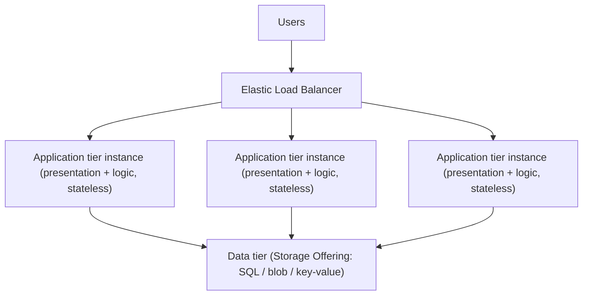
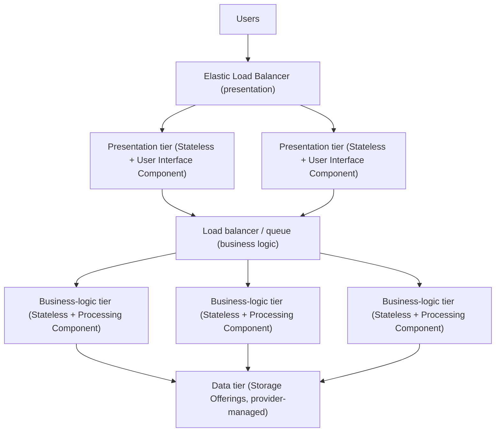
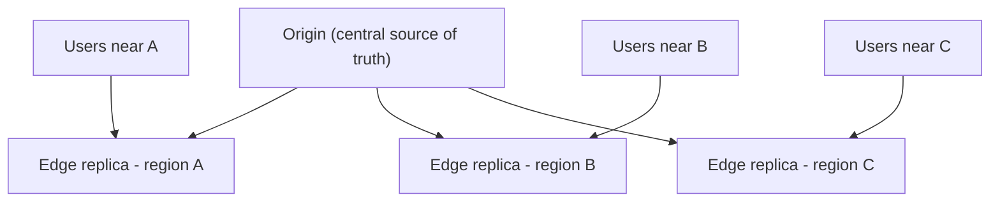

# Composite Cloud Applications: Tiers & CDN

The atomic building blocks of a cloud-native system — the offering, application-component,
and consistency patterns from the other Cloud Computing Patterns topics — do not float in
isolation. They **compose** into whole application topologies. This topic covers the three
*composite* patterns from **Fehling, Leymann, Retter, Schupeck & Arbitter, _Cloud Computing
Patterns_ (Springer, 2014)**, catalogued at
[cloudcomputingpatterns.org](https://www.cloudcomputingpatterns.org/): the **Two-Tier Cloud
Application**, the **Three-Tier Cloud Application**, and the **Content Distribution Network**.

These are **vendor-neutral, technology-independent** patterns — the abstract shapes that
underpin cloud-native design regardless of AWS, Azure, or GCP. Each section teaches the pattern
the way the book does — intent (a "How can…?" question), problem/context, the abstract solution,
and related patterns — then adds a short "Modern equivalent" note grounding it in today's
managed services and frameworks across clouds.

> [!KEY-TAKEAWAY]
> A composite pattern's whole value is **where you draw the tier boundaries**. Boundaries are
> drawn to separate functionality that scales *easily* (stateless logic) from functionality
> that scales *poorly* (stateful data), and to align each tier's instance count to its own
> workload. Get the boundary right and every component pattern plugs in cleanly.

**Boundary note (cross-references, not duplication).** This library already owns the deep dives
these patterns lean on. This topic gives the **pattern-level** treatment (intent / solution /
trade-off / vocabulary) and points at the deep dive:

- Elasticity, load balancing, horizontal scaling → `system-design/scalability-and-load-balancing`
- Strict vs eventual consistency → `system-design/cap-theorem-and-consistency`
- CDN / edge cache mechanics → `system-design/caching-and-cdn`, provider depth in
  `system-design/aws-dns-cdn`
- Component patterns (Stateless/Stateful Component, User Interface Component, Processing
  Component, Data Access Component) → the `ccp-` application-component topics and
  `system-design/arch-*` (layered, microservices).
- Relational / key-value / sharded / replicated storage internals →
  `system-design/databases-sql-nosql-sharding-replication`

---

## Two-Tier Cloud Application

**Intent (guiding question).** *How can application functionality be separated from data
handling so the two can scale independently?*

**Problem / context.** You have decomposed a Distributed Application into components so that
individual functions can scale on their own. But not all functions scale equally. Stateless
functionality (presentation, business logic) scales trivially — add or remove identical
instances behind a load balancer. **Data-handling functionality scales far less easily**: stateful
data must be kept consistent across instances, so it cannot simply be cloned. If you bundle
everything into one deployable, the whole thing inherits the *hardest-to-scale* part's limits.

**Solution (abstract mechanism).** Split the application into **two tiers**:

1. **Application tier** — presentation **and** business logic bundled into a single
   **stateless** tier, fronted by an Elastic Load Balancer and grown/shrunk by an
   Elastic Load Balancer + Elasticity Manager control loop. Because it holds no session
   state, instances are interchangeable and scale out cheaply.
2. **Data tier** — all persistent state, handled by **one or several Storage Offerings**
   (relational, blob, key-value) supplied by the provider. It is the harder-to-scale tier and
   is deliberately kept thin and separate.

The two tiers then **elastically scale independently with their own workloads**.

**Where state lives.** *Only* in the data tier. The application tier must be a Stateless
Component — any session/user state is externalized to the data tier (or a shared cache) so any
instance can serve any request. This is what makes the application tier elastic.

**Modern equivalent.** A classic "web app + managed database" deployment: an autoscaling group /
container service (ECS/Fargate, Azure App Service or Container Apps, Cloud Run, GKE) running the
combined presentation+logic app, behind ALB/NLB, Azure Load Balancer, or Google Cloud Load
Balancing, talking to a managed store (RDS/Aurora, DynamoDB, Azure SQL / Cosmos DB, Cloud SQL /
Firestore). A serverless variant is Lambda/Azure Functions/Cloud Functions (application tier) +
managed DB (data tier).

**Trade-offs / when to use.** Use the two-tier shape when presentation and business logic have
**similar workloads** and there is no benefit to scaling them separately — it is simpler
(one deployable, one build/deploy pipeline for the logic) and has fewer network hops. The cost:
UI-bound spikes and compute-bound spikes are coupled, so you over-provision the whole tier for
whichever dimension peaks. Graduate to three tiers when those workloads diverge.

**Related patterns.** Three-Tier Cloud Application (the next refinement), Content Distribution
Network (offload static content out of the application tier), Stateless Component, Elastic Load
Balancer, Storage Offering, and the Hybrid Cloud Application patterns.
*Deep dive: elasticity/load-balancing → `system-design/scalability-and-load-balancing`;
storage internals → `system-design/databases-sql-nosql-sharding-replication`.*

---

## Three-Tier Cloud Application

**Intent (guiding question).** *How can presentation logic, business logic, and data handling
be decomposed into separate tiers that are scaled independently?*

**Problem / context.** As in the two-tier case you have a Distributed Application split into
components — but here the components experience **different workloads**. Processing components
may be computationally heavy yet accessed less often than user-interface components (or vice
versa). If you summarize mismatched components into coarse-grained tiers, *the number of
provisioned instances cannot be aligned well to the different workloads*. You end up
over-provisioning one function to satisfy the other.

**Solution (abstract mechanism).** Split into **three independently scalable tiers**, each
mapping to specific component patterns:

- **Presentation tier** — an Elastic Load Balancer plus an application component built from the
  **Stateless Component** + **User Interface Component** patterns. Handles rendering / request
  intake. Scales with *user-facing* traffic.
- **Business-logic tier** — an application component built from the **Stateless Component** +
  **Processing Component** patterns. Executes the heavy computation. Scales with *processing*
  workload, independently of the UI tier.
- **Data tier** — persistent storage via Storage Offerings; **harder to scale and often handled
  by the cloud provider**. Scales (or is vertically sized / sharded / replicated) on its own.

**Independent scaling.** The whole point: the presentation tier can run, say, 10 instances for a
UI traffic spike while the business-logic tier runs 3 (or the reverse), and the data tier is
sized independently again. Each tier has its own Elastic Load Balancer + Elasticity Manager loop.
The tiers are often decoupled by a load balancer *or an elastic queue* between presentation and
logic so bursts absorb without dropping work.

**Where state lives.** Presentation and business-logic tiers are **both stateless** — session
and business state live in the data tier (or a shared distributed cache). Statelessness is what
allows each tier to be scaled by cloning. A stateful business tier would reintroduce the
coordination problem and cap scalability.

**Modern equivalent.** The canonical scalable web architecture: CDN + edge → an API/UI service
(the presentation tier) → a separately deployed business-logic service or worker fleet (the
logic tier) → managed data stores. Concretely: ALB → ECS/EKS UI service → internal ALB or
SQS/EventBridge → worker service → Aurora/DynamoDB; or Azure Front Door → App Service → Service
Bus → Functions → Azure SQL/Cosmos; or Cloud LB → Cloud Run → Pub/Sub → GKE workers → Cloud
SQL/Spanner. Microservices generalize this into *many* independently scaled tiers.

**Trade-offs / when to use.** Use three tiers when presentation and processing have **divergent
workloads** (different peaks, different resource profiles) and you want to scale/deploy them
separately. Cost: an extra network hop and more moving parts (two control loops, inter-tier
transport/queue) than two-tier. It is the classic default for scalable web apps; two-tier is the
simpler special case when UI and logic workloads track each other.

> [!INTERVIEW]
> A frequent trap: "the data tier scales like the others." It does **not** — it is the
> hard-to-scale tier by definition (stateful, must stay consistent). Both tier patterns exist
> precisely to *isolate* the data tier so the stateless tiers can scale freely around it.

**Related patterns.** Two-Tier Cloud Application (the coarser sibling), Content Distribution
Network, Stateless Component, User Interface Component, Processing Component, Elastic Load
Balancer, Storage Offering, and Hybrid Cloud Application patterns.
*Deep dive: layered/microservices decomposition → `system-design/arch-fundamentals-and-styles`
and `system-design/microservices-*`; elasticity/load-balancing →
`system-design/scalability-and-load-balancing`.*

---

## Content Distribution Network

**Intent (guiding question).** *How can timely access to an application be ensured for a
globally distributed user group?*

**Problem / context.** When an application serves **multimedia or other large static content**
— streamed video, music, images, large downloads, static site assets — data volume grows
sharply and users are spread across the globe. Serving all of it from a single centralized cloud
or data center is *unfeasible*: distance introduces network latency and consumes origin
bandwidth. The challenge is delivering large content quickly to users everywhere.

**Solution (abstract mechanism).** Establish **multiple replicas of the content across different
physical locations** (edge sites), possibly spanning multiple clouds, and route each user to a
**nearby (local) copy**:

- **Replica placement** — content copies are pushed/pulled to many physical locations.
- **Topology awareness** — the network layout is factored in so each user is served from a
  geographically/network-close replica, minimizing latency and offloading the origin.
- **Centralized updates** — replicas are **not** edited independently; they are updated from a
  **central (origin) location**, so distribution is decentralized while authorship stays
  centralized. This makes the consistency model an explicit choice.

**Consistency of replicas.** Because replicas are updated from the origin, the CDN must pick a
consistency model. **Strict Consistency** (invalidate everywhere before serving new content)
guarantees users never see stale objects but costs latency and coordination. **Eventual
Consistency** (TTL expiry / lazy propagation) is the common default — cheaper and faster, at the
price of a bounded window where edges may serve stale content. This is exactly the Strict vs
Eventual trade-off; cache-busting via versioned/fingerprinted URLs sidesteps it for immutable
assets.

**What a CDN is (and isn't) in the composite.** A CDN sits **in front of** a two- or three-tier
application, absorbing static/streamed traffic at the edge so the application and data tiers only
handle dynamic requests. It is a *composition choice*, not a replacement for the tiers.

**Modern equivalent.** CloudFront, Akamai, Fastly, Cloudflare, Azure Front Door / Azure CDN,
Google Cloud CDN. Edge-compute extensions (Lambda@Edge / CloudFront Functions, Cloudflare
Workers, Fastly Compute, Vercel/Netlify edge) push light dynamic logic to the replica sites too.

**Trade-offs / when to use.** Use a CDN when you have **large, cacheable, or streamed content**
and a **geographically dispersed** audience — it slashes latency and origin load. It adds little
value for highly dynamic, per-user, uncacheable responses (though edge routing/TLS termination
can still help), and it introduces cache-invalidation complexity and per-GB egress cost. If your
users are all in one region and content is dynamic, the tiers alone may suffice.

**Related patterns.** Two-Tier and Three-Tier Cloud Application (a CDN fronts them), Strict
Consistency and Eventual Consistency (how replicas are kept in sync).
*Deep dive: CDN mechanics / cache keys / invalidation → `system-design/caching-and-cdn`;
provider specifics (edge PoPs, origin shields, signed URLs) → `system-design/aws-dns-cdn`.*

---

## Common Interview Follow-ups

- **"Two-tier vs three-tier — when do you split the app tier?"** Split into three tiers when
  presentation and business-logic workloads **diverge** (different peaks / resource profiles) so
  you can scale and deploy them independently. Stay two-tier when they track each other — it is
  simpler and has one fewer hop. In both, the *data tier is always separate* because it is the
  hard-to-scale, stateful part.
- **"Why must the application/presentation/logic tiers be stateless?"** Statelessness makes
  instances interchangeable, so the Elastic Load Balancer + Elasticity Manager can clone/remove
  them freely. State is externalized to the data tier or a shared cache. A stateful tier
  reintroduces cross-instance coordination and caps horizontal scaling.
- **"Where does session state go in a three-tier app?"** Out of the stateless tiers — into the
  data tier or a shared distributed cache/session store, so any presentation/logic instance can
  serve any request.
- **"A CDN — is it a tier?"** No. It is a composition that fronts the tiered application,
  serving static/streamed content from edge replicas near users while dynamic requests fall
  through to the app/data tiers.
- **"Strict or eventual consistency for CDN replicas?"** Eventual (TTL-based) is the common
  default for speed/cost; strict (immediate invalidation) when stale content is unacceptable.
  Versioned/fingerprinted immutable URLs let you treat cached objects as immutable and avoid
  invalidation altogether.
- **"How do the component patterns map onto the three tiers?"** Presentation = Stateless
  Component + User Interface Component; business logic = Stateless Component + Processing
  Component; data = Storage Offerings (relational/blob/key-value), the provider-managed tier.
- **"How does this relate to microservices?"** Three-tier is the coarse-grained case of
  independently scaled tiers; microservices push the same idea to many fine-grained, separately
  deployable/scaled services. Same principle — align instance count to per-component workload.

## References

- Fehling, C., Leymann, F., Retter, R., Schupeck, W., & Arbitter, P. (2014). *Cloud Computing
  Patterns: Fundamentals to Design, Build, and Manage Cloud Applications.* Springer.
- Cloud Computing Patterns — Two-Tier Cloud Application:
  <https://www.cloudcomputingpatterns.org/two_tier_cloud_application/>
- Cloud Computing Patterns — Three-Tier Cloud Application:
  <https://www.cloudcomputingpatterns.org/three_tier_cloud_application/>
- Cloud Computing Patterns — Content Distribution Network:
  <https://www.cloudcomputingpatterns.org/content_distribution_network/>
- Cross-references: `system-design/scalability-and-load-balancing`,
  `system-design/cap-theorem-and-consistency`, `system-design/caching-and-cdn`,
  `system-design/aws-dns-cdn`, `system-design/databases-sql-nosql-sharding-replication`,
  `system-design/arch-fundamentals-and-styles`.
