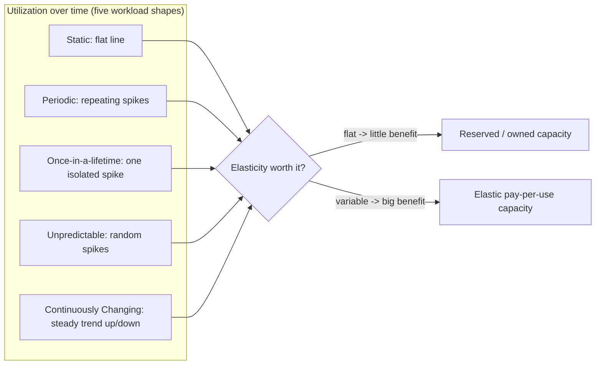
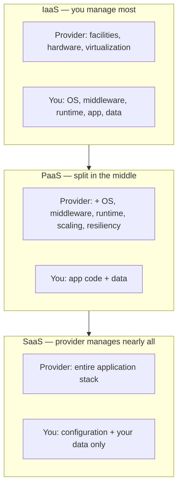
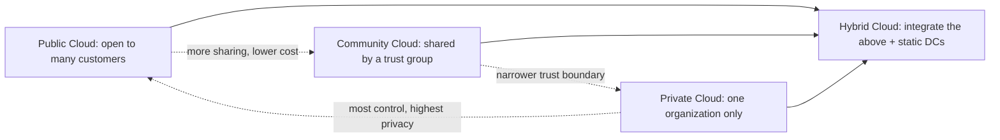
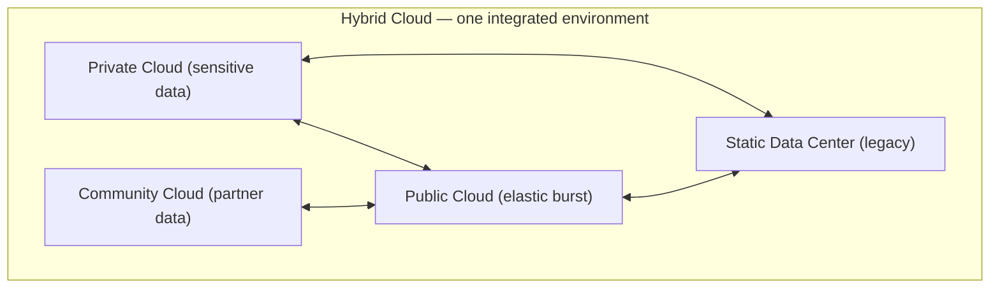

# Cloud Computing Fundamentals: Workloads & Service/Deployment Models

This is the opening topic of the **Cloud Computing Patterns** group (`ccp-` prefix), a
vendor-neutral pattern language distilled from *Cloud Computing Patterns* by Fehling, Leymann,
Retter, Schupeck and Arbitter (Springer, 2014), catalogued at
[cloudcomputingpatterns.org](https://www.cloudcomputingpatterns.org/). These are **abstract,
technology-independent** solutions — the reasoning that underlies cloud-native design regardless
of whether you land on AWS, Azure, or GCP. Each pattern is taught the way the book teaches it:
the **intent** (a "How can…?" question), the **problem/context**, the abstract **solution**, its
**trade-offs**, **related patterns**, and a short **Modern equivalent** note that maps the pattern
onto today's managed services across clouds.

This topic covers three families of the *Cloud Computing Fundamentals* category:

1. **Workload patterns** (5) — utilization-over-time *shapes* that justify (or don't justify) cloud
   elasticity.
2. **Cloud service models** (3) — IaaS / PaaS / SaaS, the classic provider-vs-customer
   responsibility split.
3. **Cloud deployment models** (4) — Public / Private / Community / Hybrid, the NIST-aligned
   tenancy/control/cost trade-offs.

> [!INTERVIEW]
> The workload patterns are the *why* of cloud. An interviewer rarely asks "define Periodic
> Workload" — they describe a scenario ("payroll runs on the last day of every month") and expect
> you to name the workload shape, then reason about the service/deployment model that fits. Lead
> with the utilization-curve shape, then the billing/elasticity consequence.

> [!KEY-TAKEAWAY]
> **Boundary note (read before you study):** this topic teaches these ideas *at pattern altitude* —
> intent, solution mechanism, and the shared vocabulary. It deliberately does **not** re-derive the
> deep-dive material the library already owns. For the capacity math behind workload curves see
> `system-design/capacity-modeling-and-tail-latency`; for elasticity/load-balancing mechanics see
> `system-design/scalability-and-load-balancing`; for the operational process of scaling see
> `reliability-ops`; for provider-specific hosting depth see the `aws-*` topics (e.g.
> `aws-fundamentals-well-architected`, `aws-migration-modernization`). Cross-references are given
> per pattern below — follow them, don't expect this page to duplicate them.

---

## Workload patterns overview

A **workload** is the utilization of IT resources (CPU, memory, I/O, requests) that an application
generates over time. The book classifies applications by the *shape* of that curve, because the
shape determines whether the pay-per-use, elastic cloud saves you money or just adds complexity.
The five shapes are best seen together:

> [!TIP]
> Mental model: **provisioning for peak** wastes money whenever the curve dips below peak. The more
> "gap" between average and peak utilization (and the less predictable the peak), the more the
> elastic cloud pays off. A flat curve has almost no gap — so it benefits least.

### Worked example — feeling the peak-to-average gap in dollars

Numbers make the TIP concrete. Assume one server handles **100 req/s**, on-demand costs
**$1 / server-hour**, and a 1-year reserved commit costs **$0.60 / server-hour** (≈40% off) but is
billed 24×7 whether you use it or not.

**Static app — flat 100 req/s.** You need exactly 1 server, always on: `1 × 24h = 24 server-hours/day`,
~100% utilized. There is *no gap to harvest*, so elasticity buys nothing — the only lever is unit price:

- On-demand: `24 × $1 = $24/day`
- Reserved: `24 × $0.60 = $14.40/day` → **reserved wins by 40%.** This is why Static Workload says
  *don't* reach for elastic pricing reflexively.

**Periodic app — 10 req/s for 22h, then 500 req/s for 2h.** Baseline needs `ceil(10/100) = 1` server;
the peak needs `ceil(500/100) = 5` servers.

- *Provision for peak (naive):* 5 servers on 24×7 = `5 × 24 = 120 server-hours/day = $120/day`. But you
  only *need* `1×22h + 5×2h = 32` server-hours — so utilization is just `32/120 ≈ 27%`. You're paying
  for idle capacity ~73% of the time.
- *Scheduled scaling (harvest the gap):* run 1 server for 22h and 5 servers for the 2h peak =
  `32 server-hours/day = $32/day`.
- Savings: `($120 − $32) / $120 ≈ 73% cheaper` — purely by matching capacity to a calendar-predictable
  curve. The bigger the peak-to-average gap, the bigger this number; a flat curve (Static) collapses it
  to zero, which is exactly why the two patterns point at opposite hosting choices.

---

## Static Workload

**Intent.** *How can an equal utilization be characterized, and how can applications experiencing
this workload benefit from cloud computing?*

**Problem / context.** Some applications have a **more-or-less flat utilization profile over time**,
staying within narrow boundaries. Demand neither spikes nor trends — think an internal tool with a
fixed user base, or a steady batch pipeline.

**Solution.** Recognize that because the resource requirement is essentially **constant**, this
application gains *little* from an elastic, pay-per-use cloud: there is no peak-to-average gap to
harvest. The economically rational choice is **reserved or owned capacity** sized to the (stable)
demand. Static Workload is the pattern that tells you *not* to reach for elasticity reflexively.

**Modern equivalent.** Reserved Instances / Savings Plans (AWS), Azure Reserved VM Instances, GCP
Committed Use Discounts — all trade elasticity for a lower unit price on steady load. On-prem or
colocated hardware is often still cheapest for truly static demand.

**Trade-offs / when to use.** Use when demand variance is low and predictable. The trap is paying
the *premium* of on-demand elastic pricing for a workload that never flexes. Conversely, don't run
a spiky workload on reserved-only capacity — you'll over-provision for a peak you rarely hit.

**Related patterns.** Contrast with all four variable workloads below (Periodic, Once-in-a-lifetime,
Unpredictable, Continuously Changing). *Deep dive:* capacity sizing and the peak-vs-average math live
in `system-design/capacity-modeling-and-tail-latency`.

---

## Periodic Workload

**Intent.** *How can a periodically peaking utilization over time be characterized, and how can
applications experiencing this workload benefit from cloud computing?*

**Problem / context.** Utilization peaks at **recurring, well-defined intervals** and is low the
rest of the time. The book's everyday examples: monthly paychecks, monthly phone bills, yearly car
inspections, weekly status reports, rush-hour commuting. The peaks are *predictable* because they
correlate to a calendar or clock.

**Solution.** Choose a provider with **pay-per-use pricing** and **provision resources for the
peak only during the peak, decommissioning them the rest of the time**. Because the timing is known
in advance, scaling can be **scheduled** rather than reactive. The savings come precisely from
*decommissioning resources during non-peak periods*.

**Modern equivalent.** Scheduled scaling — AWS Auto Scaling *scheduled actions*, Azure autoscale
schedule profiles, GCP MIG scheduled autoscaling; cron-driven batch on serverless (Lambda / Azure
Functions / Cloud Run jobs) for month-end reports.

**Trade-offs / when to use.** Ideal when peaks are calendar-predictable — you can pre-warm capacity
before the spike, avoiding cold-start latency. If the peak timing is *not* predictable, this is the
wrong pattern (use Unpredictable Workload). If the "peak" happens only once, use Once-in-a-lifetime.

**Related patterns.** Once-in-a-lifetime Workload is a degenerate Periodic Workload (one peak).
Unpredictable Workload generalizes it (peaks without a schedule). *Deep dive:* scheduled vs reactive
scaling mechanics in `system-design/scalability-and-load-balancing`; process in `reliability-ops`.

---

## Once-in-a-lifetime Workload

**Intent.** *How can equal utilization with a one-time peak be characterized, and how can
applications experiencing this workload benefit from cloud computing?*

**Problem / context.** A **single, isolated peak** within an otherwise flat (static) profile —
a special case of Periodic Workload where the recurring peak recurs exactly *once*. The book stresses
the peak is **usually known in advance** because it correlates to a specific event: a product launch,
a one-day sale, a ticket on-sale moment, a census, a sporting-event stream.

**Solution.** Use cloud **elasticity to acquire the extra resources for the single event**, then
release them afterward. Because the timing is known, the provisioning/decommissioning can often be a
**manual, one-off task** rather than an automated control loop — you don't need to build autoscaling
machinery for an event that happens once.

**Modern equivalent.** Spinning up a large fleet for a launch and tearing it down (EC2/ASG, Azure VM
Scale Sets, GCP MIGs) — often driven by an IaC template (CloudFormation/Terraform/Bicep) applied and
then destroyed. Serverless (Lambda/Functions/Cloud Run) is attractive here because there's *nothing*
left running to pay for after the event.

**Trade-offs / when to use.** The distinguishing feature vs Periodic is **no repetition** — so
investing in automated scaling policies is usually overkill. The distinguishing feature vs
Unpredictable is that the timing **is known**, so manual/scheduled provisioning is enough.

**Related patterns.** Special case of **Periodic Workload**. Sits between Static (flat) and Periodic
(repeating). *Deep dive:* `system-design/capacity-modeling-and-tail-latency` for sizing the one-time
peak headroom.

---

## Unpredictable Workload

**Intent.** *How can random and unforeseeable utilization be characterized, and how can applications
experiencing this workload benefit from cloud computing?*

**Problem / context.** Utilization is **random and cannot be foreseen** — no calendar, no trend, no
warning. The book frames this as a **generalization of Periodic Workload**: it requires elasticity
but the peaks are *not* predictable. Classic cause: viral/organic traffic, breaking-news spikes,
flash crowds.

**Solution.** Because you can't schedule for demand you can't predict, you must **automate**
provisioning and decommissioning so the resource count *tracks* the workload in near-real-time.
This is **reactive autoscaling** driven by live metrics (CPU, queue depth, request rate) rather than
a schedule.

**Modern equivalent.** Metric/target-tracking autoscaling — AWS target-tracking & step scaling
policies, Azure metric-based autoscale, GCP autoscaling on utilization; queue-depth scaling (scale on
SQS/Service Bus/Pub-Sub backlog); serverless concurrency scaling (Lambda/Functions/Cloud Run) which
scales per-request automatically.

**Trade-offs / when to use.** Use when peaks are genuinely random. The cost is **reaction lag** —
reactive scaling responds *after* load rises, so cold starts and warm-up time can cause brief
under-provisioning; buffer with headroom or an elastic queue to absorb the transient. If demand were
predictable you'd prefer scheduled scaling (Periodic) to avoid that lag.

**Related patterns.** Generalizes **Periodic Workload**. Pairs with the messaging/queue patterns
(an Elastic Queue absorbs unpredictable bursts). *Deep dive:* tail-latency under bursty load in
`system-design/capacity-modeling-and-tail-latency`; queue-based load leveling in
`system-design/message-queues-and-async`.

---

## Continuously Changing Workload

**Intent.** *How can a continuous growth or decline in utilization be characterized, and how can
applications experiencing this workload benefit from cloud computing?*

**Problem / context.** Utilization undergoes a **long-term trend** — steady growth (a successful
startup gaining users) or steady decline (a product being sunset). Unlike Periodic/Unpredictable,
the change is **monotonic over a long horizon**, not a spike that returns to baseline.

**Solution.** Exploit elasticity to **provision or decommission resources at the same rate the
workload changes**. The system tracks the trend, continuously right-sizing capacity so you neither
run out of headroom (during growth) nor pay for idle capacity (during decline).

**Modern equivalent.** Long-horizon capacity management: predictive scaling (AWS Predictive Scaling,
Azure predictive autoscale), continuous right-sizing recommendations (AWS Compute Optimizer, Azure
Advisor, GCP Recommender), and elastic managed data stores that grow with the trend (Aurora/Cosmos
DB/Spanner autoscaling storage & throughput).

**Trade-offs / when to use.** Distinct from Unpredictable because the direction is *known and
sustained*, so you can plan procurement/commitment (e.g. buy more reserved capacity as growth
proves out) rather than only reacting. The risk is mistaking a temporary spike for a trend (or vice
versa) and over/under-committing.

**Related patterns.** Contrast with Static (no change), Periodic (change that returns to baseline),
and Unpredictable (random, no trend). *Deep dive:* growth planning in
`system-design/capacity-modeling-and-tail-latency`.

---

## Service models overview

The **cloud service models** answer a single structural question: *of the whole stack (facilities →
hardware → OS/middleware → application), how much does the **provider** manage and how much do
**you**?* As you move IaaS → PaaS → SaaS, the provider takes over more layers and you take over
fewer — trading control for reduced operational burden.

> [!TIP]
> One-line memory hook: **IaaS = you get the hardware**, **PaaS = you get the runtime**,
> **SaaS = you get the finished app**. The higher you go, the less you operate and the less you
> control.

### Responsibility matrix (who owns each layer)

Reading the stack bottom-up, the boundary between "provider" and "you" slides upward as you move
IaaS → PaaS → SaaS. ✅ = provider-managed, **You** = your responsibility.

| Stack layer                | IaaS   | PaaS   | SaaS   |
|----------------------------|--------|--------|--------|
| Facilities (power/cooling) | ✅     | ✅     | ✅     |
| Hardware (servers/network) | ✅     | ✅     | ✅     |
| Virtualization             | ✅     | ✅     | ✅     |
| OS                         | **You**| ✅     | ✅     |
| Middleware / runtime       | **You**| ✅     | ✅     |
| Application code           | **You**| **You**| ✅     |
| Data + access config       | **You**| **You**| **You**|

Notice the last row never flips: **your data and its access configuration are always yours.**

> [!WARNING]
> **Shared responsibility model (security).** Interviewers name this term explicitly. Moving
> IaaS → SaaS shifts more of the *security* stack to the provider (IaaS = you patch the OS, so an
> unpatched CVE is *your* breach; PaaS = provider patches the runtime; SaaS = provider secures the whole
> app), **but the customer ALWAYS owns identity/access configuration and their own data** — classification,
> encryption choices, IAM policies, DLP. The classic wrong answer is "we went serverless/SaaS, so security
> isn't my problem." A misconfigured public S3 bucket or over-broad IAM role is a *customer* failure at
> every service level.

---

## Infrastructure as a Service (IaaS)

**Intent.** *How can different customers share a physical hosting environment so that it can be used
on-demand with a pay-per-use pricing model?*

**Problem / context.** Applications with **Periodic** or **Once-in-a-lifetime** (and other variable)
workloads need IT resources provisioned *flexibly* — but buying and racking hardware for each
customer is slow and wasteful.

**Solution.** A provider offers **physical and virtual hardware** — compute (servers), storage, and
networking — that customers **provision and decommission quickly through a self-service interface**.
Virtualization multiplexes many customers onto shared physical infrastructure. The customer manages
everything *above* the hardware: OS, middleware, runtime, and the application itself.

**Modern equivalent.** AWS EC2 + EBS + VPC; Azure Virtual Machines + Managed Disks + VNet; GCP
Compute Engine + Persistent Disk + VPC. Also raw block/object storage and virtual networking
primitives.

**Trade-offs / when to use.** Maximum **control and flexibility** (any OS, any stack, lift-and-shift
of existing apps) at the cost of maximum **operational responsibility** (you patch the OS, configure
scaling, own resiliency). Use when you need low-level control or are migrating legacy workloads.

**Related patterns.** Foundation for **PaaS** (which is built atop IaaS) and enables all workload
patterns. *Deep dive:* provider-specific compute/storage/networking depth in
`aws-compute-ec2-fargate-lambda`, `aws-storage-*`, `aws-networking-vpc-privatelink`.

---

## Platform as a Service (PaaS)

**Intent.** *How can custom applications of the same or different customers share an execution
environment so that it can be used on-demand with a pay-per-use pricing model?*

**Problem / context.** If every customer provisions their own IaaS VMs and installs the same OS +
middleware stack, you get **many redundant installations** and inefficient use of the cloud, plus
each customer must operate that stack themselves.

**Solution.** The provider delivers a **managed execution environment** — managed operating systems
and middleware — and also handles **operational concerns like elastic scaling and failure resiliency
of the hosted applications**. Customers deploy only their **application code (and data)** into the
shared, provider-operated platform.

**Modern equivalent.** AWS Elastic Beanstalk / App Runner / (managed container platforms), Azure App
Service / Azure Functions, Google App Engine / Cloud Run; managed data platforms and Heroku-style
PaaS. Serverless FaaS is a fine-grained PaaS variant.

**Trade-offs / when to use.** You **shed operational burden** (no OS patching, scaling and resiliency
handled for you) and ship faster — but accept **less control** and potential **platform lock-in** and
constraints (supported runtimes, limited low-level tuning). Use when you want to focus on app code
and the platform's constraints fit your stack.

*Lock-in, concretely.* The cost isn't abstract — it's the rewrite bill when you leave. Code written
against a **proprietary FaaS event/runtime API** (the platform's handler signature, event shapes,
context object) must be re-plumbed to run elsewhere; **managed-service coupling** (a proprietary
queue, auth, or database whose semantics you've baked into your logic) means porting the app also
means re-architecting around a different service; and **egress fees** tax moving your data out. Gauge
lock-in by asking "how many files change if I switch providers?" — glue against portable interfaces is
cheap to move; business logic tangled with provider-specific APIs is not.

> [!WARNING]
> **Serverless cost-crossover gotcha.** Per-request FaaS pricing is a bargain for spiky/idle
> workloads but crosses over above a steady-utilization threshold. Toy math, reusing the workload
> example: a reserved server costs **$0.60/hr** and handles **100 req/s** (= 360,000 req/hr at full
> load); a FaaS invoke costs a flat **$0.000002** regardless of volume. The reserved server's *per-request*
> cost depends entirely on how busy it is — `$0.60 / (3600 × req/s)`:
> - At **10 req/s**: reserved = `$0.60 / 36,000 ≈ $0.0000167`/req → serverless ($0.000002) is ~8× cheaper,
>   because the reserved box is mostly idle (you pay for capacity you don't use).
> - At **100 req/s**: reserved = `$0.60 / 360,000 ≈ $0.00000167`/req → now *reserved* is ~1.2× cheaper.
> - Crossover: `$0.60 / (3600 × R) = $0.000002` → `R ≈ 83 req/s`. Above ~83 req/s of steady load,
>   always-on reserved IaaS beats pay-per-invoke.
>
> This is the Static Workload lesson wearing a serverless hat: once a workload is busy and flat, you've
> turned it Static, and paying per invoke stops paying off.

**Related patterns.** Built on **IaaS**; hosts custom applications (contrast SaaS, which hosts the
*provider's* application). *Deep dive:* serverless/managed-runtime specifics in
`aws-serverless-lambda-stepfunctions` and `aws-containers-ecs-eks`.

---

## Software as a Service (SaaS)

**Intent.** *How can customers share a provider-supplied software application so that it can be used
on-demand with a pay-per-use pricing model?*

**Problem / context.** Smaller enterprises often **lack the resources or expertise to build custom
software**, and many applications have become **commodities** used across companies — office suites,
email, CRM, collaboration, communications. Everyone re-building or self-hosting these is wasteful.

**Solution.** A provider offers a **complete, finished software application** that customers use
**on-demand via a self-service interface** (typically a browser or API). The provider manages the
*entire* stack — infrastructure, platform, and the application code itself. The customer manages only
their **configuration and their own data**.

**Modern equivalent.** Salesforce, Microsoft 365 / Google Workspace, Slack, Zoom, Workday,
ServiceNow, Datadog. Anything you consume as a running app you neither install nor operate.

**Trade-offs / when to use.** **Zero infrastructure/operations burden** and fastest time-to-value —
but the **least control and customization**, plus data-residency and vendor-dependence concerns. Use
for commodity capabilities where a bespoke build adds no differentiation.

**Related patterns.** Top of the IaaS → PaaS → SaaS stack; often *delivered on top of* PaaS/IaaS.
Multi-tenant SaaS raises tenant-isolation questions — *deep dive:*
`system-design/multi-tenancy-and-saas-isolation`.

---

## Deployment models overview

The **cloud deployment models** answer: *who is allowed to share this cloud, and where does it live?*
They are NIST-aligned and trade **control/privacy** against **cost/economies-of-scale**. All four aim
to deliver the five essential cloud properties — *on-demand self-service, broad network access,
resource pooling, rapid elasticity, and measured (pay-per-use) service* — but to different audiences.

> [!TIP]
> Order the three "pure" models by **who may share**: Public (anyone) → Community (a defined trust
> group) → Private (one company). Hybrid is not a fourth point on that line — it's the *composition*
> of the others plus traditional data centers.

---

## Public Cloud

**Intent.** *How can the cloud properties — on-demand self-service, broad network access, pay-per-use,
resource pooling, and rapid elasticity — be provided to a **large customer group**?*

**Problem / context.** A provider offering IaaS/PaaS/SaaS must run physical data centers, yet must
serve those resources dynamically to *many* unrelated customers.

**Solution.** **Share the infrastructure across many customers.** Pooling many tenants leverages
**economies of scale**: one customer's peak often coincides with another's trough, so the aggregate
demand is smoother and resources are used more efficiently — which lowers per-customer cost.

**Modern equivalent.** The public regions of AWS, Microsoft Azure, and Google Cloud — anyone with a
credit card can self-serve.

**Trade-offs / when to use.** **Lowest cost, highest elasticity, no capex** — but you share
multi-tenant infrastructure, with the associated data-residency, compliance, and "noisy neighbor"
considerations. Default choice unless privacy/regulatory constraints push you elsewhere.

**Related patterns.** Contrast **Private Cloud** (single org) and **Community Cloud** (trust group);
combine via **Hybrid Cloud**. *Deep dive:* provider well-architected guidance in
`aws-fundamentals-well-architected`.

---

## Private Cloud

**Intent.** *How can the cloud properties be provided in environments with **high privacy, security,
and trust** requirements?*

**Problem / context.** Legal restrictions, trust concerns, and security regulations can demand a
**dedicated environment accessible only by a single company's employees and applications**.

**Solution.** Deliver cloud capabilities within a **single organization's boundary**. The book notes
three realizations: (1) hosted in the company's **own data center**; (2) an **outsourced Private
Cloud** hosted *exclusively* for that company by an external provider; or (3) a **virtual Private
Cloud** — an isolated slice of a public provider's infrastructure dedicated to one customer.

**Modern equivalent.** On-prem private cloud (VMware, OpenStack); dedicated/single-tenant offerings
(AWS Dedicated Hosts / Outposts, Azure Dedicated Host / Azure Stack, GCP sole-tenant nodes); an
isolated **VPC/VNet** as the "virtual private cloud" realization.

**Trade-offs / when to use.** **Maximum control and privacy**, easier compliance for regulated data —
but you give up much of the **economies of scale** and often carry more capex/operational load. Use
when regulation or trust requirements forbid shared multi-tenant infrastructure.

**Related patterns.** Opposite end of sharing spectrum from **Public Cloud**; **Community Cloud** sits
between them. Composed with public via **Hybrid Cloud**. *Deep dive:* isolation/networking specifics
in `aws-networking-vpc-privatelink`.

---

## Community Cloud

**Intent.** *How can the cloud properties be provided **exclusively to a group of customers forming a
community of trust**?*

**Problem / context.** Cooperating organizations often need **shared data and applications**. Though
they trust one another (typically via contract), the shared information and functionality can be
**highly sensitive and business-critical** — so a wide-open Public Cloud is inappropriate, but a
single-company Private Cloud is too narrow.

**Solution.** Offer the IT resources needed by all partners in a **controlled environment accessible
only by the community of companies that generally trust each other**. The trust boundary spans the
*group*, not one company and not the whole public.

**Modern equivalent.** Government/regulated community clouds (AWS GovCloud, Azure Government, Google
Assured Workloads); industry consortium clouds (healthcare, financial-services, research/HPC grids);
shared VPCs across accounts within a partner group.

**Trade-offs / when to use.** Balances **shared cost across the group** with a **restricted trust
boundary** — cheaper than each partner running a Private Cloud, more controlled than Public. Use for
consortiums, supply-chain partners, or sector-wide regulatory regimes.

**Related patterns.** Sits between **Public Cloud** (anyone) and **Private Cloud** (one org) on the
sharing spectrum; combined with others via **Hybrid Cloud**.

---

## Hybrid Cloud

**Intent.** *How can the cloud properties be provided **across clouds and other environments**?*

**Problem / context.** A business runs **many applications with versatile requirements** — no single
deployment model suits all of them. Some data must stay private/regulated; some workloads want public
elasticity; some legacy systems still live in a static data center.

**Solution.** **Integrate** Private Clouds, Public Clouds, Community Clouds, **and static data
centers** into one interconnected hosting environment, so each application is placed where it fits
best while the environments remain connected (shared identity, networking, data flows).

**Modern equivalent.** AWS Outposts / Direct Connect + VPC, Azure Arc / Azure Stack / ExpressRoute,
Google Anthos / Cloud Interconnect; **cloud bursting** (run steady load privately, burst peaks to
public); multi-cloud governance layers.

**Trade-offs / when to use.** **Best-fit placement per application** and a migration bridge for
legacy — but the price is **integration complexity**: consistent identity, networking, security, and
data governance across heterogeneous environments. Use when regulatory, latency, or legacy
constraints prevent a single deployment model.

**Related patterns.** Composes **Public**, **Private**, and **Community Cloud** (plus static data
centers). *Deep dive:* hybrid/migration mechanics in `aws-migration-modernization` and multi-region
resilience in `aws-resilience-multiregion-dr`.

---

## Common Interview Follow-ups

- **"Payroll runs on the last day of every month — which workload pattern, and how do you host it?"**
  Periodic Workload (calendar-predictable peak) → schedule scaling / run a serverless batch, and pay
  only during the peak. Not Once-in-a-lifetime (it repeats), not Unpredictable (it's scheduled).
- **"A tweet made us go viral overnight."** Unpredictable Workload → reactive/metric autoscaling plus
  an elastic queue to absorb the burst; accept some reaction lag.
- **"A steady 10% month-over-month user growth."** Continuously Changing Workload → track the trend
  with predictive/right-sizing scaling and progressively commit reserved capacity.
- **"When does the elastic cloud *not* save money?"** Static Workload — a flat curve has no
  peak-to-average gap, so reserved/owned capacity is usually cheaper than on-demand elastic pricing.
- **"Distinguish Once-in-a-lifetime from Periodic."** Both have predictable peaks; Periodic repeats
  (worth automating), Once-in-a-lifetime happens a single time (manual provisioning suffices).
- **"IaaS vs PaaS vs SaaS — who manages what?"** IaaS: provider = hardware, you = OS/runtime/app.
  PaaS: provider also = OS/middleware/scaling/resiliency, you = app + data. SaaS: provider = whole
  app, you = config + your data.
- **"Public vs Private vs Community — pick one for a hospital consortium sharing patient research
  data."** Community Cloud — a controlled environment for a defined trust group, more restricted than
  Public but shared across the partners (cheaper than each running Private).
- **"What is Hybrid Cloud *not*?"** Not simply "some VMs on-prem and some in AWS with no link" — the
  defining feature is *integration* of the environments into one hosting fabric with best-fit
  placement (e.g. cloud bursting, private data + public burst).
- **"Why do the workload patterns matter for choosing a service model?"** IaaS/PaaS enable the elastic
  provisioning that variable workloads (Periodic/Unpredictable/Continuously-Changing) require; a
  purely Static Workload may not need cloud elasticity at all.
- **"What are NIST's 5 essential cloud characteristics?"** (1) *On-demand self-service* — provision
  resources yourself via API/console, no human ticket. (2) *Broad network access* — reachable over the
  network from standard clients. (3) *Resource pooling* — multi-tenant sharing of a common pool, with
  resources dynamically assigned. (4) *Rapid elasticity* — scale out/in quickly, seemingly unlimited.
  (5) *Measured service* — usage is metered so you pay per use. If a "cloud" is missing self-service or
  metering, it's really just outsourced hosting.

## References

- Fehling, C., Leymann, F., Retter, R., Schupeck, W., Arbitter, P. *Cloud Computing Patterns:
  Fundamentals to Design, Build, and Manage Cloud Applications.* Springer, 2014.
- Cloud Computing Patterns — pattern catalogue: https://www.cloudcomputingpatterns.org/ (Cloud
  Computing Fundamentals category: workload patterns, cloud service models, cloud deployment types).
- NIST SP 800-145, *The NIST Definition of Cloud Computing* (essential characteristics, service
  models, deployment models) — the standard the deployment/service-model patterns align with.
