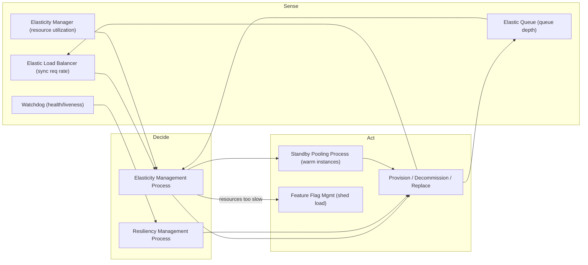
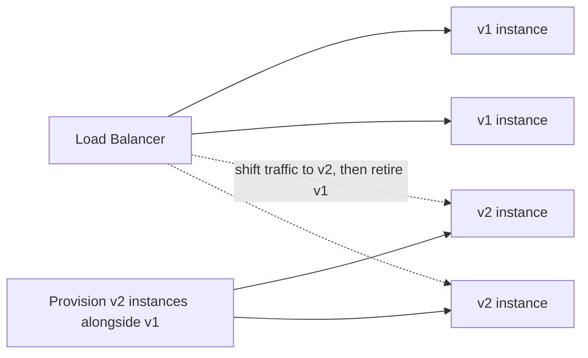
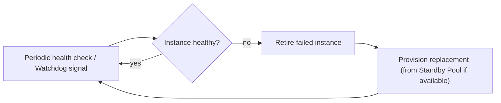

# Cloud Application Management: Elasticity & Resiliency Processes

This topic belongs to the **Cloud Computing Patterns** group (`ccp-*`), a vendor-neutral
pattern language from *Cloud Computing Patterns* (Fehling, Leymann, Retter, Schupeck &
Arbitter, Springer 2014; catalogued at
[cloudcomputingpatterns.org](https://www.cloudcomputingpatterns.org/)). These are the
**management / runtime-control** patterns: the *components* and *processes* that keep a
distributed cloud application portable, correctly configured, right-sized, and self-healing
while it runs. They are the abstract machinery underneath every cloud autoscaler,
health-check loop, and progressive-delivery pipeline — described independent of any one
provider.

> [!KEY-TAKEAWAY]
> Two shapes live here. **Runtime components** (Provider Adapter, Managed Configuration,
> Elasticity Manager, Elastic Load Balancer, Elastic Queue, Watchdog) are pieces of the
> running system. **Management processes** (Elasticity Management, Feature Flag Management,
> Update Transition, Standby Pooling, Resiliency Management) are the *control loops* that
> drive those components. Interviewers love the distinction: a component *senses and acts*;
> a process *decides and coordinates*.

> [!INTERVIEW]
> **Boundary / cross-reference note.** This library already deep-dives the mechanisms these
> patterns sit on top of. Here we stay at *pattern altitude* — intent, abstract solution,
> trade-off, vocabulary — and cross-reference the deep dives rather than repeating them:
> - Elasticity & load balancing internals → `system-design/scalability-and-load-balancing`
>   and `system-design/aws-load-balancing-elb-autoscaling`.
> - Queue-based load leveling / messaging → `system-design/message-queues-and-async` and
>   `system-design/aws-messaging-sqs-sns-eventbridge`.
> - Health checks, redundancy, failure detection → `system-design/resilience-tradeoffs-deep-dive`,
>   `system-design/failure-theory-advanced`, and `reliability-ops`.
> - Capacity / warm-pool / operational-elasticity *process* depth → `reliability-ops`.
> - Deployment strategies (blue-green, canary, rolling) → the DevOps `deployment-strategies` topic.

## The elasticity & resiliency control loop

Every pattern below is one organ of a single feedback loop: **sense → decide → act →
observe**. Sensors (LB request rate, queue depth, CPU) feed a decision process
(Elasticity / Resiliency Management), which acts on the running fleet (provision,
decommission, replace, reconfigure), which changes what the sensors see next.

---

## Provider Adapter

*Intuition:* a universal travel power adapter — your appliance (business logic) never
changes, you just swap the wall-side plug (the provider) to fit whatever socket the country
gives you.

**Intent — "How can the dependencies of an application component on a provider-specific
interface be managed?"**

**Problem / context.** Cloud providers expose many interfaces (compute, storage, queues,
identity). If a business component calls those interfaces directly, its code fuses
application logic with provider-specific authentication, data formats, and protocols —
producing lock-in and mixing concerns. Swapping providers, or running across two clouds,
then means rewriting business components.

**Solution.** Insert an **adapter layer** that wraps all provider-specific details behind a
**unified, abstract interface**. Business components talk only to the abstract interface;
the adapter handles auth, serialization, retries, and protocol quirks — and can even bridge
interaction styles (expose a message-based facade over a synchronous provider API or vice
versa). This enforces separation of concerns between *components that use provider
functionality* and *components that deliver application functionality*.

**Modern equivalent.** Cloud-portable abstraction layers: the CNCF **Open Service Broker**
and **Crossplane** provider model; **Terraform**/Pulumi provider plugins; libraries like
**Apache Libcloud** and **jclouds**; SDK-abstracting facades (e.g. Spring Cloud's
`*Template` abstractions, `Micronaut`/`Quarkus` cloud extensions). The Hexagonal /
Ports-and-Adapters and GoF **Adapter** patterns are the object-level realization.

**Trade-offs / when to use.** Buys **portability** and **testability** (mock the adapter),
at the cost of an abstraction that can hide provider-specific superpowers and add a
maintenance surface. Use when multi-cloud, exit-optionality, or clean testing matters;
skip when you have deliberately bet on one provider's differentiated services.

**Related patterns.** Data Access Component, Multi-Component Image, and every management
component in this topic (Managed Configuration, Elasticity Manager, Elastic Load Balancer,
Elastic Queue, Watchdog). *Deep dive:* provider-specific depth lives in the `aws-*` group
(e.g. `system-design/aws-migration-modernization`).

---

## Managed Configuration

**Intent — "How can the configuration of scaled-out application component instances be
controlled in a coordinated fashion?"**

**Problem / context.** Distributed components need configuration parameters. If settings are
**baked into the component image or binary**, every running instance — *and* every stored
image in an elastic environment — must be individually rebuilt/updated on any config change.
At scale that is slow, error-prone, and defeats the point of identical, interchangeable
instances.

**Solution.** Externalize configuration into **shared central storage** (relational DB,
key-value store, or blob storage). Instances **retrieve** their config from that central
source — either by **polling** on an interval or by receiving **push notifications** (a
message) when values change. One edit then adjusts the behavior of all instances uniformly,
without redeploying.

**Modern equivalent.** **Kubernetes ConfigMaps/Secrets**, **AWS AppConfig** and Systems
Manager Parameter Store, **Azure App Configuration**, **GCP Runtime Config**, **HashiCorp
Consul KV**, **Spring Cloud Config**, **etcd**. Feature-flag SaaS (LaunchDarkly, Unleash,
Flagsmith) is a specialized form.

**Trade-offs / when to use.** Central config enables uniform, hot changes and immutable
instances — but the config store becomes a dependency (and a potential blast radius: one
bad value can break the whole fleet). Prefer versioned, validated, gradually-rolled config;
combine push for latency with polling for resilience. Treat a config change with the **same
discipline as a code deploy**: schema-validate the value before it lands, **canary it to a
small percentage of instances** and watch health before fleet-wide rollout, and keep a
**fast rollback / kill-switch** to the last-known-good value. Skipping this is a classic
outage class — a single mistyped flag or bad value propagated instantly to every instance.

**Related patterns.** Blob Storage, Relational Database, Key-Value Storage,
Message-oriented Middleware, Provider Adapter, and the **Feature Flag Management Process**
(which is Managed Configuration used to toggle features). *Deep dive:* the config-store
mechanisms themselves are covered in `messaging-databases`.

---

## Elasticity Manager

**Intent — "How can the number of required application component instances be determined
based on the *utilization of hosting IT resources*?"**

**Problem / context.** Components on elastic infrastructure/platforms must add and remove
instances automatically as demand fluctuates. The question is *what signal* drives that
count. The Elasticity Manager answers: **resource utilization** of the hosting resources.

**Solution.** Monitor the utilization of the cloud resources that host the instances — CPU
load, memory, I/O, network — and compute the required instance count from those metrics.
This is the classic **utilization-driven autoscaler**.

**Modern equivalent.** **AWS EC2 Auto Scaling / target-tracking on CPU**, **Kubernetes
Horizontal Pod Autoscaler (HPA)** on CPU/memory, **Azure VM Scale Set autoscale**, **GCP
Managed Instance Group autoscaling**. All three sibling sensors (Elasticity Manager, Elastic
Load Balancer, Elastic Queue) can be combined as multiple scaling signals.

**Trade-offs / when to use.** Utilization is a good proxy for **CPU/memory-bound** work but
*lags* for I/O-bound or bursty request traffic (CPU rises only after latency already
suffered). For request-driven work prefer **Elastic Load Balancer**; for async work prefer
**Elastic Queue**.

**Related patterns.** Elastic Load Balancer, Elastic Queue, Elasticity Management Process,
Provider Adapter, Stateless Component. *Deep dive:*
`system-design/scalability-and-load-balancing`, `system-design/aws-load-balancing-elb-autoscaling`.

---

## Elastic Load Balancer

**Intent — "How can the number of required application component instances be determined
based on monitored *synchronous* accesses?"**

**Problem / context.** For request/response components, the **rate of synchronous requests**
is the most direct workload signal — often more responsive than lagging CPU utilization.

**Solution.** A **load balancer** both **distributes** incoming synchronous requests across
instances *and* **measures request volume**; that measurement (optionally combined with
utilization metrics) drives how many instances should run. Distribution + sensing in one
component.

**Modern equivalent.** **AWS ALB/NLB + target-tracking Auto Scaling on RequestCountPerTarget**,
**Azure Load Balancer / Application Gateway**, **GCP Cloud Load Balancing**, **Kubernetes
Service + Ingress** with request-based custom-metric HPA (via KEDA/Prometheus adapter).

**Trade-offs / when to use.** Best for **stateless, synchronous** components where requests
map cleanly to load. Requires instances to be **stateless** (or session state externalized)
so any instance can serve any request and can be added/removed freely. For asynchronous
workloads, use the Elastic Queue sibling instead.

**Related patterns.** Elasticity Management Process, **Stateless Component** (a prerequisite),
Watchdog, Provider Adapter. *Deep dive:* load-balancing algorithms, health checks, and
ELB/ASG specifics in `system-design/scalability-and-load-balancing` and
`system-design/aws-load-balancing-elb-autoscaling`.

---

## Elastic Queue

**Intent — "How can application component instances be scaled up or down based on monitored
*asynchronous* (message-based) accesses?"**

**Problem / context.** Components accessed **asynchronously** via a message queue must scale
automatically. The natural signal here is not CPU or request rate but **queue depth** — the
number of enqueued, not-yet-processed messages.

**Solution.** Monitor the message queue(s) distributing async requests among instances.
**Based on the number of enqueued messages, adjust the number of worker instances** handling
them. This is the pattern behind **queue-based load leveling**: the queue absorbs bursts and
the worker count tracks backlog. Because workers *pull* from the queue, adding/removing them
needs no reconfiguration of a load balancer.

**Modern equivalent.** **KEDA** scaling on **SQS / Kafka / RabbitMQ / Azure Service Bus /
GCP Pub/Sub** queue length; **AWS Lambda** event-source scaling on SQS/Kafka; ASG scaling on
`ApproximateNumberOfMessagesVisible`. Serverless "scale from a queue" is the archetype.

> [!TIP]
> **Worked example — worker count from queue depth.** Backlog is **10,000 messages** and your
> scaling policy targets **500 messages per worker** (the KEDA `queueLength` / SQS
> `ApproximateNumberOfMessagesVisible` target). Desired workers = `ceil(10,000 / 500) = 20`.
> If each worker drains **50 msg/s**, 20 workers clear `20 × 50 = 1000 msg/s`, so a static
> 10,000 backlog empties in `10,000 / 1000 = 10s`. Now suppose messages keep arriving at
> **600 msg/s**: net drain is `1000 − 600 = 400 msg/s`, so the backlog clears in
> `10,000 / 400 = 25s` instead — the same math tells you whether your target-per-worker keeps
> up with arrival rate or lets the queue grow unbounded (if arrivals ever exceed
> `workers × 50`, add workers or the backlog diverges).

**Trade-offs / when to use.** Ideal for **async, bursty, decoupled** processing where
latency tolerance lets a backlog form and drain. Requires **Stateless Component** workers and
ideally **idempotent** processing (at-least-once delivery). Not for low-latency synchronous
request paths — use Elastic Load Balancer there.

**Related patterns.** Elasticity Management Process, Stateless Component, Watchdog, Provider
Adapter, Message-oriented Middleware. *Deep dive:*
`system-design/message-queues-and-async`, `system-design/event-driven-cqrs-saga-cdc`,
`system-design/aws-messaging-sqs-sns-eventbridge`.

---

## Watchdog

*Intuition:* a hospital heart monitor — it watches for a flatline, then pages a nurse and
gets the patient swapped into a working bed. It *detects and triggers*; it does not itself
treat. The recovery decision loop around it is the Resiliency Management Process.

**Intent — "How can applications automatically detect failing application components and
handle their replacement?"**

**Problem / context.** In a distributed application, overall availability depends on each
instance staying healthy. Provider-guaranteed availability of a *single* resource is finite,
so high availability requires **redundant instances** plus a way to **detect failures and
recover without human intervention**.

**Solution.** Make components **stateless** (state held externally), run **redundant
instances**, and add a separate **Watchdog** component that **monitors those instances and
replaces them on failure**. The Watchdog is the *sensor + trigger* for recovery; it does not
itself hold application state.

**Modern equivalent.** **Kubernetes liveness/readiness probes + ReplicaSet self-healing**,
**AWS EC2 Auto Scaling health checks + ELB health checks**, **ECS/Nomad task health
monitoring**, systemd watchdog, Erlang/OTP supervisors, Akka supervision. The **watchdog
timer** in embedded systems is the ancestor.

**Trade-offs / when to use.** Automates recovery and is essential above trivial scale, but a
Watchdog only helps if components are **stateless/replaceable** and health checks are
*meaningful* (a shallow "process is up" check misses a hung app; a deep check can cause
false-positive restarts under load). It is the **component**; the **Resiliency Management
Process** is the surrounding decision loop.

**Related patterns.** Elasticity Manager, Elastic Load Balancer, **Resiliency Management
Process**, Transaction-based Processor, Timeout-based Message Processor, Idempotent
Processor, Stateless Component. *Deep dive:*
`system-design/resilience-tradeoffs-deep-dive`, `system-design/failure-theory-advanced`,
`reliability-ops` (redundancy).

---

## Elasticity Management Process

**Intent — "How can the number of resources used for scaling be adjusted to match current
*and expected* workload?"**

**Problem / context.** An application using Elasticity Managers, Elastic Queues, and/or
Elastic Load Balancers has *sensors*, but needs a **decision loop** that turns their signals
into provisioning/decommissioning actions — reliably, and ideally anticipating demand rather
than only reacting.

**Solution.** A management process **analyzes instance utilization at intervals** (on a
schedule, on-demand by an operator, or when a monitoring threshold fires), **derives current
(and forecast) workload**, and **adjusts resources** — adding instances as load rises,
removing them as it falls. It is the orchestrator over the elasticity *sensor* components.

**Modern equivalent.** The autoscaling *controller/policy* itself: **AWS Auto Scaling plans
+ predictive scaling**, **Kubernetes HPA/VPA/Cluster Autoscaler** and **KEDA** controllers,
scheduled scaling actions, **Azure autoscale rules**. Predictive/scheduled scaling realizes
the "expected workload" half.

> [!TIP]
> **Worked example — target-tracking math.** The most common policy computes
> `desired = ceil(current_instances × current_metric / target_metric)`. Target CPU is **50%**;
> right now **4 instances** average **75%** CPU. Desired = `ceil(4 × 0.75 / 0.50) = ceil(6.0)
> = 6`, so the process adds **2 instances**. After they warm up, the same total load spreads
> over 6 instances → `4 × 75% / 6 = 50%`, exactly the target, and the loop stops adding.
> Conversely, if load later falls so 6 instances sit at **30%**, desired =
> `ceil(6 × 0.30 / 0.50) = ceil(3.6) = 4` — scale *in* to 4. Notice how a metric hovering just
> above target (e.g. 51% → desired `ceil(4×0.51/0.50)=ceil(4.08)=5`) can trigger a scale-out
> that immediately drops utilization below target and invites a scale-in: that oscillation is
> **thrashing**, and it's exactly why you add cooldowns and a deadband around the target.

**Trade-offs / when to use.** Reactive-only scaling always trails a spike (provisioning
lag); combine with **scheduled/predictive** scaling and **Standby Pooling** to cover the lag.
Tune intervals and cooldowns to avoid **thrashing** (oscillating scale up/down).

**Related patterns.** Standby Pooling Process, Feature Flag Management Process, Update
Transition Process, Elastic Infrastructure/Platform, Stateless Component; drives the
Elasticity Manager / Elastic Load Balancer / Elastic Queue components. *Deep dive:*
operational-elasticity *process* depth in `reliability-ops`.

---

## Feature Flag Management Process

**Intent — "How can the performance of an application degrade *gracefully* if workload
increases but additional cloud resources are unavailable or take too long to provision?"**

**Problem / context.** Elasticity matches resources to demand, but **provisioning takes
time** and providers rarely guarantee provisioning *latency*. When a spike outruns the
autoscaler, the app must survive with the capacity it has rather than fall over.

**Solution.** Maintain **feature flags** (via Managed Configuration) that let the system
**disable non-critical functionality or swap it for a lighter-weight implementation** during
a resource shortage, preserving essential features. When capacity catches up, features are
re-enabled. This is graceful degradation / **load shedding by feature**, and the same
mechanism powers **progressive rollout** (turn features on for a fraction of traffic).

**Modern equivalent.** **LaunchDarkly, Unleash, Flagsmith, Split.io**, AWS AppConfig feature
flags, Azure App Configuration feature management, and framework flags (Spring `@ConditionalOnProperty`,
Togglz). Netflix-style "brownout" / graceful-degradation toggles are the canonical use —
*brownout* meaning deliberately degrading or disabling non-essential features under load, by
analogy with a power-grid voltage reduction that dims the lights instead of blacking out.

**Trade-offs / when to use.** Cheap, instant safety valve that needs **no new resources** —
but requires the app to be *designed* with optional/degradable features and disciplined flag
lifecycle management (stale flags become tech debt and risk). Distinguish it from
**Standby Pooling**, which prevents the shortage by keeping warm capacity; feature flags cope
*after* the shortage arrives.

**Related patterns.** **Managed Configuration** (its substrate), Multi-Component Image,
Standby Pooling Process. *Deep dive:* progressive-delivery mechanics in the DevOps
`deployment-strategies` topic.

---

## Update Transition Process

**Intent — "How can components of a distributed application be updated *without disrupting
service*?"**

**Problem / context.** While the application runs, new versions of the app components,
middleware, or OS are released. The old-to-new transition must happen with **no downtime**
and safe rollback.

**Solution.** **Build and provision the new version as *additional* instances that run
alongside the old ones.** For synchronous components, **switch load balancing to the
new-version instances**; for queue-based components, no rerouting is needed because workers
pull work independently — you simply start new-version workers. Once traffic flows to the
new instances and they are healthy, **decommission the old ones**. This is the abstract form
of **rolling / blue-green deployment**.

**Modern equivalent.** **Kubernetes rolling updates & Deployments**, **AWS CodeDeploy
blue-green**, ECS rolling/blue-green, **Argo Rollouts / Flagger** (canary + blue-green),
weighted DNS/ALB target-group shifting. Combine with **Feature Flag Management** for canary
by feature.

**Trade-offs / when to use.** Zero-downtime and easy rollback, but requires running **both
versions simultaneously** (extra cost, and both must be **backward/forward compatible** —
schemas, message formats, APIs). Stateless components make this trivial; stateful ones need
careful data migration. The concrete senior answer for schema changes is the
**expand/contract (parallel-change) pattern**: *expand* the schema with a nullable
column/optional field, *dual-write* old and new, *backfill* existing rows, *switch reads* to
the new field, then *contract* by dropping the old — each step is independently deployable and
reversible, and it's why you deploy the reader that tolerates the new field **before** the
writer that produces it.

**Related patterns.** **Stateless Component**, **Loose Coupling**, **Managed Configuration**,
Elasticity Management Process. *Deep dive:* blue-green/canary/rolling specifics in the DevOps
`deployment-strategies` topic.

---

## Standby Pooling Process

**Intent — "How can defined provisioning times be ensured while using pay-per-use resources
*optimally*?"**

**Problem / context.** The dominant, still-valid driver is **provisioning latency**:
provisioning/decommissioning takes time (image pull, boot, app warm-up), which hurts
applications with **sudden sharp spikes** because the autoscaler can't add capacity fast
enough. A secondary, now largely *historical* driver is **billing granularity**: in the
2014-era hourly-billing model, tearing an instance down the instant it went idle wasted a
time-slot you'd already paid for. That argument has weakened sharply — AWS moved EC2 (Linux)
and EBS to **per-second billing with a 1-minute minimum on 2 Oct 2017** (Windows and
separately-charged Linux distros excepted) — so today, boot-latency, not paid slots, is the
main reason to keep warm capacity.

**Solution.** Instead of terminating idle instances immediately, move them to a **standby
list** (a warm pool). Keep a **defined number** of instances on standby so demand spikes can
be met **instantly** by activating warm instances that skip the boot/warm-up delay. (Under the
original hourly-billing model you would also defer decommissioning until an instance's paid
time-slot was exhausted; with per-second billing that slot-utilization benefit is now minor.)
Trades a little idle cost for fast, guaranteed provisioning latency.

**Modern equivalent.** **AWS EC2 Auto Scaling *warm pools*** and Lambda **provisioned
concurrency** / SnapStart, **Kubernetes over-provisioning / cluster-autoscaler pause pods**,
GKE node warm pools, keeping a buffer of pre-pulled container images. Any "keep N warm
spares" strategy.

**Trade-offs / when to use.** Cuts scale-up latency — at the cost of **idle capacity spend**
(and, under per-second billing, you no longer recoup that spend through better slot
utilization). Right-size the pool to the expected spike magnitude and provisioning lag. Complements **Elasticity Management** (which decides counts) and
**Feature Flag Management** (the fallback when even warm capacity is exhausted).

> [!TIP]
> **Worked example — sizing the warm pool.** Say each instance serves **100 req/s** and a
> flash sale drives traffic from **200 → 800 req/s in 30s**. Steady state needs
> `800 / 100 = 8` instances; you were running `200 / 100 = 2`, so the spike demands **6 extra
> instances**. Cold boot (image pull + boot + app warm-up) is **90s**. A reactive autoscaler
> only *starts* those 6 when it sees the spike, so for ~90s you serve 800 req/s of demand with
> 2 instances' worth of capacity (200 req/s) — the other **600 req/s queue or error**. Keep
> **6 warm** on the standby list and they activate in seconds, absorbing the full jump
> instantly; the pool size is just "peak-minus-baseline instances," here `8 − 2 = 6`. Tie the
> pool size to the *spike magnitude you must survive without dropping traffic*, and refill it
> in the background afterward.

**Related patterns.** Multi-Component Image, Resiliency Management Process, Feature Flag
Management Process, Elasticity Management Process. *Deep dive:* capacity/warm-pool operational
depth in `reliability-ops`; workload/capacity modeling in
`system-design/capacity-modeling-and-tail-latency`.

---

## Resiliency Management Process

**Intent — "How can the overall availability of an application be ensured *automatically*
even if individual component instances fail?"**

**Problem / context.** The **Watchdog** provides the *ability* to monitor and react; this
process supplies the **coordinated decision loop** around it — verifying components function
correctly and replacing broken ones with freshly provisioned instances, all without human
involvement.

**Solution.** The process runs a **detect → recover loop**: it is triggered when monitoring
or a Watchdog reports a failure, *and* it proactively runs **periodic health checks** itself.
On a detected fault, the malfunctioning instance is **retired and replaced by a newly
provisioned one** automatically. It is the closed-loop counterpart, for *availability*, of
what the Elasticity Management Process is for *capacity*.

**Modern equivalent.** **Kubernetes controllers** reconciling desired vs actual replicas +
liveness probes, **AWS Auto Scaling health-check replacement** + EC2 auto-recovery,
self-healing service meshes, Erlang/OTP supervision trees. It pairs with **Standby Pooling**
so replacements come from a warm pool.

**Trade-offs / when to use.** Essential for hands-off high availability, but effective only
with **stateless/replaceable components**, meaningful health checks, and guards against
**replacement storms** (a systemic fault can trigger endless replace loops — combine with
backoff and circuit-breaking). Distinguish from **Elasticity Management Process**:
resiliency replaces *failed* instances (availability); elasticity changes the *count* to
match load (capacity).

**Related patterns.** **Watchdog** (its sensor), Stateless Component, Elasticity Management
Process, Standby Pooling Process. *Deep dive:*
`system-design/resilience-tradeoffs-deep-dive`, `system-design/failure-theory-advanced`,
and `reliability-ops`.

---

## Common Interview Follow-ups

- **"You have three autoscaling signals — CPU, request rate, queue depth. Which pattern owns
  each, and when do you pick which?"** Elasticity Manager (utilization) for CPU/memory-bound
  work; Elastic Load Balancer (sync request rate) for latency-sensitive request paths;
  Elastic Queue (queue depth) for async/batch. They are combinable, and the Elasticity
  Management Process arbitrates.
- **"Component vs process — give the pairing."** Watchdog (component) ↔ Resiliency Management
  Process (loop); Elasticity Manager/ELB/Elastic Queue (sensors) ↔ Elasticity Management
  Process (loop). The component senses/acts locally; the process decides/coordinates.
- **"Resiliency Management vs Elasticity Management — aren't both just 'add instances'?"** No:
  resiliency replaces *failed* instances to hold availability; elasticity changes the *count*
  to match workload. Different triggers, same actuator.
- **"A spike outruns your autoscaler. Two patterns to survive it?"** Standby Pooling (warm
  capacity to absorb the spike immediately) *and* Feature Flag Management (shed non-critical
  features to degrade gracefully when even that runs out).
- **"Deploy a new version with zero downtime — which pattern, and what does it require?"**
  Update Transition Process: run v2 alongside v1, shift LB traffic (or start new queue
  workers), retire v1 — requires stateless components and version compatibility.
- **"Why is Stateless Component a prerequisite for half of these?"** ELB, Elastic Queue,
  Watchdog, Resiliency and Update Transition all rely on instances being freely
  added/removed/replaced — only possible if state lives outside the instance.
- **"How do you avoid multi-cloud lock-in at the code level?"** Provider Adapter — a unified
  abstract interface wrapping provider APIs; trade differentiated features for portability.
- **"Config changed for 500 instances — how, without redeploy?"** Managed Configuration:
  central store + polling/push; one edit changes all instances uniformly.

## References

- Fehling, C., Leymann, F., Retter, R., Schupeck, W., & Arbitter, P. (2014). *Cloud Computing
  Patterns: Fundamentals to Design, Build, and Manage Cloud Applications.* Springer.
- Cloud Computing Patterns pattern catalogue — [cloudcomputingpatterns.org](https://www.cloudcomputingpatterns.org/):
  Provider Adapter, Managed Configuration, Elasticity Manager, Elastic Load Balancer, Elastic
  Queue, Watchdog, Elasticity Management Process, Feature Flag Management Process, Update
  Transition Process, Standby Pooling Process, Resiliency Management Process.
- AWS News Blog (2 Oct 2017), *Per-Second Billing for EC2 Instances and EBS Volumes* —
  [aws.amazon.com/blogs/aws/new-per-second-billing-for-ec2-instances-and-ebs-volumes](https://aws.amazon.com/blogs/aws/new-per-second-billing-for-ec2-instances-and-ebs-volumes/)
  (per-second billing, 1-minute minimum; Windows and separately-charged Linux distros excepted).
- Cross-references (this library): `system-design/scalability-and-load-balancing`,
  `system-design/aws-load-balancing-elb-autoscaling`, `system-design/message-queues-and-async`,
  `system-design/aws-messaging-sqs-sns-eventbridge`, `system-design/resilience-tradeoffs-deep-dive`,
  `system-design/failure-theory-advanced`, `system-design/capacity-modeling-and-tail-latency`,
  `reliability-ops`, and the DevOps `deployment-strategies` topic.
