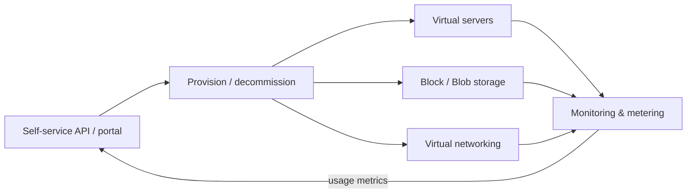
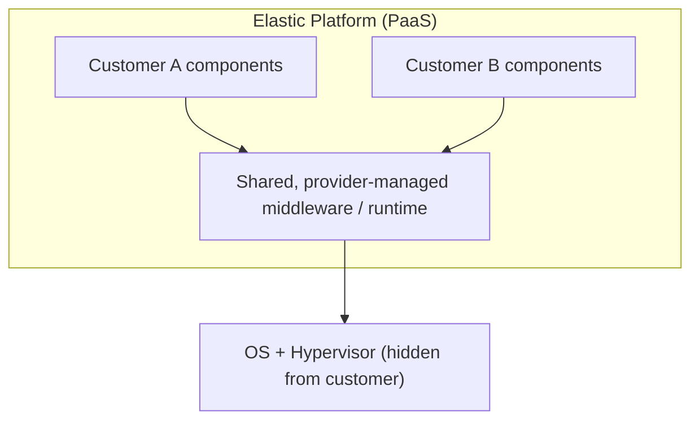
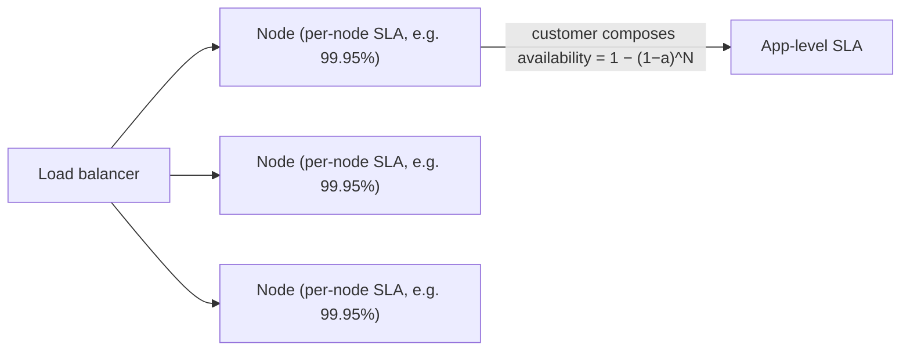
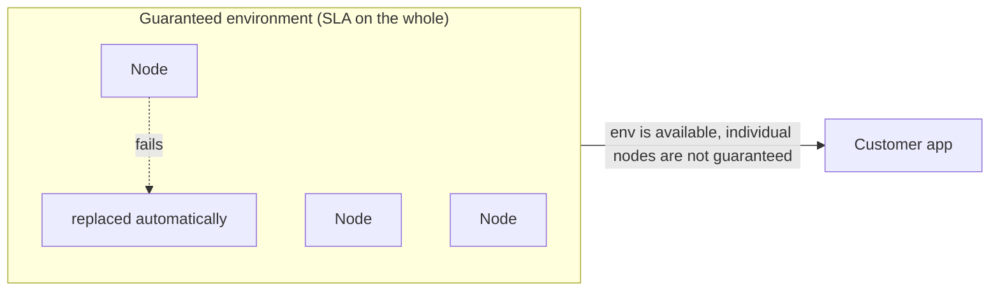
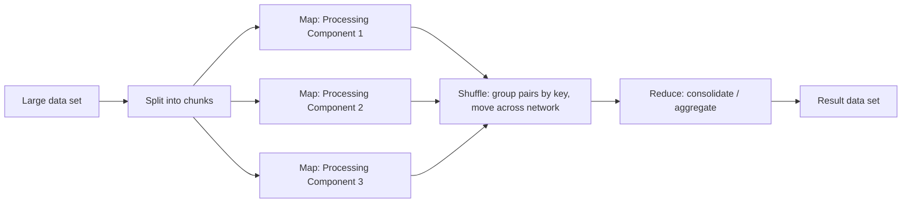

# Cloud Offerings: Compute, Elasticity & Processing

Part of the **Cloud Computing Patterns** group (`ccp-`), a vendor-neutral,
technology-independent pattern language from *Cloud Computing Patterns* by Fehling,
Leymann, Retter, Schupeck & Arbitter (Springer, 2014), catalogued at
[cloudcomputingpatterns.org](https://www.cloudcomputingpatterns.org/). These are the
**abstract** compute/elasticity offering patterns that underpin cloud-native design
regardless of provider — the substrate that IaaS/PaaS, autoscaling, virtualization and
big-data processing are all instances of.

This topic covers the *Cloud Offerings* patterns that describe **compute**: how providers
package elastic infrastructure and platforms, how they express availability, how hardware is
virtualized and runtimes are shared, and how large-scale data processing scales out.

> [!KEY-TAKEAWAY]
> The exam-relevant distinctions in this topic are all *sibling pairs*: **Elastic
> Infrastructure vs Elastic Platform** (IaaS vs PaaS altitude), **Node-based vs
> Environment-based Availability** (per-node SLA vs whole-environment SLA), and **Hypervisor
> vs Execution Environment** (virtualized hardware vs shared managed runtime). Map Reduce is
> the odd one out: a *processing* pattern for scaling data work.

**Boundary note — cross-reference, do NOT expect deep dives here.** This library already
owns the deep mechanism/scenario treatment elsewhere. This topic gives the *pattern-level*
intent/solution/trade-off and the pattern vocabulary, then points you out:

- Elasticity control loops, autoscaling, load balancing → `scalability-and-load-balancing`
- Capacity/workload modeling, tail latency → `capacity-modeling-and-tail-latency`
- Provider-specific compute (EC2/ASG, Fargate) → `aws-load-balancing-elb-autoscaling`
- Map Reduce / big-data internals, streaming → `realtime-streaming-systems`, `aws` analytics
- Operational resilience/elasticity *process* → `reliability-ops`

---

## Elastic Infrastructure

**Intent (guiding question).** *"How do Cloud offerings providing infrastructure resources
behave and how should they be used in applications?"* In one line: expose raw compute,
storage and network as **programmatically provisioned** virtual resources so applications can
scale resource counts up and down on demand.

**Problem / context.** Applications face varying demand — periodic, once-in-a-lifetime,
unpredictable, or continuously changing. To match cost to load, the number of provisioned
servers, disks and network connections must change *on the fly*, not through a purchase order.
This is the **IaaS** altitude: the customer still owns the OS, middleware and application.

**Solution (abstract mechanism).** An elastic infrastructure supplies **preconfigured
virtual server images, storage and network connectivity** provisioned by the customer through
a **self-service interface** (API/portal). Critically, it also **exposes monitoring data** on
resource usage — this is what enables traceable billing *and* automated management (the
sensor half of any autoscaling loop). The provider handles the physical hardware, power and
the [Hypervisor](#hypervisor); the customer scripts provisioning and decommissioning.

**Modern equivalent.** AWS EC2 + EBS/VPC + Auto Scaling Groups; Azure Virtual Machines +
Managed Disks + VNet + VM Scale Sets; GCP Compute Engine + Persistent Disk + VPC + Managed
Instance Groups. The self-service API is the cloud SDK/CLI; the monitoring feed is
CloudWatch / Azure Monitor / Cloud Monitoring.

**Trade-offs / when to use.** Maximum control and portability — you run any OS/stack — but
**you** are responsible for patching, configuration, and building the scaling automation on
top. Choose it when you need OS-level control, custom kernels, or lift-and-shift of existing
VMs. If you don't want to manage the OS/runtime, prefer [Elastic Platform](#elastic-platform).

**Related patterns.** [Hypervisor](#hypervisor) (how the virtual servers are realized),
[Node-based Availability](#node-based-availability) / [Environment-based
Availability](#environment-based-availability) (how its SLA is expressed), Elasticity Manager
/ Watchdog (automation built on the monitoring feed).
**Deep dive:** autoscaling & load balancing → `scalability-and-load-balancing`;
provider-specific → `aws-load-balancing-elb-autoscaling`.

---

## Elastic Platform

**Intent (guiding question).** *"How do Cloud offerings providing execution environments
behave and how should they be used in applications?"* In one line: the provider manages the
OS **and** middleware/runtime; the customer deploys only application components onto a shared,
elastic runtime.

**Problem / context.** A core cloud principle is **pooling resources across many customers**
for economies of scale. Extending that sharing *up the stack* — beyond hardware to the OS and
middleware — raises utilization further. But that requires a unified, provider-maintained
runtime that customers deploy code into without touching the servers underneath. This is the
**PaaS** altitude.

**Solution (abstract mechanism).** The provider hosts and maintains shared middleware — an
[Execution Environment](#execution-environment) — onto which different customers **deploy
custom application components via a self-service interface**. The provider handles
provisioning, elastic scaling of runtime instances, patching and update management; the
customer handles only their code. Scaling is often *automatic* and driven by the platform, not
scripted by the customer.

**Modern equivalent.** AWS Elastic Beanstalk / App Runner / Fargate / Lambda; Azure App
Service / Container Apps / Functions; GCP App Engine / Cloud Run / Cloud Functions; plus
platform layers like Heroku, Cloud Foundry, and (self-hosted) Kubernetes as an elastic
platform.

**Trade-offs / when to use.** Far less operational burden and higher density/utilization, but
**less control** (fixed language runtimes, limited OS access) and greater risk of
**provider lock-in** to the platform's programming model. Choose it for greenfield apps that
fit a supported runtime and want to avoid managing servers. If you need OS control or arbitrary
software, drop to [Elastic Infrastructure](#elastic-infrastructure).

**Related patterns.** [Execution Environment](#execution-environment) (what the platform
hosts components in), [Elastic Infrastructure](#elastic-infrastructure) (the lower-altitude
sibling), Message-oriented Middleware / storage offerings (provided *as* platform services),
[Map Reduce](#map-reduce) (a processing capability often offered on platforms).
**Deep dive:** `scalability-and-load-balancing`; multi-customer sharing →
`multi-tenancy-and-saas-isolation`.

---

## Node-based Availability

**Intent (guiding question).** *"How can providers express availability in a node-centric
fashion, so that customers may estimate the availability of hosted applications?"*

**Problem / context.** When a provider offers an [Elastic Infrastructure](#elastic-infrastructure)
or [Elastic Platform](#elastic-platform), it must communicate an availability guarantee in a
form the customer can use to compute the reliability of their *own* application. That requires
defining both **what counts as available** and **the timeframe** the guarantee covers.

**Solution (abstract mechanism).** The provider guarantees availability of **each individual
node** (virtual server / component instance). A node is *available* if it is **reachable and
performs its function as advertised** (correct results). The SLA is a percentage over the
hosting period — e.g. **99.95%** means the individual component is up 99.95% of the time.
Because the guarantee attaches to the node itself, the customer must **add their own redundancy
math** (multiple nodes, failover) to reach a higher application-level availability.

**Modern equivalent.** The single-instance EC2 SLA / a per-VM SLA (e.g. Azure's single-VM SLA
that requires premium disks); any offering where the SLA is stated *per resource*. You
typically then run N nodes behind a load balancer to multiply availability.

**Trade-offs / when to use.** Precise and easy to reason about per node, but the customer
carries the burden of composing many nodes into a resilient system. Contrast with
[Environment-based Availability](#environment-based-availability), where the *platform* owns
that composition.

> [!INTERVIEW]
> *"Your nodes are 99.95% available. How many do you need behind a load balancer for four
> nines?"* This is the canonical follow-up — here is the math.
>
> **One node.** Availability `a = 99.95%` → unavailability `1 − a = 0.0005`. Downtime =
> `0.0005 × 8760 h/yr = 4.38 h/yr`.
>
> **N independent nodes, service is up if ≥1 is up.** The service is *down* only when *all* N
> fail at once, so availability = `1 − (1 − a)^N`.
>
> - **N = 2:** `1 − (0.0005)² = 1 − 0.00000025 = 99.999975%` → downtime ≈ `0.00000025 × 8760 h
>   ≈ 7.9 s/yr`.
>
> **"Four nines" (99.99%)** allows `0.0001 × 8760 = 0.876 h/yr ≈ 52.6 min/yr` of downtime. One
> node (`0.0005`) blows the budget; two nodes (`0.00000025`) beat it by a wide margin — so
> **N = 2 is enough**, and it actually clears *five* nines.
>
> **The caveat that earns the point:** this assumes *independent* failures. Two VMs in the same
> AZ, on the same rack, or sharing one power/network domain fail *together* — correlated
> failure collapses `(1−a)^N` back toward `1−a`. That is the whole reason you spread the N nodes
> across AZs. Environment-based availability hides this composition from you; here it is your job.

**Related patterns.** Watchdog (detects unavailable nodes), Resiliency Management Process,
[Environment-based Availability](#environment-based-availability) (the sibling model).
**Deep dive:** composing availability, failure math → `resilience-tradeoffs-deep-dive`,
`failure-theory-advanced`.

---

## Environment-based Availability

**Intent (guiding question).** *"How can providers express availability in an
environment-centric fashion, so that customers may estimate the availability of hosted
applications?"*

**Problem / context.** Same need — express an SLA a customer can plan against — but for
offerings where the customer deploys into a managed *environment* and does not care which
individual node runs their code. Guaranteeing per-node uptime would be meaningless when the
platform freely replaces instances.

**Solution (abstract mechanism).** The provider guarantees availability of the **hosting
environment as a whole**, not of any individual node. It assures that **at least one instance**
of a virtual server / component is provisioned and that **failed instances are automatically
replaced**. As the pattern states, *"there is no notion of availability for individual
application components or virtual servers deployed in this environment."* The customer sees a
continuously-available environment; churn of underlying nodes is invisible.

**Modern equivalent.** PaaS/serverless SLAs stated on the *service*: AWS Lambda / Fargate /
App Runner, Azure App Service / Functions, GCP Cloud Run / App Engine, and multi-instance/AZ
SLAs (e.g. an SLA that requires ≥2 VMs in an availability set / across AZs). Kubernetes
Deployments with a desired replica count embody the same idea: pods are cattle, the *service*
stays up.

**Trade-offs / when to use.** The platform absorbs redundancy and self-healing, so the
customer builds less failover machinery — but you **cannot pin availability to a specific
node**, and you inherit the platform's replacement/cold-start behavior. Choose it with
stateless, horizontally scalable components (see Stateless Component). Contrast with
[Node-based Availability](#node-based-availability), where the SLA is per node and redundancy
is the customer's job.

**Gotcha the SLA does not cover.** An environment SLA guarantees the *service* stays up — not
that any individual *in-flight request* survives a node replacement. When the platform kills
and replaces a node, requests it was serving are dropped mid-flight; the SLA is satisfied
because a replacement instance is already up. That is why this model pairs with **stateless
components + client retries**: a retried request just lands on a healthy node. Stateful or
sticky-session workloads get *no* protection from the environment SLA and still need explicit
failover (session replication, external state). And aggressive scale-to-zero has a price:
**cold-start latency** on the next request while the platform provisions a fresh instance.

**Related patterns.** Public Cloud, Watchdog, Resiliency Management Process, Stateless
Component, [Node-based Availability](#node-based-availability) (the sibling model).
**Deep dive:** `resilience-tradeoffs-deep-dive`; operational process → `reliability-ops`.

---

## Hypervisor

**Intent (guiding question).** *"How can virtual hardware that has been abstracted from
physical hardware be used in applications?"*

**Problem / context.** Running several applications on one physical server forces them to
account for one another — competing for the same ports, directories, CPU and memory — which is
fragile and hard to isolate. The goal is to **simplify sharing of physical hardware** while
reducing each application's dependence on a specific server.

**Solution (abstract mechanism).** A **hypervisor** virtualizes a physical server's resources
(CPU, memory, disk, network) into multiple **virtual servers**, each running its own OS and
middleware. Applications on different VMs are **isolated from each other** in their use of the
physical hardware. Because a VM is just an image + config, provisioning and decommissioning are
fast — which is exactly what makes [Elastic Infrastructure](#elastic-infrastructure) possible.
This is the foundational *virtualization* pattern.

**Modern equivalent.** **Type-1 (bare-metal)** hypervisors run directly on the hardware with
no host OS underneath — Xen and AWS Nitro (EC2), Microsoft Hyper-V (Azure), KVM (GCP,
OpenStack), VMware ESXi. **Type-2 (hosted)** hypervisors run as an app *on top of* a normal OS
— VirtualBox, VMware Workstation — adding a layer of overhead. Cloud providers use Type-1
everywhere because the extra host-OS layer of Type-2 costs performance and enlarges the attack
surface on a machine you rent to strangers. Note the modern *sibling* mechanisms the book
predates: **containers** (Docker/`runc`, shared-kernel OS-level virtualization) and
**microVMs** (AWS Firecracker) trade some isolation for far faster startup and higher density.

**What isolation containers give up (the senior probe).** A hypervisor gives each VM its own
kernel, so a guest-kernel compromise stays trapped in that VM. **Containers share the host
kernel** — so a kernel exploit escapes the container boundary onto the host and its neighbors,
and a busy container can starve neighbors of shared-kernel resources (the "noisy neighbor").
That larger blast radius is exactly why multi-tenant serverless (AWS Lambda, Fargate) runs each
workload inside a **microVM** (Firecracker): near-container startup speed with a real
per-tenant kernel boundary.

**Trade-offs / when to use.** Strong isolation and OS flexibility (any guest OS), at the cost
of per-VM OS overhead and slower startup than containers. It is a provider-side building block
you rarely choose directly today; you choose the offering (VMs vs containers vs functions) it
enables. Contrast with [Execution Environment](#execution-environment), which shares a *runtime*
above the OS rather than virtualizing *hardware* below it.

**Related patterns.** [Elastic Infrastructure](#elastic-infrastructure) (built on it),
[Elastic Platform](#elastic-platform), [Execution Environment](#execution-environment)
(the higher-altitude sharing sibling).

---

## Execution Environment

**Intent (guiding question).** *"How can multiple application components share a hosting
environment efficiently?"* — i.e. provide reusable platform functionality so components don't
each reimplement common capabilities.

**Problem / context.** Applications repeatedly need the same supporting capabilities —
networking, storage access, messaging, UI hosting. If every application implements its own
version, effort is duplicated and resources used inefficiently. On an
[Elastic Platform](#elastic-platform), the provider wants a common runtime that hosts many
customers' components and supplies these shared services.

**Solution (abstract mechanism).** Summarize the common functionality into an **Execution
Environment** that exposes it through **platform libraries** and hosts the custom application
components. Components deployed into it get storage, communication (via Message-oriented
Middleware), and other services *from the environment* instead of building them. This is the
managed **runtime/container** an Elastic Platform hosts your code in.

**Why this is a separate pattern from Elastic Platform.** They are two altitudes of the same
stack, not duplicates. *Elastic Platform* is the **commercial offering**: the elasticity, the
billing, the SLA, the "deploy code and we scale it" promise. *Execution Environment* is the
**concrete shared runtime** — the language runtime plus platform libraries — that lives *inside*
that offering and actually hosts a component. The split matters because one platform can expose
**several** execution environments: AWS Lambda (one Elastic Platform) offers Node.js, Python,
Java, and Go runtimes; App Engine offers standard and flexible environments. You pick the
*platform* for its elasticity/SLA and the *execution environment* for the language/lifecycle your
code needs.

**Modern equivalent.** A language/app runtime managed by the platform: the JVM/servlet
container in a PaaS, the Node/Python runtime in AWS Lambda / Azure Functions / Cloud Functions,
the App Engine / App Service runtime, or a container runtime + base image + sidecar services on
Kubernetes. Platform SDKs (the cloud client libraries) are the modern "platform libraries."

**Trade-offs / when to use.** Big reuse and productivity win, but components must **conform to
the environment's model** (supported languages, APIs, lifecycle) — the source of PaaS lock-in.
Distinguish it from the [Hypervisor](#hypervisor): the hypervisor virtualizes *hardware* (below
the OS); the execution environment shares a *runtime* (above the OS).

**Related patterns.** [Elastic Platform](#elastic-platform) (offers it), [Hypervisor](#hypervisor)
(the lower-altitude sibling), Stateless Component / Message-oriented Middleware (components and
services hosted in it).
**Deep dive:** runtime/broker internals → `messaging-databases`.

---

## Map Reduce

**Intent (guiding question).** *"How can the performance of complex processing of large data
sets be increased through scaling out?"*

**Problem / context.** Cloud applications must process huge data volumes efficiently. Since
distributed applications scale *out* (more instances) rather than *up*, the data-processing work
should also be spread across many component instances — and their partial outputs later
**consolidated** into a single result.

**Solution (abstract mechanism).** Split the large data set into chunks and **map** each chunk
to a Processing Component that runs the same query in parallel — ideally **where the data lives**
(data locality), moving computation to data rather than data to computation. The partial
outputs are then **reduced**: consolidated into one result set, optionally applying aggregate
operations (sum, average, count) during the merge. A controller distributes work, tracks
Processing Components, and re-issues failed chunks.

**Worked example — word count on 3 chunks.** Input text split into 3 chunks (10 tokens
total):

- Chunk 1: `"the cat the dog"` → mapper emits `(the,1) (cat,1) (the,1) (dog,1)`
- Chunk 2: `"the cat sat"` → mapper emits `(the,1) (cat,1) (sat,1)`
- Chunk 3: `"the the dog"` → mapper emits `(the,1) (the,1) (dog,1)`

**Shuffle** groups every pair by key across the reducers (all `the`s to one reducer, all
`cat`s to another, …):

- `the → [1,1,1,1,1]`, `cat → [1,1]`, `dog → [1,1]`, `sat → [1]`

**Reduce** sums each group: `the=5, cat=2, dog=2, sat=1` (checks out: `5+2+2+1 = 10`).

**Why shuffle is the bottleneck — skew made concrete.** First, name the terms. The **shuffle**
is the middle step that moves every `(key, value)` pair from the mappers *across the network* to
the reducer that owns that key — it is the only all-to-all data movement in the job, which is
why it dominates cost. **Skew** = an uneven key distribution, where a few keys hold most of the
values so the pairs pile onto a handful of reducers instead of spreading evenly. A **straggler**
is one task that runs far longer than its peers; because a reduce phase is not finished until its
*slowest* reducer finishes, a single straggler gates the whole job's completion time.

Now make it concrete. Notice `the` already pulled 5 of the 10 pairs onto one reducer. Imagine a
real corpus where a stopword like `the` is ~90% of tokens: with 1 B tokens, the `the` reducer
receives ~900 M pairs over the network while every other reducer sees a sliver. That one reducer
becomes the straggler — everyone else finishes in seconds and idles while it grinds through
900 M pairs, and its inbound shuffle traffic saturates the network. (Fixes: a **combiner** that
pre-sums each mapper's local pairs *before* the shuffle — e.g. chunk 1's two `the`s collapse to a
single local `(the, 2)`, and every mapper likewise ships just one `the` pair instead of thousands,
so ~900 M pairs shrink to one per mapper (final summed to 5 only at the reducer); or *salting* the
hot key — split `the` into `the#0…the#7` across 8 reducers, then sum the sub-totals in a second
pass.)

**Modern equivalent.** Apache Hadoop MapReduce and its managed forms — AWS EMR, GCP Dataproc,
Azure HDInsight — plus the successors that generalize the same map/shuffle/reduce idea: Apache
Spark, Google Dataflow / Apache Beam, and query engines like Presto/Trino, AWS Athena and
BigQuery. Serverless fan-out (Lambda/step functions over sharded input) applies the pattern at
smaller scale.

**Trade-offs / when to use.** Excellent for **embarrassingly parallel, batch** analytics over
large immutable data with data locality — *embarrassingly parallel* meaning the chunks need no
cross-talk during the map phase, so you can throw N machines at N chunks with near-linear
speedup. You gain that horizontal scale-out; you give up latency (a job pays fixed
split/schedule/shuffle overhead) and pay for the network-heavy shuffle. It is overkill and
high-latency for small data or for low-latency/streaming needs — use stream processing instead
when results must be continuous rather than per-batch. The decision flips on **data size and
freshness**: choose Map Reduce when the data is large, immutable, and a minutes-to-hours batch is
acceptable; avoid it when the data is small enough to fit one machine or answers are needed in
sub-second time. Watch the reduce/shuffle step: it is often the bottleneck and the straggler/skew
risk described above.

**Related patterns.** Watchdog (re-issues failed Processing Components), Message-oriented
Middleware (distributes work), Transaction-based Processor, [Elastic Platform](#elastic-platform)
(often offers Map Reduce as a service).
**Deep dive:** streaming vs batch, big-data internals → `realtime-streaming-systems` and the
`aws` analytics topics.

---

## Common Interview Follow-ups

- **"Elastic Infrastructure vs Elastic Platform — which and why?"** IaaS vs PaaS altitude: EI
  gives you the OS and you build scaling/patching; EP manages the runtime and you deploy only
  code. Choose EP for productivity/density, EI for control/portability.
- **"Node-based vs Environment-based availability — what's the difference and why does it
  matter?"** Node-based = SLA per individual node; *you* compose redundancy. Environment-based =
  SLA on the whole environment with automatic replacement; there is *no* per-node guarantee. It
  changes who owns failover.
- **"How does a Hypervisor differ from an Execution Environment?"** Hypervisor virtualizes
  *hardware* below the OS (multiple guest OSes, strong isolation). Execution Environment shares a
  *runtime* above the OS (platform libraries, hosts components). Containers/microVMs sit between.
- **"Why is the monitoring feed part of Elastic Infrastructure and not an add-on?"** Because
  metered usage is what enables billing *and* is the sensor input for any autoscaling control
  loop — without it there is no elasticity.
- **"Where does Map Reduce fit and when is it the wrong tool?"** Batch, embarrassingly-parallel
  analytics with data locality. Wrong for small data or low-latency/streaming — use stream
  processing.
- **"Do containers/serverless make the Hypervisor pattern obsolete?"** No — they are alternative
  *virtualization/runtime* mechanisms (OS-level virtualization, microVMs) realizing the same
  goals of isolation + fast provisioning; hypervisors still underpin most of them.

## References

- Fehling, C., Leymann, F., Retter, R., Schupeck, W., Arbitter, P. *Cloud Computing Patterns:
  Fundamentals to Design, Build, and Manage Cloud Applications.* Springer, 2014.
- Pattern catalog: [cloudcomputingpatterns.org](https://www.cloudcomputingpatterns.org/) —
  Elastic Infrastructure, Elastic Platform, Node-based Availability, Environment-based
  Availability, Hypervisor, Execution Environment, Map Reduce.
- Cross-references in this library: `scalability-and-load-balancing`,
  `capacity-modeling-and-tail-latency`, `resilience-tradeoffs-deep-dive`,
  `multi-tenancy-and-saas-isolation`, `realtime-streaming-systems`,
  `aws-load-balancing-elb-autoscaling`.
