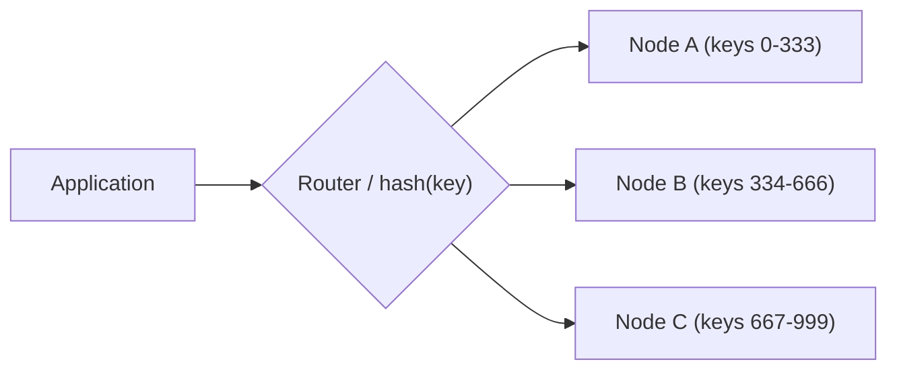
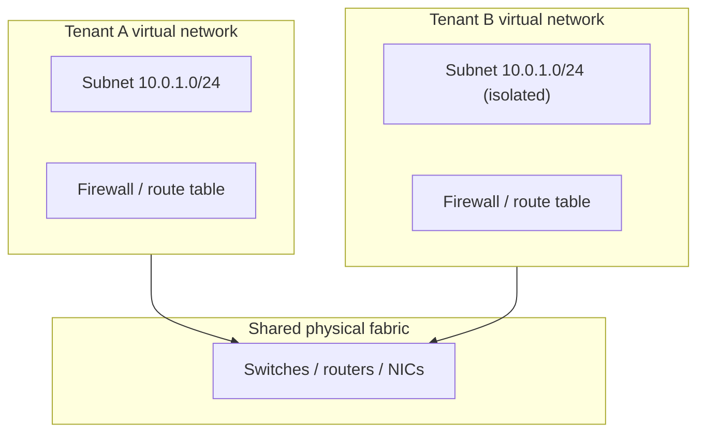
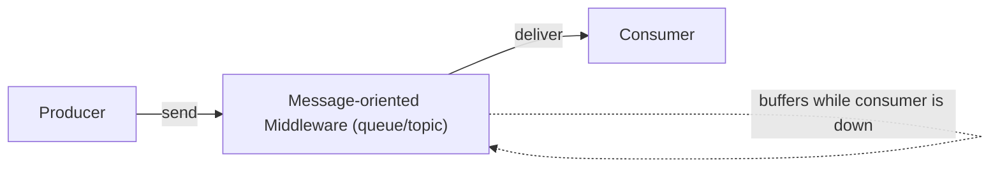
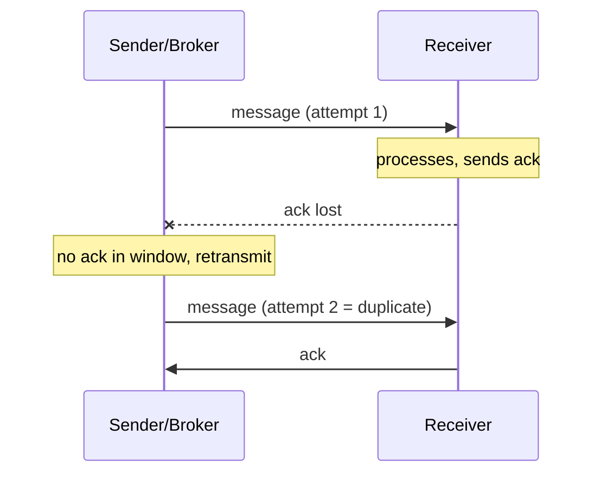
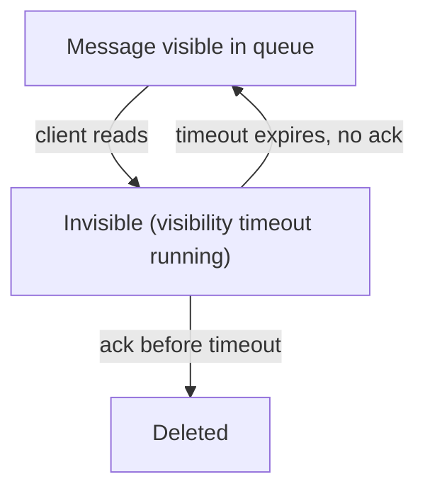

# Cloud Offerings: Storage, Data & Communication

This topic is part of the **Cloud Computing Patterns** group (`ccp-`), based on
*Cloud Computing Patterns* by Fehling, Leymann, Retter, Schupeck & Arbitter
(Springer, 2014), catalogued at
[cloudcomputingpatterns.org](https://www.cloudcomputingpatterns.org/). These are
**vendor-neutral, technology-independent** patterns: the abstract solutions that
underpin cloud-native storage, data management, and messaging regardless of which
provider (AWS, Azure, GCP, or on-prem) you use. Each pattern below is taught the way
the book does — the **intent** (a "How can…?" question), the **problem/context**, the
abstract **solution**, a **modern equivalent** across clouds, **trade-offs**, and
**related patterns** — then cross-referenced to the deep-dive topics that already own
the mechanism internals.

> [!INTERVIEW]
> These offering patterns give you a precise vocabulary for the *first* question of
> most storage/messaging design discussions: "what kind of store/broker is this, and
> what does it guarantee?" Knowing the pattern name (Blob vs Block, Strict vs Eventual,
> Exactly-once vs At-least-once vs Timeout-based delivery) lets you reason about
> trade-offs *before* you name a product.

**Cross-reference boundary (do not re-derive here).** This library already has deep
coverage of the underlying mechanisms. This topic stays at **pattern altitude** and
points to the deep dives:

- Data-model internals (relational vs key-value, sharding, replication):
  `system-design/databases-sql-nosql-sharding-replication`
- Consistency spectrum and the CAP derivation:
  `system-design/cap-theorem-and-consistency`
- Messaging delivery internals, ordering, async patterns:
  `system-design/message-queues-and-async` and
  `system-design/event-driven-cqrs-saga-cdc`
- Provider-specific storage/messaging depth:
  `system-design/aws-storage-*`, `system-design/aws-messaging-sqs-sns-eventbridge`

---

## Block Storage

**Intent.** *How can central storage be accessed as a local drive by servers and
hosted applications?*

**Problem / context.** IaaS servers are far easier to manage when they keep no state on
their own (virtual) local disks — statelessness streamlines provisioning,
decommissioning, and failure recovery. But operating systems and many applications
expect to read and write a normal, mountable disk with a local file system.

**Mental model.** Think of block storage as a **hard drive you rent from the cloud and
plug into one machine**: the disk itself lives in the datacenter, but from the server's
point of view it is just `/dev/xvdf`, formatted and mounted like any physical drive.

**Solution.** A centralized storage resource is presented to a server *as if it were a
locally attached hard disk* — a **block device**. The OS formats it, mounts it, and
accesses it through the local file system exactly as it would a physical disk, while
the actual bytes live on centralized, network-attached storage. Because it is
network-attached, the volume can outlive and be detached/reattached to different
servers.

**Modern equivalent.** AWS Elastic Block Store (EBS); Azure Managed Disks; Google
Persistent Disk / Hyperdisk; on-prem SAN / iSCSI / Fibre Channel LUNs. Kubernetes
`PersistentVolume` backed by a block CSI driver is the same idea.

**Trade-offs / when to use.** Best for a *single* server needing low-latency,
random-access, POSIX-style disk semantics: databases, boot volumes, file systems that
need `fsync`. A block volume is normally attached to **one** instance at a time (some
offerings add limited multi-attach), so it does not by itself solve shared,
massively-parallel access — that is Blob Storage's job. It is billed for provisioned
capacity whether used or not.

The reason you **can't run a database on blob storage** comes down to the *access unit*:
block storage lets you read and write **small byte ranges at an arbitrary offset in
place** (overwrite bytes 4096–8191 of a volume and `fsync` just that change) — exactly
what a database's page writes and write-ahead log need. Blob storage has no in-place
edit: to change one byte you must **replace the whole object by key**. A DB flushing a
single 8 KB page would have to rewrite an entire multi-megabyte object every time, so the
random small-write workload that databases live on is simply not expressible.

**Related patterns.** Blob Storage (sibling storage offering), Stateless Component
(block volumes let you keep compute stateless), Strict Consistency / Eventual
Consistency (the guarantee the block store provides), Environment-based Availability.

---

## Blob Storage

**Intent.** *How can large files be stored, organized, and made available over a
network?*

**Problem / context.** Cloud applications spread across many components frequently must
handle large binary objects — **b**inary **l**arge **ob**jects (blobs): server images,
photos, videos, backups, logs, static assets. These do not need relational query
power; they need to be stored durably and fetched by name over the network from any
component.

**Mental model.** Blob storage is a **valet coat-check**: you hand over a whole object
and get back a **claim ticket** (the key). To get the object you present the ticket and
receive the whole thing back — you never reach into the coat pocket to change one item
in place. To alter anything you take the whole coat and check in a new one.

**Solution.** Files are arranged in a **directory-like hierarchy** resembling a file
system. Each file gets a **unique identifier** built from its position in the folder
hierarchy plus its filename (the "key"). Applications pass that identifier to an
**elastic storage offering** to store or retrieve the whole object over the network.
Access is by key, not by query — there is no partial in-place editing of arbitrary
bytes the way a block device allows.

> [!TIP]
> The folder hierarchy in most object stores is *conceptual* — the key is a flat string
> that merely *looks* like a path (`images/2024/cat.jpg`). There are no real
> directories to traverse, which is exactly why it scales.

**Modern equivalent.** Amazon S3; Azure Blob Storage; Google Cloud Storage (GCS);
MinIO / Ceph RADOS Gateway (self-hosted, S3-compatible). Object stores are the backing
tier for data lakes, static-site hosting, and CDN origins.

**Trade-offs / when to use.** Choose Blob Storage for large, whole-object, write-once /
read-many data accessed concurrently by many clients over HTTP(S) — cheap, effectively
unbounded, highly durable. It is **not** a disk (you can't mount it and run a database
on it) and offers only object-granularity operations, no rich queries or transactions.
Be precise about which layer is eventual: **single-region** object reads on modern
object stores are **strongly consistent** (Amazon S3 has provided strong
read-after-write consistency for all single-object operations within a bucket since
December 2020). It is the **asynchronous cross-region / multi-region replication** layer
(S3 Cross-Region Replication, GCS multi-region) that is Eventual — a copy written in one
Region takes time to appear in the replica Region. So "eventual" here describes the
replication step, not a plain read in the bucket you just wrote to.

**Related patterns.** Block Storage (sibling; disk vs object), Data Access Component,
Stateless Component, Strict / Eventual Consistency.

**Deep dive:** provider object-store depth in `system-design/aws-storage-s3-*`.

---

## Relational Database

**Intent.** *How can data elements be stored so that relationships among them are
captured and expressive queries are enabled to retrieve required information
effectively?*

**Problem / context.** Applications manage many similar data elements that depend on
one another. Clients issuing queries rely on assumptions about the **consistency of the
relations** between the elements they retrieve — a stored order must point to a real
customer, an invoice line to a real product.

**Solution.** Data is organized into **tables**; each column represents an attribute of
a data element. Some columns reference values that must exist in another table's column
(**foreign keys**), and these cross-table dependencies are validated and maintained
**during data manipulation**. A schema plus a declarative query language (SQL) lets
clients express rich joins, filters, and aggregations, and the engine enforces
referential integrity and (typically) ACID transactions.

**Modern equivalent.** Amazon RDS / Aurora; Azure SQL Database; Google Cloud SQL /
AlloyDB; self-managed PostgreSQL / MySQL / SQL Server. Distributed "NewSQL" offerings
(Spanner, CockroachDB, Aurora DSQL) keep the relational contract while scaling out.

**Trade-offs / when to use.** Choose it when relationships, ad-hoc queries, and strong
transactional integrity matter more than raw horizontal scale — OLTP systems,
financial records, anything needing joins and constraints. The cost is that enforcing a
fixed schema and cross-table integrity is expensive to **scale out**: it typically
wants strong (Strict) consistency and coordinated replicas, which limits how far you
can partition. That scaling pressure is exactly what Key-Value Storage relaxes.

**Related patterns.** Key-Value Storage (the scale-out sibling), Stateless Component,
Data Access Component, Strict / Eventual Consistency.

**Deep dive:** relational vs NoSQL data models, sharding, replication in
`system-design/databases-sql-nosql-sharding-replication`.

---

## Key-Value Storage

**Intent.** *How can key-value elements be stored to support scale-out and an
adjustable data structure?*

**Problem / context.** For availability and performance, storage should be spread across
many IT resources and locations. But shifting requirements and shared, multi-tenant
usage demand a **flexible** structure. Enforcing rigid schema validation and cross-table
integrity during queries would force expensive high-performance connectivity between
distributed resources — the opposite of scale-out.

**Solution.** Data is stored as **(key, value) pairs** with little or no schema. Query
expressiveness is *deliberately sacrificed* to gain scalability and configurability.
Because a lookup targets a single key, requests can be routed to the one node holding
that key without contacting many resources — so the store partitions and scales out
horizontally. Values are opaque or semi-structured; the schema lives in the
application.

**Modern equivalent.** Amazon DynamoDB; Azure Cosmos DB (table/key-value API); Google
Cloud Bigtable / Firestore; Redis, Riak, Cassandra (wide-column is a superset).

**Trade-offs / when to use.** Choose it for massive scale, high write throughput,
flexible/evolving records, and access dominated by key lookups (sessions, user
profiles, shopping carts, feature flags). The price is **no joins, limited ad-hoc
querying, and often Eventual Consistency** by default; integrity and relationships must
be handled in application code. Pairs naturally with Map-Reduce for batch analysis over
the values.

**Related patterns.** Relational Database (the query-rich sibling), Map-Reduce, Data
Access Component, Strict / Eventual Consistency.

**Deep dive:** NoSQL data models, partitioning, and replication in
`system-design/databases-sql-nosql-sharding-replication`.

---

## Strict Consistency

**Intent.** *How can data be distributed among replicas to increase availability while
ensuring data consistency at all times?*

**Problem / context.** Storage replicates data across multiple copies so that if one is
lost, data can still be recovered from the others. The challenge is keeping that
redundancy without letting replicas diverge — a client that just wrote a value expects
to read it back, from any replica.

**Mental model.** Picture two overlapping guest lists. The write list names the replicas
that must confirm a new value; the read list names the replicas you ask when reading. If
you require the two lists to be big enough that they **always share at least one common
name**, then whoever you read is guaranteed to include someone who witnessed the latest
write — so you can never miss it. That "must share a name" property is the quorum overlap.

**Solution.** Data is duplicated across `n` replicas, and each read touches `r` replicas
while each write touches `w` replicas. Consistency is guaranteed by a **quorum overlap
rule**: choose `r` and `w` so that the read set and write set always intersect — the
book states this as `r + w > n`. Because every read quorum overlaps the latest write
quorum by at least one replica, a read always sees the most recent write.

**Worked example — why overlap guarantees freshness (`n=3`).** Pick `w=2, r=2`. Check
the rule: `w + r = 2 + 2 = 4 > 3 = n` ✓. Now trace it with three replicas `{A, B, C}`:

1. **Write** `x=42` with `w=2`: the coordinator writes to `{A, B}` and waits for **both**
   acks before returning success. `C` has not been updated yet (it will get `x=42`
   asynchronously, or on the next write quorum that includes it).
2. **Read** with `r=2`: suppose the read hits `{B, C}`. The read set `{B, C}` and the
   write set `{A, B}` **must share at least one node** — here it is `B` — because two
   2-node subsets of a 3-node set cannot be disjoint (2 + 2 = 4 > 3, so by pigeonhole
   they overlap). `B` holds `x=42`, so the read sees the newest value even though `C` is
   stale. The client picks the value with the highest version among the replicas it read.

Every possible read pair — `{A,B}`, `{A,C}`, `{B,C}` — intersects the write set `{A,B}`,
so **no read can miss the write.** Contrast the latency cost: this read and write each
block on **2 of 3** acks, versus Eventual Consistency's single ack below.

> [!KEY-TAKEAWAY]
> Strict Consistency is bought with **coordination**: reads and writes must reach an
> overlapping quorum of replicas. That coordination costs latency and, during a network
> partition, availability. This is the CAP trade-off made concrete at the storage-offering
> level.

**Modern equivalent.** DynamoDB *strongly consistent reads*; quorum writes/reads in
Cassandra (`QUORUM` at `R+W>N`); etcd / ZooKeeper (Raft/ZAB); Google Spanner
(TrueTime + Paxos); relational DBs with synchronous replicas.

**Trade-offs / when to use.** Use when correctness on every read is non-negotiable —
balances, inventory counts, locks, config that must not be stale. Cost: higher latency,
reduced availability during partitions, lower throughput. Its counterpart, Eventual
Consistency, trades that guarantee for speed and availability.

**Gotcha — overlap is not linearizability.** `r + w > n` guarantees a read *intersects
the latest completed write* — that is read-your-writes / freshness, not full
linearizability. It does **not** by itself order *concurrent* writes: two clients writing
at the same time can each satisfy a partial quorum and produce conflicting versions. To
make writes safe you also need a **write majority** (`w > n/2`, so two write quorums can't
be disjoint) plus a conflict-ordering mechanism (version numbers, timestamps, vector
clocks). Dynamo-style quorums give you overlap, not consensus. True linearizability comes
from consensus protocols — Spanner (Paxos + TrueTime), etcd/ZooKeeper (Raft/ZAB) — which
is strictly stronger than bare quorum overlap.

**Related patterns.** Eventual Consistency (the trade-off counterpart), and the four
storage offerings (Block, Blob, Relational, Key-Value) that expose one guarantee or the
other.

**Deep dive:** the full consistency spectrum and CAP derivation live in
`system-design/cap-theorem-and-consistency` — do not re-derive CAP here.

---

## Eventual Consistency

**Intent.** *How can data be distributed among replicas with a focus on increased
availability and performance, while being resilient toward connectivity problems?*

**Problem / context.** Replication is essential for resiliency, but keeping every
replica synchronized on every operation is expensive, because reads and writes must
reach many or all replicas. Under a network partition, insisting on that synchronization
means refusing requests.

**Solution.** **Relax** the consistency requirement so that reads and writes touch
*fewer* replicas (the quorum overlap rule is not satisfied — `r + w <= n`). Updates are
then **propagated asynchronously** to the remaining replicas over time. Replicas may be
briefly out of sync, but in the absence of new writes they *converge* to the same
value. Conflicts are reconciled later (last-writer-wins, vector clocks, CRDTs, etc.).

**Worked example — the stale read the overlap rule allows (`n=3`).** Pick `w=1, r=1`.
Check: `w + r = 1 + 1 = 2 <= 3 = n`, so the overlap rule is **violated** on purpose.
Trace it on `{A, B, C}`:

1. **Write** `x=42` with `w=1`: the coordinator writes only to `A` and returns success
   immediately after **one** ack. `B` and `C` still hold the old value.
2. **Read** with `r=1` from `C` (before async propagation reaches it): `C` returns the
   **stale** value — the read set `{C}` and write set `{A}` are disjoint, so nothing
   forces them to intersect. The client never sees `x=42` on this read.
3. Milliseconds later, background replication (anti-entropy / hinted handoff) copies
   `x=42` to `B` and `C`. Now every replica agrees — the system has **converged**, and a
   later read from any node returns `42`.

The payoff is latency: this write blocked on **1** ack and the read on **1**, versus
`2 + 2` under Strict Consistency above — but the window between steps 2 and 3 is exactly
when a client can read stale data.

**Modern equivalent.** DynamoDB *eventually consistent reads* (the default); Cassandra
at `ONE`/`LOCAL_ONE`; S3/GCS cross-region replication; DNS; CDN edge caches; Riak.

**Trade-offs / when to use.** Use when availability, low latency, and partition
resilience matter more than reading the very latest value — social feeds, view counts,
product catalogs, caches, cross-region reads. Cost: clients may read stale data and the
application must tolerate/reconcile conflicts. Choose Strict Consistency instead when
staleness is unacceptable.

**Related patterns.** Strict Consistency (the counterpart), and the four storage
offerings that can be configured for either guarantee.

**Deep dive:** consistency levels, read-your-writes, monotonic reads, and CAP in
`system-design/cap-theorem-and-consistency`.

---

## Virtual Networking

*This is the **Communication** substrate of the topic: every messaging pattern later in
this file — brokers, queues, delivery guarantees — rides on top of the virtual network
set up here. Storage gives you the "where," consistency the "how correct," and the
network the "how they talk."*

**Intent.** *How can network connectivity between cloud-hosted IT resources be set up
dynamically and on-demand?*

**Problem / context.** Components on Elastic Infrastructures and Platforms depend on
physical networking hardware (NICs, switches, routers) to talk to each other and the
outside world. A core challenge in a shared, multi-tenant cloud is **isolating**
different customers from one another at the network layer, while still letting each one
define its own topology.

**Solution.** Physical networking components are **virtualized** — turned into virtual
NICs, switches, routers, and firewalls that can *share the same physical networking
resources*. Customers configure their own isolated networks (address ranges, subnets,
routing, firewall rules, remote access/VPN) through **self-service** interfaces, and the
cloud enforces isolation via software-defined networking underneath.

**Modern equivalent.** AWS VPC (with subnets, security groups, NACLs, PrivateLink);
Azure Virtual Network (VNet + NSGs); Google VPC; overlay networks like VXLAN and
Kubernetes CNI plugins (Calico, Cilium). Note the two tenants above can use *identical*
private CIDR ranges because the overlay isolates them.

**Trade-offs / when to use.** Virtual Networking is foundational for any multi-tenant
or hybrid deployment: on-demand topology, tenant isolation, private connectivity, and
hybrid links to on-prem. The trade-off is an added abstraction layer (overlay
encapsulation overhead, more configuration surface) and the fact that isolation is
enforced in software rather than by physical separation.

**Related patterns.** Elastic Infrastructure, Hypervisor (both virtualize the compute
side), and it underpins multi-tenancy.

**Deep dive:** tenant isolation models in
`system-design/multi-tenancy-and-saas-isolation`; provider network depth in the
`aws-*` group.

---

## Message-oriented Middleware

**Intent.** *How can communication partners exchange data asynchronously with one
another?*

**Problem / context.** Components of a distributed application run across many cloud
resources and must communicate — and often integrate with other cloud applications and
non-cloud systems too. Direct synchronous calls tightly couple partners: both must be
available at the same time, must agree on address and format, and a slow receiver
blocks the sender.

**Solution.** Partners communicate **asynchronously through messages**, and a broker
(the middleware) sits between them and *handles the complexity of addressing,
availability of communication partners, and message-format transformation*. The sender
hands a message to the middleware and moves on; the middleware routes, buffers, and
delivers it to the receiver whenever the receiver is ready. This decouples partners in
**time** (they need not be up simultaneously), **space** (they need not know each
other's address), and **format**.

**Modern equivalent.** Amazon SQS / SNS / EventBridge; Azure Service Bus / Event Grid;
Google Pub/Sub; Apache Kafka; RabbitMQ / ActiveMQ; NATS. The *guarantees* these brokers
offer are exactly the four delivery patterns below.

**Trade-offs / when to use.** Use for loose coupling, load leveling (buffering bursts),
and integration across heterogeneous systems. Cost: added infrastructure, eventual
(not immediate) delivery, and the need to reason explicitly about **delivery
guarantees** and **ordering** — which is why the middleware is always paired with one
of the delivery patterns.

**Related patterns.** At-least-once Delivery, Exactly-once Delivery, Transaction-based
Delivery, Timeout-based Delivery (the four delivery guarantees), and the messaging
processor patterns.

**Deep dive:** queue mechanics, ordering, backpressure, and async patterns in
`system-design/message-queues-and-async` and `system-design/event-driven-cqrs-saga-cdc`.

---

## Delivery Guarantee versus Ordering Guarantee

**Why this is a separate axis.** New readers routinely conflate two independent
questions: *"will the message arrive (and how many times)?"* — the **delivery guarantee**
(at-least-once, exactly-once, etc.) — and *"in what order will messages arrive?"* — the
**ordering guarantee**. They are orthogonal. A queue can be at-least-once but unordered
(SQS standard), or at-least-once *and* strictly ordered (SQS FIFO). Neither implies the
other, and an interviewer often probes ordering right after you name a delivery semantic.

**Three ordering levels, from strongest to loosest:**

- **Global / total order** — every consumer sees *all* messages in one single sequence.
  Simple to reason about but a scalability trap: only *one* consumer can advance the
  single sequence at a time, so throughput is capped at what one consumer can process.
- **Per-key / per-partition order** — messages that share a routing key are ordered
  relative to each other, but different keys are independent and can be processed in
  parallel. This is the sweet spot: you keep the ordering you actually need (all events
  for `order-123` in sequence) while scaling horizontally across keys.
- **Best-effort / no order** — the broker makes no promise; maximum throughput and the
  default for high-volume systems where each message is self-contained.

**Worked example — why strict ordering caps parallelism.** Say a partition holds
messages `[m1, m2, m3, m4]` and each takes 100 ms to process. Under **strict per-partition
order**, a consumer must finish `m1` before starting `m2` (otherwise `m2` could commit
first and violate order), so the four messages take `4 × 100 ms = 400 ms` on **one**
consumer — adding a second consumer to that partition buys you nothing. Now suppose the
four messages belong to **four different keys**. Route each key to its own partition and
four consumers process all four in parallel in `~100 ms` — a 4× speedup — because ordering
only needs to hold *within* a key, not across keys. That is the ordering-vs-throughput
trade-off: **you buy parallelism by narrowing the scope over which order must hold.**

**How real brokers give you scalable partial order.** Kafka orders messages **within a
partition**; you pick the partition with a **partition key** (e.g. `orderId`), so all
events for one order stay ordered while different orders spread across partitions and
consumers. SQS **FIFO** does the same with a **MessageGroupId**: strict order *within* a
group, parallel delivery *across* groups. In both, the number of independent keys/groups
is your ceiling on consumer parallelism — few groups means little parallelism, many
groups means you scale out but only get *partial* (per-group) ordering, never a global
one for free.

**Interviewer follow-up.** If you say "SQS FIFO for ordering," expect *"what does that
cost you?"* Answer: throughput and parallelism — FIFO serializes per message-group, and a
single hot group becomes a bottleneck. If you only need per-entity order, key by that
entity so unrelated entities still process concurrently.

---

## Exactly-once Delivery

**Intent.** *How can it be assured that a message is delivered exactly once to a
receiver?*

**Reading note.** Exactly-once is defined below as **at-least-once + deduplication**, so
it builds on the next pattern. If you are reading top-to-bottom, skim **At-least-once
Delivery** (the next section) first — it explains the ack-and-retransmit loop that
exactly-once layers dedup on top of.

**Problem / context.** In distributed messaging, duplicates are a very critical design
issue. Some receivers cannot tolerate processing the same message twice — e.g.
"charge the card" or "ship the order" must not happen twice.

**Solution.** Each message is assigned a **unique message identifier** when it is
created. As the message travels from sender to receiver, the messaging system uses that
identifier to **detect and filter duplicates automatically** — so even if the message
is transmitted multiple times (due to retries), only one copy is actually delivered to
the receiver. Exactly-once is thus **at-least-once + deduplication**.

> [!WARNING]
> True end-to-end exactly-once is *hard* and expensive: it requires the broker to keep
> a dedup window of seen IDs and often coordination that hurts throughput and
> availability. In practice most systems implement **at-least-once delivery + an
> idempotent consumer**, which achieves exactly-once *effect* without exactly-once
> transport. Kafka's "exactly-once" is scoped to consume-transform-produce within
> Kafka, not arbitrary side effects.

**Modern equivalent.** SQS FIFO queues (content-based dedup within a 5-minute window);
Azure Service Bus duplicate detection; Kafka idempotent producer + transactions
(EOS). The universal fallback is the **Idempotent Processor** pattern on the consumer
side.

**Trade-offs / when to use.** Use when duplicates are genuinely unsafe and you cannot
make the consumer idempotent. Cost: lowest throughput, bounded dedup windows, and
usually a stricter (often FIFO/ordered) configuration. If the consumer *can* be made
idempotent, prefer At-least-once + Idempotent Processor.

**Related patterns.** Message-oriented Middleware, At-least-once Delivery, Idempotent
Processor, Transaction-based Delivery.

---

## At-least-once Delivery

**Intent.** *How can communication partners or a Message-oriented Middleware ensure that
messages are received successfully?*

**Problem / context.** Failures cause message loss or slow recovery. This pattern
targets scenarios where receiving **duplicates is not harmful** but *losing* a message
is. The priority is guaranteeing arrival, even if that means some messages arrive more
than once.

**Solution.** The receiver sends an **acknowledgement** for each message it successfully
retrieves. If the sender (or broker) does not receive the ack within an expected time
window, it **retransmits** the message. This retry loop guarantees every message is
delivered at least once — but a lost *ack* (rather than a lost message) causes a
duplicate delivery.

**Modern equivalent.** SQS standard queues; Kafka default consumer semantics; most
brokers at their default acknowledgement mode; TCP retransmission is the same idea at
the transport layer.

**Trade-offs / when to use.** The pragmatic default for most systems: cheap, high
throughput, no message loss. The cost is **duplicates**, so the consumer must be made
**idempotent** (dedupe on a business key, use conditional writes, or make the operation
naturally repeatable). Pair with the Idempotent Processor pattern.

**Related patterns.** Idempotent Processor (handles the duplicate side effect),
Timeout-based Delivery (the redelivery timing), Exactly-once Delivery (the stricter
sibling), Message-oriented Middleware.

**Deep dive:** idempotency keys and delivery-semantics details in
`system-design/message-queues-and-async`.

---

## Transaction-based Delivery

**Intent.** *How can it be ensured that messages are deleted from a message queue only
if they have been received successfully?*

**Problem / context.** The middleware manages messages in transit, but you also need to
guarantee that a consuming client *actually* received (and can process) a message before
it is removed from the queue. If the message were deleted the moment it was read and the
client then crashed, the message would be lost.

**Solution.** The middleware and the consuming client jointly enter a **transaction**.
All reception operations are performed under **one transactional context with ACID
behavior**: reading the message and deleting it from the queue are a single atomic unit.

- If the client receives (and, in the extended form, processes) the message
  successfully, the transaction **commits** and the message is removed.
- If reception fails, the transaction **rolls back** and the message stays in the queue
  for another attempt.

Often the message-receive transaction is joined with the client's *own* work (e.g. a
database write) in a distributed transaction, so the message is consumed **iff** the
work commits.

**Modern equivalent.** JMS transacted sessions; Azure Service Bus
`ReceiveMode.PeekLock` with transaction scope; Kafka read-process-write transactions
(`isolation.level=read_committed`); XA / two-phase commit across a broker and a
database.

**Trade-offs / when to use.** Use when consume-and-process must be all-or-nothing and
you have a transactional resource manager to enlist. Cost: distributed transactions are
expensive and can hurt availability/throughput; not all brokers or side effects can
participate. Timeout-based Delivery is a lighter-weight alternative that gives
at-least-once without full ACID.

**Related patterns.** Transaction-based Processor (the processing-side counterpart),
Exactly-once Delivery, Message-oriented Middleware.

---

## Timeout-based Delivery

**Intent.** *How can it be ensured that messages are deleted from a message queue only
if they have been received successfully at least once — without a distributed
transaction?*

**Problem / context.** You still want the guarantee that a message is not lost if a
client crashes mid-processing, but joining the broker into an ACID transaction (as
Transaction-based Delivery does) is heavyweight and not always possible.

**Solution.** Instead of deleting a message when a client reads it, the message is
**retained but marked invisible** for a bounded window (the **visibility timeout**):

1. A client reads a message; the message immediately becomes **invisible** to others.
2. While invisible, **no other client can read it**, preventing concurrent duplicate
   processing.
3. If the client finishes successfully within the window, it sends an
   **acknowledgement** and the message is **deleted**.
4. If the timeout elapses with no ack (client crashed or stalled), the message becomes
   **visible again** and is **redelivered** to another client.

**Worked example — the tuning tension (visibility timeout = 30s).** Two scenarios on the
same queue with the timeout set to 30s:

- **Slow-but-alive consumer (duplicate).** Consumer C1 reads message `M` at `t=0`; `M`
  goes invisible with a 30s deadline. But C1's job actually takes **45s**. At `t=30s` the
  deadline expires with no ack, so `M` becomes visible again and consumer C2 picks it up
  and starts processing — while C1 is *still working*. Now `M` is processed **twice**
  (once by C1 finishing at `t=45s`, once by C2). This is why the consumer must be
  **idempotent**, and why SQS lets you extend the deadline mid-flight
  (`ChangeMessageVisibility`) for long jobs.
- **Crashed consumer (safe recovery, no loss).** Consumer C1 reads `M` at `t=0` and
  **crashes at `t=10s`** without acking. `M` stays invisible until the deadline; at
  `t=30s` it reappears and C2 reprocesses it cleanly. The message was never lost — the
  timeout *is* the recovery mechanism.

The tension: 30s was **too short** for the 45s job (premature redelivery → duplicate) but
you can't just crank it to, say, 15 minutes, because then the crash case wastes ~15
minutes before recovery. Tune to just above the P99 processing time, extend for
outliers, and lean on idempotency for the rest. (SQS default is 30s; max is 12h.)

> [!KEY-TAKEAWAY]
> Timeout-based Delivery gives **at-least-once** semantics with no distributed
> transaction: a crash simply lets the timeout redeliver the message. The price is that
> a slow-but-alive consumer can exceed the timeout and cause a **duplicate**, so
> consumers must still be **idempotent**. This is the model behind SQS.

**Modern equivalent.** Amazon SQS **visibility timeout** (the canonical example); Azure
Service Bus peek-lock with lock duration; Google Pub/Sub ack deadline; RabbitMQ
consumer acknowledgements with requeue-on-nack.

**Trade-offs / when to use.** The practical, scalable default for at-least-once
queue processing without XA. Cost: choosing the timeout is a tuning problem — too short
causes premature redelivery of in-flight work (duplicates); too long delays recovery
after a real crash. Combine with idempotent consumers and a dead-letter queue for
poison messages.

**Related patterns.** Timeout-based Message Processor (processing-side counterpart),
At-least-once Delivery, Idempotent Processor, Transaction-based Delivery (the ACID
alternative), Message-oriented Middleware.

---

## Common Interview Follow-ups

- **"Block vs Blob storage — when would you pick each?"** Block for a single server
  needing a mountable, low-latency, random-access disk (database, boot volume); Blob for
  large whole objects fetched by key over the network by many clients (media, backups,
  static assets, data-lake files).
- **"Relational vs Key-Value — what's the real trade-off?"** Relational buys rich
  queries, joins, and enforced referential integrity at the cost of scale-out;
  Key-Value buys horizontal scale and schema flexibility by sacrificing query
  expressiveness and pushing integrity into the application.
- **"Explain Strict vs Eventual Consistency without invoking CAP jargon."** Strict:
  read and write quorums overlap (`r + w > n`) so every read sees the latest write —
  costs latency/availability. Eventual: fewer replicas touched, updates propagate
  asynchronously and converge — fast and available but reads can be stale.
- **"Give me the four delivery guarantees and when each is achievable."** At-least-once
  (ack + retransmit; duplicates possible — needs idempotency); Exactly-once
  (at-least-once + dedup by unique message ID; hard/expensive); Transaction-based
  (consume under ACID, commit iff processing succeeds; needs a transactional resource);
  Timeout-based (visibility-timeout redelivery; at-least-once without XA — the SQS
  model).
- **"Why is 'exactly-once' usually a lie?"** End-to-end exactly-once transport is
  extremely costly; almost everyone implements at-least-once + an idempotent consumer to
  get exactly-once *effect*.
- **"How does an idempotent consumer let you use a weaker guarantee?"** If processing the
  same message twice yields the same result (dedupe on a business key, conditional
  writes), duplicates from at-least-once/timeout-based delivery become harmless, so you
  avoid the cost of exactly-once or transactional delivery.
- **"Why can two tenants use the same private CIDR range?"** Virtual Networking overlays
  isolate tenants in software over shared physical hardware, so their address spaces
  never collide.

## References

- Christoph Fehling, Frank Leymann, Ralph Retter, Walter Schupeck, Peter Arbitter.
  *Cloud Computing Patterns: Fundamentals to Design, Build, and Manage Cloud
  Applications.* Springer, 2014.
- Pattern catalogue: [cloudcomputingpatterns.org](https://www.cloudcomputingpatterns.org/)
  — Block Storage, Blob Storage, Relational Database, Key-Value Storage, Strict
  Consistency, Eventual Consistency, Virtual Networking, Message-oriented Middleware,
  Exactly-once / At-least-once / Transaction-based / Timeout-based Delivery.
- Cross-references: `system-design/cap-theorem-and-consistency`,
  `system-design/databases-sql-nosql-sharding-replication`,
  `system-design/message-queues-and-async`,
  `system-design/event-driven-cqrs-saga-cdc`,
  `system-design/multi-tenancy-and-saas-isolation`.
