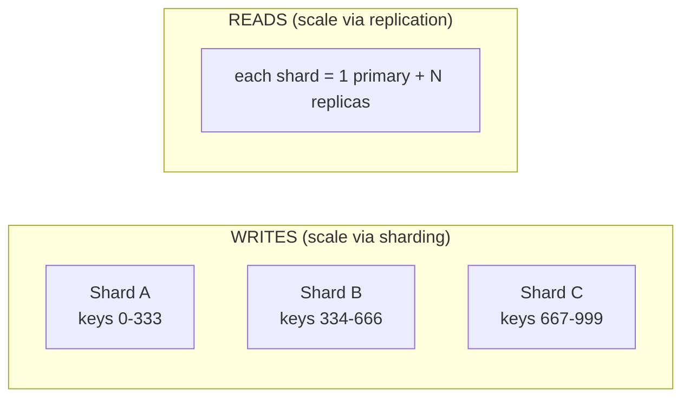

# Databases: SQL vs NoSQL, Indexing, Sharding and Replication

> How you store, index, partition, and replicate data is usually the single
> highest-leverage decision in a system-design interview: it dictates your
> consistency guarantees, your latency floor, your failure blast radius, and your
> cost curve. This topic is fundamentally about **trade-offs** — there is no
> "best" database, only the right one for a set of constraints (scale, latency
> budget, consistency need, access pattern, team, budget). Interviewers probe
> whether you can reason from *access patterns* to a data model, then defend that
> choice against the alternatives.

---

## Relational databases and the relational model

**Intuition.** A relational database stores data as tables (relations) of rows
and columns with a fixed schema, enforced types, foreign keys, and a query
planner that lets you express *what* you want (SQL) rather than *how* to fetch
it. The engine figures out the access path (index scan, join order).

**How it works.** Data lives in pages (typically 8 KB in Postgres, 16 KB in
InnoDB) on disk, indexed by B+trees. A cost-based optimizer uses table
statistics (row counts, histograms) to choose join algorithms (nested loop, hash
join, merge join) and index usage. A write-ahead log (WAL / redo log) makes
changes durable and crash-recoverable before pages are flushed.

**Real-world usage.** Postgres, MySQL/InnoDB, Oracle, SQL Server. The default for
OLTP systems: financial ledgers, orders, inventory, user accounts, anything with
invariants ("balance never negative", "one seat per booking"). A single
well-tuned Postgres node on modern hardware handles tens of thousands of simple
QPS and low-hundreds-of-GB to a few TB comfortably before you must scale out.

**Trade-offs.**
- **Gain:** Strong consistency, ACID transactions, flexible ad-hoc querying,
  joins, mature tooling, referential integrity, decades of operational knowledge.
- **Give up:** Horizontal write scaling is hard — a single primary bounds write
  throughput; schema changes on huge tables can be painful; joins across a
  sharded relational DB are expensive.
- **When to pick:** Data is relational and you need transactional integrity or
  rich queries, and your write volume fits (or shards cleanly onto) a bounded set
  of primaries. This is the correct *default* — reach for NoSQL only when a
  specific constraint forces it.

---

## NoSQL data models: document, key-value, wide-column, graph

**Intuition.** "NoSQL" is an umbrella for non-relational stores that relax schema
and/or joins to gain horizontal scalability, flexible modeling, or a data model
that fits a specific access pattern. The four dominant families:

| Family | Model | Best for | Examples | Weakness |
|---|---|---|---|---|
| **Key-value** | opaque value by key | caches, sessions, feature flags | Redis, DynamoDB, Memcached | no queries beyond the key |
| **Document** | JSON/BSON docs, nested | content, catalogs, user profiles | MongoDB, Couchbase, DynamoDB | joins/transactions across docs weaker |
| **Wide-column** | rows with dynamic column families, sorted | time-series, feeds, huge write volume | Cassandra, ScyllaDB, HBase, Bigtable | must design table per query; no ad-hoc joins |
| **Graph** | nodes + edges | social graph, fraud, recommendations | Neo4j, Neptune, JanusGraph | hard to shard; scaling traversals is costly |

**How it works.** Most scale-out NoSQL stores partition data by a **partition
key** (hash or range) across nodes and replicate each partition N ways. They
typically expose only key-based or partition-scoped queries — you **model tables
around the queries you will run** ("query-first" / single-table design in
DynamoDB), rather than normalizing and joining at read time.

**Real-world usage.** DynamoDB backs Amazon's shopping cart and countless AWS
services; Cassandra powers Discord message history and Netflix viewing data;
MongoDB is common for content/CMS; Redis for caching, rate limiting, leaderboards
(sorted sets); Neo4j/Neptune for social and fraud graphs.

**Trade-offs.**
- **Gain:** Horizontal scale on commodity nodes, flexible/evolving schema,
  predictable single-digit-ms latency at scale, high write throughput.
- **Give up:** Ad-hoc queries and joins, multi-key transactions (historically),
  referential integrity — you push that complexity into application code, and
  denormalization means data duplication and update fan-out.
- **When to pick each:** KV when access is purely by primary key and you need
  extreme throughput/low latency. Document when entities are self-contained
  aggregates read/written as a unit. Wide-column when you have massive
  append-heavy write volume with known query patterns (time-series, feeds).
  Graph when relationships/traversals *are* the query (friends-of-friends, "who
  shares a device").

---

## ACID versus BASE

**Intuition.** Two consistency philosophies. **ACID** (Atomicity, Consistency,
Isolation, Durability) prioritizes correctness — a transaction is all-or-nothing
and the DB is always in a valid state. **BASE** (Basically Available, Soft state,
Eventually consistent) prioritizes availability and scale — accept temporary
inconsistency in exchange for staying up and scaling out.

**How it works.** ACID isolation is enforced by locking or MVCC (multi-version
concurrency control — readers see a snapshot, writers create new versions).
Isolation levels trade correctness for concurrency: Read Committed →
Repeatable Read → Snapshot → Serializable, guarding against dirty reads,
non-repeatable reads, phantom reads, and write skew respectively. BASE systems
instead let replicas diverge and reconcile later (last-write-wins, vector clocks,
CRDTs, read-repair).

**Trade-offs.**
- **ACID gain:** Correctness invariants hold; simpler application reasoning.
- **ACID cost:** Coordination (locks/consensus) limits throughput and adds
  latency, especially across nodes/regions.
- **BASE gain:** High availability, low latency, horizontal scale.
- **BASE cost:** The application must tolerate/handle stale reads and conflicts.
- **When:** Money, inventory, bookings → ACID. Likes, view counts, feeds,
  telemetry, presence → BASE is fine and far cheaper to scale. Note: modern
  DynamoDB and MongoDB now offer transactions, and Spanner/CockroachDB give ACID
  *at scale*, so the line is blurrier than the classic dichotomy.

---

## Normalization versus denormalization

**Intuition.** Normalization eliminates redundancy by splitting data into related
tables (each fact stored once, joined at read time). Denormalization duplicates
data (pre-joining, embedding) so reads avoid joins — trading write cost and
storage for read speed.

**How it works.** Normal forms (1NF→3NF/BCNF) enforce that non-key columns depend
on "the key, the whole key, and nothing but the key." Denormalization instead
materializes the shape a query needs: embedding an author's name in each post,
maintaining a precomputed feed, or storing a counter column.

**Real-world usage.** OLTP relational schemas are typically ~3NF. NoSQL and
read-heavy paths denormalize aggressively — e.g., a Cassandra "one table per
query" design, or a fan-out-on-write feed table.

**Trade-offs.**
- **Normalized gain:** No update anomalies (change a fact in one place), less
  storage, integrity via FKs.
- **Normalized cost:** Reads need joins → slower/more complex at scale.
- **Denormalized gain:** Fast reads, no joins, shard-friendly.
- **Denormalized cost:** Update fan-out (change the author name in N posts),
  storage bloat, risk of inconsistency between copies.
- **When:** Reads can outnumber writes 100:1–1000:1, so denormalize on hot read
  paths — but keep a normalized source of truth and derive denormalized copies
  (via app logic, materialized views, or CDC) so you have one authoritative place
  to fix data.

---

## Indexing and index data structures

**Intuition.** An index is an auxiliary sorted/hashed structure that turns an
O(N) table scan into an O(log N) or O(1) lookup, at the cost of extra storage and
slower writes (every write must update every relevant index).

**How it works.**
- **B+tree** (default in relational DBs): balanced, sorted, supports point
  lookups *and* range scans and ordered iteration; leaves are linked for range
  scans. Typically 3–4 levels deep for hundreds of millions of rows.
- **Hash index:** O(1) equality lookup, but no range or ordering support.
- **Clustered vs secondary/covering:** A *clustered* index stores the table rows
  in index order (InnoDB primary key). A *secondary* index stores the key + a
  pointer/PK; a *covering* index includes all columns a query needs so it never
  touches the base table.
- **Composite indexes** obey the **leftmost-prefix rule**: an index on
  `(a, b, c)` serves filters on `a`, `a,b`, `a,b,c` — not `b` or `c` alone.
- **Specialized:** inverted index (full-text search), GiST/GIN (Postgres,
  JSON/geo), LSM-based indexes (see below), and **vector/ANN indexes** (HNSW,
  IVF) for similarity search in embeddings.

**Trade-offs.**
- **Gain:** Reads on indexed predicates become dramatically faster; can enable
  sort avoidance and covering-index-only scans.
- **Give up:** Write amplification (each insert/update touches indexes), storage,
  and the optimizer can pick a bad plan. Too many indexes slow writes and waste
  space; too few cause full scans.
- **When:** Index columns used in WHERE/JOIN/ORDER BY with high selectivity. Avoid
  indexing low-cardinality columns (e.g., boolean) — a scan is often cheaper. Use
  composite/covering indexes to serve a specific hot query end-to-end.

---

## Query optimization and execution plans

**Intuition.** The same SQL can run in milliseconds or minutes depending on the
plan the optimizer chooses. Reading and fixing plans is a core interview and
on-call skill.

**How it works.** `EXPLAIN`/`EXPLAIN ANALYZE` shows the chosen access paths and
estimated vs actual rows. Red flags: sequential scan on a large table where an
index should apply, nested-loop join over millions of rows (should be hash/merge
join), and large discrepancies between estimated and actual rows (stale
statistics). Fixes: add/adjust indexes, rewrite the query (avoid `SELECT *`,
`OR`, functions on indexed columns which prevent index use — "sargability"),
update statistics/`ANALYZE`, denormalize, or add a covering index.

**Trade-offs.** Adding an index to fix one query slows writes and may not help
others; rewriting for one engine's optimizer may not port. The N+1 query problem
(one query per row in a loop) is a classic app-level anti-pattern — batch or join
instead.

---

## Storage engines: LSM-tree versus B-tree

**Intuition.** The storage engine determines your read/write amplification
profile. **B-trees** update data *in place* (good reads, random writes).
**LSM-trees** (Log-Structured Merge) only *append* — buffering writes in memory
and flushing sorted files sequentially (great writes, reads must check multiple
files).

**How B-tree works.** Modify pages in place; a WAL provides durability. Reads are
one tree traversal. Writes cause random I/O and page splits; **write
amplification** comes from rewriting whole pages and WAL.

**How LSM-tree works.** Writes go to an in-memory **memtable** (+ WAL); when full
it flushes to an immutable sorted file (**SSTable**) on disk. Background
**compaction** merges SSTables, discarding overwritten/deleted keys (tombstones).
Reads check memtable, then SSTables newest→oldest.

```
 WRITE PATH (LSM)                    READ PATH (LSM)
 write --> memtable (RAM) --WAL      get(k):
              | (flush when full)      check memtable
              v                        for each SSTable newest->oldest:
          SSTable L0 --.                  bloom filter? -> maybe skip
          SSTable L0 --| compaction        else binary-search index
          SSTable L1 <-'  (merge)          return first hit
          SSTable L2 ...
```

**Bloom filters.** A probabilistic set membership structure that lets a read
*skip* SSTables that definitely don't contain a key (no false negatives; tunable
false-positive rate, ~10 bits/key ≈ 1%). Critical for making LSM reads fast by
avoiding disk I/O on missing keys.

**Real systems.** LSM: Cassandra, ScyllaDB, RocksDB, LevelDB, HBase, Bigtable,
DynamoDB internals. B-tree: InnoDB/MySQL, Postgres, most relational engines.

**Trade-offs.**

| | B-tree | LSM-tree |
|---|---|---|
| Write throughput | Lower (random, in-place) | **Higher** (sequential appends) |
| Read latency | **Predictable, single lookup** | Variable (multiple SSTables; bloom filters help) |
| Write amplification | Moderate (WAL + page rewrites) | High from compaction, but sequential |
| Space amplification | Lower | Higher (old versions until compaction) |
| Space savings | — | Better compression (sorted immutable files) |
| Predictable latency | Better | Compaction can cause latency spikes |

- **When B-tree:** Read-heavy, latency-predictable OLTP; transactional workloads.
- **When LSM:** Write-heavy / ingest-heavy (time-series, logs, feeds, metrics),
  where you accept read-side effort and background compaction for high write
  throughput and compression.

---

## Partitioning and sharding strategies

**Intuition.** When one node can't hold the data or handle the write load, split
the dataset horizontally across nodes (**shards/partitions**), each owning a
subset of the keyspace. Sharding scales writes and storage; replication (next
section) scales reads and provides availability. They are orthogonal and usually
combined.

**Strategies.**
- **Range partitioning:** Split by key ranges (A–F, G–M…; or time ranges).
  *Great for range scans*, but prone to **hotspots** (recent time range, or
  alphabetical skew gets all the load).
- **Hash partitioning:** `hash(key) % N` or consistent hashing. *Even
  distribution*, but destroys range-scan locality and `% N` reshards everything
  when N changes.
- **Consistent hashing + virtual nodes:** Keys and nodes on a ring; adding/removing
  a node only moves ~1/N of keys. Vnodes smooth out imbalance. Used by
  Cassandra/Dynamo. (Covered deeply in the consistent-hashing topic.)
- **Directory/lookup-based:** A lookup service maps key → shard. Maximum
  flexibility (rebalance by editing the map) but the directory is a lookup hop
  and a potential single point of failure/bottleneck.
- **Geo/entity partitioning:** Partition by region or tenant (cell-based
  architecture) to keep data near users and bound blast radius.

**Shard key choice — the most important decision.** A good shard key has **high
cardinality**, **even access distribution**, and **aligns with your dominant
query** so most queries hit a single shard. Bad keys cause:
- **Hotspots:** e.g., sharding by `country` (one country dominates) or by
  monotonically increasing `timestamp`/auto-increment ID (all writes hit the last
  shard). Fix: hash the key, or add a random/high-cardinality prefix (write
  sharding), e.g. DynamoDB write-sharding a hot partition key.
- **Scatter-gather:** queries that don't include the shard key must fan out to all
  shards and merge → slow, and limited by the slowest shard.

**Resharding.** Splitting/rebalancing shards as you grow is operationally hard:
you must move data live, keep serving traffic, and avoid lost writes. Techniques:
pre-split into many logical shards up front and pack multiple onto a node (Vitess,
MongoDB chunks); consistent hashing to minimize movement; or use a directory to
remap. This is why choosing a scalable shard key *early* matters so much.



**Trade-offs.**
- **Gain:** Near-linear scaling of writes + storage; smaller per-shard indexes;
  fault isolation (one shard down ≠ all down).
- **Give up:** Cross-shard joins and transactions become hard/expensive;
  operational complexity; rebalancing risk; hotspots if the key is wrong; global
  secondary indexes and unique constraints get complicated.
- **When:** Only when a single primary (plus read replicas and caching) truly
  can't cope. Sharding prematurely adds huge complexity — exhaust vertical scaling,
  caching, and read replicas first.

---

## Replication: leader-follower, multi-leader, leaderless

**Intuition.** Replication keeps copies of data on multiple nodes for
**availability** (survive node/DC failure), **read scaling** (serve reads from
replicas), and **locality** (replica near users). The core question is *who can
accept writes and how conflicts are resolved.*

**Leader-follower (single-leader / primary-replica).** One leader takes all
writes and streams a replication log to read-only followers.
- *Gain:* Simple, no write conflicts, strong-ish consistency, easy reasoning.
- *Cost:* Leader is a write bottleneck and SPOF for writes; failover needs leader
  election and risks lost writes / split-brain.
- *Use:* The default. Postgres/MySQL primary + replicas.

**Multi-leader (master-master).** Multiple leaders accept writes (often one per
region) and replicate to each other.
- *Gain:* Write locality/latency across regions, tolerates a leader/DC outage for
  writes.
- *Cost:* **Write conflicts** — same row edited in two regions must be reconciled
  (LWW, app merge, CRDTs). Convergence is eventual.
- *Use:* Multi-region write locality, offline-capable apps (calendars, collab
  editing), CRDT-backed systems.

**Leaderless (Dynamo-style).** No leader; clients (or a coordinator) write to
several replicas and read from several, using **quorums**.
- *Mechanism:* With N replicas, write to W and read from R. If **W + R > N** you
  get read-your-writes overlap → strong-ish consistency. Anti-entropy (read
  repair, Merkle-tree sync) heals divergence.
- *Gain:* High availability, no failover step, tunable consistency per request.
- *Cost:* Application handles conflicts/versioning; quorum reads add latency;
  "sloppy quorum" trades consistency for availability during partitions.
- *Use:* Cassandra, DynamoDB, Riak — always-writable, highly available stores.

| | Single-leader | Multi-leader | Leaderless |
|---|---|---|---|
| Write conflicts | None | Yes (must resolve) | Yes (must resolve) |
| Availability for writes | Lost during failover | High | High |
| Consistency | Strong (from leader) | Eventual | Tunable (quorum) |
| Complexity | Low | High | High |
| Typical use | OLTP default | Multi-region writes | AP, always-on KV |

---

## Synchronous versus asynchronous replication and replication lag

**Intuition.** When the leader acknowledges a write, has it reached the replicas
yet? **Synchronous:** wait for replica(s) to confirm → no data loss on leader
failure, but higher write latency and availability risk if a replica is slow.
**Asynchronous:** ack immediately, replicate in background → fast, but a leader
crash can lose the last un-replicated writes.

**Semi-synchronous / quorum commit.** A common middle ground: wait for *at least
one* (or a majority) replica to confirm, keep the rest async. Postgres synchronous
replication, MySQL semi-sync, Raft/Paxos majority commit all live here — they bound
data loss while limiting latency to the fastest majority.

**Replication lag** is the delay before a write appears on a follower (ms to
seconds; grows under write bursts or slow replicas). It causes anomalies when you
read from replicas:
- **Read-your-writes:** user updates profile, then reads a stale replica → sees
  old data. Fix: read from leader for a window, or track a version/LSN and route.
- **Monotonic reads:** successive reads hit different-lag replicas → time appears
  to go backward. Fix: pin a user to one replica.
- **Consistent prefix reads:** causally related writes seen out of order.

**Trade-offs.**
- **Sync gain:** Durability, no lost writes; **cost:** latency + a slow/failed
  replica can stall writes.
- **Async gain:** Low latency, replica issues don't block writes; **cost:**
  potential data loss window and stale reads.
- **When:** Money/ledgers → sync/quorum. Read-scaling replicas for feeds/search →
  async is fine. Cross-region → usually async (sync across regions adds
  tens-to-hundreds of ms per commit).

---

## Read replicas and read scaling

**Intuition.** Reads usually vastly outnumber writes, so offload read queries to
follower replicas while the leader focuses on writes. Add caching in front to cut
read load further.

**How it works.** App routes writes to the primary and reads to replicas (via a
proxy like ProxySQL/PgBouncer/RDS reader endpoint or app-side routing). Replicas
are typically async, so they lag.

**Trade-offs.**
- **Gain:** Cheap read scale-out, analytics/reporting isolation, HA (a replica can
  be promoted).
- **Give up:** Stale reads (replication lag), no write scaling (writes still bound
  by one primary), replicas replaying heavy write load can themselves fall behind.
- **When:** Read-heavy workloads that tolerate slight staleness. If you need
  read-your-writes, route those specific reads to the primary or use a
  monotonic/versioned routing scheme. Combine with a cache (read-through) before
  adding many replicas.

---

## Distributed transactions and two-phase commit

**Intuition.** When one logical operation must atomically update data on multiple
shards/services, you need a distributed transaction. The classic protocol is
**2PC**; modern systems often avoid it with **sagas** or single-shard designs.

**Two-phase commit (2PC).** A coordinator asks all participants to *prepare*
(vote, hold locks); if all vote yes it tells them to *commit*, else *abort*.
- *Cost:* **Blocking** — if the coordinator crashes after prepare, participants
  hold locks indefinitely (uncertainty). Latency of two round trips + locks held
  across them; scales poorly and hurts availability. Coordinator is a SPOF (3PC
  and consensus-backed commit mitigate but add complexity).

**Sagas (the modern alternative).** Break the transaction into local
transactions, each with a **compensating** action to undo it if a later step
fails. Choreographed (events) or orchestrated (central coordinator). Gives
availability and no distributed locks, but only **eventual** consistency and no
isolation — you must handle intermediate visible states and design idempotent
compensations. (Covered in the event-driven/saga topic.)

**Trade-offs.**
- **2PC:** strong atomicity, but blocking, slow, and reduces availability → avoid
  across services or regions if possible.
- **Saga:** available and scalable, but eventual consistency + application-managed
  compensation and idempotency.
- **When:** Prefer to design so a transaction touches one shard (choose the shard
  key so related data colocates). If truly cross-partition and you need
  correctness at scale, use a consensus-based transactional store
  (Spanner/CockroachDB) rather than hand-rolled 2PC; use sagas for cross-service
  business workflows.

---

## Change Data Capture and keeping systems in sync

**Intuition.** You often need the same data in several stores — the source of
truth (OLTP DB), a search index, a cache, a data warehouse, a read model. **CDC**
streams every committed change out of the database's log so downstream systems
stay in sync in near-real-time, without dual-writes.

**How it works.** A connector tails the DB's replication log (Postgres WAL logical
decoding, MySQL binlog, Mongo oplog) and publishes row-level change events to a
log/stream (Kafka). Consumers project those events into Elasticsearch, Redis, a
warehouse, or another service. Debezium is the de-facto open-source CDC tool.

**Why not dual-write?** Writing to the DB and to Kafka/ES from application code is
not atomic — a crash between the two leaves them inconsistent. CDC (and the
**transactional outbox** pattern: write the event to an outbox table in the same
DB transaction, then CDC/relay publishes it) makes the DB the single source of
truth and derives everything else.

**Trade-offs.**
- **Gain:** Decoupled, reliable, near-real-time sync; enables CQRS read models,
  cache invalidation, search indexing, and analytics without dual-writes;
  captures full history (event log).
- **Give up:** Eventual consistency (lag between source and derived stores),
  operational pieces (connectors, Kafka), schema-evolution handling, and
  ordering/idempotency concerns downstream.
- **When:** Any time multiple systems must reflect one dataset — search indexing,
  cache invalidation, warehouse ETL, microservice data propagation, event
  sourcing/CQRS.

---

## Polyglot persistence and choosing the right store

**Intuition.** No single database is best at everything, so mature systems use
**multiple** stores, each matched to an access pattern — "the right tool for each
job." E.g., Postgres for orders, Redis for sessions/leaderboards, Elasticsearch
for search, Cassandra for the activity feed, a graph DB for recommendations, a
vector DB for semantic search, S3 for blobs.

**Trade-offs.**
- **Gain:** Each workload gets ideal latency/scale/model; no single store forced
  to do everything poorly.
- **Give up:** Operational complexity (more systems to run, monitor, back up,
  secure), consistency across stores (needs CDC/sagas), more failure modes, and
  higher cognitive load / on-call burden. Data duplicated across stores must be
  kept in sync.
- **When:** Justify each additional store by a concrete access pattern the
  incumbent can't serve well. Start with one general-purpose DB (usually Postgres,
  which now does JSON, full-text, geo, and even vectors via pgvector) and add
  specialized stores only when a real bottleneck demands it. "Boring technology"
  and fewer moving parts win until scale forces specialization.

---

## Vector databases and similarity search

**Intuition.** GenAI/RAG and recommendation systems represent items as
high-dimensional **embeddings** (vectors) and need to find the *nearest* vectors
to a query vector by cosine/dot-product distance — **approximate nearest neighbor
(ANN)** search, not exact key lookup. Vector databases index embeddings for fast
ANN.

**How it works.** ANN indexes trade a little recall for huge speed: **HNSW**
(hierarchical navigable small-world graphs — great recall/latency, more memory)
and **IVF/IVF-PQ** (inverted file + product quantization — cluster then search a
few cells, compress vectors to save memory). Examples: Pinecone, Weaviate, Milvus,
Qdrant, pgvector (Postgres extension), OpenSearch/Elasticsearch kNN, Redis vector.

**Real-world usage.** RAG (retrieve relevant document chunks to ground an LLM),
semantic search, recommendations, dedup, image/audio similarity.

**Trade-offs.**
- **Gain:** Fast semantic/similarity retrieval over billions of vectors.
- **Give up:** Approximate (recall < 100%), memory-hungry (HNSW), index build
  cost, and it's a *retrieval* store — you still need a system of record for the
  source data and metadata filtering.
- **When:** Semantic similarity is the query. For a smaller scale or to avoid a
  new system, pgvector inside your existing Postgres is often enough; reach for a
  dedicated vector DB at very large scale or for specialized filtering/scaling.

---

## NewSQL and distributed SQL: Spanner, CockroachDB

**Intuition.** NewSQL aims to give the **best of both worlds** — the SQL interface
and ACID transactions of relational databases *with* the horizontal scalability
and fault tolerance of NoSQL. It resolves the old "scale OR consistency" dilemma
by using consensus and clever clocks.

**How it works.** Data is range-partitioned into shards, each replicated ~3–5 ways
via a consensus protocol (**Raft** in CockroachDB/TiDB/YugabyteDB, **Paxos** in
Spanner) so a majority commit survives node/DC loss with no lost writes.
Distributed transactions use 2PC *over* consensus groups (so the coordinator state
is itself replicated — no blocking SPOF). **Google Spanner** uses **TrueTime** —
GPS + atomic clocks giving a bounded clock uncertainty ε — to assign globally
ordered commit timestamps and provide external consistency (linearizability),
waiting out the uncertainty window (commit-wait, a few ms). CockroachDB achieves
serializable isolation without special hardware using hybrid-logical clocks and
transaction retries.

**Trade-offs.**
- **Gain:** ACID + SQL + joins that scale horizontally and survive zone/region
  failure; elastic; strong consistency across shards.
- **Give up:** Higher write latency than a single-node DB (consensus + commit-wait
  cost round trips; cross-region commits are tens of ms); operational and cost
  overhead; some SQL/feature gaps vs mature Postgres/Oracle; not as fast as an
  eventually-consistent NoSQL store for pure key-value throughput.
- **When:** You need relational semantics *and* global scale/HA — multi-region
  financial, inventory, or SaaS platforms that outgrow a single primary but can't
  give up transactions. If a single Postgres + replicas suffices, NewSQL is
  over-engineering; if you truly don't need transactions, plain NoSQL is cheaper
  and faster.

---

## CAP, PACELC and the consistency-availability-latency tension

**Intuition.** A short framing you should be able to invoke (deep-dived in the CAP
topic). **CAP:** during a network **P**artition you must choose **C**onsistency
(reject/stall to stay correct) or **A**vailability (serve possibly-stale data).
**PACELC** extends it: *else* (when there's no partition) you still trade
**L**atency vs **C**onsistency.

**How it maps to databases.**
- **CP:** single-leader relational, Spanner, HBase, MongoDB (default) — refuse
  writes on the minority side of a partition to stay consistent.
- **AP:** Cassandra, DynamoDB (eventual mode), Riak — stay writable, reconcile
  later.
- **PACELC:** Dynamo/Cassandra are PA/EL (favor availability and low latency);
  Spanner is PC/EC (favor consistency even at latency cost).

**Trade-offs / when.** Choose CP when correctness must never bend (payments,
inventory). Choose AP when availability and latency matter more than perfect
freshness (feeds, carts, telemetry, presence). Most real systems tune this
*per operation* (e.g., quorum level per query in Cassandra) rather than globally.

---

## Trade-offs and when to use what

A consolidated decision guide — the heart of the interview.

**SQL vs NoSQL:**
- Default to **relational (Postgres)**: relational data, transactions, ad-hoc
  queries, moderate scale. It scales further than people think (replicas,
  partitioning, caching, pgvector).
- Choose **NoSQL** when a specific constraint forces it: extreme write throughput
  or data volume (wide-column), a flexible/document access pattern, pure
  key-value low-latency at scale, or graph traversals.
- Choose **NewSQL** when you need SQL + ACID *and* horizontal/global scale.

**Scaling reads vs writes:**
- Reads: cache → read replicas → denormalized read models (CQRS).
- Writes: vertical scale → shard (partition writes) → consensus-replicated
  distributed SQL. Sharding scales writes; replication scales reads + HA.

**Consistency:**
- Strong/ACID for money, inventory, bookings, auth.
- Eventual/BASE for feeds, counts, likes, telemetry, search indexes, caches.
- Tunable (quorum) when different operations have different needs.

**Storage engine:**
- B-tree for read-heavy, latency-sensitive OLTP.
- LSM-tree for write/ingest-heavy workloads (time-series, logs, feeds).

**Order of scaling moves (interview-safe progression):**
1. Add indexes and tune queries.
2. Add caching (Redis/CDN).
3. Add read replicas; route reads off the primary.
4. Denormalize / materialized views / CQRS read models (sync via CDC).
5. Vertically scale the primary.
6. Functional partitioning (split by service/domain).
7. Horizontal sharding (only when forced) — pick a good shard key.
8. Distributed SQL (NewSQL) if you need transactions at that scale.

**Back-of-envelope example.** A social app: 100 M users, each posting 2×/day →
~200 M writes/day ≈ 2,300 writes/s average, ~10k/s peak. Reads at 100:1 →
~230k reads/s avg. A single primary can absorb ~10k writes/s → writes fit one
sharded-by-user-id primary tier; the 230k reads/s go to a cache + read replicas +
a denormalized feed table (fan-out on write, LSM store like Cassandra). Storage:
200 M posts/day × 1 KB × 365 ≈ 73 TB/yr → must shard. This chain of reasoning
(estimate → identify the binding constraint → pick the store and topology) is
exactly what interviewers reward.

---

## The RUM conjecture and amplification in depth

**Intuition.** Every access-method design is a three-way tug of war. The **RUM
conjecture** (Athanassoulis et al., 2016) states that you cannot simultaneously
minimize all three of **R**ead overhead, **U**pdate overhead, and **M**emory
(space) overhead — optimize two and the third gets worse. This is the theory that
sits *underneath* the LSM-vs-B-tree table above and explains why there is no
universally best storage engine.

**The three amplifications, defined precisely.**
- **Read amplification** = bytes actually read from storage ÷ bytes the query
  logically needs. LSM reads may probe the memtable + several SSTables (mitigated
  by bloom filters); B-tree reads one root-to-leaf path.
- **Write amplification** = bytes written to storage ÷ bytes the application
  logically wrote. B-tree: rewriting a whole 8–16 KB page for a small row change,
  plus the WAL, plus page splits. LSM: compaction re-writes the same data across
  levels.
- **Space amplification** = bytes on disk ÷ live logical bytes. LSM holds
  superseded versions and tombstones until compaction reclaims them; B-trees leave
  page fragmentation and ~⅓ empty pages after splits (fill factor).

**LSM compaction strategy is itself a RUM dial:**

| Strategy | Write amp | Read amp | Space amp | Fits |
|---|---|---|---|---|
| **Leveled (LCS)** | High (rewrite across levels, often 10–30×) | Low (≤1 SSTable per level) | Low (~10%) | Read-heavy, space-constrained |
| **Size-tiered (STCS)** | Low | High (many overlapping SSTables) | High (up to ~2× during major compaction) | Write-heavy ingest |
| **Time-window (TWCS)** | Low | Low for time-range | Low | Time-series with TTL |

**B-tree write amplification** is roughly `page_size / row_size` for a scattered
small-row update workload — a 200-byte update touching a 16 KB page can be ~80×
before the WAL. This is why write-heavy workloads gravitate to LSM even though its
compaction *also* amplifies: LSM converts the writes to **sequential** I/O and
lets you *choose* the amplification profile via the compaction strategy.

**Gotcha.** "LSM has lower write amplification" is a common oversimplification.
LSM has lower **random-write** cost and turns writes sequential, but *leveled* LSM
can have higher total write amplification than a B-tree. The real win is sequential
I/O, compression on immutable sorted files, and tunability — not a blanket lower
write-amp number.

---

## MVCC internals and serializable snapshot isolation

**Intuition.** ACID's Isolation is not one thing — it is a ladder of guarantees,
and the most senior mistake is assuming "snapshot isolation" or "REPEATABLE READ"
means serializable. It does not.

**How MVCC stores versions.** Postgres tags each row version with `xmin`
(creating tx) and `xmax` (deleting/superseding tx); a snapshot is the set of
transaction IDs visible at statement/transaction start. Old versions stay **in the
heap** and must be reclaimed by **VACUUM** (hence table/index bloat and the
autovacuum tuning that dominates Postgres ops). InnoDB instead keeps prior
versions in the **undo log** (rollback segments) and builds a read view from them;
long-running read transactions bloat the undo log (`History list length`).

**The anomaly ladder (what each level actually prevents):**

| Level | Dirty read | Non-repeatable read | Phantom | Lost update | Write skew |
|---|---|---|---|---|---|
| Read Uncommitted | allowed | allowed | allowed | allowed | allowed |
| Read Committed | prevented | allowed | allowed | allowed | allowed |
| Snapshot / RR | prevented | prevented | prevented* | prevented† | **allowed** |
| Serializable | prevented | prevented | prevented | prevented | prevented |

\* Snapshot isolation prevents phantoms *for the reader's snapshot* but the write
still races. † SI prevents lost updates via first-committer-wins (Postgres aborts
the second writer of the same row).

**Write skew — the anomaly SI cannot stop.** Two transactions read an overlapping
set, each then updates a *different* row, and their combination breaks an invariant
neither could see. Classic example: two on-call doctors each check "at least one
other is on call," both see the other is on, and both go off-call — leaving zero
coverage. Neither wrote the same row, so first-committer-wins does not fire. Only
**serializable** isolation prevents it.

**Serializable Snapshot Isolation (SSI).** Postgres `SERIALIZABLE` (since 9.1,
based on Cahill's work) runs *optimistically* at snapshot isolation but tracks
read/write **anti-dependencies** (a transaction reads data another concurrently
overwrites). When it detects the "dangerous structure" — a pivot transaction with
both an incoming and outgoing rw-antidependency — it **aborts** one transaction,
forcing a retry. Trade-off vs **two-phase locking** (2PL, pessimistic
serializability): SSI has higher concurrency and no read locks, but produces
**false-positive aborts** under contention, so the application *must* implement
retry loops.

**Gotcha — REPEATABLE READ means different things.** MySQL/InnoDB's default
`REPEATABLE READ` uses a consistent snapshot plus **gap/next-key locks** to block
many phantoms and does *not* abort on write-write conflict (last writer under a
lock wins). Postgres `REPEATABLE READ` *is* snapshot isolation and *aborts* the
losing writer with a serialization failure. Same SQL keyword, materially different
behavior — name the engine when you answer.

---

## Online resharding and live data migration

**Intuition.** Choosing a shard key is reversible only through a painful,
online, zero-downtime migration. Interviewers probe whether you can move a live,
write-serving dataset to a new topology without losing writes or taking downtime.

**The canonical zero-downtime playbook:**
1. **Dual-write / backfill.** Begin writing to both old and new topology (or start
   a CDC stream from old→new), then **backfill** historical data into the new
   layout in the background.
2. **Verify.** Run continuous consistency checks (row counts, checksums,
   shadow/dark reads comparing old vs new) until divergence is ~zero.
3. **Cutover reads.** Flip reads to the new topology behind a flag, canarying by
   percentage.
4. **Cutover writes and decommission.** Stop dual-writing, retire the old layout.

**Techniques that make this cheaper:**
- **Logical shards (pre-splitting).** Create *many* logical shards up front (e.g.,
  1024) and pack several onto each physical node. Growing = **reassign** logical
  shards to new nodes — no rehash, no key movement beyond the moved shards. This is
  Vitess (VReplication), MongoDB chunks, Citus shard rebalancing, and Kafka's
  partition model.
- **Consistent hashing.** Adding/removing a node moves only ~1/N (or K/N with
  replication) of keys instead of nearly all keys under `hash % N`.
- **Directory remap.** With lookup-based sharding, migrate by editing the map after
  copying a range.

**The hard part is the write cutover.** In-flight writes during cutover can be lost
or double-applied. Options: a brief **write freeze** on the affected key range
during final catch-up; or CDC-based catch-up where you tail the change log until
lag → 0, then flip. Idempotent writes and monotonic versioning make double-apply
safe. This operational risk is exactly why "pick a scalable shard key early" is
repeated so often — the alternative is this migration.

---

## Hot shards and hot keys: detection and mitigation

**Intuition.** Even a high-cardinality shard key can develop a **hot spot** when
one *value* gets disproportionate traffic (a celebrity user, a viral event key, a
Black-Friday SKU). A single hot partition caps you at one node's throughput no
matter how many shards you have — the classic "my p99 is fine but one partition is
on fire" incident.

**Detection.**
- Per-partition/per-node throughput and latency metrics (look for one partition
  pegged while others idle).
- **Heavy-hitter sampling** — count-min sketch or top-K streaming on the key
  stream to find the offending keys cheaply.
- Throttling/`ProvisionedThroughputExceeded` events concentrated on one partition;
  DynamoDB CloudWatch per-partition metrics and "split for heat."

**Mitigation — writes:**
- **Write sharding**: append a bounded suffix (`key#0..key#N`) to spread a hot key
  across partitions; gather all suffixes on read (trade write hotspot for
  read fan-out).
- **Isolate** the hot key onto a dedicated partition/node.
- Buffer/aggregate upstream (e.g., pre-aggregate counter increments, then flush).

**Mitigation — reads:**
- Cache the hot key in front of the store — but beware the **thundering herd** on
  expiry: use request **coalescing / singleflight** (one fetch fills the cache,
  others wait) and staggered/jittered TTLs.
- Add read replicas dedicated to the hot key.

**The celebrity problem (feeds).** Fan-out-on-write breaks when a user has 100 M
followers (one post → 100 M feed writes). The standard fix is **hybrid fan-out**:
push (fan-out-on-write) for normal users, and **pull** (fan-out-on-read / merge at
read time) for celebrity accounts, so a celebrity post doesn't stampede the write
path.

---

## Replication log formats: statement, row, and WAL shipping

**Intuition.** *What* flows over the replication stream shapes correctness,
volume, coupling, and whether you can build CDC on top. Three families:

| Format | What ships | Pros | Cons / gotchas |
|---|---|---|---|
| **Statement-based (SBR)** | The SQL text | Compact, log-readable | **Non-deterministic** statements replicate wrong: `NOW()`, `RAND()`, `UUID()`, triggers, `AUTO_INCREMENT` races, non-deterministic UDFs |
| **Row-based (RBR)** | Before/after row images | Deterministic, safe | Larger volume; a single `UPDATE ... WHERE` touching millions of rows ships millions of row events |
| **Logical decoding** | Decoded row changes from WAL | Cross-version, selective tables, **feeds CDC/Debezium** | Slightly more overhead than physical; some DDL/large-object caveats |
| **Physical / WAL shipping** | Byte-level WAL blocks | Exact replica, low overhead, cheap | **Same major version only**, all-or-nothing (can't filter tables), replica is block-identical |

**How to reason about it.** MySQL defaults to `ROW` (or `MIXED`, which uses
statement where safe and falls back to row) precisely because SBR silently
corrupts under non-determinism. Postgres offers **physical streaming replication**
(fast, exact, for HA replicas of the same version) *and* **logical replication**
(row-level, filterable, cross-version, upgrade-friendly, and the substrate for
CDC). Physical is the tightly-coupled HA path; logical/row is the flexible,
integration-and-CDC path. When an interviewer asks "how do you feed a search index
from Postgres," the correct substrate is **logical** decoding, not physical WAL
shipping.

---

## Multi-leader and leaderless conflict resolution in depth

**Intuition.** Once more than one node can accept a write to the same key,
concurrent writes *will* conflict, and "how do you resolve it" separates a hand-wave
from a real design. There is a spectrum from "avoid conflicts" to "detect and merge."

**Resolution strategies, weakest to strongest guarantee:**
- **Last-write-wins (LWW).** Keep the write with the highest timestamp; discard the
  rest. Simple and used by Cassandra, but **silently loses data** and is at the
  mercy of **clock skew** — a lagging clock can make a newer write lose. Acceptable
  only when losing a concurrent update is tolerable.
- **Version vectors / vector clocks.** Tag each version with a per-replica counter
  so the system can distinguish *causally ordered* from *truly concurrent* writes.
  Concurrent writes are surfaced as **siblings** for the application (or user) to
  merge — Dynamo/Riak. Correct, but pushes merge logic to the app.
- **CRDTs (Conflict-free Replicated Data Types).** Data types whose merge is
  commutative, associative, and idempotent, so replicas **always converge** without
  coordination (strong eventual consistency): G-Counter/PN-Counter (counters),
  OR-Set (sets), LWW-Register, and sequence CRDTs (RGA/Logoot) for collaborative
  text. The basis of Automerge/Yjs and Redis CRDT (Active-Active).
- **Application / user merge.** Present both versions (git-style) and let business
  logic or the user decide.

**Conflict *avoidance* beats resolution.** The cleanest multi-leader designs route
all writes for a given record to the **same** leader ("home region" / sticky
routing by key), so conflicts never arise — you only fall back to merge when a
region fails over. Prefer avoidance; use CRDTs/vectors where genuine concurrent,
multi-region writes to the same object are inherent (collaborative editing,
offline-first apps).

---

## Secondary indexes on partitioned data: local versus global

**Intuition.** A secondary index over a sharded table has to live *somewhere*, and
the two choices — index-per-shard or one globally-partitioned index — have opposite
read/write cost profiles. This is a favorite staff-level question because most
engineers only know single-node indexes.

**Local secondary index (document-partitioned).** Each shard indexes only *its
own* rows. A write updates one index (cheap, single-partition, transactional). But
a query on the indexed attribute that does **not** include the shard key must
**scatter-gather** every shard and merge — read cost scales with shard count.
Examples: Cassandra secondary indexes, DynamoDB **LSI** (shares the partition key),
Elasticsearch (per-shard inverted index → query-then-fetch across shards).

**Global secondary index (term-partitioned).** The index itself is partitioned by
the **indexed term**, spread across shards independently of the base table. A read
by that term hits **one** index partition (fast). But a single base-table write may
need to update an index partition on a **different** node, so writes become
cross-partition — typically done **asynchronously**, which is why **DynamoDB GSIs
are eventually consistent**.

| | Local (document-partitioned) | Global (term-partitioned) |
|---|---|---|
| Write cost | Cheap, single partition | Cross-partition, often async |
| Read by indexed term | Scatter-gather all shards | Hits one index partition |
| Consistency | Can be strongly consistent | Often eventually consistent |
| Examples | Cassandra 2i, DynamoDB LSI | DynamoDB GSI |

**Rule of thumb.** If the index query usually includes the shard key → local is
fine and cheap. If you must query by an attribute independent of the shard key at
scale → global (accept async/eventual writes) or maintain a separate
CDC-fed lookup table.

---

## When NewSQL is the right call, and when it is not

**Intuition.** NewSQL/distributed SQL is powerful and *seductive* — "SQL that
scales" — but it carries a latency tax rooted in physics, and choosing it when you
don't need it is a common staff-interview trap. This complements the mechanics in
the NewSQL section above with the *decision*.

**The tax you are signing up for.** Every write is a **consensus round trip**
(Raft/Paxos = one RTT to a majority of replicas), and a transaction spanning
multiple ranges layers **2PC over** those consensus groups. Across regions this
collides with the speed of light: a US↔EU round trip is ~80–150 ms, so a
strongly-consistent multi-region commit that must reach a majority spanning regions
pays that per commit. Mitigations built into these systems: **geo-partitioning /
table localities** (pin a row's replicas to the region that reads/writes it),
**follower reads / bounded-staleness reads** (serve slightly stale reads locally to
dodge the consensus round trip), and keeping transactions single-range.

**Right call when:**
- You need **relational semantics + ACID transactions + joins** *and* horizontal
  scale beyond one primary, with **survival of a full region/zone**.
- Multi-region financial, inventory, or multi-tenant SaaS that has genuinely
  outgrown a single Postgres primary but cannot give up transactions.

**Wrong call (over-engineering) when:**
- A single Postgres + read replicas + caching still fits — then NewSQL is pure
  cost and latency for no benefit.
- The workload is **pure high-throughput key-value** with no cross-key
  transactions — Cassandra/DynamoDB are cheaper and faster.
- The workload is **analytical/OLAP** — use a columnar warehouse (Snowflake,
  BigQuery, ClickHouse); distributed OLTP SQL is the wrong engine (though TiDB adds
  HTAP via its **TiFlash** columnar replica).

**Gotcha.** "It's just Postgres-compatible" undersells the differences: some SQL
features, foreign-key/serial semantics, and single-node transaction latencies
differ, and a hot single-row contended workload can be *slower* than one Postgres
node because every commit is a quorum. Benchmark the *contended* path, not the
happy path.

---

## Common interview follow-up questions

- **"You chose Postgres; how do you scale it to 10× writes?"** — Cache, read
  replicas for reads; for writes: vertical scale, then partition/shard by a good
  key (e.g., tenant/user id), then consider Citus/Vitess or CockroachDB. Explain
  why you defer sharding.
- **"How do you pick a shard key?"** — High cardinality, even access, aligns with
  the dominant query so most reads hit one shard; avoid monotonic keys and
  low-cardinality keys (hotspots); plan resharding (pre-split / consistent
  hashing).
- **"A user updates their profile then sees old data — why and how to fix?"** —
  Replication lag on an async read replica; fix with read-your-writes (route to
  primary briefly, or version/LSN-aware routing) or a cache write-through.
- **"Why is LSM better for a metrics/time-series workload?"** — Sequential append
  writes, high write throughput, good compression; reads use bloom filters; you
  accept compaction and multi-file reads.
- **"When would you avoid 2PC?"** — Across services/regions where blocking and
  coordinator failure hurt availability; prefer sagas or single-shard design, or a
  consensus-backed transactional store.
- **"How do you keep a search index in sync with the DB?"** — CDC (Debezium →
  Kafka → indexer) or the transactional outbox pattern; avoid dual-writes.
- **"Strong consistency at global scale — how?"** — Consensus-replicated
  distributed SQL (Spanner/TrueTime, CockroachDB/Raft); explain the latency cost.
- **"How does DynamoDB avoid hot partitions?"** — Adaptive capacity + write
  sharding (add a suffix to spread a hot key); choose a high-cardinality partition
  key.
- **"Normalize or denormalize your feed?"** — Denormalize the read path (precomputed
  feed) because reads ≫ writes, keep a normalized source of truth, sync via CDC.

## References

- Martin Kleppmann, *Designing Data-Intensive Applications* (DDIA) — Ch. 3
  (storage engines, LSM vs B-tree, indexing), Ch. 5 (replication), Ch. 6
  (partitioning), Ch. 7 (transactions/isolation), Ch. 9 (consistency, 2PC).
- Alex Xu, *System Design Interview* Vol. 1 & 2 (ByteByteGo) — data layer, unique
  ID/sharding, key-value store design, consistent hashing.
- The System Design Primer (GitHub, donnemartin) — SQL vs NoSQL, replication,
  federation, sharding, denormalization, SQL tuning.
- Google Research, "Spanner: Google's Globally-Distributed Database" (TrueTime).
- CockroachDB docs & blog — Raft replication, distributed transactions, "What is
  NewSQL?".
- Amazon Dynamo paper (2007) — leaderless replication, quorums, consistent
  hashing; DynamoDB developer docs (partition keys, adaptive capacity, write
  sharding).
- Debezium documentation — Change Data Capture and the outbox pattern.
- Discord Engineering, "How Discord Stores Trillions of Messages" (Cassandra →
  ScyllaDB).
- Pinecone / Weaviate docs and pgvector — vector indexing (HNSW, IVF-PQ).
- YouTube: ByteByteGo (SQL vs NoSQL, sharding, replication, LSM vs B-tree),
  Hussein Nasser (database engineering, indexing internals, partitioning),
  Gaurav Sen (sharding, CAP), "Jordan has no life" (DDIA deep-dives).
