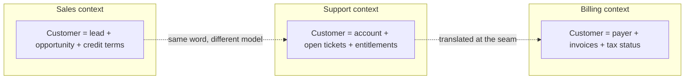
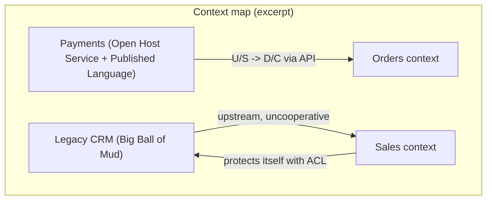
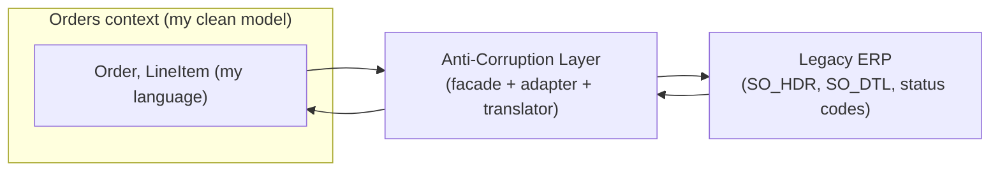
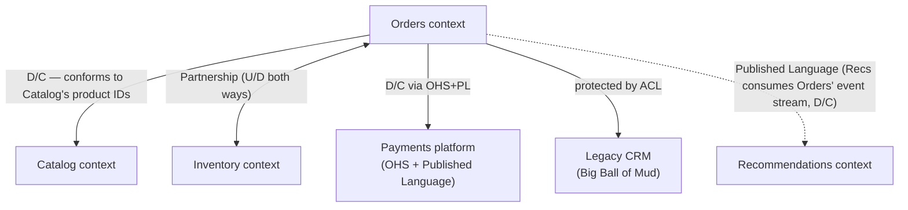

# DDD Strategic Design & Context Mapping

Domain-Driven Design (DDD) has two halves. **Tactical design** is about the
building blocks *inside* a model — entities, value objects, aggregates,
repositories, domain events. **Strategic design** is about the *big picture*:
where to draw model boundaries, which parts of the domain deserve your best
engineers, and how independently-modelled pieces integrate at the seams. This
topic is strategic design — **bounded contexts, subdomains, and the context
map** — the part senior/staff interviews probe because it's where architecture
meets organization and where the expensive mistakes live.

The three pillars, in one breath:

- **Bounded context** — the boundary within which one model and its language
  are internally consistent. Every term has exactly one meaning inside it.
- **Subdomains** (core / supporting / generic) — a problem-space partition of
  the business used to decide *where to invest*.
- **Context map** — the explicit description of how bounded contexts relate and
  integrate (Partnership, Shared Kernel, Customer/Supplier, Conformist, ACL,
  Open Host Service, Published Language, Separate Ways, Big Ball of Mud), and
  the political/technical reality behind each seam.

> [!INTERVIEW]
> A common trap: candidates conflate "bounded context" (a solution-space model
> boundary) with "subdomain" (a problem-space area of the business). Keep them
> distinct — the interviewer is often listening for exactly that separation.

> [!KEY-TAKEAWAY]
> Strategic design answers *where the boundaries go and where to spend your
> talent*; context mapping answers *how the boundaries talk to each other and
> who has power over whom*. Get these right and the tactical details mostly fall
> into place.

See also: **microservices-ddd-and-boundaries** for bounded contexts *as service
boundaries* and the distributed-monolith anti-pattern; this topic focuses on the
**mapping relationships** between contexts and on **strategic distillation**.

---

## Strategic vs tactical design

**Strategic design** operates at the scale of the whole system and the
organization. Its deliverables are: a set of **bounded contexts**, a
classification of **subdomains** (core/supporting/generic), and a **context
map** describing the relationships between contexts. It is a *design* activity,
not just documentation — deciding to wrap a legacy system in an Anti-Corruption
Layer, or to publish an Open Host Service, is a strategic decision with
staffing, cost, and coupling consequences.

**Tactical design** operates *inside a single* bounded context: aggregates,
entities, value objects, domain events, repositories, factories, domain
services. It only makes sense once you know the boundary — you model the
*inside* of a context using tactical patterns.

| Aspect | Strategic design | Tactical design |
|---|---|---|
| Scale | System / organization | Single bounded context |
| Concepts | Bounded context, subdomain, context map, distillation | Aggregate, entity, value object, domain event, repository |
| Question answered | Where are the boundaries? Where do we invest? How do contexts integrate? | How is *this* model structured to protect invariants? |
| Failure if skipped | Big Ball of Mud, wrong boundaries, over-investing in the wrong subdomain | Anemic model, leaky invariants, transaction bloat |

> [!TIP]
> If a team jumps straight to aggregates and repositories without agreeing on
> the bounded contexts and the context map, they are doing tactical design in a
> strategic vacuum — a frequent cause of "microservices that can't deploy
> independently."

---

## Bounded context and ubiquitous language

A **bounded context** is an explicit boundary — linguistic and model-level —
within which a particular domain model applies and is unambiguous. Inside it,
the **ubiquitous language** (the shared vocabulary used by domain experts,
code, database columns, and API fields alike) has exactly *one* meaning per
term. Cross the boundary and the same word may mean something different, or the
term may not exist at all.

Eric Evans introduced the term precisely because a single unified model of a
non-trivial enterprise is unachievable: requirements from different parts of the
business contradict each other. Rather than fight that, DDD says **build several
smaller models, each internally consistent, and make the boundaries explicit.**

**Ubiquitous language is context-local.** When a domain expert in fulfilment
says a shipment is "dispatched," there is a `dispatch()` operation and a
`ShipmentDispatched` event *in that context* — not `updateStatus(3)`. The same
word inside the analytics context might not exist, or "dispatch" might mean the
moment a courier scans the parcel. The language is only guaranteed inside its
boundary.



> [!WARNING]
> A bounded context is *not* the same as a namespace, module, or microservice.
> Those are implementation containers; a bounded context is a *semantic*
> boundary. A context may be realized as one service, several modules in a
> monolith, or (carefully) more than one service — but never should one service
> straddle two contexts.

---

## Why the same term means different things across contexts

The single most cited DDD example: the word **"Customer"** (or "Product",
"Order", "Account") means genuinely different things to different parts of a
business, with **different attributes and different invariants**.

- **Product** in *Catalog*: description, images, SEO keywords, category.
- **Product** in *Inventory*: SKU, warehouse bin, reorder threshold, on-hand
  count.
- **Product** in *Pricing*: cost basis, margin rules, promotional eligibility.

Forcing these into one shared `Product` class produces a **god object** with
dozens of fields, most of them null or irrelevant in any given use case — the
classic symptom that a boundary is being violated. Worse, the invariants
conflict: Inventory must never let on-hand go negative; Catalog doesn't care
about stock at all. A shared model has to satisfy *both* invariant sets, which
usually means it enforces *neither* cleanly.

The DDD answer is **not** to find "the true meaning" of Customer. There isn't
one. Each context owns its own model, and where they must exchange data, you
*translate* at the boundary (via an Anti-Corruption Layer, a Published Language,
etc.). This is why DDD explicitly rejects the "one Enterprise Data Model to rule
them all" approach that large organizations repeatedly attempt and abandon.

> [!KEY-TAKEAWAY]
> "Same word, different model" is the *reason* bounded contexts exist. If you
> ever feel pressure to add "just one more field" so another team can reuse your
> entity, that pressure is the boundary asking to be respected, not erased.

---

## Subdomains: core, supporting, and generic

Where a bounded context is a **solution-space** boundary (a model you build), a
**subdomain** is a **problem-space** partition (an area of the business that
exists whether or not you model it). DDD classifies subdomains into three
kinds, and the classification drives *investment*:

| Subdomain type | What it is | Investment strategy |
|---|---|---|
| **Core domain** | The thing that differentiates the business; your competitive advantage; the reason the software exists | Your **best people**, custom-built, continuously refined, richest model |
| **Supporting subdomain** | Necessary and business-specific, but not a differentiator | Build simply, or outsource/low-invest; "good enough" |
| **Generic subdomain** | A solved problem common to many businesses (auth, notifications, invoicing rules, payments) | **Buy / adopt off-the-shelf** rather than build; don't reinvent |

Examples for an e-commerce company: the **recommendation/personalization
engine** might be the core domain (it drives revenue and is hard to copy);
**order fulfilment** might be supporting; **identity/SSO**, **email sending**,
and **tax calculation** are generic (use Auth0/Cognito, SES, Avalara/TaxJar).

The point is *allocation of scarce talent*: don't let your strongest engineers
spend a year building a bespoke email service (generic) while the core domain
(the actual competitive edge) gets junior attention. Identifying the core
domain wrong is a strategic error that no amount of tactical excellence fixes.

> [!WARNING]
> "Core" is relative to *this* business, not to complexity. A payment gateway is
> a core domain for Stripe but a generic subdomain for a furniture retailer.
> Never assume the technically hardest thing is your core domain.

Ideally each subdomain maps to one bounded context, but the mapping is not
guaranteed — a legacy monolith may cram three subdomains into one context (a
sign to split), and occasionally one subdomain is served by two contexts.

---

## Strategic distillation and the core domain

**Distillation** is the ongoing process of separating the core domain from the
mass of supporting and generic material so the team's attention concentrates
where it matters. Evans describes several tools:

- **Domain Vision Statement** — a short description of the core domain and the
  value it brings, used to align everyone on *why* this system exists.
- **Highlighted Core** — explicitly flag, in the model and docs, which parts are
  core so reviewers and new joiners know where the crown jewels are.
- **Generic Subdomains** — actively pull generic concerns *out* of the core
  model (into libraries, bought products, or separate contexts) so they don't
  dilute it.
- **Cohesive Mechanisms / Segregated Core** — refactor so the core's essential
  logic is not tangled with supporting mechanics.

The economic argument: engineering capacity is finite, so **invest
disproportionately in the core domain** and minimize spend on the rest.
Distillation is what makes that possible — you can't invest wisely in something
you haven't distinguished from the noise.

> [!INTERVIEW]
> "How do you decide where to spend your best engineers?" → Name the core
> domain, justify *why it's the differentiator* for this specific business, and
> say you'd buy/adopt generic subdomains and keep supporting ones simple. That's
> distillation in one answer.

---

## The context map

A **context map** is an explicit model of the **relationships between bounded
contexts** — both the technical integration and the *organizational/political*
reality. It is drawn from a **global, honest** viewpoint: it shows the messy
truth (including the legacy Big Ball of Mud and the teams that won't cooperate),
not an idealized target.

Two axes describe every relationship:

1. **Power/direction** — who depends on whom. **Upstream (U)** contexts
   influence **downstream (D)** contexts; the downstream depends on the
   upstream's model and cadence. (See the next section.)
2. **Integration pattern** — the specific relationship type: Partnership,
   Shared Kernel, Customer/Supplier, Conformist, Anti-Corruption Layer, Open
   Host Service, Published Language, Separate Ways, or Big Ball of Mud.



> [!TIP]
> The context map's greatest value in an interview is that it forces you to name
> the *social* reality: a team you can't influence forces a Conformist or ACL
> relationship, not a Partnership, regardless of what the architecture diagram
> wishes.

---

## Upstream and downstream relationships

In any integration between two contexts, one is **upstream (U)** and one is
**downstream (D)**. The upstream provides something (a model, an API, events);
the downstream consumes it. The crucial asymmetry: **the upstream's decisions
flow downhill** — changes to the upstream's schema, cadence, or availability
affect the downstream, but not vice versa. "Upstream" here is about *influence*,
like a river: what happens upstream affects everyone below.

Being downstream is a position of *dependency and reduced power*. Your options
as a downstream context are essentially:

- **Conformist** — adopt the upstream model as-is (cheap, but you inherit their
  language and churn).
- **Anti-Corruption Layer** — translate the upstream model into your own at the
  boundary (costs effort, protects your model).
- **Separate Ways** — decide the integration isn't worth it and don't integrate
  at all.

An upstream context that *chooses to serve* its downstreams well provides an
**Open Host Service** and a **Published Language**, and may enter a
**Customer/Supplier** relationship where downstream needs get prioritized.

> [!KEY-TAKEAWAY]
> Upstream/downstream is about *who absorbs whose changes*. If you're downstream
> of a team that won't accommodate you, your realistic choices collapse to
> Conformist, ACL, or Separate Ways — the pattern you pick is a power statement.

---

## Partnership

**Partnership** is a relationship between two contexts (and their teams) whose
success or failure is **mutual** — they either succeed together or fail
together, so they coordinate closely. There is no upstream/downstream power
imbalance; both sides jointly plan interfaces, align on release schedules, and
solve integration problems together.

- **When it fits:** two teams with tightly interlocked deliverables and shared
  goals, high communication bandwidth, and genuine willingness to coordinate.
- **Cost:** heavy, continuous coordination — planning must be synchronized, and
  interface changes are negotiated jointly. It doesn't scale to many partners.
- **Risk:** if the "partnership" is actually one-sided (one team keeps
  accommodating the other), it's really a Customer/Supplier or Conformist
  relationship in disguise, and pretending otherwise causes friction.

> [!WARNING]
> Partnership is expensive to sustain. Over time many partnerships naturally
> decay into looser relationships (Customer/Supplier or Separate Ways) as teams
> want independence. Don't mandate partnership where independence is the actual
> goal.

---

## Shared Kernel

A **Shared Kernel** is an explicitly-agreed **subset of the model (and often
code — shared library, schema, or module)** that two contexts *share* and
co-own. Changes to the kernel require agreement from **both** teams, and the
shared portion is kept deliberately small.

- **Benefit:** eliminates duplication of a genuinely common core concept and
  keeps two closely-related contexts consistent without re-translating.
- **Cost / danger:** it creates **tight coupling** at the shared boundary. Any
  change needs cross-team consensus and continuous integration/tests across both
  sides; a careless edit breaks the other team. It undermines the autonomy that
  bounded contexts are supposed to provide.

- **When to use:** only between teams with a close relationship (often already a
  Partnership) and a small, stable overlap. Keep the kernel minimal; everything
  outside it stays private to each context.

> [!WARNING]
> A Shared Kernel is the pattern most often abused as an excuse for a giant
> "shared/common" library that every service depends on. That reintroduces the
> coupling microservices were meant to remove. If in doubt, prefer duplication +
> translation (ACL) over a growing shared kernel.

---

## Customer/Supplier

**Customer/Supplier** is an upstream/downstream relationship where the two teams
are in **different contexts but cooperate**, and — critically — the downstream
(**customer**) has a *voice*. The upstream (**supplier**) commits to
considering the customer's needs, and downstream requirements enter the
upstream's planning/backlog (often with negotiated priorities and interface
contracts / acceptance tests).

- **Key property:** the customer has *some power* despite being downstream. The
  supplier is accountable to the customer's needs, unlike a pure Conformist
  situation.
- **Enablers:** shared prioritization process, automated acceptance/contract
  tests owned jointly so the supplier doesn't break the customer.
- **Fails when:** the supplier has other, more important customers and
  deprioritizes this one, or organizational power sits entirely upstream — then
  the customer is pushed toward Conformist or ACL.

> [!TIP]
> Customer/Supplier is the *healthy* upstream/downstream relationship: explicit
> contracts, the downstream's needs on the upstream's roadmap, and tests that
> catch breaking changes before release.

---

## Conformist

A **Conformist** relationship is a downstream context that **adopts the
upstream's model wholesale**, with *no translation layer* — the downstream
simply conforms to whatever the upstream provides. This happens when the
downstream has **no power** to influence the upstream and decides that
translating isn't worth it.

- **Benefit:** cheapest possible integration — no mapping code, you just use the
  upstream's types and language directly.
- **Cost:** you inherit the upstream's model, vocabulary, and *every* change
  they make. Your context's ubiquitous language gets polluted by theirs, and
  upstream churn ripples straight into you. You give up modelling autonomy.
- **When it's acceptable:** the upstream model is good enough for your needs, the
  domain overlap is high, or the upstream is a stable industry standard.

> [!INTERVIEW]
> Conformist vs Anti-Corruption Layer is a favourite comparison. Conformist =
> "the upstream model is fine, I'll just use it, and accept the coupling." ACL =
> "the upstream model would corrupt mine, so I'll pay to translate it at the
> boundary." The choice is a cost/benefit call about how much you value model
> purity vs integration cost.

---

## Anti-Corruption Layer (ACL)

An **Anti-Corruption Layer** is a **translation layer** a downstream context
builds to **protect its own model** from an upstream (often legacy or external)
model. All communication with the upstream passes through the ACL, which maps
the foreign model/language into terms native to *your* context — so the foreign
concepts never leak into your domain model.

- **Purpose:** keep *your* ubiquitous language clean when integrating with a
  system whose model is messy, legacy, external, or simply different.
- **Structure:** typically implemented with **façades, adapters, and
  translators** — the façade simplifies the upstream API, the adapter conforms
  it to an interface your side expects, and translators convert between the two
  models' data.
- **Cost:** you build and maintain mapping code; it adds a hop and can be
  significant work. But it's often the *only* way to integrate with a legacy or
  third-party system without corrupting your model.



**Worked translation — legacy row → clean aggregate.** The legacy ERP stores a
sales order as a header row plus detail rows, with cryptic codes:

```
SO_HDR:  SO_NBR=884210  CUST_NBR=5567  STAT_CD='3'  ORD_DT='2026-07-01'
SO_DTL:  SO_NBR=884210  LINE_NO=1  ITM_CD='SKU-338'  QTY=2  UNIT_PRC=1499
SO_DTL:  SO_NBR=884210  LINE_NO=2  ITM_CD='SKU-902'  QTY=1  UNIT_PRC=899
```

The ACL's translator applies three concrete transforms and hands your context a
single clean aggregate:

1. **Reshape** header + N detail rows → one `Order` aggregate with a list of
   `LineItem`s (the legacy's flat two-table shape becomes your aggregate root).
2. **Decode the status enum** using the legacy code book
   (`'1'=DRAFT, '2'=SUBMITTED, '3'=CONFIRMED, '4'=SHIPPED, '5'=CANCELLED`), so
   `STAT_CD='3'` → `status = CONFIRMED`. Your model never sees the magic number.
3. **Convert primitives to value objects**: `UNIT_PRC` is integer cents, so
   `1499` → `Money(14.99)` and `899` → `Money(8.99)`.

```
Order(
  id       = OrderId("884210"),
  customer = CustomerRef(5567),
  status   = CONFIRMED,                          // from STAT_CD '3'
  placedAt = 2026-07-01,
  lineItems = [
    LineItem(sku="SKU-338", qty=2, unitPrice=Money(14.99)),   // 1499 cents
    LineItem(sku="SKU-902", qty=1, unitPrice=Money(8.99)),    //  899 cents
  ]
)
```

The **façade** hides the two-call `SELECT SO_HDR` + `SELECT SO_DTL` dance behind
one `getOrder(884210)`; the **adapter** conforms it to the `OrderGateway`
interface your domain expects; the **translator** does the three transforms
above. Nothing named `SO_HDR` or `STAT_CD` ever crosses into the Orders model.

- **Contrast with Conformist:** a Conformist *accepts* the upstream model; an
  ACL *rejects* it at the boundary and translates. Use an ACL when the cost of
  polluting your model would exceed the cost of the translation layer — almost
  always the case around legacy/third-party systems and strangler-fig
  migrations.

> [!KEY-TAKEAWAY]
> ACL is the go-to pattern for "integrate with the legacy/external system
> without letting its model rot ours." It's also central to the Strangler Fig
> migration pattern — the new context speaks its own language and the ACL
> shields it from the old one.

---

## Open Host Service (OHS)

An **Open Host Service** is a pattern for an **upstream** context that has *many*
downstream consumers. Instead of building a bespoke integration for each one,
the upstream **publishes a well-defined, stable protocol/API** (a "service open
to any consumer") that all downstreams use. It's the inverse concern of an ACL:
ACL protects the *downstream*; OHS is the *upstream* being a good host to its
many clients.

- **Why:** with many integrators, per-consumer custom translation is unmaintainable. A single documented, versioned, public interface amortizes the
  cost and decouples the upstream from each consumer's internals.
- **Typically paired with a Published Language** (below): the OHS *is* the
  interface; the Published Language *is the shared schema/vocabulary* that
  interface speaks.
- **Real-world shape:** a public REST/gRPC API with a versioning policy, or a
  well-documented event stream — e.g. a Payments platform exposing one stable
  API to dozens of internal teams.

> [!TIP]
> Rule of thumb from Evans: when the number of downstreams is small, translate
> per consumer; when it grows, **formalize into an Open Host Service** so you
> maintain one protocol instead of N ad-hoc ones.

---

## Published Language

A **Published Language** is a **well-documented, shared language/schema** used to
translate between contexts — a common interchange format that all parties agree
on. It's often the medium of an Open Host Service, and it's frequently an
industry standard or a formally-versioned contract.

- **Examples:** an industry standard like **HL7/FHIR** (healthcare), **ISO
  20022** (payments), **iCalendar**; or an internal versioned schema published as
  **Protobuf/Avro/JSON Schema/OpenAPI**.
- **Why it helps:** neither side has to reverse-engineer the other's internal
  model — they both map to/from the published, documented lingua franca. It
  decouples internal models from the interchange format.
- **OHS vs Published Language:** the **Open Host Service** is the *access
  mechanism* (the protocol/endpoint you call); the **Published Language** is the
  *shared vocabulary/schema* expressed through it. You can publish a language
  without an OHS (e.g. a file format), and an OHS should expose a published
  language rather than leak its internal model.
- **Published Language vs Shared Kernel** (a common confusion, since both are
  "shared"): a **Shared Kernel** is co-owned *internal* model/code — it *couples*
  the two contexts, so any change needs both teams' agreement. A **Published
  Language** is a deliberately-designed *external* contract each side maps
  to/from — it *decouples* internal models, so each team refactors freely behind
  it. Prefer a Published Language when autonomy matters; reach for a Shared
  Kernel only when the overlap is tiny, stable, and the teams are already close.

> [!WARNING]
> Don't expose your *internal* domain model directly as your integration
> contract — that turns every internal refactor into a breaking change for
> consumers. Publish a deliberately-designed language and evolve it with a
> versioning policy.

---

## Separate Ways

**Separate Ways** is the deliberate decision that two contexts have **no
integration at all** — the cost/benefit of connecting them doesn't justify the
coupling, so they go their separate ways.

- **When it fits:** the functional overlap is small, integration would be
  expensive or fragile, and each context can satisfy its needs independently
  (even at the cost of some duplicated data or manual reconciliation).
- **Benefit:** maximal autonomy and simplicity — no shared model, no
  coordination, no coupling. Sometimes a little duplication is far cheaper than a
  brittle integration.
- **Trade-off:** you accept duplicated effort/data and lose any automatic
  consistency between the two contexts.

> [!INTERVIEW]
> Separate Ways is the pattern candidates forget exists. Naming it signals
> maturity: "the cheapest integration is sometimes *no* integration." Not every
> pair of contexts needs to talk.

---

## Big Ball of Mud

A **Big Ball of Mud** is a region of the system with **no clear boundaries, mixed
models, and tangled dependencies** — the *absence* of strategic design. In a
context map you draw it honestly: mark the muddy region, **do not let its model
leak** into your clean contexts (wrap it in an ACL), and don't try to apply
sophisticated modelling *inside* it.

- **On the map it means:** "here be dragons — contain it, don't refine it."
- **Strategy:** draw a boundary *around* the mud, protect neighbouring contexts
  with Anti-Corruption Layers, and (if it matters) carve capabilities out over
  time via the **Strangler Fig** pattern rather than a big-bang rewrite.
- **Why acknowledge it:** pretending the legacy mess has a clean model wastes
  effort and lets its chaos infect new work. Honesty about the mud is what keeps
  the rest of the map trustworthy.

> [!KEY-TAKEAWAY]
> A Big Ball of Mud isn't a pattern you *choose* — it's the state you get without
> strategic design. The mature response is containment (boundary + ACL) plus
> incremental strangling, not heroic in-place refactoring.

---

## Choosing an integration pattern

The pattern isn't just technical — it's dictated by **team relationship and
power**. A quick decision guide:

| Situation | Likely pattern |
|---|---|
| Two teams succeed/fail together, coordinate closely | **Partnership** |
| Two close teams co-own a small common model/library | **Shared Kernel** |
| Upstream cooperates and puts downstream needs on its roadmap | **Customer/Supplier** |
| Downstream has no influence and the upstream model is acceptable | **Conformist** |
| Downstream must protect its model from a legacy/external/messy upstream | **Anti-Corruption Layer** |
| Upstream serves many downstreams and wants one stable interface | **Open Host Service (+ Published Language)** |
| Need a shared interchange format across contexts | **Published Language** |
| Overlap tiny, integration not worth it | **Separate Ways** |
| Legacy tangle with no boundaries | **Big Ball of Mud** (contain + ACL) |

> [!TIP]
> In interviews, justify a pattern by naming **the relationship first**
> ("downstream of a legacy team we can't influence → ACL") rather than the
> technology. The social structure is what forces the pattern; the API style
> follows.

---

## How each pattern is wired in practice

The context-map patterns are *relationship* descriptions, but a senior
interviewer will push you one level down: "OK, it's an ACL — so what does that
actually look like in the running system? Sync or async? Who owns the data?"
Each pattern has a typical *mechanical* realization. The relationship decides
**who has power**; the mechanics decide **how bytes move and who is the system
of record**.

The key axes:

- **Sync vs async.** *Synchronous* request/response (REST, gRPC) means the
  downstream calls the upstream and waits — simple, but it couples the two on
  **availability** (upstream down → your call fails) and **latency** (their p99
  is in your p99). *Asynchronous* messaging (the upstream publishes events; the
  downstream subscribes and keeps its own read model) decouples availability and
  cadence, at the cost of **eventual consistency** — your copy lags the source.
- **Data ownership.** Exactly one context is the **system of record** for a
  given fact. Everyone else holds a *reference* (an ID they resolve on demand)
  or a *replicated read model* (a local, eventually-consistent copy). Two
  contexts claiming to own the same fact is the boundary error that produces
  data-integrity bugs.

| Pattern | Typical mechanics | Sync or async | Data ownership |
|---|---|---|---|
| **Partnership** | Jointly-designed API and/or shared event stream; whichever fits the interaction, co-evolved | Either (often both) | Each owns its half; the reserve/release handshake is negotiated |
| **Shared Kernel** | A shared library / schema module compiled into both sides (same code, same types) | In-process (no network hop) | Co-owned model; no translation, so a kernel change ships to both |
| **Customer/Supplier** | Upstream exposes a versioned REST/gRPC API or event stream; contract/consumer-driven tests guard it | Either | Upstream is system of record; downstream references or replicates |
| **Conformist** | Downstream consumes the upstream API or events **using the upstream's own types** — no mapping layer | Either | Upstream owns the data *and* the vocabulary; downstream just borrows both |
| **Anti-Corruption Layer** | An adapter that calls the upstream API (or subscribes to its events) and **re-emits clean domain objects/events** into your context | Either — wraps whatever the upstream offers | Upstream still owns the source data; your context owns its *translated* model |
| **Open Host Service + Published Language** | A published, versioned REST/gRPC API or a documented public event stream, spoken in a designed schema (Protobuf/Avro/OpenAPI, or a standard like ISO 20022) | Either | Upstream owns the data; the Published Language is the only shape consumers may depend on |
| **Separate Ways** | No integration — each context keeps its own data, reconciled manually if ever | N/A | Each owns a full, independent copy; duplication accepted |

Reading the table: notice **ACL and Conformist can use the exact same transport**
(both might subscribe to the same event stream). The difference is *not* sync vs
async — it's whether a **translation step** sits at the boundary. Conformist lets
the upstream's `STAT_CD` into your code; an ACL converts it to `CONFIRMED` first.

> [!INTERVIEW]
> A frequent follow-up: "You said Recommendations reads Orders via events — isn't
> that just eventual consistency risk?" Yes: the async event stream buys
> availability/cadence decoupling but Recs' read model **lags** the Orders source
> of record, so never let Recs make a decision that requires an authoritative,
> up-to-the-millisecond order state (e.g., fraud holds) off its replica — route
> those back to the owning context synchronously.

---

## Worked example: a full e-commerce context map

Patterns learned in isolation don't stick; interviewers ask you to *compose*
them on one system. Here is a single e-commerce platform with six contexts, and
a walk through **every seam** — which relationship it is and *why*. The "why" is
always a statement about power and team relationship, not technology.



Seam by seam:

1. **Orders → Catalog = Conformist (downstream).** Catalog owns product IDs,
   names, categories; Orders just needs to reference them and has no leverage to
   change Catalog's schema. The overlap is stable and Catalog's model is
   perfectly acceptable, so Orders **conforms** — it uses Catalog's product IDs
   directly rather than paying for a translation layer. *Downstream + acceptable
   upstream model + no power = Conformist.*

2. **Orders ↔ Inventory = Partnership.** Placing an order must reserve stock, and
   a stock-out must block/cancel an order — the two teams' deliverables are
   tightly interlocked and they succeed or fail together, so they plan the
   reserve/release interface jointly. Neither is purely upstream. *Mutual
   success/failure + tight coordination = Partnership.*

3. **Orders → Payments = Customer/Supplier over an OHS + Published Language.**
   Payments serves *many* teams (Orders, Subscriptions, Refunds…), so it exposes
   one stable versioned API (**Open Host Service**) speaking a designed contract
   like ISO 20022 (**Published Language**) rather than N bespoke integrations.
   Because the Payments team puts Orders' needs on its roadmap, the relationship
   is **Customer/Supplier**, not raw Conformist. *Many downstreams → OHS+PL;
   upstream honours downstream needs → Customer/Supplier.*

4. **Orders → Legacy CRM = Anti-Corruption Layer.** The CRM is a Big Ball of Mud
   we can't change and don't control. Orders needs customer records from it but
   must not let `SO_HDR`/`STAT_CD`-style muck into its clean model, so it wraps
   the CRM in an **ACL** that translates at the boundary. *Downstream of an
   unchangeable messy upstream = contain with ACL.*

5. **Recommendations → Orders = downstream consumer of a Published Language event stream.**
   Recommendations wants order history but doesn't need live, consistent, synchronous
   access; it subscribes to Orders' published domain events (a stable, versioned
   **Published Language**) and builds its own slightly-stale read model. This is still
   integration — just loose and asynchronous — so it is *not* Separate Ways (which means
   no integration at all); Recs is a **downstream/conformist** consumer of that event
   contract. *Async event consumption decouples cadence while keeping a real, versioned
   contract at the seam.*

Notice the pattern is dictated by the **relationship** each time — power,
changeability, number of consumers, coordination cost — and the technology
(REST vs events vs shared IDs) merely follows. That's exactly the reasoning an
interviewer wants to hear at the whiteboard.

> [!KEY-TAKEAWAY]
> The context map is not one pattern applied everywhere — a single realistic
> system mixes Conformist, Partnership, Customer/Supplier + OHS/PL, ACL, and
> Separate Ways, each chosen by the *team relationship* at that seam.

---

## Bounded contexts and microservices

Bounded contexts and microservices are related but **not automatically 1:1**. A
bounded context is a *logical/model* boundary; a microservice is a *deployment*
boundary.

- **Common and healthy: 1 context ↔ 1 service.** A bounded context is a strong
  *default* candidate for a service boundary because it already has a clean
  model, its own data, and a well-defined interface — exactly what you want a
  service to own.
- **A context split across several services** — possible, but do it only under
  real scaling/organizational pressure. Splitting a single model across
  deployment units reintroduces distributed-transaction and consistency pain
  inside one model.
- **A service spanning multiple contexts** — an anti-pattern. It couples
  unrelated models and languages into one deployable, and is a common route to a
  distributed monolith.
- **Start coarse.** A frequent expert recommendation: begin with a modular
  monolith organized *by bounded context* (a "modulith"), and extract services
  along context seams once you have evidence (independent scaling, team
  autonomy, deploy-cadence conflicts) that the network + ops tax is worth it.

> [!KEY-TAKEAWAY]
> "One service per bounded context, at most one context per service, never a
> service spanning two contexts." The context map then tells you exactly how
> those services should integrate (OHS/Published Language, ACL, etc.).

See also **microservices-ddd-and-boundaries** for the service-boundary and
distributed-monolith discussion in depth.

---

## Conway's Law and team topology

Strategic design is "where architecture meets organization" precisely because of
**Conway's Law**: *a system's structure mirrors the communication structure of
the org that built it* — you ship your org chart. If three teams build one
"service," it will grow three seams whether you designed them or not. So context
boundaries and team boundaries are not independent; the honest question is which
one you let drive the other.

The **inverse Conway maneuver** turns this into a tool: instead of accepting the
boundaries your org accidentally produces, **reorganize the teams to get the
boundaries you want**. Want one bounded context per service, cleanly owned? Give
each context to exactly one team with the mandate and skills to own it end to
end. The boundary you draw on the context map becomes real only when a single
team owns each side.

This maps directly onto **Team Topologies** interaction modes, which is why the
two frameworks are usually discussed together:

| Context-map relationship | Team Topologies interaction mode |
|---|---|
| **Partnership** | **Collaboration** — two teams work closely for a defined period on an interlocked problem |
| **Customer/Supplier**, **Open Host Service + Published Language** | **X-as-a-Service** — an upstream (often a *platform team*) offers a stable self-serve interface to many consumers |
| **Anti-Corruption Layer**, **Conformist** | **Facilitating / shielding** — a stream-aligned team shields itself from a *complicated-subsystem* or legacy team it can't change |

> [!INTERVIEW]
> "How do bounded contexts relate to team structure?" → Name **Conway's Law**
> (the architecture mirrors team communication), then the **inverse Conway
> maneuver** (organize teams around the contexts you want). Note that an Open
> Host Service is how a **platform team** offers "X-as-a-service," and an ACL is
> a **stream-aligned team shielding itself** from a subsystem it can't change.
> This is the answer that separates senior from staff.

---

## Discovering contexts: Event Storming and Domain Storytelling

You don't *derive* bounded contexts from the org chart or the database — you
**discover** them collaboratively with domain experts. Two popular workshop
techniques:

- **Event Storming** (Alberto Brandolini): a workshop where participants map the
  business as a timeline of **domain events** (orange sticky notes: "Order
  Placed", "Payment Received", "Shipment Dispatched"), then add **commands**,
  **actors**, **policies**, and **aggregates**. **Pivotal events** and clusters
  of related events reveal candidate **bounded context boundaries** and where the
  ubiquitous language shifts. It's fast, low-tech, and gets experts and
  engineers in the same room speaking the same language.
- **Domain Storytelling** (Stefan Hofer / Henning Schwentner): domain experts
  *tell a story* of how work actually gets done, which a facilitator records as a
  pictographic diagram of **actors → work objects → activities**. Divergent
  vocabulary and hand-offs between actors surface context boundaries.

Both techniques primarily surface **linguistic seams**: the moment the same word
starts meaning something different, or a hand-off occurs, is a candidate context
boundary. They also feed subdomain classification (which clusters are core vs
supporting vs generic).

> [!TIP]
> Signals of a context boundary during discovery: a term changes meaning; a
> different set of experts "owns" the conversation; data must be translated at a
> hand-off; invariants that hold on one side don't apply on the other.

---

## Common follow-up questions

- **"What's the difference between a bounded context and a subdomain?"** A
  subdomain is a *problem-space* partition of the business (core/supporting/
  generic); a bounded context is a *solution-space* model boundary you build.
  Ideally each subdomain maps to one context, but legacy reality often violates
  that (a monolith cramming several subdomains into one context).

- **"Conformist vs Anti-Corruption Layer — when each?"** Conformist when the
  upstream model is acceptable and you'd rather not pay for translation (accept
  the coupling). ACL when the upstream model would corrupt yours (legacy,
  external, messy) and model purity is worth the translation cost.

- **"Open Host Service vs Published Language?"** OHS is the *access mechanism*
  (the stable protocol/API an upstream offers many consumers); Published
  Language is the *shared schema/vocabulary* that interface speaks. OHS usually
  exposes a Published Language.

- **"Is a bounded context always a microservice?"** No. It's a strong default
  candidate for a service boundary, but a context is logical and a service is a
  deployment unit. Never span two contexts with one service; splitting one
  context across services needs real justification.

- **"How do you decide which subdomain gets your best engineers?"** Identify the
  **core domain** (the differentiator for *this* business), invest
  disproportionately there, buy/adopt **generic** subdomains, and keep
  **supporting** ones simple. That's strategic distillation.

- **"How do you integrate with a legacy system you can't change?"** Treat it as
  upstream (often a Big Ball of Mud), wrap it in an **Anti-Corruption Layer** so
  its model doesn't leak into yours, and migrate capabilities out over time with
  the Strangler Fig pattern.

- **"How do you actually find the contexts?"** Collaborative discovery with
  domain experts — **Event Storming** or **Domain Storytelling** — looking for
  linguistic seams where terms change meaning or work is handed off.

- **"What if two teams keep needing each other's changes?"** That's a
  Partnership (coordinate closely) or, if power is one-sided, Customer/Supplier
  with explicit contracts and shared acceptance tests. If coordination cost is
  too high and overlap is small, Separate Ways.

- **"How big should a bounded context be — how do you know the boundary is
  wrong?"** There's no size in lines of code; you read the symptoms.
  **Too large:** one model juggles *conflicting invariants* (Inventory's
  "never negative" alongside Catalog's indifference to stock), god objects with
  many nullable fields, and different sub-teams fighting over the same model.
  **Too small:** chatty cross-context calls for a single use case, a workflow
  that needs a distributed transaction to stay consistent, and the ubiquitous
  language bleeding across the seam constantly. The guidance is that boundaries
  are **refined iteratively** — you draw them where the language is stable today
  and redraw as it clarifies; getting one wrong is expensive but expected, which
  is why starting as a modular monolith (cheap to re-slice) beats premature
  service extraction (expensive to re-slice).

- **"How do bounded contexts relate to team structure?"** Via **Conway's Law**:
  the architecture mirrors team communication, so context and team boundaries
  co-evolve. Use the **inverse Conway maneuver** — organize teams around the
  contexts you want (one team per context) — and map the seams to Team
  Topologies modes (Partnership ~ Collaboration; OHS/Customer-Supplier ~
  X-as-a-Service from a platform team; ACL/Conformist ~ shielding from a team
  you can't change).

---

## References

- Eric Evans, *Domain-Driven Design: Tackling Complexity in the Heart of
  Software* (2003) — the origin of bounded context, ubiquitous language,
  strategic distillation, and the context-map relationships.
- Eric Evans, *Domain-Driven Design Reference* (2015, free PDF) — concise
  definitions of every strategic pattern.
- Vaughn Vernon, *Implementing Domain-Driven Design* (2013) — practical
  treatment of context mapping, ACL, OHS, Published Language.
- Vaughn Vernon, *Domain-Driven Design Distilled* (2016) — accessible overview
  of subdomains and context mapping.
- Martin Fowler, "BoundedContext" and "Strangler Fig Application" —
  martinfowler.com.
- Alberto Brandolini, *Introducing EventStorming* — the Event Storming method.
- Stefan Hofer & Henning Schwentner, *Domain Storytelling* (2021).
- Microsoft, *.NET Microservices: Architecture for Containerized .NET
  Applications* — chapters on identifying bounded contexts and DDD subdomains.
