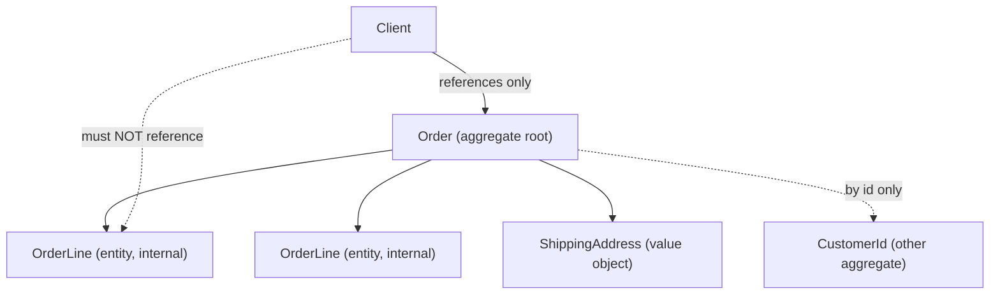
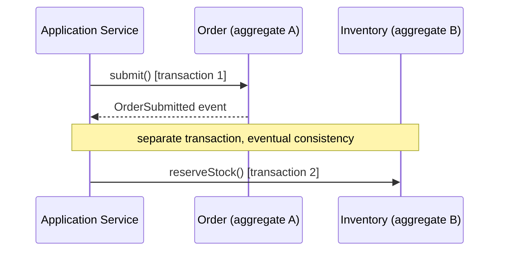

# Domain-Driven Design: Tactical Patterns

Domain-Driven Design (DDD), introduced by Eric Evans in *Domain-Driven Design:
Tackling Complexity in the Heart of Software* (2003) and refined by Vaughn Vernon in
*Implementing Domain-Driven Design* (2013), has two halves. **Strategic** DDD is about
carving a large domain into bounded contexts and mapping their relationships.
**Tactical** DDD — the subject of this topic — is the toolbox of *building blocks* you
use *inside* a single bounded context to express a rich domain model in code: entities,
value objects, aggregates, domain events, repositories, factories, and domain services.

> [!KEY-TAKEAWAY]
> Tactical DDD is not "a folder layout." It is a set of modeling decisions that push
> business rules (invariants) *into* the objects that own the data, so the code speaks
> the domain's **ubiquitous language** and illegal states are hard to represent. The
> single most-tested idea is the **aggregate** as a *transactional consistency boundary*.

> [!INTERVIEW]
> **Boundary of this topic.** Strategic DDD — bounded contexts, context maps,
> anti-corruption layers, subdomains, how services map to contexts — is covered in
> **See also: microservices-ddd-and-boundaries**. Repository and Value Object *as
> enterprise/PoEAA patterns* (Repository vs DAO, Data Mapper, etc.) live in **See also:
> dp-enterprise-application**. CQRS, Event Sourcing, Saga, and the outbox pattern for
> reliable event publishing live in **See also: event-driven-cqrs-saga-cdc**. Here we
> focus on the *tactical building blocks* and how they fit together.

---

## Entities: identity and lifecycle

An **entity** is a domain object defined by a *thread of continuity and identity*, not
by its attributes. Two entities are the *same* if they have the same identity, even when
every other attribute differs; and the *same* entity across time is still that entity
even though its attributes change. A `Customer`, an `Order`, a `BankAccount`, a
`ShipmentLeg` are entities: each has an ID and a **lifecycle** (created, modified,
archived, deleted).

Key properties:

- **Identity** is assigned once and is immutable for the object's life. It may be a
  natural key (rare — natural keys leak and change), but is usually a surrogate:
  a UUID, a database sequence, or an application-generated id. Prefer generating the id
  *before* persistence (e.g. UUID) so the object is valid and referenceable the moment
  it exists, rather than depending on a DB round-trip.
- **Equality is by id**, not by value. `a.equals(b)` iff `a.id == b.id`. `hashCode()`
  must be derived from the id (or be constant) so identity is stable across mutations.
- **Mutable state, guarded by behavior.** Entities *do* change over time, but changes go
  through methods that keep the object valid — not through public setters.

```java
public class Order {                    // Entity
    private final OrderId id;           // identity, immutable
    private OrderStatus status;         // mutable state
    private final List<OrderLine> lines = new ArrayList<>();

    public void addLine(ProductId p, int qty) {   // behavior, not a setter
        if (status != OrderStatus.DRAFT)
            throw new IllegalStateException("cannot modify a submitted order");
        lines.add(new OrderLine(p, qty));
    }

    @Override public boolean equals(Object o) {
        return o instanceof Order other && this.id.equals(other.id);
    }
    @Override public int hashCode() { return id.hashCode(); }
}
```

> [!WARNING]
> A frequent bug: implementing `equals`/`hashCode` on an entity from its *fields*. That
> makes "the same order" stop being equal to itself after a status change, and breaks
> `HashSet`/JPA identity maps. Entities compare by **id only**.

---

## Value objects: immutable, equality by value

A **value object** has *no identity*. It is defined entirely by its attributes, is
**immutable**, and is compared **by value**: two `Money(10, "USD")` instances are equal
and interchangeable. Classic examples: `Money`, `DateRange`, `Address`, `Color`,
`GeoCoordinate`, `PhoneNumber`, `Quantity`. If you can freely replace one instance with
another that has the same attributes without anyone noticing, it's a value object.

Why value objects matter:

- **They make illegal states unrepresentable and centralize rules.** A `Money` type
  refuses to add USD to EUR, rounds consistently, and can't go to `null` currency. An
  `EmailAddress` validates format in its constructor, so *every* email in the system is
  already valid. This is where a huge amount of domain logic naturally lives.
- **Immutability makes them safe** to share, cache, and pass around freely — no aliasing
  bugs, thread-safe by construction. To "change" one you construct a new one
  (`money.plus(other)` returns a new `Money`).
- **Side-effect-free functions.** Value object methods compute results without mutating
  anything, which makes them trivial to test and reason about.

```java
public final class Money {              // Value object
    private final long minorUnits;      // store cents to avoid float error
    private final Currency currency;

    public Money plus(Money other) {
        if (!currency.equals(other.currency))
            throw new IllegalArgumentException("currency mismatch");
        return new Money(minorUnits + other.minorUnits, currency);  // new instance
    }
    @Override public boolean equals(Object o) {                     // by value
        return o instanceof Money m
            && minorUnits == m.minorUnits && currency.equals(m.currency);
    }
    @Override public int hashCode() { return Objects.hash(minorUnits, currency); }
}
```

| | Entity | Value object |
|---|---|---|
| Identity | Yes, explicit id | None |
| Equality | By id | By all attributes |
| Mutability | Mutable (via behavior) | Immutable |
| Lifecycle | Tracked (create/update/delete) | Created and discarded freely |
| Example | `Order`, `Customer` | `Money`, `Address`, `DateRange` |

> [!TIP]
> When in doubt, *prefer a value object*. "Do I care *which* one it is, or only *what*
> it is?" If only *what*, it's a value. Modeling `Money`/`Address`/`DateRange` as value
> objects instead of raw `BigDecimal`/`String`/two dates is one of the highest-leverage
> moves in a rich model. See also: dp-enterprise-application (Value Object as a PoEAA
> pattern) and its contrast with a DTO.

---

## Aggregate and aggregate root

An **aggregate** is a cluster of entities and value objects that is treated as a *single
unit* for data changes. One entity in the cluster is designated the **aggregate root**;
it is the *only* member that outside code is allowed to hold a reference to or load. The
root controls all access to the interior. The classic example is `Order` (root) plus its
`OrderLine` children and a `ShippingAddress` value object.

Rules that define an aggregate (Evans/Vernon):

1. **The root guards invariants.** All business rules that must *always* be true for the
   cluster are enforced by, and inside, the root. Outside code cannot reach in and put a
   child into an invalid state because it can't reference children directly.
2. **External references point only at the root**, and only by its identity. You never
   hand out a reference to an interior `OrderLine`.
3. **The aggregate is the unit of loading and saving.** Repositories deal in whole
   aggregate roots, not fragments.



The boundary is a *design decision about consistency*, not about which objects "have a
relationship." Two objects that are related in the real world often belong to *different*
aggregates.

---

## Aggregate as a consistency boundary — one transaction per aggregate

This is the heart of tactical DDD and the most common interview probe. An aggregate is a
**transactional consistency boundary**: everything inside it is kept *immediately/strongly
consistent* within a single transaction, and everything outside it is only *eventually
consistent*.

The rule of thumb (Vernon): **modify only one aggregate instance per transaction.** If a
single business operation must change two aggregates, do *not* wrap them in one
transaction; instead update one aggregate, publish a **domain event**, and let the other
aggregate react in a *separate* transaction (eventual consistency).

Why the rule exists:

- **Contention and scalability.** A transaction that locks multiple aggregates holds
  locks longer, increases deadlock risk, and limits throughput. Small single-aggregate
  transactions keep locks short.
- **Distribution.** Aggregates are the natural unit of partitioning/sharding and of
  splitting a monolith into services. If two aggregates could span services, you *can't*
  keep them in one ACID transaction anyway — so the model should already assume they're
  eventually consistent.
- **Correctness.** Whatever invariant *must* be atomically true belongs *inside* one
  aggregate; whatever can tolerate lag belongs *across* aggregates. The boundary is
  literally "what must be consistent right now."



> [!INTERVIEW]
> If asked "why can't `placeOrder()` also decrement inventory in the same transaction?",
> the crisp answer: *because Order and Inventory are separate aggregates.* Cross-aggregate
> consistency is achieved with a domain event and a second transaction, giving eventual
> consistency, which is what lets these aggregates live in different services/shards later.

---

## Reference other aggregates by identity, not by object

Inside an aggregate you may hold direct object references to your *own* interior entities
and value objects. But you must reference *other* aggregates **by their id**, never by
holding the object.

```java
public class Order {                 // aggregate root
    private final OrderId id;
    private final CustomerId customerId;   // reference other aggregate BY ID
    private final List<OrderLine> lines;   // own interior: direct references OK
}
```

Why by-id references:

- **They keep aggregates small and independently loadable.** Object references invite you
  to navigate `order.getCustomer().getLoyaltyTier()...` and accidentally load and mutate
  a second aggregate in the same transaction — violating the one-transaction rule.
- **They keep the boundary honest.** An id says "this lives in another consistency
  boundary; fetch it through *its* repository if you need it."
- **They enable distribution.** A `CustomerId` is just a value; it works whether Customer
  lives in the same DB, another shard, or another microservice.

> [!WARNING]
> Direct object references between aggregate roots are the number-one way ORM-based
> systems accidentally load half the database and blur transactional boundaries. In JPA
> terms: model cross-aggregate links as a stored id field, not a `@ManyToOne` association.

---

## Designing small aggregates

Vernon's guidance — "**design small aggregates**" — is a direct consequence of the rules
above. A common anti-pattern is a giant aggregate (e.g. `Customer` owning *all* its
orders as a collection) chosen because the objects are "related." That aggregate:

- loads a huge object graph for any change,
- creates contention because every order edit locks the whole customer,
- and grows unboundedly.

Prefer many small aggregates linked by id. Ask: **what truly must be consistent in a
single transaction?** Only those things belong together. "Customer has many Orders" is a
relationship, but each `Order` should almost always be its *own* aggregate referencing
`customerId`, not a child of `Customer`.

Signs your aggregate is too big:
- It contains unbounded collections.
- Different fields are edited by unrelated use cases that never need each other's data.
- You find yourself needing optimistic-lock retries constantly on the root.

> [!TIP]
> A useful test: an invariant like "an order's total must equal the sum of its lines"
> *must* be inside one aggregate (Order + OrderLines). An invariant like "a customer's
> lifetime spend" that can lag a few seconds does *not* — compute it eventually from
> order events.

---

## Invariants enforced inside the aggregate

An **invariant** is a business rule that must hold true *for the aggregate as a whole* at
the end of every transaction (e.g. "an order in `SUBMITTED` state must have at least one
line", "a booking's seats reserved may not exceed capacity", "total ≤ credit limit").
Tactical DDD says these are enforced *inside the root*, at the point of mutation, so the
aggregate can never be persisted in an invalid state.

Practically:

- **No public setters** that let callers bypass rules. Expose *intention-revealing*
  methods (`order.submit()`, `account.withdraw(amount)`), and validate inside them.
- **Fail fast.** Throw / return a domain error the instant an operation would break an
  invariant, before any state changes.
- **Rules that span children live on the root**, because only the root sees all children.
  A line can validate itself, but "sum of lines ≤ credit limit" is the root's job.

```java
public void withdraw(Money amount) {
    if (amount.isNegative()) throw new DomainException("amount must be positive");
    Money next = balance.minus(amount);
    if (next.isLessThan(overdraftLimit))          // invariant checked BEFORE mutating
        throw new InsufficientFundsException(id);
    this.balance = next;                          // only reached if valid
    this.record(new MoneyWithdrawn(id, amount));  // domain event
}
```

Contrast this with letting a service do `account.setBalance(account.getBalance() - amt)` —
now the rule lives *outside* the object and can be forgotten by the next caller. That is
the anemic model (below).

---

## Domain events

A **domain event** captures *something that happened in the domain that domain experts
care about* — stated in the past tense: `OrderSubmitted`, `PaymentCaptured`,
`InventoryReserved`, `AccountOverdrawn`. Events are **immutable value objects** carrying
the facts (ids, amounts, a timestamp) — usually not full object references.

Roles domain events play:

- **Decouple aggregates and contexts.** Instead of Order calling Inventory directly, Order
  raises `OrderSubmitted`; a handler reacts. This is how you implement cross-aggregate
  "one transaction per aggregate" eventual consistency.
- **Model the ubiquitous language of *change*.** "When an order is submitted, then…" maps
  directly to event + handler.
- **Feed integration, projections, and audit.** The same event can update a read model,
  notify another bounded context, and serve as an audit record.

```java
// Aggregate records the event as part of the state change; it is dispatched
// after the transaction commits.
public void submit() {
    if (lines.isEmpty()) throw new DomainException("cannot submit empty order");
    this.status = SUBMITTED;
    this.record(new OrderSubmitted(id, customerId, total(), clock.now()));
}
```

> [!WARNING]
> **Reliable delivery is a separate concern.** Recording an event in memory does not
> guarantee anyone receives it if the process crashes after commit. To publish reliably
> you typically use the **transactional outbox** pattern (write event + state in one DB
> transaction, relay asynchronously). Event Sourcing, CQRS projections, and the outbox
> are covered in **See also: event-driven-cqrs-saga-cdc** — here, know *what* a domain
> event is and *why* it decouples aggregates.

A domain event (internal to one bounded context, rich domain vocabulary) is subtly
different from an *integration event* (a stable, versioned contract published to other
contexts). Keep internal events free to change; treat integration events as an API.

---

## Repositories: the collection illusion, one per aggregate

A **repository** provides the *illusion of an in-memory collection* of all aggregate
roots of a type, hiding the actual persistence mechanism. You `add` a root and later
`findById` / query it as if it were a `Set`, and the repository translates that to SQL,
a document fetch, etc.

Defining traits:

- **One repository per aggregate root** — `OrderRepository`, `CustomerRepository`. You do
  *not* create a repository for an interior entity (`OrderLineRepository` is a smell);
  you load the whole `Order` and navigate to its lines.
- **It deals in whole aggregates.** `save(order)` persists the root and its interior
  consistently; `findById` reconstitutes the entire aggregate.
- **The interface belongs to the domain layer**, phrased in domain terms
  (`findOverdueOrdersFor(customerId)`), while the *implementation* lives in
  infrastructure. This is dependency inversion: the domain declares the port, infra adapts.

```java
public interface OrderRepository {          // domain layer (a "port")
    Optional<Order> findById(OrderId id);
    void save(Order order);                 // whole aggregate
    List<Order> findSubmittedBefore(Instant t);
}
```

> [!TIP]
> **Repository vs DAO.** A repository is aggregate-oriented and speaks the ubiquitous
> language (a collection of domain objects); a DAO is table/row-oriented and speaks CRUD.
> The full Repository-vs-DAO-vs-Data-Mapper comparison is in **See also:
> dp-enterprise-application**. Here the point is: *per aggregate root, collection illusion,
> interface in the domain*.

---

## Factories

A **factory** encapsulates the *creation* of an aggregate or complex value object when
that creation is itself non-trivial — enforcing invariants at birth, assembling a valid
object graph, or hiding the concrete type chosen. Evans pairs factories with repositories:
a factory *makes new* objects; a repository *finds existing* ones (and internally
"factories" them back from storage on load).

Use a factory when:

- construction requires enforcing invariants across several parts atomically (a valid
  `Order` must have a customer and at least one initial line),
- the logic to choose/assemble the right object is complex enough to clutter a constructor,
- you want creation phrased in the ubiquitous language (`OrderFactory.createFrom(cart)`).

```java
public class OrderFactory {
    public Order createFrom(Cart cart, CustomerId customer) {
        if (cart.isEmpty()) throw new DomainException("cannot order an empty cart");
        Order order = new Order(OrderId.newId(), customer);
        cart.items().forEach(i -> order.addLine(i.product(), i.qty()));
        return order;                     // returned in a fully valid state
    }
}
```

A plain constructor is fine when creation is trivial; reach for a factory (or a static
factory method like `Order.newOrder(...)`) when it isn't.

---

## Domain services vs application services

Not all behavior belongs on an entity or value object. When an operation is a *domain
concept* that doesn't naturally fit *one* aggregate — it spans several, or is a pure
domain calculation with no obvious owner — model it as a **domain service**: a stateless
object, named in the ubiquitous language, that contains domain logic (e.g.
`FundsTransferService`, `PricingService`, `ExchangeRatePolicy`).

An **application service** is a *different animal*. It sits in the application layer,
orchestrates a use case, and — per Evans — is kept *thin*: it opens a transaction, loads
aggregates from repositories, invokes domain behavior, saves, and dispatches events. It
holds **no business rules**.

| | Domain service | Application service |
|---|---|---|
| Layer | Domain | Application |
| Contains business rules? | **Yes** (domain logic with no single aggregate owner) | **No** — orchestration only |
| Named in | Ubiquitous language | Use-case terms |
| Stateless? | Yes | Yes (per request) |
| Talks to repositories/tx? | Usually not; operates on domain objects passed in | Yes — loads/saves aggregates, manages transaction, dispatches events |
| Example | `TransferService.transfer(from, to, amount)` | `PlaceOrderHandler.handle(cmd)` |

```java
// APPLICATION service — orchestration, thin, no business rules
public class PlaceOrderHandler {
    public void handle(PlaceOrderCommand cmd) {
        var cart = cartRepo.findById(cmd.cartId()).orElseThrow();
        var order = orderFactory.createFrom(cart, cmd.customerId());  // domain does the work
        orderRepo.save(order);                                        // one aggregate, one tx
        events.publish(order.pullEvents());
    }
}
```

> [!WARNING]
> The danger is **overusing services**. If business rules keep landing in services instead
> of aggregates, you drift into the anemic model. A domain service is for logic that
> genuinely has no single aggregate home — not a dumping ground for rules that belong on an
> entity. Application services should be almost boring.

---

## Anemic domain model vs rich domain model

The **anemic domain model** is an anti-pattern (named by Martin Fowler) in which domain
objects are "bags of getters and setters" with essentially no behavior, and *all* the
business logic lives in service classes that operate on them. It *looks* object-oriented
(objects named after the domain) but is procedural: data here, logic there.

Why Fowler calls it an anti-pattern:

- **It contradicts the core of OO** — combining data and behavior. It's a Transaction
  Script in disguise.
- **You pay the cost of a domain model (mapping to the DB, the object graph) without the
  benefit** (rules organized around the data they govern). "The more behavior you find in
  the services, the more likely you are robbing yourself of the benefits of a domain
  model."
- **Invariants leak and duplicate.** With public setters, any service can put an object in
  an invalid state; the same rule gets re-implemented (and forgotten) in multiple services.

A **rich domain model** puts the behavior *with* the data: `order.submit()`,
`account.withdraw(amount)`, `money.plus(other)`. The service layer stays thin. Note the
anemic model is *not* the same as proper layering — separating persistence and
presentation is good; *stripping behavior out of the domain objects* is the anti-pattern.

```java
// ANEMIC: rule lives in a service, object is a data bag
class Account { BigDecimal balance; void setBalance(BigDecimal b){ balance = b; } }
class AccountService {
    void withdraw(Account a, BigDecimal amt) {           // rule outside the object
        if (a.getBalance().compareTo(amt) < 0) throw ...;
        a.setBalance(a.getBalance().subtract(amt));
    }
}
// RICH: rule lives with the data it guards
class Account {
    private Money balance;
    void withdraw(Money amt) {                            // invariant enforced here
        if (balance.isLessThan(amt)) throw new InsufficientFundsException();
        balance = balance.minus(amt);
    }
}
```

> [!TIP]
> Anemic is not *always* wrong. For a thin CRUD app with trivial rules, a rich model is
> overkill (see next section). The anti-pattern label applies when the domain is
> *complex* and you've thrown away the model's value by hollowing out the objects.

---

## Ubiquitous language in code

The **ubiquitous language** is the shared, rigorous vocabulary used by developers *and*
domain experts within a bounded context. Tactical DDD's payoff is that this language shows
up *literally in the code*: class names, method names, and events match the terms experts
use. If the business says "an order is *submitted* and later *fulfilled*", the code has
`order.submit()`, `OrderSubmitted`, and `FulfillmentService` — not `order.setStatus(2)`.

Why it matters:

- **It closes the translation gap.** Bugs hide in the mismatch between what experts say and
  what code does. Shared language removes the translation step.
- **It makes the model discoverable.** A new engineer reading `TransferService.transfer`,
  `AccountOverdrawn`, `CreditLimitExceeded` learns the domain from the code.
- **It's context-scoped.** The same word ("account") can mean different things in the
  billing vs identity contexts — the language is ubiquitous *within a bounded context*, not
  globally. That scoping is a strategic-DDD concern (See also:
  microservices-ddd-and-boundaries).

> [!WARNING]
> Smells that the ubiquitous language isn't in the code: generic names (`Manager`,
> `Processor`, `Data`, `Info`), `setStatus(int)` instead of `submit()`, and a glossary in
> a wiki that no class name reflects.

---

## When tactical DDD is worth it (and when it's overkill)

DDD is an investment. Evans is explicit that it targets domains with **significant
business complexity** — that's where a rich model pays back its cost.

**Worth it when:**

- The domain has genuinely complex, evolving business rules and invariants (banking,
  insurance, logistics, trading, healthcare billing).
- Multiple stakeholders and a real domain vocabulary exist to capture.
- Getting the rules subtly wrong is expensive.

**Overkill when:**

- The app is essentially CRUD — forms over data with trivial validation. A **Transaction
  Script** or **Active Record** approach is simpler and perfectly appropriate; forcing
  aggregates, repositories, factories, and domain services adds ceremony with no payoff.
- It's a short-lived prototype, or the "domain" is just moving rows between tables.

| Signal | Lean rich DDD | Lean simple (CRUD/Transaction Script) |
|---|---|---|
| Business rules | Many, subtle, changing | Few, trivial |
| Invariants | Cross-field, cross-entity | Field-level validation |
| Lifespan / stakes | Long-lived, core domain | Prototype / supporting/generic subdomain |
| Team & experts | Domain experts engaged | No real domain to speak of |

> [!INTERVIEW]
> A senior answer to "should we use DDD here?" is *"which part?"* — apply tactical DDD to
> the **core subdomain** where complexity lives, and keep supporting/generic subdomains
> simple (CRUD, off-the-shelf). Applying full tactical DDD uniformly to every table is a
> classic over-engineering mistake. Deciding *which* subdomains are core is strategic DDD
> (See also: microservices-ddd-and-boundaries).

---

## Common follow-up questions

- **"What's the difference between an entity and a value object?"** Identity + lifecycle +
  by-id equality + mutability (entity) vs no identity + immutable + by-value equality +
  freely replaceable (value object). Prefer value objects when you only care *what* it is.
- **"Why one transaction per aggregate?"** The aggregate is the consistency boundary; small
  single-aggregate transactions keep locks short, avoid deadlocks, allow sharding/service
  splits, and force you to decide what *must* be atomic vs what can be eventually
  consistent.
- **"How do you keep two aggregates consistent?"** Not in one transaction — update one,
  raise a domain event, react in a second transaction (eventual consistency). For reliable
  delivery use the transactional outbox (See also: event-driven-cqrs-saga-cdc).
- **"Why reference other aggregates by id?"** Keeps aggregates small and independently
  loadable, prevents accidental multi-aggregate transactions, and makes the model work
  across shards/services.
- **"Repository vs DAO?"** Repository = aggregate-oriented collection illusion in the
  ubiquitous language, one per root; DAO = table/CRUD-oriented.
- **"Domain service vs application service?"** Domain service holds domain logic with no
  single aggregate owner (in the domain layer); application service is a thin orchestrator
  (transaction, load/save, dispatch) with no business rules.
- **"What's wrong with an anemic model?"** Data and behavior are split; you pay the model's
  cost without its benefit and invariants leak into scattered services.
- **"When would you NOT use DDD?"** Simple CRUD, prototypes, supporting/generic
  subdomains — use Transaction Script/Active Record instead.
- **"Where do invariants live?"** Inside the aggregate root, enforced at mutation, so the
  aggregate can never be saved invalid.

## References

- Eric Evans, *Domain-Driven Design: Tackling Complexity in the Heart of Software*
  (Addison-Wesley, 2003) — entities, value objects, aggregates, repositories, factories,
  services, ubiquitous language.
- Vaughn Vernon, *Implementing Domain-Driven Design* (Addison-Wesley, 2013), and the
  three-part essay *Effective Aggregate Design* — "design small aggregates", "reference
  other aggregates by identity", "modify one aggregate per transaction".
- Martin Fowler, "DDD_Aggregate", martinfowler.com/bliki/DDD_Aggregate.html — aggregate as
  a unit whose transactions should not cross its boundary.
- Martin Fowler, "AnemicDomainModel", martinfowler.com/bliki/AnemicDomainModel.html.
- Martin Fowler, "ValueObject" and "EvansClassification", martinfowler.com/bliki/.
- Vaughn Vernon, *Domain-Driven Design Distilled* (Addison-Wesley, 2016) — concise tour of
  strategic + tactical patterns.
