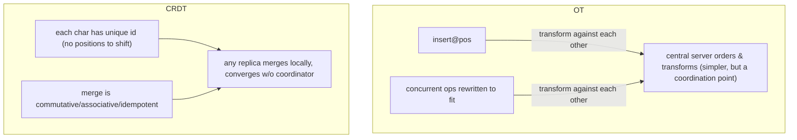

# Distributed Coordination, Locking and Collaborative Editing

Coordination is the discipline of getting many independent machines to agree on
"who is in charge," "who holds this resource right now," and "what is the
current state of this shared thing" — despite crashes, GC pauses, clock skew,
and a network that silently drops and reorders messages. In interviews this
topic is a trap-rich zone: it is easy to reach for a lock, easy to trust a
lease, and easy to say "just use Redlock" — and each of those has a sharp edge.
The strong signal is showing you understand **why coordination is expensive,
what a lock actually guarantees (and does not), and when the right answer is to
avoid coordination entirely.**

A single mental model to carry throughout: **coordination is bought with
round trips and consensus. Every guarantee (mutual exclusion, single leader,
convergent state) costs latency, availability, and complexity. The senior move
is to buy the weakest guarantee that still makes the system correct** — and,
where possible, to design the system so it needs no lock at all (idempotency,
partitioning, CRDTs, single-writer-per-key).

---

## Why coordination is hard

**Intuition.** On one machine, a mutex is trivial: the OS scheduler is the
single source of truth, memory is shared, and "who holds the lock" is one word
in RAM. Distribute the same problem and every convenient assumption breaks. You
have no shared memory, no shared clock, and no reliable way to tell "crashed"
apart from "slow." The core difficulty of distributed coordination is that
**you cannot distinguish a dead node from a slow node from a partitioned node.**

**The three demons.**

- **Unreliable networks.** Messages are dropped, delayed, duplicated, and
  reordered. A partition (network split) can last milliseconds or hours. You
  cannot tell a lost request from a slow one.
- **Unreliable clocks.** Wall-clock time (`gettimeofday`) can jump backward
  (NTP correction, leap seconds), and clocks drift between nodes. You can never
  compare timestamps from two machines and trust the ordering. Monotonic clocks
  don't jump but aren't comparable across machines.
- **Process pauses.** A stop-the-world GC pause, page fault, VM live-migration,
  or `SIGSTOP` can freeze a process for **seconds to minutes** at *any*
  instruction. From the outside this is indistinguishable from a crash — but the
  process later wakes up believing no time has passed and continues where it
  left off. This is the single most important failure mode for locking.

**Why it matters.** Because of process pauses and network delays, a client can
*believe* it holds a lock long after the lock service has expired it and handed
it to someone else. This is the root of nearly every distributed-locking bug.

**The FLP result (context).** The Fischer-Lynch-Paterson impossibility theorem
proves that in a purely asynchronous system (no timing assumptions), no
deterministic consensus algorithm can guarantee termination if even one node
may crash. Practical systems escape FLP by adding **partial synchrony** —
timeouts and failure detectors — which trade guaranteed termination for
"terminates when the network behaves." This is why every real coordination
system leans on timeouts and why liveness (not safety) is the property that
degrades under bad conditions.

**Trade-off framing.** Coordination systems are forced to choose, during a
partition, between **safety** (never do the wrong thing) and **liveness**
(always eventually make progress). A well-designed system keeps safety
unconditionally and sacrifices liveness during partitions. A poorly designed
one (e.g., a lock whose *safety* depends on timing) can do the wrong thing when
timing misbehaves — which is far more dangerous.

---

## Distributed locks and their failure modes

**Intuition.** A distributed lock lets at most one process across the fleet
hold a named resource at a time — a cluster-wide mutex. The naive
implementation is a single row/key: "SET lock:resource = owner IF NOT EXISTS,
with a TTL."

**How it works (the common recipe).**

```
acquire:  SET lock:orderId "clientA-uuid" NX PX 30000   # NX = only if absent, PX = 30s TTL
do work under the lock
release:  if GET lock:orderId == "clientA-uuid": DEL lock:orderId   # atomic via Lua
```

The **TTL is mandatory**: without it, a client that crashes while holding the
lock deadlocks the resource forever. The **owner token** (unique per acquisition)
is mandatory too, so a client only deletes *its own* lock — otherwise a slow
client can delete a lock that has since expired and been re-acquired by another.

**The core failure mode: the lease/pause race.** TTLs create the central danger.
Consider:

```
t0  Client A acquires lock, TTL = 30s
t1  Client A enters a 40s stop-the-world GC pause  (looks dead to everyone)
t30 Lock TTL expires; lock service hands it to Client B
t31 Client B does work, believing it holds the lock
t40 Client A wakes up, STILL believes it holds the lock, writes to storage
    ==> A and B both act as lock holder ==> data corruption
```

No amount of "check TTL before writing" fixes this: the pause can happen
*between* the check and the write. This race exists for **every** TTL-based
lock — Redis, ZooKeeper ephemeral nodes, etcd leases — because the client's
belief about lock ownership can always go stale.

**Other failure modes.**

| Failure | Cause | Effect |
|---|---|---|
| Deadlock | crash while holding, no TTL | resource stuck forever |
| Split-brain lock | partition + independent lock stores | two holders |
| Premature expiry | TTL shorter than work; clock skew | lock stolen mid-work |
| Spurious release | client deletes lock it no longer owns | third party corrupts |
| Thundering herd | many waiters wake on release | load spike, retries |
| Clock-jump expiry | wall-clock TTL + NTP jump | early/late expiry |

**Trade-offs.**

- **TTL length:** short TTL = fast recovery from crashed holders but high risk
  of stealing the lock from a slow-but-alive holder; long TTL = safe against
  pauses but slow recovery and long stalls after a real crash. There is no TTL
  that is both safe and fast — which is exactly why fencing tokens exist.
- **Auto-renewal (lease + heartbeat / "watchdog," e.g. Redisson):** a background
  thread extends the TTL while work proceeds. Improves the TTL dilemma but does
  **not** eliminate the pause race — the watchdog thread pauses too.
- **The real fix is fencing (next section), not a better TTL.**

---

## Redlock and its criticisms

**What Redlock is.** Redlock is an algorithm proposed by Redis's author to make
Redis locks safer by using **N independent Redis masters** (typically 5). To
acquire, a client tries to `SET NX PX` on all N; it holds the lock only if it
gets a **majority (N/2 + 1)** within a time budget, and it subtracts elapsed
time from the effective TTL. Release deletes on all N. The goal: survive the
loss of a minority of Redis nodes without a single point of failure.

**Kleppmann's criticisms (the canonical interview material).**

1. **No fencing tokens.** Even a *perfect* lock cannot prevent corruption on the
   protected resource without a monotonically increasing fencing token that the
   storage layer checks. Redlock's identifier is a random UUID — not monotonic —
   so it provides **no** way for storage to reject a stale writer. Generating a
   monotonic token would itself require consensus, which Redlock lacks.
2. **Safety depends on timing assumptions.** Redlock is only safe in a
   *synchronous* model: bounded network delay, bounded process pauses, and
   bounded clock error. Real systems are only *partially* synchronous. A GC
   pause or a clock jump can cause two clients to believe they hold the lock —
   and because Redlock's **safety** (not just liveness) depends on timing, bad
   timing produces *wrong decisions*, not merely slow ones.
3. **Wall-clock dependence.** Redis expiry uses `gettimeofday`, not a monotonic
   clock. An NTP step or manual clock change on one node can expire keys early
   or late, breaking the majority reasoning.
4. **"Neither fish nor fowl."** For *efficiency* locks, five nodes are
   overkill — one Redis with `SET NX` is enough. For *correctness* locks,
   Redlock is unsafe. So it occupies an awkward middle ground.

**antirez's rebuttal (be fair in interviews).** Redis's author argues that
(a) fencing tokens are orthogonal — if your resource can check a monotonic
token you often don't need a strong lock at all, and Redlock can be extended to
return an incrementing value; (b) the timing model Redlock assumes is
reasonable for many real deployments; (c) delayed-message scenarios also affect
consensus-based locks. The honest interview position: **both are partly right,
but for correctness-critical locking, use a system that gives you a fencing
token (ZooKeeper/etcd) and enforce the token at the resource.**

**Trade-offs / when to use.**

| Approach | Safety | Ops cost | When |
|---|---|---|---|
| Single Redis `SET NX PX` | Efficiency-grade only | Trivial | "don't do duplicate work"; occasional double-run is fine |
| Redlock (5 Redis) | Still efficiency-grade; no fencing | Medium (5 nodes) | Rarely the right call; avoids single Redis SPOF |
| ZooKeeper/etcd lock + fencing token | Correctness-grade | High (consensus quorum) | Money, inventory, "exactly one leader," data integrity |

---

## Fencing tokens and idempotency

**Intuition.** A fencing token turns "I think I hold the lock" into a claim the
*resource itself* can verify. On each lock grant, the lock service issues a
**monotonically increasing** number. The client attaches it to every write. The
storage/service **remembers the highest token it has accepted and rejects any
write carrying a lower token.** A stale holder that wakes from a pause carries an
old, smaller token and is fenced off.

```
Client A acquires lock -> token 33
A pauses (GC)...
Lock expires; Client B acquires -> token 34
B writes to storage with token=34   -> storage records max=34, accepts
A wakes, writes with token=33        -> 33 < 34 -> storage REJECTS
```

**Where the token comes from.** It must be generated with consensus/monotonicity:
- ZooKeeper: the **zxid** (transaction id) or a znode's monotonically increasing
  version / sequential node number.
- etcd: the key's **mod_revision** (or a lease's revision) used with a
  compare-and-swap (`txn`) on write.
- A database sequence guarded by the same transaction.

**Idempotent fencing = fencing + idempotency keys.** Even with a token, retries
and duplicates happen. The robust pattern combines:
1. **Fencing token** to reject *stale* writers (ordering/mutual exclusion), and
2. **Idempotency key** (a client-supplied unique request id the server dedupes
   on) to make a *retried* write a no-op.

This is why many modern systems (Stripe's idempotency keys, payment APIs,
exactly-once-ish pipelines) lean on idempotency rather than distributed locks:
if every operation is idempotent and carries a version/token, you tolerate
duplicates and stale actors without cluster-wide mutual exclusion.

**Trade-offs.**
- Fencing requires the **protected resource to participate** (check the token).
  If storage can't check tokens (e.g., a dumb blob store with no conditional
  write), fencing is impossible and you must rely on the lock alone — weaker.
- Idempotency requires **dedup state** (a store of seen keys with a retention
  window) — extra storage and a cleanup policy, but far cheaper and more robust
  than perfect locking.
- Together they let you use a *cheap* efficiency-lock (or no lock) and still be
  correct, because correctness now lives at the resource, not the lock.

---

## ZooKeeper, etcd, and Consul as coordination services

**Intuition.** Rather than build locking/leader-election on a database, teams
use a purpose-built **coordination service**: a small, strongly-consistent,
replicated key-value/tree store with primitives for ephemeral state, watches,
and atomic compare-and-set. These are the "kernel" of many distributed systems.

**The three players.**

| Service | Consensus | Data model | Signature features | Used by |
|---|---|---|---|---|
| **ZooKeeper** | ZAB (Paxos-like) | Hierarchical znodes (tree) | Ephemeral & sequential nodes, watches, zxid | Kafka (pre-KRaft), HBase, Hadoop, Solr |
| **etcd** | Raft | Flat key-value, MVCC revisions | Leases, watch, mod_revision, gRPC | Kubernetes (all cluster state), CoreDNS |
| **Consul** | Raft | KV + native service catalog | Service discovery, health checks, DNS, sessions | HashiCorp stack, service mesh |

**Core primitives (ZooKeeper vocabulary, mirrored elsewhere).**
- **Ephemeral node:** a key tied to a client session; auto-deleted when the
  session's heartbeats stop. This is how "liveness" is expressed — perfect for
  leader election and lock ownership.
- **Sequential node:** the service appends a monotonic counter to a created
  node's name — a built-in fencing-token / queue-position generator.
- **Watches:** a client subscribes to a node and is notified on change,
  avoiding polling. Essential for reacting to leader loss.
- **Linearizable writes via consensus:** every write goes through a quorum, so
  all clients see a single agreed order.

**Correct lock recipe (ZooKeeper "recipe").** Create an ephemeral **sequential**
node under `/lock/`. You hold the lock iff your node has the lowest sequence
number. Otherwise, **watch only the node immediately before yours** (not all of
them — that avoids the herd) and wait. On crash, your ephemeral node vanishes
and the next waiter is notified. The sequence number *is* your fencing token.

**Trade-offs.**
- **Strong consistency has a cost:** every write is a quorum round trip
  (~single-digit to low-tens of ms within a region), and throughput is bounded
  by the leader. These systems are for **low-volume, high-value metadata**
  (config, membership, leases) — **not** high-QPS application data.
- **Cluster size:** an odd number (3 or 5) of voting members. 3 tolerates 1
  failure, 5 tolerates 2. More members = more fault tolerance but *slower*
  writes (bigger quorum). Rarely go past 5–7 voters; use non-voting learners to
  scale reads.
- **Availability model:** these are **CP** — during a partition the minority
  side stops serving writes (and linearizable reads) to preserve safety. If you
  need writes to always succeed, this is the wrong tool.
- **ZooKeeper vs etcd:** ZooKeeper's tree + rich recipes + huge ecosystem
  maturity vs etcd's simpler API, gRPC/HTTP, MVCC revisions, and Kubernetes
  gravity. Consul adds first-class service discovery and health checking, so
  pick it when discovery is the primary need.
- **The modern trend:** systems are *removing* external ZooKeeper dependencies
  by embedding Raft directly — Kafka **KRaft** replaces ZooKeeper, and many
  databases embed their own Raft. Fewer moving parts, one less thing to operate.

---

## Leader election

**Intuition.** Many systems need exactly one node to be "in charge" — the writer,
the scheduler, the coordinator — to avoid conflicting decisions. Leader election
is the process of picking that one node and, crucially, **agreeing** on it.

**How it works.**
- **Via a coordination service (most common):** candidates race to create the
  same ephemeral node (or lowest sequential node) in ZooKeeper/etcd. The winner
  is leader; others watch and take over when the ephemeral node disappears.
  Correctness comes free from the service's consensus.
- **Via a consensus protocol directly:** Raft *elects a leader as part of the
  protocol* — nodes start elections on timeout, vote, and a candidate with a
  majority becomes leader for a **term** (a monotonic epoch number). ZAB does the
  same for ZooKeeper.
- **Bully / Ring algorithms:** classic textbook algorithms (highest-id wins /
  token passing). Simple but assume reliable failure detection and are rarely
  used in production versus consensus-backed election.

**The epoch / term = fencing for leaders.** Every leadership grant carries a
monotonically increasing **term/epoch**. Followers and downstream systems reject
messages from an *older* term. This fences a deposed-but-unaware "zombie leader"
that was partitioned and still thinks it leads — the direct analog of a fencing
token for locks.

**Failure modes.**
- **Split-brain:** two nodes both believe they are leader (partition + weak
  election). Prevented by requiring a **majority quorum** to be elected and by
  epoch checks on every action.
- **Flapping:** unstable network causes rapid re-elections; each election halts
  progress. Mitigated with randomized election timeouts and back-off.
- **Herd on failover:** all followers try to become leader at once. Randomized
  timeouts and "watch only your predecessor" recipes reduce this.

**Trade-offs.**
- **Single leader** = simple reasoning, a natural serialization point, easy
  strong consistency — but a **throughput ceiling** (all writes funnel through
  one node) and a **failover gap** (seconds of unavailability during
  re-election). Great for coordinators/metadata; a bottleneck for hot data.
- **Leaderless (Dynamo-style quorums)** = no election, no failover gap, high
  availability — but no single serialization point, so you get concurrent
  writes, conflicts, and eventual consistency to resolve. Different problem
  class entirely.
- **Election speed vs stability:** short election timeouts recover fast but
  flap under jitter; long timeouts are stable but extend the unavailability
  window after a real crash.

---

## Distributed mutual exclusion trade-offs, safety versus liveness

**Intuition.** "Distributed mutual exclusion" is the general problem of ensuring
at most one process is in a critical section across the network. Locks are one
implementation. The deep interview point is the **safety vs liveness** framing.

- **Safety:** "nothing bad ever happens" — here, *never two holders at once*.
  A safety violation corrupts data.
- **Liveness:** "something good eventually happens" — here, *a requester
  eventually gets the lock*, no deadlock, no starvation.

**The fundamental tension (why you cannot have it all).** During a partition,
you must choose:
- **Favor safety:** refuse to grant the lock unless you can *prove* (via quorum)
  no one else holds it. The minority side blocks → **liveness suffers** (CP).
- **Favor liveness:** let a node take the lock optimistically so work proceeds →
  you risk two holders → **safety suffers** (AP).

You cannot maximize both under partition. Good systems make **safety
unconditional and let liveness degrade** (block/timeout) — because a stalled
system is recoverable, a corrupted one often is not. TTLs are a liveness
mechanism (they guarantee eventual release even if a holder dies), but a TTL
*trades away* safety (the pause race), which is why fencing is needed to restore
safety without sacrificing the liveness the TTL bought.

**Classic algorithm trade-offs (rarely built by hand today, but interviews ask).**

| Algorithm | Messages/entry | SPOF | Notes |
|---|---|---|---|
| Central coordinator | 3 (req, grant, release) | Yes (coordinator) | Simple, fast; coordinator failure halts all |
| Token ring | 1..∞ (token circulates) | Token loss | No starvation; latency = ring traversal |
| Ricart-Agrawala (quorum of all) | 2(N-1) | No | Fully distributed; expensive, N-sensitive |
| Consensus-backed (ZK/etcd) | quorum RTT | No (quorum) | What people actually use |

**Trade-offs.**
- **Coarse-grained lock (one lock for a big region):** simple, few locks to
  manage, but low concurrency and a hotspot. Pick when contention is low or
  correctness dominates.
- **Fine-grained locks (per-row/per-key):** high concurrency but many locks,
  ordering rules to avoid deadlock, more overhead. Pick under high contention on
  independent items.
- **Optimistic (no lock; version-check on commit, e.g. CAS/OCC):** best
  throughput under low contention, no holding cost, no deadlock — but wasted
  work and retries under high contention. Pessimistic locking wins when
  conflicts are frequent and retries expensive.

---

## Consensus as the foundation

**Intuition.** Under every correct lock, leader election, and linearizable store
sits **consensus**: getting a majority of nodes to agree on a single value (or a
single ordered log of values) even when some nodes fail. Locking is essentially
"agree that X holds the lock now" — a consensus decision. This is why
*correctness-grade* coordination is impossible without consensus, and why
consensus systems are the substrate.

**How it works (Raft, the interview-friendly one).**
- A **single leader** per **term** is elected by majority vote.
- Clients send commands to the leader, which appends to a **replicated log** and
  ships entries to followers.
- An entry is **committed** once a **majority** has persisted it; committed
  entries are applied to the state machine in log order (state-machine
  replication → every node ends in the same state).
- On leader crash, a new election picks a leader whose log is at least as
  up-to-date, preserving committed entries. Terms fence old leaders.

**Paxos vs Raft vs ZAB.** Paxos (and Multi-Paxos) is the original, famously hard
to understand and implement correctly. **Raft** was designed for
understandability with explicit leader election, log matching, and membership
change — now the default (etcd, Consul, CockroachDB, TiKV, many others). **ZAB**
is ZooKeeper's protocol, similar in spirit (leader + ordered broadcast).

**Trade-offs.**
- **You need a majority (quorum) alive to make progress.** 2f+1 nodes tolerate f
  failures. This is the CP contract: partition off the majority and the minority
  cannot commit — safety over availability.
- **Latency floor:** every committed write costs at least one round trip to a
  majority (often cross-AZ, single-digit to tens of ms). You cannot have
  linearizable, fault-tolerant writes cheaper than a quorum round trip. This is
  the *irreducible cost of coordination* and the reason to avoid it on hot
  paths.
- **Throughput ceiling:** all writes serialize through the leader's log.
- **Geo-distribution:** a quorum spanning continents pays WAN latency on every
  write. Mitigations: keep the quorum in one region, use hierarchical/paxos
  variants, or relax consistency. (This is why global systems like Spanner pair
  Paxos groups with TrueTime, and why many go eventually consistent instead.)

---

## Collaborative editing with Operational Transformation

**Intuition.** Real-time collaborative editing (Google Docs, classic
Etherpad) lets many people edit the same document at once with sub-second
feedback and eventual convergence to an identical result. **Operational
Transformation (OT)** achieves this by sending *operations* ("insert 'x' at
position 5", "delete char at 3") and **transforming** concurrent operations
against each other so they still make sense after the document has shifted
underneath them.

**How it works.** If Alice inserts at position 2 and Bob concurrently inserts at
position 5, when Bob's op arrives at Alice's replica it must be *transformed* to
account for Alice's insert having shifted everything after position 2. A
**transformation function** `transform(opA, opB)` produces adjusted operations so
that applying them in different orders yields the same final document. A
**central server** typically serializes operations, assigns an order, and
transforms/relays them to all clients — this central authority makes OT far
simpler and is how Google Docs works.

**Real usage.** Google Docs, Google Wave (its origin), Etherpad, Microsoft
Office co-authoring (variant), most mature text editors.

**Trade-offs.**
- **Compact on the wire and in storage:** operations are tiny (position +
  char); no per-character metadata bloat. This is OT's biggest advantage over
  CRDTs for large text documents.
- **Correctness is hard:** writing correct transformation functions for all
  operation pairs is notoriously error-prone; several published OT algorithms
  were later shown to be wrong. Complexity explodes with rich content (tables,
  images, formatting).
- **Usually needs a central server:** most practical OT relies on a server to
  order operations. That server is a coordination point (and SPOF) — great for a
  centralized SaaS, poor for peer-to-peer/offline-first.
- **Poor fit for deep offline / P2P:** long-divergent histories are hard to
  transform. Pick OT when you have a central server, mostly-online users, and
  large plain-ish text where metadata overhead matters.

---

## Collaborative editing with CRDTs

**Intuition.** **Conflict-free Replicated Data Types (CRDTs)** are data
structures designed so that concurrent, independent updates on different
replicas can be merged **automatically and deterministically**, with a
mathematical guarantee that all replicas converge to the same state **regardless
of the order** in which updates arrive — *without* a central coordinator.

**How it works.** CRDTs restrict operations to ones that are **commutative,
associative, and idempotent** (or use a merge function forming a
join-semilattice). Two families:
- **State-based (CvRDT):** replicas exchange full state and `merge()` via a
  least-upper-bound. Simple math, heavy to ship.
- **Operation-based (CmRDT):** replicas broadcast operations that commute;
  needs reliable causal delivery but is lighter on the wire.

For text, sequence CRDTs (RGA, Logoot, LSEQ, Yjs's YATA, Automerge) give each
character a **unique, immutable, globally-orderable identifier** so inserts never
need position transformation, and deletes become **tombstones** (marked, not
removed) so concurrent edits referencing them still resolve.

**Real usage.** Figma (CRDT-*inspired*, centralized), Apple Notes, Automerge,
Yjs (powers many editors), Redis CRDTs (Active-Active), Riak, Teletype for Atom,
Linear, local-first apps.

**Trade-offs.**
- **No central authority required → offline-first and P2P friendly:** edit
  offline for days, sync later, guaranteed convergence. This is the killer
  advantage and why "local-first" software uses CRDTs.
- **Metadata overhead:** unique ids per element and tombstones for deletions can
  make the structure much larger than the visible content; tombstones accumulate
  and need garbage collection. Historically a big cost, now much reduced (Yjs,
  Automerge's columnar encoding).
- **"Converges" ≠ "converges to what a human wanted":** CRDTs guarantee all
  replicas agree, not that the merged result matches user intent (e.g.,
  interleaved concurrent typing can produce technically-consistent but garbled
  text). Intent preservation is an open, editor-specific concern.
- **Complexity moves, it doesn't vanish:** the merge logic is provably correct
  but the algorithms and encodings are intricate.

---

## Operational Transformation versus CRDTs deep trade-offs

This is the marquee comparison of the collaborative-editing subtopic.



| Dimension | Operational Transformation | CRDT |
|---|---|---|
| Central server | Usually required (orders ops) | Not required (P2P/offline OK) |
| Convergence proof | Depends on correct transform fns | Mathematically guaranteed by structure |
| Wire/storage size | Compact (ops are tiny) | Heavier (ids + tombstones), improving |
| Implementation risk | High (transforms hard, some published ones buggy) | Merge is safe, but structures intricate |
| Offline / long divergence | Weak | Strong |
| Intent preservation | Often better (server context) | Can garble concurrent interleavings |
| Rich content (tables/objects) | Hard to extend | Composable across CRDT types |
| Exemplars | Google Docs, Etherpad, Office | Figma(-inspired), Apple Notes, Yjs, Automerge |

**Decision guidance.**
- **Central SaaS, mostly-online, large text, want minimal bandwidth →** OT (or
  a Figma-style server-authoritative last-writer-wins on properties for
  non-text object graphs).
- **Offline-first, P2P, local-first, multi-device sync, unreliable connectivity
  →** CRDT.
- **Structured object/graph editor (design tools) →** a **hybrid**: a central
  server as authority (like OT) but CRDT-*inspired* per-property
  last-writer-wins (Figma's approach) — you drop OT's transform complexity *and*
  CRDT's decentralization overhead because the server can define event order.
- **Modern reality:** the industry has trended toward CRDTs (Yjs/Automerge) for
  new local-first apps because bandwidth is cheap and library maturity closed
  the overhead gap, while Google Docs' OT investment keeps it on OT.

---

## Presence and awareness

**Intuition.** Presence is the "who's here and what are they doing" layer:
online/offline status, live cursors, selections, "user is typing," avatars. It
feels like part of collaboration but has **fundamentally different requirements**
from the document itself.

**How it works.** Presence is **ephemeral, high-frequency, and disposable**:
cursor positions change many times a second, and stale presence data is
worthless. It is typically carried over a separate channel — WebSockets, or a
pub/sub layer (Redis pub/sub, a dedicated presence service) — with **no
durability** (you never persist last frame's cursor) and often **best-effort /
last-write-wins** semantics. Yjs ships a dedicated "awareness" protocol distinct
from the document CRDT for exactly this reason. Servers track live sessions
(heartbeats, ephemeral entries) and fan out deltas.

**Capacity / back-of-envelope.** A doc with 50 active editors, cursor updates at
~10 Hz, ~50 bytes each: 50 × 10 × 50 B = 25 KB/s per doc egress *per subscriber*,
so fan-out (N² within a room) dominates. Rooms of thousands (e.g., large live
docs, Figma files) need throttling/coalescing (send at 20–30 Hz max, drop
intermediate frames) and regional edge fan-out. Presence QPS usually **dwarfs**
document-edit QPS, which is why it rides a separate, cheaper, lossy path.

**Trade-offs.**
- **Separate presence from document state:** presence must be fast and can be
  lossy; document state must be durable and convergent. Coupling them forces the
  durable path to carry junk load. Keep them on different channels/consistency
  models.
- **Consistency:** presence tolerates eventual/last-write-wins and message loss
  (a missed cursor frame is invisible next frame). Never spend
  consensus/durability budget on it.
- **Scale via fan-out topology:** direct N² per room is fine for small rooms;
  large rooms need a pub/sub broker or edge relays and aggressive coalescing.

---

## When a lock is the wrong tool

**Intuition.** The senior instinct is that reaching for a distributed lock is
often a design smell. Distributed locks are expensive, fragile (pause race),
and a bottleneck — frequently the real problem can be *removed* so no cluster-
wide mutual exclusion is needed.

**Better alternatives to a distributed lock.**

| Instead of a lock… | Use | Why it's better |
|---|---|---|
| "Only process each order once" | **Idempotency key** + dedup store | Duplicates become no-ops; tolerates retries and stale actors |
| "Serialize writes to entity X" | **Partition by key** (single writer per key/shard, e.g. Kafka partition, actor model) | Ordering for free; no contention across keys; scales horizontally |
| "Prevent lost updates" | **Optimistic concurrency (version/CAS, conditional write)** | No holding cost; great under low contention; DB enforces it |
| "One node do the cron job" | **Leader election** (a lease is a lock, but bounded to one well-defined role) | Purpose-built, with epoch fencing |
| "Merge concurrent edits" | **CRDT / OT** | Convergence without mutual exclusion |
| "Rate/quota control" | **Token bucket in a store**, not a lock | Locks serialize; counters don't |

**When a lock IS appropriate.** Short, infrequent critical sections over a
resource that *cannot* be partitioned or made idempotent; leader/singleton
election (a scoped lease); coarse operational guards (one migration at a time).
Even then: prefer a **lease with fencing tokens** over a bare lock, and be honest
about whether it's an *efficiency* lock (occasional double-run tolerable → cheap
single-Redis lock) or a *correctness* lock (must be consensus-backed + fenced).

**Trade-offs / heuristics.**
- **Partitioning > locking** when work can be sharded by key: it removes
  contention entirely and scales, at the cost of a routing layer and hot-key
  risk.
- **Idempotency > locking** when the operation can be made repeatable: it
  tolerates the pause race and duplicates for free, at the cost of dedup storage.
- **Optimistic > pessimistic** under low contention; **pessimistic > optimistic**
  under high contention (retries thrash).
- **A lock's cost is not just latency:** it's the availability hit (lock service
  down → everyone blocked), the bottleneck, and the correctness debt of the
  pause race. Always ask "can I design the lock away?" before "which lock?"

---

## Trade-offs and when to use what

A consolidated decision guide.

**1. Do you even need coordination?** First try to remove it: partition by key
(single writer per shard), make operations idempotent, use optimistic
concurrency, or use a CRDT/OT. If those cover it, you avoid the latency,
availability, and complexity of a lock/consensus entirely.

**2. Efficiency lock vs correctness lock (Kleppmann's dividing line).**
- *Efficiency* (avoid duplicate work; a rare double-run is a minor cost) →
  single Redis `SET NX PX`. Cheap, document that it's approximate. Redlock is
  usually not worth it.
- *Correctness* (double action corrupts data / loses money) → consensus-backed
  lock (ZooKeeper/etcd) **plus a fencing token enforced at the resource**, or
  redesign around idempotency.

**3. Choosing a coordination service.**

| Need | Pick |
|---|---|
| K8s-native, gRPC, simple KV, leases | **etcd** |
| Rich recipes, tree model, huge Hadoop/Kafka legacy ecosystem | **ZooKeeper** |
| Service discovery + health checks + KV in one | **Consul** |
| Don't want to operate an external ensemble at all | **embedded Raft** (KRaft-style) |

**4. Leader vs leaderless.** Single leader (consensus) for a serialization point
and strong consistency, accepting a throughput ceiling and failover gap.
Leaderless quorum (Dynamo-style) for max availability and no failover, accepting
conflicts and eventual consistency.

**5. Collaborative editing.** OT for central-server large-text (Google Docs);
CRDT for offline-first/P2P/local-first (Yjs, Automerge); Figma-style
server-authoritative LWW-per-property for structured object graphs. Always split
**presence** (ephemeral, lossy, separate channel) from **document state**
(durable, convergent).

**6. The irreducible costs to name in an interview.**
- Any linearizable, fault-tolerant write ≥ one quorum round trip (can't beat it).
- Any TTL lock has the pause race → needs fencing for correctness.
- Any single leader is a throughput ceiling and a failover-gap risk.
- Any CP coordination service goes unavailable for writes on the minority side
  of a partition — by design.

---

## Common interview follow-up questions

1. "You have `SET NX PX` in Redis for a lock. Walk me through exactly how a GC
   pause corrupts data, and how a fencing token fixes it."
2. "Why does Kleppmann say Redlock is unsafe for correctness? What does antirez
   say back? Where do you land?"
3. "Where does the fencing token come from in ZooKeeper? In etcd? What must the
   *resource* do with it?"
4. "Design a distributed cron/scheduler that runs each job exactly once across a
   fleet. Lock, leader election, or idempotency — defend your choice."
5. "Contrast safety and liveness for a distributed lock. During a partition,
   which do you sacrifice and why?"
6. "Why is a single external ZooKeeper a scaling and operational concern, and
   why is Kafka moving to KRaft?"
7. "Explain why any fault-tolerant linearizable write costs at least a quorum
   round trip. What does that imply for geo-distributed writes?"
8. "OT vs CRDT for a new collaborative editor — walk me through the decision.
   Why did Figma pick neither in pure form?"
9. "Why keep presence/cursors on a separate channel from the document? What
   consistency does presence need?"
10. "Give me three designs that let you avoid a distributed lock entirely, with
    the trade-off of each."
11. "Two nodes both think they're leader. How did that happen and how does the
    system prevent damage?"
12. "How many nodes in a Raft/ZooKeeper cluster and why odd? What does adding
    more buy and cost?"

---

## References

- Martin Kleppmann, "How to do distributed locking" (2016) —
  https://martin.kleppmann.com/2016/02/08/how-to-do-distributed-locking.html
  (fencing tokens, GC pause race, Redlock critique, efficiency vs correctness).
- Salvatore Sanfilippo (antirez), "Is Redlock safe?" rebuttal —
  http://antirez.com/news/101 and the Redis Redlock docs —
  https://redis.io/docs/latest/develop/use/patterns/distributed-locks/
- Martin Kleppmann, *Designing Data-Intensive Applications* (DDIA), Ch. 8–9
  (unreliable clocks, process pauses, fencing tokens, consensus, linearizability).
- Diego Ongaro & John Ousterhout, "In Search of an Understandable Consensus
  Algorithm" (Raft) — https://raft.github.io/ and the Raft visualization
  https://thesecretlivesofdata.com/raft/
- Apache ZooKeeper recipes (locks, leader election, queues) —
  https://zookeeper.apache.org/doc/current/recipes.html
- etcd concurrency / lease / mvcc docs — https://etcd.io/docs/ and
  Kubernetes' use of etcd for cluster state.
- Figma engineering, "How Figma's multiplayer technology works" —
  https://www.figma.com/blog/how-figmas-multiplayer-technology-works/
- Shapiro et al., "A comprehensive study of Convergent and Commutative
  Replicated Data Types" (CRDT foundational paper), and https://crdt.tech/
- Yjs (YATA CRDT + awareness protocol) — https://docs.yjs.dev/ ; Automerge —
  https://automerge.org/
- Kafka KRaft (removing ZooKeeper) — https://developer.confluent.io/learn/kraft/
- Stripe, "Designing robust and predictable APIs with idempotency" —
  https://stripe.com/blog/idempotency
- ByteByteGo, *System Design Interview* Vols. 1–2 (Alex Xu) and the ByteByteGo
  blog/newsletter (distributed locks, leader election, consensus explainers).
- YouTube: Hussein Nasser ("Distributed Locks"), ByteByteGo ("Distributed
  Locks", "Raft"), Martin Kleppmann's Cambridge distributed-systems lectures,
  "Jordan has no life" (consensus, CRDTs, distributed locking) series.
