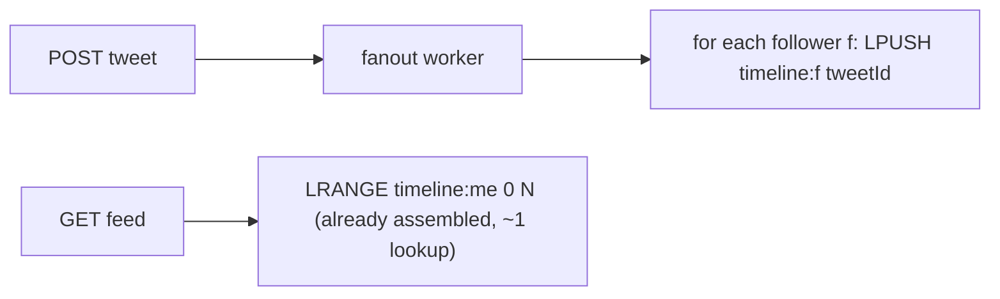
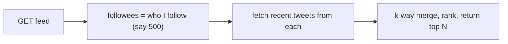
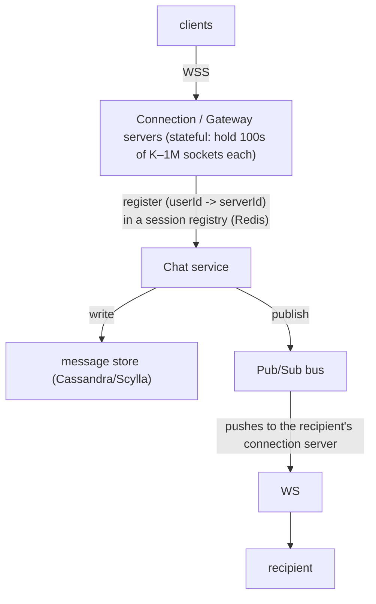
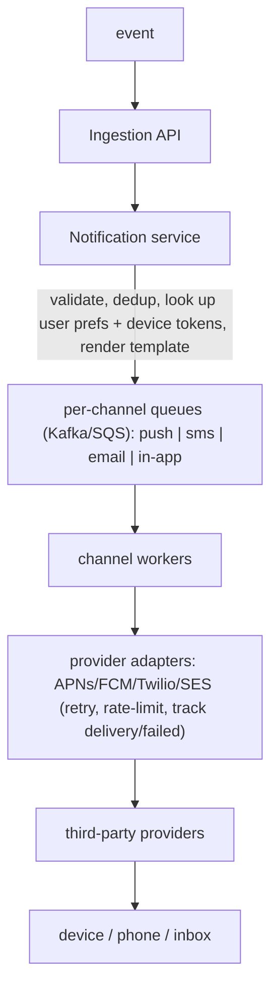
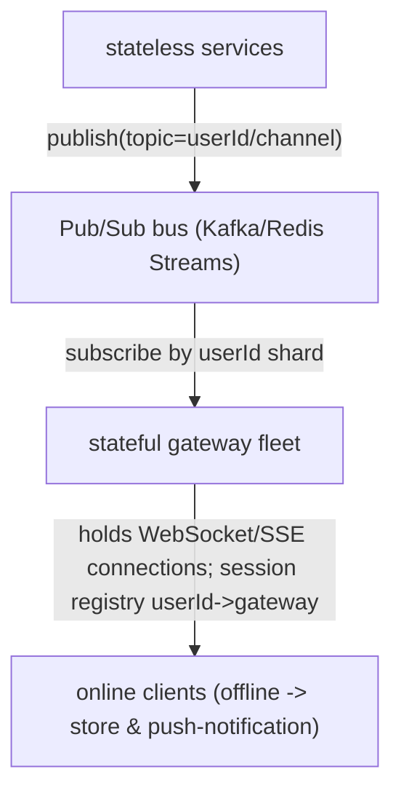

# Design Social Feed, Twitter, Chat, and Notification System

These three problems (news feed, chat/messaging, notifications) share one DNA: a
**fan-out** step that turns one write into many reads or many deliveries, plus a
**real-time delivery** layer. The whole interview is won or lost on how you reason
about *where* to do the fan-out (on write vs on read), *how* you handle the
skewed-degree "celebrity" problem, and *what consistency you give up* for latency
and cost. Naming Kafka or Cassandra scores nothing; articulating the trade-off of
each choice against the stated constraints scores everything.

This doc ends nearly every section in trade-offs, and there is a dedicated
"Trade-offs and when to use what" section near the end.

---

## Requirements, scale estimation, and the API surface

**Intuition.** Before choosing an architecture, pin the numbers. All three
systems are write-amplifying: a single post/message/event produces work
proportional to the audience size. The audience distribution (uniform vs
power-law) dictates the whole design.

**Functional scope (typical Twitter-scale prompt)**
- Post a tweet (text + media ref), follow/unfollow, view home timeline, view a
  user's own profile timeline, like/retweet. Feed ranking. Notifications.
- Chat: 1:1 and group messaging, delivery + read receipts, presence, message
  history, offline delivery.
- Notifications: multi-channel (push/SMS/email/in-app), user preferences,
  dedup, rate limits, priority.

**Non-functional targets.** Home-timeline read p99 < 200 ms; message delivery to
online recipient < 500 ms end-to-end; feed availability > reads-consistency
(stale feed is fine, a *down* feed is not — AP over CP for the feed). Chat wants
per-conversation ordering and durability. Notifications want at-least-once
delivery with dedup.

**Back-of-envelope (Twitter-ish).**
- 300M DAU, each opens the app ~10x/day → **3B timeline reads/day ≈ 35K reads/sec
  average, ~100K+ peak.** Reads dominate writes ~100:1.
- 300M users post ~2 tweets/day → 600M writes/day ≈ **7K writes/sec avg, ~15K
  peak.**
- Average fan-out (followers per poster) ~ hundreds; power-law tail into the
  **100M+ followers** for top accounts.
- Fan-out-on-write cost: 7K writes/sec × ~500 avg followers ≈ **3.5M timeline
  inserts/sec** — this is why the celebrity tail must be special-cased.
- Storage per tweet: ~300 bytes text + metadata; 600M/day × 300B ≈ **180 GB/day**
  of tweet bodies (media stored separately in blob/CDN). Timelines are far larger
  because they are denormalized copies — bound them (e.g., cache last ~800
  entries/user).
- Chat (WhatsApp-scale): 100B+ messages/day ≈ **1M+ msgs/sec avg**; a single
  connection server holds **~1M persistent WebSocket connections** with tuned
  epoll/kqueue; message body ~100 bytes.

**API surface (REST + realtime).**
```
POST /v1/tweet            {text, mediaIds}         -> tweetId (Snowflake)
GET  /v1/feed?cursor=...  -> [tweet], nextCursor   (cursor pagination, never offset)
POST /v1/follow/{userId}
WS   /v1/chat  (bidirectional: SEND, ACK, RECEIPT, PRESENCE, TYPING)
POST /v1/notify {userId, type, channels, payload, dedupKey, priority}
```
Cursor-based pagination (opaque cursor = last seen Snowflake/score) is mandatory:
offset pagination breaks and duplicates rows when the feed mutates under you.

**Trade-off.** Spending the first minutes on numbers is not filler — it's what
justifies "hybrid fan-out" over "pure fan-out-on-write." If you cannot show that
3.5M inserts/sec is the problem, you cannot defend the solution.

---

## News feed: fanout-on-write, fanout-on-read, and hybrid

This is the single most important section. The question: when user A posts, how
does it reach the home timelines of A's followers?

**Fanout-on-write (push / precompute).** At post time, look up A's followers and
**insert the tweet id into each follower's materialized timeline** (a per-user
list in Redis/an inbox table). Reads are then trivial: read your own precomputed
list.

- **Gain:** blazing-fast reads (O(1) list read, sub-10ms from Redis), read path
  trivially cacheable, ranking can be done incrementally. Best when read:write is
  high (it is, ~100:1).
- **Give up:** write amplification. One celebrity post = 100M inserts. Wasted
  work for inactive followers. Timelines are duplicated storage. New follow needs
  backfill.

**Fanout-on-read (pull / on-demand).** Store only the author→tweets mapping. At
read time, look up everyone A follows, **fetch their recent tweets, merge-sort by
time/score.**

- **Gain:** zero write amplification, no wasted storage, always fresh, trivial for
  celebrities (their tweets are read on demand). Best when write:read is high or
  followee counts are small.
- **Give up:** expensive, high-variance reads (hundreds of fan-in queries per
  timeline load), hard to hit a 200ms p99 at scale, cache-unfriendly.

**Hybrid (the real answer).** Push for most users; **pull for celebrities.**
When A posts, if A has < threshold (e.g., 10K–100K) followers, fan out on write.
If A is a celebrity, **do not fan out**; store the tweet in A's own tweet list.
At read time, a user's timeline = their precomputed push timeline **merged with**
freshly pulled tweets from the small set of celebrities they follow.
```
Home timeline = merge( precomputed_inbox(me),
                        pull_recent(celebrities_I_follow) )
```
This bounds write amplification (no 100M-insert storms) while keeping reads cheap
for the common case (you follow only a handful of celebrities).

**Comparison.**

| Dimension | Fanout-on-write | Fanout-on-read | Hybrid |
|---|---|---|---|
| Read latency | Excellent (1 lookup) | Poor (N fan-in) | Excellent |
| Write cost | High (× followers) | Minimal | Bounded |
| Freshness | Slight delay (async fanout) | Real-time | Mixed |
| Celebrity safe | No (fanout storm) | Yes | Yes |
| Storage | High (duplicated) | Low | Medium |
| Complexity | Medium | Low | High |
| Used by | Instagram feed, early Twitter | small/niche | **Twitter, modern feeds** |

**Real systems.** Twitter historically used fanout-on-write ("timeline
injection") with celebrity carve-outs. Instagram uses push-heavy fanout. The
industry-standard interview answer is **hybrid**.

**Trade-off summary.** Pick push when reads dominate and audiences are bounded;
pull when writes dominate or fan-in is small; hybrid when the follower
distribution is power-law (real social graphs always are).

---

## The celebrity, hot-key, problem

**Intuition.** Social graphs are power-law: most users have hundreds of
followers, a few have 100M+. Fanout-on-write for a 100M-follower account is a
"thundering herd" write of 100M timeline inserts per tweet — it saturates the
fanout workers, delays everyone else's fanout, and hammers a few hot Redis
shards.

**How it's handled.**
- **Threshold-based hybrid:** accounts above a follower threshold are excluded
  from write fanout; their posts are pulled at read time (see above).
- **Read-time merge with caching:** the celebrity's recent tweets are cached once
  (a single hot read key with high fan-in reads), served to all readers — turning
  100M writes into 1 cached read fanned to many.
- **Request coalescing:** if 1M users load the timeline simultaneously and each
  needs the same celebrity tweet, coalesce into one backend fetch (Discord's
  Rust data services do exactly this — dedup concurrent identical reads).
- **Async, prioritized fanout:** even for non-celebrities, fanout is a background
  job on a queue; active followers first, dormant followers lazily/never.

**Hot-key also appears in chat and notifications.** A viral group chat or a
"breaking news" notification to 50M users is the same hot-partition problem:
partition by channel/topic, coalesce, and rate-shape the fanout.

**Trade-off.** The threshold is a tuning knob: too low and you pull for too many
users (read cost climbs); too high and fanout storms return. The merge adds read
complexity and one more failure mode (celebrity cache miss). But without the
carve-out, a single celebrity tweet can brown out the whole write path — this is
non-negotiable at scale.

---

## Timeline storage and feed caching

**Intuition.** The home timeline is a **materialized, bounded, per-user list of
tweet ids** — not full tweets. Store ids + rank score; hydrate full tweet content
from a separate store/cache at read time. This keeps timelines small and lets you
share one copy of each tweet body.

**Layout.**
```
timeline:{userId}  -> [ (tweetId, score), ... ]   # Redis sorted set / list, cap ~800
tweet:{tweetId}    -> {authorId, text, mediaIds, ts, counts}   # KV store + cache
graph: followers/following edges  -> sharded by userId
```
- **Bound the list.** Keep only the most recent ~800 entries per user; older →
  fall back to pull/DB. 99% of reads touch the first page. Unbounded timelines
  explode storage (300M users × huge lists).
- **Hydration.** Read timeline ids → multi-get tweet bodies from cache (Redis) →
  DB on miss. Denormalize hot counters (likes/retweets) or fetch separately.
- **Persistence.** Redis timelines are a cache; the source of truth is the tweet
  store + follow graph, so a cache flush rebuilds via fanout/pull. Some designs
  persist inboxes in Cassandra (wide rows keyed by userId) for durability.

**Storage choices.** Tweets: a wide-column store (Cassandra/ScyllaDB) or sharded
KV — append-heavy, immutable, partition by tweetId (Snowflake) for even spread.
Timelines: Redis for the hot working set. Media: object store (S3) + CDN, never
in the DB.

**Trade-offs.**
- Storing **ids not bodies** trades a second hydration lookup for massive storage
  savings and single-source-of-truth edits (edit tweet once, all timelines see
  it). Storing full bodies in the timeline avoids the hydration hop but duplicates
  data and makes edits/deletes fan out again.
- **Bounding** timelines trades tail-history read cost (rare, falls to pull) for
  bounded memory (common, huge win).
- **Redis cache vs durable inbox:** cache is cheaper and faster but a cold cache
  after failover causes a rebuild storm; durable inbox survives restarts but costs
  more writes. Warm caches gradually or dual-source during rebuild.

---

## Feed ranking: chronological versus machine-learned relevance

**Intuition.** "What order?" Reverse-chronological is simplest and predictable;
modern feeds use ML ranking to maximize engagement, which reorders by predicted
relevance, not time.

**Chronological.** Sort by timestamp (Snowflake id sorts by time). Trivial,
transparent, real-time. Used by Twitter's "Latest" tab, Slack, chat.

**ML-ranked (relevance).** A two-stage funnel:
1. **Candidate generation / retrieval.** Gather candidates from multiple sources:
   in-network (people you follow), out-of-network (recommendations, embeddings /
   **vector-DB ANN** nearest-neighbor on user & content embeddings), trending.
   Twitter's open-sourced algorithm pulls ~1500 candidates ~50/50 in/out-network.
2. **Ranking.** A heavy ML model scores each candidate on p(engagement) — likes,
   replies, dwell time, etc. Then heuristics/filters (dedup, author diversity,
   "show fewer", NSFW, already-seen).

**Modern patterns.** Feature stores serve precomputed user/content features at
low latency; embeddings + ANN vector search power out-of-network discovery;
near-real-time streaming (Kafka/Flink) updates engagement counters and features;
some systems add GenAI/LLM re-ranking or summaries. Ranking usually happens at
**read time on a bounded candidate set** even when delivery is fanout-on-write —
you fan out ids, then rank the top page per request with fresh features.

**Trade-offs.**
- Chronological: transparent, cheap, no ranking infra, real-time — but low
  engagement and buries good older content. Pick for chat, "latest" views, and
  when trust/transparency matter.
- ML ranking: higher engagement and better cold-start via out-of-network — but
  huge infra (feature store, model serving, ANN index), non-deterministic,
  harder to debug ("why did I see this?"), and filter-bubble/feedback-loop risks.
  Pick when engagement is the business metric and you can fund the ML platform.
- **Rank on write vs read:** ranking on read gives freshest features and
  personalization per session but adds read latency; precomputing scores on write
  is cheaper per read but goes stale. Most large feeds rank on read over a
  push-fanned candidate set — a hybrid of both fanout and ranking placement.

---

## Chat: connection management with WebSockets and long polling

**Intuition.** Chat needs *server push* — the server must send a message to a
client without the client asking. Plain request/response can't; you need a
persistent bidirectional channel.

**Options for server push.**
- **WebSocket:** full-duplex TCP upgrade; one long-lived connection carries
  messages both ways. The standard for chat.
- **Server-Sent Events (SSE):** server→client only, over HTTP; simpler, great for
  notifications/feeds updates, but no client→server on the same channel.
- **Long polling:** client holds a request open until data or timeout, then
  reconnects. Works everywhere, but higher overhead and latency; a fallback.
- **Short polling:** repeated GETs. Simple, wasteful, laggy. Avoid for chat.

**Architecture.**

- **Connection servers are stateful** — this is the key departure from stateless
  web tiers. A user is pinned to one gateway; a **session registry** maps
  userId→gatewayId so the chat service knows where to push. On disconnect, clean
  up the mapping.
- **Routing a message:** sender → its gateway → chat service persists + gets a
  Snowflake id → looks up recipient's gateway via registry → publishes → that
  gateway pushes over the recipient's socket. If recipient offline, enqueue for
  offline delivery + trigger a push notification.
- **Scale:** load-balance connections (least-connections, sticky by connection).
  A tuned server holds ~1M WebSockets; you scale horizontally and need graceful
  drain on deploy (mass reconnect is a thundering herd — jitter reconnects).

**Trade-offs.**
- WebSocket vs long polling: WS is lowest-latency and cheapest per message once
  connected, but stateful, harder to load-balance, and needs heartbeats + LB idle
  timeout tuning. Long polling is universally compatible and stateless-friendlier
  but wastes connections and adds latency. Pick WS for chat; keep long-poll/SSE as
  a fallback for restrictive networks.
- Stateful gateways vs stateless: statefulness buys real-time push but complicates
  deploys (connection draining), autoscaling (can't just kill a node), and
  failover (1M clients reconnect at once). Mitigate with jittered reconnect,
  connection migration, and separating the (stateful) gateway from the
  (stateless) business logic.

---

## Message ordering and consistency in chat

**Intuition.** Users expect messages in a conversation to appear in a consistent
order. Global total order across all conversations is unnecessary and expensive;
**per-conversation ordering** is what matters.

**How.**
- **Per-conversation sequencing.** Assign a monotonic sequence number or a
  time-sortable id per conversation. **Snowflake ids** (timestamp-high bits +
  worker + counter) are chronologically sortable and globally unique — Discord
  uses them as message ids and partitions/sorts by them.
- **Partition by conversation/channel.** All messages for a channel live on one
  partition (and one Kafka partition if streamed), giving a single ordered log
  per conversation. Cross-partition (cross-conversation) order is not guaranteed
  and doesn't need to be.
- **Client reconciliation.** Clients sort by id and dedup by id; late/duplicate
  deliveries are reordered client-side. A per-conversation "last seen id" cursor
  drives sync-on-reconnect (fetch everything after my cursor).

**Consistency.** Chat is typically **at-least-once** delivery with client dedup
by message id — exactly-once end-to-end is impractical, so you make delivery
idempotent instead. Durability first: persist before ack. Ordering is
per-partition; a clock-skew across servers is why you use a sequencer/Snowflake,
not raw wall-clock timestamps.

**Trade-offs.**
- Per-conversation order (cheap, sufficient) vs global total order (needs a global
  sequencer/consensus — huge bottleneck, unnecessary). Always pick per-conversation.
- Snowflake ids vs DB auto-increment: Snowflakes are distributed, sortable, and
  need no central counter, but embed clock assumptions (NTP skew, clock rollback
  guards) and worker-id coordination. Auto-increment is simple but centralizes and
  won't shard. Pick Snowflake at scale.
- Server-assigned vs client-assigned ids: server-assigned gives authoritative
  order but the client must wait for the ack to know its id; client can show an
  optimistic message immediately and reconcile on ack.

---

## Delivery and read receipts

**Intuition.** WhatsApp's checkmarks encode a per-message state machine:
**sent (server received) → delivered (recipient device received) → read
(recipient opened)**. Each transition is an event flowing back to the sender.

**How.**
- Server persists message, acks sender = **sent**. Recipient's device receives and
  acks to server = **delivered** event pushed back to sender. Recipient opens the
  chat = **read** event pushed back.
- For **group chat**, receipts are per-member; "delivered/read" aggregates require
  tracking N states (often only shown as "read by all" or a list). This is O(group
  size) receipt traffic — a scaling cost.
- Receipts are just more messages on the same delivery rails (small control
  messages), often **batched/coalesced** ("read up to message id X") to avoid one
  receipt per message.

**Trade-offs.**
- Full per-message receipts (rich UX) vs coalesced "read up to id" (far less
  traffic). At scale, coalesce — a single high-water-mark cursor replaces N read
  events.
- Group receipts: showing per-member read state is O(members) writes/reads per
  message — expensive for large groups; big-group products often disable or
  aggregate receipts.
- Privacy vs feature: read receipts leak behavior; making them optional adds
  per-user state to the delivery decision.

---

## Online presence

**Intuition.** "Green dot" — is a user online? Presence is high-churn, low-value
per event, and does **not** need durability. Treat it as ephemeral, best-effort.

**How.**
- On connect, set `presence:{userId} = online` in an in-memory store (Redis) with
  a **TTL**; client sends periodic **heartbeats** that refresh the TTL. On
  disconnect or TTL expiry → offline. TTL-based expiry survives ungraceful
  disconnects (no clean "logout").
- **Fanning out presence** to all friends on every change is expensive (a user
  with 1000 friends flapping = storm). Mitigations: **pull/subscribe on demand**
  (only compute presence for conversations currently on screen), debounce, and
  don't broadcast every heartbeat — only state transitions.
- "Last seen" is presence timestamp; store last heartbeat time.

**Trade-offs.**
- Push presence (real-time, but fan-out storm for popular users, wasteful for
  off-screen friends) vs pull-on-view (cheap, slightly stale). Large systems pull
  presence for the visible set and debounce. Facebook famously found presence
  fan-out one of the hardest scaling problems.
- Strong vs eventual: presence is inherently racy and low-stakes; never spend a
  durable write or consensus on it. Ephemeral + TTL is correct.
- Short TTL/heartbeat (accurate, more traffic) vs long (cheaper, staler "online"
  that lingers after a crash). Tune ~30–60s heartbeat.

---

## Group chat and the message store

**Intuition.** Group messaging is fan-out again: one send → N recipients. Two
storage models: **fan-out-on-write (copy per recipient inbox)** vs
**shared conversation log (one copy, everyone reads it)**.

**Storage model.** For chat, the **shared per-conversation log** usually wins:
one ordered message stream per channel, all members read from it (Discord:
partition by channel_id + time bucket in Cassandra/ScyllaDB). Small groups can
fan out to per-user inboxes; huge channels (thousands+) must use the shared log or
the write amplification explodes.

**Data model (Discord-style).**
```
PK: (channel_id, bucket)   CK: message_id (Snowflake, desc)
bucket = static time window  -> bounds partition size, avoids unbounded hot rows
value: author, content, attachments, edits, ...
```
Reads are "give me messages in channel C before id X" — a single-partition range
scan, sorted, fast. Cassandra/Scylla: **reads cost more than writes**; heavy
concurrent reads on a popular channel create a **hot partition** → mitigate with
request coalescing and consistent-hash routing to the same data-service instance.

**Delivery to group members.** Persist once to the log, then push to each online
member's gateway via pub/sub; offline members get it on sync (pull after their
last-seen cursor) + a push notification. Very large channels use fanout-on-read
(members pull the shared log) rather than pushing to millions.

**Scale (Discord real numbers).** Migrated Cassandra→ScyllaDB: 177 → 72 nodes;
historical fetch p99 40–125 ms → ~15 ms; insert p99 5–70 ms → ~5 ms; trillions of
messages; a Rust migrator hit 3.2M rows/sec.

**Trade-offs.**
- Shared log (one write, bounded storage, cheap for big channels; reads do a
  merge/scan and can hot-spot) vs per-user inbox fanout (fast per-user reads but
  write amplification and storage blow-up for large groups). Use shared log for
  large groups, inbox fanout only for small/1:1.
- **Time-bucketing** partitions bounds partition size and hot-row risk but adds
  read complexity (may span buckets for a page). Without buckets, a busy channel's
  partition grows unbounded and becomes a hotspot.
- SSTable-based stores (Cassandra/Scylla) favor write-heavy append workloads over
  update-heavy ones; message edits/deletes are handled as tombstones/new versions
  — many tombstones hurt reads, so design for append.

---

## Notification system: channels, provider abstraction, and pipeline

**Intuition.** A notification system takes an event ("you were mentioned") and
delivers it across **channels**: mobile push (APNs for iOS, FCM for
Android/web), SMS (Twilio), email (SES/SendGrid), and in-app/WebSocket. The core
design is a pipeline that abstracts providers and handles retries.

**Pipeline.**

- **Provider abstraction (adapter pattern).** Each channel worker talks to an
  adapter that hides provider APIs, auth, payload format, and error semantics —
  so you can swap SendGrid↔SES or add a fallback SMS provider without touching
  business logic.
- **User preferences & device registry.** Store per-user channel opt-ins,
  quiet-hours, and device tokens (a user has many devices). Respect opt-out and
  regulatory rules (unsubscribe, DND).
- **Templating.** Separate content (localized templates) from delivery; render
  per locale/channel. A template service lets non-engineers change copy.
- **Async, queue-per-channel.** Channels have wildly different latency/throughput/
  reliability (email tolerates minutes; push wants seconds), so isolate them in
  separate queues with independent scaling and retry policy.

**Trade-offs.**
- Adapter/abstraction layer adds indirection but is essential: providers rate-limit,
  fail, and change APIs; a fallback provider needs a swap point. Skipping it
  couples you to one vendor's outage.
- Per-channel queues (isolation, independent backpressure, one slow provider
  doesn't block others) vs one shared queue (simpler, but head-of-line blocking
  when SMS provider is slow). At scale, isolate per channel.
- Sync send vs queue: never call a third-party provider synchronously in the
  request path — their latency and outages become yours. Always enqueue.

---

## Notification fanout, deduplication, and rate limiting

**Intuition.** One event can target millions ("live match started" → 50M
subscribers). And the same logical event can arrive multiple times (at-least-once
upstream, retries, multiple triggers) — you must not spam the user.

**Fanout.** For a broadcast, fan out from topic→subscribers via a queue, sharded
by userId; workers batch provider calls (APNs/FCM support multicast/batched
sends). This is the same hot-key problem as feeds: shard and rate-shape so you
don't overrun providers or a single shard.

**Deduplication.** Attach a **dedup/idempotency key** (e.g., hash of
userId+eventId+channel) and record sent keys in a fast store (Redis with TTL). A
worker checks-and-sets before sending; a duplicate within the window is dropped.
This makes an at-least-once pipeline effectively deliver once *to the user*.
- **Collapsing / grouping.** Beyond exact dedup, collapse many notifications into
  one ("5 people liked your photo") — APNs collapse-id / FCM collapse_key replace
  a pending notification. Reduces noise and provider load.

**Rate limiting.** Two layers:
1. **Per-user rate limits** (don't send >N pushes/hour to a user) — protect UX,
   prevent notification fatigue and opt-outs.
2. **Per-provider rate limits** (APNs/FCM/Twilio quotas) — token bucket per
   provider/app, with backpressure to the queue when throttled.

**Trade-offs.**
- Dedup store TTL: too short → duplicates slip through on delayed retries; too long
  → memory cost and legitimate repeat notifications suppressed. Tune to the retry
  window.
- Exact dedup vs semantic collapsing: dedup stops identical resends; collapsing
  improves UX but needs product rules (what merges into what). Both matter.
- Rate limit dropping vs delaying: dropping low-priority over-limit notifications
  protects UX and providers but loses info; delaying (queue) preserves delivery
  but risks staleness. Usually drop/collapse low priority, delay high priority.

---

## Notification prioritization and delivery guarantees

**Intuition.** An OTP/2FA code and a "someone you may know" suggestion are not
equal. Priority governs which channel, how fast, and what happens under load.

**How.**
- **Priority classes / separate queues.** Transactional/critical (OTP, security,
  payment) in a high-priority lane with strict latency and retries; promotional/
  digest in a low lane that can be delayed, batched, or shed under load.
- **Channel selection by priority.** Critical → push + SMS fallback + email; if
  push not acked in T seconds, escalate to SMS. Low → in-app/email only.
- **Delivery guarantees.** At-least-once with retries (exponential backoff +
  jitter) and a **dead-letter queue** for repeated failures; dedup makes retries
  safe. Track delivery status (sent/delivered/failed/opened) via provider
  callbacks/webhooks for observability and escalation.
- **Load shedding.** Under overload or provider throttling, shed low priority
  first (drop/defer) to protect critical delivery — a deliberate degradation.

**Trade-offs.**
- Priority lanes (critical never stuck behind bulk, targeted degradation) vs single
  queue (simple, but a promo blast delays an OTP — unacceptable). Always separate
  critical from bulk.
- Channel escalation (push→SMS) improves reach for critical messages but costs
  money (SMS) and risks double-delivery — needs dedup and an ack window.
- At-least-once + dedup (safe, standard) vs chasing exactly-once (impractical
  across third-party providers you don't control). Make it idempotent instead.

---

## Real-time delivery infrastructure

**Intuition.** Feeds, chat, and notifications all need to push updates to online
clients. A shared real-time layer decouples "who is connected" (stateful
gateways) from "what to deliver" (business services) via a pub/sub bus.

**Components.**

- **Session registry.** userId → gatewayId mapping (Redis), so a publish routes to
  the right gateway. Alternatively gateways subscribe to their users' topics.
- **Online vs offline split.** Online: push over the socket. Offline: persist to
  the recipient's inbox/mailbox and fire a push notification; deliver on
  reconnect via last-seen cursor sync.
- **Delivery layers as datacenters/cells.** Cell-based / edge deployment: put
  gateways close to users (edge PoPs) and keep the pub/sub regional; route by geo.

**Trade-offs.**
- Push over persistent connection (instant, but only for online users and needs
  stateful fleet) vs poll/pull (works for offline catch-up, simpler, higher
  latency). Real systems do both: push when online, pull-sync on reconnect.
- Central pub/sub (simple routing, one hot bus) vs sharded/partitioned by user
  (scales, but rebalancing and cross-shard broadcast are harder). Shard by userId
  for scale.
- Edge/cell gateways (lower latency, blast-radius isolation) add cross-cell routing
  and deployment complexity; worth it at global scale, over-engineering below it.

---

## Trade-offs and when to use what

**Feed delivery.**
- **Fanout-on-write** — reads dominate, bounded audiences, need fast feeds
  (Instagram-style). Gives fast reads; costs write amplification + storage.
- **Fanout-on-read** — writes dominate or small followee counts, or celebrity
  content. Gives freshness + no write storm; costs slow, high-variance reads.
- **Hybrid** — power-law social graph (the real world). The default answer.
  Costs read+write complexity but bounds both.

**Chat delivery.**
- **Shared conversation log** — large/public channels. One write, cheap storage;
  reads scan/merge and can hot-spot.
- **Per-user inbox fanout** — 1:1 and small groups. Fast per-user reads; write
  amplification kills it for big groups.

**Notification delivery.**
- **Per-channel async queues + adapters + priority lanes + dedup** — always. Sync
  provider calls and single shared queues fail under provider outages and blasts.

**Consistency stance.**
- Feeds: **AP / eventual** — a slightly stale feed is fine; availability matters
  more. Never block a feed read on strong consistency.
- Chat: **per-conversation ordering + durability + at-least-once + client dedup**
  — not global order, not exactly-once.
- Presence: **ephemeral, best-effort, TTL** — never durable/consistent.
- Notifications: **at-least-once + idempotent (dedup)** — never exactly-once.

**Push vs pull, the unifying lens.** Push (fanout-on-write, WebSocket push,
notification send) optimizes read/receive latency at the cost of write
amplification and wasted work for inactive recipients. Pull (fanout-on-read,
polling, sync-on-reconnect) optimizes write cost and freshness at the cost of read
latency. Every one of these systems ends up **hybrid**: push for the hot common
case, pull for the long tail (celebrities, offline users, cold history).

---

## Failure modes and graceful degradation

- **Fanout worker backlog.** Fanout queue lags → new tweets appear late in
  followers' timelines. Degrade: prioritize active users, fall back to pull for
  lagging users, alarm on queue depth. Feed availability preserved (stale, not
  down).
- **Timeline cache flush / cold Redis.** Mass miss → rebuild storm. Degrade:
  serve from pull path during warm-up, coalesce rebuilds, warm gradually.
- **Celebrity cache miss.** Hot key expires under 100M readers → thundering herd
  on the store. Mitigate: request coalescing, longer TTL for hot keys,
  probabilistic early refresh.
- **Gateway fleet loses a node.** ~1M sockets reconnect at once → thundering herd.
  Mitigate: jittered client reconnect, connection draining on deploy, capacity
  headroom.
- **Message store hot partition.** Popular channel → cascading read latency
  (Discord's exact problem). Mitigate: request coalescing, consistent-hash routing,
  time-bucketing partitions.
- **Third-party provider outage (APNs/Twilio).** Push/SMS fails. Degrade: retry
  with backoff, fail over to secondary provider/channel, dead-letter after N
  tries, keep critical lane isolated so bulk failures don't starve OTPs.
- **Duplicate delivery.** At-least-once + retries → user sees dupes. Mitigate:
  dedup key + client dedup by message/notification id (idempotency).
- **Split brain / clock skew.** Snowflake ordering assumes bounded clock skew;
  guard against clock rollback (refuse to issue ids that go backwards), coordinate
  worker ids.

---

## Common interview follow-up questions

- Walk through what happens end-to-end when a user with 50M followers tweets.
  Where exactly do you avoid the 50M-insert storm?
- How do you pick the celebrity threshold, and what breaks if it's wrong in each
  direction?
- Home timeline reads are at p99 900 ms; walk me through diagnosing and fixing it.
- How do you paginate a feed that is mutating (new posts, deletes) under the user?
  Why not offset pagination?
- A message must never be lost but can be delivered twice — how do you design
  delivery, and how does the client cope?
- How do you guarantee per-conversation ordering across sharded servers with clock
  skew? Why not a global sequencer?
- Design read receipts for a 5000-member group without O(members) traffic per
  message.
- Presence for a user with 1M followers flaps every 30s — how do you avoid a
  fan-out storm?
- The APNs provider is throttling you during a product launch blast. What degrades,
  and how do you protect OTP delivery?
- How do you deduplicate notifications when the upstream is at-least-once and
  multiple services can trigger the same alert?
- How would you add ML ranking to a chronological feed without blowing the read
  latency budget?
- Your WebSocket gateway fleet must deploy a new version holding 10M live
  connections — how do you roll it without a reconnect storm?
- Where would you put a vector DB / embeddings, and what does it buy the feed?

## References

- Alex Xu, *System Design Interview* Vol. 1 & 2 (ByteByteGo) — News Feed, Chat,
  Notification System chapters (fanout, WebSocket, dedup, priority queues).
- ByteByteGo blog & YouTube — "Design a News Feed System", "Design a Chat System",
  "Design a Notification System".
- Discord Engineering — "How Discord Stores Trillions of Messages" (Cassandra→
  ScyllaDB, channel+bucket partitioning, Snowflake ids, Rust data services,
  request coalescing) and "How Discord Stores Billions of Messages."
- Twitter Engineering — timeline / "Fanout" service design; the open-sourced
  "the-algorithm" recommendation pipeline (candidate sources ~1500, in/out-network
  ~50/50, heavy ranker).
- WhatsApp / high-scale chat write-ups — connection servers (~1M sockets/server),
  delivery/read receipts, Erlang/BEAM connection handling.
- Meta Engineering — presence at scale, messaging infrastructure.
- Martin Kleppmann, *Designing Data-Intensive Applications* — ordering, log-based
  systems, replication, idempotency, at-least-once semantics.
- The System Design Primer (GitHub, donnemartin) — feed, chat, notification refs.
- systemdesign.one — Twitter, WhatsApp, notification system write-ups.
- Apple APNs and Google FCM docs — collapse ids, priority, multicast/batch send.
- YouTube: Gaurav Sen ("Design Twitter", "WhatsApp system design"), Hussein Nasser
  (WebSockets, pub/sub), "Jordan has no life" (feed/chat deep dives).
