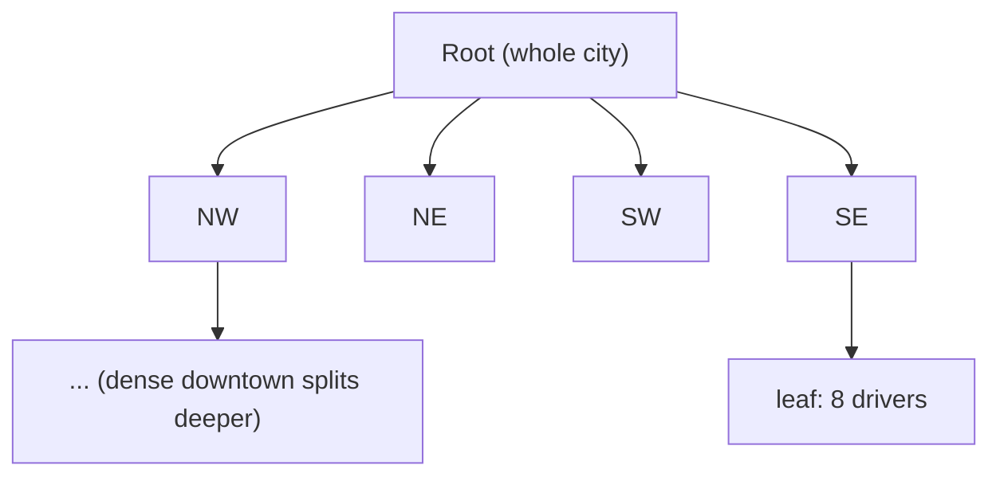
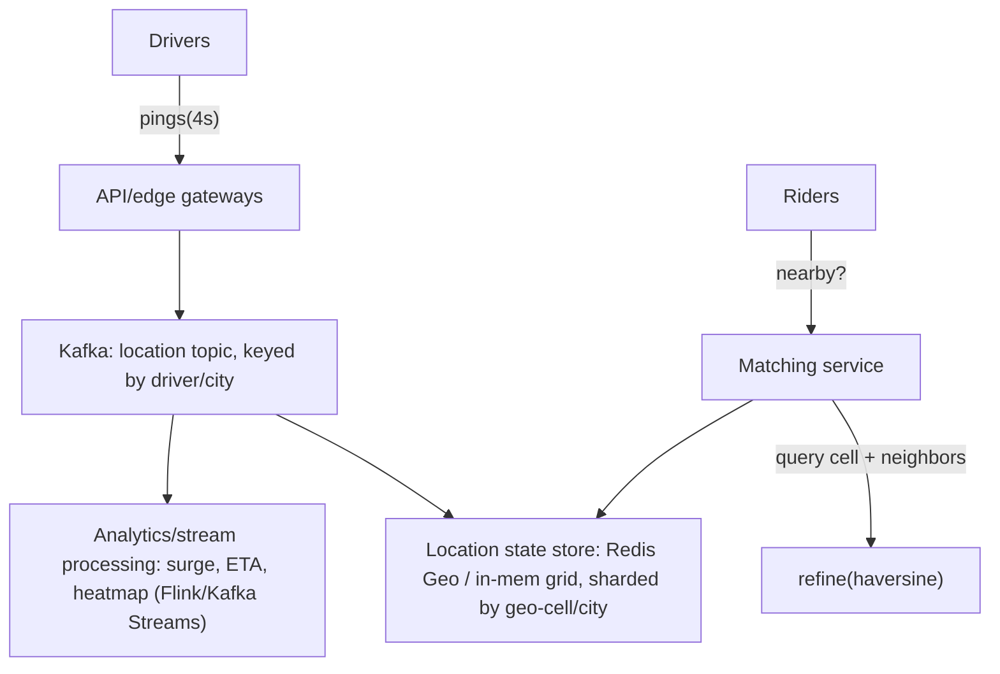
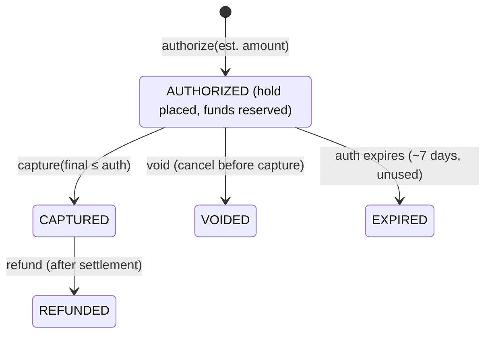
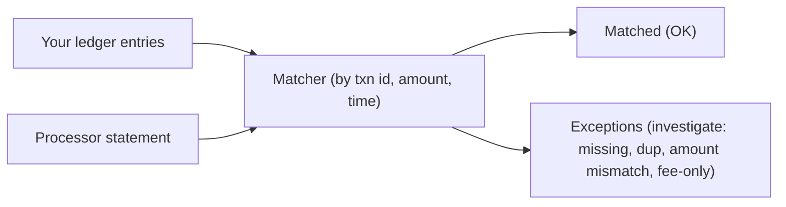
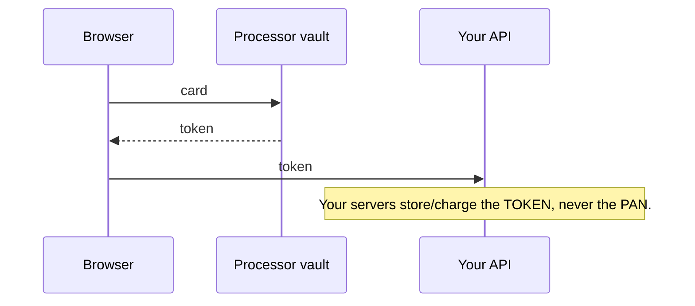
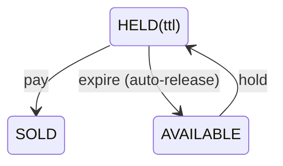

# Design Location and Transactional Systems

This topic unifies three interview families that look unrelated but share one
deep tension: **how much consistency do you buy, and what do you pay for it?**

- **Location / proximity systems** (Uber, Lyft, DoorDash, Google Maps,
  "find nearby X") are overwhelmingly **AP** (availability-first): a driver's
  location a second stale is fine; being *down* is not. The hard part is a
  write-heavy firehose of GPS pings plus low-latency spatial *reads*.
- **Payment / money-movement systems** (Stripe, PayPal, bank ledgers, Uber
  payments) are the opposite extreme: **correctness beats availability**. You
  must never double-charge, never lose a cent, and must be able to prove where
  every cent went. This is the home of idempotency keys, double-entry ledgers,
  sagas, and reconciliation.
- **Inventory / booking systems** (Ticketmaster, airline seats, hotel rooms,
  flash sales) sit in the middle: a **finite, contended resource** that must
  **never oversell**, under enormous burst concurrency. This is the home of
  locking, holds/reservations, and the oversell-vs-availability trade-off.

The unifying mental model:

> Every design here is a bet on the **CAP / PACELC** dial. Location dials
> toward **A and low latency**, tolerating staleness. Money dials toward **C
> and durability**, tolerating latency and even brief unavailability. Booking
> dials toward **C at the row/seat level** while trying to stay **A
> everywhere else**. Nail *which knob the problem demands* and the rest of the
> design follows.

A second cross-cutting theme is **exactly-once effects in an at-least-once
world**. Networks retry, clients double-tap, queues redeliver. You can't get
exactly-once *delivery*, but you can get exactly-once *effect* via idempotency
keys, dedup, and idempotent/commutative operations. This shows up in payments
(don't charge twice), booking (don't book two seats on a retry), and location
(don't corrupt state on a replayed ping).

---

## Problem framing and requirements

Before any boxes-and-arrows, pin down the requirements because they decide the
entire architecture. The three subdomains have almost opposite profiles.

**Location / ride-hailing (e.g., Uber "find nearby drivers + match"):**
- Functional: drivers publish location every ~4s; riders query "drivers near
  me"; system matches a rider to a driver; track the trip.
- Non-functional: **write-heavy** (millions of pings/sec), read latency
  p99 < ~100 ms for "nearby", eventual consistency acceptable (a driver 1-2s
  stale is fine), high availability (being down loses money and trust).

**Payments (e.g., "charge a rider, pay a driver"):**
- Functional: authorize, capture, refund, payout; maintain balances; produce
  statements; handle chargebacks.
- Non-functional: **correctness is non-negotiable** (no double charge, no lost
  money), **durability** (survive crashes), **auditability** (regulators),
  strong consistency on balances, latency is secondary (seconds OK), PCI-DSS
  compliance. Throughput is modest vs location (thousands of TPS, not
  millions).

**Booking / inventory (e.g., Ticketmaster on-sale):**
- Functional: browse events, hold seats during checkout, confirm purchase,
  release expired holds.
- Non-functional: **never oversell** (strong consistency on seat state),
  survive massive **thundering-herd** bursts (a hot concert = 1000x normal
  traffic in seconds), fair queueing, low-ish latency for the hold operation.

**Back-of-envelope (ride-hailing location layer):**
- 5M active drivers, each pings every 4s → 5M / 4 = **1.25M location
  writes/sec**. That alone kills a naive single Postgres. This is why location
  state lives in memory/Redis, sharded, not a disk RDBMS.
- Each ping ~ 100 bytes (id, lat, lng, ts, heading) → ~125 MB/s ingest.
- If you kept 1 point per driver in memory: 5M × ~100 B = ~500 MB — trivial.
  The write *rate*, not the storage, is the problem.
- Rider "nearby" queries: say 1M concurrent riders, 1 query per few seconds →
  ~200-500K spatial reads/sec.

**Back-of-envelope (payments):**
- Even a huge platform is ~10K payments/sec peak. But each payment fans out
  into many ledger entries and must be durable + audited.
- Ledger growth: 10K txns/s × 4 ledger lines each × ~300 B = ~12 MB/s, ~1 TB
  in a day. Ledgers are append-only and grow forever → tiering/archival.

**Back-of-envelope (Ticketmaster on-sale):**
- A 60K-seat stadium, 500K fans hit "buy" at 10:00:00 sharp. If each retries,
  you can see **millions of requests in the first minute** against **60K**
  finite rows. The scarcity ratio (demand:supply) is the whole problem →
  waiting room + queue, not just a bigger DB.

---

## Geospatial indexing fundamentals

**Intuition.** "Find things near me" is a *2D range query*. Databases are great
at 1D ordered lookups (B-trees) but bad at 2D. The core trick of all
geospatial indexing is to **map 2D space onto a 1D curve** such that points
close in 2D are *usually* close on the 1D line — then you can use ordinary
1D indexes (B-tree, sorted set) and range scans. That mapping is a
**space-filling curve** (Z-order/Morton, or Hilbert).

**Why not just index lat and lng separately?** A B-tree on `lat` and a B-tree
on `lng` forces you to range-scan a whole latitude band, then intersect with a
longitude band — you read a huge stripe of the globe to answer "within 2 km."
Composite/2D range queries need a structure that preserves 2D locality.

**The families (detailed in their own sections below):**
- **Geohash** — recursively bisect lng/lat, interleave bits → base-32 string.
  Prefix = containment. Dead simple, string-friendly, but has edge/boundary
  and non-uniform-cell warts.
- **Quadtree** — recursively split a region into 4 quadrants until each leaf
  holds ≤ K points. Adaptive to density; in-memory tree.
- **S2 (Google)** — project sphere onto a cube, Hilbert curve per face →
  64-bit cell IDs, exact hierarchical nesting.
- **H3 (Uber)** — hexagonal cells on an icosahedron, 16 resolutions, uniform
  neighbor distance. Great for movement/flow analysis.

**Core operations any scheme must support:**
1. **Point → cell** (index a location).
2. **Radius / kNN (k-nearest-neighbors) query**: given a center and radius, find
   candidate cells (the center cell + its ring of neighbors), gather points, then
   do exact distance filtering (**haversine** — the great-circle distance between
   two lat/lng points on a sphere) as a refine step. Plain Euclidean distance on
   raw degrees is wrong, because a degree of longitude shrinks toward the poles,
   so equal degree-deltas are not equal ground distances.
3. **Cell → neighbors** (ring/k-ring) — needed because a query circle spills
   across cell borders.

**The universal two-phase pattern:** *coarse filter* (cheap cell lookup returns
candidates) → *fine refine* (exact haversine distance + sort). Never trust the
grid for exact distances; it only prunes.

---

## Geohash

**How it works.** Interleave bits of latitude and longitude, then base-32
encode. Each character adds 5 bits (2.5 to lat, 2.5 to lng) and refines the
cell. Longer prefix = smaller cell:

```
precision 4  ≈ 39 km × 20 km
precision 5  ≈ 5 km × 5 km
precision 6  ≈ 1.2 km × 0.6 km
precision 7  ≈ 153 m × 153 m
precision 8  ≈ 38 m × 19 m
```

**Killer property: prefix = containment.** `9q8yy` is fully inside `9q8y`. So a
"nearby" search = find the geohash prefix at the right precision and do a
**string prefix range scan** in any B-tree/sorted store (Redis
`ZRANGEBYLEX`, a SQL `LIKE '9q8y%'`, DynamoDB begins_with). This makes geohash
trivially deployable on infrastructure you already have.

**The two big warts:**
1. **Boundary problem.** Two points 1 m apart across a cell border fall in
   *different* cells, so a prefix search rooted on one cell misses the other.
   Usually they still share a long prefix and differ only in the last
   character(s); but in the worst case — straddling a high-level bisection
   (e.g., the equator or prime meridian) — they differ at a top bit and share
   *no* common prefix at all. Either way the prefix scan is **not guaranteed**
   to include the neighbor. **Fix:** always query the center cell **plus its 8
   neighbors** (compute the 8 adjacent geohashes) and union the results.
2. **Non-uniform cells.** Cells are lat/lng rectangles, so physical area
   shrinks toward the poles and cells aren't square. Fine for city-scale apps,
   annoying for global uniform analysis.

**Choosing precision = choosing the coarse-filter radius.** For a 1 km search,
precision 6 (~1.2 km) cells + neighbors is typical. Too coarse → too many
candidates to refine; too fine → must union too many neighbor cells.

**Real usage.** Redis Geo commands (`GEOADD`/`GEOSEARCH`) use 52-bit geohash
integers under the hood, stored in a sorted set scored by the interleaved
integer. Many "nearby" features (early Tinder, simple food-delivery search)
are just geohash + Redis.

**Trade-offs.** Gain: dead simple, works on existing string/sorted-set
indexes, human-readable, great for sharding keys. Give up: uniform cell
geometry, clean neighbor logic (must handle boundaries manually), adaptivity to
density (fixed grid wastes cells over the ocean, overcrowds downtown).
**Pick when:** you want the simplest thing that ships on Redis/SQL/Dynamo and
city-scale accuracy is fine.

---

## Quadtree

**How it works.** Start with a bounding box for the whole region. If a node
holds more than K points, split it into 4 equal quadrants (NW, NE, SW, SE) and
push points down. Recurse. Leaves are small in dense areas (downtown) and large
in sparse areas (ocean). It's an **in-memory tree**, rebuilt/updated as points
move.



**Query.** Descend to the leaf containing the query point; collect points from
that leaf and sibling/neighbor leaves overlapping the radius; refine by exact
distance.

**Real usage.** Classic answer for "design Yelp / nearby places" where data is
relatively static (restaurants don't move). Uber's early "nearby drivers" used
in-memory quadtrees per region/server. Great when point density is very uneven.

**Trade-offs.** Gain: **adaptive to density** (balanced leaf sizes → predictable
query cost), naturally supports variable precision, efficient range queries.
Give up: it's an **in-memory structure you must build and maintain** — rebuilds
are expensive, and a firehose of moving points (drivers) means constant
re-bucketing (tree churn) as points cross quadrant borders. Sharding a quadtree
across machines is more complex than sharding a geohash string. **Pick when:**
data is mostly static or slow-moving and density is highly skewed (POIs,
places). For millions of fast-moving pings, geohash-in-Redis or H3 buckets are
usually simpler to operate.

---

## S2 and H3

Both are **global, hierarchical, 64-bit integer** cell systems designed to fix
geohash's geometry problems. They differ in cell shape and math.

**S2 (Google).** Projects the sphere onto the 6 faces of a cube, then lays a
**Hilbert space-filling curve** over each face. A cell is a 64-bit ID; the curve
gives excellent 2D→1D locality (better than geohash's Z-order). S2 has **exact
hierarchical nesting**: a level-N cell is perfectly composed of 4 level-(N+1)
cells. 30 levels, from ~85M km² down to ~1 cm². Used by Google Maps, MongoDB
geo indexes, and historically many "coverings" (approximate a region with a set
of cells).

**H3 (Uber).** **Hexagonal** cells on an icosahedron (20 faces), 16 resolutions.
Hexagons have **one uniform distance to all neighbors** (squares have two: edge
vs diagonal; triangles have three). That uniformity makes H3 ideal for
**movement, flow, and gradient analysis** — surge pricing, supply/demand
heatmaps, ETA smoothing. `kRing(cell, k)` gives all cells within k rings,
approximating a circle for candidate lookup. Caveat: hexagons **can't perfectly
subdivide** (7 children only *approximately* nest in a parent), so H3's
hierarchy is approximate — the opposite trade-off from S2.

**Comparison:**

| Property | Geohash | Quadtree | S2 | H3 |
|---|---|---|---|---|
| Cell shape | lat/lng rect | square (adaptive) | square (cube face) | hexagon |
| Curve | Z-order | — (tree) | Hilbert | — (hierarchical index) |
| Hierarchy nesting | exact (prefix) | exact | **exact** | **approximate** |
| Neighbor distance | non-uniform | uniform (per level) | ~uniform | **uniform (1 value)** |
| Density-adaptive | no | **yes** | no | no |
| ID form | string | pointer/path | int64 | int64 |
| Best at | simplicity on Redis/SQL | skewed static data | region coverings, exact nesting | movement/flow, heatmaps, uniform analysis |
| Real users | Redis Geo, Tinder | Yelp-style, early Uber | Google Maps, MongoDB | Uber surge, marketplace |

**Trade-off summary:** geohash for *simplicity*, quadtree for *skewed static
density*, S2 for *exact hierarchical coverings*, H3 for *uniform-neighbor
movement analytics*. In interviews, the strongest answer is: "coarse cell index
(H3/geohash) to get candidates cheaply, then exact haversine refine — pick H3 if
we also need surge/heatmap analytics, geohash if we want the simplest Redis
deployment."

---

## Real-time location updates and matching

**The write path is the hard part.** 1M+ pings/sec cannot hit a disk RDBMS. The
standard architecture:



Key decisions:
- **Latest-value, not history.** For matching you only need each driver's
  *current* cell. Store last-write-wins per driver in memory (Redis hash /
  sorted set). Full trip history goes to a separate append store (Cassandra,
  S3) off the hot path.
- **Shard by geography.** Partition the location store by city / geo-cell so a
  query touches one shard. Uber's real system ("Ringpop"/consistent hashing)
  routes by geo shard. This bounds fan-out and keeps hot cities isolated.
- **Push vs pull for the client.** Riders can poll every few seconds (simple,
  bursty) or hold a **WebSocket/long-lived connection** for server push (lower
  latency, more connection state). Ride apps use persistent connections for the
  live "car moving on the map" experience.
- **Reduce write amplification.** Batch/coalesce pings, adaptively lower ping
  frequency when a driver is idle/stationary, and drop out-of-order stale pings
  (compare timestamps — last-write-wins by event time, not arrival time).

**Matching (dispatch)** is a separate optimization problem: given nearby
candidate drivers, pick one considering ETA, direction, driver acceptance rate,
and global efficiency (batching requests to reduce total wait). Uber's
"DISCO/dispatch" does this. It reads the location index but is its own service.
Rather than greedily assigning each rider to their nearest driver the instant
the request arrives, mature dispatch **batches requests over a short window**
(a couple of seconds) and solves a **global bipartite assignment** — matching
the *set* of waiting riders to the *set* of nearby drivers to minimize total
wait — because greedy-nearest can strand a rider whose only candidate just got
taken by someone slightly closer. And because two riders can be considering the
same driver at once, dispatch must **atomically reserve (lock) a candidate
driver** before offering the trip — the same reservation/hold theme as inventory
below — so one driver is never dispatched to two riders concurrently.

**Failure modes.**
- **Stale locations** if a shard lags → mitigate with TTLs (expire a driver
  after N missed pings) and event-time ordering.
- **Hot shard** (a stadium empties, everyone requests rides) → cell-level
  splitting, load shedding, or temporary re-sharding.
- **Lost connection** → client buffers and replays pings; server dedups by
  driver+timestamp (idempotent ingest).

**Trade-offs.** Choosing Redis Geo/in-memory grid gains huge write throughput
and sub-ms cell lookups but gives up durability (it's a cache; rebuild from
Kafka on restart) and cross-region strong consistency (you don't need it here).
Choosing to store full history inline would give queryable trails but destroy
write throughput — so you split hot (memory) from cold (append log). This
hot/cold split is the recurring pattern.

---

## Payment systems and double-entry ledger

**Intuition.** A payment system's source of truth is not "a balance number in a
row" — it's an **append-only log of immutable transactions**, from which
balances are *derived*. This is **double-entry bookkeeping**: every movement of
money is recorded as at least two entries (a **debit** and a **credit**) that
**sum to zero**. Money is never created or destroyed, only moved between
accounts.

```
Rider pays $20 for a trip:
  Entry A: DEBIT  rider_cash_account     -$20
  Entry B: CREDIT platform_revenue       +$16
  Entry C: CREDIT driver_payable         +$4
  (sum = 0; the transaction is atomic — all lines commit or none)
```

**Represent money as integer minor units, never floats.** The `$20` above is
stored as `2000` (cents / minor units), not `20.00` as a floating-point number.
Floats can't represent `0.10` exactly, so a sum of many entries drifts by
fractions of a cent and your "sum to zero" invariant silently breaks. Use an
integer count of the smallest currency unit (cents, or for JPY the yen itself,
which has no minor unit) or an exact decimal type — never IEEE-754 float.

**Every entry carries a currency, and the invariant holds *per currency*.** A
ledger holding USD and EUR does not sum USD and EUR entries together; each
currency balances to zero independently. Moving money *across* currencies is not
one transfer — it's a debit in one currency and a credit in another, routed
through an **FX (foreign-exchange) conversion account** that absorbs the rate:

```
Rider pays €10 (rate 1.08 USD/EUR); driver is paid in USD:
  DEBIT  rider_cash (EUR)      -€10.00      (-1000 EUR minor units)
  CREDIT fx_conversion (EUR)   +€10.00      (+1000 EUR minor units)   EUR sums to 0
  DEBIT  fx_conversion (USD)   -$10.80      (-1080 USD minor units)
  CREDIT driver_payable (USD)  +$10.80      (+1080 USD minor units)   USD sums to 0
```

The FX account is where any rounding residue and rate spread live, so each
currency's books still balance exactly.

**Why double-entry (vs just updating balances)?**
- **Auditability**: you can reconstruct any balance at any point in time by
  replaying entries — invaluable for regulators and disputes.
- **Integrity check**: the "sum to zero" invariant catches bugs; if the ledger
  doesn't balance, something is wrong.
- **Immutability**: you never mutate history. A "correction" is a new
  compensating entry (a reversal), not an edit. This gives a perfect trail.

**Balances** are then either (a) computed by summing entries (accurate, slow at
scale) or (b) maintained as a **materialized/cached balance** updated in the
same transaction as the entries (fast reads, must stay consistent). Real
systems (Stripe, Uber's "Money" ledger, banks, TigerBeetle) use immutable
entries + materialized balances.

**Modeling accounts.** Every entity (each user, the platform, each payment
processor, tax authority, "cash in transit") is an account. Even external money
gets a mirror account so the books stay balanced.

**Consistency requirement.** Ledger writes must be **ACID and strongly
consistent** — a debit and its credit commit atomically. This usually means a
transactional DB (Postgres, Spanner) or a purpose-built ledger DB
(TigerBeetle does millions of double-entry transfers/sec with strict
serializability). You **do not** make the ledger eventually consistent; a
temporarily-wrong balance can authorize an overdraft or double-spend.

**Trade-offs.** Double-entry + immutable log gains correctness, auditability,
and debuggability at the cost of storage (ledger grows forever → archival
tiers) and write complexity (multi-line atomic transactions, materialized
balance maintenance). The alternative — mutable balance rows — is simpler and
faster to write but loses the audit trail and makes reconciliation and dispute
handling nearly impossible. For anything touching real money, always choose the
ledger.

---

## Authorization, capture and refund lifecycle

**Intuition.** Charging a card is not one action — it's two. First you *ask the
bank to set aside the money* (an **authorization**, or "auth": a hold that
reserves funds on the card without actually moving them). Later you *collect it*
(a **capture**: the money actually settles from the cardholder to you). Think of
an auth like a restaurant putting a hold on your card when you open a tab, and
the capture as the final bill when you leave — the tip and total aren't known
until the end. Splitting the two lets you commit to a charge before you know the
exact final amount.

**Why this matters (the Uber example the interviewer wants).** When a trip
*starts*, Uber doesn't know the final fare — traffic, route, and wait time
aren't settled yet. So it **authorizes an estimated fare** (say $25) at trip
start to confirm the card is valid and the funds exist. When the trip *ends* and
the real fare is known (say $18), it **captures $18** against that $25 auth — a
**partial capture**. The remaining $7 of the hold is released. If the rider
cancels before the trip, Uber **voids** the auth (releases it entirely, no money
moves).

**The lifecycle:**



- **Authorize**: bank checks the card and reserves the amount. No money has
  moved yet; the cardholder sees a "pending" hold that lowers their available
  balance.
- **Capture**: you tell the processor to actually pull the (possibly smaller)
  amount. **Partial capture** captures less than the auth (Uber's final < est.);
  the unused remainder is released. You can typically capture only *up to* the
  authorized amount — a higher final needs a re-auth.
- **Void / auth reversal**: cancel an *uncaptured* auth and release the hold
  immediately. Cheaper and faster than refunding, and it happens before any
  settlement.
- **Auth expiry**: an uncaptured hold does not last forever. Card-network rules
  expire holds after a window (commonly around a week for card-not-present, but
  it varies by card type and issuer — verify current network rules). After
  expiry the reserved funds are freed even if you never captured; if you still
  need the money you must re-authorize.
- **Refund**: reverses money *after* capture/settlement — a distinct, slower
  path (funds have already moved to you, so they must be sent back). Prefer a
  void over a refund whenever the charge hasn't settled yet.

**Ledger tie-in.** These states map cleanly onto the double-entry ledger via
*pending* (semantic-lock) entries: an auth writes a pending/held entry, capture
converts it to a settled entry, void/expiry writes a compensating release, and
refund writes a reversing entry. This is exactly the "correction is a new entry,
never a mutation" rule from the ledger section, and it dovetails with the saga
compensations below (T1 reserve/authorize ↔ C1 void).

---

## Idempotency and exactly-once charges

**The core problem.** The client sends "charge $20." The network times out. Did
it succeed? The client retries. Without protection you **charge twice**. You
cannot achieve exactly-once *delivery* over an unreliable network, but you can
achieve exactly-once *effect*. **Why delivery is impossible:** the sender can
never distinguish "my message was lost" from "the reply/ack was lost," so it
*must* retry — which guarantees the receiver will sometimes see duplicates. The
only durable fix is to make duplicates *harmless* (dedupe / idempotent
handlers), not to try to prevent them.

**Idempotency keys (the standard pattern, popularized by Stripe).**
1. Client generates a unique **idempotency key** (UUID) for the *logical
   operation* and sends it as a header on every retry of that same operation.
2. Server, on first receipt, records the key + request fingerprint, performs the
   charge, and stores the **response** against the key.
3. On any retry with the same key, the server returns the **stored response**
   without re-executing the charge.

```
POST /charges   Idempotency-Key: 5f3a...  amount=2000
  -> server: INSERT key (unique constraint). If insert wins -> do work,
     save result. If insert loses (key exists) -> return saved result.
```

Critical details:
- **Uniqueness must be enforced atomically** — a `UNIQUE` constraint or a
  conditional put (DynamoDB `attribute_not_exists`) so two concurrent retries
  can't both proceed. This is the linchpin; a check-then-act race reintroduces
  the double charge.
- **Store the request fingerprint**: if the same key arrives with a *different*
  body, reject it (client bug / key reuse) rather than silently returning the
  wrong result.
- **Handle the in-flight case**: retry arrives while the first is still
  processing → return "409/processing, retry later" or block, so you don't run
  two concurrently. Keys typically have a **state** (started → succeeded/failed)
  and a **TTL** (e.g., 24h).
- **Handle the crash-in-the-middle case** (the hard one interviewers push on):
  the first attempt called the processor, the charge *succeeded downstream*, but
  the server crashed before it wrote the outcome against the key — so the key is
  stuck in `started` with an unknown result. A blind retry must **not** re-charge
  (double charge) and must **not** assume failure (lost money). Recovery: when a
  retry finds a `started` key older than a threshold, the server **reconciles
  with the downstream processor** — query the processor *by the same idempotency
  key* to learn the true outcome — then finalizes the stored result accordingly
  before responding. This is why the key must be threaded all the way to the
  processor: it's both the dedupe guard *and* the recovery lookup handle.
- **Idempotency must span the whole side-effecting flow**, including the call
  to the external processor. Downstream processors *also* accept idempotency
  keys so a retry there is safe too.

**Where the key comes from matters.** It must be generated by the *initiator*
of the logical action and reused across retries — not regenerated per HTTP
attempt. A "pay" button generates one key and reuses it for every retry of that
tap.

**Trade-offs.** Idempotency keys gain safe retries (the foundation of reliable
payments) at the cost of a durable key store on the hot path (extra write,
extra latency) and TTL/GC complexity. Alternatives like "dedupe by natural key
(user+amount+minute)" are fragile (two legitimate identical purchases collide).
Always use an explicit client-supplied key for money.

---

## Distributed transactions and the saga pattern

**The problem.** A payment often spans multiple services/DBs: reserve funds,
call the processor, update the ledger, notify the driver, update the trip. There
is no single ACID transaction across all of them. Classic **2PC (two-phase
commit)** gives atomicity but is a poor fit at scale.

**2PC.** A coordinator asks all participants to *prepare* (lock + vote), then
*commit* or *abort*. Gains real atomicity/consistency. Gives up availability and
throughput: participants **hold locks** across the whole protocol, and if the
**coordinator crashes after prepare**, participants are **blocked** holding locks
indefinitely (the classic blocking problem). Latency is high (2 round trips ×
slowest participant). Rarely used across service/network boundaries at scale.

**Saga (the modern default).** Model the flow as a sequence of **local
transactions**, each with a **compensating action** that semantically undoes it.
If step N fails, run compensations for steps N-1 … 1 in reverse.

```
T1 reserve funds        C1 release funds
T2 charge processor     C2 refund
T3 credit driver ledger C3 debit driver ledger
T4 confirm trip         C4 cancel trip
Forward on success; on failure at Tk, run Ck-1 ... C1.
```

Two coordination styles:
- **Choreography**: services emit/consume events, no central brain. Decoupled,
  no single point of failure, but the workflow logic is *smeared across
  services* → hard to see/understand, risk of cyclic event storms.
- **Orchestration**: a central orchestrator (e.g., **Temporal/Cadence**, AWS
  Step Functions) explicitly drives each step and compensation. Clear, testable,
  observable; but the orchestrator is a component you must run and it can become
  a bottleneck/SPOF (mitigated by making it durable + replicated).

**Sagas give up isolation.** Because there's no global lock, other transactions
can observe intermediate states (money reserved but not captured). You must
design for this: use **semantic locks** (a "pending" status), **commutative
updates**, and idempotent steps. Compensations must be idempotent and must
handle "the thing I'm undoing partly happened."

**The dual-write problem (and the transactional outbox fix).** A choreography
step must do two things: update its own DB *and* publish an event for the next
service. But there is **no transaction spanning a database and a message
broker** — so what if the DB commit succeeds and the broker publish fails (event
lost → saga stalls), or the publish succeeds and then the DB rolls back (ghost
event → downstream acts on a state that never happened)? Writing to two systems
that can't commit together is the **dual-write problem**, and it silently
corrupts event-driven sagas.

The standard fix is the **transactional outbox**: instead of publishing directly,
write the event as a row into an **outbox table in the *same* local DB
transaction** as your business change. Now the state change and the "intent to
publish" commit atomically — one transaction, one storage engine, no dual write.
A separate **relay** then ships outbox rows to the broker:

```
BEGIN;
  UPDATE payments SET status='captured' WHERE id=42;      -- business change
  INSERT INTO outbox(event, payload) VALUES('PaymentCaptured', {...});  -- event
COMMIT;                     -- both or neither

-- Relay (async): read new outbox rows -> publish to Kafka -> mark sent.
```

The relay is typically driven by **CDC (Change Data Capture)** tailing the DB's
commit log (e.g., Debezium on the outbox/table) — the *same* CDC mechanism the
reconciliation section uses — or by a simple polling publisher. The relay
delivers **at-least-once** (it may re-publish an outbox row it already sent if it
crashes before marking it sent), so consumers must **dedupe by event id** and be
idempotent — exactly the webhook rule below. An alternative that avoids a
separate outbox is **event sourcing / listen-to-yourself**: the event log *is*
the source of truth (the ledger already is one), so appending the event and
projecting state are the same write. Either way, outbox is *how a choreography
saga avoids lost and ghost events*.

**Trade-offs.** 2PC gains strict atomicity/isolation, gives up availability
(blocking, locks, coordinator SPOF) — acceptable only within a single trust
domain / tightly coupled DBs, low volume. Saga gains availability, loose
coupling, and scale, gives up isolation and simplicity (must design
compensations + tolerate intermediate states). **Pick 2PC** for a small number
of co-located resources needing hard atomicity; **pick sagas** for
cross-service, high-scale workflows (the norm for payments/orders). Orchestrated
sagas (Temporal) are the modern interview-strong answer for complex flows.

---

## Reconciliation and consistency in payments

**Why reconciliation exists.** Your ledger is your view of the money. The
**external truth** is the bank / card processor's statement. These *will* drift
due to fees, timing (a charge settles T+2), failed webhooks, partial failures,
and bugs. **Reconciliation** is the periodic (often daily) batch process that
compares your ledger against processor/bank statements and flags/repairs
discrepancies.



**Techniques:**
- Match on stable keys (processor transaction id, your idempotency key echoed
  back), then on (amount, time window) heuristics for the rest.
- Classify exceptions: in-your-books-not-theirs, in-theirs-not-yours, amount
  mismatch, timing. Each has a runbook (some auto-resolve, some go to ops).
- Use **CDC (Change Data Capture)** from the ledger DB into a stream/warehouse
  for continuous, near-real-time reconciliation and analytics rather than only
  nightly batch.

**Consistency spectrum in payments:**
- **Ledger + balances: strong / linearizable.** Non-negotiable.
  (**Linearizable** = every read returns the *most recent completed write*, as if
  there were a single copy of the data updated instantly at one point in time —
  no reader ever sees a stale balance. This is CAP's "C"; see the CAP/PACELC
  section for how it differs from ACID's "C.")
- **Notifications, receipts, analytics, fraud scoring: eventual.** These read
  from CDC streams or replicas; a few seconds of lag is fine.
- **Idempotency store: strong** (must serialize retries).

**Webhooks and exactly-once effects.** Processors notify you asynchronously
(payment succeeded). Webhooks are **at-least-once** → you must **dedupe by event
id** and make handlers idempotent. Never treat a webhook as exactly-once.

**Trade-offs.** Real-time (CDC-based) reconciliation gains fast detection of
drift and money bugs but costs streaming infra and complexity. Nightly batch is
simpler and cheaper but leaves you blind for up to a day. Most mature payment
orgs run both: streaming for alerting, daily batch as the authoritative
close-of-books. The meta-point for interviews: **you cannot prevent all drift,
so you must detect and reconcile it** — designing *only* for prevention is a red
flag.

---

## PCI compliance and payment security

**PCI-DSS** governs handling of cardholder data (PAN, CVV, etc.). The dominant
design principle: **minimize your scope** — the fewer systems that touch raw
card data, the smaller (and cheaper) your audit.

**Tokenization + vaults.** Don't store the PAN. Send it directly from the
client to the processor/vault (Stripe.js, hosted fields, an iframe) which
returns a **token**. Your servers only ever see the token, so raw card data
never enters your backend → your PCI scope shrinks dramatically (SAQ-A instead
of full audit).



**Other controls:** encryption in transit (TLS) and at rest, network
segmentation of any card-touching systems, strict access control + audit logs,
never log the PAN/CVV, never store CVV at all after auth.

**Trade-offs.** Outsourcing to a processor's vault (tokenization) gains minimal
PCI scope and offloads the hardest compliance burden, at the cost of processor
lock-in and per-transaction fees. Building your own vault gains control and
avoids some fees but takes on the full PCI-DSS Level 1 audit burden (expensive,
slow, risky) — only huge players (Amazon, Adyen) do this. **Pick a processor
vault** unless payments are your core business at massive scale.

---

## Inventory and reservation systems

**Intuition.** A finite pool of identical-ish units (seats, rooms, tickets) must
be sold **at most once each**. The enemy is **concurrency**: two buyers grabbing
the last seat. The core mechanic is a **hold / reservation** with a **TTL**:
temporarily remove a unit from the available pool while the buyer checks out,
then either confirm (permanent) or release on expiry.



**Why holds (vs charge-then-refund)?** Users need time to pay (30s-10min).
Holding reserves the unit so checkout can't lose the seat mid-flow, but you must
**expire** holds or inventory leaks (seats stuck "held" forever). Expiry is done
via TTL + a sweeper job, or a Redis key TTL, or a "held_until" timestamp checked
on read.

**Two counting models:**
- **Per-unit (assigned seats)**: each seat is a row with a state. Ticketmaster
  seat maps. Precise but heavier.
- **Aggregate counter (general admission / hotel room type)**: a single
  "available = N" counter you atomically decrement. Simpler, but you can't
  identify *which* unit; fine when units are fungible.

**Preventing oversell** requires strong consistency on the decrement/hold: the
"check availability then reserve" must be **atomic** (see locking section). A
race here = oversold event = refunds, angry customers, legal exposure.

**Handling the thundering herd (Ticketmaster on-sale):**
- **Virtual waiting room / queue**: admit users in controlled batches
  (Ticketmaster's "Smart Queue", or Cloudflare Waiting Room). Converts a
  1000x spike into a steady drip the inventory service can handle, and gives
  fairness. This is the single most important pattern for hot on-sales.
- **Backpressure & load shedding** upstream so the DB isn't crushed.
- Keep inventory state in a fast atomic store (Redis) fronting the durable DB,
  or shard inventory so contention is distributed.

**Trade-offs.** Holds gain a good UX (seat secured during payment) at the cost
of temporary "phantom" unavailability (held-but-unsold seats look gone) and the
need for reliable expiry. Aggregate counters gain simplicity/throughput but lose
per-unit identity. Assigned-seat rows gain precision at higher contention cost.
Waiting rooms gain fairness + survival under spikes at the cost of latency and
added infra. **Pick assigned-seat + waiting room** for high-demand events;
**pick aggregate counter** for fungible inventory (hotel room types, GA
tickets).

---

## Concurrency control, locking and oversell prevention

This is the crux of booking systems and appears constantly in interviews. How do
you make "read available, then decrement/reserve" safe under concurrency?

**Option A — Pessimistic locking (`SELECT ... FOR UPDATE`).** Lock the row
before reading/updating; other transactions block until you commit.
- Gain: guaranteed no lost update; simple mental model; good when **contention
  is high** and conflicts are likely (the hot last seats).
- Give up: throughput (serializes access to the row), risk of **deadlocks** and
  lock-wait timeouts, holding a DB lock across a slow operation (never hold it
  across a payment call!) can exhaust connections.

**Option B — Optimistic concurrency control (version/CAS).** Read the row +
version; on update do `UPDATE ... WHERE id=? AND version=?`; if 0 rows affected,
someone else won → retry.
- Gain: no locks held, high throughput when **contention is low** (conflicts
  rare); scales well.
- Give up: under **high contention** you get a storm of retries/aborts (wasted
  work, latency spikes) — exactly the Ticketmaster last-seats scenario where it
  performs worst.

**Option C — Atomic single-op decrement.** `UPDATE seats SET available =
available - 1 WHERE event=? AND available > 0` (returns rows-affected), or Redis
`DECR` with a guard, or a conditional write. The DB serializes the single
statement; the `available > 0` guard prevents oversell in one atomic step.
- Gain: no explicit locks, one round trip, oversell-safe, very high throughput;
  ideal for **aggregate counters**.
- Give up: works cleanly only for counter-style inventory, not complex
  multi-seat/atomic-basket logic; still hot-row contention on a single popular
  counter (mitigate by sharding the counter into N sub-counters).

**Option D — Distributed lock (Redis Redlock / ZooKeeper / etcd).** For state
not in one DB. Gains cross-resource mutual exclusion; gives up correctness
guarantees under GC pauses/clock skew (Redlock is contested), adds a
dependency, and needs **fencing tokens** to be safe. A fencing token is a
monotonically increasing number handed out each time the lock is granted; the
protected resource remembers the highest token it has seen and rejects any write
carrying a lower one — so a holder that stalled (e.g., a long GC pause) and lost
its lock cannot later corrupt state with a stale write. Use distributed locks
sparingly; prefer DB-native atomicity when possible.

**Comparison:**

| Approach | Best when | Throughput under contention | Oversell safe | Complexity |
|---|---|---|---|---|
| Pessimistic `FOR UPDATE` | high contention, must not conflict | low (serialized) | yes | low-med |
| Optimistic (version/CAS) | low contention | collapses (retry storms) | yes (with retry) | med |
| Atomic decrement/guard | counter inventory, any contention | high | yes | low |
| Distributed lock | cross-service state | medium | yes if fenced | high (risky) |

**The golden rule: never hold a lock across an external call.** Reserve/hold
with a short atomic transaction, *release the lock*, then take payment against
the hold. If payment fails, the hold expires. This decouples the slow, failure-
prone payment step from the contended inventory row.

**Trade-off narrative for interviews:** "For fungible GA tickets I'd use an
atomic guarded decrement (or sharded counters) — highest throughput, oversell-
safe. For assigned seats under a hot on-sale I'd use short pessimistic locks (or
a per-seat conditional write) *behind a waiting room* that throttles concurrency
so the lock contention never explodes. I'd avoid pure optimistic concurrency for
the last few hot seats because retry storms make latency worst exactly when
demand is highest."

---

## Strong consistency trade-offs, CAP and PACELC

Everything above is an instance of the same dial. **CAP:** during a network
**partition**, you must choose **Consistency** or **Availability**. **PACELC**
extends it: **E**lse (no partition), you still trade **L**atency vs
**C**onsistency.

> [!WARNING]
> CAP's "C" and ACID's "C" are *different letters that happen to share a name*.
> CAP's **C is linearizability** — a read sees the latest completed write, as if
> there were a single copy, with one real-time order across all nodes. ACID's
> **C is invariant preservation** — a transaction moves the DB from one valid
> state to another (constraints, foreign keys, the ledger's sum-to-zero hold).
> A single-node ACID database is trivially linearizable, but in a distributed
> system you can have ACID transactions per node without global linearizability.
> When an interviewer says "the ledger needs strong consistency," they mean CAP's
> linearizability *plus* ACID's invariants — don't conflate the two.

**Where each subsystem sits:**

| Subsystem | Partition choice | Normal-ops choice | Why |
|---|---|---|---|
| Location/nearby | **AP** | low **L**atency | stale driver dot is fine; downtime isn't |
| Payment ledger/balance | **CP** | **C**onsistency | never double-spend; correctness > uptime |
| Idempotency store | **CP** | **C**onsistency | must serialize retries |
| Inventory/seat state | **CP** (per seat) | **C**onsistency | never oversell |
| Notifications/analytics/receipts | **AP** | **L**atency | eventual is fine |

**The key insight interviewers want:** you don't pick one consistency model for
the *whole system* — you **decompose** it and pick per component. A ride app is
AP for the map and CP for the wallet. A ticketing app is CP for seat rows and AP
for the "recommended events" feed. Stating this decomposition explicitly is the
mark of a senior answer.

**Modern patterns that soften the trade-off:**
- **CQRS**: separate the write model (strongly-consistent ledger/seat state)
  from read models (eventually-consistent, denormalized views for browsing,
  history, analytics). Reads scale independently and don't threaten write
  correctness.
- **Event sourcing**: the ledger *is* an event log; balances are projections.
  Natural fit for money and audit.
- **CDC + streaming**: propagate authoritative changes to derived stores
  (search, cache, warehouse) with bounded lag — how you get AP read views off a
  CP source of truth.
- **Cell-based architecture**: partition the whole stack into isolated cells
  (by geography/customer) so a failure or hot shard is contained — used by both
  ride and ticketing platforms for blast-radius control.

**Cost dimension.** Strong consistency (Spanner, multi-region quorum) costs more
(cross-AZ/region round trips, more hardware, more ops) than eventual (local
reads, async replication). So the dial is really **consistency vs latency vs
availability vs cost** — a 4-way trade, and you spend the budget where the
business requires correctness.

---

## Trade-offs and when to use what

A consolidated decision guide across the whole topic.

**Geospatial index:**
- Simplest ship-it-today, city scale, on Redis/SQL → **geohash**.
- Skewed density, mostly static POIs, in-memory → **quadtree**.
- Need exact hierarchical region coverings → **S2**.
- Need uniform neighbors for surge/heatmap/flow analytics → **H3**.
- Always: coarse cell filter → exact haversine refine.

**Location store:**
- Firehose of moving points → in-memory / Redis Geo, sharded by geo, LWW by
  event time, rebuild from Kafka. Keep history in a separate cold store.
- Don't put the ping firehose in an RDBMS.

**Money movement:**
- Always immutable **double-entry ledger** as source of truth; materialize
  balances in the same transaction; strong consistency.
- Retries → **idempotency keys** with atomic uniqueness.
- Multi-service flow → **saga** (orchestrated via Temporal for complex flows;
  choreography for simple decoupled ones). 2PC only for a few co-located
  resources.
- Always run **reconciliation** against external statements; assume drift.
- Minimize **PCI** scope via tokenization/hosted fields.

**Inventory/booking:**
- Fungible units → **atomic guarded decrement** (shard the counter if hot).
- Assigned units under a hot on-sale → short **pessimistic locks** or per-unit
  conditional writes, **behind a virtual waiting room**.
- Low contention → **optimistic** concurrency is cheapest.
- Always use **holds with TTL + sweeper**; never lock across payment.

**Consistency dial:**
- Decompose the system; choose CP for money/seats, AP for location/feeds.
- Use CQRS/event-sourcing/CDC to serve AP read views from CP truth.
- Remember PACELC: even without partitions you pay latency for consistency.

**Common senior mistakes to avoid:** putting the ledger in an eventually-
consistent store; using pure optimistic concurrency for hot last-seats;
skipping idempotency keys "because we retry rarely"; holding DB locks across
external payment calls; designing payments to *prevent* all drift instead of
*reconciling* it; using one global consistency model instead of per-component.

---

## Common interview follow-up questions

1. Design "find the 10 nearest drivers." Which index and why? Walk through the
   coarse-filter → refine steps and how you handle cell boundaries.
2. A driver's phone loses signal for 30s then replays 8 buffered pings out of
   order. How do you avoid corrupting the current-location state?
3. How do you shard the location store, and what happens when a stadium empties
   and one shard goes hot?
4. A client taps "Pay" twice and the network is flaky. Show exactly how
   idempotency keys prevent a double charge, including the concurrent-retry
   race.
5. Why double-entry ledger instead of a balance column? How do you handle a
   refund/reversal without mutating history?
6. Your ledger says $1.00M collected today; the processor statement says
   $0.98M. What do you do? (reconciliation, exception classes)
7. Design Uber's payment flow across reserve/charge/payout as a saga. What are
   the compensations, and how do you handle a compensation that itself fails?
8. When would you actually use 2PC over a saga, and what's the failure mode you
   accept?
9. 500K fans hit a 60K-seat on-sale at 10:00:00. Design it end-to-end. Where's
   the waiting room, where's the lock, how do holds expire?
10. Compare optimistic vs pessimistic locking for the *last 5 seats* of a hot
    event. Which is worse and why?
11. Which parts of your ticketing system are CP and which are AP? Justify each.
12. How do you keep PCI scope minimal while still supporting refunds and
    saved-cards?
13. How does CDC let you build an eventually-consistent search/analytics view on
    top of a strongly-consistent ledger?
14. How would cell-based architecture contain the blast radius of a hot city or
    a bad deploy?

## References

- Uber Engineering, "H3: Uber's Hexagonal Hierarchical Spatial Index" —
  https://www.uber.com/blog/h3/ (why hexagons, resolutions, kRing, surge).
- Uber Engineering, "Engineering Intelligence Through Data Visualization" and
  marketplace/dispatch posts — https://www.uber.com/blog/engineering/.
- Google S2 Geometry — https://s2geometry.io/ (Hilbert curve, cube projection,
  cell IDs, coverings).
- Redis Geospatial commands (GEOADD/GEOSEARCH, 52-bit geohash) —
  https://redis.io/docs/latest/develop/data-types/geospatial/.
- Stripe Docs, "Idempotent requests" —
  https://docs.stripe.com/api/idempotent_requests and Stripe engineering blog,
  "Designing robust and predictable APIs with idempotency."
- Martin Kleppmann, *Designing Data-Intensive Applications* (DDIA) — chapters
  on replication, partitioning, transactions, 2PC, consistency, and the
  "How to do distributed locking" post (Redlock critique).
- TigerBeetle — https://tigerbeetle.com/ (high-performance double-entry
  accounting DB; docs on debit/credit, financial consistency).
- microservices.io (Chris Richardson), "Saga pattern" and "CQRS" —
  https://microservices.io/patterns/data/saga.html.
- Cloudflare, "Waiting Room" — https://developers.cloudflare.com/waiting-room/
  (virtual queue for thundering-herd events).
- Alex Xu, *System Design Interview* Vol 1 & 2 (proximity service, payment
  system, hotel/ticket reservation chapters) and ByteByteGo blog/newsletter.
- PCI Security Standards Council, PCI-DSS overview and SAQ types —
  https://www.pcisecuritystandards.org/.
- ByteByteGo / Gaurav Sen / Hussein Nasser / "Jordan has no life" YouTube
  channels — proximity service, payment idempotency, ticket booking design
  walkthroughs (2023-2025).
