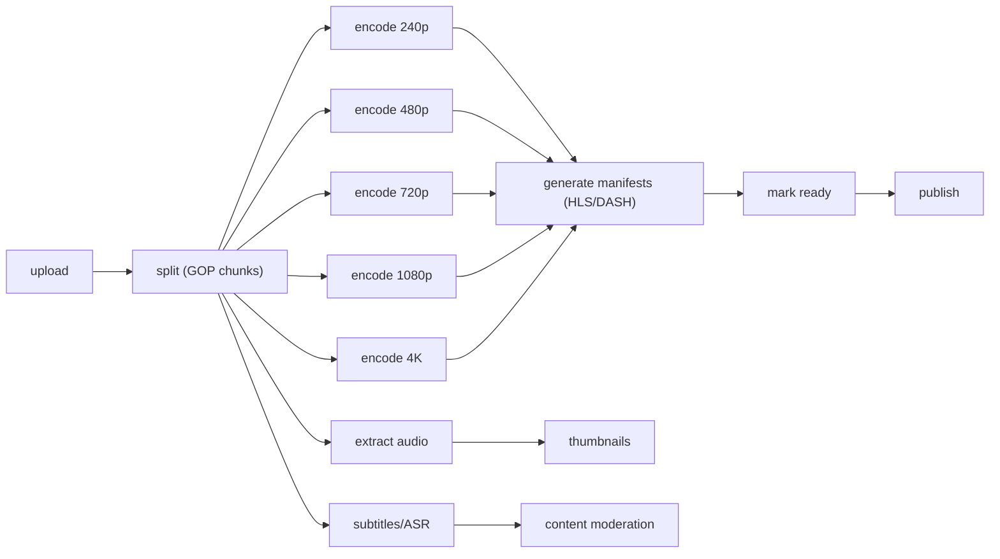
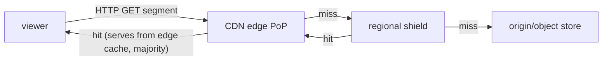
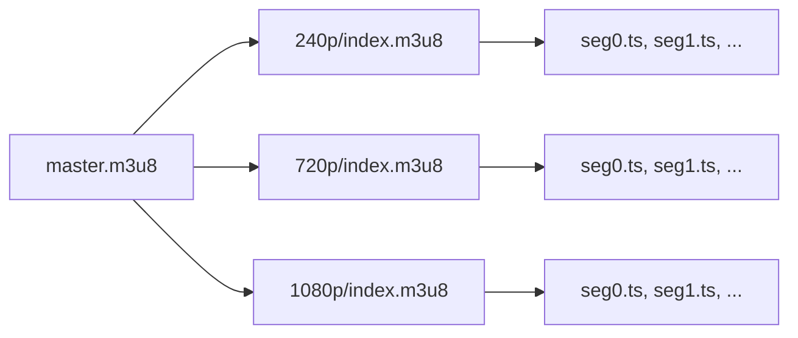
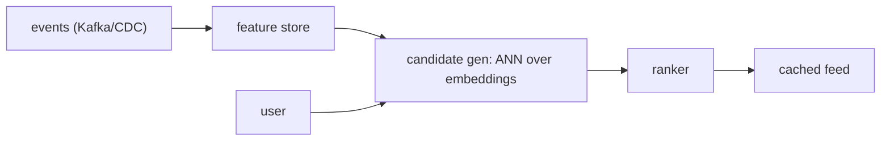
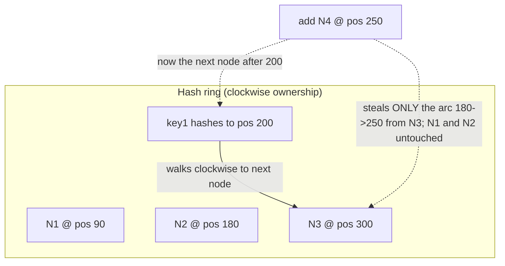

# Design Video and Media Platform and Distributed Cache

This document covers two tightly related interview staples: designing a
video/media platform (YouTube for user-generated VOD, Netflix for premium
catalog streaming) and designing a distributed cache ("build a cache" / build
Redis-Memcached). They pair naturally because a video platform lives or dies on
its cache and CDN layers, and the same partitioning/replication/eviction/hot-key
reasoning shows up in both.

The interviewer is grading **trade-off reasoning**, not component recall. For
every choice below the format is: intuition -> how it works -> real-world usage
-> what you gain, what you give up, and when to pick it over the alternative.

Two framing ideas to carry throughout:

> A video platform is mostly a **write-once, read-many, huge-object** system.
> The upload path is a batch pipeline (seconds to minutes are fine); the read
> path is a latency-critical, cache-and-CDN-dominated system (milliseconds to
> first byte matter).

> A cache is a **denormalized copy of the truth**. The moment you keep a second
> copy you have signed up for an invalidation problem, a consistency problem,
> and new failure modes (stampede, hot keys, split brain, poisoning).

---

## Requirements and capacity estimation

Always start by separating functional from non-functional requirements and
doing back-of-envelope math, because the numbers dictate the architecture.

**Functional (YouTube-style VOD):** upload video, transcode to multiple
qualities, stream with adaptive bitrate, view metadata (title, views, likes),
search, recommendations. **Out of scope to keep it tight:** comments, live
chat, monetization/ads internals.

**Non-functional:** high availability (choose availability over strong
consistency — a slightly stale view count is fine), low latency to first
frame (< 200 ms start-up is a good target), support very large files (GBs),
resumable uploads, durability of the master copy (never lose an upload),
massive read:write skew.

**Back-of-envelope (typical interview scale):**

- Assume 1B total users, 100M daily active. Reads dominate massively. Be careful
  what "view" means: a *daily active user* watches many videos per session, so
  100M DAU x ~10 video-starts/day = **~1B video-starts/day** (a session start is
  when the player loads a manifest and begins a stream). Uploads: ~5M/day.
- Video-starts/sec: 1B / 86,400 s ~= **~11.5k starts/sec average**, ~5-10x peak
  => **~60-115k starts/sec**. (If you want a deliberately conservative floor,
  quote 100M starts/day ~= 1,150/sec — but say out loud it's a floor; real
  YouTube is *billions* of views/day.) Each start then pulls **many segments**
  over minutes — a 10-minute video at 4-second segments is ~150 segment GETs — so
  segment GETs run 100x+ higher than starts and are **absorbed by the CDN, not
  the origin**. That gap (a handful of origin/metadata reads per start vs. ~150
  CDN-served segment GETs) is exactly why the CDN, not your origin, is the read
  path.
- Uploads/sec: 5M / 86,400 ~= **58 uploads/sec average**.
- Storage: 5M uploads/day * 300 MB avg raw = **1.5 PB/day of raw**. After
  transcoding to ~5 renditions (240p..4K) you multiply the *stored* footprint
  by roughly 1.5-2x the raw (renditions are individually smaller but there are
  several); call it ~2-3 PB/day ingested. Over a year that is exabyte-scale —
  which is why tiered storage and "only keep hot renditions hot" matter.
- Read:write ratio: on the order of **100:1 or higher** by object, and far
  higher by bytes served (CDN re-serves the same popular segments millions of
  times). This skew (Zipfian/long-tail) is the single most important property:
  a tiny fraction of videos generate most of the traffic, which is exactly what
  makes caching and CDNs effective.
- Bandwidth: 1080p H.264 ~ 5 Mbps. 1M concurrent viewers => 5 Tbps egress.
  This is why you offload to a CDN and why egress cost dominates the bill.

**Trade-off to state early:** availability over consistency (AP). A view
counter or recommendation being seconds stale is invisible; the video not
playing is a disaster. Contrast a payments system where you'd pick CP.

---

## Video upload and resumable chunking

**Intuition:** uploading a multi-GB file over a flaky mobile network in one
HTTP request is fragile — one dropped connection at 90% wastes everything.
Chunk it.

**How it works:**
1. Client asks the API for a **pre-signed URL** (S3/GCS/Azure SAS). The bytes
   go **directly from client to object store**, bypassing app servers. This is
   critical: app servers must never proxy GB payloads.
2. Client splits the file into **chunks (~5-10 MB)**, fingerprints each with a
   hash, and uploads via **multipart upload**. Each chunk is tracked
   (`NotUploaded`/`Uploaded`) in metadata.
3. On failure/resume, the client queries which chunks landed and re-uploads only
   the missing ones. Fingerprints also allow dedup (skip identical chunks).
4. When all chunks arrive, the object store assembles them; a completion event
   enqueues the transcoding job.

**Real-world:** AWS S3 multipart upload, `tus` resumable protocol, YouTube's
resumable upload API, Dropbox block-level sync.

**Trade-offs:**
- Pre-signed direct-to-blob upload vs proxy through app tier: **gain** — app
  tier stays stateless and cheap, no huge payloads through your fleet; **give
  up** — client complexity, and you must scope/expire the pre-signed URL
  tightly (security) since it grants write access to a bucket path.
- Chunk size: small chunks => better resumability and parallelism but more
  request overhead and metadata; large chunks => less overhead but more waste
  on failure. 5-10 MB is the industry sweet spot.
- Client-side vs server-side chunking: client-side enables resume/dedup before
  bytes hit the network; server-side is simpler for clients but wastes upload
  bandwidth on failure.

---

## Transcoding pipeline

**Intuition:** the raw upload is useless for streaming — different devices,
codecs, and network speeds need different renditions. Transcoding converts one
master file into many (container + codec + bitrate) variants split into
streamable segments. It is the CPU-heavy heart of the ingest path.

**Encoding basics:** a video file = **container** (.mp4, .webm, .mov) +
**codec** (H.264/AVC, H.265/HEVC, VP9, AV1). Codec choice trades compression
efficiency vs CPU cost vs device support. AV1 compresses ~30% better than
HEVC/VP9 (roughly ~50% better than H.264) but costs far more CPU to encode
and isn't universally decodable — so platforms
encode AV1 only for high-traffic titles where saved bandwidth pays back the
encode cost.

**GOP and segmentation:** video is split at **GOP (Group of Pictures)**
boundaries — each GOP starts with a keyframe (I-frame) that decodes
independently. Splitting on GOP boundaries lets you transcode segments in
parallel and lets players switch renditions cleanly at segment boundaries.
Segments are typically **2-10 seconds**.

**DAG pipeline (the modern answer):** model transcoding as a **directed acyclic
graph** of tasks (inspired by Facebook's streaming engine; orchestrated by
Temporal/Airflow/custom):

- **Preprocessor:** GOP split, DAG generation.
- **Scheduler + resource manager:** task queue, worker queue, running queue.
- **Task workers:** encode / watermark / thumbnail / merge. Stateless, scale
  horizontally, run on spot/preemptible instances (jobs are retryable).
- **Intermediate storage:** segments passed between stages via object-store
  URLs; small metadata in an in-memory cache.

**Real-world:** YouTube, Netflix (per-title and per-shot/per-scene encoding —
Netflix computes an optimal bitrate ladder per title rather than a fixed one),
Twitch, Mux.

**Trade-offs:**
- Transcode-everything-eagerly vs on-demand (lazy) transcoding: eager gives
  instant availability of all renditions but wastes compute+storage on the
  long tail (most videos get almost no views); lazy (transcode rare renditions
  only on first request) saves cost but adds first-view latency. YouTube
  transcodes popular content fully and does less work on the long tail.
- Queue-based decoupling (message queue between ingest and workers): **gain** —
  smooths bursty upload load, enables retries and parallelism, isolates
  failures; **give up** — eventual availability (video isn't watchable until the
  pipeline finishes), more moving parts.
- Recoverable vs non-recoverable errors: retry a transient encode failure; fail
  fast and surface an error on a malformed/corrupt input.
- Codec/rendition ladder breadth: more renditions = better QoE across devices
  and networks but multiplies encode CPU and storage. Netflix's per-title
  encoding is the trade-off optimization: spend analysis compute to avoid
  over-encoding simple content.

---

## Blob and object storage

**Intuition:** videos are large immutable blobs read far more than written —
exactly what object stores (S3/GCS/Azure Blob) are built for. Do not put video
bytes in a database.

**How it works:** the **master (mezzanine) copy** and all transcoded segments
live in an object store with 11-nines durability via erasure coding and
cross-AZ replication. Objects are keyed like `videoId/rendition/segment_N.ts`.
Storage is **tiered by access pattern**:

| Tier            | Latency  | Cost      | Use                                   |
|-----------------|----------|-----------|---------------------------------------|
| Hot (standard)  | ms       | high      | popular videos, recent uploads        |
| Infrequent      | ms       | medium    | mid-tail catalog                      |
| Cold/Archive    | min-hrs  | very low  | master copies, long-tail, compliance  |

**Real-world:** YouTube on Google's Colossus/Bigtable-backed storage, Netflix
on S3 (masters) + Open Connect for delivery.

**Trade-offs:**
- Object store vs distributed file system vs DB blobs: object store wins for
  huge immutable objects (cheap, durable, HTTP-native, integrates with CDN);
  DB blobs bloat the DB and kill cache locality; DFS is operationally heavy.
- Erasure coding vs full replication: erasure coding (e.g., 10+4) gives similar
  durability at ~1.4x storage overhead vs 3x for triple replication — **gain**
  huge cost savings; **give up** higher CPU/latency on reconstruction, so hot
  data often stays replicated while cold data is erasure-coded.
- Keep master forever vs delete: masters enable re-encoding to future codecs
  (re-encode the whole catalog to AV1) but cost the most storage — archive them
  to cold tier rather than deleting.

---

## CDN delivery and edge caching

**Intuition:** the speed of light bounds round-trip time. Serving a 1080p stream
from an edge PoP 20 ms away beats an origin 150 ms away, and it offloads
terabits of egress from your origin. For a video platform, **the CDN is the
read path**.

**How it works:** transcoded segments + manifests are pushed/pulled to CDN edge
caches near users. The player fetches segments over HTTP(S) directly from the
nearest PoP. On a cache miss the edge fetches from a regional shield/origin and
caches it. Because content is immutable and content-addressed by
`videoId/rendition/segment`, cache invalidation is trivial (new content = new
URL).

**Push vs pull CDN:**
- **Pull (lazy):** edge fetches from origin on first miss, then caches. Simple,
  self-tuning to demand, but first viewer per PoP eats a miss (cold-start
  latency) and origin sees a burst on new viral content.
- **Push (eager):** you pre-populate edges for content you predict will be hot
  (a Netflix new-release, a premiere). No cold-start miss, but you pay to
  distribute content that might not be watched.

**Real-world:** Netflix **Open Connect** — Netflix built its own CDN and places
**Open Connect Appliances (OCAs) inside ISP networks**, pre-positioning popular
titles overnight during off-peak (predictive caching). YouTube uses Google's
edge + Google Global Cache in ISPs. Cloudflare/Akamai/Fastly for third parties.

### Request routing to the nearest PoP

**Intuition:** the CDN has hundreds of PoPs (points of presence) worldwide, but
the player only knows one URL like `cdn.example.com/videoId/1080p/seg42.ts`. Some
layer has to turn that one name into "connect to *this* edge, the one that is
close, healthy, and not overloaded." That layer is **request routing**, and it's
the follow-up an interviewer reaches for the moment you say "the CDN serves it."
Two mechanisms dominate:

- **Anycast (routing-layer steering):** the same IP address is announced from
  many PoPs via **BGP** (Border Gateway Protocol, the internet's inter-network
  routing protocol). The network itself delivers the packet to the
  topologically-nearest PoP. **Gain:** dead simple for the client (one IP), and
  failover is near-instant — if a PoP withdraws its BGP route, traffic
  automatically re-routes to the next-nearest without any client change. **Give
  up:** granularity — "nearest by BGP hops" is not the same as "lowest latency"
  or "least loaded," and long-lived TCP connections can break if BGP re-converges
  mid-flow. Cloudflare and Fastly lean heavily on anycast.
- **DNS-based steering (resolution-layer):** the authoritative DNS server for the
  CDN hostname returns *different* PoP IPs depending on the resolver's
  geolocation, measured latency, and current PoP health/load. **Gain:** rich,
  policy-driven decisions — steer by geography, real-time latency maps, and drain
  a PoP by simply stopping handing out its IP. **Give up:** staleness bounded by
  **DNS TTL** — clients cache the answer for the TTL, so after a PoP fails you
  keep sending users there until their cached record expires (short TTLs fix
  freshness but raise DNS query load), and you only see the *resolver's* location,
  not the end user's (mitigated by EDNS Client Subnet). Akamai's classic design
  and most commercial CDNs use DNS steering, often layered on top of anycast.

Either way, **health and load feed the decision**: a PoP that fails health checks
or crosses a load threshold is pulled from the anycast announcement or stopped
being returned by DNS, so new requests steer to the next-best PoP. This is how a
CDN "routes around" an overloaded or failed edge.

**Trade-offs:**
- Own CDN (Open Connect) vs commercial CDN: **gain** — at Netflix scale, huge
  egress cost savings, control, ISP embedding; **give up** — enormous capital
  and operational investment. Only worth it above a very high traffic threshold;
  a startup should rent a CDN.
- What to cache at the edge: cache only popular content (Zipfian long tail means
  a small hot set serves most traffic). Caching the entire catalog at every edge
  is prohibitively expensive and low-ROI.
- Tiered/hierarchical caching (edge -> regional shield -> origin): **gain** —
  shield absorbs edge misses so origin sees few requests (protects origin from
  thundering herds on viral content); **give up** — extra hop latency on the
  rare deep miss, more infra.
- Predictive push vs reactive pull: covered above; Netflix can predict (catalog
  known in advance) so it pushes; YouTube's UGC is unpredictable so it pulls.

---

## Adaptive bitrate streaming, HLS and DASH

**Intuition:** a viewer's bandwidth fluctuates (train tunnel, congested WiFi).
Adaptive Bitrate (ABR) streaming lets the **client** switch quality per segment
so playback never stalls — start low, ramp up when bandwidth allows.

**How it works:**
1. Video is stored as multiple renditions, each cut into short segments (2-10 s).
2. A **manifest/playlist** indexes them: a **master manifest** lists available
   renditions (bitrate, resolution, codec) each pointing to a **media manifest**
   listing that rendition's segment URLs.
3. The player downloads the master manifest, estimates bandwidth, picks a
   rendition, downloads segment-by-segment, and **switches renditions at segment
   boundaries** based on measured throughput and buffer level.
4. It prefetches ahead to build a buffer against jitter.

**HLS (Apple, .m3u8, TS or fMP4/CMAF)** vs **MPEG-DASH (open standard, .mpd, fMP4):**

| Dimension        | HLS                              | MPEG-DASH                        |
|------------------|----------------------------------|----------------------------------|
| Origin           | Apple                            | ISO/open standard                |
| Device support   | Universal (required on iOS/Safari)| Everywhere except native Apple  |
| Codec-agnostic   | historically H.264-centric       | yes                              |
| Latency variant  | LL-HLS                           | LL-DASH                          |
| DRM              | FairPlay                         | Widevine/PlayReady               |

CMAF (Common Media Application Format) with fMP4 segments lets you package once
and serve both HLS and DASH, avoiding double storage.

**Trade-offs:**
- ABR (many renditions + manifests) vs single progressive download: ABR gives
  smooth playback across networks/devices but adds pipeline complexity and
  storage; progressive download is simple but stalls on bandwidth drops and
  wastes bytes on high-quality-to-a-phone. ABR is the standard answer.
- Segment length: short segments (2 s) => faster quality adaptation and lower
  live latency, but more requests/overhead and more manifest churn; long
  segments (10 s) => efficient but slow to react and higher live latency.
- Client-driven ABR vs server-driven: client-driven (HLS/DASH standard) scales
  because the edge just serves static segments — no per-viewer server state;
  server-side ABR could optimize globally but reintroduces per-session state and
  doesn't cache well.
- Support both HLS and DASH vs one: supporting both maximizes device reach but
  doubles packaging unless you use CMAF.

---

## Metadata service and database

**Intuition:** separate the tiny, queryable metadata (title, uploader, views,
likes, manifest URL, thumbnails) from the huge video blobs. Metadata is what
your APIs and search hit constantly; it must be fast and horizontally scalable.

**How it works:** a stateless metadata service backed by a NoSQL store
(Cassandra/DynamoDB/Bigtable) partitioned by `videoId`. You only ever do point
lookups by `videoId` on the watch path, so a partitioned key-value model scales
horizontally and needs no joins. A read-through cache (Redis/Memcached) fronts
it. Counts (views/likes) are high-write and are handled separately — often via
an append + async aggregation (or approximate counters) rather than a hot row
update per view.

**Real-world:** YouTube/Netflix use Cassandra/Bigtable/DynamoDB-style stores for
metadata; view counts via streaming aggregation (e.g., Kafka + Flink/Spark).

**Trade-offs:**
- NoSQL (Cassandra) vs relational: point-lookup-by-id + massive scale + AP
  preference favors Cassandra (tunable consistency, linear scale, no joins);
  relational buys ACID and rich queries you don't need on the hot path. Use
  relational only for the pieces that need transactions (e.g., billing).
- Partition by `videoId`: even key distribution and simple lookups, but a single
  viral video makes one partition **hot** (see hot keys). Mitigate with
  replication and a cache in front, not by changing the partition key.
- Sync counter update vs async aggregation: per-view synchronous increment is
  simple but creates a write hot spot and contention on popular videos; async
  aggregation (accept eventual, approximate counts) scales but the count lags —
  acceptable because view counts don't need to be exact/instant.

---

## Recommendations at a high level

**Intuition:** most watch time comes from recommendations, not search. The
interviewer wants a *high-level* pipeline, not an ML deep-dive.

**How it works — two-stage retrieval + ranking (the modern standard):**
1. **Candidate generation (retrieval):** from millions of videos, cheaply narrow
   to hundreds using **embeddings + Approximate Nearest Neighbor (ANN) search in
   a vector DB** (FAISS, ScaNN, Milvus, Pinecone) plus collaborative-filtering
   signals. This is where **vector databases** enter modern designs.
2. **Ranking:** a heavier model scores the few hundred candidates using rich
   features (watch history, freshness, engagement) to produce the final ordered
   list.
3. **Serving:** precompute/cache recommendations per user (batch + near-real-time
   updates via a streaming layer consuming a **CDC/event stream** of watch
   events). Feature store serves features at low latency.

**Trade-offs:**
- Precompute (batch) vs real-time ranking: precomputed feeds are cheap and fast
  to serve but stale (miss just-watched signals); real-time reranking captures
  fresh intent but costs compute per request. Hybrid (precomputed candidates,
  light real-time rerank) is common.
- Collaborative filtering vs content-based vs embeddings/ANN: CF needs
  interaction data (cold-start problem for new users/videos); content-based
  handles cold start; embedding ANN is the modern unifier but needs an index
  refresh pipeline. State the cold-start trade-off explicitly.
- Vector DB vs brute-force similarity: ANN gives sub-linear latency at billions
  of vectors with a small recall trade-off; exact search is accurate but too
  slow at scale.

---

## Live streaming versus VOD

**Intuition:** VOD is transcode-once, read-many with generous ingest latency.
Live is a real-time pipeline where **glass-to-glass latency** is the hard
constraint and you cannot pre-transcode the future.

**Differences:**

| Dimension            | VOD                          | Live streaming                     |
|----------------------|------------------------------|------------------------------------|
| Latency budget       | ingest can take minutes      | seconds (LL-HLS/WebRTC: sub-second)|
| Transcode            | batch, heavy parallelism     | real-time, per-segment as it arrives|
| Storage              | full catalog, cacheable      | rolling buffer; optional DVR/record|
| CDN caching          | easy (immutable, long TTL)   | hard (new segments constantly)     |
| Error handling       | retry freely                 | can't retry the past; drop/degrade |
| Protocols            | HLS/DASH                     | RTMP/SRT ingest, LL-HLS/WebRTC out |

**Ingest -> deliver:** encoder pushes via **RTMP/SRT** to an ingest server ->
real-time transcode into an ABR ladder -> segments + rolling manifest pushed to
CDN -> players pull LL-HLS/LL-DASH (seconds) or WebRTC (sub-second for
interactive). DVR/record-to-VOD stores segments for later playback.

**Latency tiers:** standard HLS ~10-30 s; LL-HLS ~2-5 s; WebRTC < 500 ms
(interactive: auctions, betting, video calls).

**Trade-offs:**
- Latency vs scale vs cost: WebRTC gives sub-second but is peer/session-oriented
  and scales poorly to millions of concurrent viewers; LL-HLS scales via CDN
  (HTTP, cacheable) at a few seconds latency. Choose WebRTC only when
  interactivity truly requires it (Twitch low-latency mode, sports betting);
  otherwise LL-HLS for mass broadcast.
- Real-time transcode cost: live transcoding can't use spot/preemptible as
  freely and can't batch — higher cost per stream; you often transcode fewer
  renditions live and backfill more for the recorded VOD.
- Caching live segments: short TTLs + shielding to protect origin from the
  thundering herd when a stream goes viral; the newest segment is a guaranteed
  hot key every few seconds.

---

## Distributed cache architecture, build a cache

**Intuition:** a single-node cache (a hash map + eviction) caps out at one box's
RAM and throughput and dies with that box. A **distributed cache** spreads keys
across many nodes to scale capacity and throughput and survive failures — this
is the "design Redis/Memcached" question.

**Core building blocks of an in-memory cache node:**
- A concurrent **hash map** for O(1) `get/set/delete`.
- An **eviction policy** structure (e.g., an intrusive doubly linked list for
  LRU, or frequency counters for LFU) so eviction is also O(1).
- **TTL/expiry** handling (lazy expiry on access + periodic active sweeps).
- Optional persistence (snapshots/AOF) for warm restart.

**Threading model — the classic Redis vs Memcached follow-up.** How the node uses
CPU cores is the single most common concrete probe in "build a cache":

- **Redis is single-threaded** for command execution: one event loop processes
  commands one at a time. **Gain:** no locks, no lock contention, and atomic
  commands come for free (a command can't interleave with another). **Give up:**
  one instance uses essentially *one CPU core*, and a single slow O(n) command
  (`KEYS *`, a giant `SMEMBERS`, a big `LRANGE`) **blocks every other client**
  until it finishes — the whole node stalls. That's why you (a) avoid O(n)
  commands on hot instances (use `SCAN` instead of `KEYS`) and (b) scale Redis by
  **sharding across many instances** (each pinned to a core) rather than by
  adding threads. (Modern Redis does offload some I/O and lazy-freeing to helper
  threads, but command execution stays single-threaded.)
- **Memcached is multi-threaded:** it scales a simple key-value workload across
  all cores of one box. **Gain:** more throughput per node for plain GET/SET.
  **Give up:** internal locking, and it lacks Redis's rich data structures.

Rule of thumb: reach for Redis when you want data structures, persistence, and
atomic operations; reach for Memcached (or many sharded Redis instances) when you
just need the most raw KV throughput per core.

**Distributed layer — the four questions you must answer:** (1) how are keys
**partitioned** across nodes, (2) how is data **replicated** for HA, (3) what
**consistency** do reads see, (4) how do you handle **eviction** and **hot
keys**. The next sections take these one at a time.

**Client-side vs proxy topology:**
- **Client-side sharding** (client library knows the ring, talks directly to the
  right node — Memcached clients, Redis Cluster smart clients): lowest latency
  (one hop), but every client embeds routing logic and must learn topology
  changes.
- **Proxy/router** (Twemproxy, Envoy, mcrouter): clients are dumb, the proxy
  routes and can do pooling/failover; adds a hop (~sub-ms) but centralizes
  topology and simplifies clients.

**Cache patterns:**
- **Cache-aside (lazy):** app reads cache, on miss reads DB and populates cache.
  Simplest, most common; cache only holds requested data; risk of stale on
  update (mitigate by invalidating on write). Redis/Memcached default usage.
- **Read-through / write-through:** cache library owns DB access; write-through
  writes cache+DB synchronously (consistent, higher write latency).
- **Write-back (write-behind):** write to cache, async flush to DB. Fast writes,
  absorbs bursts, but risks data loss on node failure before flush.

**Trade-offs:** see the dedicated section; the headline is that a cache trades
consistency and durability for latency and load reduction, and every knob below
moves you along that spectrum.

---

## Cache partitioning and consistent hashing

**Intuition:** you must map each key to a node. Naive `hash(key) % N` remaps
**almost every key** when N changes (add/remove a node), causing a mass cache
miss storm that hammers the database. Consistent hashing fixes this.

**How consistent hashing works:** hash both nodes and keys onto a ring
(0..2^32). A key is owned by the first node clockwise. Adding/removing a node
only remaps the keys between it and its neighbor — on average **K/N keys move**,
not all of them. **Virtual nodes** (each physical node placed at many ring
positions) smooth out load imbalance and make rebalancing on failure spread
across all remaining nodes instead of dumping onto one neighbor.

The ring runs 0 -> 2^32 clockwise and wraps around. Each key walks **clockwise**
until it hits a node — that node owns it. Adding a node only re-homes the keys in
the one arc that now ends at the newcomer:

Before N4: key1 (pos 200) walked clockwise past 180 to the next node, N3 (pos
300). After inserting N4 at pos 250, key1 (pos 200) now stops at N4 instead — but
*only* keys landing in the arc (180, 250] move; every other key keeps its home,
so those nodes' caches stay warm. **Virtual nodes** place each physical node at
many ring positions, so this "arc that moves" is chopped into many small arcs
scattered around the ring — that's what spreads both load and rebalancing evenly.

**Worked example — why only K/N keys move.** Say you have **1000 keys** spread
over **N = 4** nodes, ~**250 keys each**. Now add a 5th node:

- **Consistent hashing:** N4's incoming node lands on the ring and owns exactly
  one arc — the keys between it and the next node clockwise. The new steady state
  is 1000/5 = **200 keys per node**, so only ~**200 keys move** (K/N = 1000/5),
  and every one of them is *stolen from a single neighbor's arc*. The other three
  nodes are untouched — their keys never move, so their cache stays warm.
- **Modulo hashing (`hash(key) % N`):** changing N from 4 to 5 changes almost
  every mapping. A key keeps its home only when `hash%4 == hash%5`; enumerating
  `hash mod 20` that happens only for remainders 0,1,2,3 — **4 of 20 = 20%**. So
  **~800 of 1000 keys (80%) move**, i.e. 800 fresh cache misses slam the DB at
  once. That is the miss storm consistent hashing avoids.

**Worked example — virtual nodes on failure.** Take **3 physical nodes** each
placed at **150 vnodes** = 450 positions on the ring, 1000 keys ~= 333 per node.
Now node N2 dies:

- **Without vnodes** (one arc each), N2's entire ~333-key arc dumps onto its
  single clockwise neighbor N3 -> N3 jumps to ~**667 keys** while N1 stays ~333.
  One node is now doing double the work (load imbalance + a hot spot).
- **With 150 vnodes**, N2's 150 little arcs are scattered around the ring, so
  each arc's keys fall to whichever of N1/N3 sits next. Statistically ~half go to
  each: N1 -> ~500, N3 -> ~500. The failed node's load spreads *evenly* across
  the survivors instead of crushing one neighbor.

**Real-world:** DynamoDB, Cassandra, Redis Cluster (uses 16384 hash slots — a
fixed-slot variant that's easy to resize by moving slots), Memcached client
libraries, consistent-hashing load balancers.

**Trade-offs:**
- Consistent hashing vs modulo hashing: consistent hashing keeps hit ratio
  stable across scaling events (only K/N keys move) — critical for a cache;
  modulo is simpler but causes catastrophic miss storms on resize. Always
  consistent hashing for a distributed cache.
- Virtual nodes count: more vnodes = smoother load distribution and finer
  rebalancing, but more routing metadata and memory. Hundreds per node is
  typical.
- Fixed slots (Redis Cluster's 16384) vs pure ring: fixed slots make
  reassignment and admin explicit and bounded; pure ring is more elastic but
  harder to reason about operationally.
- Range partitioning vs hash partitioning: range enables scans/ordered queries
  but risks hot ranges; hash spreads load evenly but kills range scans. Caches
  do point lookups, so hash/consistent hashing wins.

---

## Cache replication and consistency

**Intuition:** if a key lives on exactly one node and that node dies, you lose
that slice of cache (miss storm) — and you can't serve reads for it. Replication
adds copies for availability and read scaling, at the cost of keeping copies in
sync.

**Models:**
- **Primary-replica (leader-follower):** writes go to the primary, async
  replicated to followers that serve reads. Scales reads, simple, but replicas
  can serve **stale** data (async lag) and failover needs promotion (Redis
  Sentinel). This is Redis's default.
- **Multi-primary / quorum (Dynamo-style):** any replica takes writes; use
  **W + R > N** quorums to tune consistency. Highly available and
  partition-tolerant, but you must resolve conflicts (last-write-wins, vector
  clocks). Cassandra/DynamoDB.
- **No replication (Memcached classic):** each key on one node; on node loss you
  just miss and refill from DB. Simplest and cheapest; acceptable because it's
  "only a cache."

**Worked example — why W + R > N guarantees read-after-write.** The rule is pure
pigeonhole: if the set of nodes you wrote (size W) and the set you read (size R)
together exceed the total N, they *must* overlap in at least one node — and that
node has the newest value. Take **N = 3** (nodes A, B, C):

- **W = 2, R = 2 -> W + R = 4 > 3.** A write of `v2` acks after landing on any 2
  nodes, say {A, B}. A later read polls any 2 nodes, say {B, C}. The write set
  {A,B} and read set {B,C} *must* share a node (here B) — 2 + 2 = 4 slots into 3
  nodes forces an overlap. B returns `v2` (highest version wins), so the read
  never misses the latest write. Guaranteed fresh.
- **W = 1, R = 1 -> sum = 2, not > 3.** Write `v2` to {A} only; read from {C}
  only. {A} and {C} don't overlap, so C still holds the stale `v1` — **you can
  read stale**. Fastest and most available, but no read-after-write.
- **W = 3, R = 1 -> sum = 4 > 3.** Every write hits all 3, so any single node has
  the latest and a 1-node read is always fresh (cheap, strong reads). Cost: if
  *one* node is down you can't reach W=3, so **all writes block** — you traded
  write availability for strong cheap reads.

Read this as a dial: push W up for fresh cheap reads (pay in write latency /
write availability); push both down for speed and availability (pay in
staleness). W=2,R=2 on N=3 is the balanced "strong-ish and still tolerates one
node down" default.

**Consistency spectrum:** strong (read-after-write, costs latency/coordination)
-> read-your-writes -> eventual (fast, may serve stale). For a cache you almost
always accept **eventual consistency** because the source of truth is the DB.

**Gotchas — split brain and cache poisoning (interviewer probes):**
- **Split brain on failover:** if the network partitions primary from replica,
  a naive setup promotes the replica to a second primary — now *two* primaries
  accept writes and diverge. Fix with quorum-based failover fencing: Redis
  Sentinel (or a Raft-style controller) requires a majority of sentinels to agree
  before promoting, and the old primary is fenced/demoted so it stops taking
  writes when it rejoins.
- **Cache poisoning:** one bad/corrupt value written to a hot key gets replicated
  and served to everyone until it expires. Mitigate with **versioned keys**
  (bump the key/version on a schema or logic change so old poison is orphaned),
  **short TTLs on suspect/derived data** to bound blast radius, and
  **validation on write** so malformed values never enter the cache.

**Trade-offs (CAP and PACELC applied to caches):** PACELC extends CAP with the
part CAP ignores — the normal, no-failure case. Read it as: **if P**artitioned,
trade **A**vailability vs **C**onsistency (that's plain CAP); **E**lse (no
partition, the common case), you *still* trade **L**atency vs **C**onsistency.
The "Else" clause is the one that bites caches: even when nothing is broken,
waiting for replicas to sync (strong consistency) costs latency on every write,
so the sync-vs-async choice below is fundamentally an L-vs-C decision.
- Replicate vs not: replication gives HA + read scaling but doubles memory cost
  and introduces staleness/conflict handling. For a pure read cache in front of
  a durable DB, many teams **skip replication** and accept refill-on-miss —
  cheaper, and a miss just costs one DB read.
- Sync vs async replication: sync replicas guarantee no stale reads and no data
  loss on failover but add write latency and reduce availability under partition
  (PACELC: latency vs consistency even absent partitions); async is fast but can
  lose recent writes on failover and serve stale reads.
- Quorum tuning (W/R/N): W=N,R=1 optimizes reads (strong-ish) at write cost;
  W=1,R=1 maximizes availability/latency but is fully eventual. Pick based on how
  bad a stale read is for your data.
- Strong consistency in a cache is usually the **wrong** choice — you're paying
  DB-level coordination cost while giving up the cache's whole reason to exist
  (speed). Choose it only for cache-as-system-of-record cases.

---

## Cache eviction policies

**Intuition:** RAM is finite; when the cache fills you must evict something. The
policy is a bet about what will be reused. A good policy maximizes hit ratio for
your access pattern.

**Policies:**
- **LRU (Least Recently Used):** evict the item untouched longest. Great for
  temporal locality; the default. Cheap with a hash map + intrusive linked list
  (O(1)). Weakness: a large scan (one-time bulk read) can flush the hot set
  ("cache pollution").
- **LFU (Least Frequently Used):** evict the least-accessed. Better for stable
  popularity skew (keeps genuinely hot keys), but adapts slowly to changing
  popularity and needs frequency counters (Redis uses an approximate,
  probabilistic LFU with counter decay).
- **FIFO:** evict oldest inserted regardless of use — simple, but ignores reuse;
  rarely best.
- **TTL-based:** expire after a fixed time; pairs with any policy. Good for data
  with natural freshness bounds.
- **Segmented/adaptive (SLRU, ARC, W-TinyLFU):** modern high-hit-ratio policies
  (Caffeine uses W-TinyLFU) that resist scan pollution and adapt between recency
  and frequency.
- **Random / allkeys-random:** evict a random key; O(1), surprisingly decent,
  used when you can't afford bookkeeping.

**Worked example — LRU vs LFU on the same sequence.** Cache size **3**, access
sequence **A, B, C, A, B, D, E, A**:

| Step | Access | LRU state (MRU→LRU) | LRU action        | LFU state (key=count)   | LFU action        |
|------|--------|---------------------|-------------------|-------------------------|-------------------|
| 1    | A      | A                   | miss, insert      | A=1                     | miss, insert      |
| 2    | B      | B,A                 | miss, insert      | A=1,B=1                 | miss, insert      |
| 3    | C      | C,B,A               | miss, insert (full)| A=1,B=1,C=1            | miss, insert (full)|
| 4    | A      | A,C,B               | hit               | A=2,B=1,C=1             | hit               |
| 5    | B      | B,A,C               | hit               | A=2,B=2,C=1             | hit               |
| 6    | D      | D,B,A               | miss, **evict C** (LRU)| A=2,B=2,D=1        | miss, **evict C** (freq 1)|
| 7    | E      | E,D,B               | miss, **evict A** (LRU)| A=2,B=2,E=1        | miss, **evict D** (freq 1)|
| 8    | A      | A,E,D               | **miss**, evict B | A=3,B=2,E=1             | **hit**           |

Same inputs, different final access: **LRU misses on the last A** (it evicted A
at step 7 as "least recently used"), while **LFU hits** (A's frequency of 2 kept
it resident). Tally: LRU = 6 misses / 2 hits; LFU = 5 misses / 3 hits. That extra
hit is exactly LFU protecting a genuinely popular key that LRU threw away.

**Worked example — scan pollution.** Hot set `{A, B, C}` already accessed ~10x
each (LFU counts A=B=C=10), then a one-time **scan reads 100 fresh keys X1..X100**
through the same size-3 cache:

- **LRU:** X1 evicts A, X2 evicts B, X3 evicts C — after just 3 scan reads the
  *entire hot set is gone*. When the app next asks for A/B/C, all miss and refill
  from the DB. The scan flushed the working set.
- **LFU (naive counters):** X1 comes in at freq 1 and evicts one hot key (a tie
  broken by recency), but then X2 (freq 1) evicts X1 (freq 1), X3 evicts X2, and
  so on — the scan keys churn through a *single* cold slot while B and C (freq 10)
  stay put. It loses at most one hot key, not all three.
- **W-TinyLFU (Caffeine):** an admission filter compares the newcomer's estimated
  frequency to the eviction candidate's; X1 (freq 1) < the victim's freq 10, so
  X1 is **rejected on admission** and never enters — zero hot keys lost. This is
  why modern caches use it.

**Real-world:** Redis maxmemory policies (`allkeys-lru`, `volatile-lru`,
`allkeys-lfu`, `volatile-ttl`, `noeviction`); Memcached slab LRU; Caffeine's
W-TinyLFU.

**Trade-offs:**
- LRU vs LFU: LRU adapts fast to changing hot sets and is scan-friendly to
  implement but pollutes on scans; LFU protects long-term hot keys but is slow
  to forget once-popular items (needs decay). Pick LFU for stable Zipfian
  popularity (e.g., top videos), LRU for shifting/recency-driven access.
- Precision vs overhead: exact LFU needs counters and heaps; approximate LFU
  (Redis) trades a little accuracy for O(1) and less memory. Almost always take
  the approximation at scale.
- `noeviction` vs evict: `noeviction` returns errors when full (protects you
  from silently dropping data you treat as a store) but can break the app; evict
  keeps serving but silently loses cold data. Choose based on whether the cache
  is a pure cache or a store.

---

## Hot keys and thundering herd

**Intuition:** even with perfect partitioning, a single viral key (Taylor Swift
video metadata, a live stream's newest segment, a trending product) gets so much
traffic it overloads its one owning node — a **hot key/hot shard**. And when a
popular key expires or a cache node dies, a flood of concurrent misses hits the
DB simultaneously — a **thundering herd / cache stampede / dogpile**.

**Hot-key mitigations:**
- **Replicate the hot key** to multiple nodes and load-balance reads across
  copies (breaks the single-owner bottleneck).
- **Key splitting / fan-out:** store `key#1..key#N` copies, read a random one —
  spreads load across shards at the cost of N-way writes/invalidation.
- **Local (client/edge) cache** in front of the distributed cache for the
  hottest keys — a small L1 per app server absorbs most reads (Netflix's
  EVCache, Facebook's use of local caches). Trade-off: local copies can be
  stale and must be invalidated.
- **Consistent hashing with bounded loads** to cap any node's share.

**Thundering-herd / stampede mitigations:**
- **Request coalescing / single-flight:** only the first miss recomputes; other
  concurrent requests for the same key wait for that result (Go singleflight,
  `mcrouter` dedup). Collapses N DB hits into 1.
- **Distributed lock / "leader recompute":** one requester takes a short lock to
  repopulate; others serve stale or wait.
- **Probabilistic / early recomputation (XFetch):** refresh a key slightly
  before it expires, randomized so all replicas don't expire simultaneously.
- **Stale-while-revalidate:** serve the expired value while a background refresh
  runs — hides latency, accepts brief staleness.
- **Jittered TTLs:** randomize expiry so a whole batch of keys doesn't expire at
  the same instant.
- **Negative caching:** cache "not found" briefly to stop repeated misses from
  hammering the DB.

**Worked example — sizing a hot-key fix.** A trending video's metadata key takes
**1M req/s**, but one cache node caps at ~**100k req/s**. One owner is 10x over
budget.
- **Replicate the key** to `key#1..key#10` across 10 nodes and read a random
  copy: 1,000,000 / 10 = **100k req/s per node** — exactly at budget. Cost: every
  write/invalidation must fan out to all 10 copies.
- **L1 local cache** instead: put the key in an in-process cache on all **500 app
  servers**. Each server serves its own reads from RAM, so the distributed tier
  sees only refills — roughly one fetch per server per TTL. At a 10 s TTL that's
  500 / 10 = **~50 req/s** reaching the shared cache, essentially zero. Cost: 500
  uncoordinated copies can be up to 10 s stale.

**Worked example — single-flight collapsing a stampede.** A hot key expires and
**50,000 concurrent requests** miss in the same instant.
- **No coalescing:** all 50,000 miss, all 50,000 hit the DB to recompute the same
  value -> the DB takes 50,000x its intended load and can topple.
- **Single-flight:** the first miss acquires the in-flight slot and issues
  **exactly 1 DB read**; the other **49,999** block on that shared in-flight
  promise. When it resolves, one populated value is returned to all 50,000 and
  written to the cache once. DB load: **1 query instead of 50,000**.

**Cache penetration / avalanche:**
- **Penetration:** requests for keys that don't exist bypass the cache and hit
  the DB every time — defend with negative caching or a **Bloom filter** in
  front (reject definitely-absent keys cheaply).
- **Avalanche:** a whole cache tier fails or mass-expires at once, dumping full
  load on the DB — defend with jittered TTLs, replication, multi-tier caching,
  and rate limiting/circuit breakers to the DB.

**Trade-offs:**
- Replicating hot keys vs coalescing: replication scales *reads* of a persistent
  hot key; coalescing/single-flight scales the *miss/recompute* moment. You often
  need both (they solve different phases).
- Local L1 cache vs only distributed: L1 slashes hot-key load and network hops
  but multiplies staleness (many uncoordinated copies) — invalidation becomes
  harder. Use short L1 TTLs.
- Stale-while-revalidate vs strict fresh: SWR maximizes availability/latency but
  serves stale for one refresh window; strict blocks readers during recompute
  (herd risk). Choose based on staleness tolerance.
- Bloom filter for penetration: tiny memory, avoids DB hits for absent keys, but
  false positives let a few through and you can't easily delete entries
  (use counting Bloom filters if churn is high).

---

## Cost and latency trade-offs of edge caching

**Intuition:** every caching decision is a bet that the cost of a stale/less-fresh
read is lower than the cost of a slow read or an origin/DB hit. Edge caching
specifically trades **freshness and storage/egress cost** for **latency and
origin offload**.

**The levers and their trade-offs:**
- **Cache more at the edge (higher TTL, more content):** higher hit ratio => less
  origin load and lower latency, but more edge storage cost and more staleness
  risk. For immutable video segments, staleness is a non-issue (content-addressed
  URLs), so cache aggressively. For mutable metadata, short TTLs.
- **Egress cost dominates video bills:** CDN egress ~ $0.01-0.08/GB. 100M views
  is petabytes of egress — the reason Netflix built Open Connect (embed OCAs in
  ISPs to move bytes off transit links) and YouTube uses Google Global Cache.
  Building your own CDN saves egress at massive scale but costs capital;
  renting a CDN is right below that scale.
- **How many PoPs / how deep the hierarchy:** more edges = lower latency and
  better offload but higher fixed cost and lower per-edge hit ratio (each edge
  sees less traffic, so its cache is colder). Regional shields recover hit ratio
  by aggregating misses.
- **Push vs pull economics:** push pre-positions predicted-hot content (no
  cold-start latency, but you pay to move content that may not be watched); pull
  only caches what's demanded (cost-efficient, but first viewer per PoP pays the
  miss and origin sees a burst on virality).
- **Hot-set sizing:** because access is Zipfian, caching the top ~5-20% of
  content at the edge captures the large majority of requests — spending to cache
  the long tail has sharply diminishing returns. Size the edge cache to the knee
  of the popularity curve.

**Latency ballparks to quote:** L1/local memory ~100 ns; same-DC Redis GET
~0.2-1 ms; cross-region round trip ~50-150 ms; CDN edge hit ~10-30 ms to first
byte vs origin ~100-200 ms. Video start-up target < 200 ms; rebuffer ratio is
the key QoE metric.

**Trade-off summary:** edge caching converts a latency + bandwidth-cost problem
into a freshness + storage-cost problem. For write-once immutable media it's
almost pure win (cache everywhere hot, long TTL). For mutable data you pay in
staleness and invalidation complexity, so cache selectively with short TTLs and
explicit invalidation.

---

## Trade-offs and when to use what

A consolidated decision guide — the heart of the interview.

**Upload path:** pre-signed direct-to-blob + client chunking + resumable
multipart. Pick proxy-through-app only for tiny files. Always decouple ingest
from transcoding with a queue.

**Transcoding:** eager full-ladder transcode for content you expect to be
popular; lazy/on-demand for the long tail. Model as a DAG for parallelism and
retries. Per-title/per-scene encoding (Netflix) when you have a fixed catalog
and can amortize analysis compute.

**Storage:** object store for blobs, tiered hot/warm/cold, erasure-code the cold
tier, keep masters archived for future re-encode. Never store blobs in a DB.

**Delivery:** CDN is the read path. Rent a CDN below hyperscale; build your own
(Open Connect) only at the very top of scale. Push for predictable catalogs,
pull for unpredictable UGC. Add a regional shield to protect origin.

**Streaming:** ABR with HLS+DASH (CMAF to package once). Short segments for
live/low-latency, longer for VOD efficiency. Client-driven ABR so the edge stays
stateless.

**Metadata:** NoSQL partitioned by id, cache-aside in front, async/approximate
counters for views. Availability over consistency.

**Live vs VOD:** LL-HLS for mass broadcast (scales via CDN, few-second latency),
WebRTC only when sub-second interactivity is required (poor scale/high cost).

**Distributed cache decision table:**

| Concern        | Option A            | Option B              | Pick A when / Pick B when                     |
|----------------|---------------------|-----------------------|-----------------------------------------------|
| Partitioning   | modulo hash         | consistent hashing    | never A for a cache; B always (stable on resize)|
| Replication    | none (refill)       | primary-replica/quorum| A: pure read cache over durable DB, cost-sensitive; B: need HA + read scale |
| Consistency    | eventual            | strong                | A: cache over DB (almost always); B: cache is source of truth |
| Eviction       | LRU                 | LFU / W-TinyLFU       | A: shifting/recency access, scans rare; B: stable Zipfian popularity |
| Write policy   | write-through       | write-back            | A: need durability/consistency; B: write-heavy bursts, tolerate loss |
| Topology       | client-side shard   | proxy/router          | A: latency-critical, sophisticated clients; B: many dumb clients, central control |
| Hot keys       | replicate/L1        | single-flight/SWR     | A: persistent hot read key; B: expensive recompute on miss (both often) |

**The one-liner for each classic CAP call:** a video platform and its caches are
**AP** systems — you serve fast and slightly stale over slow and perfectly fresh.
Flip to CP only for the narrow slices (billing, entitlements/DRM licensing) where
correctness beats availability.

---

## Common interview follow-up questions

- How do you make uploads resumable, and what chunk size do you choose and why?
- Walk through the transcoding DAG. Which stage is the bottleneck and how do you
  scale it? How do you handle a corrupt input vs a transient failure?
- Eager vs lazy transcoding — how do you decide which videos get the full ladder?
- How does adaptive bitrate actually switch quality? Where does the decision live
  (client vs server) and why does that matter for CDN cacheability?
- HLS vs DASH — which do you support and how do you avoid double storage?
- How do you keep the origin from melting when a new video goes viral (thundering
  herd on a cold CDN)?
- Design the metadata store: partition key, consistency, and how you count views
  at scale without a write hot spot.
- Build a distributed cache: how do you partition keys, and what happens to hit
  ratio when you add/remove a node?
- A single key is getting 1M req/s and overloading one shard — what do you do?
- A popular key just expired and 50k requests missed simultaneously — how do you
  prevent the DB stampede?
- LRU vs LFU vs W-TinyLFU — when does each win, and how does a big scan hurt LRU?
- Would you replicate your cache? What do you gain and give up? Sync vs async?
- How do live streaming and VOD architectures differ, and when is WebRTC worth
  its poor scalability?
- Estimate storage/day and egress bandwidth; where does the money go and how does
  Open Connect change the economics?
- How do vector DBs and ANN fit into recommendations, and what is the cold-start
  trade-off?

## References

- Alex Xu, *System Design Interview Vol. 1/2* and ByteByteGo "Design YouTube" /
  "Design a Distributed Cache" chapters and blog.
- Hello Interview — "Design YouTube" problem breakdown (Evan King).
- Netflix Technology Blog — Open Connect, per-title and per-shot/dynamic
  optimizer encoding, EVCache.
- Martin Kleppmann, *Designing Data-Intensive Applications* — replication,
  partitioning, consistency, consistent hashing.
- Amazon Dynamo paper (consistent hashing, quorums, vector clocks); DynamoDB and
  Cassandra docs.
- Redis docs — Redis Cluster (16384 hash slots), maxmemory eviction policies,
  approximate LFU, Sentinel; Memcached architecture.
- Ben Manes — Caffeine / W-TinyLFU eviction design.
- Apple HLS spec and MPEG-DASH / CMAF specifications; LL-HLS.
- Facebook streaming/transcoding DAG engine; Temporal workflow docs.
- system-design-primer (GitHub) — CDN, caching, consistent hashing sections.
- YouTube talks: ByteByteGo, Gaurav Sen (consistent hashing, distributed cache),
  Hussein Nasser (streaming/protocols), "Jordan has no life" system design series.
