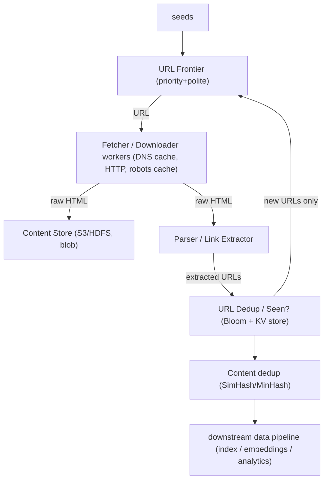
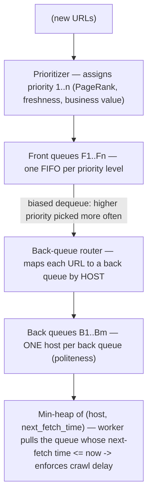
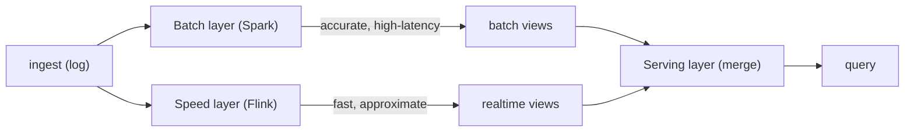

# Design a Web Crawler and Large-Scale Data Processing

A web crawler is the canonical "systems + data" interview problem: it forces you to
reason about an effectively infinite input (the web), politeness toward external
parties you do not control, deduplication at trillions-of-items scale, freshness
under a fixed budget, and a downstream batch/stream pipeline that turns raw HTML
into indexes, embeddings, or analytics. The interview is won by naming the
**trade-off** behind every choice — what you gain, what you give up, and the
scale/latency/consistency regime where each option wins. This document is
organized so every section ends in trade-offs.

Two problems are bundled here:
1. **The crawler** — a distributed producer that discovers and fetches pages.
2. **Large-scale data processing** — the batch/stream pipeline that consumes the
   crawl output (parse, dedup, index, embed, aggregate).

---

## Requirements and capacity estimation

**Intuition.** Before drawing boxes, size the problem. The web is ~50B+ indexable
pages; a "design a crawler like Googlebot" prompt usually scopes to **1 billion
pages/month** as a starting target. Everything (QPS, storage, bandwidth, number of
workers) falls out of that number.

**Functional requirements**
- Given seed URLs, fetch pages, extract links, and keep crawling (BFS/priority).
- Respect `robots.txt` and politeness (do not hammer a host).
- Deduplicate URLs and near-duplicate content.
- Store raw pages for downstream processing (index, ML, analytics).
- Recrawl pages to keep them fresh.

**Non-functional requirements**
- **Scalable** — horizontally add workers to raise throughput.
- **Polite** — bounded request rate per host/domain/IP.
- **Robust** — survive malformed HTML, traps, slow servers, worker crashes.
- **Extensible** — add new content types (PDF, images) without a rewrite.
- **Fresh** — bounded staleness for important pages.

**Back-of-envelope (target: 1B pages/month).**
```
Pages/month      = 1,000,000,000
Seconds/month    ≈ 2.6M  (30 * 24 * 3600 ≈ 2,592,000)
Write QPS (avg)  = 1e9 / 2.6e6 ≈ 385 pages/sec
Peak QPS (2x)    ≈ 770 pages/sec

Avg page size    ≈ 500 KB (HTML + inline)   [Googlebot avg ~ 100KB-2MB]
Raw ingest/day   = 385 * 500KB * 86400 ≈ 16.6 TB/day
Raw storage/mo   ≈ 1e9 * 500KB = 500 TB/month (before compression)
Compressed (~5x) ≈ 100 TB/month, ~1.2 PB/year

Links/page       ≈ 50-100  ->  ~50-100B URLs discovered/month
URL dedup set    = billions of URLs -> needs Bloom filter, not a hash set in RAM
Bloom filter     = 10B URLs * ~10 bits (1% FPR) ≈ 12.5 GB  (fits in RAM, sharded)
```
A single machine cannot do 770 QPS of *polite* crawling (politeness caps per-host
rate), so throughput comes from **breadth** — thousands of hosts crawled in
parallel by many workers. This is why the frontier and worker fleet dominate the
design.

**Trade-offs.** Scoping to 1B pages/month vs "the whole web" changes storage by
50x and forces you to decide between owning storage (HDFS/colo) vs object store
(S3/GCS). State the assumption out loud; interviewers grade the reasoning, not the
exact number.

---

## High-level crawler architecture

**Intuition.** A crawler is a loop: take a URL from the frontier → resolve DNS →
fetch → parse → extract links → dedup → add new links back to the frontier →
store the content. Scale it by making each stage an independent, horizontally
scalable service connected by queues.



Real reference designs: **Mercator** (Heydon & Najork, 1999 — the design most
interviews expect), Google's original crawler (Brin & Page, 1998), **Apache
Nutch**, **Heritrix** (Internet Archive), and **Common Crawl** (petabyte-scale
public crawl on S3).

**Why queues between stages.** Fetching is I/O-bound and slow (network RTT +
server latency, 100ms–seconds); parsing is CPU-bound; storage is throughput-bound.
Decoupling lets each scale independently and absorbs bursts.

**Trade-offs.**
- **Monolithic worker (fetch+parse+store in one process)** — simple, fewer moving
  parts, low latency per URL; but couples CPU and I/O scaling and one slow stage
  stalls all. Good for small crawls (<10M pages).
- **Pipelined microservices + queues** — independent scaling, resilience, but
  more operational surface, more end-to-end latency, harder debugging. Correct at
  billion-page scale.

---

## URL frontier design, politeness and priority

**Intuition.** The frontier is the heart of the crawler. It is not a plain FIFO
queue — it must simultaneously enforce **politeness** (never overload one host)
and **priority** (crawl important/fresh pages first). The classic answer is the
**Mercator two-stage frontier**: front queues for priority, back queues for
politeness.



- **Front queues** encode **priority** — more important URLs are dequeued more
  often.
- **Back queues** encode **politeness** — each back queue holds URLs for exactly
  one host, and a worker only takes the next URL for a host after the required
  delay (fixed, e.g., 1–10s, or **adaptive**: wait `10 × last_download_time`, the
  Mercator rule). A heap ordered by `next_fetch_time` picks the ready host.

**Politeness key.** Rate-limit by **host/domain and by IP**. Many hosts share one
IP (shared hosting, CDNs); rate-limiting only by hostname can still overload a
single server. Conversely one host may map to many IPs. Interview-strong answer:
"key politeness on both, err toward IP for shared infrastructure."

**Storage.** The frontier is billions of URLs — too big for RAM. Enqueued URLs
live on disk / in a distributed store (e.g., RocksDB, a sharded KV store, or a
partitioned Kafka topic); only the *heads* of active back queues are hot in RAM.

**Trade-offs.**

| Frontier design | Politeness | Priority | Complexity | When |
|---|---|---|---|---|
| Single FIFO queue | Poor (no per-host limit) | None | Trivial | Toy / single-site crawl |
| Per-host queues only | Good | None | Medium | Politeness matters, all pages equal |
| Mercator front+back | Good | Good | High | Billion-page general crawler |
| Priority queue keyed by score | None | Excellent | Medium | Focused crawl, politeness handled elsewhere |

Choosing **priority** means you can starve low-priority hosts (freshness risk on
the long tail); choosing strict **politeness** caps throughput per host so you
must scale by breadth (more hosts in flight). The Mercator split lets you tune
both independently, at the cost of a two-level queue you must shard and persist.

---

## Deduplication with Bloom filters and content fingerprinting

**Intuition.** Two dedup problems: **(1) URL dedup** — "have I already seen this
URL?" (avoid re-enqueueing) and **(2) content dedup** — "is this page a duplicate
or near-duplicate of one I already have?" (mirrors, print pages, session-id URLs).

**URL dedup.** At 50–100B URLs, an exact hash set costs terabytes of RAM. Use a
**Bloom filter**: probabilistic set with no false negatives, tunable false-positive
rate. ~10 bits/element ≈ 1% FPR; 10B URLs ≈ 12.5 GB, shardable across nodes.
- **Cost of a false positive:** you *skip* a URL you never actually crawled
  (a page silently missed) — usually acceptable at 1% for a general crawl.
- Normalize URLs first (lowercase host, strip default ports, remove fragments,
  sort/strip tracking query params, resolve `.`/`..`) so `A/` and `A` and
  `A?utm=x` collapse to one key.
- For exactness where it matters, back the Bloom filter with a sharded KV store
  (checked only on a Bloom "maybe present" hit).

**Content dedup / near-duplicate detection.**
- **Exact dedup:** hash the normalized content (MD5/SHA/xxHash). Catches byte-
  identical mirrors only.
- **Near-duplicate:** **SimHash** (Charikar; used by Google) or **MinHash + LSH**.
  SimHash produces a 64-bit fingerprint where similar documents have small Hamming
  distance; you compare within a few bits. Catches boilerplate-differing mirrors,
  print vs web versions, and session-id-varied pages.

**Trade-offs.**

| Approach | Memory | Accuracy | Catches near-dups | Notes |
|---|---|---|---|---|
| In-RAM hash set | Huge (TBs) | Exact, no FP | No | Infeasible at web scale |
| Bloom filter | ~12 GB / 10B | Small FP, no FN | No | Standard for URL-seen |
| Bloom + KV backing | Bloom RAM + disk | Exact | No | When missing a page is costly |
| SHA content hash | Small | Exact byte match | No | Only identical bytes |
| SimHash / MinHash-LSH | Moderate | Approximate | Yes | Standard for content dedup |

Bloom saves 100x memory but you accept occasionally skipping a page and you
**cannot delete** from a standard Bloom filter (use a counting/scalable Bloom or
periodic rebuild for recrawl churn). SimHash catches near-dups but has its own
tunable false-positive/negative trade-off in the Hamming threshold.

---

## Robots.txt and politeness enforcement

**Intuition.** `robots.txt` (Robots Exclusion Protocol, standardized as RFC 9309 in
2022) is the contract with site owners: which paths a named user-agent may fetch,
and an optional `Crawl-delay`. Ignoring it gets you IP-banned and is a legal/ethical
red flag in an interview.

**How it works.**
- Fetch `https://host/robots.txt` once per host, **cache it** (TTL hours–1 day)
  so you do not refetch per URL — otherwise robots fetches dominate traffic.
- Parse `Allow`/`Disallow` rules for your user-agent; honor `Crawl-delay` and
  `Sitemap:` directives (sitemaps are a free, polite seed source with `lastmod`
  hints for freshness).
- Politeness beyond robots: adaptive delay, exponential backoff on 429/503,
  respect `Retry-After`, cap concurrent connections per host.

**Failure modes.** robots.txt missing (default: allowed), 5xx (treat as
temporarily disallow or reuse last cached copy), enormous/malformed files (cap
parse size), redirects.

**Trade-offs.** Aggressive crawling raises throughput and freshness but risks
bans, wasted bandwidth on angry servers, and reputational/legal harm. Conservative
politeness protects relationships and long-term access at the cost of lower
per-host throughput — again pushing you to scale by breadth. Caching robots.txt
trades a small staleness window (you might briefly honor an outdated rule) for a
massive reduction in redundant fetches.

---

## Freshness and recrawl policies

**Intuition.** The web changes constantly; a crawled copy decays. You have a fixed
crawl budget, so you must decide *which* pages to recrawl and *how often*.
Definitions (Cho & Garcia-Molina): **freshness** = is my copy current (binary);
**age** = how long since it went stale.

**Policies.**
- **Uniform:** recrawl every page at the same frequency. Simple.
- **Proportional:** recrawl frequently changing pages more often. Intuitive but
  Cho & Garcia-Molina showed it can be *worse* for average freshness — you burn
  budget on hyperactive pages (news tickers) whose freshness expires instantly.
- **Optimal / adaptive:** estimate each page's change rate (Poisson model, EWMA of
  observed changes) and recrawl to maximize expected freshness, **penalizing**
  pages that change too fast to ever keep fresh.
- **Signal-driven:** sitemaps `lastmod`, HTTP `Last-Modified`/`ETag` +
  conditional GET (`If-Modified-Since`) to cheaply detect "not changed" (304),
  RSS/feeds, and importance (PageRank, traffic).

**Modern angle.** Change-detection can be event-driven: sitemaps ping, PubSubHubbub/
WebSub, or CDC-style feeds where the site pushes updates. For freshness-critical
verticals (news, prices) you shift from periodic recrawl to near-real-time
streaming ingestion.

**Trade-offs.**

| Policy | Freshness | Budget efficiency | Complexity |
|---|---|---|---|
| Uniform | Decent average | Wastes budget on static pages | Low |
| Proportional | Often worse avg | Over-spends on churny pages | Low |
| Adaptive (Poisson/EWMA) | Best average | Efficient | High (per-URL stats) |
| Conditional GET (ETag) | Same, cheaper | Saves bandwidth | Low-medium |

Adaptive recrawl gives the best freshness-per-fetch but requires storing and
updating per-URL change statistics for billions of URLs (state cost). Conditional
GET saves bandwidth (304s are tiny) but still costs an RTT and per-host politeness
budget.

---

## Crawler traps and robustness

**Intuition.** The web is adversarial and buggy. A **crawler trap** is anything
that generates effectively infinite URLs or content, drowning your frontier.

**Common traps and defenses.**
- **Infinite URL spaces** — calendars (`?date=...` forever), faceted-search filter
  combinations, session IDs in URLs. Defense: cap URL depth, cap URLs-per-host,
  detect parameter explosions, normalize/strip session params.
- **Spider traps / dynamically generated deep links** — pages linking to
  themselves with tweaked params. Defense: content dedup (SimHash) + max depth.
- **Large / slow / malicious responses** — gigabyte pages, zip bombs, slowloris.
  Defense: response size cap, read timeout, connection timeout.
- **Redirect loops** — cap redirect chain length; detect cycles.
- **Soft 404s** — 200 status on an error page. Defense: content heuristics.
- **Politeness abuse / DoS accusation** — see robots section.

**Robustness patterns.** Timeouts everywhere, retries with exponential backoff +
jitter and a max attempt count, dead-letter queue for poison URLs, per-host
circuit breakers, and idempotent workers so a crashed fetch can be retried safely.

**Trade-offs.** Hard caps (max depth, max URLs/host) are cheap and bound the blast
radius but can miss legitimate deep content (a large but real e-commerce catalog).
Smarter, learned trap detection avoids missing real pages but adds complexity and
false-negative risk. Interview answer: start with hard limits, layer heuristics for
high-value hosts.

---

## Distributed crawler workers and coordination

**Intuition.** Throughput comes from many workers across many machines. The
central coordination question: **how do you assign URLs to workers so that (a) two
workers never crawl the same URL and (b) all URLs of one host go to the same worker
(so politeness state is local)?**

**Partitioning.** Partition the URL space by **host** using **consistent hashing**:
`worker = consistent_hash(host) % ring`. This keeps all of a host's URLs (robots
cache, crawl-delay timer, back queue) on one worker → politeness is enforced
locally with no cross-node coordination, and adding/removing workers only remaps a
fraction of hosts.

```
   URLs --> partition by host (consistent hashing) --> Worker[i] owns host set Hi
   Worker[i]: local frontier back-queues + robots cache + DNS cache for Hi
```

**Coordination pieces.**
- **DNS** — DNS lookups are slow (tens of ms) and can be a bottleneck; run a
  **caching DNS resolver** and cache results with TTL. Prefetch DNS for queued
  hosts.
- **Shared seen-set** — the Bloom filter / URL-seen store is sharded (also by URL
  hash) so any worker can check dedup.
- **Failure handling** — a worker dies → its host partition is reassigned
  (consistent hashing minimizes churn); in-flight URLs are re-queued (at-least-once,
  so workers must be idempotent). Use ZooKeeper/etcd or a managed coordinator for
  membership and leader election.

**Trade-offs.**

| Partition scheme | Politeness locality | Rebalance cost | Hotspots |
|---|---|---|---|
| Hash by full URL | Poor (host split across workers → need shared rate limiter) | Low | Even |
| Hash by host (mod N) | Good | High (N change remaps all) | Possible (mega-hosts) |
| Consistent hashing by host | Good | Low (only ~1/N remaps) | Mega-host on one node |
| Host + virtual nodes | Good | Low | Smoothed |

Hashing by host localizes politeness but creates **hotspots**: a giant host
(youtube.com) with millions of URLs lands on one worker. Mitigate with virtual
nodes and by capping URLs/host. Hashing by URL balances load but forces a
*distributed* rate limiter across workers for politeness — more coordination,
more latency. Consistent hashing (vs plain mod-N) is chosen to make scaling the
fleet cheap.

---

## Content storage and the processing handoff

**Intuition.** Raw fetched pages are large and write-heavy; they feed many
downstream consumers (indexer, ML/embeddings, analytics). Store raw bytes in a
cheap, durable **blob/object store** and put structured metadata in a separate DB.

**Layout.**
- **Raw content** → object store (S3/GCS) or HDFS, compressed (gzip/zstd),
  often in **WARC** files (Web ARChive format; what Common Crawl publishes) that
  pack many pages per file to avoid small-object overhead.
- **Metadata** (URL, fetch time, status, content hash, SimHash, links) → a
  scalable KV/columnar store (Bigtable/HBase/Cassandra/DynamoDB) for lookups and
  recrawl scheduling.
- **Link graph** → adjacency lists, often in the same columnar store, feeding
  PageRank batch jobs.

**Handoff to processing.** The crawler is the *producer*; it emits events ("page X
fetched") to a log (Kafka/Kinesis/PubSub). Downstream consumers (index builder,
embedding generator for a vector DB, analytics) read the log independently —
classic **fan-out / event-driven** decoupling.

**Trade-offs.** Object store = cheapest, infinitely scalable, high durability, but
higher per-object latency and no fine-grained updates (write new object, don't
mutate). A DB gives fast point lookups and updates but costs more per TB. WARC
packing amortizes small-file overhead (S3 hates billions of tiny objects) at the
cost of read amplification (must read a big file to get one page) — great for batch
reprocessing, poor for random single-page reads.

---

## Batch processing with MapReduce and Spark

**Intuition.** Once you have petabytes of raw pages, you process them with a
distributed compute framework. **MapReduce** (Google, 2004; Hadoop) and **Apache
Spark** are the two archetypes.

- **MapReduce:** `map` (per-record transform, e.g., extract links) → shuffle
  (group by key) → `reduce` (aggregate, e.g., count inlinks). Each stage writes to
  disk (HDFS) between phases — fault-tolerant, but slow due to disk I/O.
- **Spark:** DAG of transformations on **RDDs/DataFrames** kept **in memory**
  across stages; recomputes lost partitions from lineage on failure. 10–100x faster
  than MapReduce for iterative jobs (PageRank, ML) because it avoids per-stage disk
  writes.

**Typical crawler-pipeline batch jobs.** Build inverted index, compute PageRank
(iterative → Spark shines), near-duplicate clustering (MinHash-LSH), language
detection, generating embeddings for a vector store (RAG corpora are built exactly
this way today).

**Trade-offs.**

| Framework | Latency | Fault model | Best for | Cost |
|---|---|---|---|---|
| MapReduce/Hadoop | High (disk each stage) | Re-run failed task from disk | Huge one-pass ETL, cheap spinning disk | Low compute, high I/O |
| Spark | Lower (in-memory) | Lineage recompute | Iterative (PageRank, ML), interactive | Needs RAM; pricier |
| Flink (streaming) | Very low | Checkpoint/savepoint | Continuous / unbounded | Always-on cluster |

Spark trades memory (cost, and OOM risk on skewed data) for speed; MapReduce
trades speed for rock-solid, cheap, disk-based fault tolerance on truly massive
single-pass jobs. **Data skew** (one reducer gets youtube.com's billion links)
hurts both — mitigate with salting, combiners, or skew-join handling.

---

## Lambda architecture versus Kappa architecture

**Intuition.** You often need both a fast, approximate answer *now* and an accurate,
complete answer *eventually* (e.g., "pages crawled in the last minute" vs "total
link graph"). Two patterns reconcile this.

**Lambda architecture** — run **two** pipelines:

Batch layer recomputes from the immutable master dataset (perfect accuracy); speed
layer covers only the recent window the batch hasn't caught up on. Serving layer
merges both.

**Kappa architecture** (Jay Kreps) — **one** streaming pipeline. Treat everything as
a log; "batch" is just reprocessing by **replaying** the log through the same
stream code. No dual codebase.
```
   immutable log (Kafka, long retention) --> stream processor (Flink) --> views
   reprocess = replay the log from offset 0 through a NEW job version
```

**Trade-offs.**

| | Lambda | Kappa |
|---|---|---|
| Codebases | Two (batch + stream) kept in sync | One |
| Accuracy | Batch = ground truth | Depends on replay + retention |
| Latency | Low (speed layer) + eventual (batch) | Low |
| Reprocessing | Re-run batch job | Replay log |
| Complexity | High (dual logic, merge, dedup between layers) | Lower operationally |
| When | Heavy historical recompute differs from realtime logic; regulated accuracy | Stream-native, unified logic, log fits/retains |

The classic Lambda criticism: **two codebases computing the same thing must stay
in sync** — a maintenance nightmare and a bug source. Kappa removes that but assumes
your stream engine can handle large reprocessing windows and that you retain enough
log history (retention cost). Modern engines (Flink, Spark Structured Streaming,
Beam) increasingly **unify** batch and stream in one API, blurring the line — many
teams now do "Kappa-ish with a batch escape hatch."

---

## Data lake, data warehouse, and lakehouse

**Intuition.** Where does processed (and raw) data land for analysts and ML?

- **Data lake** — raw/semi-structured files in cheap object storage (S3/GCS/ADLS),
  **schema-on-read**. Stores everything (HTML, JSON, Parquet) cheaply; you impose
  schema when you query. Risk: turns into a **data swamp** without governance.
- **Data warehouse** — structured, **schema-on-write**, optimized columnar store for
  BI/SQL (Snowflake, BigQuery, Redshift). Fast analytics, strong governance;
  expensive, rigid, ingest requires transform-first.
- **Lakehouse** — lake storage + warehouse features (ACID transactions, schema
  enforcement, time travel) via table formats **Delta Lake, Apache Iceberg, Apache
  Hudi**. The 2024–2025 default: one copy of data in object storage, queried by
  many engines.

**Trade-offs.**

| | Lake | Warehouse | Lakehouse |
|---|---|---|---|
| Schema | On read | On write | On read + enforced |
| Cost/TB | Lowest | Highest | Low |
| Query speed | Slow (raw) | Fast | Fast (with Parquet+stats) |
| Flexibility | Any data | Structured only | Any + tables |
| ACID / updates | No | Yes | Yes (Iceberg/Delta/Hudi) |
| Governance | Weak | Strong | Strong |

Lake gives cheap "store now, decide later" but pushes cost/complexity to query
time and risks ungoverned swamps. Warehouse gives speed and governance but you pay
to transform and store rigidly, and vendor lock-in is real. Lakehouse aims to get
both but is younger and adds table-format operational overhead (compaction, small-
file cleanup).

---

## ETL versus ELT

**Intuition.** Same three steps — Extract, Transform, Load — different **order**.
- **ETL:** transform *before* loading into the target (warehouse). Classic; you
  only load clean, modeled data. Needs a separate transform tier; rigid.
- **ELT:** load raw into a cheap, powerful target (cloud warehouse / lake) *first*,
  transform *inside* it with SQL (dbt is the modern standard). Flexible; keeps raw
  for re-transform; leverages elastic warehouse compute.

**Trade-offs.**

| | ETL | ELT |
|---|---|---|
| Transform location | Separate engine before load | Inside warehouse/lake after load |
| Raw data retained | Usually no | Yes (re-transform anytime) |
| Storage cost | Lower (only clean data) | Higher (raw + transformed) |
| Compute | Dedicated ETL tier | Warehouse elastic compute |
| Schema change agility | Rebuild pipeline | Re-run SQL on retained raw |
| PII / compliance | Filter before load (safer) | Raw PII lands in warehouse (risk) |
| When | Fixed schemas, on-prem, must scrub before storing | Cloud, schema evolves, want raw kept |

ELT is the modern default (cheap cloud storage + elastic warehouse compute) but you
store more (including possibly sensitive raw data — a compliance trade-off) and you
push transform load onto the query engine. ETL protects the target and filters PII
early but couples you to a rigid pipeline and discards raw you might later need.

---

## Deduplication and idempotency at scale

**Intuition.** At-least-once delivery (the default of most queues/logs and of retry
logic) means every record can appear more than once. Correctness at scale requires
making processing **idempotent** — reprocessing the same input produces the same
result, no double-counting.

**Techniques.**
- **Idempotency keys / dedup keys** — attach a stable unique id (e.g., content hash,
  `url+fetch_epoch`) and skip if already processed. Store seen-ids in a KV store or
  Bloom filter with TTL.
- **Upserts / idempotent writes** — write keyed by id so a replay overwrites rather
  than appends (`INSERT ... ON CONFLICT`, `PUT` to object store).
- **Exactly-once *processing*** — Kafka transactions + idempotent producer, Flink
  checkpoints with two-phase commit sinks. Note: exactly-once *delivery* is
  effectively impossible over a network; what these give is exactly-once *effect*
  via dedup + atomic commit.
- **Dedup windows** — for streaming, dedup within a bounded time/window (state can't
  grow forever); accept that a duplicate arriving after the window may slip through.

**Trade-offs.**

| Approach | Guarantee | State cost | Notes |
|---|---|---|---|
| At-least-once + idempotent sink | Exactly-once *effect* | Low-moderate | Simplest robust pattern |
| Exactly-once framework (Flink/Kafka txn) | Exactly-once effect | Higher (checkpoints, txn coordination) | ~throughput/latency cost |
| Dedup by key in KV/Bloom | Depends on retention | Grows with keyspace | Bloom = tiny FP risk |
| Windowed dedup | Within window only | Bounded | Late dup escapes |

Exactly-once frameworks cost throughput and add latency (transaction coordination,
checkpoint barriers); at-least-once + idempotent writes is cheaper and usually the
pragmatic pick. Unbounded dedup state is impossible — you must bound it (TTL/window)
and accept a small chance of a late duplicate, or pay to keep more state.

---

## Back-pressure and checkpointing

**Intuition.** In any producer→consumer pipeline the producer can outrun the
consumer. **Back-pressure** is the signal that propagates "slow down" upstream so
buffers don't overflow. **Checkpointing** periodically snapshots progress so a crash
resumes without redoing everything.

**Back-pressure mechanisms.**
- **Bounded buffers / blocking** — a full downstream queue blocks upstream (Reactive
  Streams, Flink's credit-based flow control, TCP itself).
- **Pull-based consumption** — consumer requests work at its own rate (Kafka
  consumers pull; the crawler frontier is pulled by workers). Naturally
  back-pressured: the log just grows and the producer isn't blocked.
- **Load shedding / rate limiting** — when you *can't* slow the producer (external
  crawl targets), drop or defer low-priority work.

**Checkpointing.**
- **Stream:** Flink's **distributed snapshots (Chandy-Lamport)** inject barriers into
  the stream; on failure, restore state + rewind source offsets → exactly-once.
- **Batch:** Spark checkpoints RDD lineage / writes stage output so long jobs don't
  recompute from scratch.
- **Crawler:** the frontier itself is durable progress — a crashed worker's URLs are
  re-queued; committed offsets mark "processed up to here."

**Trade-offs.**
- **Frequent checkpoints** → fast recovery, low reprocessing on failure, but
  higher steady-state overhead (I/O, pauses) and lower throughput.
- **Infrequent checkpoints** → high throughput, but a crash reprocesses a large
  window (and, with external side effects, more duplicates to dedup).
- **Push (block upstream)** vs **pull (log grows)**: blocking gives immediate
  back-pressure but couples producer to consumer availability; a growing log
  decouples them but silently accumulates lag you must alarm on (a full disk is
  the failure mode). Kafka/log-based pipelines choose the latter for the crawler
  because you *cannot* block the external web — you buffer and shed instead.

---

## Batch versus stream for the same problem

**Intuition.** Many crawler-pipeline problems (link counts, dedup, freshness
metrics, index building) can be solved by *either* a nightly batch job *or* a
continuous stream job. Choosing is the central data-engineering trade-off.

**Batch** — bounded input, run periodically, high throughput per dollar, simple
mental model (input is fixed, reruns are deterministic), easy backfill. Latency =
the batch interval (minutes to hours).

**Stream** — unbounded input, process per-event, low latency (sub-second to
seconds), but harder: state management, windowing, out-of-order/late events
(watermarks), exactly-once effort, always-on cluster cost.

**Decision guide.**

| Constraint | Prefer |
|---|---|
| Result needed in seconds (fraud, live freshness, alerting) | Stream |
| Hourly/daily is fine (index rebuild, reports, PageRank) | Batch |
| Huge historical recompute / backfill | Batch (or Kappa replay) |
| Simple ops, cost-sensitive, spiky | Batch |
| Continuous, steady, low-latency SLAs | Stream |
| Both needed | Lambda, or unified engine (Beam/Flink/Spark Structured Streaming) |

**Trade-off summary.** Stream buys latency at the cost of complexity (state,
watermarks, exactly-once) and always-on cost. Batch buys simplicity and
cost-efficiency at the cost of latency. The modern move is a **unified engine**
(same code runs batch or stream) or **Kappa** (stream-only with replay) to avoid
maintaining two implementations — but batch still wins for enormous, latency-
insensitive reprocessing where paying for an always-on streaming cluster is waste.

---

## Trade-offs and when to use what

A consolidated decision cheat-sheet across the whole design:

- **Frontier:** Mercator front+back queues when you need *both* priority and
  politeness at scale; a simple priority queue for focused crawls; a plain FIFO only
  for toy/single-site.
- **URL dedup:** Bloom filter (accept ~1% skipped pages) at web scale; exact hash
  set only for small crawls; Bloom+KV when missing a page is expensive.
- **Content dedup:** SHA for exact mirrors, SimHash/MinHash-LSH for near-dups
  (mirrors, session-id/print variants).
- **Recrawl:** adaptive Poisson/EWMA for best freshness-per-fetch; conditional GET
  (ETag) to save bandwidth; uniform if you can't afford per-URL stats. Avoid naive
  proportional.
- **Partitioning:** consistent hashing by host (politeness local, cheap rebalance);
  add virtual nodes to smooth mega-host hotspots.
- **Storage:** object store + WARC packing for raw (cheap, batch-friendly); KV/columnar
  for metadata and link graph (fast lookups, recrawl scheduling).
- **Compute:** Spark for iterative/ML (PageRank, embeddings); MapReduce for cheap
  single-pass mega-ETL; Flink for continuous low-latency.
- **Architecture:** Kappa/unified engine by default; Lambda when batch ground-truth
  logic genuinely differs from realtime and accuracy is regulated.
- **Storage tier:** Lakehouse (Iceberg/Delta) as the modern default over pure lake
  (swamp risk) or pure warehouse (cost/lock-in).
- **ETL vs ELT:** ELT in the cloud (keep raw, transform with SQL) unless PII/compliance
  forces you to scrub before storing (ETL).
- **Idempotency:** at-least-once + idempotent/upsert sinks as the pragmatic default;
  exactly-once frameworks only when double-effects are truly unacceptable and you can
  pay the throughput cost.
- **Back-pressure:** pull/log-based buffering for the crawler (you can't block the
  web); tune checkpoint frequency to balance recovery time vs throughput.

The meta-point for interviews: there is no universally "best" choice — anchor every
decision to the stated **scale, latency budget, consistency need, and cost**, and
say what you would give up.

---

## Common interview follow-up questions

1. **"How do you keep two workers from crawling the same URL?"** → sharded seen-set
   (Bloom + KV) checked before enqueue, plus host-based partitioning so a host lives
   on one worker; at-least-once means workers must be idempotent.
2. **"A single host has 100M URLs and one worker owns it — what happens?"** → hotspot;
   mitigate with virtual nodes, cap URLs/host, or split that host across sub-partitions
   with a shared per-host rate limiter.
3. **"How do you crawl politely without a central rate limiter?"** → partition by host
   so politeness state (crawl-delay timer, robots cache) is worker-local; Mercator
   back queue + next-fetch-time heap.
4. **"Bloom filter false positive — what do you lose?"** → you skip a URL you never
   crawled (silently miss a page); tune FPR, back with exact KV if costly.
5. **"How do you detect that a page changed without downloading it?"** → conditional
   GET with ETag/If-Modified-Since → 304; sitemaps `lastmod`; WebSub push.
6. **"Lambda vs Kappa for building the search index — which and why?"** → depends on
   whether realtime and batch index logic differ and on log retention; Kappa/unified
   if logic is shared, Lambda if batch ground-truth differs.
7. **"Your pipeline double-counts links on retries — fix it."** → idempotency keys +
   upserts, or exactly-once (Flink checkpoints / Kafka transactions); bound dedup state.
8. **"Consumer can't keep up — what happens and what do you do?"** → lag grows (log)
   or upstream blocks (bounded buffer); back-pressure, scale consumers, or load-shed
   low-priority URLs.
9. **"Where do you store 1 PB of raw HTML and why?"** → object store + WARC packing;
   metadata/link graph in columnar KV; cost, durability, batch-reprocessing friendliness.
10. **"How would you add GenAI/RAG on top of this crawl?"** → batch/stream job generates
    embeddings from parsed text, writes to a vector DB (pgvector, Pinecone, OpenSearch
    kNN); recrawl + re-embed on change; dedup so near-dup pages don't pollute retrieval.
11. **"Estimate storage and worker count for 1B pages/month."** → ~385 avg / 770 peak
    write QPS, ~16.6 TB/day raw, ~100TB/mo compressed; workers sized by polite per-host
    rate × hosts in flight, not raw QPS.
12. **"Batch vs stream for computing crawl-freshness metrics?"** → stream if you need
    live dashboards/alerts; batch if daily is fine and you want cheap, simple, exact.

---

## References

- Alex Xu, *System Design Interview, Vol. 1* — Chapter 9, "Design a Web Crawler"
  (Mercator frontier, front/back queues, politeness, dedup). ByteByteGo.
- ByteByteGo blog and YouTube channel — "Design a Web Crawler," "Lambda vs Kappa
  Architecture," data-pipeline explainers.
- Heydon & Najork, "Mercator: A Scalable, Extensible Web Crawler" (1999) — adaptive
  politeness (`10t` rule), frontier design.
- Brin & Page, "The Anatomy of a Large-Scale Hypertextual Web Search Engine" (1998).
- Cho & Garcia-Molina, "Effective Page Refresh Policies for Web Crawlers" — freshness
  vs age, uniform vs proportional vs optimal recrawl.
- Charikar, "Similarity Estimation Techniques from Rounding Algorithms" (SimHash);
  Broder, MinHash / near-duplicate detection.
- Bloom, "Space/Time Trade-offs in Hash Coding with Allowable Errors" (1970).
- RFC 9309 — Robots Exclusion Protocol (2022).
- Dean & Ghemawat, "MapReduce: Simplified Data Processing on Large Clusters" (2004);
  Zaharia et al., "Resilient Distributed Datasets" (Spark, 2012).
- Martin Kleppmann, *Designing Data-Intensive Applications* — batch vs stream,
  exactly-once, log-based systems, back-pressure.
- Jay Kreps, "Questioning the Lambda Architecture" (O'Reilly Radar, 2014) — Kappa.
- Nathan Marz, *Big Data* — Lambda architecture.
- Apache Nutch, Heritrix, and Common Crawl (WARC format, S3 petabyte crawl) docs.
- Apache Iceberg / Delta Lake / Apache Hudi docs — lakehouse table formats.
- Wikipedia: "Web crawler," "Lambda architecture" (design summaries, policy history).
- System Design Primer (GitHub, donnemartin) — web crawler and pipeline sections.
- YouTube: Gaurav Sen "Design a Web Crawler / Search"; Hussein Nasser (back-pressure,
  Kafka); "Jordan has no life" (Lambda/Kappa, streaming systems).
