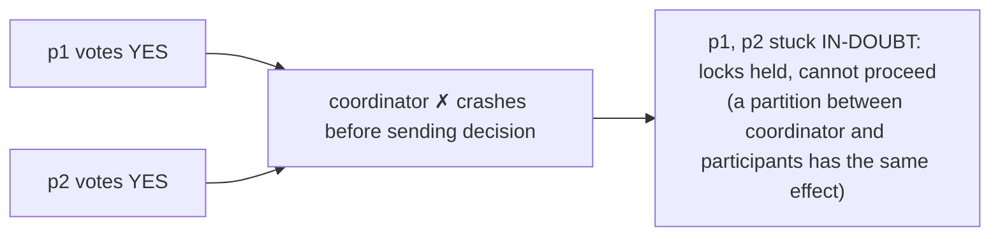
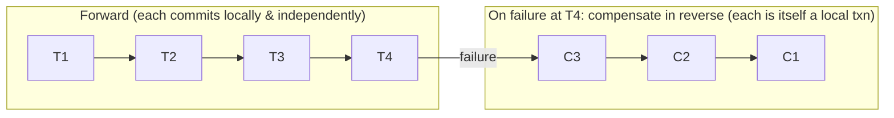

# Distributed Transactions Beyond Saga: 2PC, 3PC and Deterministic Approaches

A distributed transaction guarantees **atomicity across independent failure domains** —
either all participants apply their changes or none do — even though each participant can
crash, and the network between them can drop, delay, duplicate, or reorder messages. This
is fundamentally harder than a single-node transaction, where a WAL fsync gives you
atomicity for free. This note goes deep on the classic blocking protocols (2PC, 3PC), the
saga alternative and its isolation cost, and the modern designs that route *around* the
problem (Percolator's snapshot isolation, Calvin's determinism, Spanner's 2PC-over-Paxos).
The recurring theme: **atomic commit and consensus are the same class of problem**, and
naïve coordination trades availability for atomicity in ways that bite you at scale.

---

## Why Distributed Transactions Are Hard

A local transaction relies on one thing: a single log that you can fsync, giving an
all-or-nothing commit point. Across N nodes there is no shared log and no shared clock, so
you must *manufacture* a single agreed commit point over an asynchronous, unreliable
network. Three properties combine to make this brutal:

- **Partial failure.** In a single process, a crash takes everything down together. In a
  distributed system, node A commits and node B crashes *after* it promised to commit but
  *before* it did — now you have a torn write and no oracle to tell you the intended
  outcome. You cannot distinguish "slow" from "dead" (the halting/timeout problem): a
  participant that is silent might be crashed, GC-paused for 8 seconds, or partitioned.
- **The two-generals impossibility.** No fixed number of messages over a lossy channel can
  give two parties *common knowledge* of a decision. Real protocols sidestep this by
  assuming eventual message delivery (retries) plus stable storage, but the intuition —
  "you can never be *sure* the other side got your last message" — is why atomic commit
  needs a durable, recoverable decision, not just an ack.
- **FLP impossibility.** In a purely asynchronous model with even one crash-faulty node,
  no deterministic protocol can guarantee *both* safety and liveness for consensus. Atomic
  commit is a consensus variant (everyone must agree on commit/abort). Practical systems
  keep safety always and get liveness by adding timeouts / failure detectors / a stable
  leader (Paxos, Raft) — i.e. they assume partial synchrony.

**Key reframing (Gray and Lamport, "Consensus on Transaction Commit"):** atomic commit *is*
consensus, but with a twist — a *single* "no" vote must force global abort, whereas generic
consensus just needs *a* value chosen. 2PC is a consensus protocol whose fatal flaw is that
its "coordinator" is a single acceptor with no redundancy; Paxos Commit fixes this by
running one consensus instance *per participant vote*.

**What you actually gain vs give up by attempting a distributed transaction:** you gain a
clean atomic/consistent abstraction for the application (no partial-update reconciliation
code). You give up availability during coordinator/participant failures (blocking),
latency (extra round trips + fsyncs), and throughput (locks held across the network for the
full 2PC window). At scale, that last point — **cross-node locks held for milliseconds of
network + disk latency** — is usually what kills 2PC, not correctness.

---

## Two-Phase Commit (2PC): Protocol and Coordinator

2PC is the canonical atomic commit protocol. One node acts as **coordinator** (transaction
manager); the others are **participants** (resource managers). The transaction ID is
written durably so recovery can find in-flight transactions.

```
Phase 1 — PREPARE (voting):
  Coordinator ── prepare ──▶ each participant
  Participant: do all work, acquire locks, write a PREPARE record to its WAL (fsync),
               then reply YES (vote-commit) or NO (vote-abort).
  After voting YES a participant is "prepared": it has PROMISED it can commit and
  MUST be able to, even across a crash. It may not unilaterally abort.

Phase 2 — COMMIT/ABORT (decision):
  If ALL voted YES:  coordinator writes COMMIT to its own log (this is the commit point),
                     then sends commit to all; participants commit, release locks, ack.
  If ANY voted NO:   coordinator writes ABORT, sends abort to all; participants roll back.
```

Two irrevocable promises make it work: (1) after voting YES a participant **cannot** change
its mind, and (2) once the coordinator writes its decision, the decision is final. The
**commit point** is the coordinator's durable log write in phase 2 — a single point that
serializes the global outcome.

**Cost accounting (why it is expensive):**

| Item | Cost |
|---|---|
| Round trips | 2 (prepare, commit) — often described as 2 network RTTs |
| Durable fsyncs | 2 per participant (prepare, commit) + 2 at coordinator (decision, done) |
| Lock hold time | From work start through phase-2 commit = **network RTT + fsync latency**, across all participants |
| Latency floor | ~ max participant latency + 2× coordinator RTT; a straggler sets the pace ("tail at scale") |

The lock-hold window is the throughput killer. If a hot row is touched by a 2PC that holds
its lock for, say, 10 ms (two RTTs + fsyncs), then that row's max transaction rate is ~100/s
regardless of how many machines you own. Contention, not CPU, becomes the ceiling.

**Where 2PC legitimately lives:** XA transactions across a DB + message broker; a single
database's internal 2PC across its own shards/partitions (Spanner, CockroachDB, YugabyteDB,
MySQL group commit across storage). It is defensible *inside* one storage system where the
coordinator is made highly available. It is a poor fit *across microservice/service
boundaries* where each service owns its own DB and you cannot tolerate cross-service
blocking or shared lock lifetimes.

---

## The Blocking Problem and Coordinator Failure

2PC's defining weakness: it is a **blocking protocol**. Once a participant has voted YES and
is "prepared," it is in an **in-doubt** state — it has locks held and cannot decide on its
own. If the coordinator crashes *after* participants voted YES but *before* delivering the
decision, prepared participants must **wait** (holding locks) until the coordinator recovers
and reads its log. They cannot time out and abort (the coordinator might have already told
someone else to commit), and cannot time out and commit (it might have decided abort).



Consequences and the reason 2PC is avoided at scale:

- **Availability loss.** Blocked participants hold locks; unrelated transactions touching
  those rows also stall. A single coordinator outage can cascade into a wide latency/
  availability event. This couples the availability of every participant to the
  availability of the coordinator and every *other* participant.
- **Coordinator is a single point of failure.** Classic 2PC recovers by requiring the
  coordinator to come back and finish. If its log is lost, in-doubt transactions may need
  manual (DBA / operator) resolution ("heuristic" commit/abort in XA — which can *violate
  atomicity* if the operator guesses wrong).
- **Fault model.** 2PC is safe under crash-recovery + reliable-eventually links. It is
  *not* non-blocking: no crash-fault-tolerant guarantee that live nodes make progress while
  the coordinator is down.

**Mitigations used in practice:**
- **Make the coordinator a replicated state machine** (Paxos/Raft group) so its decision log
  survives any single failure and a new leader can resolve in-doubt transactions —
  Spanner/CockroachDB do exactly this. This removes the SPOF but not the participant-side
  blocking window entirely.
- **Presumed-abort / presumed-commit** optimizations reduce logging and messages for the
  common case (no explicit "done" for aborts).
- **Cooperative termination protocol:** in-doubt participants ask *each other* the decision;
  helps only if *someone* knows it — if all peers are also in-doubt, everyone still blocks.
  This is precisely the gap 3PC tries (and fails) to close.

---

## Three-Phase Commit (3PC) and Its Partition Failure

3PC was designed to be **non-blocking** by inserting a phase so that no single failure leaves
survivors unable to decide. It splits phase 2 into **pre-commit** and **commit**:

```
Phase 1 CanCommit?   coordinator asks; participants reply Yes/No (no locks committed yet).
Phase 2 PreCommit    if all Yes, coordinator sends preCommit; participants ACK and enter a
                     "prepared-to-commit" state. Now everyone KNOWS the vote was unanimous.
Phase 3 doCommit     coordinator sends commit; participants commit.
```

The trick: a participant that has received *preCommit* knows everyone voted yes, so on
coordinator failure survivors can safely **time out and commit**. A participant still in
phase 1 (only *CanCommit* Yes, no preCommit) can safely **time out and abort**. This makes
3PC non-blocking **in a fully synchronous, fail-stop model with no network partitions.**

**Why 3PC still fails — and why nobody uses it:**

- **Network partitions break it (loss of safety).** Suppose a partition splits nodes into
  two groups: some received *preCommit*, some did not. The "received preCommit" side times
  out and **commits**; the "did not" side times out and **aborts**. Result: a split-brain
  atomicity violation — the transaction is both committed and aborted. 3PC assumes you can
  distinguish crashes from partitions with reliable timeouts; the async network cannot.
  This is a direct consequence of FLP/CAP: you cannot get non-blocking atomic commit *and*
  partition tolerance from timeout-based termination.
- **Extra round trip and fsync** make it strictly slower than 2PC (3 phases, more messages,
  more stable-storage writes) for a benefit that evaporates under real network conditions.
- **The modern answer supersedes it:** if you want a non-blocking, partition-safe commit,
  use **consensus (Paxos/Raft) to replicate the commit decision**, not 3PC. Consensus keeps
  *safety* always and gives liveness with a quorum — it never split-brains. That is why
  Spanner/CockroachDB run 2PC where each participant *and* the coordinator is a Paxos group,
  rather than adopting 3PC.

**Takeaway for interviews:** 3PC's non-blocking claim holds only under an unrealistic
synchronous, partition-free model. Under partitions it can violate atomicity. It is a
historically important idea, not a production choice.

---

## The Saga Pattern: Orchestration, Choreography, Compensation

A **saga** abandons atomic commit entirely. Instead of one distributed transaction, you run
a **sequence of local transactions** T1..Tn, each in its own service/DB, and provide a
**compensating transaction** C1..Cn-1 that semantically undoes a step if a later step fails.
The saga guarantees that either all Ti complete, or the completed ones are compensated —
i.e. it trades ACID atomicity for **eventual, application-level** atomicity.



**Two coordination styles:**

| Dimension | Orchestration | Choreography |
|---|---|---|
| Control flow | Central orchestrator invokes each step, tracks state | Each service reacts to events, emits next event |
| Coupling | Orchestrator knows all steps (logic centralized) | Logic spread across services (no central brain) |
| Visibility / debugging | Easy: one place has the saga state machine | Hard: flow is emergent; needs distributed tracing |
| Risk | Orchestrator can become a bloated "god" service | Cyclic event dependencies, hard-to-see loops |
| Best for | Complex flows, many steps, need for control/observability | Simple flows, few services, loose coupling |

The orchestrator (or the event chain) must itself be **durable and reliable** — typically a
persistent state machine (e.g. Temporal/Cadence, AWS Step Functions, Netflix Conductor, or a
DB-backed saga table) so a crash mid-saga resumes rather than losing the flow.

**Compensation is semantic, not physical.** You cannot "roll back" a committed local
transaction; you issue a new transaction that counteracts it (refund a charge, re-increment
inventory, send a cancellation). Consequences:

- **Compensations must be idempotent and (ideally) commutative/retryable**, because
  failures and retries mean a compensation may run more than once or arrive out of order.
- **Some actions are not compensable** (an email was sent, a missile was launched). Order
  the saga so **non-compensable / irreversible steps go last** (pivot transaction);
  everything before the pivot is retriable-or-compensable, everything after is
  retriable-only. This "compensatable → pivot → retriable" ordering is the standard design.
- **Compensations can fail too**, so they must be retried until success (with idempotency);
  a saga that gets stuck needs alerting and possibly human intervention.

**Saga vs 2PC trade-off:** saga gives you availability and no cross-service locks (each step
commits immediately, releasing its locks) — great for long-running, cross-service business
flows. It gives up **isolation** (see next section) and pushes complexity into application
code (every step needs a compensator). 2PC gives isolation and true atomicity but blocks and
holds locks across the network. Rule of thumb: **saga across service boundaries; 2PC (or
better, avoid it) inside one storage system.**

---

## Saga Isolation Anomalies and Countermeasures

Sagas provide **A**tomicity (eventually) and **D**urability, but **not I**solation. Between
Ti committing and a later compensation running, *other transactions can observe the
intermediate state*. This exposes the classic anomalies (framed by Garcia-Molina and Salem's
original saga paper and elaborated by Chris Richardson):

- **Lost updates:** one saga overwrites changes made by another saga before it finishes.
- **Dirty reads:** a transaction reads data a saga wrote, before the saga later compensates
  it away (e.g. an order that will be cancelled is read as active; credit is extended on it).
- **Fuzzy / non-repeatable reads:** different steps of the *same* saga read the same datum
  and see different values because another saga mutated it in between.

**Countermeasures (from Richardson's *Microservices Patterns*):**

| Countermeasure | Mechanism | Cost |
|---|---|---|
| **Semantic lock** | Set a flag/state marking a record as "in progress" (e.g. `PENDING`); other transactions must handle or reject it. Released by the completing or compensating step. | Adds an app-level lock protocol; readers must be lock-aware; risk of deadlock across sagas. |
| **Commutative updates** | Design ops so order does not matter (e.g. `credit`/`debit` instead of `setBalance`), so lost updates disappear. | Not all ops are commutative. |
| **Pessimistic view** | Reorder saga steps to minimize business risk (e.g. reduce credit *before* the risky step, not after). | Constrains ordering. |
| **Reread value** (optimistic offline lock) | Before writing, re-read and verify the record hasn't changed (version check); abort/retry if it did. | Extra reads; retries under contention. |
| **Version file** | Record operations and reorder/interpret them so out-of-order arrivals are handled idempotently. | Complexity. |
| **By value** | Choose concurrency strategy per request based on business risk (use 2PC/locking for high-risk, saga for low-risk). | Hybrid complexity. |

The **semantic lock** is the workhorse: an `ORDER` sits in `APPROVAL_PENDING` until the saga
finishes, so downstream readers know not to treat it as final. This is *countermeasure*, not
free isolation — you're rebuilding a slice of a lock manager in application code. The honest
framing in an interview: **saga = ACD, not ACID; you must design isolation back in where the
business actually needs it, and accept anomalies where it doesn't.**

---

## Percolator: Snapshot Isolation on BigTable

Google **Percolator** (Peng and Dabek, OSDI 2010; the basis of TiDB's transaction model and
of many "distributed SQL on KV" designs) adds **cross-row, cross-table ACID transactions with
snapshot isolation (SI)** on top of BigTable, which itself only offers single-row atomicity.
It is essentially a **decentralized 2PC using the data store itself for coordination** plus a
global timestamp oracle — no dedicated transaction-manager service holding locks.

**Mechanism:**
- A **Timestamp Oracle (TSO)** hands out strictly increasing timestamps. Each transaction
  gets a **start_ts** (its read snapshot) and, at commit, a **commit_ts**.
- Each data column is shadowed by extra columns: **`lock`** and **`write`** (a pointer to the
  committed data version). Reads at `start_ts` see the latest committed version ≤ start_ts
  (MVCC snapshot).
- **Prewrite (phase 1):** pick one written cell as the **primary lock**; write the new value
  to all cells as locked (`lock` column set, primary pointing to itself, secondaries pointing
  to the primary). Conflict checks: abort if any cell has a `write` after `start_ts` (write-
  write conflict) or an existing `lock` (another txn in progress).
- **Commit (phase 2):** commit the **primary** first — atomically (single-row BigTable txn)
  replace its lock with a `write` record at `commit_ts`. **This single-row commit of the
  primary is the atomic commit point of the whole transaction.** Then asynchronously commit
  secondaries (roll forward their locks to write records).
- **Crash recovery is lazy/lock-based:** a reader that encounters a stale lock inspects the
  **primary** to decide the transaction's fate — if the primary is committed, roll the
  secondary forward; if the primary lock is still present and expired, roll it back. No
  central coordinator needs to survive; the *primary row* is the durable decision.

**Guarantees and trade-offs:**
- Provides **snapshot isolation**, *not* serializability — it is therefore vulnerable to
  **write skew** (see isolation section). TiDB adds pessimistic locking and optional SSI-like
  checks to strengthen this.
- The **TSO is a logical SPOF/bottleneck** for timestamp allocation (mitigated by batching
  millions of ts/sec and HA replication), and adds a network hop to the oracle.
- **Throughput vs latency:** designed for **high-throughput batch/incremental** workloads
  (Google's web-index maintenance), tolerating higher per-transaction latency in exchange for
  massive parallelism — explicitly *not* a low-latency OLTP design.
- Lazy cleanup means an abandoned transaction's locks linger until a conflicting reader
  cleans them up (TTL on locks bounds this).

---

## Calvin and Deterministic Transactions

**Calvin** (Thomson et al., SIGMOD 2012) attacks the problem from the opposite direction:
**agree on the order first, then execute deterministically — eliminating 2PC entirely.** The
insight: 2PC exists to handle *non-deterministic* aborts (a node might fail mid-transaction).
If every replica executes the same transactions in the same order and the logic is
deterministic, all replicas independently reach the same result, so there is nothing to
"agree to commit" at the end — no distributed commit vote, no coordinator blocking.

**Architecture (order → schedule → execute):**
1. **Sequencing layer:** batch incoming transactions into epochs (~10 ms) and use consensus
   (Paxos/Raft) to agree a **global total order** of transactions across replicas. This is
   the *only* place cross-node agreement happens.
2. **Scheduling layer:** each node, given the agreed order, acquires locks in that order
   (deterministic locking) and executes. Because ordering is predetermined, deadlock is
   avoided by construction and there is no need to negotiate at commit time.
3. **Deterministic execution:** all replicas run the same ordered log → same state, so
   replication is "just" applying the same log (like a replicated state machine).

**Requirements and trade-offs:**
- **Read/write sets must be known in advance** (before ordering) so locks can be acquired
  deterministically. Transactions with data-dependent access do a **reconnaissance query**
  first to discover their sets, then re-submit (OLLP — optimistic lock-location prediction);
  if the set changed, retry. Interactive, open-ended transactions are awkward.
- **No external side effects mid-transaction** and **deterministic logic only** (no reading
  wall-clock time, random, non-deterministic ordering).
- **Gain:** removes 2PC and its blocking; commit latency ~ one consensus round for ordering;
  excellent for high-contention, high-throughput workloads (contention footprint is short and
  predictable). Replication and failure recovery are trivial (replay the ordered log).
- **Give up:** flexibility for interactive/ad-hoc transactions and low latency for a single
  transaction (must wait for its epoch to be ordered — a latency floor of the batching
  interval). **FaunaDB** productionized Calvin-style determinism; VoltDB is a related
  deterministic, single-threaded-per-partition design.

**Contrast with Spanner:** Spanner keeps traditional interactive transactions and pays for
2PC-over-Paxos + TrueTime; Calvin refuses interactive generality to *delete* 2PC. Order-then-
execute vs execute-then-agree is the fundamental fork.

---

## Spanner: 2PC over Paxos with TrueTime

Google **Spanner** (Corbett et al., OSDI 2012) is the reference design for a globally
distributed, **externally consistent (linearizable) and strictly serializable** database. It
does *not* avoid 2PC — it makes 2PC survivable and makes ordering global with clocks.

**Two ideas stacked:**
1. **2PC over Paxos groups.** Data is sharded; each shard is a **Paxos group** replicated
   across zones/regions. A read-write transaction that spans shards runs **2PC where each
   participant is a Paxos group and the coordinator is also a Paxos group.** Because each
   role is replicated by consensus, the coordinator is **no longer a SPOF** and the
   in-doubt/blocking window survives single failures — a new Paxos leader recovers the
   decision from the replicated log. This is Gray-Lamport "Paxos Commit" in production: 2PC
   for atomicity across shards, Paxos for surviving the coordinator.
2. **TrueTime for external consistency.** Spanner exposes `TT.now()` as an **interval
   `[earliest, latest]`** with a bounded uncertainty ε (backed by GPS + atomic clocks;
   typically ε ≈ a few ms, worst case ~7 ms). To assign commit timestamps that respect real
   time, Spanner uses **commit wait**: after picking commit timestamp `s`, it *waits out the
   uncertainty* — blocks until `TT.now().earliest > s` — so that when the transaction is
   visible, `s` is guaranteed to be in the past for every observer. This gives **external
   consistency**: if T1 commits before T2 starts (in real time), T1's timestamp < T2's.

**Trade-offs and numbers:**
- **Commit wait** adds latency ≈ 2ε per read-write transaction (you literally sleep out the
  clock uncertainty, twice-ish across the protocol). Tighter clocks (smaller ε) directly buy
  lower write latency — hence Google's investment in GPS/atomic-clock infrastructure. This is
  the honest cost: *you pay real time to get real-time ordering.*
- **Read-only transactions are lock-free**: they pick a read timestamp and read a consistent
  snapshot from any up-to-date replica (MVCC), so they don't take part in 2PC. Reads scale;
  read-write writes pay the price.
- **CAP stance:** Spanner is effectively **CP** — during a partition it sacrifices
  availability for the minority side (Paxos needs a quorum). Google argues it is "effectively
  CA" only because their network is engineered to make partitions extraordinarily rare — a
  statement about their infrastructure, not a loophole in CAP.
- CockroachDB and YugabyteDB follow the architecture but **without atomic clocks**: they use
  HLC (hybrid logical clocks) + bounded clock skew assumptions and, for CockroachDB, an
  uncertainty-restart mechanism instead of commit wait — trading a little serializability
  ergonomics (occasional read restarts) for commodity hardware.

---

## Isolation Levels in Distributed Databases

Isolation defines which concurrency anomalies are permitted. This is orthogonal to
atomicity/commit, and it is where distributed DBs make their subtlest promises.

| Level | Prevents | Still allows | Typical mechanism |
|---|---|---|---|
| Read Committed | dirty reads/writes | non-repeatable reads, phantoms, write skew, lost updates | short read locks or per-statement MVCC snapshot |
| Snapshot Isolation (SI) | dirty/non-repeatable reads, most phantoms, lost updates (via first-committer-wins) | **write skew**, some phantoms | MVCC: read from a consistent snapshot; abort on write-write conflict |
| Serializable | *all* anomalies (equiv. to some serial order) | — | 2PL, SSI, or deterministic ordering |
| Strict Serializable / External Consistency | all anomalies **+ real-time order** | — | Serializable + linearizable commit order (Spanner TrueTime) |

**Two crucial distinctions interviewers probe:**

- **Serializable ≠ Linearizable.** *Serializability* is a **multi-object** property: the
  result equals *some* serial order of transactions (that order need not match real time).
  *Linearizability* is a **single-object, real-time** property: once a write completes, all
  later reads see it (or a newer value), as if there were one copy. **Strict serializability
  = serializable + linearizable** (real-time order across multi-object transactions) — that's
  what Spanner's "external consistency" means. A system can be serializable but return stale
  snapshots (not linearizable), or linearizable per key but not serializable across keys.

- **Write skew** is the anomaly that separates SI from serializable. Two transactions each
  read an overlapping set, check an invariant that currently holds, and each writes a
  *different* row based on that read; individually each is fine, but together they violate the
  invariant. Classic: two on-call doctors each check "at least one other doctor is on duty,"
  see it's true, and each takes themselves off — now zero doctors. SI does **not** prevent
  this because there is no write-write conflict (they touch different rows), so first-committer-
  wins doesn't trigger. This is why "we use snapshot isolation" is *not* the same as "we're
  safe."

**Serializable Snapshot Isolation (SSI)** (Cahill et al.; used by PostgreSQL SERIALIZABLE and
CockroachDB) keeps SI's optimistic, non-blocking reads but **tracks read-write dependencies
(rw-antidependencies) at runtime and aborts** one transaction of a dangerous cycle before it
can create a non-serializable schedule. Trade-off: it preserves SI's high concurrency (no read
locks) but suffers **false-positive aborts** under contention — you pay in retry rate, not in
lock waits. Choose SSI when you need serializability with mostly-read workloads; choose
lock-based (2PL) serializability when write contention is high and you'd rather block than
thrash on aborts.

---

## Idempotency and Exactly-Once Effects

Because networks retry, duplicate, and reorder, **"exactly-once delivery" is impossible**;
what you can build is **exactly-once *effect* (processing)** via idempotency + deduplication.
This is the practical substitute for distributed atomicity in message-driven systems.

- **Idempotency key.** The client generates a unique key per intended operation and sends it
  with every retry. The server records the key + result in the *same local transaction* as
  the effect; a retry with a seen key returns the stored result instead of re-executing.
  Stripe's `Idempotency-Key` header is the canonical example. Correctness hinges on the
  **atomic** "record key AND apply effect" — if they can diverge, you get double effects or
  lost results.
- **Dedup window / storage.** You need somewhere to remember seen keys, with a TTL you can
  defend (long enough to cover the client's max retry horizon). Trade-off: infinite retention
  is safest but unbounded; too-short a window re-admits duplicates after the window.
- **Idempotent operations by construction** (e.g. `SET x=5`, upserts keyed by natural id) are
  cheaper than dedup tables but not always expressible (`increment` is not naturally
  idempotent — you need the key).
- **Exactly-once in Kafka** is exactly-once *processing within Kafka*: idempotent producer
  (dedup by producer id + sequence) + transactions (atomic write across partitions + offset
  commit). It does **not** extend exactly-once to arbitrary external side effects (a
  third-party charge) — for those you still need idempotency keys end to end.
- **Effects vs delivery framing for interviews:** "at-least-once delivery + idempotent
  consumer = effectively exactly-once." Building "exactly-once *delivery*" is a red flag
  answer.

---

## The Outbox Pattern versus Dual Writes

A very common cross-service atomicity need: "update my DB **and** publish an event/send a
message." Doing both directly is the **dual-write problem** — two systems, no shared
transaction, so any interleaving of failures leaves them inconsistent.

```
Dual write (BROKEN):
  tx: UPDATE orders ...        ✓ commits
  publish("OrderCreated")      ✗ broker down / process crashes here
  ⇒ DB says created, no event ever emitted (or the inverse if you publish first)
```

There is **no ordering of the two writes that is safe**: publish-then-commit can emit an
event for a transaction that later rolls back; commit-then-publish can lose the event on
crash. This is a distributed-atomicity problem in disguise.

**Transactional Outbox:** write the event into an `outbox` table **in the same local DB
transaction** as the business change. A separate **relay/publisher** reads the outbox and
publishes to the broker, marking rows sent. Now the DB commit is the single atomic point; the
event is *guaranteed to eventually publish* because it's durably queued with the data.

- **Delivery semantics:** at-least-once (the relay may crash after publishing but before
  marking sent → re-publish). Consumers must therefore be **idempotent** — outbox and
  idempotency are complementary, not alternatives.
- **How the relay reads:** two options — **polling** the table (simple, adds load/latency,
  needs an index and cleanup) or **CDC / log tailing** (Debezium reading the DB WAL/binlog —
  lower latency, no polling load, but adds CDC infra and depends on the DB's replication log).
- **Ordering:** to preserve per-aggregate order, publish by aggregate id (partition key) and
  process in log order; the outbox naturally preserves commit order if the relay reads
  sequentially.
- **Trade-off vs 2PC/XA broker:** outbox avoids XA between DB and broker (which few brokers
  support well and which reintroduces blocking) at the cost of eventual, at-least-once,
  requires-idempotent-consumer semantics. This is the standard, recommended pattern for
  microservices — atomicity where it's cheap (one local DB txn), asynchrony everywhere else.
- **Listen-to-yourself / event-sourcing** variants push this further: the event log *is* the
  source of truth, so there is no dual write at all.

---

## Choosing Saga versus 2PC versus Avoiding the Distributed Transaction

The senior answer to "how do we do a transaction across services?" is usually **don't** —
redesign so the transaction is local. A decision framework:

1. **Can you avoid it? (best option)** Redesign boundaries so the atomic operation lives in a
   **single service/aggregate** (DDD: an aggregate is a consistency boundary; keep an
   invariant inside one aggregate → one local ACID transaction). Merge two services that must
   always change together; they were probably drawn on the wrong seam. *Gain:* real ACID, no
   coordination. *Give up:* a bit of service-decomposition purity. Vaughn Vernon's rule:
   *"one aggregate per transaction; reference other aggregates by id and reconcile
   eventually."*

2. **If it must span services and you need availability + no cross-service locks → saga.**
   Accept ACD-not-ACID; add semantic locks/idempotency for the isolation you truly need; use
   an orchestrator for complex flows. *Fits:* long-running business processes (order →
   payment → shipping), where each step is a natural local transaction and compensation is
   meaningful.

3. **If it spans partitions *inside one storage system* and you need strict isolation → 2PC,
   but make the coordinator consensus-backed** (Spanner/CockroachDB style), never a lone
   coordinator across independent services. *Fits:* a distributed SQL DB's internal
   multi-shard writes. *Avoid:* XA 2PC across heterogeneous microservice databases — you
   inherit blocking, coupled availability, and operational pain (heuristic decisions).

4. **If you need high-contention throughput and can pre-declare read/write sets →
   deterministic (Calvin-style).** Removes 2PC and its blocking; costs interactive
   flexibility and adds batching latency.

**Comparison at a glance:**

| Approach | Atomicity | Isolation | Availability under failure | Latency | Best fit |
|---|---|---|---|---|---|
| Avoid (single aggregate) | ACID (local) | full | high | lowest | invariant fits one aggregate |
| Saga | eventual (compensations) | none by default (add semantic locks) | high (no cross-service locks) | low per step, long overall | cross-service business flows |
| 2PC (lone coordinator) | strong | serializable w/ locks | **low (blocks)** | high (2 RTT + fsync, lock hold) | legacy XA / single trusted domain |
| 2PC over Paxos (Spanner) | strong | strict serializable | high (quorum) | high (+commit wait) | one distributed SQL system |
| Deterministic (Calvin) | strong | serializable | high (log replay) | epoch-bounded | high-contention, known sets |
| Percolator (SI on KV) | strong | snapshot (write-skew!) | medium (lazy recovery) | high (batch) | high-throughput analytical/incremental |

**One-liner to remember:** *2PC blocks, 3PC lies (about non-blocking under partitions),
sagas drop isolation, and the best distributed transaction is the one you designed away.*

---

## Common interview follow-up questions

- Why is atomic commit "harder" than consensus, and in what sense is it a *special case* of
  consensus? (A single "no" forces abort; the coordinator is an un-replicated acceptor.)
- Walk me through exactly what a participant does after voting YES in 2PC and why it cannot
  time out and abort. What state is it in and what does it hold?
- The coordinator crashes right after collecting all YES votes. What happens to the cluster,
  and how does Spanner avoid the same outage?
- Give a concrete partition scenario where 3PC violates atomicity. Why doesn't consensus have
  this problem?
- Design order-checkout as a saga. Where do you put the non-compensatable "capture payment"
  step and why? Show a dirty-read anomaly and the semantic lock that fixes it.
- Your DB uses snapshot isolation. Show me a write-skew bug in a booking system and three ways
  to fix it (materializing conflict, SELECT FOR UPDATE, SERIALIZABLE/SSI).
- Serializable vs linearizable vs strict serializable — define each and give a system that
  provides each. What does Spanner's "external consistency" add over plain serializability?
- Explain TrueTime commit-wait. Why does tighter clock uncertainty lower write latency, and by
  roughly how much?
- Percolator: what is the "primary lock" and why is committing it the atomic commit point?
  What isolation does Percolator give and what anomaly can it still have?
- Calvin removes 2PC — how? What must be true about a transaction for this to work, and what
  do you lose?
- Why is "exactly-once delivery" impossible but "exactly-once effect" achievable? Design an
  idempotency-key flow and state the one atomic invariant it depends on.
- Why can't you just publish an event after committing the DB row? Draw the failure. Fix it
  with the outbox pattern and state the delivery semantics you now have.
- When would you tell a team NOT to use a saga and instead redesign their service boundaries?

## References

- Martin Kleppmann, *Designing Data-Intensive Applications*, ch. 7 (Transactions, weak
  isolation, write skew, SSI) and ch. 9 (Consistency, linearizability, 2PC, distributed
  atomic commit).
- Jim Gray and Leslie Lamport, "Consensus on Transaction Commit" (Paxos Commit), 2006.
- D. Skeen and M. Stonebraker, "A Formal Model of Crash Recovery in a Distributed System"
  (2PC / 3PC), 1983; Skeen, "Nonblocking Commit Protocols," 1981.
- Peng and Dabek, "Large-scale Incremental Processing Using Distributed Transactions and
  Notifications" (Percolator), OSDI 2010.
- Thomson et al., "Calvin: Fast Distributed Transactions for Partitioned Database Systems,"
  SIGMOD 2012; Abadi/Faleiro on deterministic databases.
- Corbett et al., "Spanner: Google's Globally-Distributed Database," OSDI 2012;
  Brewer, "Spanner, TrueTime and the CAP Theorem," 2017.
- Cahill, Röhm, Fekete, "Serializable Isolation for Snapshot Databases" (SSI), SIGMOD 2008.
- Hector Garcia-Molina and Kenneth Salem, "Sagas," SIGMOD 1987.
- Chris Richardson, *Microservices Patterns* (saga, orchestration/choreography,
  countermeasures, transactional outbox); microservices.io pattern catalog.
- Sam Newman, *Building Microservices* (2nd ed.) — sagas vs distributed transactions.
- Eric Evans, *Domain-Driven Design*; Vaughn Vernon, *Implementing Domain-Driven Design*
  (aggregates as consistency boundaries).
- Pat Helland, "Life Beyond Distributed Transactions: an Apostate's Opinion."
- Stripe Engineering, "Designing robust and predictable APIs with idempotency."
- Ongaro and Ousterhout, "In Search of an Understandable Consensus Algorithm" (Raft);
  Lamport, "Paxos Made Simple."
- Debezium documentation (CDC / outbox event router); Kafka exactly-once semantics (KIP-98).
