# Behavioral Design Patterns

Behavioral patterns are about **how objects interact, communicate, and distribute
responsibility at runtime**. Where *creational* patterns deal with **how objects are made**
and *structural* patterns deal with **how objects are wired together**, behavioral patterns
deal with **the assignment of responsibilities between objects and the flow of control and
data among them** — algorithms, the objects that carry them out, and the communication
patterns that connect a set of collaborating objects.

The Gang of Four (GoF) defines **eleven** behavioral patterns: **Chain of Responsibility,
Command, Interpreter, Iterator, Mediator, Memento, Observer, State, Strategy, Template
Method, and Visitor**. (Some popular catalogs such as refactoring.guru show only ten because
they quietly drop Interpreter — it is still a genuine GoF behavioral pattern and is covered
in full below.) On top of the canonical eleven, this document covers three widely-probed
behavioral **variants** — **Null Object**, **Publish/Subscribe (Event Aggregator)**, and
**Specification** — because they come up constantly in real code and interviews.

A useful lens the GoF themselves use: behavioral patterns split by **how much they rely on
inheritance vs. object composition**. **Template Method** and **Interpreter** encode behavior
in a class hierarchy (inheritance). The rest lean on **composition/delegation** — an object
delegates a request to another object (Strategy delegates the algorithm, State delegates to a
state object, Command reifies the request itself, Mediator delegates coordination, and so on).
"Favor composition over inheritance" is why most behavioral patterns are the
delegation-based kind.

> [!INTERVIEW]
> The single most valuable sentence for any behavioral pattern is *what problem it removes*.
> Interviewers rarely want UML recited; they want "you reach for X when you feel pain Y."
> Every pattern below leads with that line, and there is a dedicated **canonical interview
> probes** section for the four confusions that get asked over and over: Strategy vs. State
> vs. Template Method, Observer vs. Mediator vs. Pub/Sub, Command vs. Strategy, and Visitor
> double-dispatch / the Expression Problem.

> [!KEY-TAKEAWAY]
> The whole family answers one question — *what varies?* Strategy varies **an algorithm**,
> State varies **behavior per state**, Command varies **the request**, Iterator varies **the
> traversal**, Observer/Mediator/Pub-Sub vary **who talks to whom**, Template Method varies
> **individual steps** of a fixed algorithm, and Visitor varies **the operations** applied to
> a stable object structure.

---

## Chain of Responsibility

**Problem it solves:** You have a request that *might* be handled by one of several objects,
but the sender should not have to know or hardcode *which* one. Without the pattern the sender
becomes a giant `if/else` that couples it to every possible handler. Chain of Responsibility
removes the pain of "the sender must know the receiver" by letting the request travel down a
configurable line of handlers until one takes it.

**Intent / how it works.** Avoid coupling the sender of a request to its receiver by giving
**more than one object a chance to handle** the request. Chain the receiving objects and pass
the request along the chain until an object handles it. Each handler holds a reference to the
**next** handler; on receiving a request it either handles it (and optionally stops) or
forwards it to the successor. The set and order of handlers is assembled at runtime, so you
can add, remove, or reorder handlers without touching the sender.

**Concrete example.** An expense-approval flow: a team lead can approve up to \$1,000, a
manager up to \$10,000, a director up to \$100,000. A purchase request enters at the team lead
and bubbles up until a handler whose limit covers it approves; anything larger falls off the
end unapproved.

```java
abstract class Approver {
    protected Approver next;
    Approver linkWith(Approver n) { this.next = n; return n; }
    void handle(Expense e) {
        if (canApprove(e)) approve(e);
        else if (next != null) next.handle(e);      // forward
        else escalateToBoard(e);                     // fell off the chain
    }
    abstract boolean canApprove(Expense e);
}
```

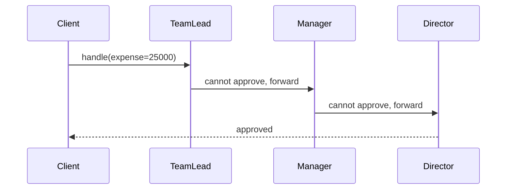

**Trade-offs.** *Pros:* decouples sender from receiver; the handler set is configurable at
runtime; each handler is small and single-responsibility (open/closed). *Cons:* **receipt is
not guaranteed** — a request can traverse the whole chain and fall off the end unhandled;
debugging the runtime chain is hard because control flow is implicit; a misconfigured chain
(broken link, wrong order) fails silently. *Use when* more than one object may handle a
request and the handler isn't known a priori, or you want to issue a request to one of several
objects without specifying the receiver explicitly. *Avoid when* exactly one object always
handles the request (just call it) or when guaranteed handling is required and you have no
default/terminal handler. **vs. Decorator:** structurally both are linked chains of wrappers,
but a Decorator *always* runs every wrapper and *adds* behavior around a delegate, whereas CoR
*stops* at the first handler that acts and the point is *selecting a handler*, not composing
behavior. **vs. Command:** Command reifies a request as an object; CoR is about *routing* a
request to a handler. **Real-world:** Servlet `Filter` / middleware pipelines, log4j/SLF4J
appender and log-level chains, exception-handling chains, AWS API Gateway request pipeline.

---

## Command

**Problem it solves:** You need to treat "an action to perform" as a first-class thing you can
store, pass around, queue, log, schedule, or undo — but a plain method call is *not* an object,
so you can't put it in a list, retry it later, or reverse it. Command removes the pain of "I
need to parameterize and manipulate operations, not just invoke them."

**Intent / how it works.** Encapsulate a request as an **object**, thereby letting you
parameterize clients with different requests, queue or log requests, and support undoable
operations. A `Command` interface declares `execute()` (and often `undo()`). A
`ConcreteCommand` binds a **Receiver** (the object that does the real work) with a set of
arguments and implements `execute()` by calling the receiver. An **Invoker** (button, menu,
scheduler, queue) holds commands and triggers `execute()` without knowing what the command
does or who the receiver is. Because the request is now an object, you can keep a history
stack for undo/redo, serialize it into a job queue, or compose several into a **macro
command**.

**Concrete example.** A text editor's toolbar. Clicking "Bold" runs a `BoldCommand`, "Paste" a
`PasteCommand`. Each command captures enough state to reverse itself, and the editor keeps an
undo stack:

```java
interface Command { void execute(); void undo(); }

class PasteCommand implements Command {
    private final Document doc; private final String clip; private int at;
    PasteCommand(Document doc, String clip) { this.doc = doc; this.clip = clip; }
    public void execute() { at = doc.caret(); doc.insert(at, clip); }
    public void undo()    { doc.delete(at, clip.length()); }
}
// Invoker
class Editor { Deque<Command> history = new ArrayDeque<>();
    void run(Command c) { c.execute(); history.push(c); }
    void undo() { if (!history.isEmpty()) history.pop().undo(); }
}
```

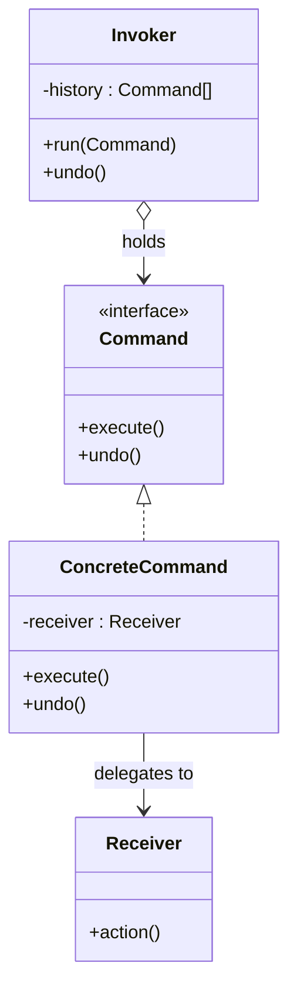

**Trade-offs.** *Pros:* decouples the object that invokes an operation from the one that knows
how to perform it; supports **undo/redo**, **queuing**, **logging** (replay for recovery),
**macros**, and deferred/remote execution; new commands don't change existing code. *Cons:* a
class per action inflates the codebase; extra indirection; storing state for undo can be
costly. *Use when* you need undoable operations, want to queue/schedule/log requests, or want
to parameterize objects with actions (callbacks). *Avoid when* the action is a trivial one-off
call with no need for undo/queue/log — a plain method or lambda is enough. **vs. Strategy:**
this is a top interview probe. A **Command** reifies a *request/action* (verb) — it bundles a
receiver plus arguments and often supports undo; you keep and replay it. A **Strategy** reifies
an interchangeable *algorithm* (how to do one step) that a context swaps to change *how* it
computes; strategies are typically stateless and are not queued or undone. **vs. Memento:**
often paired — Command captures the *operation* to reverse; Memento captures the *state* to
restore. **Real-world:** `java.lang.Runnable`, Swing `Action`, editor undo stacks, job/task
queues, transaction logs / write-ahead logs, CQRS command handlers.

---

## Interpreter

**Problem it solves:** You keep re-parsing or hand-coding the same kind of simple, recurring
"little language" — search filters, boolean rules, arithmetic, routing expressions — with
ad-hoc string parsing that's brittle and hard to extend. Interpreter removes the pain of "I
have a well-defined grammar and I want to evaluate sentences of it in a structured, extensible
way" by turning each grammar rule into a class.

**Intent / how it works.** Given a language, define a **representation for its grammar** along
with an **interpreter** that uses the representation to interpret sentences in the language.
Each grammar rule becomes a class: **TerminalExpression** for atomic symbols (literals,
variables) and **NonterminalExpression** for composite rules (AND, OR, plus, etc.) that hold
sub-expressions. All implement an `interpret(Context)` method; the whole sentence is an
**abstract syntax tree (AST)** of these expression objects, and evaluating it is a recursive
walk. A **Context** carries global state such as variable bindings. A separate parser builds
the tree; Interpreter proper is about *representing and evaluating* it.

**Concrete example.** A boolean rule engine over feature flags: the expression
`premium AND (trial OR beta)` becomes a tree of `Variable`, `And`, and `Or` nodes evaluated
against a context that maps flag names to booleans.

```java
interface Expr { boolean interpret(Map<String,Boolean> ctx); }
record Var(String name) implements Expr {
    public boolean interpret(Map<String,Boolean> c) { return c.getOrDefault(name, false); }
}
record And(Expr l, Expr r) implements Expr {
    public boolean interpret(Map<String,Boolean> c) { return l.interpret(c) && r.interpret(c); }
}
record Or(Expr l, Expr r) implements Expr {
    public boolean interpret(Map<String,Boolean> c) { return l.interpret(c) || r.interpret(c); }
}
```

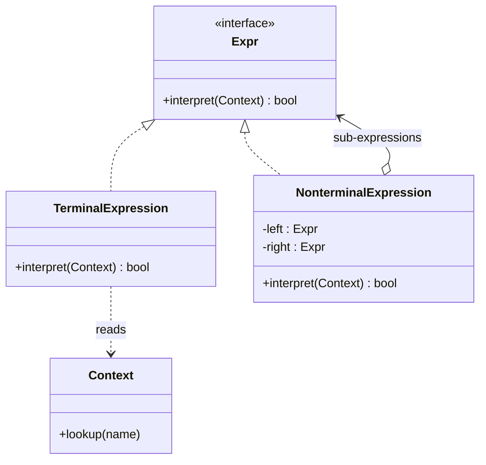

**Trade-offs.** *Pros:* each grammar rule is an isolated class, so **extending or changing the
grammar** is easy (add a rule class); the grammar is explicit and testable. *Cons:* **class
explosion** — one class per rule makes complex grammars unwieldy; **poor performance** and
maintainability for large grammars — for anything beyond simple languages a parser generator
(ANTLR, yacc) or a real compiler front-end is the right tool. *Use when* the grammar is simple
and stable, sentences are evaluated repeatedly, and efficiency isn't critical. *Avoid when* the
grammar is complex or evolves quickly. **vs. Composite:** an Interpreter's AST *is* a Composite
tree of expression objects; the difference is that Interpreter adds a **domain operation**
`interpret(context)` on top of that tree structure. **vs. Visitor:** for a stable AST you often
add operations (type-check, evaluate, pretty-print) via a Visitor instead of putting them all
on each node. **Real-world:** regular-expression engines and `java.util.regex.Pattern`,
SQL / expression evaluators, Spring Expression Language (SpEL), rules DSLs.

---

## Iterator

**Problem it solves:** You want to walk the elements of a collection without exposing whether
it's an array, a linked list, a tree, or a hash table — and you want more than one traversal to
be in flight at once. Exposing the internal structure (indexes, node pointers) couples client
code to the representation. Iterator removes the pain of "traverse a collection without leaking
how it's stored."

**Intent / how it works.** Provide a way to **access the elements of an aggregate object
sequentially without exposing its underlying representation**. An `Iterator` interface exposes
`hasNext()` / `next()` (and sometimes `remove()`); a `ConcreteIterator` tracks the current
position for a specific aggregate; the `Aggregate` exposes a `createIterator()` factory. There
are two flavors: **external (active) iterators**, where the client drives the loop (`while
(it.hasNext())`), and **internal (passive) iterators**, where you hand a function to the
collection and it drives the walk (`list.forEach(fn)`, `map/filter`). External iterators are
more flexible (you can pause, compare two traversals); internal iterators are more concise and
harder to misuse.

**Concrete example.** A `TreeSet` should be traversable in sorted order without the client
knowing it's a red-black tree; a `LinkedList` and an `ArrayList` should be walkable with the
same `for-each` loop even though one is nodes and the other is a backing array.

```java
List<String> names = List.of("Ann", "Bob", "Cy");
Iterator<String> it = names.iterator();     // external iterator
while (it.hasNext()) System.out.println(it.next());
names.forEach(System.out::println);          // internal iterator
```

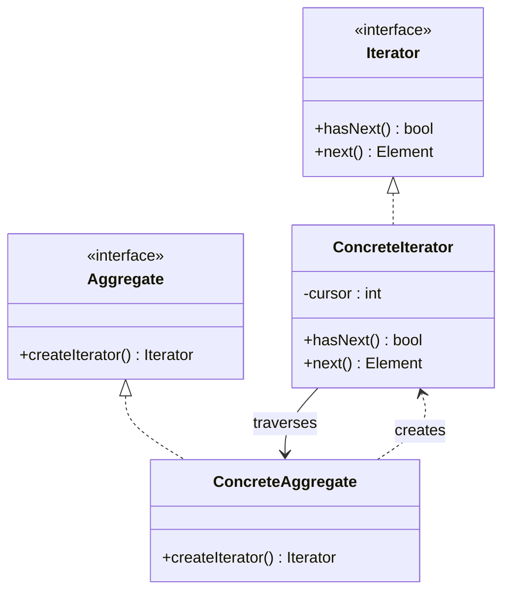

**Trade-offs.** *Pros:* uniform traversal API across collection types; supports **multiple
simultaneous traversals** (each iterator has its own cursor); single-responsibility (traversal
logic leaves the collection); lets you vary the traversal algorithm (forward, reverse,
filtered). *Cons:* overkill for a plain array or simple list; can be less efficient than direct
indexed access; **fail-fast** iterators throw `ConcurrentModificationException` if the
collection changes mid-walk. *Use when* you want to hide representation, support several
traversal strategies, or provide a uniform interface over different aggregates. *Avoid when* a
simple indexed loop over an array is clearer. **vs. Visitor:** an Iterator moves through **one
collection type element-by-element** and applies the *same* handling to each; a Visitor applies
**different operations to a heterogeneous object structure** based on each element's type. They
compose — iterate a structure and apply a visitor to each node. **Real-world:**
`java.util.Iterator` / `Iterable`, C++ STL iterators, C# `IEnumerator`, generators / `yield`.

---

## Mediator

**Problem it solves:** A set of objects all need to talk to each other, and if each holds a
direct reference to every other, you get an unmaintainable **many-to-many** web where changing
one collaborator ripples into all the rest and nothing can be reused independently. Mediator
removes the pain of "everything is tangled to everything" by routing all interaction through
one coordinator.

**Intent / how it works.** Define an object that **encapsulates how a set of objects interact**.
Mediator promotes loose coupling by keeping objects (**colleagues**) from referring to each
other explicitly, and lets you vary their interaction independently. Each colleague knows only
the mediator, not its peers; when a colleague changes, it notifies the mediator, and the
mediator decides which other colleagues to update and how. This converts a **many-to-many**
graph into a **one-to-many** hub-and-spoke: N colleagues each talk to 1 mediator.

**Concrete example.** A dialog box where enabling the "Submit" button depends on a text field
being non-empty and a checkbox being ticked. Instead of the checkbox knowing about the button
and the field, each widget reports changes to a `DialogMediator`, which centralizes the rule
"enable Submit iff field non-empty AND terms accepted."

```java
class DialogMediator {
    TextField name; CheckBox terms; Button submit;
    void changed(Widget source) {                     // colleagues notify the mediator
        submit.setEnabled(!name.text().isEmpty() && terms.checked());
    }
}
```

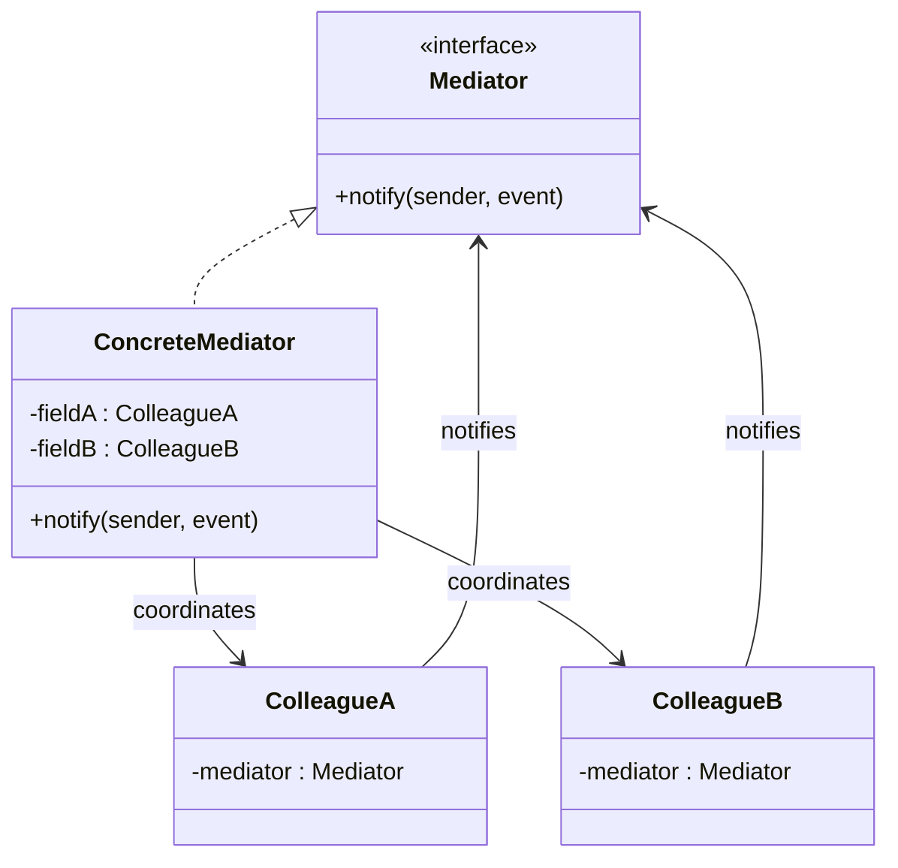

**Trade-offs.** *Pros:* turns many-to-many into one-to-many, drastically reducing coupling;
centralizes interaction logic that was scattered across colleagues, making it easier to
understand and change; colleagues become reusable in isolation. *Cons:* the mediator can grow
into an omniscient **god object** that concentrates all the complexity it removed from the
colleagues — a maintenance hotspot. *Use when* objects communicate in complex, well-defined but
tangled ways and the interdependencies are unstructured and hard to follow. *Avoid when* the
coordination is trivial or when it would make the mediator a dumping ground. **vs. Observer:**
a Mediator is a **bidirectional coordination hub** that knows its colleagues and encodes
*specific* interaction rules among peers; Observer is a **one-directional broadcast** where a
subject notifies subscribers that don't coordinate with each other. Mediators are often
*implemented using* Observer (colleagues observe the mediator). **vs. Facade:** a Facade is a
structural, **one-way** simplified entry point to a subsystem (the subsystem doesn't call back);
a Mediator's colleagues talk *back and forth* through it. **Real-world:** GUI dialog
controllers, chat-room servers routing messages between participants, air-traffic control
(the canonical analogy), workflow coordinators.

---

## Memento

**Problem it solves:** You need to **capture an object's state so you can restore it later**
(undo, checkpoint, snapshot) — but you don't want to expose that object's internals (break
encapsulation) just so an outsider can save and reload them. Memento removes the pain of "let
me roll back to a previous state without making all my private fields public."

**Intent / how it works.** Without violating encapsulation, **capture and externalize an
object's internal state** so the object can be restored to this state later. Three roles: the
**Originator** creates a `Memento` capturing a snapshot of its own state and can restore itself
from one; the **Memento** is an opaque token that stores that state (only the originator can
read its contents — a *narrow* interface to everyone else, a *wide* interface to the
originator); the **Caretaker** holds mementos (e.g., on an undo stack) but treats them as black
boxes and never inspects them. Encapsulation is preserved because only the originator knows
what's inside the memento.

**Concrete example.** A drawing app supports undo. Before each edit the canvas (Originator)
produces a `CanvasMemento` snapshot; the history manager (Caretaker) pushes it on a stack.
"Undo" pops the last memento and asks the canvas to restore from it.

```java
class Editor {                                   // Originator
    private String content;
    Memento save() { return new Memento(content); }
    void restore(Memento m) { this.content = m.state(); }
}
record Memento(String state) {}                   // opaque snapshot
class History { Deque<Memento> stack = new ArrayDeque<>(); }  // Caretaker
```

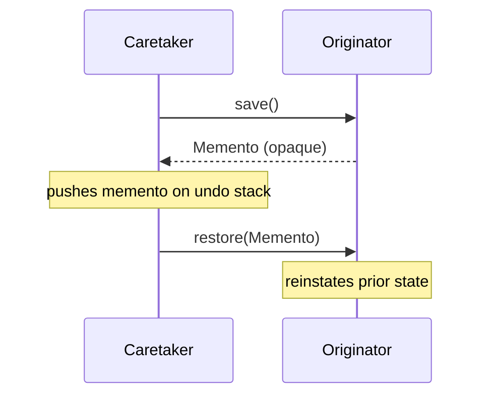

**Trade-offs.** *Pros:* preserves **encapsulation** while still supporting undo/snapshots/
rollback; the originator's boundaries stay clean; simplifies the originator (it doesn't manage
its own history). *Cons:* mementos can be **expensive in memory** if state is large or snapshots
are frequent (mitigate with incremental/diff mementos); the caretaker must manage memento
lifecycle and may not know the cost of what it stores; some languages make the "wide interface
to originator, narrow to everyone else" hard to enforce. *Use when* you must snapshot and
restore state (undo, checkpoints, transactions) without exposing internals. *Avoid when* state
is huge and frequent snapshots would blow the memory budget, or when the state is trivially
reconstructable. **vs. Command:** for undo, a Memento stores the **state to roll back to**,
while a Command stores the **operation to reverse**; commands are cheaper when the inverse is
easy to compute, mementos are simpler when it isn't — the two are frequently combined.
**vs. serialization/Prototype:** serialization/clone also copy state but don't provide the
encapsulation-preserving originator/caretaker roles. **Real-world:** editor undo, database
savepoints and transaction rollback, `Serializable` snapshots, VM/game save states.

---

## Observer

**Problem it solves:** When one object changes, an open-ended set of *other* objects need to be
kept in sync — but you don't want the changing object to hardcode who those dependents are, and
you want dependents to come and go at runtime. Observer removes the pain of "keep N views/caches
/listeners consistent with one source of truth without tightly coupling them."

**Intent / how it works.** Define a **one-to-many dependency** between objects so that when one
object (the **Subject**) changes state, all its dependents (**Observers**) are **notified and
updated automatically**. Observers register/unregister with the subject via
`subscribe`/`unsubscribe`. On a state change the subject iterates its observer list and calls
`update()` on each. Two data-transfer styles: **push** (the subject sends the changed data in
the notification) and **pull** (the subject sends only "something changed" and each observer
queries the subject for what it needs). The subject holds **direct references** to its observers
and notification is typically **synchronous** and in-process.

**Concrete example.** A spreadsheet cell holds a value; a bar chart, a pie chart, and a numeric
readout all display it. When the cell changes, all three redraw. The cell (subject) doesn't know
what a chart is — it just notifies whoever subscribed.

```java
interface Observer { void update(double value); }
class Cell {                                         // Subject
    private final List<Observer> obs = new ArrayList<>();
    private double value;
    void subscribe(Observer o) { obs.add(o); }
    void unsubscribe(Observer o) { obs.remove(o); }
    void set(double v) { value = v; obs.forEach(o -> o.update(v)); }  // notify
}
```

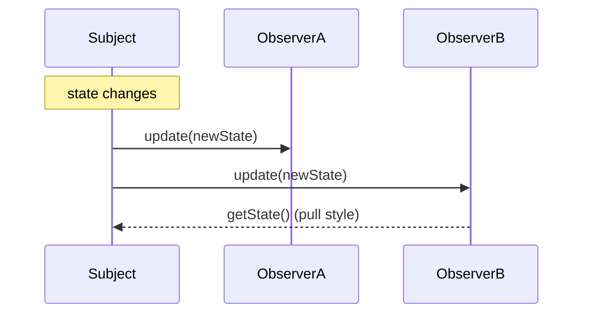

**Trade-offs.** *Pros:* loose coupling — the subject knows only the `Observer` interface;
observers can be added/removed dynamically; supports broadcast to a variable number of
dependents. *Cons:* **lapsed-listener memory leaks** (observers that forget to unsubscribe keep
the subject alive); **unexpected update cascades** (an observer's update triggers another
change, which notifies again); **notification order is unspecified** and shouldn't be relied on;
synchronous notification means a slow observer blocks the subject. *Use when* a change to one
object requires changing others and you don't know how many or which ones. *Avoid when* the
notification graph is complex and bidirectional (use Mediator) or you need decoupling in
space/time and delivery guarantees (use Pub/Sub). **vs. Mediator:** Observer is one-directional
broadcast; Mediator is a bidirectional coordination hub (see Mediator). **vs. Publish/Subscribe:**
the top probe — in Observer the subject holds **direct references** to observers and notifies
them **synchronously in-process**; in Pub/Sub a **broker/event channel** sits between publishers
and subscribers so neither knows the other, enabling asynchronous, cross-process, fan-out
delivery. **Real-world:** `java.beans.PropertyChangeListener` (the legacy `java.util.Observer`
is deprecated), RxJava / Reactive Streams, DOM `addEventListener`, the MVC "model notifies
views" loop.

---

## State

**Problem it solves:** An object behaves differently depending on what mode/phase it's in, and
you've ended up with the same sprawling `switch (this.state)` conditional duplicated across
every method. Adding a new state means editing every method and risking the others. State
removes the pain of "my behavior is a giant conditional on a status field."

**Intent / how it works.** Allow an object to **alter its behavior when its internal state
changes** — the object will appear to change its class. Extract each state into its own class
implementing a common `State` interface; the **Context** holds a reference to the *current*
state object and delegates behavior to it. Each concrete state implements the behavior for that
state **and decides the transition** to the next state (either by returning/setting the next
state on the context). The web of `if/else` collapses into polymorphism: the current state
object *is* the behavior.

**Concrete example.** A vending machine: in `NoCoin` state, pressing "dispense" does nothing; in
`HasCoin`, inserting money does nothing but pressing "dispense" vends and transitions back to
`NoCoin`. Each state is a class that handles the same events differently.

```java
interface State { State insertCoin(); State dispense(); }
class NoCoin implements State {
    public State insertCoin() { return new HasCoin(); }   // transition
    public State dispense()   { System.out.println("Insert coin first"); return this; }
}
class HasCoin implements State {
    public State insertCoin() { return this; }
    public State dispense()   { System.out.println("Dispensing"); return new NoCoin(); }
}
class Machine { State state = new NoCoin();
    void insertCoin() { state = state.insertCoin(); }
    void dispense()   { state = state.dispense(); }
}
```

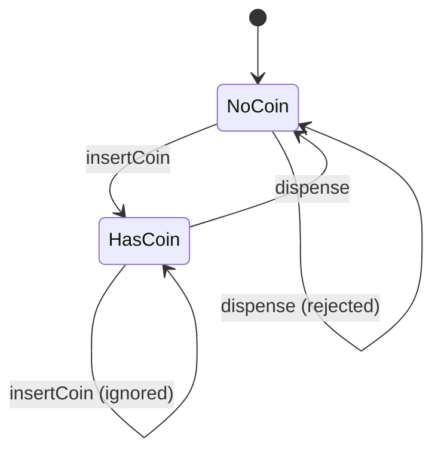

**Trade-offs.** *Pros:* removes large state-dependent conditionals; localizes each state's
behavior in one class (single-responsibility, open/closed for new states); makes state
transitions **explicit**. *Cons:* more classes (one per state); states often need references to
one another or to the context to perform transitions, adding coupling; overkill for two trivial
states. *Use when* an object's behavior depends heavily on its state and that state changes at
runtime, or when methods are dominated by multi-branch state conditionals. *Avoid when* there
are only a couple of states with tiny behavior differences. **vs. Strategy:** this is *the*
classic probe — State and Strategy have **identical UML** (a context delegating to an interface).
The difference is intent and coupling: in **State** the object **transitions itself** between
states (the state objects are state-aware and often trigger the next transition), and the client
usually doesn't pick the state; in **Strategy** the **client chooses** a stateless,
interchangeable algorithm and there are no transitions between strategies. "State is a Strategy
that swaps *itself*." **Real-world:** TCP connection states, `java.lang.Thread` states,
order/workflow lifecycles, UI wizards, game character modes.

---

## Strategy

**Problem it solves:** You have several interchangeable ways to do one thing (sort orders,
pricing rules, compression algorithms, payment methods) and you're selecting between them with
conditionals baked into a class — which makes the class fat, hard to test, and closed to new
variants. Strategy removes the pain of "one class hardcodes multiple algorithms and I must edit
it to add or switch one."

**Intent / how it works.** Define a **family of algorithms**, encapsulate each one, and make
them **interchangeable**. Strategy lets the algorithm vary independently from the clients that
use it. A `Strategy` interface declares the operation; each `ConcreteStrategy` implements one
algorithm; the **Context** holds a strategy reference and delegates to it, and the client
**injects** the chosen strategy (via constructor or setter) at runtime. Swapping behavior is
just swapping the strategy object — no conditionals, no subclassing the context.

**Concrete example.** A shopping cart computes shipping cost. Rather than
`if (method == STANDARD) ... else if (EXPRESS) ...`, you inject a `ShippingStrategy`:

```java
interface ShippingStrategy { double cost(Order o); }
class StandardShipping implements ShippingStrategy { public double cost(Order o){ return 5.0; } }
class ExpressShipping  implements ShippingStrategy { public double cost(Order o){ return 15.0; } }

class Checkout {
    private ShippingStrategy strategy;               // injected by client
    void setStrategy(ShippingStrategy s) { this.strategy = s; }
    double total(Order o) { return o.subtotal() + strategy.cost(o); }
}
```

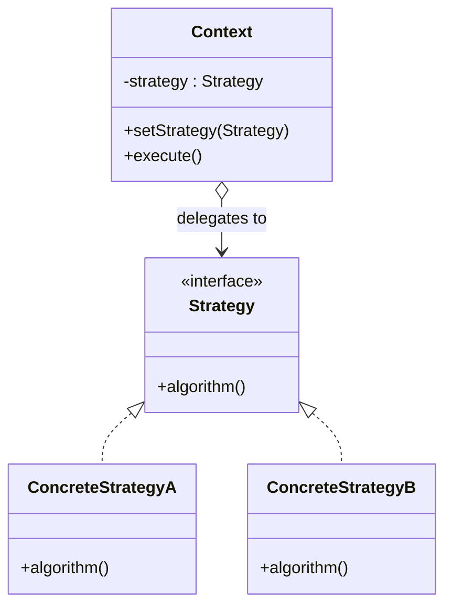

**Trade-offs.** *Pros:* swap algorithms at runtime; eliminates conditional branching; each
algorithm is isolated and independently testable; open/closed — add a new strategy without
touching the context. *Cons:* the **client must know the strategies** to choose one; more
objects and indirection; for a single trivial algorithm it's over-engineering (a lambda often
suffices). *Use when* you have multiple variants of an algorithm, want to swap them at runtime,
or want to strip conditionals from a class. *Avoid when* the behavior never varies or the
variants are so simple a conditional/lambda is clearer. **vs. State:** identical structure —
Strategy is client-chosen and stateless with no transitions; State transitions itself (see
State). **vs. Template Method:** Strategy uses **composition/delegation** and swaps the *whole*
algorithm at **runtime**; Template Method uses **inheritance** to vary *individual steps* of a
fixed algorithm, decided at **compile time**. **vs. Command:** Strategy encapsulates *how* to do
something (an algorithm); Command encapsulates *what to do* (a request with a receiver and
undo). **Real-world:** `java.util.Comparator` passed to `Collections.sort`, pluggable
compression / encryption algorithm selection, payment-method selection, retry/backoff policies.

---

## Template Method

**Problem it solves:** Several routines share the **same overall skeleton** but differ in a few
steps, and you've copy-pasted the skeleton into each, so a fix to the shared shape must be made
in many places and the invariant order can drift. Template Method removes the pain of
"duplicated algorithm structure with a few varying steps."

**Intent / how it works.** Define the **skeleton of an algorithm in a method** (the *template
method*), deferring some steps to subclasses. Template Method lets subclasses redefine certain
steps of an algorithm **without changing the algorithm's structure**. The base class implements
the invariant flow as a `final` (non-overridable) template method that calls a mix of concrete
steps, abstract **primitive operations** (subclasses must implement), and optional **hooks**
(subclasses may override). This is the **Hollywood Principle** — "don't call us, we'll call you":
the base class controls the flow and calls down into subclass steps.

**Concrete example.** A data-import job always: open source, read records, transform, write,
close. Reading differs for CSV vs. JSON. The base class fixes the order; subclasses fill in
`parse`.

```java
abstract class ImportJob {
    public final void run() {                        // template method (fixed skeleton)
        open(); List<Record> rs = parse(); validate(rs); write(rs); close();
    }
    protected abstract List<Record> parse();          // primitive operation (varies)
    protected void validate(List<Record> rs) {}        // hook (optional override)
    protected void open() { /* shared */ }
    protected void write(List<Record> rs) { /* shared */ }
    protected void close() { /* shared */ }
}
class CsvImport  extends ImportJob { protected List<Record> parse(){ /* CSV  */ return ...; } }
class JsonImport extends ImportJob { protected List<Record> parse(){ /* JSON */ return ...; } }
```

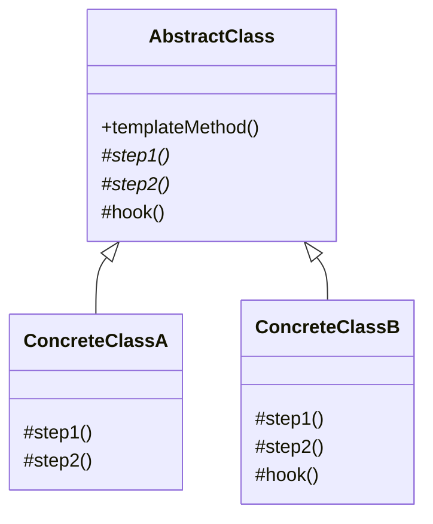

**Trade-offs.** *Pros:* reuses the invariant algorithm structure in one place; enforces the
overall shape and step order; lets subclasses customize only what varies; hooks give optional
extension points. *Cons:* relies on **inheritance**, so it's rigid — a subclass is locked to one
base skeleton and can't recombine steps at runtime; the inverted (Hollywood) control flow can be
hard to trace; risk of Liskov violations if a subclass step breaks the base's assumptions.
*Use when* multiple algorithms share a fixed structure with a few varying steps, or you want to
control the extension points subclasses may override. *Avoid when* you need to swap the whole
algorithm at runtime (use Strategy) or the steps vary along multiple independent axes.
**vs. Strategy:** inheritance-and-compile-time (Template Method) vs. composition-and-runtime
(Strategy) — see Strategy. **vs. Factory Method:** Factory Method is *itself* a specialization
of Template Method whose overridable step is "create an object." **Real-world:**
`java.io.InputStream.read()`, Spring `JdbcTemplate` / `RestTemplate` (you supply the callback,
the template runs the boilerplate), `HttpServlet.service()` dispatching to `doGet`/`doPost`,
JUnit `setUp`/`test`/`tearDown` lifecycle.

---

## Visitor

**Problem it solves:** You have a **stable object structure** (an AST, a document tree, a shape
hierarchy) and you keep needing to add *new operations* over it (evaluate, type-check,
pretty-print, export). Putting each new operation as a method on every element class means
editing all of them every time and scattering unrelated concerns across the hierarchy. Visitor
removes the pain of "add a new operation over a class hierarchy without modifying the classes."

**Intent / how it works.** Represent an **operation to be performed on the elements of an object
structure**. Visitor lets you define a new operation **without changing the classes of the
elements** on which it operates. Each element exposes a single `accept(Visitor v)` method that
calls back `v.visit(this)` — this **double dispatch** is the crux: the operation selected
depends on **both** the runtime type of the element (which `accept` runs) *and* the runtime type
of the visitor (which `visit` overload runs). A `Visitor` interface has one `visit(...)` overload
per concrete element type; each `ConcreteVisitor` bundles one whole operation across all element
types. New operation = new visitor class; the element classes never change.

**Concrete example.** A compiler AST has `NumberNode`, `AddNode`, `MulNode`. You want an
`EvalVisitor`, a `PrintVisitor`, and a `TypeCheckVisitor` — three operations over the same three
node types — without adding three methods to each node.

```java
interface Visitor { double visit(NumberNode n); double visit(AddNode n); }
interface Node { double accept(Visitor v); }
class NumberNode implements Node { double val;
    public double accept(Visitor v){ return v.visit(this); } }   // double dispatch
class AddNode implements Node { Node l, r;
    public double accept(Visitor v){ return v.visit(this); } }
class EvalVisitor implements Visitor {
    public double visit(NumberNode n){ return n.val; }
    public double visit(AddNode n){ return n.l.accept(this) + n.r.accept(this); }
}
```

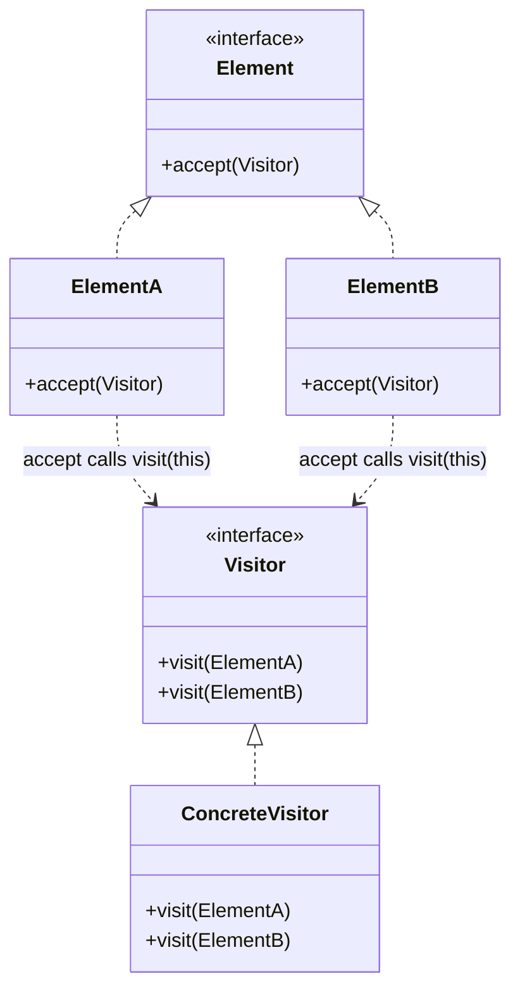

**Trade-offs.** *Pros:* **adding a new operation is easy** — write one new visitor, touch no
element classes; related behavior for an operation is gathered in one visitor class; can
accumulate state across a traversal. *Cons:* **adding a new element type is hard** — every
existing visitor must gain a new `visit` overload (the crux of the **Expression Problem**);
visitors often need access to element internals, breaching encapsulation; the double-dispatch
plumbing (`accept`) is boilerplate. *Use when* the object structure is **stable** but operations
change often, and you want to keep unrelated operations out of the element classes. *Avoid when*
the element hierarchy changes frequently (you'll be editing every visitor). **The Expression
Problem in one line:** OO classes make **adding types easy, adding operations hard**; Visitor
**flips it** — operations easy, types hard. Choose based on which axis changes more.
**vs. Iterator:** Iterator is about **traversal** of one collection; Visitor is about applying
**type-specific operations** across a heterogeneous structure (often *using* an iterator to walk
it). **Real-world:** compiler AST passes, `javax.lang.model` annotation processing, XML/DOM
tree traversal, Jackson `JsonNode` visitors, `Files.walkFileTree` `FileVisitor`.

---

## Null Object

**Problem it solves:** Code that returns `null` for "nothing here" forces every caller to
sprinkle `if (x != null)` guards, and forgetting one causes a `NullPointerException`. Null
Object removes the pain of "null checks everywhere and the NPEs that slip through" by supplying
a real object whose methods **do nothing / return neutral values**.

**Intent / how it works.** Instead of returning `null` (or a special flag), return an object
that implements the expected interface but whose behavior is a **safe no-op / neutral default**.
Callers treat present and absent the same — they just call methods; the null object silently
does nothing meaningful. It's a degenerate implementation of the interface, usually a singleton
because it's stateless.

**Concrete example.** A logging facade: when logging is disabled, `getLogger()` returns a
`NullLogger` whose `info()`/`error()` do nothing, so call sites never check `if (logger != null)`.

```java
interface Logger { void info(String m); }
class ConsoleLogger implements Logger { public void info(String m){ System.out.println(m); } }
class NullLogger implements Logger { public void info(String m){ /* do nothing */ } }

Logger log = config.enabled() ? new ConsoleLogger() : new NullLogger();
log.info("starts working with no null check");
```

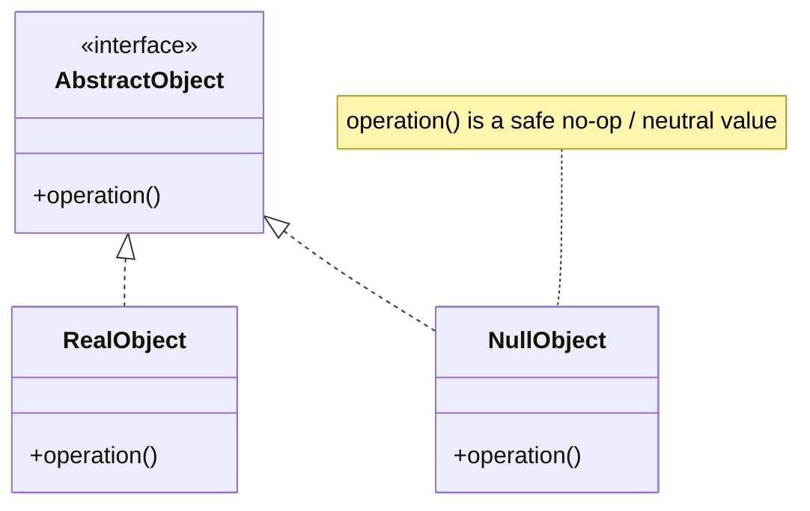

**Trade-offs.** *Pros:* eliminates repetitive null checks and the NPEs they miss; simplifies
callers (no branching on absence); provides consistent default behavior. *Cons:* can **silently
hide real errors** — a bug that should have surfaced as a loud failure is swallowed by the
no-op; wrong when absence genuinely requires different handling; adds a class. *Use when*
"absence" has a sensible do-nothing/neutral behavior and callers shouldn't care. *Avoid when*
the caller must react to absence, or a missing value indicates a defect that should fail fast.
**vs. Special Case (Fowler):** Null Object is the specific Special Case whose behavior is
"nothing"; Special Case is the broader pattern — a subclass for a particular case (e.g.
`UnknownCustomer`, `MissingProduct`) that may return *meaningful* defaults, not just no-ops.
**vs. Optional/Maybe:** `Optional` makes absence explicit in the type and forces the caller to
handle it; Null Object hides absence behind normal calls. **Real-world:**
`Collections.emptyList()` / `emptyMap()`, SLF4J `NOPLogger`, a no-op metrics/tracing recorder.

---

## Publish/Subscribe (Event Aggregator)

**Problem it solves:** Plain Observer still couples the subject to its observers (it holds
direct references and notifies synchronously in-process), which doesn't scale to many event
sources and sinks, across processes, or asynchronously. Publish/Subscribe removes the pain of
"producers and consumers must know each other and be co-located and simultaneously alive."

**Intent / how it works.** Decouple event **producers** from event **consumers** by inserting an
intermediary — a **broker / event channel / event aggregator** — between them. Publishers send
events to the channel keyed by topic/type; the channel delivers each event to whichever
subscribers registered interest. Neither side holds a reference to the other; they're decoupled
in **space** (don't know each other), **time** (subscriber needn't be alive when the event is
sent, if the broker buffers), and **synchronization** (delivery is often asynchronous). Fowler's
**Event Aggregator** is the in-process form: a single object aggregates many sources' events so
a subscriber subscribes once instead of to dozens of subjects.

**Concrete example.** An order service publishes an `OrderPlaced` event to a message broker.
Independently, an email service, an inventory service, and an analytics service subscribe. The
order service has no idea they exist, and new subscribers can be added without changing it.

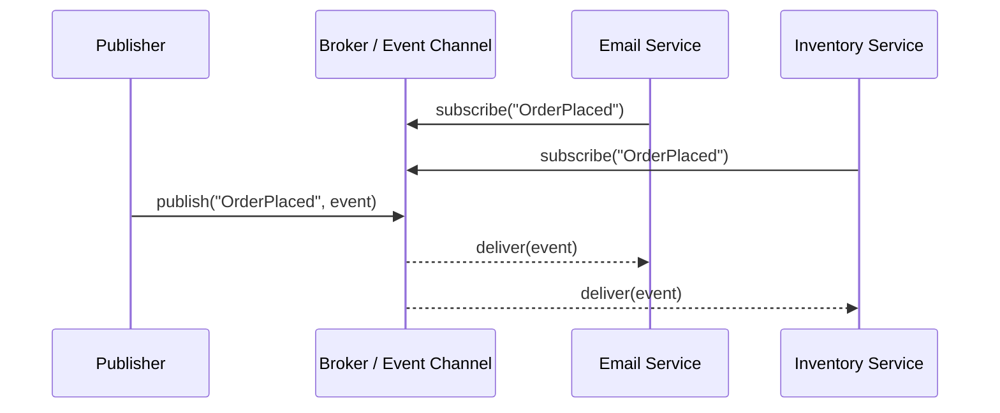

**Trade-offs.** *Pros:* full **spatial + temporal decoupling**; scalable fan-out to many
subscribers; producers and consumers evolve and deploy independently; supports async and
cross-process delivery. *Cons:* **loss of end-to-end visibility** — hard to see who consumes
what; delivery guarantees and ordering depend on the broker and are easy to get wrong;
debugging an event-driven flow is harder than a direct call; the broker is infrastructure to
run and can be a bottleneck/SPOF. *Use when* you need many-to-many, async, or cross-boundary
event distribution. *Avoid when* a simple synchronous in-process Observer suffices, or you need
a strict request/response with a return value. **vs. Observer:** the canonical probe — Observer
= subject holds **direct references**, synchronous, in-process; Pub/Sub = a **broker** sits
between, enabling async, cross-process, fully-decoupled fan-out. **vs. Mediator:** a Mediator
*coordinates known peers* with specific rules; a Pub/Sub channel *blindly routes* events to
anonymous subscribers. **Cross-reference:** the distributed/async treatment (delivery
semantics, ordering, exactly-once, outbox) lives in `event-driven-cqrs-saga-cdc` and the AWS
messaging topics — this section is the pattern-level view. **Real-world:** Kafka / SNS+SQS /
EventBridge, Guava `EventBus`, Redis pub/sub, the browser `EventTarget` / custom events, GUI
event buses.

---

## Specification

**Problem it solves:** Business rules ("is this customer eligible for a discount?", "is this
order shippable?") get duplicated and tangled across queries, validation, and UI, and combining
them (`A and (B or not C)`) means copy-pasting boolean logic. Specification removes the pain of
"the same business predicate is re-implemented in many places and can't be composed cleanly."

**Intent / how it works.** Encapsulate a **business rule as a predicate object** — a
`Specification` with an `isSatisfiedBy(candidate) -> boolean` method. Because each rule is an
object implementing a common interface, you can **combine** specifications with `and`, `or`, and
`not` composites to build complex rules from simple ones, and reuse the same specification for
in-memory validation, selection/filtering, and (with translation) database queries. It's a
behavioral pattern built on a Composite structure of boolean rules.

**Concrete example.** An e-commerce eligibility rule: "premium customer AND (order over \$50 OR
has coupon)". Each clause is a specification; the composite expresses the whole rule and is
reused by the checkout validator and the marketing report.

```java
interface Spec<T> { boolean isSatisfiedBy(T t);
    default Spec<T> and(Spec<T> o){ return t -> isSatisfiedBy(t) && o.isSatisfiedBy(t); }
    default Spec<T> or (Spec<T> o){ return t -> isSatisfiedBy(t) || o.isSatisfiedBy(t); }
    default Spec<T> not(){ return t -> !isSatisfiedBy(t); }
}
Spec<Order> premium = o -> o.customer().isPremium();
Spec<Order> big     = o -> o.total() > 50;
Spec<Order> eligible = premium.and(big.or(o -> o.hasCoupon()));
```

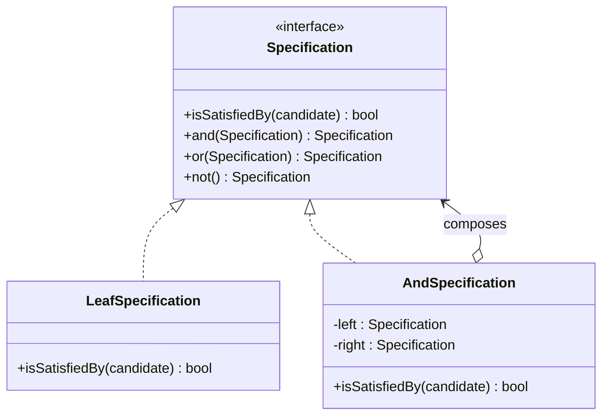

**Trade-offs.** *Pros:* business rules become **composable, reusable, and independently
testable**; the same rule works for validation, selection, and query building; names the domain
concept explicitly (DDD). *Cons:* overhead for trivial one-off predicates (a lambda is enough);
can drift toward an over-engineered in-house **rules engine**; translating specifications into
efficient SQL is nontrivial. *Use when* the same nontrivial business rule is used in multiple
places or must be combined dynamically. *Avoid when* a rule is used once and is a simple boolean
expression. **vs. Strategy:** a Specification answers a **boolean question** ("does X satisfy
this rule?") and is composable via and/or/not; a Strategy **performs an algorithm** and
computes a result. **vs. Composite:** Specification *uses* Composite to build the and/or/not
tree; Composite is the structural mechanism, Specification the behavioral intent.
**Real-world:** Spring Data JPA `Specification`, filter/rule DSLs, DDD domain layers, validation
frameworks.

---

## Behavioral patterns at a glance

The fastest way to pick the right pattern is to ask **"what varies?"** — each behavioral pattern
isolates a different axis of change.

| Pattern | What varies (the axis) | Mechanism | Best diagram |
|---|---|---|---|
| Chain of Responsibility | *which handler* processes a request | delegation to a successor chain | sequence |
| Command | *the request* itself (reified) | object per action + invoker | class |
| Interpreter | *sentences of a grammar* | class per grammar rule (AST) | class |
| Iterator | *the traversal* of an aggregate | separate cursor object | class |
| Mediator | *who talks to whom* (coordination) | central hub | class |
| Memento | *saved state* for restore | opaque snapshot token | sequence |
| Observer | *the set of dependents* to notify | subject holds observer list | sequence |
| State | *behavior per internal state* | state object + self-transition | state |
| Strategy | *the algorithm* | client-injected interface | class |
| Template Method | *individual steps* of a fixed algorithm | inheritance + primitive ops | class |
| Visitor | *the operations* over a stable structure | double dispatch (accept/visit) | class |
| Null Object | *presence vs. absence* | no-op implementation | class |
| Publish/Subscribe | *who talks to whom*, decoupled/async | broker / event channel | sequence |
| Specification | *composable business rules* | predicate objects (Composite) | class |

> [!TIP]
> Interviewers love "given this problem, which pattern?" Anchor on the *axis of change*:
> algorithm → Strategy; behavior-per-state → State; a fixed skeleton with varying steps →
> Template Method; add operations to a fixed hierarchy → Visitor; decouple sender/handler →
> Chain of Responsibility; reify a request (undo/queue) → Command; notify dependents → Observer
> (in-process) or Pub/Sub (decoupled/async); tangle of collaborators → Mediator.

---

## Canonical interview probes

These four confusions are asked far more than any pattern definition. Be able to answer each
side-by-side.

**1. Strategy vs. State vs. Template Method.** All three vary *behavior*, but by different
mechanisms:

| | Strategy | State | Template Method |
|---|---|---|---|
| Mechanism | composition/delegation | composition/delegation | inheritance |
| Bound at | runtime | runtime | compile time |
| Who chooses | the **client** injects it | the object **transitions itself** | fixed by the subclass |
| Transitions? | no — strategies don't switch each other | **yes** — states move to other states | n/a |
| Varies | the whole algorithm | behavior per state | individual steps of a fixed algorithm |

Strategy and State share identical UML; the difference is *who drives the change* (client vs.
self) and *whether states know about transitions*. Template Method is the odd one out: it uses
inheritance and fixes the choice at compile time.

**2. Observer vs. Mediator vs. Publish/Subscribe.** All three are about communication topology:

- **Observer** — *one-directional broadcast*. The subject holds **direct references** to
  observers and notifies them synchronously, in-process.
- **Mediator** — *bidirectional coordination hub*. Colleagues talk **through** the mediator,
  which encodes *specific interaction rules* among known peers.
- **Publish/Subscribe** — *decoupled broker*. A channel sits between anonymous publishers and
  subscribers; neither knows the other; delivery is often async / cross-process.

**3. Command vs. Strategy.** Same "reify something as an object," different somethings. A
**Command** reifies a *request/action* (a verb): it bundles a receiver + arguments, is stored
and replayed, and often supports **undo**. A **Strategy** reifies an *algorithm* (a *how*): the
context swaps it to change how one step is computed; strategies are usually stateless and are
neither queued nor undone.

**4. Visitor, double dispatch, and the Expression Problem.** Visitor achieves **double
dispatch**: `element.accept(visitor)` dispatches on the element's type, then `visitor.visit(this)`
dispatches on the visitor's type — the operation is chosen by *both* runtime types. This buys
"**add an operation easily** (new visitor, no element changes)" at the cost of "**adding a new
element type is hard** (every visitor must add a `visit` overload)." That trade — types-easy vs.
operations-easy — is the **Expression Problem**: plain OO subclassing makes adding *types* easy
and *operations* hard; Visitor flips it. Choose based on which axis changes more often. Contrast
with **Iterator**, which is about *traversing* one collection, not about type-specific operations.

---

## Cross-reference note (distributed & concurrency contexts)

Several behavioral patterns recur in distributed and concurrent systems; this topic gives the
**pattern-level intent + trade-offs**, while the deep whiteboard/scenario treatment lives
elsewhere in the system-design domain — cross-reference rather than duplicate:

- **Publish/Subscribe, Observer, Command** in event-driven and async architectures →
  `event-driven-cqrs-saga-cdc` (delivery semantics, ordering, outbox, CQRS command handlers)
  and the AWS messaging topics.
- **Chain of Responsibility** as distributed request pipelines, and cloud behavioral patterns →
  `dp-distributed-cloud` (pattern catalog) and `resilience-tradeoffs-deep-dive`.
- **Concurrency behavioral coordination** — **Guarded Suspension**, **Balking**, **Reactor**,
  and **Event Loop** are behavioral patterns that coordinate objects over *time/threads*; they
  are covered in the dedicated `dp-concurrency` topic (POSA2). Reach for that topic for those
  patterns rather than re-deriving them here.

---

## Common follow-up questions

- **"Strategy or State — they look identical, how do I choose?"** Ask who drives the change:
  the client picks a Strategy; the object transitions its own State. States know about
  transitions; strategies don't.
- **"When is Chain of Responsibility dangerous?"** When a request can fall off the end
  unhandled and there's no terminal/default handler — receipt isn't guaranteed.
- **"Why not just return null instead of a Null Object?"** Null Object removes caller null
  checks — but be careful: it can *hide* errors that should fail loudly; sometimes you *want*
  the NPE.
- **"How does Visitor achieve double dispatch and what does it cost?"** `accept` dispatches on
  element type, `visit` on visitor type; cost is that adding a new element type breaks every
  visitor (Expression Problem).
- **"Command vs. Memento for undo?"** Command stores the *operation* to reverse; Memento stores
  the *state* to restore. Use Command when the inverse is cheap to compute, Memento when it
  isn't; they're often combined.
- **"Observer vs. Pub/Sub — same thing?"** No — Observer has direct references and synchronous
  in-process notification; Pub/Sub inserts a broker for async, cross-process, decoupled fan-out.
- **"Template Method vs. Strategy for varying behavior?"** Template Method varies *steps* via
  inheritance (compile-time); Strategy swaps the *whole algorithm* via composition (runtime).
- **"Give a real library example of each of the big five."** Strategy → `Comparator`;
  Observer → `PropertyChangeListener`/RxJava; Command → `Runnable`; Template Method →
  `JdbcTemplate`/`InputStream.read`; Iterator → `java.util.Iterator`.
- **"Is Mediator just a fancy Observer?"** Mediators are often *implemented with* Observer, but
  a Mediator coordinates known peers bidirectionally with rules; Observer only broadcasts.
- **"Which pattern fights combinatorial conditionals?"** Both State (state-based conditionals)
  and Strategy (algorithm-selection conditionals) replace `switch` ladders with polymorphism.

---

## References

- Gamma, Helm, Johnson, Vlissides (Gang of Four), *Design Patterns: Elements of Reusable
  Object-Oriented Software* (1994) — Chapter 5, Behavioral Patterns: Chain of Responsibility,
  Command, Interpreter, Iterator, Mediator, Memento, Observer, State, Strategy, Template Method,
  Visitor (including the inheritance-vs-composition classification and the double-dispatch
  discussion for Visitor).
- refactoring.guru — *Behavioral Design Patterns* catalog (intent, structure, pseudo-code, and
  pros/cons for each; note it omits Interpreter, which GoF includes and this topic covers).
- Martin Fowler, *Patterns of Enterprise Application Architecture* (PoEAA) and martinfowler.com
  — Null Object, Special Case, Event Aggregator, and the Observer/Publish-Subscribe discussion.
- Eric Evans, *Domain-Driven Design*, and Fowler & Evans, *Specifications* — the Specification
  pattern and its composition (and/or/not).
- POSA2 (*Pattern-Oriented Software Architecture, Vol. 2*) — Reactor, Guarded Suspension,
  Balking, and other concurrency behavioral patterns (covered in `dp-concurrency`).
- Chris Richardson, microservices.io, and the Azure/AWS cloud design pattern catalogs — the
  distributed manifestations of Observer/Pub-Sub/Command (covered in `dp-distributed-cloud` and
  `event-driven-cqrs-saga-cdc`).
- Java Platform APIs as living examples: `java.util.Comparator` (Strategy), `Runnable` /
  Swing `Action` (Command), `java.util.Iterator` (Iterator), `PropertyChangeListener` /
  RxJava (Observer), `java.io.InputStream` / Spring `JdbcTemplate` (Template Method),
  `java.util.regex.Pattern` (Interpreter), `Collections.emptyList` / SLF4J `NOPLogger`
  (Null Object), Spring Data JPA `Specification` (Specification).
