# Concurrency and Reactive Design Patterns

This is the **concurrency pattern family** of the Design Patterns group: the reusable
solutions for making objects safe, efficient, and responsive when many things happen at
once. Unlike the GoF creational/structural/behavioral patterns (which are mostly about
*structure*), these patterns are about *time* — who runs, when, on which thread, and how
work, results, and data flow between threads without corruption or stalls.

Most of these patterns come from **POSA Vol. 2, *Patterns for Concurrent and Networked
Objects*** (Schmidt, Stal, Rohnert, Buschmann), Doug Lea's *Concurrent Programming in
Java*, and the **Reactive Streams / Reactive Manifesto** work. Interviewers probe them
because concurrency bugs — races, deadlocks, lost wakeups, memory-visibility errors — are
the ones that pass code review, pass tests, and then take down production at 3 a.m.

A single mental model to carry throughout:

> [!KEY-TAKEAWAY]
> Every concurrency pattern picks one of four strategies to stay correct:
> **(1) don't share** (Immutable, Thread-Specific Storage, Copy-on-Write),
> **(2) serialize access to what you share** (Lock, Monitor Object, Read-Write Lock),
> **(3) decouple invocation from execution** (Active Object, Thread Pool, Producer-Consumer,
> Future), or **(4) react to events / demand** (Reactor, Proactor, Backpressure). Naming
> which strategy a design uses — and what it costs — is the strongest interview signal.

**Cross-cutting hazards** named throughout: data races, deadlock (the four Coffman
conditions: mutual exclusion, hold-and-wait, no preemption, circular wait), livelock,
starvation, priority inversion, lost wakeup / missed signal, memory-visibility and
reordering (happens-before, `volatile`, memory barriers), false sharing, thread-pool
starvation, and the ABA problem.

---

## Active Object

**Problem it solves:** You have an object whose methods are called by many threads, and you
don't want each caller to *block* while the work runs, nor to litter every method with
locks. You want method **invocation** to be decoupled from method **execution** so callers
stay responsive and the object's concurrency is managed in one place.

**Intent / how it works.** Active Object gives an object its *own* thread of control. A
client calls a method on a **Proxy**; the proxy packages the call as a **method request**
(command object) and enqueues it on an **activation queue**. A **Scheduler** running in the
servant's own thread dequeues requests (per some policy) and invokes the real method on the
**Servant**. The call returns immediately to the client with a **Future** — a placeholder for
a result that will exist later (see *Future and Promise* below) — that it can later read.
Mechanism: *a queue plus a dedicated worker thread*.

**Concrete example.** A logging service: `logger.log(msg)` must never block the request
thread on disk I/O. The proxy enqueues a `LogRequest`; the logger's own thread drains the
queue and writes to disk. The web request thread returns instantly.

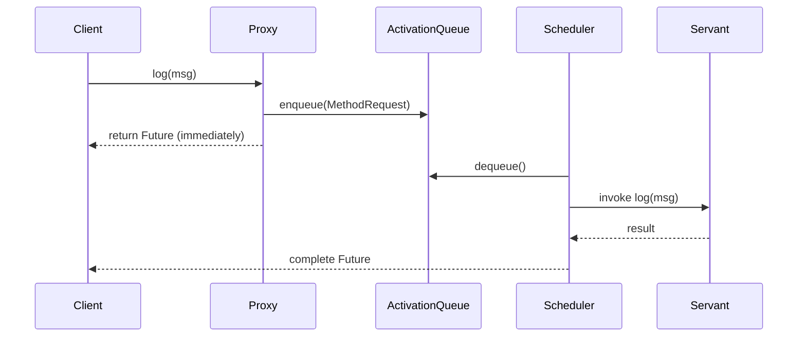
```mermaid
sequenceDiagram
    participant Client
    participant Proxy
    participant Queue as ActivationQueue
    participant Scheduler
    participant Servant
    Client->>Proxy: log(msg)
    Proxy->>Queue: enqueue(MethodRequest)
    Proxy-->>Client: return Future (immediately)
    Scheduler->>Queue: dequeue()
    Scheduler->>Servant: invoke log(msg)
    Servant-->>Scheduler: result
    Scheduler-->>Client: complete Future
```

**Trade-offs.** *Pros:* callers never block; all synchronization is confined to the queue,
so the servant's business logic is single-threaded and lock-free; enables prioritization
and throttling at the scheduler. *Cons:* added latency (a queue hop), memory for queued
requests, harder debugging (stack traces cross thread boundaries), and back-pressure must
be designed in or the queue grows unbounded. *Use when* you want to serialize access to a
resource while keeping callers responsive (loggers, device controllers, actor systems).
*Avoid when* the operation is trivial or must complete synchronously. **vs Monitor Object:**
the defining difference — Active Object executes in its **own** thread (asynchronous, queued);
Monitor Object executes in the **caller's** thread (synchronous, just mutual exclusion).
**Real-world:** the Actor model (Akka, Erlang processes), CORBA ORB request handling,
Android `Handler`/`Looper`.

---

## Actor Model

**Problem it solves:** You want concurrency **without shared mutable state or locks at
all**. Threads sharing memory and coordinating with locks is error-prone (races,
deadlocks, forgotten unlocks); you want independent units that each own their state
privately and interact **only by sending messages**, so there is literally nothing to
lock.

**Intent / how it works.** An **actor** is a unit of computation with three things: (1) a
private **mailbox** (an inbound message queue), (2) **private state** no other actor can
touch, and (3) a **behavior** that processes **one message at a time**. Actors communicate
*only* by asynchronous message passing. In response to a message an actor may update its
own state, send messages to other actors, and create child actors. Because each actor
handles its mailbox sequentially and shares nothing, there are no data races *inside* an
actor and no locks anywhere. Mechanism: *mailbox + one-message-at-a-time processing +
share-nothing state + location transparency*.

**Concrete example.** A chat system: each room is an actor owning its member list and
history; "post" and "join" are messages sent to the room actor and serialized by its
mailbox. Millions of rooms run concurrently, each internally single-threaded and lock-free.

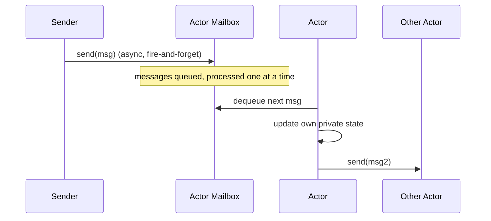
```mermaid
sequenceDiagram
    participant Sender
    participant Mailbox as Actor Mailbox
    participant Act as Actor
    participant Other as Other Actor
    Sender->>Mailbox: send(msg) (async, fire-and-forget)
    Note over Mailbox: messages queued, processed one at a time
    Act->>Mailbox: dequeue next msg
    Act->>Act: update own private state
    Act->>Other: send(msg2)
```

**Trade-offs.** *Pros:* no shared state and no locks; natural scaling and distribution
(location transparency — an actor ref may be local or remote); fault isolation with
supervision hierarchies ("let it crash" + restart). *Cons:* asynchronous message flow is
harder to trace/debug; no synchronous return value (request-reply needs the "ask" pattern
with correlation/Futures); mailboxes can grow unbounded without back-pressure; ordering is
guaranteed only per sender→receiver pair. *Use when* you have many concurrent, stateful
entities (IoT devices, user sessions, game objects) or need distribution/resilience.
*Avoid when* you need fine-grained shared-memory performance or simple synchronous calls.
**vs Active Object — a top interview probe:** Active Object is *object/method-oriented* —
one **servant**, a **Proxy** exposes the servant's *methods*, and calls return **Futures**;
the Actor is *message-oriented* — you send typed **messages** (not method calls) to
potentially millions of actors, usually fire-and-forget with **no** Future. Both give an
entity its own thread of control fed by a queue. **vs Monitor Object:** a monitor shares
state guarded by a lock and runs in the *caller's* thread; an actor shares nothing and runs
in its *own*. **Real-world:** Erlang/OTP processes, Akka / Akka Typed, Microsoft Orleans
(virtual actors), Elixir/BEAM, Akka.NET.

---

## Monitor Object

**Problem it solves:** Multiple threads call methods on one shared object concurrently and
those methods touch shared mutable state. You need to guarantee that **only one method runs
at a time** on the object, and let a method **wait** until the object is in a state where it
can safely proceed — without exposing locking to callers.

**Intent / how it works.** A monitor object makes its synchronized methods run mutually
exclusive by acquiring an object-level lock on entry. Methods that cannot proceed yet call
**wait** on a **condition variable**, atomically releasing the lock and suspending; another
thread later **signals/notifies** the condition to wake them. The waiter re-checks its
predicate (in a `while` loop) before continuing. Mechanism: *one lock + condition variables,
running in the caller's thread*.

**Concrete example.** A bounded `MessageQueue`: `put()` waits while full, `take()` waits
while empty; each notifies the other on state change — all inside the object.

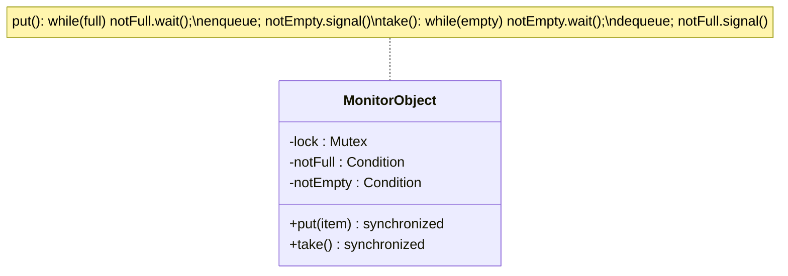
```mermaid
classDiagram
    class MonitorObject {
        -lock : Mutex
        -notFull : Condition
        -notEmpty : Condition
        +put(item) synchronized
        +take() synchronized
    }
    note for MonitorObject "put(): while(full) notFull.wait();\nenqueue; notEmpty.signal()\ntake(): while(empty) notEmpty.wait();\ndequeue; notFull.signal()"
```

**Trade-offs.** *Pros:* mutual exclusion and condition-based waiting are encapsulated inside
the object; simple, familiar model. *Cons:* scales poorly (one lock serializes everything);
risks **nested-monitor lockout** (holding one monitor's lock while waiting on another's
condition); vulnerable to **lost wakeups** if you use `if` instead of `while`, and to missed
`notify`. *Use when* one object needs internal thread-safety with waiting semantics.
*Avoid when* you need high read concurrency (use Read-Write Lock) or non-blocking callers
(use Active Object). **vs Active Object:** thread ownership (caller's thread vs its own).
**vs a raw Lock:** Monitor bundles the lock *and* condition variables into the object's API.
**Real-world:** Java's `synchronized` + `Object.wait/notify`, `ReentrantLock` + `Condition`,
C++ `std::mutex` + `std::condition_variable`, POSIX condition variables.

---

## Thread Pool

**Problem it solves:** Creating a new thread per task is expensive (stack allocation, kernel
scheduling) and unbounded — a burst of requests spawns thousands of threads and exhausts
memory/CPU. You want to **reuse a bounded set of worker threads** to run many short tasks
and to *cap* concurrency.

**Intent / how it works.** A fixed (or elastic) set of pre-created worker threads pull tasks
from a shared work queue and execute them, then loop back for the next task. Task submission
is decoupled from execution; the pool amortizes thread creation and bounds resource use.
Mechanism: *a shared task queue + N reusable workers* (a specialization of Producer-Consumer).

**Concrete example.** A web server submits each incoming request as a task to a pool of 200
worker threads. The 201st concurrent request waits in the queue instead of spawning a
201st thread.

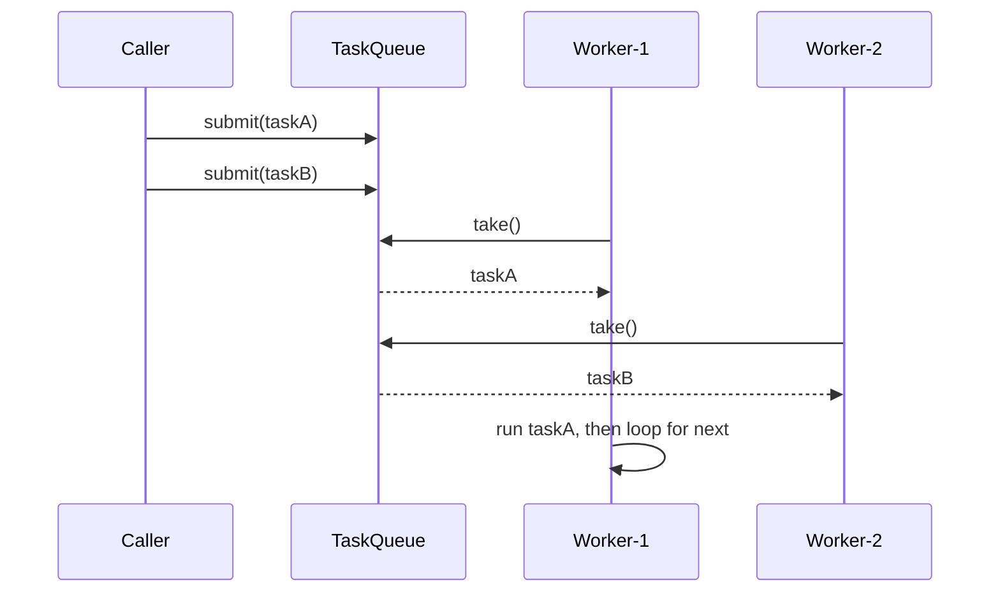
```mermaid
sequenceDiagram
    participant Caller
    participant Queue as TaskQueue
    participant W1 as Worker-1
    participant W2 as Worker-2
    Caller->>Queue: submit(taskA)
    Caller->>Queue: submit(taskB)
    W1->>Queue: take()
    Queue-->>W1: taskA
    W2->>Queue: take()
    Queue-->>W2: taskB
    W1->>W1: run taskA, then loop for next
```

**Trade-offs.** *Pros:* bounds threads, amortizes creation cost, smooths bursts, centralizes
tuning. *Cons:* sizing is genuinely hard (too few → underutilization/queue buildup; too many
→ context-switch thrash); **thread-pool starvation/deadlock** if pooled tasks block waiting on
*other* tasks in the same pool; an **unbounded queue** hides overload until OOM. *Use when*
tasks are numerous and short. *Avoid* mixing long-blocking and short tasks in one pool
(bulkhead them into separate pools). **vs Leader/Followers:** L/F is a pool where threads take
turns owning the event source directly, with no separate dispatcher/handoff queue. **vs
Active Object:** Active Object is usually one servant thread with a request queue; a thread
pool has many interchangeable workers. **Real-world:** Java `ThreadPoolExecutor` /
`Executors`, servlet-container request pools, database connection pools (same idea for
connections), `ForkJoinPool`.

**Virtual threads / Project Loom (Java 21) change the sizing calculus.** Classic pools
size *threads to cores* because OS threads are expensive (~1 MB stack, kernel scheduling), so
you cap them and queue the rest. Virtual threads (and goroutines) are cheap — thousands to
millions of them multiplex onto a small set of **carrier** OS threads, and a blocking call
*unmounts* the virtual thread from its carrier instead of parking the OS thread. That makes
blocking-per-request viable again: you can go back to a simple thread-per-request model
without a bounded worker pool. The pool's job shifts from *bounding threads to cores* toward
**bounding concurrency to a downstream resource** (e.g. a semaphore of 50 permits in front of
a DB that has 50 connections), because unbounded cheap threads can still overwhelm a
bottleneck. Caveat — **pinning**: a virtual thread blocked inside a `synchronized` block or a
native call cannot unmount and holds its carrier, so hot paths should prefer `ReentrantLock`
over `synchronized`. Structured concurrency (`StructuredTaskScope`) then scopes a request's
child tasks so they cancel and join together.

---

## Leader-Followers

**Problem it solves:** In a high-performance server, having one dedicated thread demultiplex
events and then hand each event to a worker in a pool costs an extra context switch and data
copy per event. You want a **pool of threads to process events with minimal handoff overhead**
and without a separate dispatcher thread or queue.

**Intent / how it works.** Multiple threads share one event source (e.g. a socket set). Exactly
one thread is the **leader** and blocks waiting on the event source; the rest are **followers**
sleeping on a lock. When an event arrives, the leader (a) promotes a follower to be the new
leader, then (b) processes the event itself — so demultiplexing and processing happen on the
same thread, avoiding a handoff. After processing, it rejoins as a follower. Mechanism: *a
shared event source + a leader-election lock; no work queue*.

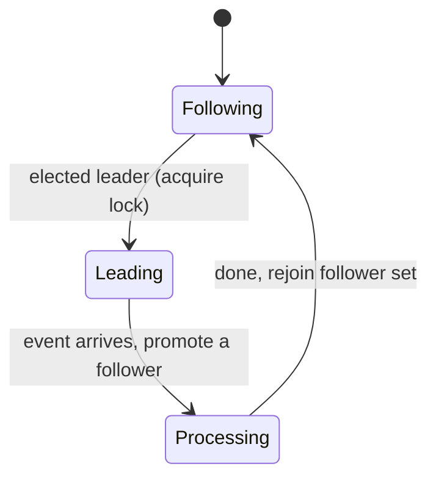
```mermaid
stateDiagram-v2
    [*] --> Following
    Following --> Leading : elected leader (acquire lock)
    Leading --> Processing : event arrives, promote a follower
    Processing --> Following : done, rejoin follower set
```

**Concrete example.** A thread pool of 8 threads serving a listening socket: one blocks in
`epoll_wait`; when a connection is readable, it promotes a peer to wait next and handles the
read itself — no queue, no dispatcher.

**Trade-offs.** *Pros:* minimizes context switches and eliminates the enqueue/dequeue and
data copy of a producer-consumer handoff; excellent cache locality; no separate dispatcher
thread. *Cons:* intricate to implement correctly (leader promotion, handling handler
re-entrancy); **hard to reorder or prioritize** requests since there is no queue to inspect;
all handlers must be roughly uniform. *Use when* you need maximum throughput on a shared event
source with short, uniform handlers. *Avoid when* you need prioritization or handlers vary
wildly in cost. **vs Half-Sync/Half-Async:** H-S/H-A explicitly *keeps* the queue between the
async I/O layer and sync workers; L/F removes it. **vs plain Thread Pool:** a thread pool has
a producer-consumer queue and a submitter; L/F threads self-dispatch off the event source.
**Real-world:** the ACE framework, high-performance web/app servers, some thread-per-core
designs.

---

## Half-Sync Half-Async

**Problem it solves:** Asynchronous, event-driven I/O is fast but hard to program against
(callbacks, no natural control flow); synchronous, blocking code is easy to write but ties
up a thread per operation. You want the **efficiency of async I/O** at the boundary and the
**simplicity of synchronous programming** for business logic, without forcing one model on
the whole system.

**Intent / how it works.** Split the system into layers: an **asynchronous layer** (lower)
handles I/O via an event demultiplexer and never blocks (typically a *Reactor* — see below);
a **synchronous layer** (upper)
where tasks run in their own threads using ordinary blocking code; and a **queueing layer**
between them that decouples the two and mediates the handoff. Async I/O completions are placed
on the queue; sync worker threads pull from it and process using a blocking model.
Mechanism: *async event layer + bounded queue + pool of synchronous workers*.

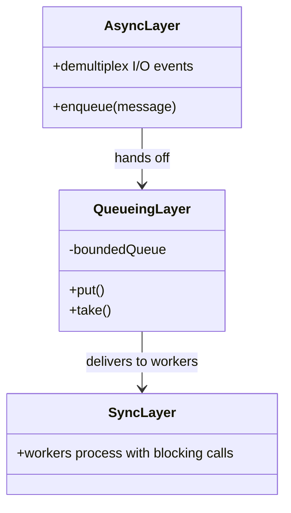
```mermaid
classDiagram
    class AsyncLayer {
        +demultiplex I/O events
        +enqueue(message)
    }
    class QueueingLayer {
        -boundedQueue
        +put()
        +take()
    }
    class SyncLayer {
        +workers process with blocking calls
    }
    AsyncLayer --> QueueingLayer : hands off
    QueueingLayer --> SyncLayer : delivers to workers
```

**Concrete example.** A classic thread-per-request server on top of an event loop: `epoll`
(async layer) accepts and reads bytes, drops complete requests on a queue, and a pool of
worker threads (sync layer) handle each request with straightforward blocking logic.

**Trade-offs.** *Pros:* application code stays simple (synchronous); I/O stays efficient
(async); layers can be tuned independently. *Cons:* the queue crossing costs a context switch
and often a data copy per message — pure latency overhead; extra memory for the queue. *Use
when* you want to shield most developers from async complexity while keeping I/O scalable.
*Avoid when* every microsecond counts (see Leader/Followers) or the whole app is naturally
async. **vs Leader/Followers:** L/F removes the inter-layer queue. **vs Reactor:** the Reactor
*is* a common implementation of the async layer beneath Half-Sync/Half-Async. **Real-world:**
operating-system network stacks (async device I/O → synchronous user processes), most
thread-per-request web servers layered over an event demultiplexer.

---

## Reactor

**Problem it solves:** A server must handle thousands of simultaneous connections, but a
thread-per-connection model exhausts memory and scheduler capacity, and blocking on any one
socket stalls the others. You need to wait on **many** I/O sources at once and dispatch each
ready event to the right handler — on **one thread, without blocking**.

**Intent / how it works.** A **synchronous event demultiplexer** (`select`/`poll`/`epoll`/
`kqueue`) waits on a set of handles for **readiness** ("this socket is now readable"). When
one or more become ready, the **Reactor** (dispatcher) calls back the pre-registered **event
handler** for each ready handle. Handlers do the non-blocking read/write and return quickly.
It is **synchronous / readiness-based**: the app is told *"you can now read"* and does the
read itself. Mechanism: *single-threaded event loop + readiness notification + registered
callbacks*.

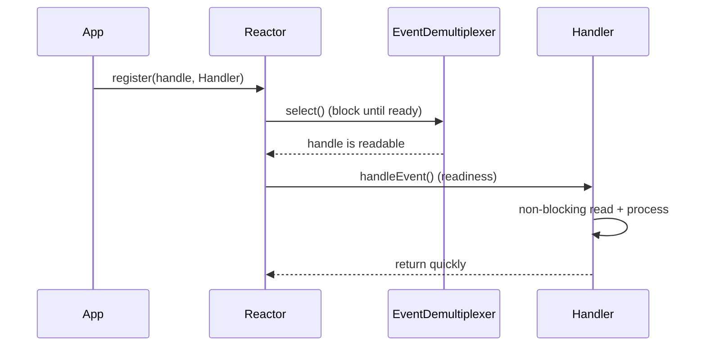
```mermaid
sequenceDiagram
    participant App
    participant Reactor
    participant Demux as EventDemultiplexer
    participant Handler
    App->>Reactor: register(handle, Handler)
    Reactor->>Demux: select() (block until ready)
    Demux-->>Reactor: handle is readable
    Reactor->>Handler: handleEvent()  (readiness)
    Handler->>Handler: non-blocking read + process
    Handler-->>Reactor: return quickly
```

**Concrete example.** Node.js: one event loop watches all sockets/timers; when data arrives,
it fires your `on('data')` callback, which reads and returns fast. Redis serves millions of
ops/sec from essentially one such loop.

**Trade-offs.** *Pros:* massive connection counts on few threads; no per-connection lock
contention (single thread = no data races in handlers); simple mental model. *Cons:* **a single
slow or blocking handler stalls the entire loop** ("don't block the event loop"); does not use
multiple cores by itself (need multiple loops / worker threads for CPU-bound work); callback
style can fragment control flow. *Use when* I/O-bound with many concurrent connections.
*Avoid* CPU-heavy work directly on the loop. **vs Proactor — the single most-probed
distinction:** Reactor is **readiness-based / synchronous** (OS says "ready", *you* perform
the I/O); Proactor is **completion-based / asynchronous** (you start the I/O, OS performs it
and later says "done, here's the data"). **Real-world:** Node.js (libuv), Netty `EventLoop`,
Java NIO `Selector`, Nginx, Redis, Twisted/asyncio.

---

## Proactor

**Problem it solves:** You want maximum I/O concurrency with minimal threads, but you also
don't want your application thread to perform the actual read/write at all — you want the OS
to do the entire I/O operation asynchronously and only involve you when the **result is
ready**. This offloads even the data transfer and readiness-waiting to the kernel.

**Intent / how it works.** The application **initiates** an asynchronous operation (e.g.
`async_read`) and registers a **completion handler**, then continues. The OS's async I/O
subsystem performs the whole operation (including moving the bytes) and, on **completion**,
posts a completion event; a **completion dispatcher** invokes the handler with the finished
result. It is **asynchronous / completion-based**. Mechanism: *OS async I/O + completion
events + registered completion handlers*.

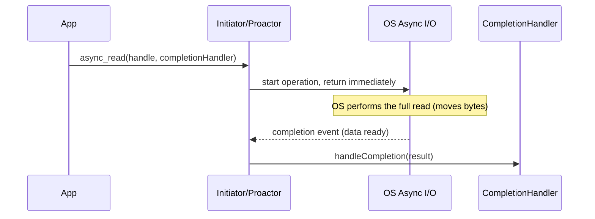
```mermaid
sequenceDiagram
    participant App
    participant Proactor as Initiator/Proactor
    participant OS as OS Async I/O
    participant CH as CompletionHandler
    App->>Proactor: async_read(handle, completionHandler)
    Proactor->>OS: start operation, return immediately
    Note over OS: OS performs the full read (moves bytes)
    OS-->>Proactor: completion event (data ready)
    Proactor->>CH: handleCompletion(result)
```

**Concrete example.** A Windows **IOCP** file server: for each client it issues
`async_read(socket, buffer)` and returns instantly — it does *not* call `recv`. The kernel
fills `buffer` with the bytes off the wire, then posts a completion to the I/O completion port;
a thread calling `GetQueuedCompletionStatus` picks it up and runs the completion handler with
the *already-filled* buffer and a byte count. Contrast the Reactor (Node.js) example above:
there the loop is told "readable" and *your* code calls `read`; here the read is already done
by the time you run. A Boost.Asio echo server is the same shape (`async_read_some` →
handler(bytes)).

**Trade-offs.** *Pros:* highest decoupling and concurrency; the app never blocks and never
waits on readiness; the OS can optimize the transfer. *Cons:* control flow is inverted and
harder to follow/debug; buffer lifetime management is tricky (buffers must stay valid until
completion); depends on OS async-I/O support (Windows **IOCP**, Linux **io_uring**; older
Linux AIO is weak, which is why Reactor dominates there). *Use when* the platform has strong
async I/O and you want to squeeze out readiness-wait overhead. *Avoid when* portability to
readiness-only platforms matters. **vs Reactor:** readiness vs completion — memorize:
*Reactor = "tell me when I can read," Proactor = "read it for me and tell me when done."*
**Real-world:** Windows IOCP, Boost.Asio, .NET async socket APIs, io_uring-based servers.

---

## Event Loop

**Problem it solves:** You want concurrency (many overlapping operations in flight) **without
threads** — no locks, no races, no context-switch overhead, and a simple single-threaded
programming model — while still not blocking on any single operation.

**Intent / how it works.** A single thread runs a loop: pull the next ready event/callback
from a queue, run it **to completion**, then loop. Long operations are broken into
non-blocking steps that register continuations (callbacks/promises) to run on a later tick.
Because only one callback runs at a time, user code needs no locking. It is the runtime that
Reactor-style servers sit on. Mechanism: *one thread + event/callback queue + run-to-completion
dispatch*.

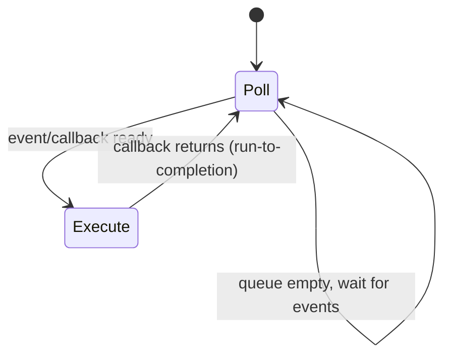
```mermaid
stateDiagram-v2
    [*] --> Poll
    Poll --> Execute : event/callback ready
    Execute --> Poll : callback returns (run-to-completion)
    Poll --> Poll : queue empty, wait for events
```

**Concrete example.** Browser JavaScript: your click handler, `setTimeout` callbacks, and
`fetch().then()` continuations all queue onto one loop. If one handler runs a 5-second loop,
the whole page freezes — the canonical "don't block the loop."

**Trade-offs.** *Pros:* no data races or locks in user code; low memory (no per-task stack);
cheap to have huge numbers of pending operations. *Cons:* strict **"never block the loop"**
discipline — one slow synchronous callback starves everything; a bug in one callback can
stall unrelated work; hard to use multiple cores (need multiple loops or a worker pool).
*Use when* I/O-bound, high-concurrency, and you can keep callbacks short. *Avoid* for
CPU-bound work on the same loop. **vs Thread-per-request:** the loop trades parallelism and
preemption for zero locking and low overhead. **vs virtual threads (Loom) / goroutines:** the
event loop achieves high I/O concurrency by *fragmenting* logic into callbacks; virtual
threads reach comparable concurrency while letting you write *straight-line blocking code*
(the runtime unmounts a blocked virtual thread from its carrier, much as the loop parks an
I/O op). The 2026 trade-off has narrowed to "callback/async syntax vs synchronous syntax" more
than "scalable vs not." **Real-world:** Node.js, browser JS engines, Nginx, Python asyncio,
GUI main/UI threads.

---

## Acceptor-Connector

**Problem it solves:** Network connection **establishment and initialization** (accepting a
socket, doing handshakes, wiring up a service handler) is fiddly and orthogonal to the
**service processing** that runs once a connection exists. Tangling the two makes services
hard to reuse across passive (server) and active (client) connection roles.

**Intent / how it works.** Separate connection setup from use. An **Acceptor** passively
listens and, on an incoming connection, creates and initializes a **service handler**, then
"activates" it. A **Connector** does the same for the active/outgoing side (initiating a
connection, possibly asynchronously, then initializing the handler). Once connected, the
service handler runs independently of how it was connected. Often paired with a Reactor that
notifies the Acceptor of incoming connections. Mechanism: *dedicated connection-establishment
components + a service-handler interface*.

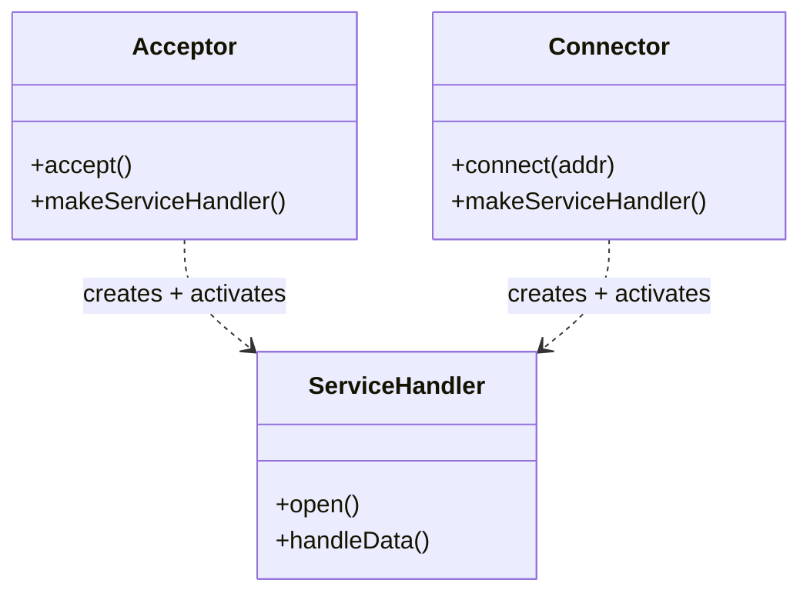
```mermaid
classDiagram
    class Acceptor {
        +accept()
        +makeServiceHandler()
    }
    class Connector {
        +connect(addr)
        +makeServiceHandler()
    }
    class ServiceHandler {
        +open()
        +handleData()
    }
    Acceptor ..> ServiceHandler : creates + activates
    Connector ..> ServiceHandler : creates + activates
```

**Concrete example.** In Netty, a `ServerBootstrap` (the Acceptor role) listens on port 8080;
each accepted connection triggers a `ChannelInitializer` that builds a fresh pipeline (TLS
handler, decoder, your `EchoHandler`) and activates it. The *same* `EchoHandler` class is wired
by a client `Bootstrap` (the Connector role) for outbound connections — the handler code has no
idea whether it was reached by `accept()` or `connect()`, which is exactly the reuse the pattern
buys.

**Trade-offs.** *Pros:* connection logic is written once and reused; service handlers are
independent of connection role/transport; integrates cleanly with Reactor/Proactor. *Cons:*
extra indirection and more classes for simple cases. *Use when* you build networking
frameworks or servers with many service types. *Avoid* for a one-off client. **vs Reactor/
Proactor:** it is a *companion* — Acceptor-Connector handles *setup*, Reactor/Proactor handle
*ongoing I/O dispatch*. **Real-world:** ACE `Acceptor`/`Connector`, Netty's
`ServerBootstrap`/`Bootstrap` and channel initializers.

---

## Future and Promise

**Problem it solves:** A caller kicks off a long operation but doesn't want to block waiting
for the result; it wants an immediate **handle** to a value that will exist *later*, so it can
keep working and retrieve or compose the result when ready — replacing deeply nested
callbacks.

**Intent / how it works.** Calling an async operation returns a **Future** (read side): a
placeholder for a not-yet-available result. The producer holds the **Promise** (write side)
and later fulfills it with a value or an error, which completes the Future. Consumers either
block on `get()`, poll `isDone()`, or (better) attach continuations (`thenApply`,
`.then()`) that run when it completes — enabling non-blocking pipelines. Mechanism: *a
shared, write-once result cell with completion callbacks*.

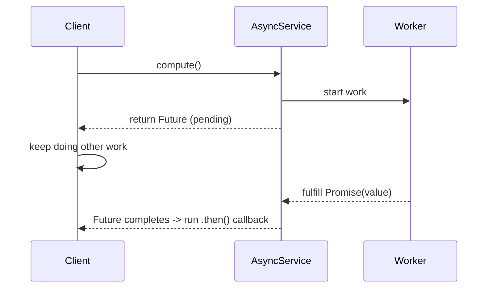
```mermaid
sequenceDiagram
    participant Client
    participant Async as AsyncService
    participant Worker
    Client->>Async: compute()
    Async->>Worker: start work
    Async-->>Client: return Future (pending)
    Client->>Client: keep doing other work
    Worker-->>Async: fulfill Promise(value)
    Async-->>Client: Future completes -> run .then() callback
```

**Concrete example.** `Completable<Order> f = pricing.quoteAsync(cart);` returns instantly;
you attach `f.thenCombine(inventory.checkAsync(cart), ...)` to fan-in two async calls without
blocking a thread.

**Trade-offs.** *Pros:* non-blocking composition, fan-in/fan-out, pipelining; explicit error
channel. *Cons:* calling `.get()` re-introduces blocking (and can deadlock if it blocks the
very pool that must complete it); cancellation and timeout semantics are subtle; unhandled
failures can be swallowed. *Use when* composing async operations. *Avoid* immediately
blocking on the result (that defeats the purpose). **vs Callback:** a Future is a first-class
*value* you can pass/compose/return, whereas raw callbacks invert control and nest into
"callback hell." **vs Active Object:** Active Object is *how* the async work is dispatched; a
Future is *what it hands back*. **Real-world:** Java `CompletableFuture` / `Future`, JavaScript
`Promise`, C++ `std::future`/`std::promise`, Scala `Future`, Guava `ListenableFuture`.

---

## Async Method Invocation

**Problem it solves:** A caller must trigger a potentially slow operation but **must not
block** waiting for it; it needs the call to *return immediately* and be told the result
**later** — via a callback, an event, or a token it can poll. The pain is "how do I start
work and get on with my life, then be notified when it's done?"

**Intent / how it works.** Split a would-be synchronous call into **initiate** and
**complete**. The client calls an async method that returns at once (often with a handle /
token); the operation runs elsewhere (worker thread, thread pool, OS I/O); when it finishes
the result is delivered back through a **callback**, a fired **event**, or by completing a
Future the client polls/awaits. This is the general "invoke now, get the result later"
shape that Future/Promise, callbacks, and event-based async all specialize. Mechanism:
*return immediately + deliver result via callback/event/completion later*.

**Concrete example.** .NET's classic Event-Based Asynchronous Pattern:
`client.DownloadDataAsync(url)` returns instantly and later raises a
`DownloadDataCompleted` event carrying the bytes; a `BackgroundWorker` raises
`RunWorkerCompleted` on the UI thread when its `DoWork` finishes.

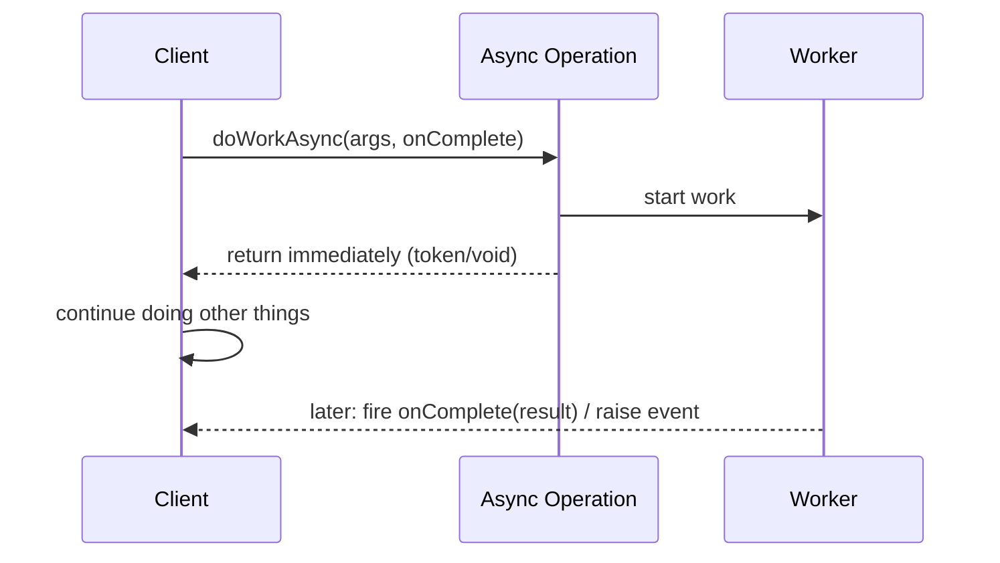
```mermaid
sequenceDiagram
    participant Client
    participant Async as Async Operation
    participant Worker
    Client->>Async: doWorkAsync(args, onComplete)
    Async->>Worker: start work
    Async-->>Client: return immediately (token/void)
    Client->>Client: continue doing other things
    Worker-->>Client: later: fire onComplete(result) / raise event
```

**Trade-offs.** *Pros:* responsiveness — no blocked thread; ideal for UI and I/O.
*Cons:* **inversion of control** fragments logic across the initiator and the completion
handler; error handling and *ordering* of overlapping completions get tricky; without a
result-object it's easy to lose track of which callback belongs to which request (see
Asynchronous Completion Token). *Use when* fire-and-be-notified fits (UI actions, I/O).
*Avoid* when composing many async steps — a raw-callback chain becomes "callback hell";
prefer Futures/Promises. **vs Future/Promise:** Async Method Invocation is
callback/event-*centric* (result is pushed to a handler); Future/Promise is result-*object*
centric (you hold a first-class value you can compose). **vs Active Object:** Active Object
adds a queue + its own servant thread and returns a Future; async invocation is the broader
"return now, notify later" idea with any completion mechanism. **Real-world:** .NET EAP /
`BackgroundWorker`, Node.js error-first callbacks, JavaScript `addEventListener`, POSIX AIO
completion callbacks, `CompletableFuture.thenAccept` as the completion hook.

---

## Asynchronous Completion Token

**Problem it solves:** When you fire off **many** asynchronous operations at once and their
completion events come back **later and out of order**, you must efficiently answer "which
request does *this* completion belong to, and what state/handler goes with it?" — without
an expensive lookup or a fragile global map.

**Intent / how it works.** When initiating an async operation, the client attaches an
application-defined **completion token (ACT)** — often a pointer/handle to the state or
handler for that specific request. The service/OS treats the token opaquely and simply
**returns it verbatim** in the completion event. On completion, the dispatcher uses the
token to immediately locate the originating request's context (O(1)) and invoke the right
handler — no searching. Mechanism: *opaque per-request token carried through the async
round-trip and handed back on completion*.

**Concrete example.** Windows IOCP: each `WSARecv` is issued with an `OVERLAPPED` structure
(extended with a per-connection state pointer). When `GetQueuedCompletionStatus` returns, it
hands back that same pointer as the **completion key** / overlapped pointer, so the server
instantly knows which connection and buffer the completed read belongs to.

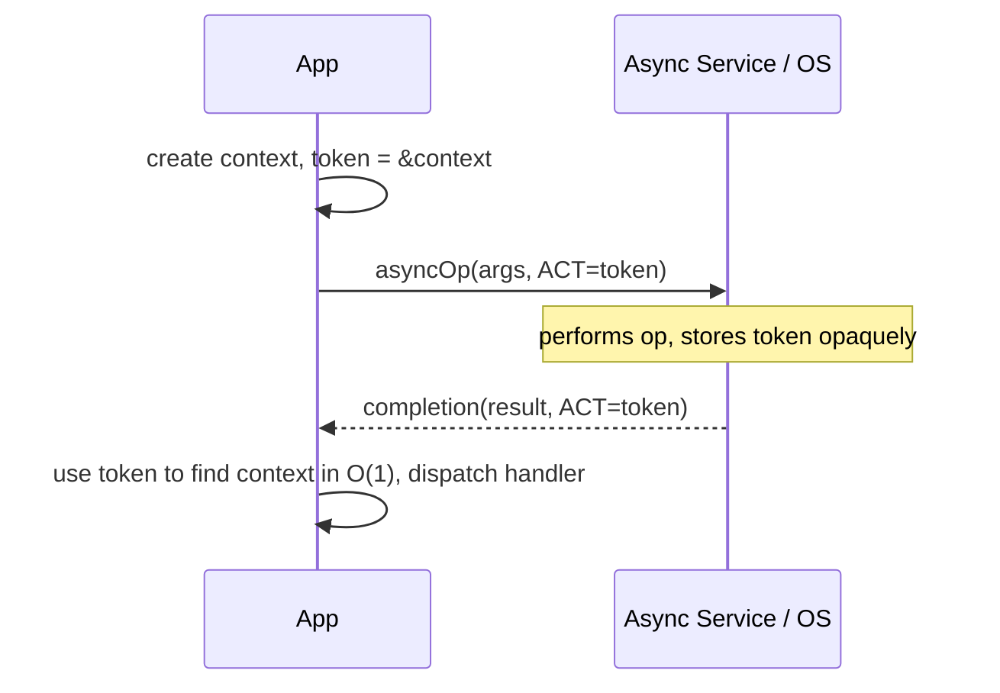
```mermaid
sequenceDiagram
    participant App
    participant Svc as Async Service / OS
    App->>App: create context, token = &context
    App->>Svc: asyncOp(args, ACT=token)
    Note over Svc: performs op, stores token opaquely
    Svc-->>App: completion(result, ACT=token)
    App->>App: use token to find context in O(1), dispatch handler
```

**Trade-offs.** *Pros:* demultiplexes async responses to their handlers with **no lookup
cost** and no big correlation map; keeps per-request state cleanly associated. *Cons:*
**dangling/stale tokens** are dangerous — if the context is freed before completion the
token becomes a use-after-free or misrouted dispatch; requires disciplined lifetime
management; a raw pointer token can be a security/robustness hazard if it can be forged.
*Use when* you juggle many concurrent async ops with distinct per-request state (high-perf
I/O servers). *Avoid* the raw-pointer form across trust or process boundaries. **vs
correlation ID:** an ACT is an **in-process** handle for routing a completion to its
handler/state; a distributed **correlation ID** is a value threaded through logs/messages
across services for tracing — same idea, different scale and safety model. **Real-world:**
Windows IOCP completion keys / `OVERLAPPED`, Boost.Asio handler binding, epoll `data.ptr`,
libuv request `data` field, callback "context" / "user_data" pointers.

---

## Producer-Consumer and Bounded Buffer

**Problem it solves:** Producers and consumers run at different, fluctuating rates and you
don't want them tightly coupled or one overwhelming the other. You need to **decouple them
in time** through a shared buffer, and — critically — apply **back-pressure** so a fast
producer can't exhaust memory when the consumer falls behind.

**Intent / how it works.** A shared **bounded** queue sits between producers and consumers.
Producers `put()` items (blocking while the buffer is **full**); consumers `take()` items
(blocking while **empty**). The bound is what turns the buffer into a flow-control device:
blocking a producer *is* back-pressure. Mechanism: *a bounded queue + condition-based blocking
on full/empty* (often implemented as a Monitor Object).

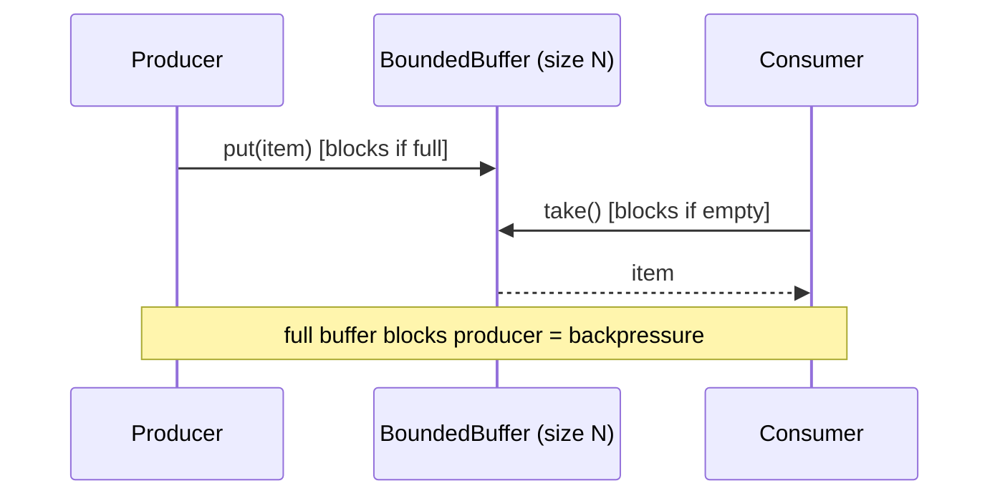
```mermaid
sequenceDiagram
    participant P as Producer
    participant B as BoundedBuffer (size N)
    participant C as Consumer
    P->>B: put(item)  [blocks if full]
    C->>B: take()     [blocks if empty]
    B-->>C: item
    Note over P,C: full buffer blocks producer = backpressure
```

**Trade-offs.** *Pros:* clean decoupling; smooths bursts; the bound provides natural
back-pressure and bounds memory. *Cons:* choosing the bound is a real trade-off — **unbounded
→ OOM under overload**, too small → throughput loss and idle consumers; hand-rolled versions
are a classic source of lost-wakeup and race bugs (use a library). *Use when* handing work
between threads/stages at different rates. *Avoid* unbounded queues in production paths.
**vs Reactive backpressure:** here the producer is *blocked* (push model with blocking);
reactive streams use a *pull/demand* model where the consumer signals `request(n)` and the
producer never blocks a thread. **Real-world:** Java `BlockingQueue`
(`ArrayBlockingQueue`/`LinkedBlockingQueue`), the LMAX **Disruptor** (ring buffer), Kafka
consumer/producer buffering, Go channels.

---

## Reactive Streams Backpressure

**Problem it solves:** In an asynchronous push pipeline, a fast **producer** can overwhelm a
slow **consumer**, causing unbounded buffering (OOM) or dropped data. Blocking the producer
thread (as bounded buffers do) is impossible or wasteful when there is no dedicated thread to
block. You need the consumer to **govern the flow non-blockingly**.

**Intent / how it works.** Invert control of *demand*: the consumer (Subscriber) tells the
producer (Publisher) how much it can accept via `request(n)`. The producer emits **at most n**
`onNext` items and then waits for more demand — it never pushes faster than requested and
never blocks a thread. Terminal signals `onComplete`/`onError` end the stream; the Subscription
allows `cancel()`. Mechanism: *asynchronous demand signalling (pull-push hybrid), not thread
blocking*.

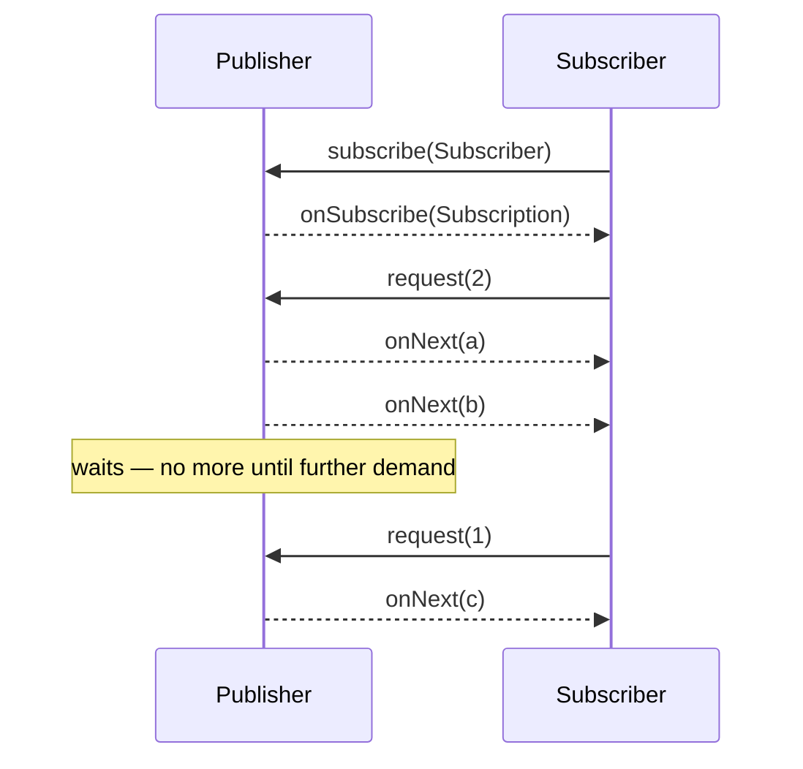
```mermaid
sequenceDiagram
    participant Pub as Publisher
    participant Sub as Subscriber
    Sub->>Pub: subscribe(Subscriber)
    Pub-->>Sub: onSubscribe(Subscription)
    Sub->>Pub: request(2)
    Pub-->>Sub: onNext(a)
    Pub-->>Sub: onNext(b)
    Note over Pub: waits — no more until further demand
    Sub->>Pub: request(1)
    Pub-->>Sub: onNext(c)
```

**Trade-offs.** *Pros:* bounded memory and stability under load without dedicating a blocked
thread per stream; composable operators; works across async boundaries and networks. *Cons:*
protocol complexity and demand bookkeeping; **overflow strategies** (buffer/drop/latest) can
silently *lose data* if misused; harder to reason about and debug than imperative loops.
*Use when* async streaming with rate mismatch (event streams, network pipelines). *Avoid* for
simple in-process handoff where a `BlockingQueue` is clearer. **vs bounded-buffer blocking:**
demand-signalling (non-blocking, pull) vs thread-blocking (push). **vs naive rate-limiting:**
rate limiting caps a *fixed* rate regardless of consumer state; backpressure adapts to the
consumer's *actual* readiness. See also `resilience-tradeoffs-deep-dive#backpressure-and-flow-control`.
**Real-world:** the Reactive Streams spec / `java.util.concurrent.Flow`, Project Reactor,
RxJava, Akka Streams, gRPC flow control, TCP's own windowing.

---

## Publish-Subscribe

**Problem it solves:** An event emitter shouldn't have to know *who* cares about its
events, how many listeners there are, or wire itself to each one. Direct calls couple the
emitter to every handler; you want **many-to-many, fire-and-forget** notification where
publishers and subscribers are decoupled and can come and go independently.

**Intent / how it works.** Introduce an intermediary — an **event bus / aggregator /
topic** — between publishers and subscribers. Publishers `publish(event)` to the bus (or a
topic); subscribers `subscribe(type/topic, handler)`. The bus **fans out** each event to
all matching subscribers. Publishers and subscribers reference only the bus, never each
other. This is the *in-process* observer-of-events (an **Event Aggregator**, in Fowler's
terms, consolidates many sources behind one subscription point). Mechanism: *broker/topic
registry + fan-out dispatch; publishers and subscribers mutually anonymous*.

**Concrete example.** A desktop app: saving a document publishes a `DocumentSaved` event;
the title bar, the recent-files list, and the autosave indicator each subscribed and update
themselves — the save code knows about none of them. Adding a fourth listener touches only
the new listener.

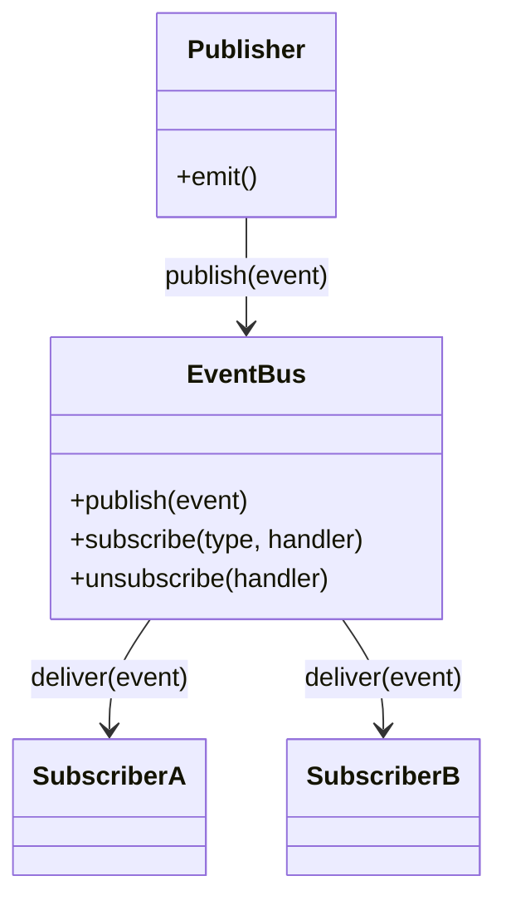
```mermaid
classDiagram
    class EventBus {
        +publish(event)
        +subscribe(type, handler)
        +unsubscribe(handler)
    }
    class Publisher {
        +emit()
    }
    class SubscriberA
    class SubscriberB
    Publisher --> EventBus : publish(event)
    EventBus --> SubscriberA : deliver(event)
    EventBus --> SubscriberB : deliver(event)
```

**Trade-offs.** *Pros:* loose coupling, easy fan-out, add/remove subscribers without
touching publishers; supports async delivery. *Cons:* **hidden control flow** — hard to see
who reacts to what (debugging "who handled this?" is painful); delivery/ordering guarantees
are often unclear; **lifecycle leaks** — a subscriber that forgets to unsubscribe is kept
alive by the bus (the "lapsed listener" leak); error in one handler can affect others.
*Use when* many independent components react to domain events in-process (GUI events,
decoupled modules). *Avoid* when the flow is simple 1-to-1 (a direct call is clearer) or you
need strong ordering/delivery guarantees. **vs GoF Observer:** Observer wires the subject
*directly* to its observers (subject holds the list) and is usually synchronous; Pub-Sub
inserts a **broker** so publishers/subscribers never reference each other, and often
delivers asynchronously. **vs Producer-Consumer:** Pub-Sub **broadcasts** each event to
*all* subscribers; Producer-Consumer delivers each item to **exactly one** consumer.
> [!TIP]
> Keep the **distributed** message-broker treatment (Kafka/RabbitMQ topics, delivery
> guarantees, exactly-once) in `dp-distributed-cloud`, `message-queues-and-async`, and
> `event-driven-cqrs-saga-cdc`; this section is the in-process event-bus pattern.

**Real-world:** Guava `EventBus`, RxJava `Subject`, Node.js `EventEmitter`, Spring
`ApplicationEvent`, GUI event buses, the Event Aggregator in MVVM frameworks.

---

## Scheduler

**Problem it solves:** Many tasks are ready to run, but the *order and timing* matters —
some are higher priority, some must run at a fixed time or interval, some must not starve.
A plain queue (FIFO) or a plain thread pool decides *who* runs but not *when* or *in what
order* per a policy. You need explicit control over **execution ordering and timing**.

**Intent / how it works.** A Scheduler accepts tasks plus scheduling metadata (priority,
delay, period, deadline) and decides which ready task runs next according to a **policy**
(priority, fairness/round-robin, earliest-deadline-first, rate). It typically drives an
underlying executor/thread pool. In reactive libraries, a "scheduler" also chooses *which
thread/pool* work runs on. Mechanism: *a policy over a ready-set (often a priority queue or
timer wheel) that selects the next task*.

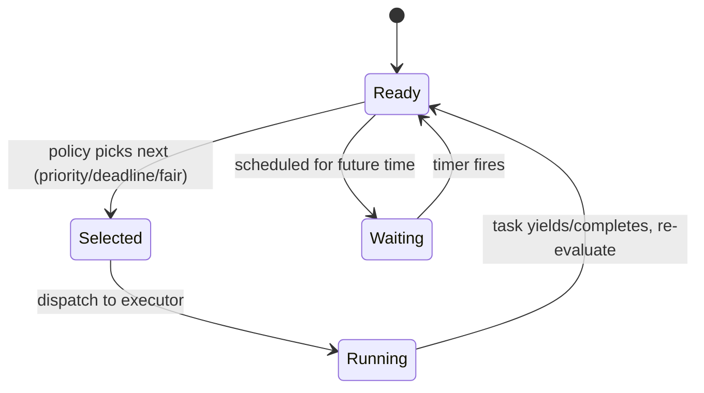
```mermaid
stateDiagram-v2
    [*] --> Ready
    Ready --> Selected : policy picks next (priority/deadline/fair)
    Selected --> Running : dispatch to executor
    Running --> Ready : task yields/completes, re-evaluate
    Ready --> Waiting : scheduled for future time
    Waiting --> Ready : timer fires
```

**Concrete example.** `ScheduledExecutorService.scheduleAtFixedRate(healthCheck, 0, 5, SECONDS)`
runs a health check every 5s; a priority scheduler runs the payment task before the
analytics task when both are ready.

**Trade-offs.** *Pros:* enforces QoS/ordering, prevents starvation (with fair policies),
supports delayed/periodic work. *Cons:* the scheduler itself is a coordination point and
potential bottleneck; policies need tuning; priority schemes can *cause* starvation or
**priority inversion** if naive. *Use when* order/timing/QoS matters. *Avoid* over-engineering
when FIFO suffices. **vs Thread Pool:** the pool decides *who* (which worker) executes; the
scheduler decides *when and in what order*. They compose — a scheduler feeds a pool.
**Real-world:** cron, `ScheduledExecutorService`/`Timer`, Quartz, RxJava/Reactor `Schedulers`,
OS process schedulers (CFS), Kubernetes scheduler.

---

## Memory visibility and happens-before

**Intuition first.** You'd think that once thread A writes `x = 42`, thread B reading `x`
sees 42. On a modern multicore CPU with per-core caches, compiler reordering, and store
buffers, **that is not guaranteed** — B may see a stale value, or see writes in a different
order than A issued them, *unless the two threads are connected by a synchronization edge*.
Concurrency isn't only about mutual exclusion (one-at-a-time); it's equally about
**visibility** (does my write become visible to you) and **ordering** (in what order do you
see my writes). Locks give you *both*; that's why a lock is more than a "one at a time" gate.

**The one rule to carry: happens-before.** A write in thread A is guaranteed visible to a
read in thread B **only if there is a happens-before edge from the write to the read.** The
edges the Java Memory Model (and most others) give you are:

- **Unlock → lock** on the same monitor: everything A did before releasing the lock is
  visible to B after B acquires it.
- **`volatile` write → `volatile` read** of the same field: a `volatile` write publishes all
  prior writes to any thread that later reads that field.
- **Thread `start()` → the started thread**, and **a thread's actions → another thread's
  `join()`** on it.
- **`final`-field safe publication:** once a constructor finishes, other threads that receive
  the reference *through a data race–free path* see the correctly-initialized `final` fields.

If no such edge exists, the writes are a **data race** and the outcome is undefined — a bug
that passes tests on one CPU and corrupts state on another. Three sections below rest on this:
**Lock and Mutex** (the unlock→lock edge gives visibility, not just exclusion),
**Double-Checked Locking** (`volatile` supplies the edge that stops a reader seeing a
half-constructed object), and **Immutable Object** (`final`-field safe publication is *why*
you can share an immutable freely with no locks).

**Watch out:** "it works on my machine" is worthless for visibility bugs. A missing
happens-before edge often appears correct on strongly-ordered x86 and only breaks on
weakly-ordered ARM/POWER or after the JIT reorders. Reason about the *edges*, not about
observed behavior.

---

## Lock and Mutex

**Problem it solves:** Two or more threads read and write the same mutable data
concurrently, producing **data races** and corrupted state (lost updates, torn reads). You
need to make a section of code a **critical section** that only one thread (or, for a
semaphore, at most N) can execute at a time.

**Intent / how it works.** A **mutex** (mutual-exclusion lock) is acquired before entering a
critical section and released after; a second thread that tries to acquire it blocks until
the holder releases. Beyond exclusion, acquiring/releasing establishes a **happens-before**
edge (see *Memory visibility and happens-before* above) so writes made under the lock are
*visible* to the next holder (memory visibility, not just mutual exclusion). A **semaphore** generalizes this to N permits (allow up to N threads),
useful for bounding a resource pool. Mechanism: *atomic acquire/release with a wait set +
memory barrier*.

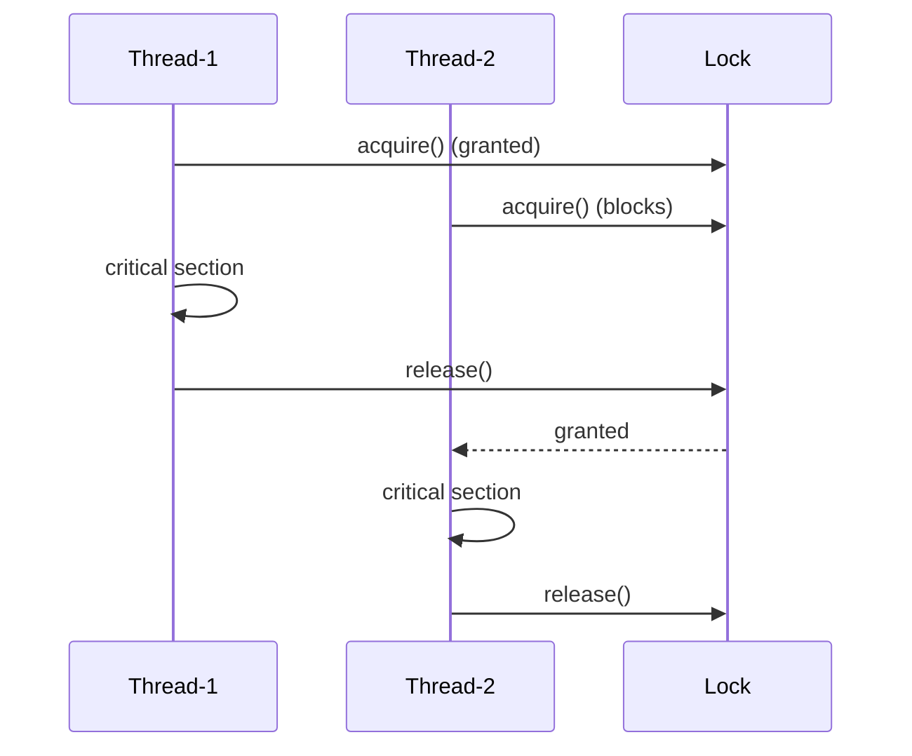
```mermaid
sequenceDiagram
    participant T1 as Thread-1
    participant T2 as Thread-2
    participant L as Lock
    T1->>L: acquire() (granted)
    T2->>L: acquire() (blocks)
    T1->>T1: critical section
    T1->>L: release()
    L-->>T2: granted
    T2->>T2: critical section
    T2->>L: release()
```

**Trade-offs.** *Pros:* correctness for shared mutable state; simple; also fixes visibility.
*Cons:* **contention** serializes threads (Amdahl's law limits speedup); **deadlock** if
locks are acquired in inconsistent order (violates one of the four Coffman conditions);
**priority inversion**; forgetting to release (use Scoped Locking). *Use when* you must mutate
shared state and can't avoid sharing. *Avoid* holding locks across I/O or callbacks; prefer
no-sharing patterns when possible. **vs Monitor Object:** a Monitor bundles the lock +
condition variables *into an object's methods*; a bare lock is a free-standing primitive.
**vs Semaphore:** a mutex = 1 permit with ownership (only the holder releases); a semaphore =
N permits with no ownership (any thread may release). **vs CAS/lock-free:** locks are
*pessimistic* (assume conflict, block); CAS is *optimistic* (assume no conflict, retry).
**Real-world:** `ReentrantLock`, `synchronized`, `Semaphore`, `pthread_mutex`,
`std::mutex`.

---

## Read-Write Lock

**Problem it solves:** Data is read far more often than written. A plain mutex serializes
*readers* against each other needlessly — two threads that only read can't corrupt anything,
yet they block each other. You want **many concurrent readers OR one exclusive writer**.

**Intent / how it works.** The lock has two modes: a **read (shared) lock** many threads can
hold simultaneously, and a **write (exclusive) lock** only one thread can hold and only when
no readers hold it. Readers block only when a writer is active/pending; writers wait for all
readers to drain. A policy decides reader-vs-writer preference. Mechanism: *shared/exclusive
mode counting with condition-based waiting*.

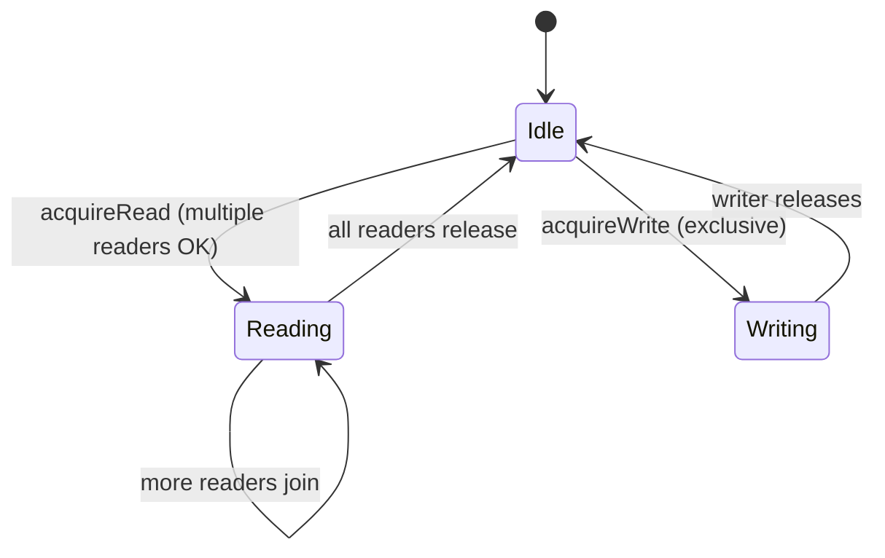
```mermaid
stateDiagram-v2
    [*] --> Idle
    Idle --> Reading : acquireRead (multiple readers OK)
    Reading --> Reading : more readers join
    Reading --> Idle : all readers release
    Idle --> Writing : acquireWrite (exclusive)
    Writing --> Idle : writer releases
```

**Concrete example.** An in-memory config/routing table read on every request but updated
rarely: readers share the read lock; a config reload takes the write lock briefly.

**Trade-offs.** *Pros:* big throughput win for read-heavy, low-write workloads. *Cons:*
higher overhead than a plain lock (must track reader count), so it *loses* if writes are
frequent or the critical section is tiny; **writer starvation** under continuous reads (unless
write-preferring); **upgrade deadlock** if two readers both try to upgrade to write. *Use when*
reads dominate and read sections are non-trivial. *Avoid* for write-heavy or ultra-short
critical sections (plain lock or atomics win). **vs plain Mutex:** RW-lock adds read
concurrency at the cost of overhead. **vs Copy-on-Write:** an RW-lock still *blocks* readers
while a write holds the lock; COW readers are *never* blocked (they read an immutable
snapshot) but every write copies. **Real-world:** `ReentrantReadWriteLock`, `StampedLock`
(optimistic read mode), `pthread_rwlock`.

---

## Double-Checked Locking

**Problem it solves:** Lazy initialization of a shared, expensive-to-create object needs to
be thread-safe, but taking a lock on *every* access — even after it's already initialized —
is wasteful. You want to **lock only on the first (initialization) access** and go lock-free
on the common already-initialized path.

**Intent / how it works.** Check the field **without** the lock; if it's null, acquire the
lock and **check again** (another thread may have initialized it while you waited), then
initialize. The second check under the lock prevents double-initialization; the first check
avoids locking once initialized. **Crucially**, the field must be `volatile` (or use a memory
barrier) — otherwise instruction reordering can publish a *non-null but not-fully-constructed*
reference to a racing reader (the `volatile` write→read edge from *Memory visibility and
happens-before* above is exactly what prevents this). Mechanism: *unlocked read fast-path +
locked re-check + `volatile` for safe publication*.

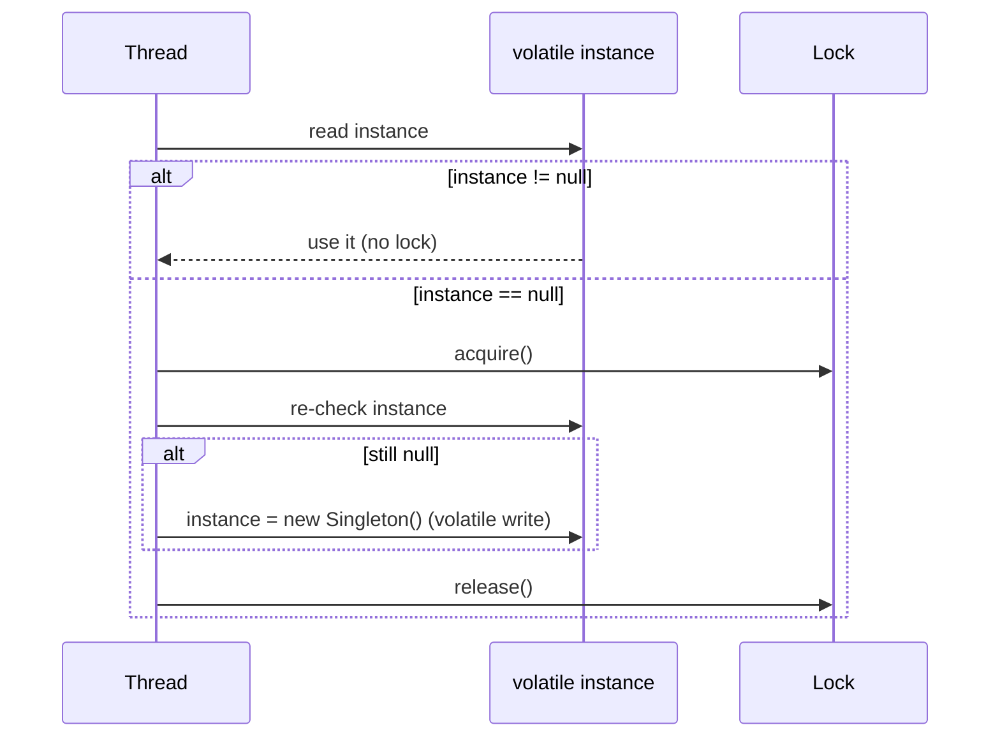
```mermaid
sequenceDiagram
    participant T as Thread
    participant F as volatile instance
    participant L as Lock
    T->>F: read instance
    alt instance != null
        F-->>T: use it (no lock)
    else instance == null
        T->>L: acquire()
        T->>F: re-check instance
        alt still null
            T->>F: instance = new Singleton() (volatile write)
        end
        T->>L: release()
    end
```

**Trade-offs.** *Pros:* cheap lazy init — locking cost paid only once. *Cons:* **notoriously
broken without `volatile`/memory barrier** — the canonical memory-visibility bug (the "DCL is
broken" era before Java 5's fixed memory model); subtle and easy to get wrong. *Use when* you
genuinely need lazy, thread-safe init on a hot path *and* use a `volatile` field. *Avoid* when
simpler options work. **vs Initialization-on-demand holder idiom:** a static nested holder
class leverages the JVM's guaranteed lazy, thread-safe class initialization — simpler and
correct with no `volatile` and no explicit locking (usually preferred). **vs eager init:**
eager is trivial and safe if creation is cheap or always needed. **Real-world:** lazy
singletons; `volatile` double-checked fields in caches; historically discussed in the
"Double-Checked Locking is Broken" declaration.

---

## Guarded Suspension

**Problem it solves:** A method can only run when the object is in a suitable state (e.g.
"take from a queue" only when it's non-empty), but the precondition isn't met *yet*. Instead
of failing or busy-waiting (spinning burns CPU), you want the caller to **suspend efficiently
until the precondition becomes true**.

**Intent / how it works.** Guard the method with a **predicate loop**: while the guard
condition is false, `wait()` on a condition variable (releasing the lock and sleeping). When
another thread changes state so the guard may now hold, it `signal`s/`notify`s the waiter,
which **re-checks the predicate in a `while` loop** (not `if`) before proceeding — protecting
against spurious wakeups and stale conditions. Mechanism: *condition variable + predicate
re-check in a `while` loop*.

```mermaid
sequenceDiagram
    participant C as Consumer
    participant O as GuardedObject
    participant P as Producer
    C->>O: take()
    loop while queue empty
        O->>O: notEmpty.wait() (release lock, sleep)
    end
    P->>O: put(item) then notEmpty.signal()
    O-->>C: return item
```

**Trade-offs.** *Pros:* clean blocking coordination without busy-waiting; efficient (thread
sleeps). *Cons:* **lost-wakeup / missed-signal** bugs if you signal before the waiter waits or
use `if` instead of `while`; deadlock if the signaling path can't run; couples caller latency
to producer behavior. *Use when* a call should *wait* for a state it needs. *Avoid* when the
caller must not block (then use Balking or a Future). **vs Balking — the canonical pairing:**
Guarded Suspension **waits** until the state is right; Balking **returns immediately** (does
nothing) if the state is wrong. **Real-world:** `wait()`/`notify()` and
`Condition.await()`/`signal()`, blocking queues, `CountDownLatch.await()`.

---

## Balking

**Problem it solves:** An action only makes sense in a particular state, and if the object is
in the *wrong* state you'd rather **abandon the call immediately** than wait — because waiting
is pointless or the operation is a one-shot (e.g. calling `start()` twice, or `save()` when
nothing changed). You want a fast no-op / early return instead of blocking.

**Intent / how it works.** On entry, check the guard under the lock; if the object isn't in a
state where the action applies, **return immediately** (do nothing, or return a status/throw)
— it "balks." Otherwise proceed. It's the non-blocking sibling of Guarded Suspension.
Mechanism: *guard check + immediate return on failure*.

```mermaid
stateDiagram-v2
    [*] --> Idle
    Idle --> Running : start() when Idle -> proceed
    Running --> Running : start() again -> balk (return, no-op)
    Running --> Idle : stop()
```

**Concrete example.** `start()` on a service: if already `RUNNING`, return immediately rather
than starting a second time. A `saveIfDirty()` that returns at once when the `dirty` flag is
false.

**Trade-offs.** *Pros:* no blocking; makes idempotent one-shot operations trivial; avoids
redundant work. *Cons:* **silent no-ops can hide bugs** — callers may assume the action
happened; needs clear return signaling of "did nothing." *Use when* repeating the action is
meaningless or unsafe and waiting is pointless (init/close/start guards). *Avoid* when the
caller genuinely needs the action to eventually happen (then Guarded Suspension). **vs Guarded
Suspension:** bail-out vs wait — the classic contrast. **Real-world:** idempotent
`init()`/`close()`/`start()` guards, `AtomicBoolean` compareAndSet-based one-shot flags,
debounced UI actions.

---

## Barrier

**Problem it solves:** A parallel computation runs in **phases**: all worker threads must
finish phase 1 before *any* starts phase 2 (e.g. iterative simulations, map then reduce). You
need a rendezvous point where threads **wait for each other** and are released together.

**Intent / how it works.** A barrier is created for N parties. Each thread does its work and
then calls `await()`; the barrier counts arrivals, and when the Nth thread arrives, **all**
waiting threads are released simultaneously (optionally running a barrier action first). A
**cyclic** barrier resets for the next phase. Mechanism: *shared arrival counter + condition
variable; release-all on reaching the count*.

```mermaid
sequenceDiagram
    participant A as Worker A
    participant B as Worker B
    participant Bar as Barrier(N=2)
    A->>Bar: await() (1 of 2, waits)
    B->>Bar: await() (2 of 2 -> trip!)
    Bar-->>A: released
    Bar-->>B: released
    Note over A,B: both proceed to next phase together
```

**Trade-offs.** *Pros:* clean phase synchronization for data-parallel work. *Cons:* the
**slowest party gates everyone** (stragglers dominate); if one party dies or the count is
wrong, everyone **deadlocks/breaks**; poor for irregular workloads. *Use when* fixed-size
groups must synchronize per phase. *Avoid* when parties are dynamic or work is unbalanced.
**vs CountDownLatch:** a `CountDownLatch` is **one-shot** (counts down to zero once; waiters
and counters are usually different threads) and cannot be reused; a barrier is **cyclic/
reusable** and the *same* threads both arrive and wait. **vs Guarded Suspension:** a barrier
is a *group* rendezvous, not a single-predicate wait. **Real-world:** `CyclicBarrier`,
`CountDownLatch`, `Phaser`, MPI `barrier`, fork/join phase boundaries.

---

## Scoped Locking

**Problem it solves:** Manually pairing `lock()` and `unlock()` is error-prone: an early
`return`, a thrown exception, or a `break` between them **leaks the lock** (never released) →
deadlock. You want the lock to be released **automatically** whenever control leaves the
scope, on every path.

**Intent / how it works.** Bind the lock's lifetime to a **block scope**: acquire the lock in
a guard object's constructor (or at block entry) and release it in its destructor / `finally`
(at block exit). Because scope exit is guaranteed by the language — including during exception
unwinding — the lock is always released. This is the RAII (Resource Acquisition Is
Initialization) idiom applied to locks. Mechanism: *tie acquire/release to construction/
destruction or try/finally*.

```mermaid
sequenceDiagram
    participant T as Thread
    participant G as Guard (scope)
    participant L as Lock
    T->>G: enter scope -> construct guard
    G->>L: acquire()
    T->>T: critical section (may return/throw)
    T->>G: leave scope (normal or exception)
    G->>L: release() (guaranteed)
```

**Trade-offs.** *Pros:* leak-proof unlocking, exception-safe, less boilerplate. *Cons:* the
lock is held for the **whole scope**, which can over-hold if the block does more than the
critical section — you may need to shrink the scope. *Use when* acquiring any lock (essentially
always). *Avoid* wrapping too-large a scope. **vs manual lock/unlock:** eliminates the
leak-on-exception bug that plagues manual pairing. **Real-world:** C++ `std::lock_guard` /
`std::unique_lock` / `std::scoped_lock`, Java `try/finally` around `lock()/unlock()` and
try-with-resources, Python `with lock:`.

---

## Strategized Locking

**Problem it solves:** A reusable component needs to work in **both** single-threaded and
multi-threaded contexts, or with **different lock types** (mutex, read-write, spinlock,
recursive), but you don't want to fork the code or hard-wire one synchronization mechanism
into it. You want the locking policy to be **pluggable/configurable**.

**Intent / how it works.** Parameterize the component by a **lock strategy** (via a template
parameter, generic type, or an injected `Lock` interface). The component's code uses the
abstract lock; a client picks the concrete strategy — including a **null lock** (no-op) for
single-threaded use, so the same class incurs zero locking overhead when it isn't needed.
This is the GoF **Strategy** pattern applied to synchronization. Mechanism: *dependency-inject
the lock behind an interface / template parameter*.

```mermaid
classDiagram
    class Component~LockStrategy~ {
        -lock : LockStrategy
        +operation()
    }
    class LockStrategy {
        <<interface>>
        +acquire()
        +release()
    }
    class MutexLock
    class ReadWriteLock
    class NullLock
    LockStrategy <|.. MutexLock
    LockStrategy <|.. ReadWriteLock
    LockStrategy <|.. NullLock
    Component --> LockStrategy
```

**Trade-offs.** *Pros:* one component reused across concurrency contexts; no locking cost when
a null lock is chosen; policy changes without touching component logic. *Cons:* extra
indirection; with C++ templates it complicates types and error messages; the caller must
choose correctly (wrong = races or over-locking). *Use when* building library/framework
components used in varied threading contexts. *Avoid* for app-specific code with a fixed
threading model. **vs GoF Strategy:** it *is* Strategy, specialized to locking. **Real-world:**
ACE synchronization traits, C++ policy-based container designs, injectable `Lock`
abstractions.

---

## Thread-Safe Interface

**Problem it solves:** When every public method of a thread-safe object locks, an **internal
call** from one public method to another tries to re-acquire the same lock. Without care this
causes **self-deadlock** (non-reentrant locks) or, even with reentrant locks, redundant
locking overhead. You want to lock **once at the boundary**, not on every internal hop.

**Intent / how it works.** Split each operation into a **public** method and a private
**implementation** method. Public methods acquire the lock, then delegate to the unlocked
private `..._i()` method that does the real work. Internal calls between operations go
directly to the private (already-locked) methods and never re-acquire the lock. This creates
a single, clear locking boundary. Mechanism: *locked public shell + unlocked private core; all
internal self-calls use the core*.

```mermaid
classDiagram
    class Component {
        +put(x)  «locks, calls put_i»
        +get()   «locks, calls get_i»
        -put_i(x) «no lock»
        -get_i()  «no lock»
        -resize_i() «no lock, called by put_i»
    }
    note for Component "Public methods acquire lock then call *_i().\nPrivate *_i() methods never lock and may\ncall each other safely."
```

**Trade-offs.** *Pros:* prevents recursive-lock self-deadlock and redundant re-locking;
locking policy is explicit and lives in one layer. *Cons:* roughly **doubles the method
count** (public + private pairs); a discipline everyone must follow (a private method that
locks re-introduces the bug). *Use when* designing thread-safe classes whose operations call
each other. *Avoid* for trivial classes with no internal self-calls. **vs "lock in every
method" (naive):** avoids nested self-locking and redundant acquisition. **Real-world:**
Schmidt's reentrant-safe class design, careful thread-safe collection implementations.

---

## Immutable Object

**Problem it solves:** Sharing mutable objects across threads forces synchronization
everywhere and invites races. You want objects you can **share freely across any number of
threads with zero synchronization**, because there is nothing to synchronize — the state
never changes after construction.

**Intent / how it works.** Make all fields final/read-only, set them fully in the constructor,
expose no mutators, and defensively copy any mutable inputs/outputs so no reference escapes.
Because the object's observable state never changes after **safe publication** (the
`final`-field edge from *Memory visibility and happens-before* above guarantees other threads
see the fully-initialized fields), every thread sees the same value with no locks —
immutability *is* thread-safety. "Changing" it means
creating a *new* object. Mechanism: *no post-construction writes → no shared mutable state →
no synchronization needed*.

```mermaid
classDiagram
    class Money {
        -amount : long  «final»
        -currency : String  «final»
        +Money(amount, currency)
        +plus(Money) Money
        +getAmount() long
    }
    note for Money "No setters. plus() returns a NEW Money.\nAll fields final and set in constructor -> shareable\nacross threads with no locks."
```

**Trade-offs.** *Pros:* inherently thread-safe, freely shareable and cacheable, no locking,
easy to reason about, great as map keys / value objects. *Cons:* **object churn** — every
"modification" allocates a new object (GC pressure for hot update paths); achieving **deep**
immutability requires care (defensive copies of nested mutables). *Use when* values are shared
across threads or used as keys, and updates are infrequent. *Avoid* for large objects mutated
in tight loops (allocation cost). **vs Copy-on-Write:** COW presents a *mutable* facade backed
by immutable snapshots — it copies only on write and supports in-place-looking updates;
Immutable objects never change at all. **Real-world:** Java `String`, `Integer`, `record`,
`LocalDate`; Guava/Kotlin immutable collections; Scala/Clojure value types; persistent data
structures.

---

## Copy-on-Write

**Problem it solves:** Data is read constantly by many threads but written **rarely**, and you
want reads to be **completely lock-free and consistent** (each reader sees a stable snapshot),
without the reader-blocking overhead of a read-write lock during writes.

**Intent / how it works.** Readers access the current shared version with **no lock**. A
writer does **not** mutate in place: it takes a lock, **copies** the whole structure, applies
the change to the copy, then atomically swaps the reference to the new version. Readers that
already hold a reference keep reading the old (immutable) snapshot; new readers see the new
one. Mechanism: *immutable snapshots + atomic reference swap on write; writers copy, readers
never lock*.

```mermaid
stateDiagram-v2
    [*] --> V1 : readers read V1 (no lock)
    V1 --> Copying : writer copies V1 -> V2, mutates V2
    Copying --> V2 : atomic swap reference to V2
    V2 --> V2 : new readers see V2; old readers still see V1
```

**Concrete example.** A `CopyOnWriteArrayList` routing table read on every request. Reads
happen thousands of times/sec with **zero** locking. A config reload adds one route: the writer
copies the 200-entry array to a new 201-entry array, sets the new entry, and atomically swaps
the field. A request that grabbed the old 200-entry reference mid-reload keeps iterating it
safely (no `ConcurrentModificationException`); the next request sees all 201. The whole
200-element copy is the price of that one write.

**Trade-offs.** *Pros:* zero-lock, contention-free reads; readers get a consistent snapshot;
iterators never throw concurrent-modification errors. *Cons:* **every write copies the entire
structure** — O(n) per write, terrible for write-heavy or large collections; extra memory
during copy; readers may act on a slightly **stale** snapshot. *Use when* reads vastly
outnumber writes and the structure is small-to-moderate (listener lists, config, routing
tables). *Avoid* for write-heavy or huge structures. **vs Read-Write Lock:** an RW-lock
*blocks* readers while a writer holds the lock (no copy); COW *never* blocks readers but copies
on every write — trade reader-blocking for write-cost. **vs Immutable Object:** COW is the
mutable-facade built *from* immutable snapshots. **Real-world:** `CopyOnWriteArrayList`/
`CopyOnWriteArraySet`, OS `fork()` COW pages, Git object model, persistent/functional data
structures.

---

## Thread-Specific Storage

**Problem it solves:** Some state is logically "global" to a piece of work but must not be
**shared** between threads (e.g. a per-request user context, a non-thread-safe formatter, a
transaction handle). Passing it through every method signature is intrusive; a real global
would need locking and cause contention. You want each thread to have its **own private copy**
accessed through a common name.

**Intent / how it works.** Provide a key whose `get()` returns a **per-thread** value: the
runtime keeps a separate slot per thread, so each thread transparently sees its own instance
with no sharing and thus no locking. The value looks global in code but is thread-local in
storage. Mechanism: *a per-thread slot keyed by thread identity (no sharing → no
synchronization)*.

```mermaid
classDiagram
    class ThreadLocalHolder {
        +get() T   «returns THIS thread's value»
        +set(T)
        +remove()
    }
    note for ThreadLocalHolder "Each thread has its own slot.\nThread-1.get() != Thread-2.get().\nNo locking because nothing is shared."
```

**Concrete example.** `private static final ThreadLocal<SimpleDateFormat> FMT = ...;` gives
each thread its own (non-thread-safe) formatter, avoiding both sharing and per-call
allocation.

**Trade-offs.** *Pros:* eliminates sharing (hence locking) for per-thread state; simple access.
*Cons:* **memory leaks in pooled threads** — if you don't `remove()`, the value lives as long
as the pooled thread and can pin large objects (and, in containers, class loaders); it's
**hidden global state** (hurts testability/clarity); **breaks with async/continuation hopping**
(work resumes on a *different* thread that has a different or empty slot). *Use when* per-thread
context must be ambient (request context, security principal, non-thread-safe helpers in a
pool). *Avoid* in reactive/virtual-thread-heavy code that hops threads (prefer explicit context
propagation or scoped values). **vs static/global state:** thread-local is per-thread, not
shared. **vs passing parameters:** convenient but less explicit and leak-prone. **Real-world:**
Java `ThreadLocal` (and Java 21 `ScopedValue`), C `errno`, per-thread `SimpleDateFormat`, Spring
`RequestContextHolder`, `SecurityContextHolder`.

---

## Atomic and Compare-and-Swap

**Problem it solves:** For a single shared variable (a counter, a flag, a reference), a full
lock is heavyweight and can deadlock, yet `count++` is a race (read-modify-write is not
atomic). You want to update shared state **without locks** — no blocking, no deadlock — while
still being correct under contention.

**Intent / how it works.** Use the hardware **compare-and-swap (CAS)** instruction: read the
current value, compute the new value, then atomically "set to new **only if** it still equals
what I read." If another thread changed it in between, CAS fails and you **retry** the read-
compute-swap loop (optimistic concurrency). This is **lock-free**: progress doesn't depend on
any thread holding a lock. Mechanism: *hardware CAS + optimistic retry loop*.

```mermaid
sequenceDiagram
    participant T as Thread
    participant V as Shared var
    loop until CAS succeeds
        T->>V: read current = x
        T->>T: compute next = f(x)
        T->>V: CAS(expected=x, new=next)
        alt value still x
            V-->>T: success
        else changed by another thread
            V-->>T: fail -> retry
        end
    end
```

**Concrete example (numbers-in → numbers-out).** Two threads each `incrementAndGet()` an
`AtomicInteger` currently holding **41**. Both read `expected = 41` and compute `next = 42`.
Thread A's `CAS(41, 42)` runs first: the value *is* 41, so it swaps to **42** and returns 42.
Thread B's `CAS(41, 42)` now runs: the value is **42**, not the 41 it expected → **fails**. B
loops, re-reads `expected = 42`, computes `next = 43`, `CAS(42, 43)` succeeds → returns 43. Net
result: both increments land, counter = 43, no lock ever taken, one wasted retry. (With a plain
`count++` instead, both could read 41 and both write 42 — the classic lost update.)

**Trade-offs.** *Pros:* no lock contention or deadlock; scales well under **low-to-moderate**
contention; fine for counters/flags/lock-free structures. *Cons:* the **ABA problem** (value
changes A→B→A and CAS wrongly succeeds — needs version stamps / `AtomicStampedReference`);
**livelock / retry storms** under *high* contention (many threads spinning and failing); only
protects a **single** variable (multi-variable invariants still need a lock or a redesign like
`LongAdder`). *Use when* updating one shared value on a hot path with modest contention.
*Avoid* under very high contention (a lock or striped counter may win) or when multiple
variables must change together. **vs Lock/Mutex:** optimistic (retry) vs pessimistic (block) —
the defining contrast. **Real-world:** `AtomicInteger`/`AtomicReference`/`AtomicLong`,
`LongAdder` (striped to reduce contention), the guts of `ConcurrentHashMap` and non-blocking
queues, `std::atomic`, hardware `CAS`/`LL-SC`.

---

## Optimistic vs Pessimistic Concurrency Control

**Problem it solves:** Multiple transactions/requests may update the **same record** and you
must prevent lost updates. The question is *when* you pay for coordination: lock the data up
front (assuming conflict is likely) or let everyone proceed and detect conflict at commit
(assuming conflict is rare).

**Intent / how it works.** **Pessimistic** control locks the record before reading/writing so
no one else can touch it until you commit (`SELECT ... FOR UPDATE`). **Optimistic** control
takes no lock: it reads a **version** (or timestamp), does its work, and at commit checks the
version is unchanged; if it changed, the write is **rejected** and the caller retries. Mechanism:
*lock-first (pessimistic) vs read-version-and-verify-on-commit (optimistic)*.

```mermaid
sequenceDiagram
    participant A as Txn A
    participant DB as Row (version=5)
    participant B as Txn B
    A->>DB: read row (version=5)
    B->>DB: read row (version=5)
    A->>DB: update ... where version=5  -> ok (now 6)
    B->>DB: update ... where version=5  -> 0 rows! conflict
    B->>B: reload (version=6) and retry
```

**Trade-offs.** *Pros (optimistic):* high concurrency, no lock-holding, no deadlock — great
when conflicts are rare. *Cons (optimistic):* wasted work + retries when conflicts *are*
common; caller must handle retry. *Pros (pessimistic):* no wasted work under contention,
straightforward. *Cons (pessimistic):* reduced concurrency, lock-holding across think-time,
**deadlock** risk. *Use optimistic* for low-contention / read-mostly; *pessimistic* for
high-contention hot rows or long critical sections. This is the distributed/persistence-layer
cousin of **CAS vs Lock**. **Real-world:** JPA/Hibernate `@Version`, DynamoDB conditional
writes, `SELECT ... FOR UPDATE`, ETag `If-Match` in HTTP. See the pattern-catalog and
scenario treatment in `dp-distributed-cloud` and `event-driven-cqrs-saga-cdc`.

---

## Competing Consumers

**Problem it solves:** A single consumer can't keep up with a queue of messages, and you want
to **scale throughput horizontally** and tolerate consumer failures — without producers caring
how many consumers exist.

**Intent / how it works.** Multiple consumer instances read from the **same** message queue.
The broker delivers each message to **exactly one** consumer (competing for messages), so
adding consumers increases parallelism and provides failover. Consumers should be **idempotent**
because at-least-once delivery and redelivery-after-failure can duplicate messages. This is the
distributed, cross-process sibling of in-process Producer-Consumer. Mechanism: *one queue, N
independent consumers; the broker load-balances so each message goes to exactly one consumer
at a time (competing), typically with at-least-once delivery*.

```mermaid
sequenceDiagram
    participant Q as Message Queue
    participant C1 as Consumer 1
    participant C2 as Consumer 2
    participant C3 as Consumer 3
    Q-->>C1: msg-1
    Q-->>C2: msg-2
    Q-->>C3: msg-3
    Note over C1,C3: each message to exactly one consumer, add consumers to scale throughput
```

**Trade-offs.** *Pros:* elastic horizontal scaling, load leveling, resilience (a dead consumer's
messages go to others). *Cons:* **message ordering is generally lost** across consumers (use
partition/session keys if order matters); requires **idempotent** processing due to
at-least-once delivery; poison messages need dead-letter handling. *Use when* work is
parallelizable and throughput must scale. *Avoid* when strict global ordering is required
without partitioning. **vs Producer-Consumer:** same shape but across processes/machines via a
broker rather than an in-memory queue. **Real-world:** SQS with multiple workers, Kafka consumer
groups (per-partition), RabbitMQ work queues. Deep-dive scenarios live in `microservices-monolith-api-design`,
`message-queues-and-async`, and `event-driven-cqrs-saga-cdc`.

---

## Two-Phase Termination

**Problem it solves:** You cannot safely kill a running thread outright — abruptly aborting
it (e.g. the deprecated `Thread.stop()`) can leave locks held, shared state half-updated, and
resources (files, sockets, DB connections) leaked. You need a way to shut a worker down
**gracefully**: ask it to stop, let it finish or abandon its current unit of work at a safe
point, and then run cleanup.

**Intent / how it works.** Split shutdown into two phases. **Phase 1 — request termination:**
some controlling thread sets a shutdown flag and/or **interrupts** the worker, signalling
"please stop." **Phase 2 — the thread terminates itself:** the worker periodically checks the
flag / interrupt status at safe points in its loop, stops taking new work, runs cleanup
(release locks, close resources, flush buffers) in a `finally` block, and returns. Termination
is thus **cooperative** — the thread ends *itself* rather than being force-killed. Mechanism:
*a shutdown flag / interrupt + a worker loop that polls it at safe points + guaranteed cleanup*.

**Concrete example.** A worker loops `while (!Thread.currentThread().isInterrupted()) { … }`.
On shutdown, the manager calls `worker.interrupt()`; a blocking `queue.take()` throws
`InterruptedException`, the loop exits, and a `finally` block flushes and closes resources
before the thread ends. `ExecutorService.shutdown()` (drain then stop) followed by
`shutdownNow()` (interrupt) is the same two-phase idea.

```mermaid
sequenceDiagram
    participant M as Manager
    participant W as Worker Thread
    participant R as Resources
    M->>W: phase 1 - setShutdown() / interrupt()
    W->>W: notices flag at safe point, stop taking new work
    W->>R: phase 2 - cleanup (flush, close) in finally
    W-->>M: thread exits gracefully
```

**Trade-offs.** *Pros:* clean, leak-free shutdown; work stops at a consistent point; no
corrupted shared state; composes with `Executor` lifecycle. *Cons:* not instantaneous — the
worker only stops when it next checks (a task ignoring the interrupt flag never stops, so
long/blocking sections must poll or be interruptible); requires disciplined interrupt handling
(swallowing `InterruptedException` breaks it). *Use when* a long-running thread/service needs
orderly shutdown. *Avoid when* the work is a short one-shot that will finish on its own anyway.
**vs `Thread.stop()` (deprecated):** forced abort leaves locks/state broken; two-phase lets the
thread reach a safe point. **vs Balking:** Balking guards a single mis-timed call; Two-Phase
Termination governs a whole thread's lifecycle. **Real-world:** Java thread interruption idiom,
`ExecutorService.shutdown()`/`shutdownNow()` + `awaitTermination()`, POSIX cancellation points,
Go context cancellation, graceful server drain-and-stop.

---

## Poison Pill

**Problem it solves:** You need to tell consumers draining a shared queue to **stop
gracefully**, but they spend their lives *blocked* in `queue.take()`. Setting an external
"stop" flag doesn't wake a consumer parked on an empty queue, and you want each consumer to
finish the real work already queued *ahead* of the stop signal before quitting.

**Intent / how it works.** Send the shutdown signal **in-band**, as a special sentinel
value (the "poison pill") enqueued like any other item. A consumer processes items in order
until it dequeues the pill; recognizing it, the consumer stops its loop and terminates. To
stop **N** consumers you must enqueue **N** pills (or have a consumer re-enqueue the pill
for its peers), since each pill stops exactly one consumer. Because it travels *through* the
queue, all work queued before it is processed first. Mechanism: *sentinel value on the queue
signals "no more work — stop"*.

**Concrete example.** A pool of 4 workers drains a `BlockingQueue<Task>`. To shut down, the
producer enqueues 4 `POISON_PILL` objects; each worker eventually takes one, sees it's the
pill, breaks out of its loop, and exits — after finishing all real tasks that were enqueued
before the pills.

```mermaid
sequenceDiagram
    participant P as Producer
    participant Q as BlockingQueue
    participant C1 as Consumer 1
    participant C2 as Consumer 2
    P->>Q: put(task1), put(task2)
    P->>Q: put(POISON_PILL), put(POISON_PILL)
    C1->>Q: take() -> task1 (process)
    C2->>Q: take() -> task2 (process)
    C1->>Q: take() -> POISON_PILL -> exit
    C2->>Q: take() -> POISON_PILL -> exit
```

**Trade-offs.** *Pros:* clean, in-band shutdown that respects queue order (drains pending
work first); no separate signalling channel; wakes a consumer blocked in `take()` naturally.
*Cons:* you must enqueue **one pill per consumer** (miscounting hangs or prematurely stops
workers); the sentinel must be unambiguously distinguishable from real data; if a consumer
crashes before taking its pill, shutdown stalls; doesn't force-stop a consumer stuck
mid-task. *Use when* gracefully stopping producer-consumer pipelines / worker pools.
*Avoid* when you need immediate cancellation (use interrupts / Two-Phase Termination) or when
you can't guarantee pill counts. **vs interrupt / cancellation flag:** the pill is
**in-band** (ordered with the work, drains first) whereas an interrupt is **out-of-band**
(asynchronous, can abort mid-work). **vs Two-Phase Termination:** Poison Pill is a common
*implementation* of the "request stop" phase for queue-driven consumers. **Real-world:**
`BlockingQueue`-based worker shutdown, `ExecutorService` task-stream termination, stream/
Kafka consumer stop sentinels, Log4j2's async appender shutdown.

---

## Fan-Out Fan-In

**Problem it solves:** One request needs results from **several independent operations**
(query 5 shards, call 3 services, process 8 chunks). Doing them sequentially makes latency
the *sum* of all of them; you want to run them **in parallel** and then **combine** their
results into one answer, cutting latency to roughly the *slowest* one.

**Intent / how it works.** **Fan-out:** split the work and dispatch the independent subtasks
to run concurrently (threads, pool, or async calls), collecting a handle (Future) per
subtask. **Fan-in (join / gather):** wait for all subtasks to complete and **aggregate**
their results (sum, merge, pick-best) into the final response. It's scatter-gather inside a
process, and the join step is effectively a Barrier over the subtasks. Mechanism: *parallel
dispatch of N subtasks + join/aggregate their results*.

**Concrete example.** A product page issues `pricingAsync`, `inventoryAsync`, and
`reviewsAsync` concurrently, then `CompletableFuture.allOf(...)` joins them and renders once
all three return — total latency ≈ the slowest of the three, not their sum.

```mermaid
sequenceDiagram
    participant Coord as Coordinator
    participant S1 as Subtask 1
    participant S2 as Subtask 2
    participant S3 as Subtask 3
    Coord->>S1: dispatch (fan-out)
    Coord->>S2: dispatch
    Coord->>S3: dispatch
    S1-->>Coord: result1
    S2-->>Coord: result2
    S3-->>Coord: result3
    Coord->>Coord: join + aggregate (fan-in)
```

**Trade-offs.** *Pros:* big latency reduction via parallelism; natural for independent
sub-queries; simple mental model. *Cons:* total time is bounded by the **slowest branch**
(**tail latency** dominates — one slow shard drags the whole response); **partial failures**
complicate aggregation (fail-all vs return-partial vs use-defaults, needs timeouts per
branch); resource amplification (N concurrent calls). *Use when* subtasks are independent and
parallelizable and you must merge results. *Avoid* when subtasks are dependent/sequential or
so cheap that dispatch overhead dominates. **vs Barrier:** the fan-in/join *uses* a
barrier-like "wait for all" step; Fan-Out/Fan-In adds the split and the result aggregation
around it. **vs MapReduce:** Fan-Out/Fan-In is the *in-process* shape; MapReduce is the
*distributed*, data-parallel framework version (see `dp-distributed-cloud` /
`aws-analytics-datalake-redshift-emr`). **Real-world:** `CompletableFuture.allOf` /
`thenCombine`, `ForkJoinPool` fork/join and parallel streams, Go `sync.WaitGroup` + goroutines,
scatter-gather search across shards.

---

## Concurrency hazards primer

Every trade-off above references these hazards; interviewers expect you to name and
distinguish them precisely.

- **Race condition vs data race.** A **data race** is two threads accessing the *same
  memory* concurrently with at least one write and no synchronization (undefined behavior in
  most memory models). A **race condition** is a correctness bug where the outcome depends on
  timing/interleaving — you can have a race condition even with atomics (e.g. a
  check-then-act like "if absent, put" done in two atomic steps).
- **Deadlock — the four Coffman conditions** (all must hold): **mutual exclusion**,
  **hold-and-wait**, **no preemption**, **circular wait**. Break any one to prevent it —
  most practically, impose a **global lock ordering** (kills circular wait) or use
  `tryLock` with timeout (kills hold-and-wait).
- **Livelock.** Threads keep *changing state in response to each other* but make no progress
  (two people stepping aside in a corridor). Common with naive retry/back-off; fix with
  randomized backoff.
- **Starvation.** A thread never gets the resource/CPU it needs because others are
  perpetually favored (e.g. writer starvation under a read-preferring RW lock). Fairness
  policies mitigate it.
- **Priority inversion.** A high-priority thread waits on a lock held by a low-priority
  thread that a medium-priority thread keeps preempting. Fix with **priority inheritance**
  or **priority-ceiling** protocols.
- **Memory visibility / reordering.** Without a **happens-before** edge (via `volatile`,
  locks, or `final`-field safe publication), one thread's writes may be invisible or appear
  **reordered** to another — the root cause of the broken double-checked locking bug.
- **Lost wakeup / missed signal.** A `notify` fires before the waiter `wait`s, or `if` is
  used instead of a `while` predicate loop — the waiter sleeps forever. Always re-check the
  predicate in a `while` loop.
- **Spurious wakeup.** A waiting thread may wake with no signal at all; the `while`-loop
  predicate re-check handles this too.
- **False sharing.** Two unrelated variables land on the same CPU cache line, so writes by
  different cores keep invalidating each other's cache — a silent performance killer (fix
  with padding / `@Contended`).
- **ABA problem.** A CAS on a value that went A→B→A succeeds though the state changed
  meaningfully in between; fix with version stamps (`AtomicStampedReference`) or hazard
  pointers.

---

## Selection guide

A quick decision path for "which concurrency approach fits?" — move down the list; earlier
options are simpler and safer when they apply.

1. **Share nothing (safest).** Can each thread avoid shared mutable state entirely?
   → **Immutable Object**, **Thread-Specific Storage**, **Actor Model**, **Copy-on-Write**
   (read-mostly). No locks, no races. Prefer this first.
2. **Share with controlled access.** Must threads mutate shared state? Serialize it:
   → **Lock/Mutex**, **Monitor Object**, **Read-Write Lock** (read-heavy),
   **Atomic/CAS** (single variable, hot path). Use **Scoped Locking** for release safety and
   **Thread-Safe Interface** to avoid self-deadlock.
3. **Decouple invocation from execution.** Callers shouldn't block on the work?
   → **Producer-Consumer** (bounded), **Thread Pool**, **Active Object**,
   **Future/Promise** / **Async Method Invocation**, **Fan-Out/Fan-In** for parallel
   aggregation.
4. **Scale I/O to many connections.** I/O-bound with high concurrency?
   → **Reactor** (readiness), **Proactor** (completion), **Event Loop**,
   **Half-Sync/Half-Async**, **Leader/Followers**, **Acceptor-Connector** for setup.
5. **Control flow and lifecycle.** Order/timing matters, or graceful shutdown?
   → **Scheduler** (priority/timing), **Barrier** (phase sync), **Poison Pill** /
   **Two-Phase Termination** (shutdown), **Guarded Suspension** (wait) vs **Balking**
   (give up).
6. **Flow control across async boundaries.** Fast producer, slow consumer, no thread to
   block? → **Reactive Streams / Backpressure**. For distributed flow control see
   `resilience-tradeoffs-deep-dive` and `dp-distributed-cloud`.

> [!INTERVIEW]
> The strongest answer names the *strategy tier* first ("I'd try to share nothing here —
> make it immutable") and only drops to locking when sharing is unavoidable. Reaching for a
> lock immediately is a junior tell; reaching for share-nothing first is a senior tell.

---

## Common follow-up questions

1. **"Reactor vs Proactor — what's the real difference?"** — Reactor is *readiness-based/
   synchronous* (OS says "the socket is readable," your handler does the read); Proactor is
   *completion-based/asynchronous* (you start the read, the OS moves the bytes and notifies you
   when done). Reactor dominates on Linux (epoll); Proactor fits Windows IOCP / io_uring.
2. **"Active Object vs Monitor Object?"** — Both serialize access to one object, but Active
   Object runs the work on its *own* thread via a request queue (caller returns immediately with
   a Future); Monitor Object runs in the *caller's* thread (just mutual exclusion + conditions).
3. **"Why is double-checked locking broken without `volatile`?"** — Without a memory barrier,
   the write that publishes the new instance can be reordered so another thread sees a non-null
   reference to a partially-constructed object. `volatile` (Java 5+ memory model) establishes the
   happens-before that prevents it; the holder idiom avoids the issue entirely.
4. **"Guarded Suspension vs Balking?"** — Same guard check; Guarded Suspension *waits* until the
   precondition holds, Balking *returns immediately* if it doesn't. Choose by whether the caller
   should block.
5. **"Bounded buffer back-pressure vs Reactive Streams back-pressure?"** — Bounded buffer blocks
   the producer *thread* when full (push + block); Reactive Streams has the consumer *signal
   demand* (`request(n)`) so the producer never overproduces and no thread is blocked (pull).
6. **"Copy-on-Write vs Read-Write Lock vs Immutable — when each?"** — Immutable: never changes,
   share freely. COW: read-mostly, lock-free reads, expensive writes. RW-lock: reads dominate but
   writes are frequent enough that copying is too costly; readers block during writes.
7. **"When does a thread pool deadlock?"** — When pooled tasks block waiting on results produced
   by *other* tasks that can't be scheduled because the pool is full (thread-pool starvation).
   Fix with separate pools (bulkheads), async composition, or larger/decoupled pools.
8. **"How do you size a thread pool?"** — CPU-bound: ~#cores; I/O-bound: cores × (1 + wait/compute).
   Measure; too many threads thrash, too few underutilize. Bound the queue to expose overload.
   *Worked example:* 8 cores, each request spends ~90 ms waiting on I/O and ~10 ms on CPU →
   wait/compute = 9, so pool ≈ 8 × (1 + 9) = 80 threads to keep the cores busy while others wait.
   With **virtual threads (Loom)** you stop sizing threads-to-cores entirely — run
   thread-per-request on virtual threads and instead bound *concurrency to the bottleneck* (e.g.
   a `Semaphore(50)` in front of a 50-connection DB pool), since a million cheap virtual threads
   would otherwise stampede the database. Watch for pinning (`synchronized` / native calls hold
   the carrier).
9. **"CAS vs lock — trade-off?"** — CAS is optimistic/lock-free (no deadlock, scales at low
   contention) but suffers ABA and retry storms under high contention and only covers one
   variable; locks are pessimistic (block, can deadlock) but handle multi-variable invariants.
10. **"What is priority inversion and how is it fixed?"** — A high-priority thread waits on a lock
    held by a low-priority thread that a medium-priority thread keeps preempting. Fix with
    priority inheritance (temporarily boost the holder) or priority-ceiling protocols.
11. **"Barrier vs CountDownLatch?"** — Latch is one-shot (count down to zero once, then useless);
    barrier is cyclic/reusable and the same threads both arrive and wait.
12. **"Why does ThreadLocal leak in a thread pool, and how do you handle async?"** — Pooled threads
    outlive requests, so un-`remove()`d values persist and pin memory; async work hops threads, so
    the value isn't there — propagate context explicitly or use scoped values.

---

## References

- Schmidt, Stal, Rohnert, Buschmann — *Pattern-Oriented Software Architecture, Vol. 2: Patterns
  for Concurrent and Networked Objects* (POSA2) — the canonical source for Active Object, Monitor
  Object, Reactor, Proactor, Leader/Followers, Half-Sync/Half-Async, Acceptor-Connector,
  Thread-Specific Storage, and the locking idioms (Scoped/Strategized/Thread-Safe Interface).
- Douglas C. Schmidt — "Strategized Locking, Thread-Safe Interface, and Scoped Locking" and other
  concurrency-pattern papers (dre.vanderbilt.edu/~schmidt/patterns.html).
- Doug Lea — *Concurrent Programming in Java: Design Principles and Patterns* (Guarded Suspension,
  Balking, Producer-Consumer, Two-Phase Termination, immutability).
- Brian Goetz et al. — *Java Concurrency in Practice* — the JMM, `volatile`, safe publication,
  double-checked locking, atomics, thread pools, immutability, and thread-confinement.
- Gamma, Helm, Johnson, Vlissides — *Design Patterns* (GoF) — Strategy (basis of Strategized
  Locking), Command (method requests in Active Object), Proxy.
- The Reactive Manifesto (reactivemanifesto.org) and the **Reactive Streams** specification
  (`java.util.concurrent.Flow`); Project Reactor, RxJava, and Akka Streams documentation.
- refactoring.guru — concurrency and behavioral pattern explanations and diagrams.
- Herlihy & Shavit — *The Art of Multiprocessor Programming* — CAS, ABA, lock-free/wait-free
  structures, memory models.
- "The 'Double-Checked Locking is Broken' Declaration" (Bacon et al.) — the classic memory-model
  cautionary tale.
- Microsoft Azure Architecture Center — Cloud Design Patterns (Competing Consumers, Queue-Based
  Load Leveling); AWS Well-Architected — for the distributed catalog cross-references.
- Cross-references within this library: `resilience-tradeoffs-deep-dive` (backpressure, bulkheads,
  load shedding), `event-driven-cqrs-saga-cdc`, `message-queues-and-async`, and
  `dp-distributed-cloud` (distributed/cloud pattern catalog).
