# Creational Design Patterns

Creational patterns abstract the **instantiation process**. They make a system
independent of *how* its objects are created, composed, and represented (Gamma,
Helm, Johnson & Vlissides — the "Gang of Four", GoF). Two recurring themes tie
the family together: (a) they **encapsulate knowledge about which concrete
classes** a system uses, and (b) they **hide how instances of those classes are
created and put together**. The naive alternative — scattering `new
ConcreteThing()` calls throughout your code — hard-wires the concrete type into
every call site, which is exactly what these patterns exist to remove.

In an interview the single most valuable move is to lead with **the problem the
pattern solves**, not its UML. Interviewers probe "what pain does this remove?"
far more than "draw the boxes". Every section below therefore starts with a
plain-language **"Problem it solves:"** line, then intent/how-it-works, a
concrete example, a diagram, and an explicit trade-offs paragraph (including how
it differs from the pattern people confuse it with).

This topic covers the **five GoF creational patterns** (Singleton, Factory
Method, Abstract Factory, Builder, Prototype) plus the closely-related non-GoF
creational **idioms** that dominate real codebases and interviews (Simple/Static
Factory, Object Pool, Dependency Injection/IoC, Multiton, Lazy Initialization),
and a **factory-family disambiguation** section — the #1 interview confusion.

> [!INTERVIEW]
> Order of attack for any "tell me about pattern X": (1) the problem/smell it
> removes, (2) intent in one sentence, (3) a concrete example you've actually
> seen, (4) the main trade-off, (5) the pattern people confuse it with and why
> they differ. Name-dropping the pattern is worth nothing; articulating the
> trade-off is worth everything.

---

## Singleton

**Problem it solves:** You need **exactly one** instance of a class for the whole
process (one configuration registry, one connection manager, one logger) and a
well-known **global access point** to reach it — but you want to avoid raw
global variables (which can be reassigned, have no lifecycle control, and can be
constructed more than once).

**Intent / how it works.** Ensure a class has only one instance and provide a
global point of access to it (GoF). The class itself takes responsibility for
its single instance: it makes its constructor private (so no one else can `new`
it) and exposes a static accessor (`getInstance()`) that lazily creates the
instance on first call and returns the same instance thereafter.

**Concrete example.** A logging facility. Every part of the app writes through
one `Logger.getInstance()`; a single shared object owns the file handle and the
write buffer.

```java
public final class Logger {
    private static Logger instance;              // the one instance
    private Logger() { /* open file, etc. */ }   // private ctor: no external new
    public static synchronized Logger getInstance() {
        if (instance == null) instance = new Logger();
        return instance;
    }
    public void log(String msg) { /* ... */ }
}
```

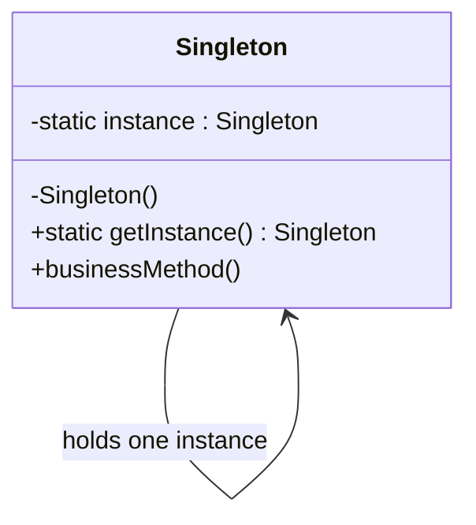

**Thread-safety spectrum** (the part interviews dig into):

- **Eager initialization** — `private static final Logger INSTANCE = new Logger();`.
  Simple and thread-safe (class init is guaranteed safe by the JVM), but the
  instance is built even if never used, and you can't pass constructor args.
- **Synchronized accessor** — the code above. Correct but every call pays a lock,
  even after initialization (contention hotspot).
- **Double-checked locking (DCL)** — lock only on the first, null path:
  ```java
  private static volatile Logger instance;
  public static Logger getInstance() {
      if (instance == null) {                 // 1st check, no lock
          synchronized (Logger.class) {
              if (instance == null)           // 2nd check, with lock
                  instance = new Logger();
          }
      }
      return instance;
  }
  ```
  The `volatile` is **mandatory**: without it another thread can observe a
  *non-null but not-fully-constructed* object because the write publishing the
  reference can be reordered before the constructor's field writes. DCL was
  **broken before Java 5** because the old memory model didn't give `volatile`
  the needed happens-before ordering; the JSR-133 memory model (Java 5+) makes
  `volatile` DCL correct.
- **Initialization-on-demand holder idiom** — lazy *and* lock-free, leaning on
  the classloader's guaranteed-safe lazy class initialization:
  ```java
  private static class Holder { static final Logger INSTANCE = new Logger(); }
  public static Logger getInstance() { return Holder.INSTANCE; }
  ```
  `Holder` isn't initialized until `getInstance()` first touches it, and the JVM
  serializes class init for you — no `synchronized`, no `volatile`.
- **Enum singleton** — *Effective Java* Item 3's preferred approach:
  ```java
  public enum Logger { INSTANCE; public void log(String m) { /* ... */ } }
  ```
  A single-element enum is concise, **serialization-safe** and **reflection-safe
  for free** (the JVM forbids reflective enum construction and handles enum
  deserialization without creating new instances).

> [!WARNING]
> A hand-rolled Singleton can be **broken** by: reflection (`setAccessible(true)`
> on the private ctor), serialization (deserializing creates a second instance
> unless you implement `readResolve()`), and cloning. The enum form is immune to
> all three; that's a big reason Bloch recommends it.

**Trade-offs.**
- *Pros:* guaranteed single instance, lazy creation possible, controlled access,
  namespaced (better than a bare global).
- *Cons:* it is **global mutable state** with **hidden dependencies** — a class
  that calls `X.getInstance()` internally hides that dependency from its API,
  making it hard to test/mock and hard to reason about. It couples code to a
  concrete class, complicates unit testing (shared state leaks across tests), and
  is a concurrency hazard if the instance is mutable. Widely considered an
  **anti-pattern** in modern design.
- *When to use:* genuinely process-wide, stateless-or-immutable services where a
  single instance is a real invariant (e.g., a registry, a well-tuned cache).
- *When to avoid:* almost anywhere you'd want to swap the implementation in a
  test — **prefer a DI container managing a single ("singleton-scoped")
  instance**, which gives you one instance without the global access point and
  hidden coupling.
- *Common misuse:* using Singleton as a convenient bag of globals / to avoid
  passing parameters.

**vs. similar patterns.** **Multiton** = one instance *per key* rather than one
total. **Monostate / Borg** = many instances that all *share the same static
state* (behaves singleton-ish but through instance semantics). DI-managed
**singleton scope** gives you "one instance" without the static accessor.

**Real-world usage.** `java.lang.Runtime.getRuntime()`, `Desktop.getDesktop()`,
most logging frameworks' root logger, and "singleton scope" beans in Spring/Guice
(the container, not a static, owns the single instance).

---

## Factory Method

**Problem it solves:** A class needs to create objects, but it **shouldn't be
coupled to the concrete classes** it instantiates — and the decision of *which*
concrete class to make belongs to a subclass or a future extension, not to the
base class. Hard-coding `new ConcretePDF()` in a framework's `Document` base
class would make the framework impossible to extend to new document types.

**Intent / how it works.** Define an interface (a *factory method*) for creating
an object, but let **subclasses decide which class to instantiate**. Factory
Method lets a class defer instantiation to subclasses (GoF). The base "Creator"
contains the general workflow and calls an abstract `createProduct()` hook;
each concrete subclass overrides that hook to return its own product type. The
`new` lives in exactly one overridable place.

**Concrete example.** A `Dialog` framework has `render()` logic that needs a
button. `Dialog.createButton()` is abstract; `WindowsDialog` returns a
`WindowsButton`, `WebDialog` returns an `HtmlButton`. `Dialog.render()` works
against the `Button` interface and never knows the concrete type.

```java
abstract class Dialog {
    void render() { Button b = createButton(); b.onClick(); b.paint(); }
    protected abstract Button createButton();   // the factory method
}
class WindowsDialog extends Dialog {
    protected Button createButton() { return new WindowsButton(); }
}
```

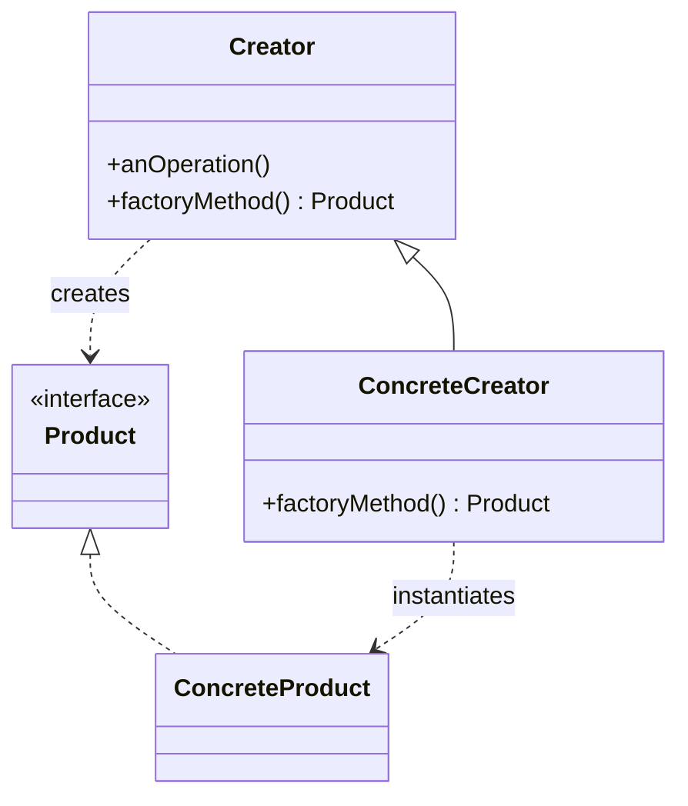

**Trade-offs.**
- *Pros:* removes `new`-coupling to concrete products; honors the **Open/Closed
  Principle** (add a new product + creator subclass without touching existing
  code); centralizes creation logic; supports the "hook method" style frameworks
  rely on.
- *Cons:* you must introduce a **parallel Creator subclass hierarchy** just to
  vary one product — potential **class explosion** if overused; indirection can
  obscure what's actually built.
- *When to use:* a class can't anticipate the concrete class it must create, or
  you want to let subclasses/extensions specify it; frameworks with extension
  points.
- *When to avoid:* when a simple `if/switch` in one place (Simple Factory) would
  do and you don't need polymorphic extension.
- *Common misuse:* calling any static creation method a "Factory Method" — the
  GoF pattern is specifically the **overridable, inheritance-based** hook.

**vs. similar patterns.** **Abstract Factory** creates *families* of related
products via composition; a single Factory Method creates *one* product via
inheritance (and Abstract Factories are often *implemented with* Factory
Methods). **Simple/Static Factory** is a single non-polymorphic method with a
switch — not the GoF pattern. **Template Method**: Factory Method is essentially
a specialization of Template Method whose overridable step *creates an object*.

**Real-world usage.** `Collection.iterator()` (each collection returns its own
`Iterator`), `Calendar.getInstance()`, `NumberFormat.getInstance()`, and
framework hooks like Spring's `FactoryBean`.

---

## Abstract Factory

**Problem it solves:** You must create **families of related objects that have to
be used together** (all "Windows" widgets, or all "dark theme" widgets), and you
want to guarantee that a client never accidentally mixes a Windows button with a
macOS scrollbar — without hard-coding which family is active.

**Intent / how it works.** Provide an interface for creating families of related
or dependent objects **without specifying their concrete classes** (GoF). One
`AbstractFactory` interface declares a creation method per product type
(`createButton()`, `createCheckbox()`); each `ConcreteFactory` produces a
mutually-consistent set of products for one family. The client holds an
`AbstractFactory` reference and asks it for products, staying ignorant of the
concrete family.

**Concrete example.** A cross-platform GUI toolkit. `WinFactory` makes
`WinButton` + `WinCheckbox`; `MacFactory` makes `MacButton` + `MacCheckbox`. You
pick the factory once at startup based on the OS; every widget the app creates is
automatically consistent.

```java
interface GUIFactory { Button createButton(); Checkbox createCheckbox(); }
class WinFactory implements GUIFactory {
    public Button createButton() { return new WinButton(); }
    public Checkbox createCheckbox() { return new WinCheckbox(); }
}
// client:
GUIFactory f = pickFactoryForOS();
Button b = f.createButton();     // guaranteed to match the checkbox
```

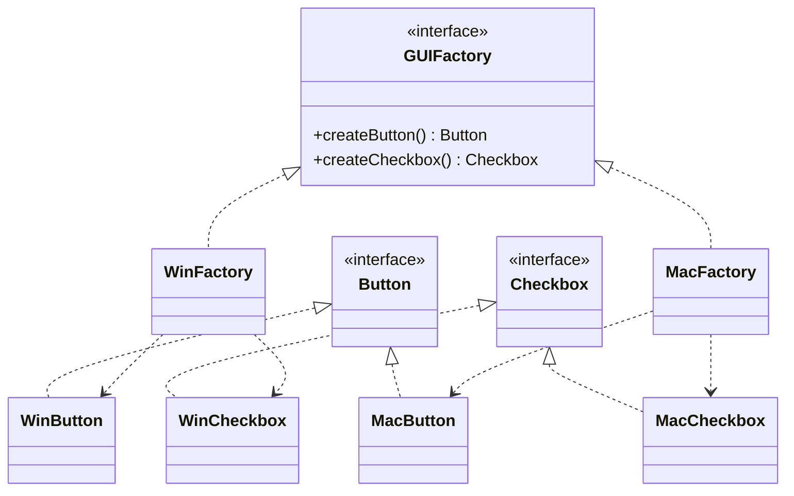

**Trade-offs.**
- *Pros:* **guarantees product-family consistency** (you can't mix families);
  isolates concrete classes from the client; swapping the whole family is a
  one-line change (choose a different concrete factory).
- *Cons:* **rigid to new product *types***. Adding a new product (say
  `createSlider()`) forces you to change the `AbstractFactory` interface and
  *every* concrete factory — a violation of OCP along that axis. (Adding a new
  *family* is easy; adding a new *product type* is hard.) Also introduces many
  classes/interfaces.
- *When to use:* the system must be configured with one of multiple families of
  products, and you need to enforce that products from one family are used
  together (themes, platform look-and-feel, DB dialect drivers).
- *When to avoid:* when there's only one product type (use Factory Method), or the
  set of product types is still churning heavily.
- *Common misuse:* reaching for it when a single Factory Method suffices — you pay
  for a whole factory hierarchy you don't need.

**vs. similar patterns.** **Factory Method** = one product via inheritance;
**Abstract Factory** = multiple related products via composition (and is often
built *out of* Factory Methods). **Builder** focuses on assembling *one complex*
object step by step and returns it at the end; Abstract Factory returns products
immediately and emphasizes *families*.

**Real-world usage.** GUI look-and-feel families (Swing pluggable L&F), JDBC's
family of `Connection`/`Statement`/`ResultSet` per driver,
`DocumentBuilderFactory`/`TransformerFactory` in JAXP.

---

## Builder

**Problem it solves:** Constructing an object requires **many parameters (many of
them optional)** or a **multi-step assembly**, and the classic alternatives are
bad: a **telescoping constructor** (`new Pizza(12, true, false, true, ...)`) is
unreadable and error-prone, while a no-arg constructor + setters leaves the
object mutable and possibly in an invalid half-built state.

**Intent / how it works.** Separate the construction of a complex object from its
representation, so the same construction process can create different
representations (GoF). A `Builder` exposes step methods to configure parts; a
`build()`/`getResult()` call validates and returns the finished (often
**immutable**) product. In the full GoF form a **Director** encapsulates a
reusable construction *sequence* and drives the builder; the modern **fluent
builder idiom** (*Effective Java* Item 2) usually drops the Director and chains
setters that return `this`.

**Concrete example.** Building an HTTP request or a complex `Pizza`:

```java
Pizza p = new Pizza.Builder()
        .size(12)
        .cheese(true)
        .topping("mushroom")
        .topping("olive")
        .build();               // validates, returns immutable Pizza
```

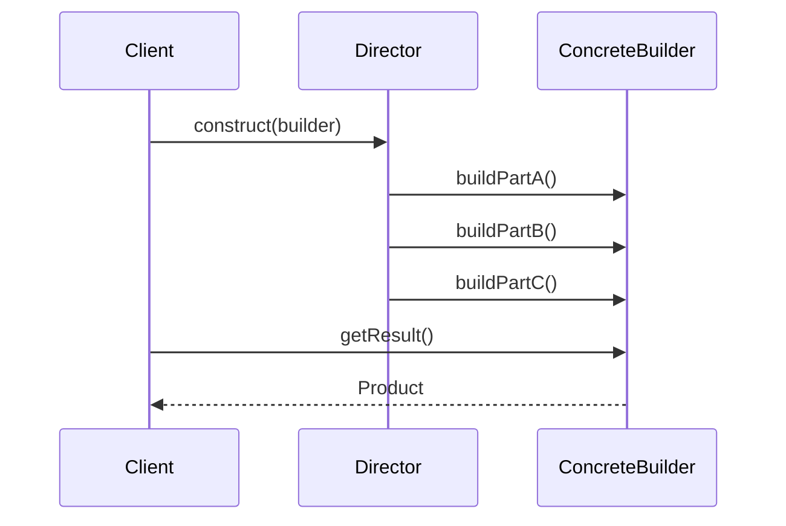

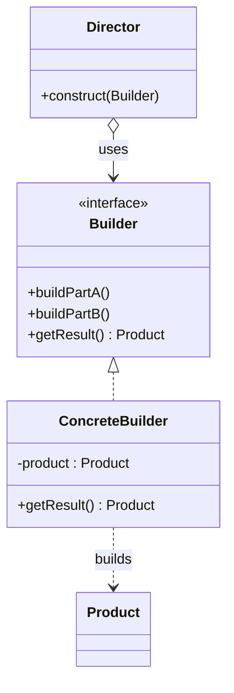

**Trade-offs.**
- *Pros:* eliminates the telescoping-constructor problem; readable, self-documenting
  call sites (named steps); enables **immutable** objects with final fields;
  centralizes **validation** in `build()`; the Director form lets you reuse a
  construction sequence to produce different representations.
- *Cons:* extra Builder class/boilerplate; overkill for objects with few fields;
  object isn't usable until `build()` is called (a two-step lifecycle).
- *When to use:* objects with many optional parameters, required immutability, or
  a genuine multi-step assembly with validation.
- *When to avoid:* simple objects with 1–3 fields (a plain constructor or static
  factory is clearer).
- *Common misuse:* generating a fluent builder for trivial value objects, or
  forgetting to validate in `build()` (defeating half the point).

**vs. similar patterns.** **Abstract Factory** returns the product *immediately*
and deals in *families*; **Builder** returns it *after multi-step assembly* and
deals in *one complex product*. **Factory Method** is one-shot creation. Note the
distinction between the **GoF Builder + Director** (reusable construction process)
and the **fluent builder idiom** (ergonomic constructor replacement) — related but
not identical.

**Real-world usage.** `StringBuilder`, `Stream.Builder`, `Calendar.Builder`,
`HttpRequest.newBuilder()` (java.net.http), Lombok `@Builder`, protobuf message
builders.

---

## Prototype

**Problem it solves:** You need to create new objects but instantiating from a
class is **expensive** (heavy construction, DB/network cost) or the **concrete
type is unknown at compile time** (you only hold an existing object). Rather than
re-run construction, you want to **copy an existing instance**.

**Intent / how it works.** Specify the kinds of objects to create using a
**prototypical instance, and create new objects by copying (cloning) this
prototype** (GoF). Objects implement a `clone()` operation; a client asks a
prototype to clone itself instead of calling `new`. A **PrototypeRegistry** can
store pre-configured prototypes keyed by name so clients fetch-and-clone.

**Concrete example.** A graphics editor: dragging a pre-styled "shape" from a
palette clones a configured prototype (with its color, stroke, etc.) rather than
reconstructing it. Or copying a fully-configured object whose concrete class is
hidden behind an interface.

```java
interface Shape { Shape clone(); }
class Circle implements Shape {
    int radius; String color;
    public Circle(Circle src) { this.radius = src.radius; this.color = src.color; } // copy ctor
    public Shape clone() { return new Circle(this); }
}
```

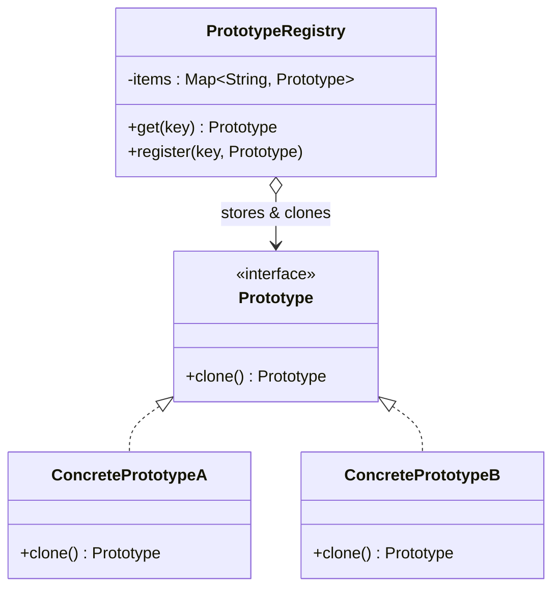

**Shallow vs deep copy** (the crux of interviews here):

- **Shallow copy** duplicates the top object but **shares** referenced objects
  (both copies point at the same nested list). Mutating the nested object through
  one copy affects the other.
- **Deep copy** recursively duplicates the whole object graph so copies are fully
  independent — but is tricky with **cyclic references** (needs a visited-map) and
  costly for large graphs.
- Techniques: **copy constructors** (preferred, explicit), Java's
  `Cloneable`/`Object.clone()` (protected, does a *shallow* field copy, throws on
  non-`Cloneable`, bypasses constructors — widely regarded as a broken design;
  *Effective Java* Item 13), and **serialization-based deep copy** (serialize then
  deserialize — simple but slow and requires everything to be serializable).

> [!WARNING]
> Default `Object.clone()` is a **shallow** copy. If your object holds mutable
> references, a naive `clone()` leaks shared state between the original and the
> copy — a classic source of bugs. Prefer a copy constructor / copy factory.

**Trade-offs.**
- *Pros:* create objects without coupling to their concrete classes; cheaper than
  re-running expensive construction; can add/remove prototypes at runtime;
  configure once, clone many.
- *Cons:* deep-copying graphs with circular references is error-prone; every class
  must implement cloning correctly; shallow/deep confusion causes subtle shared-state
  bugs.
- *When to use:* object creation is costly, you must produce many similar
  pre-configured objects, or the concrete type is decided at runtime.
- *When to avoid:* simple, cheap-to-construct objects; when a factory with known
  types is clearer.
- *Common misuse:* relying on `Cloneable`/`clone()` and getting shallow-copy bugs.

**vs. similar patterns.** **Factory Method / Abstract Factory** create via *class
knowledge* (`new`); **Prototype** creates via *copying an existing instance*.
**Object Pool** *reuses and lends existing* instances; Prototype *copies to make
new* ones.

**Real-world usage.** `Object.clone()`/`Cloneable`, JavaScript's prototypal
inheritance (`Object.create`), prototype registries in game engines and graphics
editors.

---

## Simple Factory / Static Factory Method

**Problem it solves:** Scattered `new` calls for a small set of related concrete
types create duplication and couple every call site to concrete classes. You want
**one place** that encapsulates the choice of concrete type and hands back the
interface — and you'd like a **named**, self-documenting creation call (something
constructors, which must share the class's name, can't give you).

> [!TIP]
> Simple Factory and Static Factory Method are **idioms, not GoF patterns** — but
> they are the most common creational code you'll ever read, and the interview
> classic is distinguishing them from the *real* Factory Method / Abstract Factory.

**Intent / how it works.** A single (often `static`) method encapsulates object
creation and returns one of several concrete types, typically chosen by a
parameter/`switch`. A **Static Factory Method** is the narrower *Effective Java*
Item 1 idea: a static method on the product class itself used *instead of a public
constructor* (can have a descriptive name, can cache/return subtypes, needn't
create a new object each call).

**Concrete example.**

```java
class ShapeFactory {                       // Simple Factory
    static Shape create(String kind) {
        switch (kind) {
            case "circle": return new Circle();
            case "square": return new Square();
            default: throw new IllegalArgumentException(kind);
        }
    }
}
Integer i = Integer.valueOf(42);           // Static Factory Method (may cache)
List<String> xs = List.of("a", "b");       // named, returns hidden impl type
```

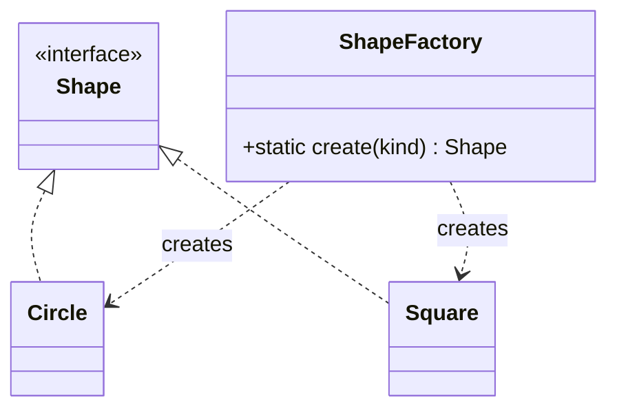

**Trade-offs.**
- *Pros:* centralizes creation; **named** constructors (clarify intent, allow
  multiple "constructors" with same signature); can return cached instances or a
  hidden subtype; hides concrete classes from callers.
- *Cons:* the `switch`/`if` on a type code **violates OCP** — adding a type means
  editing the factory; it's **not polymorphic/overridable** (static), so it
  doesn't scale like the GoF patterns; a static factory can't be subclassed and
  isn't as discoverable as a constructor.
- *When to use:* a small, fairly stable set of types; when you want named creation
  or instance control (caching, returning interfaces).
- *When to avoid:* when the type set grows or must be open to extension — promote
  to **Factory Method** (polymorphic) or **Abstract Factory** (families).
- *Common misuse:* calling this "the Factory pattern" and stopping there; letting
  the `switch` grow unbounded.

**vs. similar patterns.** This is *the* triad interviewers test: **Simple Factory**
= one method + a switch, no subclassing; **Factory Method** = overridable hook,
subclasses choose the product (polymorphic, OCP-friendly); **Abstract Factory** =
an object that creates *families* of products. See the dedicated disambiguation
section below.

**Real-world usage.** `Integer.valueOf()`, `List.of()` / `Map.of()`,
`EnumSet.of()`, `Optional.of()`, `Collections.unmodifiableList()`,
`LocalDate.of()`.

---

## Object Pool

**Problem it solves:** Creating and destroying certain objects is **expensive**
(DB connections, threads, large buffers, sockets) or you must **bound** how many
exist at once. Allocating one per use wastes time and can exhaust a limited
resource; you want to **reuse a fixed set** by borrowing and returning.

**Intent / how it works.** Maintain a pool of initialized, ready-to-use objects.
Clients **acquire** an object from the pool, use it, and **release** it back
instead of creating/destroying it. The pool manages lifecycle: creating up to a
max, handing out idle instances, **resetting state** on return, evicting invalid
ones, and (often) blocking or growing when exhausted.

**Concrete example.** A JDBC connection pool: opening a TCP connection +
authenticating to the DB costs tens of milliseconds, so the app keeps N warm
connections; a request borrows one, runs a query, and returns it.

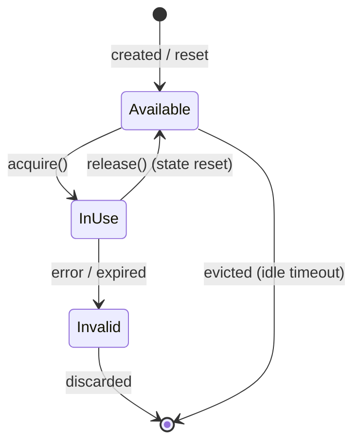

**Trade-offs.**
- *Pros:* amortizes expensive creation/initialization; **bounds** resource usage
  (prevents unbounded connection/thread creation); improves latency and throughput
  under load.
- *Cons:* significant complexity — must **reset object state** on return (a leaked
  dirty object corrupts the next borrower), handle **leaks** (never-returned
  objects) and **starvation/deadlock** (pool exhausted, callers blocked), and tune
  min/max/timeout; a **premature optimization** for cheap objects, especially with
  modern generational GCs that make short-lived allocation cheap.
- *When to use:* objects that are expensive to create *and* safe to reuse, and/or a
  hard cap on a scarce resource (connections, threads, native buffers).
- *When to avoid:* cheap, plain objects (pooling can be *slower* than allocating +
  GC and adds bug surface); objects that can't be cleanly reset.
- *Common misuse:* pooling ordinary POJOs "for performance" without measuring;
  forgetting to reset state, leaking mutable data between users.

**vs. similar patterns.** **Prototype** *copies* to create new objects; Object
Pool *reuses existing* ones. **Flyweight** (structural) *shares immutable
intrinsic* state across many logical objects; a pool *lends out mutable,
exclusively-owned* instances one borrower at a time.

**Real-world usage.** JDBC connection pools (HikariCP, c3p0), thread pools
(`ExecutorService`), Netty `ByteBuf` / object pools, Apache Commons Pool.

---

## Dependency Injection (DI) / Inversion of Control (IoC)

**Problem it solves:** When an object **creates or looks up its own
dependencies** (`this.repo = new MySqlRepo()` or `Registry.get("repo")` inside a
constructor), it is hard-wired to a concrete implementation — you can't swap it
for a test double or an alternate impl without editing the class. DI removes that
by **supplying dependencies from outside**, so a class declares *what* it needs
and something else decides *which* concrete thing to give it.

**Intent / how it works.** Invert the "who provides the dependency" control: an
external assembler (often an **IoC/DI container**) constructs a component's
collaborators and injects them, rather than the component constructing/locating
them itself. Three injection styles:

- **Constructor injection** (preferred): dependencies are required constructor
  args → object is always valid and can be `final`/immutable; easiest to test.
- **Setter injection**: optional/replaceable dependencies set after construction.
- **Field/interface injection**: framework sets fields (or the object implements an
  interface the injector calls) — convenient but harder to test and hides deps.

> [!KEY-TAKEAWAY]
> **DI is one form of IoC, not a synonym.** IoC is the broad principle "a
> framework calls your code, not vice-versa" (template methods, event callbacks,
> the Hollywood principle). DI is specifically inverting *dependency construction*.
> Fowler coined "Dependency Injection" precisely to name that narrower idea.

**Concrete example.**

```java
class OrderService {
    private final PaymentGateway gateway;                 // depends on interface
    OrderService(PaymentGateway gateway) { this.gateway = gateway; } // injected
}
// production wiring:  new OrderService(new StripeGateway());
// test wiring:        new OrderService(new FakeGateway());   // trivially mockable
```

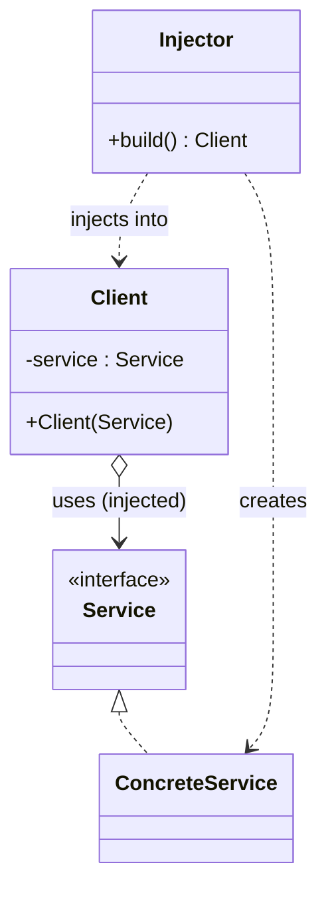

**Trade-offs.**
- *Pros:* decouples *use* from *construction* → swap implementations, mock in
  tests, single place to wire the object graph; promotes programming to
  interfaces; makes dependencies **explicit** (esp. constructor injection).
- *Cons:* indirection and "framework magic" can obscure the real object graph;
  errors that a constructor would catch at compile time can be **deferred to
  runtime** wiring failures; field injection hides dependencies and hurts
  testability; learning curve / configuration overhead.
- *When to use:* almost all application code with collaborators you'd want to swap
  or test — it's the modern default and the standard replacement for Singleton.
- *When to avoid:* tiny scripts, value objects, or where a plain constructor call
  is clearer than a container; don't over-abstract with interfaces that have one
  impl "just in case".
- *Common misuse:* field injection everywhere; using the container as a Service
  Locator (calling `context.getBean(...)` inside business code).

**vs. similar patterns.** **Service Locator** — with a locator the client *pulls*
its dependency from a global registry (`Locator.get(Repo.class)`); with DI the
dependency is *pushed* in and the client never references a registry. Fowler's
canonical comparison favors DI because it keeps dependencies explicit and avoids
the locator becoming a hidden global. DI is also how frameworks **replace
Singleton** — the container owns one shared instance and injects it.

**Real-world usage.** Spring (`@Autowired`, constructor injection), Google Guice,
Dagger (compile-time DI), Jakarta CDI, .NET `IServiceCollection`/built-in DI,
Angular's injector.

---

## Multiton

**Problem it solves:** Singleton gives you *one* instance total, but sometimes you
need **exactly one instance per key** — one connection per database name, one
logger per category, one settings object per locale — each globally accessible and
reused, never duplicated for the same key.

**Intent / how it works.** Generalize Singleton to a **map of named instances**.
A static `Map<Key, Instance>` plus a `getInstance(key)` accessor: on first request
for a key it creates and caches the instance; subsequent requests for the same key
return the cached one. Effectively "a managed registry of singletons keyed by
identifier."

**Concrete example.**

```java
public final class Logger {
    private static final Map<String, Logger> instances = new ConcurrentHashMap<>();
    private Logger(String name) { /* ... */ }
    public static Logger getInstance(String name) {
        return instances.computeIfAbsent(name, Logger::new);   // one per name
    }
}
```

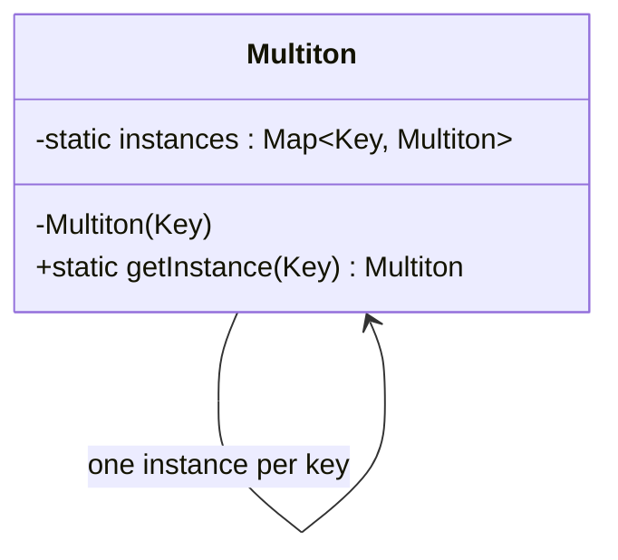

**Trade-offs.**
- *Pros:* controlled, reusable **instance-per-key** registry; avoids duplicate
  heavy objects for the same key; single access point per category.
- *Cons:* inherits and **multiplies Singleton's downsides** — global mutable state,
  hidden dependencies, poor testability — plus the map can **grow unbounded (a
  memory leak)** if keys are never evicted, and concurrent creation needs care.
- *When to use:* a bounded, well-known set of keys where per-key single-instance is
  a genuine invariant (per-connection, per-locale caches).
- *When to avoid:* unbounded/user-supplied keys (leak risk); anything you'd rather
  manage with DI-scoped beans + a bounded cache.
- *Common misuse:* using it as a global cache with unbounded keys; leaking memory
  because nothing evicts stale entries.

**vs. similar patterns.** **Singleton** = one instance total; **Multiton** = one
per key. **Registry (Fowler)** is a broader "well-known object used to find
services/objects" — overlapping intent; a Multiton is essentially a
self-populating registry with lazy creation.

**Real-world usage.** SLF4J/Log4j `LoggerFactory.getLogger(name)` (one logger per
name), per-currency/per-locale singletons, keyed metric registries.

---

## Lazy Initialization

**Problem it solves:** Some objects/values are **expensive to build but not always
needed**, or can't be created at construction time because of **initialization-order
dependencies**. Eagerly building them wastes startup time/memory and can create
chicken-and-egg cycles. You want to defer creation **until first actual use**.

**Intent / how it works.** Delay the creation of an object, the calculation of a
value, or some expensive process until the first time it is needed, then cache the
result for subsequent calls. Classic form: a nullable field + a check-and-create
accessor ("if null, create and store; return it").

**Concrete example.**

```java
class Config {
    private Settings settings;                    // not built yet
    Settings getSettings() {
        if (settings == null) settings = loadFromDisk();   // build on first use
        return settings;                                    // cached thereafter
    }
}
// modern: Supplier-based memoization / Lazy<T>
Supplier<Settings> lazy = memoize(() -> loadFromDisk());
```

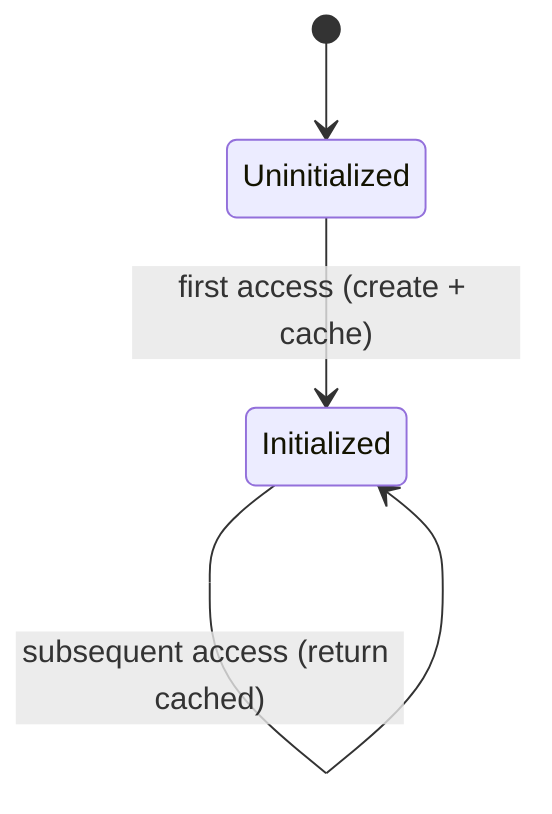

**Trade-offs.**
- *Pros:* avoids paying construction cost until (and unless) needed → faster
  startup, lower memory for unused features; can break initialization-order cycles.
- *Cons:* adds a null/initialized **check branch** on every access; **thread-safety
  hazards on first access** (two threads can both see null and double-initialize, or
  see a partially-built object) — needs synchronization, DCL, or the holder idiom;
  makes reasoning about *when* work happens harder.
- *When to use:* expensive optional resources, heavy caches, singletons that should
  be lazy; ORMs deferring related-entity loads.
- *When to avoid:* cheap values (the check costs more than eager creation); on
  hot paths where the branch/synchronization overhead matters and eager init is
  fine.
- *Common misuse:* unsynchronized lazy init in concurrent code (races/double init);
  lazy-loading that triggers surprise N+1 queries (the ORM "lazy load" trap).

**vs. similar patterns.** **Virtual Proxy** (structural) is a placeholder that
*lazily loads the real subject* on first use — lazy init packaged as a stand-in
object. The **initialization-on-demand holder** form of **Singleton** applies lazy
init in a thread-safe, lock-free way. Fowler's **Lazy Load** (PoEAA) is the
data-access specialization (lazy initialization, virtual proxy, value holder,
ghost).

**Real-world usage.** Hibernate/JPA lazy-loaded associations, `Lazy<T>` in .NET,
Guava `Suppliers.memoize`, Spring `@Lazy` beans, Kotlin `by lazy`.

---

## Factory-family disambiguation

The single most common creational-pattern interview probe is **"what's the
difference between a Simple Factory, Factory Method, Abstract Factory, and
Builder?"** They all "create objects" but differ on *what varies*, *inheritance
vs composition*, *when the product is returned*, and *one product vs a family vs a
complex assembly*.

| Axis | Simple Factory (idiom) | Factory Method (GoF) | Abstract Factory (GoF) | Builder (GoF) |
|---|---|---|---|---|
| What varies | Which concrete type a `switch` picks | Which product a **subclass** creates | Which **family** of products | How one **complex** object is assembled |
| Mechanism | One method + `if/switch` | **Inheritance** (override a hook) | **Composition** (hold a factory object) | Step methods + `build()` (often + Director) |
| # of products | One (from a set) | One | Many related (a family) | One (built incrementally) |
| Returns product | Immediately | Immediately | Immediately | After multi-step assembly |
| OCP-friendly? | No (edit the switch) | Yes (add subclass) | New family: yes / New product type: no | Yes |
| Typical smell it removes | Scattered `new` + type switch | Base class coupled to concrete product | Mixing incompatible family members | Telescoping constructor / optional params |

Mental model:
- Need a **named/centralized creator** for a small fixed set? → **Simple/Static
  Factory**.
- Need **subclasses to choose** the product (framework hook)? → **Factory Method**.
- Need to create **whole families** that must match? → **Abstract Factory** (often
  implemented *with* Factory Methods internally).
- Need to assemble **one complex object step-by-step / immutably**? → **Builder**.

> [!KEY-TAKEAWAY]
> GoF classifies all of the above as **creational** (they deal with *how objects
> are made*). Watch for confusions with their structural/behavioral cousins:
> **Prototype ↔ `clone()`** (creational copy vs a language method),
> **Builder ↔ Composite construction** (Builder *builds* a tree; Composite *is* the
> tree structure), and **Singleton ↔ Monostate** (one instance vs many instances
> sharing static state). **Object Pool ↔ Flyweight** (lend mutable exclusive vs
> share immutable intrinsic).

**See also (adjacent, not full sections here):**
- **RAII** (C++ "Resource Acquisition Is Initialization") — tie a resource's
  lifetime to an object's scope so construction acquires and destruction releases;
  a creation-adjacent idiom in C++/Rust, largely replaced by try-with-resources
  (`AutoCloseable`) in Java.
- **Registry (Fowler, PoEAA)** — a well-known object others use to find services or
  shared objects; overlaps with Singleton/Multiton as an access mechanism.
- **Distributed/cloud "creational-flavored" provisioning patterns** (how services
  and resources get created/wired at runtime) are covered as a pattern-catalog in
  `dp-distributed-cloud`, with deep-dive scenario treatment in
  `event-driven-cqrs-saga-cdc`, `resilience-tradeoffs-deep-dive`, and the
  `microservices-*` topics. Cross-reference those rather than re-teaching them here.

---

## Common follow-up questions

- "Is Singleton an anti-pattern?" Often, yes — it's global mutable state with
  hidden dependencies that hurts testability and coupling. Prefer a **DI
  container's singleton scope**, which gives one instance without the static global
  access point.
- "Write a thread-safe Singleton." Know the spectrum: eager, synchronized
  accessor, **double-checked locking with `volatile`** (and *why* `volatile` is
  required + why DCL was broken pre-Java-5), **initialization-on-demand holder
  idiom**, and **enum singleton** (why Bloch prefers it — serialization/reflection
  safety).
- "Factory Method vs Abstract Factory?" One product via inheritance vs a family
  of related products via composition; Abstract Factory is frequently *implemented
  with* Factory Methods.
- "Simple Factory vs Factory Method?" A static `switch` (not GoF, not
  polymorphic, violates OCP) vs an overridable hook that subclasses specialize.
- "When Builder over a constructor?" Many (optional) parameters, required
  immutability + validation, or genuine multi-step assembly — to kill the
  telescoping constructor.
- "Shallow vs deep copy in Prototype?" Shallow shares nested references (bug
  source); deep duplicates the whole graph (tricky with cycles). Prefer copy
  constructors over `Cloneable`/`clone()`.
- "DI vs Service Locator?" Push (inject) vs pull (client asks a registry); DI
  keeps dependencies explicit and testable — Fowler's canonical contrast.
- "Is DI the same as IoC?" No — DI is *one form* of IoC (inversion of
  dependency construction specifically).
- "Object Pool vs just allocating?" Pool only when creation is genuinely
  expensive or the resource is scarce/bounded; for cheap objects modern GCs make
  pooling a premature optimization that adds reset/leak/starvation bugs.
- "Singleton vs Multiton?" One total vs one per key; Multiton multiplies the
  downsides and risks an unbounded-map memory leak.
- "How can a Singleton be broken?" Reflection, serialization, cloning — the
  enum form is immune to all three.

## References

- Gamma, Helm, Johnson, Vlissides — *Design Patterns: Elements of Reusable
  Object-Oriented Software* (GoF), Chapter 3 "Creational Patterns" (Abstract
  Factory, Builder, Factory Method, Prototype, Singleton).
- Joshua Bloch — *Effective Java* (3rd ed.): Item 1 (static factory methods),
  Item 2 (Builder), Item 3 (enum Singleton), Item 13 (`clone()` pitfalls).
- Martin Fowler — *Patterns of Enterprise Application Architecture* (Registry,
  Lazy Load) and martinfowler.com: "Inversion of Control Containers and the
  Dependency Injection pattern", "InversionOfControl".
- refactoring.guru — Creational Patterns catalog (Factory Method, Abstract
  Factory, Builder, Prototype, Singleton) and Object Pool.
- Wikipedia — "Creational pattern" (recognizes Dependency Injection, Lazy
  Initialization, Object Pool, Multiton as creational patterns).
- Doug Lea / JSR-133 — Java Memory Model, "The 'Double-Checked Locking is Broken'
  Declaration" (why `volatile` DCL is needed).
- POSA (Buschmann et al.) — Object Pool and concurrency-related creational
  patterns.
- Cross-references within this library: `dp-distributed-cloud`,
  `event-driven-cqrs-saga-cdc`, `resilience-tradeoffs-deep-dive`,
  `microservices-ddd-and-boundaries`.
