# Distributed & Cloud Design Patterns

A **pattern catalog** for the distributed-systems and cloud family: the recurring
solutions that appear in the Azure Cloud Design Patterns catalog, Chris Richardson's
microservices.io pattern language, the POSA concurrency patterns, and the Enterprise
Integration Patterns (Hohpe & Woolf). This is the *catalog* view — for each pattern you
get the **problem it solves**, its intent, a concrete example, a structure/flow diagram,
and explicit trade-offs (including how it differs from the pattern people confuse it with).

For deep whiteboard/scenario treatment of the heavyweight distributed patterns, cross-reference:

- **Saga / CQRS / Event Sourcing / CDC** → `event-driven-cqrs-saga-cdc`
- **Circuit Breaker / Retry / Bulkhead / Timeout tuning** → `resilience-tradeoffs-deep-dive`
- **API Gateway / BFF scenarios** → `api-gateways-and-bff`
- **Service boundaries / DDD** → `microservices-ddd-and-boundaries`

Here you get the catalog-level intent + diagram + trade-offs and a link out; the deep dives
own the scenario tuning.

> [!KEY-TAKEAWAY]
> An interviewer's first question about any pattern is almost always *"what problem does it
> solve?"* Lead with the pain, not the mechanism. Every section below opens with a
> **Problem it solves:** line for exactly this reason.

---

## Pattern families at a glance

Before the wall of 40 patterns, here is the map — which family each one belongs to and
what job the family does. Skim this first; it's the scaffold that makes the rest stick.

- **Resilience (survive a failing dependency):** Circuit Breaker, Retry with backoff and
  jitter, Timeout, Bulkhead, Rate Limiting and Throttling, Fallback and graceful degradation.
- **Edge and gateway (the front door):** API Gateway, Gateway Routing, Gateway Aggregation,
  Gateway Offloading, Backends for Frontends, Gatekeeper, Valet Key, Federated Identity,
  Static Content Hosting.
- **Cross-cutting proxies (platform features beside the app):** Sidecar, Ambassador,
  Anti-Corruption Layer, Adapter, Messaging Bridge.
- **Data and storage (partition, cache, project):** Cache-Aside, Materialized View,
  Index Table, Sharding, Consistent Hashing, Database-per-Service, Command-side Replica.
- **Messaging (move work asynchronously):** Queue-Based Load Leveling, Competing Consumers,
  Publish-Subscribe, Claim-Check, Priority Queue, Pipes and Filters, Scatter-Gather,
  Sequential Convoy, Asynchronous Request-Reply.
- **Consistency and coordination (agree without a global lock):** Saga, Compensating
  Transaction, CQRS, Event Sourcing, Transactional Outbox, Polling Publisher and Transaction
  Log Tailing, Idempotent Consumer, Event-Carried State Transfer, API Composition,
  Choreography, Process Manager, Scheduler Agent Supervisor, Leader Election,
  Service Registry and Discovery.
- **Deployment and scale (grow and isolate the whole stack):** Deployment Stamps, Geodes,
  Compute Resource Consolidation, External Configuration Store, Health Endpoint Monitoring,
  Strangler Fig.

---

## Why these patterns exist — the fallacies of distributed computing

**Problem it solves:** engineers keep baking false assumptions about the network into
distributed systems, and those assumptions are the root cause of most outages. Naming them
gives you a checklist of *why* each pattern in this catalog exists.

**Intent.** In 1994–97 Peter Deutsch and colleagues at Sun catalogued the eight *fallacies
of distributed computing* — assumptions that are true on a single machine but false across
a network. Azure grounds its entire cloud pattern catalog in them, and each fallacy maps to
a family of patterns below.

1. **The network is reliable.** → Retry, Circuit Breaker, Idempotent Consumer, Transactional Outbox.
2. **Latency is zero.** → Timeout, Cache-Aside, Materialized View, Gateway Aggregation, Claim-Check.
3. **Bandwidth is infinite.** → Queue-Based Load Leveling, Rate Limiting, Claim-Check.
4. **The network is secure.** → Gatekeeper, Valet Key, Federated Identity, Ambassador (TLS).
5. **Topology doesn't change.** → Service Registry & Discovery, Ambassador, External Configuration Store.
6. **There is one administrator.** → Health Endpoint Monitoring, Sidecar, Deployment Stamps.
7. **Transport cost is zero.** → Event-Carried State Transfer, Compute Resource Consolidation.
8. **The network is homogeneous.** → Anti-Corruption Layer, Adapter, Messaging Bridge.

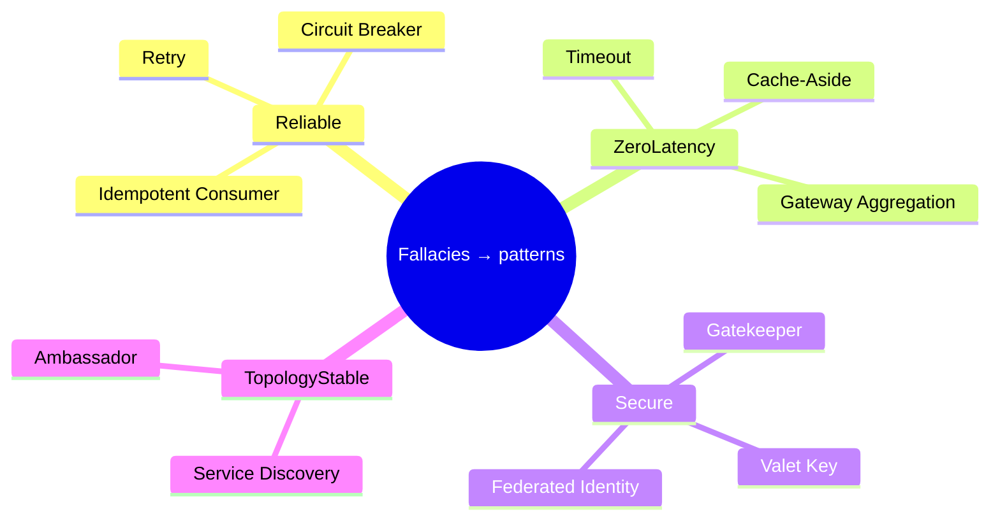
```mermaid
mindmap
  root(("Fallacies → patterns"))
    Reliable
      Retry
      Circuit Breaker
      Idempotent Consumer
    ZeroLatency
      Timeout
      Cache-Aside
      Gateway Aggregation
    Secure
      Gatekeeper
      Valet Key
      Federated Identity
    TopologyStable
      Service Discovery
      Ambassador
```

**Trade-offs.** Defending against every fallacy costs complexity, latency, and money.
You defend *proportional to blast radius*: a nightly batch job can ignore latency; a
synchronous checkout path cannot. **Vs. "just add more patterns":** every pattern you add
is a new failure mode and a new thing to operate — the art is applying the minimum set that
covers your actual risk.

---

## Circuit Breaker

**Problem it solves:** when a downstream dependency is failing or overloaded, blindly
continuing to call it wastes resources, piles latency onto every caller, and can turn one
sick service into a system-wide cascade. You need to *stop calling* a broken dependency and
give it room to recover.

**Intent.** Wrap a protected call in a state machine that trips **open** after a failure
threshold, fails fast (no call made) while open, and after a cool-down lets a trial request
through in **half-open** to test recovery before returning to **closed**.

**Example.** A checkout service calls a flaky payments provider. After 50% of calls fail
in a rolling window, the breaker opens; for the next 30 s checkout instantly returns a
"payments temporarily unavailable" response (often paired with a Fallback) instead of
piling up 10 s timeouts. One trial call after 30 s decides whether to close again.

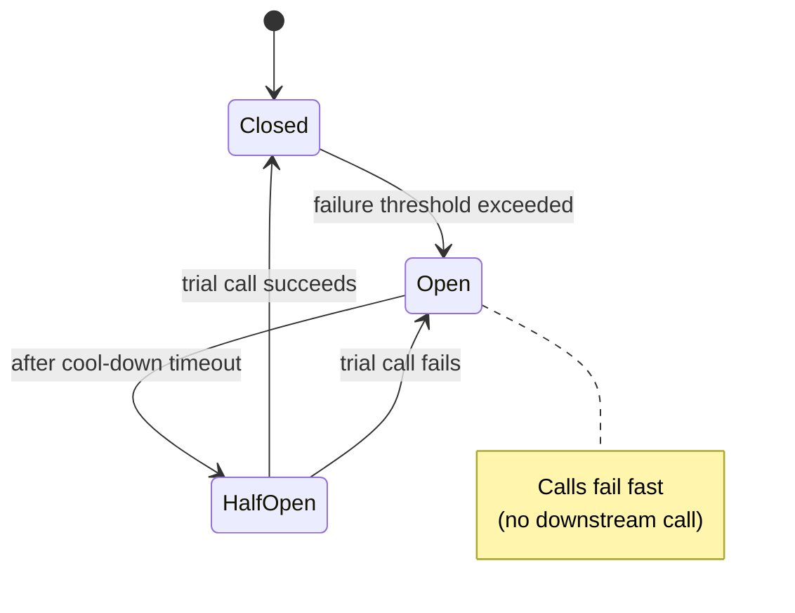
```mermaid
stateDiagram-v2
    [*] --> Closed
    Closed --> Open: failure threshold exceeded
    Open --> HalfOpen: after cool-down timeout
    HalfOpen --> Closed: trial call succeeds
    HalfOpen --> Open: trial call fails
    note right of Open
        Calls fail fast
        (no downstream call)
    end note
```

**Trade-offs.** *Pros:* prevents cascading failure, sheds load off a struggling dependency,
speeds recovery. *Cons:* a stuck-open breaker denies service even after partial recovery;
thresholds/windows are genuinely hard to tune; hides real errors if misconfigured. A raw
percentage threshold needs a **minimum request volume** guard, or a low-traffic service
false-trips on a couple of unlucky failures: with only 3 calls in the window, 2 failures is
66% > 50% and the breaker opens even though nothing is systemically wrong. Require, say, ≥20
calls in the window before the percentage is allowed to trip.
*Use when* calls to a remote resource can fail transiently and you want to protect callers.
*Avoid* for local, in-process, or non-idempotent one-shot operations where failing fast adds
nothing. **Vs. Retry:** Retry *keeps trying* the same call (good for transient blips); a
breaker *stops trying* (good for a dependency that is down). They are complementary — retry
inside, breaker around. **Vs. Timeout:** a timeout bounds one call; the breaker is the
*aggregate* failure policy across many calls. Deep tuning → `resilience-tradeoffs-deep-dive`.

---

## Retry with backoff and jitter

**Problem it solves:** transient faults — a dropped packet, a brief throttle, a
mid-failover blip — cause calls to fail even though a retry moments later would succeed.
You want to absorb these without surfacing an error to the user.

**Intent.** Re-attempt a failed operation a bounded number of times, growing the delay
**exponentially** (2^n) and adding **jitter** (randomization) so that many clients don't
all retry in lockstep and hammer the recovering service.

**Example.** A client gets HTTP 503 from a rate-limited API. It waits `random(0, base·2^n)`
before attempt n (full jitter), retrying up to 3 times. Without jitter, thousands of clients
that failed at the same instant would retry at the same instant — a **thundering herd**
that re-kills the service.

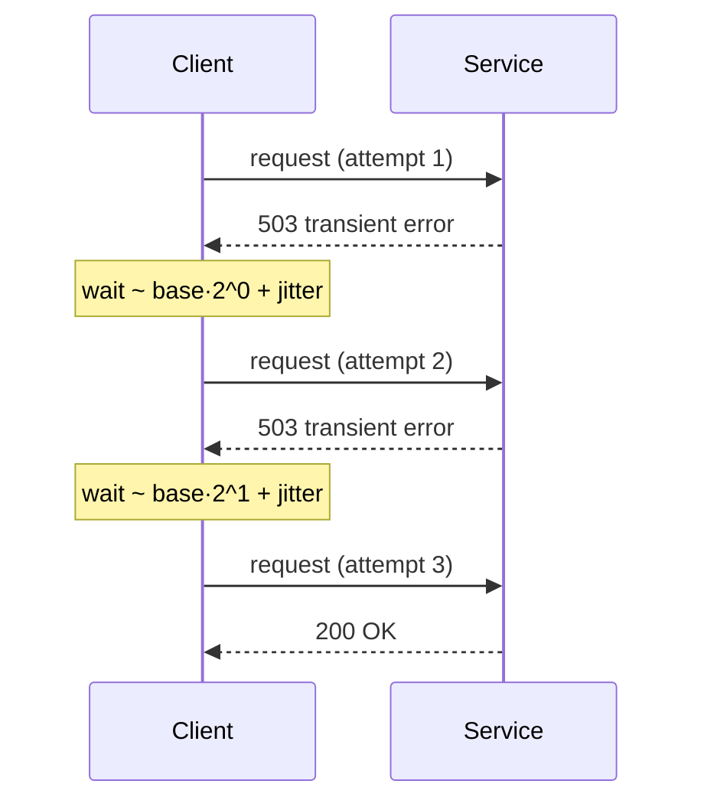
```mermaid
sequenceDiagram
    participant C as Client
    participant S as Service
    C->>S: request (attempt 1)
    S-->>C: 503 transient error
    Note over C: wait ~ base·2^0 + jitter
    C->>S: request (attempt 2)
    S-->>C: 503 transient error
    Note over C: wait ~ base·2^1 + jitter
    C->>S: request (attempt 3)
    S-->>C: 200 OK
```

**Trade-offs.** *Pros:* cheaply masks transient faults; huge availability win.
*Cons:* retrying a **non-idempotent** operation can double-charge/double-write; fixed-interval
retries (no jitter) cause **retry storms**; retries multiply load exactly when a service is
weakest. *Use when* faults are transient and the operation is idempotent (or made idempotent
via a key). *Avoid* on validation errors and other permanent failures (never retry a 400),
and never retry an unbounded number of times. **Vs. Circuit Breaker:** complementary, not
alternatives — retry handles the *individual blip*, the breaker handles the *sustained
outage*. Combine: retry a couple times, and let repeated failures trip the breaker.

---

## Timeout

**Problem it solves:** a *slow* dependency (not down, just hung) is more dangerous than a
dead one — callers block waiting, their thread/connection pools fill, and a healthy service
becomes unavailable. You need to convert an unbounded wait into a bounded, handleable failure.

**Intent.** Set the maximum time you will wait for a call; on expiry, abandon it and take a
failure path. Set connection, read, and end-to-end timeouts; propagate **deadlines**
downstream so later hops don't work on a request the caller already gave up on.

**Example.** Service A calls B with a 100 ms read timeout derived from B's p99.9. When B
hangs, A's call fails at 100 ms and A frees the thread, instead of blocking for the TCP
default of tens of seconds and exhausting its pool.

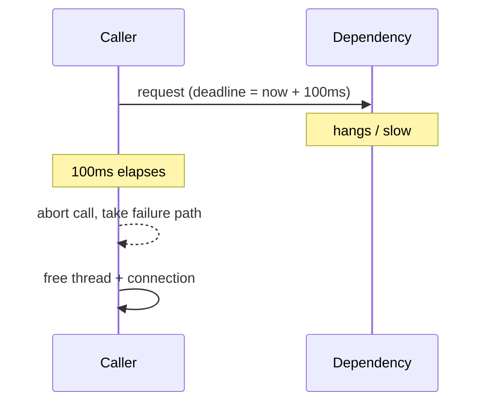
```mermaid
sequenceDiagram
    participant A as Caller
    participant B as Dependency
    A->>B: request (deadline = now + 100ms)
    Note over B: hangs / slow
    Note over A: 100ms elapses
    A-->>A: abort call, take failure path
    A->>A: free thread + connection
```

**Trade-offs.** *Pros:* protects caller resources; the foundation every other resilience
pattern builds on. *Cons:* too short → false failures on healthy-but-slow calls; too long →
pool exhaustion cascade. Set it from the *latency distribution* (near p99.9), not a guess.
*Use* on every remote/blocking call. *Avoid* setting a single global timeout for calls with
wildly different latency profiles. **Vs. Circuit Breaker:** a timeout is a *per-call* limit;
the breaker is an *aggregate* policy. **Vs. Retry:** a timeout decides *when to give up on
one attempt*; retry decides *whether to try again*. Deep dive → `resilience-tradeoffs-deep-dive`.

---

## Bulkhead

**Problem it solves:** in a shared resource pool (one thread pool, one connection pool), a
single slow or saturated dependency consumes all the resources, starving *every other*
feature — one bad dependency sinks the whole ship.

**Intent.** Named after a ship's watertight compartments: partition resources (thread pools,
connection pools, instances) so each dependency or client class gets its own pool. When one
floods, the damage is confined to that compartment.

**Example.** An API calls payments, search, and recommendations. Instead of one shared
50-thread pool, each gets its own (20/20/10). If recommendations hangs, it exhausts only its
10 threads; payments and search keep serving.

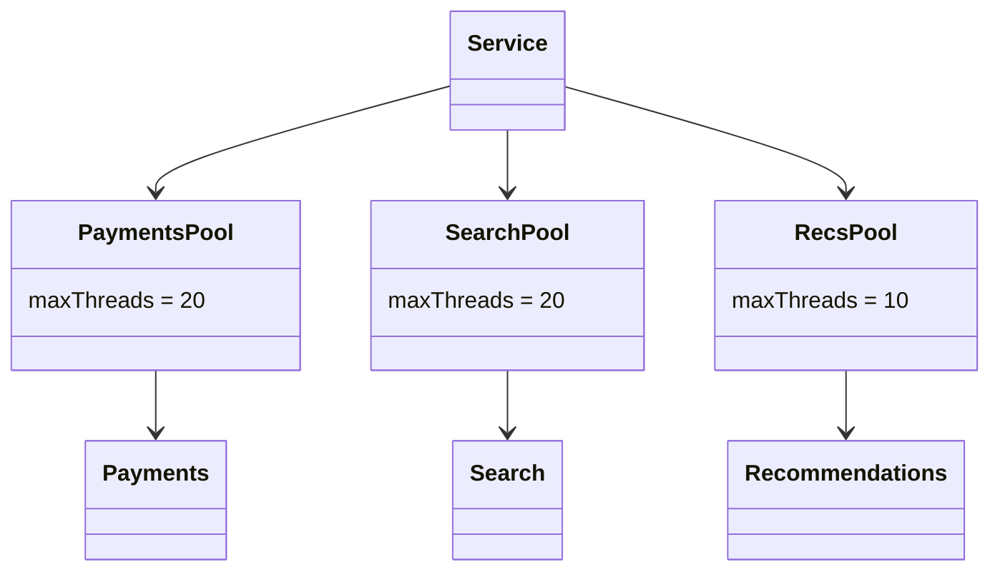
```mermaid
classDiagram
    class Service
    class PaymentsPool {
        maxThreads = 20
    }
    class SearchPool {
        maxThreads = 20
    }
    class RecsPool {
        maxThreads = 10
    }
    Service --> PaymentsPool
    Service --> SearchPool
    Service --> RecsPool
    PaymentsPool --> Payments
    SearchPool --> Search
    RecsPool --> Recommendations
```

**Trade-offs.** *Pros:* isolation — limits blast radius; a failure in one partition can't
starve others. *Cons:* partitioning **wastes capacity** (idle threads in one pool can't help
a busy one) and adds tuning/monitoring complexity. *Use when* you consume multiple
independent backends or serve tenants of differing importance. *Avoid* when load is uniform
and the overhead of many small pools outweighs the isolation. **Vs. Circuit Breaker:** the
bulkhead *limits how much* one dependency can consume (isolation); the breaker *stops calling*
a failing dependency (flow control). **Vs. Compute Resource Consolidation:** direct tension —
consolidation *packs* work together for efficiency; the bulkhead *separates* it for safety.

---

## Rate Limiting and Throttling

**Problem it solves:** unbounded demand — a traffic spike, a runaway client, a noisy tenant —
can exhaust your capacity and degrade service for everyone. You need to cap consumption to
protect the system and enforce fairness/quotas.

**Intent.** Limit the rate of operations a client/tenant/service may perform in a window,
rejecting (429) or delaying excess. *Rate limiting* and *throttling* are two lenses on the
same idea — Azure lists them as near-duplicates; treat them as one pattern.

**The three common algorithms** — the standard senior follow-up is "which one and why":

- **Token bucket** — a bucket holds up to **B** tokens and refills at rate **R** tokens/sec.
  Each request spends one token; if the bucket is empty, reject. Because tokens accumulate up
  to the cap, an idle client can spend a **burst of up to B** at once, then is limited to the
  steady rate R. *Allows bursts.*
- **Leaky bucket** — requests enter a queue that drains ("leaks") at a **constant** rate R;
  if the queue is full, reject. Output is perfectly smooth regardless of how bursty the input
  was. *Smooths, no bursts* — the opposite temperament from token bucket.
- **Sliding window** (log or counter) — count requests within the trailing window (e.g. last
  60 s), rejecting once the count hits the limit. A *sliding log* stores every request
  timestamp (most accurate boundary counting, highest memory); a *sliding-window counter*
  approximates it with weighted fixed buckets (cheaper, slightly less exact). *Most accurate
  at the window boundary, higher memory/cost.*

The trade-off is **burst tolerance (token) vs smoothing (leaky) vs boundary accuracy and cost
(sliding window)**. Pick token bucket when short bursts are legitimate; leaky bucket when the
downstream needs a steady feed; sliding window when you must count precisely at the edge.

**Example (token bucket, numbers in → out).** Config: `B = 10` tokens, `R = 1 token/sec`. The
bucket starts full at 10. A client that has been idle fires **12 requests in the same second**:
requests 1–10 each spend a token (bucket 10 → 0, all allowed), requests 11 and 12 find an empty
bucket and get `429 Too Many Requests` with `Retry-After: 1`. The client now sends **1 req/sec**:
each second refills 1 token which that request immediately spends, so all succeed — steady rate
sustained. Idle for 4 s → bucket refills to 4 (capped at B), so a fresh burst of 4 is allowed
again. That accumulate-then-burst behavior is exactly what a leaky bucket would *not* permit: it
would have drained those 12 requests out at 1/sec no matter how they arrived.

**Example (fleet-wide).** An API allows 100 req/min per API key. On a single node a local
counter suffices, but across a 10-node fleet each node seeing 10 req/min would wrongly allow
1000; so the bucket/counter lives in **Redis** (`INCR` + TTL, or a Lua token-bucket script) and
all nodes share one limit — at the cost of a network round-trip per request.

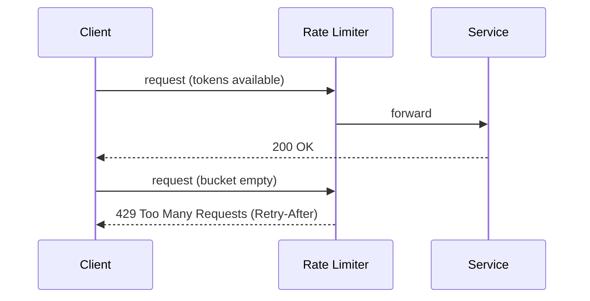
```mermaid
sequenceDiagram
    participant C as Client
    participant L as Rate Limiter
    participant S as Service
    C->>L: request (tokens available)
    L->>S: forward
    S-->>C: 200 OK
    C->>L: request (bucket empty)
    L-->>C: 429 Too Many Requests (Retry-After)
```

**Trade-offs.** *Pros:* protects capacity, enforces quotas/fairness, defends against abuse.
*Cons:* rejects legitimate bursts; **distributed** rate limiting needs shared state (Redis)
which adds latency and a dependency; per-node limits are inaccurate. *Use* at API ingress
and for multi-tenant fairness. *Avoid* as your only defense against sustained overload — pair
with autoscaling and load leveling. **Vs. Queue-Based Load Leveling:** throttling *rejects or
delays* at ingress; load leveling *buffers* the work to smooth it. **Vs. Bulkhead:** rate
limiting is *flow control* (how fast); bulkhead is *isolation* (how much of the pool).

---

## Fallback and graceful degradation

**Problem it solves:** when a dependency fails, returning an error to the user is often the
worst option. You want to serve a *degraded-but-useful* response instead of failing hard.

**Intent.** On the failure path (timeout, breaker open, error), substitute a safe
alternative: a cached value, a default, a simpler feature, or a queued "do it later." The
user sees reduced function rather than an outage.

**Example.** A product page's recommendations service is down; instead of a 500, the page
renders "Popular products" from a static cache. Netflix's fallback is the canonical example
(personalized rows fall back to non-personalized ones).

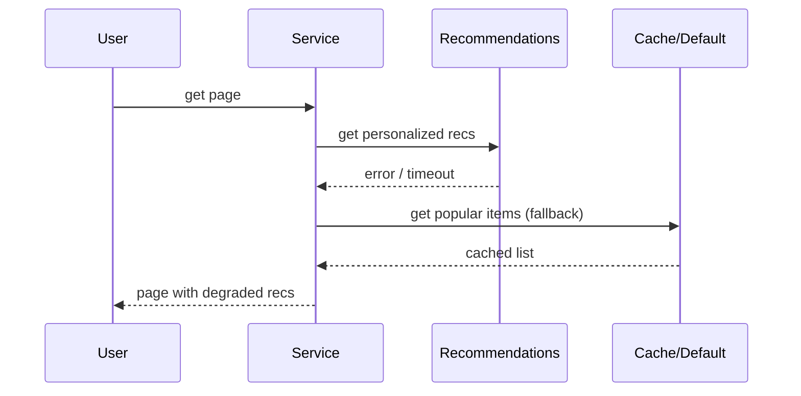
```mermaid
sequenceDiagram
    participant U as User
    participant S as Service
    participant D as Recommendations
    participant C as Cache/Default
    U->>S: get page
    S->>D: get personalized recs
    D-->>S: error / timeout
    S->>C: get popular items (fallback)
    C-->>S: cached list
    S-->>U: page with degraded recs
```

**Trade-offs.** *Pros:* preserves user experience during partial failure; a core availability
lever. *Cons:* **stale or incorrect** fallback data can mask outages (nobody notices the real
service is down) and mislead users; fallbacks are extra code paths that must be tested.
*Use* for non-critical features with an acceptable degraded state. *Avoid* where correctness
is essential (never fall back to a guessed bank balance). **Vs. Cache-Aside:** cache-aside is
the *normal* read path (populate on miss); a fallback is a *failure-path* substitute used
only when the primary breaks. Alert loudly whenever a fallback fires.

---

## Compensating Transaction

**Problem it solves:** in an eventually-consistent, multi-step operation spanning services,
there is no distributed ACID rollback. If step 4 fails, you can't `ROLLBACK` steps 1–3 —
they already committed. You need a way to *semantically undo* completed work.

**Intent.** For each step that can be committed, define a **compensating action** that
reverses its business effect (refund a charge, release a reservation, cancel a booking).
On failure, run the compensations for the already-completed steps in reverse order.

**Example.** A trip booking reserves a flight, then a hotel, then a car. The car booking
fails. Compensations run: cancel-hotel, then cancel-flight. The system returns to a
business-consistent state without ever holding a distributed lock.

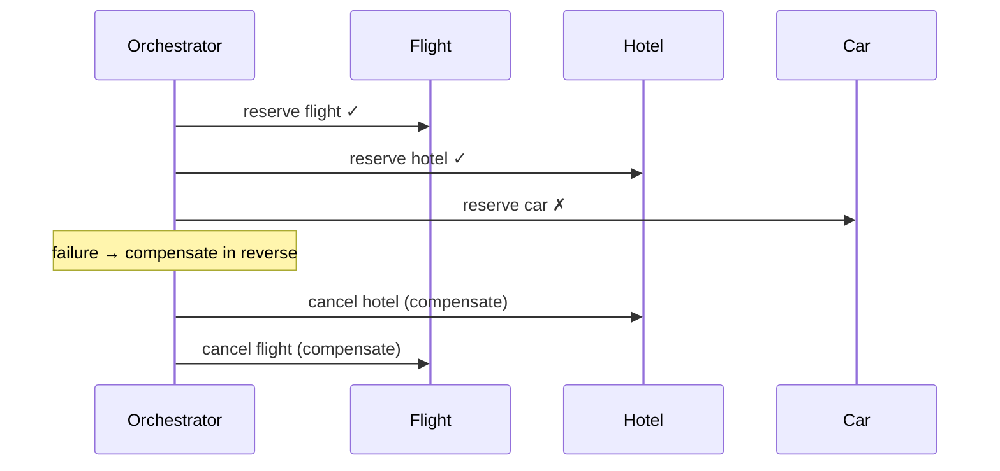
```mermaid
sequenceDiagram
    participant O as Orchestrator
    participant F as Flight
    participant H as Hotel
    participant Car as Car
    O->>F: reserve flight ✓
    O->>H: reserve hotel ✓
    O->>Car: reserve car ✗
    Note over O: failure → compensate in reverse
    O->>H: cancel hotel (compensate)
    O->>F: cancel flight (compensate)
```

**Trade-offs.** *Pros:* enables long-running/cross-service consistency without 2PC.
*Cons:* compensations aren't always **perfect inverses** — a confirmation email already sent
can't be un-sent; side effects may be visible in the window before compensation runs.
*Use* for any long-lived business transaction across services. *Avoid* when you truly need
atomic isolation (use a single local ACID transaction if you can). **Vs. Saga:** the Saga is
the *coordination* pattern (the sequence of local transactions); compensating transactions
are the *rollback mechanism* a Saga invokes on failure. Deep dive → `event-driven-cqrs-saga-cdc`.

---

## Health Endpoint Monitoring

**Problem it solves:** load balancers and orchestrators must know whether an instance can
actually serve traffic — a process can be "running" but unable to reach its database. You
need a machine-checkable signal of health.

**Intent.** Expose an HTTP endpoint (e.g. `/health`, `/ready`) that performs functional
checks and returns healthy/unhealthy. External monitors, LBs, and orchestrators poll it and
route away from or restart unhealthy instances. Distinguish **liveness** (is the process
alive? restart if not) from **readiness** (can it serve traffic now? pull from LB if not).

**Example.** A Kubernetes pod exposes `/livez` (returns 200 if the event loop responds) and
`/readyz` (returns 200 only if the DB connection pool is healthy). During warm-up the pod is
live but not ready, so it stays out of the Service until dependencies connect.

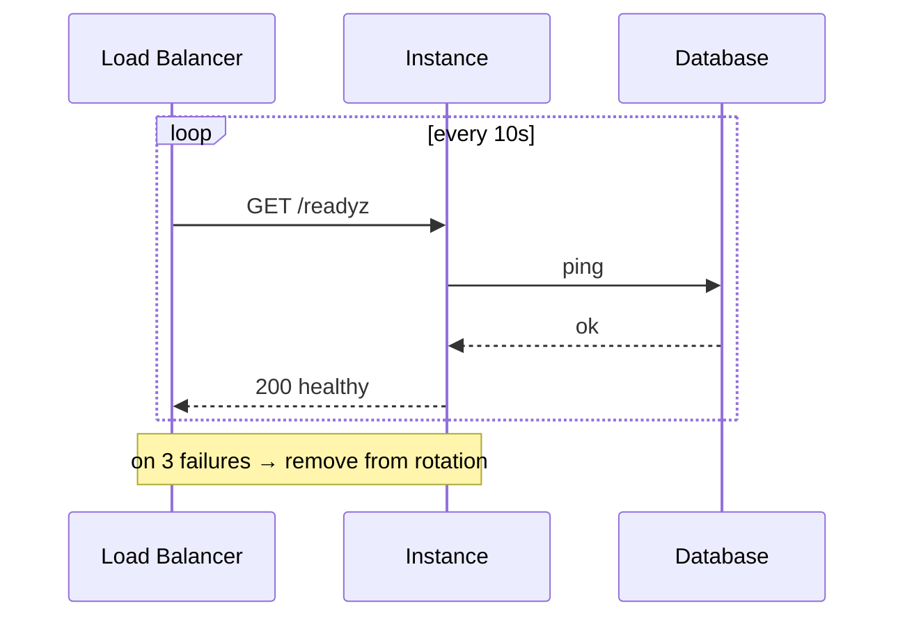
```mermaid
sequenceDiagram
    participant LB as Load Balancer
    participant I as Instance
    participant DB as Database
    loop every 10s
        LB->>I: GET /readyz
        I->>DB: ping
        DB-->>I: ok
        I-->>LB: 200 healthy
    end
    Note over LB,I: on 3 failures → remove from rotation
```

**Trade-offs.** *Pros:* enables automated failover, self-healing, and safe rollouts.
*Cons:* **shallow** checks (just "process up") miss real failures; **deep** checks (probe
every dependency) can themselves cause load and cascade — a shared DB check that fails marks
the whole fleet unhealthy at once. *Use* everywhere behind an LB/orchestrator. *Avoid*
making readiness depend on non-critical downstreams (you'll take yourself out for a
non-essential outage). **Vs. liveness/readiness:** liveness failure → *restart*; readiness
failure → *stop routing but keep running*. Confusing the two causes restart loops.

---

## Scheduler Agent Supervisor

**Problem it solves:** a distributed action made of steps across remote services can fail
partway, and no single actor is responsible for detecting the failure and driving the work to
a consistent conclusion. You need coordinated, resilient execution of remote steps.

**Intent.** Three roles: the **Scheduler** arranges the steps of a workflow and records
state; **Agents** perform the individual remote actions; the **Supervisor** monitors for
steps that timed out or failed and triggers remediation (retry, or compensate/cancel).

**Example.** An order-fulfillment workflow: the scheduler records "charge → reserve → ship."
Each step is executed by an agent against a remote service. The supervisor periodically scans
the state store for steps stuck past their deadline and re-runs or compensates them.

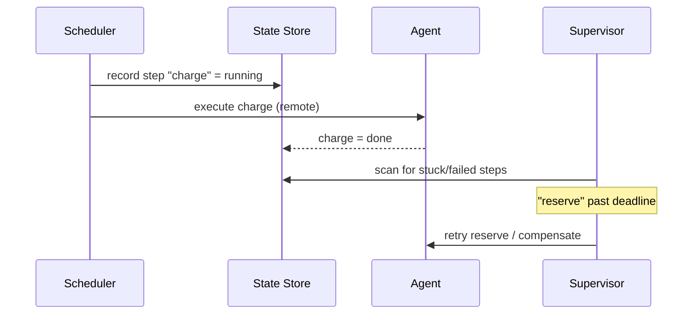
```mermaid
sequenceDiagram
    participant Sch as Scheduler
    participant St as State Store
    participant Ag as Agent
    participant Sup as Supervisor
    Sch->>St: record step "charge" = running
    Sch->>Ag: execute charge (remote)
    Ag-->>St: charge = done
    Sup->>St: scan for stuck/failed steps
    Note over Sup: "reserve" past deadline
    Sup->>Ag: retry reserve / compensate
```

**Trade-offs.** *Pros:* robust recovery of long-running distributed work; explicit state
makes progress observable. *Cons:* supervisor logic is complex; risk of **duplicate
remediation** (supervisor and agent both act) demands idempotent steps. *Use* for durable,
multi-step remote workflows that must survive partial failure. *Avoid* for simple in-process
sequences. **Vs. Saga orchestration:** heavy overlap — the Scheduler resembles a Saga
orchestrator, but this pattern emphasizes *detecting and remediating* failed remote work via
a dedicated supervisor, not just forward/compensating flow.

---

## Queue-Based Load Leveling

**Problem it solves:** bursty, spiky demand hits a service that can only process at a fixed
rate; the spikes overwhelm it and cause failures or timeouts, while the service sits idle
between bursts. You need to decouple arrival rate from processing rate.

**Intent.** Insert a **queue** between producers and the service. Producers enqueue at
whatever rate they arrive; the service dequeues and processes at its own sustainable rate.
The queue absorbs the peaks and smooths (levels) the load.

**Example.** Image uploads arrive in bursts of thousands. Instead of resizing synchronously
(and falling over), the web tier drops a message on a queue; a pool of workers pulls and
processes at a steady 200/s. Users get an immediate "processing" response.

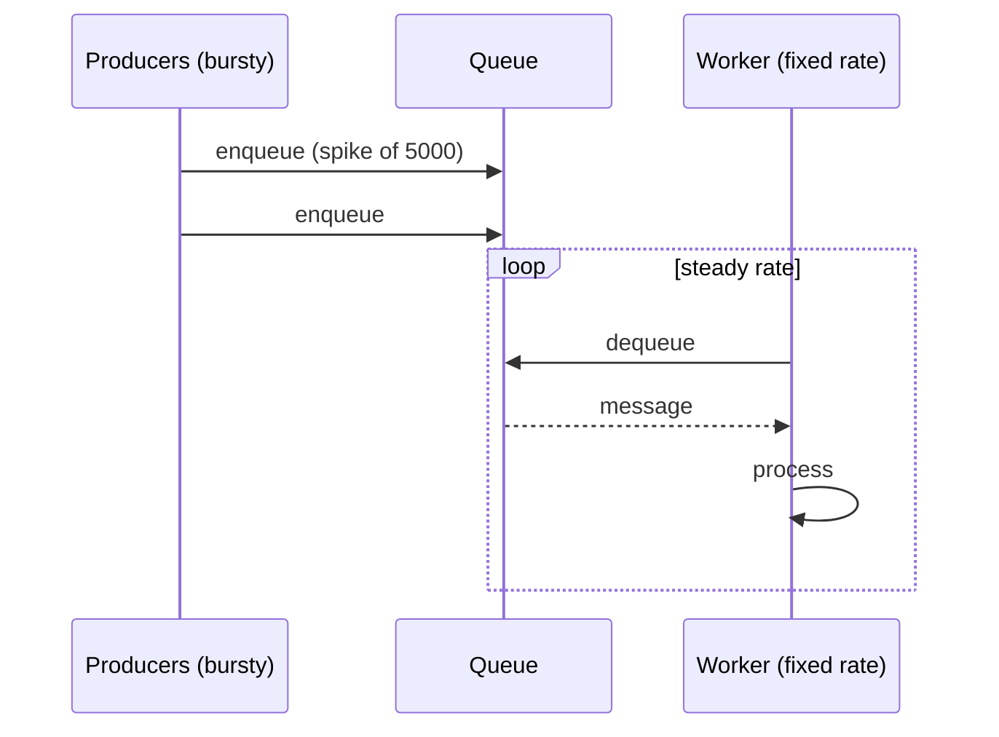
```mermaid
sequenceDiagram
    participant P as Producers (bursty)
    participant Q as Queue
    participant W as Worker (fixed rate)
    P->>Q: enqueue (spike of 5000)
    P->>Q: enqueue
    loop steady rate
        W->>Q: dequeue
        Q-->>W: message
        W->>W: process
    end
```

**Trade-offs.** *Pros:* smooths spikes, decouples components, lets you size the service for
*average* not *peak* load, improves resilience. *Cons:* adds **latency** (work is now async);
the queue can grow **unbounded** under sustained overload (needs backpressure / max depth /
dead-letter); requires async client semantics. *Use* for spiky, tolerant-of-delay workloads.
*Avoid* for synchronous, low-latency request paths. **Vs. Rate Limiting:** load leveling
*buffers* excess for later; rate limiting *rejects/delays* it at ingress. **Vs. Competing
Consumers:** leveling *smooths* load over time; competing consumers *scale throughput* by
adding parallel readers — they're usually combined.

---

## Sidecar

**Problem it solves:** every service needs the same cross-cutting features (logging, config,
TLS, metrics, network proxying), but baking them into each app couples them to the app's
language and lifecycle and forces you to reimplement them per stack.

**Intent.** Deploy the supporting functionality as a **separate co-located process/container**
(the sidecar) that shares the main app's host/pod and lifecycle. The app stays focused on
business logic; the sidecar provides platform capabilities language-agnostically.

**Example.** A service mesh data-plane proxy (Envoy) runs as a sidecar next to each app
container in the pod. All inbound/outbound traffic flows through it, giving mTLS, retries,
and telemetry without a single line in the app.

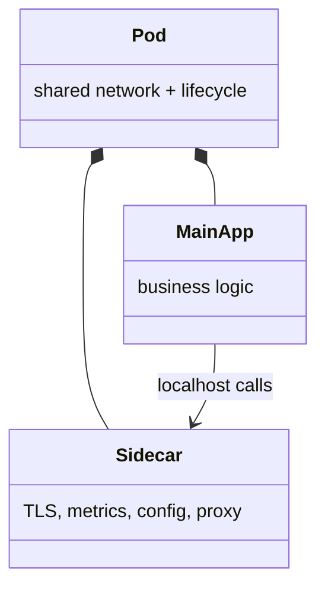
```mermaid
classDiagram
    class Pod {
        shared network + lifecycle
    }
    class MainApp {
        business logic
    }
    class Sidecar {
        TLS, metrics, config, proxy
    }
    Pod *-- MainApp
    Pod *-- Sidecar
    MainApp --> Sidecar : localhost calls
```

**Trade-offs.** *Pros:* language-agnostic, independently upgradable, isolates cross-cutting
concerns, reusable across services. *Cons:* **per-instance resource overhead** (a sidecar per
pod adds up), extra network hop latency, and lifecycle coupling (sidecar crash can affect the
app). *Use* for polyglot fleets and platform features you don't want in app code. *Avoid* for
a single small app where in-process libraries suffice. **Vs. Ambassador:** an Ambassador is a
*specialized outbound-proxy* sidecar; Sidecar is the general pattern. **Vs. Decorator (GoF):**
Decorator wraps behavior *in-process*; Sidecar composes it *out-of-process* across a network
boundary.

---

## Ambassador

**Problem it solves:** client apps (especially legacy or polyglot ones) need consistent
outbound network behavior — retries, circuit breaking, TLS, routing, monitoring — but you
don't want to add that logic to every client in every language.

**Intent.** A **client-side proxy** sidecar that the app talks to over localhost; the
ambassador handles the messy network concerns of *outbound* calls on the app's behalf. It's a
sidecar specialized for the outbound path.

**Example.** A legacy app makes plain HTTP calls to `localhost:8080`. An ambassador process
there adds mTLS, retries with backoff, and routes to the correct regional endpoint —
upgrading the legacy app's networking without touching its code.

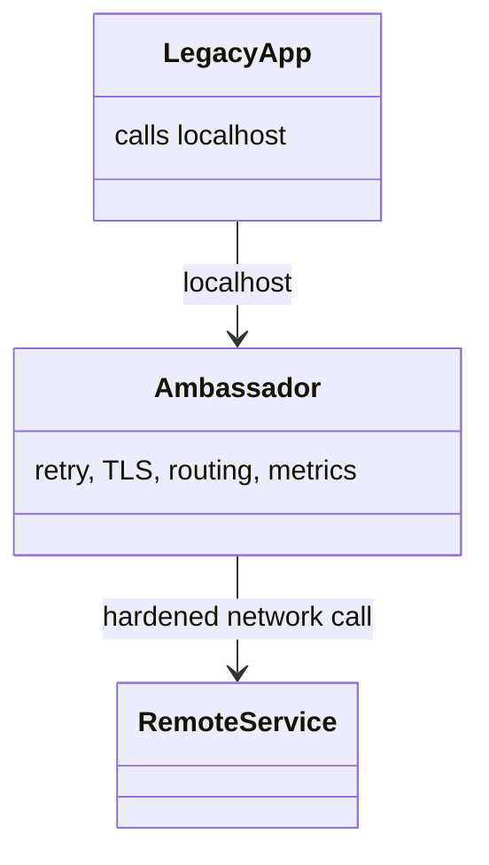
```mermaid
classDiagram
    class LegacyApp {
        calls localhost
    }
    class Ambassador {
        retry, TLS, routing, metrics
    }
    class RemoteService
    LegacyApp --> Ambassador : localhost
    Ambassador --> RemoteService : hardened network call
```

**Trade-offs.** *Pros:* offloads networking from app code; consistent policy across a
polyglot fleet; great for modernizing legacy clients. *Cons:* extra network hop and latency;
another process to operate; can obscure where retries/timeouts actually happen. *Use* to add
resilient networking to clients you can't or won't modify. *Avoid* where a native client
library already does this well. **Vs. Sidecar:** Ambassador is a *subset* (outbound proxy).
**Vs. Proxy (GoF):** the GoF proxy is *in-process*; Ambassador is a *distributed* proxy over
the network. **Vs. Gateway:** an Ambassador is *per-instance and client-side*; a Gateway is a
*shared server-side edge*.

---

## Anti-Corruption Layer (ACL)

**Problem it solves:** integrating with a legacy system or external service whose data model
and semantics are messy or incompatible risks *corrupting* your clean domain model — its
concepts leak in and pollute your code.

**Intent.** Insert a **translation layer** between your bounded context and the foreign
system. It maps the foreign model to/from your own model, so your domain stays pure and the
foreign system's quirks are quarantined at the boundary. A DDD strategic pattern.

**Example.** A new ordering service must read customers from a 20-year-old mainframe with
cryptic COBOL field names and status codes. An ACL exposes a clean `Customer` domain object;
inside, it translates `CUST-STAT-CD = 'A'` into `status = ACTIVE`, isolating the ugliness.

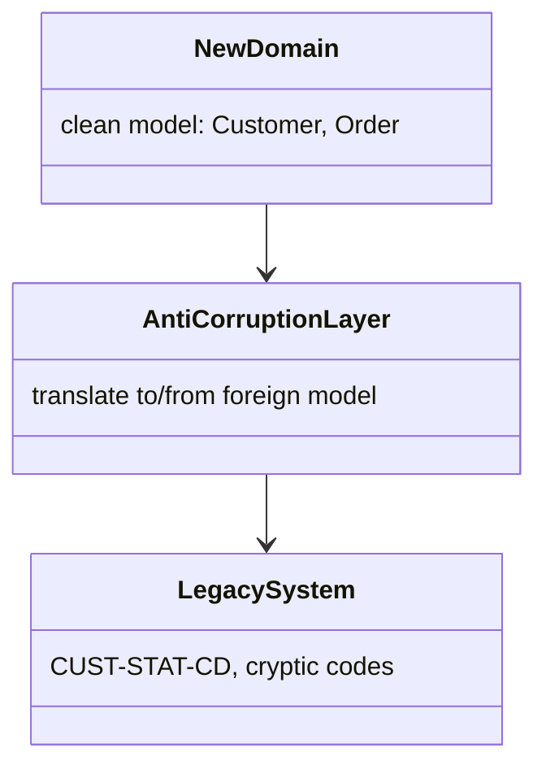
```mermaid
classDiagram
    class NewDomain {
        clean model: Customer, Order
    }
    class AntiCorruptionLayer {
        translate to/from foreign model
    }
    class LegacySystem {
        CUST-STAT-CD, cryptic codes
    }
    NewDomain --> AntiCorruptionLayer
    AntiCorruptionLayer --> LegacySystem
```

**Trade-offs.** *Pros:* protects domain integrity, decouples from legacy change, essential
during migrations. *Cons:* translation code to build and maintain; possible latency and data
duplication; can become a large subsystem itself. *Use* whenever integrating systems with
mismatched or lower-quality models, and during Strangler Fig migrations. *Avoid* when models
already align well. **Vs. Adapter (GoF):** an Adapter matches interfaces at the *class level*;
an ACL protects the *model/semantics* at the *bounded-context level* — often a whole
subsystem, not one class. Cross-ref `microservices-ddd-and-boundaries`.

---

## Adapter

**Problem it solves:** a consumer expects one interface/protocol/format, but the service it
must talk to offers another. Without a shim, you'd rewrite the consumer or the service.

**Intent.** Interpose an **adapter** that converts one service's interface, protocol, or data
format into what the consumer expects — the cloud/integration analogue of the GoF Adapter.
Think protocol adapters, format converters, and monitoring adapters that expose a common
telemetry shape from heterogeneous components.

**Example.** A metrics platform expects Prometheus-format `/metrics`. A legacy service emits
StatsD. An adapter subscribes to the StatsD stream and re-exposes it as Prometheus text —
letting one monitoring system ingest both.

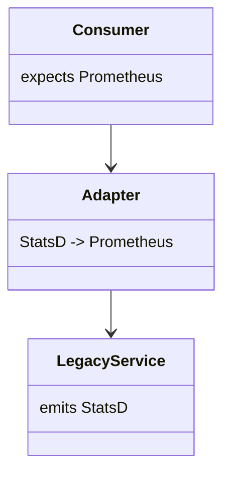
```mermaid
classDiagram
    class Consumer {
        expects Prometheus
    }
    class Adapter {
        StatsD -> Prometheus
    }
    class LegacyService {
        emits StatsD
    }
    Consumer --> Adapter
    Adapter --> LegacyService
```

**Trade-offs.** *Pros:* reuse incompatible components without changing them; localize the
mismatch. *Cons:* **adapter proliferation** (one per pairing) and adapters can *hide*
impedance mismatches that should be fixed at the source. *Use* for protocol/format conversion
and to standardize telemetry. *Avoid* when you can fix the interface directly. **Vs. ACL:**
an Adapter does *interface/format conversion*; an ACL does *model/semantic protection* at a
context boundary. **Vs. Messaging Bridge:** an Adapter matches *interfaces*; a Bridge connects
two *messaging infrastructures*.

---

## Messaging Bridge

**Problem it solves:** an organization runs two (or more) different messaging systems — say
an on-prem JMS broker and a cloud message bus — and messages must flow between them, but they
speak different protocols and formats.

**Intent.** A **bridge** connects two messaging systems: it consumes from one, translates the
message, and publishes to the other, so applications on each side interoperate without direct
knowledge of the other's technology.

**Example.** A legacy on-prem system publishes to IBM MQ; new cloud services subscribe to a
cloud pub/sub topic. A messaging bridge consumes from MQ, maps headers/payloads, and
republishes to the cloud topic (and vice versa for replies).

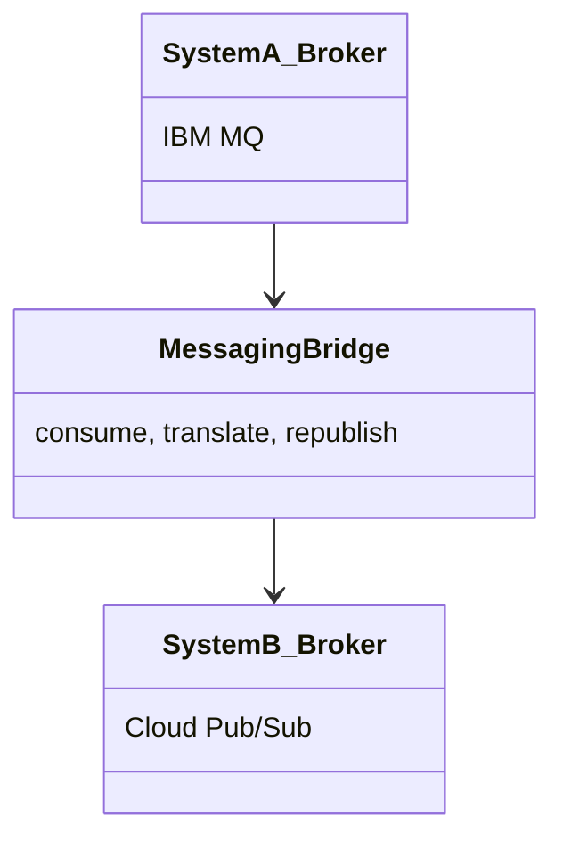
```mermaid
classDiagram
    class SystemA_Broker {
        IBM MQ
    }
    class MessagingBridge {
        consume, translate, republish
    }
    class SystemB_Broker {
        Cloud Pub/Sub
    }
    SystemA_Broker --> MessagingBridge
    MessagingBridge --> SystemB_Broker
```

**Trade-offs.** *Pros:* integrates heterogeneous messaging without rewriting endpoints;
enables incremental migration between brokers. *Cons:* the bridge is a **bottleneck and
potential SPOF**, adds latency, and must handle ordering/duplication/failure between two
systems. *Use* to interconnect distinct messaging infrastructures or migrate between them.
*Avoid* when both sides can use one broker. **Vs. Adapter:** a Bridge connects two *messaging
systems* to each other; an Adapter matches an *interface* for a consumer. **Vs. Gateway
Routing:** routing dispatches within one protocol; a bridge *translates between* protocols.

---

## Deployment Stamps

**Problem it solves:** a single shared deployment doesn't scale past a point and mixes all
tenants together (noisy-neighbor, blast radius, per-tenant compliance). You need to scale by
*replicating the whole stack* and isolate groups of tenants.

**Intent.** Deploy multiple independent copies (**stamps**, also "cells" or "scale units") of
the entire application + data tier. Each stamp serves a subset of tenants. You scale by adding
stamps; a failure or bad deploy is contained to one stamp.

**Example.** A SaaS product deploys identical stamps per region/tenant-tier. A traffic router
maps tenant → stamp. Onboarding a big customer = spin up a new stamp; a bad release blast
radius = one stamp's tenants, not all.

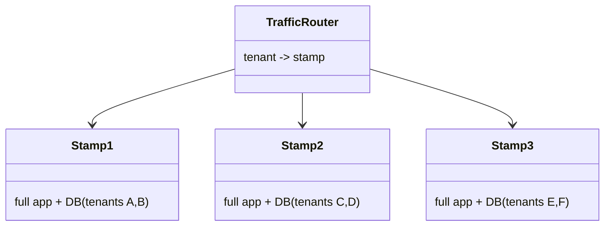
```mermaid
classDiagram
    class TrafficRouter {
        tenant -> stamp
    }
    class Stamp1 {
        full app + DB (tenants A,B)
    }
    class Stamp2 {
        full app + DB (tenants C,D)
    }
    class Stamp3 {
        full app + DB (tenants E,F)
    }
    TrafficRouter --> Stamp1
    TrafficRouter --> Stamp2
    TrafficRouter --> Stamp3
```

**Trade-offs.** *Pros:* near-linear scaling by unit, tenant isolation, contained blast
radius, easier compliance/data-residency. *Cons:* **cross-stamp** operations and global
queries get hard; managing many stamps multiplies deployment/monitoring effort; capacity is
lumpy (per-stamp). *Use* for multi-tenant SaaS at scale and strong isolation needs. *Avoid*
for small single-tenant apps. **Vs. Sharding:** a stamp replicates the *whole app + data* as
a unit; sharding partitions *one data store*. **Vs. Geode:** stamps are *isolated* scale units
(a tenant lives in one); geodes are *geo-distributed active-active* nodes that any request can
hit.

---

## Geodes

**Problem it solves:** a global user base needs low latency and high availability everywhere,
but a single-region backend (or primary-with-read-replicas) forces distant users through long
round-trips and creates a regional SPOF.

**Intent.** Deploy **geo-distributed active-active** backend nodes ("geodes" = geographical
nodes) across regions; *any* node can serve *any* request (read and write). A global data
layer replicates state between them so the system behaves as one logical service near every
user.

**Example.** A global API runs identical geodes in 6 regions behind geo-DNS/anycast. A user
in Tokyo and one in Frankfurt each hit their nearest geode; both can write, and a globally
replicated store (e.g. Cosmos DB multi-region write) reconciles state.

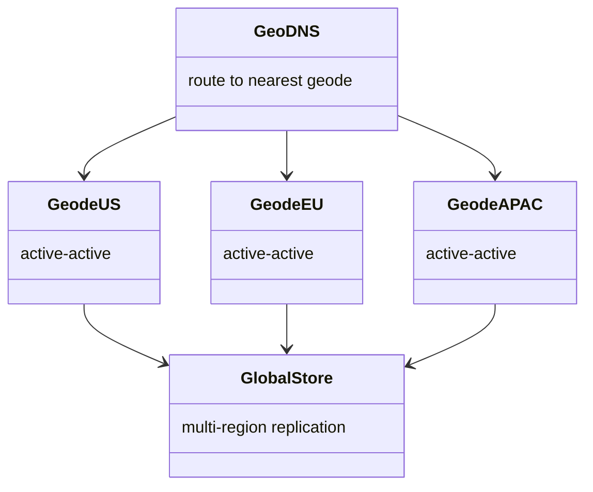
```mermaid
classDiagram
    class GeoDNS {
        route to nearest geode
    }
    class GeodeUS {
        active-active
    }
    class GeodeEU {
        active-active
    }
    class GeodeAPAC {
        active-active
    }
    class GlobalStore {
        multi-region replication
    }
    GeoDNS --> GeodeUS
    GeoDNS --> GeodeEU
    GeoDNS --> GeodeAPAC
    GeodeUS --> GlobalStore
    GeodeEU --> GlobalStore
    GeodeAPAC --> GlobalStore
```

**Trade-offs.** *Pros:* low latency worldwide, no single-region SPOF, active-active resilience.
*Cons:* **global data replication with multi-master writes** means conflict resolution and
eventual consistency are hard and expensive; operationally complex. *Use* for latency-sensitive
global services that can tolerate eventual consistency. *Avoid* when strong global consistency
is required or traffic is regional. **Vs. Deployment Stamps:** geodes are *geo-distributed and
active-active everywhere* (any node serves any user); stamps are *isolated units* (a tenant is
pinned to one). **Vs. primary-replica geo-failover:** geodes write everywhere; failover writes
to one primary at a time.

---

## Compute Resource Consolidation

**Problem it solves:** running many small, underutilized tasks each in its own compute unit
(VM/container) wastes money and management overhead — lots of idle capacity and per-unit
billing/ops.

**Intent.** **Consolidate** multiple tasks or components onto a single compute unit to raise
utilization and cut cost/overhead. Group tasks with compatible lifecycle, scaling, and
security requirements.

**Example.** Ten lightweight background jobs, each formerly on its own VM at 5% CPU, are
co-located as separate processes/containers on one right-sized VM at 60% CPU — one-tenth the
machines to pay for and patch.

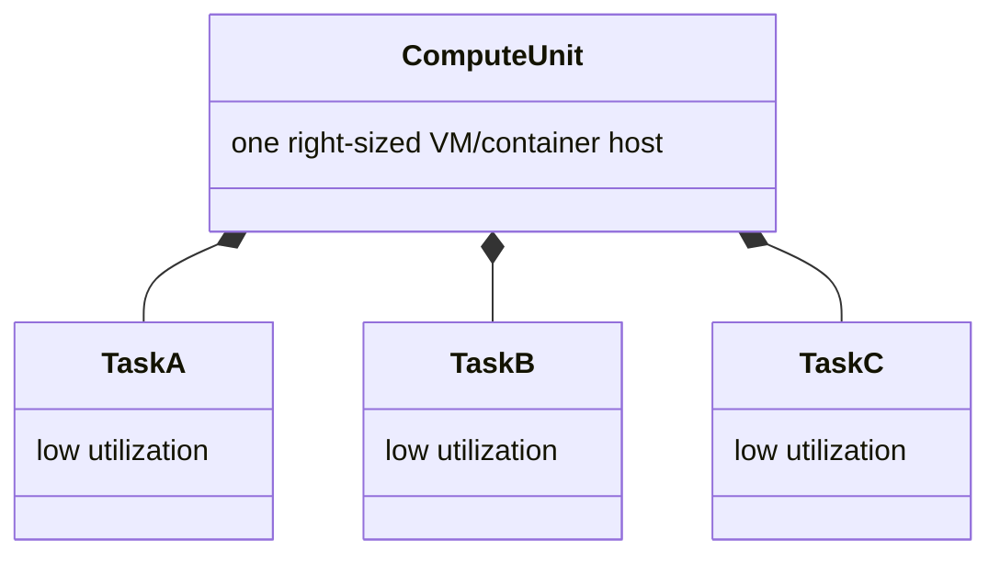
```mermaid
classDiagram
    class ComputeUnit {
        one right-sized VM/container host
    }
    class TaskA {
        low utilization
    }
    class TaskB {
        low utilization
    }
    class TaskC {
        low utilization
    }
    ComputeUnit *-- TaskA
    ComputeUnit *-- TaskB
    ComputeUnit *-- TaskC
```

**Trade-offs.** *Pros:* higher utilization, lower cost, less to manage. *Cons:* **co-tenancy
contention** (a noisy task starves neighbors), reduced isolation, correlated failure (host
down = all tasks down), and mixed scaling needs are hard to satisfy together. *Use* for many
small, compatible, low-utilization workloads. *Avoid* when tasks need strong isolation or have
divergent scaling/security profiles. **Vs. Bulkhead:** direct tension — consolidation *packs*
work together for efficiency; a Bulkhead *isolates* it apart for safety. The right answer
depends on whether you're optimizing cost or blast radius.

---

## Static Content Hosting

**Problem it solves:** serving static assets (images, JS, CSS, videos) from your application
servers wastes compute, adds latency for distant users, and doesn't scale cheaply.

**Intent.** Serve static content **directly from a storage service and/or CDN** rather than
the app tier. The app returns URLs pointing at object storage/CDN edges; clients fetch assets
from there, freeing the app to do dynamic work.

**Example.** A web app uploads product images to object storage fronted by a CDN. HTML from
the app references `https://cdn.example.com/img/...`; browsers fetch images from the nearest
edge, never touching the app servers.

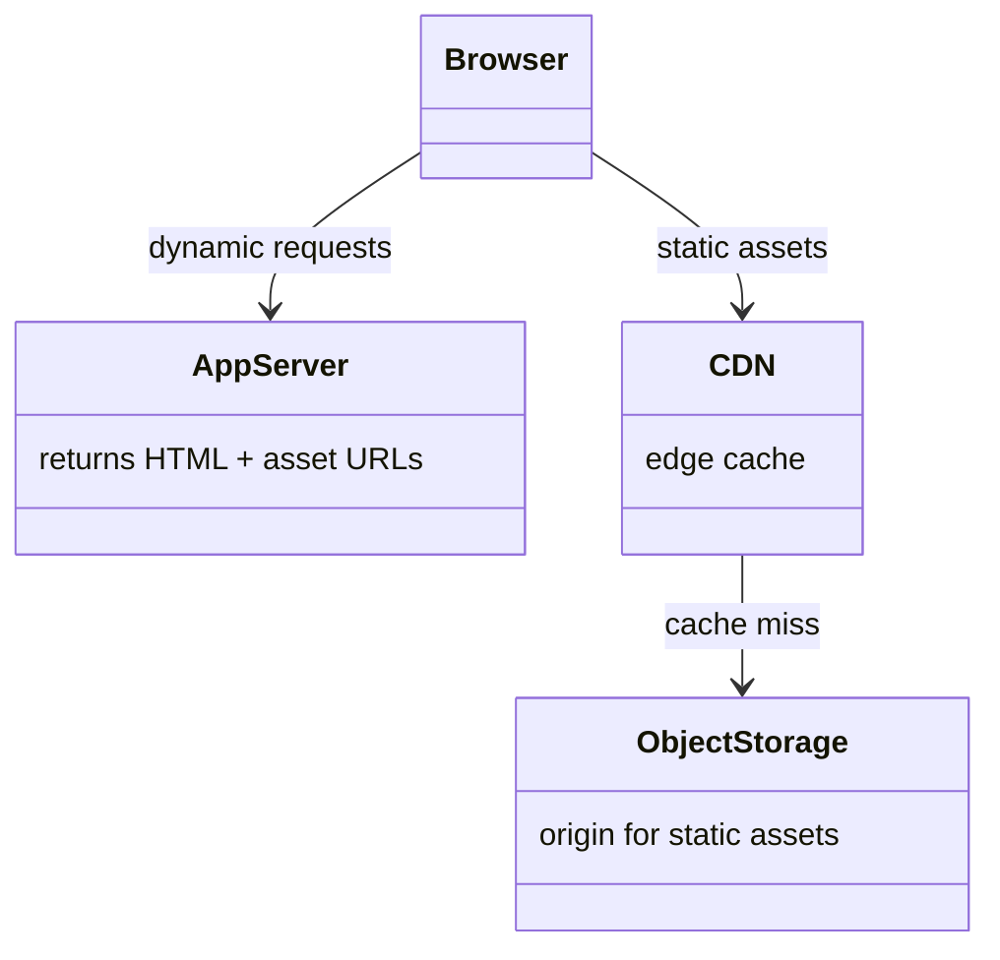
```mermaid
classDiagram
    class Browser
    class AppServer {
        returns HTML + asset URLs
    }
    class CDN {
        edge cache
    }
    class ObjectStorage {
        origin for static assets
    }
    Browser --> AppServer : dynamic requests
    Browser --> CDN : static assets
    CDN --> ObjectStorage : cache miss
```

**Trade-offs.** *Pros:* offloads the app tier, global low-latency delivery, cheap and
elastically scalable, high availability. *Cons:* **cache invalidation and versioning** are
hard (a changed asset may be served stale); not for dynamic/personalized content; access
control on private assets needs extra work (see Valet Key). *Use* for immutable, cacheable
assets. *Avoid* for content that changes per request. **Vs. Gateway Offloading:** offloading
moves cross-cutting concerns to *the gateway*; static hosting moves *asset serving* to
storage/CDN edge.

---

## Strangler Fig

**Problem it solves:** rewriting a large legacy system in one "big bang" is enormously risky
and often fails. You need to *incrementally* replace it while keeping the system running the
whole time.

**Intent.** Named after the strangler fig vine that grows around a tree and eventually
replaces it: put a **façade/router** in front of the legacy system, then migrate functionality
slice by slice to a new implementation, routing each migrated slice to the new code. When
nothing is left routing to the legacy, retire it.

**Example.** A monolith's façade sits at the edge. First, "user profile" moves to a new
service and the router sends `/profile/*` there; the monolith still handles everything else.
Over months more slices migrate until the monolith is empty and deleted.

```mermaid
sequenceDiagram
    participant C as Client
    participant F as Façade / Router
    participant N as New Service
    participant L as Legacy Monolith
    C->>F: /profile/*
    F->>N: migrated slice
    N-->>C: response
    C->>F: /billing/*
    F->>L: not yet migrated
    L-->>C: response
```

**Trade-offs.** *Pros:* incremental, low-risk migration; value delivered continuously;
rollback per slice. *Cons:* the façade/routing must run for the *entire* (often long)
migration and can itself become complex; risk of a **stalled "forever strangle"** where the
last hard bits never move and you run both systems indefinitely. *Use* to modernize a
monolith/legacy system safely. *Avoid* for small systems where a rewrite is cheap. **Vs. ACL:**
Strangler Fig is the *migration strategy*; an ACL is the *model-protection layer* frequently
used *alongside* it so the new services aren't polluted by the legacy model.

---

## API Gateway

**Problem it solves:** if every client talks directly to dozens of fine-grained backend
services, clients must know the service topology, deal with chatty round-trips, and each
service must re-implement cross-cutting concerns (auth, TLS, rate limiting). You want a single,
stable front door for the whole system.

**Intent.** Introduce **one entry point** that sits between external clients and the internal
services. It routes requests, and typically also offloads cross-cutting concerns and composes
responses — i.e. it is the umbrella pattern under which **Gateway Routing**, **Gateway
Aggregation**, and **Gateway Offloading** are specific responsibilities. Clients see one API;
the internal decomposition stays hidden and free to change.

**Example.** `api.shop.com` is the gateway. It terminates TLS, validates the JWT, rate-limits
per API key, routes `/orders/*` to the Orders service and `/catalog/*` to the Catalog service,
and exposes a composite `/home` that aggregates several services. A client integrates with one
host and one auth scheme.

```mermaid
classDiagram
    class Client
    class APIGateway {
        routing
        auth + TLS
        rate limiting
        aggregation
    }
    class OrdersSvc
    class CatalogSvc
    class UsersSvc
    Client --> APIGateway
    APIGateway --> OrdersSvc
    APIGateway --> CatalogSvc
    APIGateway --> UsersSvc
```

**Trade-offs.** *Pros:* single front door, hides internal topology, centralizes cross-cutting
concerns, reduces client chatter. *Cons:* it is a **SPOF and scaling bottleneck** if
under-provisioned, and can grow into a coupled **"god" component** that everyone must change;
adds a network hop and operational ownership questions. *Use* as the default edge for a
microservices system. *Avoid* stuffing business logic into it, and *avoid* a single gateway
when client types diverge sharply (use BFF). **Vs. BFF:** an API Gateway is one *general-purpose*
edge for all clients; BFF gives each client type (mobile, web) its *own* tailored gateway.
**Vs. Reverse Proxy / L4 load balancer:** a gateway is application-aware (auth, aggregation,
L7 routing); a plain proxy/LB forwards or balances by IP/port/host without understanding the
API. Cross-ref `api-gateways-and-bff` for the whiteboard deep-dive. Real-world: Kong, Amazon
API Gateway, Apigee, Spring Cloud Gateway, NGINX/Envoy.

---

## Gateway Aggregation

**Problem it solves:** a client (especially mobile) needs data from several backend services;
making N separate round-trips over a high-latency network is slow and drains battery/bandwidth.

**Intent.** A **gateway** receives one client request, fans out to the several backend
services, composes their responses into a single payload, and returns it — collapsing N client
round-trips into one.

**Example.** A mobile home screen needs profile, orders, and recommendations. Instead of 3
calls, the app calls the gateway's `/home`; the gateway calls all 3 backends (in parallel),
merges the JSON, and returns one response.

```mermaid
sequenceDiagram
    participant C as Client
    participant G as Gateway
    participant P as Profile
    participant O as Orders
    participant R as Recs
    C->>G: GET /home
    par fan-out
        G->>P: get profile
        G->>O: get orders
        G->>R: get recs
    end
    P-->>G: profile
    O-->>G: orders
    R-->>G: recs
    G-->>C: composed response
```

**Trade-offs.** *Pros:* fewer client round-trips, less chatter, lower client complexity.
*Cons:* the gateway becomes **complex and coupled** to backends and is a **latency-coupling
point** — the slowest backend gates the whole response; a gateway failure affects all. *Use*
for chatty clients over high-latency links. *Avoid* when a single backend call suffices.
**Vs. API Composition:** API Composition is typically a *data-query join* across services to
answer a query; aggregation is the *general* request-composition idea. **Vs. Scatter-Gather:**
aggregation composes *distinct* backend calls; scatter-gather sends the *same* request to many
peers. Cross-ref `api-gateways-and-bff`.

---

## Gateway Offloading

**Problem it solves:** every service independently implementing shared, cross-cutting concerns
(TLS termination, authentication, response compression, rate limiting) is duplicated effort
and inconsistent.

**Intent.** Move those shared concerns *out of the individual services* and into the
**gateway** at the edge, where they're implemented once and applied uniformly to all traffic.

**Example.** The API gateway terminates TLS, validates the JWT, and gzips responses for every
downstream service. The services themselves speak plain HTTP internally and trust the gateway's
auth context — no per-service TLS/auth code.

```mermaid
classDiagram
    class Client
    class Gateway {
        TLS, auth, compression, rate-limit
    }
    class ServiceA {
        business logic only
    }
    class ServiceB {
        business logic only
    }
    Client --> Gateway
    Gateway --> ServiceA
    Gateway --> ServiceB
```

**Trade-offs.** *Pros:* one place for cross-cutting concerns, consistent policy, simpler
services, specialized/optimized gateway hardware. *Cons:* the gateway becomes a **SPOF and a
shared coupling/scaling bottleneck**; a misconfiguration affects everyone; the internal
network must be trusted. *Use* for concerns that are genuinely uniform across services.
*Avoid* offloading service-specific logic (that belongs in the service). **Vs.
Sidecar/Ambassador:** offloading centralizes concerns at *one shared edge*; sidecar/ambassador
put them *per-instance* alongside each app (no shared SPOF, but more copies).

---

## Gateway Routing

**Problem it solves:** clients shouldn't need to know the addresses/topology of many backend
services, and you want to change routing (versions, blue/green, splitting a monolith) without
touching clients.

**Intent.** Expose a single endpoint and **route** each request to the appropriate backend
based on layer-7 attributes (path, host, header, version). Clients see one stable URL; routing
rules map requests to services behind it.

**Example.** `api.example.com/orders/*` → orders service, `/users/*` → users service, and
`Header: version=2` → v2 deployment. Moving a route to a new service or shifting 10% of
traffic to a canary is a gateway config change, invisible to clients.

```mermaid
sequenceDiagram
    participant C as Client
    participant G as Gateway (L7 router)
    participant O as Orders svc
    participant U as Users svc
    C->>G: GET /orders/42
    G->>O: route by path /orders/*
    O-->>C: response
    C->>G: GET /users/7
    G->>U: route by path /users/*
    U-->>C: response
```

**Trade-offs.** *Pros:* decouples clients from topology; enables versioning, canary,
blue/green, and monolith decomposition without client changes. *Cons:* routing rules become a
**config bottleneck** and the gateway is a **SPOF**; misroutes are easy to introduce. *Use* to
present many services as one endpoint and to control rollout. *Avoid* piling business logic
into routing. **Vs. Aggregation/Offloading:** routing only *dispatches* (one request → one
backend); aggregation *composes* many, offloading *handles cross-cutting concerns* — often all
combined in one gateway. **Vs. an L4 load balancer:** routing is *application-layer* (path/host);
an L4 LB balances by IP/port without understanding HTTP.

---

## Backends for Frontends (BFF)

**Problem it solves:** a single general-purpose API/gateway can't serve wildly different
clients well — a mobile app wants small, tailored payloads; a desktop web app wants rich ones;
a third-party wants a stable contract. One API forces compromises and bloat.

**Intent.** Create a **dedicated gateway per client type** (mobile BFF, web BFF, partner BFF).
Each BFF is owned by the team building that frontend and shapes/aggregates backend data
exactly for its client's needs.

**Example.** The mobile BFF returns a compact home payload optimized for a small screen and
slow network; the web BFF returns a richer one with extra widgets. Both call the same
downstream services but tailor the response per client.

```mermaid
classDiagram
    class MobileApp
    class WebApp
    class MobileBFF {
        compact, mobile-shaped
    }
    class WebBFF {
        rich, web-shaped
    }
    class Services {
        shared downstream
    }
    MobileApp --> MobileBFF
    WebApp --> WebBFF
    MobileBFF --> Services
    WebBFF --> Services
```

**Trade-offs.** *Pros:* each client gets a tailored, optimal API; frontend teams own their
BFF and iterate independently; avoids one-size-fits-none bloat. *Cons:* **code duplication**
across BFFs (shared logic can drift) and more services to build/own/operate. *Use* when client
types have materially different needs. *Avoid* when clients are similar (one gateway is
simpler). **Vs. general API Gateway:** a plain gateway is a *single* general-purpose entry for
all clients; a BFF is *one gateway per client type*. Cross-ref `api-gateways-and-bff`.

---

## Gatekeeper

**Problem it solves:** exposing application/data services directly to untrusted clients means
a vulnerability in the app can be exploited to reach sensitive data/resources. You want to
minimize the attack surface reachable from outside.

**Intent.** Insert a **dedicated, hardened broker host** between clients and the protected
backend. The gatekeeper validates and sanitizes all requests, holds no sensitive keys itself,
and forwards only clean requests to a *trusted host* that actually accesses storage/services.
Compromising the gatekeeper doesn't hand over the keys.

**Example.** Public traffic hits the gatekeeper in a DMZ; it validates schema, auth, and rate,
then passes sanitized requests over a private link to a trusted host that holds the storage
credentials. The gatekeeper never has direct access to the data store.

```mermaid
classDiagram
    class Client
    class Gatekeeper {
        validate + sanitize, no secrets
    }
    class TrustedHost {
        holds credentials, accesses data
    }
    class DataStore
    Client --> Gatekeeper
    Gatekeeper --> TrustedHost : private link
    TrustedHost --> DataStore
```

**Trade-offs.** *Pros:* strong security isolation; limits blast radius of an app compromise;
separates validation from privileged access. *Cons:* extra hop and latency; the gatekeeper is
itself a **high-value target** and another component to secure/operate. *Use* for
security-sensitive, internet-facing systems. *Avoid* when an API gateway + WAF already meets
your threat model. **Vs. API Gateway:** a Gateway focuses on *routing/aggregation*; a
Gatekeeper focuses on *security isolation* (validation + privilege separation). **Vs. Valet
Key:** the gatekeeper *mediates* every access; a valet key grants *direct* scoped access,
bypassing the app.

---

## Valet Key

**Problem it solves:** proxying large data transfers (uploads/downloads) through your app
wastes app bandwidth/CPU and adds latency, but you can't just hand out your storage
credentials to clients.

**Intent.** Issue the client a **scoped, time-limited token** (e.g. a pre-signed URL / SAS
token) that grants *direct* access to a *specific* resource for a *short* window and *limited*
operations. The client then talks straight to the storage service; the app is out of the data
path.

**Example.** To upload a video, the client asks the app for a valet key. The app returns a
pre-signed URL valid for 15 minutes, PUT-only, scoped to one object key. The client uploads
directly to object storage; the app never touches the bytes.

```mermaid
sequenceDiagram
    participant C as Client
    participant A as App
    participant S as Storage
    C->>A: request upload permission
    A->>A: mint scoped, time-limited token
    A-->>C: pre-signed URL (PUT, 15 min, one key)
    C->>S: upload directly with token
    S-->>C: 200 OK
```

**Trade-offs.** *Pros:* removes the app from the data path (huge bandwidth/latency/scaling
win); leverages the storage service's own throughput. *Cons:* **token leakage or over-broad
scope** is a real risk; tokens are **hard to revoke early** (valid until expiry); requires
careful scoping and short TTLs. *Use* for large or high-volume direct transfers. *Avoid* when
you must inspect/transform every byte, or for highly sensitive data needing per-request
mediation. **Vs. Gatekeeper:** a valet key gives *direct scoped access bypassing the app*; a
gatekeeper *mediates* every request through a hardened broker.

---

## Federated Identity

**Problem it solves:** building and operating your own user authentication (passwords, MFA,
account recovery) is costly and risky, and users don't want yet another login. You want to
delegate authentication and support SSO.

**Intent.** Delegate authentication to a trusted **external Identity Provider (IdP)** via a
standard protocol (OIDC/OAuth2, SAML). Your app *trusts* tokens the IdP issues; the IdP
handles credentials, MFA, and SSO across relying parties.

**Example.** "Sign in with Google/your corporate IdP": the app redirects the user to the IdP,
which authenticates them and returns a signed token (OIDC ID token). The app validates the
token's signature and claims and establishes a session — it never sees the password.

```mermaid
sequenceDiagram
    participant U as User
    participant App as Relying App
    participant IdP as Identity Provider
    U->>App: access protected resource
    App-->>U: redirect to IdP
    U->>IdP: authenticate (password + MFA)
    IdP-->>U: signed token (OIDC/SAML)
    U->>App: present token
    App->>App: validate signature + claims
    App-->>U: grant access
```

**Trade-offs.** *Pros:* no credential storage burden, SSO, centralized MFA/policy, faster
onboarding. *Cons:* **IdP outage = auth outage** for everyone; trust configuration
(certificates, discovery, clock skew) is fiddly; you depend on a third party's security. *Use*
for SSO, enterprise/social login, and to avoid owning credentials. *Avoid* only where you must
fully control the entire identity lifecycle offline. **Vs. Gatekeeper / access token:**
federated identity answers *who authenticates the user* (the IdP); the token/gatekeeper layer
answers *how that identity is propagated and enforced* at the resource.

---

## External Configuration Store

**Problem it solves:** configuration baked into deployment artifacts means every config change
requires a redeploy, and settings can't be shared or updated consistently across many
instances/services.

**Intent.** Move configuration *out* of the application package into a **centralized external
store** (config service, key-value store, parameter store). Instances read config at
startup/runtime; changes propagate without rebuilding or redeploying the app.

**Example.** Feature flags, connection strings, and tuning parameters live in a central config
service. Flipping a feature flag or rotating a DB endpoint updates the store; instances pick up
the new value (on next read or via push), no redeploy.

```mermaid
classDiagram
    class ConfigStore {
        central key-value / params + secrets
    }
    class InstanceA
    class InstanceB
    class InstanceC
    InstanceA --> ConfigStore : read config
    InstanceB --> ConfigStore : read config
    InstanceC --> ConfigStore : read config
```

**Trade-offs.** *Pros:* change config without redeploy, share settings across services,
central audit and control, environment-specific overrides. *Cons:* the store becomes a
**runtime dependency / SPOF** (cache locally to survive outages); **secret handling** needs
encryption and access control; stale caches can cause drift. *Use* for shared, frequently
changing, or environment-specific settings. *Avoid* for truly static build-time constants.
**Vs. env/hardcoded config:** externalized config is *dynamic and centralized* vs baked-in.
**Vs. Service Registry:** a config store holds *settings*; a service registry holds *live
endpoint locations* — related but distinct concerns.

---

## Saga

**Problem it solves:** a business transaction spans multiple services, each with its own
database, so you can't use a single ACID transaction — and distributed 2PC doesn't scale and
harms availability. You need data consistency across services without a global lock.

**Intent.** Model the transaction as a **sequence of local transactions**, one per service,
coordinated by events or a controller. If any step fails, run **compensating transactions** to
undo the prior steps. Two styles: **orchestration** (a central coordinator directs each step)
and **choreography** (services react to each other's events, no central brain).

**Example.** Place-order saga: Order (pending) → Payment (charge) → Inventory (reserve) →
Order (confirmed). If Inventory fails, compensate: refund payment, cancel order.

```mermaid
sequenceDiagram
    participant Orc as Orchestrator
    participant Pay as Payment
    participant Inv as Inventory
    Orc->>Pay: charge
    Pay-->>Orc: charged ✓
    Orc->>Inv: reserve stock
    Inv-->>Orc: out of stock ✗
    Note over Orc: compensate
    Orc->>Pay: refund (compensating tx)
```

**Trade-offs.** *Pros:* consistency across services without distributed locks; scalable and
available. *Cons:* **no isolation** — intermediate states are visible (dirty reads), so you
must design for eventual consistency and countermeasures (semantic locks, commutative updates);
compensations add complexity; debugging is harder. *Use* for multi-service business
transactions. *Avoid* when a single local ACID transaction (one service, one DB) suffices.
**Vs. 2PC / distributed transaction:** a Saga is *eventually consistent with no distributed
lock*; 2PC is *atomic but blocking* and doesn't scale. **Orchestration vs choreography** is
covered under those sections. Deep dive → `event-driven-cqrs-saga-cdc`.

---

## CQRS (Command Query Responsibility Segregation)

**Problem it solves:** a single model serving both writes and reads becomes a compromise —
complex domain logic for writes fights denormalized, query-optimized shapes for reads, and the
two have very different scaling and consistency needs.

**Intent.** **Separate the write model (commands)** from the **read model (queries)** — often
into distinct code paths and even distinct data stores. Commands mutate state and emit events;
the read side maintains query-optimized projections. Each side scales and evolves
independently.

**Example.** An e-commerce app writes orders through a rich domain model into a normalized SQL
store; a projector builds a denormalized "order history" view in Elasticsearch that the read
API queries. Reads never touch the write store.

```mermaid
classDiagram
    class Client
    class CommandModel {
        validate + mutate (writes)
    }
    class WriteStore
    class ReadModel {
        denormalized queries
    }
    class ReadStore {
        projections
    }
    Client --> CommandModel : commands
    CommandModel --> WriteStore
    WriteStore ..> ReadStore : project (async events)
    Client --> ReadModel : queries
    ReadModel --> ReadStore
```

**Trade-offs.** *Pros:* independent scaling and optimization of reads vs writes; simpler,
purpose-built models; fits complex domains. *Cons:* **eventual consistency** between write and
read models (a read may lag a just-completed write) and real operational complexity — it's
**overkill for simple CRUD**. *Use* for high-read/write asymmetry, complex domains, or when
paired with event sourcing. *Avoid* for straightforward CRUD apps. **Vs. Event Sourcing:**
orthogonal and often paired but independent — you can do CQRS without event sourcing. **Vs.
Materialized View:** a materialized view is the *mechanism* for a read projection; CQRS is the
*architectural separation*. Cross-ref `event-driven-cqrs-saga-cdc`.

---

## Event Sourcing

**Problem it solves:** storing only the *current* state loses history — you can't answer "how
did we get here?", audit changes, or rebuild alternative views, and concurrent updates
overwrite each other's intent.

**Intent.** Persist state as an **append-only log of immutable events** ("OrderCreated",
"ItemAdded", "OrderShipped"). Current state is derived by **replaying** events. The event log
is the source of truth; you never update-in-place.

**Example.** Instead of an `accounts` row with `balance = 100`, store the events
`Deposited(100)`, `Withdrew(30)`, `Deposited(50)`; balance = replay = 120. A new "monthly
statement" view is built by replaying the same events differently.

```mermaid
sequenceDiagram
    participant C as Command Handler
    participant ES as Event Store (append-only)
    participant P as Projection
    C->>ES: append Deposited(100)
    C->>ES: append Withdrew(30)
    C->>ES: append Deposited(50)
    P->>ES: read event stream
    ES-->>P: [Deposited,Withdrew,Deposited]
    P->>P: replay -> balance = 120
```

**Trade-offs.** *Pros:* complete audit trail, temporal queries, rebuild any view, natural fit
for event-driven systems, no lost updates. *Cons:* **replay cost** grows (need snapshots),
**event schema/versioning** is hard (old events are immutable forever), read models are
eventually consistent, and it's a steep mental shift. *Use* when history/audit matters or with
CQRS/event-driven architectures. *Avoid* for simple CRUD or when only current state matters.
**Vs. CQRS:** orthogonal (often combined). **Vs. Transaction log / CDC:** event sourcing makes
*events the source of truth by design*; CDC *derives* events from a database's transaction log
after the fact. Deep dive → `event-driven-cqrs-saga-cdc`.

---

## Transactional Outbox

**Problem it solves:** a service must both **update its database** and **publish a message**
about that change. Doing them as two separate operations risks the classic **dual-write**
failure: the DB commit succeeds but the publish fails (or vice versa), leaving state and
messages inconsistent — and there's no distributed transaction across DB and broker.

**Intent.** Write the domain change **and** the outgoing message into an **outbox table in the
same local database transaction** (atomic). A separate **relay** reads unsent rows from the
outbox and publishes them to the broker, marking them sent. Two mechanisms for the relay:
**Polling Publisher** (poll the table) and **Transaction Log Tailing / CDC** (tail the DB log).

**Example.** `OrderService.placeOrder()` inserts the order row and an `OrderPlaced` outbox row
in one transaction. A relay polls the outbox every 200 ms (or a CDC connector tails the WAL)
and publishes `OrderPlaced` to Kafka, then marks it sent.

```mermaid
sequenceDiagram
    participant S as Service
    participant DB as DB (business + outbox)
    participant R as Relay (poller / CDC)
    participant B as Broker
    S->>DB: BEGIN, write order + outbox row, COMMIT
    R->>DB: read unsent outbox rows
    DB-->>R: [OrderPlaced]
    R->>B: publish OrderPlaced
    R->>DB: mark row sent
```

**Trade-offs.** *Pros:* guarantees the message is published iff the DB change committed — no
dual-write inconsistency; no distributed transaction needed. *Cons:* adds a relay to build and
operate; delivery is **at-least-once** (the relay can publish then crash before marking sent),
so **consumers must be idempotent**; polling adds latency/load (CDC avoids polling). *Use*
whenever a state change must reliably produce an event. *Avoid* when you can use native
transactional messaging. **Vs. 2PC:** the outbox *avoids* a distributed transaction using one
local transaction + a relay. **Vs. Event Sourcing:** event sourcing stores events *as* the
state; the outbox stores state *and* separately emits messages about it.

---

## Polling Publisher and Transaction Log Tailing

**Problem it solves:** the Transactional Outbox writes messages into a table, but *how* does
the relay get those rows out to the broker reliably and promptly? These are the two concrete
mechanisms for the relay.

**Intent.** Two ways to move committed outbox rows to the message broker:

- **Polling Publisher** — the relay periodically **queries the outbox table** for unsent rows,
  publishes them, and marks them sent. Simple and works on any database.
- **Transaction Log Tailing (Change Data Capture, CDC)** — a connector **reads the database's
  commit log / write-ahead log** (WAL, binlog) and turns each committed insert into a published
  message, with no application polling.

**Example.** Polling: a scheduled job runs `SELECT * FROM outbox WHERE sent=false ORDER BY id
LIMIT 100` every 200 ms, publishes each, sets `sent=true`. Log-tailing: **Debezium** tails
Postgres's WAL, sees new `outbox` rows commit, and streams them to Kafka — near-real-time and
without touching the app.

```mermaid
sequenceDiagram
    participant DB as DB (outbox + WAL)
    participant P as Polling Publisher
    participant CDC as Log Tailer (Debezium)
    participant B as Broker
    Note over P,DB: Option A - poll
    P->>DB: SELECT unsent rows
    DB-->>P: rows
    P->>B: publish, then mark sent
    Note over CDC,DB: Option B - tail the log
    DB-->>CDC: commit log entries (new outbox rows)
    CDC->>B: publish
```

**Trade-offs.** *Polling — pros:* trivial, DB-agnostic, easy to reason about. *cons:* adds
periodic query **load and latency** (poll interval), and frequent polling wastes resources.
*Log tailing — pros:* low latency, no polling load, no `sent` bookkeeping. *cons:*
**DB-specific and operationally complex** (WAL format, connector infrastructure), and fragile to
schema/log changes. *Use* polling for simplicity/low volume; log-tailing for high volume or
low-latency needs. **Vs. Transactional Outbox:** these are the *delivery mechanism*; the outbox
is the *write* pattern they serve. **Vs. CDC as an event source:** here CDC only relays the
outbox; using CDC to mine *arbitrary* business tables as events is covered in
`event-driven-cqrs-saga-cdc`. Real-world: Debezium, DynamoDB Streams, Postgres logical
replication.

---

## Idempotent Consumer (Inbox)

**Problem it solves:** message delivery is **at-least-once** (brokers redeliver on failure, and
the Transactional Outbox can publish duplicates), so a consumer may receive the same message
more than once. Processing it twice double-applies the effect (double charge, double increment).

**Intent.** Make message processing **idempotent** so re-delivery is harmless. The common
mechanism (the **Inbox** pattern): record each processed message's id in a store; on receipt,
check whether the id was already handled and skip if so — ideally recording the id *in the same
transaction* as the side effect. "Inbox" and "Idempotent Receiver" are the same intent.

**Example.** A payment consumer, before charging, inserts the message id into a `processed_messages`
table with a unique constraint in the same transaction as the charge. A duplicate delivery hits
the unique-constraint violation and is safely skipped.

```mermaid
sequenceDiagram
    participant B as Broker
    participant C as Consumer
    participant I as Inbox / dedup store
    B->>C: deliver msg id=abc
    C->>I: seen abc?
    I-->>C: no
    C->>C: process + record abc (one tx)
    B->>C: redeliver msg id=abc
    C->>I: seen abc?
    I-->>C: yes -> skip
```

**Trade-offs.** *Pros:* correctness under at-least-once delivery; enables safe retries.
*Cons:* the **dedup store grows** and needs retention/TTL management; the id check adds a
lookup per message; must scope the dedup window correctly. *Use* on any consumer of an
at-least-once channel doing non-idempotent work. *Avoid* only if the operation is *naturally*
idempotent (e.g. a pure set-to-value). **Vs. Transactional Outbox:** mirror images — the
Outbox ensures *reliable send*; the Inbox/Idempotent Consumer ensures *reliable, dedup receive*.

---

## Event-Carried State Transfer

**Problem it solves:** if events are just thin notifications ("OrderChanged, id=42"), every
consumer must call back to the source service to fetch details — creating runtime coupling,
extra load, and availability dependence on the source.

**Intent.** Make events **carry enough state** ("fat events") that consumers can keep and
update their own **local replicas** of the data they need, without calling back. Consumers
become autonomous: they can serve queries even when the source is down.

**Example.** Instead of `CustomerUpdated(id=42)`, the source emits `CustomerUpdated(id=42,
name="Ann", tier="gold", address={...})`. The shipping service stores the fields it needs
locally; when it processes an order it reads its own copy — no call to the customer service.

```mermaid
sequenceDiagram
    participant Src as Customer Service
    participant Bus as Event Bus
    participant Con as Shipping Service
    Src->>Bus: CustomerUpdated{id, name, tier, address}
    Bus->>Con: deliver fat event
    Con->>Con: update local replica
    Note over Con: later, no callback needed
    Con->>Con: read local copy to fulfill order
```

**Trade-offs.** *Pros:* consumers are decoupled and autonomous; fewer synchronous calls;
resilience to source outages. *Cons:* **data duplication** across consumers and **staleness**
(each replica lags the source); larger messages; more storage. *Use* when consumers need
source data frequently and can tolerate slight staleness. *Avoid* when data is huge, highly
sensitive, or must be strongly consistent. **Vs. thin domain/notification event:** a thin
event is a *pointer* requiring a callback; ECST *carries the data*. **Vs. Claim-Check:**
ECST puts the state *in* the event; Claim-Check *removes* a large payload from the event and
passes a reference.

---

## Cache-Aside

**Problem it solves:** repeatedly reading the same data from a slow/expensive backing store
wastes latency and load, but you want the cache to hold only data that's actually requested.

**Intent.** The **application** manages the cache (a.k.a. lazy loading). On read: check cache;
on **miss**, load from the store, populate the cache, return. On write: update the store and
**invalidate** (or update) the cache entry. The cache sits "aside" the store; the app mediates.

**Example.** `getUser(id)`: look in Redis; miss → read from the DB, `SET user:id` with a TTL,
return. `updateUser(id)`: write the DB, then `DEL user:id` so the next read repopulates.

```mermaid
sequenceDiagram
    participant App
    participant Cache
    participant DB
    App->>Cache: get user:42
    Cache-->>App: miss
    App->>DB: SELECT user 42
    DB-->>App: row
    App->>Cache: SET user:42 (TTL)
    Note over App: on write -> DEL user:42
```

**Trade-offs.** *Pros:* only caches requested data, resilient to cache failure (fall back to
DB), simple and widely used. *Cons:* an **inconsistency window** between store and cache (stale
reads after a write until invalidation), a **cache stampede** when a hot key expires (many
misses hit the DB at once — mitigate with locks/early refresh), and cold-cache latency. *Use*
for read-heavy workloads with tolerable staleness. *Avoid* when strong read-after-write
consistency is required without extra care. **Vs. read-through / write-through / write-behind:**
those are **cache-managed** (the cache library loads/writes the store); cache-aside is
**app-managed** (your code orchestrates it).

---

## Materialized View

**Problem it solves:** answering a query by joining/aggregating normalized source data at read
time is slow and expensive, especially for reports and dashboards run repeatedly.

**Intent.** **Precompute** the query result and store it as a **materialized view** — a
denormalized, query-optimized projection kept alongside the source data. Reads hit the ready
answer; the view is refreshed on a schedule or on source changes.

**Example.** A "sales by region per day" dashboard would need heavy joins/aggregations over
the orders table. Instead, a nightly (or event-driven) job maintains a `daily_sales_by_region`
view; the dashboard reads it directly in milliseconds.

```mermaid
classDiagram
    class SourceData {
        normalized orders, products
    }
    class RefreshProcess {
        precompute / project
    }
    class MaterializedView {
        denormalized, query-ready
    }
    class QueryClient
    SourceData --> RefreshProcess
    RefreshProcess --> MaterializedView
    QueryClient --> MaterializedView : fast reads
```

**Trade-offs.** *Pros:* fast reads, offloads expensive computation, tailor a view per query
pattern. *Cons:* **staleness** between refreshes, **storage cost** of the duplicate data, and
refresh cost/complexity; treat the view as disposable (rebuildable). *Use* for expensive,
frequently-run read queries tolerant of some staleness. *Avoid* when data must be perfectly
current or the query is cheap. **Vs. CQRS read model:** a materialized view is the *mechanism*;
a CQRS read model is the *architecture* that often uses one. **Vs. Index Table:** an index
holds *lookup keys*; a materialized view holds a *full projection/aggregate*.

---

## Index Table

**Problem it solves:** a data store is fast when queried by its primary/partition key but slow
(full scan) when queried by other fields, and it may not support secondary indexes natively
(many NoSQL stores).

**Intent.** Build and maintain **secondary index tables** keyed by the fields you frequently
query on; each index entry points back to the primary record(s). Queries on a non-primary
field hit the index table first, then fetch by primary key.

**Example.** Orders are stored by `orderId`, but users often query by `customerId`. You
maintain an index table keyed by `customerId → [orderId...]`. Lookup by customer reads the
index, then fetches orders by id — avoiding a full scan.

```mermaid
classDiagram
    class PrimaryStore {
        key = orderId -> order
    }
    class IndexTable {
        key = customerId -> [orderId...]
    }
    class Query {
        find by customerId
    }
    Query --> IndexTable : lookup ids
    IndexTable --> PrimaryStore : fetch by orderId
```

**Trade-offs.** *Pros:* fast lookups on non-primary fields where native indexes don't exist;
control over index shape. *Cons:* the index must be kept **consistent with the source** (dual
writes / async projection → possible lag), causing **write amplification** and extra storage;
stale indexes return wrong results. *Use* on stores lacking secondary indexes with important
non-key query patterns. *Avoid* when the store's native secondary indexes suffice. **Vs.
Materialized View:** an index gives *lookup keys* (a pointer to the record); a materialized
view stores the *full computed projection* (the answer itself).

---

## Sharding

**Problem it solves:** a single database node runs out of storage, write throughput, or memory
as data grows; you can't scale one node forever (vertical scaling hits a ceiling).

**Intent.** **Horizontally partition** the data across multiple nodes (shards) by a **shard
key**. Each shard holds a disjoint subset of the data and handles its own reads/writes, so
capacity and throughput scale with the number of shards.

**Three shard strategies, and when each wins:**

- **Hash sharding** — place the row on `hash(key) % N`. Spreads load **evenly** and avoids
  hotspots, but destroys ordering, so **range scans are impossible** (adjacent keys land on
  different shards). Use when access is point-lookup by key and you want uniform spread.
- **Range sharding** — assign contiguous key ranges to shards (`A–F` → shard 0, `G–M` → shard
  1, …). Enables **range queries and ordered scans**, but risks **hot ranges** (if today's
  timestamps or `Z*` users all fall in one range, that shard bakes). Use when you need ordered
  or range access and can pick a key that spreads evenly.
- **Directory / lookup sharding** — a lookup service maps `key → shard` explicitly. Maximally
  **flexible and rebalanceable** (move a key by editing the map), at the cost of a lookup
  **layer that is itself a dependency and potential bottleneck**. Use when placement must be
  dynamic or non-uniform (e.g. pin a whale tenant to dedicated capacity).

**Example.** A `users` table is hash-sharded across `N = 3` nodes on `hash(userId) % 3`. Say
`hash(42) = 4700` → `4700 % 3 = 2`, so user 42 lives on shard 2; `hash(99) = 8103` →
`8103 % 3 = 0`, so user 99 lives on shard 0. Each shard is an independent database; the app (or
a router) computes the shard from the key. Now grow to `N = 4`: user 42 recomputes to
`4700 % 4 = 0` — it must **move** from shard 2 to shard 0. That "modulo reshuffles almost
everything on resize" pain is exactly what Consistent Hashing (next) fixes.

```mermaid
classDiagram
    class ShardRouter {
        key -> shard
    }
    class Shard0 {
        users where hash%3==0
    }
    class Shard1 {
        users where hash%3==1
    }
    class Shard2 {
        users where hash%3==2
    }
    ShardRouter --> Shard0
    ShardRouter --> Shard1
    ShardRouter --> Shard2
```

**Trade-offs.** *Pros:* scales storage and throughput horizontally beyond one node; smaller
per-shard working sets. *Cons:* **cross-shard queries/joins and transactions** are hard;
**rebalancing** when adding shards is painful (modulo hashing reshuffles everything); a poor
shard key causes **hot shards** (skew). *Use* when one node can't hold the data/load. *Avoid*
prematurely — sharding adds major complexity. **Vs. Consistent Hashing:** sharding is *the
partitioning concept*; consistent hashing is a *key-placement strategy* that makes rebalancing
cheap. **Vs. Deployment Stamps:** sharding partitions *one data store*; stamps replicate the
*whole app + data* as a unit.

---

## Consistent Hashing

**Problem it solves:** with naive `hash(key) % N` sharding, changing the node count N remaps
*almost every key* — catastrophic when adding/removing a cache/DB node (mass cache misses,
huge data movement).

**Intent.** Map both nodes and keys onto a **hash ring**; a key belongs to the next node
clockwise. Adding or removing a node only moves the keys between it and its neighbor —
**~K/N keys** move, not all of them. **Virtual nodes** (each physical node placed at many ring
points) smooth out distribution.

**Example.** A distributed cache with 4 nodes on a ring. Adding a 5th node steals only its
arc's keys from one neighbor; the other ~80% of keys stay put — avoiding a fleet-wide cache
stampede. Used by DynamoDB, Cassandra, and many CDNs/caches.

```mermaid
classDiagram
    class HashRing {
        nodes + keys on 0..2^m circle
    }
    class VirtualNodes {
        each node at many points
    }
    class Key {
        placed at next node clockwise
    }
    HashRing *-- VirtualNodes
    Key --> HashRing : lookup clockwise
```

**Trade-offs.** *Pros:* minimal key movement on membership change; smooth scaling of
caches/partitioned stores. *Cons:* **uneven distribution** without enough virtual nodes;
lookups need the ring/routing structure; still needs replication for HA (placement ≠
durability). *Use* for elastic caches/partitioned datastores where nodes come and go. *Avoid*
when the node set is fixed and simple modulo suffices. **Vs. Sharding:** consistent hashing is
the *mechanism* for placing keys; sharding is the *overall concept* of partitioning. **Vs.
modulo/range partitioning:** modulo *rehashes everything* on resize; consistent hashing moves
the *minimum*.

---

## API Composition

**Problem it solves:** in a database-per-service world, a query needs data owned by several
services and there's no shared database to `JOIN`. You need to answer the query without a
maintained read model.

**Intent.** A **composer** (a gateway or a dedicated service) queries each owning service,
then **joins the results in memory** to produce the answer. It's the query-side counterpart to
Saga (which is the command side).

**Example.** "Show order 42 with customer name and shipment status": the composer calls the
Order service, the Customer service, and the Shipping service, then stitches the three
responses into one result object.

```mermaid
sequenceDiagram
    participant C as Client
    participant Comp as Composer
    participant O as Order svc
    participant Cu as Customer svc
    participant Sh as Shipping svc
    C->>Comp: get order 42 (enriched)
    par query owners
        Comp->>O: order 42
        Comp->>Cu: customer for 42
        Comp->>Sh: shipment for 42
    end
    O-->>Comp: order
    Cu-->>Comp: customer
    Sh-->>Comp: shipment
    Comp->>Comp: in-memory join
    Comp-->>C: composed result
```

**Trade-offs.** *Pros:* simple, no extra data store or replication, always reads live data.
*Cons:* **in-memory joins are inefficient** for large datasets (can't push down filters/joins);
availability is the **product of all sources** (any down → query fails or degrades); latency is
bound by the slowest service. *Use* for occasional cross-service queries with modest result
sizes. *Avoid* for high-volume or large-join queries — use CQRS instead. **Vs. CQRS:**
composition joins *at query time* with no replica; CQRS maintains a *precomputed read model*.
**Vs. Gateway Aggregation:** aggregation focuses on *reducing client round-trips*; composition
focuses on *joining data to answer a query*.

---

## Command-side Replica

**Problem it solves:** a service's **command side** (the code handling writes) often needs data
owned by *another* service to validate or enrich a command — e.g. checking a customer's credit
status before accepting an order. Making a synchronous remote call on every write couples
availability and adds latency to the write path.

**Intent.** Keep a **read-only local replica** of the other service's data, kept up to date by
subscribing to that service's events. The command side then performs its validation/joins
**locally** against the replica instead of calling the owning service on the hot path.

**Example.** The Order service subscribes to `CustomerCreditChanged` events from the Customer
service and maintains a small local `customer_credit` table. When placing an order it checks
credit against the local replica — no synchronous call to the Customer service, which may be
slow or down.

```mermaid
classDiagram
    class CustomerService {
        owns customer data
    }
    class OrderService {
        command side
    }
    class CreditReplica {
        read-only local copy
    }
    CustomerService ..> CreditReplica : publishes events
    OrderService --> CreditReplica : local read on write path
```

**Trade-offs.** *Pros:* the write path is **fast and self-contained** — no synchronous
cross-service call, so availability isn't coupled to the owning service. *Cons:* the replica is
**eventually consistent** (replication lag can let a command act on stale data), and you
**duplicate and maintain** another service's data plus the subscription plumbing. *Use* when
the command side validates against reference data that changes slowly and staleness is
tolerable. *Avoid* when you need strongly-consistent, up-to-the-moment values (then query the
owner or redesign the boundary). **Vs. API Composition:** composition queries the owner
**remotely at request time**; a command-side replica reads a **local copy** maintained
asynchronously. **Vs. CQRS read model:** a CQRS read model serves the *query* side; a
command-side replica exists to serve the *write/validation* path. From Richardson's
microservices.io.

---

## Database-per-Service

**Problem it solves:** if microservices share one database, they become coupled through the
schema — a change by one team can break another, and the shared DB is a single bottleneck.
Services lose the autonomy that motivated splitting them.

**Intent.** Each service **privately owns its data store**; no other service accesses it
directly — only through the owning service's API/events. Services can pick the store that fits
(polyglot persistence) and evolve their schema independently.

**Example.** The Orders service owns an orders DB; the Catalog service owns a document store;
the Search service owns Elasticsearch. Catalog never queries the orders DB — it asks the Orders
service or subscribes to its events.

```mermaid
classDiagram
    class OrderService
    class OrderDB
    class CatalogService
    class CatalogDB
    class SearchService
    class SearchIndex
    OrderService --> OrderDB : private
    CatalogService --> CatalogDB : private
    SearchService --> SearchIndex : private
    CatalogService ..> OrderService : via API/events
```

**Trade-offs.** *Pros:* loose coupling, independent deployment/scaling, polyglot persistence,
fault isolation. *Cons:* **no cross-service ACID joins or transactions** — you must use Saga
(consistency), API Composition / CQRS (queries), and events (propagation); more databases to
operate. *Use* as the default for microservices autonomy. *Avoid* when a small system's data
is genuinely one cohesive model (a monolith DB is simpler). **Vs. Shared Database:** the core
microservices data trade-off — *autonomy and isolation* (per-service) vs *simplicity and easy
joins* (shared, but coupled). Cross-ref `microservices-ddd-and-boundaries`.

---

## Competing Consumers

**Problem it solves:** a single consumer can't keep up with the message volume on a queue, and
you want to process messages **faster** and tolerate consumer failures without losing work.

**Intent.** Have **multiple consumer instances read from the same queue**. The broker delivers
each message to *one* available consumer, so work is spread across consumers — throughput scales
with consumer count, and a crashed consumer's un-acked messages are redelivered to others.

**Example.** An order-processing queue with a spike of 10,000 messages is drained by an
auto-scaling pool of 20 workers, each pulling and acking messages independently. Add workers to
go faster; remove them when the queue drains.

```mermaid
sequenceDiagram
    participant Q as Queue
    participant W1 as Worker 1
    participant W2 as Worker 2
    participant W3 as Worker 3
    Q->>W1: msg A
    Q->>W2: msg B
    Q->>W3: msg C
    Note over Q,W3: each message -> exactly one worker
    W2-->>Q: crash before ack -> msg B redelivered
    Q->>W1: msg B (redelivered)
```

**Trade-offs.** *Pros:* horizontal throughput scaling, load leveling, resilience (redelivery),
elastic. *Cons:* **no ordering guarantee** across the pool (messages processed in parallel), and
redelivery means you need **idempotent** consumers. *Use* to scale processing of independent
messages. *Avoid* when strict per-key ordering is required (see Sequential Convoy). **Vs.
Publish-Subscribe:** competing consumers deliver each message to *one of N* consumers
(work-sharing); pub-sub delivers each message to *all* subscribers (broadcast). **Vs. Sequential
Convoy:** unordered parallel scaling vs ordered-per-group.

---

## Publish-Subscribe

**Problem it solves:** a sender needs to inform *many* interested parties of an event, but
hardcoding the list of recipients couples the sender to every consumer and breaks whenever
consumers are added or removed.

**Intent.** The sender **publishes** events to a topic/channel; any number of **subscribers**
independently receive a copy. Sender and receivers are decoupled — the publisher doesn't know
or care who's listening; consumers subscribe/unsubscribe freely.

**Example.** An `OrderPlaced` event is published to a topic. Independent subscribers — email,
analytics, inventory, and search indexer — each receive their own copy and act. Adding a
"loyalty points" subscriber requires no change to the publisher.

```mermaid
sequenceDiagram
    participant Pub as Publisher
    participant T as Topic
    participant S1 as Email
    participant S2 as Analytics
    participant S3 as Inventory
    Pub->>T: publish OrderPlaced
    T->>S1: copy
    T->>S2: copy
    T->>S3: copy
```

**Trade-offs.** *Pros:* strong decoupling, easy fan-out, add/remove consumers without touching
the publisher, event-driven extensibility. *Cons:* **no delivery/ordering guarantees by
default**; managing **fan-out and consumer lag** at scale; harder to trace and debug; the
publisher gets no direct feedback. *Use* for event broadcast / event-driven integration.
*Avoid* when you need a correlated reply or exactly-one handler. **Vs. Competing Consumers:**
pub-sub *broadcasts to all* subscribers; competing consumers *share* work (one message → one
consumer). **Vs. point-to-point queue:** a queue is one-to-one delivery; pub-sub is one-to-many.

---

## Claim-Check

**Problem it solves:** messaging systems have message-size limits and large payloads (images,
big documents, video) bloat the bus, hurt throughput, and may be rejected outright.

**Intent.** Store the **large payload in external storage** and put only a **reference (the
claim check)** — an id/URL — into the message. The consumer uses the claim to fetch the payload
from storage when it needs it. The bus carries small messages; the heavy data goes around it.

**Example.** A document-processing pipeline uploads a 50 MB PDF to object storage, then
publishes a message `{docId, storageUrl}`. The processing worker reads the message, downloads
the PDF from storage via the URL, and processes it.

```mermaid
sequenceDiagram
    participant P as Producer
    participant St as Object Storage
    participant B as Message Bus
    participant C as Consumer
    P->>St: store 50MB payload
    St-->>P: storageUrl (claim)
    P->>B: publish {id, storageUrl}
    B->>C: small message
    C->>St: fetch payload by claim
    St-->>C: 50MB payload
```

**Trade-offs.** *Pros:* keeps messages small and the bus fast; handles arbitrarily large
payloads; reduces broker cost. *Cons:* an **extra store** and **payload lifecycle/cleanup**
(orphaned blobs) to manage; **two failure points** (message vs storage can diverge); extra
fetch latency. *Use* for large/variable payloads over a size-limited bus. *Avoid* for small
messages (needless indirection). **Vs. Event-Carried State Transfer:** Claim-Check *hides* a big
payload behind a pointer (fetch on demand); ECST *puts the state in the event* so no fetch is
needed. Opposite philosophies for opposite payload sizes.

---

## Priority Queue

**Problem it solves:** all work sitting in one FIFO queue means urgent requests wait behind a
backlog of low-value ones — a "premium" customer's job is stuck behind thousands of free-tier
jobs.

**Intent.** Assign a **priority** to messages and ensure **higher-priority messages are
processed first**. Implement either with a broker that supports priorities, or with **separate
queues per priority** where consumers drain high-priority queues before low ones.

**Example.** A support-ticket processor uses `high`, `normal`, and `low` queues. Workers always
take from `high` first, then `normal`, then `low` — so a paid-tier ticket jumps ahead of a
backlog of free-tier ones.

```mermaid
classDiagram
    class HighQueue
    class NormalQueue
    class LowQueue
    class Consumer {
        drain High -> Normal -> Low
    }
    Consumer --> HighQueue : first
    Consumer --> NormalQueue : then
    Consumer --> LowQueue : last
```

**Trade-offs.** *Pros:* urgent/important work gets served first; supports SLAs and tiering.
*Cons:* **starvation** of low-priority work when high-priority never drains (need aging/reserved
capacity); multi-queue setups add complexity; priority inversion pitfalls. *Use* when work has
genuinely different urgency/value. *Avoid* when all work is equal (a plain FIFO is simpler).
**Vs. plain FIFO queue:** FIFO is strict arrival order; priority reorders by importance. **Vs.
Sequential Convoy:** priority is about *importance ordering*; a convoy is about *relative
ordering within a group*.

---

## Pipes and Filters

**Problem it solves:** a complex processing task done as one monolithic step is hard to reuse,
scale, or recombine — you can't easily reorder stages, scale one hot stage, or reuse a stage in
another flow.

**Intent.** Decompose processing into a series of independent, single-responsibility
**filters** (transform stages) connected by **pipes** (channels that pass data along). Each
filter does one thing and knows nothing of its neighbors, so stages are composable, reusable,
and independently scalable.

**Example.** An ingestion pipeline: `Validate → Enrich → Transform → Persist`. Each is a
separate component connected by queues; if `Enrich` is the bottleneck you scale only it, and
you can reuse `Validate` in another pipeline.

```mermaid
classDiagram
    class Validate {
        filter
    }
    class Enrich {
        filter
    }
    class Transform {
        filter
    }
    class Persist {
        filter
    }
    Validate --> Enrich : pipe
    Enrich --> Transform : pipe
    Transform --> Persist : pipe
```

**Trade-offs.** *Pros:* separation of concerns, reuse and recomposition of stages, independent
scaling per stage, parallelism. *Cons:* **per-stage overhead** (serialization/transport between
filters), harder **transactional consistency** across stages, latency of many hops, and failure
handling across the chain. *Use* for multi-step data processing where stages vary in cost or are
reusable. *Avoid* for trivial single-step logic. **Vs. Chain of Responsibility (GoF):** in Pipes
and Filters *every* stage transforms the data as it flows through all of them; in Chain of
Responsibility handlers pass a request along until *one* handler handles it (and then it stops).
**Vs. orchestrated workflow:** filters are decoupled and stream data; an orchestrator centrally
directs named steps.

---

## Scatter-Gather

**Problem it solves:** you need a result that requires querying **many** recipients (all
suppliers for a quote, all shards for a search) and combining their responses — doing them
sequentially is too slow, and you need to aggregate the answers.

**Intent.** **Scatter** the same request to multiple recipients in parallel, then **gather**
and aggregate their responses (best price, merged results, first-to-answer). Handle late or
missing responders with a timeout and partial aggregation.

**Example.** A travel site sends one "quote for these dates" request to 10 airline APIs in
parallel, waits up to 2 s, then returns the cheapest quotes received — ignoring any airline that
didn't answer in time.

```mermaid
sequenceDiagram
    participant Ag as Aggregator
    participant A as Airline A
    participant B as Airline B
    participant C as Airline C
    par scatter
        Ag->>A: quote request
        Ag->>B: quote request
        Ag->>C: quote request
    end
    A-->>Ag: $200
    B-->>Ag: $180
    Note over Ag: C times out
    Ag->>Ag: gather + pick best ($180)
```

**Trade-offs.** *Pros:* parallel fan-out cuts total latency; aggregates across many sources;
tolerates partial responses. *Cons:* latency is **bound by the slowest responder** (or your
timeout); **partial-failure** handling and correlation add complexity; fan-out load. *Use* for
best-of-N / merge-across-N queries. *Avoid* when one authoritative source answers. **Vs. Gateway
Aggregation:** scatter-gather sends the *same* request to many *peers/workers* and merges;
gateway aggregation composes *distinct* calls to *different* backends. **Vs. MapReduce:** similar
fan-out/aggregate shape, but MapReduce is a batch data-processing framework.

---

## Choreography

**Problem it solves:** a central coordinator directing every step of a multi-service workflow
becomes a bottleneck, a coupling point, and a SPOF — and adding a step means changing the
coordinator. Sometimes you want fully decentralized coordination.

**Intent.** Services **react to each other's events** with no central controller. Each service
publishes events when it does its part and subscribes to the events it cares about; the overall
process **emerges** from these local reactions.

**Example.** Order flow via choreography: Order service publishes `OrderCreated`; Payment
service (subscribed) charges and publishes `PaymentCompleted`; Inventory service (subscribed to
that) reserves stock and publishes `StockReserved`; Shipping reacts and ships. No orchestrator.

```mermaid
sequenceDiagram
    participant O as Order
    participant Bus as Event Bus
    participant P as Payment
    participant I as Inventory
    O->>Bus: OrderCreated
    Bus->>P: OrderCreated
    P->>Bus: PaymentCompleted
    Bus->>I: PaymentCompleted
    I->>Bus: StockReserved
```

**Trade-offs.** *Pros:* loose coupling, no central bottleneck/SPOF, easy to add reactive
consumers, high autonomy. *Cons:* the end-to-end flow is **emergent and hard to trace** — no
single place shows the whole process; risk of cyclic event dependencies; harder to reason about
and debug. *Use* for simple, stable event-driven flows and maximal decoupling. *Avoid* for
complex flows needing central visibility/control. **Vs. Orchestration:** the key Saga
sub-debate — choreography = *decentralized, event-reactive*; orchestration = *a central
coordinator directs steps* (easier to see/control, but a coupling point). Cross-ref
`event-driven-cqrs-saga-cdc`.

---

## Process Manager (Orchestrator)

**Problem it solves:** a multi-step business process spanning several services has branching,
timeouts, and compensation logic. With pure choreography that logic is **scattered** across
services and no one can see or control the whole flow. You need one place that knows "what step
comes next" and holds the process state.

**Intent.** A **central component** maintains the **state** of each process instance and, on
each incoming event/reply, **decides the next command** to send. It is a persistent state
machine driving the workflow: it issues a command, waits for the result, and transitions to the
next state (including failure branches that trigger compensations). This is the
**orchestration** variant of Saga.

**Example.** An `OrderProcessManager` instance is created for order 42. It sends `ReservePayment`;
on `PaymentReserved` it sends `ReserveStock`; on `StockReserved` it sends `Ship`; if any step
fails it drives the compensations (release payment/stock) and moves to a `Cancelled` state. Its
state is persisted so it survives restarts.

```mermaid
stateDiagram-v2
    [*] --> ReservingPayment
    ReservingPayment --> ReservingStock : PaymentReserved
    ReservingPayment --> Cancelled : PaymentFailed
    ReservingStock --> Shipping : StockReserved
    ReservingStock --> CompensatingPayment : StockFailed
    CompensatingPayment --> Cancelled
    Shipping --> Completed : Shipped
    Completed --> [*]
    Cancelled --> [*]
```

**Trade-offs.** *Pros:* the whole flow is **explicit and observable** in one place, easy to
reason about, monitor, and change; failure/compensation logic is centralized. *Cons:* the
orchestrator is a **coupling point** and can grow into a complex **god component** that knows
too much about every service; its state must be **persisted reliably**, and it can become a
scaling/availability concern. *Use* for complex flows with branching, timeouts, and
compensation that need visibility. *Avoid* for simple linear flows where choreography's
decoupling wins. **Vs. Choreography:** orchestrator = *central controller directs steps*;
choreography = *decentralized event reactions*. **Vs. Scheduler Agent Supervisor:** SAS adds an
explicit *supervisor* role that watches for failures and triggers remediation; a process
manager folds decision-making and progress-tracking into one component. Real-world: Temporal,
AWS Step Functions, Camunda/Zeebe, Netflix Conductor.

---

## Asynchronous Request-Reply

**Problem it solves:** a client wants a result from an operation that takes a long time to
complete, but holding an HTTP connection open for minutes is fragile, ties up resources, and
times out.

**Intent.** Accept the request, return **immediately** with a status/handle (e.g. `202
Accepted` + a status URL), process the work asynchronously, and let the client **poll** the
status endpoint (or receive a callback/webhook) until the result is ready.

**Example.** A "generate report" API returns `202` with `Location: /reports/abc/status`. The
client polls that URL, which returns `pending`, then eventually `done` with a link to the
finished report — over a backend that may take minutes.

```mermaid
sequenceDiagram
    participant C as Client
    participant A as API
    participant W as Worker
    C->>A: POST /reports
    A->>W: enqueue job abc
    A-->>C: 202 Accepted, status URL
    loop poll
        C->>A: GET /reports/abc/status
        A-->>C: pending
    end
    W-->>A: job abc done
    C->>A: GET /reports/abc/status
    A-->>C: done + result link
```

**Trade-offs.** *Pros:* handles long-running work without long-held connections; resilient to
client/network drops; frees server resources. *Cons:* client **polling/callback complexity**;
**correlation tracking** (job ids, status store); polling adds chatter (mitigate with backoff or
webhooks). *Use* for long-running operations behind a request/response client. *Avoid* for fast
operations (needless overhead). **Vs. synchronous RPC:** sync blocks until done; async returns a
handle. **Vs. Pub-Sub:** request-reply has a *correlated response for one requester*; pub-sub is
*fire-and-forget broadcast* with no reply.

---

## Sequential Convoy

**Problem it solves:** you want to scale processing with many consumers (throughput), *but*
certain related messages **must be processed in order** (e.g. all events for one order), and
plain competing consumers process in parallel and break that order.

**Intent.** Partition messages into **groups by a key** (e.g. orderId); guarantee **in-order
processing within each group** while still processing *different* groups in parallel. Typically
via partitioned topics/sessions where one consumer owns a group at a time.

**Example.** In Kafka, events are keyed by `orderId` so all events for one order land on one
partition and are consumed in order by one consumer; events for different orders are on
different partitions processed concurrently.

```mermaid
sequenceDiagram
    participant P as Producer
    participant Part1 as Partition (orderA)
    participant Part2 as Partition (orderB)
    participant C1 as Consumer 1
    participant C2 as Consumer 2
    P->>Part1: A.created, A.paid, A.shipped
    P->>Part2: B.created, B.paid
    Part1->>C1: process A in order
    Part2->>C2: process B in order (parallel)
```

**Trade-offs.** *Pros:* preserves per-group ordering while still scaling across groups; the
best-of-both for keyed workloads. *Cons:* **per-group serialization limits parallelism** (a hot
key becomes a bottleneck); requires good **partition keys**; rebalancing partitions is tricky.
*Use* when order matters within an entity but not across entities. *Avoid* when no ordering is
required (plain competing consumers scale better). **Vs. Competing Consumers:** convoy =
*ordered-per-group*; competing consumers = *unordered, fully parallel*. **Vs. Priority Queue:**
convoy is about *ordering*; priority is about *importance*.

---

## Leader Election

**Problem it solves:** in a cluster of identical instances, some work must be done by **exactly
one** node at a time (a singleton scheduler, a partition owner, a coordinator) — if two nodes do
it, you get duplicate work or corruption.

**Intent.** Have the instances **elect a single leader** that owns the exclusive
responsibility; the others stand by. On leader failure, the survivors detect it (missed
lease/heartbeat) and elect a new one. Built on a consensus/lease mechanism (Raft/Paxos,
ZooKeeper/etcd, or a distributed lock with TTL).

**Example.** Three scheduler replicas race to acquire a lease key in etcd; the winner is leader
and runs the cron jobs, renewing its lease every few seconds. If it dies, its lease expires, a
standby acquires it and takes over.

```mermaid
stateDiagram-v2
    [*] --> Follower
    Follower --> Candidate: leader lease expired
    Candidate --> Leader: won election / acquired lease
    Candidate --> Follower: lost election
    Leader --> Follower: lease lost / step down
    note right of Leader
        exactly one leader
        performs the singleton work
    end note
```

**Fencing tokens (how you defeat split-brain).** A **fencing token** is a monotonically
increasing number the lease store hands out with each successful election: leader #1 gets
token 33, and when it dies and #2 wins, #2 gets 34. The protected resource **records the
highest token it has seen and rejects any write carrying a lower one**. So a paused or
"zombie" old leader that wakes up and tries to write is safely fenced out.

**Worked interleaving.** Leader A holds token 33 and starts a slow write, but stalls (long GC
pause) before it lands. The lease expires; B wins with token 34 and writes — the resource now
records `seen = 34`. A wakes up and finally sends its write stamped 33. The resource sees
`33 < 34` and **rejects** it. Without fencing, A's stale write would silently overwrite B's
newer data — the classic split-brain corruption.

**Trade-offs.** *Pros:* guarantees single-owner work; clean failover; avoids duplicate
processing. *Cons:* **split-brain** risk if two nodes both think they're leader (mitigated by
fencing tokens, above); **failover latency** during re-election; depends on a consensus/lease
store (a dependency that can fail). *Use* for singleton tasks and partition ownership. *Avoid* when work
is naturally partitionable without a single owner. **Vs. Distributed Lock:** a lock provides
*single mutual-exclusion for one operation*; leader election establishes *ongoing leadership
over time* (renewed). **Vs. consensus (Raft/Paxos):** leader election is a *use* of consensus,
not a replacement for it. Cross-ref `consensus-clocks-and-time`.

---

## Service Registry and Discovery

**Problem it solves:** in a dynamic environment, service instances come and go and their
network locations (IP/port) change constantly (autoscaling, redeploys, failures). Hardcoding
addresses breaks; callers need to find *live* instances at runtime.

**Intent.** Maintain a **service registry** — a database of currently-available instances and
their locations. Instances **register** on startup (and heartbeat), and deregister/expire on
shutdown/failure. Callers **discover** instances via the registry. Two styles: **client-side
discovery** (client queries the registry and load-balances) and **server-side discovery** (a
router/LB queries the registry on the client's behalf). Registration can be **self** (instance
registers itself) or **third-party** (a registrar does it).

**Example.** Instances register with Consul/Eureka on boot and send heartbeats. A caller asks
the registry for healthy `payment-service` instances and picks one (client-side), or calls a
load balancer that resolves it (server-side). A crashed instance stops heartbeating and is
removed.

```mermaid
sequenceDiagram
    participant I as Service Instance
    participant R as Registry
    participant C as Caller
    I->>R: register (host:port) + heartbeat
    C->>R: discover "payment-service"
    R-->>C: [healthy instances]
    C->>I: call chosen instance
    Note over I,R: no heartbeat -> removed
```

**Trade-offs.** *Pros:* enables dynamic scaling, failover, and rolling deploys without
hardcoded addresses. *Cons:* the registry is a **critical dependency (SPOF)** and can serve
**stale** data (a dead instance still listed, or a live one missing); registration/heartbeat
overhead; consistency-vs-availability trade-offs in the registry itself. *Use* in dynamic,
elastic microservice environments. *Avoid* when DNS or a static LB config suffices. **Vs.
DNS-based discovery:** DNS is simple but caches aggressively (slow to reflect changes); a
registry is more dynamic and health-aware. **Vs. Ambassador/Gateway:** discovery answers
*where* an instance is; an ambassador/gateway is *how* you call it (they often use discovery
underneath).

---

## Common follow-up questions

- "What problem does this pattern solve?" — the universal opener. For every pattern,
  state the pain in one sentence before the mechanism (that's why each section leads with it).
- Retry vs Circuit Breaker vs Timeout vs Bulkhead — the resilience quartet: retry handles
  transient blips, timeout bounds one call, breaker stops calling a downed dependency, bulkhead
  isolates resource pools. They compose; they're not alternatives.
- Sharding vs Consistent Hashing vs Deployment Stamps vs Geodes — partition one store
  (sharding) / place keys with minimal movement (consistent hashing) / replicate the whole
  stack as isolated units (stamps) / active-active geo nodes (geodes).
- Orchestration vs Choreography (Saga) — central coordinator (visible, coupled) vs
  event-reactive (decoupled, emergent). Know when each wins.
- Transactional Outbox vs Idempotent Consumer (Inbox) — reliable send vs reliable dedup
  receive; you usually need both for exactly-once *effect* over at-least-once delivery.
- Claim-Check vs Event-Carried State Transfer — hide a big payload behind a pointer vs put
  the state into the event; opposite answers for opposite payload sizes.
- Gateway Routing vs Aggregation vs Offloading vs BFF vs Gatekeeper — dispatch / compose /
  cross-cutting concerns / per-client gateway / security broker.
- Ambassador & Sidecar vs GoF Proxy & Decorator; ACL & Adapter vs GoF Adapter; Pipes-and-
  Filters vs Chain of Responsibility — the recurring "distributed pattern vs GoF pattern"
  probe: out-of-process/network boundary vs in-process class-level.
- Saga vs 2PC — eventual consistency with compensations and no lock vs atomic-but-blocking
  distributed transaction that doesn't scale.
- Why do all these patterns exist? — the fallacies of distributed computing; be ready to
  name them and map each to a pattern.

## References

- Gamma, Helm, Johnson, Vlissides — *Design Patterns: Elements of Reusable Object-Oriented
  Software* (the "Gang of Four"), 1994. (Adapter, Proxy, Decorator, Chain of Responsibility —
  the GoF patterns the distributed ones are contrasted with.)
- Martin Fowler — *Patterns of Enterprise Application Architecture* (PoEAA), 2002; and
  martinfowler.com (Circuit Breaker, CQRS, Event Sourcing, Strangler Fig, "microservices"
  articles).
- Microsoft — *Azure Cloud Design Patterns* (Azure Architecture Center): the ~40-pattern
  catalog covering Ambassador, Anti-Corruption Layer, Bulkhead, Cache-Aside, Circuit Breaker,
  Claim-Check, Competing Consumers, Compensating Transaction, Deployment Stamps, Federated
  Identity, Gatekeeper, Gateway Aggregation/Offloading/Routing, Geodes, Health Endpoint
  Monitoring, Index Table, Materialized View, Pipes and Filters, Priority Queue, Publisher-
  Subscriber, Queue-Based Load Leveling, Rate Limiting, Retry, Scheduler Agent Supervisor,
  Sequential Convoy, Sharding, Sidecar, Static Content Hosting, Throttling, Valet Key, etc.
- Chris Richardson — *microservices.io* pattern language and *Microservices Patterns* (Manning,
  2018): Saga, CQRS, Event Sourcing, Transactional Outbox, Polling Publisher, Transaction Log
  Tailing, Idempotent Consumer, API Composition, Database-per-Service, Service Registry,
  Client-/Server-side Discovery, Circuit Breaker, Access Token.
- Hohpe & Woolf — *Enterprise Integration Patterns*, 2003 (Messaging Bridge, Scatter-Gather,
  Publish-Subscribe, Competing Consumers, Message channels).
- Buschmann, Kircher, et al. — *Pattern-Oriented Software Architecture* (POSA), esp. Vol. 2/4
  on distribution and concurrency.
- Nygard — *Release It!*, 2nd ed. (Circuit Breaker, Bulkhead, Timeout, Steady State — the
  stability patterns).
- Deutsch & Gosling — *The Fallacies of Distributed Computing* (Sun Microsystems, 1994–97).
- AWS — *Well-Architected Framework* and Builders' Library (throttling, retries with backoff
  and jitter, consistent hashing in DynamoDB, cell-based/stamp architectures).
