# Enterprise & Application Architecture Patterns

This topic is the **PoEAA + DDD-tactical + presentation-architecture** layer of the
design-patterns family: the patterns you reach for when you build a *business
application* with a database, a domain, and a UI. They come mostly from Martin
Fowler's *Patterns of Enterprise Application Architecture* (PoEAA) and *GUI
Architectures*, plus Eric Evans' *Domain-Driven Design* tactical building blocks.

They are **language-agnostic and OO-first**. The examples use pseudo-code / UML;
they are not tied to any framework, though real-world library usages are named so
you can anchor them in interviews.

> [!KEY-TAKEAWAY]
> Interviewers probe *the problem each pattern solves* and *how it differs from a
> neighbour it is confused with* (Repository vs DAO, Active Record vs Data Mapper,
> DTO vs Value Object, MVC vs MVP vs MVVM). Every section below leads with the
> **problem** and ends with a **vs.** note for exactly that reason.

> [!INTERVIEW]
> **Boundary — do not reinvent distributed/cloud patterns here.** Saga, CQRS,
> Event Sourcing, and CDC live in `event-driven-cqrs-saga-cdc` and
> `dp-distributed-cloud`. Circuit Breaker, Bulkhead, Retry, Timeout live in
> `resilience-tradeoffs-deep-dive`. API Gateway, BFF, Sidecar, Ambassador,
> Strangler Fig, Service Discovery live in `dp-distributed-cloud` / `microservices-*`.
> GoF creational/structural/behavioral patterns (Factory, Builder, Proxy, Facade,
> Adapter, Strategy, Observer) live in the GoF `dp-*` topics — referenced here only
> where an enterprise pattern is *built on* one (e.g. Lazy Load via Proxy).

## How to study this (tiering)

This is a *catalog* of ~50 patterns, but interviewers do **not** ask about them equally.
Spend your time by tier:

- **Tier 1 — must know cold (asked constantly).** The "vs." pairs are the real probes:
  **Active Record vs Data Mapper**, **Repository vs DAO**, **DTO vs Value Object vs
  Entity**, **Aggregate / Aggregate Root**, **Unit of Work** + **Identity Map**, and
  **MVC vs MVP vs MVVM**. If you can only prepare a handful, prepare these — each has a
  worked contrast below and a row in the disambiguation tables at the end.
- **Tier 2 — know the shape and trade-off (asked occasionally).** Transaction Script vs
  Domain Model vs Table Module, Service Layer vs Domain Service, Lazy Load / N+1,
  Specification, Optimistic vs Pessimistic Offline Lock, Session State, Gateway, Separated
  Interface / Hexagonal, Front vs Page Controller.
- **Tier 3 — "know it exists," recognize the name (rarely probed).** The O/R structural
  mapping mechanics (Group D: Identity Field, Foreign Key Mapping, Association Table,
  Dependent Mapping, Embedded Value, Serialized LOB, the inheritance mappers), plus
  Two-Step View, Transform View, Record Set. Read these once; don't memorize them.

A senior answer names the *tier-1 distinction* precisely and reaches for tier-3 names only
when the interviewer drills into mapping mechanics.

---

<!-- ===================================================================== -->
<!-- GROUP A — DOMAIN LOGIC (how business logic is organized) -->
<!-- ===================================================================== -->

## Transaction Script

**Problem it solves:** You have a use case ("book a room", "post a payment") and you
just want the business logic to run when a request arrives — without designing a web
of collaborating objects first. Transaction Script removes the *up-front modelling
tax*: organize logic as **one procedure per request/action**, reading input, doing the
work, calling the database, and returning a result.

**Intent / how it works.** Each system action maps to a single procedure (a script).
Procedures may share helper subroutines, but the primary structure is
"one method = one use case". Data access is usually via Gateways or raw SQL. There is
no rich object model — behaviour lives in the scripts, data lives in row/record
structures.

**Concrete example.** A recognizeRevenue(contractId) method: load the contract row,
compute the revenue-recognition schedule with a few `if` branches per product type,
insert the schedule rows, commit. All of it in one method.

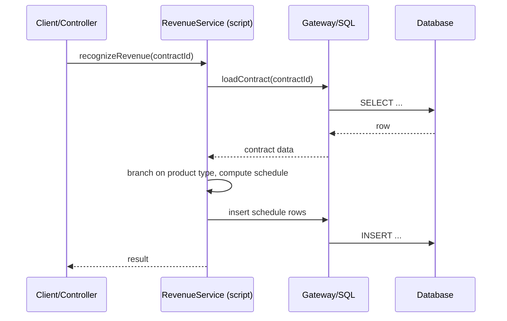

**Trade-offs.** *Pros:* trivially simple, fast to write, easy to understand for small
logic, no ORM needed. *Cons:* duplication grows (the same tax/discount rule copied
across scripts), long procedures, poor reuse; **rots badly as domain complexity
grows**. *Use when* logic is simple and mostly CRUD + a few rules, or for a small
app/prototype. *Avoid when* you have rich, interacting business rules. *Misuse:*
letting a Transaction Script codebase grow into thousands of lines of tangled
procedures instead of migrating to a Domain Model.
*vs. Domain Model:* procedural script per use case vs. a rich graph of objects that
own their behaviour. *vs. Table Module:* a script has no per-table home; Table Module
groups logic by table.

## Domain Model

**Problem it solves:** Business rules are complex and interconnected, and cramming them
into procedural scripts causes duplication and combinatorial `if`-sprawl. Domain Model
removes that by giving you **an object web where each object holds both the data and
the behaviour for its concept**, so rules live next to the state they govern and
polymorphism replaces branching.

**Intent / how it works.** Model the business as interconnected objects (Orders,
Customers, Products) that carry behaviour (`order.total()`, `customer.canPlace(order)`).
Complexity is distributed across many small collaborating objects. Persistence is kept
separate (usually via Data Mapper / ORM) so the domain stays persistence-ignorant.

**Concrete example.** `Order.addLine(product, qty)` enforces stock rules; `Order.total()`
sums lines and applies a `PricingPolicy` strategy; `Customer.creditLimit` decides
whether the order is accepted — the rule lives on the object that owns the data.

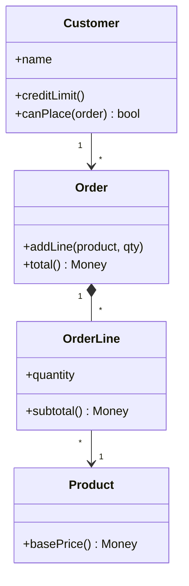

**Trade-offs.** *Pros:* handles complex logic elegantly, high reuse, testable in
isolation, aligns code with the **ubiquitous language** — *the single shared domain
vocabulary used identically in code, conversation, and models* (an "Order" class means
exactly what the business analyst means by "order"). *Cons:* steep learning curve; needs
O/R (object-relational) mapping, which forces you to bridge the **object-relational
impedance mismatch** — *the structural gap between OO object graphs (references,
inheritance, object identity) and flat relational tables (rows, foreign keys, joins)*;
overkill for simple CRUD. *Use when* logic is
rich and changes often. *Avoid when* the app is essentially table maintenance.
*Misuse — the **Anemic Domain Model** anti-pattern:* objects that are just getters/
setters with all behaviour pushed into a "service" layer — you pay the mapping cost of
a Domain Model but get none of its benefits.
*vs. Transaction Script:* object graph vs. procedures. *vs. Table Module:* one object
*per row/instance* with identity vs. one object *per table* operating on record sets.

## Table Module

**Problem it solves:** You want to organize business logic more than a raw Transaction
Script allows, but your platform centres on **record sets** (tabular query results) and
you don't want the mapping overhead of a full object-per-row Domain Model. Table Module
removes the "where does table-wide logic live?" problem by giving each table **one class
that handles the logic for all its rows**.

**Intent / how it works.** A single instance (e.g. `OrderModule`) wraps the data for the
whole `Orders` table (backed by a Record Set) and exposes methods like
`OrderModule.calculateDiscount(orderId)`. There is **no object identity per row** — you
pass an id into methods that operate on the record set.

**Concrete example.** `contracts.recognizedRevenue(contractId, asOf)` runs against the
in-memory `Contracts` record set, filtering to that contract's rows — one class, all
rows.

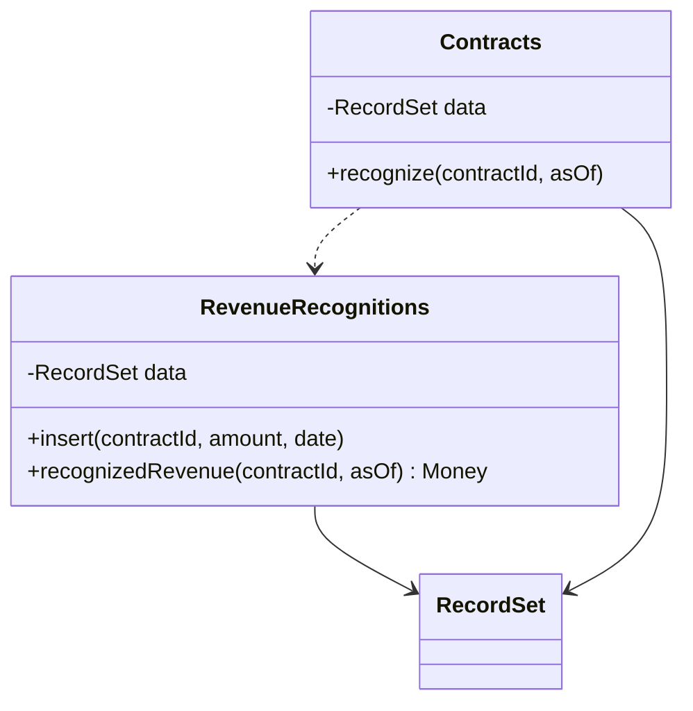

**Trade-offs.** *Pros:* fits UI/data-grid platforms that pass record sets around;
better organized than Transaction Script; leverages built-in record-set tooling.
*Cons:* tied to tabular structure; no per-instance identity or polymorphism; awkward
for deep object relationships. *Use when* your framework is record-set-centric (classic
.NET DataSets) and logic is moderate. *Avoid when* logic is complex or object-oriented
relationships dominate.
*vs. Domain Model:* one instance *per table* operating on record sets vs. one object
*per row* with real identity and polymorphism.

## Service Layer

**Problem it solves:** Multiple clients (UI, batch jobs, remote API, tests) need the
same operations, and each needs the *same* transaction boundaries, security checks, and
orchestration of domain objects. Without a boundary, that orchestration gets copied into
every controller. Service Layer removes this by defining **an application's boundary as
a set of coarse-grained operations** that each client calls.

**Intent / how it works.** A layer of services (`OrderService.placeOrder(cmd)`) sits
between presentation and the domain. Each operation is a *use case*: it opens a
transaction, invokes domain objects to do the real work, coordinates cross-cutting
concerns (security, notifications), and commits. It is the **application/use-case**
layer, not where the business *rules* live.

**Concrete example.** `AccountService.transfer(from, to, amount)` starts a Unit of Work,
loads two `Account` domain objects, calls `account.withdraw()` / `account.deposit()`
(the rules live *there*), records an audit entry, commits.

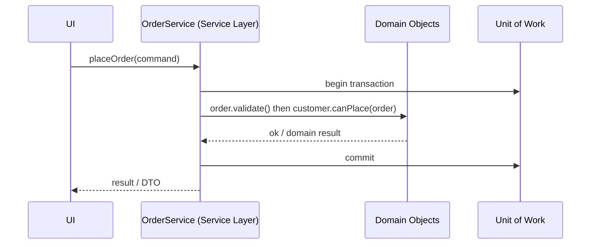

**Trade-offs.** *Pros:* single coherent API for all clients; one place for transactions
and security; keeps controllers thin. *Cons:* another layer; **risk of the anemic "god"
service** that hoards logic that belongs in the Domain Model, duplicating rules. *Use
when* you have multiple clients or need explicit transaction/use-case boundaries.
*Avoid when* a tiny app with one client — it's ceremony.
*vs. Domain Model:* Service Layer *orchestrates* a use case (transaction, sequencing);
the Domain Model holds the *business rules*. *vs. Facade (GoF):* a Facade only
simplifies an interface; a Service Layer also owns transactions, security, and use-case
semantics. *vs. Remote Facade:* Remote Facade exists to cut network round-trips; a
Service Layer is about application boundaries even in-process.

---

<!-- ===================================================================== -->
<!-- GROUP B — DATA SOURCE ARCHITECTURAL -->
<!-- ===================================================================== -->

## Table Data Gateway

**Problem it solves:** SQL for a table is scattered through the codebase, so schema
changes ripple everywhere and logic mixes with queries. Table Data Gateway removes this
by putting **all the SQL for one table behind one gateway object** whose methods return
record sets.

**Intent / how it works.** One instance per table exposes finder and CRUD methods
(`PersonGateway.findByLastName(name)`, `insert(...)`, `update(...)`), each running SQL
and returning a **generic Record Set** (or a data-transfer array), not domain objects.

**Concrete example.** `PersonGateway.findWithLastName("Smith")` executes
`SELECT * FROM person WHERE last_name = ?` and returns a record set the caller iterates.

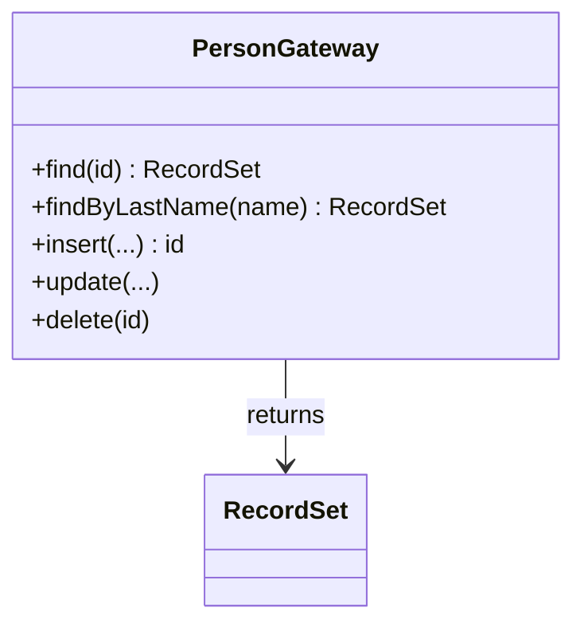

**Trade-offs.** *Pros:* isolates SQL; simple; pairs naturally with Table Module and
record-set UIs. *Cons:* returns untyped record sets (not domain objects); one class can
bloat with many finders. *Use when* you use Table Module or want a thin SQL isolation
layer. *Avoid when* you want rich domain objects returned (use Data Mapper).
*vs. Row Data Gateway:* one gateway for the *whole table* returning record sets vs. one
object *per row*.

## Row Data Gateway

**Problem it solves:** You want DB access for a single record encapsulated in an object
you can pass around, but you do **not** want business behaviour mixed in. Row Data
Gateway removes the "raw record set everywhere" problem by giving you **one object that
mirrors exactly one row** and holds its own load/insert/update/delete.

**Intent / how it works.** Each instance corresponds to one row; fields mirror columns;
methods are pure persistence (`insert()`, `update()`, `delete()`). A separate Finder
object produces instances. **No domain logic** lives here.

**Concrete example.** `PersonRowGateway` has `firstName`, `lastName`, `insert()`,
`update()`; `PersonFinder.find(id)` returns a populated instance.

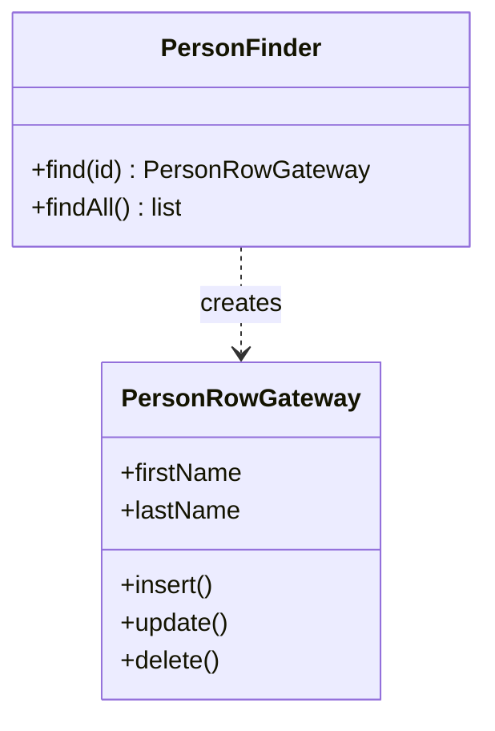

**Trade-offs.** *Pros:* typed per-row access; clean split of persistence from any
domain logic; good building block under a Domain Model. *Cons:* extra layer; looks
almost like Active Record but without behaviour. *Use when* you want row objects but
keep persistence separate from business rules. *Avoid when* the object should also carry
domain behaviour (then Active Record) or must be fully decoupled from schema (Data
Mapper).
*vs. Active Record:* identical shape, but Active Record *adds domain logic*; Row Data
Gateway is pure data access. *vs. Table Data Gateway:* per-row vs. per-table.

## Active Record

**Problem it solves:** For simple domains, having separate domain objects *and* mappers
*and* gateways is overkill — you just want an object that both models a row and knows how
to save itself. Active Record removes that ceremony: **a domain object wraps a single
row, carries its data-access, and can hold some domain logic too.**

**Intent / how it works.** The class maps 1:1 to a table. An instance is a row; it has
`save()`, `delete()`, static `find()`, plus domain methods (`order.isOverdue()`). The
object *is* the record and knows its own persistence.

**Concrete example.** `user = User.find(42); user.email = "x@y.com"; user.save()` — the
canonical Rails ActiveRecord / Laravel Eloquent style.

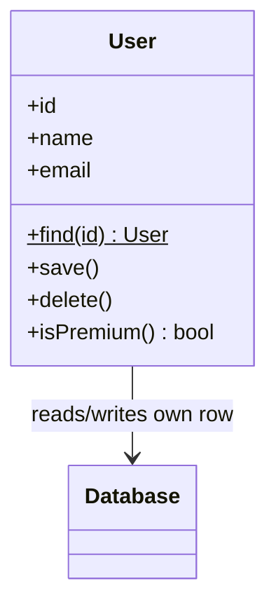

**Trade-offs.** *Pros:* very fast to build; minimal indirection; intuitive for CRUD +
light logic. *Cons:* **couples the domain object to the DB schema** (change a column,
change the class); hard to unit-test without a database; breaks down when a business
concept doesn't map 1:1 to a table or logic gets rich; encourages fat models. *Use when*
domain ≈ schema and logic is modest. *Avoid when* rich domain, complex mapping, or you
need persistence-ignorant testable domain objects.
*vs. Data Mapper:* **THE canonical interview probe** — Active Record's object knows how
to persist *itself* (coupled to schema); Data Mapper keeps a separate mapper so the
domain object is persistence-ignorant. *vs. Row Data Gateway:* Active Record adds domain
behaviour; Row Data Gateway is pure persistence.

## Data Mapper

**Problem it solves:** You want a **pure, persistence-ignorant Domain Model** — objects
that don't know a database exists — so the domain and the schema can evolve
independently and the domain is trivially unit-testable. Data Mapper removes the
coupling by putting **a separate mapper layer** that moves data between objects and the
DB, invisible to both.

**Intent / how it works.** A `Mapper` per aggregate/entity translates between domain
objects and rows. The domain object has **no persistence methods**; the mapper does
`insert(order)`, `find(id) -> Order`, handling SQL, identity, and relationships. Usually
delivered by an ORM (Hibernate/JPA, SQLAlchemy, EF Core).

**Concrete example.** `orderMapper.find(42)` returns a fully-built `Order` graph; the
`Order` class itself has zero DB code.

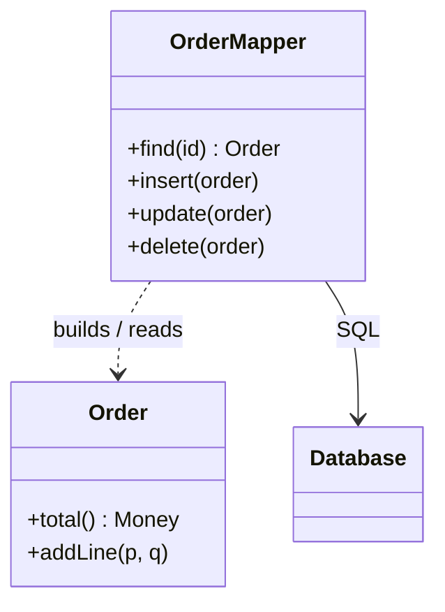

**Trade-offs.** *Pros:* maximal decoupling and testability; domain stays clean; supports
rich models and complex mapping. *Cons:* most complex; almost always needs an ORM;
mapping/impedance issues (lazy loading, identity, transactions). *Use when* you have a
real Domain Model or need to isolate domain from schema. *Avoid when* the app is simple
CRUD (Active Record is cheaper).
*vs. Active Record:* separated, persistence-ignorant domain vs. self-persisting object
coupled to schema. *vs. Repository:* a Repository is a *collection-like domain-facing
abstraction* often built *on top of* a Data Mapper; Data Mapper is the lower-level
object↔row translator.

## Repository

**Problem it solves:** Domain code should ask for objects as if from an **in-memory
collection** ("give me the customer with this id", "find active orders over $100")
without knowing anything about SQL, ORMs, or query mechanics. Repository removes the
leakage of persistence concepts into the domain by presenting **a collection-like
interface for a type of aggregate**, expressed in domain terms.

**Intent / how it works.** `CustomerRepository` offers `add(customer)`,
`byId(id) -> Customer`, and query methods that often accept a **Specification**
(`matching(spec)`). Internally it delegates to a Data Mapper / ORM, but the domain sees
only a collection abstraction. It is both a PoEAA pattern and a DDD building block
(one repository *per aggregate root*).

**Concrete example.** `orders = orderRepository.matching(new OverdueSpecification())`
— the domain speaks "overdue orders", not SQL.

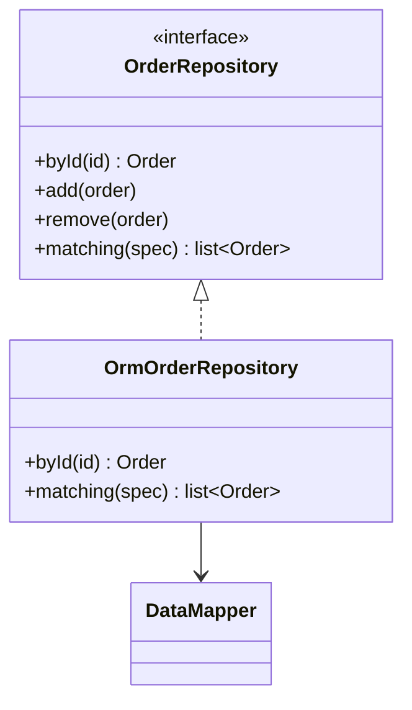

**Trade-offs.** *Pros:* domain code is persistence-agnostic and reads like business
language; centralizes query construction; swappable backing store; pairs with
Specification. *Cons:* **can degenerate into a thin generic CRUD wrapper** (a "DAO with
a nicer name") that loses domain intent; over-abstraction if you have one client.
*Use when* you have a Domain Model / aggregates and want collection-style access.
*Avoid when* you'd only wrap `save/find` per table (then you've built a DAO).
*vs. DAO — REQUIRED disambiguation:* a **Repository** is a *domain-collection*
abstraction, modelled around aggregates and the ubiquitous language, typically returning
fully-formed domain objects and often per-aggregate-root. A **DAO** is a
*persistence-centric* abstraction, usually per-table CRUD, closer to the data source. In
practice teams blur them, but the interview answer is: Repository speaks *domain*, DAO
speaks *data source*. *vs. Data Mapper:* Repository is the domain-facing collection;
Data Mapper is the underlying object↔row translator it may use.

**Senior follow-up — "is a Repository still worth it over the ORM?"** A modern ORM's
persistence context (JPA/Hibernate `EntityManager`, EF Core `DbContext`) *already* bundles
three of the patterns on this page: it **is** a Data Mapper (object↔row), a **Unit of
Work** (tracks changes, one flush), and an **Identity Map** (one instance per id per
context). So a Repository today rarely adds persistence capability — it adds a thin
**domain-intent facade** (`findActiveOrdersOver(amount)` instead of a raw JPQL string) plus
a swap-point/test seam and one-per-aggregate-root discipline. Spring Data JPA repositories
and generic `CrudRepository<T,ID>` are the mainstream realization; the live debate is
whether that facade earns its keep or is just ceremony over the `EntityManager`. Good
answer: keep it when it expresses aggregate-level domain queries and hides the ORM; drop it
when it degenerates into pass-through `save`/`findById`.

## DAO (Data Access Object)

**Problem it solves:** Application code should not be littered with data-source specifics
(JDBC, JPA, a REST backend, a file). DAO removes this by hiding **all access to a given
data source behind an interface**, so switching the persistence technology doesn't ripple
into callers.

> [!TIP]
> **Origin flag:** DAO is a **Core J2EE** pattern (Sun's *Core J2EE Patterns*), **not**
> from GoF or PoEAA. Fowler's equivalent framing is closer to Gateway/Repository. Naming
> it correctly signals you know the lineage.

**Intent / how it works.** An interface (`CustomerDao`) declares CRUD and finder
operations; a concrete implementation (`JpaCustomerDao`, `JdbcCustomerDao`) hides the
persistence API. Callers depend only on the interface.

**Concrete example.** `customerDao.findById(id)`, `customerDao.save(c)` — the caller
never sees JDBC or JPA.

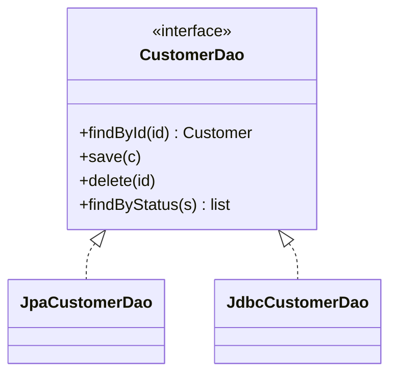

**Trade-offs.** *Pros:* isolates persistence technology; easy to mock in tests;
familiar. *Cons:* often devolves into anemic per-table CRUD; blurs with Repository;
can encourage an anemic domain. *Use when* you want to abstract a data source's
technology. *Avoid when* you actually want a domain-collection abstraction (use
Repository) or a foreign-system wrapper (use Gateway).
*vs. Repository:* DAO abstracts the *persistence technology* (data-source-centric,
per-table); Repository abstracts a *domain collection* (aggregate-centric, domain
language). *vs. Gateway:* Gateway typically wraps an *external/foreign* system.

---

<!-- ===================================================================== -->
<!-- GROUP C — OBJECT-RELATIONAL BEHAVIORAL -->
<!-- ===================================================================== -->

## Unit of Work

**Problem it solves:** During one business transaction you touch many objects (create
some, modify others, delete a few). Saving each immediately means many round-trips,
wrong ordering, and no single commit point. Unit of Work removes this by **tracking every
object you read/change and coordinating one atomic write** at the end, in the right
order, with concurrency checks.

*Mental model:* a **shopping cart you check out once**. You add, remove, and change items
as you browse, but nothing is charged until you hit "check out" — then the store settles
everything in one atomic transaction. The Unit of Work is that cart for your objects.

**Intent / how it works.** A `UnitOfWork` keeps *new*, *dirty*, and *removed* sets. As
you work, objects register with it (or it snapshots them). On `commit()` it computes the
minimal, correctly-ordered set of INSERT/UPDATE/DELETE statements inside one DB
transaction, applying optimistic-lock version checks.

**Concrete example.** Add an order line, change the order status, delete an obsolete
line; one `unitOfWork.commit()` flushes all three changes atomically. (JPA/Hibernate's
`EntityManager`/`Session` is a Unit of Work.)

**Worked trace — watch the three sets fill, then one flush.** Say Order #42 is loaded at
`version=5`. You then, in one business transaction:

```text
Step 1  order.addLine(sku=A, qty=2)     -> new={LineItem#L9}      dirty={}          removed={}
Step 2  order.setStatus("CONFIRMED")    -> new={L9}               dirty={Order#42}  removed={}
Step 3  order.removeLine(L3)            -> new={L9}               dirty={Order#42}  removed={LineItem#L3}
Step 4  unitOfWork.commit()
```

At `commit()` the Unit of Work emits exactly **one** ordered DB transaction — inserts
before the update that references them, deletes last, with the optimistic-lock guard on
the update:

```text
BEGIN
INSERT INTO line_item (id, order_id, sku, qty) VALUES (L9, 42, 'A', 2)
UPDATE orders SET status='CONFIRMED', version=6 WHERE id=42 AND version=5   -- 1 row
DELETE FROM line_item WHERE id=L3
COMMIT
```

Three in-memory mutations collapse into **one** round-trip-batched, correctly-ordered,
atomic write. If someone else had already bumped Order #42 to `version=6`, the guarded
`UPDATE` matches **0 rows** → the commit aborts with a concurrency error instead of a lost
update (this is the Optimistic Offline Lock check firing inside the Unit of Work).

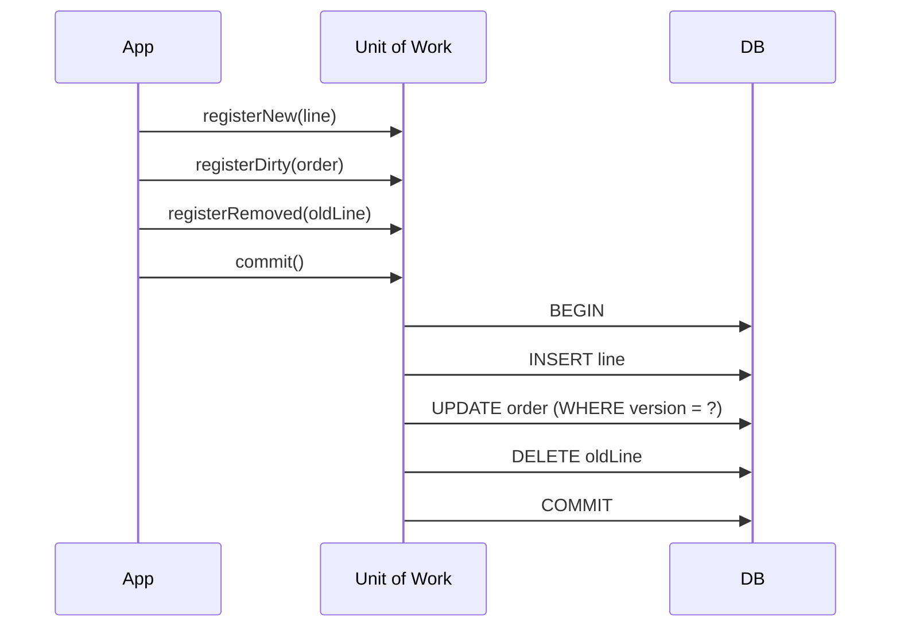

**Trade-offs.** *Pros:* one atomic write; fewer round-trips; central place for ordering
and optimistic locking; enables Identity Map. *Cons:* complexity; must track state
correctly (missed dirty = lost update); long units can hold memory/locks. *Use when* a
business transaction spans many objects. *Avoid when* single-row updates only.
*vs. a DB Transaction:* Unit of Work is *application-level* change tracking that
*culminates in* a DB transaction — it decides *what* to write; the DB transaction makes
the write atomic.

## Identity Map

**Problem it solves:** If the same DB row is loaded twice in one session you get **two
different in-memory objects for one entity** — edits to one are invisible to the other,
and you can double-load and lose updates. Identity Map removes this by **guaranteeing
each object is loaded only once**, keeping a map of already-loaded objects keyed by
identity.

*Mental model:* a **coat-check ticket**. The first time you hand in your coat you get a
ticket; every later time you present that ticket (the id) you get *the exact same coat
back*, never a copy. The map is the coat-check counter keyed by ticket number.

**Intent / how it works.** Within a session/Unit of Work, a map keyed by (type, id)
caches loaded objects. A load first checks the map; a hit returns the *same* instance, so
there is exactly one object per database identity.

**Concrete example.** `find(42)` then `find(42)` again returns the identical `Customer`
instance; changing its name once is seen everywhere.

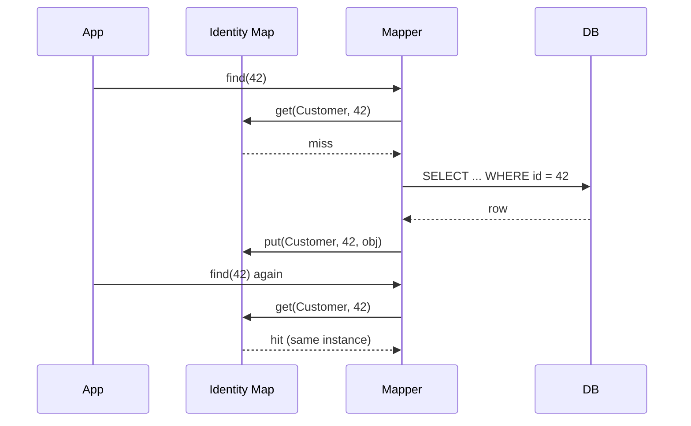

**Trade-offs.** *Pros:* correctness — one object per identity; avoids double-load and
inconsistent updates; reduces reads. *Cons:* it is a *session cache* — risk of stale
data if the DB changes underneath; memory growth in long sessions; scope must be
per-session. *Use when* you use a Data Mapper / Unit of Work. *Avoid when* trivial
read-only queries.
*vs. a performance cache:* Identity Map exists for **identity/correctness** (one object
per row within a session), not primarily speed; a cache exists for **performance** and
may hold many copies with eviction.

## Lazy Load

**Problem it solves:** Loading one object shouldn't drag its entire graph (customer →
all orders → all line items → all products) into memory when you may never touch it.
Lazy Load removes this by giving you **an object that doesn't hold all its data yet but
knows how to fetch the missing parts on first access.**

*Mental model:* a **restaurant menu**. You get the menu (the object) instantly, but the
kitchen doesn't start cooking every dish up front — a plate is prepared only when you
actually order it. The Virtual Proxy is the waiter who looks like the dish until you ask
for it, then fetches the real thing.

**Intent / how it works.** Four common flavours: **Lazy Initialization** (check-and-load
in a getter), **Virtual Proxy** (a stand-in that loads the real object on first use),
**Value Holder** (a wrapper you ask for the value), and **Ghost** (a real object loaded
in partial state that fills itself). The consumer touches a field/collection and the
data is fetched behind the scenes.

**Concrete example.** `customer.getOrders()` triggers the SQL to load orders only when
first called; until then the field is an unloaded proxy.

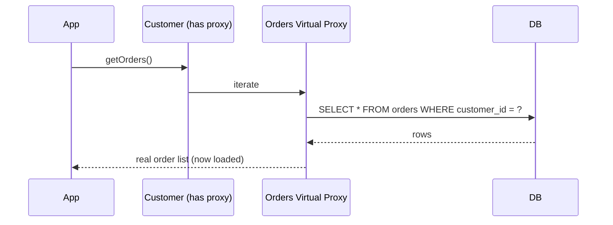

**Worked trace — the N+1 select problem in numbers.** You load 100 customers and print
each one's order count:

```text
SELECT * FROM customer                              -- query #1  -> 100 rows
for each customer (100 of them):
    customer.getOrders()   -> proxy fires:
        SELECT * FROM orders WHERE customer_id = ?  -- queries #2 .. #101
```

That is **1 + 100 = 101 queries** ("N+1", here N=100) — one to get the list, then one *per*
row. At even 1 ms of round-trip each that is ~101 ms of pure latency, and it silently
scales with the result set. The fix is to fetch eagerly in **one** query
(`SELECT ... FROM customer c LEFT JOIN orders o ON o.customer_id = c.id`, or JPA
`JOIN FETCH` / a batch-size hint), turning 101 queries into **1**. The interview point:
lazy loading is a *default* that quietly turns into an N+1 the moment you iterate.

**Trade-offs.** *Pros:* faster/leaner initial loads; only fetch what you use.
*Cons:* the infamous **N+1 select problem** (looping over N customers each lazily loading
orders = N+1 queries); surprising DB hits deep in business logic; **breaks across session
boundaries** (LazyInitializationException when the session is closed). *Use when* graphs
are large and partially used. *Avoid when* you will use the whole graph (eager/`JOIN
FETCH` is better) or after the session closes.
*vs. Eager Load:* defer-until-touched vs. prefetch-up-front. Implemented via **Proxy /
Ghost / Value Holder** (cross-ref GoF Proxy).

---

<!-- ===================================================================== -->
<!-- GROUP D — OBJECT-RELATIONAL STRUCTURAL (mapping mechanics) -->
<!-- Compact sub-catalog; interviews rarely go pattern-by-pattern here.   -->
<!-- ===================================================================== -->

## Identity Field

**Problem it solves:** An in-memory object and its database row must be kept in
correspondence, but objects use reference identity while rows use a primary key. Identity
Field removes the gap by **storing the row's primary key inside the object**, so the
mapper can match object ↔ row.

**Intent / how it works.** The object carries an `id` field mirroring the PK. Keys may be
**meaningless (surrogate)** — a generated integer/UUID with no business meaning — or
**meaningful (natural)**. Surrogate keys are usually preferred to avoid churn when
business data changes.

**Concrete example.** `Customer` has a `long id` mapped to `customer.id`; the mapper uses
it for `find`, `update`, and to wire relationships.

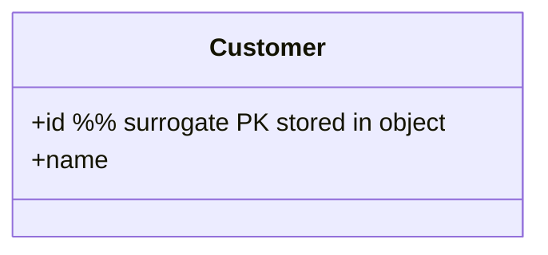

**Trade-offs.** *Pros:* enables mapping, Identity Map, and relationships. *Cons:*
key-management choices (surrogate vs natural, composite keys, key generation strategy).
*Use* virtually always with Data Mapper. *vs. natural key:* surrogate keys stay stable
when business attributes change; natural keys avoid an extra column but risk churn.

## Foreign Key Mapping

**Problem it solves:** An object reference (`order.customer`) has no direct DB
representation. Foreign Key Mapping removes this by **mapping the reference to a foreign-
key column**, so single-valued associations round-trip to the database.

**Intent / how it works.** Store the referenced object's Identity Field as an FK column.
On load, the mapper reads the FK and resolves (often via Identity Map / Lazy Load) the
target object; on save, it writes the target's id. Collections (one-to-many) are handled
by an FK on the *many* side.

**Concrete example.** `orders.customer_id` holds the customer's PK; loading an order
resolves `order.customer` from that column.

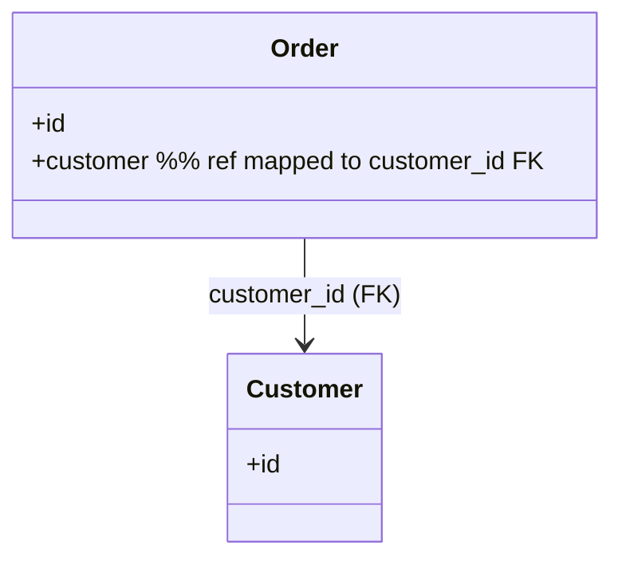

**Trade-offs.** *Pros:* natural for 1-to-1 / 1-to-many. *Cons:* handling collections,
bidirectional refs, and ordering of writes; back-pointer maintenance. *Use* for
single-valued and one-to-many associations. *Avoid* for many-to-many (use Association
Table Mapping).

## Association Table Mapping

**Problem it solves:** A many-to-many association (students ↔ courses) can't be stored as
an FK on either side. Association Table Mapping removes this by **using a separate link
table** with one row per pair.

**Intent / how it works.** A join table holds two FKs (`student_id`, `course_id`). The
mapper reads/writes link rows to materialize the collection on each side and coordinates
inserts/deletes as the association changes.

**Concrete example.** `enrolment(student_id, course_id)` connects students and courses;
enrolling adds a row, dropping deletes one.

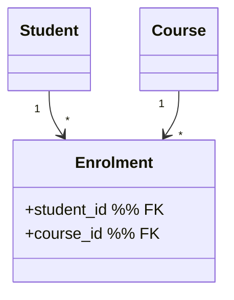

**Trade-offs.** *Pros:* the only clean way to model many-to-many. *Cons:* extra table;
write coordination on both sides; association-level attributes (e.g. enrolment date) push
you toward making the link an entity. *Use* for many-to-many. *Avoid* when a simple FK
suffices.

## Dependent Mapping

**Problem it solves:** Some child objects have **no independent identity or lifecycle**
(order line items exist only within an order) and giving each its own mapper is wasteful.
Dependent Mapping removes this by letting **the owner's mapper handle the children's
persistence**.

**Intent / how it works.** The parent's mapper loads, inserts, updates, and deletes the
dependent children as part of loading/saving the parent. Children are never accessed
except through their owner; deleting the owner deletes them.

**Concrete example.** `OrderMapper` loads and saves `LineItem`s; there is no
`LineItemMapper` and no way to fetch a line item independently.

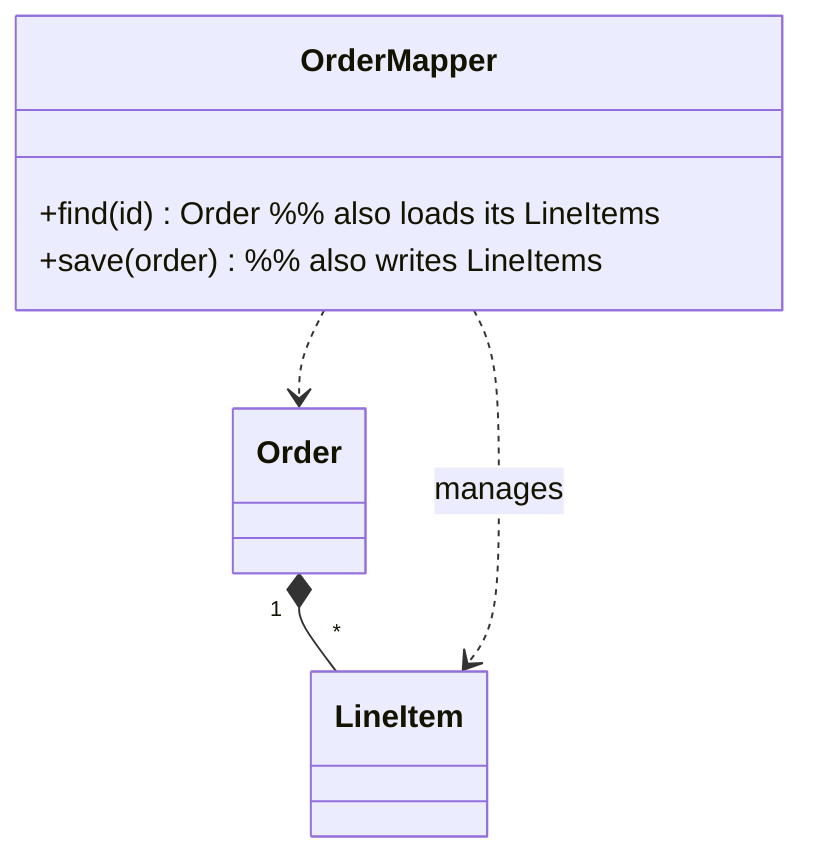

**Trade-offs.** *Pros:* fewer mappers; enforces the owner-controls-lifecycle rule; maps
neatly onto DDD aggregates. *Cons:* children can't be loaded/queried on their own;
one owner only. *Use* for value-like children within an aggregate. *Avoid* when children
are shared or queried independently. *Ties to* DDD **Aggregate**.

## Embedded Value

**Problem it solves:** A small **Value Object** (an `Address`, a `DateRange`, a `Money`)
doesn't deserve its own table, but its fields still need persisting. Embedded Value
removes the "one tiny table per value" overhead by **mapping the value object's fields
into the owner's columns**.

**Intent / how it works.** The owner's table gets columns for each of the value's fields
(`shipping_street`, `shipping_city`, `shipping_zip`). The mapper flattens the VO into the
owner row on write and reconstructs it on read. (JPA `@Embeddable`/`@Embedded`.)

**Concrete example.** `Customer.address` (a VO) becomes columns on the `customer` table.

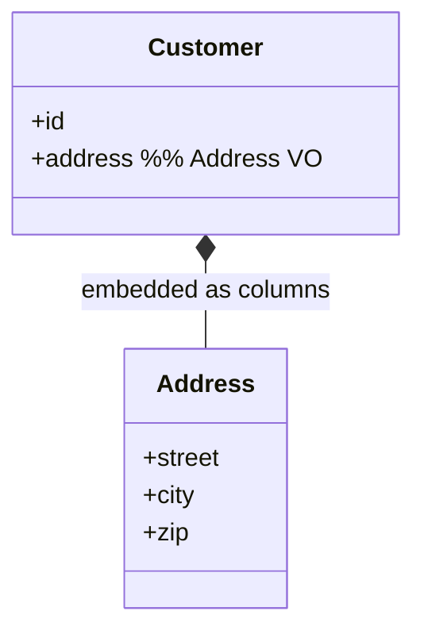

**Trade-offs.** *Pros:* no join, no extra table; VO stays a first-class domain concept.
*Cons:* **can't query the value independently or share it across owners**; column
proliferation. *Use* for owned, single-instance value objects. *Avoid* when the value is
large/graph-like (use Serialized LOB) or must be queried on its own.
*vs. Serialized LOB:* Embedded Value keeps each field as a *queryable column*; Serialized
LOB stores the whole thing as one opaque blob.

## Serialized LOB

**Problem it solves:** Some object graphs (a tree of categories, a document, a settings
blob) are painful to spread across many tables and you rarely query their internals.
Serialized LOB removes the mapping burden by **serializing the whole graph into one large
column** (BLOB or CLOB, often JSON/XML).

**Intent / how it works.** Serialize the object graph to a string/bytes and store it in a
single column; deserialize on read. The DB treats it as opaque.

**Concrete example.** A `Customer`'s list of past addresses stored as a JSON `CLOB` in
`customer.address_history`.

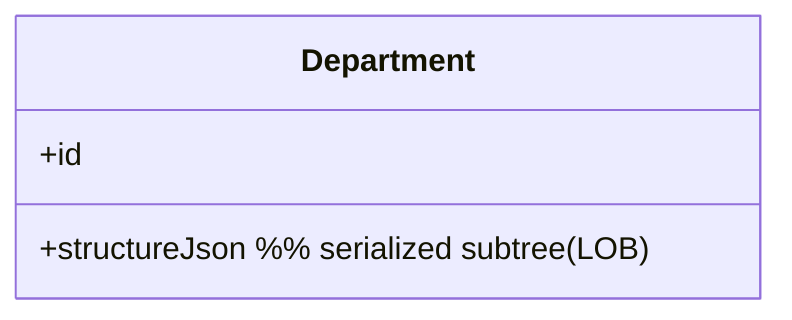

**Trade-offs.** *Pros:* trivial mapping for complex/rarely-queried graphs; fewer tables/
joins. *Cons:* **opaque to SQL** (can't filter/index inner fields easily); schema-
migration and versioning pain as the serialized shape evolves; whole-blob rewrites.
*Use* for self-contained graphs you read/write as a unit. *Avoid* when you must query or
report on the inner data.
*vs. Embedded Value:* opaque blob vs. queryable per-field columns.

## Inheritance Mappers (Single Table, Class Table, Concrete Table)

**Problem it solves:** A class hierarchy (`Player` → `Footballer`, `Cricketer`,
`Bowler`) has no direct equivalent in a relational schema. Inheritance Mappers remove
this impedance by giving three concrete strategies to map a hierarchy to tables, each
trading space vs. joins vs. duplication.

**Intent / how it works.**
- **Single Table Inheritance** — one table for the whole hierarchy; a `type`
  discriminator column; unused subclass columns are NULL.
- **Class Table Inheritance** — one table per class (base + each subclass); load via
  **joins** on shared keys.
- **Concrete Table Inheritance** — one table per *concrete* class, each holding all
  inherited columns; **no shared base table**.

**Concrete example.** Storing footballers and cricketers: Single Table = one `players`
table with `type` + all columns; Class Table = `players` + `footballers` + `cricketers`
joined; Concrete Table = separate `footballers` and `cricketers` tables.

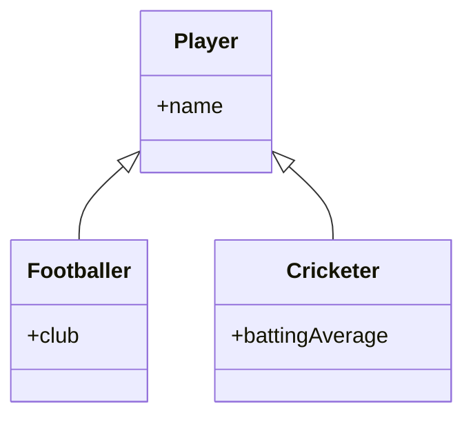

**Trade-offs — the classic triangle.**
- *Single Table:* simplest, no joins, easy polymorphic queries; **but** wasted space
  (many NULLs), wide table, weak NOT-NULL constraints.
- *Class Table:* normalized, no wasted space; **but** joins on every load, more tables.
- *Concrete Table:* no joins, no base table; **but** **no polymorphic query across the
  hierarchy** (must union tables), duplicated columns, key management across tables.
*Use* Single Table for shallow hierarchies with few subclass-specific fields; Class Table
when normalization matters; Concrete Table when subclasses are queried independently.
JPA supports all three (`SINGLE_TABLE`, `JOINED`, `TABLE_PER_CLASS`).

---

<!-- ===================================================================== -->
<!-- GROUP E — OBJECT-RELATIONAL METADATA MAPPING -->
<!-- ===================================================================== -->

## Metadata Mapping

**Problem it solves:** Hand-writing repetitive mapper code for every field of every class
is tedious and error-prone. Metadata Mapping removes this by **holding the O/R mapping
details as metadata** (config files, annotations, or conventions) that a generic engine
reads to perform the mapping automatically.

**Intent / how it works.** A mapping description (`@Column`, XML mapping, or convention-
over-configuration) declares how classes/fields map to tables/columns. The ORM engine
interprets the metadata at runtime (or generates code) to build queries and hydrate
objects — no per-class SQL by hand.

**Concrete example.** JPA annotations (`@Entity`, `@Table`, `@Column`, `@ManyToOne`) or
Hibernate `.hbm.xml` describe the mapping; Hibernate does the rest.

```mermaid
classDiagram
    class MappingMetadata {
      +class -> table
      +field -> column
      +associations
    }
    class OrmEngine {
      +buildQuery()
      +hydrate()
    }
    class DomainObject
    OrmEngine --> MappingMetadata : reads
    OrmEngine ..> DomainObject : builds
```

**Trade-offs.** *Pros:* drastically less boilerplate; consistent mapping; powers every
mainstream ORM. *Cons:* **magic/indirection** — behaviour lives in metadata, harder to
debug and reason about; performance surprises; steep config learning curve. *Use* with
any nontrivial Data Mapper. *Avoid* only for the tiniest apps where a hand mapper is
clearer.

## Query Object

**Problem it solves:** Scattering SQL strings through the domain couples it to the
database dialect and schema and makes queries un-composable. Query Object removes this by
representing **a query as an object built in domain terms**, which the infrastructure
translates to SQL.

**Intent / how it works.** A `Query` object accumulates criteria (`addCriteria(field,
op, value)`), understood in terms of domain classes/fields, and an interpreter/ORM turns
it into SQL. Queries become first-class: composable, testable, reusable. (JPA Criteria
API, QueryDSL, jOOQ are Query Objects.)

**Concrete example.** `new Query(Person).where("lastName", "=", "Smith").and("age", ">",
18)` produces the SQL for you.

```mermaid
classDiagram
    class Query {
      +targetClass
      +addCriteria(field, op, value)
      +toSql() string
    }
    class Criteria {
      +field
      +operator
      +value
    }
    Query "1" *-- "*" Criteria
```

**Trade-offs.** *Pros:* database-independent, composable, domain-oriented queries; avoids
SQL sprinkled everywhere; enables Repository query methods. *Cons:* you are partly
**reimplementing SQL**; complexity; can hide expensive queries. *Use* when you build
queries dynamically or want DB independence. *Avoid* for a few static queries (plain SQL
is clearer).
*vs. Specification:* a Query Object *represents a query to run against the DB*; a
Specification is a *composable in-memory business predicate* (`isSatisfiedBy`) — though a
Specification can be *translated into* a Query Object. *vs. raw SQL:* composable/portable
vs. direct but coupled.

---

<!-- ===================================================================== -->
<!-- GROUP F — DDD TACTICAL BUILDING BLOCKS -->
<!-- ===================================================================== -->

## Value Object

**Problem it solves:** Many domain concepts (money, a date range, a coordinate, a colour)
have **no identity** — two $5 notes are interchangeable — yet primitives (`double amount`)
scatter validation and behaviour and cause bugs (currency mismatch, mutation aliasing).
Value Object removes this by modelling such concepts as **immutable objects compared by
their attribute values**, not by identity. (This unifies Fowler's base "Value Object" and
Evans' DDD Value Object — same concept.)

**Intent / how it works.** A Value Object is **immutable** and implements **value
equality** (`equals`/`hashCode` over all attributes). "Changing" it returns a *new*
instance (`money.add(x)` yields a new `Money`). Being immutable, it's freely shared and
side-effect-free. Money is the canonical exemplar — see the dedicated **Money** section in
Group I (base patterns) below for the fully worked-out example (safe arithmetic, currency
guarding, penny-safe allocation); it is deliberately treated there as a base pattern.

**Concrete example.** `Money(10, "USD").add(Money(5, "USD"))` returns a new
`Money(15, "USD")`; two `Money(10,"USD")` are `equals`.

```mermaid
classDiagram
    class DateRange {
      +start
      +end
      +overlaps(other) bool
      +equals(other) bool  %% by value
    }
```

**Trade-offs.** *Pros:* eliminates whole bug classes (immutability = thread-safe,
alias-safe); rich behaviour + validation in one place; expressive domain. *Cons:* must
*enforce* immutability and correct value equality; more object churn (new instances).
*Use* for descriptive, identity-less concepts. *Avoid* when the thing has a lifecycle/
identity (then Entity).
*vs. Entity — REQUIRED:* equality **by value** (interchangeable) vs. equality **by
identity** (a specific, tracked thing). *vs. DTO — REQUIRED:* a Value Object is a
*behaviour-rich, immutable domain concept*; a DTO is a *dumb, flat data carrier* for
crossing a boundary — no domain behaviour, no invariants.

## Entity

**Problem it solves:** Some domain objects must be **tracked as the same thing over
time** even as their attributes change (a customer who changes name and address is still
that customer). Entity removes the "which one is this?" ambiguity by giving the object a
**distinct identity (a thread of continuity)** independent of its attribute values.

**Intent / how it works.** An Entity has a stable **identity** (usually an Identity Field
/ id) that defines equality; its attributes are mutable and may change over its
lifecycle, but identity persists. Two entities are equal iff their identities match, even
if all other fields differ.

**Concrete example.** `Customer#42` is the same entity whether named "Sam" today or
"Samuel" tomorrow; equality is by id, not by name.

```mermaid
classDiagram
    class Customer {
      +id  %% identity defines equality
      +name
      +address
      +rename(newName)
      +equals(other) bool  %% by id
    }
```

**Trade-offs.** *Pros:* models real, trackable business things; supports lifecycle and
mutation. *Cons:* identity management (surrogate vs natural keys); mutable state needs
care under concurrency; must guard invariants. *Use* when identity/continuity matters.
*Avoid* when the concept is interchangeable/descriptive (Value Object).
*vs. Value Object:* by-identity vs. by-value equality; mutable-with-continuity vs.
immutable-and-replaceable.

## Aggregate & Aggregate Root

**Problem it solves:** In a big object graph, *who enforces invariants and what is the
transactional/consistency boundary?* Letting any code mutate any object breaks invariants
(an order total that doesn't match its lines) and creates contention. Aggregate removes
this by defining **a cluster of entities/value objects treated as one consistency unit,
accessed only through a single root**.

*Mental model:* a **company reception desk**. Outsiders don't wander in and talk to any
employee directly — they go through the receptionist (the root), who enforces the rules
and routes work internally. You hold the company's *name/number* (the root's identity),
not a direct line to each employee (the internal objects).

**Intent / how it works.** One entity is the **Aggregate Root**; outside code holds
references only to the root and calls its methods, which enforce all invariants across the
internal objects. The aggregate is the unit of **transactional consistency** and usually
the unit loaded/saved and locked together. References across aggregates use the other
root's *identity*, not a direct object pointer.

**Concrete example.** `Order` (root) owns `LineItem`s; you never modify a line item
directly — you call `order.addLine(...)`, which keeps the total and quantity rules valid;
`order.customerId` references the Customer aggregate by id.

```mermaid
classDiagram
    class Order {
      <<Aggregate Root>>
      +addLine(product, qty)
      +removeLine(id)
      +total() Money
    }
    class LineItem {
      +qty
      +subtotal()
    }
    class Money
    Order "1" *-- "*" LineItem : internal, private
    Order ..> Money
```

**Trade-offs.** *Pros:* invariants have one owner; clear transaction/locking boundary;
tames graph complexity; maps to Coarse-Grained Lock and one-repository-per-root.
*Cons:* **boundary sizing is hard** — too big = lock contention and large loads; too
small = invariants split across aggregates and can't be enforced atomically; cross-
aggregate consistency becomes *eventual* (needs domain events or **sagas** — a saga is a
sequence of local transactions with compensating actions, covered in
`event-driven-cqrs-saga-cdc`). *Use* to protect true invariants. *Avoid* forcing unrelated
objects into one aggregate.

**Sizing heuristic (the senior probe: "how big should an aggregate be?").** Vaughn
Vernon's rules of thumb (*Implementing Domain-Driven Design*): **(1) design *small*
aggregates** — cluster only what must be transactionally consistent *together* (an order
and its lines, because the total must always match the lines); **(2) reference other
aggregates by identity, not by object pointer** (`order.customerId`, never
`order.customer`), which keeps the loaded/locked graph small; **(3) one aggregate modified
per transaction** — if a use case must change two aggregates, update the second one
*eventually* via a domain event rather than in the same transaction. Tie this back to
**Coarse-Grained Lock**: the aggregate is your lock scope, so a bloated aggregate directly
becomes lock contention. When in doubt, start small and merge only when a real invariant
forces it.
*vs. a plain object graph:* an aggregate adds an *invariant + transactional boundary* and
a single entry point; a plain graph has neither.

## Domain Service

**Problem it solves:** Some domain operations don't naturally belong to any single entity
or value object (a funds transfer touches two accounts; a currency conversion needs a
rate table). Forcing them onto one entity distorts the model. Domain Service removes this
by providing **a stateless domain operation** that expresses such logic in the ubiquitous
language.

**Intent / how it works.** A stateless service named in domain terms
(`TransferService`, `TaxCalculator`) coordinates domain objects to perform an operation
that spans them, while the *rules* still live on the entities/VOs where possible. It is
part of the **domain layer**, not the application layer.

**Concrete example.** `MoneyTransferService.transfer(from, to, amount)` orchestrates
`from.debit()` and `to.credit()` (the rules stay on `Account`), enforcing cross-account
policy.

```mermaid
classDiagram
    class MoneyTransferService {
      <<Domain Service>>
      +transfer(from, to, amount)
    }
    class Account {
      +debit(amount)
      +credit(amount)
    }
    MoneyTransferService ..> Account
```

**Trade-offs.** *Pros:* a clean home for cross-entity domain logic; keeps entities
focused. *Cons:* **overuse drains behaviour from entities → Anemic Domain Model**; can
become a dumping ground. *Use* only when the operation genuinely has no natural entity/VO
home. *Avoid* when the behaviour belongs on an entity.
*vs. Application / Service Layer:* a **Domain Service** holds *domain rules* that span
objects (part of the domain); the **Application/Service Layer** holds *use-case
orchestration* (transactions, security, sequencing) and contains no business rules.

## Factory

**Problem it solves:** Creating or reconstituting an aggregate can be complex — many
collaborators, invariants that must hold from birth, internal objects to wire up. Letting
clients `new` it up spreads that knowledge and risks invalid objects. Factory (in the DDD
sense) removes this by **encapsulating complex creation/reconstitution so every object is
born valid**.

**Intent / how it works.** A Factory (a method on the aggregate root, a dedicated factory
object, or one that rebuilds objects from persistence) assembles the aggregate,
enforcing invariants at creation. It separates *what to build* from *how to build it*.

**Concrete example.** `OrderFactory.createFor(customer, cart)` builds an `Order` with
lines, applies the customer's pricing tier, and returns a fully valid aggregate; a
`reconstitute(row)` variant rebuilds it from stored data without re-running creation
rules.

```mermaid
classDiagram
    class OrderFactory {
      +createFor(customer, cart) Order
      +reconstitute(data) Order
    }
    class Order {
      <<Aggregate Root>>
    }
    OrderFactory ..> Order : builds valid instance
```

**Trade-offs.** *Pros:* guarantees invariants at birth; hides construction complexity;
separates creation from use. *Cons:* extra indirection; another type to maintain. *Use*
when creation is complex or must enforce invariants. *Avoid* when a plain constructor
suffices.
*vs. GoF Abstract Factory / Builder:* the GoF creational family (families of products,
step-by-step construction) has the deep treatment in the GoF `dp-*` topics — cross-ref.
Here Factory is specifically about **preserving aggregate invariants** during creation/
reconstitution.

## Domain Event

**Problem it solves:** Business experts care that *something happened* ("order placed",
"payment received", "shipment dispatched"), and other parts of the system need to react —
but hard-wiring those reactions into the code that caused the change couples everything.
Domain Event removes this by **capturing the occurrence as an explicit object** that can
be recorded, published, and reacted to.

**Intent / how it works.** An immutable event object (`OrderPlaced{orderId, at, total}`)
names a past fact in domain language. The aggregate raises it; handlers (in the same or
other **bounded contexts** — a *bounded context* is an explicit boundary within which a
domain model and its terms have one consistent meaning; "Customer" in Sales may differ
from "Customer" in Billing) react — updating read models, triggering workflows,
integrating. It decouples the *cause* from the *consequences*.

**Concrete example.** Placing an order raises `OrderPlaced`; a handler sends a
confirmation email and another updates a reporting read model — the `Order` code knows
nothing about either.

```mermaid
sequenceDiagram
    participant Order as Order (Aggregate)
    participant Bus as Event Dispatcher
    participant Email as EmailHandler
    participant Read as ReadModelHandler
    Order->>Bus: publish(OrderPlaced)
    Bus->>Email: handle(OrderPlaced)
    Bus->>Read: handle(OrderPlaced)
```

**Trade-offs.** *Pros:* decouples cause from effects; explicit, testable business facts;
audit trail; enables reactive/eventually-consistent designs. *Cons:* **eventual-
consistency reasoning**; ordering and idempotency concerns; harder end-to-end tracing.
*Use* to decouple reactions and integrate across boundaries. *Avoid* when a direct
synchronous call is simpler and consistency must be immediate.
*vs. a Command/message:* a **command** is an *imperative request to do* something (may be
rejected); a **domain event** is an *immutable fact that already happened* (can't be
rejected). *Cross-ref* `event-driven-cqrs-saga-cdc` / `dp-distributed-cloud` for the
event-driven *infrastructure* (brokers, delivery, outbox) — not covered here.

## Specification

**Problem it solves:** A business rule used for *validation*, *selection*, and *building*
("a customer is delinquent if…") gets copied into multiple places (a query, an `if`, a
report) and drifts. Specification removes this by **encapsulating a predicate as a
reusable, combinable object** you can `and`/`or`/`not` together.

*Mental model:* a **reusable sieve** you can snap together. Each spec is one mesh
("overdue", "over $1000"); you clip them into a compound sieve (`overdue AND over-$1000`)
and pour candidates through it — the same sieve works whether you're filtering an in-memory
list or generating a SQL `WHERE` clause.

**Intent / how it works.** A `Specification` has `isSatisfiedBy(candidate) -> bool` and
combinators (`and`, `or`, `not`). You compose specs to express complex rules once and use
them for in-memory checks *and* (via translation) as query criteria in a Repository.

**Concrete example.** `overdue = new OverdueSpec(); big = new AmountOver(1000);
repo.matching(overdue.and(big))` — one rule, reused for filtering and querying.

**Worked trace — one composite spec, four orders in.** `OverdueSpec.isSatisfiedBy` returns
true when `dueDate < today`; `AmountOver(1000)` returns true when `total > 1000`. Compose
`spec = overdue.and(big)` and evaluate against four orders (today = day 100):

```text
Order   dueDate   total   overdue?  over-$1000?  AND
O1      day 090   1500    true      true         true    <- kept
O2      day 090    800    true      false        false
O3      day 120   2000    false     true         false
O4      day 130    500    false     false        false
```

`AndSpecification.isSatisfiedBy(o)` just returns `overdue.isSatisfiedBy(o) &&
big.isSatisfiedBy(o)`, so only **O1** passes. The *same* object, when handed to
`repo.matching(spec)`, is translated to `WHERE due_date < :today AND total > 1000` — one
rule definition, used identically for the in-memory check above and for the DB query.

```mermaid
classDiagram
    class Specification~T~ {
      <<interface>>
      +isSatisfiedBy(candidate) bool
      +and(other) Specification
      +or(other) Specification
      +not() Specification
    }
    class OverdueSpecification
    class AndSpecification
    Specification <|.. OverdueSpecification
    Specification <|.. AndSpecification
    AndSpecification --> Specification : combines two
```

**Trade-offs.** *Pros:* one authoritative place for a rule; composable; reusable across
validation/selection/construction; pairs with Repository. *Cons:* can **duplicate query
logic** (an in-memory spec and its DB translation can diverge); over-engineering for
trivial rules. *Use* when a rule is reused or complex/composable. *Avoid* for a one-off
`if`.
*vs. Query Object:* Specification is a *business predicate* (can run in memory); Query
Object *represents a database query*. *vs. Strategy (GoF):* Strategy swaps an
*algorithm/behaviour*; Specification specifically encapsulates a *boolean business rule*
and is composable via and/or/not.

---

<!-- ===================================================================== -->
<!-- GROUP G — DISTRIBUTION & DATA TRANSFER -->
<!-- ===================================================================== -->

## Data Transfer Object (DTO)

**Problem it solves:** Calling a remote service field-by-field ("get name", "get
address", "get orders") means many expensive round-trips, and exposing fine-grained
domain objects across a boundary leaks internals and couples caller to domain shape. DTO
removes this by packing **all the data a boundary call needs into one flat object sent in
a single round-trip**.

**Intent / how it works.** A DTO is a simple **data-only struct** (fields + accessors, no
behaviour) aggregating exactly what one interaction needs. An Assembler maps between
domain objects and the DTO. It crosses process/tier/network boundaries (API responses,
service calls, view models).

**Concrete example.** `OrderSummaryDto{orderId, customerName, total, lineCount}` returned
by an API in one call, instead of the client walking the `Order` → `Customer` → lines
graph remotely.

```mermaid
classDiagram
    class OrderSummaryDto {
      +orderId
      +customerName
      +total
      +lineCount
      %% data only, no behaviour
    }
```

**Trade-offs.** *Pros:* fewer round-trips; decouples the wire/API contract from the
domain model; can shape data per client. *Cons:* **boilerplate + mapping code**; risk of
duplicating the domain; DTOs can proliferate. *Use* to cross a process/network/tier
boundary or to shape an API/view. *Avoid* for in-process calls where you can pass domain
objects (needless indirection).
*vs. Value Object — REQUIRED:* a DTO is a *dumb cross-boundary carrier* (no behaviour, no
invariants, mutable); a Value Object is a *rich, immutable domain concept* compared by
value. *vs. Entity:* a DTO has no identity or lifecycle — it's a flattened snapshot.

## Assembler / Mapper (DTO Assembler)

**Problem it solves:** DTOs and domain objects must be kept in sync, but scattering
"copy field A→B" code across controllers/services is fragile and duplicated. Assembler
removes this by **centralizing the translation between domain objects and DTOs** in one
object.

**Intent / how it works.** An `OrderAssembler` has `toDto(Order) -> OrderDto` and
`fromDto(OrderDto) -> Order` (or updates). It owns the (often two-way) mapping so both
the domain and the DTO can evolve behind it. Real-world: MapStruct, AutoMapper,
ModelMapper generate/perform this.

**Concrete example.** `orderAssembler.toDto(order)` builds an `OrderDto`; the controller
never hand-copies fields.

```mermaid
classDiagram
    class OrderAssembler {
      +toDto(order) OrderDto
      +fromDto(dto) Order
    }
    class Order
    class OrderDto
    OrderAssembler ..> Order
    OrderAssembler ..> OrderDto
```

**Trade-offs.** *Pros:* single place for mapping; keeps domain and DTO decoupled;
mapping libraries cut boilerplate. *Cons:* maintenance of two object graphs and the
mapping; mapping libraries add magic. *Use* whenever DTOs and domain objects both exist.
*Avoid* when there's no separate DTO layer.
*vs. Data Mapper:* an Assembler maps *object ↔ DTO* (in-memory shapes); a Data Mapper
maps *object ↔ database row*.

## Remote Facade

**Problem it solves:** A fine-grained domain object exposed over a network makes callers
chatty — every getter is a remote call, and latency dominates. Remote Facade removes this
by putting **a coarse-grained facade in front of fine-grained objects for remote access**,
so one network call does meaningful work and returns a DTO.

**Intent / how it works.** A `Remote Facade` exposes a few coarse operations
(`getOrderDetails(id) -> OrderDto`) that internally call many fine-grained domain
methods, then packages the result (usually as DTOs). It holds **no business logic** — it
is purely a network-boundary optimization.

**Concrete example.** A remote `OrderFacade.getOrderDetails(id)` gathers the order,
customer, and lines in one server-side call and returns one `OrderDto`, instead of the
client making a dozen remote getter calls.

```mermaid
sequenceDiagram
    participant Client
    participant RF as OrderFacade (Remote)
    participant Dom as Fine-grained domain objects
    Client->>RF: getOrderDetails(id)  %% one remote call
    RF->>Dom: order.customer(), order.lines(), line.total()...
    Dom-->>RF: values
    RF-->>Client: OrderDto (single response)
```

**Trade-offs.** *Pros:* slashes network round-trips; hides fine-grained model from remote
clients; natural place to return DTOs. *Cons:* can **duplicate the domain API**; must stay
thin (no business logic) or it rots into a god object. *Use* at a network/process
boundary. *Avoid* in-process (fine-grained calls are cheap there).
*vs. Service Layer:* Remote Facade exists to reduce *network chattiness*; a Service Layer
defines a *transaction/use-case boundary* even in-process (and may itself be exposed via a
Remote Facade). *vs. GoF Facade:* GoF Facade simplifies a subsystem interface generally;
Remote Facade is specifically about coarse-graining for remote calls + DTO packaging.

---

<!-- ===================================================================== -->
<!-- GROUP H — WEB / GUI PRESENTATION ARCHITECTURES -->
<!-- ===================================================================== -->

## Model-View-Controller (MVC)

**Problem it solves:** Mixing UI rendering, user-input handling, and business state in one
blob makes UIs untestable and unreusable, and couples look-and-feel to logic. MVC removes
this by **separating the domain (Model), the presentation (View), and input handling
(Controller)** into distinct roles.

**Intent / how it works.** The **Model** holds state and business logic (unaware of UI);
the **View** renders the model; the **Controller** handles user input, updates the model,
and selects the view. Classic Smalltalk MVC used **observer** notification (model changes
push to views). "Web MVC" (Rails, Spring MVC, ASP.NET MVC) is a per-request variant:
controller handles the request, updates the model, picks a view template.

**Concrete example.** A controller receives `POST /orders`, calls `orderService.place()`
(model), then renders the `orderConfirmation` view.

```mermaid
classDiagram
    class Model {
      +state
      +businessLogic()
    }
    class View {
      +render(model)
    }
    class Controller {
      +handleInput()
      +updateModel()
      +selectView()
    }
    Controller --> Model : updates
    Controller --> View : selects
    View --> Model : reads
```

**Trade-offs.** *Pros:* separation of concerns; testable model; multiple views of one
model; the default web framework structure. *Cons:* **"MVC" is heavily overloaded** —
Smalltalk MVC ≠ web MVC ≠ what many call MVC; the controller/view boundary blurs; views
can accumulate logic. *Use* as the baseline presentation split. *Avoid* over-thin
controllers that leak logic into views.
*vs. MVP / MVVM:* see the dedicated comparison section — roughly, MVP inserts a Presenter
that drives a passive View; MVVM uses a ViewModel + data binding.

## Model-View-Presenter (MVP)

**Problem it solves:** In classic MVC the View often reads the Model directly and holds
presentation logic, which makes the view hard to unit-test. MVP removes this by routing
**all presentation logic through a Presenter** that drives the view, so the view becomes
thin and testable.

**Intent / how it works.** The **Presenter** contains presentation logic; the **View** is
an interface the presenter manipulates. Two variants:
- **Passive View** — the view is completely dumb; the presenter sets every widget value
  and reads every input. Maximum testability.
- **Supervising Controller** — the view handles *simple* data binding itself; the
  presenter steps in only for complex logic.

**Concrete example.** A `LoginPresenter` reads `view.username()`/`view.password()`, calls
`authService`, then calls `view.showError(...)` or `view.navigateHome()`.

```mermaid
classDiagram
    class View {
      <<interface>>
      +showData(vm)
      +getInput()
    }
    class Presenter {
      +onSubmit()
      +updateView()
    }
    class Model
    Presenter --> View : drives
    Presenter --> Model : reads/updates
```

**Trade-offs.** *Pros:* highly testable presenter (view is mockable); clear separation;
good for widget-based UIs (WinForms, GWT, Android historically). *Cons:* **more wiring/
boilerplate**; Passive View can be verbose. *Use* when you need to unit-test presentation
logic without the UI. *Avoid* when data binding makes MVVM cheaper.
*vs. MVC:* the Presenter *drives* a passive/supervised view (view has no direct model
access) vs. MVC's view reading the model. *vs. MVVM:* MVP uses *explicit presenter → view
calls*; MVVM uses *data binding*.

## Model-View-ViewModel (MVVM) / Presentation Model

**Problem it solves:** Manually pushing every value from presenter to view (as in MVP
Passive View) is tedious. MVVM removes that wiring by introducing a **ViewModel that
exposes bindable presentation state**, which the view **synchronizes via data binding**
automatically.

**Intent / how it works.** The **ViewModel** is a UI-shaped abstraction of the view's
state and commands (no reference to concrete widgets); the **View** binds its widgets to
ViewModel properties/commands so changes flow both ways automatically. Fowler's framework-
agnostic name for this is **Presentation Model**. Real-world: WPF/XAML, Knockout, Vue,
Android Jetpack, Angular.

**Concrete example.** A `LoginViewModel` exposes `username`, `password`, `canSubmit`, and
a `submit` command; XAML binds the textboxes and button — no code to copy values.

```mermaid
classDiagram
    class ViewModel {
      +bindableProperties
      +commands()
      +notifyChanged()
    }
    class View {
      +binds to ViewModel
    }
    class Model
    View --> ViewModel : two-way data binding
    ViewModel --> Model : reads/updates
```

**Trade-offs.** *Pros:* minimal glue via binding; very testable ViewModel; designers and
developers work in parallel. *Cons:* **needs a binding framework**; two-way binding can
be hard to debug; **ViewModel bloat**. *Use* on platforms with strong data binding.
*Avoid* when there's no binding support (MVP fits better).
*vs. MVP:* data-binding sync vs. explicit presenter→view calls. *Note:* Presentation
Model is the binding-framework-agnostic original; MVVM is Microsoft's data-binding-centric
realization.

## Model-View-Update (MVU) / The Elm Architecture

**Problem it solves:** Two-way binding and shared mutable UI state cause hard-to-trace
bugs (who changed what, when?). MVU removes shared mutable state by enforcing a
**strictly unidirectional loop over immutable state**: state → view → message → update →
new state.

**Intent / how it works.** A single immutable **Model** (state) is rendered by a pure
**View** into UI that emits **Messages**; a pure **Update** function takes
`(message, model)` and returns a **new** model; the view re-renders. No mutation, one data
flow direction. Real-world: Elm, Redux/React, SwiftUI, Jetpack Compose.

**Concrete example.** A counter: `update(Increment, {count:1})` returns `{count:2}`; the
view re-renders from the new state; clicking "+" dispatches `Increment` again.

```mermaid
stateDiagram-v2
    [*] --> Model
    Model --> View : render (pure)
    View --> Message : user action / event
    Message --> Update : dispatch
    Update --> Model : returns NEW immutable state
```

**Trade-offs.** *Pros:* predictable, debuggable (time-travel, replay); no shared mutable
state; pure functions are easy to test. *Cons:* **verbose for large state** (every change
threads through update); immutability/copy cost; boilerplate for big message unions.
*Use* for complex interactive UIs where predictability matters. *Avoid* for tiny UIs
(overkill).
*vs. MVVM:* unidirectional immutable loop vs. two-way mutable binding.

## Page Controller

**Problem it solves:** You want a straightforward place to handle each web page/action
without a big central dispatcher. Page Controller removes ambiguity by giving **one
controller object per page or action**, which handles that page's request and produces
its response.

**Intent / how it works.** Each logical page (`/order/new`, `/order/confirm`) has its own
controller/handler that processes input, invokes the model, and picks the view for *that*
page. Simple, direct request→handler mapping.

**Concrete example.** An `OrderConfirmController` handles only the confirm page: validate,
place the order, render confirmation.

```mermaid
classDiagram
    class NewOrderController {
      +handle(request)
    }
    class ConfirmOrderController {
      +handle(request)
    }
    class Model
    NewOrderController --> Model
    ConfirmOrderController --> Model
```

**Trade-offs.** *Pros:* simple, intuitive, each page self-contained; easy for small sites.
*Cons:* **duplicated logic** across page controllers (auth, common setup); no single place
for cross-cutting concerns. *Use* for simple sites with modest shared behaviour. *Avoid*
when many pages share dispatch/security logic (use Front Controller).
*vs. Front Controller:* one handler *per page* vs. a *single* entry point that dispatches
all requests.

## Front Controller

**Problem it solves:** Cross-cutting web concerns (authentication, logging, routing,
localization) get duplicated across many Page Controllers. Front Controller removes this
by funnelling **all requests through a single handler** that does common processing, then
dispatches to the right command/handler.

**Intent / how it works.** One **handler** (a servlet/middleware) receives every request,
performs shared work (auth, logging), then uses a **dispatcher** to route to a **command**
that handles the specific action and selects a view. Real-world: Spring
`DispatcherServlet`, most MVC framework routers.

**Concrete example.** Every request hits the front controller, which authenticates, logs,
then routes `/orders/confirm` to `ConfirmOrderCommand`.

```mermaid
sequenceDiagram
    participant Client
    participant FC as Front Controller (single entry)
    participant D as Dispatcher
    participant Cmd as ConfirmOrderCommand
    Client->>FC: any request
    FC->>FC: auth, logging, i18n (shared)
    FC->>D: route(request)
    D->>Cmd: execute()
    Cmd-->>Client: view / response
```

**Trade-offs.** *Pros:* one place for cross-cutting concerns; consistent routing;
DRY. *Cons:* a **single choke point**; more indirection; central config complexity.
*Use* for nontrivial sites with shared concerns. *Avoid* for a couple of simple pages.
*vs. Page Controller — REQUIRED:* single funnel + dispatch vs. one controller per page.

## Application Controller

**Problem it solves:** In apps with complex flow — wizards, multi-step processes,
state-dependent navigation ("after step 2, if premium go to step 3b else 3a") — scattering
"what screen next?" logic across pages/controllers is fragile. Application Controller
removes this by **centralizing screen-navigation and application-flow logic** in one place.

**Intent / how it works.** A dedicated controller holds the **flow/state machine**: given
the current state and an event, it decides the next screen and which logic to run. Page/
Front controllers delegate "where next?" to it. Often modelled explicitly as a state
machine.

**Concrete example.** A checkout wizard's `CheckoutFlowController` decides: cart → address
→ (payment | saved-card) → review → done, based on user state.

```mermaid
stateDiagram-v2
    [*] --> Cart
    Cart --> Address : proceed
    Address --> Payment : new card
    Address --> Review : saved card
    Payment --> Review : validated
    Review --> Done : confirm
    Done --> [*]
```

**Trade-offs.** *Pros:* one authoritative place for navigation/flow; makes complex
wizards manageable and testable. *Cons:* **extra abstraction only justified by real flow
complexity**; overkill for simple sites. *Use* for wizards / stateful multi-step flows.
*Avoid* when navigation is trivial.
*vs. Front Controller:* Front Controller *dispatches a request*; Application Controller
owns *what happens next* (navigation/flow logic) — they compose.

## Template View

**Problem it solves:** Building HTML by concatenating strings in code is unreadable and
mixes markup with logic. Template View removes this by **writing the page as markup with
embedded markers** that get filled with dynamic data at render time.

**Intent / how it works.** A template file is mostly static HTML with placeholders/loops
(`{{customer.name}}`, `<c:forEach>`). The engine substitutes data into the markers. This
is the dominant server-side rendering style (JSP, Thymeleaf, Razor, ERB, Handlebars,
Mustache).

**Concrete example.** `hello.html` contains `<h1>Hello, {{name}}</h1>`; rendering with
`{name:"Sam"}` yields `<h1>Hello, Sam</h1>`.

```mermaid
classDiagram
    class TemplateView {
      +templateMarkup
      +render(model) html
    }
    class Model
    TemplateView --> Model : substitutes values
```

**Trade-offs.** *Pros:* designers can read/edit the markup; natural for HTML; ubiquitous
tooling. *Cons:* **logic creep** — conditionals/loops/business logic sneak into templates,
becoming untestable spaghetti. *Use* for most HTML rendering. *Avoid* letting real logic
live in templates.
*vs. Transform View:* markup-with-holes (page-shaped) vs. a transformation that walks the
data producing output element-by-element.

## Transform View

**Problem it solves:** Sometimes you want rendering driven by the *data structure* rather
than a page-shaped template — walking each domain element and emitting output for it,
independent of any one page layout. Transform View removes the page-template coupling by
**transforming domain data into output one element at a time**.

**Intent / how it works.** A transform takes domain data and, element by element, produces
output (HTML/XML/JSON). The classic implementation is **XSLT** transforming XML; also
programmatic serializers/renderers that map data → markup structurally.

**Concrete example.** An XSLT stylesheet transforms an `<order>` XML document into an HTML
table, with a template rule per element type.

```mermaid
classDiagram
    class TransformView {
      +transform(data) output
    }
    class Model
    TransformView --> Model : walks each element
```

**Trade-offs.** *Pros:* clean separation of data and rendering; reusable transforms;
naturally handles varied/recursive structures; multiple output formats. *Cons:* **harder
for complex visual layouts**; XSLT is a niche skill; can be verbose. *Use* for data-driven
output, XML pipelines, multi-format rendering. *Avoid* for rich, layout-heavy pages
(Template View is easier).
*vs. Template View:* transform-driven (data-shaped) vs. markup-with-holes (page-shaped).

## Two-Step View

**Problem it solves:** When you must render many pages to a **consistent look**, or output
to **multiple formats** (HTML, PDF, mobile), single-step views duplicate layout decisions
everywhere and make site-wide restyling painful. Two-Step View removes this by rendering
in **two stages**: build a logical page, then format it.

**Intent / how it works.** Step 1 turns domain data into a **logical presentation
structure** (an abstract "screen" of fields, tables, lists) independent of format. Step 2
renders that logical structure into a concrete format (HTML/PDF). Change the site look by
changing only step 2.

**Concrete example.** Step 1 produces a logical "order screen" (title, field list, line
table); step 2a renders it as HTML for web, step 2b as PDF for the invoice — the logical
step is shared.

```mermaid
sequenceDiagram
    participant Data as Domain data
    participant S1 as Step 1: Logical page builder
    participant S2 as Step 2: Format renderer
    Data->>S1: build logical screen (format-agnostic)
    S1->>S2: logical page structure
    S2-->>Data: HTML / PDF / mobile output
```

**Trade-offs.** *Pros:* global look-and-feel changes in one place; easy multi-format
output; consistency. *Cons:* **extra indirection**; the logical model is an added layer;
**overkill for a single-format site**. *Use* when many pages must look uniform or output
to several formats. *Avoid* for a small single-format site.
*vs. single-step Template/Transform View:* one direct rendering step vs. logical-then-
format two stages.

---

<!-- ===================================================================== -->
<!-- GROUP I — BASE / FOUNDATIONAL PATTERNS -->
<!-- ===================================================================== -->

## Gateway

**Problem it solves:** Talking to an awkward external resource (a third-party API, a
message queue, a legacy system, a proprietary DB API) spreads its ugly/foreign interface
through your code and makes it hard to test or swap. Gateway removes this by **wrapping the
external system behind a simple, domain-friendly interface** you control.

**Intent / how it works.** A `Gateway` class offers methods your app *wants*
(`taxGateway.rateFor(zip)`), translating them into the external system's actual calls.
Your code depends on the gateway's clean interface; you can stub it in tests (see Service
Stub) and change the backing system without touching callers.

**Concrete example.** `PaymentGateway.charge(card, amount)` hides a verbose third-party
payment SDK behind one clean method.

```mermaid
classDiagram
    class TaxGateway {
      <<interface>>
      +rateFor(zip) Rate
    }
    class ExternalTaxServiceGateway
    class ThirdPartyTaxApi
    TaxGateway <|.. ExternalTaxServiceGateway
    ExternalTaxServiceGateway --> ThirdPartyTaxApi : translates calls
```

**Trade-offs.** *Pros:* isolates external mess; testable (swap for a stub); swappable
backend; clean domain-facing API. *Cons:* thin wrappers can proliferate; boundary
decisions (how much to wrap). *Use* to isolate any foreign system/resource. *Avoid*
wrapping something you already fully control (that's just indirection).
*vs. Facade:* a **Gateway** wraps an *external/foreign* system with an interface *you*
define; a **Facade** simplifies *your own* subsystem's existing interface. *vs. Adapter
(GoF):* Adapter converts one *existing* interface to another the client expects; Gateway
defines a *new, convenient* interface to an external resource (and is a natural stub
point). *vs. Mapper:* see below.

## Mapper

**Problem it solves:** Two subsystems must communicate but you don't want either to depend
on (or even know about) the other — e.g. a domain layer and a database, kept fully
independent. Mapper removes the coupling by inserting **a third object that mediates
between them, invisible to both**.

**Intent / how it works.** The `Mapper` knows about *both* subsystems and moves data/
calls between them; neither subsystem references the mapper or each other. (Data Mapper is
the canonical specialization: domain ↔ database.)

**Concrete example.** A `Data Mapper` moves data between `Order` objects and the orders
table; neither the `Order` class nor the table "knows" the mapper exists.

```mermaid
classDiagram
    class SubsystemA
    class SubsystemB
    class Mapper {
      +transfer()
    }
    Mapper ..> SubsystemA : knows
    Mapper ..> SubsystemB : knows
    %% A and B do NOT know Mapper or each other
```

**Trade-offs.** *Pros:* maximal decoupling (both sides independent); central mediation
point. *Cons:* indirection; the mapper must track both sides. *Use* when both subsystems
must stay ignorant of each other. *Avoid* when a one-directional client-facing wrapper is
enough (use Gateway).
*vs. Gateway — the key distinction:* a **Gateway** is a *client-facing wrapper* the caller
*does* depend on (the caller knows the gateway); a **Mapper** sits *between* two subsystems
that are *both* unaware of it. Gateway = one-sided wrapper; Mapper = two-sided invisible
mediator.

## Layer Supertype

**Problem it solves:** All classes in a layer often share features (an `id` field,
common persistence hooks, equality by id, audit timestamps), and copying them into every
class is duplication. Layer Supertype removes this by providing **a common superclass for
all types in a layer** to hold the shared behaviour.

**Intent / how it works.** Define an abstract base (`DomainObject`, `AbstractEntity`,
`AbstractMapper`) that every class in that layer extends, factoring out common state/
behaviour.

**Concrete example.** `AbstractEntity` provides `id`, `equals`/`hashCode` by id, and
`createdAt`; every entity extends it. (Spring Data's `AbstractPersistable`, JPA
`@MappedSuperclass`.)

```mermaid
classDiagram
    class DomainObject {
      +id
      +equals()
      +hashCode()
    }
    class Customer
    class Order
    DomainObject <|-- Customer
    DomainObject <|-- Order
```

**Trade-offs.** *Pros:* removes duplication; one place for layer-wide behaviour. *Cons:*
**inheritance coupling** — everything binds to the base; single-inheritance languages
"spend" their base class; god-base-class risk. *Use* when a layer genuinely shares
features. *Avoid* forcing unrelated things under one base (prefer composition).

## Separated Interface

**Problem it solves:** A higher-level package must *use* something implemented in a lower-
level or external package, but you don't want the high-level code to *depend on* that
implementation (which would invert the desired dependency direction and couple you to
infrastructure). Separated Interface removes this by **defining the interface in a
different package from its implementation**.

**Intent / how it works.** Put the interface in the client's (or a shared) package and the
implementation in another package that depends *inward* on the interface. The client
depends only on the interface; the implementation is wired in at runtime (via a factory/
DI/Plugin). This is the mechanism behind **Dependency Inversion** and **Hexagonal /
Ports-and-Adapters**.

**Concrete example.** The domain package declares `interface PaymentGateway`; an
infrastructure package provides `StripePaymentGateway` — the domain never imports Stripe.

```mermaid
classDiagram
    class PaymentGateway {
      <<interface, in domain package>>
      +charge(amount)
    }
    class StripeGateway {
      %% in infrastructure package
    }
    PaymentGateway <|.. StripeGateway
    class DomainService
    DomainService --> PaymentGateway : depends on interface only
```

**Trade-offs.** *Pros:* breaks/inverts dependency direction; domain stays free of
infrastructure; enables testing and swapping implementations; foundation of clean/
hexagonal architecture. *Cons:* more packages/indirection; you need a wiring mechanism
(DI/Plugin/Service Locator). *Use* to keep the domain independent of infrastructure.
*Avoid* when both sides are in the same layer with no dependency concern.
*Underpins* Dependency Inversion / Hexagonal (cross-ref); pairs with **Plugin**.

**Hexagonal / Ports-and-Adapters mapping** (a frequent follow-up). In Hexagonal
Architecture the vocabulary maps directly onto patterns here: a **Separated Interface is a
*port*** (the hole in the hexagon the domain defines), and its **concrete implementation is
an *adapter*** (Gateway, Repository impl, DAO, `StripePaymentGateway`). The domain owns the
ports; infrastructure supplies the adapters; **Plugin/DI** wires an adapter into a port at
runtime. "Port = Separated Interface, Adapter = its concrete impl" is the one-liner
interviewers want.

## Registry

**Problem it solves:** Some objects/services (a configuration, a connection pool, a cache)
need to be reachable from many places without threading them through every constructor.
Registry removes this by providing **a well-known object where others look up shared
services**.

**Intent / how it works.** A globally-accessible `Registry` exposes finders
(`Registry.customerRepository()`). Callers ask the registry instead of holding a
reference. It's essentially controlled global access — often scoped per-thread or per-
session to limit the damage.

**Concrete example.** `Registry.getCurrency()` returns the app's currency setting from
anywhere.

```mermaid
classDiagram
    class Registry {
      +customerRepository()$ Repository
      +currentUser()$ User
    }
    class ClientA
    class ClientB
    ClientA ..> Registry : looks up
    ClientB ..> Registry : looks up
```

**Trade-offs.** *Pros:* easy global access to shared services. *Cons:* it is **global
state** → hurts testability (hidden dependency), complicates threading (needs careful
scoping), and hides coupling. *Use* sparingly, when passing the dependency is truly
impractical; prefer scoping (thread/session). *Avoid* as a default — Dependency Injection
is usually better.
*vs. Singleton (GoF):* Registry is a *well-known place to find (possibly many) services*;
Singleton *guarantees a single instance* of one class — different intents (a Registry
often *is* a Singleton, but need not be). *vs. Service Locator / DI:* Service Locator is a
Registry specialized for services that callers *pull* from; **Dependency Injection**
inverts it — dependencies are *pushed in*, which is more testable and is generally
preferred.

## Money

**Problem it solves:** Representing money as a `float`/`double` causes rounding errors
(`0.1 + 0.2 ≠ 0.3`), and a bare number silently mixes currencies and loses fractional-
cent handling. Money removes these bugs by modelling money as a **Value Object of amount +
currency with safe arithmetic, rounding, and allocation**.

**Intent / how it works.** An immutable `Money{amount, currency}` stores amount in minor
units (cents) or a decimal type, forbids cross-currency arithmetic (throws on mismatch),
rounds explicitly, and offers `allocate()` to split amounts without losing pennies. It is
the **canonical Value Object exemplar**.

**Concrete example.** `Money.dollars(10).allocate([1,1,1])` splits $10 into
$3.34/$3.33/$3.33 with no lost cent; `usd.add(eur)` throws.

```mermaid
classDiagram
    class Money {
      +amount
      +currency
      +add(other) Money
      +multiply(factor) Money
      +allocate(ratios) Money[]
      +equals(other) bool
    }
```

**Trade-offs.** *Pros:* eliminates rounding/currency bugs; centralizes money rules;
expressive. *Cons:* more objects than a raw number; must choose a representation
(minor units vs decimal). *Use* for all monetary values in serious systems. *Avoid* never,
really, for real financial amounts. Real-world: JSR-354 (`javax.money`), Joda-Money.
*It is a Value Object* — the textbook example.

## Special Case

**Problem it solves:** Code is littered with checks for the same edge condition (missing
customer, unknown user, zero-balance account), each handled slightly differently, and it's
easy to forget one. Special Case removes the repeated conditionals by providing **a
subclass with polymorphic behaviour for that particular case**, used in place of the
normal object.

**Intent / how it works.** Create a subclass (`UnknownCustomer`, `NullEmployee`) that
responds to the same interface with sensible special-case behaviour, and return it instead
of a flag/null. Callers just use it polymorphically — no special-case `if`.

**Concrete example.** `Customer.forId(x)` returns an `UnknownCustomer` whose
`billingPlan()` returns the basic plan and `name()` returns "Occasional Customer" — callers
never branch.

```mermaid
classDiagram
    class Customer {
      +name()
      +billingPlan()
    }
    class RegularCustomer
    class UnknownCustomer {
      +name() "occasional"
      +billingPlan() basic
    }
    Customer <|-- RegularCustomer
    Customer <|-- UnknownCustomer
```

**Trade-offs.** *Pros:* removes scattered edge-case `if`s; polymorphic and safe.
*Cons:* proliferation of special-case subclasses; can obscure that a special case is
occurring. *Use* when one edge case is checked in many places. *Avoid* when the case is
rare/local (a simple `if` is clearer).
*It is a superset of Null Object* — Null Object is the specific "absent/null" Special
Case.

## Null Object

**Problem it solves:** `null` checks (`if (x != null) x.doThing()`) are everywhere, and a
missed one causes a NullPointerException. Null Object removes the null checks by supplying
**a do-nothing object with neutral behaviour** to stand in for "absent".

**Intent / how it works.** A `NullX` implements the same interface as `X` but its methods
do nothing / return neutral values (empty string, zero, empty list). Return it instead of
`null`; callers invoke methods unconditionally.

**Concrete example.** `Logger.NULL.log(msg)` does nothing; code calls `logger.log(...)`
without checking whether a logger was configured.

```mermaid
classDiagram
    class Logger {
      <<interface>>
      +log(msg)
    }
    class FileLogger
    class NullLogger {
      +log(msg) %% no-op
    }
    Logger <|.. FileLogger
    Logger <|.. NullLogger
```

**Trade-offs.** *Pros:* eliminates null checks; safer, cleaner call sites. *Cons:* **can
hide real errors** by silently doing nothing (a bug where you *should* have seen a
failure); confusing if overused. *Use* when "absent" has a sensible neutral behaviour.
*Avoid* when absence is a genuine error you must surface.
*vs. `null` / Optional:* Null Object *behaves* (no branching) vs. `null`/`Optional` which
still forces the caller to check. *It is a Special Case specialization.*

## Plugin

**Problem it solves:** You need to choose an implementation at **configuration/deploy
time**, not compile time — e.g. a test DB vs prod DB, or a region-specific tax rule —
without recompiling or scattering `if (env==...)` checks. Plugin removes this by **linking
classes chosen via configuration**.

**Intent / how it works.** Code depends on a Separated Interface; a central factory reads
configuration and instantiates the concrete class named there. Swapping implementations is
a config change, not a code change.

**Concrete example.** `config.properties` says `idGenerator=OracleSequenceIdGenerator`; a
Plugin factory instantiates it and the app uses it via the `IdGenerator` interface.

```mermaid
classDiagram
    class IdGenerator {
      <<interface>>
      +next() id
    }
    class OracleIdGenerator
    class InMemoryIdGenerator
    class PluginFactory {
      +create(config) IdGenerator
    }
    IdGenerator <|.. OracleIdGenerator
    IdGenerator <|.. InMemoryIdGenerator
    PluginFactory ..> IdGenerator : instantiates per config
```

**Trade-offs.** *Pros:* runtime/config-time swappability (test vs prod, per-deployment);
no recompilation. *Cons:* config complexity; errors surface at runtime not compile time.
*Use* when the implementation varies by environment/deployment. *Avoid* when the choice is
fixed at build time.
*vs. Separated Interface:* Plugin is the *mechanism that selects and links* the
implementation of a Separated Interface at config time; pairs with Service Locator/DI.

## Service Stub (Mock / Fake Service)

**Problem it solves:** Tests that hit a real external service (payment gateway, tax API)
are slow, flaky, costly, and sometimes impossible in CI. Service Stub removes this
dependency by **replacing the problematic service with a controllable stand-in** during
testing/development.

**Intent / how it works.** Behind a Gateway/Separated Interface, substitute a stub
implementation that returns canned results (`AlwaysApprovesPaymentStub`) — wired in via
Plugin/DI. Tests run fast and deterministically.

**Concrete example.** In tests, inject a `StubTaxService` that returns a fixed 10% rate
instead of calling the real tax API.

```mermaid
classDiagram
    class TaxService {
      <<interface>>
      +rate(zip)
    }
    class RealTaxService
    class StubTaxService {
      +rate(zip) 0.10 %% canned
    }
    TaxService <|.. RealTaxService
    TaxService <|.. StubTaxService
```

**Trade-offs.** *Pros:* fast, deterministic, isolated tests; enables development without
the real service. *Cons:* **stub can drift from the real service's behaviour** (green
tests, broken prod); maintenance. *Use* to isolate slow/external dependencies in tests.
*Avoid* relying on stubs so much you never integration-test the real thing.
*vs. Mock (test-double taxonomy):* a **stub** returns canned answers (state-based); a
**mock** additionally *verifies interactions* (behaviour-based expectations). Both are
"test doubles" (with fakes and spies).

## Record Set

**Problem it solves:** Query results need an in-memory representation that UI grids, Table
Modules, and reports can consume directly — an object graph is the wrong shape for
tabular data. Record Set removes the mismatch by providing **an in-memory tabular
structure of rows and columns** mirroring query output.

**Intent / how it works.** A `RecordSet` holds rows and columns (like a `ResultSet` or
.NET `DataSet`), navigable and often disconnected from the DB, editable, and re-syncable.
It pairs with Table Data Gateway (which returns it) and Table Module (which operates on
it).

**Concrete example.** `personGateway.findAll()` returns a `RecordSet` bound directly to a
data grid; the UI reads/edits rows without domain objects.

```mermaid
classDiagram
    class RecordSet {
      +rows
      +columns
      +get(row, col)
      +addRow()
    }
    class TableDataGateway
    class DataGridUI
    TableDataGateway --> RecordSet : returns
    DataGridUI --> RecordSet : binds
```

**Trade-offs.** *Pros:* fits tabular UIs and reporting; leverages platform record-set
tooling; efficient for bulk row work. *Cons:* **not object-oriented** — no identity,
behaviour, or type safety; couples code to tabular thinking. *Use* with Table Module /
data-grid platforms. *Avoid* when you want a rich Domain Model (use domain object lists).
*vs. a Domain object list:* untyped tabular rows vs. behaviour-rich typed objects.

---

<!-- ===================================================================== -->
<!-- GROUP J — SESSION STATE & OFFLINE CONCURRENCY -->
<!-- Compact grouped sub-catalog. -->
<!-- ===================================================================== -->

## Session State (Client, Server, Database)

**Problem it solves:** HTTP is stateless, but a multi-step interaction (a shopping cart, a
wizard) needs to remember data between requests. The question is **where to keep that
session state** — and each choice trades scalability, failover, bandwidth, and DB load
differently. This pattern family names the three options.

**Intent / how it works.**
- **Client Session State** — keep it on the client (cookies, hidden fields, JWT, URL). The
  server is fully stateless.
- **Server Session State** — keep it in server memory (a session object) keyed by a
  session id. Simple but ties a user to a server (needs sticky sessions or a shared store).
- **Database Session State** — persist session data in the database between requests; the
  app tier stays stateless and reads it back each request.

**Concrete example.** A cart stored as a signed cookie (client), in an in-memory
`HttpSession` (server), or in a `session` table keyed by session id (database).

```mermaid
classDiagram
    class ClientSessionState {
      +cookie / JWT / hidden fields
    }
    class ServerSessionState {
      +in-memory session object
    }
    class DatabaseSessionState {
      +session rows in DB
    }
```

**Trade-offs — the three-way tension.**
- *Client:* best for **stateless scaling & failover** (any server can serve any request);
  **but** bandwidth cost per request, size limits, and **security/tamper** concerns (must
  sign/encrypt).
- *Server:* fast and simple; **but** hurts scaling/failover (sticky sessions or a shared
  cache like Redis; lose the server, lose the session) and consumes server memory.
- *Database:* survives server loss and scales the app tier statelessly; **but** adds DB
  load and latency each request.
*Use* Client for stateless horizontally-scaled services; Server (with a shared store) for
convenience; Database when durability across failures matters. *Ties to* stateless-service
scaling and horizontal scale-out.

**Modern default (say this in a cloud interview).** The dominant pattern today is
**stateless servers + a shared session store (Redis or Memcached)** — a middle ground that
gets the failover/scaling win of stateless app tiers without pushing all state to the
client, and avoids the anti-pattern of **sticky sessions** (pinning a user to one server;
that server dying loses the session and unbalances load). For **JWT** (JSON Web Token) as
client state, name the two trade-offs interviewers probe: **(1) revocation** — a JWT is
valid until it expires, so you cannot easily invalidate one early (a logged-out or
compromised token still works); mitigations are short TTLs plus a small server-side
denylist of revoked token ids, which reintroduces some server state. **(2) size** — the
token rides on *every* request, so keep the payload small (ids and claims, not blobs) or
you pay bandwidth on each call.

## Optimistic Offline Lock

**Problem it solves:** A "business transaction" spans multiple requests (a user opens a
record, edits for minutes, then saves), so you can't hold a DB lock the whole time. Two
users editing the same record could silently overwrite each other (**lost update**).
Optimistic Offline Lock removes this by **detecting the conflict at commit time**, assuming
conflicts are rare.

**Intent / how it works.** Each record carries a **version** (number or timestamp). On
read you capture the version; on write you do `UPDATE ... WHERE id = ? AND version = ?`
and increment the version. If zero rows update, someone else changed it first → reject and
ask the user to retry/merge. No locks are held between requests.

**Concrete example.** User A and B both load order v5. A saves → row becomes v6. B saves
with `WHERE version = 5` → 0 rows affected → B is told the order changed and must redo.

```mermaid
sequenceDiagram
    participant A as User A
    participant B as User B
    participant DB
    A->>DB: read order (version 5)
    B->>DB: read order (version 5)
    A->>DB: UPDATE ... WHERE version=5  -> ok, now 6
    B->>DB: UPDATE ... WHERE version=5  -> 0 rows!
    DB-->>B: conflict: reload and retry
```

**Trade-offs.** *Pros:* high concurrency (no locks held); no deadlocks; scales well; the
default in ORMs (JPA `@Version`). *Cons:* **wasted work on conflict** — the loser redoes
everything; poor UX under high contention. *Use* when conflicts are rare (most web apps).
*Avoid* when conflicts are frequent or redo is very expensive (use pessimistic).
*vs. Pessimistic Offline Lock — REQUIRED:* detect-at-commit (optimistic) vs. prevent-
upfront by locking before editing (pessimistic).

## Pessimistic Offline Lock

**Problem it solves:** When conflicts are likely or redoing lost work is very expensive,
optimistic detection-after-the-fact is unacceptable. Pessimistic Offline Lock removes the
wasted-work risk by **preventing conflict up front — a user must acquire a lock before
editing**, so no one else can edit concurrently.

**Intent / how it works.** Before editing, the user acquires an application-level lock
(a row in a `lock` table, or a lock manager) for that record; others are blocked or told
it's locked. The lock is released on save/cancel/timeout. Since it spans requests, it's an
*application* lock, not a DB transaction lock.

**Concrete example.** User A opens an order for edit → acquires the lock; User B tries →
"locked by A, read-only". A saves and releases; now B can edit.

```mermaid
sequenceDiagram
    participant A as User A
    participant LM as Lock Manager
    participant B as User B
    A->>LM: acquire(order 42)
    LM-->>A: granted
    B->>LM: acquire(order 42)
    LM-->>B: denied (held by A)
    A->>LM: release(order 42) on save
    B->>LM: acquire(order 42) -> granted
```

**Trade-offs.** *Pros:* no wasted work; users know upfront they can proceed; good under
high contention. *Cons:* **reduced concurrency**; risk of **deadlocks** and **stale locks**
(user leaves for lunch — needs lock timeouts/admin release); more machinery. *Use* when
conflicts are common or redo is costly. *Avoid* for low-contention data (optimistic is
cheaper).
*vs. Optimistic Offline Lock:* prevent-upfront (lock) vs. detect-at-commit (version).

## Coarse-Grained Lock

**Problem it solves:** Locking each object in a related cluster separately is complex and
can leave the group inconsistent (you lock the order but someone edits a line item).
Coarse-Grained Lock removes this by **locking a whole group of related objects with a
single lock**.

**Intent / how it works.** Associate one lock with a set of objects — typically a DDD
**Aggregate** — often by locking the root or a shared version. Locking the root implicitly
locks the whole aggregate; one version field can guard the entire cluster.

**Concrete example.** Locking `Order` also locks its `LineItem`s; a single version on the
order aggregate protects the whole thing.

```mermaid
classDiagram
    class Order {
      <<Aggregate Root>>
      +version  %% one lock for the whole cluster
    }
    class LineItem
    Order "1" *-- "*" LineItem : covered by root's lock
```

**Trade-offs.** *Pros:* simpler locking; keeps a related group consistent; fewer locks to
manage; maps to aggregate boundaries. *Cons:* coarser granularity → **more contention**
(locking the order blocks unrelated line-item edits). *Use* to protect an aggregate as a
unit. *Avoid* when fine-grained concurrency within the group matters.
*Ties directly to* DDD **Aggregate** — the aggregate root is the natural lock scope.

## Implicit Lock

**Problem it solves:** If application developers must remember to acquire offline locks by
hand, someone will forget — and one missed lock corrupts data. Implicit Lock removes the
human-error risk by **acquiring the locks in framework/base code**, so individual
developers can't forget.

**Intent / how it works.** Lock acquisition is handled by a Layer Supertype, base mapper,
or framework hook — every read/edit through the standard path acquires the appropriate
lock automatically. Developers write normal code; the infrastructure enforces locking.

**Concrete example.** The base repository automatically checks the version and acquires an
offline lock on every load-for-edit; a developer never writes explicit lock code.

```mermaid
sequenceDiagram
    participant Dev as App code
    participant Base as Framework / base mapper
    participant LM as Lock Manager
    Dev->>Base: loadForEdit(order)
    Base->>LM: acquire lock (implicit)
    LM-->>Base: granted
    Base-->>Dev: order (locked, dev did nothing special)
```

**Trade-offs.** *Pros:* eliminates "forgot to lock" bugs; consistent locking policy;
developers focus on business logic. *Cons:* **hidden behaviour** — harder to debug and
reason about; less control; magic. *Use* to enforce locking uniformly across a team/
codebase. *Avoid* when locking policy varies a lot per case (explicit is clearer).
*Complements* Optimistic/Pessimistic Offline Lock (it's *how* you make them reliable).

---

<!-- ===================================================================== -->
<!-- CROSS-CUTTING DISAMBIGUATIONS (top interview probes) -->
<!-- ===================================================================== -->

## Domain Model vs Transaction Script vs Table Module

The "how do I organize business logic?" decision (PoEAA ch.2):

| | Transaction Script | Table Module | Domain Model |
|---|---|---|---|
| **Unit of logic** | one procedure per use case | one class per table | one object per concept |
| **Identity** | none | none (record set) | one object per row |
| **Best for** | simple logic, prototypes | record-set/data-grid platforms, moderate logic | complex, interacting rules |
| **Data access** | Gateways / SQL | Record Set + Table Data Gateway | Data Mapper / ORM |
| **Weakness** | duplication, rots with complexity | tied to tabular structure, no polymorphism | learning curve, needs O/R mapping |

Rule of thumb (Fowler): as domain complexity rises, the effort of Transaction Script grows
faster (super-linearly); Domain Model has a higher start-up cost but scales far better. The
crossover justifies the Domain Model once logic is genuinely rich. The **Anemic Domain
Model** is the failure mode where you build a Domain Model's object graph but push all
behaviour into a service layer — worst of both worlds.

## Active Record vs Data Mapper vs Repository

- **Active Record** — the domain object *knows how to persist itself* (`user.save()`);
  coupled to the schema, fast for CRUD, hard to unit-test without a DB. (Rails
  ActiveRecord, Eloquent.)
- **Data Mapper** — a *separate mapper* moves data between persistence-ignorant domain
  objects and the DB; most decoupled/testable, needs an ORM. (Hibernate/JPA, SQLAlchemy,
  EF Core.)
- **Repository** — a *collection-like, domain-facing* abstraction (`repo.byId`,
  `repo.matching(spec)`) usually built *on top of* a Data Mapper; per aggregate root.

Data Mapper vs Active Record is the canonical trade-off (decoupling vs simplicity).
Repository is a *higher-level domain abstraction*, not an alternative to Data Mapper.

**Side-by-side — the same "raise a customer's credit limit" operation.** Watch where the
persistence knowledge lives:

```text
# ---- ACTIVE RECORD: the object persists ITSELF (knows the DB) ----
class Customer:                 # extends a base that carries save()/find()
    id; name; creditLimit
    def raiseLimit(self, delta):        # domain logic ...
        self.creditLimit += delta
    def save(self): db.execute(         # ... AND SQL, in the same class
        "UPDATE customer SET credit_limit=? WHERE id=?",
        self.creditLimit, self.id)

c = Customer.find(42)   # static finder lives on the class
c.raiseLimit(500)
c.save()                # object writes its own row  -> coupled to schema

# ---- DATA MAPPER: the object knows NOTHING about the DB ----
class Customer:                 # pure domain — zero persistence code
    id; name; creditLimit
    def raiseLimit(self, delta):
        self.creditLimit += delta

class CustomerMapper:           # separate object owns all the SQL
    def find(self, id) -> Customer: ...
    def update(self, c: Customer): db.execute(
        "UPDATE customer SET credit_limit=? WHERE id=?",
        c.creditLimit, c.id)

c = mapper.find(42)
c.raiseLimit(500)
mapper.update(c)        # the MAPPER writes the row  -> Customer stays pure
```

The visible difference: in Active Record the `Customer` class contains `save()` and a SQL
string, so changing the `credit_limit` column forces a code change to the domain class and
you cannot unit-test `raiseLimit` without a database. In Data Mapper the `Customer` class
has no `save()` and no SQL — it is *persistence-ignorant*, testable in memory, and the
schema can change behind the `CustomerMapper` without touching the domain. That is the
whole "self-persisting vs persistence-ignorant" trade-off made concrete.

## Repository vs DAO

- **Repository** — abstracts a *domain collection* of aggregates; speaks the ubiquitous
  language; returns fully-formed domain objects; typically one per aggregate root; often
  query-composed via Specification.
- **DAO** — abstracts a *data source / persistence technology*; typically per-table CRUD;
  closer to the database; a Core J2EE pattern.

Interview one-liner: **Repository speaks *domain*; DAO speaks *data source*.** Teams often
blur them, and a Repository that is just `save/find/delete` per table has effectively
degenerated into a DAO.

## DTO vs Value Object vs Entity

- **Entity** — has *identity* and a lifecycle; equality by id; mutable; a domain concept
  you track over time.
- **Value Object** — *no identity*; immutable; equality by value; behaviour-rich domain
  concept (Money, DateRange).
- **DTO** — *no identity, no behaviour*; a flat, mutable data carrier that crosses a
  process/tier/network boundary in one call; shaped for the wire/API, not the domain.

Trap: people call DTOs "value objects" because both lack identity — but a DTO is a *dumb
transfer struct*, while a Value Object is a *rich immutable domain concept*.

## MVC vs MVP vs MVVM vs MVU

| | Model | View | Mediator | Key mechanic |
|---|---|---|---|---|
| **MVC** | domain + logic | renders, may read model | Controller | controller handles input, selects view; view observes model |
| **MVP** | domain | passive/supervised, via interface | Presenter | presenter drives view via explicit calls; view is testable-mockable |
| **MVVM** | domain | binds to ViewModel | ViewModel | two-way **data binding** syncs view ↔ view-model |
| **MVU** | single immutable state | pure render of state | Update fn | **unidirectional** loop: state → view → message → update → new state |

Progression: MVC → MVP (make the view passive/testable) → MVVM (replace manual view
updates with data binding) → MVU (replace mutable two-way binding with an immutable
unidirectional loop). Fowler's **Presentation Model** is the binding-agnostic name for
MVVM.

## Front Controller vs Page Controller

- **Page Controller** — *one controller per page/action*; simple, self-contained; but
  duplicates cross-cutting logic (auth, logging) across pages.
- **Front Controller** — *a single entry point* handles every request (does shared
  concerns) then dispatches to a command; one place for cross-cutting concerns but a choke
  point and more indirection.

Real-world: Spring `DispatcherServlet` is a Front Controller; a small PHP site with one
script per page is Page Controller style.

## Optimistic vs Pessimistic Offline Lock

- **Optimistic** — *assume conflicts are rare*; detect them at commit via a version check;
  loser redoes work. High concurrency, no deadlocks, but wasted work under contention.
- **Pessimistic** — *assume conflicts are likely*; acquire a lock before editing; others
  are blocked. No wasted work but lower concurrency, deadlock/stale-lock risk.

Choose by conflict probability × cost of redo. Both are *offline* (they span multiple
requests, unlike a single DB-transaction lock). **Implicit Lock** makes either reliable by
acquiring locks in framework code; **Coarse-Grained Lock** locks a whole aggregate at once.

## Service Layer vs Domain Model vs Application Service

- **Domain Model / Domain Service** — hold the *business rules* (rich behaviour on
  entities/VOs; Domain Services for cross-entity domain logic).
- **Service Layer / Application Service** — the *use-case boundary*: opens transactions,
  enforces security, orchestrates domain objects, returns DTOs. Contains **no business
  rules** itself.

Failure mode: a fat Service Layer that hoards business logic → the domain becomes anemic.
Keep rules in the domain; keep orchestration in the application layer.

## Gateway vs Facade vs Adapter vs Mapper

The "wrapper family" confusion:

- **Gateway** — a *client-facing wrapper* around an **external** system, exposing an
  interface *you* define; a natural stub point. The caller depends on it.
- **Facade (GoF)** — simplifies the interface of *your own* subsystem; reduces complexity,
  doesn't necessarily wrap something foreign.
- **Adapter (GoF)** — converts an *existing* interface into a *different* one the client
  already expects (about interface *shape* compatibility).
- **Mapper** — a *two-sided mediator* between two subsystems that are **both unaware** of
  it (e.g. Data Mapper between domain and DB).

Mnemonic: Gateway wraps *foreign*; Facade simplifies *yours*; Adapter *converts a shape*;
Mapper *mediates invisibly between two sides*.

## Registry vs Singleton vs Service Locator / DI

- **Registry** — a *well-known place to find* shared services/objects; controlled global
  access (ideally scoped per thread/session).
- **Singleton (GoF)** — *guarantees exactly one instance* of a class with global access;
  about *instance count*, not lookup.
- **Service Locator** — a Registry specialized for services that callers *pull* from.
- **Dependency Injection** — inverts the lookup: dependencies are *pushed in* by a
  container; more testable and generally preferred over Service Locator/Registry.

All four risk global/hidden state; DI mitigates it best by making dependencies explicit.

## Specification vs Query Object vs Strategy

- **Specification** — a composable *boolean business rule* (`isSatisfiedBy`, and/or/not);
  usable for validation, selection, and construction; can be translated to a query.
- **Query Object** — an object *representing a database query* built in domain terms,
  translated to SQL (JPA Criteria, QueryDSL).
- **Strategy (GoF)** — encapsulates an interchangeable *algorithm/behaviour*, not
  specifically a predicate.

Specification is a *predicate*; Query Object is a *query*; Strategy is an *algorithm*. A
Specification is often *implemented* using Strategy-like composition and *translated* into
a Query Object for DB execution.

---

## Common follow-up questions

- "When would you choose Transaction Script over a Domain Model?" When the logic is
  simple/CRUD-ish and the modelling cost of a Domain Model + ORM isn't justified; be ready
  to describe the complexity crossover point and the risk of Transaction Script rotting.
- "Active Record or Data Mapper for this service?" Trade simplicity/speed (Active
  Record, domain≈schema) against decoupling/testability/rich-domain support (Data Mapper).
  Mention the schema-coupling and unit-test-without-DB angle.
- "What's the difference between a Repository and a DAO?" Repository = domain
  collection of aggregates (ubiquitous language); DAO = data-source/persistence-tech
  abstraction (per-table CRUD). Note that teams blur them.
- "Is this class a DTO or a Value Object?" DTO = dumb cross-boundary carrier; Value
  Object = immutable, behaviour-rich, value-equality domain concept.
- "How do you prevent lost updates when a user edits a record over several minutes?"
  Optimistic Offline Lock (version field, detect at commit) vs Pessimistic (lock before
  edit); choose by conflict probability and cost of redo; mention Implicit + Coarse-
  Grained Lock.
- "MVC vs MVP vs MVVM — which and why?" Explain the progression: testable view (MVP),
  data binding (MVVM), unidirectional immutable loop (MVU); match to platform capabilities.
- "What is the N+1 problem and which pattern causes it?" Lazy Load iterated over a
  collection; fix with eager/`JOIN FETCH` or batch loading.
- "How do Unit of Work and Identity Map relate?" Unit of Work tracks changes for one
  atomic commit; Identity Map guarantees one object per identity within the session; ORMs
  implement both (JPA `EntityManager`).
- "How do you keep the domain independent of the database/framework?" Separated
  Interface + Data Mapper/Repository + Dependency Inversion (Hexagonal/Ports-and-Adapters).
- "What's the Anemic Domain Model and why is it an anti-pattern?" Objects that are
  data bags with all behaviour in services — you pay Domain Model costs for Transaction
  Script benefits.
- "Where should session state live in a horizontally-scaled web app?" Prefer stateless
  servers with Client or Database (or shared-store Server) session state; discuss the
  scaling/failover/bandwidth trade-offs.

## References

- **Martin Fowler, *Patterns of Enterprise Application Architecture* (PoEAA)**, 2002 —
  the primary source for Groups A–E, G, H, I, J. Online catalog:
  martinfowler.com/eaaCatalog.
- **Martin Fowler, *GUI Architectures*** (martinfowler.com/eaaDev/uiArchs.html) — MVC,
  MVP (Passive View, Supervising Controller), Presentation Model/MVVM lineage.
- **Eric Evans, *Domain-Driven Design: Tackling Complexity in the Heart of Software***,
  2003 — DDD tactical building blocks: Entity, Value Object, Aggregate, Domain Service,
  Factory, Repository, Domain Event, Specification.
- **Erich Gamma, Richard Helm, Ralph Johnson, John Vlissides (the "Gang of Four"),
  *Design Patterns: Elements of Reusable Object-Oriented Software***, 1994 — Facade,
  Adapter, Proxy, Strategy, Singleton, Abstract Factory, Builder (cross-referenced; deep
  treatment in the GoF `dp-*` topics).
- **Alur, Crupi & Malks, *Core J2EE Patterns***, 2003 — Data Access Object (DAO), Front
  Controller, Application Controller, Transfer Object (DTO).
- **refactoring.guru** — accessible pattern explanations and diagrams.
- **The Elm Guide (guide.elm-lang.org)** and Redux docs — the Model-View-Update / unidi-
  rectional architecture.
- **martinfowler.com** articles: "AnemicDomainModel", "POEAA: Development of Further
  Patterns", "Data Transfer Object", "Repository", and the "Specification" paper (Evans &
  Fowler).
- **Related topics in this library:** `event-driven-cqrs-saga-cdc`, `dp-distributed-cloud`,
  `resilience-tradeoffs-deep-dive`, `microservices-ddd-and-boundaries`, and the GoF
  pattern topics (`dp-creational`, etc.) for cross-referenced patterns.
