# Design Patterns: Fundamentals & Principles

This is the conceptual foundation of the Design Patterns group. It answers the questions an
interviewer opens with — *"What is a design pattern? Why do they exist? What principles do
they serve?"* — and then maps the full pattern landscape so nothing is orphaned. It does **not**
teach each GoF pattern in depth: those live in the sibling families `dp-creational`,
`dp-structural`, `dp-behavioral`. Distributed/cloud patterns are catalogued here but deep-dived
in `dp-distributed-cloud`, `event-driven-cqrs-saga-cdc`, `resilience-tradeoffs-deep-dive`, and
the `microservices-*` topics — this topic cross-references them rather than duplicating.

> [!INTERVIEW]
> The single most probed question is **"what problem does this pattern solve?"** Every section
> below leads with a bolded *Problem it solves* line. If you can state the pain crisply, name
> the pattern, and then honestly discuss the trade-off, you have answered the question well.
> Reciting the UML structure without the problem is the classic junior mistake.

---

## What is a design pattern

**Problem it solves:** experienced designers keep re-solving the *same* structural problems
(how to add behavior without editing a class, how to swap an algorithm at runtime, how to
decouple a request from its handler). Without a shared vocabulary each team reinvents the wheel
and communicates the solution in long, ambiguous prose. A design pattern packages a proven
solution under a *name* so it can be reused and discussed in one word.

**Intent / how it works.** A design pattern is a **reusable, named description of a solution to
a recurring design problem in a given context** — a *blueprint you adapt*, not copy-paste code.
The GoF define a pattern by four essential elements: a **name**, the **problem** (and when to
apply it), the **solution** (the abstract arrangement of classes/objects), and the
**consequences** (the trade-offs). Because it is a blueprint, the same pattern yields different
code in different languages and contexts.

**Concrete example.** "We need to notify many UI widgets when a data model changes, without the
model knowing the widget types." Instead of describing that in a paragraph, you say **Observer**
and everyone knows the structure (subject holds a list of observers, calls `update()` on change).
That one word carries the whole solution *and* its consequence (loose coupling, but non-obvious
update order).

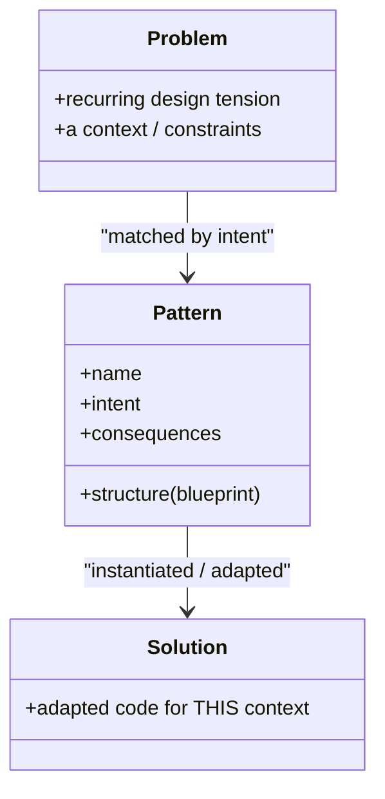
```mermaid
classDiagram
    class Problem {
      +recurring design tension
      +a context / constraints
    }
    class Pattern {
      +name
      +intent
      +structure (blueprint)
      +consequences
    }
    class Solution {
      +adapted code for THIS context
    }
    Problem --> Pattern : "matched by intent"
    Pattern --> Solution : "instantiated / adapted"
```

**Trade-offs.** *Pros:* shared vocabulary, proven structure, faster communication, captures
trade-offs explicitly. *Cons:* every pattern adds a layer of **indirection** (more classes,
more moving parts) — indirection you pay for whether or not you need the flexibility. *When to
use:* when the recurring problem the pattern targets is actually present. *When NOT to:* when
you apply it "to be safe" for a variation that may never come (see YAGNI, over-engineering).
**A pattern is a tool, not a goal.**

> [!KEY-TAKEAWAY]
> A pattern is a *blueprint* (high-level, adaptable structure), not an *algorithm* (a fixed,
> step-by-step recipe like quicksort). An algorithm always produces the same steps; a pattern
> is instantiated differently every time you apply it.

**Pattern vs algorithm.** An algorithm defines a concrete sequence of computational steps to
reach a goal (deterministic recipe). A pattern is a higher-level description of *how objects are
arranged and collaborate* to solve a design problem — it says nothing about the exact steps and
is realized differently each time. Confusing the two ("Singleton is an algorithm") is a red flag.

**Pattern vs library vs framework** (a common senior follow-up — *"is Spring a design pattern?"*).
These are three different things:

- A **design pattern** is a *described solution you re-implement yourself* in your own classes —
  it ships as knowledge, not code. You write the code.
- A **library** is *reusable code you call*: you're in charge, you invoke its functions when you
  want (e.g. `Collections.sort(list)`). You call it.
- A **framework** *inverts control*: it owns the main loop and **calls your code** at the
  extension points it defines (the "Hollywood principle" — "don't call us, we'll call you"). Spring,
  a web framework, or JUnit are frameworks, not patterns. This is exactly the **Inversion of
  Control (IoC)** idea discussed under DIP; a framework is IoC delivered as a product.

---

## History & origins

**Problem it solves:** patterns can sound like folklore. Citing the canon makes your answer
sound grounded and shows you know where the boundaries between catalogs lie.

**Intent / how it works.** The *pattern* idea comes from **architecture**, not software:
Christopher Alexander's *A Pattern Language* (1977) described reusable solutions to problems in
building/town design. In 1994 the **"Gang of Four" (GoF)** — Erich Gamma, Richard Helm, Ralph
Johnson, John Vlissides — adapted the idea to object-oriented software in *Design Patterns:
Elements of Reusable Object-Oriented Software*, cataloguing **23 patterns**. Later catalogs
extended the idea to other scopes: **POSA** (*Pattern-Oriented Software Architecture*, Buschmann
et al.) added architectural and concurrency patterns; **Martin Fowler's PoEAA** (2002) catalogued
enterprise application patterns (Repository, Unit of Work, DTO, MVC variants…); and modern
**cloud catalogs** (Microsoft Azure Architecture Center, AWS) plus **microservices.io** (Chris
Richardson) catalogue distributed-systems patterns.

**Concrete example (timeline).**

| Year | Milestone | Scope |
|---|---|---|
| 1977 | Alexander, *A Pattern Language* | building/urban architecture |
| 1994 | GoF, *Design Patterns* (23 patterns) | OO class/object design |
| 1996+ | POSA vols 1–5 | architecture + concurrency patterns |
| 2000 | R. C. Martin, *Design Principles and Design Patterns* | the SOLID principles |
| 2002 | Fowler, *PoEAA* | enterprise app / persistence |
| 2010s+ | Azure / AWS catalogs, microservices.io | cloud & distributed systems |

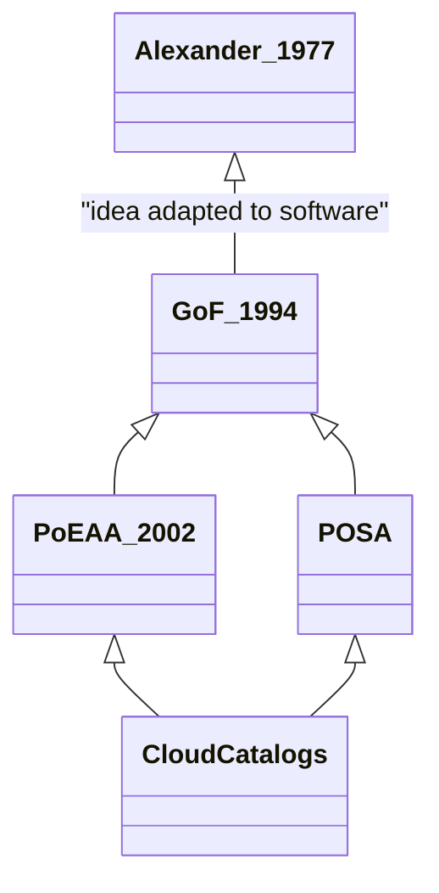
```mermaid
classDiagram
    class Alexander_1977
    class GoF_1994
    class POSA
    class PoEAA_2002
    class CloudCatalogs
    Alexander_1977 <|-- GoF_1994 : "idea adapted to software"
    GoF_1994 <|-- POSA
    GoF_1994 <|-- PoEAA_2002
    PoEAA_2002 <|-- CloudCatalogs
    POSA <|-- CloudCatalogs
```

**Trade-offs / GoF vs later catalogs.** GoF patterns are **general-purpose OO design** patterns
(class/object scale). Enterprise and cloud catalogs operate at a **larger scale** (application
architecture, cross-service communication) and assume infrastructure GoF never addressed
(networks, message brokers, databases). Don't cite a cloud pattern (e.g. Circuit Breaker) as if
it were GoF, or vice versa — interviewers notice the category error.

---

## The GoF catalog & 3 categories

**Problem it solves:** 23 patterns are hard to reason about as a flat list. Grouping them by
*what kind of problem they address* gives you a mental index to retrieve the right one fast.

**Intent / how it works.** GoF's primary classification is by **purpose**:

- **Creational** (5) — abstract *object creation*, decoupling a system from how its objects are
  made: Singleton, Factory Method, Abstract Factory, Builder, Prototype.
- **Structural** (7) — how classes/objects are *composed* into larger structures: Adapter,
  Bridge, Composite, Decorator, Facade, Flyweight, Proxy.
- **Behavioral** (11) — how objects *distribute responsibility and communicate*: Chain of
  Responsibility, Command, Interpreter, Iterator, Mediator, Memento, Observer, State, Strategy,
  Template Method, Visitor.

**Concrete example.** "I need to create families of related UI controls without naming concrete
classes" → creational (Abstract Factory). "I need to wrap a class so it matches a different
interface" → structural (Adapter). "I need to swap the sort algorithm at runtime" → behavioral
(Strategy). The category tells you which shelf to look on.

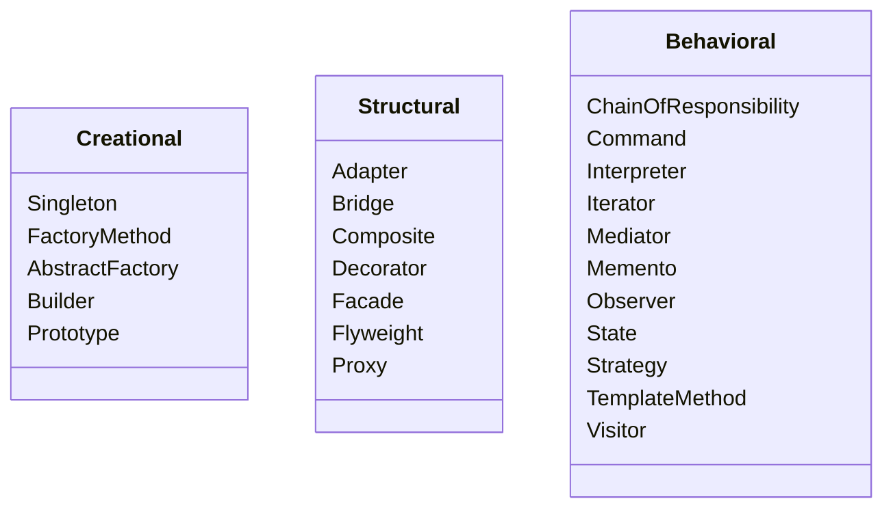
```mermaid
classDiagram
    class Creational {
      Singleton
      FactoryMethod
      AbstractFactory
      Builder
      Prototype
    }
    class Structural {
      Adapter
      Bridge
      Composite
      Decorator
      Facade
      Flyweight
      Proxy
    }
    class Behavioral {
      ChainOfResponsibility
      Command
      Interpreter
      Iterator
      Mediator
      Memento
      Observer
      State
      Strategy
      TemplateMethod
      Visitor
    }
```

**Trade-offs.** The categories **overlap and are a lens, not a law**: Adapter and Proxy share the
*same structure* but differ by intent; Strategy (behavioral) and Bridge (structural) look alike.
The classification helps recall, but never argue "it can't be X because it's in the structural
bucket." Judge by intent.

---

## Anatomy of a pattern (GoF template)

**Problem it solves:** if you only memorize a pattern's diagram you can't reason about *when* to
use it or what it costs. The GoF template forces you to capture the parts interviewers actually
probe — applicability and consequences.

**Intent / how it works.** GoF describe every pattern with a fixed set of sections:
**Intent, Motivation, Applicability, Structure, Participants, Collaborations, Consequences,
Implementation, Sample Code, Known Uses, Related Patterns.** Three are easy to confuse:

- **Structure** — the static class diagram (the boxes and arrows).
- **Participants** — the *roles* each class/object plays (e.g. "Subject", "ConcreteObserver").
- **Collaborations** — how those participants *interact at runtime* to fulfil the intent (the
  dynamic behavior; often a sequence).

**Concrete example (Observer, abbreviated template).** *Intent:* define a one-to-many dependency
so dependents are notified automatically. *Applicability:* when a change to one object requires
changing others and you don't know how many. *Participants:* Subject, Observer, ConcreteSubject,
ConcreteObserver. *Collaborations:* ConcreteSubject notifies its observers whenever a change
would make their state inconsistent. *Consequences:* loose coupling; but unexpected update
cascades. *Known uses:* MVC, event listeners.

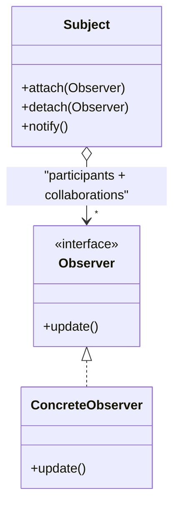
```mermaid
classDiagram
    class Subject {
      +attach(Observer)
      +detach(Observer)
      +notify()
    }
    class Observer {
      <<interface>>
      +update()
    }
    class ConcreteObserver {
      +update()
    }
    Subject o--> "*" Observer : "participants + collaborations"
    Observer <|.. ConcreteObserver
```

**Trade-offs.** The template's value is that it makes **Consequences** first-class — most junior
answers stop at Structure. In an interview, always move from Structure → Consequences. The cost:
the full template is verbose; in practice people abbreviate to Intent + Structure + Consequences.

---

## Two scoping axes: class vs object patterns

**Problem it solves:** you need to know *when a pattern's flexibility is fixed at compile time
vs available at run time*, because that determines whether behavior can change while the program
runs.

**Intent / how it works.** GoF's *second* classification is by **scope**:

- **Class patterns** rely on **inheritance** — relationships fixed at **compile time**. Example:
  Factory Method, Template Method, and the class form of Adapter.
- **Object patterns** rely on **object composition / delegation** — relationships established and
  changeable at **run time**. Example: Strategy, Composite, Decorator, Proxy, and the object form
  of Adapter.

Most GoF patterns are object-scoped, reflecting the principle "favor composition over
inheritance."

**Concrete example.** *Class Adapter* subclasses the Adaptee (multiple inheritance in C++ — the
adapter *is-a* Adaptee *and* Target; in Java/C#, which have no multiple *class* inheritance, you
`extend` the Adaptee class and `implement` the Target interface). Either way the relationship is
fixed at compile time — you can't re-target at runtime. *Object Adapter* holds a reference to the
Adaptee (Adapter *has-a* Adaptee) — you can swap the adaptee object at runtime.

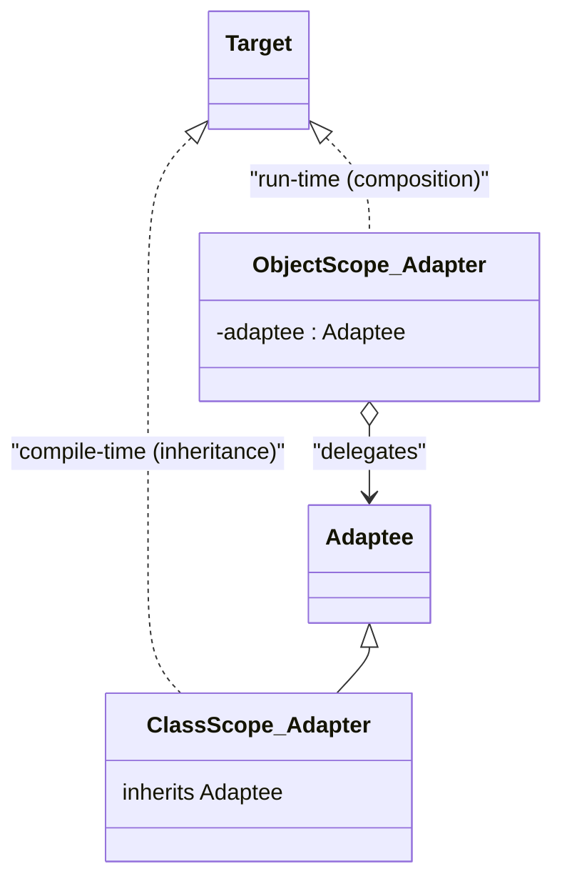
```mermaid
classDiagram
    class ClassScope_Adapter {
      inherits Adaptee
    }
    class Target
    class Adaptee
    Target <|.. ClassScope_Adapter : "compile-time (inheritance)"
    Adaptee <|-- ClassScope_Adapter

    class ObjectScope_Adapter {
      -adaptee : Adaptee
    }
    Target <|.. ObjectScope_Adapter : "run-time (composition)"
    ObjectScope_Adapter o--> Adaptee : "delegates"
```

**Trade-offs.** Object scope is **more flexible** (swap collaborators at runtime, no fragile base
class) but adds **indirection** and forwarding. Class scope is simpler and faster to write but
**rigid** (behavior locked at compile time) and couples you to a base implementation.

---

## Idioms vs design patterns vs architectural styles

**Problem it solves:** teams argue past each other because "pattern" is used at three different
abstraction levels. Naming the level keeps the discussion coherent and stops you from picking a
solution at the wrong altitude.

**Intent / how it works.** There are three abstraction levels:

- **Idiom (lowest)** — a low-level, **language-specific** technique. E.g. RAII in C++, the
  try-with-resources idiom in Java, list comprehensions in Python.
- **Design pattern (mid)** — a **language-agnostic** OO solution at the class/object scale (the
  GoF 23, plus Null Object, Repository, etc.).
- **Architectural style / pattern (highest)** — the **system-wide** structure: Layered, Client-
  Server, Microservices, Event-Driven, Hexagonal (Ports & Adapters), Pipe-and-Filter, MVC.

**Concrete example.** RAII (idiom) manages a single resource in C++; Strategy (design pattern)
swaps an algorithm inside a component; Microservices (architectural style) decomposes an entire
system into independently deployable services. All are "patterns" loosely, but at wildly
different scales.

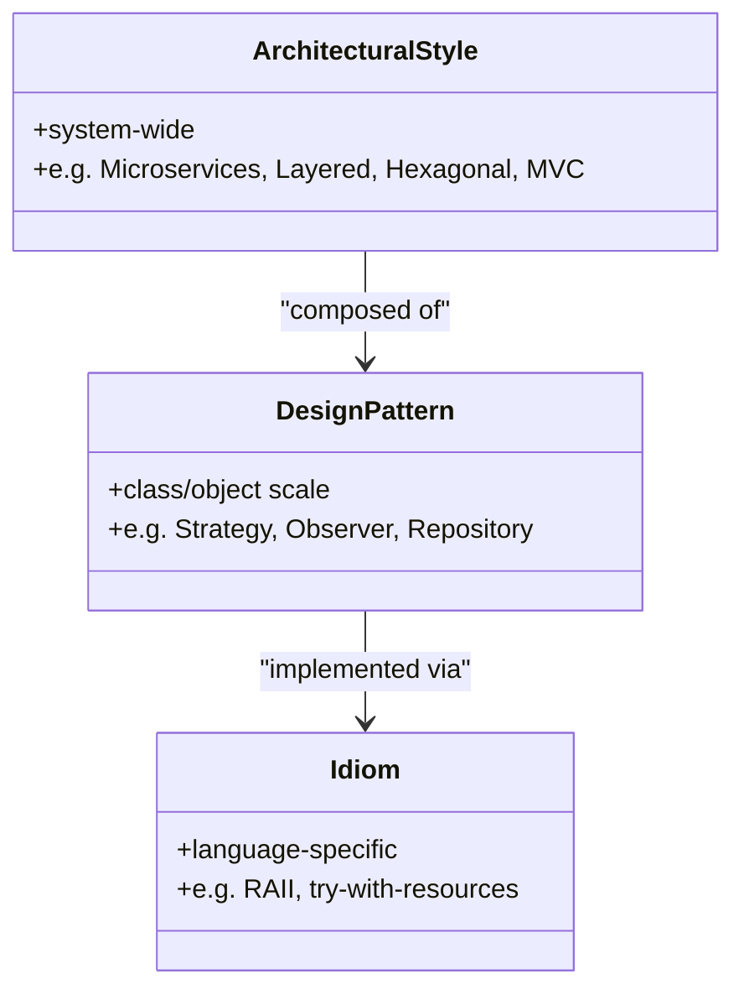
```mermaid
classDiagram
    class ArchitecturalStyle {
      +system-wide
      +e.g. Microservices, Layered, Hexagonal, MVC
    }
    class DesignPattern {
      +class/object scale
      +e.g. Strategy, Observer, Repository
    }
    class Idiom {
      +language-specific
      +e.g. RAII, try-with-resources
    }
    ArchitecturalStyle --> DesignPattern : "composed of"
    DesignPattern --> Idiom : "implemented via"
```

**Trade-offs.** Choosing the **wrong level** for a problem is a classic error: reaching for a
microservice split (architecture) to fix what is really a class-design smell (a God Object), or
citing a language idiom when the interviewer wants an architectural answer. Match the abstraction
level to the scope of the problem.

---

## How to choose a pattern

**Problem it solves:** beginners "design *from* patterns" — they pick a favorite pattern and bend
the problem to fit it, producing over-engineered code. You need a disciplined way to arrive at a
pattern *only when it earns its place*.

**Intent / how it works.** The healthy process is problem-first:
1. **State the problem/constraint** precisely (what varies? what must stay stable? what's
   changing for the wrong reasons?).
2. **Match the pain to a pattern's intent** — not its structure.
3. **Accept the trade-off** — every pattern adds indirection; is the flexibility worth it *now*?
4. **Refactor *to* patterns**, don't design *from* them (Kerievsky, *Refactoring to Patterns*):
   introduce the pattern when duplication/change-pressure actually appears — often the "rule of
   three."

**Concrete example.** You have one payment provider today. Don't build an Abstract Factory "in
case" you add more. When the *second* provider arrives and an `if/else` on provider type starts
spreading, that duplication is the signal to introduce Strategy or Factory Method — the pattern
now removes real pain.

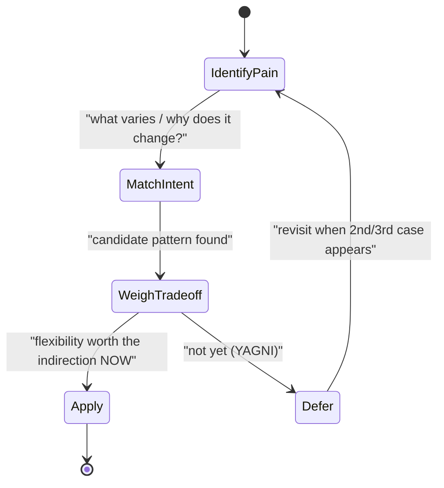
```mermaid
stateDiagram-v2
    [*] --> IdentifyPain
    IdentifyPain --> MatchIntent : "what varies / why does it change?"
    MatchIntent --> WeighTradeoff : "candidate pattern found"
    WeighTradeoff --> Apply : "flexibility worth the indirection NOW"
    WeighTradeoff --> Defer : "not yet (YAGNI)"
    Defer --> IdentifyPain : "revisit when 2nd/3rd case appears"
    Apply --> [*]
```

**Trade-offs.** Designing pattern-first causes **over-engineering** and **Golden Hammer** (see
anti-patterns). Refactoring-to-patterns risks a little rework later, but keeps the design lean.
The rule of thumb: *patterns are the destination of refactoring, not the starting point of design.*

---

## Single Responsibility Principle (SRP)

**Problem it solves:** a class that does several unrelated jobs has **several reasons to change**;
a change requested by one stakeholder can break behavior another stakeholder relies on, and the
class becomes a merge-conflict and testing nightmare.

**Intent / how it works.** SRP (the "S" in SOLID) states: **a class should have only one reason
to change** — i.e. it should be responsible to a single *actor* / stakeholder. Group together the
things that change for the same reason; separate the things that change for different reasons.

**Concrete example (before → after).**

```java
// BEFORE: one class, three reasons to change (business rules, formatting, persistence)
class Report {
    String computeTotals() { /* business logic */ return "..."; }
    String renderHtml()    { /* presentation */  return "<html>..."; }
    void   saveToDb()      { /* persistence */ }
}
```
```java
// AFTER: each responsibility (actor) isolated
class Report        { String computeTotals() { /* business logic only */ return "..."; } }
class ReportRenderer{ String renderHtml(Report r) { return "<html>..."; } }
class ReportRepo    { void save(Report r) { /* persistence only */ } }
```

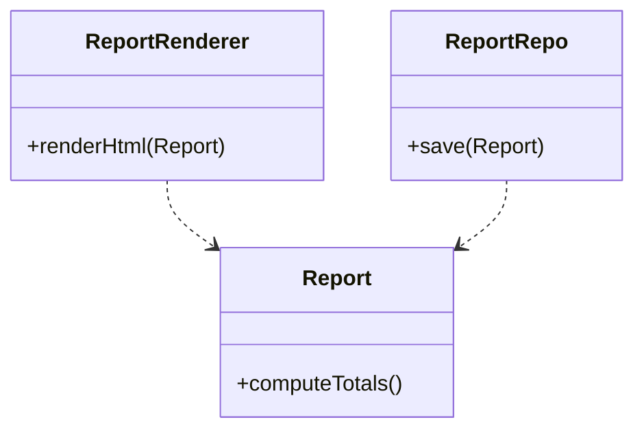
```mermaid
classDiagram
    class Report {
      +computeTotals()
    }
    class ReportRenderer {
      +renderHtml(Report)
    }
    class ReportRepo {
      +save(Report)
    }
    ReportRenderer ..> Report
    ReportRepo ..> Report
```

**Trade-offs.** *Pros:* smaller, testable, low-coupling classes; changes stay localized. *Cons:*
splitting too aggressively yields **anemic, scattered** classes and more wiring — you can lose
cohesion by fragmenting one real responsibility across many files. **SRP vs ISP:** SRP is about a
*class* having one reason to change (server side); **ISP** is about *clients* not depending on
methods they don't use (interface side). They rhyme but apply to different surfaces.

---

## Open/Closed Principle (OCP)

**Problem it solves:** every new requirement forces you to **edit and re-test existing, working
code**, risking regressions in code that had nothing to do with the new feature.

**Intent / how it works.** OCP (Bertrand Meyer; the "O" in SOLID): **software entities should be
open for extension but closed for modification.** You add new behavior by adding new code (new
subclasses/strategies/plugins), not by editing existing classes. Achieved via polymorphism —
Strategy, Template Method, and abstract interfaces are the usual vehicles.

**Concrete example (before → after).**

```java
// BEFORE: adding a shape means editing this method (not closed for modification)
double area(Shape s) {
    if (s instanceof Circle c)    return 3.14 * c.r * c.r;   // cast to reach the field
    if (s instanceof Rectangle r) return r.w * r.h;          // add Triangle? edit here again
    throw new IllegalArgumentException("unknown shape");
}
```
```java
// AFTER: add a shape by adding a class; area() never changes again
interface Shape { double area(); }
class Circle    implements Shape { public double area() { return 3.14*r*r; } }
class Rectangle implements Shape { public double area() { return w*h; } }
class Triangle  implements Shape { public double area() { return 0.5*b*h; } } // new, no edits
```

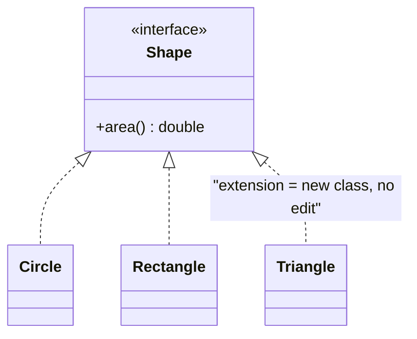
```mermaid
classDiagram
    class Shape {
      <<interface>>
      +area() double
    }
    class Circle
    class Rectangle
    class Triangle
    Shape <|.. Circle
    Shape <|.. Rectangle
    Shape <|.. Triangle : "extension = new class, no edit"
```

**Trade-offs.** *Pros:* new features don't destabilize existing code; supports plugins. *Cons:*
**speculative extension points are premature abstraction** — adding hooks for variation that never
comes just adds indirection (tension with YAGNI). *When:* along the axis you *know* varies. *When
NOT:* everywhere "to be safe." **OCP is achieved via Strategy/Template Method; the alternative it
replaces is editing a growing conditional.**

---

## Liskov Substitution Principle (LSP)

**Problem it solves:** a subtype that silently breaks its base type's contract makes polymorphism
**unsafe** — code written against the base type malfunctions when handed the subtype, and you
can't reason about a reference by its declared type.

**Intent / how it works.** LSP (Barbara Liskov; the "L" in SOLID): **objects of a subtype must be
usable anywhere the base type is expected, without altering correctness.** A subtype must honor
the base's contract: don't strengthen preconditions, don't weaken postconditions, preserve
invariants (design-by-contract). It's about **behavioral** subtyping, not just compilable
inheritance.

**Concrete example (the classic).** `Square extends Rectangle` seems natural ("a square is a
rectangle"). But if `setWidth(5); setHeight(4)` must yield area 20 for any Rectangle, a Square
(which forces width==height) breaks that expectation — substituting Square for Rectangle violates
the contract. Similarly `Ostrich extends Bird` breaks if `Bird.fly()` is assumed.

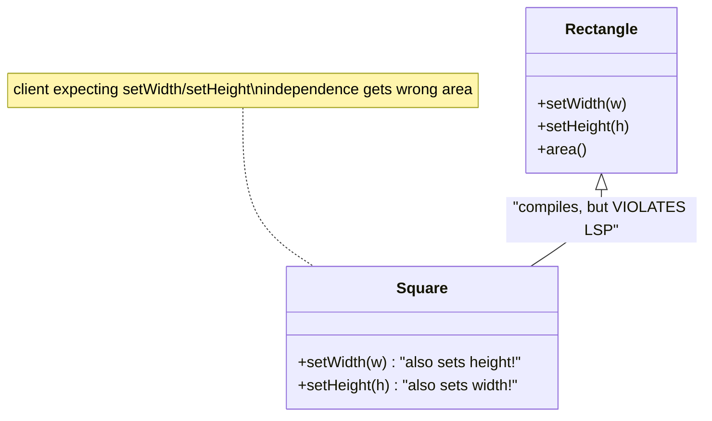
```mermaid
classDiagram
    class Rectangle {
      +setWidth(w)
      +setHeight(h)
      +area()
    }
    class Square {
      +setWidth(w)  "also sets height!"
      +setHeight(h) "also sets width!"
    }
    Rectangle <|-- Square : "compiles, but VIOLATES LSP"
    note for Square "client expecting setWidth/setHeight\nindependence gets wrong area"
```

**Trade-offs.** *Pros of honoring it:* safe polymorphism, reliable base-type reasoning. *Cost of
violating it:* type-check hacks (`if (x instanceof Square)`) that defeat polymorphism. **LSP vs
naive "is-a":** real-world taxonomy ("a square *is a* rectangle") does **not** imply valid
behavioral subtyping. Model by *substitutable behavior*, not by dictionary definitions — often
composition or a shared abstraction (`Shape`) is the fix.

---

## Interface Segregation Principle (ISP)

**Problem it solves:** a **fat interface** forces implementers and clients to depend on methods
they don't use; a change to a method some clients never call still forces all of them to
recompile/adapt, and implementers must stub methods that don't apply.

**Intent / how it works.** ISP (the "I" in SOLID): **no client should be forced to depend on
methods it does not use.** Split large interfaces into smaller, role-specific ones so each client
sees only what it needs.

**Concrete example (before → after).**

```java
// BEFORE: fat interface; a SimplePrinter is forced to implement scan/fax it can't do
interface Machine { void print(); void scan(); void fax(); }
class SimplePrinter implements Machine {
    public void print() { /* ok */ }
    public void scan()  { throw new UnsupportedOperationException(); } // smell
    public void fax()   { throw new UnsupportedOperationException(); }
}
```
```java
// AFTER: segregated roles; implement only what applies
interface Printer { void print(); }
interface Scanner { void scan(); }
interface Fax     { void fax(); }
class SimplePrinter implements Printer { public void print() {} }
class AllInOne implements Printer, Scanner, Fax { /* implements all three */ }
```

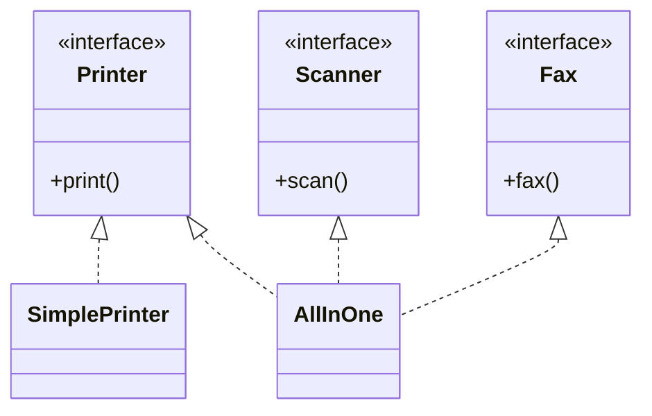
```mermaid
classDiagram
    class Printer {
      <<interface>>
      +print()
    }
    class Scanner {
      <<interface>>
      +scan()
    }
    class Fax {
      <<interface>>
      +fax()
    }
    class SimplePrinter
    class AllInOne
    Printer <|.. SimplePrinter
    Printer <|.. AllInOne
    Scanner <|.. AllInOne
    Fax <|.. AllInOne
```

**Trade-offs.** *Pros:* clients decouple from irrelevant changes; no "throw
UnsupportedOperation" stubs. *Cons:* over-splitting → **interface explosion** (dozens of
one-method interfaces) that's hard to navigate. **ISP vs SRP:** SRP limits a *class's* reasons to
change; ISP limits an *interface's* surface so *clients* aren't over-coupled — same instinct
(cohesion), different target (class body vs client-facing contract).

---

## Dependency Inversion Principle (DIP)

**Problem it solves:** high-level policy (business rules) that directly instantiates/depends on
low-level details (a specific DB, HTTP client, file format) **can't be tested in isolation or
have its details swapped** — the important code is chained to the volatile code.

**Intent / how it works.** DIP (the "D" in SOLID): **(a) high-level modules should not depend on
low-level modules; both should depend on abstractions; (b) abstractions should not depend on
details; details should depend on abstractions.** You *invert* the arrow: the low-level module
now implements an interface *owned by* the high-level policy.

**Concrete example (before → after).**

```java
// BEFORE: high-level OrderService depends directly on a concrete MySqlOrderRepo
class OrderService {
    private MySqlOrderRepo repo = new MySqlOrderRepo(); // hard-wired detail
}
```
```java
// AFTER: both depend on an abstraction owned by the policy layer
interface OrderRepo { void save(Order o); }                 // abstraction (high-level owns it)
class MySqlOrderRepo implements OrderRepo { /* detail */ }   // detail depends on abstraction
class OrderService {
    private final OrderRepo repo;
    OrderService(OrderRepo repo) { this.repo = repo; }       // injected
}
```

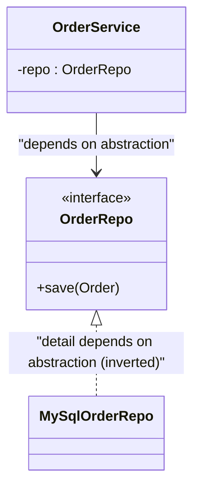
```mermaid
classDiagram
    class OrderService {
      -repo : OrderRepo
    }
    class OrderRepo {
      <<interface>>
      +save(Order)
    }
    class MySqlOrderRepo
    OrderService --> OrderRepo : "depends on abstraction"
    OrderRepo <|.. MySqlOrderRepo : "detail depends on abstraction (inverted)"
```

**Trade-offs.** *Pros:* testable (inject a fake repo), swappable details, clean layering. *Cons:*
**abstractions everywhere → needless indirection** and interface bloat if applied to stable
collaborators. **DIP vs Dependency Injection vs IoC — a must-clarify confusion:**
- **DIP** is the *principle* (depend on abstractions).
- **Dependency Injection (DI)** is a *technique* for supplying dependencies from outside
  (constructor/setter/interface injection) — one common way to *follow* DIP.
- **Inversion of Control (IoC)** is the *broad idea* that the framework/runtime calls your code
  (Hollywood principle); a **DI container** (Spring, Guice) is a tool that automates DI. DIP can
  be satisfied with plain constructor injection — no container required.

---

## DRY (Don't Repeat Yourself)

**Problem it solves:** the same *knowledge* (a rule, a constant, a calculation) copied in several
places means a change must be made in every copy; miss one and you get inconsistent, buggy
behavior.

**Intent / how it works.** DRY (Hunt & Thomas, *The Pragmatic Programmer*): **every piece of
knowledge should have a single, unambiguous, authoritative representation in the system.** It's
about *knowledge*, not textual similarity — dedupe the *concept*, not incidental look-alikes.

**Concrete example (before → after).**

```java
// BEFORE: the tax rule (0.2) and formula duplicated — change one, forget the other
double invoiceTotal(double net) { return net + net * 0.2; }
double quoteTotal(double net)   { return net + net * 0.2; }
```
```java
// AFTER: one authoritative representation of the tax knowledge
double withTax(double net) { return net + net * TAX_RATE; }
double invoiceTotal(double net) { return withTax(net); }
double quoteTotal(double net)   { return withTax(net); }
```

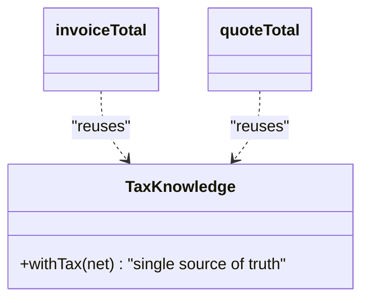
```mermaid
classDiagram
    class TaxKnowledge {
      +withTax(net) "single source of truth"
    }
    class invoiceTotal
    class quoteTotal
    invoiceTotal ..> TaxKnowledge : "reuses"
    quoteTotal ..> TaxKnowledge : "reuses"
```

**Trade-offs.** *Pros:* one place to change, consistency. *Cons / the big caveat:* **a wrong
abstraction is worse than duplication** (Sandi Metz). Two snippets that *look* identical today but
represent **different knowledge** that will evolve independently should NOT be merged — "accidental
duplication." **DRY vs WET / rule-of-three:** tolerate duplication until you see the *third*
occurrence and are sure it's the same knowledge; premature DRYing couples unrelated code through a
shared function that then sprouts flags/parameters.

---

## KISS (Keep It Simple)

**Problem it solves:** needless complexity (clever generics, deep hierarchies, premature
frameworks) slows every future change, widens the surface for bugs, and raises the onboarding
cost.

**Intent / how it works.** KISS — "Keep It Simple, Stupid" — favor the **simplest design that
meets the actual requirements.** Prefer straightforward, readable code over clever, generic, or
"impressive" solutions. Simplicity is a feature.

**Concrete example.** A config with three known keys doesn't need a plugin-based, reflection-
driven, hot-reloading configuration engine — a plain struct/record with three fields is simpler,
faster, and safer. Reach for the engine only if requirements demand it.

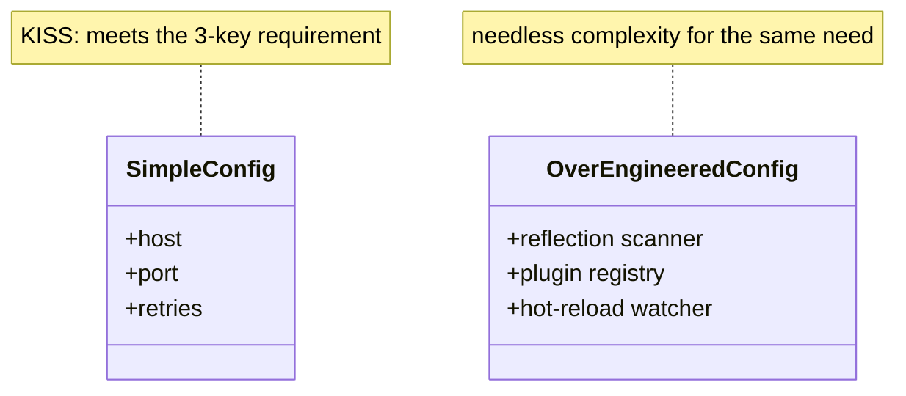
```mermaid
classDiagram
    class SimpleConfig {
      +host
      +port
      +retries
    }
    class OverEngineeredConfig {
      +reflection scanner
      +plugin registry
      +hot-reload watcher
    }
    note for SimpleConfig "KISS: meets the 3-key requirement"
    note for OverEngineeredConfig "needless complexity for the same need"
```

**Trade-offs.** *Pros:* fewer bugs, easier change and review. *Cons / caveat:* "simple" is
**subjective**, and KISS can be misused to justify **under-design** (skipping a genuinely needed
abstraction, producing copy-paste sprawl). Balance KISS against real, present extensibility needs.
**KISS vs clever/generic:** clever code optimizes for the author's ego or a hypothetical future;
KISS optimizes for the next reader. Choose the reader.

---

## YAGNI (You Aren't Gonna Need It)

**Problem it solves:** building features, config knobs, and extension points for an *imagined*
future wastes effort now and adds permanent **carrying cost** (code to maintain, test, and reason
about) for capability that may never be used.

**Intent / how it works.** YAGNI (Extreme Programming, Kent Beck): **implement things only when
you actually need them, not when you merely foresee needing them.** Speculative generality is a
smell; add capability at the moment the requirement is real.

**Concrete example.** You're asked to export CSV. Don't build a pluggable
`ExportStrategy` framework for CSV/PDF/XML/Parquet "since we might add formats." Ship CSV. When
the *second* format is actually requested, refactor to Strategy then — the abstraction is now
justified by real demand.

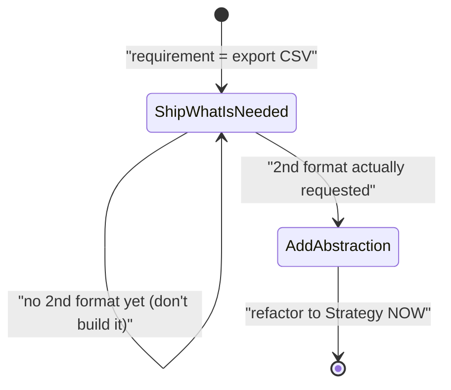
```mermaid
stateDiagram-v2
    [*] --> ShipWhatIsNeeded : "requirement = export CSV"
    ShipWhatIsNeeded --> ShipWhatIsNeeded : "no 2nd format yet (don't build it)"
    ShipWhatIsNeeded --> AddAbstraction : "2nd format actually requested"
    AddAbstraction --> [*] : "refactor to Strategy NOW"
```

**Trade-offs.** *Pros:* less code, faster delivery, no dead abstractions. *Cons / caveat:* YAGNI
can be **misused to skip extensibility that is genuinely, imminently needed** (e.g. you *know*
three payment providers are on the roadmap this quarter). **YAGNI vs OCP tension:** OCP pushes you
to add extension points; YAGNI pushes you to wait. Resolve it by evidence: add the seam when the
*second* concrete case exists or is firmly scheduled, not on speculation.

---

## Separation of Concerns

**Problem it solves:** when unrelated concerns (UI, business rules, persistence, logging) are
**tangled** in the same module, you can't change or reason about one without understanding and
risking the others.

**Intent / how it works.** Separation of Concerns (SoC; Dijkstra): **partition a system so each
part addresses a distinct concern**, with minimal overlap. It operates at the **module/layer**
level — the principle behind layered architecture, MVC, and Hexagonal (ports & adapters).

**Concrete example.** A web app split into presentation (controllers/views), domain (business
rules), and data-access (repositories) layers. A change to the DB engine touches only the data
layer; a UI redesign touches only presentation. Each concern evolves independently.

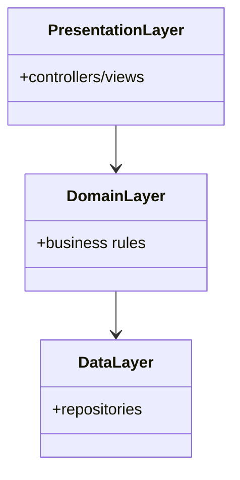
```mermaid
classDiagram
    class PresentationLayer {
      +controllers/views
    }
    class DomainLayer {
      +business rules
    }
    class DataLayer {
      +repositories
    }
    PresentationLayer --> DomainLayer
    DomainLayer --> DataLayer
```

**Trade-offs.** *Pros:* independent evolution, localized change, testability. *Cons:*
**over-layering** — too many thin layers add pass-through code and latency without value (see
"Lasagna code"). **SoC vs SRP:** SoC is the coarse-grained, *module/layer-level* version of the
same idea SRP expresses at the *class* level. SRP is SoC applied to a single class.

---

## Law of Demeter (principle of least knowledge)

**Problem it solves:** long navigation chains like `order.getCustomer().getAddress().getCity()`
couple a caller to the **internal structure of distant objects**; any change to that structure
ripples out to every chain ("train wreck"), and the caller knows far more than it should.

**Intent / how it works.** Law of Demeter (LoD): **a method should only talk to its immediate
"friends"** — its own fields, its parameters, objects it creates, and `this` — not to objects
returned by those friends. "Only talk to friends, not strangers." Prefer *telling* an object to
do something over *asking* it for internals to operate on ("Tell, Don't Ask").

**Concrete example.** Instead of `order.getCustomer().getWallet().deduct(amount)` (reaching two
levels in), add `order.charge(amount)` so `Order` handles the internal navigation. The caller
depends only on `Order`.

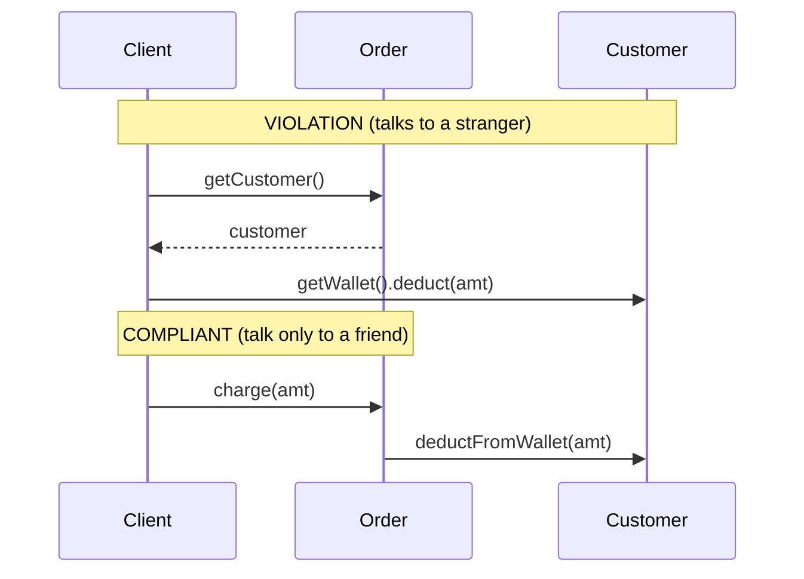
```mermaid
sequenceDiagram
    participant Client
    participant Order
    participant Customer
    Note over Client,Customer: VIOLATION (talks to a stranger)
    Client->>Order: getCustomer()
    Order-->>Client: customer
    Client->>Customer: getWallet().deduct(amt)
    Note over Client,Order: COMPLIANT (talk only to a friend)
    Client->>Order: charge(amt)
    Order->>Customer: deductFromWallet(amt)
```

**Trade-offs.** *Pros:* looser coupling, hides internal structure, more robust to change. *Cons:*
can spawn many **delegating wrapper methods** (forwarding bloat) and a fix-cost when refactoring
existing train wrecks. **LoD vs fluent interfaces/builders:** chained calls like
`builder.a().b().c()` or a Stream pipeline are *not* LoD violations — each call returns the *same*
type (`this`) by design; LoD is about reaching into *different, foreign* objects' internals.

---

## Composition over inheritance

**Problem it solves:** deep inheritance hierarchies are **rigid** (behavior fixed at compile
time), suffer the **fragile base class** problem (a base change breaks subclasses), and cause a
**combinatorial explosion** of subclasses when behaviors vary along multiple axes.

**Intent / how it works.** "Favor object composition over class inheritance" (GoF): build behavior
by **assembling objects (has-a)** and delegating, rather than inheriting from a base class
(is-a). Composition lets you change behavior at runtime and mix capabilities without exploding the
class count.

**Concrete example.** A `Character` that can vary by *weapon* and *movement*: with inheritance you
get `SwordFlyingCharacter`, `BowFlyingCharacter`, `SwordWalkingCharacter`, … (N×M classes). With
composition, `Character` *has-a* `Weapon` and *has-a* `MovementBehavior` (both Strategy objects),
swappable at runtime — this is exactly what Strategy/Decorator/Bridge exploit.

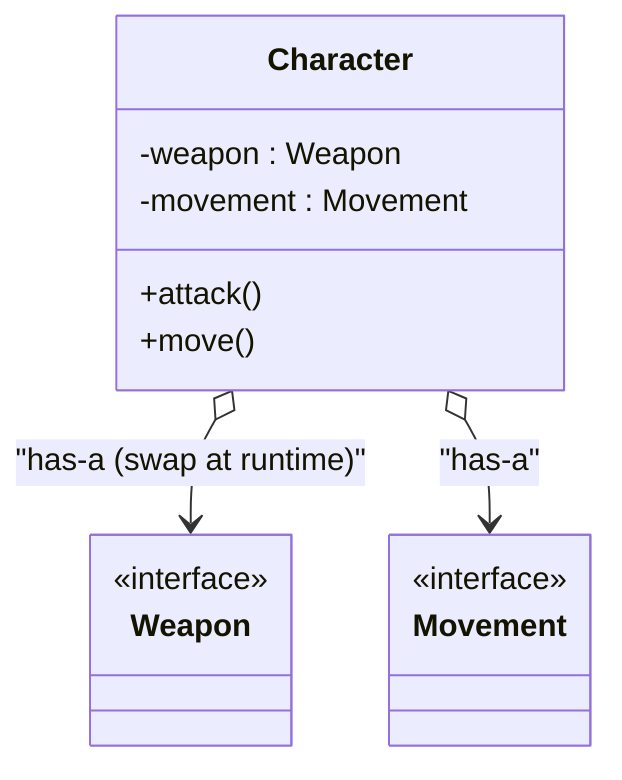
```mermaid
classDiagram
    class Character {
      -weapon : Weapon
      -movement : Movement
      +attack()
      +move()
    }
    class Weapon {
      <<interface>>
    }
    class Movement {
      <<interface>>
    }
    Character o--> Weapon : "has-a (swap at runtime)"
    Character o--> Movement : "has-a"
```

**Trade-offs.** *Pros:* runtime flexibility, no fragile base class, avoids subclass explosion,
better encapsulation. *Cons:* more objects and **forwarding/delegation boilerplate**; the wiring
is less obvious than a single inheritance chain. This principle **favors Strategy/Decorator/Bridge
over subclassing**; inheritance is still right for genuine, stable "is-a" specialization with a
true behavioral subtype (see LSP).

---

## Program to an interface, not an implementation

**Problem it solves:** depending on a **concrete class** prevents substituting a different
implementation (a fake for tests, an optimized variant, a new vendor) and couples callers to
details that may change.

**Intent / how it works.** GoF guideline: **declare variables and parameters in terms of an
abstract type (interface/supertype)**, not a concrete class, so any implementation can be
supplied. Client code manipulates objects only through the interface it defines.

**Concrete example.**

```java
List<String> names = new ArrayList<>();   // program to List (interface), not ArrayList
void process(List<String> items) { ... }  // accepts LinkedList, ArrayList, immutable lists...
```
Swapping `ArrayList` for `LinkedList` or a test double requires no change to `process`.

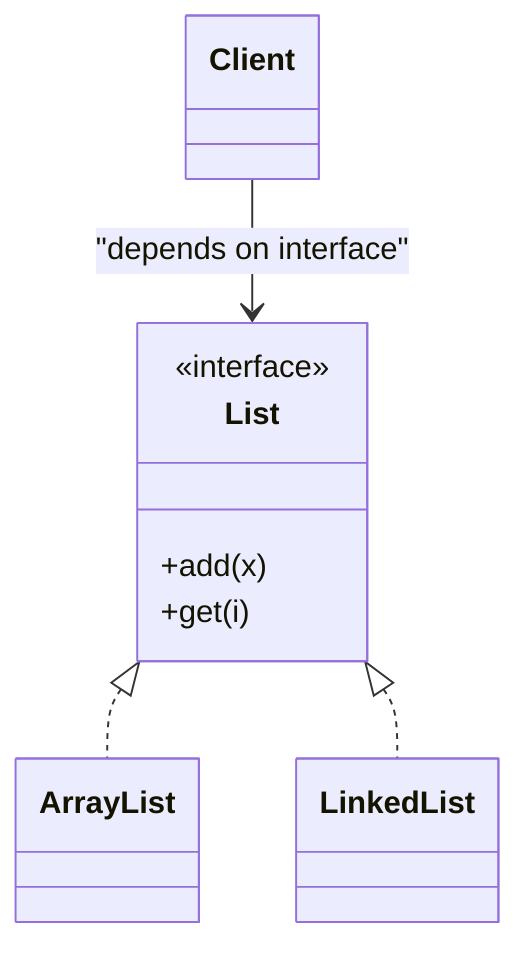
```mermaid
classDiagram
    class Client
    class List {
      <<interface>>
      +add(x)
      +get(i)
    }
    class ArrayList
    class LinkedList
    Client --> List : "depends on interface"
    List <|.. ArrayList
    List <|.. LinkedList
```

**Trade-offs.** *Pros:* substitutability, testability, loose coupling. *Cons:* **an interface for
every trivial, stable class is ceremony** — needless indirection where no variation exists.
**Overlaps DIP — clarify the distinction:** this is a *practical design guideline* ("code against
the abstract type you already have"); **DIP** is the *formal SOLID principle* about *which layer
owns the abstraction* and inverting the dependency arrow between policy and detail. Programming to
an interface is one habit that supports DIP.

---

## Encapsulate what varies

**Problem it solves:** when the part of a system that **changes** is scattered and tangled with the
stable part, every change ripples widely and destabilizes working code.

**Intent / how it works.** "Identify the aspects of your application that vary and separate them
from what stays the same" (Head First Design Patterns). **Isolate the volatile behavior behind a
stable interface** so it can change without touching the rest. This is the **meta-principle behind
many GoF patterns**: Strategy encapsulates a varying algorithm, Factory encapsulates varying
creation, Bridge encapsulates a varying implementation dimension, Observer encapsulates the
varying set of listeners.

**Concrete example.** In a duck-simulator, *flying* and *quacking* vary across duck types. Pull
them out into `FlyBehavior` and `QuackBehavior` interfaces (Strategy) held by `Duck`; add or change
a behavior without editing `Duck` or other duck subclasses.

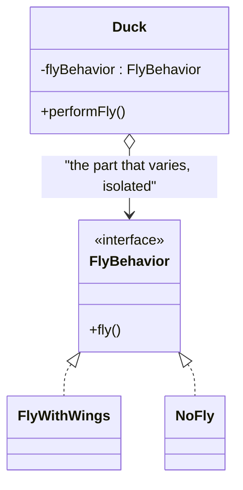
```mermaid
classDiagram
    class Duck {
      -flyBehavior : FlyBehavior
      +performFly()
    }
    class FlyBehavior {
      <<interface>>
      +fly()
    }
    class FlyWithWings
    class NoFly
    Duck o--> FlyBehavior : "the part that varies, isolated"
    FlyBehavior <|.. FlyWithWings
    FlyBehavior <|.. NoFly
```

**Trade-offs.** *Pros:* changes localize to the encapsulated part; stable code stays untouched
(supports OCP). *Cons:* you must **guess correctly what will vary** — encapsulate the wrong axis
and you've added indirection with no payoff (premature abstraction). Let real change pressure,
not speculation, tell you what to encapsulate.

---

## Coupling vs cohesion

**Problem it solves:** modules that are **tightly coupled** (depend heavily on each other's
internals) and have **low cohesion** (unrelated things lumped together) are brittle — a change in
one place breaks distant code, and modules can't be understood, tested, or reused in isolation.

**Intent / how it works.** **Coupling** = the degree of interdependence *between* modules (aim:
**loose**). **Cohesion** = how strongly the elements *within* a module belong together (aim:
**high**). Good design = **loose coupling + high cohesion**. Both live on a spectrum — memorizing
the ladder is useless unless you know what each rung *means*, so here is the gloss.

**Coupling ladder (loosest/best → tightest/worst):**

| Rung | What it means | Quick tell |
|---|---|---|
| **Data** (best) | modules communicate by passing only the *primitive values* actually needed | `charge(amount, currency)` |
| **Stamp** | you pass a whole record/struct but the callee uses only a field or two | `charge(wholeOrder)` when only `total` is read |
| **Control** | caller passes a *flag* that dictates *which branch* the callee runs | `render(doc, /*isPdf=*/true)` |
| **Common** | modules share **mutable global state** and step on each other through it | two modules read/write the same global `config` |
| **Content** (worst) | one module reaches into another's **internals** (private fields, guts) | `b.internalCache.buffer[3] = x` |

**Cohesion ladder (highest/best → lowest/worst):**

| Rung | What it means |
|---|---|
| **Functional** (best) | every element contributes to **one well-defined task** |
| **Sequential** | elements form a pipeline: one's output is the next's input |
| **Communicational** | elements operate on the **same data** but do different things to it |
| **Procedural / temporal** | grouped only because they run in sequence or at the same time (e.g. "init()") |
| **Logical** | grouped because they're the *same kind* of thing, switched by a flag (e.g. one `handle(type)` doing all I/O) — the flag proves they don't belong together |
| **Coincidental** (worst) | elements are lumped together for **no real reason** (a "Utils" grab-bag) |

The takeaway: aim for **data coupling + functional cohesion**; treat control/common/content coupling
and logical/coincidental cohesion as refactoring signals.

**Concrete example.** A `PricingService` that reaches into `Order`'s private fields and also sends
emails is tightly coupled (touches Order internals) and low-cohesion (pricing + email). Splitting
email out (high cohesion) and interacting with `Order` only through its public API (loose coupling)
fixes both.

```mermaid
classDiagram
    class ModuleA {
      +high cohesion (one job)
    }
    class ModuleB {
      +high cohesion (one job)
    }
    ModuleA --> ModuleB : "loose coupling (via interface, minimal surface)"
```

**Trade-offs.** *Pros of loose+cohesive:* independent change, testability, reuse. *Caveat:* **zero
coupling is impossible** — modules must collaborate; the goal is *loose*, not *none*, and
excessively avoiding coupling can produce indirection or duplicated logic. **Coupling vs cohesion:**
they're distinct axes — you want to *minimize* the first and *maximize* the second; they often move
together (fixing cohesion frequently reduces coupling).

---

## GRASP principles (Larman)

**Problem it solves:** SOLID tells you qualities to aim for but not *where to put a given
responsibility*. GRASP answers the recurring OOD question: **"which class should own this method /
this data / this creation?"**

**Intent / how it works.** GRASP = **General Responsibility Assignment Software Patterns** (Craig
Larman). Nine principles guide responsibility assignment:

| GRASP principle | Assign responsibility to… |
|---|---|
| **Information Expert** | the class that has the information needed to fulfil it |
| **Creator** | the class that aggregates/contains/closely uses the created object |
| **Controller** | a non-UI object that receives and coordinates a system operation |
| **Low Coupling** | choices that keep interdependence low |
| **High Cohesion** | choices that keep responsibilities focused |
| **Polymorphism** | type-varying behavior via polymorphic operations, not conditionals |
| **Pure Fabrication** | a made-up class (not from the domain) to keep cohesion high / coupling low |
| **Indirection** | an intermediary to decouple two elements |
| **Protected Variations** | a stable interface around predicted points of variation |

**Concrete example (Information Expert).** To compute an order's total, put `total()` on `Order` —
it holds the line items (the information). Don't compute it in a `UI` or `Service` that has to reach
into `Order` for the data (that would raise coupling and lower cohesion).

```mermaid
classDiagram
    class Order {
      -lineItems
      +total() "Information Expert owns it"
    }
    class LineItem {
      +subtotal()
    }
    Order o--> "*" LineItem : "has the information"
    note for Order "responsibility placed where the data lives"
```

**Trade-offs.** *Pros:* concrete guidance for the everyday "where does this go?" decision;
complements SOLID; "Protected Variations" is essentially the general principle behind
OCP/encapsulate-what-varies. *Cons:* often **overlooked in interviews** and can feel abstract;
mechanical application (e.g. Pure Fabrication everywhere) can hurt domain clarity. **GRASP vs
SOLID:** GRASP is about *responsibility assignment* (who owns what); SOLID is about *class/module
design qualities*. They're complementary lenses, not competitors.

---

## God Object / God Class (Blob)

**Problem it solves (anti-pattern it names):** a single class accumulates most of the system's
data and behavior — it **knows and does everything**. It violates SRP and cohesion, becomes a
change/merge bottleneck, and is nearly impossible to test or reuse.

**Intent / how it works.** The **God Object** (a.k.a. "The Blob") is an anti-pattern: one
oversized class surrounded by anemic data classes. It grows because it's "convenient" to keep
adding just one more method. The fix: **extract classes** along responsibility lines (SRP), move
behavior to the data (Information Expert), and delegate.

**Concrete example.** An `ApplicationManager` with 4,000 lines handling users, orders, payments,
email, logging, and config. Refactor into `UserService`, `OrderService`, `PaymentService`, etc.,
each cohesive and independently testable.

```mermaid
classDiagram
    class GodObject {
      +manageUsers()
      +processOrders()
      +chargePayments()
      +sendEmail()
      +writeLogs()
      +loadConfig()
    }
    note for GodObject "knows & does everything → split by responsibility"
```

**Trade-offs / fix.** There is no upside to keep — it's an anti-pattern. Resolve with SRP + GRASP
(extract cohesive classes, assign responsibility to the information expert). **vs SRP:** the God
Object is precisely the violation SRP prevents; naming it shows you can *diagnose* the smell, not
just recite the principle.

---

## Spaghetti code

**Problem it solves (anti-pattern it names):** code with **no discernible structure** — tangled
control flow, global state, deep nesting, and cross-cutting jumps — so that following any single
behavior requires tracing threads across the whole codebase.

**Intent / how it works.** "Spaghetti code" describes unstructured, hard-to-follow code (the term
predates OO — it decried unrestricted `goto`). Modern forms: giant methods, nested conditionals,
hidden global mutable state, and business logic smeared across layers. The fix is **structure**:
apply Separation of Concerns, extract methods/classes, introduce layers, and replace flags with
polymorphism.

**Concrete example.** A 600-line request handler that parses input, runs business rules, formats
HTML, logs, and writes to the DB inline with nested `if`s and shared mutable globals. Refactor into
cohesive layered components with clear inputs/outputs.

```mermaid
flowchart LR
    A["parse input"] --> B["business rules"]
    B --> C["format HTML"]
    C --> A
    B --> D["write DB"]
    D --> C
    C --> B
    A --> D
    B -.-> G["shared mutable global"]
    D -.-> G
    C -.-> G
```

**Trade-offs / fix.** No upside. Remedied by Layering / SoC / SRP and disciplined control flow.
Contrast with **Lasagna code** (too many rigid layers — the *opposite* failure of over-structuring)
and **Ravioli code** (many tiny objects with unclear relationships). The healthy middle is
appropriate, cohesive structure.

---

## Golden Hammer

**Problem it solves (anti-pattern it names):** "**If all you have is a hammer, everything looks
like a nail.**" A team over-applies a single familiar tool, framework, or pattern to every problem,
even where it fits poorly — because it's what they know, not what the problem needs.

**Intent / how it works.** The Golden Hammer anti-pattern is **solution-first thinking**: the
chosen pattern/tech is fixed and the problem is bent to fit. Cure: **choose by the problem**
(problem → intent → trade-off), stay fluent in multiple approaches, and be willing to say "no
pattern needed."

**Concrete example.** Forcing every class through a Singleton "for easy access," or modeling every
domain as a graph DB because the team just learned one, or wrapping trivial code in a Factory +
Strategy + Observer stack because "patterns = good."

```mermaid
flowchart TD
    H["Familiar tool (the hammer)"] --> P1["Problem A"]
    H --> P2["Problem B"]
    H --> P3["Problem C"]
    P1 -.->|"poor fit"| X["forced solution"]
    P2 -.->|"poor fit"| X
    P3 -.->|"poor fit"| X
```

**Trade-offs / fix.** No upside; leads to over-engineering and poor fit. Ties directly to **"How to
choose a pattern"** (start from the problem) and to the *cost of patterns* — indirection you pay
regardless of benefit. Antidote: a broad toolkit and problem-first discipline.

**How this differs from the two sibling smells below.** Golden Hammer is about the **wrong tool
chosen from habit** — the failure is *tool selection* (you reach for what you know). *Premature
abstraction* is a **right idea applied too early** — the tool may be correct, but the *timing* is
wrong. *Patternitis* is patterns applied **for their own sake** — the failure is *motive* (status
/ box-ticking, not solving a problem). Same family, three distinct root causes: habit, timing,
motive.

---

## Premature abstraction / over-engineering

**Problem it solves (anti-pattern it names):** building abstractions, extension points, and
generality **before there's a demonstrated need** — the direct violation of YAGNI and KISS. It
adds indirection and maintenance cost for flexibility that may never be exercised.

**Intent / how it works.** Also called **speculative generality** (Fowler's refactoring smell):
abstract classes with a single subclass, unused parameters "for later," configuration for cases
that don't exist, elaborate plugin frameworks for one plugin. The fix: **refactor to patterns when
the second/third real case appears**, and remove speculative generality (inline single-subclass
hierarchies, delete unused hooks).

**Concrete example.** Introducing an `AbstractRepositoryFactoryProvider` hierarchy for an app with
exactly one repository and no roadmap for more — pure indirection. Delete it; use the concrete class
until a real second case forces the abstraction.

```mermaid
classDiagram
    class AbstractRepositoryFactoryProvider {
      <<abstract>>
    }
    class ConcreteRepo {
      +findById()
    }
    AbstractRepositoryFactoryProvider <|-- ConcreteRepo : "only ONE subclass ever"
    note for AbstractRepositoryFactoryProvider "speculative generality: indirection with no payoff"
```

**Trade-offs / fix.** This **is** the pattern-overuse warning at the design-time end. *Cost:* every
speculative seam is code to read, test, and maintain forever. Balance against genuine, *imminent*
extensibility. **vs OCP:** OCP is good when the variation axis is real and present; premature
abstraction is OCP applied to imaginary axes. **Its unique angle:** unlike Golden Hammer (wrong
tool) or patternitis (patterns for status), the tool here can be *exactly right* — the sin is
*timing*: you built the seam before any second case proved the variation is real.

---

## Pattern overuse (patternitis)

**Problem it solves (anti-pattern it names):** applying design patterns **for their own sake** —
"look how many patterns I used" — which piles on indirection and ceremony without removing any real
pain. Patterns become an end, not a means.

**Intent / how it works.** "Patternitis" is the tendency to see pattern opportunities everywhere.
Related named smells: **Poltergeist** (short-lived, do-nothing "controller" classes that just pass
calls through), **Lasagna code** (excessive layering), and gratuitous stacks of Factory + Strategy
+ Decorator + Observer around trivial logic. The corrective mantra: **patterns are means, not
ends** — each one must pay for its indirection.

**Concrete example.** A "Hello World" that routes through a `GreetingFactory`, a `GreetingStrategy`,
a `GreetingCommand`, and a `GreetingObserver`. Four patterns, zero benefit — a single function was
correct. This is the flip side of the cost noted under "What is a design pattern."

```mermaid
flowchart LR
    Client --> GF["GreetingFactory"]
    GF --> GS["GreetingStrategy"]
    GS --> GC["GreetingCommand"]
    GC --> GO["GreetingObserver"]
    GO --> R["print Hello"]
    note1["4 patterns, 0 benefit - one function was correct"]
```

**Trade-offs / fix.** No upside. The honest interview point: **patterns always cost indirection**;
you introduce one only when the flexibility it buys is worth that cost *now*. Fewer, well-chosen
patterns beat many decorative ones. Refactor *out* patterns that no longer earn their keep.
**Its unique angle:** where Golden Hammer picks *one* familiar tool for everything and premature
abstraction gets the *timing* wrong, patternitis is about **motive** — patterns applied as an end
in themselves ("look how many I used"), not to remove any concrete pain.

---

## Other named anti-patterns

**Problem it solves (breadth):** interviewers may name a smell and ask "what's wrong / what fixes
it?" Recognizing the common named anti-patterns lets you diagnose quickly and cite the corrective
principle or pattern.

**Intent / how it works.** A reference list of frequently cited anti-patterns and their fixes:

| Anti-pattern | The smell | Typical fix |
|---|---|---|
| **Copy-paste programming** | duplicated code blocks with tweaks | DRY / extract method / template |
| **Magic numbers / strings** | unexplained literals scattered in code | named constants / enums / config |
| **Circular dependency** | modules A→B→A depend on each other | invert with an interface (DIP), introduce a mediator, break the cycle |
| **Yo-yo problem** | reading behavior forces jumping up/down a deep inheritance chain | flatten hierarchy; favor composition |
| **Anemic Domain Model** (Fowler) | domain objects hold data but no behavior; logic sits in "services" | move behavior onto the domain (Information Expert / rich Domain Model) |
| **Big Ball of Mud** | no discernible architecture, everything coupled | introduce boundaries, layering, SoC |
| **Reinventing the wheel** | rebuilding what a proven library provides | reuse mature libraries |
| **Cargo-cult programming** | copying patterns/rituals without understanding why | understand intent before applying |

**Concrete example.** A code review flags `if (status == 3)` (magic number), a `UserManager`
service holding all logic while `User` is a bag of getters (Anemic Domain Model), and package A
importing B which imports A (circular dependency). Each maps to a named anti-pattern and a concrete
fix above.

```mermaid
classDiagram
    class ModuleA
    class ModuleB
    ModuleA --> ModuleB
    ModuleB --> ModuleA : "circular dependency (break via interface/DIP)"
```

**Trade-offs.** These names are diagnostic vocabulary — knowing them speeds communication. Caveat:
labels can be applied **dogmatically** (e.g. calling every service-layer design "anemic" — Fowler's
critique targets domains with rich behavior available; a Transaction Script style is sometimes a
legitimate choice for simple logic). Diagnose with judgment, not reflex.

---

## Creational patterns map (E1)

**Problem it solves (map):** you need a quick directory of the object-**creation** patterns so you
can name the right one and know where the deep-dive lives, without confusing the five GoF
creational patterns with one another.

**Intent / how it works.** Creational patterns abstract *how objects are instantiated*, decoupling
client code from concrete classes. The GoF five, plus common non-GoF creational patterns:

| Pattern | One-line intent | Key "vs" |
|---|---|---|
| **Singleton** | ensure one instance + global access point | vs **Monostate** (shared state, many instances); guards against global-variable misuse |
| **Factory Method** | subclass decides which concrete product to create | vs **Abstract Factory** (one product vs family) |
| **Abstract Factory** | create *families* of related products without concretes | vs **Factory Method** / **Builder** |
| **Builder** | assemble a complex object step by step | vs **Abstract Factory** (assembly vs family); vs **Fluent interface** |
| **Prototype** | create new objects by cloning an existing instance | vs copy-constructor / clone semantics |

*Also mention (non-GoF creational):* **Object Pool** (reuse expensive objects), **Multiton**
(keyed registry of singletons), **Dependency Injection / IoC container** (supply dependencies
externally), **Lazy Initialization** (defer creation until first use).

```mermaid
classDiagram
    class Creational {
      Singleton
      FactoryMethod
      AbstractFactory
      Builder
      Prototype
    }
    class NonGoF_Creational {
      ObjectPool
      Multiton
      DependencyInjection
      LazyInitialization
    }
```

**Trade-offs / cross-reference.** Creational patterns add classes/indirection in exchange for
decoupled, flexible instantiation. **Deep-dive lives in `dp-creational`** (full problem → intent →
example → diagram → trade-offs per pattern). This section is a directory only. Common misuse:
Singleton as a disguised global (hurts testability and coupling).

---

## Structural patterns map (E2)

**Problem it solves (map):** you need a directory of patterns that **compose classes/objects into
larger structures**, and you must untangle the notorious Adapter/Bridge/Facade/Decorator/Proxy
confusion cluster (several share structure, differ by intent).

**Intent / how it works.** The GoF seven structural patterns:

| Pattern | One-line intent | Key "vs" |
|---|---|---|
| **Adapter** | convert one interface into another the client expects | vs Bridge/Facade/Decorator/Proxy (the big cluster) |
| **Bridge** | separate an abstraction from its implementation so both vary independently | vs Adapter (designed-in vs after-the-fact); vs Strategy |
| **Composite** | treat individual objects and compositions uniformly (tree) | vs Decorator (both recursive) |
| **Decorator** | add responsibilities to an object dynamically by wrapping | vs Proxy/Adapter/Composite/Chain |
| **Facade** | provide a simple unified interface to a complex subsystem | vs Adapter (simplify vs convert); vs Mediator |
| **Flyweight** | share fine-grained objects to save memory | vs Object Pool / Singleton |
| **Proxy** | a placeholder controlling access to another object | vs Decorator/Adapter (same structure, different intent) |

*Also mention:* **Module**, **Marker** (interface) patterns.

```mermaid
classDiagram
    class Structural {
      Adapter
      Bridge
      Composite
      Decorator
      Facade
      Flyweight
      Proxy
    }
```

> [!INTERVIEW]
> The classic probe: Adapter **changes** an interface; Decorator **adds behavior** keeping the
> interface; Proxy **controls access** keeping the interface; Facade **simplifies** a subsystem;
> Bridge is **designed up front** to let abstraction and implementation vary independently. Same
> "wrapping" shape — different *intent*.

**Trade-offs / cross-reference.** Structural patterns trade extra objects/indirection for
flexibility and reuse. **Deep-dive lives in `dp-structural`.** This is a directory only.

---

## Behavioral patterns map (E3)

**Problem it solves (map):** you need a directory of patterns governing **responsibility and
communication between objects**, and to resolve the famous State-vs-Strategy and
Strategy-vs-Command-vs-Template-Method confusions.

**Intent / how it works.** The GoF eleven behavioral patterns:

| Pattern | One-line intent | Key "vs" |
|---|---|---|
| **Chain of Responsibility** | pass a request along a chain until one handles it | vs Decorator/Command |
| **Command** | encapsulate a request as an object (queue, log, undo) | vs Strategy (action-object vs algorithm) |
| **Interpreter** | represent a grammar and evaluate sentences | vs hand-written parser |
| **Iterator** | traverse a collection without exposing its structure | internal vs external iterator |
| **Mediator** | centralize complex object-to-object communication | vs Observer/Facade |
| **Memento** | capture/restore an object's state without breaking encapsulation | vs serialization |
| **Observer** | notify many dependents of state change automatically | vs Pub/Sub / Mediator (direct vs broker) |
| **State** | alter behavior when internal state changes (looks like class change) | vs Strategy (transitions vs interchangeable algorithm) |
| **Strategy** | make a family of algorithms interchangeable | vs State/Command/Template Method |
| **Template Method** | fix an algorithm skeleton, let subclasses fill steps | vs Strategy (inheritance vs composition) |
| **Visitor** | add operations to an object structure without changing it (double dispatch) | vs method overloading |

*Also mention:* **Null Object** (a do-nothing object instead of `null`), **Specification**
(composable business rules), **Servant**, **Fluent Interface**, **Balking**.

```mermaid
classDiagram
    class Behavioral {
      ChainOfResponsibility
      Command
      Interpreter
      Iterator
      Mediator
      Memento
      Observer
      State
      Strategy
      TemplateMethod
      Visitor
    }
```

> [!KEY-TAKEAWAY]
> **State vs Strategy** — identical structure, different intent: *State* objects **know about and
> trigger transitions** between each other (behavior changes as internal state changes); *Strategy*
> objects are **independent, interchangeable algorithms** the client selects and that don't know
> about each other. **Template Method vs Strategy** — same goal (vary a step) via **inheritance**
> (Template Method) vs **composition** (Strategy).

**Trade-offs / cross-reference.** Behavioral patterns trade indirection for flexible, decoupled
communication. **Deep-dive lives in `dp-behavioral`.** Directory only.

---

## Concurrency patterns map (E4)

**Problem it solves (map):** concurrent code has its own recurring problems (safe shared state,
decoupling request submission from execution, avoiding races) that GoF didn't cover. POSA vol. 2
and Java concurrency practice catalogue solutions — you need a map plus a pointer to the deep-dive.

**Intent / how it works.** Enumerated concurrency patterns (POSA / Java concurrency):

- **Active Object** — decouple method invocation from execution (each call becomes a request on a
  queue run by its own thread).
- **Monitor Object** — synchronize method access so only one runs at a time on an object.
- **Half-Sync/Half-Async** — separate async I/O from synchronous processing via a queue.
- **Leader/Followers** — a pool of threads takes turns being the one that waits on events.
- **Thread Pool** — reuse a bounded set of worker threads for many tasks.
- **Producer-Consumer** — decouple producers and consumers via a bounded buffer/queue.
- **Reactor / Proactor** — event-demultiplexing for synchronous / asynchronous I/O respectively.
- **Guarded Suspension** — block a call until a precondition holds.
- **Balking** — return immediately (do nothing) if the object isn't in a state to act.
- **Double-Checked Locking** — reduce locking overhead on lazy init (subtle; needs `volatile`).
- **Read-Write Lock** — allow concurrent reads, exclusive writes.
- **Thread-Specific Storage** — per-thread data (thread-local).
- **Scheduler** — impose an ordering policy on concurrent operations.
- **Immutable Object** — thread-safe by having no mutable state.
- **Future / Promise** — a placeholder for a result computed asynchronously.

```mermaid
classDiagram
    class ConcurrencyPatterns {
      ActiveObject
      MonitorObject
      HalfSyncHalfAsync
      LeaderFollowers
      ThreadPool
      ProducerConsumer
      Reactor_Proactor
      GuardedSuspension
      Balking
      DoubleCheckedLocking
      ReadWriteLock
      ThreadSpecificStorage
      Scheduler
      ImmutableObject
      FuturePromise
    }
```

**Trade-offs / cross-reference.** These trade complexity for throughput/safety; misuse causes
deadlocks, races, or contention (e.g. broken Double-Checked Locking without `volatile`). Where they
overlap distributed resilience concerns (bulkheads, thread-pool isolation, backpressure), see
**`resilience-tradeoffs-deep-dive`**. Directory/map only here.

---

## Enterprise & persistence patterns map (E5)

**Problem it solves (map):** enterprise apps have recurring problems GoF didn't address —
organizing domain logic, mapping objects to relational tables, managing units of work and
identity, structuring web presentation. Fowler's PoEAA catalogues these; you need a navigable map.

**Intent / how it works.** PoEAA groups (enumerated, cross-referenced):

- **Domain logic:** Transaction Script, Domain Model, Table Module, Service Layer.
- **Data source:** Row Data Gateway, Table Data Gateway, Active Record, Data Mapper.
- **Object-relational behavioral:** Unit of Work, Identity Map, Lazy Load.
- **Object-relational structural:** Identity Field, Foreign Key Mapping, Association Table Mapping,
  inheritance mappings (Single Table / Class Table / Concrete Table).
- **Object-relational metadata:** Metadata Mapping, Query Object, **Repository**.
- **Web presentation:** **MVC**, Page Controller, Front Controller, Template View, Transform View,
  Application Controller (with **MVP / MVVM** noted as later variants).
- **Distribution:** **Data Transfer Object (DTO)**, Remote Facade.
- **Offline concurrency:** Optimistic Offline Lock, Pessimistic Offline Lock, Coarse-Grained Lock.
- **Session state:** Client / Server / Database Session State.
- **Base:** Gateway, **Value Object**, Money, Special Case, Layer Supertype, Separated Interface,
  Registry, Plugin, **Mapper**.

```mermaid
classDiagram
    class PoEAA {
      DomainLogic
      DataSource
      O_R_Mapping
      WebPresentation
      Distribution
      Concurrency
      SessionState
      Base
    }
    note for PoEAA "Repository, Unit of Work, Identity Map,\nActive Record vs Data Mapper, DTO, MVC..."
```

> [!INTERVIEW]
> **Active Record vs Data Mapper** and **DTO vs Value Object vs domain entity** are frequent
> enterprise probes. Active Record = the domain object *knows how to persist itself*; Data Mapper =
> a separate mapper keeps the domain oblivious to the DB. DTO = a flat data carrier across a
> boundary (no behavior); Value Object = an immutable, equality-by-value domain concept.

**Trade-offs / cross-reference.** These patterns trade simplicity for scalability and separation in
larger apps. A dedicated **persistence sibling topic** should deep-dive them; here it's a map +
cross-reference. Repository/DTO also connect to `microservices-*` boundary discussions.

---

## Distributed & cloud patterns map (E6)

**Problem it solves (map — cross-reference only):** distributed and cloud systems face recurring
problems (partial failure, cross-service consistency, scaling, decomposition) with well-known named
solutions. This section is a **directory** so nothing is orphaned; the whiteboard/scenario
treatment lives in existing deep-dive topics — **do not duplicate them here.**

**Intent / how it works.** Catalogued (from the Azure Architecture Center Cloud Design Patterns and
microservices.io):

- **Azure catalog (selected):** Ambassador, Anti-Corruption Layer, Async Request-Reply, Backends
  for Frontends, Bulkhead, Cache-Aside, Choreography, Circuit Breaker, Claim Check, Compensating
  Transaction, Competing Consumers, CQRS, Deployment Stamps, Event Sourcing, External Configuration
  Store, Federated Identity, Gatekeeper, Gateway Aggregation, Gateway Offloading, Gateway Routing,
  Geode, Health Endpoint Monitoring, Index Table, Leader Election, Materialized View, Messaging
  Bridge, Pipes and Filters, Priority Queue, Publisher-Subscriber, Quarantine, Queue-Based Load
  Leveling, Rate Limiting, Retry, Saga, Scheduler Agent Supervisor, Sequential Convoy, Sharding,
  Sidecar, Static Content Hosting, Strangler Fig, Throttling, Valet Key.
- **microservices.io additions:** Decompose by business capability / by subdomain, Database per
  Service, API Composition, Transactional Outbox, Transaction Log Tailing, Polling Publisher,
  Idempotent Consumer, Service Registry, Client-side / Server-side Discovery, Access Token, Log
  Aggregation, Distributed Tracing, Health Check API.

```mermaid
classDiagram
    class CloudDistributed {
      Resilience_CircuitBreaker_Retry_Bulkhead
      Messaging_Outbox_CompetingConsumers_PubSub
      Data_CQRS_EventSourcing_Saga_CacheAside
      Decomposition_Sidecar_Ambassador_ACL_StranglerFig
      Gateway_BFF_Aggregation_Routing
    }
```

**Trade-offs / cross-reference (authoritative boundary).** These are catalogued here for
completeness only. **Deep-dive treatments already exist — cross-reference, do NOT re-teach:**
- CQRS, Event Sourcing, Saga, CDC → **`event-driven-cqrs-saga-cdc`**
- Circuit Breaker, Retry, Bulkhead, Throttling, timeouts, backpressure → **`resilience-tradeoffs-deep-dive`**
- Decomposition, API Composition, Outbox, service discovery, boundaries → **`microservices-*`** topics
- The pattern-catalog intent + structure + trade-off view of the rest → **`dp-distributed-cloud`**

---

## Common follow-up questions

- "What's the difference between a design pattern and an algorithm?" — A pattern is a
  high-level, adaptable *blueprint* for structuring collaborating objects; an algorithm is a fixed
  step-by-step recipe. See *What is a design pattern*.
- "Name the three GoF categories and one pattern in each." — Creational (Factory Method),
  Structural (Adapter), Behavioral (Strategy). See *The GoF catalog & 3 categories*.
- "State vs Strategy — same diagram, what's different?" — Intent: State knows and triggers
  transitions; Strategy is interchangeable, independent algorithms chosen by the client.
- "DIP vs Dependency Injection vs IoC?" — Principle vs technique vs the broad
  framework-calls-you idea (with a DI container as tooling). See *DIP*.
- "When would you NOT use a design pattern?" — When the variation it targets isn't real
  (YAGNI); every pattern costs indirection. See *Pattern overuse* and *How to choose a pattern*.
- "Is a Square a Rectangle?" — Not as a behavioral subtype — it violates LSP. Model by
  substitutable behavior, not dictionary "is-a".
- "How do you decide where a responsibility should live?" — GRASP (Information Expert, Creator,
  Controller…). See *GRASP principles*.
- "Adapter vs Decorator vs Proxy vs Facade?" — convert / add behavior / control access /
  simplify. See *Structural patterns map*.
- "Isn't DRY always good?" — No; a wrong abstraction is worse than duplication. Beware
  accidental duplication; prefer the rule of three.
- "SRP vs SoC vs cohesion?" — SRP is class-level SoC; both aim at high cohesion; SoC operates at
  module/layer level.

## References

- Gamma, Helm, Johnson, Vlissides (Gang of Four), *Design Patterns: Elements of Reusable
  Object-Oriented Software*, 1994 — the 23 patterns, the template (Intent/Structure/Participants/
  Collaborations/Consequences), and the class-vs-object scope classification.
- Christopher Alexander, *A Pattern Language*, 1977 — origin of the pattern idea.
- Robert C. Martin, *Design Principles and Design Patterns*, 2000, and *Agile Software Development,
  Principles, Patterns, and Practices* — SOLID (acronym popularized by Michael Feathers).
- Barbara Liskov & Jeannette Wing, "A Behavioral Notion of Subtyping," 1994 — LSP.
- Craig Larman, *Applying UML and Patterns* — GRASP responsibility-assignment principles.
- Hunt & Thomas, *The Pragmatic Programmer* — DRY, orthogonality.
- Beck et al. — Extreme Programming — YAGNI; Kerievsky, *Refactoring to Patterns*.
- Martin Fowler, *Patterns of Enterprise Application Architecture* (PoEAA), 2002, and
  martinfowler.com (Repository, Unit of Work, DTO, Anemic Domain Model, MVC variants).
- Buschmann et al., *Pattern-Oriented Software Architecture* (POSA), esp. vol. 2 — concurrency
  patterns (Active Object, Monitor Object, Reactor, Leader/Followers, etc.).
- Microsoft Azure Architecture Center — *Cloud Design Patterns* catalog and *Cloud Design
  Antipatterns*.
- Chris Richardson, *microservices.io* — the microservices pattern language; *Microservices
  Patterns* (2018).
- Freeman & Robson, *Head First Design Patterns* — "encapsulate what varies," program-to-interface.
- refactoring.guru — pattern catalog, classification, and criticism of patterns.
