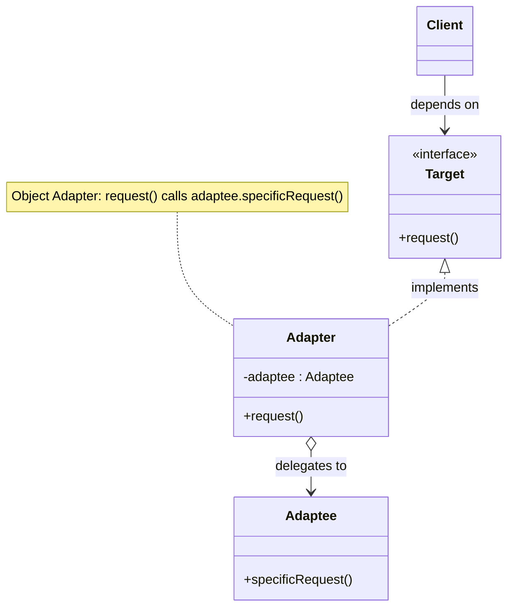
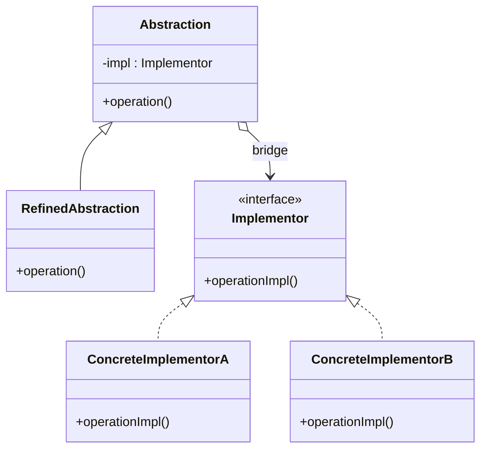
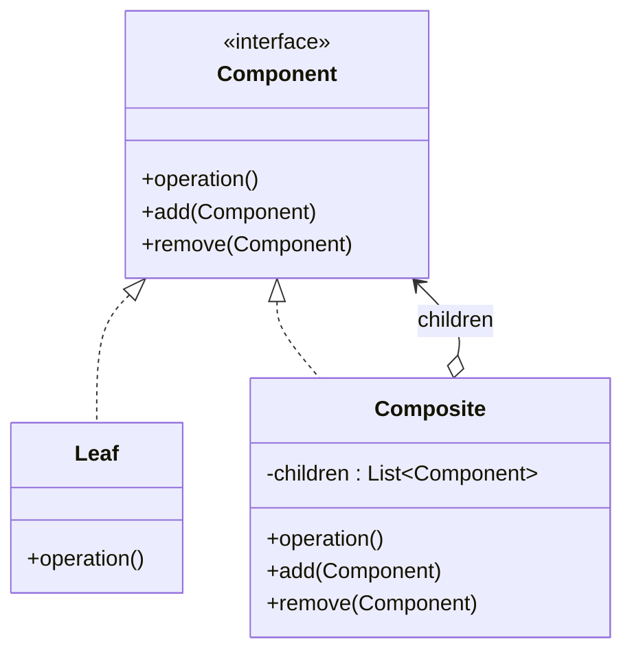
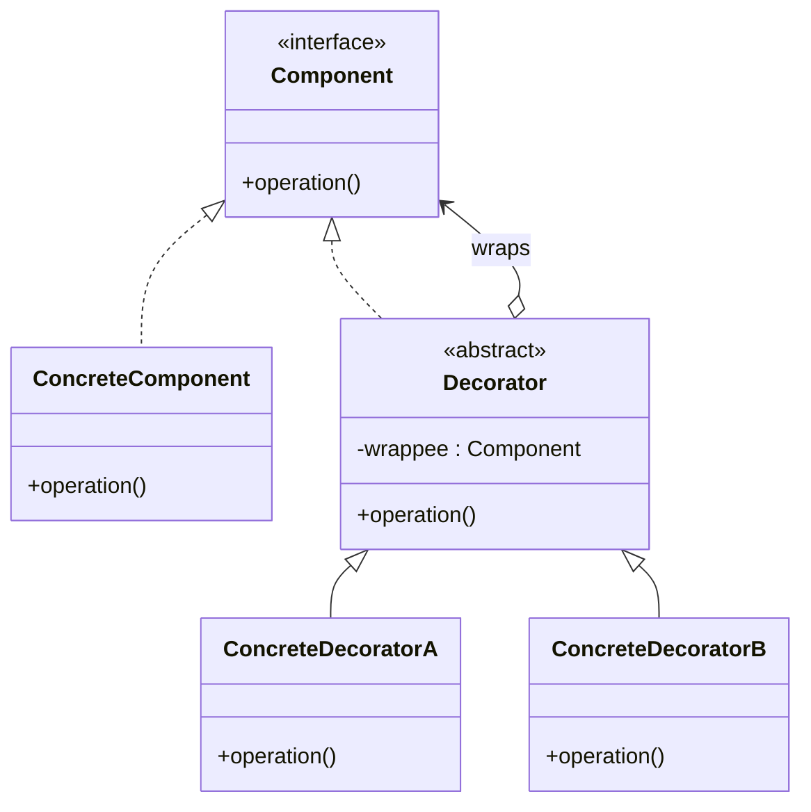
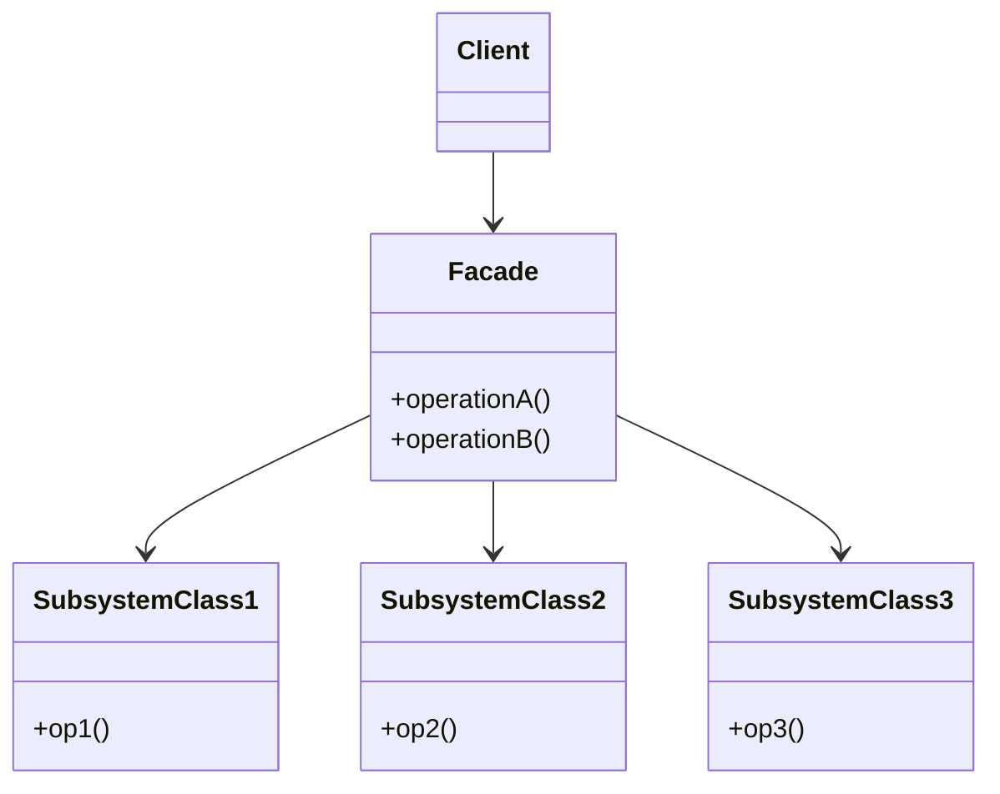
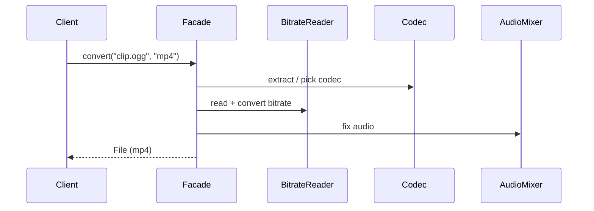
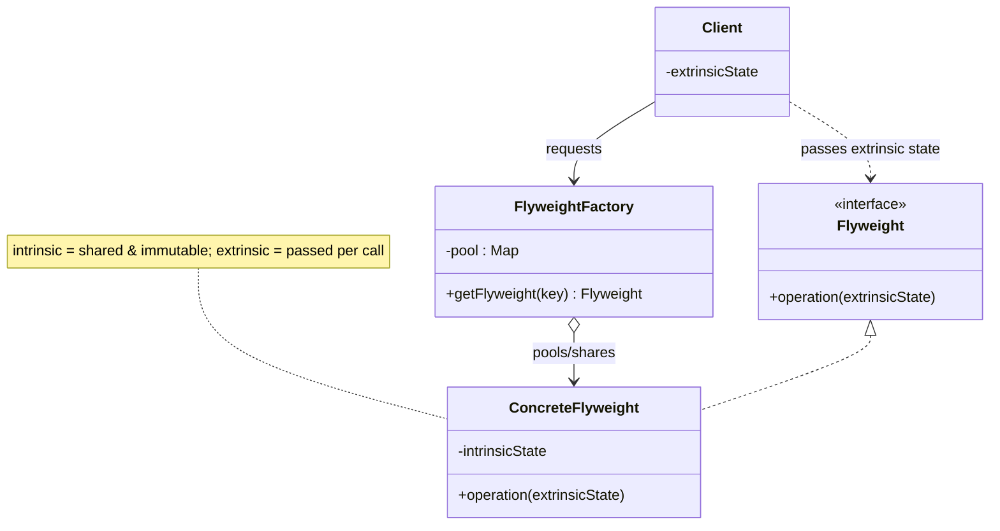
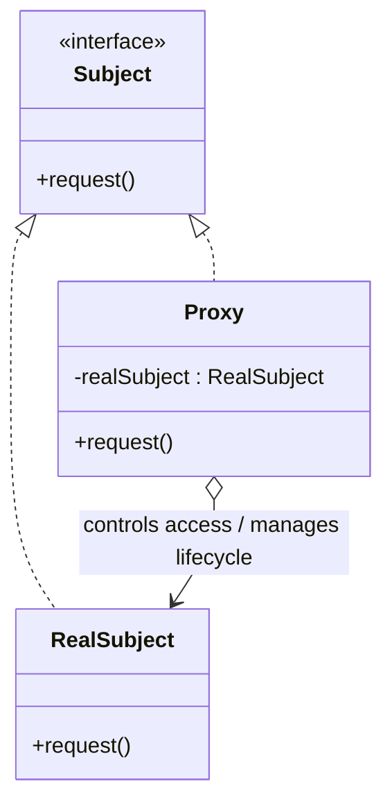
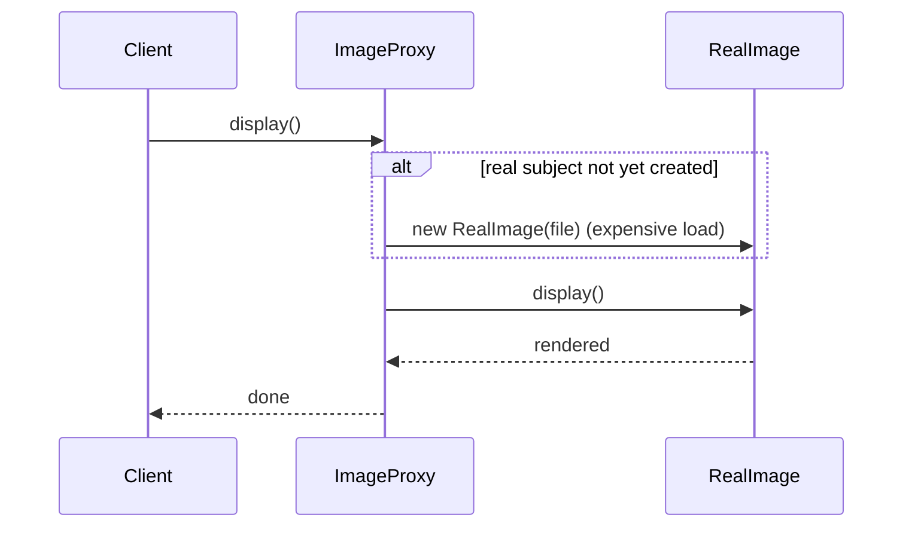

# Structural Design Patterns

Structural patterns are about **how classes and objects are composed to form larger
structures** while keeping those structures flexible, reusable, and efficient. Where
*creational* patterns deal with **how objects are made** and *behavioral* patterns deal
with **how objects communicate**, structural patterns deal with **how objects are wired
together**.

Two mechanisms recur throughout the family, and naming them is a fast way to score in an
interview:

- **Class-based** structural patterns use **inheritance** to compose interfaces or
  implementations. They are resolved **at compile time**, are less flexible, and (in
  single-inheritance languages) are limited to composing exactly one class.
- **Object-based** structural patterns use **composition/delegation** — one object holds a
  reference to another and forwards work to it. They are resolved **at runtime**, can be
  reconfigured dynamically, and are the more common and more flexible form. This is the
  "favor composition over inheritance" principle from the Gang of Four (GoF) in action.

The seven GoF structural patterns are **Adapter, Bridge, Composite, Decorator, Facade,
Flyweight, and Proxy**. A recurring interview trap is that several of them — Adapter,
Decorator, Proxy, Facade — share almost identical UML but differ entirely in **intent**;
this document leads every pattern with the *problem it solves* and closes with an explicit
"vs. similar pattern" note, and there is a dedicated **Wrapper family disambiguation**
section because that comparison is probed directly.

> [!INTERVIEW]
> The single most important sentence you can say about any structural pattern is *what
> problem it removes*. Interviewers rarely want the UML recited; they want to hear "you
> reach for X when you feel pain Y." Every section below starts with that line.

---

## Adapter

**Problem it solves:** You have an existing class (often third-party or legacy) whose
interface does **not** match the interface your client code expects, and you **cannot (or
should not) modify** that class. Adapter removes the pain of "these two things should work
together but their method signatures don't line up" — without rewriting either side.

**Intent / how it works.** Convert the interface of an existing class (the **Adaptee**)
into another interface (the **Target**) that clients expect. The **Adapter** implements the
Target interface and, on each call, translates and delegates to the Adaptee. The client
talks only to the Target, blissfully unaware of the mismatch behind it. Adapter is also
called **Wrapper** (a name it shares, confusingly, with Decorator).

Adapter comes in **two forms**:

- **Object Adapter (composition — preferred).** The adapter *holds a reference* to an
  adaptee instance and delegates. Because it uses composition, one adapter class can adapt
  the adaptee **and all its subclasses**, and you can swap the adaptee at runtime. This is
  the form to reach for in single-inheritance languages (Java, C#).
- **Class Adapter (inheritance).** The adapter *inherits* from both the Target (interface)
  and the Adaptee (concrete class) — requiring multiple inheritance or an
  interface-plus-single-class combination. It can **override** adaptee behavior and needs no
  extra indirection object, but it can adapt **only that one concrete class** (not
  subclasses) and couples you tightly to it.

**Concrete example.** Your reporting code expects a `JsonSource` with `String toJson()`.
You must integrate a vendor library that only exposes `LegacyXmlDoc` with `String getXml()`.
You cannot edit the vendor class, so you write an adapter:

```java
interface JsonSource { String toJson(); }          // Target the client expects

class XmlToJsonAdapter implements JsonSource {       // Object Adapter
    private final LegacyXmlDoc adaptee;              // composition
    XmlToJsonAdapter(LegacyXmlDoc adaptee) { this.adaptee = adaptee; }
    public String toJson() {
        return XmlJsonConverter.convert(adaptee.getXml()); // translate + delegate
    }
}
```



**Trade-offs.**
- *Pros:* Reuse an existing/third-party/legacy class you can't touch; decouple the client
  from the concrete adaptee (Single Responsibility — conversion lives in one place);
  introduce adapters incrementally without breaking callers.
- *Cons:* Adds an extra layer of indirection; a codebase littered with adapters is a smell
  that your abstractions don't line up and should be refactored.
- *When to use:* Integrating incompatible APIs, wrapping legacy code behind a modern
  interface, making a class conform to an interface it wasn't designed for.
- *When to avoid:* When you control both sides and could just fix the interface; when you
  actually need to *add behavior* (that's Decorator) or *simplify a whole subsystem* (that's
  Facade).
- *Common misuse:* Using an adapter as a dumping ground for extra logic — it should only
  translate.

**vs. similar patterns.** **Adapter vs. Bridge** is the top confusion: Adapter makes
*existing, unrelated* interfaces work together **after the fact** (retrofit), whereas Bridge
is designed **up front** so an abstraction and its implementation can vary independently.
**Adapter vs. Facade:** Adapter converts an existing interface into a *specific required*
one; Facade defines a *new, simpler* interface over many classes. **Adapter vs. Decorator:**
Adapter **changes** the interface and does not add behavior; Decorator **keeps** the
interface and adds behavior.

**Real-world usage.** `java.util.Arrays.asList()` (array → `List`), `InputStreamReader`
(byte stream → char stream), Spring MVC `HandlerAdapter`, and countless `.NET System.IO`
adapters.

---

## Bridge

**Problem it solves:** You have **two independent dimensions** of variation (e.g., *shape*
× *rendering API*, or *message type* × *delivery channel*), and modeling them with
inheritance produces a **combinatorial class explosion** (M × N subclasses). Bridge removes
the pain of "every time I add one implementation I must add a subclass for every abstraction,
and vice versa."

**Intent / how it works.** Decouple an **abstraction** from its **implementation** so the
two can vary independently. Instead of one tangled inheritance tree, you split into **two
separate hierarchies** connected by composition: the `Abstraction` holds a reference to an
`Implementor` interface and delegates the low-level work to it. Now M abstractions and N
implementations require only **M + N classes** (not M × N), and either side can be extended
without touching the other. The key move is turning "is-a" into "has-a."

**Concrete example.** You have `RemoteControl` abstractions (basic, advanced) that must work
over several `Device` implementations (TV, radio, streaming box). Rather than
`BasicTvRemote`, `AdvancedTvRemote`, `BasicRadioRemote`, … (M × N), the remote *has* a
device:

```java
interface Device { void setVolume(int v); void power(); }   // Implementor

abstract class RemoteControl {                               // Abstraction
    protected final Device device;                           // the bridge
    RemoteControl(Device device) { this.device = device; }
    void togglePower() { device.power(); }
}
class AdvancedRemote extends RemoteControl {                 // Refined Abstraction
    AdvancedRemote(Device d) { super(d); }
    void mute() { device.setVolume(0); }
}
// new device? implement Device. new remote? extend RemoteControl. Never both.
```



**Trade-offs.**
- *Pros:* Kills the Cartesian-product class explosion (M + N instead of M × N); abstraction
  and implementation evolve and deploy independently; you can swap the implementation at
  runtime; hides implementation details from client code (open/closed).
- *Cons:* Upfront indirection and conceptual complexity; you must recognize the two
  dimensions **early** — retrofitting Bridge later is real work; over-applied on a
  single-dimension problem it's just noise.
- *When to use:* Two (or more) orthogonal dimensions that both need to grow; wanting to
  switch implementations at runtime; a class hierarchy that is starting to explode.
- *When to avoid:* Only one axis of change, or the axes are stable and small.
- *Common misuse:* Confusing it with Adapter and applying it as an afterthought — Bridge is
  a *planned* architecture, not a patch.

**vs. similar patterns.** **Bridge vs. Adapter:** Bridge is **designed in up front** to let
two hierarchies vary; Adapter is **retrofitted** to reconcile things that already exist.
**Bridge vs. Strategy:** they have nearly identical UML, but Bridge is *structural* (it spans
two dimensions and is about the overall shape of the system), while Strategy is *behavioral*
(it swaps a single interchangeable algorithm). Same picture, different intent.

**Real-world usage.** JDBC (`java.sql` API is the abstraction; each vendor `Driver` is the
implementor behind `DriverManager`); device-/OS-specific graphics or rendering backends;
SLF4J's facade-to-binding split; cross-platform GUI toolkits.

---

## Composite

**Problem it solves:** You must represent a **part-whole hierarchy** (a tree — files and
folders, GUI panels and widgets, org charts) and you want client code to treat a **single
object and a group of objects uniformly**, without littering it with `if (isLeaf)…else…`
type checks. Composite removes the pain of "my client keeps branching on whether it's dealing
with one thing or a collection of things."

**Intent / how it works.** Compose objects into **tree structures**, then define a single
`Component` interface implemented by both **`Leaf`** (an individual object with no children)
and **`Composite`** (a container that holds child Components and forwards operations to them,
often aggregating results). Because a Composite's children are themselves Components, the
structure is **recursive** and arbitrarily deep, and the client calls the same
`operation()` on the root regardless of what's underneath.

**Concrete example.** A filesystem: a `File` (leaf) reports its own size; a `Directory`
(composite) reports the **sum** of its children's sizes by recursing.

```java
interface FsNode { int sizeBytes(); }                 // Component

class FileNode implements FsNode {                     // Leaf
    private final int bytes;
    FileNode(int bytes) { this.bytes = bytes; }
    public int sizeBytes() { return bytes; }
}
class DirNode implements FsNode {                       // Composite
    private final List<FsNode> children = new ArrayList<>();
    void add(FsNode n) { children.add(n); }
    public int sizeBytes() {
        return children.stream().mapToInt(FsNode::sizeBytes).sum(); // recurse
    }
}
```



**Trade-offs.**
- *Pros:* Uniform client code (no leaf/branch branching); recursion becomes trivial; adding
  new component types is open/closed-friendly; models naturally hierarchical domains cleanly.
- *Cons:* The **transparency vs. safety** tension: put `add/remove/getChild` on the shared
  `Component` interface (GoF's preferred *transparency*) and leaves inherit meaningless
  child-management methods that must throw or no-op (less type-safe); put them only on
  `Composite` (*safety*) and the client loses uniform treatment and must downcast. You can't
  fully have both.
- *When to use:* Genuine tree/part-whole structures where clients should ignore the
  leaf/branch distinction.
- *When to avoid:* Flat collections, or when leaves and containers really do need very
  different interfaces — forcing a common one hurts more than it helps.
- *Common misuse:* Using it for data that isn't actually a tree; overly restricting the child
  type (a Composite should generally accept any Component).

**vs. similar patterns.** **Composite vs. Decorator:** both rely on recursive composition and
share a superclass with their children, but a **Composite aggregates many children** and sums
/ combines their results, while a **Decorator wraps exactly one component** to add behavior.
A Decorator can be seen as a degenerate Composite with a single child whose job is
enrichment, not aggregation.

**Real-world usage.** Java AWT/Swing `Component`/`Container`, the browser DOM tree,
filesystem directories, React/UI component trees, abstract syntax trees.

---

## Decorator

**Problem it solves:** You need to **add responsibilities to individual objects
dynamically at runtime**, in arbitrary combinations, and doing it with subclassing would
cause a **subclass explosion** (`BufferedCompressedEncryptedStream`, …) — one class per
combination. Decorator removes the pain of "I keep subclassing to bolt on optional features
and the combinations are exploding."

**Intent / how it works.** Attach additional behavior to an object by **wrapping** it in a
decorator object that **implements the same interface** and holds a reference to the wrapped
component. The decorator forwards calls to the inner object and adds behavior **before or
after** delegating. Because decorators share the component interface, they can be **stacked**:
each wraps another decorator or the concrete component, building behavior in layers at
runtime. Decorator is a flexible alternative to subclassing for extending behavior
(open/closed). It is also called **Wrapper** (shared with Adapter).

**Concrete example.** A data stream you can layer buffering, then compression, then
encryption onto — in any order, chosen at runtime:

```java
interface DataSource { void write(byte[] data); }               // Component

class FileDataSource implements DataSource { /* concrete */      // ConcreteComponent
    public void write(byte[] data) { /* to disk */ } }

abstract class SourceDecorator implements DataSource {           // base Decorator
    protected final DataSource wrappee;
    SourceDecorator(DataSource w) { this.wrappee = w; }
}
class CompressionDecorator extends SourceDecorator {
    CompressionDecorator(DataSource w) { super(w); }
    public void write(byte[] data) { wrappee.write(compress(data)); } // add + delegate
}
// usage: new EncryptionDecorator(new CompressionDecorator(new FileDataSource()))
```



**Trade-offs.**
- *Pros:* Add or combine responsibilities at runtime without touching the original class or
  exploding the class count; mix and match features in any order; adheres to Single
  Responsibility (each decorator does one thing) and open/closed.
- *Cons:* Produces **many small look-alike objects**, so debugging a deep wrapper stack is
  hard; behavior can be **order-sensitive** (compress-then-encrypt ≠ encrypt-then-compress);
  removing a specific decorator from the middle of a stack is awkward; **object identity
  breaks** — the wrapper is not `==`/`equals` the wrapped object, so identity checks and some
  reflection fail.
- *When to use:* Optional, combinable features layered onto objects; when subclassing is
  impractical or would explode.
- *When to avoid:* When behavior depends on the whole object's type (decorators are
  transparent, so they can't easily change type-based dispatch), or when a simple parameter
  /strategy would do.
- *Common misuse:* Using it to *change* the interface (that's Adapter) or to *control access*
  (that's Proxy).

**vs. similar patterns.** **Decorator vs. Proxy** (the classic exam question): identical UML,
but a **Decorator adds behavior and is assembled by the client**, whereas a **Proxy controls
access to a subject whose lifecycle it typically manages itself**, keeping behavior
unchanged. **Decorator vs. Composite:** Decorator has one child and enriches; Composite has
many and aggregates. **Decorator vs. Adapter:** Decorator keeps the interface (and may extend
it); Adapter changes it.

**Real-world usage.** The canonical example is **`java.io`** — `new BufferedInputStream(new
GZIPInputStream(new FileInputStream(f)))` stacks decorators over a stream;
`Collections.synchronizedList()` / `unmodifiableList()`; `HttpServletRequestWrapper`.

---

## Facade

**Problem it solves:** A client needs a few common things done, but the subsystem that does
them exposes **dozens of classes with intricate interdependencies and initialization order**.
Facade removes the pain of "to do one simple task I have to understand and correctly
orchestrate a pile of low-level classes."

**Intent / how it works.** Provide a **single, simplified, higher-level interface** to a
complex subsystem. The `Facade` knows which subsystem classes to call and in what order, and
exposes a small number of convenient methods that cover the common use cases. Clients depend
on the facade instead of the subsystem, which **reduces coupling** and shrinks the surface
they must learn. Crucially, the facade does **not hide** the subsystem — advanced clients can
still bypass it and use subsystem classes directly when they need power.

**Concrete example.** Converting a video is genuinely complex (codecs, bitrate readers, audio
mixers, muxers). A facade wraps all of it behind one call:

```java
class VideoConverter {                                  // Facade
    public File convert(String filename, String format) {
        VideoFile file = new VideoFile(filename);
        Codec source = CodecFactory.extract(file);
        Codec dest = format.equals("mp4") ? new Mpeg4Codec() : new OggCodec();
        Buffer buf = BitrateReader.read(filename, source);
        buf = BitrateReader.convert(buf, dest);
        return new AudioMixer().fix(buf);               // orchestrates the subsystem
    }
}
// client: new VideoConverter().convert("clip.ogg", "mp4");
```



A sequence view shows one facade call fanning out across the subsystem:



**Trade-offs.**
- *Pros:* Dramatically simplifies client code; decouples clients from subsystem internals so
  the subsystem can be refactored freely; provides a natural layering/entry point; reduces
  compile-time dependencies.
- *Cons:* A facade can grow into a **bloated "god object"** coupled to everything; it may
  become a bottleneck for changes; it doesn't (and shouldn't) forcibly prevent access to
  subsystem classes, so discipline is required.
- *When to use:* Providing a simple entry point to a complex library/framework; layering a
  system; wrapping a tangled legacy subsystem.
- *When to avoid:* When the subsystem is already simple, or when clients genuinely need
  fine-grained control everywhere.
- *Common misuse:* Letting the facade absorb business logic instead of merely delegating; one
  mega-facade for the whole app.

**vs. similar patterns.** **Facade vs. Adapter:** a Facade defines a **new, simpler**
interface over **many** classes (the interface isn't dictated by any client), while an
Adapter makes **one** existing interface match a **specific required** one. **Facade vs.
Proxy:** a Proxy keeps the **same** interface as its subject (it stands in for one object); a
Facade invents a **new** interface over many. **Facade vs. Mediator:** a Facade only
*forwards* to a subsystem that doesn't know about it; a Mediator *centralizes and coordinates*
peers that talk *to* it.

**Real-world usage.** Spring `JdbcTemplate` (over the raw JDBC subsystem), SLF4J,
`javax.faces.context.FacesContext`, service-layer classes over multiple DAOs, most SDK
"client" objects.

---

## Flyweight

**Problem it solves:** You must create a **huge number of similar objects** (millions of
characters, particles, map tiles, tree instances) and doing so **blows the RAM budget**
because each object redundantly stores the same data. Flyweight removes the pain of "I have
so many near-identical objects that memory is the bottleneck."

**Intent / how it works.** Minimize memory by **sharing** the common parts of state across
many objects. Split each object's state into:

- **Intrinsic state** — context-independent, shareable, **stored inside the flyweight** and
  treated as **immutable** (e.g., a glyph's shape and font; a tree's texture and mesh).
- **Extrinsic state** — context-dependent, **not** stored in the flyweight but **passed in by
  the client** on each call (e.g., the glyph's position on the page; the tree's x/y
  coordinate).

A **Flyweight Factory** maintains a pool of shared flyweights keyed by intrinsic state and
returns an existing instance instead of creating a duplicate. The client keeps the (small)
extrinsic state and supplies it as method arguments.

**Concrete example.** A forest with a million trees. `TreeType` (name, color, texture) is
intrinsic and shared; position is extrinsic:

```java
class TreeType {                                        // Flyweight (immutable, shared)
    final String name; final String texture;
    TreeType(String name, String texture) { this.name = name; this.texture = texture; }
    void draw(int x, int y) { /* render texture at x,y */ } // extrinsic x,y passed in
}
class TreeFactory {                                     // Flyweight Factory
    private static final Map<String, TreeType> pool = new HashMap<>();
    static TreeType get(String name, String texture) {
        return pool.computeIfAbsent(name + texture, k -> new TreeType(name, texture));
    }
}
// 1,000,000 Tree records hold only (x, y, TreeType ref) — a few shared TreeType objects.
```



**Trade-offs.**
- *Pros:* Massive RAM savings when object counts are enormous and much state is shared;
  centralizes the shared state.
- *Cons:* Trades **memory for CPU/complexity** — extrinsic state must be recomputed or passed
  on every call; flyweights **must be immutable** (a mutation would corrupt every shared
  user); the code becomes harder to read; pointless when object counts are modest.
- *When to use:* Very large numbers of objects, most of whose state is duplicable/shareable,
  and memory is the constraint.
- *When to avoid:* Small object counts, or when little state is actually shareable, or when
  the objects must be mutable per instance.
- *Common misuse:* Applying it prematurely as an "optimization" before profiling; storing
  extrinsic (mutable/contextual) state inside the flyweight.

**vs. similar patterns.** **Flyweight vs. Object Pool** (a *creational* concern —
cross-reference `dp-creational`): a Flyweight shares **immutable** state that many clients use
**concurrently**; an Object Pool hands out **mutable** objects **one client at a time** and
takes them back. **Flyweight vs. Singleton:** a Singleton is **exactly one** instance;
Flyweight yields **many** shared instances, each keyed by its intrinsic state.

**Real-world usage.** `Integer.valueOf()` / boxed-value caches (−128..127), `Boolean` and
`Character` caches, the `String` intern pool, glyph/font rendering, game particle and tile
systems.

---

## Proxy

**Problem it solves:** You need to **control access to an object** — defer its expensive
creation, guard it with permissions, reach it across a network, cache its results, or add
bookkeeping — **without changing the object or the client code**. Proxy removes the pain of "I
need to do something *around* accessing this object, but callers should keep using it exactly
as before."

**Intent / how it works.** Provide a **surrogate or placeholder** for another object (the
`RealSubject`) that **implements the same interface** (`Subject`) and controls access to it.
Because the proxy is interface-compatible, clients can't tell they're talking to a stand-in.
The proxy decides *when* and *whether* to forward to the real subject and can do work before
/after — and typically **manages the real subject's lifecycle** itself (creating it lazily,
holding it remotely, etc.).

**Variants (know all of them):**
- **Virtual proxy** — delays the creation of an expensive real subject until first use
  (lazy initialization).
- **Remote proxy** — a local stand-in for an object living in **another address space**
  (an RPC/RMI stub); marshals calls over the network.
- **Protection proxy** — enforces **access control / authorization** before forwarding.
- **Smart reference (smart proxy)** — adds bookkeeping: reference counting, lock management,
  loading persistent objects on access, lifecycle management.
- **Caching proxy** — memoizes results of expensive calls and serves cached responses.
- **Logging / monitoring proxy** — records requests, timing, metrics around each call.

**Concrete example.** A virtual proxy that avoids loading a heavy image until it's actually
drawn:

```java
interface Image { void display(); }                    // Subject

class RealImage implements Image {                      // RealSubject (expensive)
    RealImage(String file) { /* load from disk — costly */ }
    public void display() { /* paint */ }
}
class ImageProxy implements Image {                     // Virtual Proxy
    private final String file; private RealImage real;
    ImageProxy(String file) { this.file = file; }
    public void display() {
        if (real == null) real = new RealImage(file);   // lazy-load on first use
        real.display();
    }
}
```



The lazy-init (virtual proxy) call flow:



**Trade-offs.**
- *Pros:* Adds access control, lazy loading, remoting, caching, or monitoring **transparently**
  (open/closed — the client is unchanged); can improve performance (defer/cache) or security
  (guard).
- *Cons:* Extra indirection; a remote proxy can **hide real latency and failure modes** (a
  call that looks local is a network round-trip); response times become less predictable;
  more classes to maintain; lazy init can move errors to surprising places.
- *When to use:* Expensive-to-create objects (virtual), cross-process/network access (remote),
  authorization gates (protection), transparent caching or metrics.
- *When to avoid:* When you actually want to *add domain behavior* the client composes (that's
  Decorator), or *simplify a subsystem* (Facade), or *change the interface* (Adapter).
- *Common misuse:* Hiding heavy network calls behind an innocent-looking local interface with
  no timeout/failure story; using a proxy where a decorator's semantics are what you meant.

**vs. similar patterns.** **Proxy vs. Decorator** (the single most-probed comparison in this
family): same structure, but a **Proxy controls access and usually creates/manages its own
subject**, keeping behavior identical; a **Decorator adds behavior and is given its wrappee by
the client**. **Proxy vs. Adapter:** a Proxy keeps the **same** interface; an Adapter
**changes** it. **Proxy vs. Facade:** a Proxy has the same interface as one subject; a Facade
invents a new, simpler interface over many.

**Real-world usage.** Java Dynamic Proxy (`java.lang.reflect.Proxy`), Spring AOP proxies
behind `@Transactional` / `@Cacheable`, Hibernate lazy-loading entity proxies, RMI/gRPC stubs
(remote proxies), CDN edge caches (caching proxy). At the service boundary, the cloud
**Ambassador** and **Anti-Corruption Layer** patterns are Proxy/Adapter/Facade applied
between microservices — see `dp-distributed-cloud` and the `microservices-*` topics rather
than treating them here.

---

## Wrapper family disambiguation

This is a mandatory, directly-probed comparison. **Adapter, Bridge, Composite, Decorator,
Facade, and Proxy all "wrap" or "compose" another object**, and four of them (Adapter,
Decorator, Proxy, Facade) can look nearly identical on a class diagram. The only reliable way
to tell them apart is by **intent** — *what is the wrapper for?* — and by **whether the
interface changes** and **who owns the wrapped object's lifecycle**.

| Pattern | Interface vs. subject | Core intent (the "why") | Wraps how many | Lifecycle owner |
|---|---|---|---|---|
| **Adapter** | **Changed** to a required one | Make incompatible interfaces work together (retrofit) | 1 (object form) | Client (usually) |
| **Bridge** | Two separate hierarchies | Let abstraction & implementation vary **independently** (planned) | 1 implementor | Client wires it |
| **Decorator** | **Same** (may extend) | **Add behavior** dynamically, stackable | 1 (recursively) | Client composes |
| **Proxy** | **Same** | **Control access** (lazy/remote/guard/cache) | 1 | **Proxy itself** (often) |
| **Facade** | **New, simpler** interface | **Simplify** a whole subsystem | Many | N/A (just forwards) |
| **Composite** | **Same** for leaf & container | Uniform **part-whole tree** | Many (children) | Composite owns children |

Mnemonics that survive interview pressure:
- **Adapter** = *different* interface (translate).
- **Facade** = *simpler* interface (over many).
- **Decorator** = *same* interface, *more* behavior.
- **Proxy** = *same* interface, *same* behavior, *controlled* access.
- **Bridge** = *split* into two dimensions, up front.
- **Composite** = *tree* of same-typed parts.

The classic three follow-ups:
1. **Decorator vs. Proxy** — both keep the interface. Decorator *adds behavior* and the client
   supplies the wrappee; Proxy *controls access* and typically owns/creates the subject.
2. **Adapter vs. Bridge** — Adapter reconciles what already exists (after the fact); Bridge is
   designed in from the start so two axes can vary.
3. **Adapter vs. Facade** — Adapter converts one interface to a *specific required* one;
   Facade invents a *new simpler* one over many classes.

**Class-based vs. object-based.** Structural patterns split by mechanism. *Class-based*
patterns compose via **inheritance**, fixed at **compile time**. *Object-based* patterns
compose via **delegation**, reconfigurable at **runtime** — the more flexible, more common
form. **Adapter is the only GoF structural pattern with both a class form (inheritance) and an
object form (composition);** the rest (Bridge, Composite, Decorator, Facade, Flyweight, Proxy)
are fundamentally object-based (they hold references and delegate).

---

## Beyond the classic seven

Senior candidates are expected to know that the family doesn't stop at the GoF seven. These
are **structural** patterns and enterprise cousins — know the one-line intent and a single
trade-off each; do not deep-dive them.

- **Marker Interface** — an **empty interface used purely as metadata / a type tag** (e.g.
  `java.io.Serializable`, `Cloneable`, `RandomAccess`). *Trade-off:* it's checkable with
  `instanceof` and enforced by the type system, but it can't carry parameters and can't be
  retrofitted onto types you don't own — modern code often prefers **annotations** for the
  same "tagging" job (at the cost of losing compile-time `instanceof` checks).
- **Module** — group related classes/functions behind a **single boundary** with an explicit
  public surface (Java 9 modules, packages/namespaces). *Trade-off:* strong encapsulation and
  clear dependencies, but added ceremony and migration cost.
- **Private Class Data** — move fields into a **separate data-holder object** exposed
  read-only, so the owning class can't mutate them after construction. *Trade-off:* enforces
  immutability/encapsulation, at the cost of an extra class and indirection.
- **Extension Object / Role Object** — **add new interfaces or roles to an object at runtime**
  without changing its class (query an object for a role and use it if present). *Trade-off:*
  runtime extensibility and separation of concerns, but weaker static typing and more moving
  parts.

**Fowler PoEAA structural cousins (cross-reference only — enterprise-architecture territory):**
- **Gateway** — an object that **wraps access to an external system or resource** (a queue,
  a service, a DB API); essentially a specialized Adapter+Facade at a boundary.
- **Registry** — a **well-known object** other objects use to **find common services** without
  passing references everywhere (a controlled alternative to global variables).
- **Plugin** — link a concrete implementation chosen at **configuration/runtime** rather than
  compile time.
- **Separated Interface** — define an **interface in a different package** from its
  implementation to decouple client and provider.

> [!WARNING]
> Distributed/cloud structural patterns — **Sidecar, Ambassador, Anti-Corruption Layer,
> Gateway Aggregation/Offloading, Strangler Fig** — are intentionally **not** covered here.
> Ambassador and Anti-Corruption Layer are Proxy/Adapter/Facade applied at service
> boundaries; see the `dp-distributed-cloud` catalog and the existing `microservices-*` and
> `event-driven-cqrs-saga-cdc` deep-dive topics. **Object Pool** is a *creational* concern —
> see `dp-creational` (referenced only under Flyweight's "vs." note above).

---

## Common follow-up questions

- "What's the difference between Decorator and Proxy?" Same UML; Decorator *adds behavior*
  and the client composes it, Proxy *controls access* and usually creates/manages its own
  subject while keeping behavior identical.
- "Adapter or Bridge?" Adapter is a retrofit to reconcile existing incompatible
  interfaces; Bridge is designed up front so an abstraction and its implementation vary on two
  independent axes.
- "When would you use Facade vs. Adapter?" Facade invents a new *simpler* interface over
  *many* subsystem classes; Adapter converts *one* existing interface into a *specific
  required* one.
- "Give the canonical Decorator in the standard library." `java.io` streams —
  `BufferedInputStream`/`GZIPInputStream` wrapping a `FileInputStream`.
- "Explain intrinsic vs. extrinsic state." Flyweight: intrinsic = shared, immutable,
  stored inside the flyweight; extrinsic = context-specific, passed in by the client per call.
- "How do the two Adapter forms differ?" Object Adapter uses composition (can adapt
  subclasses, preferred); Class Adapter uses (multiple) inheritance (can override the adaptee
  but only adapts one class).
- "Why favor composition (object-based) over inheritance (class-based) for these patterns?"
  Runtime flexibility, avoids single-inheritance limits, and lets you reconfigure structure
  dynamically.
- "Transparency vs. safety in Composite?" Putting child-management on the shared interface
  gives uniform treatment (transparency) but forces meaningless methods on leaves; restricting
  them to Composite is type-safe but breaks uniformity.
- "Name a Proxy variant for each of: lazy loading, network, security, caching." Virtual,
  Remote, Protection, Caching.
- "Which structural pattern helps with a combinatorial class explosion?" Bridge (M+N vs.
  M×N); Decorator also fights combinatorial *subclassing* of optional features.
- "Is a marker interface a structural pattern, and what replaced it?" Yes (metadata via
  type); annotations often replace it, trading `instanceof` checks for richer metadata.

---

## References

- Gamma, Helm, Johnson, Vlissides (Gang of Four), *Design Patterns: Elements of Reusable
  Object-Oriented Software* (1994) — the structural patterns chapter (Adapter, Bridge,
  Composite, Decorator, Facade, Flyweight, Proxy), including the object-vs-class Adapter forms
  and the transparency/safety discussion for Composite.
- refactoring.guru — *Structural Design Patterns* catalog (intent, structure, pseudo-code,
  and pros/cons for each of the seven).
- Wikipedia — *Structural pattern* and the software design pattern catalog (Marker Interface,
  Private Class Data, Extension Object as structural entries).
- Martin Fowler, *Patterns of Enterprise Application Architecture* (PoEAA) and
  martinfowler.com — Gateway, Registry, Plugin, Separated Interface.
- POSA (*Pattern-Oriented Software Architecture*) — Wrapper Facade and proxy/broker variants.
- Microsoft Azure *Cloud Design Patterns* and AWS prescriptive-guidance catalogs, and
  microservices.io (Chris Richardson) — Ambassador, Anti-Corruption Layer, Sidecar (covered in
  `dp-distributed-cloud`, not here).
- Java Platform APIs as living examples: `java.io` (Decorator), `java.util.Arrays.asList` /
  `InputStreamReader` (Adapter), `java.lang.reflect.Proxy` (Proxy), `Integer.valueOf` /
  String pool (Flyweight), AWT/Swing `Container` (Composite), JDBC `Driver` (Bridge).
