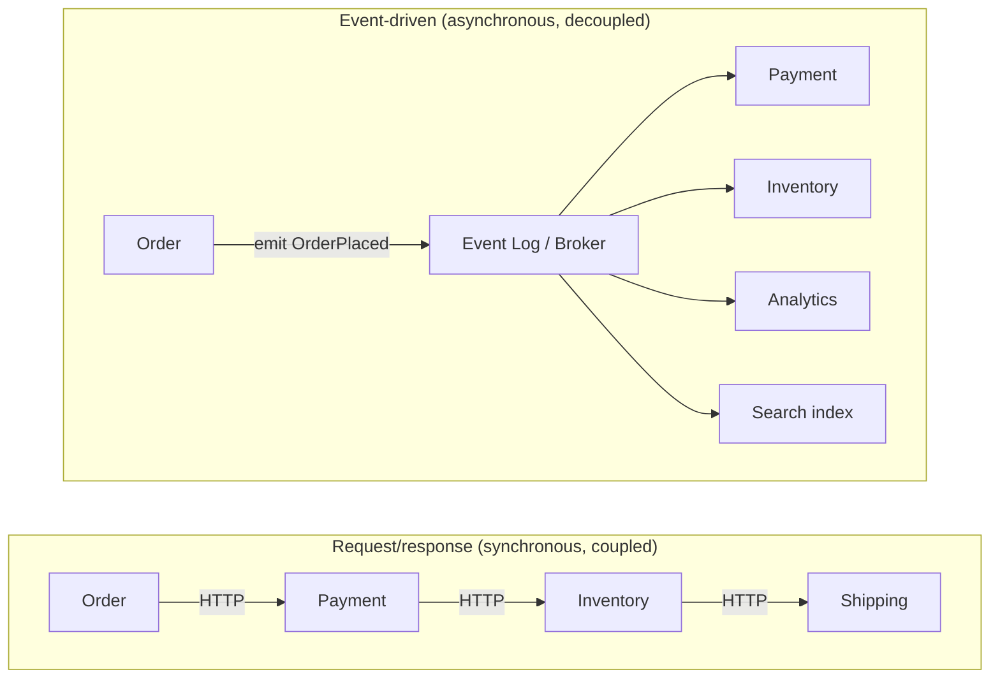
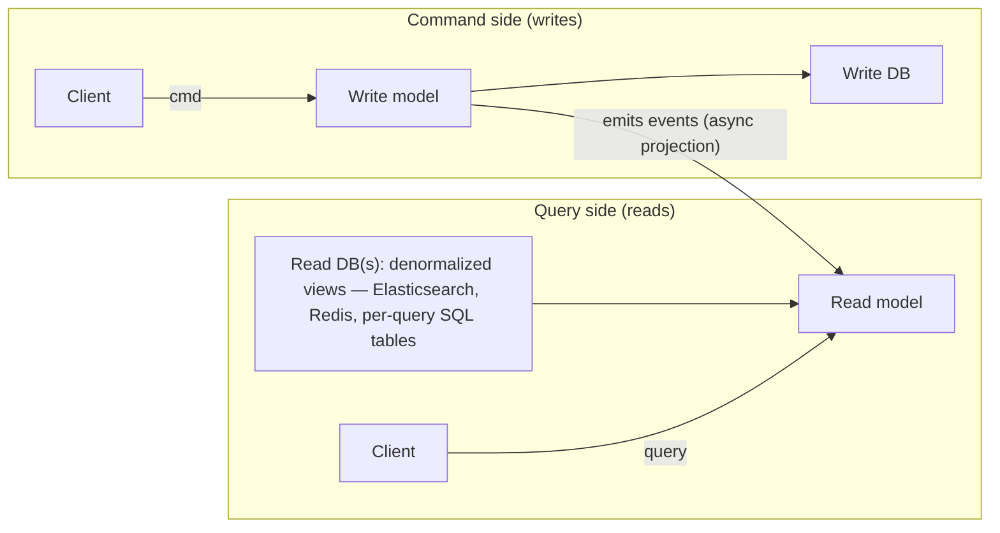
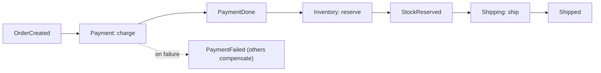
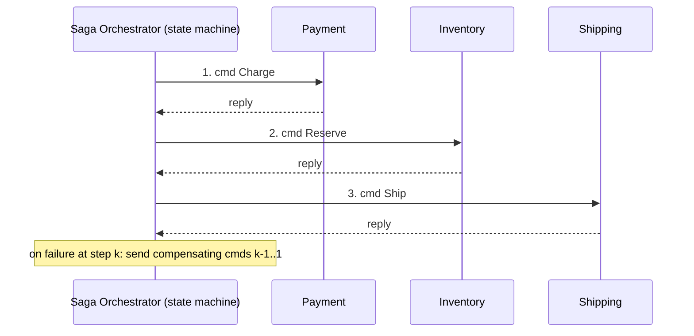
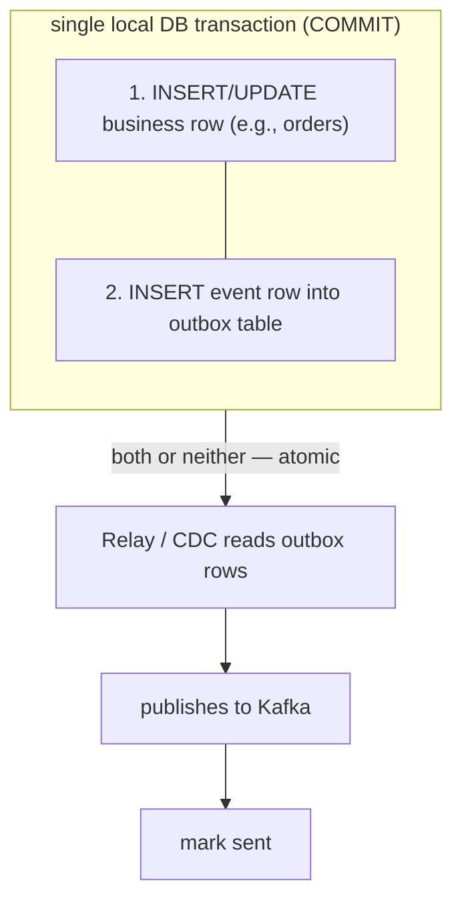
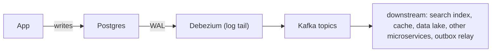

# Event-Driven Architecture: CQRS, Event Sourcing, Saga and CDC

Event-driven architecture (EDA) flips the default request/response mental model
on its head: instead of services *asking* each other for things synchronously,
they *emit facts about what happened* ("OrderPlaced", "PaymentCaptured") and
other services react. This buys you loose coupling, independent scaling, and a
natural audit trail — but it costs you strong consistency, easy debugging, and
transactional simplicity. In a system-design interview the winning move is never
to name-drop Kafka or "event sourcing"; it is to state precisely *what you gain,
what you give up, and when the alternative is better*. Almost every pattern here
(CQRS, event sourcing, saga, outbox, CDC) exists to solve a specific pain of the
naive design, and every one of them adds real complexity you must justify.

This document is organized so that every section ends in trade-offs, and there is
a dedicated section on when NOT to reach for these patterns.

---

## Event-driven versus request-response trade-offs

**Intuition.** In request/response (RPC, REST, gRPC), the caller knows the
callee, waits for a reply, and couples its own latency and availability to that
callee. In event-driven, a producer emits an event to a broker (Kafka, Kinesis,
Pulsar, SNS/SQS, EventBridge) and does not know or care who consumes it. Consumers
subscribe and react on their own schedule.

**Three axes of decoupling** an event bus gives you:
- **Temporal** — the consumer can be down when the event is produced; it catches
  up later.
- **Spatial** — the producer doesn't know the consumers' addresses or count.
- **Load** — the log/queue absorbs bursts; consumers drain at their own rate.



**What you gain**
- **Loose coupling & extensibility.** Add a new consumer (fraud detection, a
  data lake sink) without touching the producer. This is the biggest long-term
  win — the "open/closed principle" at the architecture level.
- **Resilience & independent scaling.** A slow or crashed consumer causes lag,
  not a cascading failure. Producers and consumers scale independently.
- **Buffering / load leveling.** Traffic spikes grow the log depth instead of
  toppling downstream services.
- **Auditability / replay.** A durable log lets you replay history to rebuild
  state or feed a new consumer from the beginning.

**What you give up**
- **Strong/read-your-writes consistency.** Consumers are eventually consistent.
  The UI may show stale data for tens of ms to seconds after a write.
- **Simple debugging & tracing.** A logical operation is now smeared across many
  async hops; you need distributed tracing (correlation IDs) and good
  observability to follow it. "Where did my order go?" becomes a real question.
- **Straightforward error handling.** No caller is waiting to receive a
  synchronous error; you need DLQs, retries, and reconciliation.
- **Operational surface.** You now run and monitor a broker, consumer lag,
  partitioning, and schema evolution.

**Latency ballparks.** A local in-process call is ~ns; a same-datacenter gRPC
call is ~0.5–2 ms; a hop through Kafka adds broker write + poll latency, commonly
single-digit to tens of ms end-to-end (produce ack ~1–5 ms, consumer poll cycle
adds more). So async is NOT "faster" per operation — it moves work off the
critical path, it doesn't make each hop cheaper.

**Trade-off / when to pick which.**
- Use **request/response** when the caller needs the result *now* to proceed
  (show a price, authenticate a login, read a bank balance), when you need strong
  consistency, or when the interaction is a simple 1:1 query. Synchronous is
  simpler; do not add a broker to fake request/response by polling a reply queue.
- Use **event-driven** when work can be done out-of-band (send email, update
  search index, recompute analytics), when multiple independent consumers care,
  when you must absorb bursts, or when you want to add consumers later without
  redeploying producers.
- Most real systems are **hybrid**: synchronous on the user's critical path,
  asynchronous for everything downstream of the committed fact.

| Dimension | Request/response | Event-driven |
|---|---|---|
| Coupling | Tight (caller knows callee) | Loose (producer unaware of consumers) |
| Consistency | Easy strong consistency | Eventual consistency |
| Failure blast radius | Cascades up the call chain | Isolated; shows as lag |
| Add a new consumer | Modify producer | Just subscribe |
| Debuggability | Straightforward stack trace | Needs tracing / correlation IDs |
| Latency per op | Lower | Higher (extra hop) but off critical path |
| Best for | Reads, "need answer now" | Fan-out, decoupling, buffering |

---

## Event notification versus event-carried state transfer

**Intuition.** Not all "events" are equal. Martin Fowler distinguishes several
styles, and the choice drives coupling and payload size.

- **Event notification** — a thin event ("OrderPlaced {orderId: 123}"). The
  consumer must call back to the producer to fetch details. Small payload, but
  reintroduces runtime coupling and query load on the producer.
- **Event-carried state transfer (ECST)** — the event carries all the data the
  consumer needs ("OrderPlaced {orderId, items, total, address}"). Consumers stay
  fully decoupled and can maintain their own local read copies, at the cost of
  larger events, data duplication, and staleness.
- **Event sourcing** — events are the source of truth (see below).

**Trade-off.** Notification keeps payloads small and events stable but couples
consumers to the producer's API and can create a "read storm" back on the
producer. ECST maximizes decoupling and read performance (each consumer has a
local copy) but duplicates data, bloats events, and forces you to reason about
stale local copies and schema evolution. Interview heuristic: prefer ECST for
decoupling and to avoid callback storms; keep notification thin only when
payloads are huge or privacy-sensitive.

---

## CQRS: separating read and write models

**Intuition.** CQRS (Command Query Responsibility Segregation) says: the model
you use to *change* state (commands) and the model you use to *read* state
(queries) do not have to be the same. Split them. In its lightest form this is
just separate code paths / separate DTOs. In its heavier form it's separate
*data stores*: a normalized write store optimized for transactional integrity,
and one or more denormalized read stores (materialized views) optimized for query
shapes, kept in sync asynchronously via events.



**How it works.** Commands validate business rules and mutate the write store,
then publish events. Projectors consume those events and update read models
tailored to specific queries (e.g., a search index, a "user dashboard" table, a
Redis cache). Reads hit the read models directly — no joins across services, no
contention with writes.

**Real-world usage.** High read/write asymmetry systems: e-commerce product pages,
social feeds, dashboards, analytics. Often paired with event sourcing but does
NOT require it. Read replicas are a degenerate, "CQRS-lite" version of the idea.

**What you gain**
- **Independent scaling & optimization.** Scale reads (often 10–1000x the write
  volume) separately; pick the perfect storage per query (Elasticsearch for
  search, Redis for hot keys, columnar for analytics).
- **Simpler, faster queries.** Read models are pre-joined/denormalized to match
  the query, avoiding expensive runtime joins.
- **Read/write isolation.** Heavy analytical reads don't lock or slow the
  transactional write path.

**What you give up**
- **Eventual consistency between write and read models.** After a command
  succeeds, the read model lags by the projection delay (ms to seconds). A user
  may not see their own write immediately ("I edited my profile but it still
  shows the old name").
- **Complexity.** Two models, projection code, more infrastructure, more failure
  modes (projection lag, projection bugs, rebuilds).
- **Data duplication.** The same data lives in multiple shapes.

**Trade-off / when to use.**
- Use CQRS when read and write workloads differ sharply in volume or shape, when
  a single model forces ugly compromises, or when you need multiple specialized
  read views. It shines when reads vastly outnumber writes.
- **Do NOT use it** for simple CRUD with symmetric, low-volume access — it is a
  classic over-engineering trap. Greg Young (who coined CQRS) warns it is a
  pattern for *specific bounded contexts*, not a top-level architecture. Adding
  it everywhere multiplies complexity for no benefit.
- **Handling read-your-writes:** if a user must see their own change immediately,
  either read from the write model for that one query, return the new state in the
  command response, or have the client optimistically apply the change locally.

---

## Event sourcing: the event log as source of truth

**Intuition.** Instead of storing current state and overwriting it on each update,
store the full, ordered, immutable sequence of *events* that led to that state.
Current state is a *derived* fold over the events. The bank ledger is the classic
analogy: you never overwrite your balance; you append debits and credits and the
balance is their sum.

```
Traditional (state-oriented):
  account row: { balance: 80 }   ← UPDATE overwrites; history lost

Event-sourced (event log is truth):
  [ Opened(+0), Deposited(+100), Withdrew(-20) ]  → fold → balance 80
   (append-only; full history retained; state is a projection)
```

**How it works.**
- **Append-only event store** per aggregate (e.g., all events for account-123),
  ordered by sequence number.
- **Rehydration:** to load an aggregate, replay its events from the beginning
  (or from a snapshot) to reconstruct current state in memory.
- **Snapshots:** periodically persist the folded state (e.g., every 100 events)
  so rehydration replays only events since the snapshot — bounding replay cost.
- **Projections/read models:** CQRS read models are built by consuming the event
  stream (event sourcing and CQRS are natural partners but independent).

**What you gain**
- **Complete audit log / time travel.** Every state change is a first-class,
  immutable fact. You can answer "what did this look like on March 3?" and satisfy
  regulatory audit for free. Huge in finance, healthcare, ledgers.
- **Rebuild any read model / new projections retroactively.** Because you have all
  history, you can spin up a brand-new read view (or fix a buggy one) by replaying
  from the start.
- **Debugging & temporal queries.** Reproduce a bug by replaying the exact event
  sequence.
- **Natural fit for event-driven** — the events you store are the events you
  publish.

**What you give up / pitfalls**
- **Query complexity.** You cannot `SELECT * WHERE ...` over current state
  directly; you *must* build read models (hence CQRS almost always accompanies
  it). Ad-hoc queries are painful.
- **Schema/event versioning is hard and permanent.** Events are immutable and
  live *forever*. When your event shape changes you must handle old versions
  forever via upcasting (transform old events to new shape on read), weak schema,
  or multiple versioned handlers. This is the #1 long-term pain.
- **Eventual consistency & read-your-writes** — same as CQRS.
- **Replay cost & snapshots.** Without snapshots, rehydrating a long-lived
  aggregate replays thousands of events. Snapshots add complexity and their own
  versioning problem.
- **GDPR / "right to be forgotten".** An immutable log fights hard-delete
  requirements; you need crypto-shredding (delete the key that decrypts a
  person's events) or event redaction — a real, thorny problem.
- **Storage growth.** The log only grows. Deposits + withdrawals + every state
  change forever. Manageable but must be planned (tiering to cheap storage).
- **Learning curve & tooling.** Most teams and ORMs assume state-oriented
  storage; event sourcing is a paradigm shift.

**Capacity note.** If an aggregate averages 500 bytes/event and receives 20
events/day, that's ~10 KB/day, ~3.6 MB/year per aggregate — cheap. But a hot
aggregate with millions of events must use snapshots or rehydration latency
explodes. Rule of thumb: snapshot when replay would exceed your latency budget
(often every N=100–1000 events).

**Trade-off / when to use.**
- Use event sourcing when audit/history is a *first-class requirement* (finance,
  ledgers, order lifecycle, compliance), when you need temporal queries, or when
  multiple evolving read models must be rebuilt from truth.
- **Do NOT use it** as a default. For most CRUD apps it is massive
  over-engineering: you inherit versioning pain, eventual consistency, and a steep
  learning curve for benefits you don't need. Apply it to *specific aggregates /
  bounded contexts*, not the whole system.
- Common middle ground: keep a normal state store, but *also* emit events for
  integration (via outbox/CDC) — you get event-driven integration without full
  event sourcing.

---

## Snapshots, replay, and event versioning

**Intuition.** Three operational realities make or break an event-sourced system.

- **Replay** rebuilds state or read models by re-reading events. Use it to
  bootstrap a new projection, recover from a corrupted read model, or fix a
  projection bug. Replaying a whole Kafka topic or event store can take minutes to
  hours at scale, so plan for it (idempotent projectors, parallelism, and the
  ability to run old + new projections side by side then cut over).
- **Snapshots** bound rehydration cost: store folded state every N events; on load,
  start from the latest snapshot and replay only the tail. Trade-off: snapshots
  are a *cache*, not truth — if you change the fold logic you may need to
  invalidate/rebuild snapshots, and snapshots have their own schema-version
  problem.
- **Event versioning** is unavoidable because events are immutable and eternal.
  Strategies:
  - **Upcasting** — on read, transform v1 events into the current shape via a chain
    of converters. Keeps handlers simple but you maintain converters forever.
  - **Weak/tolerant schema** — consumers ignore unknown fields and tolerate missing
    ones (e.g., Protobuf/Avro with defaults). Most robust for additive changes.
  - **Multiple versioned event types** — `OrderPlacedV1`, `OrderPlacedV2`;
    explicit but proliferates types.
  - **Never** mutate or delete a published event's meaning; that breaks replay.

**Trade-off.** Upcasting centralizes migration logic but grows unbounded;
tolerant readers push responsibility to every consumer but avoid rewrites; a
schema registry (Confluent, AWS Glue) with compatibility rules (backward /
forward / full) is the industrial answer to enforce safe evolution.

---

## Saga pattern: choreography versus orchestration

**Intuition.** In microservices you can't run a distributed ACID transaction
across service databases (2PC/XA is slow, blocking, and brittle at scale). A
**saga** replaces one big transaction with a *sequence of local transactions*,
each in one service, coordinated by events or commands. If a step fails, the saga
runs **compensating transactions** to semantically undo the prior steps. Sagas
give you atomicity-of-outcome without distributed locks — but only *eventual*
consistency and *no isolation* (intermediate states are visible).

There are two coordination styles:

**Choreography** — no central coordinator. Each service listens for events and
emits its own. The flow emerges from the chain of reactions.



**Orchestration** — a central saga orchestrator (a state machine) tells each
service what to do via commands and awaits replies, driving compensation on
failure.



**Choreography — trade-offs**
- Gains: no single point of failure, maximal decoupling, simple for short (2–4
  step) flows, easy to add a reactive consumer.
- Costs: the workflow is *implicit* — no one place shows the whole flow; hard to
  understand, debug, and reason about failure/compensation; risk of cyclic event
  dependencies; hard to know if a saga is "done" or stuck. Gets ugly fast as
  steps grow.

**Orchestration — trade-offs**
- Gains: the workflow is *explicit and centralized* — easy to visualize, monitor,
  test, and evolve; clear place to handle timeouts and compensation; the
  orchestrator knows saga status.
- Costs: the orchestrator is extra infrastructure and can become a coupling
  hotspot / god-object if it accretes business logic; a bug there affects all
  flows. Mitigated by keeping orchestration logic thin and using tooling
  (Temporal, AWS Step Functions, Camunda, Netflix Conductor).

**Trade-off / when to use which.**
- Use **choreography** for short, simple, stable flows with few participants where
  decoupling matters most.
- Use **orchestration** for complex, long, or evolving workflows (5+ steps,
  conditional branches, timeouts) where visibility and controllability matter —
  this is the modern default for anything non-trivial, often via Temporal or Step
  Functions.

**Critical saga properties (interview gold):**
- **No isolation.** Other transactions can see intermediate saga state (e.g., an
  order that will later be cancelled). Countermeasures: semantic locks (a
  "pending" status), commutative updates, reread values, versioning.
- **Compensations must be idempotent and (nearly) always succeed.** You cannot
  "roll back" a sent email or a shipped package — you compensate ("send apology",
  "issue refund"). Design commands so compensation is possible.
- **Compensations are semantic, not physical undo.** A refund is not the inverse
  of a charge; it's a new fact.
- Some steps are **pivot/retryable** — after the pivot point the saga must go
  forward (retry) and cannot compensate.

**Saga vs 2PC.** 2PC gives ACID atomicity + isolation but is blocking,
coordinator-dependent, and doesn't scale or tolerate partitions well — rarely used
across microservices. Sagas trade isolation and immediate consistency for
availability and scale. Pick 2PC only for a small number of tightly-coupled
resources needing true atomicity; pick sagas for scalable distributed workflows.

---

## The dual-write problem and the outbox pattern

**Intuition — the bug that eats event-driven systems.** A service often needs to
do two things atomically: (1) commit a DB change and (2) publish an event. If you
do them as two separate operations ("dual write"), any crash between them leaves
the system inconsistent:
- DB commit succeeds, then publish fails → event lost, consumers never learn.
- Publish succeeds, then DB rollback → phantom event for a change that didn't
  happen.

There is **no distributed transaction** spanning your DB and Kafka in practice,
so you cannot make the two writes atomic directly.

**The transactional outbox pattern — the fix.**



Write the business change *and* an "outbox" event row in the **same local ACID
transaction**. Now they commit atomically. A separate **message relay** then
reads the outbox and publishes to the broker. The relay can be:
- **Polling publisher** — periodically `SELECT` unsent rows and publish. Simple,
  but adds DB polling load and latency.
- **CDC-based (log tailing)** — Debezium tails the DB transaction log and streams
  outbox inserts to Kafka with low latency and no polling (see CDC below). This is
  the modern default.

**Delivery guarantee.** Outbox gives **at-least-once** delivery: after commit, the
relay will publish (retrying on failure), so events are never lost — but the same
event may be published more than once (relay crashes after publish, before marking
sent). Therefore **consumers must be idempotent** (next section). Exactly-once
end-to-end across systems is effectively unachievable; "effectively-once" =
at-least-once delivery + idempotent processing.

**Listen-to-yourself / event-sourcing alternatives.** With event sourcing, the
event store *is* the DB, so there is no dual write — appending the event is the
commit. Some systems also skip the business table and treat the published event as
the source of truth ("listen to yourself"). CDC on the business table itself
(without a dedicated outbox) also avoids dual writes but leaks internal schema and
produces row-diff events rather than domain events.

**Trade-offs.**
- Outbox adds a table, a relay, and at-least-once semantics (dedup burden on
  consumers). But it *reliably* solves the dual-write problem with only local
  transactions — no 2PC. It's the standard answer.
- Polling relay: simplest, but latency = poll interval and extra DB load. CDC
  relay: lowest latency, no polling, but requires Debezium/Kafka Connect operational
  investment.

---

## Change Data Capture (CDC) with Debezium

**Intuition.** CDC captures row-level changes (inserts/updates/deletes) from a
database and streams them as events, by **tailing the database's transaction log**
(MySQL binlog, Postgres WAL, MongoDB oplog) rather than querying tables. Debezium
(on Kafka Connect) is the de facto open-source tool; managed equivalents include
AWS DMS and Google Datastream.



**Why log-based beats query-based CDC.**
- **Query-based** (poll `WHERE updated_at > last`): simple, DB-agnostic, but
  misses deletes, misses intermediate states, adds query load, and has poll
  latency.
- **Log-based** (Debezium): captures every change including deletes, near
  real-time, low impact on the source (reads the log the DB already writes),
  preserves ordering per row. Downsides: needs log access/permissions, is
  DB-specific, and requires operating Kafka Connect.

**Uses.**
- **Outbox relay** (above) — the cleanest CDC use: tail the outbox, emit clean
  domain events.
- **Database-to-stream bridge** — replicate OLTP changes to a search index
  (Elasticsearch), cache (Redis), data warehouse, or another service's local
  copy without app changes. Used heavily for CQRS read-model population and for
  the **strangler-fig** migration of monoliths.
- **Zero-downtime migrations & replication.**

**Trade-offs & pitfalls.**
- **Leaky internal schema.** Raw table CDC exposes your internal columns as the
  event contract — any schema change breaks consumers. Prefer the **outbox +
  CDC** combo so you publish *intentional domain events*, not raw row diffs.
- **Ordering & partitioning.** Debezium preserves per-row order (via primary key
  as partition key); across rows/tables order is not global. Consumers must not
  assume global ordering.
- **At-least-once + snapshots.** Initial snapshot of existing data plus streaming;
  duplicates on connector restart → idempotent consumers again.
- **Operational cost.** WAL/binlog retention, connector monitoring, schema
  registry, and replication slot management (a stuck Postgres slot can fill disk!).
- **Latency.** Typically sub-second to a few seconds end-to-end; not for
  synchronous read-your-writes.

**Trade-off / when to use.** CDC is the right tool to bridge an existing database
into an event stream *without rewriting the app*, to feed CQRS read models, and to
implement a low-latency outbox relay. It is not a substitute for deliberately
designed domain events when you control the producer — combine it with the outbox
so the event contract is stable.

---

## Eventual consistency and its implications

**Intuition.** Every pattern here (event-driven, CQRS, event sourcing, saga, CDC)
trades strong consistency for availability and scale. State converges *eventually*;
in between, different views disagree. You must design the product and the code for
this reality.

**Implications and countermeasures.**
- **Read-your-writes violations.** After a write, the read model lags. Fixes:
  read from the write model for that query, echo the new value in the command
  response, sticky-route the user to a fresh replica, or apply optimistically on
  the client.
- **Ordering.** Events may arrive out of order across partitions. Use
  per-entity partition keys (Kafka orders within a partition), sequence
  numbers/versions, and make handlers tolerate reordering.
- **Duplicate delivery.** At-least-once everywhere → idempotency required.
- **Visible intermediate states.** Sagas expose "pending"/"in-progress" states;
  model them explicitly in the UI and data.
- **Reconciliation.** Because things drift, run periodic reconciliation jobs and
  emit alerts on divergence (e.g., compare source-of-truth totals to read-model
  totals).
- **Monitoring consumer lag** becomes a first-class SLO — lag *is* your
  consistency window.

**Trade-off.** Eventual consistency unlocks availability, partition tolerance,
and independent scaling (CAP/PACELC: you chose A + low latency over C). The price
is user-visible staleness and reasoning complexity. When a use case truly needs
linearizable, read-your-writes guarantees (auth, uniqueness constraints, money
balance checks at the point of spend), keep that operation synchronous and
strongly consistent — don't force everything through the event bus.

---

## Idempotent consumers and delivery semantics

**Intuition.** Because brokers and outbox/CDC relays deliver **at-least-once**,
consumers WILL occasionally see the same message twice (retries, rebalances,
relay crash after publish). If processing isn't idempotent, you double-charge,
double-ship, or double-count. Idempotency = processing a message N>1 times has the
same effect as processing it once.

**Delivery semantics.**
- **At-most-once** — may lose messages, never duplicates (fire-and-forget). Rare.
- **At-least-once** — never loses, may duplicate. The practical default.
- **Exactly-once** — the holy grail; only achievable within a closed system
  (e.g., Kafka transactions for Kafka-to-Kafka) and NOT end-to-end across
  heterogeneous systems. In practice you build **"effectively-once" =
  at-least-once + idempotent consumer**.

**How to make a consumer idempotent.**
- **Dedup by idempotency key.** Each event carries a unique id; the consumer
  records processed ids (in a table/Redis with TTL) and skips duplicates. Must
  record the id and the side effect *atomically* (same transaction) or you
  reintroduce a dual-write.
- **Natural idempotency.** Design operations to be inherently idempotent: `SET
  status = SHIPPED` (not `increment`), upserts keyed by business id, conditional
  writes (optimistic version check / compare-and-set).
- **Idempotent downstream APIs.** Pass the idempotency key through to payment
  providers etc. (Stripe's `Idempotency-Key` header is the canonical example).

**Ordering + idempotency together.** Use monotonically increasing version numbers
per entity; ignore events with a version ≤ the last applied. This handles both
duplicates and out-of-order delivery.

**Trade-offs.**
- Dedup store adds latency, storage, and its own TTL/GC concerns, but is general.
- Natural idempotency is cleanest but not always possible.
- Chasing true exactly-once across systems is a common trap — expensive, often
  impossible; embrace at-least-once + idempotency instead.

---

## Dead-letter queues, retries, and poison messages

**Intuition.** Some messages fail repeatedly — bad data, a bug, a downstream
permanently rejecting them ("poison messages"). Retrying forever blocks the
partition/queue and wastes resources; dropping silently loses data.

**Pattern.** Retry with **exponential backoff + jitter** a bounded number of
times, then route the message to a **dead-letter queue (DLQ)** for out-of-band
inspection, alerting, and manual/automated reprocessing. Distinguish *transient*
failures (downstream 503, timeout — retry) from *permanent* ones (validation
error — DLQ immediately). Use a **retry topic** ladder in Kafka (e.g.,
retry-5s, retry-1m, retry-10m) since Kafka lacks per-message visibility timeouts.

**Trade-offs.**
- Blocking retries preserve ordering but stall the whole partition on one bad
  message (head-of-line blocking). Parking to a DLQ/retry topic keeps the main
  flow moving but can reorder and requires a reprocessing story.
- DLQs need monitoring and an owner — an unwatched DLQ is silent data loss.

---

## Trade-offs and when to use what (decision guide)

**The complexity cost is real.** Every pattern here adds moving parts, eventual
consistency, and cognitive load. The senior signal in an interview is knowing when
NOT to use them.

| Pattern | Primary gain | Primary cost | Reach for it when | Avoid when |
|---|---|---|---|---|
| Event-driven | Decoupling, resilience, fan-out | Eventual consistency, hard debugging | Many consumers, bursty load, async work | Need synchronous answer / strong consistency |
| CQRS | Independent read/write scaling & optimized views | 2 models, projection lag, dup data | Read/write asymmetry, many query shapes | Simple symmetric CRUD |
| Event sourcing | Full audit, replay, temporal queries | Versioning pain, query complexity, GDPR | Audit is a requirement (finance, ledgers) | Generic CRUD; team unfamiliar |
| Saga | Distributed workflow without 2PC | No isolation, compensation logic | Multi-service transactions | Single-DB transaction suffices |
| Orchestration | Visible, controllable workflow | Central component to run | Complex/long/evolving flows | Trivial 2-step flow |
| Choreography | Max decoupling, no SPOF | Implicit, hard to trace | Short simple flows | Complex flows |
| Outbox | Reliable event publish, no 2PC | Extra table + relay, at-least-once | You publish events after a DB write | Event sourcing (no dual write) |
| CDC (Debezium) | Bridge DB→stream, no app change | Leaky schema, ops cost | Feed read models / migrate / outbox relay | You fully control producer & want clean domain events only (then outbox+CDC) |

**A pragmatic layering that shows seniority:**
1. Start with a **modular monolith / synchronous services + a single DB**. Strong
   consistency, simple. Most systems never need more.
2. When you need to integrate/decouple, add **events via the outbox pattern**
   (relayed by CDC) — reliable publish without dual writes. Consumers idempotent.
3. When reads dominate or need special stores, add **CQRS read models** fed by
   those events. Accept read-your-writes handling.
4. When cross-service workflows appear, add **sagas** — orchestrated (Temporal /
   Step Functions) for anything non-trivial.
5. Apply **event sourcing** surgically to the few aggregates where audit/replay
   is a genuine requirement — not system-wide.

**Anti-patterns / when NOT to:** a distributed monolith (services so chatty and
coupled they must deploy together), event sourcing "because it's cool", CQRS on
plain CRUD, choreography for a 10-step workflow, chasing exactly-once across
systems, or forcing a read-your-writes flow through eventual consistency. Each is
a common failure that interviewers probe for.

---

## Common interview follow-up questions

- "You publish an event after committing to your DB. What can go wrong, and how do
  you fix it?" (dual write → outbox + CDC, at-least-once, idempotent consumers.)
- "Your consumer sees the same event twice. Walk me through making it idempotent."
- "Design order processing across Order, Payment, Inventory, Shipping. Choreography
  or orchestration? Why? How do you compensate a failed payment after inventory is
  reserved?"
- "A user updates their profile and immediately reloads but sees the old value.
  Why, and how do you handle read-your-writes under CQRS?"
- "When would you choose event sourcing, and what are its biggest long-term
  costs?" (versioning, GDPR, query complexity.)
- "How do you evolve an event schema without breaking old consumers or replay?"
- "How do you bridge a legacy database into your new event-driven services without
  rewriting the legacy app?" (log-based CDC / Debezium, strangler fig.)
- "Why not just use 2PC across your microservice databases?"
- "How do you handle a poison message that fails every time?"
- "How do you decide something should be synchronous vs an event?"
- "How do you monitor the health of an event-driven system?" (consumer lag, DLQ
  depth, projection lag, reconciliation.)
- "Estimate the storage growth of your event store and when you'd add snapshots."

## References

- Martin Fowler — "What do you mean by 'Event-Driven'?", "Event Sourcing", "CQRS"
  (martinfowler.com); the four styles of event usage.
- Greg Young — talks on CQRS and Event Sourcing (the originator; "CQRS is not a
  top-level architecture").
- Chris Richardson — *Microservices Patterns* (Manning) and microservices.io
  pattern catalog: Saga, Transactional Outbox, CQRS, Event Sourcing, Domain Event,
  Transaction Log Tailing.
- Martin Kleppmann — *Designing Data-Intensive Applications* (DDIA), ch. 11
  (stream processing, CDC, event sourcing, exactly-once/effectively-once).
- Debezium documentation — debezium.io (log-based CDC, outbox event router,
  snapshots, connectors for Postgres/MySQL/MongoDB).
- Confluent blog — "Transactional Outbox", "The Dual Write Problem", Kafka
  exactly-once semantics and transactions; schema registry compatibility.
- AWS — Step Functions (saga orchestration), EventBridge, DMS (CDC), "Saga
  pattern" and "Transactional outbox" prescriptive-guidance docs.
- Temporal.io — durable execution / orchestration for sagas and workflows.
- Alex Xu — *System Design Interview* Vol. 1 & 2 and ByteByteGo blog/newsletter
  (payment systems, idempotency, distributed transactions, CDC).
- Uber, Netflix (Conductor), Stripe (Idempotency-Key), Shopify, and Confluent
  engineering blogs on outbox, CDC, and event-driven order pipelines.
- YouTube: ByteByteGo ("What is CQRS/Event Sourcing", "Saga pattern"), Gaurav Sen
  (microservices, sagas), Hussein Nasser (Kafka, CDC, WAL), "Jordan has no life"
  (event-driven system design deep dives).
