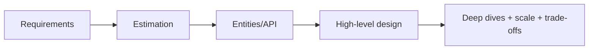

# System Design Fundamentals and Interview Framework

This is the foundation topic for every system-design interview. Before you can design
Twitter, a payment ledger, or a RAG pipeline, you must be fluent in the *vocabulary of
trade-offs*: requirements, estimation, the physics of latency, the arithmetic of
availability, and the axes of scaling. The single differentiator between a mid-level and a
senior/staff answer is **not** knowing more components — it is naming, quantifying, and
defending trade-offs out loud. This document builds each concept from intuition to the
trade-off table you should be able to reproduce on a whiteboard.

A recurring meta-rule: **everything is a trade-off.** Any time you make a choice (cache vs
no cache, SQL vs NoSQL, strong vs eventual consistency), you must be able to say (1) what
you gain, (2) what you give up, and (3) the condition under which you'd flip the decision.

---

## Functional and non-functional requirements

**Intuition.** Requirements gathering is the first 5-10 minutes and it silently decides
whether you pass. An interviewer opens with a deliberately vague prompt ("design Twitter")
to see if you scope. Under-scoping means you design the wrong system; over-scoping means you
run out of time.

**Functional requirements (FRs)** describe *what* the system does — the features and API
surface. For a Twitter-like feed: post a tweet, follow users, view a home timeline, like.
They map directly to endpoints and entities.

**Non-functional requirements (NFRs)** describe *how well* the system does it — the quality
attributes that dictate architecture: scale (DAU, QPS), latency budget (p99 < 200 ms),
availability target (99.99%), consistency model (read-your-writes? eventual?), durability,
security/compliance, and cost. **NFRs, not FRs, drive the interesting design decisions.**
Two systems with identical features but different NFRs (a bank ledger vs a like-counter)
have completely different architectures.

**How to run it.**
1. List 3-5 core FRs and *explicitly defer* the rest ("I'll treat DMs as out of scope").
2. Nail the NFRs with numbers: DAU, read:write ratio, latency p99, availability, consistency.
3. Confirm scope with the interviewer before drawing anything.

**Trade-offs woven in.** The consistency NFR is where CAP shows up: if the interviewer says
"followers can see a tweet a few seconds late" they've handed you permission to choose
availability + eventual consistency (AP), which unlocks caching, replication, and async
fan-out. If they say "account balance must never be wrong," you're in CP territory and pay
with latency and reduced availability during partitions.

| Requirement type | Examples | What it constrains |
|---|---|---|
| Functional | post, follow, search, pay | API, entities, data model |
| Non-functional | 100M DAU, p99<150ms, 99.99%, eventual OK | replication, caching, sharding, consistency |

**Interview tell:** candidates who jump straight to boxes-and-arrows without pinning NFRs
almost always design the wrong thing. Spend the time.

---

## Back-of-the-envelope estimation

**Intuition.** Estimation converts vague scale into concrete numbers that justify design
choices: how many servers, whether data fits in RAM, whether one DB is enough. You are not
graded on precision — you're graded on whether your architecture is *sized correctly* (a
2-order-of-magnitude error changes the design).

**The powers-of-two / powers-of-ten you memorize:**

| Power | Approx | Name |
|---|---|---|
| 2^10 | ~1 thousand | KB |
| 2^20 | ~1 million | MB |
| 2^30 | ~1 billion | GB |
| 2^40 | ~1 trillion | TB |
| 2^50 | ~1 quadrillion | PB |

Time: 1 day ≈ 86,400 s ≈ **~100K seconds** (round up for easy math). 1 month ≈ 2.5M s.

**QPS.** `average QPS = daily requests / 86,400`. Peak QPS is typically **2-10x** average;
use ~2x unless told otherwise.

*Worked example — Twitter writes.* 200M DAU, each posts 2 tweets/day → 400M writes/day.
400M / 100K s ≈ **4,000 write QPS average**, ~8,000 peak. Reads: if each user loads the
timeline 20x/day → 4B reads/day → **40K read QPS**, ~80K peak. Read:write ≈ 10:1 → strongly
read-heavy → cache the timeline, replicate reads.

**Storage.** `daily bytes = writes/day × bytes/write`. A tweet ≈ 300 bytes text + metadata,
say 1 KB with indexes. 400M × 1 KB = **400 GB/day** → ~146 TB/year → multiply by replication
factor (×3) → ~440 TB/year. Media dominates: 10% of tweets carry a 200 KB image → 40M ×
200 KB = **8 TB/day** just for images. This is why you separate blob storage (S3) from the
metadata DB.

**Bandwidth.** `read bandwidth = read QPS × response size`. 80K QPS × 1 KB = 80 MB/s egress
for text; media pushes this to GB/s → CDN.

**Memory (cache sizing).** Apply the 80/20 rule: cache the hot 20%. If daily reads touch
100 GB of distinct data and 20% is hot → **~20 GB cache** → fits on a handful of Redis nodes.

**Trade-offs.** Estimation *is* trade-off justification: showing "40K read QPS, 4K write
QPS" is the evidence that lets you say "read replicas + cache, single-primary writes."
Skipping the math means your scaling decisions are unfounded assertions the interviewer
will poke holes in. Round aggressively — a candidate who spends 4 minutes on long division
is signaling the wrong thing.

---

## Latency numbers every engineer should know

**Intuition.** These numbers (Jeff Dean / Peter Norvig, ~2012, still directionally correct)
let you reason about *where time goes* and reject bad designs instantly ("that's 50 disk
seeks in the request path → too slow"). Memorize the relative orders of magnitude, not exact
figures.

| Operation | Latency | Human scale (×1e9) |
|---|---|---|
| L1 cache reference | 0.5 ns | 0.5 s |
| Branch mispredict | 5 ns | 5 s |
| L2 cache reference | 7 ns | 7 s |
| Mutex lock/unlock | 25 ns | 25 s |
| Main memory (RAM) reference | 100 ns | ~1.7 min |
| Compress 1 KB (Zippy/Snappy) | 3,000 ns (3 µs) | ~50 min |
| Send 1 KB over 1 Gbps network | 10,000 ns (10 µs) | ~2.75 hr |
| Read 4 KB random from SSD | 150,000 ns (150 µs) | ~1.7 days |
| Read 1 MB sequential from RAM | 250,000 ns (250 µs) | ~3 days |
| Round trip within same datacenter | 500,000 ns (0.5 ms) | ~6 days |
| Read 1 MB sequential from SSD | 1,000,000 ns (1 ms) | ~11.5 days |
| Disk seek (spinning HDD) | 10,000,000 ns (10 ms) | ~4 months |
| Read 1 MB sequential from HDD | 20,000,000 ns (20 ms) | ~7.5 months |
| Round trip CA ↔ Netherlands | 150,000,000 ns (150 ms) | ~5 years |

**The takeaways every senior repeats:**
- **RAM is ~1,000x faster than SSD (100 ns vs ~150 µs random), SSD is ~50-100x faster than
  HDD** for random access.
- **Memory is fast, disk is slow, network is slower, cross-region is glacial.** A cross-
  continent round trip (150 ms) is ~1,500,000x a memory reference (100 ns).
- **Sequential >> random.** Sequential SSD read of 1 MB (1 ms) vs random 4 KB reads — batch
  and sequential-ize I/O (why LSM-trees, log-structured storage, and Kafka are fast).
- **A single cross-region RTT (~70-150 ms) can blow a 200 ms p99 budget by itself** → keep
  chatty request/response inside one region/AZ, or go edge/CDN.

**Usage / trade-offs.** These numbers justify caching (RAM vs SSD ≈ 1,000x, RAM vs HDD seek ≈ 100,000x), CDNs and edge
(avoid the 150 ms cross-continent hop), read replicas placed near users, and batching. They
also warn against N+1 patterns: 100 sequential intra-DC RTTs = 50 ms — parallelize or batch.
Modern note: NVMe SSDs (~20-100 µs) and datacenter networks have improved, but ratios hold.

---

## The RESHADED and structured interview approach

**Intuition.** A 45-60 minute interview needs a *track to run on*. Lack of structure is the
#1 failure mode. RESHADED (Educative) and the equivalent Hello Interview "Delivery
Framework" both give you an ordered checklist so you never freeze.

**RESHADED** — the mnemonic:
- **R**equirements — functional + non-functional, scope explicitly.
- **E**stimation — QPS, storage, bandwidth, memory (back-of-envelope).
- **S**torage schema / core entities — the data model, key entities and relationships.
- **H**igh-level design — boxes and arrows: clients, LB, services, DB, cache, queue.
- **A**PI design — the contract: endpoints, request/response, pagination.
- **D**etailed design — deep-dive the hard components (sharding, fan-out, dedup).
- **E**valuation — check the design against the NFRs; find bottlenecks/SPOFs.
- **D**istinctive / deep-dive — the component that makes this problem special.

**Hello Interview's equivalent** (modern, widely cited): Requirements → Core Entities →
API/Interface → (Data Flow for pipelines) → High-Level Design → Deep Dives.

**Time budget (≈45 min):**

```
0-2   min : intro / clarify the prompt
2-7   min : functional + non-functional requirements (write on board)
7-12  min : back-of-envelope estimation
12-15 min : core entities + API
15-30 min : high-level design (draw it, walk the read & write paths)
30-45 min : deep dives + scaling + trade-offs + follow-ups
```



**Trade-offs / how it's graded.** Seniority shows in the *back half*. Mid-level candidates
produce a correct high-level design; senior/staff candidates spend most of the time in deep
dives defending trade-offs, quantifying with the estimation numbers, and driving the
conversation. The framework's value is *time discipline*: don't spend 20 minutes on the API
and leave no time for the interesting scaling deep-dive. Adapt it — for a data pipeline the
"API" step becomes a data-flow step; for an ML system add a model/serving step.

---

## SLA, SLO, SLI and error budgets

**Intuition.** These are the vocabulary of reliability, popularized by Google SRE. They turn
"the system should be reliable" into a measurable contract.

- **SLI (Indicator):** a *measured* number — e.g., "proportion of requests served < 200 ms"
  or "successful requests / total requests." It's the metric.
- **SLO (Objective):** the *internal target* for an SLI — e.g., "99.9% of requests succeed
  over 28 days." What the team commits to.
- **SLA (Agreement):** the *external, contractual* promise to customers, usually looser than
  the SLO, with financial penalties (credits) if breached. SLA ≤ SLO by design.

Relationship: **SLI ≤ SLO ≤ SLA-strictness.** You set SLOs stricter than SLAs so you get
warned (burn alerts) before you owe customers money.

**Error budget.** `error budget = 1 − SLO`. A 99.9% SLO permits 0.1% failure ≈ **43.8
min/month** of downtime/errors. This is the *engineering-velocity lever*: as long as budget
remains, ship features fast; when the budget is exhausted, freeze risky launches and spend
on reliability. It aligns dev (wants velocity) and ops (wants stability) with one number.

**Trade-offs.**
- **Higher SLO → exponentially higher cost.** Going 99.9% → 99.99% often means multi-AZ,
  multi-region, redundant everything — large cost/complexity jump for a 10x smaller budget.
  Pick the *lowest SLO the business actually needs*; over-committing wastes money and slows
  delivery.
- **SLA tighter than you can meet → constant penalty payouts + reputation loss.** SLA looser
  than SLO → safety margin. Never set SLA = measured best-case.
- **Too many SLIs → noise.** Pick a few user-centric SLIs (latency, availability, error
  rate, freshness) that reflect actual user pain.

Real systems: Google SRE, AWS (S3 SLA 99.9% monthly with service-credit tiers), most SaaS.

---

## Availability nines and downtime math

**Intuition.** "Availability" = fraction of time the system is usable, expressed in "nines."
You must be able to convert nines ↔ downtime instantly.

| Availability | Downtime / year | Downtime / month | Downtime / day |
|---|---|---|---|
| 99% (two 9s) | 3.65 days | ~7.2 hours | ~14.4 min |
| 99.9% (three 9s) | ~8.77 hours | ~43.8 min | ~1.44 min |
| 99.99% (four 9s) | ~52.6 min | ~4.38 min | ~8.6 s |
| 99.999% (five 9s) | ~5.26 min | ~26 s | ~0.86 s |
| 99.9999% (six 9s) | ~31.5 s | ~2.6 s | ~86 ms |

**Composition — the part candidates get wrong:**
- **Series (dependency chain):** components multiply. Service A (99.9%) calling B (99.9%)
  calling C (99.9%) → 0.999^3 ≈ **99.7%**. *Every synchronous dependency lowers your ceiling.*
  This is the argument for reducing hard dependencies, async decoupling, and graceful
  degradation.
- **Parallel (redundancy):** `A_total = 1 − (1−A)^n`. Two 99% replicas → 1−(0.01)^2 = **99.99%**.
  Redundancy multiplies reliability — the argument for N+1, multi-AZ, and multi-region.

**Trade-offs.**
- Each extra nine costs roughly an order of magnitude more (redundancy, multi-region, chaos
  testing, on-call maturity). **Five nines (26 s/month) is extraordinarily expensive** and
  usually unnecessary — reserve it for core infra (DNS, payments core).
- Redundancy for availability trades against **cost** and, if synchronous cross-region, against
  **latency and consistency** (CAP). Active-active multi-region buys availability but forces
  you to handle conflict resolution / eventual consistency.
- **Your availability ceiling is your weakest hard dependency.** If you depend synchronously
  on a 99.9% third party, you cannot promise 99.99% without a fallback/circuit breaker.

---

## Latency versus throughput

**Intuition.** They are different axes and optimizing one can hurt the other.
- **Latency:** time for a single operation (measure with percentiles: p50/p95/p99/p999, not
  average — averages hide tail pain).
- **Throughput:** operations completed per unit time (QPS, MB/s).

Analogy: a pipe's *diameter* (throughput) vs the *time for one drop to traverse* (latency).
Little's Law: `concurrency = throughput × latency` (L = λ × W).

**How they interact.**
- **Batching** raises throughput but *adds* latency (requests wait to fill a batch). Kafka,
  bulk DB writes, GPU inference all batch.
- **Pipelining / parallelism** raises throughput without hurting per-item latency.
- **Queuing** smooths bursts (throughput protection) but adds latency and can create
  unbounded delay under overload — needs backpressure and load-shedding.
- Under high load, latency degrades *non-linearly* near saturation (queuing theory): as
  utilization → 100%, latency → ∞. Keep utilization ~60-70% for latency headroom.

**Why tail latency matters.** In a fan-out request touching 100 services, the *slowest* one
dominates: if each has p99 = 10 ms, the request's p99 is far worse because you almost always
hit at least one slow node. Techniques: hedged/backup requests, tail-tolerant design (Dean's
"The Tail at Scale").

**Trade-offs.**
| Goal | Technique | Cost |
|---|---|---|
| Lower latency | caching, replicas near users, no batching, more resources | higher $, cache staleness |
| Higher throughput | batching, async queues, sharding, pipelining | higher latency, complexity |

Pick by SLO: an interactive API optimizes p99 latency; an analytics/ETL job optimizes
throughput and tolerates high per-record latency.

---

## Vertical versus horizontal scaling

**Intuition.**
- **Vertical (scale up):** bigger machine — more CPU/RAM/faster disk.
- **Horizontal (scale out):** more machines behind a load balancer.

**How it works & real usage.** Vertical is a config change (resize the instance): no code
changes, keeps everything on one node, simplest. Horizontal requires the system to
distribute work — load balancing, statelessness, sharding, and handling partial failure.

| Axis | Vertical (scale up) | Horizontal (scale out) |
|---|---|---|
| Complexity | Low — no app changes | High — LB, sharding, distributed state |
| Ceiling | Hard hardware limit | Near-linear, very high |
| Fault tolerance | SPOF (one big box) | Redundant by nature |
| Cost curve | Super-linear (big boxes cost a premium) | Commodity, linear-ish |
| Downtime to scale | Often requires reboot | Add nodes live |
| Data consistency | Trivial (one node) | Hard (distributed) |

**Trade-offs / when to pick which.**
- **Start vertical** for simplicity when you're below the ceiling of a single big box and
  scale is modest — you avoid distributed-systems complexity entirely. Many products run for
  years on one beefy Postgres box + replicas.
- **Go horizontal** when you exceed a single machine, need fault tolerance (no SPOF), or need
  elastic/pay-as-you-go scaling. The price is complexity: statelessness, data partitioning,
  consistency, and operational overhead.
- Stateful stores (SQL primaries) are hardest to scale horizontally (sharding); stateless app
  tiers are easiest. Common pattern: scale the app tier horizontally, scale the DB vertically
  first, then shard/replicate when forced.
- Modern default: horizontal + autoscaling in the cloud, but only take on that complexity
  when the numbers (from your estimation step) justify it.

---

## Stateless versus stateful services

**Intuition.** A **stateless** service holds no client session/data between requests — every
request carries everything needed (or fetches it from a shared store). A **stateful** service
keeps data locally that subsequent requests depend on (in-memory session, local disk, a DB
shard it owns).

**Why it matters.** Statelessness is the enabler of horizontal scaling and resilience: any
node can serve any request, so you can load-balance freely, autoscale, and lose a node
without losing data. Stateful nodes need sticky sessions, careful failover, and data
replication.

**How to make services stateless.** Push state to a shared tier: session store (Redis),
database, or a token that carries state (JWT). The app tier becomes disposable/cattle.

| Aspect | Stateless | Stateful |
|---|---|---|
| Horizontal scaling | Easy (any node serves any request) | Hard (sticky routing, rebalancing) |
| Failover | Trivial (kill and replace) | Complex (replicate, promote, re-shard) |
| Load balancing | Round-robin / least-conn | Session affinity / consistent hashing |
| Examples | REST/API tier, CDN edge, Lambda | Databases, Kafka brokers, stateful WebSocket, game servers |
| Latency | May pay a fetch to state store | Local state is fast |

**Trade-offs.**
- Stateless trades a **local-memory access for a network hop** to the shared store (extra
  latency, and the store becomes the thing you must scale/replicate) in exchange for trivial
  scaling and resilience. Usually worth it — hence "keep the app tier stateless."
- Stateful is unavoidable *somewhere* (data must live), and sometimes desirable for
  performance (local caches, in-memory aggregation, real-time connections). The art is
  *confining* state to a well-understood, replicated tier and keeping everything else
  stateless. Stateful connection layers (WebSockets, game servers) use consistent hashing +
  session migration to scale.

---

## Single points of failure

**Intuition.** A **SPOF** is any component whose failure takes down the whole system. Finding
and eliminating SPOFs is a core deliverable of the "Evaluation" step — interviewers explicitly
probe "what happens when X dies?"

**Common SPOFs and their fixes:**
| SPOF | Fix |
|---|---|
| Single load balancer | Redundant LB pair + floating IP / DNS failover; multiple LBs |
| Single DB primary | Replication + automated failover (leader election), multi-AZ |
| Single cache node | Cache cluster / replication; design for cache-miss survival |
| Single AZ / datacenter | Multi-AZ, then multi-region |
| Single message broker | Broker cluster with replication (Kafka ISR) |
| Config/DNS/service discovery | Redundant, cached, health-checked |
| A shared synchronous dependency | Circuit breakers, timeouts, fallbacks, bulkheads |

**How to eliminate:** **redundancy** (N+1), **replication** (data on ≥2 nodes),
**failover** (health checks + automatic promotion), and **graceful degradation** (serve
stale/partial data rather than error). Multi-AZ removes datacenter SPOF; multi-region removes
regional SPOF.

**Trade-offs.**
- Removing SPOFs costs money (redundant capacity sits partly idle) and complexity (failover
  logic, split-brain prevention via quorum/consensus). **Automated failover itself can be a
  risk** (flapping, false positives, split-brain) — needs fencing and quorum.
- Perfect redundancy is impossible; you *reduce* SPOF probability, not eliminate it. Prioritize
  by blast radius: fix the SPOFs whose failure is total and likely first.
- **Correlated failure** defeats naive redundancy: three replicas in one AZ still die if the
  AZ dies; a shared dependency (same config service, same certificate) is a hidden SPOF.
  Cell-based architecture (below) exists precisely to bound blast radius.

---

## Read-heavy versus write-heavy systems

**Intuition.** The read:write ratio (from your estimation) is one of the most architecture-
defining numbers. Most consumer systems are heavily **read-heavy** (timelines, product pages,
video); ledgers, logging, metrics, and IoT ingestion are **write-heavy**.

**Read-heavy playbook.**
- **Caching** (Redis/Memcached, CDN) — the single biggest lever; absorb the hot 20%.
- **Read replicas** — fan reads across followers; primary handles writes.
- **Denormalization / materialized views / precomputation** — do work at write time so reads
  are a single lookup (e.g., fan-out-on-write timelines).
- **CDN / edge** for static and cacheable content.
- Consistency relaxation: replicas lag → eventual consistency / read-your-writes tricks.

**Write-heavy playbook.**
- **Sharding / partitioning** to spread write load; avoid a single hot primary.
- **Write-optimized storage: LSM-tree stores** (Cassandra, RocksDB, ScyllaDB) turn random
  writes into sequential appends — far higher write throughput than B-tree/update-in-place.
- **Async ingestion via a log/queue** (Kafka) to buffer bursts and decouple producers from
  slower downstream writes; batch before persisting.
- **Batching & compaction**; append-only designs.
- Consider **CQRS** (below): separate the write model from read model so each scales
  independently.

| Dimension | Read-heavy | Write-heavy |
|---|---|---|
| Primary lever | Cache + replicas | Shard + LSM + async buffer |
| Storage engine | B-tree / read-optimized OK | LSM-tree, append-only |
| Consistency | Often eventual (replica lag) | Durability + ordering focus |
| Bottleneck | Fan-out read latency, cache hit rate | Write amplification, hot shards |
| Examples | Twitter timeline, CDN, e-commerce browse | Metrics/logs, IoT, chat ingest, ledgers |

**Trade-offs.**
- Caching (read-heavy) buys latency/throughput but adds **staleness and invalidation
  complexity** ("two hard things"). Denormalization speeds reads but makes writes fan out and
  risks inconsistency.
- LSM (write-heavy) gives fast writes but pays with **read amplification and compaction
  overhead** (background CPU/IO, occasional latency spikes). Fan-out-on-write is great for
  reads but explodes for celebrity accounts (millions of followers) → hybrid: push for normal
  users, pull for celebrities.

---

## CAP, PACELC and consistency trade-offs

**Intuition.** The **CAP theorem**: during a **network partition (P)**, a distributed system
must choose between **Consistency (C)** (every read sees the latest write) and **Availability
(A)** (every request gets a non-error response). You cannot have both *while partitioned*.
When there's no partition, you get both — CAP only bites during failures.

- **CP systems** (choose consistency): refuse/block requests that can't be made consistent.
  Examples: ZooKeeper, etcd, HBase, most RDBMS with sync replication, Spanner. Cost:
  availability drops during partitions.
- **AP systems** (choose availability): keep serving, reconcile later (eventual consistency).
  Examples: Cassandra, DynamoDB (default), Riak. Cost: reads may be stale/conflicting.

**PACELC** extends CAP: **if Partition, choose A or C; Else (normal ops), choose Latency (L)
or Consistency (C).** This is the more useful modern framing because it names the *everyday*
trade-off (not just during rare partitions): strong consistency costs latency even when
healthy (e.g., synchronous quorum writes). Dynamo/Cassandra = PA/EL (available + low latency);
Spanner = PC/EC (consistent, pays latency via TrueTime).

**Trade-offs / when to choose.**
- Choose **CP / strong consistency** for money, inventory, unique constraints, coordination
  (locks, leader election). Accept higher latency and reduced availability during partitions.
- Choose **AP / eventual consistency** for feeds, likes, counters, sessions, catalogs, where
  a few seconds of staleness is fine and uptime + latency matter more. This unlocks
  replication, caching, and multi-region active-active.
- Tunable middle ground: **quorum** (R + W > N gives strong-ish consistency; R + W ≤ N gives
  availability/latency). DynamoDB and Cassandra let you dial per-request.

Interview line: "Since the NFR says stale reads are acceptable, I'll go AP/eventual to get
availability and low latency, and use read-your-writes for the author's own view."

---

## Modern patterns event-driven, CQRS, CDC, and cell-based

**Intuition.** Post-2020 interviews expect these; a design "stuck in 2015" (LB + app + one
SQL DB) reads as junior for senior roles.

**Event-driven architecture.** Services communicate via **asynchronous events** on a broker
(Kafka, Kinesis, SNS/SQS, Pulsar) instead of synchronous RPC. Producers emit events;
consumers react. Gains: **decoupling** (producers don't know consumers), **buffering/
backpressure** (absorb bursts), **resilience** (a down consumer just lags, doesn't fail the
producer), easy fan-out to new consumers. Costs: **eventual consistency**, harder debugging
(no single call stack), need idempotency + dedup (at-least-once delivery), ordering concerns,
and operational complexity of the broker. Use when workflows are async-tolerant and you want
to decouple/scale teams and services; avoid when you need an immediate synchronous answer.

**CQRS (Command Query Responsibility Segregation).** Separate the **write model** (commands,
normalized, optimized for correctness) from the **read model** (queries, denormalized,
optimized for fast reads), often kept in sync via events. Gains: read and write sides scale
and are modeled independently — ideal for extreme read:write skew and complex read shapes.
Costs: two models to maintain, **eventual consistency** between them, more moving parts.
Often paired with **event sourcing** (store the log of events as source of truth). Use for
read-heavy domains with rich queries; overkill for simple CRUD.

**CDC (Change Data Capture).** Stream a database's changes (from its transaction log / WAL,
e.g., Debezium) as events, without dual-writes. Gains: reliably propagate DB changes to
caches, search indexes, data lakes, and other services — solves the **dual-write problem**
(where writing to DB and to Kafka separately can diverge) via the **transactional outbox +
CDC** pattern. Costs: pipeline to operate, eventual consistency, schema-evolution handling.
Use to sync derived stores (Elasticsearch, cache, warehouse) from a system of record.

**Cell-based architecture.** Partition the entire stack into independent **cells** (each a
full copy of the service serving a subset of users), so a failure or bad deploy is contained
to one cell — **bounded blast radius**. A thin routing layer maps a customer to a cell. Used
by AWS, Slack, DoorDash, Roblox. Gains: fault isolation, safer deploys (canary a cell),
predictable scaling unit. Costs: routing complexity, capacity overhead (cells sized with
headroom), cross-cell operations are awkward. Use for high-availability multi-tenant systems
where correlated failure/blast radius is the top concern.

**Trade-offs summary.** All four trade **synchronous simplicity + strong consistency** for
**decoupling, scalability, and fault isolation** at the price of **eventual consistency and
operational complexity**. Reach for them when scale, team autonomy, or blast-radius control
justify the complexity — not by default.

---

## Tail latency, percentiles, and coordinated omission

**Intuition.** At scale, the *average* is a lie and the *tail* is the product. If your p50 is
20 ms but your p99 is 2 s, one request in a hundred is a 2-second stall — and a user who
issues dozens of requests per page load hits that tail almost every session. Senior
candidates reason in percentiles (p50, p90, p99, p999) and know exactly why.

**Why the average hides pain.** Latency distributions are right-skewed (long tail from GC
pauses, lock contention, cache misses, retries, queueing). The mean is dragged by the tail
but *understates how many users hit it*. p99 = "1% of requests are at least this slow." At
1M requests/day that is 10,000 slow experiences. p999 matters for high-fan-out or high-QPS
services. Rule of thumb: **optimize the percentile that matches how often a user touches the
system**, and remember percentiles do not average or add — you cannot compute a system p99
by summing component p99s.

**The fan-out tail amplification (Dean and Barroso, "The Tail at Scale").** If one request
fans out to `n` independent services and waits for *all* of them, the probability that at
least one lands in its slow tail is `1 − (1 − p)^n`:

```
P(request hits >=1 slow node) = 1 - (1 - p)^n
n=1,   p=0.01  ->  1%   of requests are slow
n=100, p=0.01  ->  63%  of requests are slow   <-- p99 of a node becomes ~p63 of the request
n=100, p=0.001 ->  9.5% of requests are slow   (even p999 nodes bite at fan-out 100)
```

So a service where **each backend is 99th-percentile-good (1-in-100 slow) becomes slow on
~63% of fan-out-100 requests.** This is *the* reason large systems obsess over tail latency:
you cannot fan out widely and also let any node have a fat tail.

**Techniques to cut the tail:**
- **Hedged / backup requests:** after waiting the p95 of a call, send a duplicate to another
  replica and take the first response; cancel the loser. Cuts p99 dramatically for ~5% extra
  load. "Tied requests" cancel the twin the instant one starts executing.
- **Request quantization / breaking up head-of-line blocking:** split large requests so one
  giant item cannot stall a queue behind it.
- **Reduce fan-out or make it hierarchical;** cache to skip slow paths; keep utilization low
  (queueing headroom, see latency-vs-throughput).
- **Micro-partition + selective replication** of hot items to smooth per-node variance.

**Coordinated omission — the measurement gotcha (Gil Tene).** Most naive load tests and
metrics *undercount* the tail. If a load generator sends one request at a time and the server
stalls for 1 s, the generator simply waits — it never records the requests it *would* have
sent during the stall, so the stall is counted once instead of hundreds of times. Result:
reported p99 looks great while real users see far worse. Fixes: use open-model load
generation (fixed send rate regardless of response), correct for coordinated omission (HdrHistogram),
and measure latency at the client/edge, not just server-side. **When an interviewer asks "how
do you know your p99?", naming coordinated omission is a strong senior signal.**

---

## Availability math, MTBF, MTTR, and the cost of nines

**Intuition.** The nines table (above) tells you the *budget*; this section tells you what
actually *moves* availability. Steady-state availability is:

```
A = MTBF / (MTBF + MTTR)     (MTBF = mean time between failures, MTTR = mean time to recover)
```

**The lever most candidates miss: shrink MTTR, not just MTBF.** Availability depends on the
*ratio*. If failures are inevitable, cutting recovery time buys nines cheaply: a system that
fails monthly but self-heals in 30 s (fast health checks + automated failover) can beat one
that fails rarely but takes 4 hours of manual paging to recover. This is why fast detection,
automated failover, good runbooks, and rollback speed matter as much as preventing failures.
`43,200 min/month; MTBF=720 h, MTTR=1 h -> 99.86%. Same MTBF, MTTR=1 min -> 99.998%.`

**Composition, revisited (the correlated-failure caveat).** The series formula (multiply) and
parallel formula `1 − (1 − A)^n` assume **independent** failures. Real redundancy is rarely
independent: replicas in one AZ share power/network; instances share a config service, a
certificate, a deploy pipeline, a DNS zone; a poison request or a bad deploy hits all replicas
at once. Correlated failure collapses the parallel benefit — `1 − (1 − A)^n` overstates real
availability. This is the mathematical argument for **fault isolation** (cell-based
architecture, multi-AZ/region, staggered deploys) rather than just piling on replicas.

**The cost-of-nines curve (why 99.999% is rarely worth it):**

| From → to | Downtime cut | Typical cost step |
|---|---|---|
| 99% → 99.9% | 3.65 d → 8.8 h/yr | health checks, one replica, monitoring |
| 99.9% → 99.99% | 8.8 h → 52 min/yr | multi-AZ, automated failover, on-call |
| 99.99% → 99.999% | 52 min → 5.3 min/yr | multi-region, chaos testing, zero-touch ops, no manual step in recovery |

Each nine roughly **10x's the cost and effort** while shrinking the budget 10x. At five nines
the human-in-the-loop is already too slow (5.3 min/yr leaves no time to page anyone) — you are
paying for full automation and redundancy of *everything*, including your dependencies. Pick
the lowest nines the business needs; over-committing burns money and velocity (ties to error
budgets). Also decide **whether planned maintenance counts** against the SLA — reputable SLAs
state this explicitly.

---

## Durability, RPO, RTO, and data-loss math

**Intuition.** **Durability ≠ availability.** Availability is "can I reach it now"; durability
is "will my data still be there (and correct) later." A store can be temporarily unavailable
yet perfectly durable (data safe, just not reachable), or highly available yet low-durability
(serves fast but can silently lose a recent write). Interviewers separate these deliberately.

- **Durability** = probability data is *not lost* over a time window. S3's "eleven nines"
  (99.999999999%) means for 10M objects you'd expect to lose one object roughly every 10,000
  years — achieved by erasure-coding/replicating across many devices and AZs. Durability nines
  are about *survival of stored data*, not uptime.
- **RPO (Recovery Point Objective):** the maximum acceptable *data loss*, measured in time —
  "how many seconds/minutes of recent writes can we lose?" Set by replication/backup strategy.
- **RTO (Recovery Time Objective):** the maximum acceptable *downtime* to recover — "how long
  until we're back?" Set by failover automation and restore speed.

**Replication mode fixes RPO:**

| Replication | RPO | Cost |
|---|---|---|
| Synchronous (ack after replica commits) | ~0 (no committed-write loss) | added write latency = replica RTT; availability drops if replica unreachable |
| Asynchronous (ack before replica commits) | > 0 (lose the un-shipped tail on failover) | low latency; risk losing last N ms–s of writes |

This is the durability face of CAP/PACELC: **synchronous replication buys RPO≈0 by paying
latency and partition-time availability**; async buys latency/availability by accepting a
data-loss window. For a payments ledger you choose sync (or a quorum with `W` durable copies);
for a like-counter, async is fine. Quorum durability: a write acked by `W` replicas survives
up to `W − 1` simultaneous node losses. When someone says "make it durable," pin them to a
number: **what RPO and RTO does the business actually tolerate?** — that single answer reshapes
the storage and replication design.

---

## Numbers and NFR budgets that drive the design

**Intuition.** The estimation and latency sections give raw numbers; this section is the
senior skill of turning an NFR into a *budget you allocate* across the design. Every NFR
(latency, consistency, durability, availability, cost) is a constraint you spend.

**Latency budgeting — decompose the p99 across the request path.** A p99 < 200 ms budget is
not a single number; it is split across hops, and each hop must fit:

```
Client<->edge TLS+RTT   ~40 ms
Edge -> service (in-region RTT + LB)   ~5 ms
Service compute + serialization   ~20 ms
Cache hit path   ~2 ms   |  Cache MISS -> DB   ~15 ms
Downstream fan-out (must overlap, not sum; watch the tail)   ~30 ms
Headroom for GC/retries/queueing   the rest
```

Because tail latency compounds on fan-out (see tail-latency section), you budget the *p99* of
each hop, not the mean, and you keep serial dependencies few. **A single cross-region RTT
(~70–150 ms) usually does not fit an interactive budget at all** — which is why the latency NFR
forces in-region reads, edge/CDN, and async for anything cross-continent.

**How each NFR reshapes the design (the mapping to memorize):**

| NFR tightened | Design consequence |
|---|---|
| Consistency (read-your-writes, linearizable) | route reads to primary or quorum; lose caching/replica-scale freedom; higher latency (PACELC "C") |
| Latency (tight p99) | cache, in-region, precompute/denormalize, hedge tail, cap fan-out, avoid cross-region sync |
| Durability (low RPO) | synchronous/quorum replication, WAL + backups; pay write latency |
| Availability (more nines) | multi-AZ/region redundancy, automated failover, fault isolation; pay cost + eventual consistency |
| Cost | fewer replicas/regions, cheaper storage tiers, smaller cache; accept worse latency/availability |

**Sizing formulas you should reach for live:**
- **Cache/working set:** `hot bytes ≈ hot-fraction × distinct bytes touched`; nodes = hot
  bytes / per-node RAM. Hit rate drives DB load: `DB QPS = read QPS × (1 − hit rate)`, so a
  95% hit rate cuts DB read load 20x — the whole point of the cache.
- **Concurrency/connection pools (Little's Law):** `in-flight = QPS × latency`. 50K QPS ×
  20 ms = 1,000 concurrent — size threads/connections/DB pool accordingly, or you self-inflict
  queueing and a latency blowup near saturation.
- **Fleet sizing:** `servers ≈ peak QPS / per-server QPS`, then `× (1 + redundancy headroom)`
  and round up for N+1 and the 60–70% utilization ceiling.

These cross-link tightly: the **estimation** numbers feed the **latency budget**, the
**availability math** sets redundancy (and thus cost and, via sync replication, latency and
**durability/RPO**), and the **consistency** NFR decides whether you may cache/replica-scale
at all. Naming these linkages out loud is what "driving the design from the numbers" means.

---

## Driving the interview and defending trade-offs at senior level

**Intuition.** Beyond mid-level, the interview is not "can you produce a correct design" but
"can you *own the room*": lead the structure, surface trade-offs before you're asked, quantify
with numbers, and defend decisions under challenge without either caving instantly or digging
in dogmatically.

**Behaviors that read as senior/staff:**
- **Drive, don't wait to be driven.** Propose the structure ("I'll scope requirements, size
  it, sketch the high level, then deep-dive the fan-out and the datastore — does that work for
  you?"), state assumptions and move, and manage your own time budget.
- **Lead with the NFR, then the choice, then the give-up, then the flip-condition.** The
  canonical sentence: *"Given eventual-consistency-OK and p99<150 ms at 40K read QPS, I'll go
  cache + read-replicas (AP). I trade read freshness — bounded staleness of a few seconds — and
  if you add strong read-your-writes for balances, I'd route those to the primary or use a
  quorum."* Gain / give-up / flip-condition, every time.
- **Steelman the alternative, then reject it for a reason.** "The strongly-consistent option
  would be simpler to reason about, but it costs a cross-region RTT per write we can't afford
  at this latency budget" beats never mentioning it.
- **Quantify.** Turn assertions into numbers: "that's ~63% of fan-out requests hitting the
  tail," "0.999^3 ≈ 99.7%, below our 99.9% target," "95% hit rate cuts DB load 20x." Numbers
  are the difference between an opinion and an argument.
- **Volunteer failure modes and blast radius.** Before asked: "what happens when the primary
  dies (RTO/RPO), when a cache node dies (thundering herd → request coalescing), when the AZ
  dies (correlated failure → cells/multi-AZ)."
- **Handle the challenge gracefully.** When pushed, don't flip reflexively — restate the NFR,
  check whether the new constraint changes it, and *then* adapt. Changing your answer the
  instant you're questioned signals you never understood the trade-off; refusing to adapt when
  the constraint genuinely changed signals rigidity.
- **Know when to stop gold-plating.** "We're below a single-box ceiling; I'd *not* shard yet —
  premature sharding adds cost and complexity with no current benefit. Flip-condition: when
  write QPS or dataset exceeds one primary." Restraint is a senior signal.

**Anti-patterns that cap you at mid-level:** boxes-and-arrows before NFRs; name-dropping
databases without justifying them; ignoring the tail and quoting averages; treating redundancy
as free and independent; and answering "what if X fails?" with silence. The through-line of
this whole topic: **state the number, name the trade-off, defend it, and give the condition
under which you'd change your mind.**

---

## Trade-offs and when to use what

The whole topic distilled. For each decision: gain / give up / flip-condition.

| Decision | Choose A when | Choose B when | Core trade-off |
|---|---|---|---|
| Vertical vs horizontal | below single-box ceiling, want simplicity | need FT + elastic scale beyond one box | simplicity vs scalability+resilience |
| Stateless vs stateful | app/API tier, need easy scaling | data tier, real-time connections, local perf | scaling ease vs local-state speed |
| Strong vs eventual consistency (CAP) | money, inventory, coordination | feeds, likes, catalogs, sessions | correctness vs availability+latency |
| Sync RPC vs event-driven | need immediate answer, simple flow | decouple, absorb bursts, fan-out | simplicity vs decoupling+resilience |
| Cache vs no cache | read-heavy, tolerate staleness | strong freshness, write-heavy | latency/throughput vs staleness+invalidation |
| Fan-out on write vs read | normal users, read-heavy | celebrities, write-heavy | read speed vs write amplification |
| SQL vs NoSQL | transactions, joins, strong consistency | massive scale, flexible schema, high write | ACID vs horizontal scale |
| More nines | core infra, revenue-critical | best-effort features | reliability vs cost+velocity |
| Batching | throughput-bound (ETL, analytics) | latency-bound (interactive API) | throughput vs latency |
| CQRS/event sourcing | complex reads, extreme read skew | simple CRUD | flexibility+scale vs complexity+eventual consistency |

**The senior meta-move:** state the NFR, pick the option, name what you give up, and give the
flip-condition. "Given the p99<150 ms and eventual-OK NFRs at 40K read QPS, I'll cache +
read-replicas (AP). I give up read freshness (bounded staleness ~seconds); if the interviewer
adds a strong read-your-writes requirement for balances, I'd route those reads to the primary
or use a quorum."

---

## Common interview follow-up questions

1. "You estimated 40K read QPS — walk me through exactly how you got there and how you'd size
   the cache." (redo the back-of-envelope live)
2. "What happens when your primary database dies? Walk me through failover and what the user
   sees." (SPOF, RTO/RPO, availability composition)
3. "Your p99 is 400 ms but the SLO is 200 ms — where is the time going and what do you fix
   first?" (latency numbers, tail latency, caching, cross-region hops)
4. "You chose eventual consistency — show me a concrete scenario where a user sees stale data
   and how you'd mitigate it." (read-your-writes, bounded staleness, CAP)
5. "This celebrity has 50M followers — does your fan-out-on-write still work?" (read-heavy vs
   write-heavy, hybrid push/pull)
6. "What SLO would you commit to and why not 99.999%?" (nines cost curve, error budget)
7. "How would you make this resilient to an entire AZ/region going down?" (multi-AZ/region,
   cell-based, correlated failure, cost/latency trade-off)
8. "Why event-driven here instead of a synchronous call? What do you lose?" (decoupling vs
   eventual consistency + idempotency)
9. "Two components each at 99.9% in series — what's your overall availability?" (0.999^2 ≈ 99.8%)
10. "The write load just 10x'd — what breaks first and how do you scale writes?" (sharding,
    LSM, async buffering, hot shards)

---

## References

- Alex Xu, *System Design Interview* Vol. 1 & 2 (ByteByteGo) — estimation, framework, nines.
- ByteByteGo blog & YouTube (Alex Xu) — latency numbers, back-of-envelope, modern patterns.
- Martin Kleppmann, *Designing Data-Intensive Applications* (DDIA) — consistency, replication,
  partitioning, LSM vs B-tree, CAP/linearizability.
- The System Design Primer (donnemartin, GitHub) — latency numbers, availability composition
  (series vs parallel), 4-step approach, powers-of-two.
- Jeff Dean / Peter Norvig, "Latency Numbers Every Programmer Should Know" (jboner gist).
- Jeffrey Dean & Luiz André Barroso, "The Tail at Scale" (CACM 2013) — tail latency, hedged requests.
- Google SRE Book & SRE Workbook — SLI/SLO/SLA, error budgets.
- Hello Interview (hellointerview.com) — Delivery Framework, Core Concepts, modern patterns.
- Educative, "Grokking the Modern System Design Interview" — RESHADED framework.
- AWS Builders' Library & "Reducing the Scope of Impact with Cell-based Architecture" — cells.
- Debezium docs / Confluent blog — Change Data Capture, transactional outbox pattern.
- Microsoft Azure Architecture Center — CQRS, Event Sourcing, Event-driven patterns.
- YouTube: ByteByteGo, Gaurav Sen (scaling, CAP), Hussein Nasser (backend/latency), "System
  Design Interview", "Jordan has no life" (deep DDIA-style breakdowns).
