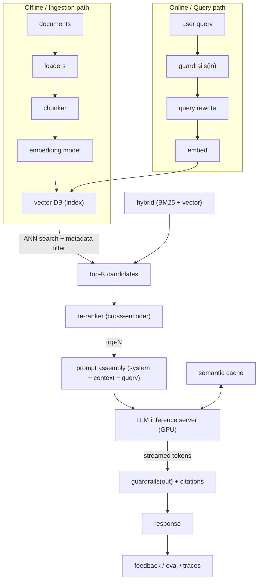

# GenAI and LLM System Design: RAG, Vector DBs and Inference at Scale

This topic covers how to design production GenAI systems that interviewers ask about
in 2024-2025: Retrieval-Augmented Generation (RAG) pipelines, vector databases and
Approximate Nearest Neighbor (ANN) indexes, serving LLM inference at scale, and the
guardrails, evaluation, caching and cost controls around them. The dominant tension
throughout is **cost vs latency vs quality** — GPUs are expensive, tokens cost money,
and users want grounded, fast, accurate answers. Every design choice below is framed
as "what you gain, what you give up, and when to pick it."

A mental model to carry through the whole topic:

---

## RAG architecture end to end

**Intuition.** An LLM only knows what was in its training data (frozen at a cutoff)
and what fits in its context window. RAG injects *fresh, private, or domain-specific*
knowledge at query time by retrieving relevant text and stuffing it into the prompt,
so the model "reads" the facts before answering. It turns a closed-book exam into an
open-book one.

**How it works.** Two paths:

- *Ingestion (offline, batch):* load documents → split into chunks → compute an
  embedding vector per chunk → store vectors + text + metadata in a vector DB.
- *Query (online, per request):* embed the query → ANN search for top-K similar
  chunks (optionally hybrid + metadata filter) → re-rank to top-N → assemble a prompt
  (system instructions + retrieved context + user question) → call the LLM → optionally
  post-process for citations and guardrails → stream the answer.

**Real-world usage.** Enterprise "chat with your docs", customer-support assistants,
code assistants over a repo, internal knowledge bases. Perplexity, Bing Copilot,
Notion AI, and most enterprise assistants are RAG under the hood.

**Trade-offs.**

- *RAG vs long-context stuffing:* You could paste all docs into a 1M-token context
  window. Gain: no retrieval infra, no chunking bugs. Give up: cost scales linearly
  with tokens (you pay for every token every call), latency grows with context, and
  models exhibit "lost in the middle" — recall of facts buried mid-context degrades.
  Pick full-context only for small, bounded corpora; pick RAG when the corpus is
  large, changes often, or must be access-controlled per user.
- *Retrieval quality is the ceiling.* No prompt trick fixes bad retrieval — if the
  right chunk is not in top-N, the model cannot ground on it and will hallucinate or
  refuse. Most RAG quality wins come from the retrieval half, not the generation half.
- *Freshness vs cost:* re-embedding on every document change keeps the index fresh but
  costs embedding compute and index writes; batch re-index is cheaper but stale.

**Failure modes.** Missing chunk (retrieval miss) → hallucination; too many chunks →
context dilution and cost; embedding model drift after a re-embed with a new model
(you must re-embed the *entire* corpus with the same model that embeds queries).

---

## Chunking strategies

**Intuition.** Embeddings represent a *fixed-size* piece of text as one vector. If a
chunk is too big, its single vector becomes a blurry average of many topics and
retrieval precision drops; too small, and each chunk lacks enough context to be
meaningful or to answer a question on its own. Chunking is choosing that unit.

**How it works.** Common strategies, roughly increasing in sophistication:

- *Fixed-size* (e.g., 512 tokens) with **overlap** (e.g., 10-20%) so a sentence split
  across a boundary still appears whole in one chunk.
- *Recursive / structural* — split on natural boundaries (paragraphs, headings,
  Markdown/HTML structure, code functions) before falling back to size limits.
- *Semantic chunking* — embed sentences and cut where adjacent-sentence similarity
  drops (topic shift). Higher quality, higher preprocessing cost.
- *Sentence-window / parent-document* — embed small units for precise matching but
  return a larger surrounding window ("parent") to the LLM for context. Decouples the
  *retrieval unit* from the *generation unit*.
- *Contextual retrieval* (Anthropic, 2024) — prepend a short LLM-generated summary of
  the whole document to each chunk before embedding, so chunks carry global context;
  reduces retrieval failures substantially at the cost of an LLM call per chunk at
  ingest time.

**Rules of thumb / numbers.** 256-512 tokens is a common sweet spot for prose;
10-15% overlap; keep chunk size well under both the embedding model's max sequence
length and a fraction of the LLM context so many chunks fit.

**Trade-offs.**

| Strategy | Precision | Context per chunk | Ingest cost | When to use |
|---|---|---|---|---|
| Fixed-size + overlap | Medium | Medium | Low | Default, uniform prose |
| Recursive/structural | Medium-High | Respects structure | Low | Markdown, HTML, code |
| Semantic | High | Topic-coherent | Medium (embeds at split) | Quality-critical, heterogeneous docs |
| Parent-document | High | Small match, big return | Medium | Precise match + rich answer |
| Contextual retrieval | Highest | Global + local | High (LLM per chunk) | Enterprise, high accuracy budget |

Big chunks: fewer vectors (cheaper index, cheaper search) but coarse matching and more
wasted context tokens. Small chunks: precise matching but more vectors, more retrieval
calls, and risk of fragmenting an answer across chunks. Overlap improves recall but
inflates storage and can return near-duplicate chunks (waste context) — dedupe.

---

## Embedding models and dimensionality

**Intuition.** An embedding maps text to a point in high-dimensional space where
semantic similarity ≈ geometric closeness (usually cosine similarity). "Refund
policy" and "how do I get my money back" land near each other even with zero shared
words — this is why embeddings beat keyword search for meaning.

**How it works.** A transformer encoder produces a dense vector (typically 384-3072
dims). You normalize vectors and compare with cosine similarity or dot product.
Critically, **query and document must use the same embedding model** (same vector
space). Some models are *asymmetric* (separate query vs passage encoders) and need
task-specific prefixes.

**Real-world usage.** OpenAI `text-embedding-3-small` (1536) / `3-large` (3072, supports
dimensionality reduction), Cohere embed v3, `bge`, `e5`, `gte` open models,
Voyage AI for retrieval-tuned embeddings. **Matryoshka Representation Learning (MRL)**
lets one model emit vectors truncatable to smaller dims (e.g., 3072→256) with graceful
quality loss — store short vectors, cheap search, optionally re-score with full dims.

**Trade-offs.**

- *Dimensionality:* higher dims capture more nuance and can improve recall, but
  linearly increase storage and memory bandwidth per comparison, slow ANN, and raise
  cost. 768-1536 is a common production balance. MRL gives you a dial instead of a
  fixed choice.
- *Model size / quality vs latency/cost:* larger embedding models embed better but cost
  more per token and add ingest + query latency. Query-time embedding is on the critical
  path, so a slow embedder hurts p99.
- *General vs domain-tuned:* off-the-shelf embeddings are convenient; fine-tuned or
  domain embeddings (legal, code, bio) improve recall but require training data and lock
  you into re-embedding the corpus if you change them.
- *Distance metric:* cosine (angle) is standard for normalized text embeddings; dot
  product favors magnitude (used by some models); Euclidean is rarer for text. Must
  match what the model was trained for or recall collapses.

**Failure modes.** Changing embedding models without re-embedding the corpus (query and
doc vectors now live in different spaces → garbage retrieval). Multilingual mismatch.
Truncating input beyond the model's max sequence length silently drops content.

---

## Vector databases and storage

**Intuition.** A vector DB stores millions-to-billions of embeddings and answers
"find the K nearest vectors to this query vector" in milliseconds, plus metadata
filtering, CRUD, and horizontal scale — things a raw ANN library (FAISS) alone does not
give you.

**How it works.** Core capabilities: an ANN index (see next section), a payload/metadata
store, filtering, upserts/deletes, and often replication + sharding. Two scaling axes:
by number of vectors (shard/partition) and by query volume (replicas).

**Options.**

| System | Model | Strengths | Watch-outs |
|---|---|---|---|
| **Pinecone** | Managed SaaS (serverless) | Zero-ops, scales, good filtering | Cost, vendor lock-in, less control |
| **Weaviate** | OSS + managed | Hybrid search, modules, GraphQL | Ops if self-hosted |
| **Milvus / Zilliz** | OSS + managed | Billion-scale, many index types, GPU | Operationally heavy |
| **Qdrant** | OSS + managed (Rust) | Fast, good filtering, quantization | Younger ecosystem |
| **pgvector (Postgres)** | Extension | Reuse Postgres, transactions, joins | Scales less far; index build cost |
| **FAISS** | Library (no server) | Fastest raw ANN, research-grade | No persistence/CRUD/filtering/HA by itself |
| **OpenSearch / Elasticsearch** | Search engine + kNN | Hybrid with BM25 built in | Heavier, tuning |

**Trade-offs.**

- *Dedicated vector DB vs pgvector:* if you already run Postgres and have <~1-10M
  vectors with moderate QPS, pgvector avoids a new system and gives you joins +
  transactional consistency with your source data. Beyond that scale, or when you need
  serverless elasticity and best-in-class ANN, a dedicated vector DB wins. The trade-off
  is operational simplicity + consistency vs scale + performance.
- *Managed vs self-hosted:* managed (Pinecone) buys zero-ops and elasticity but costs
  more and locks you in; self-hosted (Milvus/Qdrant) is cheaper at scale and controllable
  but you own upgrades, sharding, and HA.
- *Filtering strategy — pre vs post:* pre-filter (restrict candidate set before ANN) is
  precise but can be slow or break the ANN graph's connectivity; post-filter (ANN then
  drop non-matching) is simple but may return fewer than K after filtering. Native
  filtered-ANN (Qdrant, Weaviate) blends both.
- *Consistency:* most vector DBs are eventually consistent on the index — a just-inserted
  vector may not be searchable for seconds. Fine for docs, dangerous for read-your-writes
  UX (e.g., "I just uploaded a file, why can't the bot see it?").

**Capacity math.** 1 vector at 768 dims × 4 bytes (float32) = 3,072 bytes ≈ 3 KB.
10M vectors ≈ 30 GB raw (float32), often 1.5-2× with HNSW graph overhead → plan ~45-60 GB
RAM. Quantize to int8 → ~4× smaller; to binary → ~32× smaller (with recall loss).

---

## ANN indexes HNSW and IVF

**Intuition.** Exact nearest-neighbor over millions of high-dim vectors means comparing
the query to *every* vector (brute force, O(N)) — accurate but too slow at scale.
ANN trades a little recall for massive speed by only looking at a promising subset.

**How it works.**

- **HNSW (Hierarchical Navigable Small World):** a multi-layer proximity graph. Search
  starts at a sparse top layer, greedily hops toward the query, then descends to denser
  layers for fine-grained search. Query time ≈ O(log N). Key params: `M` (edges per node
  — higher = better recall, more memory), `efConstruction` (build-time candidate list —
  higher = better graph, slower build), `efSearch` (query-time candidate list — higher =
  better recall, slower query). The main runtime recall/latency dial is `efSearch`.
- **IVF (Inverted File Index):** cluster vectors into `nlist` cells (via k-means); at
  query time search only the `nprobe` nearest cells. Higher `nprobe` = more recall, more
  latency. Often combined with **PQ (Product Quantization)** — IVF-PQ compresses vectors
  into codes for huge memory savings at billion scale (used by FAISS at Meta/Spotify).
- **Flat (brute force):** exact, best recall, O(N) — fine below ~10-100K vectors.
- **Quantization:** Scalar (int8), Product (PQ), or Binary quantization shrink memory and
  speed distance computation, trading recall; often paired with a re-score of top
  candidates using full-precision vectors.

**Trade-offs.**

| Index | Recall | Query latency | Build time | Memory | Best at |
|---|---|---|---|---|---|
| Flat | 100% | High (O(N)) | None | Full | <100K vectors, exact needs |
| HNSW | Very high | Very low | Slow, high RAM | High (graph) | Low-latency, RAM available |
| IVF | Tunable | Low-medium | Medium | Medium | Large N, batch-friendly |
| IVF-PQ | Medium | Low | Medium | Very low | Billion-scale, RAM-constrained |

- *HNSW vs IVF:* HNSW gives the best latency/recall for in-memory workloads but is
  RAM-hungry and slow/expensive to build and to update (graph mutation). IVF(-PQ) scales
  to far larger corpora on less RAM and rebuilds/updates more gracefully, at somewhat
  higher latency and tuning effort. Pick HNSW for interactive low-latency search that
  fits in RAM; pick IVF-PQ for billion-scale or memory-bound.
- *The universal knob:* every ANN index has a recall↔latency dial (`efSearch`,
  `nprobe`). There is no free lunch — pushing recall to ~99% can multiply latency.
- *Updates:* HNSW handles inserts but deletes/heavy churn degrade the graph over time,
  needing periodic rebuilds. IVF centroids drift as data distribution shifts →
  periodic re-clustering.

**Numbers.** HNSW commonly hits ~95-99% recall at single-digit-ms query latency for a
few million vectors in RAM. Build for 10M vectors can take minutes to hours depending on
`efConstruction`/`M`.

---

## Retrieval, hybrid search and re-ranking

**Intuition.** Pure vector (dense) search captures meaning but can miss exact terms
(product IDs, error codes, rare names, acronyms). Keyword (sparse/BM25) search nails
exact terms but misses paraphrase. Combining them (hybrid) plus a heavyweight re-ranker
gives both recall and precision.

**How it works.**

- *Dense retrieval:* embed query, ANN search — good for semantic match.
- *Sparse / lexical (BM25, SPLADE):* term-frequency scoring — good for exact/rare tokens.
- *Hybrid:* run both and fuse scores. **Reciprocal Rank Fusion (RRF)** is a simple,
  robust fusion that combines rank positions without needing score normalization.
- *Re-ranking:* retrieval returns a broad top-K (e.g., 50-100) cheaply; a **cross-encoder**
  re-ranker (e.g., Cohere Rerank, `bge-reranker`) jointly encodes (query, chunk) pairs for
  a much more accurate relevance score, keeping top-N (e.g., 3-8). This is the
  "retrieve broad, rank precise" two-stage pattern.
- *Bi-encoder vs cross-encoder:* bi-encoder embeds query and doc separately (fast,
  precomputable, used for first-stage retrieval); cross-encoder reads both together
  (slow, accurate, used only to re-rank a small candidate set).

**Trade-offs.**

- *Dense vs sparse vs hybrid:* hybrid nearly always beats either alone for enterprise
  corpora (mix of natural language and exact identifiers), at the cost of running and
  maintaining two indexes and a fusion step. Pure dense is simplest; pure sparse is
  cheapest and needs no GPU/embeddings.
- *Re-ranking cost:* a cross-encoder over 100 candidates adds latency (tens of ms to
  hundreds) and compute, but often the single biggest precision win after retrieval.
  Trade-off: better top-N (less hallucination, fewer wasted context tokens) vs added
  latency and a model to serve. Larger top-K into the re-ranker improves recall but costs
  more per query.
- *K selection:* larger retrieval K raises recall but dilutes the prompt and costs tokens;
  re-ranking lets you retrieve large K yet feed the LLM only the best few.

**Failure modes.** Fusion weighting wrong → one modality dominates. Re-ranker latency on
critical path → p99 blowups; mitigate by capping K and batching. Over-retrieval → context
window overflow.

---

## Prompt assembly, grounding and citations

**Intuition.** Retrieval gives you the facts; prompt assembly decides how the model *uses*
them. Good assembly makes the model answer *only* from provided context and cite sources —
turning a plausible-sounding generator into a grounded, auditable one.

**How it works.** A typical prompt = system instructions ("answer only from the context;
if the answer isn't there, say you don't know; cite chunk IDs") + retrieved context blocks
(each tagged with a source id) + conversation history + the user question. Techniques:

- *Grounding instruction* + *abstention* ("say I don't know") to reduce hallucination.
- *Citations:* tag each context chunk with an id and ask the model to emit `[id]` markers;
  post-process to map to source URLs. Some pipelines verify each claim maps to a retrieved
  span (attribution check).
- *Context ordering:* place the most relevant chunks at the start/end to fight
  "lost in the middle" degradation.
- *Token budgeting:* reserve room for the answer; truncate/deduplicate context; compress
  with summaries if over budget.

**Trade-offs.**

- *More context vs cost/latency/quality:* adding chunks can raise recall of the right fact
  but costs tokens, adds latency, and beyond a point *lowers* accuracy (distraction,
  lost-in-the-middle). There is an optimal N, usually small (3-8).
- *Strict grounding vs helpfulness:* forcing "only from context" reduces hallucination but
  increases refusals when retrieval misses; loosening it improves coverage but risks
  fabrication. Tune to the domain's tolerance for wrong answers (medical/legal → strict).
- *Citations cost:* enforcing and verifying citations adds prompt complexity and sometimes
  a verification pass, but is essential for trust/auditability in enterprise/regulated use.

**Failure modes.** Prompt injection from retrieved content ("ignore previous instructions")
— untrusted documents can hijack the model; mitigate with delimiters, instruction
hierarchy, and treating retrieved text as data not instructions. Context overflow silently
truncating the user's actual question.

---

## LLM inference serving at scale

**Intuition.** Generating text is autoregressive: the model produces one token, appends it,
and predicts the next. Two phases with very different characteristics: **prefill** (process
the whole prompt in parallel — compute-bound) and **decode** (generate tokens one at a time —
memory-bandwidth-bound). Serving cost is dominated by scarce, expensive GPUs, so utilization
is everything.

**How it works.** An inference server (vLLM, TensorRT-LLM, TGI, SGLang) loads model weights
onto GPU(s), manages the KV cache, batches requests, and streams tokens back. For models
too big for one GPU, use **tensor parallelism** (split each layer across GPUs, high
interconnect need) and/or **pipeline parallelism** (split layers across GPUs/stages).

**Key numbers / capacity.** A 70B model in FP16 ≈ 140 GB weights → needs multiple 80 GB
GPUs (e.g., 2× H100) just for weights, plus KV cache room. TTFT for a few-hundred-token
prompt is tens to low-hundreds of ms on modern GPUs; per-token decode is a few to tens of
ms. Quantizing weights (INT8/FP8/INT4) roughly halves/quarters memory and boosts throughput
with modest quality loss.

**Trade-offs.**

- *Latency vs throughput vs cost:* the master trade-off. Bigger batches → far higher
  throughput (tokens/sec/GPU, lower $/token) but higher per-request latency. Small batches →
  snappy latency, poor GPU utilization, high $/token. You cannot maximize all three.
- *Self-host vs API:* calling a hosted API (OpenAI/Anthropic/Bedrock) is fastest to ship,
  no GPU ops, elastic — but per-token cost, rate limits, data-egress/privacy concerns, and
  less control. Self-hosting open models amortizes cost at high, steady volume and keeps
  data in-house, but you own GPU capacity, scaling, and reliability. Break-even is typically
  high sustained QPS.
- *Model size vs quality:* bigger models are smarter but slower and costlier per token;
  route easy queries to a small/cheap model and hard ones to a large model (model cascading /
  routing) to optimize cost/quality.
- *Parallelism:* tensor parallelism reduces latency for a single big request but needs
  high-bandwidth interconnect (NVLink) and adds communication overhead; too much
  parallelism yields diminishing returns (see 4→8 GPU giving only ~0.7× latency).

**Failure modes.** GPU OOM when KV cache + weights exceed VRAM under load (long contexts,
big batches) → dropped/queued requests; autoscaling GPUs is slow (cold starts, scarce
capacity) so provision headroom; a few very long generations can hog a batch (head-of-line
blocking) — mitigated by continuous batching.

---

## KV cache and batching

**Intuition.** During decode, attention needs the keys/values of *all previous tokens*.
Recomputing them every step is wasteful, so we cache them — the **KV cache**. It is the
main consumer of GPU memory besides weights and the main limiter on batch size and context
length. Batching amortizes the cost of loading weights across many requests.

**How it works.**

- *KV cache size* grows with (batch size × sequence length × layers × hidden dim × 2). Long
  contexts and large batches blow up memory fast. Reductions: **GQA/MQA** (share KV heads),
  **KV cache quantization** (FP16→INT8), and **PagedAttention** (vLLM) — allocate KV cache
  in non-contiguous "pages" like OS virtual memory, eliminating fragmentation and enabling
  much larger effective batches + prefix sharing.
- *Batching strategies:*
  - *Static batching:* wait to fill a batch, run all to completion together. Simple; poor
    for variable-length generation (fast requests wait for the slowest — head-of-line
    blocking).
  - *Dynamic batching:* form a batch on arrival; still completes together.
  - *Continuous (in-flight, iteration-level) batching:* at every decode step, finished
    sequences leave and new ones join. SOTA — 10-20× throughput over dynamic batching.
- *Prefix caching:* reuse the KV cache of a shared prompt prefix (e.g., a long common system
  prompt or shared document) across requests, cutting prefill cost dramatically.

**Trade-offs.**

- *Batch size:* larger batch → higher throughput and lower $/token but higher latency and
  more KV memory; past the compute-bound point you add latency with no throughput gain.
- *KV quantization / GQA:* saves memory (bigger batches/contexts) at a small quality cost.
- *PagedAttention / continuous batching:* huge utilization win; adds scheduler complexity.
- *Long context:* enables more retrieved/agent context but KV cache and prefill cost scale
  with context length — expensive; RAG is often cheaper than dumping everything into context.

**Failure modes.** KV cache exhaustion under long-context load → preemption/eviction/recompute
or OOM; naive static batching → tail-latency blowups; without prefix caching, repeated long
system prompts waste prefill compute on every call.

---

## Token streaming and latency metrics

**Intuition.** Users perceive an LLM as fast if the *first* token appears quickly and tokens
then flow steadily — even if the total generation takes seconds. Streaming tokens as they are
produced (Server-Sent Events / WebSockets) is what makes chat feel responsive.

**How it works and the metrics that matter:**

- **TTFT (Time To First Token):** time from request to first token. Dominated by queueing +
  prefill (prompt length, retrieval, batching wait). The key *responsiveness* metric for chat.
- **TPOT / ITL (Time Per Output Token / Inter-Token Latency):** steady-state per-token time.
  Governs perceived reading speed; target below human reading speed (~a few tokens/sec is
  fine to read).
- **End-to-end latency** = TTFT + TPOT × output_tokens. Long answers dominated by TPOT.
- **Throughput:** total output tokens/sec across all concurrent users — the cost metric.

**Trade-offs.**

- *TTFT vs throughput:* larger batches and heavier retrieval/re-ranking improve throughput/
  quality but raise TTFT. Streaming hides TPOT from the user but not TTFT.
- *Streaming vs non-streaming:* streaming greatly improves perceived latency and lets you
  run output guardrails incrementally, but complicates post-processing (you can't validate/
  moderate the full answer before the user sees the start) and citation insertion.
- *Speculative decoding:* a small "draft" model proposes several tokens that the big model
  verifies in one pass — lowers TPOT/latency with identical output distribution, at the cost
  of extra compute and complexity; wins when the draft model is accurate.

**Failure modes.** High TTFT from retrieval + re-ranking + queueing stacking up; mid-stream
guardrail catches a violation after the user already saw tokens (need to redact or stop
generation); dropped SSE connections needing resumable streams.

---

## Caching for GenAI, semantic and prompt cache

**Intuition.** LLM calls are slow and expensive. Many queries repeat or are near-duplicates.
Caching answers or reusing computation cuts cost and latency dramatically — but LLM caching
is trickier than key-value caching because "the same question" is rarely byte-identical.

**How it works — layers of caching:**

- *Exact-match response cache:* hash of (prompt + params) → response. Trivial, but only hits
  on identical requests.
- *Semantic cache:* embed the incoming query; if a past query's embedding is within a
  similarity threshold, return its cached answer. Turns "what's your refund policy?" and
  "how do I get a refund?" into a cache hit. Backed by a vector store (e.g., GPTCache).
- *Prompt / prefix (KV) cache:* at the inference layer, cache the KV state of a shared prompt
  prefix so repeated system prompts or documents skip prefill. Provider "prompt caching"
  (Anthropic/OpenAI/Bedrock) bills cached input tokens at a large discount.

**Trade-offs.**

- *Semantic cache threshold:* loose threshold → more hits (cheaper, faster) but risk of
  returning a subtly wrong answer for a differently-intended question (false hit); tight
  threshold → safe but low hit rate. This precision/recall dial is the core risk. Bad for
  personalized or time-sensitive answers (stale, or leaks another user's context).
- *What to cache:* deterministic, non-personalized, stable answers cache well; personalized,
  real-time, or high-stakes answers should not be semantically cached.
- *Prefix caching:* nearly free win for shared long prompts, but invalidates if the prefix
  changes by a single token; order your prompt to maximize the stable prefix.
- *Cost vs correctness:* caching is the biggest cost lever in GenAI serving, but a wrong
  cached answer is worse than a slow correct one in high-stakes domains.

**Numbers.** Provider prompt caching commonly cuts cached-input token cost by ~90% and cuts
TTFT for long shared prompts substantially. Semantic cache hit rates of 30-60% are reported
for support-style workloads.

---

## Guardrails and hallucination mitigation

**Intuition.** LLMs are fluent but can fabricate ("hallucinate"), leak sensitive data, be
jailbroken, or emit unsafe content. Guardrails are the input/output filters and design
choices that keep the system safe, on-topic, and grounded.

**How it works.**

- *Input guardrails:* PII detection/redaction, prompt-injection and jailbreak detection,
  topic/scope filters, moderation.
- *Output guardrails:* toxicity/PII/moderation checks, format/schema validation, factuality/
  grounding checks (does the answer's claim appear in retrieved context?), citation
  enforcement.
- *Hallucination mitigation:* strong grounding (RAG) + abstention ("say I don't know") +
  citation verification + lower temperature + self-consistency + a second model/LLM-judge to
  verify claims against sources.

**Trade-offs.**

- *Safety vs latency/cost:* each guardrail (moderation model, injection classifier, judge
  pass) adds latency and compute; a full verification pass can double cost. Prioritize
  guardrails by risk; run cheap ones inline, expensive ones async or sampled.
- *Strictness vs helpfulness:* aggressive filtering reduces harm and hallucination but raises
  false refusals and frustrates users; calibrate to domain risk.
- *Inline vs streaming:* output guardrails are easiest on the full response, but that defeats
  streaming; incremental moderation is harder and may need to redact mid-stream.
- *Deterministic rules vs LLM judges:* regex/classifiers are fast, cheap, predictable; LLM
  judges catch nuance but add cost, latency, and their own errors.

**Failure modes.** Prompt injection via retrieved/user content; data exfiltration through the
model; guardrail model itself hallucinating; over-blocking legitimate queries.

---

## Evaluation of RAG and LLM systems

**Intuition.** You cannot improve what you cannot measure, and LLM outputs are open-ended, so
classic accuracy metrics don't fit. RAG eval must separate *retrieval* quality from
*generation* quality, because a bad answer can come from either.

**How it works.**

- *Retrieval metrics:* recall@K, precision@K, MRR, nDCG, hit rate — did the right chunk make
  it into top-K, and how highly ranked?
- *Generation metrics:* **faithfulness/groundedness** (is every claim supported by retrieved
  context?), **answer relevance**, **context precision/recall** (RAGAS framework), plus
  correctness vs a reference.
- *LLM-as-judge:* use a strong model to score outputs for helpfulness/faithfulness at scale;
  calibrate against human labels; watch for bias (position, verbosity, self-preference).
- *Offline vs online:* offline golden datasets + regression tests in CI; online A/B tests,
  thumbs up/down, and production traces.

**Trade-offs.**

- *Human eval vs LLM-judge vs automatic metrics:* humans are gold but slow/expensive/unscalable;
  LLM-judge is scalable but biased and costs tokens; automatic metrics (BLEU/ROUGE) are cheap
  but correlate poorly with quality for open-ended tasks. Combine: LLM-judge at scale,
  human-audit a sample.
- *Offline vs online:* offline catches regressions pre-deploy but can't capture real query
  distribution; online is truthful but slow and risky. Do both.
- *Separating retrieval from generation:* essential — fixing the wrong half wastes effort.
  If faithfulness is high but answers are wrong, retrieval missed; if context is right but
  answer is wrong, generation/prompt is at fault.

**Failure modes.** Optimizing a proxy metric that diverges from user value; judge model bias;
eval set that doesn't match production queries; data leakage between eval and training sets.

---

## Fine-tuning vs RAG vs prompt engineering

**Intuition.** Three ways to make a model do what you want, in increasing order of effort/cost:
prompt engineering (change the instructions), RAG (change the knowledge), fine-tuning (change
the weights). They solve *different* problems and are often combined.

**How it works / what each is for.**

- *Prompt engineering (incl. few-shot, chain-of-thought):* shape behavior via instructions and
  examples in the context. Fast, no training, but limited by context window and doesn't add
  new knowledge permanently.
- *RAG:* inject *knowledge* at query time. Best for facts that are large, changing, private, or
  must be cited/access-controlled. Doesn't change the model's *skills* or *style*.
- *Fine-tuning (full or PEFT/LoRA):* update weights to teach *behavior, format, tone, or a
  narrow skill*. Best when you need consistent style/format, a specialized task, or to distill
  a big model into a small one. Poor at injecting fresh/dynamic facts (they go stale and
  fine-tuning to memorize facts is inefficient and hallucination-prone).

**Decision guide.**

| Need | Best tool |
|---|---|
| Up-to-date / private / large factual knowledge | RAG |
| Consistent output format, tone, or domain style | Fine-tuning |
| A behavior expressible in instructions/examples | Prompt engineering |
| Cheaper/faster model for a narrow task | Fine-tune (distill) a small model |
| Cite sources / auditability | RAG |
| Reduce prompt length / few-shot examples | Fine-tuning |

**Trade-offs.**

- *RAG vs fine-tuning for knowledge:* RAG keeps knowledge fresh (update the index, not the
  weights), is auditable via citations, and is cheaper to maintain; fine-tuning bakes knowledge
  in (fast inference, no retrieval infra) but goes stale, can't cite, and risks memorization/
  hallucination. For dynamic facts, RAG wins almost always.
- *Fine-tuning cost:* full fine-tuning is expensive and needs quality data + MLOps; **LoRA/QLoRA**
  (train small adapter matrices) cuts cost/memory by orders of magnitude and is the practical
  default. Still needs curated data and eval.
- *Combine:* the strongest systems often use all three — a fine-tuned model for style/skill,
  RAG for knowledge, prompt engineering to orchestrate.
- *Start simple:* prompt-engineer first; add RAG when you need external knowledge; fine-tune last
  when prompting/RAG can't hit the quality/latency/cost target.

**Failure modes.** Fine-tuning to "add facts" → stale, hallucinated, expensive to update;
catastrophic forgetting; using RAG when the real gap is skill/format (retrieval won't fix it).

---

## Agents and tool use

**Intuition.** Instead of one prompt→answer, an *agent* lets the LLM plan, call tools
(search, calculators, APIs, code execution, RAG retrieval), observe results, and iterate until
it solves a task. RAG becomes just one tool the agent can invoke ("agentic RAG").

**How it works.** Common loops: **ReAct** (reason + act + observe, repeat), function/tool
calling (model emits a structured call, runtime executes it, feeds the result back), and
planner-executor patterns. Multi-agent systems split roles (planner, researcher, critic).
Memory (short-term scratchpad, long-term vector store) persists state across steps.

**Trade-offs.**

- *Autonomy vs reliability/cost/latency:* more autonomous, multi-step agents solve harder tasks
  but each step is an LLM call — latency and cost multiply, and errors compound (a wrong early
  step derails the rest). Bound steps, add timeouts/budgets, and prefer the simplest architecture
  that works.
- *Single-agent vs multi-agent:* multi-agent enables specialization and parallelism but adds
  coordination overhead, more tokens, and harder debugging. Use only when a single agent + tools
  is insufficient.
- *Tool safety:* giving an agent write/exec tools is powerful but risky (destructive actions,
  prompt-injection-driven tool misuse) — sandbox, require confirmations for irreversible actions,
  least-privilege tool scopes.
- *Determinism:* agents are non-deterministic and hard to test; add tracing, step limits, and
  strong evals. For well-defined flows, a fixed pipeline (or workflow) beats an open-ended agent.

**Failure modes.** Infinite loops / no progress; error cascades; runaway cost; prompt injection
turning tools against you; hallucinated tool arguments.

---

## Data and feedback loops

**Intuition.** A GenAI product improves when production signals feed back into retrieval,
prompts, evals, and (eventually) fine-tuning. The feedback loop is what turns a demo into a
product that gets better over time.

**How it works.** Log every request: query, retrieved chunks + scores, prompt, model, output,
latency, cost, and user feedback (thumbs, edits, click-through, task success). Use these traces
to: build/refresh eval sets, mine hard negatives to improve retrieval/embeddings, curate
fine-tuning data, detect drift, and A/B test changes. Human-in-the-loop review labels ambiguous
cases.

**Trade-offs.**

- *Logging everything vs privacy/cost:* rich traces power improvement but store sensitive data
  and cost money — redact PII, sample, set retention.
- *Automating feedback vs quality:* auto-mining fine-tune data from thumbs-up is cheap but noisy;
  human curation is higher quality but slow. Balance.
- *Fast iteration vs stability:* frequent prompt/model swaps improve quality but risk regressions;
  gate changes behind eval + A/B tests.

**Failure modes.** Feedback loops that amplify bias; training on your own model's outputs
(model collapse); silent retrieval drift as the corpus grows; no offline eval → regressions ship.

---

## Capacity estimation and cost modeling

**Intuition.** Interviewers love back-of-envelope numbers. GenAI cost is dominated by GPU
time / tokens, and latency by prefill + decode + retrieval. Estimate both.

**Worked examples.**

- *Vector storage:* 5M docs × 4 chunks = 20M chunks. At 768 dims × 4 B = 3 KB/vector → 60 GB raw;
  with HNSW overhead (~1.5-2×) plan ~90-120 GB RAM, or quantize to int8 (~15 GB) / binary
  (~2 GB, lower recall).
- *Embedding ingest:* 20M chunks × ~500 tokens = 10B tokens. At an embedding price of, say,
  $0.02 / 1M tokens → ~$200 one-time (plus re-embeds).
- *Query cost:* 100 QPS × 86,400 s = 8.6M queries/day. Each: 1 embed + ANN + rerank(100
  candidates) + 1 LLM call (~2K input + 500 output tokens). At $3/1M input + $15/1M output →
  per query ≈ $0.006 + $0.0075 ≈ $0.0135 → ~$116K/day. This is why caching, routing to smaller
  models, and prompt compression are first-class cost levers.
- *GPU throughput:* if one H100 serves ~2,000 output tokens/sec with continuous batching and each
  answer is 500 tokens, that's ~4 answers/sec/GPU → ~25 GPUs for 100 QPS (very rough; depends on
  context length). Batching and model size dominate.
- *Latency budget:* retrieval (embed 10 ms + ANN 5 ms + rerank 50 ms) + TTFT (100 ms) +
  500 tokens × 15 ms TPOT (7.5 s streamed). Streaming makes the 7.5 s feel acceptable; TTFT of
  ~165 ms is what users judge as "fast start."

**Trade-offs.** Every lever (batch size, model size, quantization, context length, cache hit
rate, self-host vs API) moves cost, latency, and quality together — quantify before deciding.

---

## Trade-offs and when to use what

A consolidated decision cheat-sheet.

**RAG vs long-context vs fine-tuning (knowledge).** Large/dynamic/private/citable knowledge →
RAG. Small bounded corpus, simplicity over cost → long context. Style/format/skill, not facts →
fine-tune. Fresh facts → never rely on fine-tuning alone.

**Vector index.** <100K vectors or exactness needed → Flat. Interactive low-latency, RAM
available → HNSW. Hundreds of millions to billions, RAM-constrained → IVF-PQ. Every index: tune
the recall↔latency knob (`efSearch`/`nprobe`).

**Vector DB.** Already on Postgres, modest scale, need transactions/joins → pgvector. Zero-ops
elasticity, willing to pay → Pinecone. Massive scale, control, self-host → Milvus/Qdrant. Need
built-in hybrid + BM25 → Weaviate/OpenSearch.

**Retrieval.** Enterprise mix of language + identifiers → hybrid (dense + BM25) + re-rank.
Semantic-only queries, tight latency → dense + light rerank. Cost-minimal, no GPU → sparse only.

**Serving.** Ship fast, spiky/low volume, privacy OK → hosted API. High steady volume, data
in-house, cost-sensitive → self-host with vLLM + continuous batching + quantization. Optimize
latency → speculative decoding, smaller model, prefix cache. Optimize $/token → big batches,
quantization, routing/cascading.

**Latency vs throughput vs cost.** You get two, not three. Interactive chat → prioritize TTFT
(smaller batch, streaming, prefix cache). Batch/offline → prioritize throughput (huge batches).
Budget-constrained → cache aggressively, route to small models, compress prompts.

**Caching.** Stable, non-personalized answers → semantic cache (tune threshold carefully).
Shared long prompts → prefix/KV cache. High-stakes/personalized → don't semantic-cache.

**Guardrails.** High-risk domain (medical/legal/finance) → strict grounding + abstention +
citation verification + moderation, accept latency. Low-risk → light inline checks.

**Agents.** Well-defined flow → fixed pipeline. Open-ended multi-step task → bounded agent with
step limits, budgets, sandboxed tools. Multi-agent only when specialization clearly helps.

---

## Common interview follow-up questions

1. Your RAG bot hallucinates on questions it should answer from the docs. How do you debug
   whether it's a retrieval or a generation problem, and fix each?
2. Users complain the assistant is slow. Walk through the latency budget (TTFT vs TPOT) and where
   you'd optimize first.
3. Corpus is 2 billion chunks and must run on limited RAM. Which index and why? What recall do you
   expect and how do you tune it?
4. When would you choose fine-tuning over RAG, and when would combining them beat either?
5. Design a semantic cache. How do you set the similarity threshold, and what queries must you
   *never* cache?
6. Your GPU inference cluster OOMs under load with long contexts. What's happening and what levers
   do you pull (KV cache, batching, quantization, paging)?
7. How do you prevent prompt injection from documents in a RAG system?
8. Explain continuous batching and why it beats static batching. What does it cost you?
9. You change the embedding model to a better one. What must you do to the existing index, and
   why?
10. Design the evaluation for a RAG system going to production. Offline and online. How do you
    separate retrieval from generation quality?
11. Estimate the monthly cost and GPU count to serve 500 QPS of chat with a 70B model, 2K-token
    prompts, 500-token answers. Which levers cut it most?
12. Dense vs hybrid vs sparse retrieval — when does each win, and what does hybrid cost you?
13. When is an agent the wrong choice, and what would you build instead?
14. How do you enforce and verify citations, and what's the latency/quality trade-off?
15. Read-your-writes: a user uploads a doc and immediately asks about it, but retrieval misses it.
    Why, and how do you fix it?

## References

- Pinecone — "What is a Vector Database?" and ANN/HNSW/PQ/IVF learning series
  (pinecone.io/learn/vector-database, /learn/hnsw, /learn/product-quantization).
- Databricks — "LLM Inference Performance Engineering: Best Practices" (prefill/decode, KV cache,
  continuous batching, TTFT/TPOT, MBU numbers).
- vLLM project / paper — "Efficient Memory Management for LLM Serving with PagedAttention" (Kwon et
  al., 2023) and vLLM docs (continuous batching, prefix caching).
- Anthropic Engineering — "Introducing Contextual Retrieval" (2024) and prompt caching docs.
- Maléwis / Liu et al. — "Lost in the Middle: How Language Models Use Long Contexts" (2023).
- RAGAS documentation — faithfulness, answer relevance, context precision/recall metrics.
- Cohere — Rerank and Embed v3 documentation (cross-encoder re-ranking, hybrid search, RRF).
- FAISS wiki (Meta) — IVF, IVF-PQ, HNSW index selection guidelines.
- Anyscale / Ray Serve and NVIDIA TensorRT-LLM blogs — batching, tensor/pipeline parallelism,
  speculative decoding.
- ByteByteGo (Alex Xu) — system design newsletter/blog on RAG, vector DBs, and LLM serving;
  "System Design Interview" volumes for estimation/framework.
- DDIA (Martin Kleppmann) — replication, partitioning, and consistency concepts applied to vector
  stores.
- OpenAI / Anthropic / AWS Bedrock docs — embeddings (Matryoshka/dimensions), prompt caching,
  function calling, model pricing.
- LangChain / LlamaIndex docs — chunking strategies, parent-document and sentence-window retrievers,
  agent patterns.
