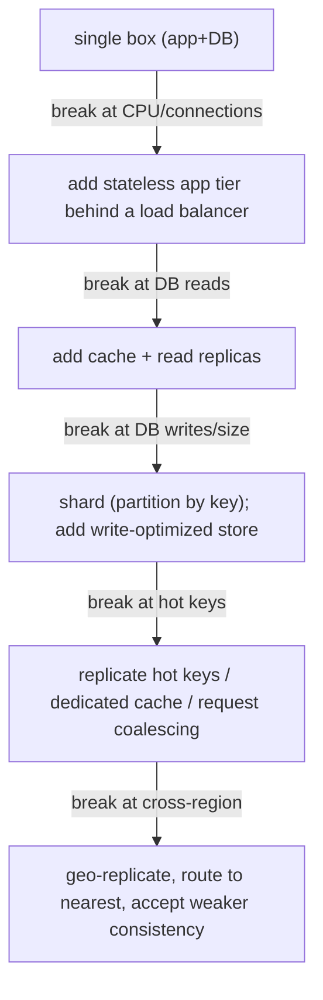

# System Design Interview Method and Scenario Playbooks

This is the meta-topic: not a single system, but the **method** for driving a system
design interview and a set of **thinking templates** for the classic prompts. The bar
at senior/staff level is not "can you name Kafka" — it is "can you drive an ambiguous
problem to a defensible design, name the trade-offs out loud, quantify with
back-of-the-envelope math, and reason about tail latency, blast radius, and operational
cost." Interviewers grade the *reasoning*, not the diagram.

Throughout, remember the two questions a strong candidate answers about *every* choice
before being asked: **what do I gain, and what do I give up** — and **when does the
alternative win.**

---

## The DRIVEN trade-off-first narrative

Interviewers hire for *judgment under ambiguity*, not recall. The failure mode that
sinks strong engineers is passivity: waiting to be told what to build, then producing a
"correct" but unmotivated design. The winning narrative is **candidate-driven**: you set
the agenda, state assumptions, propose a path, and continuously surface trade-offs.

A useful mnemonic for the loop is **DRIVEN**:

- **D**efine scope and requirements (functional + non-functional, pin the numbers).
- **R**ough estimates (QPS, storage, bandwidth, read:write ratio).
- **I**nterface and data model first (API contract, then schema).
- **V**ertical slice happy path (end-to-end high-level design).
- **E**xamine the hard part deeply (the one thing that makes this problem non-trivial).
- **N**egotiate bottlenecks, failure modes, and trade-offs (scale iteratively).

The single most important habit: **narrate trade-offs proactively.** Saying "I'll use a
CDN — I gain low read latency and origin offload, I give up strong freshness, which is
fine because thumbnails tolerate staleness" is a staff-level sentence. Saying "I'll use a
CDN" is a mid-level sentence. Same decision, different signal.

**Trade-off vs correctness:** there is rarely one right architecture. The interviewer is
probing whether you understand *why* you'd pick A over B under stated constraints, and
whether you'd change your mind under different constraints. A candidate who says "it
depends — here's what it depends on" and then *decides* beats one who is dogmatic.

---

## The structured design loop

A repeatable loop keeps you from rabbit-holing and signals that you've done this before.
The canonical order and *why the order matters*:

```
1. Scope & requirements     ~5 min   (what are we building, for whom, at what scale)
2. Back-of-envelope         ~3 min   (numbers that DRIVE the design)
3. API contract             ~3 min   (the external surface, forces you to nail scope)
4. Data model               ~3 min   (entities, access patterns → storage choice)
5. High-level design        ~8 min   (happy-path boxes-and-arrows, one vertical slice)
6. Deep dive on hard part   ~12 min  (the pivotal component; interviewer steers here)
7. Bottlenecks & scale      ~8 min   (find the first thing to break, fix iteratively)
8. Failure modes & wrap     ~5 min   (what breaks, blast radius, trade-off recap)
```

**Why API and data model come BEFORE the high-level diagram:** the API forces you to
concretely define scope (if you can't write the endpoint, you don't understand the
feature), and the data model's *access patterns* determine your storage engine. Drawing
boxes before you know the access pattern leads to picking a database by reflex ("I'll use
Postgres") instead of by requirement ("reads are 100:1, key-value by ID, need <10ms p99,
so a KV store or a cache-fronted store").

**Time-boxing** is itself a signal. Spending 20 minutes perfecting the estimation and
never reaching the deep dive reads as poor prioritization. When the interviewer steers
("let's focus on how the feed is generated"), *follow the steer* — it is the highest-value
signal you'll get about what they want to see.

**The vertical slice:** design one complete request path end-to-end before you widen.
"User posts a tweet → API GW → write service → append to DB → enqueue fanout" is a slice.
Getting one path fully working reveals the real constraints faster than sketching every
box shallowly.

---

## Scoping requirements, functional versus non-functional

**Functional requirements (FRs)** = what the system does (verbs): "post a tweet", "read
a home timeline", "shorten a URL". Nail down 3-5 core FRs and explicitly **defer** the
rest ("I'll treat search and ads as out of scope unless you want them").

**Non-functional requirements (NFRs)** = the properties that actually drive
architecture: scale (DAU, QPS, data volume), latency targets (p50/p99/p999),
availability (how many nines), consistency model, durability, and cost. **NFRs decide the
design far more than FRs do.** "Post a tweet" is easy; "post a tweet, read within 200ms
p99 for 300M DAU with 99.99% availability" is the actual problem.

Key NFR dimensions and what each *forces*:

| NFR | Question to ask | What it forces |
|---|---|---|
| Scale | DAU? peak QPS? data/day? | sharding, caching, capacity math |
| Latency | p99/p999 target? | caching, precomputation, colocation, tail-tolerance |
| Availability | 99.9 vs 99.99 vs 99.999? | replication, multi-AZ/region, failover |
| Consistency | read-your-writes? strong? | quorum, single-leader, or eventual + conflict resolution |
| Durability | can we ever lose data? | replication factor, WAL, sync vs async replication |
| Read:write ratio | which dominates? | read-optimized (cache, read replicas) vs write-optimized (LSM, log) |

**Consistency is the most abused word.** Pin it precisely: do we need *linearizability*
(single up-to-date copy, real-time ordering), *causal* consistency, *read-your-writes*,
or is *eventual* fine? Most "social" reads tolerate eventual; money and inventory usually
do not. Naming the exact guarantee is a seniority signal.

---

## Back-of-the-envelope estimation

Estimation exists to **drive decisions**, not to show arithmetic. Compute only the
numbers that change a choice: peak QPS (do we need sharding?), storage/year (one box or a
cluster?), bandwidth (CDN or not?), and working-set size (does it fit in RAM?).

**Core recipe:**

1. Start from users: DAU → actions/user/day → total actions/day.
2. Convert to average QPS: `actions/day ÷ 86,400` (≈ `÷ 100,000` for a quick estimate).
3. Apply a **peak factor** of ~2-10x average (diurnal + spikes). Design for peak.
4. Multiply by payload size for bandwidth; by retention for storage.

**Numbers worth memorizing:**

- 1 day ≈ 86,400 s ≈ 10^5 s. So **1M events/day ≈ 12 QPS** average.
- 1 QPS sustained for a year ≈ 31.5M rows/year.
- Read:write ratio: social feeds are often **100:1 to 1000:1** read-heavy.

**Worked example (Twitter-ish):** 300M DAU, each reads timeline ~10x/day, posts ~0.1x/day.
Reads: 3B/day ÷ 10^5 ≈ **30K QPS avg → ~150K QPS peak** (5x). Writes: 30M/day ≈ **350 QPS
avg → ~1.7K peak**. Read:write ≈ 100:1 → this screams **read-optimized: precompute
timelines (fanout-on-write) + heavy caching**, not read-time fanout for the common case.

**Storage example (URL shortener):** 100M new URLs/day × 500 bytes ≈ 50 GB/day ≈ 18
TB/year. That fits in a sharded KV cluster easily; the *hot read* path (billions of
redirects/day) is the real problem, so cache aggressively.

**Discipline:** round hard (300M ≈ 3×10^8), carry powers of ten, and *say what the number
means*: "150K QPS at ~1KB each is ~150 MB/s read — that's a caching and fanout problem,
not a single-DB problem." The interpretation is the point.

---

## Latency numbers every engineer should know

Jeff Dean's "latency numbers" (order-of-magnitude, updated ballparks) anchor every
"is this fast enough" judgment:

| Operation | Ballpark |
|---|---|
| L1 cache reference | ~1 ns |
| Branch mispredict | ~3 ns |
| L2 cache reference | ~4 ns |
| Mutex lock/unlock | ~17 ns |
| Main memory reference | ~100 ns |
| Compress 1KB (Zippy/Snappy) | ~2 µs |
| Read 1 MB sequentially from RAM | ~3-10 µs |
| SSD random read | ~16-100 µs |
| Read 1 MB sequentially from SSD | ~50-1000 µs |
| Round trip within same datacenter | ~0.5 ms |
| Read 1 MB sequentially from disk (HDD) | ~1-20 ms |
| Disk seek (HDD) | ~10 ms |
| Round trip CA → Netherlands → CA | ~150 ms |

**What matters for design:** memory is ~100,000x faster than a disk seek; a cross-region
round trip (~150 ms) can dominate everything else, so **you cannot make N synchronous
cross-region calls per request.** Intra-DC RTT (~0.5 ms) is why chatty microservice
fan-out multiplies latency and why you batch/parallelize. SSD random reads (~tens of µs)
made read-heavy KV stores practical at scale.

**Tail matters more than mean.** If one service call has p99 = 100 ms and a request makes
100 such calls, the probability *all* are fast is 0.99^100 ≈ 0.37 — so **~63% of requests
hit at least one slow call.** This is the core insight of "The Tail at Scale": at fan-out,
p99 of the components becomes the *median* of the aggregate. Mitigations: hedged requests
(send a second request after p95, take first response), tied requests, and reducing
fan-out.

---

## API and data model first

**Design the interface before the internals.** A crisp API contract (REST/gRPC endpoints,
request/response shapes, idempotency keys, pagination) does three things: forces exact
scope, exposes the read/write patterns, and gives the interviewer something concrete to
push on.

Good habits:

- Use **cursor/keyset pagination** (`?cursor=<opaque>&limit=50`), not `OFFSET/LIMIT`,
  for large feeds — offset pagination is O(offset) and drifts as data changes.
- Make writes **idempotent** with a client-supplied idempotency key for anything that
  causes side effects (payments, posts) so retries are safe.
- Version the API; keep responses paginated and bounded.

**Data model drives storage choice via access patterns.** Ask: what are the exact reads
and writes, what's the key, what's the cardinality, and what's the consistency need. Then
pick:

| Access pattern | Fit |
|---|---|
| Point lookup by key, huge write volume | KV / wide-column (DynamoDB, Cassandra) |
| Rich queries, joins, transactions | Relational (Postgres, Spanner) |
| Range scans by time, append-heavy | LSM-tree store, time-series DB |
| Full-text / relevance | Search index (Elasticsearch) |
| Graph traversal (who-follows-whom) | Graph DB or adjacency lists in KV |

**SQL vs NoSQL is an access-pattern decision, not a fashion one.** Relational gives you
joins, secondary indexes, and ACID transactions but is harder to shard; wide-column gives
linear write scaling and predictable point-read latency but pushes joins and consistency
into your application. Say *why*: "reads are point lookups by short_code, 1000:1
read-heavy, no joins → wide-column KV + cache; I give up ad-hoc query flexibility, which
we don't need here."

---

## Deep dive on the hard part

Every prompt has **one pivotal component** that makes it non-trivial; the interview is
really about that. Recognizing it fast is a seniority signal. Examples:

- URL shortener → the *read* path (billions of redirects) and key generation, not the
  write.
- News feed → *fanout* (how timelines are assembled) and the celebrity/hot-key problem.
- Chat → *delivery guarantees and ordering* + presence + offline sync, not message storage.
- Rate limiter → *distributed counting* accuracy vs coordination cost.
- Payments → *idempotency and exactly-once effect* under retries and partial failure.
- Uber → *geospatial indexing and matching* at low latency.
- Video → *ingest/transcode pipeline* and *delivery* (CDN), not the metadata DB.

Once identified, go **deep**: mechanism, data structures, the specific algorithm, the
failure edge cases, and the trade-off you're making. Depth on the pivotal component beats
breadth across boxes. If the interviewer steers you elsewhere, that steer *is* the hard
part they care about — follow it.

---

## Identifying bottlenecks and scaling iteratively

Don't design for 100M users on slide one. Start simple, then **find the first thing that
breaks and fix it**, narrating each step. This mirrors real evolution and shows you won't
over-engineer.

The typical scaling ladder:



**Little's Law** — `L = λ × W` (concurrency = arrival rate × latency) — is the single
most useful capacity tool. If λ = 10,000 req/s and each holds a resource for W = 20 ms,
then L = 200 concurrent in flight → size your thread pools, connection pools, and
provisioned concurrency to that, plus headroom. It also tells you that **reducing latency
reduces required concurrency** (and cost), and that a latency spike silently raises
concurrency until you exhaust pools — a common trigger for cascading failure.

**Universal Scalability Law (USL)** refines Amdahl: throughput doesn't just plateau from
serial fraction (σ), it can *decline* from **coherency/crosstalk cost (κ)** — the
O(N²) cost of nodes coordinating. This is why "just add nodes" eventually makes a system
*slower*, and why shared-nothing partitioning beats shared-state coordination at scale.

**Find bottlenecks with the USE method** (Brendan Gregg): for every resource check
**U**tilization, **S**aturation (queue depth), **E**rrors. Saturation (growing queues) is
the early-warning sign before latency explodes.

---

## Failure modes and trade-offs

Senior candidates spend real time on **what breaks and how far the damage spreads.** Key
concepts:

**Blast radius:** how much fails when one thing fails. Reduce it with **cells/shuffle
sharding** (partition customers across independent cells so one bad tenant or one failing
cell affects a fraction of users), **bulkheads** (isolate resource pools), and
**workload isolation**.

**Cascading failure and retry amplification:** a retry storm multiplies load exactly when
the system is weakest. If each client retries 3x, a struggling backend sees up to **3-4x
its normal load** at the worst moment. Defenses (from the AWS Builders' Library):
**exponential backoff + jitter** (full jitter: `sleep = random(0, min(cap, base·2^n))`),
**retry budgets / token buckets** (cap retries to e.g. 10% of requests), **circuit
breakers**, and **load shedding** (reject early to protect goodput).

**Metastable failures** (Bronson et al.): a system can enter a stable *bad* state where a
self-sustaining feedback loop (e.g., retries triggered by overload that cause more
overload) keeps it down *even after the trigger is gone.* The fix is to break the loop
(shed load, disable retries, drain queues), not to add capacity. Recognizing metastability
is a strong staff-level signal.

**Timeouts and the tail:** every remote call needs a timeout, set from the *latency
distribution* (e.g., p99.9), not a guess. Too short → false failures + retry storm; too
long → threads pile up (Little's Law) and the caller fails too.

**Static stability** (AWS): the system keeps working during a dependency failure using
only resources already provisioned — e.g., pre-scale for the failover instead of
scaling *reactively* during the event (the control plane you'd need is exactly what's
overloaded). Prefer static stability; **avoid fallbacks** to a secondary code path that's
rarely exercised and thus untested when you need it most.

**CAP/PACELC in practice:** during a partition (P) choose availability (A) or consistency
(C); but *even without partitions* (E) you trade latency (L) vs consistency (C). Spanner
chooses C (and pays L with TrueTime); Dynamo-style chooses A/L (eventual). Say which and
why for the data in question.

---

## Articulating trade-offs out loud

The differentiator between a mid-level and staff answer is **verbalized reasoning.** Make
the invisible visible:

- **Name the fork:** "There are two approaches here: fanout-on-write vs fanout-on-read."
- **State the gain and the cost:** "Fanout-on-write gives O(1) reads but O(followers)
  writes — cheap reads, expensive celebrity posts."
- **Pick and justify with the numbers:** "Reads are 100:1, so I optimize reads:
  fanout-on-write for normal users."
- **Handle the edge with a hybrid:** "For celebrities (>1M followers) I fan out on read
  and merge at query time, avoiding the write storm."
- **Say when you'd flip:** "If this were write-heavy or followers were tiny, read-time
  fanout wins."

This "gain / give-up / when-the-alternative-wins" triad, applied to every major decision,
is the single highest-leverage interview habit. It also invites collaboration: the
interviewer can push on your stated cost, which is exactly the conversation they want.

---

## The seniority signal, tail latency and blast radius and cost

What separates senior/staff from mid-level in the *same* design:

- **Tail latency, not average.** Talk p99/p999, fan-out amplification, hedged/tied
  requests, and colocating data to cut RTTs. "The mean is fine but p999 is 2s because of
  GC pauses and cold caches; here's how I'd bound it."
- **Blast radius and isolation.** Cells, shuffle sharding, bulkheads, per-tenant limits.
  "One noisy tenant shouldn't degrade everyone."
- **Operational cost and toil.** Dollar cost per million requests, storage cost of
  replication factor 3 across 3 regions, and *who gets paged.* Over-replication and
  over-provisioning are real costs.
- **Backpressure and graceful degradation.** Shed load, serve stale, degrade features
  instead of failing hard.
- **Observability by design.** What metrics/SLOs, what you'd alarm on (saturation, error
  rate, latency), how you'd debug a p999 regression.
- **Evolvability.** Schema/versioning, migrations, backward compatibility — the system
  will change.

Mid-level optimizes throughput and the happy path; senior optimizes the *distribution*,
the *failure*, and the *bill*.

---

## Common anti-patterns

The behaviors that visibly lower your signal:

- **Jumping to a solution.** Naming "Kafka + Cassandra + Redis" before scoping. Solve the
  requirement, not your favorite tech.
- **Over-engineering.** Designing multi-region active-active for a 1K-user internal tool.
  Match complexity to the stated scale; say "at this scale a single Postgres is fine —
  I'll add complexity when the numbers demand it."
- **Ignoring the interviewer's steer.** They said "focus on fanout"; you keep polishing the
  API. The steer is the rubric.
- **Silent design.** Drawing quietly for 5 minutes. Think out loud — they can only grade
  what they hear.
- **No numbers.** Hand-wavy "it'll scale" with no QPS/storage math.
- **Dogmatism.** "NoSQL is always better." Every choice has a regime where it loses.
- **Ignoring failure.** A design with no timeouts, retries-with-jitter, or failure story.
- **Boil-the-ocean breadth.** Ten shallow boxes instead of one deep, correct path.
- **Consistency hand-waving.** Saying "it's consistent" without naming the guarantee.

---

## Playbook, URL shortener

- **Nail:** the *read* path — redirects vastly outnumber creates (often 100:1+), so
  latency and cache hit rate on `GET /{code}` dominate.
- **Pivotal trade-off:** key generation. **Counter/base62 of an auto-increment ID**
  (short, dense, but leaks volume and needs a distributed counter — use a range-allocator
  or Snowflake-style ID) vs **random/hash + collision check** (no coordination, but longer
  codes or a read-before-write to detect collisions). Zookeeper/DB ranges give each host a
  block of IDs to avoid per-write coordination.
- **Deep dive:** caching redirects (CDN + Redis, cache the 301/302 — note 301 is cached by
  browsers and hurts analytics, 302 keeps control), read-heavy KV storage, and analytics
  fanout (async via a queue, never on the hot redirect path).
- **Estimation:** 100M writes/day ≈ 1.2K write QPS; reads 100x → ~120K QPS → cache-first.
- **Gotcha:** custom aliases and collisions; 7 base62 chars = 62^7 ≈ 3.5 trillion keys.

## Playbook, news feed and Twitter timeline

- **Nail:** how the home timeline is assembled and the read latency target.
- **Pivotal trade-off:** **fanout-on-write** (push: precompute each follower's timeline on
  post — O(1) reads, O(followers) writes, great for read-heavy but a "write storm" for
  celebrities) vs **fanout-on-read** (pull: merge followees' recent posts at read time —
  O(1) writes, expensive reads). Real systems use a **hybrid**: push for normal users, pull
  for celebrities (>~1M followers), merged at read.
- **Deep dive:** the **hot-key / celebrity** problem; timeline storage (per-user list in
  Redis/KV, capped to N recent); ranking; and the thundering-herd on a viral post.
- **Estimation:** shows read:write ≈ 100:1 → precompute reads.
- **Gotcha:** a celebrity with 100M followers = 100M writes per tweet if you naively push.

## Playbook, chat and WhatsApp

- **Nail:** message **delivery semantics and ordering**, presence, and offline/multi-device
  sync — not "where do messages live."
- **Pivotal trade-off:** delivery guarantee. **At-least-once + idempotent client dedup**
  (via a client message-id) is the pragmatic choice — exactly-once delivery is impossible
  over an unreliable network, so you get exactly-once *effect* through dedup. Ordering:
  per-conversation sequence numbers, not global order.
- **Deep dive:** persistent connections (**WebSocket**) and connection routing (which
  gateway holds a user's socket → a presence/routing registry); message fanout to group
  members; store-and-forward for offline users; read receipts; end-to-end encryption
  (server can't read → changes fanout and search).
- **Estimation:** billions of msgs/day; connection count (100M concurrent sockets) drives
  gateway sizing, not msg storage.
- **Gotcha:** ordering across devices; presence at scale is a fanout problem itself.

## Playbook, rate limiter

- **Nail:** the algorithm and where limits are *shared* across many nodes.
- **Pivotal trade-off:** algorithm accuracy vs cost. **Fixed window** (simple, but 2x
  burst at window edges) < **sliding window log** (exact, but stores every timestamp) ≈
  **sliding window counter** (approximate, cheap) < **token bucket / leaky bucket** (allows
  controlled bursts, standard). Distributed: a **central store (Redis) with atomic
  INCR/Lua** is accurate but adds a network hop and a coordination bottleneck; **local
  per-node limits** are fast but let total = N×limit through. Common answer: token bucket
  in Redis with atomic scripts, or local buckets with a synced global budget.
- **Deep dive:** atomicity (Lua/`INCR` + TTL), clock/skew, fail-open vs fail-closed when
  the limiter store is down (usually **fail-open** to protect availability), and returning
  `429` + `Retry-After`.
- **Gotcha:** the limiter itself must not become the bottleneck or single point of failure.

## Playbook, payment and idempotent charge

- **Nail:** **exactly-once effect** — never double-charge, even under client retries,
  network partitions, and duplicate webhooks.
- **Pivotal trade-off:** consistency over availability. Money needs **strong consistency**
  and durable, auditable state. Use a client-supplied **idempotency key** persisted with
  the first result, so retries return the original outcome instead of charging again.
- **Deep dive:** the **Saga** pattern for multi-step flows (reserve → charge → fulfill)
  with compensating actions, because a distributed **2PC** blocks on the coordinator and
  holds locks (poor availability); the **outbox pattern** + CDC for reliable
  event publishing without dual-write inconsistency; ledger/double-entry bookkeeping;
  reconciliation. State machine per payment.
- **Gotcha:** 2PC's coordinator is a SPOF and participants block holding locks if it
  crashes mid-commit — that's why high-scale payments prefer sagas + idempotency +
  reconciliation over distributed transactions.

## Playbook, Uber and geo-matching

- **Nail:** low-latency **geospatial** "find nearby drivers" and matching under high churn
  (drivers move constantly).
- **Pivotal trade-off:** spatial index. **Geohash** / **S2 cells** / **H3 hexagons** /
  quadtree — grid cells give O(1) neighbor lookup and easy sharding but have edge/boundary
  effects and uneven density; quadtrees adapt to density but rebalance cost. Cell size is a
  precision-vs-fanout trade-off.
- **Deep dive:** high-frequency location updates (every few seconds from millions of
  drivers) → a write-heavy, in-memory geo-index; matching service; supply/demand pricing;
  consistency of "is this driver still available" (a driver can be offered to two riders —
  needs a lock/lease). QuadTree rebuild vs incremental update.
- **Estimation:** location write QPS = active drivers ÷ update interval (e.g., 3M ÷ 4s =
  750K writes/s) → in-memory sharded index, not a disk DB per update.
- **Gotcha:** boundary matches across cells; hot cells (downtown at rush hour).

## Playbook, YouTube and video

- **Nail:** the **ingest → transcode → store → deliver** pipeline and CDN delivery, plus
  the read-heavy metadata/view path.
- **Pivotal trade-off:** pre-transcode to multiple bitrates/resolutions (storage cost, but
  fast adaptive-bitrate streaming via HLS/DASH) and push to **CDN** (offload origin, cut
  latency to users; give up freshness/control and pay egress). Chunked/segmented storage
  for range requests and ABR.
- **Deep dive:** async transcode pipeline (queue + workers, fan out per resolution); object
  storage (S3) for blobs, metadata DB for the catalog; CDN cache hierarchy; view-count
  aggregation (approximate + async, never a synchronous increment on the hot path);
  thumbnails.
- **Estimation:** storage dominated by video × resolutions × replication; bandwidth is the
  cost driver → CDN offload is essential.
- **Gotcha:** the upload path (resumable/chunked uploads) and long-tail cold content.

## Playbook, notification fanout

- **Nail:** reliable delivery across channels (push/email/SMS) with fanout and
  deduplication; who gets it and when.
- **Pivotal trade-off:** delivery reliability vs cost/latency. Async via a **queue** with
  at-least-once delivery + idempotent consumers; per-channel providers (APNs/FCM/SES/SNS);
  fanout to many recipients (like feed fanout — precompute vs on-demand). Rate limiting per
  user and preference/opt-out checks.
- **Deep dive:** fanout to millions (topic subscription vs per-user), retries with backoff
  to flaky providers, dedup (same event → one notification), prioritization
  (transactional vs marketing), and template rendering.
- **Gotcha:** duplicate notifications from retries; thundering herd when a broadcast fans
  out to all users at once — smooth with rate limiting and scheduling.

## Playbook, distributed job scheduler

- **Nail:** reliable, **exactly-once-effect** execution of scheduled/recurring jobs at
  scale, with no lost or duplicate runs.
- **Pivotal trade-off:** coordination. A **leader (via Raft/ZooKeeper/etcd)** assigns jobs
  (avoids duplicate execution but the leader is a scaling bottleneck) vs **partitioned
  ownership** (each worker owns a shard of jobs via consistent hashing — scales, but
  rebalancing on membership change is tricky) vs a **DB-backed queue with leases** (poll +
  atomic claim + visibility timeout, simple and durable). At-least-once + idempotent jobs is
  the practical target.
- **Deep dive:** the store (time-indexed for "due now" scans), **lease/heartbeat** so a
  crashed worker's job is reclaimed (visibility timeout), avoiding duplicate execution
  (fencing tokens), backpressure, and time-wheel vs sorted-set (Redis ZSET by run-at) for
  scheduling.
- **Gotcha:** a job runs twice if a worker is presumed dead but is actually alive
  (GC pause) — need **fencing tokens** to make the stale worker's writes fail. Clock skew
  affects "due" decisions.

## Scaling from 1K to 100M users

The "grow this" prompt tests whether you scale *incrementally by removing the current
bottleneck* rather than jumping to a mega-architecture. Narrate the ladder:

1. **1K users:** single region, single app server + single DB (vertical scaling). Simple,
   cheap, one thing to operate. This is *correct* at this scale — don't over-build.
2. **100K:** app tier is stateless → horizontal scale behind a load balancer; move sessions
   to a shared cache. DB is now the bottleneck.
3. **1M:** reads dominate → add **read replicas** and a **cache** (cache-aside). Watch for
   replication lag (read-your-writes issues) and cache stampedes.
4. **10M:** DB writes/size exceed one primary → **shard** by a good partition key (avoid
   hot shards); introduce async processing via queues; add a CDN for static/media.
5. **100M:** **multi-region** for latency and DR → geo-routing, cross-region replication,
   and an explicit consistency decision (usually eventual across regions with per-region
   strong). Cells/shuffle-sharding to bound blast radius. Now tail latency, cost, and
   operations dominate.

At each rung: **name the bottleneck (with a number), remove it, name the new one.** Point
out the *new* problems each fix introduces (replication lag, hot shards, cache
invalidation, cross-region consistency) — that awareness is the signal.

## Disagreeing and defending a choice gracefully

Interviewers often push back to see if you *reason* or *cave/dig in*. Neither extreme
scores. The move:

1. **Acknowledge the point genuinely** ("that's fair — a strong-consistency store would
   remove the read-your-writes edge case").
2. **Restate your constraint** ("given 100:1 read-heavy and a 200ms p99 target...").
3. **Quantify the trade-off** ("...strong consistency here costs a cross-region quorum
   round trip, ~150ms, blowing the budget").
4. **Offer a path or concede** ("so I'd keep eventual consistency but add read-your-writes
   via sticky routing to the primary for a user's own writes" — or "you're right, if
   correctness outranks latency here, I'd switch").

Changing your mind *for a stated reason* is a strength, not a weakness. Dogmatically
defending a choice against a valid objection, or abandoning a good design at the first
push, both lower your signal. The goal is a collaborative, evidence-based conversation —
exactly how senior engineers make real decisions.

## Common interview follow-up questions

- "What's your read:write ratio and how did that change your design?"
- "Walk me through the p99 (and p999) of a read. Where does the time go?"
- "A celebrity/hot key posts — what happens? How do you avoid a write storm or a hot
  shard?"
- "The cache/DB/region goes down — what breaks, and what's the blast radius?"
- "How do you make this write idempotent? What happens on a client retry?"
- "Why did you shard on that key? What makes a shard hot, and how do you rebalance?"
- "You have retries — how do you avoid a retry storm and metastable overload?"
- "What consistency guarantee do reads get, exactly? Read-your-writes? Linearizable?"
- "Estimate the storage and bandwidth. Does the working set fit in memory?"
- "Scale this 100x. What's the first thing that breaks?"
- "Where's the single point of failure, and how do you remove it?"
- "What would you alarm on, and how would you debug a p999 regression at 3am?"

## References

- Martin Kleppmann, *Designing Data-Intensive Applications* (O'Reilly) — replication,
  partitioning, consistency, transactions, batch/stream.
- Jeffrey Dean & Luiz André Barroso, *The Tail at Scale*, CACM 2013 — tail latency,
  hedged/tied requests.
- Jeff Dean, "Latency Numbers Every Programmer Should Know" (Numbers Everyone Should Know).
- AWS Builders' Library — *Timeouts, retries, and backoff with jitter* (Marc Brooker),
  *Static stability using Availability Zones*, *Avoiding fallback in distributed systems*,
  *Workload isolation using shuffle-sharding*, *Using load shedding to avoid overload*.
- Marc Brooker's blog — retries, exponential backoff with jitter, and consistency.
- Nathan Bronson et al., *Metastable Failures in Distributed Systems*, HotOS 2021.
- Diego Ongaro & John Ousterhout, *In Search of an Understandable Consensus Algorithm
  (Raft)*, 2014.
- Leslie Lamport, *Paxos Made Simple*, 2001.
- Corbett et al., *Spanner: Google's Globally-Distributed Database*, OSDI 2012 (TrueTime).
- Peng & Dabek, *Large-scale Incremental Processing Using Distributed Transactions and
  Notifications (Percolator)*, OSDI 2010.
- Thomson et al., *Calvin: Fast Distributed Transactions for Partitioned Database Systems*,
  SIGMOD 2012.
- DeCandia et al., *Dynamo: Amazon's Highly Available Key-value Store*, SOSP 2007.
- Brendan Gregg — the USE method (Utilization, Saturation, Errors).
- Neil Gunther — the Universal Scalability Law.
- Eric Evans, *Domain-Driven Design*; Vaughn Vernon, *Implementing DDD*.
- Sam Newman, *Building Microservices* (O'Reilly).
- Martin Fowler — martinfowler.com (CAP, sagas, CQRS, event sourcing, idempotency).
- Alex Xu, *System Design Interview* Vols. 1-2; Donne Martin, *system-design-primer*.
- Engineering blogs: Netflix, Uber, Discord, Meta, Stripe, Cloudflare.
