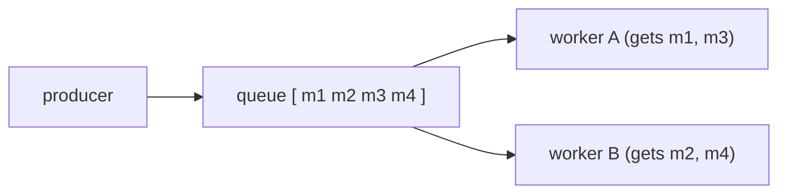
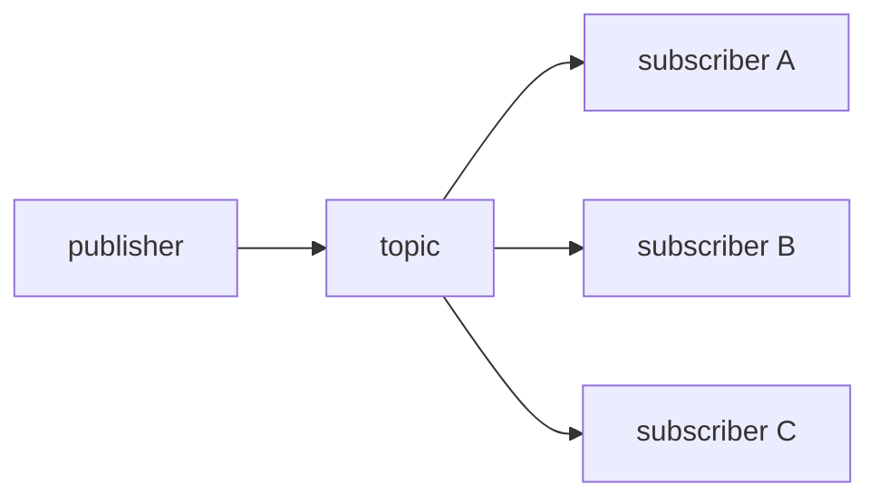
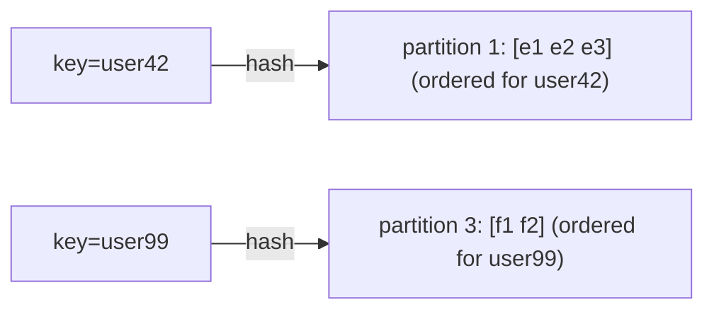

# Message Queues, Streaming and Asynchronous Processing

Asynchronous messaging is the backbone of nearly every large-scale system. It lets
you decouple producers from consumers in **time** (consumer can be down),
**space** (producer doesn't know who consumes), and **load** (a queue absorbs
bursts). But it also introduces hard problems: duplicate delivery, reordering,
lag, poison messages, and eventual-consistency reasoning. In an interview the
score is won not by naming Kafka, but by articulating *what you give up* for each
choice. This document is organized so every section ends in trade-offs.

---

## Why asynchronous messaging, and when it hurts

**Intuition.** A synchronous call (HTTP RPC) couples the caller's latency and
availability to the callee. If the callee is slow or down, the caller blocks or
fails. A message broker inserts a durable buffer between them: the producer
writes a message and moves on; the consumer processes when it can.

**What you gain**
- **Decoupling / independent scaling.** Producers and consumers scale and deploy
  independently. A checkout service can accept orders even if the email service
  is redeploying.
- **Load leveling (buffering).** A queue absorbs spikes. If traffic bursts to
  10x for 30 seconds, the queue depth grows and consumers drain it at their
  sustainable rate instead of falling over. This is the single most common
  reason to introduce a queue.
- **Resilience.** A consumer crash doesn't lose work; the message stays until
  acknowledged.
- **Fan-out.** One event can feed many independent consumers (search index,
  cache invalidation, analytics) without the producer knowing about them.

**What you give up (when async *hurts*)**
- **End-to-end latency and complexity.** You've added a network hop plus polling
  overhead. For a user staring at a spinner waiting for a result, async is worse:
  you now need a callback, websocket, or polling mechanism to return the result.
- **Harder reasoning.** You inherit eventual consistency, out-of-order delivery,
  duplicates, and "where is my message?" debugging. Distributed tracing becomes
  mandatory.
- **No natural backpressure to the user.** A synchronous 503 tells a client to
  slow down. A queue silently grows; you can accept far more than you can
  process and only discover it via lag alarms.
- **Operational burden.** A broker is a stateful, HA, disk-backed system you must
  run, patch, and capacity-plan.

**When to pick sync vs async**

| Situation | Prefer |
|---|---|
| User needs the result *now* to proceed (read a price, validate login) | Synchronous RPC |
| Work can happen later (send email, resize image, update analytics) | Async queue |
| Strong read-after-write the user observes immediately | Synchronous (or sync write + async propagation) |
| Spiky/bursty ingestion, slow downstream | Async (load leveling) |
| Simple request/response, low latency budget, small scale | Synchronous — don't add a broker prematurely |

**Anti-pattern:** using a queue to fake synchronous request/reply (producer waits
on a reply queue). You've added latency and complexity for something gRPC does
better. Only do reply-queues when the work is genuinely long-running.

---

## Queue vs pub-sub vs log-based streaming

Three fundamentally different delivery models. Confusing them is the most common
interview mistake.

**1. Point-to-point queue (work queue).** A message is delivered to *exactly one*
consumer among many competing workers. The message is *destroyed* on
acknowledgment. Used for task distribution — you want each job done once.
Examples: RabbitMQ classic queue, SQS, Celery/Sidekiq backends, ActiveMQ.



**2. Publish-subscribe.** A message is delivered to *every* subscriber. Each
subscriber gets its own copy. Used for broadcast/notification/fan-out. In classic
pub/sub (SNS, RabbitMQ fanout exchange) messages are typically transient — a
subscriber that's offline misses them (unless a durable per-subscriber queue is
attached).



**3. Log-based streaming.** Messages are appended to an ordered, immutable,
*replayable* log partitioned across brokers and **retained** (by time or size)
even after consumption. Consumers track their own **offset** (a cursor) and can
rewind/replay. Multiple independent consumer groups each read the whole log at
their own pace. This unifies queue + pub/sub: within a consumer group it's a
queue (partition assigned to one consumer); across groups it's pub/sub.
Examples: Apache Kafka, AWS Kinesis, Apache Pulsar, Redpanda, Google Pub/Sub.

```
partition 0: [o0][o1][o2][o3][o4][o5] ...  <- append only, retained 7 days
                       ^group-A offset=2   ^group-B offset=5
   consumers read by advancing a cursor; data NOT deleted on read
```

**Core differences**

| Property | Queue | Pub/Sub | Log stream |
|---|---|---|---|
| Consumption | one consumer, then deleted | all subscribers | cursor per group, retained |
| Replay history | no | usually no | yes (rewind offset) |
| Ordering | best-effort/none | none | strict per partition |
| Add new consumer later, get old data | no | no | yes (from earliest) |
| Throughput ceiling | high | high | very high (sequential disk) |
| Natural fit | task distribution | notifications | event sourcing, analytics, CDC |

**Trade-offs**
- **Queue**: simplest mental model, per-message ack/redelivery, easy DLQ. But no
  history, weak ordering, and adding a second independent consumer means
  duplicating the queue.
- **Pub/Sub**: great for broadcast, but delivery is fire-and-forget unless you
  attach durable subscriptions; slow subscribers can force message buffering.
- **Log**: replay + ordering + multi-consumer + huge throughput, at the cost of
  operational complexity, ordering-only-within-partition, and the fact that you
  manage offsets/retention yourself. Overkill for a simple "send this email" job.

Rule of thumb: **task to be done once → queue; broadcast an event → pub/sub;
event history / replay / high-throughput analytics / CDC → log.**

---

## Kafka vs RabbitMQ vs SQS-SNS vs Pulsar

The canonical "which broker" question. Answer by matching guarantees to
requirements, not popularity.

**Apache Kafka** — distributed, partitioned, replicated commit log. Consumers
pull and track offsets. Retention decoupled from consumption. Since Kafka 3.x,
KRaft mode replaces ZooKeeper (metadata in an internal Raft quorum), and tiered
storage offloads old segments to object storage (S3) so you can keep months of
data cheaply.
- Strengths: millions of msgs/sec, horizontal scale via partitions, replay,
  strong per-partition ordering, ecosystem (Connect, Streams, ksqlDB), exactly-once
  within Kafka via transactions.
- Weaknesses: ordering only within a partition; no per-message ack/redelivery or
  arbitrary per-message TTL (it's an offset log, not a task queue); no native
  priority queues; rebalancing storms; operational heft (though managed via MSK,
  Confluent Cloud).

**RabbitMQ** — traditional AMQP smart broker. Exchanges route to queues
(direct/topic/fanout/headers). Per-message acks, redelivery, TTL, priority
queues, and complex routing. Quorum queues (Raft) give HA. Streams (a
Kafka-like append log) added in 3.9+.
- Strengths: flexible routing, low latency at modest scale, per-message control,
  priorities, delayed messages, mature. Great for RPC and complex task routing.
- Weaknesses: throughput ceiling far below Kafka (tens–low hundreds of
  thousands/sec per queue); deep queues degrade performance ("queue is meant to
  be empty"); no built-in long-term replay (until Streams); mirroring/quorum has
  overhead.

**AWS SQS + SNS** — fully managed. SQS is a queue (Standard = at-least-once,
best-effort order, nearly unlimited throughput; FIFO = exactly-once processing,
strict order, 300 ops/sec or 3,000 with batching, up to 70,000/sec in
high-throughput mode). SNS is pub/sub fan-out to SQS/Lambda/HTTP/email. Common
pattern: SNS topic → multiple SQS queues (fan-out with durability).
- Strengths: zero ops, autoscaling, pay-per-use, deep AWS integration, built-in
  DLQ. Fastest path to production.
- Weaknesses: no replay (message deleted after consumption), max 14-day
  retention, 256 KB message limit, FIFO throughput caps, per-request cost adds up
  at very high volume, vendor lock-in, no consumer-group offset semantics.

**Apache Pulsar** — log + queue hybrid with a **compute/storage separation**
(brokers stateless, storage in Apache BookKeeper). Native multi-tenancy,
geo-replication, tiered storage, and four subscription modes (exclusive,
failover, shared = queue-like, key_shared). Pulsar Functions for lightweight
stream processing.
- Strengths: combines queue (shared subscription) and streaming (replay), better
  multi-tenancy and geo-replication than Kafka, independent scaling of compute
  and storage, per-message ack in shared mode.
- Weaknesses: more moving parts (brokers + BookKeeper + metadata store), smaller
  ecosystem/community than Kafka, steeper learning curve.

| Dimension | Kafka | RabbitMQ | SQS/SNS | Pulsar |
|---|---|---|---|---|
| Model | log stream | queue + routing | queue + pub/sub | log + queue |
| Peak throughput | very high (M/s) | moderate | high (Std) | very high |
| Ordering | per partition | per queue | FIFO queue only | per partition/key |
| Replay | yes | no (Streams: yes) | no | yes |
| Per-message ack | no (offset) | yes | yes | yes (shared) |
| Priority queues | no | yes | no | no |
| Ops burden | high (self) / low (MSK) | medium | none | high |
| Exactly-once | within Kafka (txn) | no (idempotency yourself) | FIFO dedup | via txn |
| Best for | event streaming, CDC, analytics | complex routing, RPC, tasks | AWS-native async, glue | multi-tenant unified platform |

**How to answer "which one?"** Tie to constraints:
- Need replay, high throughput, event sourcing, stream processing → **Kafka**.
- Need complex routing, priorities, per-message TTL, low-to-mid volume tasks,
  RPC → **RabbitMQ**.
- On AWS, want zero-ops and simple fan-out, moderate scale → **SQS/SNS**.
- Need unified queue+stream, strong multi-tenancy/geo-replication, independent
  storage scaling → **Pulsar**.
- Don't over-engineer: if you're on AWS and just need a durable task buffer, SQS
  beats standing up a Kafka cluster.

---

## Delivery semantics: at-most-once, at-least-once, exactly-once

Every messaging system sits somewhere on this spectrum, and the words are more
subtle than they look.

**At-most-once** — deliver 0 or 1 times; never redeliver. Achieved by acking
*before* processing (or fire-and-forget UDP-style). No duplicates, but messages
can be *lost* on crash. Acceptable for high-volume, low-value telemetry (metrics
samples) where a lost data point doesn't matter and you'd rather not pay for
retries. Kafka: `acks=0`, or committing offset before processing.

**At-least-once** — deliver 1 or more times; never lose. Achieved by acking
*after* processing succeeds; if the ack is lost or the consumer crashes
mid-process, the message is redelivered. This is the **default and most common**
real-world choice. Duplicates are possible, so consumers must be **idempotent**.

**Exactly-once** — each message affects the system's state once and only once.
The holy grail, and mostly a *marketing-adjacent* term. It's impossible to
guarantee end-to-end across arbitrary external systems (the "two generals"
problem: producer can't know if a message was processed if the network drops the
ack). What actually gets delivered:
- **Exactly-once *processing*** within a closed system (e.g., Kafka→Kafka) via
  transactions + idempotent producer.
- **Effectively-once** = at-least-once delivery + idempotent consumer + dedup.
  This is what practitioners mean 99% of the time.

**The key insight to state in an interview:** "There is no true end-to-end
exactly-once across heterogeneous systems. We get it *in practice* by combining
at-least-once delivery with idempotent operations and deduplication. Kafka's
'exactly-once' holds only for Kafka-to-Kafka pipelines."

**Trade-offs**

| Semantic | Duplicates | Loss | Cost/latency | Use when |
|---|---|---|---|---|
| At-most-once | no | possible | cheapest | lossy telemetry, best-effort |
| At-least-once | yes | no | moderate (retries) | default; almost everything |
| Exactly-once (txn) | no | no | highest (coordination) | financial/stateful streaming in-cluster |

Why not always exactly-once? Transactions add coordination overhead, throughput
drops (Kafka transactional writes cost latency and a transaction coordinator),
and it only works inside the transactional boundary. For most systems,
**at-least-once + idempotency is cheaper and equally correct.**

---

## How exactly-once is really achieved

Concretely, what makes "exactly-once" work in Kafka and how you replicate the
effect yourself.

**Kafka exactly-once semantics (EOS)** has two pillars:
1. **Idempotent producer** (`enable.idempotence=true`, default in modern Kafka).
   Each producer gets a Producer ID (PID) and monotonic sequence numbers per
   partition. The broker dedupes retries: if a producer retries a send after a
   lost ack, the broker sees the duplicate sequence number and drops it. This
   eliminates duplicates *from producer retries* on a single partition/session.
   Requires `acks=all`.
2. **Transactions** (`transactional.id` set, `initTransactions`,
   `beginTransaction`/`commitTransaction`). Lets a producer write to multiple
   partitions atomically, and critically supports the **consume-process-produce**
   loop: the consumer's offset commit and the produced output are in *one*
   transaction (`sendOffsetsToTransaction`). Either both commit or neither.
   Consumers set `isolation.level=read_committed` to skip aborted/uncommitted
   records.

This gives exactly-once *within Kafka* (e.g., Kafka Streams with
`processing.guarantee=exactly_once_v2`). It does **not** extend to an external DB
sink unless that sink participates in a transaction (2PC) or is made idempotent.

**Doing it yourself (effectively-once) — the practical pattern:**
1. Producer includes a stable **idempotency key** / business ID in each message
   (e.g., `order_id`, or a UUID generated at the source).
2. Consumer processes with at-least-once delivery.
3. Before applying an effect, consumer checks a **dedup store** (Redis set with
   TTL, or a unique constraint in the DB) keyed by the idempotency key.
4. The **state change and the dedup-marker write happen in the same DB
   transaction** — so a crash after applying but before marking can't cause a
   double-apply on redelivery (the unique constraint rejects it).

```
message{id=abc, op=charge $10}
  BEGIN TXN
    INSERT INTO processed(id='abc')   -- unique key; throws if seen
    UPDATE balance ...                 -- the actual effect
  COMMIT                               -- atomic: effect + dedup marker together
  then ack the message
```

**Trade-offs**
- Kafka EOS: strong guarantee, but ~10-20% throughput cost, added latency,
  transaction coordinator, and a scope limited to Kafka. Rebalances and long
  transactions can cause issues.
- DIY dedup: works across any systems, but you need a dedup store (extra
  infra/cost), a way to generate stable keys, and TTL tuning (too short → missed
  dupes; too long → unbounded storage). The dedup check adds a read per message.

---

## Idempotency and deduplication

**Idempotency** = applying the operation N times yields the same result as once.
It is the load-bearing wall of at-least-once systems. If your consumer is
idempotent, duplicate delivery is harmless and you can use the cheaper
at-least-once semantic everywhere.

**Naturally idempotent operations:** `SET status = 'shipped'` (absolute set),
`PUT` with full resource, "delete key X". **Not idempotent:** `balance = balance
+ 10` (increment), "append to list", "send email" (external side effect).

**Techniques to make things idempotent**
- **Idempotency key + dedup table.** Client supplies a unique key; server records
  it and returns the prior result on replay. Stripe's API works this way
  (`Idempotency-Key` header stored ~24h).
- **Natural/business key uniqueness.** Use a DB unique constraint on
  `(order_id)`; the second insert fails harmlessly.
- **Conditional writes / optimistic concurrency.** Compare-and-set on a version
  number; a replayed message with a stale version is rejected (also fixes
  ordering).
- **Upsert / absolute state.** Store the desired end-state, not a delta.
- **Dedup window.** SQS FIFO dedups by content hash or `MessageDeduplicationId`
  within a **5-minute** window. Kafka idempotent producer dedups per
  producer-session.

**Where to store dedup state**
- Redis SETNX with TTL — fast, cheap, but TTL means older dupes slip through and
  it's a separate failure domain.
- DB unique constraint — strongest (transactional with the effect), but adds
  write load and table growth.
- Bloom filter — space-efficient for huge key spaces, but false positives can
  drop legitimate messages (only acceptable if a rare skip is tolerable).

**Trade-offs.** Idempotency isn't free: you store keys (storage grows with
throughput × window), add a lookup per message (latency), and must pick a window
(correctness vs cost). But it lets you use at-least-once — far cheaper and simpler
than distributed transactions. For side effects with no natural key (emails), you
usually accept rare duplicates or add a dedup table keyed by (user, template,
day).

---

## Ordering and partitioning

**The reality:** global total ordering across a distributed queue is expensive
and rarely needed. What you almost always want is **ordering within a key** (all
events for one user/account/order in order), which is cheap.

**How log systems do it.** A topic is split into **partitions**. Ordering is
guaranteed *only within a partition*. The producer chooses a partition via
`hash(key) % numPartitions`, so all messages with the same key land in the same
partition and are ordered relative to each other. Different keys may interleave
across partitions — and that's fine.



**Consequences and gotchas**
- **Partition count caps consumer parallelism.** In a consumer group, a partition
  is consumed by at most one consumer, so max parallelism = partition count. Pick
  partition count for peak parallelism up front; increasing partitions later
  *rehashes keys* and breaks ordering for the transition.
- **Hot partitions / key skew.** If one key is very hot (e.g., a celebrity user),
  its partition becomes a bottleneck while others idle. Mitigate with composite
  keys, salting, or a separate stream for whales.
- **Ordering vs throughput tension.** More partitions = more parallelism but
  weaker ordering scope and more overhead. One partition = perfect order but no
  parallelism.
- **Retries break order.** If message A fails and is retried while B (same key)
  proceeds, order is violated. Fixes: `max.in.flight.requests=1` (with
  idempotence Kafka allows up to 5 and still preserves order), or route failures
  to a per-key holding area.

**SQS ordering.** Standard SQS = best-effort ordering (no guarantee). SQS FIFO =
strict order *within a message group ID* (analogous to a partition key), which is
also the parallelism unit.

**Trade-offs.** Choose the **coarsest key that still gives correct ordering**.
Ordering by `user_id` (millions of keys) parallelizes well; ordering by a single
global stream serializes everything. If you truly need global order, you accept a
single-partition bottleneck — usually a design smell; prefer per-entity ordering
plus a version number for conflict detection.

---

## Consumer groups, offsets, backpressure and consumer lag

**Consumer groups.** A group is a set of consumers that jointly consume a topic;
partitions are distributed among members so each partition goes to exactly one
consumer in the group. Add consumers to scale out (up to partition count); the
group **rebalances** partition assignments when members join/leave. Multiple
groups each get the full stream independently (pub/sub across groups).

**Offsets.** The consumer's position in each partition. Committed offsets are
stored (in Kafka, in the `__consumer_offsets` topic). On restart/rebalance,
consumers resume from the last committed offset.
- **Commit *after* processing** → at-least-once (crash before commit ⇒
  reprocess).
- **Commit *before* processing** → at-most-once (crash ⇒ skip).
- **Auto-commit** (`enable.auto.commit`, every 5s by default) is convenient but
  can commit records you haven't finished processing → silent loss. For
  correctness, commit manually after processing.

**Consumer lag** = latest produced offset − last committed consumer offset =
"how far behind am I". The single most important health metric for a streaming
consumer. Growing lag means consumers can't keep up; steady lag is fine; lag
approaching retention means **you're about to lose unprocessed data**.

**Backpressure.** Because a log broker doesn't push, a slow consumer just falls
behind (lag grows) rather than crashing — the log *is* the buffer. But downstream
of the consumer you still need backpressure: if the consumer writes to a slow DB,
it must slow its own consumption (pull fewer records, pause partitions) rather
than buffering unboundedly in memory (OOM). RabbitMQ (push-based) uses prefetch
limits (`basic.qos`) and consumer acks to bound in-flight work — the classic
backpressure knob.

**Handling lag**
- Scale out consumers (up to partition count — beyond that, add partitions).
- Increase per-consumer throughput (batching, async I/O, bigger `max.poll.records`).
- Watch out for `max.poll.interval.ms`: if a batch takes too long to process, the
  broker thinks the consumer is dead and triggers a rebalance (a "livelock"
  where slow processing causes constant rebalancing).

**Trade-offs**
- **Pull (Kafka) vs push (RabbitMQ).** Pull gives natural consumer-paced flow
  control and batching, at the cost of some latency and polling. Push gives lower
  latency but needs explicit prefetch/credit to avoid overwhelming consumers.
- **Big batches** improve throughput but raise latency and risk poll-timeout
  rebalances.
- **More consumers** cut lag only up to partition count; over-provisioning leaves
  idle consumers and more rebalance churn.

---

## Dead-letter queues, retries and poison messages

**Poison message** = a message that repeatedly fails processing (malformed
payload, references deleted data, triggers a bug). Without handling, it blocks the
queue (head-of-line blocking) or loops forever, wasting resources and potentially
never advancing.

**Retry strategy**
- **Immediate retry** — fine for transient blips (a flaky network call), but a
  tight retry loop on a persistent failure hammers the downstream and spins CPU.
- **Exponential backoff + jitter** — wait 1s, 2s, 4s... with randomization to
  avoid thundering-herd synchronization. The standard for transient failures.
- **Retry limit** — after N attempts, stop and move to a DLQ. Prevents infinite
  loops.

**Dead-letter queue (DLQ).** A separate queue where messages go after exhausting
retries (or that fail validation / exceed TTL / exceed max receive count). It
gets the poison message *out of the main flow* so healthy traffic proceeds, while
preserving it for inspection, alerting, and later reprocessing (redrive).
- SQS: set `maxReceiveCount` on a redrive policy; after that many receives, SQS
  moves the message to the DLQ. AWS added a **redrive** API to replay from DLQ.
- RabbitMQ: dead-letter exchange (DLX) via `x-dead-letter-exchange`, triggered on
  reject/nack/TTL-expiry/length-limit.
- Kafka: no native DLQ; you publish failed records to a `*.DLT` topic yourself
  (Spring Kafka, Kafka Connect error handling do this).

**Retry topic pattern (Kafka).** Non-blocking retries via tiered topics:
`main → retry-5s → retry-1m → retry-10m → DLT`. Failed records move to a
delayed-retry topic so the main topic isn't blocked (Uber described this pattern).

**Failure modes to name**
- **Head-of-line blocking**: one stuck message (especially in an ordered
  partition) blocks everything behind it. DLQ/retry-topic breaks this.
- **DLQ fills silently**: always alarm on DLQ depth > 0. A DLQ nobody watches is
  a data-loss bug in disguise.
- **Retrying non-idempotent work**: retries multiply side effects unless the
  consumer is idempotent.
- **Poison message in an ordered stream**: you can't just skip it without breaking
  order; you often must park the whole key.

**Trade-offs.** Blocking retry preserves ordering but stalls the partition.
Non-blocking (retry topic / DLQ) keeps throughput but *reorders* the failed
message relative to its siblings — acceptable only if strict per-key order isn't
required for retried messages. Aggressive retries improve success rate for
transient errors but amplify load during outages (retry storms) — cap attempts
and add circuit breakers.

---

## Fan-out patterns

Delivering one event to many consumers. Two axes: *where* the fan-out happens and
*durability*.

**1. Broker-side fan-out (pub/sub).** The broker copies to each subscriber.
- SNS → multiple SQS queues: each queue is durable and independently drained.
  This is the AWS-canonical durable fan-out. Add filter policies so each queue
  only gets relevant messages.
- Kafka: every consumer group reads the whole topic — fan-out is free and durable
  (retention), you just add groups.
- RabbitMQ fanout exchange → bound queues.

**2. Application-side fan-out.** A consumer reads one event and writes to N
places. More control (transform per target) but you own the retry/partial-failure
logic.

**Fan-out-on-write vs fan-out-on-read (feed systems).** Classic timeline problem:
- **Fan-out on write (push)**: when a user posts, write into every follower's
  inbox. Fast reads, but a celebrity with 100M followers causes a write storm
  (the "hot key" / thundering herd). 
- **Fan-out on read (pull)**: compute the timeline at read time by querying
  followees. Cheap writes, expensive reads.
- **Hybrid** (Twitter/Instagram): push for normal users, pull for celebrities,
  merge at read time. State this trade-off explicitly in feed design questions.

**Trade-offs**
- Broker fan-out (SNS→SQS, Kafka groups): durable, decoupled, easy to add
  consumers; costs storage/per-message fees × number of consumers, and each
  consumer must handle its own failures.
- App fan-out: flexible per-target logic; but partial failures (2 of 5 targets
  succeed) create consistency puzzles — prefer publishing one event and letting
  each consumer own its outcome, rather than one consumer writing to 5 systems.

---

## Batch vs stream processing

**Batch** = process a bounded, large dataset periodically (hourly/daily). High
throughput, high latency (minutes to hours). Tools: Spark, Hadoop/MapReduce, data
warehouse jobs, nightly ETL.

**Stream** = process unbounded data continuously, record-by-record or in tiny
micro-batches, low latency (ms to seconds). Tools: Kafka Streams, Flink, Spark
Structured Streaming, Kinesis Data Analytics.

| Dimension | Batch | Stream |
|---|---|---|
| Latency | high (min–hours) | low (ms–s) |
| Throughput/efficiency | very high (amortized) | good, more overhead per record |
| Complexity | simpler (bounded, reprocessable) | harder (windowing, late data, state) |
| Correctness on reprocess | easy (rerun job) | needs care (idempotent sinks) |
| Cost | cheaper per record | higher (always-on) |
| Use when | reports, training, reconciliation | fraud detection, alerts, live dashboards |

**Streaming-specific hard parts**
- **Windowing**: tumbling, sliding, session windows to bound "when is a
  computation done".
- **Event time vs processing time**: events arrive late/out of order.
  **Watermarks** decide how long to wait for stragglers — a fundamental
  latency-vs-completeness trade-off (wait longer = more complete but slower).
- **State management**: streaming aggregations need fault-tolerant state
  (checkpoints, changelogs).

**Architectures.** The **Lambda architecture** runs batch (accurate, slow) + speed
(fast, approximate) layers and merges — robust but you maintain two codebases.
The **Kappa architecture** uses a single streaming layer and *replays the log* for
reprocessing — simpler, favored today given cheap log retention and tiered
storage. Mention Kappa as the modern default when asked.

**Trade-offs.** Batch is cheaper, simpler, and trivially reprocessable — don't
stream if hourly is good enough. Stream when the business value decays in seconds
(fraud, alerting, personalization). Micro-batch (Spark) is a middle ground:
near-streaming latency with batch-like simplicity.

---

## The outbox pattern and change data capture

**The dual-write problem.** A service must update its DB *and* publish an event
(e.g., save order + emit `OrderPlaced`). If you write to the DB then publish to
Kafka as two separate steps, a crash between them leaves the system inconsistent:
DB updated but no event (lost event), or event published but DB rolled back
(phantom event). You **cannot** make a DB commit and a Kafka publish atomic
without distributed transactions (which are slow/fragile).

**Transactional outbox pattern.** Write the event into an `outbox` table *in the
same local DB transaction* as the business data. The commit is atomic (one DB, one
transaction). A separate **relay/publisher** reads the outbox table and publishes
to the broker, marking rows sent.

```
BEGIN TXN
  INSERT INTO orders(...)            -- business state
  INSERT INTO outbox(event, payload) -- event, same transaction
COMMIT                               -- atomic; both or neither

relay --> reads outbox --> publishes to Kafka --> marks/deletes row
   (publish is at-least-once; consumers dedupe by event id)
```

Two ways to run the relay:
- **Polling publisher**: periodically `SELECT ... WHERE published=false`. Simple,
  but adds DB load and polling latency.
- **CDC (Change Data Capture)**: tail the DB transaction log (MySQL binlog,
  Postgres WAL) with **Debezium** and stream row changes to Kafka. No polling, low
  latency, no app code — often you CDC the outbox table (or even the business
  tables directly). This is the modern standard.

**CDC more broadly** turns a database into a stream of change events — powering
cache invalidation, search index sync, replicas, data lake ingestion, and the
outbox relay. Debezium → Kafka Connect is the dominant stack.

**Why not just 2PC / distributed transaction?** XA/2PC across DB + broker is slow,
has blocking failure modes (coordinator crash locks resources), and many brokers
(Kafka) don't support it well. Outbox trades exactly-once *delivery* for
at-least-once + local atomicity, which is far more operable.

**Trade-offs**
- Outbox: guarantees no lost/phantom events with just local transactions; costs an
  extra table, a relay process, and at-least-once semantics downstream (consumers
  must dedupe). Ordering across aggregates needs care.
- Polling relay: dead simple, but latency + DB load.
- CDC relay: low latency, decoupled, no app change; but adds Debezium/Connect
  operational complexity and couples you to DB log format/permissions.
- The **inbox pattern** is the mirror on the consumer side: record processed
  message IDs to dedupe redeliveries.

---

## Capacity estimation and back-of-envelope

Interviewers love a quick sizing sanity check. Method: **QPS → bytes/sec →
partitions/shards → storage**.

**Worked example: ingest clickstream events.**
- 100M daily active users, 50 events/user/day = 5B events/day.
- Average QPS = 5e9 / 86,400 ≈ **58k events/sec**. Peak ≈ 3× avg ≈ **175k/sec**.
- Event size ≈ 500 bytes ⇒ write bandwidth ≈ 175k × 500 B ≈ **87 MB/s** peak;
  avg ≈ 29 MB/s.
- **Partitions**: if one partition sustains ~10 MB/s (a safe Kafka rule of
  thumb), you need ≥ 9 partitions for throughput; round up (say 32) for headroom,
  consumer parallelism, and future growth. Also bound by target consumer
  parallelism.
- **Storage**: 5e9 events × 500 B = **2.5 TB/day**. With replication factor 3 =
  **7.5 TB/day** on disk. Retain 7 days ⇒ ~52 TB (×RF). This is why **tiered
  storage to S3** matters for long retention.

**Rules of thumb to memorize**
- Peak ≈ 2–3× average for consumer traffic; higher for spiky events.
- Kafka partition: ~10 MB/s write, tens of MB/s read as a conservative planning
  number (real limits are higher on good hardware).
- SQS: Standard ~ nearly unlimited TPS; FIFO 300/s (3,000 batched), 70k/s
  high-throughput mode.
- Max in-flight SQS messages: 120,000 (Standard), 20,000 (FIFO).
- Sequential disk/network, not CPU, is usually the bottleneck for log brokers.

**Trade-off framing.** Over-provisioning partitions wastes memory (each partition
= file handles + memory) and slows rebalances; under-provisioning caps your
consumer parallelism and forces a painful repartition. Estimate for **peak
consumer parallelism**, not just throughput.

**Little's Law for queue sizing.** `L = λ × W`: the average number of items in a
system equals arrival rate × average time each spends inside. It is the fastest
back-of-envelope for async pipelines. If you receive λ = 2,000 msg/s and each
message spends W = 0.25 s in flight (processing + waiting), the steady-state
in-flight/queue depth is L = 500. Corollaries interviewers probe:
- To hold latency W constant while λ rises, you must raise service capacity so
  utilization ρ = λ / (c·μ) stays well below 1 (c = consumers, μ = per-consumer
  rate). As ρ → 1, queueing delay explodes non-linearly (M/M/1 waiting time ∝
  1/(1−ρ)) — a queue running at 95% utilization has ~20× the wait of one at 50%.
- A *steadily growing* queue (dL/dt > 0) means λ > c·μ: no buffer size saves you;
  you must add consumers/capacity or shed load. Buffering only absorbs *bursts*
  (temporary λ spikes), never a sustained deficit.
- Sizing "how many in-flight messages / how big a visibility timeout" is just
  L = λ × W with W = your p99 processing time.

---

## Retry amplification, retry budgets and metastable failures

Retries are the most common way a healthy async system tips into a self-sustaining
outage. Senior interviewers probe whether you understand *retry amplification* and
*metastability*, not just "add exponential backoff."

**Retry amplification.** Retries multiply *multiplicatively* through a call graph.
If a request traverses 3 hops and each hop retries up to 3×, a single logical
request can generate up to 3³ = **27** downstream attempts. During a partial
brownout (downstream at 50% success), every layer retries, so offered load can
spike 3–10× exactly when the system is least able to serve it. The queue makes
this worse, not better: the broker keeps accepting, so there is no fast-fail
signal, and consumers keep re-attempting poison-ish or timing-out work.

**Metastable failures.** A system has a *stable* state (serving normally) and a
*metastable* bad state where a work-amplifying feedback loop (usually retries or
cache-miss storms) sustains overload **even after the original trigger is gone**.
A brief latency blip triggers timeouts → retries → higher load → more timeouts.
Removing the trigger does not recover the system; you must *break the loop* (drain
the queue, drop retries, shed load, restart). This is why "it recovered on its own"
often does not happen with async retry pipelines. (See Bronson et al., "Metastable
Failures in Distributed Systems," HotOS 2021.)

**Retry budgets (the key mitigation).** Instead of per-request fixed retries, cap
retries as a *fraction of total traffic* — e.g., allow retries to add at most 10%
extra load (a token-bucket / adaptive budget, as in gRPC and Finagle). Under normal
conditions the budget is never exhausted; during an outage it clamps amplification
to a bounded multiplier. This converts an unbounded 27× blowup into a bounded ~1.1×.

**Discipline that keeps retries safe**
- **Retry only at one layer**, ideally the edge — not at every hop (avoid nested
  multiplication). Lower layers should fail fast and let the top retry.
- **Only retry idempotent operations**, and only *retryable* errors (timeouts, 503,
  429) — never a deterministic 400/validation error (that is a poison message).
- **Backoff + full jitter** to de-synchronize the herd; **cap total attempts**; add
  a **circuit breaker** to stop calling a downstream that is clearly down.
- **Load shedding / admission control** at the consumer so an overloaded system
  rejects work quickly rather than queueing it into a metastable spiral.

**Trade-off.** Aggressive retries raise success rate for transient blips but are
the primary cause of correlated, self-amplifying outages. Retry budgets + circuit
breakers trade a slightly lower transient success rate for a hard ceiling on
amplification — almost always the right bet at scale.

---

## Rebalance protocols, storms and mitigation

A **rebalance** reassigns partitions among consumer-group members when membership
or topic metadata changes. Done naively it is a *stop-the-world* event: the whole
group pauses consumption while partitions are redistributed. A **rebalancing storm**
is repeated rebalances that keep the group mostly paused — a top cause of runaway
lag that looks like "the consumers are up but nothing is progressing."

**The three timeouts (know them cold).**

| Setting | Meaning | Typical | Failure it detects |
|---|---|---|---|
| `heartbeat.interval.ms` | how often the consumer pings the coordinator | 3s | — (liveness signal) |
| `session.timeout.ms` | no heartbeat for this long ⇒ member declared dead | 45s | crashed/partitioned consumer |
| `max.poll.interval.ms` | max gap between `poll()` calls ⇒ member evicted | 5m | *slow processing* (livelock) |

The classic storm: a batch takes longer than `max.poll.interval.ms`, the
coordinator evicts the "dead" consumer, triggers a rebalance, the consumer rejoins,
takes too long again — forever. Heartbeats run on a *background thread* (since
KIP-62) so a slow poll does not miss heartbeats, which is exactly why the separate
`max.poll.interval.ms` exists to catch stuck processing.

**Rebalance protocols, oldest to newest**
- **Eager (stop-the-world)** — every member revokes *all* partitions, then the
  leader recomputes assignment; nobody consumes during the round. Simple, brutal.
- **Cooperative / incremental** (KIP-429, `CooperativeStickyAssignor`) — only the
  partitions that actually need to move are revoked; everything else keeps
  consuming. Turns one big pause into small, targeted moves.
- **Static membership** (KIP-345, set `group.instance.id`) — a member keeps a
  stable identity across brief restarts; if it rejoins within `session.timeout.ms`
  it reclaims its partitions with *no* rebalance at all. Ideal for rolling
  deploys of stateful stream apps.
- **Next-gen protocol** (KIP-848, Kafka 3.7+/4.0) — moves assignment logic to the
  broker and makes rebalances fully incremental and less client-heavy, further
  shrinking disruption.

**Mitigation checklist**: raise `max.poll.interval.ms` or lower `max.poll.records`
so batches finish in time; use cooperative rebalancing + static membership; avoid
autoscaling that flaps membership; keep processing off the poll thread if it can
stall.

**Trade-off.** Larger `max.poll.interval.ms` tolerates slow batches but delays
detecting a genuinely stuck consumer. Static membership speeds restarts but a
truly dead static member holds its partitions idle until `session.timeout.ms`
expires — pick the timeout to balance restart smoothness against failover speed.

---

## The log versus queue distinction at depth

Beyond "queue deletes, log retains," the deeper distinction is the **ack model**,
which drives everything else. Getting this precise separates senior answers.

**Per-message ack (queue) vs monotonic offset (log).**
- A **queue** (SQS, RabbitMQ) tracks each message individually. A consumer can ack
  message 7 while message 4 is still in flight, nack a single message for
  redelivery, or set a per-message visibility timeout. Messages are independent
  units of work.
- A **log** (Kafka) tracks a single **committed offset** per partition — a cursor.
  "I have processed up to offset N." You cannot durably mark offset 7 done while
  leaving offset 4 outstanding; committing 7 implies 0–7 are handled. Redelivery
  means *rewinding the cursor*, which reprocesses everything after it.

This single difference explains the behavioral contrasts:

| Property | Queue (per-message ack) | Log (offset cursor) |
|---|---|---|
| Redelivery granularity | just the one failed message | rewind offset ⇒ reprocess the tail |
| Selective / out-of-order ack | yes | no (one monotonic offset) |
| Head-of-line blocking | none for unordered work — other workers grab other messages | yes *within a partition* (order is the point) |
| Per-message TTL / priority / delay | native (Rabbit/SQS) | not native (offset log) |
| Redelivery of a poison message | isolated; DLQ that one message | must skip/park or it blocks the partition |
| Fan-out to N consumers | duplicate the queue | free: add consumer groups |
| Replay old data | no (deleted on ack) | yes (rewind to earlier offset) |
| Throughput ceiling | high | very high (sequential append) |

**Consequences to state in an interview**
- Queues excel at **independent, parallelizable tasks** where each unit can fail,
  retry, and be dead-lettered on its own, and *ordering does not matter*. A poison
  message inconveniences one worker, not the whole flow.
- Logs excel at **ordered event streams, replay, and multi-consumer fan-out**, but
  you inherit head-of-line blocking within a partition and coarse offset-based
  redelivery — which is precisely why retry-topic/DLQ patterns exist for Kafka.
- "Use a log as a task queue" is a common anti-pattern: you lose per-message ack,
  priorities, and cheap isolated redelivery, and one bad record can stall a
  partition. "Use a queue for event history/replay" fails because acked messages
  are gone.

---

## Schema evolution and message contracts

An underrated senior topic: the producer and consumer are decoupled in *time*, so
they are almost never running the same code version. The message **schema is the
API contract**, and evolving it wrongly is a leading cause of poison messages and
silent data corruption.

**Compatibility modes (Confluent Schema Registry terminology).**
- **Backward compatible** — new *consumer* can read data written by the old
  producer (you may add fields with defaults, remove fields). Lets you upgrade
  *consumers first*. The most common default.
- **Forward compatible** — old consumer can read data from the new producer. Lets
  you upgrade *producers first*.
- **Full** — both directions. **None** — no checks (dangerous).

**Practical rules.** Prefer a schema format with defaults and explicit field IDs
(Avro, Protobuf) over ad-hoc JSON. Never reuse a field tag/number for a new meaning;
never remove a required field; add new fields as optional with defaults. Register
schemas so an incompatible producer is *rejected at publish time* rather than
poisoning every consumer at read time.

**Why it matters for async specifically.** Because a log retains data for days, a
consumer replaying old offsets must decode *old* schema versions too — so you cannot
just "redeploy everyone at once." Retention turns schema compatibility from a
deploy-time nicety into a hard, long-lived requirement.

**Trade-off.** Strict compatibility (Full) maximizes safety but constrains how you
can change messages; looser modes move faster but risk breaking one side. A
registry with enforced compatibility is the standard way to get the safety without
manual coordination.

---

## When async messaging hurts, deeper failure modes

The counterweight to the benefits. A staff-level answer names *specifically why*
async can be the wrong choice.

- **Debugging and observability collapse.** A synchronous stack trace becomes a
  causal chain scattered across producers, brokers, and consumers over time. Without
  a propagated **correlation/trace ID** and distributed tracing, "where is my
  message and why didn't it process?" is nearly unanswerable. This tooling is
  *mandatory*, not optional, and is real cost.
- **Latency and tail latency.** You added at least one hop plus (often) poll
  intervals and batching delays. For user-facing latency-critical paths, async is
  *slower*, and end-to-end p99 is now the sum of several queue-wait distributions.
- **No natural backpressure to the client.** A synchronous 503/429 tells the caller
  to slow down immediately. A queue silently absorbs overload; you can ingest far
  more than you can process and only discover it via lag alarms — and by then the
  backlog may exceed retention (data loss) or take hours to drain.
- **Eventual consistency leaks to users.** Read-your-writes, monotonic reads, and
  causal ordering across topics all become your problem. "I placed the order but
  don't see it" is the canonical bug.
- **Ordering and exactly-once complexity** (covered above) are pure tax you would
  not pay with a single synchronous transaction.
- **Async hides failure rather than removing it.** A failed synchronous call fails
  loudly and now; a failed async message fails later, elsewhere, possibly silently
  in a DLQ nobody watches. You have traded immediate, local failure for deferred,
  distributed failure — sometimes a bad trade.

**Rule of thumb.** Reach for async when work is genuinely deferrable, load is
spiky, or you need fan-out/decoupling. If the operation is a simple, low-latency,
strongly-consistent request/response, a synchronous call plus a database is simpler,
faster, and easier to debug — don't pay the async tax for nothing.

---

## Trade-offs and when to use what

A consolidated decision guide — the payload of a system-design answer.

**Sync vs async.** Async when work can be deferred, load is spiky, or you need
decoupling/fan-out. Sync when the user needs the result immediately or the flow is
simple and low-latency. Don't add a broker "because scale" — justify it.

**Queue vs pub/sub vs log.** Task done once → queue. Broadcast → pub/sub. Replay /
history / high throughput / multiple independent consumers / CDC → log.

**Broker choice.** Kafka for high-throughput streaming/replay; RabbitMQ for
routing/priority/RPC at modest scale; SQS/SNS for zero-ops AWS-native async;
Pulsar for unified queue+stream with multi-tenancy/geo-replication.

**Delivery semantics.** Default to **at-least-once + idempotent consumers**. Use
at-most-once only for lossy telemetry. Use exactly-once (Kafka txn) only for
in-cluster stateful stream processing where duplicates are unacceptable and you
can pay the throughput cost.

**Ordering.** Order per business key via partitioning; avoid global order (it
serializes everything). Add version numbers for conflict detection.

**Consistency you expose to users.** Async ⇒ eventual consistency. If a user must
see their write immediately, either do it synchronously or read-your-writes from
the write path while the event propagates.

**Reliability building blocks.** Retries with backoff + jitter, capped; DLQ with
alarms; idempotency for safe replay; outbox for atomic publish; consumer-lag
alarms; circuit breakers to stop retry storms.

**The meta-answer:** every async design is a bet that *decoupling and buffering*
are worth *added latency, eventual consistency, and duplicate/ordering handling*.
Name that bet, and you've answered the question.

---

## Common interview follow-up questions

1. "You have at-least-once delivery. A payment charge could be processed twice.
   How do you prevent double-charging?" → idempotency key + dedup table in the
   same transaction as the charge.
2. "Kafka claims exactly-once. Is that real end-to-end?" → No; only Kafka→Kafka
   via txn + idempotent producer; external sinks need idempotency/2PC.
3. "Your consumer lag is growing. Walk me through diagnosis and fixes." → check
   producer rate spike vs consumer throughput, scale consumers up to partition
   count, add partitions, batch, watch max.poll.interval rebalances.
4. "A malformed message keeps crashing your consumer and blocks the partition.
   What do you do?" → retry with backoff, cap attempts, route to DLQ / retry
   topic, alarm on DLQ.
5. "How do you publish an event and update your DB atomically?" → transactional
   outbox + CDC (Debezium); explain why 2PC is avoided.
6. "Design a notification fan-out to 100M users." → SNS→SQS or Kafka groups; feed
   fan-out-on-write vs read vs hybrid; hot-key handling.
7. "Kafka vs SQS for this system — defend your choice." → replay/throughput/
   ordering vs zero-ops/managed; tie to constraints.
8. "How do you guarantee ordering while retrying failures?" → per-key partition,
   in-flight limits, blocking vs non-blocking retry trade-off.
9. "When would you choose RabbitMQ over Kafka?" → complex routing, priorities,
   per-message TTL, RPC, lower volume.
10. "Batch or stream for fraud detection / for daily revenue reports?" → stream vs
    batch by latency-value decay; Lambda vs Kappa.
11. "How big should your Kafka cluster be for X events/sec?" → the QPS→bandwidth→
    partitions→storage estimation above.
12. "Your DLQ has 10k messages. Now what?" → inspect, fix root cause, redrive;
    the DLQ is not a graveyard.

## References

- Alex Xu, *System Design Interview* Vol 1 & 2, and the ByteByteGo blog/newsletter
  (bytebytego.com) — messaging, notification systems, fan-out, Kafka deep dives.
- Martin Kleppmann, *Designing Data-Intensive Applications* (DDIA), Ch. 11
  "Stream Processing" and Ch. 4/5 — logs, delivery semantics, CDC, ordering.
- Apache Kafka documentation — kafka.apache.org/documentation (exactly-once,
  idempotent producer, transactions, KRaft, tiered storage).
- Confluent blog — "Exactly-once semantics in Kafka" and "Transactions in Apache
  Kafka".
- AWS docs — SQS (Standard vs FIFO, high-throughput mode, DLQ redrive, quotas),
  SNS fan-out, aws.amazon.com/sqs/features.
- Apache Pulsar docs — pulsar.apache.org (subscription modes, BookKeeper,
  geo-replication).
- RabbitMQ docs — quorum queues, streams, dead-letter exchanges, prefetch/QoS.
- Debezium documentation — CDC and the outbox pattern (debezium.io).
- microservices.io (Chris Richardson) — Transactional Outbox, Saga, CQRS patterns.
- Uber Engineering blog — "Building Reliable Reprocessing and Dead Letter Queues
  with Apache Kafka".
- Netflix / Discord / Stripe engineering blogs — Kafka usage, idempotency keys
  (Stripe API), event-driven architectures.
- system-design-primer (GitHub, donnemartin) — messaging and async sections.
- YouTube: ByteByteGo ("Kafka vs RabbitMQ", "Exactly Once"), Hussein Nasser
  (messaging/queues playlist), Gaurav Sen ("Message Queues", "Kafka"), "Jordan
  has no life" (Kafka internals, log-based streaming), System Design Interview
  channel.
