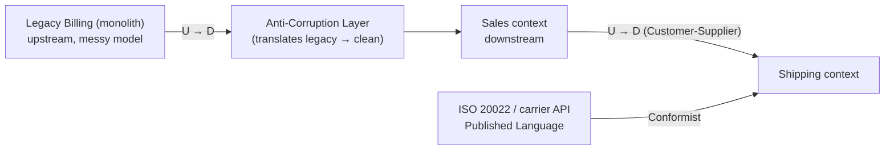
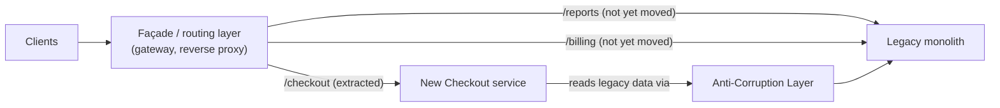
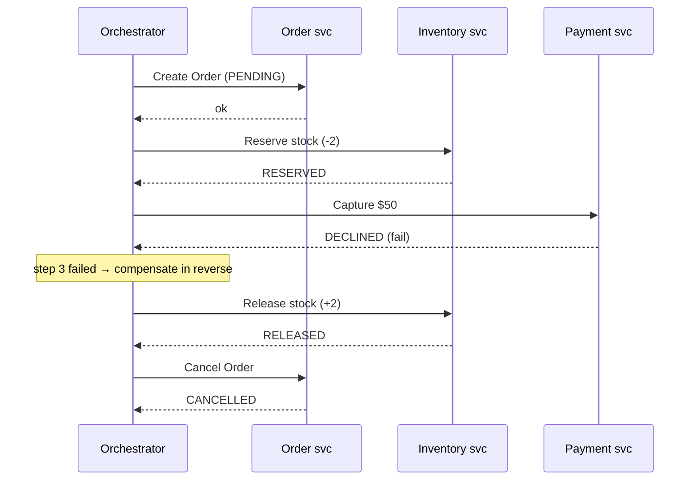

# Microservices Depth: DDD, Service Boundaries and Anti-Patterns

Microservices interviews at senior/staff level are rarely about "how do I split
a service" mechanically — they are about **where** to draw boundaries and
**why**, and about recognizing the anti-patterns that make a microservices
estate slower, more fragile, and more expensive than the monolith it replaced.
The governing truths:

- **The boundary is the design.** Get the boundary wrong and every downstream
  decision (data ownership, communication style, deployment cadence) inherits
  the error. Domain-Driven Design (DDD) is the discipline for finding boundaries
  that follow the *business*, not the *nouns*.
- **Microservices don't remove complexity; they relocate it** from the compiler
  and the process (in-process calls, ACID transactions, refactors your IDE can
  do) to the network and operations (partial failure, eventual consistency,
  distributed tracing, coordinated deploys). The relocation is worth it only
  when the *organizational* payoff — independent deploy, team autonomy, fault
  isolation, independent scaling — exceeds that tax.
- **Conway's Law is not optional.** Your architecture will end up shaped like
  your org's communication structure whether you plan for it or not. Senior
  answers treat team design and service design as the same problem.

The recurring failure mode is the **distributed monolith**: you paid the full
network + ops tax but kept the coupling, so nothing deploys independently. Most
of this topic is about avoiding that.

---

## Bounded contexts and ubiquitous language

**Intuition.** A **bounded context** is an explicit boundary (a linguistic and
model boundary) within which a particular domain model and its **ubiquitous
language** are consistent and unambiguous. The word "Customer" means one
precise thing inside the *Sales* context and a *different* thing inside the
*Support* or *Billing* context — same word, different model, different
invariants. DDD's key insight: **you cannot build one canonical model for the
whole enterprise**; attempts to do so ("the Enterprise Data Model") collapse
under the weight of contradictory requirements. Instead you build several
models, each internally consistent, and define explicitly how they translate at
the seams.

**Mechanism.** Within a bounded context there is exactly one meaning per term.
"Product" in the catalog context has description, images, SEO metadata; in the
inventory context it has SKU, warehouse location, reorder threshold; in the
pricing context it has cost basis and margin rules. Trying to merge these into
one `Product` class produces a "god object" with 80 fields, half null in any
given use case — the classic sign the boundary is wrong.

**Ubiquitous language** means code, database columns, API fields, and the way
domain experts talk all use the *same words for the same things* inside a
context. When a domain expert says "a shipment is *dispatched*," there is a
`dispatch()` method and a `Dispatched` event — not `updateStatus(3)`. This is
what makes the model a shared communication tool rather than a translation
layer engineers maintain in their heads.

**Bounded context vs microservice.** They are *not* automatically 1:1. A bounded
context is a *logical* boundary; a microservice is a *deployment* boundary. A
safe heuristic: **a service should be at most one bounded context, never
several.** One context *may* be implemented as several collaborating services
(rare, and only under real scaling pressure), but a service spanning multiple
contexts almost always becomes a distributed monolith because it entangles
independent change reasons. Start context = service; split further only when a
single context has independent scaling or team-ownership pressure.

**Trade-offs.** Rich, isolated per-context models buy you low coupling and
independent evolution, at the cost of *duplication* (the same real-world entity
is modeled several times) and *translation* at boundaries. Beginners see the
duplication and "DRY it up" into a shared model — reintroducing coupling. The
senior move is to accept deliberate duplication of *data shape* across contexts
as the price of decoupling.

---

## Aggregates, aggregate roots and the consistency boundary

**Intuition.** An **aggregate** is a cluster of domain objects (entities and
value objects) treated as a single unit for data changes, with one **aggregate
root** as the only external entry point. The aggregate is the unit of
**consistency**: its invariants must hold at the end of every transaction. The
single most important rule in this whole topic:

> **The aggregate boundary is the transaction boundary is the consistency
> boundary.** One transaction should create/modify exactly one aggregate
> instance. Everything else is eventually consistent.

**Mechanism.** External code may only reference the aggregate *root*; inner
entities are reached through it. Invariants that must be *immediately* enforced
(e.g. "order total = sum of line items," "a seat can't be double-booked") define
what belongs *inside* one aggregate. Anything that can tolerate a delay
(updating a read model, notifying shipping) crosses aggregate boundaries and is
handled asynchronously via **domain events**.

**Why "one aggregate per transaction."** If a single ACID transaction spans
multiple aggregates, those aggregates are effectively fused into a larger
consistency boundary — you've drawn the aggregate too small (or you need them in
the same one). More importantly, in a microservices world **aggregates map to
data ownership and often to services**, so a cross-aggregate transaction becomes
a cross-service distributed transaction (**2PC** — two-phase commit, where a
coordinator asks every participant to *prepare*, then *commit*, holding locks the
whole time — or a **saga**; both are covered later) — the thing you're trying to
avoid. Keeping aggregates small keeps transactions local and enables
database-per-service.

**Sizing.** Small aggregates win: lower lock contention (you lock one aggregate,
not a graph), better concurrency, cleaner service boundaries. Reference other
aggregates **by identity (ID), not by object reference** — an `Order` holds
`customerId`, not a `Customer` object. This prevents accidental large object
graphs and keeps the transactional footprint minimal. Vaughn Vernon's rules of
thumb: model true invariants in consistency boundaries, favor small aggregates,
reference by identity, use eventual consistency outside the boundary.

**Concurrency control.** Aggregates are the natural unit for **optimistic
concurrency**: a version number on the root; a concurrent modification bumps the
version and the loser retries. This is preferable to pessimistic locks across a
distributed system.

**Worked example — what's inside the boundary vs what crosses it.** Model an
order:

```
Order (aggregate root)          Customer (SEPARATE aggregate)
  id: 4711                         id: 88
  customerId: 88   ── by ID ──▶    loyaltyPoints: 1200
  status: PENDING                  tier: GOLD
  lines: [                       (owned by a different service/txn)
    OrderLine{sku:"A", qty:2, price:10.00},   ← value objects,
    OrderLine{sku:"B", qty:1, price:30.00}    ← no independent identity
  ]
  total: 50.00
  INVARIANT: total == sum(line.qty * line.price)
```

Now place an order that adds a line `{sku:"C", qty:1, price:5.00}`:

1. `order.addLine(C, 1, 5.00)` runs **inside one transaction**. The root
   recomputes `total = 2*10 + 1*30 + 1*5 = 55.00` and checks the invariant
   `55.00 == 55.00` ✓ *before commit*. If a bug produced `total = 50.00`, the
   transaction aborts — the invariant is enforced synchronously, atomically,
   within the boundary.
2. That same commit emits an `OrderLineAdded` / `OrderPlaced` domain event.
3. "Add 55 loyalty points to customer 88" is **not** part of this transaction.
   `Customer` is a different aggregate (different `customerId` reference, likely
   a different service). The loyalty update happens in a *separate* transaction
   when the Customer side consumes `OrderPlaced` — eventually consistent. If you
   tried to bump `loyaltyPoints` in the same ACID transaction as the order, you'd
   have fused two aggregates into one consistency boundary and, across services,
   turned a local commit into a distributed transaction — exactly the thing the
   rule forbids.

The `OrderLine`s live *inside* the boundary because the `total` invariant links
them; `Customer` sits *outside* it, reached only by `customerId`, and the
cross-boundary effect travels as an asynchronous event.

**Trade-offs.** Small aggregates + eventual consistency between them = high
concurrency and clean boundaries but the business must accept "the read model
lags by X ms" and you must design compensations. Large aggregates give you
strong invariants everywhere but create contention hotspots and drag unrelated
data into the same transaction/service. When a stakeholder insists two things
must be *immediately* consistent, push back: ask whether a few seconds of lag
actually violates a business rule or just feels untidy — usually it's the latter.

---

## Entities versus value objects

**Intuition.** An **entity** has an identity that persists across changes to its
attributes — `Order #4711` is the same order whether its status is `Pending` or
`Shipped`. A **value object** has *no* identity; it is defined entirely by its
attributes and is interchangeable with any other value object with the same
attributes — `Money(10, USD)`, `Address(...)`, `DateRange(...)`. Two `$10 USD`
are the same $10.

**Mechanism / consequences.**
- **Equality:** entities compare by ID; value objects compare by *all*
  attributes (structural equality).
- **Immutability:** value objects should be **immutable** — you don't change a
  `Money`, you replace it with a new one. This makes them safe to share, cache,
  and reason about, and eliminates a large class of aliasing bugs.
- **Lifecycle:** entities have a lifecycle and are tracked/persisted by ID;
  value objects are usually embedded within an entity/aggregate and have no
  independent existence.

**Why it matters for boundaries.** Value objects are where domain rules and
validation live cheaply (a `Money` enforces currency compatibility on `add()`;
an `EmailAddress` validates format on construction) — pushing invariants into
immutable value objects shrinks the surface area of your entities and keeps
aggregates focused on *identity + coordination*. Modeling something as an entity
when it's really a value object (giving `Address` a surrogate DB id and tracking
it independently) leaks accidental identity and complicates equality/merging.

**Trade-offs.** Immutable value objects allocate more (new object per change) —
in hot paths (high-frequency trading, tight loops) that allocation cost is real,
which is why languages add value types / records / structs. For the vast
majority of business software the clarity and safety dominate. The subtle error
is treating everything as an entity "to be safe with the database," which fights
the domain model.

---

## Domain events

**Intuition.** A **domain event** captures *something that happened in the
domain that domain experts care about*, named in past tense in the ubiquitous
language: `OrderPlaced`, `PaymentCaptured`, `InventoryReserved`. Domain events
are the primary mechanism for **decoupling** aggregates and bounded contexts:
one aggregate does its work and emits an event; other aggregates/contexts react
**asynchronously**, achieving eventual consistency without synchronous coupling.

**Mechanism.** An aggregate root records events as part of handling a command;
after the transaction commits, events are published. Consumers in the same or
other contexts subscribe and update their own state. This is how you honor "one
aggregate per transaction": aggregate A commits + emits `AReserved`; aggregate B
reacts and commits its own transaction later.

**Domain event vs event-carried state transfer vs integration event.**
- A **domain event** is an internal, fine-grained fact within a context.
- When published *across* context boundaries it's often called an **integration
  event**, and you deliberately shape its schema for external consumers (a
  *published language*) rather than leaking your internal model.
- **Event-carried state transfer** puts enough data in the event that consumers
  need not call back — trading larger events and data duplication for eliminating
  synchronous query coupling.

**Delivery reality.** Publishing an event and committing the aggregate must be
atomic *relative to each other*, or you get the **dual-write problem**: commit
succeeds, publish fails (or vice versa), and state diverges. The naive "just publish to the broker inside the DB
transaction" does **not** fix this: the broker is a separate system with its own
commit, so there is no atomicity spanning the DB commit and the broker
acknowledgement — either can succeed while the other fails. The correct fix is
the **transactional outbox** (see the saga/outbox subtopic), which keeps both
writes inside the *one* DB transaction, not a distributed transaction across DB
and broker. Consumers must be **idempotent** because at-least-once delivery is
the norm.

**Domain events vs event sourcing (don't conflate them).** A domain event is a
*notification*: "this fact happened," published so others can react. **Event
sourcing** is a *persistence model*: instead of storing current state in a row you
overwrite, you store the **append-only log of events** and rebuild current state
by *replaying* them (`OrderCreated → LineAdded → LineAdded → Paid` replays to the
current order). The two are related but independent choices — you can emit domain
events from a boring row-per-aggregate store (most systems do), and you can event-
source an aggregate without publishing anything externally. A senior interviewer
often probes this: event sourcing gives you a perfect audit trail and time-travel
but costs you snapshotting, schema-evolution-of-old-events, and read-model
projections; you don't need it just to get decoupling. Either way, the reliable-
publish mechanism from your commit to the outside world is the **transactional
outbox** (below), not event sourcing itself.

**Trade-offs.** Events buy loose coupling and a natural audit log, but you give
up the ability to reason about a workflow by reading one call stack — logic is
smeared across subscribers ("what actually happens when an order is placed?"
requires tracing events, not reading one method). Overusing fine-grained events
across service boundaries creates *implicit* coupling that's harder to see than
an explicit API call. Name and version events deliberately; treat cross-context
event schemas as public contracts.

---

## Context mapping and integration patterns

**Intuition.** No context lives alone; **context mapping** documents the
*relationships* between bounded contexts and the *power dynamics* between the
teams that own them. It's as much organizational as technical. Evans' catalog:

| Pattern | Relationship | When it fits | Cost / risk |
|---|---|---|---|
| **Partnership** | Two teams succeed or fail together; coordinated planning | Deeply interdependent contexts, aligned goals | High coordination; fails if goals diverge |
| **Shared Kernel** | Two contexts share a small common model/code | Small, stable overlap both teams co-own | Any change needs both teams' consent — coupling |
| **Customer-Supplier** | Downstream (customer) needs drive upstream (supplier) priorities | Upstream willing to prioritize downstream | Requires upstream goodwill/governance |
| **Conformist** | Downstream just accepts the upstream model as-is | Upstream won't budge (e.g. big vendor), overlap tolerable | You inherit upstream's model warts |
| **Anti-Corruption Layer (ACL)** | Downstream translates upstream model into its own | Upstream model is messy/legacy and you must stay clean | Translation code to build + maintain |
| **Published Language** | Well-documented shared interchange format | Many consumers, need a stable contract | Must version and govern the schema |
| **Open Host Service** | Upstream offers a defined protocol for many consumers | You're a provider to many | You commit to backward compatibility |
| **Separate Ways** | Contexts don't integrate at all | Integration cost exceeds value | Duplication accepted deliberately |

**Mechanism / how to read it.** The axis that matters most is **who depends on
whom and who has the power**. *Upstream* changes affect *downstream*; downstream
strategies (Conformist, ACL, Customer-Supplier) are your options for managing
that dependency. Choose **Conformist** when the upstream model is acceptable and
you can't influence it and translation isn't worth it; choose **ACL** when the
upstream model would corrupt yours (legacy monolith, third-party API with a
foreign model) and cleanliness is worth the translation cost.

A small context map makes the power dynamics visible at a glance — read the arrow
as "upstream (U) feeds downstream (D)," and note where the downstream defends
itself with an ACL:



Sales can't change Legacy Billing, so it wraps it in an ACL; Shipping is a
*customer* of Sales (Sales prioritizes Shipping's needs) but a *conformist* to the
external carrier standard it has no power over.

**Trade-offs.** Shared Kernel minimizes duplication but maximizes coupling — the
shared code becomes a coordination bottleneck; use it only for genuinely stable,
co-owned concepts and keep it tiny. Separate Ways looks wasteful but is often
correct when two contexts merely *seem* related. The interview trap is defaulting
to Shared Kernel ("reuse!") when Conformist or ACL would decouple the teams.

---

## Anti-corruption layer and published language

**Intuition.** An **anti-corruption layer (ACL)** is a translation/adapter layer
a downstream context builds so that a foreign or legacy upstream model **never
leaks into** its own clean model. All inbound data is translated into the
downstream's own value objects/entities at the boundary; all outbound calls are
translated back. It's the software equivalent of an airlock.

**Mechanism.** Typically façade + adapter + translator: the façade exposes the
operations the downstream needs *in its own language*; adapters call the upstream
API; translators map foreign DTOs ↔ local domain objects. Crucially, the local
domain code has **no import** of upstream types — if you deleted the ACL, only
the ACL would fail to compile.

**Published language.** The complement on the *upstream/provider* side: a
deliberately designed, versioned, documented interchange schema (e.g. a
well-specified event schema, a public API contract, an industry standard like
FHIR/ISO 20022) that many consumers integrate against. It decouples the
provider's *internal* model from what it exposes.

**Where you see it.** The Strangler Fig migration relies on an ACL between the
new services and the legacy monolith so the new code isn't poisoned by legacy
semantics. Integrations with third-party SaaS (payment gateways, shipping
carriers) almost always deserve an ACL so switching vendors touches only the ACL.

**Trade-offs.** The ACL is real code you build, test, and maintain, and it adds a
hop/latency; the payoff is that your core model stays clean and vendor/legacy
churn is contained. Skipping the ACL to "save time" is how a foreign model
metastasizes through your codebase — the classic false economy. Don't over-build
it either: an ACL for a tiny, stable upstream is gold-plating.

---

## Mapping DDD to service granularity

**Intuition.** DDD gives you a *principled* way to size services: draw service
boundaries along **bounded contexts** and **aggregates**, not along technical
layers or CRUD nouns. The chain is: subdomains → bounded contexts → (candidate)
services; aggregates → data ownership + transaction boundaries within a service.

**Mechanism / heuristics.**
- **One service ≤ one bounded context.** Never span contexts.
- A service owns **whole aggregates** — an aggregate should not be split across
  services (that would split a transaction boundary across the network).
- Prefer boundaries that make **most changes local** to one service. If a typical
  feature requires coordinated changes across three services, the boundary is
  wrong (this is the distributed-monolith smell).
- Boundaries should align with **team ownership** (Conway) and with **independent
  scaling/availability** needs.

**Subdomain types drive investment.** DDD distinguishes **core** (your
differentiator — invest, build in-house, model richly), **supporting** (needed
but not differentiating — build simply), and **generic** (auth, payments,
email — buy/adopt, don't build). Carving services along this line tells you
where to spend engineering: rich models and dedicated services for core
subdomains; off-the-shelf or a shared platform service for generic ones.

**Trade-offs.** DDD-aligned boundaries optimize for *change locality and team
autonomy*, which is usually what you want. But they can conflict with
*performance* boundaries (two contexts that must be queried together on every
request) — sometimes you co-locate for latency and accept weaker context
purity. And DDD requires real domain knowledge up front; on a green-field
system with unclear domain, premature context boundaries are guesses that ossify
into the wrong services. Hence: **start coarse (modular monolith), extract
contexts once they're proven.**

---

## Conway's Law and the inverse Conway maneuver

**Intuition.** **Conway's Law** (1968): *"organizations which design systems are
constrained to produce designs which are copies of the communication structures
of these organizations."* If four teams build a compiler, you get a four-pass
compiler. Communication paths in the org become interfaces in the software; the
architecture *will* mirror the org chart whether you intend it or not, because
the parts of the system that need cross-team communication are the parts where
coordination is expensive, so teams minimize them into APIs.

**Inverse Conway maneuver.** Since architecture follows org structure, **change
the org structure to get the architecture you want.** If you want loosely
coupled, independently deployable services, first create loosely coupled,
autonomous teams aligned to bounded contexts — the desired architecture then
emerges. Popularized by Thoughtworks/Team Topologies. This is why "reorg to
match the target architecture" precedes or accompanies serious microservice
migrations.

**Consequences for boundaries.** A service boundary that cuts *through* a team,
or a boundary that forces two teams to constantly coordinate to ship one feature,
fights Conway and generates friction and distributed-monolith coupling. The best
service boundaries are ones a **single team can own end-to-end** and change
without cross-team meetings.

**Trade-offs.** The inverse Conway maneuver is powerful but blunt: reorgs are
disruptive, and if you guess the boundaries wrong you've now baked a wrong
architecture into the org, which is *harder* to change than code. It also
assumes you know the right boundaries — which for an unclear domain you don't.
Use it when boundaries are well understood; otherwise keep teams flexible.

---

## Team topologies

**Intuition.** *Team Topologies* (Skelton & Pais) gives a vocabulary for
organizing teams so Conway's Law works *for* you. Four fundamental team types
and three interaction modes.

**Team types.**
- **Stream-aligned team:** owns a slice of the business (a bounded context /
  value stream) end-to-end — build, run, on-call. The default, majority team
  type. Maps directly to a service or small set of services.
- **Platform team:** provides internal self-service capabilities (CI/CD,
  observability, data platform, paved-road runtime) so stream-aligned teams go
  faster without deep infra expertise. Its "customers" are internal teams; it
  should expose products, not tickets.
- **Enabling team:** short-lived, coaches stream-aligned teams to adopt new
  skills/tech (e.g. "help teams learn observability"), then leaves. Reduces
  cognitive load by teaching, not doing.
- **Complicated-subsystem team:** owns a part requiring deep specialist knowledge
  (video codec, ML ranking, pricing engine) that isn't reasonable to expect every
  stream-aligned team to master.

**Interaction modes.** **Collaboration** (two teams work closely, high bandwidth,
for discovery — costly, time-box it), **X-as-a-Service** (one consumes another's
well-defined service with minimal coordination — the steady-state goal), and
**Facilitating** (enabling team helps another).

**Cognitive load** is the central metric: a team should own only as much as it
can hold in its head. When a stream-aligned team's cognitive load is too high,
you either shrink its scope, extract a complicated-subsystem team, or invest in a
platform to abstract the load away — *not* just "work harder."

**Trade-offs.** Platform teams add indirection and can become bottlenecks/ivory
towers if they build what they think teams need instead of what teams ask for
(treat the platform as a product with real adoption metrics). Too many enabling
teams and everyone's coaching instead of shipping. The topology is a tool to
manage cognitive load and coupling — not a rigid org mandate.

---

## The distributed monolith anti-pattern

**Intuition.** A **distributed monolith** is a set of services that *look* like
microservices (separate repos, separate deployments) but are so coupled they
must be built, tested, and deployed **together** to work. You pay the entire
microservices tax (network latency, partial failure, ops, tracing) and get
**none** of the benefits (independent deploy, fault isolation, team autonomy).
It is strictly worse than a well-built monolith.

**Detection — the tells.**
- **Lockstep deploys:** you can't release service A without also releasing B and
  C; a "release train" coordinates many services.
- **Shared database / shared schema:** multiple services read/write the same
  tables — the deepest form of coupling, because a schema change breaks other
  services silently.
- **Chatty synchronous call chains:** one user request fans out into a long
  synchronous chain A→B→C→D; latency and failure probability multiply.
- **Shared libraries carrying domain logic:** a common "domain" jar that, when
  bumped, forces every service to redeploy.
- **Cross-service transactions / 2PC** to keep data consistent.
- **A change to one service's API routinely requires changes in several others.**

**Failure math (why chatty sync chains are lethal).** If a request needs *N*
sequential synchronous calls each with independent availability *a*, the end-to-end
success probability is `a^N`. At `a = 99.9%` and `N = 10`, that's
`0.999^10 ≈ 99.0%` — you turned three-nines dependencies into two-nines
end-to-end. Latency adds up too: end-to-end latency ≥ sum of hop latencies, and
**tail latency is worse** — with N calls, the chance *at least one* hits its p99
is `1 - 0.99^N` (≈ 9.6% at N=10), so a request routinely experiences a slow hop.
(The `0.99` here is a different figure from the `99.9%` availability above: it's
the definitional "each call has a 1% chance of exceeding *its own* p99," i.e. the
top 1% of that call's latency distribution — not an availability number.)
This is the "tail at scale" effect: the more you fan out synchronously, the more
your typical latency approaches your dependencies' tail.

**How to avoid.** Database-per-service (no shared tables); async/event-driven
integration to break temporal coupling; boundaries that keep changes local
(DDD); consumer-driven contracts + backward-compatible versioning so services
deploy independently; API composition/read models instead of chatty chains.

**Trade-offs / nuance.** Sometimes *temporary* coupling during a migration is
acceptable (strangler fig). And the cure isn't "more services" — it's *correct
boundaries*. If you can't find boundaries that decouple, that's evidence you
should have stayed a modular monolith.

---

## Right-sizing services and the granularity trade-off

**Intuition.** Service size is a **U-shaped cost curve**. Too coarse → you're
back to a monolith's problems (large blast radius, coupled deploys, can't scale
parts independently). Too fine → distributed-monolith risk, chatty network
calls, a latency/ops tax that dwarfs the work done. The minimum of the curve is
where **change locality, team ownership, and independent scaling** are all
satisfied.

**Signals you're too fine-grained (nanoservices).**
- Services that do almost nothing but forward calls; more time in serialization
  and network than in logic.
- A single business operation requires orchestrating many services synchronously.
- You need distributed transactions to keep two services consistent (they
  probably belong together).
- Every feature touches multiple services → the boundary split a bounded context.

**Signals you're too coarse.**
- Different parts scale very differently but must scale together (you over-provision
  for the hot path).
- Unrelated teams contend on the same deploy / same codebase.
- The blast radius of a bad deploy is the whole domain.

**Heuristics for right-sizing.**
- Size by **bounded context / business capability**, not by entity or by
  technical layer.
- One service should be **ownable by one team** with acceptable cognitive load.
- Favor boundaries where **most changes are local**; measure "how many services
  does a typical feature touch?" — if it's routinely >1, rethink.
- It's cheaper to **split later** (extract from a modular monolith) than to
  **merge** wrongly-split services. Bias toward fewer, larger services early.

**Trade-offs.** Fine grain buys maximal independent scaling and deploy at the
cost of network/ops/consistency complexity; coarse grain buys simplicity and
strong local consistency at the cost of coupled scaling/deploy. There is no
universal right size — it's a function of team count, scale, and how well you
understand the domain. Amazon's "two-pizza team" heuristic sizes the *team*
(and thus, via Conway, the service) rather than the service directly.

---

## Data ownership and database-per-service

**Intuition.** The non-negotiable rule of real microservices: **each service
privately owns its data; no other service touches its database directly.** A
service's persistence is an *implementation detail* hidden behind its API/events.
The moment two services share tables, a schema change in one can break the other
and they must deploy in lockstep — a distributed monolith.

**Mechanism / patterns.** "Database-per-service" can mean a separate database
server, a separate schema, or at minimum a strictly private table set with
enforced access control. Cross-service data needs are met by:
- **API/query** to the owning service (synchronous),
- **Events** the owner publishes that others consume to build their own copy
  (asynchronous, event-carried state transfer),
- **Replicated read models** owned by the consumer.

**What you lose vs a shared DB.** No cross-service `JOIN`s. No single ACID
transaction across services. No foreign keys across boundaries. Referential
integrity becomes an *application/eventual* concern. These losses are the price
of independent deployability — and they're exactly what forces sagas, outbox,
and read models.

**Trade-offs.** Private data = independent deploy + tech choice per service
(polyglot persistence: a graph DB here, a time-series DB there) + fault
isolation. Cost: data duplication, eventual consistency, distributed queries,
and the operational burden of many databases. The frequent anti-pattern is a
"shared database with good intentions" ("we'll be disciplined") — discipline
erodes and coupling creeps back; enforce it with separate credentials/schemas,
not a wiki page.

---

## Querying across services

**Intuition.** Once data is split per service, "give me an order with its
customer name and product details" can't be one SQL join. Three canonical
patterns, each with distinct trade-offs.

One of them, **CQRS (Command Query Responsibility Segregation)**, is worth
stating plainly up front because the acronym hides a simple idea: **stop using
one model for both writes and reads.** The write side (commands) keeps the rich,
normalized aggregate that enforces invariants; the read side (queries) is one or
more *separate, purpose-built, denormalized* views shaped exactly for how they're
queried, kept up to date from the write side's events. Reads and writes now scale,
evolve, and are stored independently — the write model can be a normalized SQL
table while the read model is a flattened document in Elasticsearch. That
separation is the whole point; everything below is mechanism.

| Pattern | How | Best for | Cost / risk |
|---|---|---|---|
| **API Composition** | A composer/gateway calls each owning service and joins in memory | Simple queries, few sources, freshest data | In-memory joins don't scale; latency = slowest call; fan-out fragility; N+1 |
| **CQRS read model** | Maintain a denormalized query-side view, updated by events from owners | High read volume, complex queries, cross-service aggregation | Eventual consistency (replication lag); extra store to build/operate; dual model |
| **Data replication / duplication** | Consumer keeps its own copy of needed fields, fed by events | Consumer needs a few foreign fields on its own aggregates | Stale data; storage duplication; must handle updates/deletes |

**API Composition mechanism & math.** The composer issues parallel calls and
joins results. Latency is bounded below by the *slowest* dependency, and with N
parallel calls the probability the response includes at least one p99-slow hop is
`1 - 0.99^N`. Availability degrades multiplicatively if calls are required. It's
the simplest pattern and gives freshest data, but breaks down for large result
sets (you can't page/sort/aggregate across services in memory efficiently) and
for deep dependency graphs.

**CQRS read model mechanism.** Owners publish events; a projector consumes them
and maintains a purpose-built denormalized view (often in Elasticsearch, a
materialized SQL view, or a document store). Reads hit one optimized store — fast
and scalable — but the view is **eventually consistent** (bounded by projector
lag), so you must handle "read-your-writes" concerns (e.g. read from write side
right after a mutation, or show optimistic UI). This is the go-to for
search/reporting/dashboards spanning services.

**Trade-offs.** Composition trades scalability/tail-latency for simplicity and
freshness; CQRS trades consistency and operational complexity for read
performance and query power; replication trades storage + staleness for
eliminating the runtime cross-service call entirely. The interview mistake is
defaulting to API composition for a heavy analytical query (it melts under
fan-out) or defaulting to CQRS for a trivial two-source lookup (over-engineering).

---

## Synchronous versus asynchronous coupling and temporal coupling

**Intuition.** **Temporal coupling** = the caller and callee must both be *up and
responsive at the same instant* for the operation to succeed. Synchronous
request/response (REST, gRPC) is temporally coupled: if the downstream is down or
slow, the caller is blocked or fails. Asynchronous messaging (queues, event
streams) breaks temporal coupling: the producer emits and moves on; the consumer
processes when able. This is often more decisive for resilience than the
sync/async wire format itself.

**Mechanism / consequences.**
- **Sync chains multiply failure and latency** (`a^N` availability, additive
  latency, tail amplification) and propagate backpressure/outages upstream. A
  downstream slowdown can exhaust the caller's thread/connection pool and cascade
  — the classic **retry storm / cascading failure**, mitigated by timeouts,
  bounded retries with exponential backoff + **jitter**, circuit breakers, and
  bulkheads/workload isolation.
- **Async decouples in time**: the queue absorbs bursts (load leveling) and
  outages (messages wait). But you inherit eventual consistency, out-of-order and
  duplicate delivery (need idempotency), harder debugging (no single call stack),
  and the queue itself as a component to operate and monitor (consumer lag, and
**DLQs** — dead-letter queues, where a message lands after it fails processing
too many times so it stops blocking the queue and can be inspected later).

**Coupling dimensions to name in an interview.** *Afferent/efferent* (who
depends on whom), *temporal* (must both be up now?), *deployment* (must deploy
together?), *implementation/domain* (do they share a model?). Async messaging
targets *temporal* and, done right, *implementation* coupling; it does **not** by
itself fix bad boundaries.

**Trade-offs.** Prefer **async for cross-service state propagation and workflows**
that tolerate eventual consistency (order placed → notify, reserve, ship). Keep
**sync for genuine query/read paths** where the caller needs an immediate answer
and the operation is naturally request/response (get price, validate token). The
error at both extremes: forcing everything sync (fragile chatty chains) or
forcing everything async (a simple read becomes an event-choreography nightmare
with no straightforward way to return a result to a waiting user).

---

## Consumer-driven contract testing

**Intuition.** In microservices, end-to-end integration tests are slow, flaky,
and require deploying the whole world — they don't scale and they block
independent deployment. **Consumer-driven contract (CDC) testing** (e.g. **Pact**)
lets each consumer declare exactly the parts of a provider's API it relies on;
those expectations become a **contract** the provider verifies in *its own*
pipeline. Each side tests against the contract in isolation — no shared
environment needed.

**Mechanism.** (1) The consumer writes tests against a *mock* provider; the tool
records the request/response expectations into a **pact file**. (2) The pact is
published to a **broker**. (3) The **provider** replays every consumer's pact
against its real implementation in its pipeline; if it still satisfies them,
it's safe to deploy. Tools like Pact's **can-i-deploy** check, against the broker,
whether a given provider/consumer version pair is compatible *before* release —
this is what actually enables independent deployment safely.

**What it catches / doesn't.** It verifies the *interaction contract* (shapes,
fields, status codes the consumer actually uses) — precisely the breaking-change
surface. It does **not** verify end-to-end business behavior, performance, or
interactions the consumer didn't declare; it's a complement to, not a replacement
for, some integration/E2E and unit tests. Because it's *consumer-driven*, the
provider only guarantees what real consumers use — you can freely change fields
no one depends on.

**Trade-offs.** CDC gives fast, independent, deploy-gating verification and kills
the shared-integration-environment bottleneck, at the cost of maintaining
contracts and broker infrastructure and a discipline shift (providers must run
consumer pacts). It shines with a manageable number of internal consumers; for a
*public* API with unknown consumers, provider-driven schema + versioning is more
appropriate since you can't enumerate consumers.

---

## Schema and API versioning and safe deprecation

**Intuition.** Independent deployability requires **backward- and
forward-compatible evolution**: a new provider must not break old consumers, and
ideally a new consumer tolerates an old provider. You almost never do a
"big-bang" version bump across a fleet; you evolve **additively** and deprecate
slowly.

**Compatibility rules (the additive discipline).**
- **Backward compatible (safe):** add optional fields, add new endpoints, add new
  enum values *only if consumers ignore unknowns*, widen accepted inputs.
- **Breaking (unsafe):** remove/rename a field, change a type, make an optional
  field required, tighten validation, change semantics of an existing field,
  remove an enum value consumers rely on.
- **Tolerant Reader** (Postel's Law applied): consumers should ignore unknown
  fields and not over-validate, so providers can add fields freely. This single
  practice removes most breakage.

**Schema systems.** Protobuf/Avro encode compatibility rules: never reuse or
renumber protobuf field tags; new fields are optional; Avro readers use writer +
reader schemas with defaults for missing fields (a **schema registry** enforces
compatibility on publish). JSON has no built-in enforcement — hence tolerant
readers + CDC tests.

**Versioning strategies.** URI (`/v2/...`), header/media-type
(`Accept: application/vnd.x.v2+json`), or **no explicit version + additive
evolution** (preferred internally). Coarse `v1→v2` bumps are expensive (dual
maintenance, forced consumer migration) — reserve them for genuinely breaking
redesigns.

**Safe deprecation lifecycle.** Announce → mark deprecated (docs, `Deprecation`/
`Sunset` HTTP headers, warnings) → **measure real usage/telemetry** to find
remaining callers → migrate them (help them!) → set a sunset date → remove only
after usage hits zero. **Never remove based on a calendar alone without usage
data.** Run old and new **in parallel** ("expand/contract" or
parallel-change: add new, migrate consumers, remove old).

**Trade-offs.** Additive/tolerant evolution enables true independent deploy but
lets cruft (dead fields, zombie endpoints) accumulate — you need active
deprecation to pay that down. Hard versioning is cleaner conceptually but forces
lockstep consumer migration (a coordination cost that fights the whole point of
microservices).

---

## Idempotency key design

**Intuition.** Networks give you **at-least-once** delivery: clients retry on
timeout, brokers redeliver, so the *same logical operation can arrive multiple
times*. To make retries safe, a mutating operation must be **idempotent** —
processing the same request twice has the same effect as processing it once. An
**idempotency key** is a client-supplied unique token per logical operation
(e.g. `Idempotency-Key` header) that the server uses to deduplicate.

**Mechanism (the correct implementation).**
1. Client generates a unique key (UUID) per *logical* operation (not per retry —
   all retries of the same intent reuse the key) and sends it.
2. Server, on first receipt, atomically records the key with the operation's
   result and performs the work — ideally the key insert and the state change are
   in the **same transaction** (or use the key as a unique constraint) so there's
   no window where work happens but the key isn't recorded.
3. On a duplicate key, the server **returns the stored original result** without
   re-executing. Concurrent duplicates are serialized via a unique constraint /
   row lock so only one wins; the other returns the recorded result (or a
   "in-progress" signal).
4. Keys are retained for a **TTL** long enough to cover realistic retry windows,
   then expire.

**Worked trace — a $50 capture, deduped.** Client sends `POST /captures` with
`Idempotency-Key: abc`, amount `$50`. Dedup table starts empty.

```
t0  Req#1 (key=abc) arrives.
    INSERT INTO idempotency(key, status, result)
        VALUES('abc','in_progress', NULL)      -- succeeds (unique key)
t1  Req#2 (key=abc, the client's retry) arrives WHILE Req#1 still running.
    INSERT ... VALUES('abc', ...)  -- UNIQUE CONSTRAINT VIOLATION on 'abc'
    → Req#2 does NOT execute the capture. It reads the row, sees
      status='in_progress', and blocks/returns 409-retry.
t2  Req#1 captures $50 at the PSP, then in the SAME transaction:
    UPDATE idempotency SET status='done',
        result='{captured:$50, id:cap_9}' WHERE key='abc'   -- commit
t3  Req#2 (or a 3rd retry) re-reads row: status='done'
    → returns the STORED result {captured:$50, id:cap_9}. No second charge.
```

Net effect: the card is charged **once ($50)**, and every retry returns the
identical result. The unique constraint on `key` is what serializes the
concurrent duplicates at t1 — only one INSERT can win.

**Contrast — the buggy "work-then-record" ordering** (why the row must be written
atomically with the state change):

```
t0  Req#1 captures $50 at the PSP.        ← money moves
t1  *** process crashes before recording key 'abc' ***
t2  Req#1's retry (key=abc) arrives. Dedup table has NO row for 'abc'
    → it looks brand-new → captures ANOTHER $50.   ← DOUBLE CHARGE
```

The crash window between "did the work" and "recorded the key" is exactly the
gap that double-charges. Insert/commit the key in the *same* transaction as (or
before, as a unique-constraint claim on) the state change so no such window
exists.

**Subtle failure modes.** If you do the work first and record the key after,
a crash in between causes double execution — record atomically. If the second
call arrives *while* the first is still processing, you need a lock/"in-progress"
state, else both execute. The key must identify the *logical intent*, not the
HTTP request — a client that generates a fresh key on each retry defeats the
mechanism (the #1 real-world bug). Idempotency ≠ exactly-once *delivery* (which
is impossible in general); it's exactly-once *effect* via dedup, which is
achievable. Stripe's API is the canonical reference implementation.

**Trade-offs.** Idempotency keys add a storage/lookup on the write path and TTL
management, but they're what make at-least-once systems safe and are far simpler
than pursuing true exactly-once delivery. Natural idempotency (setting a value,
using a deterministic resource ID like `PUT /orders/{clientGeneratedId}`) is
even better when the operation allows it — no dedup store needed.

---

## The strangler fig migration

**Intuition.** Named by Fowler after the strangler fig vine that grows around a
tree and eventually replaces it: you **incrementally** carve functionality out of
a legacy monolith into new services, routing traffic to the new implementation
piece by piece, until the monolith is empty and can be removed — **without a
big-bang rewrite** (which is the highest-risk migration there is).

**Mechanism.** Put a **façade/routing layer** (API gateway, reverse proxy, or a
routing shim) in front of the monolith. For each capability you extract: build
the new service, route that capability's traffic to it (often behind a feature
flag / percentage rollout), verify (sometimes via **parallel run / dark
launch**: send to both, compare outputs, only the old one is authoritative until
trust is earned), then remove the old code path. An **anti-corruption layer**
sits between new services and the legacy model so legacy semantics don't leak.
Data is migrated incrementally, often with dual-write or CDC to keep the two
sides in sync during transition.

The façade is the whole trick: clients keep hitting one address while you move
capabilities out from behind it one at a time.



Over time more arrows flip from the monolith to new services; when the last one
flips, the monolith is dead code and you delete it.

**Why it wins over big-bang rewrite.** Continuous delivery of value; risk is
bounded per increment and reversible (flip the flag back); the business keeps
running; you learn the real boundaries as you go instead of guessing them all up
front. Big-bang rewrites notoriously overrun and often never ship while the
frozen legacy still needs changes.

**Trade-offs.** During migration you run **two systems** and the routing/sync
plumbing — more moving parts, temporary duplication, and dual-write consistency
headaches (which system is source of truth per field?). It's slower to "finish"
and requires sustained commitment (half-finished stranglers linger for years).
But the risk profile is dramatically better. Pitfall: never actually deleting the
strangled monolith code, so you carry both forever.

---

## Saga and outbox for cross-service consistency

**Intuition.** With database-per-service you can't use a single ACID transaction
or distributed 2PC (2PC **blocks** — it holds locks and stalls if the coordinator
fails, and it hurts availability, so it's avoided across services). A **saga** is
a sequence of *local* transactions, one per service, where each step publishes an
event/command triggering the next; if a step fails, previously completed steps
are undone by **compensating transactions**. It provides *eventual* consistency
and *atomicity-by-compensation*, not isolation.

**Orchestration vs choreography.**
- **Choreography:** services react to each other's events; no central brain. Loose
  coupling, but the workflow is implicit and emergent — hard to see "what the
  whole process does," and cyclic event dependencies can sneak in. Good for
  simple, few-step flows.
- **Orchestration:** a central orchestrator (state machine) tells each service
  what to do next and handles compensation. Explicit, observable, easier to
  change centrally, but the orchestrator is a coupling point and can grow into a
  god-service. Good for complex, many-step flows. (AWS Step Functions, Temporal,
  Camunda implement this.)

**No isolation → anomalies.** Because a saga isn't isolated, other transactions
can see intermediate states (lost updates, dirty reads, fuzzy reads). Mitigations:
**semantic locks** (a status like `PENDING`/`RESERVED` that flags in-progress
state), **commutative updates**, **reordering** to do the "hard to compensate"
step last, and **versioning**. Compensations must be idempotent and are
*semantic* undos (you can't un-send an email — you send an apology).

**Worked trace — order fulfillment saga, failure at step 3.** Orchestrated flow
`Create Order → Reserve Inventory → Capture Payment → Allocate Shipment`. Each
box is a *local* commit in its own service; the status column is a **semantic
lock** flagging in-progress state. Watch the state advance, fail at payment, then
unwind in reverse:

```
Step (forward)          Local commit / effect                 Saga state
──────────────────────────────────────────────────────────────────────────
1 Create Order          Order#4711 status: PENDING             Order=PENDING
2 Reserve Inventory     stock: onHand 100 → reserved +2        Inv=RESERVED
                        Order status: PENDING → RESERVED       Order=RESERVED
3 Capture Payment       PSP DECLINES card  ✗                   Payment=FAILED
──────────────────────────────────────────────────────────────────────────
   step 3 failed → orchestrator runs COMPENSATIONS in REVERSE
──────────────────────────────────────────────────────────────────────────
C3 (Payment)            nothing captured → nothing to undo     (no-op)
C2 Release Inventory    reserved −2 → onHand back to 100        Inv=RELEASED
C1 Cancel Order         Order status: RESERVED → CANCELLED      Order=CANCELLED
```

The same failure as an orchestrated sequence — forward path in solid arrows,
compensation path fired in reverse once payment declines:



Read the status transitions as one thread: `PENDING → RESERVED → CANCELLED`
(never reaches `CONFIRMED`). Key things an interviewer probes:

- Compensations fire **in reverse order** of the completed steps (undo inventory
  *before* cancelling the order), and only for steps that actually committed.
- Compensations are **semantic undos**, not rollbacks. Releasing inventory is a
  new forward transaction (reserved −2), not a DB rollback of step 2 — step 2
  already committed and its locks are long gone.
- Had the failure been at step 4 (Allocate Shipment) *after* payment captured,
  C3 would be a **refund** — you cannot "un-capture" money, so you compensate
  with an offsetting action. Then C2 (release inventory) and C1 (cancel order).
- Because there's **no isolation**, another request could observe the order in
  `RESERVED` before compensation completes — hence the semantic-lock status so
  readers know it's provisional, not final.

**The dual-write problem and the outbox.** A service must atomically (a) commit
its local state *and* (b) publish an event — but the DB and the message broker
are two systems; a crash between them diverges state. The **transactional
outbox** solves it: within the *same local DB transaction*, write the business
change **and** insert the event row into an `outbox` table. A separate relay
(polling or, better, **CDC** tailing the DB log à la Debezium) reads the outbox
and publishes to the broker **at least once**, marking rows sent. This guarantees
"event published iff state committed" without 2PC. Consumers must be **idempotent**
(at-least-once ⇒ possible duplicates). The **inbox** pattern deduplicates on the
consumer side.

**Trade-offs.** Sagas buy cross-service atomicity without distributed locks and
preserve service autonomy, at the cost of eventual consistency, no isolation
(you design around anomalies), and significant complexity in compensation logic
and failure handling. Outbox buys reliable event publishing at the cost of an
extra table + relay and at-least-once (not exactly-once) delivery. When you truly
need immediate cross-service isolation, that's a signal the two things belong in
the **same aggregate/service** — the cheapest fix is often to not split them.

---

## When a modular monolith beats microservices

**Intuition.** Microservices are an answer to *organizational and scaling*
problems, and they cost a large **operational tax**. When you don't have those
problems, a **modular monolith** — one deployable unit with strictly enforced
internal module boundaries — gives you most of the design benefits (clear
boundaries, separation of concerns, testability) with none of the distributed-
systems pain (in-process calls, ACID transactions, one thing to deploy, monitor,
and debug).

**When the modular monolith wins.**
- **Small team** (a handful of engineers): the ops tax of many services exceeds
  any autonomy benefit; you can't staff on-call for 40 services.
- **Unclear/early domain:** you don't yet know the right boundaries; a monolith's
  boundaries are cheap to move (a refactor), a microservice boundary is a network
  contract + data migration to move. Get it wrong in a monolith and you refactor;
  get it wrong in microservices and you rewrite.
- **Low/moderate scale:** you can vertically scale + replicate the monolith far
  further than most teams think; you don't need independent scaling yet.
- **You need strong consistency** across what would be service boundaries: keep
  it one ACID database.

**Evidence.** Shopify runs a massive modular monolith ("Componentization");
GitHub, Stack Overflow, and Basecamp run large monoliths. **Segment publicly
reverted** from ~140 microservices back to a monolith because per-service
overhead crushed a small team (2018). The reasonable default for most new
systems: **start with a well-structured modular monolith and extract services
only when a specific, proven pressure demands it** (a hot component that must
scale independently, a team that needs to own and deploy a slice autonomously).

**Trade-offs.** The modular monolith requires *discipline* — module boundaries
must be *enforced* (build-time module systems, architecture tests like
ArchUnit, separate schemas) or they rot into a big ball of mud, and then you have
neither clean boundaries nor independent deploy. And a single monolith still has
one deploy/blast-radius and can't mix runtimes. But "start monolith, extract
later" is far cheaper than "start microservices, merge later."

---

## The operational tax

**Intuition.** The *real* cost of microservices is not writing the services — it's
**operating** them. Every capability that was free in a monolith (one log file,
one stack trace, one transaction, one deploy) becomes a distributed-systems
problem. Underestimating this tax is the single most common reason microservice
migrations disappoint.

**What you must now build/run.**
- **Distributed tracing + context propagation:** a request spans many services;
  you need trace IDs propagated (W3C Trace Context / OpenTelemetry) to reconstruct
  "what happened" — a monolith gave you this for free in one stack trace.
- **Centralized, correlated logging + metrics** across services; per-service
  dashboards, **RED** (Rate, Errors, Duration — the request-centric view of a
  service) and **USE** (Utilization, Saturation, Errors — the resource-centric
  view of a host/queue) metrics, SLOs.
- **Deployment/CI-CD per service**, service discovery, config management, and
  **contract testing** to keep independent deploys safe.
- **Resilience machinery:** timeouts, retries with backoff+jitter, circuit
  breakers, bulkheads, rate limits — hand-built handling of partial failure that
  a monolith mostly didn't have.
- **On-call for N services**, more infra (service mesh, message brokers, N
  databases), and higher cloud/network cost (inter-service traffic, serialization).
- **Data/consistency tooling:** sagas, outbox/CDC, idempotency, read models.

**The judgment.** Adopt microservices when the **organizational benefit**
(independent deploy, team autonomy, fault isolation, independent scaling) clearly
**exceeds this tax** — typically at higher team count and scale. Below that
threshold the tax dominates and a modular monolith wins. A senior candidate
frames the microservices decision as *"can my org afford and staff this
operational tax, and do I have a problem that only it solves?"* — not as a
technical fashion choice.

**Trade-offs.** Investing in a **platform/paved road** (per Team Topologies)
amortizes the tax across many teams so stream-aligned teams don't each rebuild
tracing/CI/resilience — but the platform itself is an investment that only pays
off at sufficient scale. For a small org, the platform is unaffordable and the
tax is naked — another argument for the modular monolith until you're big enough.

---

## Worked example: one e-commerce checkout, end to end

Every section above used a throwaway example. Here is *one* system carried through
all the pieces, so bounded contexts → aggregates → data ownership → saga → read
model assemble into a single picture — the picture you'd draw on a whiteboard.

**Step 1 — Find the bounded contexts (and thus candidate services).** Talking to
the business, three subdomains fall out, each with its own ubiquitous language:

| Context | Owns (aggregate) | "Product" means | Subdomain type |
|---|---|---|---|
| **Ordering** | `Order` (+ `OrderLine` value objects) | a SKU + qty + captured price | core |
| **Payments** | `Payment` | an amount to charge | generic (buy a PSP) |
| **Inventory** | `StockItem` | a SKU + on-hand/reserved counts | supporting |

Three contexts → three services, each owning *whole* aggregates. Note "Product"
means something different in each — no shared `Product` god-object.

**Step 2 — Data ownership.** Each service owns its tables privately. Ordering has
no `stock` table; Inventory has no `orders` table. `Order` references inventory
and customer **by identity** (`sku`, `customerId`), never by object. No
cross-service JOIN, no cross-service ACID transaction, no foreign keys across the
boundary — exactly the losses `## Data ownership and database-per-service` warns
about.

**Step 3 — Place an order (the saga).** "Place order" spans all three services, so
it can't be one transaction. It's the orchestrated saga from the saga section,
with concrete numbers. Customer 88 buys 2× SKU-A @ \$10 and 1× SKU-B @ \$30 =
**\$50**:

```
Step                 Local commit (own service, own txn)        Running state
─────────────────────────────────────────────────────────────────────────────
1 Create Order       Order#4711: lines=[A×2@10, B×1@30]          Order=PENDING
                     INVARIANT total == 2*10 + 1*30 == 50 ✓
2 Reserve Inventory   SKU-A onHand 100→98 reserved+2             Inv=RESERVED
                      SKU-B onHand 40→39  reserved+1             Order=RESERVED
3 Capture Payment     PSP charges customer 88 → \$50 captured    Pay=CAPTURED
                      (idempotency key = orderId 4711, so a       Order=CONFIRMED
                       retry never double-charges — see below)
```

Happy path: `PENDING → RESERVED → CONFIRMED`. Now fail step 3 (card declined):
compensations fire in reverse — release SKU-A/SKU-B reservations (onHand back to
100/40), cancel Order → `CANCELLED`. Money never moved, so payment compensation
is a no-op; had the decline happened *after* capture, compensation would be a
**refund** (semantic undo), never a DB rollback.

**Step 4 — Idempotency on the money step.** Payment uses `orderId 4711` as the
idempotency key. If the orchestrator times out and retries "Capture \$50," the
Payments service sees key `4711` already `done` and returns the stored
`{captured:$50}` — the card is charged **exactly once** even though the request
arrived twice. This is the mechanism from `## Idempotency key design`, applied.

**Step 5 — Reliable events (outbox).** When Ordering commits `Order#4711
CONFIRMED`, it inserts an `OrderConfirmed` row into its **outbox** table *in the
same local transaction*. A relay publishes it at-least-once. No dual-write: the
event exists if and only if the order committed.

**Step 6 — Query across services (CQRS read model).** The "My Orders" page needs
order status + product names + shipping ETA — data owned by three services. Rather
than fan out on every page load (API composition, fragile at scale), a projector
consumes `OrderConfirmed`, `InventoryReserved`, etc. and maintains one
denormalized `order_summary` document. The page reads that single store — fast —
accepting that it lags the write side by projector latency (eventual consistency).

**Step 7 — Conway.** Three stream-aligned teams — Ordering, Payments, Inventory —
each own one context end-to-end (build, deploy, on-call). A feature like "gift
wrapping" lives inside Ordering and ships without a cross-team meeting. That local
change is the signal the boundaries are right.

> [!KEY-TAKEAWAY]
> The through-line: **aggregate = transaction boundary** (step 1), **aggregate ≈
> service = data owner** (step 2), **cross-aggregate consistency = saga +
> compensation** (step 3), **safe retries = idempotency** (step 4), **reliable
> publish = outbox** (step 5), **cross-service reads = CQRS read model** (step 6),
> **one team per context = Conway** (step 7). Every abstract section is one move in
> this one game.

## Common interview follow-up questions

- "You have `Order` and `Payment`. Do they belong in one service or two? Walk me
  through how DDD (aggregates, bounded contexts, transaction boundaries) drives
  the decision, and what changes if they must be immediately consistent."
- "A request fans out synchronously across 10 services at 99.9% availability each.
  What's the end-to-end availability, and how would you improve it?"
- "How do you serve a query that needs data from three services? Compare API
  composition vs CQRS read model vs replication and pick one for a search page."
- "Your team wants to split the monolith into 30 services. What questions do you
  ask first, and when would you push back toward a modular monolith?"
- "How do you deploy service A independently when service B depends on its API?
  Explain consumer-driven contracts and backward-compatible evolution."
- "Explain the transactional outbox. Why not just publish to Kafka inside the DB
  transaction? What delivery guarantee do you end up with?"
- "Design idempotent payment capture. Where exactly do you store the idempotency
  key relative to the state change, and what breaks if you get the ordering wrong?"
- "Choreography vs orchestration saga for a 6-step order fulfillment flow — which
  and why? How do you handle a failure at step 4?"
- "How do you detect that you've built a distributed monolith, and what's your
  remediation order?"
- "Why is 2PC avoided across microservices? What exactly does it block on?"
- "What is the inverse Conway maneuver and when would you actually reorg to get an
  architecture?"

## References

- Eric Evans, *Domain-Driven Design: Tackling Complexity in the Heart of
  Software* (2003) — bounded contexts, aggregates, context mapping, ubiquitous
  language.
- Vaughn Vernon, *Implementing Domain-Driven Design* (2013) and *Domain-Driven
  Design Distilled* (2016) — aggregate design rules, aggregates by identity.
- Sam Newman, *Building Microservices* (2nd ed., 2021) and *Monolith to
  Microservices* (2019) — boundaries, database-per-service, strangler fig.
- Chris Richardson, *Microservices Patterns* (2018) and microservices.io —
  saga, transactional outbox, API composition, CQRS, database-per-service.
- Martin Fowler, martinfowler.com — StranglerFigApplication, BoundedContext,
  MonolithFirst, MicroservicePremium, Tolerant Reader, CQRS.
- Melvin Conway, "How Do Committees Invent?" (1968) — Conway's Law.
- Matthew Skelton & Manuel Pais, *Team Topologies* (2019) — team types,
  interaction modes, cognitive load, inverse Conway maneuver.
- Martin Kleppmann, *Designing Data-Intensive Applications* (2017) — dual-write
  problem, delivery guarantees, encoding/schema evolution, 2PC blocking.
- Jeffrey Dean & Luiz Barroso, "The Tail at Scale," CACM (2013) — fan-out tail
  latency amplification.
- AWS Builders' Library — "Timeouts, retries, and backoff with jitter,"
  "Avoiding fallback in distributed systems," workload isolation / static
  stability.
- Stripe API docs — idempotency keys reference design.
- Debezium / Confluent — Change Data Capture and the outbox pattern.
- Pact (pact.io) — consumer-driven contract testing, broker, can-i-deploy.
- Segment engineering blog, "Goodbye Microservices" (2018); Shopify engineering,
  "Deconstructing the Monolith / Componentization."
