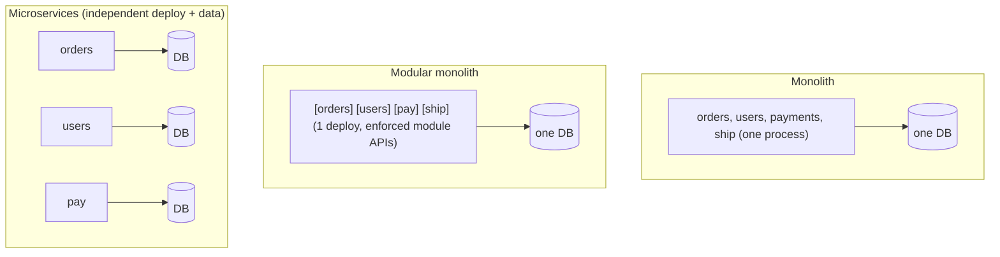
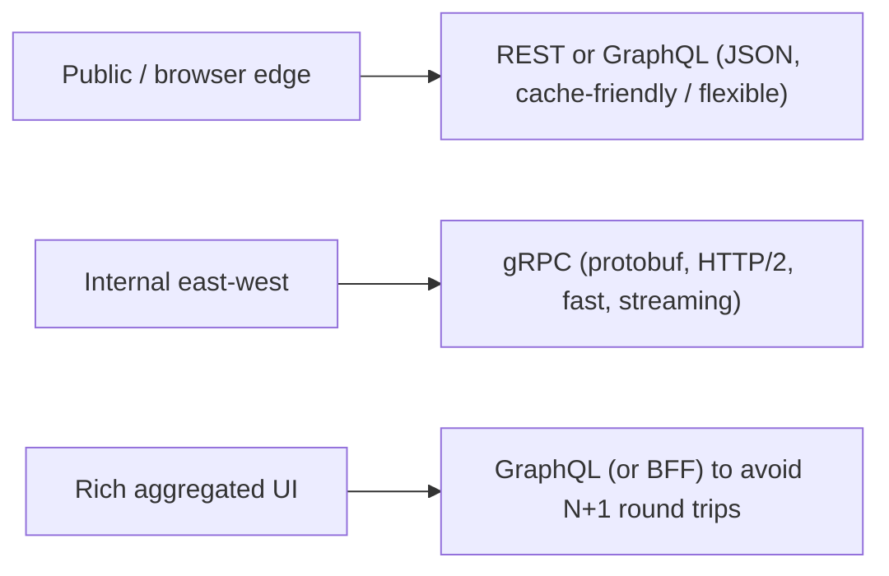
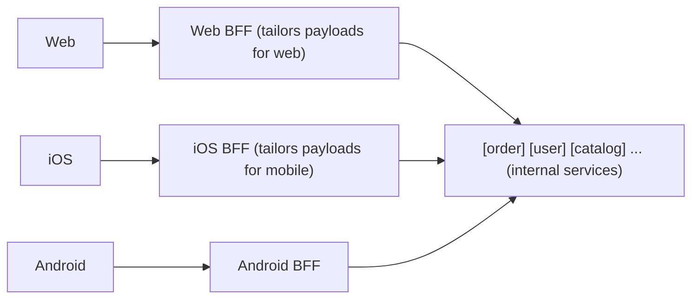
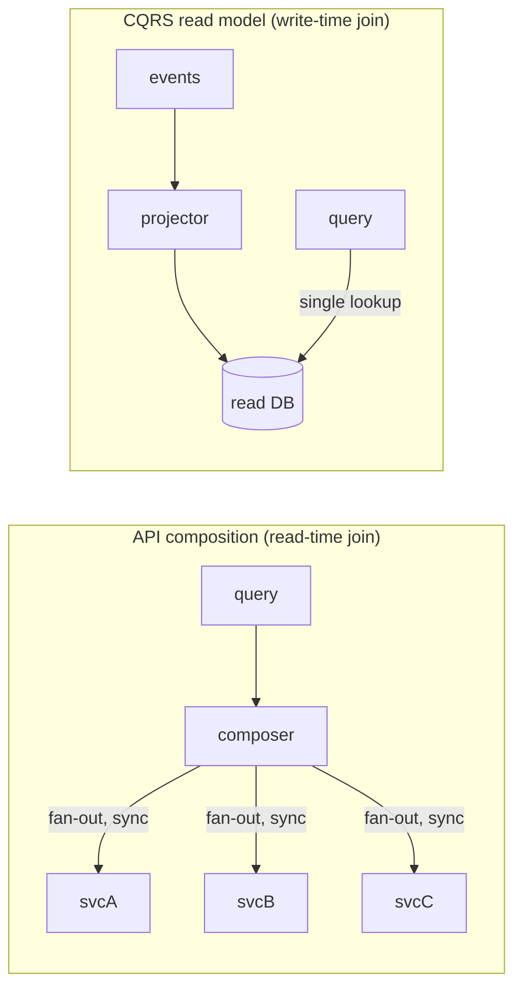
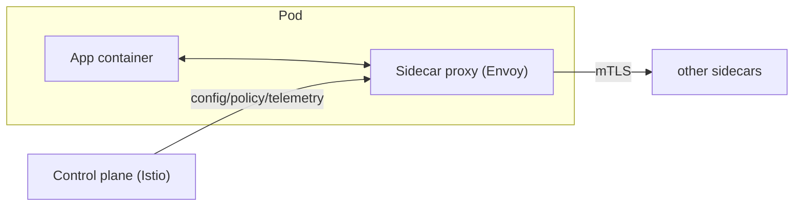
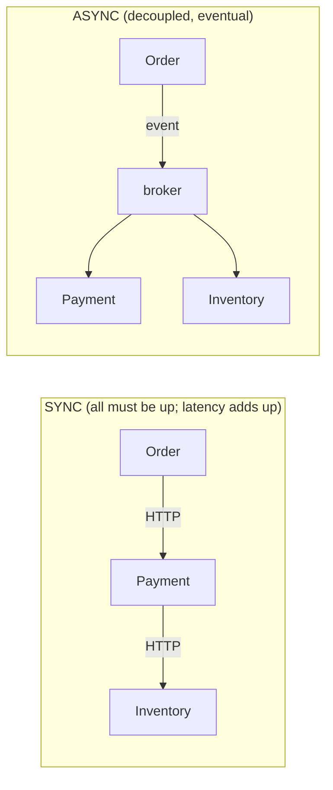

# Microservices, Monolith and API Design

This topic is about **how you slice a system into deployable units and how those
units talk to each other and to clients**. In interviews it shows up two ways:
(1) an explicit "monolith vs microservices, how would you decompose this?"
question, and (2) implicitly inside every product design ("how do the order
service and the payment service communicate?"). The single most valuable skill
here is **articulating trade-offs**: microservices are not "better" than a
monolith — they move complexity from one place (a large codebase) to another
(the network and operations). A senior answer names what you *gain*, what you
*give up*, and *when* the swap is worth it.

> Conway's Law is the backbone of this whole topic: *"organizations design
> systems that mirror their own communication structure."* Architecture is a
> people problem as much as a technical one. Service boundaries that fight your
> org chart create constant cross-team coordination; boundaries that match it
> let teams ship independently. Many microservice migrations are really
> **org-scaling** moves disguised as technical ones.

---

## Monolith vs microservices vs modular monolith

**Intuition.** A **monolith** is one deployable unit: one codebase, one build,
one process (possibly many replicas behind a load balancer), usually one
database. **Microservices** split the system into many small, independently
deployable services, each owning its own data. A **modular monolith** is the
underrated middle ground: one deployable unit, but with strictly enforced
internal module boundaries (clear interfaces, no reaching into another module's
tables) so it *could* be split later.



**How it works / what changes.** The defining property of microservices is
**independent deployability**, and the enabler of that is **database-per-service**
(private data — no other service reads your tables directly). If services share
a database, you have a *distributed monolith*: the operational cost of
microservices with none of the benefits. In a monolith, module A calls module B
with an in-process function call (nanoseconds, reliable, transactional). In
microservices, that same call becomes a network hop (milliseconds, can fail,
no shared transaction) — this is the **distributed-systems tax**.

**Real-world usage.** Amazon, Netflix, and Uber famously run thousands of
services — but all three *started* as monoliths and split under scaling
pressure. Shopify, GitHub, and Stack Overflow run enormous, successful
**(modular) monoliths** to this day. Shopify explicitly moved to a *modular
monolith* ("Componentization") rather than microservices. Segment famously
**went back** from microservices to a monolith (2018/2020) because the
operational overhead of ~140 services for a small team was crushing.

**Capacity / cost intuition.** Microservices multiply your operational surface:
N services means N pipelines, N dashboards, N on-call runbooks, N sets of
dependencies to patch. A 3-service system is manageable; a 300-service system
needs a platform team, service mesh, centralized tracing, and a service
catalog. Rule of thumb: the operational overhead of microservices only pays off
when you have **enough teams that coordinating deploys in a monolith has become
the bottleneck** (often cited around Amazon's "two-pizza team" per service).

**TRADE-OFFS (the heart of the topic).**

| Dimension | Monolith | Modular monolith | Microservices |
|---|---|---|---|
| Deploy independence | None (all-or-nothing) | None (still 1 deploy) | High (per service) |
| Team scale | Poor past ~1-2 teams | Good to several teams | Best for many teams |
| Runtime latency | Best (in-process) | Best (in-process) | Worse (network hops) |
| Consistency | Easy (ACID txns) | Easy (ACID txns) | Hard (eventual, sagas) |
| Fault isolation | Poor (one bug -> whole app) | Poor (same process) | Good (blast radius per svc) |
| Operational complexity | Low | Low | High (mesh, tracing, CI/CD) |
| Tech heterogeneity | One stack | One stack | Per-service stack |
| Refactoring boundaries | Easy (compiler helps) | Easy | Hard (network contract) |
| Onboarding / debugging | Easy (one repo, one trace) | Moderate | Hard (distributed traces) |

**When to pick what.**
- **Start with a (modular) monolith** for a new product/startup: you don't yet
  know the right boundaries, and refactoring a module boundary is a compiler
  refactor, not a cross-service migration. "You must be this tall to ride
  microservices" (Martin Fowler's *Monolith First*).
- **Move to microservices** when: many teams block on each other's deploys,
  different components have wildly different scaling profiles (e.g. a
  CPU-heavy transcoder vs a light metadata API), or you need independent
  fault isolation / independent tech stacks.
- **Modular monolith** is the best default in 2024-2025 thinking: you get most
  of the boundary discipline of microservices with none of the network tax, and
  a clean seam to extract a service later (**strangler fig** — stand up the new
  service and route new traffic to it while the old code still serves the rest,
  migrating incrementally until the old path is "strangled" and deleted).

---

## Service boundaries and Domain-Driven Design

**Intuition.** The hardest part of microservices is *where to cut*. Cut wrong
and you get chatty, tightly-coupled services that must deploy together — a
distributed monolith. The guiding principle: services should be
**loosely coupled and highly cohesive**, aligned to **business capabilities**,
not technical layers.

**How it works.** Domain-Driven Design (DDD) gives the vocabulary:
- **Bounded context** — an explicit boundary within which a domain model and its
  terms have one consistent meaning. "Customer" in Sales vs "Customer" in
  Support may be different models. A bounded context is the natural candidate
  for a microservice (or a module in a modular monolith).
- **Ubiquitous language** — shared terms between engineers and domain experts
  inside a context.
- **Aggregate** — a cluster of objects treated as one unit for data changes,
  with one root; a good unit of transactional consistency (and often the unit
  that maps to one service's data ownership).
- **Context map** — how bounded contexts relate (upstream/downstream,
  anti-corruption layer, shared kernel).

**Anti-patterns to name in interviews:**
- **Decompose by technical layer** (a "UI service", a "business-logic service",
  a "database service") — every feature touches all three -> lockstep deploys.
- **Entity/CRUD services** ("one service per database table") — hyper-chatty,
  no cohesion. A `Customer` service and `Address` service that always call each
  other should be one service.
- **Nanoservices** — so small the coordination cost dwarfs the code.
- **God service** — one service everyone depends on becomes a deploy bottleneck.

**Real-world usage.** Amazon organizes services around business capabilities
owned by two-pizza teams. Uber reorganized from many tiny services toward
**Domain-Oriented Microservice Architecture (DOMA)** — grouping services into
coarser *domains* with clear layered gateways, precisely because
over-decomposition had gotten out of hand.

**TRADE-OFFS.**
- **Fine-grained boundaries**: better independent scaling and clearer ownership,
  but more network chatter, more distributed transactions, higher cognitive
  load. **Coarse-grained**: fewer hops and simpler consistency, but larger blast
  radius and more teams sharing a service.
- **Getting the boundary wrong is expensive**: moving a method between modules
  in a monolith is a refactor; moving a responsibility between services is a
  data migration + API contract change + dual-write period. This is *the* reason
  to defer decomposition until the domain is well understood.
- **Test for a good boundary:** can this service be deployed without coordinating
  with others? Does it own its data? Are cross-service calls rare relative to
  in-service work? If "no," reconsider the cut.

**Aggregates as the sizing tool (deeper).** The aggregate is the most practical
boundary instrument, because an aggregate is a *transactional consistency
boundary*: everything inside one aggregate can be changed atomically in a single
local ACID transaction; anything *across* aggregates must be eventually
consistent (via events/sagas). Vaughn Vernon's rules of thumb: keep aggregates
**small** (prefer referencing other aggregates *by id*, not by embedding them),
enforce **one aggregate per transaction**, and update other aggregates
**asynchronously**. This gives a concrete decomposition heuristic: **a service
should own one or a few closely-related aggregates**, and any invariant that
must hold synchronously has to live *within* a single aggregate — if a proposed
split would put a "must-be-atomic" invariant across two services, that split is
wrong. Conversely, if two aggregates only ever need eventual consistency, they
are a candidate seam. The `Order` + `OrderLine` cluster is one aggregate (change
together); `Order` and `Customer` are separate aggregates linked by
`customerId` (reference by id).

**Context mapping patterns (name these).** When two bounded contexts interact,
the *relationship* is a design decision: **Shared Kernel** (a small shared model
— avoid, it couples deploys), **Customer-Supplier** (downstream can influence
upstream's roadmap), **Conformist** (downstream just accepts upstream's model),
**Anti-Corruption Layer (ACL)** (downstream translates the upstream model into
its own so a messy/legacy upstream can't leak in — the safest default when
integrating with a system you don't control), and **Open Host Service +
Published Language** (upstream offers a stable public protocol for many
consumers). Naming the ACL in an interview signals maturity: it's how you keep a
legacy or third-party model from corrupting a clean new context.

> **Cross-link.** This is the boundary-drawing *mechanics* in brief; the
> dedicated topic **microservices-ddd-and-boundaries** goes deeper on strategic
> vs tactical DDD, event storming to discover contexts, and context-map
> patterns. Treat bounded contexts (the strategic unit) and aggregates (the
> tactical consistency unit) as the two-level tool for sizing services.

---

## API styles REST, GraphQL and gRPC

**Intuition.** Once you have services (or a public API), you choose how callers
talk to them. The three dominant styles trade off differently on flexibility,
performance, and coupling.

**REST (Representational State Transfer).** Resource-oriented over HTTP/JSON.
Uses HTTP verbs (GET/POST/PUT/PATCH/DELETE), status codes, and caching. Ubiquitous,
human-readable, cache-friendly (GET is cacheable at CDN/proxy), great for public
APIs. Weaknesses: **over-fetching** (you get the whole resource) and
**under-fetching** (N+1 round trips to assemble a screen), and no strict schema
by default (OpenAPI helps).

**GraphQL.** A query language + single endpoint (usually `POST /graphql`). The
client specifies exactly the fields it wants across multiple resources in one
request — solving over/under-fetching and reducing round trips for rich UIs.
Strongly typed schema. Weaknesses: **HTTP caching is hard** (one endpoint, POST
bodies), **complex/malicious queries** can hammer the backend (need query depth
limits, cost analysis, persisted queries), the **N+1 problem** moves server-side
(need DataLoader batching), and server complexity is higher. Invented at
Facebook for mobile feeds; used by GitHub, Shopify, Netflix (internal).

**Worked example — over/under-fetch and the GraphQL N+1.** Rendering "20 posts,
each with its author's name" makes the three styles concrete:
- **REST under-fetch:** `GET /posts?limit=20` returns 20 posts but only author
  *ids*, so the client (or BFF) then fires `GET /users/{id}` for each -> **1 + 20
  = 21 round trips** to fill one screen. (REST *over*-fetch is the mirror image:
  `GET /users/{id}` hands back the full user record — address, settings, avatar —
  when you only wanted `name`.)
- **GraphQL** solves the round-trip count: one query `{ posts(limit:20){ title
  author{ name } } }` returns exactly those fields in **1 network request**.
- **...but the N+1 moves server-side.** Naively, the server runs the `posts`
  resolver once (1 query -> 20 posts), then runs the `author` resolver *once per
  post* -> **1 + 20 = 21 database queries**. Same N+1, now inside the server. For
  200 posts it's 201 queries; the fan-out is invisible to the client but hammers
  the DB.
- **DataLoader batching fixes it.** DataLoader collects all the author-id lookups
  requested within one tick of the event loop, de-duplicates them, and issues a
  **single** batched query `SELECT * FROM users WHERE id IN (7, 3, 9, ...)`. The
  20 individual author resolvers now resolve from that one result -> **1 (posts)
  + 1 (batched authors) = 2 queries** total, regardless of post count. (It also
  caches within the request, so two posts by the same author collapse to one id.)

**gRPC.** Contract-first RPC using **Protocol Buffers** (binary) over **HTTP/2**.
Very fast and compact, supports **bidirectional streaming**, strong typed
contracts, code-gen in many languages. Ideal for **internal service-to-service**
comms and low-latency/high-throughput paths. Weaknesses: not natively callable
from browsers (needs gRPC-Web + proxy), binary payloads are not human-readable,
less mature edge/CDN caching, steeper tooling. Used pervasively at Google, and
internally at many companies for east-west traffic.



**Comparison.**

| Dimension | REST | GraphQL | gRPC |
|---|---|---|---|
| Payload | JSON (text) | JSON (text) | Protobuf (binary) |
| Transport | HTTP/1.1 or 2 | HTTP (usually POST) | HTTP/2 |
| Schema/contract | Optional (OpenAPI) | Required (SDL) | Required (.proto) |
| Over/under-fetch | Yes (fixed shapes) | No (client picks) | Fixed (RPC methods) |
| Caching | Excellent (HTTP GET) | Hard | Hard |
| Streaming | Limited (SSE/WS) | Subscriptions | First-class bidi |
| Browser support | Native | Native | Needs gRPC-Web |
| Best for | Public APIs, CRUD | Aggregating rich UIs | Internal microservices |
| Latency/throughput | Good | Good | Best |

**TRADE-OFFS / when to pick.**
- **REST** when you want simplicity, broad compatibility, HTTP caching, and a
  public API. Default choice unless you have a specific reason not to.
- **GraphQL** when many diverse clients (web/iOS/Android) need different slices
  of data and round trips hurt (mobile). You pay with caching difficulty and
  server-side query-cost governance.
- **gRPC** for internal, high-volume, low-latency service-to-service calls,
  especially polyglot backends and streaming. You give up human-readability and
  easy browser/CDN access.
- Common real-world combo: **gRPC internally, REST/GraphQL at the edge**, with a
  gateway translating.

---

## API gateway and Backend for Frontend

**Intuition.** You don't want clients calling 30 services directly (chatty,
leaks internal topology, duplicated auth). An **API gateway** is a single entry
point that routes requests to backend services and centralizes cross-cutting
concerns.

**API gateway responsibilities:** routing, **authentication/authorization**,
**rate limiting/throttling**, TLS termination, request/response transformation,
**aggregation** (fan-out to several services and combine — the *gateway
aggregation* pattern), caching, observability (correlation IDs, metrics),
and protocol translation (e.g. REST-in, gRPC-out). Examples: Kong, AWS API
Gateway, Apigee, NGINX, Envoy, Zuul/Spring Cloud Gateway.

**Backend for Frontend (BFF).** One gateway/backend **per client type** (web
BFF, iOS BFF, Android BFF, partner BFF). Each BFF tailors payloads and
aggregation to *that* client's needs so a single generic API doesn't have to
serve everyone. Popularized by SoundCloud and Netflix. It solves the problem
where a shared "one size fits all" API becomes a coordination bottleneck between
frontend and backend teams and forces the mobile client to over-fetch.



**TRADE-OFFS.**
- **API gateway** centralizes cross-cutting concerns (huge win) but is a
  **single point of failure** and a potential **bottleneck** — must be HA and
  horizontally scaled; keep it thin (don't put business logic in it, or it
  becomes an ESB / new monolith).
- **BFF** decouples client teams and optimizes payloads per device, but you now
  maintain **N gateways** with duplicated logic (auth, common aggregation). Pick
  BFF when client needs genuinely diverge (mobile vs web vs partner); avoid it
  when clients are similar (the duplication isn't worth it).
- **Gateway aggregation** reduces client round trips over high-latency networks
  (mobile) but couples the gateway to backend response shapes and can turn one
  slow backend into a slow aggregated response — use per-call timeouts, partial
  responses, and circuit breakers. If aggregation needs real domain logic, put
  it in a **dedicated aggregation service behind** the gateway, not in the
  gateway itself.

---

## API versioning and evolution

**Intuition.** APIs are contracts with clients you don't control. You must
evolve without breaking them. The golden rule: **prefer backward-compatible,
additive changes; version only when you must break.**

**Approaches.**
- **URI versioning** — `/v1/orders`, `/v2/orders`. Most visible, easiest to
  route/cache, but "wrong" per REST purists (the resource didn't change). Most
  common in practice (Stripe-style major versions, Twitter, GitHub used it).
- **Header/media-type versioning** — `Accept: application/vnd.myapi.v2+json`.
  Cleaner URIs, harder to test in a browser, less visible.
- **Query-param versioning** — `?version=2`. Simple but pollutes caching.
- **Date-based versioning** — Stripe pins each account to the API version *as of
  the date they started*, and transforms newer internal responses back to older
  shapes. Lets Stripe evolve continuously while never breaking existing
  integrations. A gold-standard pattern for public APIs.

**Compatibility rules.** *Backward compatible* changes (safe, no version bump):
add optional fields, add new endpoints, add new enum values *only if clients
tolerate unknowns*, relax validation. *Breaking* changes (need a version):
remove/rename fields, change types, make optional required, change semantics,
tighten validation, remove enum values. In protobuf/gRPC, never reuse or change
field numbers; add new fields with new numbers.

**TRADE-OFFS.**
- **Versioning in the URL** is operationally simplest (route, log, cache, and
  deprecate whole versions) but you accumulate parallel implementations
  (v1..vN) — maintenance and test cost grows.
- **No versioning + strict backward compat** (add-only) keeps you on one code
  path but constrains what you can change and can leave dead fields forever.
- **Consumer-driven contracts** (Pact) let providers verify they haven't broken
  known consumers — critical in microservices where you *do* control both sides.
- Always ship a **deprecation policy**: sunset headers, timelines, metrics on who
  still uses old versions. Breaking a public API silently is a cardinal sin.

**Safe deprecation lifecycle (deeper).** A disciplined sunset runs in phases:
(1) **Announce** — mark the field/endpoint deprecated in docs and emit the
standard `Deprecation: true` and `Sunset: <HTTP-date>` response headers (RFC
8594) so clients can detect it programmatically; add a `Link` header pointing to
the migration guide. (2) **Measure** — attribute every call to a specific
consumer (per-API-key/client-id usage metrics) so you know *exactly who* still
depends on it — you cannot safely remove what you can't measure. (3) **Nudge** —
reach out to the top laggards; optionally add "brownouts" (brief, scheduled
outages of the deprecated path) to surface hidden dependencies. (4) **Remove**
only after usage hits ~zero and the sunset date passes. The cardinal rule:
*never remove based on a calendar alone — remove based on measured usage.*

**Consumer-driven contracts (CDC), deeper.** In an internal ecosystem you
control both sides, so shift breakage detection *left* into CI. With Pact-style
CDC each **consumer** publishes the subset of the provider's API it actually
relies on (specific fields, shapes, status codes) to a broker; the **provider's**
pipeline replays every consumer's contract and fails the build if a change would
break any of them. This is strictly more precise than schema diffing: it ignores
fields nobody uses (so you *can* safely drop a field no consumer reads) and
catches semantic expectations a schema wouldn't. The "can-I-deploy" gate then
answers "is it safe to release provider vX given all currently-deployed
consumers?" Contrast with **schema-registry compatibility checks** (Avro/Protobuf
with a registry enforcing BACKWARD/FORWARD/FULL compatibility) used on event
streams — that governs the *message schema* rather than a specific consumer's
usage. Use both: registry compat for events, CDC for request/response APIs.

| Technique | What it verifies | Best for |
|---|---|---|
| Schema diff / OpenAPI lint | Structural back-compat of the whole schema | Public REST, coarse gate |
| Consumer-driven contracts (Pact) | Each known consumer's *actual* expectations | Internal svc-to-svc, both sides owned |
| Schema registry (Avro/Proto) | Message back/forward compatibility rules | Kafka/event streams |
| Protobuf field-number discipline | Wire compat of binary messages | gRPC / protobuf everywhere |

---

## Pagination, filtering and idempotency keys

**Intuition.** Real APIs return lots of data and get retried. Two design
concerns interviewers probe: how you page/filter large collections, and how you
make writes safe to retry.

**Pagination.**
- **Offset/limit** (`?offset=100&limit=20` or page numbers): simple, allows
  jumping to page N, but **slow at deep offsets** (DB must scan+skip) and
  **inconsistent under inserts/deletes** (items shift; you see duplicates or
  skips). Fine for small/stable datasets and admin UIs.
- **Cursor / keyset pagination** (`?after=<opaque_cursor>&limit=20`): the cursor
  encodes the last seen sorted key (e.g. `(created_at, id)`); the query is
  `WHERE (created_at, id) > (...) ORDER BY ... LIMIT n`. **O(1)-ish regardless of
  depth** and **stable under concurrent writes**. The standard for infinite
  scroll and large datasets (Slack, Stripe, Twitter/X, GraphQL Relay
  connections). Cost: can't jump to an arbitrary page; needs a stable sort key.

| | Offset/limit | Cursor/keyset |
|---|---|---|
| Deep-page performance | Degrades (skip N rows) | Constant |
| Jump to page N | Yes | No |
| Stable under writes | No (drift) | Yes |
| Implementation | Trivial | Needs sortable unique key |

**Filtering/sorting.** Expose explicit, whitelisted filter fields (avoid
arbitrary query -> DB injection / unindexed scans). Ensure filter+sort combos are
backed by indexes; otherwise you invite full-table scans at scale.

**Idempotency keys.** A write is **idempotent** if performing it multiple times
has the same effect as once. Networks retry (timeouts, at-least-once delivery),
so `POST /charge` could execute twice -> double charge. The fix: client sends an
`Idempotency-Key: <uuid>` header; the server stores the key + result; on a
repeat it returns the *stored* result instead of re-executing. Stripe pioneered
this for payments. Key design points: keys are scoped per endpoint/account,
stored with the response and a TTL, and the first request should be committed
**atomically with the key** (same transaction) so a crash mid-write doesn't
leave the key recorded without the effect (or vice-versa).

**TRADE-OFFS.**
- GET/PUT/DELETE are naturally idempotent; **POST is not** — that's where
  idempotency keys matter most.
- Idempotency adds a storage + lookup cost on every write and a subtle
  concurrency problem (two concurrent requests with the same key -> use a unique
  constraint / lock so only one wins). Worth it for money movement, order
  creation, and any at-least-once messaging consumer.
- Related but different: **exactly-once delivery is a myth over a network**; you
  get *at-least-once delivery + idempotent processing* = *effectively once*.

**Idempotency-key design, deeper (the gotchas a senior probes).**
- **Who generates the key and its scope.** The *client* generates a unique key
  per logical operation (typically a UUIDv4), and reuses that *same* key across
  retries of *that* operation. The server scopes uniqueness to
  `(account, endpoint, key)` so one tenant's key can't collide with another's.
- **Fingerprint the request.** Store a hash of the request body alongside the
  key. If the same key arrives with a *different* body, that's a client bug —
  return `422`/`409` rather than silently serving the old result or executing a
  different operation under a reused key.
- **The concurrency race.** Two retries can arrive simultaneously (client fired a
  retry while the first was in flight). Insert the key row with a **unique
  constraint** *before* doing the work: the loser of the insert either waits and
  returns the stored result, or gets a `409 "request in progress"`. A common
  state machine is `NEW -> (processing) -> COMPLETED`, and the second caller must
  not re-execute while the first is `processing`.
- **Atomicity of effect + key.** As above, commit the side effect and the
  stored response in the *same* transaction (or use the **outbox pattern** —
  write the event/result to an `outbox` table *in the same DB transaction* as the
  state change, then a separate relay polls that table and publishes it; because
  both rows commit or neither does, the effect and its record can never diverge)
  so a crash can't record one without the other.
- **TTL and its danger.** Keys are stored with a TTL (Stripe keeps them ~24h).
  The subtle bug: if the TTL is *shorter* than the client's retry window, a late
  retry after expiry re-executes and double-charges. TTL must exceed the maximum
  realistic retry horizon.
- **Idempotency ≠ idempotent semantics.** An idempotency key makes a *specific
  duplicate request* safe; it does not make the operation itself idempotent for
  *different* keys. `POST /charges` with two different keys is two charges by
  design — that's correct.
- **Downstream propagation.** If your handler calls other services, propagate a
  derived idempotency key (or use natural keys) so a retried outer request
  doesn't double-execute inner effects either.

---

## API composition versus CQRS read models

**Intuition.** In microservices, data is scattered across private databases, so
"show me an order with its customer, line items, shipment status, and reviews" —
trivial as a SQL `JOIN` in a monolith — becomes a *cross-service query* problem.
There is no shared database to join, and reaching into another service's tables
is forbidden (distributed monolith). Two patterns solve this, with a classic
latency-vs-consistency trade-off.

**API composition.** A composer (the gateway, a BFF, or a dedicated query
service) calls each owning service, collects the pieces, and joins them **in
memory** at request time. Simple, no extra storage, always reads fresh data.
Weaknesses: **latency is the sum/max of the calls** (and the whole query fails or
degrades if any dependency is slow — you must set per-call timeouts and return
partial results); **in-memory joins don't scale** for large result sets or
queries that need to filter/sort across services (you'd fetch huge sets to join
a few); and it puts read load directly on the transactional services.

**CQRS read model (materialized view).** Command Query Responsibility
Segregation splits the write side from the read side. The owning services emit
**events** on state changes; a read-model builder subscribes and maintains a
**denormalized, pre-joined projection** in a store optimized for the query
(e.g. Elasticsearch for search, a document store for a dashboard). The
cross-service query becomes a single fast lookup against the projection.
Weaknesses: the projection is **eventually consistent** (replication lag between
a write and the view updating — a "read-your-writes" gap the UI must handle);
you now **maintain a second copy of the data** and the projection code; and you
must handle **rebuilds** (replay events to reconstruct a corrupted/changed view)
and out-of-order/duplicate events (idempotent, order-tolerant projectors).



**TRADE-OFFS / when to pick.**

| Dimension | API composition | CQRS read model |
|---|---|---|
| Data freshness | Strong (read-time) | Eventual (lag) |
| Read latency | Sum/max of N calls | Single fast lookup |
| Extra storage | None | A maintained projection |
| Scales to big/filtered joins | Poorly | Well |
| Operational complexity | Low | Higher (events, rebuilds) |
| Coupling to source load | Direct read load | Decoupled (async) |

- Use **API composition** for low-fan-out, low-QPS, or admin queries where
  freshness matters and the join is small — it's the cheap default; don't build
  CQRS until composition actually hurts.
- Use **CQRS** for hot, high-QPS read paths, search/dashboards, and queries that
  filter/sort/aggregate across services, where you can tolerate eventual
  consistency. Common combo: writes go through the services (commands), a
  read-optimized projection serves the heavy query path.
- **Gotcha:** CQRS is frequently over-applied. It is not "always split reads and
  writes"; it's a targeted answer to a specific cross-service or read-scaling
  problem, and it *adds* eventual-consistency and rebuild complexity you must be
  ready to operate.

**Worked example — the latency math.** Suppose the order screen needs four
services with per-call latencies of **20 / 40 / 60 / 80 ms**.
- **Composition, sequential** (call one after another): 20 + 40 + 60 + 80 =
  **200 ms** — the *sum*. Every dependency is on the critical path.
- **Composition, parallel fan-out** (fire all four at once, await all): you wait
  for the slowest, so ≈ **80 ms** — the *max*. This is why you always fan out
  concurrently when the calls are independent.
- **The tail dominates.** Now say the 80 ms call is a p99 straggler that
  occasionally spikes to **500 ms**. Because the aggregate can't return until the
  slowest piece does, that one dependency drags the *whole* screen's p99 to
  ~500 ms even though three of four services are fast. This is why you cap each
  call with a **per-call timeout** (say 150 ms) and return a **partial response**
  ("reviews unavailable") rather than letting one slow backend hold the request.
- **CQRS lookup:** the same screen served from a pre-joined read model is **one**
  key lookup — **single-digit ms** (e.g. 3-5 ms) — at the cost of eventual
  consistency (the projection may lag the write by, say, 200 ms).

So the trade is a ~80-200 ms fresh read that puts load on N transactional
services versus a ~4 ms stale-by-a-fraction-of-a-second read against a
maintained copy — exactly the freshness-vs-latency axis the table above names.

---

## The operational tax of microservices

**Intuition.** The code-level talking points (boundaries, API styles) are the
*easy* half. The reason experienced engineers are cautious about microservices
is the **operational tax** — the standing cost of *running* a fleet, which is
where most migrations actually fail. Naming this in an interview separates
senior from mid-level answers.

**The dimensions of the tax.**
- **Distributed tracing and context propagation.** With one process a stack
  trace tells the whole story; across services you *must* propagate a trace/
  correlation context (W3C `traceparent`/`tracestate`, or OpenTelemetry
  baggage) through every hop — including across async broker boundaries — or a
  request becomes un-debuggable. Every service must be instrumented; one service
  that drops the header creates a blind spot in every trace that passes through
  it. This is not optional infrastructure; it's a prerequisite.
- **Observability triad.** You need centralized **logs** (correlated by trace
  id), **metrics** (RED — Rate/Errors/Duration — per service, plus the four
  golden signals), and **traces**, all aggregated — because "which of the 40
  services caused this p99 spike?" is unanswerable from any single box.
- **Deployment and release surface.** N services = N pipelines, N sets of build/
  test/deploy config, N rollback procedures. Cross-service changes need
  **backward/forward-compatible, decoupled rollouts** (expand-contract / parallel
  change — *add* the new field/endpoint and deploy it while the old still works,
  migrate every consumer over, then in a later deploy *remove* the old): you
  can't deploy provider and consumer atomically, so every change must tolerate a
  window where old and new run side by side.
- **On-call and cognitive load.** Every service needs an owner, a runbook,
  alerts, and someone who understands its failure modes at 3am. The org-wide
  on-call burden and the cognitive load of "what talks to what" grow with the
  fleet; this is often the *actual* limiting factor, not compute cost.
- **Local development and testing.** You can no longer run "the app" on a laptop
  trivially; you need service virtualization/mocks, contract tests, and often
  ephemeral environments. End-to-end tests become flaky and expensive, pushing
  teams toward contract testing instead.
- **Platform and governance.** At scale you need a platform team, a service
  catalog/registry, paved-road templates, dependency/patch management across the
  fleet (a zero-day means patching N services), and secret/cert rotation
  (mTLS everywhere).

**The framing that lands:** the network hop is cheap to *write* and expensive to
*operate*. The true cost of a service boundary is not the RPC — it's the
pipeline, the dashboard, the trace instrumentation, the runbook, and the pager
that now exist forever. That standing tax is why "monolith first" and "modular
monolith" are sound: they defer the tax until an org actually needs (and can
staff) the platform to pay it.

---

## Service mesh and the sidecar pattern

**Intuition.** In microservices, every service needs the same networking
concerns: retries, timeouts, mTLS, load balancing, circuit breaking, and
telemetry. Rather than a library baked into each service (and re-implemented per
language), a **service mesh** moves that logic into a **sidecar proxy** deployed
next to each service instance. Application traffic flows through the sidecar
(e.g. Envoy); a **control plane** (e.g. Istio, Linkerd) configures all the
sidecars.



**Data plane vs control plane (know the split).** The **data plane** is the fleet
of sidecar proxies (Envoy) that actually *carry* every request — they do the
mTLS, retries, timeouts, and load balancing on the traffic itself. The **control
plane** (Istio) carries *no* application traffic; it computes configuration and
policy and pushes it down to the sidecars. The split matters for failure modes:
if the control plane goes down, existing sidecars keep running on their last
pushed config (traffic still flows), but they stop learning about *new* endpoints
or policy changes.

This is also where **service discovery** (fallacy #5, "topology doesn't change")
gets grounded: instances come and go with autoscaling, so nobody hardcodes hosts.
The control plane watches the registry (e.g. Kubernetes endpoints), and pushes
the current list of healthy instances for each service to every sidecar. The
sidecar then does **client-side load balancing** — it picks an instance from that
list per request (round-robin/least-request) instead of routing through a
central LB. So "how does service A find a healthy instance of B?" answers to:
control plane -> sidecar's endpoint list -> local load-balancing choice.

**What it gives you:** mTLS everywhere (zero-trust), consistent retries/timeouts/
circuit breaking, traffic shifting (canary, blue-green), **observability** (the
mesh emits uniform metrics/traces for all traffic) — all *without changing
application code* and *language-agnostically*.

**TRADE-OFFS.**
- **Pros:** offloads cross-cutting networking from every service and every
  language; uniform security and telemetry; powerful traffic management.
- **Cons:** **latency overhead** (each hop now traverses two extra proxies —
  typically single-digit-ms, but real), **resource overhead** (a sidecar per
  pod = more CPU/memory), and **significant operational complexity** — Istio in
  particular is notoriously complex to run. It's another distributed system to
  operate.
- **When to use:** you have *many* services, polyglot stacks, and strong
  security/observability requirements. **When not to:** a handful of services or
  a single language where a shared library (e.g. gRPC's built-in retries, or a
  resilience lib) is far cheaper. Newer **sidecar-less / eBPF meshes** (Cilium,
  Istio Ambient mode) aim to cut the sidecar tax — a good "modern trend" to
  mention.

---

## Synchronous vs asynchronous inter-service communication

**Intuition.** Two services can talk **synchronously** (request/response —
caller waits, e.g. REST/gRPC) or **asynchronously** (fire an event/message to a
broker and move on, e.g. Kafka/SQS/RabbitMQ). This choice drives coupling,
latency, and resilience more than almost anything else.

**Synchronous (request/response).**
- *Pros:* simple mental model, immediate result, easy to reason about,
  straightforward error handling.
- *Cons:* **temporal coupling** — caller and callee must both be up *right now*.
  Chained sync calls **multiply latency** (A->B->C->D) and **compound failure**:
  if B is down, A fails. This is how one slow dependency causes
  **cascading failures**; mitigate with **timeouts, retries with backoff +
  jitter, circuit breakers, and bulkheads**.

**Asynchronous (event/message driven).**
- *Pros:* **temporal decoupling** (producer doesn't care if consumer is up now —
  the broker buffers), natural **load leveling** (smooths spikes), better
  fault isolation, easy fan-out to many consumers, enables event-driven / CQRS.
- *Cons:* **eventual consistency** (the result isn't ready when you return),
  harder debugging (no linear stack trace — need distributed tracing), ordering
  and duplicate-delivery concerns (need idempotent consumers), and you must
  handle poison messages / dead-letter queues.



**Real-world.** Uber/DoorDash place an order synchronously (need an immediate
"accepted"), then fan out asynchronously for notifications, receipts, analytics,
and fulfillment. The rule of thumb: **use sync when the caller genuinely needs
the answer to proceed; use async for everything that can happen "eventually"
or fan out to many consumers.**

**TRADE-OFFS / when to use what.**
- **Sync** for read paths and commands where the user is blocked on the result
  (checkout returning success). Keep call chains shallow.
- **Async** for workflows spanning services, notifications, and anything where
  temporal decoupling and resilience beat immediacy. Cross-service transactions
  become **sagas** (a sequence of local txns with compensating actions) instead
  of 2PC.
- **The key insight for interviews:** sync = strong consistency + tight coupling
  + cascading-failure risk; async = availability + decoupling + eventual
  consistency + operational complexity of a broker. State which one your design
  needs and *why*.

**Worked example — a saga (and why not 2PC).** "Place an order" spans three
services that each own their own DB, so there is no single ACID transaction to
wrap it in. A **saga** breaks the workflow into a sequence of *local* commits,
each with a **compensating action** that undoes it if a later step fails. Trace
the happy path then a failure:

```
Step 1  Order svc:      create order (status=PENDING)     -> local commit OK
Step 2  Inventory svc:  reserve 1 widget (stock 5 -> 4)   -> local commit OK
Step 3  Payment svc:    charge $30                          -> DECLINED  ✗
```

Now the saga runs the compensations for the steps that *did* commit, in reverse:

```
Comp 2  Inventory svc:  release reservation (stock 4 -> 5) -> committed
Comp 1  Order svc:      mark order CANCELLED (reason=payment_declined)
```

Net effect: stock is back to 5, the order is CANCELLED, no money moved — the
system is consistent again *without* any distributed lock. Note compensations
are business-level undo, not a rollback: if payment had *succeeded* and the
*next* step (shipping) failed, you'd compensate by **refunding**, not by
un-charging the card. Two ways to coordinate this:
- **Orchestration** — a central "order saga" coordinator explicitly calls each
  step and issues the compensations (easy to see the flow, one place to reason
  about; the orchestrator is a component you must build and keep available).
- **Choreography** — no coordinator: each service reacts to the previous one's
  event (`OrderCreated` -> reserve -> `InventoryReserved` -> charge). Looser
  coupling, but the end-to-end flow is emergent and harder to trace.

**Why not 2PC (two-phase commit)?** 2PC uses a coordinator that asks every
participant to *prepare* (phase 1), and only if **all** vote yes does it tell
them to *commit* (phase 2). During that window each participant holds locks on
its rows. Two problems make it a poor fit for microservices: (1) it is
**synchronous locking across services** — a participant blocks on the
coordinator, so throughput and availability drop; and (2) if the **coordinator
crashes after prepare but before commit**, participants are stuck holding locks
indefinitely (the classic *blocking* failure). Sagas trade 2PC's strong
atomicity for availability + eventual consistency, which is the microservices
default. (See the dedicated **saga / distributed-transactions** topic for retry,
timeout, and semantic-lock details.)

---

## The fallacies of distributed computing

**Intuition.** L. Peter Deutsch and colleagues (Sun, 1990s) listed eight false
assumptions engineers make when moving from in-process to distributed systems.
Microservices force you to confront every one. Interviewers love these because
naming them signals you understand the *distributed-systems tax*.

1. **The network is reliable** — it isn't; packets drop, connections reset.
   Design for retries, timeouts, idempotency.
2. **Latency is zero** — a remote call is ~10^6x slower than a local call.
   Chatty designs (N+1 cross-service calls) kill performance.
3. **Bandwidth is infinite** — large payloads and fan-out saturate links; page
   and compress.
4. **The network is secure** — assume hostile; use mTLS, authn/authz (zero
   trust).
5. **Topology doesn't change** — instances come and go (autoscaling, failures);
   use service discovery, don't hardcode hosts.
6. **There is one administrator** — many teams/clouds; no single point of
   control; expect version skew.
7. **Transport cost is zero** — serialization, network hardware, and bandwidth
   all cost money and CPU.
8. **The network is homogeneous** — mixed hardware, protocols, versions;
   interoperate defensively.

**Why it matters (the trade-off framing).** Every fallacy is a *cost* the
monolith didn't have. Moving a call across the network buys you independent
deployability but *bills* you reliability engineering (retries, circuit
breakers), latency budget, security work, and observability. When you propose
splitting a service, you're implicitly signing up to pay all eight. That's the
"distributed-systems tax," and it's the reason "monolith first" is sound advice.

---

## When NOT to use microservices

**Intuition.** The most senior thing you can say in this topic is *"here I would
not use microservices."* Microservices are an answer to **organizational and
scaling** problems, not a default.

**Don't use microservices when:**
- **Small team / early-stage product.** You don't yet know the right boundaries;
  the coordination and ops overhead will crush a small team. Segment's return to
  a monolith is the canonical cautionary tale. Start with a **modular monolith**.
- **The domain isn't well understood.** Getting boundaries wrong is far more
  expensive to fix across services than within a codebase.
- **You lack the operational maturity.** Microservices *require* CI/CD,
  containerization/orchestration, centralized logging, distributed tracing,
  monitoring, and on-call discipline. Without that platform, you get outages you
  can't debug.
- **Strong cross-entity transactional consistency is core** (e.g. tight
  financial ledgers) and sagas/eventual consistency add unacceptable complexity
  — a monolith's ACID transactions are a feature.
- **Latency-critical tight loops** where in-process calls matter — splitting adds
  network hops you can't afford.

**Symptoms you split too early / wrong (the distributed monolith):** services
that must be deployed together, shared database, synchronous call chains many
levels deep, a change to one service constantly requiring changes to others.
You've paid the microservices tax and kept the monolith's coupling.

**How to *detect* a distributed monolith (concrete signals).** Interviewers
probe whether you can measure the anti-pattern, not just define it:
- **Lockstep-deploy coupling.** Track how often a change to service A requires a
  coordinated release of B/C in the same window. A healthy system's services
  deploy on independent cadences; if your "deploy trains" always ship N services
  together, the boundary is fake. A dependency graph derived from the trace
  spans that shows most requests fanning through the same 5 services in a fixed
  chain is a red flag.
- **Shared schema / cross-service foreign keys.** Grep for one service reading
  another's tables, shared ORM entities, or a "common" DB library everyone
  imports. Any FK across service boundaries is a distributed monolith in waiting.
- **Synchronous fan-depth.** Instrument the p99 *call depth* per request. Chains
  deeper than ~3 sync hops both multiply latency and multiply the failure
  probability: if each hop is 99.9% available, a 5-deep sync chain is
  0.999^5 ≈ 99.5% — you've *lowered* availability versus a monolith (one
  process at 99.9%). Availability of a serial sync path is the **product** of
  the links, so adding services on the critical path is a reliability tax.
- **Change-coupling from version control.** Mine commit history: files/services
  that repeatedly change *together* ("logical/temporal coupling") belong in the
  same boundary. High cross-service co-change is the strongest empirical
  detector of a bad cut.
- **Shared release version.** If services must agree on a lockstep "platform
  version" to be compatible (no independent contract evolution), they are one
  unit wearing many hats.

The fix is usually to *merge* over-split services back (Uber's DOMA, Segment's
consolidation) or to break the shared data dependency (give each service its own
store + events), not to add more infrastructure on top of the coupling.

**The mature path:** monolith (or modular monolith) -> identify the module that
*actually* needs independent scaling/deploy -> extract it via **strangler fig**
(route new traffic to the new service, migrate incrementally) -> repeat only as
the org grows. Decompose *because a specific pain demands it*, not on principle.

---

## Trade-offs and when to use what

A consolidated decision guide — the kind of reasoning to say out loud.

**Architecture:**
- 1-2 teams, unknown domain, want speed -> **modular monolith**.
- Many teams blocking on shared deploys, divergent scaling, need fault isolation
  -> **microservices**, extracted incrementally.
- Don't split for resume-driven reasons; splitting bills you all 8 fallacies.

**API style:**
- Public / cacheable / simple -> **REST**.
- Diverse clients needing tailored data, round trips hurt -> **GraphQL** (govern
  query cost) **or BFF**.
- Internal, high-throughput, low-latency, streaming, polyglot -> **gRPC**.

**Edge:**
- Centralize auth/rate-limit/routing -> **API gateway** (keep it thin, make it
  HA).
- Clients genuinely diverge (mobile vs web vs partner) -> **BFF per client**.

**Communication:**
- Caller needs the answer now -> **sync** (with timeouts/retries/circuit
  breakers, shallow chains).
- Fan-out, decoupling, spiky load, cross-service workflow -> **async** + broker,
  sagas, idempotent consumers, DLQs.

**Consistency:**
- Need ACID across entities -> keep them in one service/DB (or one aggregate).
- Can tolerate eventual -> split, and reconcile with events/sagas/CDC.

**Networking layer:**
- Many polyglot services, strong security/observability -> **service mesh**
  (accept latency/ops cost; consider ambient/eBPF meshes).
- Few services / one language -> a **shared library** beats a mesh.

**The meta-principle:** every choice trades **consistency/simplicity** against
**scalability/independence/availability**. There is no free lunch — name the
axis you're optimizing and the price you're paying.

---

## Common interview follow-up questions

- "Would you build this as a monolith or microservices, and why?" (Almost always
  start with: what's the team size and is the domain understood?)
- "How would you decide service boundaries here?" (Bounded contexts / business
  capabilities; own your data; minimize cross-service calls.)
- "These two services need to share data — how?" (API call vs event/CDC vs
  shared DB — and why *not* shared DB.)
- "How do you handle a cross-service transaction?" (Saga + compensations;
  why not 2PC.)
- "REST, GraphQL, or gRPC for this, and why?"
- "How do you version this public API without breaking clients?"
- "How do you make this `POST` safe to retry?" (Idempotency keys.)
- "How do you paginate a billion-row feed?" (Cursor/keyset, not offset.)
- "One downstream service is slow — how do you stop it taking everything down?"
  (Timeouts, circuit breakers, bulkheads, fallbacks, async.)
- "When would you *not* use microservices?" (The maturity/team/consistency
  answer above.)
- "What's a distributed monolith and how do you avoid it?"
- "Do you need a service mesh here? What does it cost you?"
- "Recite the fallacies of distributed computing and tie each to a design
  decision."

---

## References

- Sam Newman, *Building Microservices* (2nd ed., O'Reilly) — decomposition,
  boundaries, communication styles, "monolith first."
- Martin Fowler & James Lewis, "Microservices" and "MonolithFirst",
  martinfowler.com — the canonical definitions and the monolith-first argument.
- Chris Richardson, *Microservices Patterns* and **microservices.io** — pattern
  catalog (database-per-service, saga, API composition, CQRS, API gateway, BFF,
  idempotent consumer, strangler fig).
- Eric Evans, *Domain-Driven Design*; Vaughn Vernon, *Implementing DDD* —
  bounded contexts, aggregates, context maps.
- Martin Kleppmann, *Designing Data-Intensive Applications* (DDIA) — consistency,
  replication, and the realities behind distributed communication.
- Alex Xu, *System Design Interview* Vol. 1 & 2 and the ByteByteGo blog —
  API gateway, communication styles, real-world case studies.
- L. Peter Deutsch et al., "The Fallacies of Distributed Computing" (Sun
  Microsystems).
- Stripe API docs & engineering blog — idempotency keys and date-based API
  versioning.
- Uber Engineering, "Domain-Oriented Microservice Architecture (DOMA)."
- Segment blog, "Goodbye Microservices: From 100s of problem children to 1
  superstar" — when to consolidate back to a monolith.
- Shopify Engineering, "Deconstructing the Monolith" / modular monolith
  (Componentization) posts.
- Microsoft Azure Architecture Center — Gateway Aggregation, Gateway Offloading,
  BFF, Circuit Breaker, Bulkhead patterns.
- Istio / Linkerd / Envoy docs; Cilium & Istio Ambient (sidecar-less mesh).
- system-design-primer (GitHub, donnemartin).
- ByteByteGo YouTube (REST vs GraphQL vs gRPC; API gateway); Hussein Nasser
  (backend engineering / protocols); Gaurav Sen (microservices).
</content>
</invoke>
