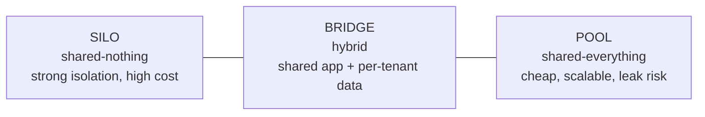
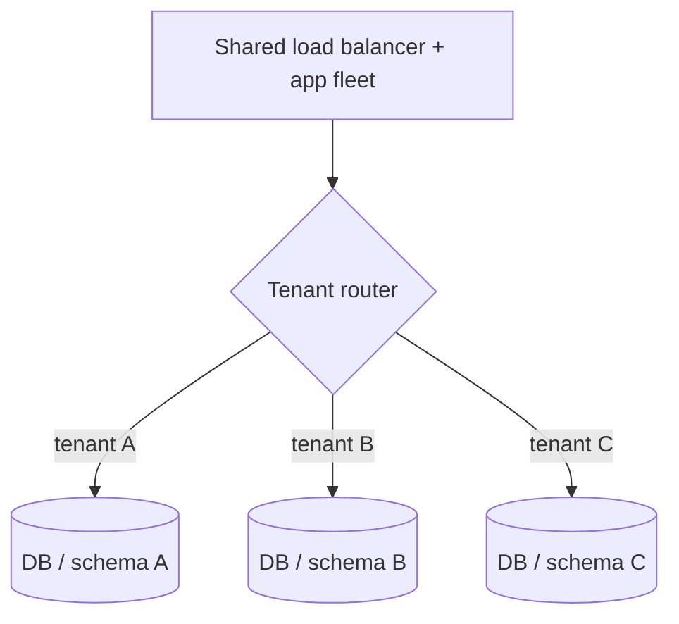

# Multi-Tenancy & SaaS Isolation

**Multi-tenancy** is the architectural practice of serving many customers ("tenants")
from a single, shared software system while keeping each tenant's data and behavior
logically separate. It is the defining property of SaaS: one codebase, one operational
team, and (usually) shared infrastructure amortized across thousands of tenants. The
central tension of the whole topic is a three-way trade-off between **isolation**
(how strongly one tenant is walled off from another), **cost/efficiency** (how much
infrastructure you share), and **operational complexity** (how much you have to
build and run to keep tenants apart and healthy).

The single most important interview theme: **tenant isolation is a first-class
correctness and security property, not a feature.** The number-one catastrophic SaaS
failure is a *cross-tenant data leak* — tenant A seeing tenant B's data because a
query, cache key, or authorization check forgot the tenant boundary. Everything below
is ultimately in service of preventing that while keeping the system affordable and
operable.

This document is layered: for each concept you get **definition → why it matters →
trade-offs → gotchas**, with concrete SQL/config where it clarifies.

> [!KEY-TAKEAWAY]
> A "tenant" is your unit of isolation and billing — usually a customer organization
> (B2B) but sometimes an individual/family (B2C). Pick tenancy models per *layer*
> (compute, data, network) along an isolation *spectrum*; you rarely pick one model
> for the whole stack.

See also: `databases-sql-nosql-sharding-replication` (sharding mechanics),
`security-authentication-data-protection` (tenant authN/authZ, encryption), and
`rate-limiting-and-consistent-hashing` (per-tenant limiting algorithms).

---

## What multi-tenancy is and why it matters

A **tenant** is a customer whose data and configuration must be kept separate from
every other customer's. **Single-tenancy** dedicates a whole stack to one customer;
**multi-tenancy** shares infrastructure across many. SaaS providers go multi-tenant
because dedicating a full stack per customer does not scale operationally or
economically: 10,000 customers would mean 10,000 databases, deploy pipelines, patch
cycles, and on-call surfaces.

**Why it matters (what sharing buys you):**

- **Cost efficiency.** Shared compute/storage is amortized; idle capacity of one tenant
  serves the spikes of another (statistical multiplexing).
- **Operational leverage.** One deploy upgrades everyone; one patch fixes everyone.
- **Faster iteration.** A single codebase and schema evolves once.

**Why it's hard (what sharing costs you):**

- **Isolation risk.** Shared data stores mean a bug can leak across the tenant boundary.
- **Noisy neighbors.** One tenant's load can degrade everyone.
- **Blast radius.** One bad deploy or one poisoned shared table can take down all
  tenants at once.

> [!INTERVIEW]
> Define "tenant" explicitly at the start of a multi-tenancy design question.
> B2B → tenant = customer org (many users each). B2C → a tenant might be one person,
> or a family/team. The definition drives your data model, routing, and billing.

---

## The isolation spectrum: silo, pool, and bridge

A quick analogy before the formalism: **silo** = a standalone house per family —
private and quiet, but you pay for a whole house even if one person lives there.
**Pool** = an open-plan hostel with name tags on the beds — cheap and dense, but one
loud guest disturbs everyone and a mix-up puts you in the wrong bed. **Bridge** = an
apartment building — shared lobby, plumbing, and roof (cheap to operate) but locked
private units (your data stays yours).

Isolation is best thought of as a **spectrum**, not a binary. The AWS SaaS Factory
vocabulary names three reference points:

| Model | What's shared | Isolation | Cost per tenant | Ops complexity | Scales to N tenants |
|---|---|---|---|---|---|
| **Silo** | Nothing (dedicated stack/DB per tenant) | Strongest | Highest | Highest (fleet of stacks) | Poorly (hundreds, not millions) |
| **Pool** | Everything (shared compute + one DB, `tenant_id` column) | Weakest (logical only) | Lowest | Lowest per tenant, but leak risk | Excellently |
| **Bridge** | Some layers shared, some dedicated | In between | In between | In between | Depends on split |



The key insight: you choose a point on this spectrum **per layer**. A very common,
sensible design is *pooled compute + pooled or siloed data* depending on the layer's
risk and cost profile. Isolation at the compute tier, network tier, and data tier can
each sit at a different point.

> [!KEY-TAKEAWAY]
> Silo = strongest isolation, priciest, hardest to operate at scale.
> Pool = cheapest and most scalable, but carries noisy-neighbor and blast-radius risk.
> Bridge = hybrid that lets you isolate the layer that matters most (usually data).

---

## The silo model

**Definition.** Each tenant gets a dedicated, isolated stack — its own compute, its own
database, often its own network segment. Nothing tenant-bearing is shared.

**Why choose it:**

- **Strongest isolation** — a bug or breach in one tenant's stack cannot reach another;
  no shared data store to leak across.
- **Compliance** — regulated tenants (healthcare, finance, government) often *require*
  physically or logically separate infrastructure.
- **Predictable performance** — no noisy neighbors; per-tenant tuning is possible.
- **Simple blast radius reasoning** — one tenant's outage is one tenant's outage.

**Costs and gotchas:**

- **Highest cost per tenant** — you pay for idle capacity in every stack; no statistical
  multiplexing.
- **Operational sprawl** — patching, deploying, monitoring, and migrating schema across
  a *fleet* of stacks. This is the real killer at scale; automate with
  infrastructure-as-code or you drown.
- **Poor density** — practical for tens to low hundreds of tenants, not millions.
- **Cross-fleet operations are hard** — fleet-wide analytics, reporting, and "apply this
  fix everywhere" become distributed problems.

> [!TIP]
> **Worked example — why silo is uneconomical and what pool saves.** Take 10,000
> tenants and a small managed DB instance at ~$50/mo.
>
> - **Silo:** one dedicated instance per tenant = 10,000 × $50 = **$500,000/mo → $50 per
>   tenant.** But each tenant must be sized for *its own peak*, and most sit near ~5%
>   average utilization — so you are paying for ~95% idle capacity in every stack.
> - **Pool (statistical multiplexing):** the tenants share a fleet. Aggregate *average*
>   load = 10,000 × 5% = **500 instance-equivalents**. Because tenant peaks are largely
>   uncorrelated (they don't all spike at the same second), the aggregate stays close to
>   that average, so you provision for it plus headroom — run the shared fleet at ~70%
>   utilization → 500 / 0.70 ≈ **715 instances** = 715 × $50 = **$35,750/mo → ~$3.58 per
>   tenant.**
>
> Same workload, per-tenant cost drops **~14×** ($50 → ~$3.58). That gap *is* statistical
> multiplexing: silo pays for every tenant's idle 95%; pool sells that idle capacity to
> whichever tenant needs it right now.

Silo is often reserved for **premium/enterprise tiers** and highly regulated tenants
(see *Tiered tenants*).

---

## The pool model

**Definition.** All tenants share everything: the same application instances and the
same database, with rows tagged by a `tenant_id` (a.k.a. discriminator) column. Isolation
is **logical**, enforced by the application and/or database, not by physical separation.

```sql
-- pooled table: every tenant's rows live together, discriminated by tenant_id
CREATE TABLE invoice (
    tenant_id   BIGINT NOT NULL,
    invoice_id  BIGINT NOT NULL,
    amount_cents BIGINT NOT NULL,
    PRIMARY KEY (tenant_id, invoice_id)
);
-- EVERY query MUST filter by tenant_id
SELECT * FROM invoice WHERE tenant_id = :ctx_tenant AND invoice_id = :id;
```

**Why choose it:**

- **Cheapest and most scalable** — maximal resource sharing; one large table serves all;
  one deploy updates everyone.
- **Simplest fleet ops** — a single stack to run, patch, and monitor.
- **Best density** — scales to very large numbers of tenants.

**Costs and gotchas:**

- **Cross-tenant data-leak risk** — a single missing `WHERE tenant_id = ?` leaks data.
  This is the #1 SaaS security failure (see *Enforcing isolation*).
- **Noisy neighbors** — one tenant's heavy query or write burst degrades everyone; needs
  per-tenant quotas/limits.
- **Large blast radius** — a bad migration or a shared-table lock affects all tenants.
- **Weakest compliance story** — "your data is in the same table as competitors'" is a
  hard sell to regulated customers.
- **"Big tenant" skew** — one huge tenant can dominate a shared table/partition; may need
  sharding by tenant.

---

## The bridge model

**Definition.** A hybrid between silo and pool: some layers are shared, others are
per-tenant. The canonical bridge is **shared application tier + per-tenant database (or
per-tenant schema)** — Azure calls this a *horizontally partitioned* deployment.



**Why choose it:**

- **Isolate the layer that matters** — usually data. You get near-silo data isolation
  and reduced noisy-neighbor risk at the DB, while still sharing the expensive-to-operate
  compute tier and a single codebase.
- **Better cost than silo, better isolation than pool** — a pragmatic middle.
- **Per-tenant data operations** — per-tenant backup/restore, encryption keys, and even
  data residency become tractable because data is already separated.

**Costs and gotchas:**

- **Codebase must handle both** — the app resolves *which* database/schema to use per
  request (a connection-routing / tenant-context layer).
- **Connection-pool pressure** — many databases/schemas can exhaust connection pools;
  needs pooling strategy (e.g., a pool per shard, not per tenant).
- **Schema migrations fan out** — you must run migrations across every schema/DB, and
  handle partial failures.

> [!WARNING]
> **Worked example — why "a pool per tenant" collapses.** Suppose 2,000 tenants and each
> app node keeps a modest per-tenant pool of 10 connections. That demands 2,000 × 10 =
> **20,000 open connections** — but a stock PostgreSQL ships with `max_connections ≈ 100`,
> and every connection also costs several MB of server RAM plus scheduler overhead. You
> blow past the limit ~200× and the database refuses new connections (or thrashes).
>
> The fix is to pool by the *physical* resource, not the logical tenant. Put the 2,000
> tenants on **20 shards** and keep **one pool of 50 connections per shard**: 20 × 50 =
> **1,000 connections** total — well within reach and reusable across all tenants on that
> shard. Or front the databases with a proxy like **PgBouncer** in transaction-pooling
> mode, which multiplexes thousands of client connections onto a few dozen real backend
> connections. Either way: pool per shard/proxy, never per tenant.

---

## Database isolation: shared-schema vs schema-per-tenant vs db-per-tenant

The data tier is where the tenancy decision bites hardest. Three canonical choices:

| Approach | Isolation | Density (tenants/DB) | Migration | Backup/restore granularity | Typical model |
|---|---|---|---|---|---|
| **Shared database, shared schema** (`tenant_id` column) | Logical only | Highest | One migration, all tenants | Whole DB only | Pool |
| **Shared database, schema-per-tenant** | Stronger (object-level) | Medium | Run per schema | Per schema (harder) | Bridge |
| **Database-per-tenant** | Strongest | Lowest (1) | Run per DB | Per tenant (easy) | Silo (data tier) |

**Shared schema (discriminator column).** Cheapest and densest. Every table carries
`tenant_id`; every query filters on it. Best paired with **row-level security** as a
safety net. Risk: one forgotten predicate leaks data.

**Schema-per-tenant.** Each tenant gets its own set of tables inside one database
instance (e.g., PostgreSQL schemas, MySQL "databases"). Stronger object-level separation
and per-tenant backup is easier, but you now have N× schema objects and migrations run
per schema. Watch catalog bloat and connection limits.

**Database-per-tenant.** Each tenant gets a physically separate database. Strongest
isolation, easiest per-tenant restore/residency/encryption, but lowest density and
heaviest ops.

> [!TIP]
> These map onto the spectrum: shared-schema ≈ pool, schema-per-tenant ≈ bridge,
> db-per-tenant ≈ silo. You can also **shard**: put groups of tenants on different
> shards (pool within a shard, silo between shards). See
> `databases-sql-nosql-sharding-replication`.

---

## Enforcing tenant isolation and the cross-tenant data-leak bug

In pooled/shared-schema systems, isolation is only as good as your enforcement. The
failure mode — **a query that returns another tenant's data** — is the single most
damaging SaaS bug (an "IDOR"/broken-object-level-authorization class flaw). It happens
when:

- A query forgets `WHERE tenant_id = ?`.
- A cache key omits the tenant (tenant A gets tenant B's cached response).
- A background job, report, or admin endpoint runs without tenant context.
- An object ID is trusted from the client without checking it belongs to the caller's
  tenant (`GET /invoice/12345` returns invoice 12345 regardless of owner).

**Defense in depth — do not rely on developers remembering:**

1. **Tenant context is derived server-side**, from the authenticated principal (JWT
   claim, session), **never** from a client-supplied `tenant_id` parameter.
2. **Automatic scoping** — inject the tenant filter centrally: an ORM filter/interceptor,
   a repository base class, or a query builder that *always* adds the predicate. Don't
   hand-write `WHERE tenant_id` in every query.
3. **Database-enforced backstop** — Row-Level Security (below), so even a buggy query
   cannot cross the boundary.
4. **Ownership checks on every object access** — verify the requested object's
   `tenant_id` equals the caller's before returning it.
5. **Tenant-aware caches** — the tenant id is part of every cache key.
6. **Testing** — automated cross-tenant tests: authenticate as tenant A, try to read
   tenant B's IDs, assert 403/404. Fuzz/lint for queries lacking a tenant predicate.

```java
// BAD: object id trusted, no tenant check -> cross-tenant leak (BOLA/IDOR)
Invoice inv = repo.findById(id);              // returns ANY tenant's invoice

// GOOD: always scoped to the authenticated tenant from context
Invoice inv = repo.findByIdAndTenantId(id, ctx.tenantId());
if (inv == null) return notFound();           // don't confirm existence cross-tenant
```

> [!WARNING]
> Never accept `tenant_id` from the request body/query string as the source of truth.
> Derive it from the authenticated token. A client that can name its own tenant can name
> someone else's.

See also `security-authentication-data-protection` for how the tenant claim is minted
and validated.

---

## Row-Level Security (RLS) as a backstop

**Row-Level Security** pushes the tenant predicate down into the database engine, so it
is enforced for *every* query regardless of what the application forgot to write. In
PostgreSQL:

```sql
ALTER TABLE invoice ENABLE ROW LEVEL SECURITY;
ALTER TABLE invoice FORCE ROW LEVEL SECURITY;   -- applies even to table owner
CREATE POLICY tenant_isolation ON invoice
    USING (tenant_id = current_setting('app.current_tenant')::bigint);

-- app sets the tenant per connection/transaction (from server-derived context):
SET app.current_tenant = '42';
-- now even `SELECT * FROM invoice` only returns tenant 42's rows
```

**Why it matters:** RLS turns "every developer must remember the filter" into "the
database guarantees the filter." It is a *defense-in-depth backstop*, not a replacement
for application scoping.

**Gotchas:**

- **The session variable must be trustworthy** — set it from server-derived context, and
  make sure the app's DB role is *not* `BYPASSRLS` and does not own the table without
  `FORCE`. A superuser/owner connection can silently bypass policies.
- **Connection pooling leakage** — if you `SET` a tenant on a pooled connection and it's
  returned to the pool without reset, the next request may inherit the wrong tenant. Use
  `SET LOCAL` inside a transaction, or reset on checkout.
- **Performance** — the policy predicate is added to every query; ensure `tenant_id` is
  indexed (ideally leading column of composite indexes/primary key).
- **Not all engines have it** — RLS is a Postgres/SQL Server/Oracle feature; many
  NoSQL stores require you to enforce it in the access layer or via IAM-scoped
  partition keys.

---

## Isolation is not the same as authentication or authorization

A crucial distinction interviewers probe: **authentication** proves *who* you are,
**authorization/RBAC** decides *what actions* you may perform, and **tenant isolation**
guarantees you can only ever touch *your tenant's* resources. They are complementary,
not substitutes.

- You can be perfectly authenticated and correctly authorized ("admin can read all
  invoices") and *still* leak data if "all invoices" isn't scoped to your tenant.
- Isolation is a property of the *runtime and data plane* (routing, query scoping, RLS,
  IAM policies), enforced below the feature logic.

In AWS-style architectures, isolation is often enforced with **dynamically scoped IAM
policies / session tags**: the tenant context is baked into a scoped-down credential
(e.g., DynamoDB leading-key conditions, S3 prefix conditions) so the *infrastructure*
refuses cross-tenant access even if code is wrong.

**Worked example — a scoped credential the code cannot escape.** The request comes in
authenticated as tenant `42`. Before touching data, the service calls STS to assume a
role, stamping a **session tag** `tenant=42`, and receives temporary credentials whose
policy pins every access to that tag:

```json
{
  "Version": "2012-10-17",
  "Statement": [
    {
      "Effect": "Allow",
      "Action": ["dynamodb:GetItem", "dynamodb:Query"],
      "Resource": "arn:aws:dynamodb:us-east-1:111122223333:table/Invoices",
      "Condition": {
        "ForAllValues:StringEquals": {
          "dynamodb:LeadingKeys": ["${aws:PrincipalTag/tenant}"]
        }
      }
    },
    {
      "Effect": "Allow",
      "Action": "s3:GetObject",
      "Resource": "arn:aws:s3:::acme-tenant-docs/${aws:PrincipalTag/tenant}/*"
    }
  ]
}
```

Now trace a buggy request: the code has a bug and asks for `Query` with partition key
`43` (a different tenant). AWS resolves `${aws:PrincipalTag/tenant}` to `42` from the
credential's session tag, sees `dynamodb:LeadingKeys` must equal `42`, and the request's
leading key `43` fails the condition → **AccessDenied**. Same for `s3://acme-tenant-docs/43/report.pdf`:
the resource pattern expands to `.../42/*`, so key `43/...` is outside it → denied. The
credential *itself* only reaches partition/prefix `42`; a forgotten `WHERE` clause or a
client-supplied `43` can't cross the boundary, because the infrastructure — not the
application — enforces it.

> [!KEY-TAKEAWAY]
> RBAC controls actions within a tenant; isolation controls the tenant boundary itself.
> A correct authz check that omits the tenant scope is still a data leak.

See also `security-authentication-data-protection`.

---

## Noisy neighbors and per-tenant quotas / rate limits

In pooled systems, tenants compete for shared resources (CPU, DB connections, IOPS,
queue capacity). A **noisy neighbor** is a tenant whose load — a runaway batch job, a
retry storm, a huge report — degrades latency/availability for everyone else.

**Mitigations:**

- **Per-tenant rate limits & quotas** — cap requests/sec, concurrent queries, or
  resource units *per tenant*, so no single tenant can consume the whole pool. (Token
  bucket keyed by `tenant_id`; see `rate-limiting-and-consistent-hashing`.)
- **Fair scheduling / weighted fair queuing** — service tenants round-robin or by tier
  weight rather than first-come-first-served.
- **Bulkheading** — separate connection pools/thread pools/queues per tenant tier so one
  tenant's saturation can't exhaust the shared resource.
- **Concurrency limits & admission control** — bound in-flight work per tenant; shed or
  queue excess.
- **Move the offender** — promote a chronically heavy tenant to its own silo/shard
  (a common escape valve for the "big tenant" problem).
- **Usage-based cost attribution** — meter per-tenant consumption both to bill and to
  detect abuse.

> [!WARNING]
> Global rate limits alone don't stop noisy neighbors — a single tenant can consume the
> entire global budget. Limits must be *keyed by tenant* to enforce fairness.
>
> **Worked example.** One **global** bucket allows 10,000 rps, shared first-come-first-
> served across 501 active tenants. Tenant A hits a retry storm and fires 9,800 rps.
> A alone soaks up 9,800 of the 10,000; the remaining **200 rps** is all that's left for
> the other 500 tenants — **200 / 500 = 0.4 rps each**, so everyone else is effectively
> down. Now switch to a **per-tenant token bucket of 50 rps** keyed by `tenant_id`:
> tenant A is throttled at **50 rps** (its excess 9,750 rps is rejected/queued), and each
> of the other 500 tenants keeps its own independent 50 rps budget — unaffected by A. The
> blast radius shrinks from "everyone" to "just the abuser."

---

## Tenant onboarding and offboarding

**Onboarding** (provisioning a new tenant) and **offboarding** (deprovisioning/deleting)
are core SaaS lifecycle operations that differ sharply by model.

**Onboarding:**

- **Pool:** trivial — insert a tenant row / allocate a `tenant_id`; no infra to stand up.
  Near-instant self-service signup.
- **Silo/bridge:** must provision infrastructure (new DB/schema/stack) — automate with
  infrastructure-as-code; expect minutes, and design for idempotency/retry. Track a
  **tenant → deployment mapping** so requests route correctly.
- Seed default config, roles, and reference data; register the tenant in the routing/
  mapping table and the identity provider.

**Offboarding:**

- **Data deletion / retention** — actually delete or export the tenant's data (GDPR
  "right to erasure", contractual retention). In pool this means a scoped delete across
  many tables; in silo/bridge, drop the DB/schema (cleaner and provably complete).
- **Provable deletion is easier in silo/bridge** — "we dropped your database" is a
  stronger guarantee than "we ran DELETE WHERE tenant_id = ?".
- **Reclaim resources**, revoke credentials/keys, remove routing entries, and stop
  billing.
- Consider **export + grace period + soft-delete** before hard delete.

> [!TIP]
> Onboarding cost/latency is a major reason to prefer pool/bridge for self-service and
> silo for high-touch enterprise. Provable, complete deletion is a reason regulated
> tenants demand silo/db-per-tenant.

---

## Data residency per tenant

Some tenants are legally required to keep data in a specific jurisdiction (EU GDPR, data
sovereignty laws, government clouds). **Data residency** means routing a tenant's data
(and often processing) to a specific region.

**How it's typically done:**

- **Map tenants to region-specific deployments/stamps** — the tenant→deployment mapping
  includes region; requests route to the tenant's home region.
- **Db-per-tenant / bridge makes residency tractable** — each tenant's DB physically
  lives in the required region. Pure pooled single-region storage cannot satisfy
  per-tenant residency without partitioning by region.
- **Regional sharding** — partition tenants across regional shards; the tenant directory
  resolves region → shard → connection.

**Gotchas:**

- **Everything downstream inherits the constraint** — backups, caches, search indexes,
  logs, analytics pipelines, and even error-tracking must respect residency.
- **Cross-region features** (global search, fleet analytics) become hard; you may need
  regional aggregation with anonymization.
- **Latency** — tenants far from their home region pay round-trip cost.

---

## Per-tenant customization and configuration

SaaS tenants expect some customization — branding, feature flags, business rules, custom
fields, data model extensions — without forking the codebase.

**Techniques (in increasing power/risk):**

- **Configuration/feature flags per tenant** — a `tenant_config` store toggles features
  and sets limits; the app reads it per request. Safest and most common.
- **Per-tenant branding/theming** — logos, colors, custom domains (vanity URLs) resolved
  from the tenant record.
- **Custom fields / EAV or JSONB extensions** — let tenants add fields without schema
  changes (e.g., a `custom` JSONB column). Trades queryability/typing for flexibility.
- **Per-tenant business rules / workflows** — data-driven rules engine rather than code
  branches.

**Gotchas:**

- **Avoid `if (tenant == "BigCorp")` branches in code** — they don't scale, rot, and
  create hidden per-tenant behavior. Drive customization from data/config.
- **Silo enables the deepest customization** (even per-tenant code/versions) at the cost
  of losing the single-codebase benefit — usually an anti-goal.
- **Test the matrix** — configuration combinations multiply test surface.

---

## Tiered tenants: mixing models by tier

Real SaaS rarely uses one model globally. A common pattern maps **pricing tiers to
isolation levels**:

| Tier | Typical isolation | Rationale |
|---|---|---|
| Free / trial | Pool (shared everything) | Cheapest; onboard instantly; disposable |
| Standard | Pool or bridge | Balance cost and isolation |
| Premium / Enterprise | Bridge or **silo** | Isolation, dedicated performance, compliance, residency — and they pay for it |

This is exactly Azure's **vertically partitioned** deployment: most tenants share
infrastructure, while high-value or high-compliance tenants get dedicated (silo)
deployments — and you can **charge more** for the silo, recovering its cost.

**Design implications:**

- The codebase and routing layer must support **both** pooled and siloed tenants
  simultaneously, resolving each tenant to its deployment via the tenant directory.
- Plan **migration paths** — promoting a growing pooled tenant to its own silo (data
  export/import, cutover) is a real, recurring operation.

> [!INTERVIEW]
> "How would you offer stronger isolation to enterprise customers without rebuilding?"
> → Vertical partitioning: keep the pool for most, add silo deployments for premium,
> route via a tenant→deployment map, and price the silo to cover its cost.

---

## Tenant routing and context propagation

Everything above depends on reliably answering "**which tenant is this request for?**"
and carrying that answer through the whole call graph.

**Identifying the tenant** (common strategies):

- **Subdomain / vanity domain** — `acme.app.com` → tenant `acme`.
- **Path or header** — `/t/acme/...` or `X-Tenant-Id` (only trustworthy if server-set).
- **JWT/token claim** — the authenticated principal carries the tenant id (most robust;
  can't be spoofed by the client). Preferred source of truth.

**Propagating context:** resolve tenant once at the edge, then thread a **tenant context**
(request-scoped, e.g., a `ThreadLocal`, async context, or explicit parameter) through
services, DB access (sets RLS variable / scoping filter), cache keys, logs, metrics, and
outbound calls. Emit `tenant_id` in structured logs and metrics for per-tenant
observability and cost attribution.

**The tenant directory / mapping table** is the authority for tenant → shard/DB/region/
tier. It's on the hot path, so it's cached aggressively — and it must be updated
atomically during onboarding/migration.

> [!WARNING]
> A dropped tenant context (a background job, an async callback, a cache lookup) is a
> classic leak vector: work runs with *no* tenant scope or an inherited/stale one.
> Make "no tenant in context" a hard failure, not a silent full-table scan.

---

## Common follow-up questions

- **"What's the difference between silo, pool, and bridge?"** Silo = dedicated stack per
  tenant (strong isolation, high cost, poor density). Pool = shared everything with a
  `tenant_id` (cheap, scalable, leak/noisy-neighbor risk). Bridge = hybrid, typically
  shared app + per-tenant data.
- **"How do you prevent cross-tenant data leaks?"** Server-derived tenant context,
  automatic query scoping, RLS as a DB backstop, ownership checks on every object,
  tenant-aware cache keys, and automated cross-tenant tests.
- **"Isn't RBAC enough for isolation?"** No — authz controls actions *within* a tenant;
  isolation controls the tenant boundary. A correct authz check that forgets the tenant
  scope still leaks.
- **"How do you handle noisy neighbors?"** Per-*tenant* quotas/rate limits, fair
  scheduling, bulkheads, admission control, and moving offenders to their own silo/shard.
- **"How do you satisfy a customer who demands their data in the EU only?"** Map the
  tenant to an EU deployment/shard (bridge/silo), and ensure backups, caches, logs, and
  analytics inherit the residency constraint.
- **"How do you migrate a tenant from pool to silo?"** Provision the silo, export/replay
  or dual-write the tenant's data, verify, flip the tenant→deployment mapping, then
  decommission the pooled rows.
- **"How do you prove you deleted a departing tenant's data?"** Easiest with
  db-per-tenant/schema-per-tenant — drop the database/schema; in pool you run scoped
  deletes across every table plus caches/indexes/backups.
- **"Where do you store `tenant_id` and how do you trust it?"** In the authenticated
  token/claim, derived server-side — never from a client-supplied parameter.

---

## References

- AWS Well-Architected SaaS Lens — *Tenant Isolation*:
  https://docs.aws.amazon.com/wellarchitected/latest/saas-lens/tenant-isolation.html
- AWS SaaS Factory — silo/pool/bridge isolation models and SaaS architecture guidance:
  https://aws.amazon.com/partners/programs/saas-factory/
- Microsoft Azure Architecture Center — *Tenancy models for a multitenant solution*:
  https://learn.microsoft.com/en-us/azure/architecture/guide/multitenant/considerations/tenancy-models
- Azure Architecture Center — *Multitenant data storage and partitioning*:
  https://learn.microsoft.com/en-us/azure/architecture/guide/multitenant/considerations/data
- Azure Architecture Center — *Noisy Neighbor antipattern*:
  https://learn.microsoft.com/en-us/azure/architecture/antipatterns/noisy-neighbor/noisy-neighbor
- Deployment Stamps pattern:
  https://learn.microsoft.com/en-us/azure/architecture/patterns/deployment-stamp
- PostgreSQL documentation — *Row Security Policies*:
  https://www.postgresql.org/docs/current/ddl-rowsecurity.html
- OWASP — *Broken Object Level Authorization (BOLA/IDOR)*:
  https://owasp.org/API-Security/editions/2023/en/0xa1-broken-object-level-authorization/
- Gartner / SaaS multi-tenancy patterns; "The Force.com Multitenant Architecture" (salesforce.com) for a large-scale pooled model.
