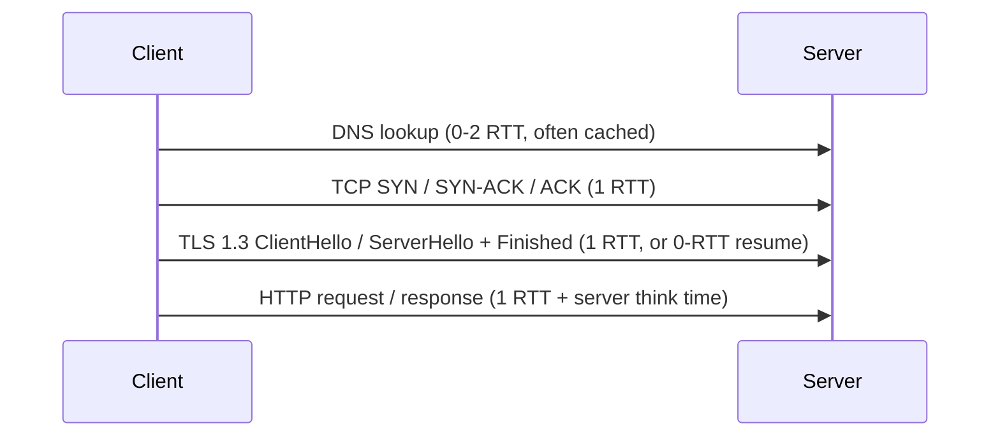

# Networking and Communication Protocols

Networking is the substrate under every distributed system. In an interview, the goal is
almost never "recite the TCP state machine" — it is to reason about **trade-offs**: latency
vs. throughput, consistency vs. availability, simplicity vs. control, cost vs. performance.
This document is organized so that every subtopic goes intuition → how it works → real usage
→ **trade-offs and when to pick what**. Memorize the trade-off tables; they are the interview.

A useful mental model of the round trips a single "fresh" HTTPS request pays:



Every RTT you remove is real user-perceived latency. Much of protocol evolution
(HTTP/2 multiplexing, HTTP/3 QUIC, TLS 1.3, connection reuse, CDNs) is a war on RTTs.

---

## OSI and TCP and IP layering model

**Intuition.** Networking is layered so each layer only worries about its own job and treats
the layer below as a dumb pipe. The classic OSI model has 7 layers; the practical model is the
4-layer TCP/IP stack.

```
OSI                     TCP/IP practical         Examples
7 Application  ┐
6 Presentation ├──►      Application             HTTP, gRPC, DNS, TLS(*), WebSocket
5 Session      ┘
4 Transport            Transport                 TCP, UDP, QUIC(*)
3 Network              Internet                  IP, ICMP, BGP routing
2 Data Link   ┐
1 Physical    ┘        Link                      Ethernet, Wi-Fi, MAC
```

(*) TLS is often described as "layer 6-ish"; QUIC blurs transport + security + session
because it runs over UDP and builds streams, encryption, and loss recovery in user space.

**Why it matters in interviews.** "L4 vs L7 load balancer," "does TLS terminate here,"
"can we route on the URL path" are all layer questions. If you can say *which layer* a
device operates at, you know what information it can see (L4 sees IP:port; L7 sees the
HTTP path, headers, cookies) and therefore what it can and cannot do.

**Trade-off.** Lower-layer devices (L3/L4) are faster and cheaper per packet and protocol-
agnostic, but blind to application semantics. Higher-layer devices (L7) can do smart routing,
caching, auth, and observability but cost more CPU (they parse/decrypt) and add latency.

---

## TCP versus UDP

**Intuition.** TCP is a reliable, ordered phone call: connection setup, delivery guarantees,
flow/congestion control. UDP is a fire-and-forget postcard: no setup, no guarantees, minimal
header — you build whatever reliability you need on top.

**How TCP works.** 3-way handshake (SYN, SYN-ACK, ACK) establishes a connection and sequence
numbers. Data is a byte stream cut into segments; the receiver ACKs, lost segments are
retransmitted. **Flow control** (receive window) stops a fast sender from overwhelming a slow
receiver. **Congestion control** (slow start, congestion avoidance; algorithms like CUBIC,
BBR) stops senders from overwhelming the network. Ordered delivery means a lost segment causes
**head-of-line (HOL) blocking**: later bytes wait until the gap is filled.

**How UDP works.** One datagram, best-effort. No ordering, no retransmit, no congestion control
(you must add your own or you become a bad network citizen). Header is 8 bytes vs TCP's 20+.

| Property             | TCP                          | UDP                                  |
|----------------------|------------------------------|--------------------------------------|
| Connection           | Yes (handshake, ~1 RTT)      | None (0 RTT)                         |
| Reliability          | Guaranteed, retransmit       | None (app-level if needed)          |
| Ordering             | Strict byte order            | None                                 |
| Congestion/flow ctrl | Built in                     | None                                 |
| Head-of-line block   | Yes                          | No                                   |
| Header overhead      | 20-60 bytes                  | 8 bytes                              |
| Latency (tail)       | Higher (retransmit stalls)   | Lower, predictable                   |
| Use when             | Correctness > latency        | Latency > perfection, or multicast   |

**Real usage.** TCP: HTTP(S), gRPC, database connections, SSH. UDP: DNS (small queries),
real-time media (VoIP, WebRTC, game state), QUIC/HTTP/3, video streaming datagrams, and
metrics/telemetry (statsd) where dropping a sample is fine.

**Trade-offs / when to use what.**
- Pick **TCP** when correctness and ordering matter and occasional latency spikes are OK
  (APIs, file transfer, payments).
- Pick **UDP** when you can tolerate loss or you can reconstruct/interpolate (a dropped video
  frame or game tick is better dropped than delivered 300 ms late), or you need broadcast/
  multicast (TCP can't multicast), or you need to escape TCP HOL blocking (QUIC's whole reason).
- The subtle point interviewers want: **"reliable" is not free.** TCP's retransmit + in-order
  delivery *causes* tail-latency HOL blocking. For real-time media you'd rather lose the packet.

---

## HTTP evolution: HTTP 1.1, HTTP 2, and HTTP 3 with QUIC

**Intuition.** Each HTTP version fights a different bottleneck: HTTP/1.1 fights connection
churn, HTTP/2 fights per-connection request serialization, HTTP/3 fights TCP itself.

**HTTP/1.1.** Text protocol, one request per connection at a time. Keep-alive reuses the TCP
connection but responses come back in order (**HTTP-level HOL blocking**). Browsers work around
this by opening ~6 parallel connections per origin, and servers use "domain sharding." Pipelining
existed but was broken in practice. Head-of-line blocking + limited parallelism = slow page loads.

**HTTP/2.** Binary framing. **Multiplexing**: many concurrent streams over ONE TCP connection,
so no more 6-connection hacks. Adds **HPACK header compression**, **server push** (mostly
deprecated now), and stream **prioritization**. BUT: because all streams share one TCP
connection, a single lost TCP segment stalls *every* stream — **TCP-level HOL blocking**. On
lossy networks (mobile) HTTP/2 can be *worse* than HTTP/1.1's multiple connections.

**HTTP/3 (over QUIC).** Runs over **UDP**, not TCP. QUIC re-implements streams, reliability,
ordering, and congestion control in user space, and **bakes in TLS 1.3**. Key wins:
- **No transport HOL blocking**: each stream has independent delivery; a lost packet only
  stalls its own stream, others proceed. (Cloudflare: lost packet blocks all streams in HTTP/2,
  only one stream in HTTP/3.)
- **Faster handshake**: transport + TLS handshake combined = 1 RTT for a new connection, and
  **0-RTT** for resumption (client sends data with the first packet).
- **Connection migration**: connection identified by a Connection ID, not the 4-tuple, so
  switching Wi-Fi → cellular (IP change) doesn't drop the connection — huge for mobile.

| Feature                | HTTP/1.1        | HTTP/2               | HTTP/3 (QUIC)          |
|------------------------|-----------------|----------------------|------------------------|
| Transport              | TCP             | TCP                  | UDP                    |
| Multiplexing           | No (1 at a time)| Yes (1 conn)         | Yes (independent)      |
| HOL blocking           | HTTP-level      | TCP-level            | None (per-stream)      |
| Header compression     | None            | HPACK                | QPACK                  |
| Handshake RTTs (new)   | TCP + TLS (2-3) | TCP + TLS (2-3)      | 1 (0 on resume)        |
| Conn migration         | No              | No                   | Yes (Connection ID)    |
| Best on                | legacy          | clean, high-BW nets  | lossy/mobile networks  |

**Real numbers.** Cloudflare measured HTTP/3 TTFB ~176 ms vs HTTP/2 ~201 ms (~12% better) for
small transfers; on large transfers HTTP/2 with a tuned congestion controller (BBR) can edge
ahead. Net: HTTP/3 wins for many-small-object, high-loss, mobile scenarios.

**Trade-offs / when to use what.**
- HTTP/2 is the default for most server-to-server and browser traffic on good networks; simple,
  well-supported, and multiplexing removes the connection-churn problem.
- HTTP/3 shines on **high packet loss / high latency / mobile** where TCP HOL blocking hurts
  and connection migration matters. Costs: UDP is sometimes blocked/throttled by middleboxes,
  QUIC runs in user space so it's more CPU per byte, and tooling/observability is less mature.
- Don't over-index: for a private, low-loss datacenter LAN, HTTP/2 (or gRPC over HTTP/2) is
  usually enough; QUIC's loss-recovery advantage is smaller there.

---

## TLS handshake and mTLS

**Intuition.** TLS gives you confidentiality (encryption), integrity (tamper detection), and
authentication (you're really talking to example.com). It's the "S" in HTTPS.

**How the handshake works (TLS 1.3).** TLS 1.3 slashed the handshake to **1 RTT**:
1. Client sends `ClientHello` + its key share (guessing the group).
2. Server replies `ServerHello` + key share + certificate + `Finished`. Both sides now derive
   the shared secret via ECDHE (ephemeral Diffie-Hellman → forward secrecy).
3. Client sends `Finished`; application data flows.
**0-RTT resumption**: on a repeat visit the client can send data in the first flight using a
pre-shared key (PSK). Caveat: 0-RTT data is **replayable**, so only use it for idempotent
requests (GET), never for a "transfer money" POST.

TLS 1.2 needed 2 RTTs and allowed RSA key exchange (no forward secrecy). TLS 1.3 removed old
ciphers, made forward secrecy mandatory, and is the modern default.

**mTLS (mutual TLS).** Normal TLS authenticates only the *server* to the client. mTLS also
authenticates the *client* to the server via a client certificate — both sides present certs.
This is the backbone of **zero-trust service-to-service** auth in service meshes (Istio, Linkerd,
AWS App Mesh): every pod gets a short-lived cert, and services only accept peers with a valid
cert from the internal CA. Identity is cryptographic, not "we trust the network."

**Trade-offs / when to use what.**
- **TLS termination location** is a classic design lever: terminate at the load balancer/CDN
  edge (offload crypto CPU, central cert management, but traffic is plaintext inside your
  network — need a trusted network) vs. **end-to-end TLS / re-encrypt to origin** (more CPU, more
  latency, but encrypted all the way — required for PCI/HIPAA-grade internal traffic).
- **mTLS** buys strong, network-independent identity and encryption in transit; costs are
  certificate lifecycle/rotation complexity, extra handshake CPU, and operational burden — hence
  people offload it to a **sidecar (service mesh)** so app code stays clean.
- **0-RTT** saves a round trip but opens a replay window: guard it (only idempotent methods).
- Session resumption (session IDs / tickets / PSK) avoids full handshakes for repeat clients —
  big win for CDNs terminating millions of connections.

---

## DNS resolution

**Intuition.** DNS is the phone book turning `api.example.com` into an IP. It's a distributed,
heavily-cached hierarchy, and it's often the *first* latency and *first* failure point.

**How it works.** A recursive resolver walks the hierarchy (with caching at each hop):

Records: **A** (IPv4), **AAAA** (IPv6), **CNAME** (alias), **MX** (mail), **TXT**, **NS**,
**SOA**. **TTL** controls cache lifetime: low TTL = fast failover/change propagation but more
query load; high TTL = fewer queries but stale entries linger during incidents/migrations.

**DNS as a routing tool.**
- **GeoDNS / latency-based routing**: return different IPs by client location (send users to the
  nearest region/CDN PoP).
- **Weighted / round-robin**: crude load balancing and canary splits.
- **Health-checked failover**: authoritative provider stops handing out an unhealthy endpoint.
- **DNS-based global traffic management**: Route 53, Cloudflare, Akamai do all of the above.

**Trade-offs.**
- DNS load balancing is cheap and global but **coarse and slow to react** — clients and resolvers
  cache, so a change takes up to the TTL to propagate; you cannot yank traffic instantly. For fast
  failover use **low TTL + anycast**, or move the decision to an L4/L7 LB or a client with retries.
- **Anycast** (same IP announced from many locations via BGP) gives automatic nearest-PoP routing
  and DDoS absorption — used for public DNS (1.1.1.1, 8.8.8.8) and CDNs.
- **DoH/DoT** (DNS over HTTPS/TLS) adds privacy but can complicate enterprise filtering.
- Failure mode: if TTLs are long and an IP goes bad, clients keep hitting a dead host until cache
  expires. Classic outage amplifier.

---

## REST semantics and status codes

**Intuition.** REST models your system as **resources** (nouns) manipulated with a small set of
HTTP **methods** (verbs), using status codes as a shared vocabulary for outcomes.

**Method semantics (memorize the two axes: safe and idempotent).**

| Method | Safe? | Idempotent? | Typical use                         |
|--------|-------|-------------|-------------------------------------|
| GET    | Yes   | Yes         | Read a resource                     |
| HEAD   | Yes   | Yes         | Read headers only                   |
| PUT    | No    | Yes         | Replace/create at a known URI       |
| DELETE | No    | Yes         | Remove a resource                   |
| POST   | No    | **No**      | Create / non-idempotent action      |
| PATCH  | No    | Not guaranteed | Partial update                   |

"Safe" = no server-side state change (read-only). "Idempotent" = doing it N times = doing it once.

**Status code families.**
- **2xx success**: 200 OK, 201 Created (return `Location`), 202 Accepted (async, not done yet),
  204 No Content.
- **3xx redirect**: 301 permanent, 302/307 temporary, 304 Not Modified (conditional GET cache hit).
- **4xx client error (don't retry blindly)**: 400 Bad Request, 401 Unauthorized (authn),
  403 Forbidden (authz), 404 Not Found, 409 Conflict, 422 Unprocessable, **429 Too Many Requests**
  (rate limited — honor `Retry-After`).
- **5xx server error (often retryable)**: 500 Internal, 502 Bad Gateway, 503 Service Unavailable
  (overloaded/maintenance — has `Retry-After`), 504 Gateway Timeout.

**Retry rule of thumb.** Retry on 429/503/504 (with backoff) and network timeouts; do NOT retry
4xx like 400/401/403/404/422 (the request itself is wrong — retrying just wastes capacity).

**Trade-offs.**
- REST over JSON is universal, cacheable, human-debuggable, and firewall-friendly — but it's
  verbose, chatty (N+1 round trips), and has no strong schema. That's why gRPC/GraphQL exist.
- Use correct status codes: returning 200 with an error body breaks client retry logic, caches,
  and monitoring. Interviewers probe whether you know 429 vs 503 vs 500 semantics.

---

## Idempotency and safe methods

**Intuition.** In a distributed system, "did my write succeed?" is often unknowable — the
response can be lost even though the server processed it. Idempotency lets the client safely
retry without double-charging, double-shipping, or duplicating.

**The core problem.** Client sends `POST /charge $50`, server charges, but the ACK is lost to a
network blip. Client retries → charged twice. POST is not idempotent, so naive retries are unsafe.

**Idempotency keys (the standard fix).** Client generates a unique key (UUID) per logical
operation and sends it (`Idempotency-Key` header). Server stores `key → result` (with a TTL).
First request executes and records the result; any retry with the same key returns the *stored*
result without re-executing. Stripe, PayPal, Adyen, and payment APIs all do this. The store
must be durable and the check + execute must be atomic (or you race two concurrent retries).

```
POST /charge  Idempotency-Key: abc-123
  server: seen abc-123?  no  -> execute, store result under abc-123, return 200
  (retry) same key       yes -> return stored 200 (do NOT charge again)
```

**Naturally idempotent designs.**
- Use PUT with a client-chosen ID instead of POST when possible (`PUT /orders/{uuid}`).
- Make operations set-based/absolute ("set balance to X" vs "add X") where the domain allows.
- Dedup at the consumer using a unique message ID (exactly-once *effect* via at-least-once
  delivery + idempotent processing — the real meaning of "exactly once" in practice).

**Trade-offs.**
- Idempotency keys add storage + a lookup on every write and require careful concurrency (locks
  or conditional writes) — but they're the difference between "safe to retry" and "double charge."
- Absolute/set semantics are cleanest but not always expressible; keys are the general fallback.
- TTL choice: too short and a late retry re-executes; too long and storage grows. Match it to your
  max retry window.

---

## Real-time delivery: WebSockets, SSE, long polling, and webhooks

**Intuition.** Plain HTTP is client-pull request/response. Real-time features (chat, live scores,
notifications, dashboards, collaborative editing) need the *server* to push. There are four main
patterns, from hackiest to most capable.

**Short polling.** Client asks "anything new?" every N seconds. Dead simple, works everywhere, but
wastes requests and adds up-to-N-seconds latency. Fine for low-freshness needs.

**Long polling.** Client sends a request; server *holds it open* until data is available (or a
timeout), then responds; client immediately re-requests. Near-real-time over plain HTTP, works
through old proxies. Costs: a held connection per client, reconnect overhead per message,
awkward at scale. This is the classic fallback.

**Server-Sent Events (SSE).** A single long-lived HTTP response streaming `text/event-stream`.
**Server → client only**, text only, but auto-reconnect + event IDs (`Last-Event-ID`) are built
in, and it rides normal HTTP/1.1/2 (works with existing infra, HTTP/2 fixes the old 6-connection
limit). Great for feeds, notifications, live dashboards, **and streaming LLM token output**.

**WebSockets.** Starts as HTTP then `Upgrade`s to a persistent, **full-duplex, bidirectional**
TCP connection. Low overhead per message, binary or text. Best for chat, multiplayer games,
collaborative editing, trading. Costs: it's a stateful connection (harder to load-balance, needs
sticky routing or a shared pub/sub backplane like Redis), doesn't ride HTTP caching, needs its own
auth/reconnect/heartbeat logic, and can be blocked by some proxies.

**Webhooks.** Server-to-**server** push: your service HTTP POSTs an event to a URL the *consumer*
registered. This is how Stripe, GitHub, Twilio notify you. It's async, decoupled, and scales,
but the receiver must be publicly reachable, must verify signatures, must be idempotent (webhooks
retry → duplicates), and you need a dead-letter/retry strategy for failed deliveries.

| Pattern      | Direction        | Transport      | Latency   | Scale cost        | Use when                          |
|--------------|------------------|----------------|-----------|-------------------|-----------------------------------|
| Short poll   | client pull      | HTTP           | up to N s | many wasted reqs  | trivial, low freshness            |
| Long poll    | client pull(held)| HTTP           | ~instant  | held conns        | simple near-real-time fallback    |
| SSE          | server → client  | HTTP stream    | ~instant  | 1 conn/client     | feeds, notifs, LLM token streams  |
| WebSocket    | bidirectional    | TCP (upgraded) | ~instant  | stateful conns    | chat, games, collab, trading      |
| Webhook      | server → server  | HTTP POST      | ~instant  | consumer-hosted   | 3rd-party/service event delivery  |

**Trade-offs / when to pick what.**
- If you only need **server → client** streaming (dashboard, notifications, GenAI token stream),
  **SSE** is simpler than WebSockets and reuses HTTP infra/auth — prefer it. ChatGPT-style token
  streaming commonly uses SSE.
- If you need **client → server** messages too (typing, presence, game input), use **WebSockets**.
- At massive fan-out, both need a **pub/sub backplane** (Redis, Kafka) and connection servers so
  any node can push to any client — don't pin state to one box (Discord, Slack do this).
- **Webhooks** are for integrating *other systems*, not browser UIs; design them idempotent with
  retries + signatures + dead-letter.
- Long/short polling survive as fallbacks where persistent connections are blocked.

---

## gRPC and Protocol Buffers

**Intuition.** gRPC is a high-performance RPC framework: you define services and messages in a
`.proto` schema, and codegen produces typed client/server stubs. It runs over **HTTP/2** and
serializes with **Protocol Buffers** (compact binary).

**How it works.** Define once:
```proto
service UserService { rpc GetUser(GetUserRequest) returns (User); }
message User { int64 id = 1; string name = 2; }
```
Codegen gives strongly-typed stubs in many languages. Protobuf is a compact binary format (field
*tags*, varint encoding) — far smaller and faster to parse than JSON, with **schema evolution**
(add fields with new tag numbers; never reuse/renumber). HTTP/2 gives multiplexing and **four call
types**: unary, server-streaming, client-streaming, and bidirectional streaming.

**gRPC vs REST/JSON.**

| Dimension        | gRPC (HTTP/2 + protobuf)      | REST + JSON                    |
|------------------|-------------------------------|--------------------------------|
| Payload size     | Small (binary)                | Larger (text)                  |
| Speed / CPU      | Fast parse, low overhead      | Slower, more CPU               |
| Schema/contract  | Strong (.proto), codegen      | Optional (OpenAPI), loose      |
| Streaming        | First-class (bidi)            | SSE/chunked workarounds        |
| Browser support  | Needs gRPC-Web + proxy        | Native everywhere              |
| Human-debuggable | No (binary)                   | Yes (curl, readable)           |
| Caching (HTTP)   | Not out of the box            | Native (GET + cache headers)   |

**Real usage.** gRPC dominates **internal east-west microservice** traffic (Google, Netflix,
Uber, Square). Public/edge and browser APIs stay REST/JSON or GraphQL. gRPC-Web bridges browsers
via a proxy (Envoy). Protobuf is also the schema for many Kafka/event pipelines.

**Trade-offs / when to pick what.**
- Pick **gRPC** for internal service-to-service where you control both ends and want low latency,
  small payloads, strict contracts, codegen, and streaming (chatty microservices, high QPS).
- Pick **REST/JSON** for public APIs, browser clients, third-party integrations, easy debugging,
  and HTTP caching. The universality/debuggability is worth the overhead there.
- Costs of gRPC: binary is hard to debug, needs the proto toolchain, browser needs a proxy, and
  HTTP-layer caching/CDN semantics don't apply directly. GraphQL is a third option when clients
  need flexible field selection and you want to kill over/under-fetching (at the cost of caching
  and server complexity).

---

## Connection pooling and keep-alive

**Intuition.** Opening a connection is expensive: TCP handshake (1 RTT) + TLS handshake (1-2 RTT).
Doing that per request adds latency and burns CPU/file descriptors. Reuse connections instead.

**Keep-alive.** HTTP persistent connections (`Connection: keep-alive`, default in HTTP/1.1) keep
the TCP+TLS connection open to serve many sequential requests, amortizing setup cost. HTTP/2
goes further: one connection, many concurrent multiplexed streams.

**Connection pooling.** Clients (and especially services and DB drivers) keep a **pool** of warm,
reusable connections. A request borrows one, uses it, returns it. Sizing matters:
- Too small → requests queue waiting for a free connection (latency, timeouts under load).
- Too large → you exhaust the *server's* connection limit (each DB connection costs memory/threads;
  a Postgres box handles maybe a few hundred well), file descriptors, and ephemeral ports.
- Rule of thumb: pool size should track concurrency (Little's Law: `concurrency = arrival_rate ×
  latency`), not peak QPS. Databases often front the pool with **PgBouncer/proxy** so thousands of
  app instances share a small number of real DB connections.

**Trade-offs / failure modes.**
- Pooling/keep-alive massively cut latency and CPU (fewer handshakes) — nearly always worth it.
- **Idle-connection reaping mismatch**: if the server/LB closes idle connections sooner than the
  client expects, the client reuses a dead socket and gets errors ("connection reset"). Tune
  client idle timeout < server keep-alive timeout.
- **Thundering herd on cold pools**: after a deploy or failover, empty pools cause a burst of
  simultaneous handshakes. Warm pools / gradual ramp help.
- Behind an L7 LB, per-connection stickiness can concentrate load; connection age/rebalancing
  matters for long-lived HTTP/2/gRPC connections (they pin to one backend — use LB-aware balancing).

---

## Load balancing at L4 and L7

**Intuition.** A load balancer spreads traffic across many backends for scale and availability.
*Where* it operates in the stack determines what it can see and do.

**L4 (transport) load balancing.** Routes by IP + port; forwards TCP/UDP packets/connections
without looking inside. Blazing fast, protocol-agnostic, low latency, cheap. Can't route on URL,
can't terminate TLS meaningfully, can't do per-request decisions. Examples: AWS NLB, direct-server-
return setups, Maglev-style. Great for extreme throughput, non-HTTP protocols, or as the first tier.

**L7 (application) load balancing.** Terminates the connection, parses HTTP; can route by path/
host/header/cookie, terminate TLS, do sticky sessions, retries, rate limiting, header rewriting,
and observability. More CPU and latency per request. Examples: AWS ALB, NGINX, Envoy, HAProxy L7.

| Dimension          | L4 LB                    | L7 LB                          |
|--------------------|--------------------------|--------------------------------|
| Layer              | Transport (TCP/UDP)      | Application (HTTP/gRPC)        |
| Routing basis      | IP:port, connection      | Path, host, header, cookie     |
| TLS termination    | Pass-through/basic       | Yes (offload, inspect)         |
| Per-request logic  | No (per-connection)      | Yes (retry, rewrite, canary)   |
| Latency / CPU      | Lowest                   | Higher                         |
| Use when           | Raw throughput, non-HTTP | Smart routing, microservices   |

**Algorithms.** Round-robin, weighted, least-connections, least-response-time, consistent hashing
(for cache affinity / sticky routing without central state), IP hash. **Health checks** eject bad
backends; **connection draining** removes a backend gracefully.

**Trade-offs / when to pick what.**
- Common production pattern: **L4 in front (NLB) → L7 (ALB/Envoy)** — L4 for raw ingress scale and
  DDoS/anycast, L7 for smart routing. Many designs use both tiers.
- L7 is required for path-based microservice routing, canary/blue-green by header, WAF, and
  gRPC-aware balancing. Pay the CPU cost.
- L4 is required for non-HTTP (databases, custom TCP, UDP/QUIC) and for the lowest latency.
- **Sticky sessions** (cookie/IP affinity) help stateful/WebSocket workloads but hurt even load
  distribution and complicate failover — prefer stateless backends + shared session store so any
  LB can route to any node.
- Long-lived HTTP/2/gRPC connections pin to one backend; naive connection-level LB imbalances
  load. Use request-level (L7) balancing or client-side LB / service mesh for gRPC.

---

## CDN and edge compute

**Intuition.** Physics: a round trip across the planet is ~150 ms and can't be beaten. Put content
(and increasingly compute) *close to users* at edge PoPs so most requests never traverse the ocean
or hit your origin.

**How CDNs work.** Global network of PoPs cache static assets (images, JS/CSS, video segments) near
users. Requests hit the nearest PoP (via anycast/GeoDNS). Cache hit → served from edge in ~10-30 ms;
miss → PoP fetches from origin (or a mid-tier shield), caches per `Cache-Control`/`ETag`, serves.
Providers: Cloudflare, Akamai, Fastly, CloudFront.

**Caching controls.** `Cache-Control: max-age`, `s-maxage` (shared caches), `ETag`/`If-None-Match`
(conditional 304), `stale-while-revalidate` (serve stale, refresh in background). Cache **key** =
what makes responses identical (URL + `Vary` headers). Invalidation is the hard part: TTL expiry
(simple, but stale window) vs. explicit **purge** (instant but needs coordination) vs. **versioned
URLs** (`app.abc123.js` — new URL = new object, no invalidation needed; the best practice).

**Edge compute.** Run code at the edge: Cloudflare Workers, Lambda@Edge, Fastly Compute@Edge,
Vercel Edge. Uses: A/B testing, auth/token checks, header rewriting, personalization, geo-routing,
bot filtering, assembling responses — all without a round trip to origin. Also **edge for GenAI**:
caching embeddings/responses and running small models near users.

**Trade-offs.**
- CDNs slash latency and offload origin (huge for read-heavy, static, and video) but add cost,
  a caching/invalidation problem, and a consistency window (users may see stale content up to TTL).
- Dynamic/personalized/authenticated content caches poorly — use edge compute, micro-caching
  (very short TTL), or cache fragments. Don't cache per-user data at a shared edge (leak risk).
- Edge compute trades a full origin round trip for constrained runtimes (limited CPU/memory/time,
  no full DB access). Great for lightweight request manipulation, wrong for heavy compute/state.
- Failure mode: aggressive caching + long TTL + a bad deploy = stale bug served globally until
  purge/expiry. Versioned URLs + fast purge mitigate.

---

## Latency budgets and capacity estimation

**Intuition.** Interviewers love numbers. You must reason about a **latency budget** (the total
time you can spend and how it's divided across hops) and do quick **back-of-envelope** math.

**Latency numbers to memorize (order of magnitude).**

| Operation                              | Latency        |
|----------------------------------------|----------------|
| L1 cache reference                     | ~0.5 ns        |
| Main memory reference                  | ~100 ns        |
| Read 1 MB sequentially from memory     | ~250 µs        |
| SSD random read (4K)                   | ~150 µs        |
| Round trip within same datacenter      | ~0.5 ms        |
| Read 1 MB sequentially from SSD        | ~1 ms          |
| Disk seek (spinning)                   | ~10 ms         |
| Read 1 MB sequentially from disk       | ~20 ms         |
| Round trip CA ⇄ Netherlands            | ~150 ms        |

Takeaways: memory is ~1000× faster than disk seek; a cross-continent RTT (~150 ms) dwarfs almost
everything, so **minimize RTTs across the WAN** (batch, cache, colocate, use CDNs). Within a DC,
~0.5 ms per hop means a 10-hop microservice fan-out already costs ~5 ms just in network.

**Latency budget example.** Target p99 = 200 ms for a page. Break it down: DNS (cached ~0) + TLS
(0-RTT resume ~0) + LB (~1 ms) + service fan-out (3 parallel calls, each cache-or-DB ~20 ms) +
serialization + client render. Parallelize independent calls; the budget is the *critical path*,
not the sum. **Tail latency** (p99/p999) dominates user experience when you fan out — one slow
backend among 100 calls makes the whole request slow ("tail at scale"). Mitigate with hedged
requests, timeouts, and tighter p99s on dependencies.

**Capacity back-of-envelope.**
- QPS: 1 M requests/day ≈ 1e6 / 86400 ≈ **~12 QPS average**; peak often 2-5× average. 100 M/day
  ≈ ~1160 QPS avg. Memorize `1M/day ≈ 12 QPS`.
- Bandwidth: 10k QPS × 20 KB response ≈ 200 MB/s ≈ **1.6 Gbps** egress. Multiply by fan-out.
- Storage: 1 KB/record × 1 M records/day × 365 ≈ 365 GB/year (before replication ×3).
- Connections (Little's Law): `concurrent conns = QPS × avg_latency_seconds`. 10k QPS × 0.05 s =
  500 concurrent — that sizes your pools and thread counts.

**Trade-offs.** Every design choice trades against a budget: adding a network hop (a new
microservice, an extra cache tier) costs RTTs and tail risk; batching/caching/colocating saves
them at the cost of complexity/staleness. State the budget, then justify each hop against it.

---

## Timeouts, retries with backoff and jitter, and circuit breaking

**Intuition.** Networks fail partially and unpredictably. Resilience patterns keep one slow/failing
dependency from cascading into a full outage. This is the single most tested reliability topic.

**Timeouts.** *Always* set them; never wait forever. A missing timeout means a slow dependency
exhausts your threads/connections and takes you down too. Set timeouts from your latency budget
(e.g., timeout ≈ p99.9 of the dependency, not the average). Distinguish connect vs read timeouts.
Propagate a **deadline** across the call chain so downstream calls don't run past the client's
already-expired budget (gRPC deadlines, `context.Context`).

**Retries.** Retry *transient* failures (timeouts, 503, 502, connection resets) — NOT deterministic
4xx (400/403/404) where retrying can't help. Retries only for **idempotent** operations (or with an
idempotency key). Cap the number (e.g., 2-3). The danger: naive retries **amplify load** during an
outage (a struggling service gets 3× the traffic → **retry storm** → death spiral).

**Exponential backoff + jitter.** Space retries out exponentially (1s, 2s, 4s…) so you back off a
recovering service. Add **jitter** (randomness) so thousands of clients don't retry in lockstep and
create synchronized thundering-herd spikes. AWS's recommended approach is "full jitter":
`sleep = random(0, min(cap, base * 2^attempt))`. **Backoff without jitter is a classic mistake** —
clients still retry simultaneously.

```
attempt 0: wait random(0, 1s)
attempt 1: wait random(0, 2s)
attempt 2: wait random(0, 4s)   (capped)
```

**Circuit breaker.** Wraps a dependency and tracks failures. States:
- **Closed**: calls pass through; count failures.
- **Open**: after failures cross a threshold, *fail fast* immediately (don't even try) for a cooldown
  — this sheds load from the sick dependency and returns fast errors/fallbacks to callers.
- **Half-open**: after cooldown, allow a few trial calls; success → close, failure → re-open.
This prevents a failing dependency from tying up all your threads and gives it room to recover.
Netflix Hystrix popularized this; today it's resilience4j, Envoy/Istio outlier detection, etc.

**Related patterns.** **Bulkheads** (isolate resource pools per dependency so one can't starve
others), **load shedding / rate limiting** (reject early under overload rather than collapse),
**hedged requests** (send a duplicate to another replica after a delay to cut tail latency — costs
extra load), and **fallbacks** (serve cached/default data when a dependency is down).

**Trade-offs / when to use what.**
- Retries improve success rate for transient blips but **amplify load** — always pair with backoff,
  jitter, caps, *and* circuit breakers, and only for idempotent ops. Retrying non-idempotent writes
  without keys risks duplicates.
- Circuit breakers trade a few failed requests (during "open") for protecting the whole system and
  letting the dependency recover — essential above a certain scale, overkill for tiny systems.
- Aggressive timeouts free resources fast but can abort slow-but-valid requests (false failures);
  loose timeouts risk resource exhaustion. Tune to the dependency's real p99.9.
- Token-bucket **client-side rate limiting on retries** (retry budgets: only retry if <X% of
  traffic is retries) is the modern guard against retry storms.

---

## Modern patterns: event-driven, streaming, and service mesh

**Intuition.** Synchronous request/response couples services in time (both must be up) and space.
Modern large-scale systems lean on **asynchronous, event-driven** communication and push cross-
cutting network concerns into infrastructure (mesh, edge).

**Event-driven and message queues.** Services publish **events** to a broker (Kafka, Kinesis,
SQS/SNS, RabbitMQ, Pulsar); consumers react. Decouples producers from consumers, absorbs traffic
spikes (buffer), and enables fan-out. Delivery is typically **at-least-once**, so consumers must be
**idempotent**. Trade-off: you gain elasticity and resilience but give up synchronous simplicity and
end-to-end latency guarantees, and you inherit ordering/duplicate/eventual-consistency headaches.

**Streaming.** Kafka-style logs (partitioned, ordered within a partition, replayable) power real-time
pipelines, event sourcing, and CDC. **CDC (Change Data Capture)** streams a database's changelog
(Debezium reading the WAL) to other systems — the modern way to sync caches/search indexes/data
lakes without dual-writes. **CQRS** splits the write model from read-optimized views, often fed by
events. These show up constantly in 2024-2025 interviews.

**Backpressure.** In streaming, a fast producer can overwhelm a slow consumer. Backpressure (pull-
based consumption, bounded queues, reactive streams) signals "slow down" instead of dropping data or
OOMing — the streaming analog of TCP flow control.

**Service mesh.** A **sidecar proxy** (Envoy) next to each service handles mTLS, retries, timeouts,
circuit breaking, load balancing, and observability — pulled *out* of app code into the platform
(Istio, Linkerd, AWS App Mesh, Consul). Trade-off: uniform, language-agnostic networking policy and
zero-trust mTLS everywhere, at the cost of a per-pod proxy hop (latency + memory) and operational
complexity. Great above ~dozens of services; overkill for a handful.

**API gateway.** North-south entry point: authn/z, rate limiting, routing, request aggregation,
protocol translation (REST↔gRPC). Complements (not replaces) the mesh, which handles east-west.

**Edge and GenAI.** RAG systems add network hops: app → embedding model → **vector DB** (ANN search)
→ LLM. Each is a network call with its own latency/timeout/retry profile; token responses stream back
via SSE. Latency budgets here are dominated by model inference (100s of ms to seconds), so caching
(embeddings, prompt/response) and streaming-first UX matter.

**Trade-offs / when to use what.**
- **Sync (REST/gRPC)** when the caller needs an immediate answer and the flow is simple. **Async/
  events** when you can decouple, need to absorb spikes, fan out, or integrate many consumers —
  accept eventual consistency and idempotency requirements.
- **Mesh** when you have many polyglot services and want consistent security/resilience/observability;
  skip it for a monolith or a few services (just use libraries).

---

## Trade-offs and when to use what

A consolidated cheat sheet — the heart of the interview.

**Transport / protocol**
- TCP vs UDP: correctness+ordering (TCP) vs low/predictable latency, no HOL blocking, multicast (UDP).
- HTTP/1.1 vs /2 vs /3: legacy vs multiplex-on-good-networks vs no-HOL-blocking-on-lossy/mobile.
- REST vs gRPC vs GraphQL: universal/cacheable/debuggable vs fast/typed/streaming-internal vs
  flexible-field-selection (kills over/under-fetch, but caching + complexity cost).

**Real-time**
- SSE (server→client, simple, HTTP-native, LLM token streams) vs WebSocket (bidirectional, stateful,
  chat/games) vs long polling (fallback) vs webhooks (server→server integration).

**Infrastructure**
- L4 LB (raw throughput, non-HTTP, lowest latency) vs L7 LB (smart routing, TLS, per-request logic).
- DNS LB (global, cheap, coarse/slow) vs LB/anycast (fast, regional/instant failover).
- TLS terminate at edge (offload, plaintext internal) vs end-to-end/mTLS (secure everywhere, more CPU).
- CDN cache (fast, offloads origin, staleness window) vs origin (fresh, dynamic, personalized).

**Resilience**
- Retries: recover transient errors BUT amplify load → always backoff + jitter + caps + idempotency.
- Circuit breaker: sacrifice some requests to protect the whole system + let dependency recover.
- Timeouts: tight (free resources fast, risk false aborts) vs loose (risk exhaustion). Tune to p99.9.
- Sync vs async: immediate answer + simplicity vs decoupling + spike absorption + eventual consistency.

**A decision reflex for interviews:** state the constraints first (scale/QPS, latency budget,
consistency need, budget, team maturity), then pick, then name what you gave up. Never present a
choice without its cost.

---

## Common interview follow-up questions

1. Why can HTTP/2 be *slower* than HTTP/1.1 on a lossy mobile network? (TCP-level HOL blocking on a
   single shared connection vs 6 independent TCP connections.)
2. Your POST to charge a card times out. Did it succeed? How do you make retrying safe?
   (Unknown; idempotency keys + durable key→result store.)
3. When would you choose SSE over WebSockets for a live feature? (One-way server push like a
   dashboard or LLM token stream — simpler, HTTP-native, auto-reconnect.)
4. Design real-time chat for 10 M concurrent users — how do connection servers push to the right
   client? (WebSocket connection servers + pub/sub backplane like Redis/Kafka; presence registry.)
5. Where do you terminate TLS and why? (Edge for offload vs end-to-end/mTLS for zero-trust; depends
   on compliance and trust boundary.)
6. A dependency gets slow (not down). Why can that take *your* service down, and how do you prevent
   it? (Thread/connection exhaustion; timeouts + circuit breaker + bulkheads + load shedding.)
7. You add retries and the outage gets worse. Why? (Retry storm / load amplification; fix with
   backoff+jitter, caps, retry budgets, circuit breakers.)
8. gRPC or REST for a new public API? For an internal service? (REST public; gRPC internal.)
9. Estimate QPS, bandwidth, and connection count for 100 M requests/day at 20 KB each.
   (~1160 QPS avg, peak ×3-5; ~bandwidth = QPS×size; conns = QPS×latency.)
10. Why does a cross-continent request cost ~150 ms and what do you do about it? (Speed of light;
    CDN/edge, colocate, batch, reduce RTTs, async.)
11. What breaks when your DNS TTL is too high during a failover? (Clients cache the dead IP;
    use low TTL + anycast/health-checked failover.)
12. How does a service mesh change where retries/timeouts/mTLS live, and what does the sidecar cost?
13. How do you sync a search index / cache from your database without dual writes? (CDC / event log.)
14. What's the difference between at-least-once + idempotent processing and true exactly-once?
15. How do connection pooling and Little's Law size your DB connections? (conns = QPS × latency;
    front with PgBouncer.)

## References

- Alex Xu, *System Design Interview* Vol. 1 & 2, and the ByteByteGo blog / newsletter
  (real-time patterns, API design, HTTP versions, retries, CDN).
- Martin Kleppmann, *Designing Data-Intensive Applications* (reliability, idempotency,
  at-least-once vs exactly-once, CDC, event logs, backpressure).
- Cloudflare Blog — "HTTP/3 vs HTTP/2" and QUIC/connection-migration articles
  (https://blog.cloudflare.com/http-3-vs-http-2/).
- AWS Architecture Blog / Builders' Library — "Timeouts, retries, and backoff with jitter"
  (full-jitter algorithm), "Avoiding fallback in distributed systems," "Workload isolation
  using shuffle sharding."
- "Latency Numbers Every Programmer Should Know" (Jeff Dean / Peter Norvig, community-updated
  gist: https://gist.github.com/jboner/2841832).
- Google, *The Tail at Scale* (Dean & Barroso) — tail latency, hedged requests.
- RFCs / MDN: HTTP semantics (RFC 9110), HTTP/2 (RFC 9113), HTTP/3 (RFC 9114), QUIC (RFC 9000),
  TLS 1.3 (RFC 8446); MDN Web Docs for SSE, WebSockets, caching headers, status codes.
- gRPC.io docs and Protocol Buffers documentation (schema evolution, streaming RPC types).
- Stripe API docs — idempotency keys and webhook signing/retry design.
- The system-design-primer GitHub repo (donnemartin) — DNS, CDN, LB, availability patterns.
- Envoy / Istio / Linkerd docs — service mesh, mTLS, outlier detection (circuit breaking).
- Engineering blogs: Discord (WebSockets at scale, Elixir), Netflix (Hystrix, Zuul, resilience),
  Uber (gRPC, service mesh), Meta (edge, QUIC), Fastly/Cloudflare (edge compute).
- YouTube: ByteByteGo, Hussein Nasser ("The Backend Engineering Show" — TCP/UDP, HTTP/3, TLS),
  Gaurav Sen (system design), "Jordan has no life" (deep-dive design), System Design Interview.
