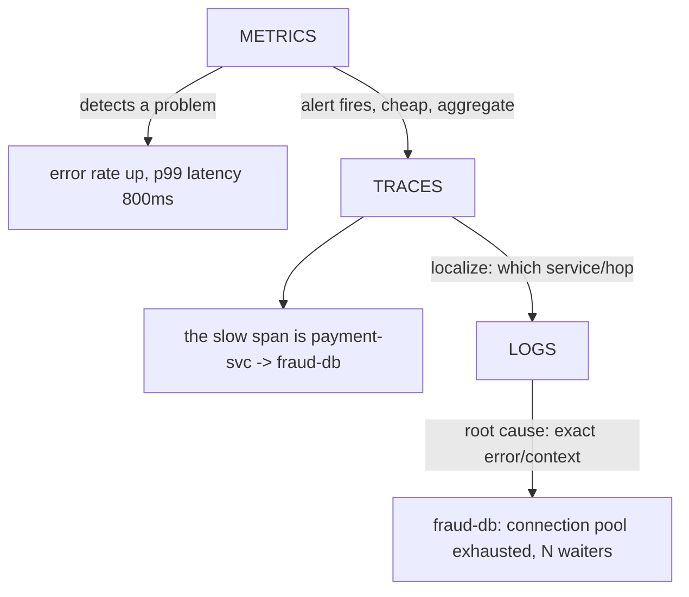
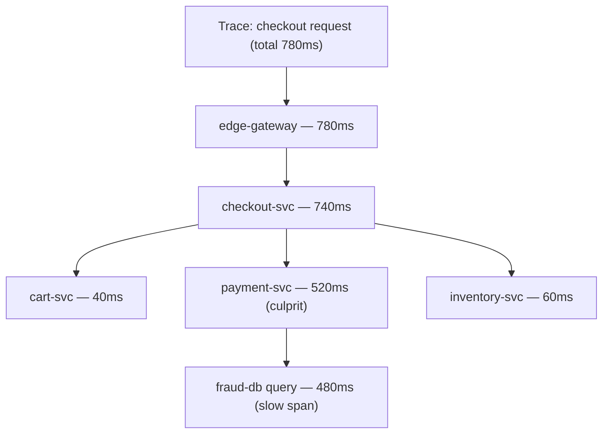
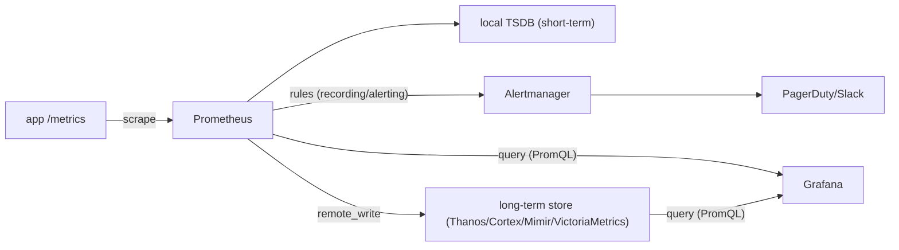
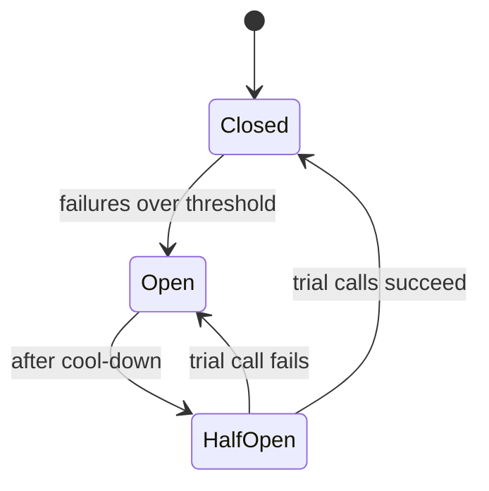

# Observability, Monitoring and Site Reliability

Observability is how you *know what your system is doing* when you cannot attach a
debugger to production. In an interview this topic is rarely "define a metric" — it is
about **trade-offs**: how much telemetry to collect vs. what it costs, when to sample vs.
keep everything, how to alert without drowning on-call in noise, how to set reliability
targets that are ambitious but not ruinous, and how to design systems that *degrade
gracefully and tell you why*. Reliability (SRE) is the discipline that turns that
telemetry into decisions: SLOs, error budgets, on-call, postmortems, and chaos testing.

The through-line for every section below is the same interview question: **"What do you
gain, what do you give up, and when would you pick the alternative?"** Instrumentation is
never free — every metric label, every log line, every retained trace costs money,
cardinality, and cognitive load. The art is spending that budget where it buys the most
diagnostic power.

This document is layered per concept: intuition -> how it works -> real-world usage ->
**trade-offs**. The trade-off paragraphs and the dedicated comparison section near the end
are the parts worth memorizing.

---

## Monitoring versus observability

**Intuition.** *Monitoring* answers questions you thought of in advance: "is CPU > 80%?",
"is error rate > 1%?" You define dashboards and alerts ahead of time. *Observability* is
the property of being able to answer questions you did **not** anticipate — "why are
requests from Android users in Frankfurt on API v3 slow only when the cart has > 20
items?" — without shipping new code. The classic phrasing: monitoring is for
*known-unknowns*; observability is for *unknown-unknowns*.

**How it works.** Observability comes from rich, high-cardinality, high-dimensional
telemetry that you can slice arbitrarily after the fact. A pre-aggregated counter
`http_errors_total` tells you errors went up; a wide structured event with 50 attributes
(user tier, region, build id, feature flags, DB shard, upstream) lets you *ask why*
without a redeploy. Charity Majors' framing: prefer **wide events** with many dimensions
over many narrow pre-aggregated metrics.

**Trade-offs.**
- **Gain:** ability to debug novel failures fast (lower MTTR), especially in
  microservices where the failure is an emergent interaction, not a single crashed box.
- **Give up:** cost and cardinality. High-dimensional data is expensive to store and
  index; unbounded cardinality can bankrupt a metrics system (see the cardinality
  section).
- **When to lean monitoring:** stable, well-understood systems (a single DB, a batch
  job) where the failure modes are enumerable and cheap dashboards suffice.
- **When to lean observability:** distributed microservices, high change velocity, novel
  failure modes, tight MTTR requirements. Modern practice: do both — cheap aggregate
  metrics for alerting, rich events/traces for investigation.

---

## White-box versus black-box monitoring, synthetic monitoring and RUM

**Intuition.** There are two vantage points to watch a system from. **White-box** monitoring
looks *from inside the process* — signals the code emits about its own guts (queue depth, GC
pauses, cache hit rate, connection-pool waiters). **Black-box** monitoring looks *from the
outside as a user would* — you fire a request at the front door and see what comes back,
with zero knowledge of internals. The Google SRE dichotomy: white-box tells you *why* it is
sick; black-box tells you *whether users can actually reach it right now*. You need both,
and they catch different failures.

**Why you can't skip black-box.** Every white-box signal comes from *your* process. If DNS
is misconfigured, the CDN is down, a load balancer certificate expired, or a whole region is
unroutable, your process may be perfectly healthy and reporting green — while every real user
gets an error. A white-box dashboard literally cannot see a failure that happens *before the
request reaches your code*. Black-box probes sit outside that boundary and catch exactly
those third-party, network, DNS, TLS, and edge failures.

**Two flavors of black-box telemetry:**
- **Synthetic monitoring (active probing).** Scripted robots hit your endpoints on a schedule
  (uptime pings, a full scripted login-and-checkout journey) from multiple geographic
  vantage points. It answers "is the critical path up *right now*, from Frankfurt, over the
  real internet?" — and it works even at 3 a.m. with zero real traffic, so it detects an
  outage before the first customer does. Downside: it is a fixed script — it only tests the
  journeys you thought to script and gives no visibility into the actual population of users.
- **Real User Monitoring (RUM, passive).** Telemetry captured *from real browsers/apps* —
  actual page-load times, Core Web Vitals, JS errors, per-device/geo/browser breakdowns. It
  reflects the true user population (that one slow Android build in one region) but only
  reports on paths users actually exercised, and goes quiet exactly when traffic dies —
  which is when you most need a signal.

**Trade-off.** White-box + RUM give root cause and real-population truth but are blind to
"the door is locked before anyone reaches my code." Synthetic/black-box catches
up-or-down and external-dependency failures with a constant heartbeat but tells you nothing
about *why* and can't see the long tail of real-user diversity. The senior answer is: page
on black-box/synthetic "is the user journey up" as the outermost safety net, use white-box
+ RUM to diagnose and to understand the real population, and never rely on only one.

---

## The three pillars: metrics, logs, and traces

**Intuition.** The three pillars are three *complementary* views of the same system:

- **Metrics** — numeric time series (counters, gauges, histograms), cheap, aggregatable,
  great for dashboards and alerts. "*How much / how many / how fast*, over time."
- **Logs** — discrete, timestamped event records, high detail, great for root-cause
  forensics. "*What exactly happened at this moment.*"
- **Traces** — the causal path of one request across many services, with timing per hop.
  "*Where did the time/error go across the call graph.*"



The canonical workflow: **metrics tell you *that* something is wrong and page you; traces
tell you *where*; logs tell you *why*.** Correlation IDs stitch all three together.

**How it works / cost profile.**

| Pillar  | Data shape          | Cost per unit | Cardinality risk | Query pattern            | Retention typical |
|---------|---------------------|---------------|------------------|--------------------------|-------------------|
| Metrics | Numeric time series | Very low      | High (labels)    | Aggregate over time      | 13-15 months      |
| Logs    | Text/JSON events    | Medium-high   | Low-medium       | Search / filter          | Days-weeks        |
| Traces  | Span trees          | High (raw)    | Medium           | Per-request drill-down   | Days (sampled)    |

**Trade-offs.**
- **Metrics:** cheapest and most aggregatable, ideal for alerting and SLOs, but they are
  *pre-aggregated* — you lose per-request detail and cannot slice by a dimension you
  didn't add as a label. Adding labels blows up cardinality.
- **Logs:** maximum detail, arbitrary structure, but expensive at volume and slow to
  query at scale; unstructured logs are a nightmare to correlate.
- **Traces:** unmatched for latency attribution across services, but heavy — almost always
  sampled, so you may not have the trace for *this specific* incident.
- **Modern convergence:** OpenTelemetry treats all three as unified signals, and vendors
  (Honeycomb, wide events; Grafana's metrics-logs-traces correlation; ClickHouse-backed
  stores) increasingly derive metrics from events and link traces<->logs automatically.
  Some argue "three pillars" is dated and the real unit is the **wide event** you can
  aggregate (metric), read (log), or connect (trace).

---

## Metrics: counters, gauges, histograms and cardinality

**Intuition.** A metric is a named number sampled over time, tagged with **labels**
(dimensions). `http_requests_total{service="checkout", method="POST", status="500"}`.

**Metric types.**
- **Counter** — monotonically increasing (requests served, bytes sent). You query its
  *rate* (`rate()`), never its absolute value.
- **Gauge** — a value that goes up and down (queue depth, memory in use, temperature).
- **Histogram** — buckets of observations (request durations), letting you compute
  percentiles (p50/p90/p99). Prometheus histograms are cumulative buckets; you compute
  quantiles at query time with `histogram_quantile()`.
- **Summary** — client-side computed quantiles; cheaper to query but *not aggregatable*
  across instances (you cannot average percentiles). Prefer histograms when you need to
  aggregate across replicas.

**Percentiles matter more than averages.** A mean latency of 50ms can hide that 1% of
requests take 2s. Always alert and SLO on percentiles (p99, p99.9) and understand **tail
amplification**: in a page composed of 100 *independent* backend calls, the chance that at
least one call lands in the slow p99 tail is `1 - 0.99^100 ≈ 0.63` — so **roughly 2 in 3
(63%) page renders** hit a p99-latency call, not "nearly every" one but far more than the
1% intuition suggests. Push to 250 calls and it is `1 - 0.99^250 ≈ 92%`. This is the
classic Dean and Barroso result ("The Tail at Scale"), and it is why Google measures — and
optimizes — the "long tail" rather than the average.

**Cardinality — the number one metrics footgun.** Cardinality = the number of unique
label-value combinations = number of distinct time series. Each unique combination is a
separate series stored in memory/index. `user_id` as a label with 10M users x 5 other
labels = tens of millions of series -> OOMs the TSDB. **Rule: labels must be
bounded/low-cardinality** (status code, region, endpoint template `/users/{id}` not
`/users/12345`). Put high-cardinality identifiers in logs/traces (which are indexed
differently), not metric labels.

**Trade-offs.**
- **More labels = more query power but exponential cardinality cost.** Each new label
  multiplies series count by its distinct values.
- **Histogram vs summary:** histograms aggregate across instances and let you change
  quantiles at query time, but cost more series (one per bucket) and quantile accuracy
  depends on bucket boundaries. Summaries are cheap and accurate per-instance but cannot
  be aggregated. Interview answer: **use histograms** for anything you'll aggregate.
- **Push vs pull collection:** Prometheus *pulls* (scrapes) targets — simple service
  discovery, easy "is it up" (scrape fails = down), but hard for short-lived jobs and
  through NAT/firewalls. Push (StatsD, OTLP push, Prometheus Pushgateway) suits batch
  jobs and serverless but needs the collector to handle bursts and you lose free liveness
  signal. Pick pull for long-lived services, push for ephemeral/batch/edge.

---

## Structured logging and correlation IDs

**Intuition.** A log is a record of an event. **Structured logging** means emitting logs
as key-value/JSON (`{"ts":..., "level":"ERROR", "trace_id":"abc", "user_tier":"gold",
"msg":"payment declined", "err_code":"INSUFFICIENT_FUNDS"}`) instead of free-text
`"payment declined for user"`. Structure makes logs *queryable and aggregatable* rather
than requiring brittle regex/grep.

**Correlation / trace IDs.** In a distributed system one user action fans out across
dozens of services. A **correlation ID** (or `trace_id`) generated at the edge (API
gateway) and propagated via headers (e.g., W3C `traceparent`) through every downstream
call lets you gather *all* logs for one request across all services. Without it, logs
from 30 services are unjoinable noise. This is the glue that connects logs to traces
(same `trace_id`) and lets you jump from a trace span straight to that span's logs.

**How it works at scale.** Apps log to stdout -> a collector/agent (Fluent Bit, Vector,
OTel Collector) ships to a store (Elasticsearch/OpenSearch, Loki, ClickHouse, Splunk,
CloudWatch Logs). **Loki** indexes only labels (cheap) and brute-forces the log body;
Elasticsearch indexes everything (fast arbitrary search, expensive). Log **levels**
(DEBUG/INFO/WARN/ERROR) and **sampling** control volume.

**Trade-offs.**
- **Structured vs unstructured:** structured is queryable, machine-parseable, and
  correlatable but more verbose and requires discipline (schema drift is real).
  Unstructured is easy to write, painful to operate at scale.
- **Log everything vs sample:** full logs give complete forensics but at high volume cost
  10x+ metrics and can dominate the observability bill. Sample/aggregate high-volume INFO
  logs; always keep ERRORs. Dynamic sampling (keep 100% of errors, 1% of successes) is
  common.
- **Index-heavy (Elasticsearch) vs index-light (Loki):** ES gives fast full-text search
  at high storage/compute cost; Loki is cheap to store but slow for ad-hoc body search.
  Pick ES/OpenSearch when investigation speed dominates, Loki when volume/cost dominates
  and you mostly filter by labels.
- **PII risk:** logs are the top source of accidental PII/secret leakage; structured
  logging plus field-level redaction is a compliance requirement, not a nicety.

---

## Distributed tracing and OpenTelemetry

**Intuition.** A **trace** represents one request's journey through the system as a tree
of **spans**. Each span = one unit of work (an HTTP handler, a DB query, an RPC) with a
start time, duration, attributes, and a parent span id. The root span is the edge
request; children are downstream calls. Traces answer "where did the 800ms go?" and
"which service returned the error?" in a call graph humans can't hold in their head.



**Context propagation.** The magic is passing the `trace_id` + `span_id` across process
boundaries. The **W3C Trace Context** standard (`traceparent`/`tracestate` HTTP headers)
is the modern portable format (older: B3 for Zipkin). **Baggage** propagates arbitrary
key-value context (e.g., `tenant_id`) alongside the trace so downstream services can tag
their own telemetry.

**OpenTelemetry (OTel).** The vendor-neutral CNCF standard (merger of OpenTracing +
OpenCensus) for generating traces, metrics, and logs. Components:
- **SDKs/auto-instrumentation** per language emit spans.
- **OTLP** — the wire protocol.
- **OTel Collector** — a pipeline (receivers -> processors -> exporters) that ingests,
  batches, filters, samples, and fans out telemetry to backends. Decouples apps from
  vendors (swap Jaeger for Datadog without touching app code).
- **Backends:** Jaeger, Zipkin, Tempo, Datadog, Honeycomb, X-Ray.

**Trade-offs.**
- **Gain:** cross-service latency attribution and dependency mapping that metrics/logs
  can't give; kills "it's not my service" finger-pointing.
- **Give up:** instrumentation effort (though auto-instrumentation helps), performance
  overhead (context propagation + span creation), and *cost* — raw traces are huge, so
  you sample (next section) and may miss the incident's trace.
- **OTel vs vendor agent:** OTel avoids lock-in and unifies signals but is younger, more
  DIY, and you run the Collector yourself. A proprietary agent (Datadog) is turnkey but
  locks you in and bills aggressively. Modern default: instrument with OTel, export
  wherever.
- **Jaeger vs Zipkin vs Tempo:** Zipkin is the simplest/oldest; Jaeger is the CNCF
  standard with richer UI and adaptive sampling; **Grafana Tempo** stores traces in
  object storage (very cheap) and relies on trace-id lookup from logs/metrics rather than
  heavy indexing — cheap but you need exemplars/logs to find the trace.

---

## Sampling: head-based versus tail-based

**Intuition.** Keeping every trace at scale (millions/sec) is prohibitively expensive and
mostly redundant — 99% of requests are healthy and identical. **Sampling** keeps a
representative or interesting subset.

**Head-based sampling.** Decide at the *start* of the trace (at the root, before you know
the outcome), usually **probabilistically** by hashing the trace id (e.g., keep 1%).
Because the decision is deterministic on trace id, either the whole trace is kept or none
of it — no broken traces. Cheap, simple, stateless, done in the SDK.
*Downside:* you cannot say "keep all errors/slow traces" because you decide before you
know if it errored. You will drop most of the rare, interesting traces.

**Tail-based sampling.** Buffer all spans of a trace until it completes, *then* decide
based on the whole trace: keep it if it errored, if latency > p99, if it touched a
specific tenant, etc. Done in the Collector (stateful). Captures the interesting traces.
*Downside:* the Collector must hold all in-flight spans in memory and reassemble traces
across nodes — expensive, stateful, hard to operate at scale, and adds latency to the
decision (you buffer until the trace ends).

**Trade-offs summary.**

| Aspect            | Head-based (probabilistic)     | Tail-based                          |
|-------------------|--------------------------------|-------------------------------------|
| Decision time     | At trace start                 | After trace completes               |
| Keeps all errors? | No                             | Yes (can)                           |
| Cost              | Low, stateless                 | High, stateful buffering            |
| Where             | SDK / any pipeline stage       | Collector cluster                   |
| Broken traces     | Never                          | Possible if spans routed to diff nodes without consistent-hash on trace id |
| Best when         | Uniform traffic, cost-sensitive| Need to catch rare errors/slow tails|

Common production pattern: **head-sample aggressively to protect the pipeline, then
tail-sample** in the Collector to guarantee all error/slow traces survive. Also emit
**exemplars**. An exemplar is a first-class Prometheus/OpenTelemetry feature: a concrete
`trace_id` attached to a *specific sample inside a histogram bucket* (e.g. one of the
requests that landed in the p99 latency bucket). So when you see the p99 spike on a
dashboard, clicking it jumps straight to an *actual slow trace* for that spike — it is the
fix for "I have the metric showing something is slow, but head-sampling already dropped the
trace I need." Exemplars survive sampling because the kept trace is the one the metric links
to.

---

## RED, USE, and the Four Golden Signals

Three checklists for "what do I actually measure?" — they are complementary lenses, not
competitors.

**RED (services / request-driven, per Tom Wilkie):**
- **R**ate — requests per second.
- **E**rrors — failed requests per second (or error ratio).
- **D**uration — latency distribution (percentiles).
RED is the *user's / customer's* view of a service and maps directly to SLIs. Apply it
uniformly to every request-serving microservice for a consistent operational view.

**USE (resources / machine view, per Brendan Gregg):**
- **U**tilization — % time the resource was busy (CPU, disk, NIC).
- **S**aturation — extra work that can't be serviced yet (run-queue length, queue depth).
- **E**rrors — error events for that resource.
USE is applied to every *resource* (CPU, memory, disk, network, connection pools). Great
for finding a *saturated resource* bottleneck. Gregg: "solves ~80% of server issues with
5% of effort."

**Four Golden Signals (Google SRE):** Latency, Traffic, Errors, **Saturation**.
Essentially RED + saturation. This is the most quoted checklist for user-facing services.

**Trade-offs / when to use which.**
- **RED / Golden Signals** for request-driven services and SLOs (the outside-in, user
  view). Won't tell you *which resource* is the bottleneck.
- **USE** for infrastructure and stateful/queue-driven systems (the inside-out, machine
  view). Won't tell you if users are unhappy.
- **RED is weak for batch/streaming/queue workers** (no "requests"); there, measure queue
  lag/consumer lag, throughput, and USE on the workers.
- Best practice: **RED for the service boundary + USE for its resources**, so you catch
  both "users are seeing errors" and "the connection pool is saturated."

---

## Prometheus, Grafana and the metrics stack

**Intuition.** Prometheus is the de-facto open-source metrics system: a **pull-based**
time-series database that scrapes `/metrics` HTTP endpoints, stores samples locally, and
is queried with **PromQL**. Grafana is the visualization/dashboard layer on top (and over
logs/traces too).

**Architecture.**

- **PromQL** computes `rate()`, aggregations, `histogram_quantile()` at query time.
- **Recording rules** precompute expensive queries; **alerting rules** fire to
  **Alertmanager**, which handles grouping, deduplication, silencing, and routing.
- **Scaling out:** a single Prometheus is vertically limited and non-HA. **Thanos**,
  **Cortex**, **Grafana Mimir**, and **VictoriaMetrics** add long-term object-storage
  retention, global query across many Prometheus instances, HA, and downsampling.

**Trade-offs.**
- **Pull (Prometheus) vs push (StatsD/OTLP):** pull gives free liveness detection and
  simple central config, but struggles with short-lived jobs, serverless, and clients
  behind NAT (hence Pushgateway as an awkward bridge). Push handles ephemeral workloads
  but shifts burst-handling and auth to the receiver and loses the free "target down"
  signal.
- **Local Prometheus vs Thanos/Mimir/Cortex:** local is dead simple and low-latency but
  caps retention and has no HA/global view. The horizontally scalable options add
  operational complexity and object-storage latency but give 13-month retention,
  multi-tenancy, and dedup. Pick plain Prometheus for a single cluster/team; Mimir/Thanos
  for org-wide, long-retention, HA metrics.
- **Self-hosted vs managed (Grafana Cloud, Amazon Managed Prometheus, Datadog):**
  self-hosting is cheaper at scale and avoids lock-in but is real operational load
  (you're now running a stateful, cardinality-sensitive distributed DB). Managed is
  turnkey but per-series/per-ingest billing can dwarf infra cost.

---

## SLI, SLO, SLA and error budgets

**Definitions (memorize the distinction).**
- **SLI (Indicator)** — a *measured* number describing service quality, usually a ratio
  of *good events / valid events*. E.g., "fraction of HTTP requests served < 300ms and
  non-5xx." Prefer good/total ratios; prefer percentiles over averages.
- **SLO (Objective)** — the *target* for an SLI over a window. E.g., "99.9% of requests
  succeed over 28 days." Internal goal.
- **SLA (Agreement)** — a *contract* with customers that adds **consequences** (refunds,
  penalties) for missing an SLO. The litmus test: *"what happens if we miss it?"* If money
  changes hands, it's an SLA. Your internal SLO should be **stricter** than your SLA (keep
  a safety margin).

**Worked example — computing an availability SLI and its budget burn.** Say you define the
SLI in PromQL as the fraction of non-5xx requests over the 28-day window:

```promql
sum(rate(http_requests_total{status!~"5.."}[28d]))
  /
sum(rate(http_requests_total[28d]))
```

Plug in numbers. Over 28 days the service saw **1,000,000,000** requests and **700,000** of
them returned 5xx. Good = 1,000,000,000 − 700,000 = 999,300,000.

- SLI = 999,300,000 / 1,000,000,000 = **0.99930 = 99.93%**.
- SLO = **99.9%**, so the allowed failures = 0.1% × 1,000,000,000 = **1,000,000** (the total
  error budget for the window).
- Failures used = 700,000. Budget consumed = 700,000 / 1,000,000 = **70% of the 28-day
  budget** — you are *meeting* the SLO (99.93% ≥ 99.9%) but have already burned 70% of your
  budget with a week still to go.

That last number is precisely what the burn-rate alerting section acts on: 70% consumed with
time left is a "slow burn" you'd want a ticket for, not a page. This is how an abstract
good/total ratio turns into a concrete reliability-vs-velocity decision.

**Error budget.** `error_budget = 1 - SLO`. A 99.9% SLO permits 0.1% failures = the
budget. Over 30 days that's ~43m 12s of allowed downtime; 99.99% -> ~4m 19s; 99.999% ->
~26s. The budget is the **bridge between reliability and velocity**: as long as budget
remains, ship features fast; when it's exhausted, freeze risky launches and spend
engineering on reliability. It turns "how reliable?" from a religious argument into a
data-driven policy jointly owned by product and SRE.

**The "nines" cheat sheet (downtime per 30-day month):**

| Availability | Downtime / month | Downtime / year |
|--------------|------------------|-----------------|
| 99%   (2 nines) | ~7.2 h    | ~3.65 days |
| 99.9% (3 nines) | ~43.2 min | ~8.76 h    |
| 99.99%(4 nines) | ~4.32 min | ~52.6 min  |
| 99.999%(5 nines)| ~25.9 s   | ~5.26 min  |

**Trade-offs.**
- **Higher SLO = exponentially higher cost.** Each extra nine typically requires
  multi-region, more redundancy, and heroics. Don't buy nines users can't perceive — if
  the client network is 99.9%, a 99.999% backend is invisible. Set SLOs from **what users
  actually need**, not from current best-case performance.
- **Too-tight SLO:** constant alert firing, budget always red, team burns out, velocity
  frozen. **Too-loose SLO:** users unhappy but dashboards green.
- **Over-achieving is also a trap:** if you consistently beat your SLO, users come to
  depend on the *actual* performance (Google deliberately injects downtime into Chubby to
  break false dependencies). Advertise conservatively; keep margin.
- **Few SLOs, defensible ones.** Start loose, tighten over time. Too many SLOs dilute
  focus and no one can defend them.

---

## Alerting: symptom versus cause, and burn-rate alerts

**Intuition.** An alert should mean: "a human needs to act *now*." The two failure modes
are **missing real problems** (low recall) and **alert fatigue** from noise (low
precision). Fatigue is dangerous: teams start ignoring pages and miss the real one.

**Symptom vs cause alerting.** Alert on **symptoms users feel** (elevated error ratio,
latency SLO burn) — not on **causes** (CPU 90%, a full disk, one pod restarting). High
CPU may be totally fine if users are happy; a symptom alert catches problems regardless of
cause and generates far fewer false pages. Keep cause signals for *dashboards and
investigation*, not paging. Rule of thumb: **page on symptoms, ticket/dashboard on
causes.**

**Burn-rate alerting on SLOs.** Instead of a static "error rate > 1%" threshold (which
either pages too much or misses slow burns), alert on how fast you're **consuming the
error budget**. Burn rate = 1 means you'll exactly exhaust the budget by the end of the
SLO window; burn rate = 14.4 means you'll exhaust it in ~1/14.4 of the window (~2 days of a
30-day window) — equivalently, it burns ~2% of the budget in a single hour (which is why the
table below pairs 14.4x with "2% budget consumed" over a 1-hour window).

**Multi-window, multi-burn-rate (the recommended pattern, from the SRE Workbook).**
Combine a long and short window (short ~= 1/12 of long) at multiple burn rates so you get
*fast* paging for severe burns and *slow* tickets for gentle ones, with the short window
confirming the burn is still active (kills false positives, fast reset).

Recommended for a 99.9% SLO:

| Severity | Long window | Short window | Burn rate | Budget consumed |
|----------|-------------|--------------|-----------|-----------------|
| Page     | 1 hour      | 5 min        | 14.4      | 2%              |
| Page     | 6 hours     | 30 min       | 6         | 5%              |
| Ticket   | 3 days      | 6 hours      | 1         | 10%             |

**Trade-offs.**
- **Static threshold vs burn rate:** static is simple to reason about but you're forced to
  choose between noisy (tight) and blind-to-slow-burns (loose). Burn-rate alerts balance
  precision, recall, detection time, and reset time — at the cost of more parameters to
  tune and a mental model people must learn.
- **Page vs ticket vs log:** page only for user-impacting, act-now events; over-paging is
  the leading cause of on-call burnout. A naive per-minute threshold could fire 144
  times/day while still *meeting* the SLO — pure noise.
- **Anomaly-detection / ML alerts:** catch unforeseen patterns but are notorious for false
  positives and are hard to explain during an incident; use sparingly and prefer
  SLO-based symptom alerts as the paging backbone.

---

## Health checks and probes

**Intuition.** A health check lets an orchestrator/load balancer decide whether to send
traffic to an instance. Kubernetes formalizes three probe types:

- **Liveness** — "is the process wedged? if so, restart it." A failed liveness probe
  *kills and restarts* the container.
- **Readiness** — "can it serve traffic right now?" A failed readiness probe *removes it
  from the load-balancer* (but doesn't kill it) — used during warm-up, or when a
  dependency is temporarily down.
- **Startup** — "has a slow-starting app finished booting?" Gates liveness/readiness so
  slow starters aren't killed prematurely.

**Shallow vs deep checks.** A **shallow** check returns 200 if the process is up. A
**deep** check verifies dependencies (DB reachable, cache reachable). Deep readiness
checks are powerful but dangerous: if a shared DB blips and *every* instance's deep check
fails simultaneously, the LB pulls the entire fleet out and you turn a minor blip into a
total outage — a **correlated-failure / cascading** trap.

**Trade-offs.**
- **Liveness misconfiguration is a classic outage cause:** if a liveness probe depends on
  a downstream (or has too tight a timeout), a downstream slowdown makes k8s restart-loop
  the whole fleet, amplifying the incident. Keep **liveness shallow and local**; put
  dependency checks in **readiness**.
- **Deep vs shallow readiness:** deep gives accurate routing but risks correlated
  fleet-wide removal; shallow is safe but may route to a broken instance. Mitigation: make
  readiness reflect *this instance's* ability, degrade gracefully, and never let a shared
  dependency fail all instances at once (e.g., fail-open, or use load-shedding instead).
- **Probe frequency/timeout:** aggressive probes detect failures fast but add load and
  cause flapping; lax probes are stable but slow to react.

---

## Graceful degradation and resilience patterns

**Intuition.** The intro promised systems that *degrade gracefully*. That does not happen by
accident — it is a small toolbox of patterns that keep one sick dependency from taking down
the whole system. The mental model: a failure is a fire, and each pattern is a firebreak
that stops the fire from spreading up the call graph. (These are covered in more depth in
the dedicated resilience/fault-tolerance system-design topics; here is the compact version
you must be able to reason about when an interviewer says "how do you make this resilient?")

**The core patterns.**
- **Timeouts.** Never wait forever on a downstream call. A caller with no timeout, talking to
  a hung dependency, ties up a thread/connection per request until its own pool is exhausted —
  the outage propagates *upward*. Every network call needs a bounded timeout.
- **Timeout budgets.** In a call chain A -> B -> C, the timeout must *shrink* as you go
  deeper. If the user-facing budget is 1000ms and A already spent 200ms before calling B,
  B should be given at most ~800ms, and C less again. A common bug is a leaf service with a
  longer timeout than its caller — the caller gives up while the leaf keeps working,
  wasting the very capacity you're trying to protect.
- **Retries with exponential backoff and jitter.** Retrying a failed call helps with a
  transient blip — but naive immediate retries cause a **retry storm**: the downstream is
  already struggling, and every caller piles on 3x the load at the worst moment,
  guaranteeing it stays down. Fix: wait an exponentially growing delay between attempts
  (e.g. 100ms, 200ms, 400ms) *plus random jitter* so retries from thousands of clients don't
  synchronize into a thundering herd. Also cap total attempts and never retry
  non-idempotent writes blindly.
- **Circuit breaker.** Wraps a downstream call in a state machine. **Closed** = calls pass
  through normally. If failures cross a threshold, it trips to **Open** = calls fail
  *immediately* (fail-fast) without even trying the sick dependency, giving it room to
  recover and freeing the caller's threads. After a cool-down it goes **Half-Open** = lets a
  few trial calls through; success closes it, failure re-opens it. This is what stops a slow
  dependency from consuming all of the caller's threads.
- **Bulkhead.** Named after a ship's watertight compartments: isolate resources per
  dependency so one flooding compartment can't sink the ship. Give each downstream its own
  bounded thread pool / connection pool. Then a hang in `recommendations-svc` exhausts only
  its own small pool, and calls to `payment-svc` keep flowing — instead of one slow
  dependency draining a single shared pool and stalling *every* endpoint.
- **Load shedding.** When you are over capacity, deliberately reject a fraction of requests
  fast (HTTP 429/503) to protect the rest — serving 80% of traffic well beats melting down
  and serving 0%. Prefer to shed low-priority work first (drop a recommendations widget,
  keep checkout).
- **Backpressure.** Instead of accepting unbounded work and drowning, signal *upstream* to
  slow down (bounded queues that block/reject when full, gRPC/reactive flow control). It
  pushes the "too much load" problem to the edge where it can be shed cheaply rather than
  letting queues grow without bound deep inside the system.



**Trade-offs.**
- **Retries: availability vs amplification.** Retries mask transient faults and raise success
  rate, but every retry multiplies load — the exact wrong thing during an overload. Combine
  with circuit breakers and backoff+jitter, and only retry idempotent operations. The
  condition that flips it: if the downstream is *saturated* (not blipping), retries make it
  strictly worse — shed instead.
- **Circuit breaker sensitivity.** A tight threshold trips early and protects the caller but
  causes false trips on a brief blip (you fail requests that would have succeeded); a loose
  threshold rarely false-trips but lets the caller bleed threads longer before protecting
  itself. Tune per dependency criticality.
- **Load shedding vs autoscaling.** Shedding is instant (protects you *now*) but drops user
  requests; autoscaling preserves all requests but takes minutes to warm — useless against a
  sudden spike. Real systems shed to survive the seconds while autoscaling catches up.
- **Fail-open vs fail-closed.** When a dependency fails, decide per feature: a
  fraud-check might **fail-closed** (block the risky action) while a recommendations widget
  **fails-open** (render the page without it). The right default depends on whether the
  dependency is a safety gate or an enhancement.

---

## On-call and incident management

**Intuition.** Someone must own production 24/7 and respond when alerts fire. Good on-call
is *sustainable* (won't burn people out) and incidents are handled with a *structured
process* so chaos doesn't compound.

**Practices.**
- **Rotations:** follow-the-sun (regional handoffs, no night pages) vs single-region
  weekly rotations. Follow-the-sun is humane at global scale but needs staff in multiple
  timezones. Cap page volume (Google's guideline: <= ~2 incidents per on-call shift so
  there's time to do it *well*).
- **Severity levels (SEV):** SEV1 = major outage/all-hands; SEV5 = minor. Severity drives
  who's paged and escalation speed.
- **Incident Command System (ICS):** for big incidents, separate roles — **Incident
  Commander** (coordinates, decides, doesn't fix), **Ops/Subject-matter leads** (fix),
  **Communications lead** (updates stakeholders/status page), **Scribe** (timeline). One
  person doing all four is how incidents spiral.
- **MTTx metrics:** MTTD (detect), MTTA (acknowledge), MTTR (resolve/recover), MTBF
  (between failures). Observability primarily attacks MTTD and MTTR.

**Trade-offs.**
- **Escalate early vs hero-solo:** pulling in an IC and more responders has coordination
  cost but prevents a single tired engineer from thrashing; for anything user-visible and
  non-trivial, structure wins.
- **Automate remediation (auto-rollback, auto-restart) vs human-in-loop:** automation
  slashes MTTR but can act on a false signal and *cause* an outage (or mask a real bug).
  Automate safe, well-understood mitigations (rollback a bad deploy, drain a bad host);
  keep humans for ambiguous ones.
- **Runbooks:** every alert should link a runbook. Runbooks speed response and reduce
  reliance on tribal knowledge, but stale runbooks are worse than none — they need
  maintenance discipline.

---

## Blameless postmortems

**Intuition.** After a significant incident, write a **postmortem**: timeline, impact,
root cause(s), what went well/poorly, and concrete action items. **Blameless** means you
analyze *systems and contributing factors*, not individuals — because in a blame culture
people hide information and you stop learning. Assume everyone acted reasonably given the
information they had.

**How it works.** Triggers (SEV threshold, data loss, customer impact, manual mitigation).
Focus on **contributing factors and systemic fixes** (why did the guardrail not catch it?
why did the alert not fire? why did the deploy pass CI?), not "person X ran the wrong
command." Action items get owners and due dates and are tracked to completion; a
postmortem with no completed follow-ups is theater.

**Trade-offs.**
- **Blameless vs accountability:** blameless does *not* mean no accountability — it means
  accountability is to *fix the system*, not to punish. Overcorrecting into "no one is
  ever responsible" loses urgency; the balance is "accountable for follow-through, not
  for the honest mistake."
- **Depth vs cost:** deep root-cause analysis (5 whys, causal analysis) takes senior time;
  reserve full postmortems for high-severity/recurring incidents, lightweight ones for the
  rest. Writing a postmortem for everything causes fatigue and box-ticking.
- **Single root cause vs contributing factors:** mature orgs reject "the one root cause"
  framing — complex outages are always multiple contributing factors; fixing only the
  "trigger" leaves the latent conditions in place.

---

## Chaos engineering

**Intuition.** You don't actually know your system is resilient until you break it on
purpose. Chaos engineering **injects controlled failure** (kill instances, add latency,
drop packets, exhaust CPU, fail a dependency, black-hole an AZ) to *validate* that
redundancy, failover, timeouts, retries, and graceful degradation work — *before* a real
outage does the experiment for you. Pioneered by Netflix's **Chaos Monkey** / Simian Army;
formalized as "Principles of Chaos."

**How it works.** 1) Define **steady state** (a measurable healthy metric, e.g., orders/sec
within normal band). 2) Hypothesize it holds under a fault. 3) Inject the fault, ideally
**in production** with a small **blast radius**. 4) Measure; if steady state breaks, you
found a weakness. Start in staging, small blast radius, with an automatic **abort/stop**
condition and business-hours "game days." Tools: Chaos Monkey, Gremlin, AWS Fault
Injection Service, LitmusChaos, Chaos Mesh.

**Trade-offs.**
- **Prod vs staging:** prod experiments find *real* emergent failures (real traffic, real
  data, real dependencies) that staging never reproduces — but risk real customer impact.
  Mitigate with tiny blast radius, feature-flag kill switches, off-peak timing, and strong
  observability to detect and abort. Staging is safe but low-fidelity.
- **Prerequisite: observability + resilience first.** Running chaos without good
  monitoring or before you have redundancy just causes outages you can't explain. Chaos is
  a *validation* tool, not a substitute for building resilience.
- **Automated continuous chaos vs scheduled game days:** continuous (Chaos Monkey always
  killing instances) keeps resilience honest and forces good design, but needs mature
  guardrails; scheduled game days are safer to adopt and better for org learning but
  provide only point-in-time assurance.

---

## Capacity planning and back-of-envelope estimation

**Intuition.** Capacity planning answers "how much hardware do we need to serve projected
load at our SLO, with headroom for spikes and failures?" Interviews love the
back-of-envelope version.

**Estimation toolkit.**
- **Peak vs average:** peak is often 2-5x average; a **daily peak factor** of ~2-3x and
  seasonal spikes (Black Friday 10x) drive sizing. Size for peak + headroom, not average.
- **Little's Law:** `concurrency L = arrival rate lambda x latency W`. At 10k req/s with
  50ms latency, average in-flight requests = 10000 x 0.05 = **500 concurrent** — drives
  thread/connection pool sizing.
- **Headroom / N+1 / N+2:** never plan to 100% utilization. Keep instances so that losing
  1 (N+1) or an entire AZ (N+2 / lose-one-of-three) still serves peak. If you run 3 AZs
  and must survive one failing, each AZ runs at <= ~66% of its capacity so the other two
  absorb the load — that's the real cost of resilience.
- **Storage growth:** `bytes/event x events/s x seconds x retention x replication`. E.g.,
  1KB logs x 50k eps x 86400 x 30 days x 3 replicas ~= **~388 TB/month** raw — which is
  exactly why you sample logs.
- **Utilization target:** aim for ~50-70% steady-state CPU so bursts and failovers have
  room; queues grow non-linearly (M/M/1: latency ~ 1/(1-utilization)) so latency explodes
  as you approach 100%.

**Trade-offs.**
- **Over-provision vs autoscale:** static over-provisioning guarantees headroom and simple
  behavior but wastes money; autoscaling saves cost but has *lag* (minutes to warm) — bad
  for sudden spikes, so keep a warm baseline + burst autoscaling, and pre-scale for known
  events.
- **Vertical vs horizontal headroom:** bigger boxes reduce coordination but raise
  blast-radius per failure; more small boxes give finer failover granularity at higher
  overhead.

---

## Cardinality and the cost of observability

**Intuition.** Observability is not free; at scale the telemetry bill can rival or exceed
the production infrastructure bill. The dominant cost drivers are **cardinality**
(distinct metric series), **log volume**, and **trace retention**. Controlling them
without going blind is a core design skill.

**Cardinality economics.** Each distinct label-combination is a stored series. Adding one
unbounded label (`user_id`, `request_id`, `url` with ids) can explode from thousands to
millions of series, OOMing Prometheus and multiplying a managed vendor's per-series bill.
Vendors bill on active time series, ingested GB, and events; a single careless label can
10x a bill overnight.

**Techniques to control cost.**
- **Bound labels** (defined in the metrics section): keep only low-cardinality dimensions as
  labels, templatize URLs, move high-cardinality IDs to traces/logs. The economic point the
  metrics section doesn't make: because managed vendors bill **per active time series**, a
  single unbounded label doesn't just OOM Prometheus — it linearly multiplies your monthly
  invoice by that label's distinct-value count (add `user_id` with 10M values and you are
  now billed for ~10M series where you had one).
- **Sampling:** head + tail for traces; dynamic log sampling (keep all errors, 1% of
  successes). Note the billing units differ by signal — metrics bill per series, logs and
  events bill per **ingested GB**, so the cheapest lever depends on which signal dominates
  your bill.
- **Aggregation / pre-aggregation at the edge** (OTel Collector, recording rules) to
  reduce series before storage.
- **Tiered retention & downsampling:** raw for days, downsampled (5m/1h rollups) for
  months; hot storage (SSD) for recent, cheap object storage for old (Thanos/Mimir/Tempo).
- **Drop/filter** noisy, unused metrics and debug logs in the pipeline.

**Trade-offs.**
- **Fidelity vs cost — the central tension.** More dimensions/retention/traces = faster,
  deeper debugging (lower MTTR) but higher cost. Under-instrument and you're blind during
  incidents (MTTR explodes, which is *also* expensive); over-instrument and you burn cash
  on data no one queries.
- **Aggregate (metrics) vs raw (events):** pre-aggregation is cheap and fast for known
  questions but destroys the ability to ask new ones; raw wide events keep flexibility at
  higher cost. Honeycomb-style advocates keep raw events and sample; Prometheus-style keep
  cheap aggregates and accept limited slicing.
- **Sampling vs completeness:** sampling slashes cost but you may lack the trace/log for
  *this* incident; mitigate with tail-sampling of errors and exemplars linking metrics to
  kept traces.
- **DIY vs managed cost curve:** managed vendors are cheap to start and painful at scale
  (per-series billing punishes cardinality); self-hosted flips the curve — high ops effort
  but far cheaper per GB at large volume. Many orgs move from Datadog to
  self-hosted/ClickHouse-backed stacks once the bill dominates.

---

## Modern patterns: OTel pipelines, eBPF, and AI observability

**Intuition.** The field is consolidating and pushing instrumentation lower and cheaper.

- **OpenTelemetry as the universal standard.** Instrument once (OTel SDK), export
  anywhere. The **Collector** becomes a central control plane for filtering, sampling,
  redaction, tail-sampling, and routing — decoupling apps from backends and letting you
  swap vendors freely. This is the strongly recommended modern default.
- **eBPF-based observability (Cilium/Hubble, Pixie, Parca, Grafana Beyla).** Kernel-level
  instrumentation captures network, syscall, and even HTTP/gRPC telemetry **without code
  changes or sidecars** — auto-generated RED metrics and traces. *Trade-off:* zero-code
  and low-overhead, but kernel-version-dependent, limited to what's visible at the syscall
  layer (can't see business context/attributes an app would add), and needs privileged
  access.
- **Columnar/ClickHouse-backed backends** (SigNoz, ClickStack, Grafana's stores) for
  cheap high-cardinality wide-event storage — the "one store for logs+traces+metrics"
  trend, undercutting per-series vendor pricing.
- **AI / LLM observability.** GenAI apps need new signals: **token usage/cost per
  request**, **prompt/response capture**, **latency/streaming (time-to-first-token)**,
  **hallucination/quality/eval scores**, **retrieval quality** for RAG, and **guardrail
  triggers**. OpenTelemetry has emerging **GenAI semantic conventions** (`gen_ai.*`
  attributes: model, tokens, temperature). Tools: LangSmith, Langfuse, Arize Phoenix,
  OpenLLMetry. *Trade-off:* capturing full prompts/responses is invaluable for debugging
  and eval but is a **cost and privacy/PII bomb** — sample and redact.
- **Cell-based architecture observability.** In cell-based (partitioned isolated stacks)
  designs, telemetry must be **tagged per cell** so you can see per-cell health, do per-cell
  canaries, and confirm blast-radius isolation. Aggregate-only dashboards hide a single
  sick cell.

**Trade-offs.**
- **Auto-instrumentation (eBPF/agents) vs manual:** auto gets you 80% coverage in minutes
  with no code changes but misses business-level context and custom spans; manual is
  precise and semantically rich but is real engineering effort. Modern default: auto for
  baseline RED/infra, manual spans/attributes for the business-critical paths.
- **Unified single store vs best-of-breed per pillar:** one store simplifies correlation
  and billing but may be weaker per-signal than specialized tools; separate best-of-breed
  tools are powerful individually but leave correlation to you (the exact problem OTel +
  trace_id/exemplars solve).

---

## Trade-offs and when to use what

A consolidated decision guide — the heart of the interview.

**Which pillar to reach for:**
- Alert / SLO / dashboard, cheap, aggregate -> **metrics**.
- "Where in the call graph is the latency/error?" -> **traces**.
- "Exactly what happened and why, with full context" -> **logs** (joined by trace_id).
- "Ask a question I didn't anticipate" -> **wide events / high-cardinality store**.

**Sampling:** uniform cheap traffic and cost-sensitive -> head sampling; must catch rare
errors/slow tails -> tail sampling; usually **both** (head to protect pipeline, tail to
keep errors) + exemplars.

**Push vs pull metrics:** long-lived services in a cluster -> pull (Prometheus);
ephemeral/batch/serverless/edge -> push (OTLP/StatsD/Pushgateway).

**Alerting:** page on **symptoms** (SLO burn), ticket/dashboard on **causes**; use
multi-window multi-burn-rate for the paging backbone; never page on raw resource metrics.

**SLO targets:** derive from user needs, keep internal SLO stricter than the SLA, few
defensible SLOs, start loose and tighten, keep a safety margin, don't chase invisible
nines.

**Metrics scale:** single cluster/team -> plain Prometheus; org-wide/long-retention/HA ->
Thanos/Mimir/Cortex/VictoriaMetrics or a managed service.

**Log store:** investigation speed dominates -> Elasticsearch/OpenSearch; volume/cost
dominates and you filter by labels -> Loki; unified high-cardinality -> ClickHouse-backed.

**Build vs buy:** starting out / small volume -> managed vendor (turnkey); large volume
where the bill dominates -> self-hosted/OTel + ClickHouse (cheaper per GB, high ops cost).

**Instrumentation:** baseline coverage fast -> eBPF/auto-instrumentation; business-critical
paths and custom context -> manual OTel spans/attributes. Instrument with **OTel** either
way to avoid lock-in.

**Health checks:** liveness shallow+local (restart only truly wedged processes); readiness
reflects this-instance serve-ability; avoid deep checks that fail the whole fleet on a
shared-dependency blip.

**Reliability vs velocity:** govern with an **error budget** — budget remaining -> ship;
budget exhausted -> freeze and invest in reliability.

---

## Common interview follow-up questions

- "Walk me through debugging a latency spike in a 30-service system using the three
  pillars." (metrics page -> trace localizes -> logs root-cause, joined by trace_id).
- "We generate 5M spans/sec and can't store them all — design the sampling strategy."
  (head to protect pipeline + tail to keep all errors/slow + exemplars; cost math).
- "Our Prometheus keeps OOMing. What happened and how do you fix it?" (cardinality
  explosion from an unbounded label; bound/templatize labels, move IDs to traces/logs).
- "Design SLOs for a checkout service and an alerting strategy that won't fatigue on-call."
  (good/total ratio SLI, 99.9% SLO, multi-window multi-burn-rate, symptom alerts).
- "A shared DB blipped and the whole fleet went down even though the DB recovered in 10s.
  Why?" (deep readiness checks failed fleet-wide / correlated failure; fix probe design).
- "How do you decide between 99.9% and 99.99%?" (cost per nine, user-perceptible ceiling,
  dependency reliability, error-budget policy).
- "How would you observe a RAG/LLM feature?" (token cost, TTFT, retrieval quality, eval
  scores, prompt capture with redaction, GenAI semantic conventions).
- "Metrics vs logs vs traces for an SLO — which and why?" (metrics: cheap, aggregatable,
  the SLI computation lives here).
- "Push vs pull for a fleet of Lambda functions?" (push/OTLP; pull can't scrape ephemeral).
- "How do you run chaos safely in production?" (steady-state hypothesis, small blast
  radius, abort conditions, observability first).
- "Estimate the storage cost of retaining all logs for 30 days at 50k events/sec." (BOE:
  volume x retention x replication; motivates sampling).
- "What's the difference between blameless and no-accountability?" (accountable for
  systemic fixes/follow-through, not for the honest mistake).

## References

- Google, *Site Reliability Engineering* (the "SRE Book"), esp. "Service Level
  Objectives", "Monitoring Distributed Systems", "Being On-Call", "Postmortem Culture" —
  https://sre.google/sre-book/
- Google, *The Site Reliability Workbook*, "Alerting on SLOs" (multi-window multi-burn-rate)
  — https://sre.google/workbook/alerting-on-slos/
- Brendan Gregg, "The USE Method" — https://www.brendangregg.com/usemethod.html
- Tom Wilkie / Grafana, "The RED Method: how to instrument your services" —
  https://grafana.com/blog/2018/08/02/the-red-method-how-to-instrument-your-services/
- OpenTelemetry docs: Signals, Sampling (head vs tail), Collector, Trace Context —
  https://opentelemetry.io/docs/concepts/
- W3C Trace Context standard — https://www.w3.org/TR/trace-context/
- Charity Majors et al., *Observability Engineering* (O'Reilly) — wide events,
  high-cardinality, monitoring vs observability.
- Martin Kleppmann, *Designing Data-Intensive Applications* — reliability, monitoring,
  fault tolerance concepts.
- Netflix, "Principles of Chaos Engineering" / Chaos Monkey & Simian Army —
  https://principlesofchaos.org/ ; https://netflixtechblog.com/
- Prometheus docs (data model, histograms, remote_write) — https://prometheus.io/docs/
- Grafana Mimir / Loki / Tempo docs — https://grafana.com/docs/
- AWS Well-Architected — Operational Excellence & Reliability pillars;
  Amazon Builders' Library, "Instrumenting distributed systems for operational visibility"
  — https://aws.amazon.com/builders-library/
- OpenTelemetry GenAI semantic conventions —
  https://opentelemetry.io/docs/specs/semconv/gen-ai/
- ByteByteGo / Alex Xu, *System Design Interview* Vol 1 & 2 and blog (metrics/monitoring,
  observability) — https://bytebytego.com/
- eBPF observability: Cilium/Hubble, Pixie, Grafana Beyla docs.
- YouTube: ByteByteGo ("Observability vs Monitoring", "SLI SLO SLA"), Hussein Nasser
  (tracing/logging), Gaurav Sen (system design), "Jordan has no life" (SRE/observability
  interview walkthroughs).
