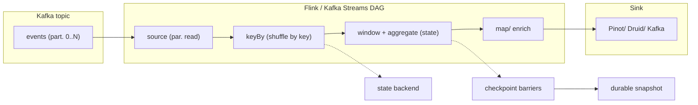
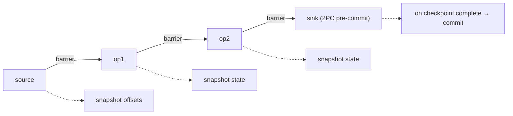
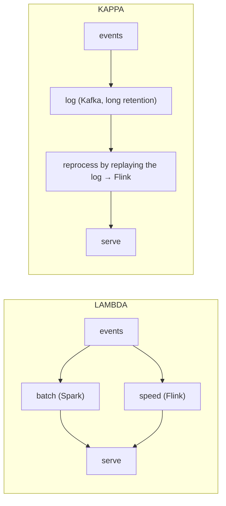
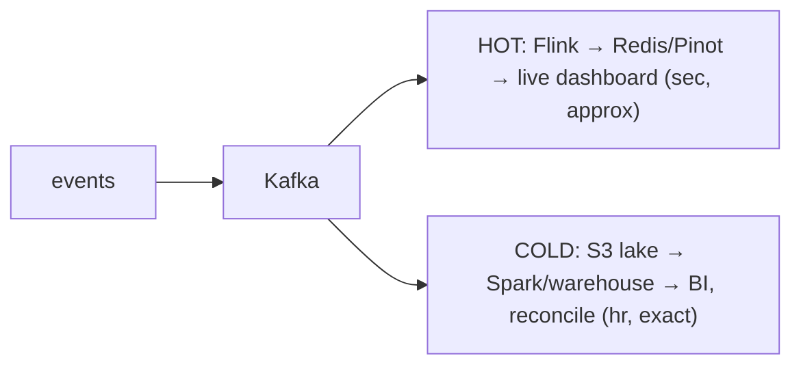
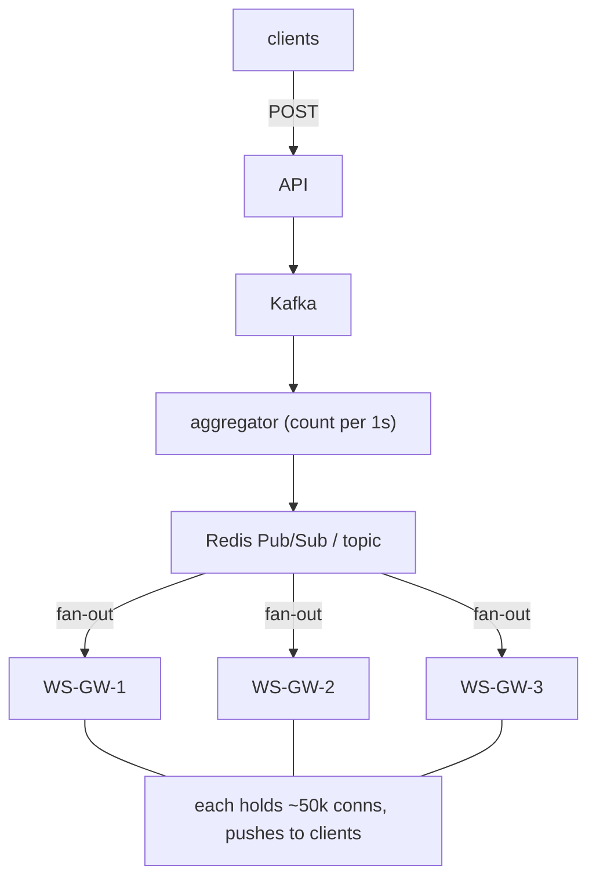

# Real-Time and Streaming Systems: Analytics, Leaderboards and Live Data

Real-time systems trade **completeness and cost for latency**. That single
sentence is the spine of every interview answer in this domain. A batch job can
be perfectly correct because it waits for all the data; a streaming job must emit
an answer *now*, before it has seen everything, so it must reason about late data,
duplicates, out-of-order events, and partial state. Every design choice below is
a point on the triangle of **latency vs completeness (correctness) vs cost**, and
the score in an interview is won by naming which corner you are optimizing and
what you give up for it.

This document is organized so that every section ends in trade-offs. The mental
model to carry throughout: an event has a **time it happened** (event time), a
**time it arrived** (ingestion time), and a **time you processed it** (processing
time). Almost every hard streaming problem — windowing, watermarks, exactly-once,
lambda vs kappa — is a consequence of the gap between these three clocks.

---

## Stream processing fundamentals and the streaming dataflow model

**Intuition.** Batch processing runs a function over a bounded dataset (a file, a
day's logs) and terminates. Stream processing runs a *standing query* over an
unbounded, never-ending sequence of events and produces continuously updated
results. Google's Dataflow model reframed this: batch is just a special case of
streaming where the window is "all of time" and you wait for the whole dataset.

**How it works.** A streaming job is a directed acyclic graph (DAG) of operators:
sources (Kafka topics), transformations (map, filter, keyBy, window, aggregate,
join), and sinks (OLAP store, Kafka, DB). The framework partitions the stream by
key and runs operator instances in parallel across a cluster. Two families:

- **Record-at-a-time (true streaming):** Apache Flink, Kafka Streams. Each event
  is processed as it arrives; latency can be single-digit milliseconds. State is
  held per operator (in RocksDB or heap) and checkpointed.
- **Micro-batch:** Spark Structured Streaming (classic mode). The stream is cut
  into tiny batches (e.g., 200ms–1s) and each is processed as a mini batch job.
  Higher latency floor (hundreds of ms) but reuses the batch engine and gives
  high throughput. (Spark's *Continuous Processing* mode targets ~1ms latency, but
  it has been experimental since Spark 2.3, is at-least-once, and supports only
  map-like stateless operations — rarely used in production, so don't cite it as a
  true peer of Flink's record-at-a-time engine in an interview.)



**Real-world usage.** Uber runs thousands of Flink jobs for surge pricing, fraud,
and ETA. Netflix uses Flink + Kafka for its Keystone pipeline (trillions of events
per day). Kafka Streams powers many "embedded in the microservice" use cases
because it is just a library, not a cluster.

**Trade-offs.**

| Engine | Latency floor | Throughput | State/complexity | When to pick |
|---|---|---|---|---|
| Flink | ~ms (record-at-a-time) | Very high | Rich state, event-time, exactly-once; needs a cluster | Low-latency, stateful, event-time correctness (fraud, CEP, joins) |
| Kafka Streams | ~ms | High | Library — no separate cluster; scales with app instances | You already run Kafka + microservices and want no new infra |
| Spark Structured Streaming | 100s of ms (micro-batch) | Very high | Reuses batch code; unified batch+stream | You have a Spark/batch shop and can tolerate sub-second-to-second latency |

- **Flink vs Kafka Streams:** Flink is a distributed system you operate; Kafka
  Streams is a JAR embedded in your service, scaled by adding app instances and
  bounded by Kafka partition count. Choose Kafka Streams for operational
  simplicity and tight coupling to a Kafka-centric microservice; choose Flink for
  huge state, complex event-time windows, and cross-stream joins.
- **Micro-batch vs record-at-a-time:** micro-batch amortizes overhead (great
  throughput, simpler exactly-once via idempotent batch writes) but you can never
  beat its batch interval on latency. Record-at-a-time gets you ms latency but
  per-record checkpointing and state management are harder to operate.

### Backpressure: how a slow operator throttles the whole pipeline

**Intuition.** Picture a bucket brigade passing water: if the person at the well end
(the sink) slows down, buckets pile up in the hands of the person before them, who
then stops taking new buckets from *their* upstream, and the stall ripples all the
way back to the source. **Backpressure** is exactly this: when one operator can't
keep up, its slowness propagates *upstream* until the source itself slows down.

**How it works.** Every operator reads from a **bounded input buffer**. If a slow
operator (say a sink writing to an overloaded DB) drains its buffer slower than data
arrives, the buffer fills. A full buffer means the *upstream* operator can no longer
hand off records, so it blocks; its own buffer then fills, and so on back to the
Kafka source — which stops polling. The visible symptom is **growing consumer lag**
(unread offsets pile up in Kafka) and **stalled watermarks** (the source stops
advancing event time, so windows stop firing). Flink implements this with
**credit-based flow control**: a downstream task advertises how many buffer
"credits" (free slots) it has, and an upstream task only sends as many records as
there are credits — so a backed-up consumer naturally throttles its producer without
dropping data.

**Why it matters for the follow-ups.** This is *the* reason lag / watermark-stall is
the primary streaming symptom to diagnose: almost every "my job fell behind" incident
traces to one backpressured operator (a skewed key, a slow sink, GC pauses). You find
the bottleneck operator (Flink's UI shows a backpressure indicator), then scale it,
fix key skew, or shed load.

**Trade-off.** Backpressure keeps the pipeline *correct* (no dropped data, bounded
memory) but converts a throughput problem into a *latency* problem — the whole job
slows to the speed of its slowest stage. The alternative, **load shedding** (dropping
data when overloaded), keeps latency low but sacrifices completeness. Pick shedding
only when stale-but-fast beats correct-but-late (live ops graphs); keep backpressure
for anything where every event must count (billing, fraud).

---

## Event time versus processing time and the three clocks

**Intuition.** A mobile game emits a "level complete" event at 10:00:00 (event
time). The phone is in a tunnel; the event uploads at 10:03:00 (ingestion time)
and your Flink operator handles it at 10:03:01 (processing time). If you bucket by
processing time, that score lands in the 10:03 window — wrong. If you bucket by
event time, it correctly lands in 10:00 — but you had to *wait* for it, or reopen
a closed window.

**How it works.** Frameworks let you choose the time semantics:

- **Processing time:** wall clock of the machine. Simplest and lowest latency; no
  waiting, no buffering. But results are **non-deterministic** — replaying the
  same data gives different windows, and any lag/backpressure shifts events into
  the wrong bucket.
- **Event time:** the timestamp embedded in the event. **Deterministic and
  correct** regardless of when data arrives, but requires a mechanism to decide
  "when have I seen enough of window W to emit it?" — that mechanism is the
  **watermark**.
- **Ingestion time:** timestamp stamped at the source operator. A compromise:
  more stable than processing time, but still wrong for events delayed before
  ingestion.

**Real-world usage.** Billing, fraud, and analytics almost always need event time
(a click at 11:59:59 belongs to that minute even if it lands at 12:00:02).
Ops dashboards and "events per second right now" often use processing time
because approximate-but-instant beats correct-but-late.

**Trade-offs.**
- Event time buys **correctness and reproducibility** at the cost of **latency**
  (you wait for stragglers) and **memory** (windows stay open holding state).
- Processing time buys **simplicity and instant results** at the cost of
  **correctness under lag** — a consumer that falls behind silently reassigns
  events to wrong windows. Pick processing time only when the window boundaries
  don't need to mean anything precise (e.g., "roughly last minute" health graphs).

---

## Windowing: tumbling, sliding, session and global windows

**Intuition.** To aggregate an unbounded stream you must slice it into finite
chunks called windows. The window type encodes what question you're asking.

**How it works.**

- **Tumbling window:** fixed size, non-overlapping, contiguous. "Count clicks per
  1-minute bucket." Each event belongs to exactly one window. Cheapest.
- **Sliding (hopping) window:** fixed size, fixed slide/hop < size, so windows
  overlap. "Average latency over the last 5 minutes, updated every 1 minute." An
  event belongs to `size/slide` windows, so state and compute multiply.
- **Session window:** dynamic size defined by a **gap of inactivity**. "Group a
  user's activity until they're idle for 30 minutes." Window boundaries depend on
  the data itself; merging windows is required when a late event bridges two.
- **Global window:** one window for all time, emitted only via custom triggers
  (used with Dataflow/Beam for arbitrary triggering logic).

```
Tumbling (size=5):  [0-5)[5-10)[10-15)          each event in 1 window
Sliding  (size=5, slide=2): [0-5)[2-7)[4-9)...  each event in ~2-3 windows
Session  (gap=2):   [e e e]--gap--[e e]         boundaries follow activity
```

**Capacity note.** A 10-minute sliding window with a 10-second slide = 60
overlapping windows; every event updates 60 aggregates. If you have 1M keys, that
is 60M active aggregate slots in state. Sliding windows are a classic memory
blow-up — prefer incremental/aggregating state or a tumbling window plus
downstream rollup.

**Trade-offs.**
- **Tumbling:** cheapest, simplest, but a boundary-straddling pattern (a spike at
  11:59:58–12:00:02) is split across two buckets. Use for billing/metering where
  clean, non-overlapping buckets are the requirement.
- **Sliding:** smooth moving averages and "last N minutes" SLA dashboards, at the
  cost of multiplied state/compute. Use when you need continuously updated rolling
  metrics.
- **Session:** the only choice for user-activity/engagement analysis, but the most
  expensive (variable state, window merges) and hardest to reason about under late
  data. Use for sessionization, funnels, and "time on site."

---

## Watermarks and handling late, out-of-order data

**Intuition.** A watermark is the framework's assertion: *"I believe I have now
seen all events with event time ≤ T."* It is a moving low-watermark of event time
that flows through the DAG as a special record. When the watermark passes the end
of a window, the window fires and emits its result.

**How it works.** The source generates watermarks, often as `maxEventTimeSeen -
boundedOutOfOrderness` (the **out-of-orderness bound** — how far behind the newest
timestamp you assume a straggler could still be). Because there is no way
to *know* the future, the watermark is a **guess about how out-of-order the stream
is**. Two failure directions:

- **Watermark too aggressive (small delay):** low latency, but events later than
  the watermark are **late data** — they arrive after their window closed.
- **Watermark too conservative (large delay):** you catch more stragglers
  (completeness) but every window emits later (latency) and holds state longer
  (memory).

> [!WARNING]
> **Two different knobs, easily conflated.** The **out-of-orderness bound**
> (`boundedOutOfOrderness`) sets **when a window *fires*** — the watermark must
> reach the window's end before it emits. **Allowed lateness** is a *separate*,
> window-level setting that decides **how long *after* firing** the window stays in
> state so it can accept still-later events and re-emit. One controls the firing
> deadline; the other controls the post-firing grace period. In Flink they are set
> independently (`WatermarkStrategy.forBoundedOutOfOrderness(...)` vs
> `.allowedLateness(...)`).

Handling late data (Flink/Beam options):
1. **Drop** late events (simplest; acceptable for approximate dashboards).
2. **Allowed lateness:** keep the window in state for an extra grace period *after
   it has already fired* and **re-emit an updated (retraction/update) result** when
   a late event arrives.
3. **Side output** late events to a dead-letter/repair stream for a slow reconcile
   path (this is essentially the cold path of a lambda architecture).

**Worked example (numbers in → numbers out).** Window `[10:00:00, 10:00:05)`
(5-second tumbling), `boundedOutOfOrderness = 3s`, `allowedLateness = 10s`. Watch
the two knobs act at different moments:

| Wall step | Event (event-time, value) | `maxEventTimeSeen` | Watermark = max − 3s | Effect on window [00,05) |
|---|---|---|---|---|
| 1 | (10:00:01, +1) | 10:00:01 | 09:59:58 | buffered; count=1 |
| 2 | (10:00:04, +1) | 10:00:04 | 10:00:01 | buffered; count=2 |
| 3 | (10:00:08, +1) | 10:00:08 | 10:00:05 | **watermark ≥ 05 ⇒ window FIRES, emits count=2** |
| 4 | (10:00:03, +1) | 10:00:08 | 10:00:05 | late, but watermark < windowEnd(05)+10s grace ⇒ window still in state ⇒ **re-emits count=3** |
| 5 | (10:00:02, +1) at wall 10:00:20 | 10:00:20 | 10:00:17 | now past 05+10s grace ⇒ **dropped / side-output** |

So the out-of-orderness bound is what made step 3 fire (it took an event 3s past the
window end to push the watermark to `05`); allowed lateness is what let step 4
*correct* the already-emitted `2` up to `3`; and step 5 shows the grace period
finally closing. The final committed value is **3**.

```
 event time →  ...  8   9  10  11  12  13
 watermark  W(t) says "seen everything ≤ 10"  ──────▶ fires window [5,10)
 then event with ts=9 arrives  ⇒ LATE  ⇒ drop | update within allowedLateness | side-output
```

**Real-world usage.** Uber's ad-event system sidesteps watermarks by keying events
to a truncated 1-minute bucket and using a tumbling window, so late arrivals still
land in the right bucket regardless of delay — a common pragmatic pattern. Why it
works: the bucket key is computed from the event's *own* timestamp
(`floor(eventTime, 1min)`), so an event that lands 20 minutes late still maps to and
increments its *correct* bucket rather than a wrong "now" bucket. The price is that
a bucket is never definitively **final** — you rely on **upsert / re-aggregation**
in the sink (Pinot upsert) to keep updating the count instead of trusting a
watermark deadline to declare the bucket closed. You trade a hard "done" signal for
correctness under arbitrary lateness. Most Flink SQL analytics jobs instead configure
a bounded-out-of-orderness watermark (e.g., 5s) plus allowed lateness.

**Trade-offs.**
- The watermark delay is the **direct dial between latency and completeness**.
  There is no free lunch: shrink it and you drop more late data; grow it and every
  result is slower and costs more memory. In an interview, quantify it: "a 5s
  watermark drops the ~0.1% of events later than 5s but emits windows within ~5s;
  we side-output the tail to a nightly reconcile for billing accuracy."

---

## Stream joins: stream-stream and stream-table

**Intuition.** Joining two *bounded* tables is easy — everything is already there.
Joining two *unbounded* streams is hard for the same reason windowing is: a matching
record for the row you have now might arrive seconds later, or might never arrive. So
you can't "wait for the whole other side"; you must buffer one or both sides in state
and decide *how long to wait for a match*. That deadline is, once again, driven by
the **watermark**.

**How it works — two flavors:**

- **Stream-stream join (both sides are live streams).** You correlate events from
  two streams that happen "near each other" in event time — e.g., join `ad_impression`
  with `ad_click` to attribute clicks. Because a click can lag its impression, you
  can't join instantaneously; you buffer both sides in state and bound the match with
  a window:
  - **Windowed join:** only rows whose event times fall in the *same* window can
    match.
  - **Interval join:** row `L` matches row `R` if `R.time ∈ [L.time − a, L.time + b]`
    (e.g., "a click within 30 min *after* an impression"). Both sides are kept in
    state, and the **watermark lets the engine evict** rows whose match interval has
    fully passed — that eviction is what bounds state growth.
- **Stream-table join (enrichment).** One side is a stream of events; the other is a
  slowly-changing "table" (a dimension/lookup — user profile, product catalog),
  usually materialized from a **changelog stream** (CDC / compacted Kafka topic). Each
  event is enriched against the *current* table value. A **temporal join** pins the
  lookup to the version of the row that was valid *at the event's event time* (so a
  price change last week doesn't rewrite last month's orders).

**Worked example (interval join, numbers in → numbers out).** Attribute clicks to
impressions with interval `[impression.time, impression.time + 30min]`, watermark
lag 1 min.

| Event | Kept in state? | Match |
|---|---|---|
| impression `imp1` @ 10:00 | buffered until watermark > 10:30 | — |
| click `clk1` @ 10:05 | probe imp-state | 10:05 ∈ [10:00, 10:30] ⇒ **emit (imp1, clk1)** |
| click `clk2` @ 10:50 | probe imp-state | 10:50 ∉ [10:00, 10:30] ⇒ no match, drop |
| watermark reaches 10:31 | — | `imp1` interval fully past ⇒ **evict imp1 from state** |

So `imp1` occupies state for ~30 min + the 1-min watermark slack, then is reclaimed —
the interval plus watermark is precisely what keeps join state from growing forever.

**Trade-offs.**
- **State growth is the whole game.** A stream-stream join buffers events for the full
  join window; a wide window or high event rate means large state (use RocksDB, and
  keep the window as tight as the business allows). An *unbounded* join (no window,
  join on a key that can match at any time) will grow state forever — you **must**
  attach a **state TTL** to evict stale keys, accepting that a very-late match is
  missed.
- **Late data cuts both ways.** With a tight watermark you evict one side before a
  straggler on the other side arrives, silently missing joins (under-counting
  attributions); a looser watermark catches more matches but holds more state longer
  and emits later. Same latency-vs-completeness dial as windowing.
- **Stream-table freshness vs correctness.** A plain lookup against the *latest* table
  value is simple and cheap but can mis-attribute historical events after the
  dimension changes; a temporal join is correct-by-event-time but needs versioned
  (changelog) state and more memory. Pick temporal joins when the dimension changes
  meaningfully over the data's lifetime (prices, exchange rates).

---

## Exactly-once, at-least-once and at-most-once semantics in streaming

**Intuition.** "Exactly-once" in streaming almost never means each event physically
traverses the network once. It means **exactly-once effect on state / output** —
the result is as if each event were processed once, even across failures and
retries. This is achieved with **idempotency + atomic state commits**, not magic.

**How it works.** Three delivery classes:
- **At-most-once:** fire and forget; on failure you lose data. Lowest latency/cost.
- **At-least-once:** retry until acked; duplicates possible. Requires downstream
  idempotency to be correct.
- **Exactly-once (effectively-once):** achieved via one of:
  - **Checkpointing + rollback (Flink):** the Chandy-Lamport distributed snapshot
    algorithm injects **checkpoint barriers** into the stream. All operators
    snapshot their state at the same logical point; on failure the whole job
    rewinds to the last complete snapshot and reprocesses. Because Kafka sources
    rewind offsets and state resets atomically, effect is exactly-once *within the
    pipeline*.
  - **Transactional sinks / two-phase commit:** to extend exactly-once to the
    outside world, the sink participates in 2PC. Flink's `TwoPhaseCommitSinkFunction`
    + Kafka transactions: output is written but uncommitted until the checkpoint
    completes, then committed. Consumers read in `read_committed` mode.
  - **Idempotent writes / upserts:** attach a unique key (UUID, or
    `entity+window`) and let the sink dedupe (Pinot **upsert**, DB `UPSERT`,
    dedupe by key). This turns at-least-once delivery into exactly-once *state*.



Flink barrier alignment (exactly-once). On failure: restore all snapshots +
rewind Kafka offsets + abort uncommitted txn.

**Operational depth (a senior is expected to know these).**
- **State backend.** State lives either on the JVM **heap** (fast, but bounded by
  memory and GC pressure) or in **RocksDB** (an embedded on-disk key-value store).
  RocksDB holds state far larger than RAM and, crucially, enables **incremental
  checkpoints** — each checkpoint uploads only the changed data files rather than the
  whole state, which is what makes multi-terabyte state checkpoint cheaply.
- **Checkpoint vs savepoint.** A **checkpoint** is automatic, periodic, and owned by
  the framework for *failure recovery* (often cleaned up on success). A **savepoint**
  is a manual, portable, self-contained snapshot you trigger for *planned* operations
  — upgrading job code, changing parallelism (rescaling), or migrating clusters —
  and it survives job restarts.
- **Aligned vs unaligned checkpoints.** By default a barrier waits at each operator
  for *all* input channels to reach it (**alignment**) — under backpressure a slow
  channel stalls the whole checkpoint. **Unaligned checkpoints** let the barrier
  overtake buffered in-flight data (snapshotting that data too), so checkpoints still
  complete quickly under heavy backpressure, trading a larger snapshot for not
  stalling.

**Real-world usage.** Uber's ad platform layers all three: Flink checkpoints (2-min
interval) + Kafka read_committed 2PC + per-record UUID for Pinot upsert and
Ad-Budget idempotency. This defense-in-depth is typical: even with pipeline
exactly-once, the *sink* dedupe protects against edge cases and reprocessing.

**Trade-offs.**
- **Exactly-once costs latency and throughput.** Barrier alignment stalls fast
  operators to wait for the slowest input; 2PC couples output visibility to the
  checkpoint interval (Uber's outputs lag by up to ~2 min). Larger checkpoints =
  more recovery-safe but higher steady-state overhead.
- **At-least-once + idempotent sink** is often the pragmatic winner: cheaper,
  lower latency, and if your sink is an upsert or your operation is idempotent you
  get exactly-once *effect* without 2PC. Reach for full transactional exactly-once
  only when the sink cannot be made idempotent (e.g., appending to a non-keyed
  ledger) and duplicates are unacceptable (payments, billing counters).
- **Unavoidable caveat:** true end-to-end exactly-once requires the *source* to be
  replayable (Kafka) and the *sink* to be transactional or idempotent. A
  non-replayable source (a UDP firehose) or a non-idempotent side effect (sending
  an email, charging a card) breaks the guarantee — you must dedupe at that edge.

---

## Real-time OLAP: Druid, Pinot and ClickHouse versus batch warehouses

**Intuition.** A transactional DB (row store) is optimized for point reads/writes;
a data warehouse (Snowflake/BigQuery) is optimized for scanning huge tables but
with minute-to-second query latency and batch ingestion. Real-time OLAP stores
(**Apache Druid, Apache Pinot, ClickHouse**) fill the gap: **sub-second aggregation
queries over freshly ingested (seconds-old) data at high QPS**. They power live
user-facing analytics and dashboards.

**How it works.** All three are columnar, use compression and indexing (bitmap /
inverted / min-max), and pre-aggregate or roll up on ingest. They ingest directly
from Kafka for real-time segments while older data is stored as immutable columnar
segments on cheap storage.

- **Apache Pinot** (LinkedIn/Uber): built for **high-QPS, low-latency,
  user-facing** analytics (LinkedIn "Who viewed your profile", Uber Eats
  restaurant dashboards). Star-tree index for fast aggregation; **upsert** support
  for real-time correctness.
- **Apache Druid** (Metamarkets/Netflix/Airbnb): time-series-oriented, great for
  operational dashboards and slice-and-dice over event streams; strong real-time
  ingestion and rollup.
- **ClickHouse** (Yandex/Cloudflare): blazing single-node and clustered scan
  performance; SQL-native; excellent for logs/observability and analytics where
  you want a general SQL engine. Cloudflare serves analytics for millions of
  domains on ClickHouse.

```
Hot (real-time)                         Cold (historical)
Kafka ─▶ Druid/Pinot real-time nodes ─▶ deep storage (S3) segments
          seconds-old, in-memory        immutable, columnar, queried by
          queried immediately           historical/server nodes
Query: broker scatter-gathers across real-time + historical → merges → sub-second
```

**Trade-offs.**

| Store | Sweet spot | QPS | Latency | Weakness |
|---|---|---|---|---|
| Pinot | User-facing, high concurrency, upserts | 10k+ QPS | ms–sub-sec | Ops complexity, many node types |
| Druid | Time-series ops dashboards, rollup | High | sub-sec | Joins historically weak; segment mgmt |
| ClickHouse | SQL analytics, logs, flexible queries | Moderate–high | ms–sub-sec | Real-time upserts/mutations awkward; concurrency limits vs Pinot |
| Warehouse (Snowflake/BigQuery) | Ad-hoc, complex joins, huge scans | Low | seconds–min | Not real-time; batch ingest; expensive per query |

- **Real-time OLAP vs warehouse:** OLAP stores give **freshness + high concurrency
  + low latency** but sacrifice **flexibility (complex joins, ad-hoc), storage
  cost efficiency, and ease of correction** (immutable segments make updates
  awkward). Warehouses give SQL flexibility and cheap deep storage but are batch
  and not user-facing-latency. Interview rule: user-facing dashboard at high QPS →
  Pinot/Druid; internal ad-hoc analytics / joins across many tables → warehouse.
- **Pinot vs ClickHouse:** Pinot wins on **concurrency** (thousands of concurrent
  user queries) and native upserts; ClickHouse wins on **SQL expressiveness and
  raw scan speed** for fewer, heavier queries (observability). Choose Pinot for a
  public per-user metrics page; ClickHouse for an internal logs/metrics explorer.
- **Pre-aggregation (rollup):** rolling up on ingest cuts storage and speeds
  queries but **destroys raw granularity** — you can't later drill into dimensions
  you rolled away. Trade retention/cost against future query flexibility.

---

## Lambda architecture versus Kappa architecture

**Intuition.** How do you serve both a *fast, approximate* real-time view and a
*slow, correct* historical view? **Lambda** runs two pipelines; **Kappa** runs one.

**Lambda architecture.** Two paths that a serving layer merges:
- **Batch layer:** recomputes accurate views from the full immutable dataset
  (Hadoop/Spark on the data lake). Correct but hours-stale.
- **Speed layer:** a stream processor produces approximate, incremental real-time
  views to cover the gap since the last batch run.
- **Serving layer:** queries merge batch + speed views.



**Kappa architecture.** One streaming pipeline. To "recompute history," you
**replay the immutable log** (Kafka with long retention or tiered storage) through
the same stream job — no separate batch code. Correction = reprocess from offset 0
into a new output table, then swap.

**Real-world usage.** Lambda was popularized by Nathan Marz (Storm/Twitter). Kappa
(Jay Kreps, LinkedIn) emerged as stream engines got exactly-once and Kafka got
cheap long retention (tiered storage). Modern shops (Uber, Netflix) lean Kappa-ish
but still keep a batch reconcile path for billing-grade correctness — i.e., a
pragmatic hybrid.

**Trade-offs.**
- **Lambda** buys **correctness with a safety net** (batch always fixes the truth)
  but you **maintain two codebases** implementing the same logic in two engines —
  a notorious source of drift and bugs. Pick when batch and stream logic genuinely
  differ, or you need a strong correctness backstop for financial data.
- **Kappa** buys **one codebase, one mental model** but demands **replayable
  retention** (storage cost) and a stream engine strong enough to be the source of
  truth (exactly-once, event-time). Reprocessing a year of data through a stream
  job can be slow/expensive. Pick when your logic is uniform and your log
  retention/reprocessing budget is adequate — the modern default for greenfield.

---

## Hot path and cold path: the speed and accuracy split

**Intuition.** Split traffic by *time horizon*. The **hot path** answers "what is
happening in the last few seconds/minutes" with low latency and approximation; the
**cold path** answers "what is the exact historical truth" with high latency and
completeness. This is the operational generalization of lambda/kappa.

**How it works.** Events fan out: the hot path (Kafka → Flink → Redis/Pinot) serves
live dashboards and alerts in seconds; the cold path (Kafka → data lake → Spark →
warehouse) computes daily/hourly exact aggregates, backfills, and corrects the hot
path's approximations. A reconciliation job overwrites hot-path estimates with
cold-path truth.



**Trade-offs.** The hot path optimizes latency and cost-per-freshness but is
approximate and has bounded retention/state; the cold path optimizes correctness
and retention but is slow and can't serve live UI. The design risk is **divergence**
— two systems computing "the same" number differently. Mitigate by deriving both
from the same immutable log and reconciling on a schedule.

---

## Leaderboards with Redis sorted sets

**Intuition.** A leaderboard is a live ranking: insert/update a score, and query
"top N" or "what's my rank." A relational `ORDER BY score LIMIT N` plus a
`COUNT(*) WHERE score > mine` for rank is O(N) per rank query and murders the DB at
scale. The right primitive is a **Redis sorted set (ZSET)**.

**How it works.** A ZSET keeps members ordered by a floating-point score using a
**skip list + hash map**, giving:
- `ZADD board score member` — insert/update: **O(log N)**
- `ZREVRANGE board 0 9 WITHSCORES` — top 10: **O(log N + M)**
- `ZREVRANK board member` — a player's rank: **O(log N)**
- `ZINCRBY board delta member` — atomic score bump: **O(log N)**

All rank operations are logarithmic because the skip list maintains span counts.
This is why Redis is the near-universal answer for leaderboards.

**Capacity / back-of-envelope.** ~100M players in one ZSET ≈ each entry ~ (member
string + score + skiplist overhead) ~60–100 bytes ⇒ **~6–10 GB** of RAM — feasible
on one large node but a single-point hotspot. Top-10 reads are cheap; the hot
operation is frequent `ZINCRBY` writes on a popular board.

**Scaling and sharding.**
- **Vertical first:** one ZSET on one node handles surprisingly high load
  (100k+ ops/s) because ops are O(log N). Prefer this until it doesn't fit.
- **Sharding by range/hash breaks global rank:** if you split players across N
  shards, `ZREVRANK` is no longer a single-shard answer — global rank requires
  querying all shards and merging. Approaches:
  - **Bucketed / hierarchical:** maintain per-shard ZSETs plus a coarser
    "count of players per score bucket" summary to compute approximate global rank
    in O(#buckets).
  - **Replicas for reads:** replicate the ZSET for read scaling (top-N reads
    dominate); writes still funnel to the primary.
- **Time-windowed boards** (daily/weekly): key per window (`board:2026-07-16`) with
  a TTL — naturally shards load across time and bounds memory.

**Approximation at extreme scale.** For "rank among 500M players updated live,"
exact rank is prohibitively expensive. Approximate with:
- **Score-bucket histograms:** count players per score bucket; rank ≈ sum of
  counts above your bucket. O(buckets), approximate but cheap.
- **Percentile sketches (t-digest, CKMS):** answer "you're in the top 3%" without
  exact position.
- Users rarely need exact rank beyond the top; "top 100 exact + your approximate
  percentile" is the standard product compromise.

**Trade-offs.**
- **Redis ZSET vs SQL:** ZSET gives O(log N) live ranking and top-N; SQL gives
  durability, ad-hoc queries, and no memory ceiling but O(N) ranking that collapses
  under load. Use Redis as the serving/index layer, keep the durable score in a DB,
  and rebuild the ZSET on failover.
- **Exact vs approximate rank:** exact global rank across shards costs a
  scatter-gather on every query; approximation (buckets/sketches) is O(buckets) and
  usually indistinguishable to users past the top ranks. Pick exact only for small
  or top-only boards.
- **Single ZSET (hotspot) vs sharded (complexity):** one ZSET is simplest and
  correct but a write hotspot and memory ceiling; sharding scales writes/memory but
  destroys cheap global rank. Choose based on whether *global rank* is a product
  requirement or just *top-N + my-neighborhood*.
- **Durability:** Redis is in-memory; enable AOF/RDB and treat the DB as source of
  truth. A ZSET is a rebuildable index, not the ledger.

---

## Real-time dashboards and live analytics serving

**Intuition.** A dashboard needs metrics that are fresh (seconds), queryable at
high concurrency (many viewers), and cheap enough to keep always-on. The naive
"run a query against production DB per refresh" doesn't scale; you pre-aggregate on
the write path and serve from a store built for it.

**How it works.** Two serving patterns:
- **Pre-aggregate on ingest (push):** Flink computes windowed aggregates and writes
  them to a fast store (Pinot/Druid/Redis). Queries are cheap lookups. Best for
  known metrics.
- **Query-time aggregation (pull):** raw/columnar data in an OLAP store; the
  dashboard issues aggregation queries at read time. Flexible (ad-hoc dimensions)
  but heavier per query.

**Delivery to the browser:** WebSocket / Server-Sent Events (SSE) for push, or
short polling for simplicity. SSE is one-way server→client (ideal for dashboards),
cheaper than WebSockets, and reconnects/auto-retries natively.

**Trade-offs.**
- **Pre-aggregate vs query-time:** pre-aggregation is fast and cheap to serve but
  rigid — you can only show metrics you decided to compute, and adding a dimension
  means reprocessing. Query-time is flexible but costs more per view and needs a
  powerful OLAP store. Choose pre-aggregation for fixed high-traffic dashboards,
  query-time for exploratory/BI.
- **Push (WebSocket/SSE) vs poll:** push gives instant updates and low overhead at
  steady state but requires stateful connections (harder to scale/load-balance);
  polling is stateless and trivial to cache but wastes requests and adds latency.
  For thousands of viewers of the same dashboard, **fan-out from a pub/sub + SSE**
  beats per-client polling.

---

## Live comments, reactions and high-fan-out broadcast systems

**Intuition.** A live-stream chat or reaction bar (think a sports stream with 1M
concurrent viewers) has a brutal **fan-out**: one comment must reach millions of
clients in ~1s, and reactions can spike to millions per minute. The write rate is
manageable; the **read/broadcast amplification** is the hard part.

**How it works.**
- **Ingest:** clients POST comments / reactions to a stateless API → Kafka.
- **Fan-out:** a tier of WebSocket/SSE gateway servers each hold a subset of the
  connections; they subscribe to the relevant channel (via Redis Pub/Sub or a
  Kafka topic) and push new messages to their connected clients. Consistent hashing
  or a channel→server registry routes connections.
- **Reactions are aggregated, not delivered individually.** You do **not** send 1M
  individual "❤" events to every client. Instead, a stream job counts reactions per
  short window (e.g., 1–2s) and broadcasts an aggregate ("+12,000 ❤ this second"),
  or clients sample/animate locally. This converts O(N²) fan-out into O(N).
- **Comment throttling / sampling:** at extreme scale you cannot show every comment;
  systems sample, rate-limit per user, and prioritize (creator, moderators,
  Super Chat) — YouTube/Twitch do this.



**Capacity / back-of-envelope.** 1M concurrent viewers, each idle connection ~
tens of KB of server memory ⇒ tens of GB across the gateway fleet; at ~50k conns
per gateway you need ~20 gateways just for connections. If every viewer reacted
once/sec and you delivered individually, that's 1M×1M = 10^12 messages/sec —
obviously impossible, which is *why* you aggregate.

**Trade-offs.**
- **Deliver-every-message vs aggregate/sample:** delivering every comment/reaction
  gives fidelity but is O(N²) and impossible past ~100k concurrent; aggregation and
  sampling scale to millions but lose individual events (a user may not see their
  own reaction reflected exactly). For live chat, sample; for 1:1 DMs, deliver all.
- **WebSocket vs SSE vs long-poll:** WebSocket is bidirectional and lowest-latency
  (good for chat where clients also send) but stateful and heavier to scale; SSE is
  simpler and great for one-way reaction/count push; long-poll is a compatible
  fallback. Choose per direction: chat input → WebSocket; count broadcast → SSE.
- **Consistency vs latency:** live comment ordering is typically **best-effort /
  eventually consistent** — perfect global ordering across millions of clients
  isn't worth the latency. Accept slight reordering and occasional drops to keep
  latency sub-second.
- **Redis Pub/Sub vs Kafka for fan-out:** Redis Pub/Sub is fire-and-forget, ultra
  low latency, but non-durable (a disconnected gateway misses messages); Kafka is
  durable and replayable but higher latency. Use Redis Pub/Sub for the last-hop
  ephemeral broadcast and Kafka for the durable ingest/aggregation backbone.

---

## Latency versus completeness versus cost: the governing trade-off

**Intuition.** Every decision above is a projection of one triangle. You cannot
maximize all three:
- **Latency:** how fresh is the answer?
- **Completeness / correctness:** did you count all the (late, out-of-order,
  deduped) data?
- **Cost:** compute, memory, storage, and operational complexity.

**How the dials interact.**
- Lower latency (small watermark, small window, processing time) ⇒ less complete
  (drop late data) and often cheaper (less state).
- More complete (large watermark, allowed lateness, exactly-once, cold-path
  reconcile) ⇒ higher latency and higher cost (state, 2PC, dual pipelines).
- Cost caps both: infinite budget lets you keep everything and reprocess, but
  real systems bound retention, state size, and query concurrency.

**Interview framing (say this out loud).** "For a live ops dashboard I'll optimize
**latency** and accept approximation: processing-time-ish windows, drop late data,
serve from Redis/Pinot — cheap and instant. For billing counters I'll optimize
**completeness**: event-time windows with allowed lateness, exactly-once via
transactional sinks, plus a nightly cold-path reconcile — slower and costlier but
correct. The product requirement tells me which corner to sit in."

**Trade-offs summary table.**

| Requirement | Optimize | Design | Sacrifice |
|---|---|---|---|
| Live ops metrics / "now" graph | Latency | Processing time, drop late, Redis/Druid | Correctness of late data |
| Billing / metering | Completeness | Event time, allowed lateness, exactly-once, reconcile | Latency, cost |
| Fraud detection | Latency + correctness | Flink CEP, event time, tight watermark, at-least-once + dedupe | Cost (must pay for both) |
| Leaderboard top-N | Latency | Redis ZSET, single node | Global-rank precision at extreme scale |
| Historical BI | Cost + completeness | Batch to warehouse | Freshness |

---

## Common interview follow-up questions

1. **"Your Flink job's consumer lag is growing. What's happening and how do you
   respond?"** Backpressure — a downstream operator/sink can't keep up, so
   watermarks stall and windows stop firing. Diagnose the slow operator (sink,
   skewed key), scale it, repartition to fix key skew, or shed load. Note that with
   processing-time windows lag silently corrupts results.
2. **"How do you get exactly-once when your sink is a REST API that charges a
   card?"** You can't make the external side effect transactional, so make it
   **idempotent** with an idempotency key derived from `event+window`; the API
   dedupes. Pipeline exactly-once (checkpoints) + idempotency key = effectively
   once.
3. **"Global rank for 500M players, live."** Don't do exact global rank per query.
   Serve exact top-N from a ZSET, and approximate personal rank with score-bucket
   histograms or a t-digest sketch. Explain the accuracy/cost trade.
4. **"Lambda or Kappa for a new analytics platform?"** Default Kappa (one codebase,
   replay the log) if retention/reprocessing budget allows and logic is uniform;
   keep a batch reconcile path if you need financial-grade correctness. Call out the
   two-codebase drift risk of lambda.
5. **"1-minute tumbling vs 1-minute sliding for a fraud rule?"** Sliding catches a
   burst that straddles a boundary (better recall) at multiplied state cost; tumbling
   is cheaper but can split a burst across buckets. For fraud, sliding or overlapping
   windows usually win.
6. **"Pinot vs ClickHouse vs Druid for a user-facing per-account analytics page at
   50k QPS?"** Pinot — built for high concurrency and upserts; ClickHouse struggles
   with that concurrency, Druid is viable but Pinot's star-tree + upsert fit best.
7. **"How do you reprocess a bug in a Kappa pipeline?"** Deploy the fixed job, replay
   from the earliest offset into a *new* output table/topic, validate, then atomically
   swap the serving pointer. Requires long log retention or tiered storage.
8. **"How do reactions scale to a 10M-viewer livestream?"** Aggregate per short
   window and broadcast counts (not individual events); sample/throttle comments;
   fan out via a WebSocket/SSE gateway fleet fed by Redis Pub/Sub over a Kafka
   backbone. Explain the O(N²)→O(N) reduction.

## References

- Alex Xu, *System Design Interview* Vol. 1 & 2 (leaderboards, real-time analytics,
  live comment/notification chapters) and the ByteByteGo blog & newsletter.
- Martin Kleppmann, *Designing Data-Intensive Applications* (DDIA) — Ch. 11 Stream
  Processing (event time vs processing time, windows, exactly-once, log-based
  systems), Ch. 10 Batch Processing.
- Akidau et al., "The Dataflow Model" (VLDB 2015) and *Streaming Systems* (O'Reilly)
  — watermarks, triggers, windowing, "what/where/when/how."
- Apache Flink docs — event time, watermarks, checkpointing (Chandy-Lamport),
  TwoPhaseCommitSinkFunction, exactly-once with Kafka.
- Uber Engineering blog, "Real-Time Exactly-Once Ad Event Processing with Flink,
  Kafka, and Pinot."
- Netflix Tech Blog — Keystone real-time data pipeline (Kafka + Flink).
- Apache Pinot / Apache Druid / ClickHouse official docs and architecture pages;
  Cloudflare blog on ClickHouse analytics; LinkedIn engineering on Pinot.
- Redis docs — Sorted Sets (ZADD/ZRANGE/ZRANK complexity) and leaderboard patterns.
- Jay Kreps, "Questioning the Lambda Architecture" (Kappa); Nathan Marz on Lambda.
- ByteByteGo, Gaurav Sen, Hussein Nasser, and "Jordan has no life" YouTube channels
  on streaming, Kafka internals, Flink, and real-time analytics system design.
