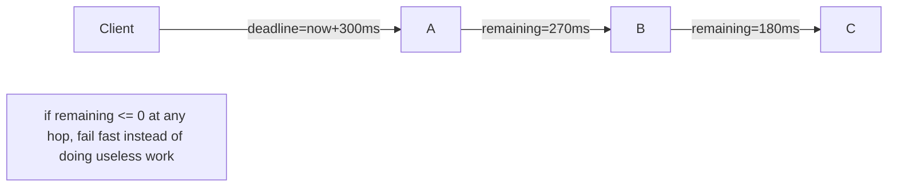
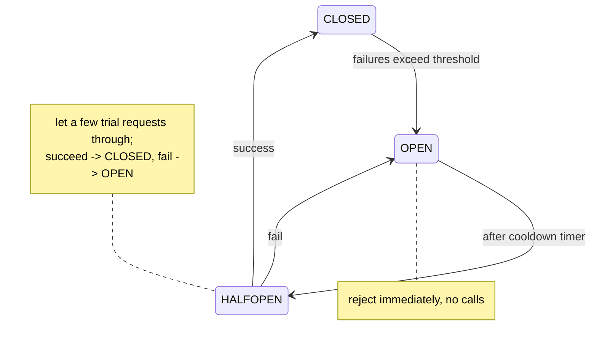
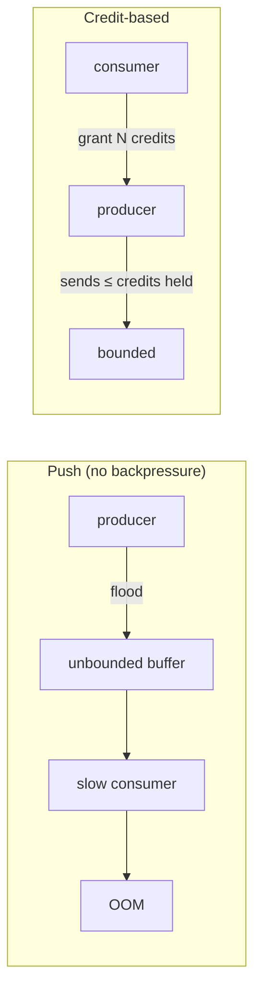
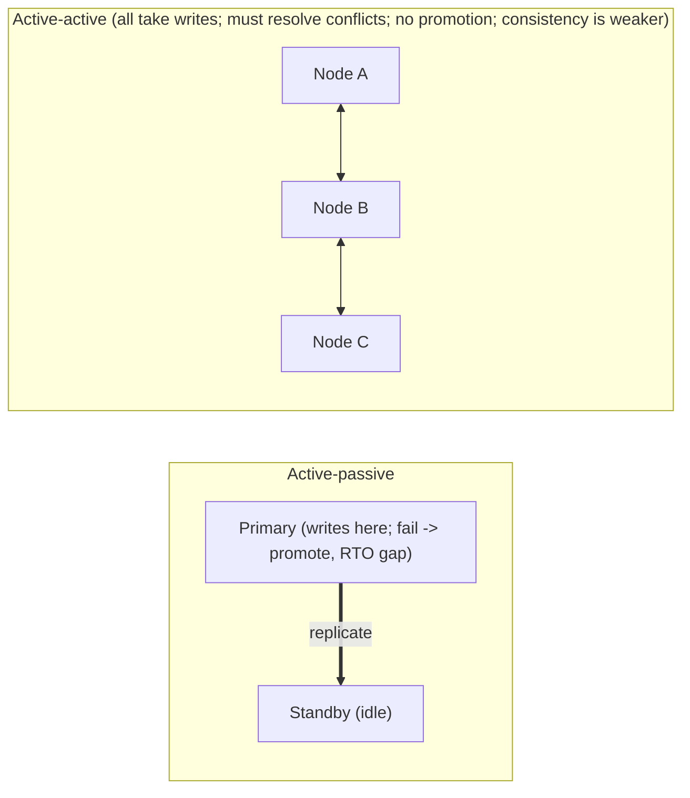
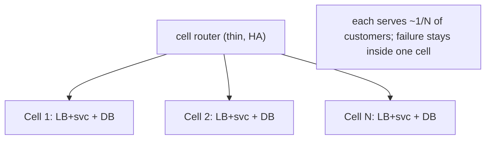

# Resilience, Fault Tolerance and Design Trade-offs Deep-Dive

This is *the* trade-offs topic. Every other system-design decision — which
database, which consistency model, sync vs async, monolith vs microservices —
ultimately resolves into the same question: **what are you willing to give up,
and when?** Resilience engineering is the discipline of designing systems that
keep serving useful work while things fail, *without* paying for guarantees you
don't need.

A single mental model to carry throughout this document:

> **Every resilience mechanism spends one resource to protect another.** Retries
> spend latency and load to buy success probability. Circuit breakers spend
> availability (they fail fast) to buy recovery time and protect a struggling
> dependency. Redundancy spends money and consistency to buy uptime. In an
> interview, naming *what you spend* and *what you buy* — and the crossover point
> where the trade flips — is the strongest possible signal.

Failure is not an edge case at scale. At 10,000 servers with a per-server annual
failure rate of 2%, you expect ~200 machine failures a year — roughly one every
1.8 days — before you count disk, network, and dependency failures. Design for
"something is always broken," not "everything is healthy."

---

## Fallacies of distributed computing

**Intuition.** In 1994–97 Peter Deutsch and colleagues at Sun catalogued the
false assumptions engineers keep baking into distributed systems. They are the
root cause of most outages, and interviewers love when you name them explicitly
because each fallacy maps directly to a resilience pattern.

The eight fallacies:

1. **The network is reliable.** → you need retries, timeouts, idempotency.
2. **Latency is zero.** → you need timeouts, batching, locality, caching.
3. **Bandwidth is infinite.** → you need backpressure, pagination, compression.
4. **The network is secure.** → you need TLS, authn/authz, zero-trust.
5. **Topology doesn't change.** → you need service discovery, no hardcoded IPs.
6. **There is one administrator.** → you need versioning, backward compat.
7. **Transport cost is zero.** → serialization/marshalling and egress cost real money.
8. **The network is homogeneous.** → you need standard protocols, tolerate diversity.

**How it manifests.** The classic bug: a synchronous call with no timeout to a
service that is slow (not down). The caller's threads all block waiting, the
thread pool exhausts, and the caller *becomes* unavailable even though it is
perfectly healthy. The fallacy "latency is zero / the network is reliable" turned
one slow dependency into a full outage — a **cascading failure**.

**Trade-offs.** Defending against every fallacy has a cost: timeouts add
complexity and false positives; TLS adds CPU and handshake latency; service
discovery adds a dependency that can itself fail. You don't defend against all
eight equally — you defend proportional to blast radius. A batch job that runs
nightly can ignore latency; a synchronous checkout path cannot.

---

## Timeouts and deadlines

**Intuition.** A timeout is the maximum time you will wait before giving up. Its
job is to convert an *unbounded* wait (a hung dependency) into a *bounded*
failure you can handle. Without timeouts, one slow dependency exhausts your
connection pool / thread pool and takes you down. Timeouts are the single most
important and most neglected resilience primitive.

**How it works.**

- **Connection timeout** vs **request/read timeout** vs **overall (end-to-end)
  timeout** — set all three. A common bug is setting a read timeout but leaving
  connection establishment unbounded.
- **Set the timeout from the latency distribution, not a guess.** A good default:
  set the client timeout near the server's **p99.9** for that call, plus a small
  margin. If server p99 is 40 ms and p99.9 is 120 ms, a 100 ms timeout will
  spuriously fail ~0.1%+ of healthy requests.
- **Deadline propagation (deadlines, not timeouts).** The modern pattern (gRPC,
  Google's "deadlines"): the *entry* service sets an absolute deadline (e.g.
  "now + 300 ms") and passes it downstream. Each hop subtracts elapsed time and
  passes the *remaining* budget. This prevents the wasteful case where service A
  has already given up but B, C, D keep working on a doomed request.



**Trade-offs.**

| Timeout setting | Gain | Give up | When |
|---|---|---|---|
| Aggressive (near p99) | Fast failure, threads freed quickly, cascades contained | Spurious failures of slow-but-valid requests; more retries | Latency-critical user paths |
| Loose (near p99.99 or none) | Fewer false failures | Threads pile up; slow dependency can take you down | Batch/async work, idempotent bulk jobs |

The core trade-off: **too tight fails healthy requests and amplifies load via
retries; too loose lets a sick dependency exhaust your resources.** The right
value is data-driven and per-dependency, never a global constant. Interview tip:
"I'd set timeouts from the measured latency histogram and propagate deadlines so
we never do work for a request the caller already abandoned."

---

## Retries, backoff and jitter

**Intuition.** Many failures are *transient* — a dropped packet, a brief GC
pause, a leader election. Retrying often succeeds. But naive retries are one of
the most dangerous things you can add to a system: they *multiply load exactly
when the system is least able to handle it*, causing **retry storms** and
**metastable failures** (the system stays broken even after the trigger is gone).

**How it works.**

- **Exponential backoff:** wait `base * 2^attempt`, e.g. 100 ms, 200 ms, 400 ms,
  800 ms. Gives the dependency time to recover.
- **Jitter is not optional.** Without jitter, all clients that failed at time T
  retry at exactly T+100 ms, T+300 ms, … — synchronized thundering herds. AWS's
  well-known result: **"full jitter"** (`sleep = random(0, base*2^attempt)`)
  dramatically reduces contention and completes work faster than plain backoff.
- **Cap attempts and total time**, and respect the overall deadline.
- **Retry budgets / token buckets:** allow retries only while a bounded budget
  remains (e.g. retries ≤ 10% of requests). This is what actually prevents retry
  storms. Better than per-request caps because it limits *aggregate* retry load.
- **Only retry retryable errors:** timeouts, 503, connection resets — NOT 400,
  401, 409, or anything non-idempotent without an idempotency key.
- **Retry amplification:** in a call chain A→B→C→D, if each layer retries 3×, a
  single user request can become 3×3×3 = 27 calls to D. **Retry at one layer
  only** (usually the edge or the layer that owns idempotency), or you get
  multiplicative amplification.

```
No jitter:                     Full jitter:
clients      |||||   |||||     clients  | | ||  |  |  | ||   |
retry spikes at fixed times    retries spread smoothly -> lower peak load
```

**Trade-offs.**

| Choice | Gain | Give up |
|---|---|---|
| More retries | Higher success on transient faults | More load, risk of retry storm, higher tail latency |
| Exponential backoff + full jitter | Spreads load, avoids herds | Slightly longer worst-case latency per request |
| Retry budget (token bucket) | Hard cap on amplification; storm-proof | Some retries dropped under stress (by design) |
| Retry only at edge | No multiplicative amplification | Edge must own retry logic; inner layers just fail fast |

The judgment call: **retries trade latency and load for success probability, and
that trade inverts under overload.** When the dependency is *down* (not flaky),
every retry is pure harm. That's exactly why you pair retries with a **circuit
breaker** — the breaker detects "it's down, stop retrying." Retries without a
breaker and a budget are an outage waiting to happen.

---

## Metastable failures and the feedback loop

**Intuition.** A **metastable failure** (Bronson et al., *HotOS 2021*) is the
outage class that most surprises engineers: the system was healthy, a *trigger*
pushed it over the edge, and then it *stayed* broken even after the trigger was
completely removed. The system has two operating regions — a **stable
(vulnerable) state** where it serves fine, and a **metastable state** where a
self-sustaining feedback loop keeps load above capacity. You cannot wait it out;
you must apply a strong external intervention to force load back below capacity.

**The anatomy: trigger + sustaining effect.**

- A **trigger** is a transient perturbation: a traffic spike, a deploy, a brief
  dependency blip, a cache flush, a GC pause, a failover.
- A **sustaining effect** is a *work-amplifying feedback loop* that keeps the
  system saturated once perturbed. The canonical amplifier is **retries**, but
  also: cold-cache thundering herds after a cache node dies, connection
  re-establishment storms, queue backlogs that inflate latency and cause more
  timeouts, and lock/GC pressure that grows with concurrency.
- Removing the trigger does **not** remove the sustaining effect. That's the
  defining property and why "it should have recovered on its own" is wrong.

**The goodput collapse curve (why it's non-linear).**

```
goodput
  ▲            .-''''-.  ← peak useful throughput
  │          /         \
  │        /            \      congestion collapse: past the knee, MORE
  │      /               \     offered load yields LESS useful work
  │    /                  \_______
  └──────────────────────────────────► offered load
        capacity↑        knee↑   overload region
```

Below the knee, goodput tracks load. Past the knee, work amplification means
each admitted request triggers extra work (retries, re-queues), so *offered load
rises while goodput falls* — classic congestion collapse. The metastable state
lives on the right side; there is **hysteresis** — to get back you must drop load
well *below* the original capacity, not just back to the knee, because the
in-flight amplified work must drain first.

**Breaking the loop — the only things that actually work.** Cut the sustaining
effect until load falls under capacity with margin:

1. **Shed load hard** at the edge (drop, don't queue) — the most direct lever.
2. **Disable or budget retries** — retries are the most common amplifier; a
   retry budget (retries ≤ X% of traffic) caps amplification.
3. **Open circuit breakers** to stop feeding the saturated component.
4. **Kill standing queues / flush backlogs** so latency stops inflating timeouts.
5. **Tame cache stampedes** (request coalescing / single-flight, staggered TTLs)
   so a cache miss storm doesn't hammer the origin.
6. Only *then* does adding capacity help — added capacity alone, with the loop
   intact, is often just consumed by the amplified work.

**Retry amplification math and jitter variants (deeper).** In a chain
A→B→C→D where each hop retries `r` times, worst-case fan-out at D is `r^hops`
(3 hops × r=3 ⇒ 27×). A **retry budget** bounds *aggregate* amplification to
`1 + budget` (e.g. 1.1× at a 10% budget) regardless of chain depth — which is why
budgets, not per-request caps, are the real storm defense. Jitter has several
variants, and the choice matters under contention:

| Variant | Formula (attempt n, base b, cap) | Property |
|---|---|---|
| No jitter | `min(cap, b·2^n)` | Synchronized herds — worst |
| Full jitter | `random(0, min(cap, b·2^n))` | Best contention reduction in AWS tests; can retry very soon |
| Equal jitter | `t/2 + random(0, t/2)`, `t=min(cap,b·2^n)` | Keeps a floor delay + some spread |
| Decorrelated jitter | `min(cap, random(base, prev·3))` | Self-adapting spread; slightly fewer calls than full in some workloads |

AWS's "Timeouts, retries, and backoff with jitter" recommends **full jitter** as
the default; decorrelated jitter is a strong alternative that keys off the
previous sleep rather than the attempt number.

**Trade-offs.**

| Choice | Gain | Give up |
|---|---|---|
| Aggressive load shedding to exit metastability | Fast recovery; system drains | Reject many requests during the intervention |
| Retry budgets everywhere | Storm-proof; bounded amplification | Some retries dropped under stress (by design) |
| Just add capacity | Feels intuitive | Often useless while the feedback loop is intact |

Interview signal: "This is a metastable failure — the trigger is gone but retries
are the sustaining effect. I'd shed load and cap retries with a budget to force
offered load below capacity, because adding capacity alone won't break the loop."

---

## Idempotency for safe retries

**Intuition.** Retries are only safe if doing the operation twice equals doing it
once. "Charge $50" retried after a timeout might charge $100 — the first request
may have *succeeded* but the response was lost. **Idempotency** is the property
that makes retries safe for state-changing operations.

**How it works.**

- **Idempotency keys:** the client generates a unique key (UUID) per logical
  operation and sends it with every retry. The server stores `key -> result`. On
  a duplicate key it returns the *stored* result instead of re-executing. This is
  how Stripe, PayPal, and every serious payments API make `POST /charges` safe to
  retry. Keys are typically stored with a TTL (e.g. 24h).
- **Naturally idempotent operations:** `PUT` (set to value), `DELETE`, "set
  status = X". `GET` is safe by definition. `POST` (create) and "increment by 1"
  are *not* naturally idempotent.
- **Dedup windows / exactly-once illusion:** true exactly-once delivery over a
  network is impossible; you get **at-least-once delivery + idempotent
  processing = effectively-once**. Kafka's "exactly-once semantics" is producer
  idempotence + transactional writes, i.e. dedup, not magic.
- **Where to store keys:** a fast store (Redis, DynamoDB with conditional writes).
  Use a conditional write (`PutItem` with `attribute_not_exists`) to atomically
  claim the key and avoid two concurrent duplicates both executing.

**Trade-offs.**

| Approach | Consistency | Latency/cost | When |
|---|---|---|---|
| Client idempotency keys + server store | Strong effectively-once | Extra store lookup per write; storage for keys | Payments, order creation, any non-idempotent mutation |
| Natural idempotency (PUT/DELETE) | Strong, free | None | Model APIs as state-setting when possible |
| No idempotency, "just don't retry writes" | N/A | Lowest complexity | Only if duplicates are truly harmless or ops are read-only |

The trade-off: idempotency adds a **write-path lookup and storage** (and a small
window of contention) in exchange for making retries — and therefore your whole
retry/timeout strategy — *safe*. In an interview, the moment you propose retries
on a write path, immediately say "and I'd make it idempotent with a client-
supplied idempotency key" — that pairing is a senior signal.

---

## Circuit breakers

**Intuition.** Like an electrical breaker: when a dependency is failing, stop
sending it traffic so it can recover and so you don't waste resources (threads,
timeouts) on doomed calls. A breaker **fails fast** instead of failing slow.

**How it works — three states:**



- **CLOSED:** normal, requests flow, failures counted (often over a rolling
  window or as an error rate, e.g. "open if >50% of last 20 calls failed").
- **OPEN:** requests rejected instantly (return cached/fallback/error). No load
  hits the sick dependency. A cooldown timer runs (e.g. 5–30 s).
- **HALF-OPEN:** after cooldown, allow a trickle of probe requests. If they
  succeed, close; if they fail, re-open and reset the timer.

Netflix Hystrix popularized this (now in maintenance; **Resilience4j**, Envoy/
Istio outlier detection, and service meshes are the modern implementations).

**Trade-offs.**

| Aspect | Gain | Give up |
|---|---|---|
| Circuit breaker on | Contains cascades, frees resources, gives dependency room to recover | Sheds some requests that *might* have succeeded; can be over-eager and cause self-inflicted partial outage |
| Sensitive thresholds | Reacts fast to real outages | False trips on brief blips |
| Insensitive thresholds | Fewer false trips | Slow to protect; more cascade risk |

The core trade-off: a breaker **trades some availability of the calling path
(fail-fast rejections) for protection of the dependency and the caller's own
resources.** It is most valuable when paired with a **fallback** (serve stale
cache, default value, degraded feature). A breaker with no fallback just turns
"slow errors" into "fast errors" — still useful (frees threads) but far better
with graceful degradation behind it. Contrast with retries: **retries assume the
fault is transient and re-send; breakers assume the fault is sustained and stop
sending.** You need both, and the breaker should govern the retries.

---

## Bulkheads and isolation

**Intuition.** Named after ship compartments: if one floods, the others keep the
ship afloat. In software, you **partition resources** (thread pools, connection
pools, queues, instances) so that a failure or overload in one area cannot
consume all the resources and sink the whole system.

**How it works.**

- **Thread-pool / connection-pool bulkheads:** give each downstream dependency
  its *own* bounded pool. If dependency X hangs, only X's pool exhausts; calls to
  Y and Z still have threads. Without bulkheads, one hung dependency drains the
  shared pool and everything stalls.
- **Instance / tenant bulkheads:** dedicate separate instances or shards to
  different tenants or workloads (the "noisy neighbor" defense). Cell-based
  architecture (below) is bulkheading taken to the whole-stack level.
- **Semaphore isolation** (lighter than thread pools): cap concurrent calls per
  dependency.

```
Without bulkhead:            With bulkheads:
[ shared pool of 100 ]       [X:30][Y:30][Z:40]
 X hangs -> all 100 gone      X hangs -> only 30 gone; Y,Z fine
```

**Trade-offs.**

| Design | Gain | Give up | When |
|---|---|---|---|
| Per-dependency bulkheads | Fault isolation; noisy-neighbor containment | Lower resource utilization (pools sit partly idle); more tuning | Many downstreams with differing reliability |
| Shared pool | Max utilization, simple | One bad dependency takes everything | Few, uniformly-reliable dependencies |
| Dedicated instances per tenant | Strong isolation, per-tenant limits | High cost, low density | Big/regulated/paying tenants |

The trade-off is **isolation vs utilization/cost**: bulkheads reserve capacity
that may sit idle, which is less efficient, in exchange for guaranteeing that a
localized failure stays localized. The finer the partitioning, the better the
isolation and the worse the utilization. Interview framing: "I'd give the
payments-provider client its own connection pool so a provider slowdown can't
starve the rest of checkout."

---

## Rate limiting and load shedding

**Intuition.** You cannot serve infinite load. **Rate limiting** protects you
from *too many requests* (abuse, bugs, traffic spikes) by rejecting or delaying
excess. **Load shedding** is the emergency version: when the server itself is
near collapse, deliberately drop lower-value work to keep serving high-value
work — a controlled brownout instead of an uncontrolled blackout.

**How it works.**

- **Algorithms:** token bucket (allows bursts up to bucket size, refills at rate
  R — the most common), leaky bucket (smooths to constant rate), fixed window
  (simple, has boundary bursts), sliding window log/counter (accurate, more
  memory). Token bucket is the usual default.
- **Where:** at the edge/API gateway (per API key/user/IP), and *internally*
  between services.
- **Load shedding vs rate limiting:** rate limiting is a *policy* on clients
  ("you get 100 rps"); load shedding is a *reaction* to the server's own health
  ("I'm at 95% CPU / my queue is deep, start dropping"). Prioritized shedding
  drops non-critical requests first (e.g. shed recommendations, keep checkout).
- **Adaptive / concurrency-based shedding:** modern approach (Netflix, Google) —
  don't shed on a fixed rps; shed based on measured latency or queue depth
  (Little's Law: `concurrency = arrival_rate × latency`). When latency climbs,
  admitted concurrency drops automatically.
- **Return `429 Too Many Requests` with `Retry-After`** so well-behaved clients
  back off (this closes the loop with the retry/backoff section).

**Capacity math.** If one instance handles 500 rps and you get 1M rps peak, you
need ≥ 2,000 instances just for steady state; add headroom (say 30%) for spikes
and failover → ~2,600. Rate limits and shedding are what keep you alive when
real traffic exceeds even that.

**Trade-offs.**

| Choice | Gain | Give up |
|---|---|---|
| Rate limit at edge | Protects everything downstream; abuse control | Legit bursts rejected; needs distributed counter (Redis) → latency/consistency cost |
| Load shed by priority | Survive overload gracefully; protect revenue paths | Must classify request value; dropped users see errors |
| Adaptive concurrency limits | Self-tuning, no magic numbers | Harder to reason about; needs good latency signals |
| No shedding | Every request "tried" | Total collapse under overload (worse for everyone) |

Central trade-off: shedding **sacrifices some requests deliberately to keep the
system alive for the rest** — a strictly better outcome than a full meltdown
where *everyone* fails. The hard part is the distributed counter: a globally
accurate rate limit needs coordination (Redis, consistency, latency); an
approximate local limit is cheap but leaky. Pick accuracy vs latency per use case.

---

## Backpressure and flow control

**Intuition.** **Backpressure** is the mechanism by which a slow consumer tells a
fast producer to *slow down* rather than silently drowning. Without it, an
overwhelmed component's only options are to buffer without bound (leading to
memory exhaustion and OOM kills) or drop data silently. Backpressure makes the
overload *visible and propagated* to where it can be handled — ideally all the
way back to the client, who can then shed, retry with backoff, or degrade.

**The core failure it prevents: unbounded queues.** The most common
anti-pattern is an *unbounded* in-memory queue between stages. Under overload it
grows until the process OOMs — and worse, a deep queue **inflates latency**
(Little's Law: `latency = queue_depth / throughput`), which causes upstream
timeouts, which cause retries, which is exactly the metastable feedback loop.
**Bounded queues are a resilience feature, not a limitation.** When a bounded
queue fills, you get an explicit, early signal to apply backpressure or shed.

**Mechanisms, from lowest to highest level.**

- **TCP flow control** (receive window) — the transport layer's built-in
  backpressure; a slow reader shrinks the window and the sender blocks.
- **Blocking / bounded queues** — a full bounded queue blocks or rejects the
  producer (e.g. `ArrayBlockingQueue`, a semaphore-guarded pool). Choose the
  rejection policy deliberately: block, drop-newest, drop-oldest, or error.
- **Credit-based flow control** — the consumer grants the producer a number of
  **credits** (permits to send N messages / bytes); the producer may only send
  while it holds credits, and the consumer replenishes them as it drains. Used by
  HTTP/2 and gRPC (per-stream flow-control windows), Reactive Streams
  (`request(n)` demand signaling), and Flink's network stack. Credit-based is
  precise and avoids head-of-line buffer bloat because the sender never puts more
  on the wire than the receiver has room for.
- **Reactive Streams / async pull** — the subscriber signals demand (`request(n)`)
  so the publisher produces only what's requested (RxJava, Project Reactor,
  Akka Streams).



**Backpressure vs load shedding.** They are complements. Backpressure *propagates*
slowness upstream so the source slows down (lossless, preserves work). Load
shedding *drops* work when propagation isn't possible or fast enough (lossy,
protects the server). A robust system uses backpressure between cooperating
internal stages and load shedding at the untrusted edge (you can't make the open
internet slow down — you can only drop).

**Trade-offs.**

| Choice | Gain | Give up |
|---|---|---|
| Bounded queue + backpressure | Bounded memory/latency; overload made visible | Producers blocked/rejected; must handle "slow down" everywhere |
| Unbounded queue | Never rejects a producer directly | OOM risk; latency blows up; hidden overload → metastable |
| Credit-based flow control | Precise, no buffer bloat, per-stream fairness | Protocol complexity; both ends must implement it |
| Drop/shed at the edge | Protects the whole pipeline | Lost requests (by design) |

Interview signal: "I'd bound every queue and propagate backpressure with
credit-based flow control between stages, and shed at the edge — an unbounded
queue just converts overload into an OOM and a latency spike that feeds a retry
storm."

---

## Admission control and brownout

**Intuition.** **Admission control** decides, at the front door, whether to *let a
request in at all* — before it consumes scarce downstream resources. It is load
shedding made deliberate and prioritized. **Brownout** is the graceful analogue
of a blackout: rather than the whole service going dark under overload, it dims
by shedding *optional* work (skipping personalization, lowering fidelity,
disabling recommendations) so the essential service stays lit for everyone.

**How it works.**

- **Prioritized admission:** classify requests by value/criticality (e.g.
  checkout > browse > analytics; paying > free tier; interactive > batch) and,
  under pressure, admit high-priority and reject low-priority. Requires the
  request to *carry* its priority (a header, a token, a criticality tier — Google
  calls these **criticality levels**: `CRITICAL_PLUS`, `CRITICAL`, `SHEDDABLE_PLUS`,
  `SHEDDABLE`).
- **Cost-aware admission:** reject based on *expected cost*, not just count — one
  fan-out query can equal thousands of point reads.
- **Adaptive concurrency limits (the modern default):** don't pick a magic rps.
  Measure latency/queue depth and use a control loop (AIMD, gradient, or
  Netflix's `concurrency-limits`, conceptually TCP-Vegas-like) to converge on the
  concurrency that maximizes goodput. When latency climbs, the limit shrinks and
  excess is shed automatically.
- **Brownout as a control loop:** treat the fraction of optional work served as a
  knob a controller adjusts to hold a latency/utilization setpoint — dim
  optional features first, restore them as headroom returns.
- **LIFO under overload:** serving the *newest* request first can raise goodput
  because old requests have often already breached their deadline (the client
  gave up); FIFO would spend capacity finishing already-doomed work.

**Trade-offs.**

| Choice | Gain | Give up |
|---|---|---|
| Prioritized admission control | Protect critical/revenue paths under overload | Must classify + tag every request; low-priority users see errors |
| Adaptive concurrency limits | Self-tuning; no brittle magic numbers | Needs clean latency signals; harder to reason about |
| Brownout (dim optional work) | Whole service stays up, degraded | Reduced quality; must isolate optional from essential |
| Admit everything (no control) | Simple; "fair" | Congestion collapse; *everyone* fails |

Central idea: admission control **spends the requests it rejects to guarantee the
ones it admits actually succeed** — maximizing *goodput* (useful completed work),
not raw throughput. Under overload, admitting less is serving more.

---

## Static stability

**Intuition.** **Static stability** (AWS Builders' Library, "Static stability
using Availability Zones") is the property that a system keeps operating during a
failure using **only resources it already has**, *without depending on the
control plane* to make changes. The insight that motivates it: **control planes
are far more likely to be degraded exactly when you need them** — during a large
correlated failure, the very APIs that launch instances, change DNS, or update
routing are under maximum stress and are themselves often the thing that's broken.

**Data plane vs control plane.**

- The **data plane** is the high-volume path that serves requests (an EC2
  instance running, a load balancer forwarding packets, a DNS server answering
  queries). It is designed to be simple and stay up.
- The **control plane** is the management path that *makes changes* (launch an
  instance, register a target, create a record). It is complex and, statistically,
  the less reliable of the two.
- **Rule: keep control-plane dependencies OFF the data path, especially the
  failure-recovery path.** A recovery mechanism that must call the control plane
  to work will fail precisely when it's needed most.

**The canonical example.** Compare two multi-AZ designs for surviving one AZ of
three failing:

| Design | Behavior on AZ loss | Statically stable? |
|---|---|---|
| Pre-provision 150% capacity (each AZ can absorb the load of one lost AZ) | Survivors already have headroom; **no scaling action needed** | Yes |
| Run at 100% and rely on autoscaling to launch replacements | Recovery depends on the control plane (launch API) working during the event | No — fragile |

The statically stable design "wastes" ~33% capacity in steady state in exchange
for not depending on a launch/scale operation during the outage. The trade is
**cost/utilization for control-plane independence**.

**Other applications:** cache the last-good config/routing table and *keep
serving it* if the config service is down (don't fail because you can't refresh);
DNS/health systems that fail static (keep the last state) rather than fail closed;
pre-scaled fleets ahead of known events.

**Trade-offs.**

| Choice | Gain | Give up |
|---|---|---|
| Statically stable (pre-provisioned, no control-plane dep) | Survives large failures when control planes are down | Higher steady-state cost; idle headroom |
| Dynamically reactive (autoscale/failover via control plane) | Cheaper steady state; elastic | Recovery can fail when control plane is degraded — worst possible time |

Interview signal: "I'd make failover statically stable — pre-provision the
survivors' capacity and cache config so recovery needs no control-plane call,
since the control plane is often down during the very event we're recovering
from."

---

## Gray failures and partial failure detection

**Intuition.** A **gray failure** (Microsoft Research, *HotOS 2017*) is a failure
that is *partial, subtle, or intermittent* — the component is neither cleanly up
nor cleanly down. It's the "slow, not dead" and "erroring for some, fine for
others" case. Gray failures are more dangerous than clean crashes precisely
because your automation can't see them: a crash is unambiguous and gets routed
around in seconds; a gray failure fools health checks, so failover never fires and
humans hesitate — the system stays degraded far longer.

**Differential observability — the core concept.** A gray failure exists when the
system's *own view* of its health disagrees with the *clients'* experienced view.
The health check says "200 OK, I'm healthy"; the user sees timeouts, elevated
errors, or corrupt results. The failure detector and the actual failure are
measuring different things. Bridging that gap is the whole game.

Examples: a NIC dropping 5% of packets; a disk with rising latency but not dead;
a node with a corrupt cache serving wrong answers fast; a dependency that's slow
only for large payloads; a JVM in GC-thrash that still answers `/healthz`
instantly because that endpoint does no real work.

**Detecting gray failure.**

- **Health checks must exercise the real path** ("deep" health checks that touch
  dependencies/disk), not a trivial `return 200` — but beware: deep checks that
  fail on a *dependency* blip can cause mass-failover storms, so scope them
  carefully and separate liveness from readiness.
- **Use client-side / end-to-end signals**, not just server self-reports:
  per-client success rate, latency, and error rate as seen by callers. Outlier
  detection (Envoy/Istio) ejects a host that *callers* find slow/erroring even if
  it claims health.
- **Compare peers:** a node whose latency/error rate is a statistical outlier vs
  its identical peers is probably gray-failing, even if absolute numbers look OK.
- **Phi-accrual failure detectors** output a *suspicion level* (continuous)
  rather than a binary up/down, tolerating the ambiguity gray failures create.
- **Fail fast on the caller side:** outlier detection + circuit breakers let a
  caller route around a gray-failing host that the host's own health check misses.

**Trade-offs.**

| Choice | Gain | Give up |
|---|---|---|
| Deep/dependency-touching health checks | Catch gray failures the shallow check misses | Risk of correlated mass-failover on a shared-dependency blip |
| Shallow liveness checks | Cheap, stable, no cascade | Miss gray failures entirely |
| Client-side outlier detection | Sees the failure the server denies | More telemetry/coordination; can misjudge with sparse traffic |
| Binary up/down detectors | Simple | Brittle at the gray boundary — flap or miss |

Interview signal: "I'd watch client-observed success/latency, not just server
health checks — gray failures show up as differential observability, where the box
says healthy but callers see errors, so I'd add outlier detection to route around
it."

---

## Graceful degradation and fallbacks

**Intuition.** When a dependency fails, don't return an error if you can return
*something useful but reduced*. A partially-working product beats a blank error
page. This is the payoff that makes circuit breakers and timeouts worth it.

**How it works — a ladder of fallbacks:**

1. **Serve from cache** (possibly stale) when the source of truth is down.
2. **Serve a default / static value** (e.g. generic recommendations instead of
   personalized).
3. **Disable the feature** but keep the page working (hide the "people also
   bought" widget rather than failing the product page).
4. **Read-only mode:** if writes fail, still serve reads (e.g. show cart, block
   checkout with a friendly message).
5. **Queue and defer:** accept the request into a durable queue and process
   later (async), returning "we got it."

Real examples: Netflix falls back from personalized to non-personalized rows;
Amazon's product page renders even when recommendations/reviews services fail;
Google Search degrades features but returns results. The principle: **isolate the
critical path from the optional path**, and never let an optional feature fail
the critical one.

**Trade-offs.**

| Fallback | Gain | Give up | When |
|---|---|---|---|
| Stale cache | Availability, low latency | Correctness/freshness (may show old data) | Reads where slightly-stale is acceptable |
| Static default | Always works | Personalization/quality | Recommendations, ranking, ads |
| Feature off | Core still works | That feature | Optional widgets |
| Read-only mode | Reads survive write outage | No new writes | Write path depends on a fragile store |
| Queue-and-defer | Accept load now | Eventual (not immediate) processing; needs idempotency | Non-urgent writes (analytics, emails) |

The trade-off is almost always **freshness/quality/completeness vs availability**.
Degradation says "I'll give you a slightly worse but working answer." The design
work is deciding *which* correctness you can relax and communicating it (stale
badge, "results may be delayed"). Danger: silent fallbacks can mask real
problems — always emit metrics/alerts when a fallback fires, or you'll degrade
permanently without noticing.

---

## Why naive fallbacks are dangerous

**Intuition.** This is one of the most counter-intuitive lessons in the field, and
Marc Brooker's AWS Builders' Library article "Avoiding fallback in distributed
systems" argues it bluntly: **static fallbacks often make systems *less* reliable,
not more, and AWS removed fallback from critical paths (notably Route 53 / the
DNS control path) because of it.** A fallback is a rarely-exercised alternate code
path invoked exactly during a failure — the worst possible time to run untested
code.

**The five reasons naive fallbacks bite you.**

1. **The fallback path is cold and untested.** It runs ~0.001% of the time, so it
   rots: it may have a bug, a stale schema, a missing IAM permission, an expired
   cert, or wrong capacity — and you discover this *during* the incident, turning
   a partial failure into a total one.
2. **Correlated activation / bimodal behavior.** When the primary fails, *many*
   callers hit the fallback *simultaneously*. If the fallback (a backup service,
   a cache, a static store) wasn't sized for full production load, it instantly
   collapses under the herd. The system now behaves completely differently under
   failure than in testing — **bimodal behavior**, which is hard to reason about
   and test.
3. **It can mask the real problem.** A silent fallback hides that the primary is
   failing; you degrade permanently without anyone noticing until much later.
4. **Fallback loops and shared fate.** Fallbacks can depend on the same
   substrate that's failing (a "backup" that shares the same network, DB, or AZ),
   so it fails in the same event — no independence, no benefit.
5. **It adds a whole second code path** to build, test, and reason about — more
   surface area for bugs, in the part of the system that only ever runs under
   stress.

**What to do instead (the AWS guidance).**

- **Prefer making the primary path more reliable** over adding a fallback (e.g.
  retries with backoff+jitter on the *same* path, higher redundancy, static
  stability) — fewer distinct code paths, no bimodal behavior.
- **Exercise the fallback continuously** so it's never cold: run it for a small
  percentage of traffic *all the time*, or make the "fallback" the normal path so
  there's no mode switch. If normal and failure behavior are the same, there's
  nothing untested to break.
- **Size the fallback for full load** if you must have one, and test it under that
  load.
- **Always alarm when a fallback fires** — a fallback should never be silent.
- **Push the decision to where information is best** — the client/edge often has
  more context than a deep internal service.

**Trade-offs.**

| Approach | Gain | Give up |
|---|---|---|
| Make primary more reliable (no fallback) | One tested path; no bimodal surprise | Can't paper over a fundamentally fragile dependency |
| Fallback exercised continuously | Not cold; behaves the same always | Extra ongoing cost to run it for real traffic |
| Naive static fallback (cold) | Feels safe; simple to add | Untested, undersized, correlated — often fails when needed |

Interview signal (a genuine senior differentiator): "I'd be careful adding a
fallback — an untested, cold fallback path often fails exactly when it's invoked
and creates bimodal behavior. I'd rather make the primary path robust, and if I
keep a fallback I'd exercise it continuously and size it for full load."

---

## Redundancy and failover

**Intuition.** No single component should be able to take the system down.
Redundancy means running more than one of everything so that when one fails,
another carries the load. The two big models are **active-active** (all replicas
serve traffic) and **active-passive** (a standby waits to take over).

**How it works.**

- **Active-passive (failover):** primary serves; standby(s) replicate and wait.
  On primary failure, promote a standby. Failure detection + promotion takes time
  (**RTO** — recovery time objective) and may lose the last unreplicated writes
  (**RPO** — recovery point objective). Classic for RDBMS (Postgres/MySQL
  primary + replica, RDS Multi-AZ).
- **Active-active:** all nodes serve reads *and* writes simultaneously; load is
  balanced across them. No promotion delay, but you must handle **concurrent
  writes to the same data** → conflict resolution (last-write-wins, CRDTs,
  quorums) → weaker consistency. Cassandra, DynamoDB global tables, active-active
  multi-region.
- **Failover requires:** health checks, a way to detect failure (and avoid
  **split-brain** where two nodes both think they're primary — solved with
  quorum/lease/fencing), and automatic promotion.
- **N+1 / N+2 redundancy:** provision enough spare capacity to survive 1 (or 2)
  simultaneous failures without degrading.



**Trade-offs.**

| Model | Consistency | RTO/availability | Cost | Complexity | When |
|---|---|---|---|---|---|
| Active-passive | Strong (single writer) | RTO = detection + promotion (seconds–minutes); possible RPO loss | Standby often idle (pay for unused) | Lower | Strong-consistency stores, transactional DBs |
| Active-active (same region) | Strong if shared quorum | Near-zero RTO | Full utilization | Higher | Stateless services; quorum stores |
| Active-active (multi-region) | Weaker (conflict resolution / eventual) | Highest availability | Highest | Highest | Global low-latency, must-survive-region-loss |

The defining trade-off: **active-passive keeps strong consistency (one writer)
but pays a failover gap and idle standby capacity; active-active maximizes
availability and utilization but forces you to handle concurrent writes, which
means weaker consistency or expensive coordination.** Choose active-passive when
correctness/single-writer semantics matter (ledgers, inventory-of-record) and a
few seconds of failover is acceptable; choose active-active when you cannot
tolerate any downtime and can accept conflict resolution.

---

## Multi-region architecture trade-offs

**Intuition.** One region can fail entirely (AWS us-east-1 has had several
famous outages). Going multi-region buys survival of a whole-region loss and
lower latency for global users — at a large jump in cost and complexity, driven
mostly by the **speed of light**: cross-region round trips are 30–150+ ms, which
makes synchronous cross-region consistency painfully slow.

**How it works — deployment patterns:**

- **Single region, multi-AZ** (baseline): survives datacenter/AZ failure, low
  latency (AZs are <1–2 ms apart), *does not* survive region loss. Right for most
  systems.
- **Multi-region active-passive (warm/cold standby):** primary region serves;
  DR region replicated. Failover via DNS/Route53 or global accelerator. Survives
  region loss with an RTO/RPO gap.
- **Multi-region active-active:** all regions serve. Requires either (a) data
  partitioned by region (users pinned to home region — avoids cross-region
  writes) or (b) global replication with conflict resolution / eventual
  consistency. Netflix, DynamoDB global tables, Spanner (synchronous via TrueTime
  + Paxos, at a latency cost).

**The latency wall.**

| Path | Typical latency |
|---|---|
| Same-AZ RPC | 0.2–1 ms |
| Cross-AZ (same region) | 1–2 ms |
| Cross-region (e.g. us-east ↔ us-west) | 30–70 ms |
| Cross-continent (US ↔ EU) | 70–150 ms |

A synchronous quorum write across US + EU pays ~100+ ms *per write* — often a
deal-breaker. This is why most active-active designs use **async replication +
eventual consistency**, or **partition data by region** so writes stay local.

**Trade-offs.**

| Pattern | Availability | Consistency | Latency (global users) | Cost |
|---|---|---|---|---|
| Single-region multi-AZ | AZ-fault tolerant | Strong | High for far users | $ |
| Multi-region active-passive | Region-fault tolerant (RTO gap) | Strong in primary; RPO risk | High for far users (all hit primary) | $$ (idle DR) |
| Active-active, region-partitioned | Region-fault tolerant | Strong *within* home region | Low (local writes) | $$$ |
| Active-active, globally replicated | Highest | Eventual / conflict-resolved | Low reads, writes vary | $$$$ |
| Synchronous global (Spanner-style) | High | Strong (linearizable) | Writes pay cross-region RTT | $$$$ |

The unifying trade-off: **you cannot have strong global consistency, low global
write latency, and region-loss survival all at once cheaply** — the speed of
light forbids it. Either accept eventual consistency (fast, available), or pin
data to a home region (fast + strong locally, but a user's data lives in one
place), or pay Spanner-style latency for global strong consistency. Most
interview answers should default to **multi-AZ single-region**, and justify
multi-region only when the requirement explicitly demands region-loss survival
or global low latency — otherwise you're burning money and complexity.

---

## Blast radius and cell-based architecture

**Intuition.** **Blast radius** = how much of the system (and how many customers)
a single failure can affect. Resilience is largely the art of shrinking blast
radius. **Cell-based architecture** is the state-of-the-art way to do it:
partition the entire stack into independent, isolated **cells**, each a complete
copy serving a subset of customers. A failure is contained to one cell.

**How it works.**

- A **cell** is a self-contained full-stack unit (LB + services + data) that
  serves a bounded slice of traffic (e.g. a set of customers/tenants/keys).
- A thin **cell router** maps each request to its cell (by customer ID, hash,
  etc.). The router is deliberately simple and highly available (small blast
  radius itself).
- Cells share *nothing* stateful. A bad deploy, poison-pill request, hot key, or
  data-corruption bug in cell 7 affects only cell 7's customers — say 1/20 =
  5% — not 100%.
- Deploys roll cell-by-cell (a form of canary), so a bad release is caught at
  one-cell blast radius.
- Used by AWS (many services are internally cellular), Slack, DoorDash, Roblox,
  Facebook, and is a core **AWS Well-Architected** resilience pattern.



**Trade-offs.**

| Aspect | Gain | Give up |
|---|---|---|
| Cell-based | Blast radius ≈ 1/N; safer deploys; per-cell scaling; noisy-neighbor isolation | Operational complexity (many stacks); routing layer; cross-cell operations are hard; capacity headroom per cell (lower utilization) |
| Monolithic single stack | Simple, high utilization, easy cross-entity queries | One failure = 100% blast radius |

Core trade-off: cells buy **fault + blast-radius isolation and safer deployments
at the price of operational complexity and lower resource utilization** (each
cell needs its own headroom, and you can't easily do a query that spans cells).
The smaller the cells, the smaller the blast radius and the higher the overhead.
Related concepts to name: **shuffle sharding** (assign each customer a random
*combination* of nodes so that even overlapping failures rarely take out the same
pair of customers — AWS Route 53 / ELB technique, gives combinatorially many
"virtual cells" cheaply) and **canary/wave deployments** (limit blast radius in
the *time* dimension).

**Blast-radius and shuffle-sharding math (the numbers interviewers probe).**
Plain cells give a linear reduction: `N` cells ⇒ each failure hits `1/N` of
customers, and you need `1/N` extra headroom per cell to absorb a neighbor's
failover. Shuffle sharding gives a *combinatorial* one, which is the magic. With
`W` workers and each customer assigned a random shard of `k` workers, the number
of distinct shards is `C(W, k) = W! / (k!(W−k)!)`. The chance a *second* customer
shares your *entire* shard (and thus is hit by the same poison-pill that took out
all `k` of your workers) is roughly `1 / C(W,k)`. Concrete: `W=8, k=2` gives
`C(8,2)=28` shards; `W=100, k=5` gives `C(100,5) ≈ 75,000,000` virtual shards — so
a bad request that kills a specific 5-worker combination affects only the tiny
fraction of customers unlucky enough to share all five. Combined with *fault
isolation at the request level* (each customer's requests only touch its shard),
one customer's poison-pill can't take down customers who don't fully overlap. The
trade: shuffle sharding needs `k ≥ 2` capacity per customer and only helps when a
single customer's load is a small fraction of a worker's capacity.

---

## Chaos engineering

**Intuition.** You don't actually know your system is resilient until you break
it on purpose. **Chaos engineering** is the practice of running controlled
experiments — deliberately injecting failures in production (or prod-like
environments) — to find weaknesses *before* they cause a real outage. Netflix
pioneered it with **Chaos Monkey** (randomly kills instances) and the broader
**Simian Army** / **ChAP**.

**How it works — the scientific method:**

1. Define **steady state** — a measurable "healthy" metric (e.g. orders/sec,
   p99 latency, stream starts/sec).
2. Hypothesize it **stays steady** under a fault (e.g. "if we kill an AZ, orders/
   sec stays within 2%").
3. **Inject the fault** in a controlled way: kill instances, add latency, drop
   packets, exhaust CPU/disk, block a dependency, fail a region.
4. Measure. If steady state breaks, you found a weakness → fix it.
5. **Minimize blast radius:** start small (one instance, 1% of traffic), have an
   abort switch, ideally run in business hours with engineers watching.

Types: instance failure, **latency injection** (often the most revealing — slow
is worse than dead), dependency failure, resource exhaustion, region/AZ
evacuation (**GameDays**), and network partitions. Tools: Chaos Monkey, Gremlin,
AWS Fault Injection Simulator (FIS), Litmus, Chaos Mesh.

**Trade-offs.**

| Choice | Gain | Give up / risk |
|---|---|---|
| Chaos in production | Finds *real* weaknesses under real traffic; validates assumptions | Risk of customer-facing impact if blast radius/aborts aren't controlled |
| Chaos in staging only | Safe | Staging never matches prod scale/traffic → misses real failure modes |
| No chaos | No self-inflicted risk | You discover weaknesses during real outages instead (much worse) |

The trade-off: chaos engineering **spends a small, controlled amount of
reliability now (a bounded experiment) to avoid a large, uncontrolled loss later
(a real outage).** It requires cultural and tooling maturity — good monitoring
(to define steady state), automation, blast-radius controls, and the org's
tolerance. Prerequisite: you must already *have* resilience patterns (timeouts,
breakers, redundancy) to test; chaos validates them, it doesn't create them.

---

## Consistency, availability, latency and cost as a unifying trade-off framework

**Intuition.** Nearly every design decision in distributed systems reduces to
trading among four axes: **Consistency, Availability, Latency, and Cost** (plus
complexity/operability as a fifth). Resilience patterns are just tools for moving
along these axes deliberately. Being able to *name which axis you're trading* is
the meta-skill this whole topic teaches.

**The frameworks that formalize this:**

- **CAP:** during a network *partition*, choose Consistency or Availability. (P
  is not optional.) This only governs the partition case.
- **PACELC** (the more useful one): if **P**artition → choose **A** or **C**;
  **E**lse (normal operation) → choose **L**atency or **C**onsistency. PACELC
  captures the everyday truth: even with no partition, stronger consistency costs
  latency (more coordination/round trips). E.g. DynamoDB/Cassandra = PA/EL
  (available + low-latency), Spanner = PC/EC (consistent, pays latency), MongoDB
  ≈ PA/EC by default.
- **The coordination tax:** stronger consistency = more nodes must agree = more
  round trips = more latency and less availability under failure. There is no way
  around this; it's physics + FLP/CAP, not an engineering deficiency.

```
   strong consistency  ◄──────────────────►  high availability + low latency
   (much coordination)                        (little coordination)
   Spanner, quorum(W+R>N)   |   causal   |   read-your-writes  |  eventual (LWW/CRDT)
   pay latency & avail       weaker but cheaper & faster ─────────────────►
```

**Cost is the axis interviewers forget.** Every "9" of availability is roughly
exponentially more expensive:

| Availability | Downtime/year | Roughly what it takes |
|---|---|---|
| 99% (two 9s) | ~3.65 days | single instance, best effort |
| 99.9% | ~8.8 hours | redundancy + monitoring + failover |
| 99.99% | ~52 min | multi-AZ, automated failover, no single points |
| 99.999% (five 9s) | ~5.3 min | multi-region, cells, heavy automation, chaos |

**Trade-offs — the whole point.** For every choice, articulate:

1. **What you gain** (which axis improves).
2. **What you give up** (which axis worsens).
3. **The crossover** (the scale/latency-budget/consistency-need where the better
   choice flips).

Example applied to this topic: adding synchronous cross-region replication
*gains* region-loss survival and read locality but *gives up* write latency
(+100 ms) and cost (2× infra); the crossover is "does the business actually
require surviving a full region loss?" If not, multi-AZ is the right, cheaper
answer. **The mistake juniors make is maximizing one axis (usually consistency or
uptime) without pricing the others.**

---

## Articulating trade-offs in an interview

**Intuition.** This topic exists because *the trade-off conversation is what gets
you hired.* Two candidates can draw the same boxes; the senior one explains *why*
each box, what it costs, and when they'd choose differently. Here's the muscle.

**A repeatable script for any decision:**

1. **State the requirement / constraint first.** "The checkout path must not lose
   orders and can tolerate ~200 ms; the recommendations widget is best-effort."
   Constraints drive everything — pull them out of the interviewer.
2. **Name the options** (usually 2–3 defensible ones).
3. **For each, name gain / give-up on the four axes** (consistency, availability,
   latency, cost/complexity).
4. **Pick one and state the crossover** — the condition under which you'd switch.
   "I'd go active-passive because we need a single writer for the ledger; I'd
   switch to active-active only if we needed sub-second failover and could accept
   conflict resolution."
5. **State how it fails and degrades** — "if the DB primary dies, we fail over in
   ~30 s (RTO); during that window checkout is read-only and we queue orders
   idempotently."

**Phrases that signal seniority:**

- "The primary trade-off here is X for Y."
- "That's fine because the requirement only asks for eventual consistency here."
- "I'd start simple (single-region multi-AZ) and add multi-region *only if* the
  SLA requires surviving a region loss — otherwise it's cost and complexity we
  don't need."
- "I'll make the write idempotent so retries are safe."
- "This shrinks blast radius from 100% to ~5%."
- "I'd measure p99.9 and set the timeout from that, then propagate deadlines."

**Anti-patterns to avoid:** maximizing one property blindly ("just use Spanner /
just make it strongly consistent everywhere"); adding resilience patterns as
decoration without stating what they cost; ignoring the happy-path/steady-state
cost of a mechanism that only helps during failures; forgetting the cost axis
entirely; not asking for the SLA/latency budget before designing.

**Trade-off:** spending interview time *justifying* choices means covering fewer
components — but depth on trade-offs beats breadth of boxes every time. Allocate
your time to the 2–3 decisions that matter most and go deep on those.

---

## Trade-offs and when to use what

A consolidated decision guide across the whole topic.

| Situation / constraint | Reach for | Avoid / de-emphasize | Why |
|---|---|---|---|
| Transient dependency blips | Retry + exponential backoff + full jitter + budget | Unbounded/synchronous retries | Recovers from transient faults without storms |
| Sustained dependency outage | Circuit breaker + fallback | More retries | Retries just pile load on a dead dep |
| Any retried write | Idempotency key | Retrying non-idempotent POSTs | Prevents double-charge / duplicate effects |
| Slow (not dead) dependency | Tight timeout + deadline propagation + bulkhead | No timeout | Prevents thread-pool exhaustion / cascades |
| One dep can starve others | Bulkhead (per-dep pools) | Shared global pool | Isolates the failure |
| Traffic spikes / abuse | Rate limiting (token bucket) at edge | Trusting clients | Bounds inbound load |
| Server near collapse | Load shedding by priority / adaptive concurrency | Trying to serve everything | Controlled brownout > total meltdown |
| Optional feature dependency down | Graceful degradation (cache/default/hide) | Failing the whole page | Keep critical path alive |
| Need single-writer correctness | Active-passive failover | Active-active multi-master | Strong consistency, accept RTO gap |
| Zero-downtime, can accept conflicts | Active-active | Active-passive | No promotion delay |
| Must survive region loss | Multi-region (passive or active) | Single region | Region outages happen |
| Just need AZ fault tolerance | Single-region multi-AZ | Multi-region | Cheaper, simpler, low latency |
| Limit failure to few customers | Cell-based arch + shuffle sharding | Single shared stack | Blast radius ≈ 1/N |
| Validate resilience | Chaos engineering (bounded blast radius) | Assuming it works | Find weaknesses before outages do |
| Global strong consistency required | Spanner-style (Paxos + synced clocks) | DIY quorum across regions | Pay latency knowingly |
| Global low latency, eventual OK | Async replication / CRDTs / LWW | Synchronous global writes | Speed of light forbids cheap global strong-consistency |

**The meta-rule:** default to the *simplest* design that meets the stated SLA
(usually single-region multi-AZ + timeouts + idempotent retries + breakers +
graceful degradation), and add each heavier mechanism (multi-region, cells,
active-active) only when a specific requirement justifies its cost. Over-
engineering resilience is itself a failure mode — more moving parts, more ways to
break, more money.

---

## Common interview follow-up questions

1. **"Your retries are making the outage worse. What happened and how do you fix
   it?"** — Retry storm / metastable failure; add jitter, retry budgets, circuit
   breakers, and only retry at one layer.
2. **"You added a timeout of 100 ms and now 0.5% of requests fail even when
   healthy. Why?"** — Timeout is below p99.5 of the latency distribution; set from
   the histogram, propagate deadlines.
3. **"How do you make `POST /payments` safe to retry after a timeout?"** —
   Client idempotency key + server-side dedup store with conditional write.
4. **"A single slow dependency took down your whole service. Root cause and
   prevention?"** — No timeout + shared thread pool → exhaustion; add timeouts,
   bulkheads, circuit breaker, fallback.
5. **"Active-active or active-passive for our order database?"** — Depends on
   single-writer/consistency need vs downtime tolerance; discuss RTO/RPO, conflict
   resolution, cost of idle standby.
6. **"Do we need multi-region?"** — Only if the SLA requires surviving a region
   loss or global low latency; otherwise multi-AZ. Discuss latency wall and cost.
7. **"How do you limit the blast radius of a bad deploy?"** — Canary + wave/cell-
   by-cell rollout; cell-based architecture; shuffle sharding; feature flags.
8. **"Difference between rate limiting and load shedding?"** — Policy on clients
   vs reaction to own health; shedding is prioritized/adaptive under overload.
9. **"How would you prove the system survives an AZ failure without waiting for a
   real one?"** — Chaos engineering / GameDay: define steady state, inject AZ
   evacuation with bounded blast radius and an abort switch.
10. **"Walk me through every axis you traded in this design."** — Map each choice
    to consistency / availability / latency / cost and state the crossover.
11. **"What's the difference between CAP and PACELC and why does PACELC matter
    more day-to-day?"** — PACELC adds the no-partition latency-vs-consistency
    trade, which is the common case.
12. **"Your circuit breaker keeps opening under a brief blip and causing a partial
    outage. Fix?"** — Tune thresholds/window, use error-rate over volume, add
    fallback, ensure half-open probing is gentle.

---

## References

- Alex Xu, *System Design Interview* Vol. 1 & 2, and the ByteByteGo blog/newsletter (resilience, rate limiting, retries, multi-region, cell-based architecture).
- ByteByteGo YouTube: "Resiliency Patterns," "Rate Limiting," "Circuit Breaker," "How to Avoid Cascading Failures."
- Martin Kleppmann, *Designing Data-Intensive Applications* (DDIA) — replication, consistency, partitioning, distributed systems trouble (unreliable networks/clocks).
- Marc Brooker (AWS) blog & the *Amazon Builders' Library*: "Timeouts, retries, and backoff with jitter," "Avoiding fallback in distributed systems," "Workload isolation using shuffle-sharding," "Static stability using AZs," "Caching challenges and strategies."
- AWS Well-Architected Framework — Reliability Pillar; AWS re:Invent talks on cell-based architecture and shuffle sharding.
- Netflix Tech Blog — Chaos Monkey / Simian Army, ChAP, Hystrix, adaptive concurrency limits (concurrency-limits library).
- Michael Nygard, *Release It!* — circuit breaker, bulkhead, timeout, steady-state, and stability antipatterns (the canonical source).
- Resilience4j and Envoy/Istio outlier-detection documentation (modern circuit breaker/bulkhead/rate-limit implementations).
- Peter Deutsch & James Gosling — The Fallacies of Distributed Computing.
- Daniel Abadi — PACELC theorem ("Consistency Tradeoffs in Modern Distributed Database System Design").
- Principles of Chaos Engineering (principlesofchaos.org); Gremlin and AWS Fault Injection Simulator docs.
- Stripe API docs — idempotency keys; Kafka docs — idempotent producer & exactly-once semantics.
- Google SRE Book (chapters on handling overload, addressing cascading failures, load balancing) — sre.google/books.
- YouTube: Hussein Nasser (backend/networking failure modes), Gaurav Sen (fault tolerance, load balancing), "Jordan has no life" (DDIA deep dives), System Design Interview channel.
