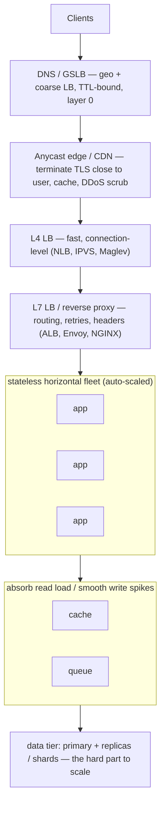
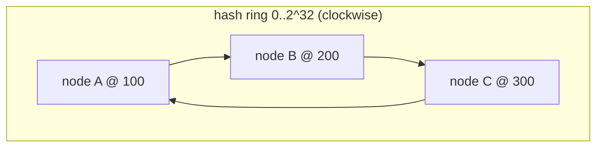
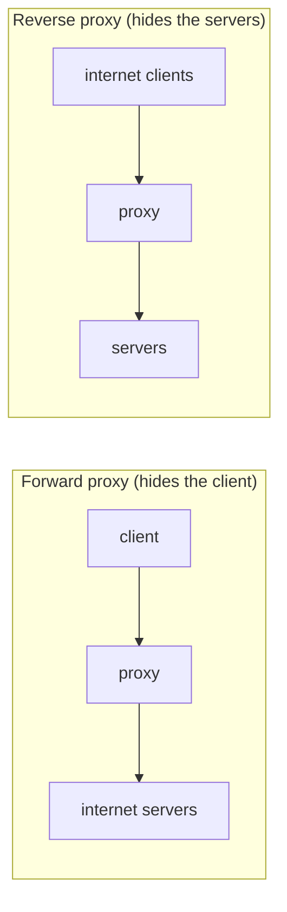
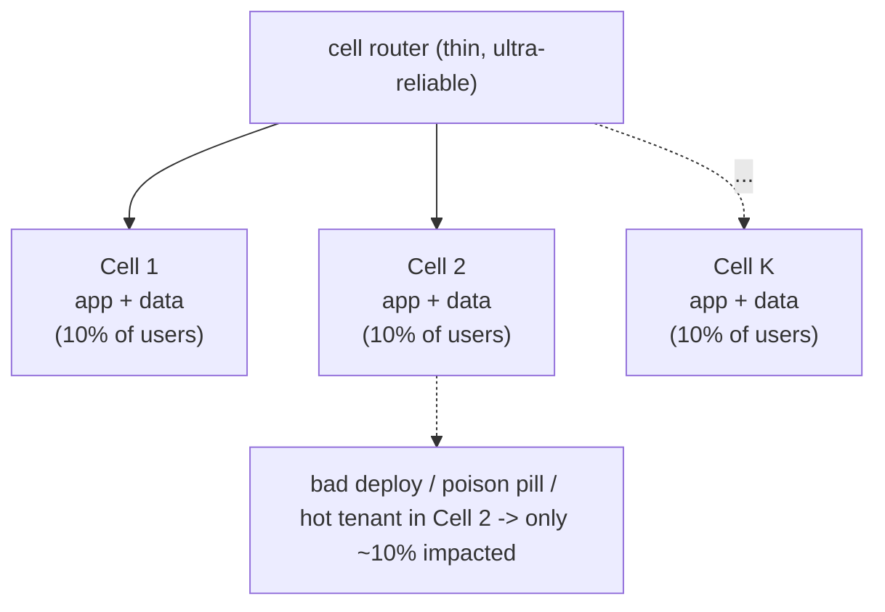

# Scalability and Load Balancing

Scalability is the property of a system to handle growing load — more users, more
requests per second (RPS/QPS), more data — by adding resources, ideally *without*
a proportional increase in per-request latency or per-request cost. Load balancing
is the mechanism that makes horizontal scaling *usable*: it spreads traffic across a
fleet so that no single node is a bottleneck and the failure of one node does not
take down the service.

In a system-design interview, almost nobody gets full marks for naming a technique.
You get marks for **trade-offs**: for every choice (scale up vs out, L4 vs L7, sticky
vs stateless, sync vs async, single-region vs multi-region), you must state *what you
gain, what you give up, and the conditions under which you'd pick it over the
alternative*. This document is organized around that discipline.

A mental model to carry throughout:



The app tier is the *easy* part to scale (stateless boxes behind a balancer). The
**data tier** is where scaling gets genuinely hard, because state has to live
*somewhere* and consistency, durability, and coordination don't parallelize for
free. Keep that asymmetry front of mind.

---

## Why scaling is sublinear, Amdahl and the Universal Scalability Law

**Intuition.** People say "just add more servers" as if throughput scales linearly with
node count. It doesn't — and knowing *why* is what separates a good answer from a
staff-level one. Two laws explain the shape of the curve.

**Amdahl's Law — the serial fraction caps you.** Any workload has a part that *must*
run serially (a lock, a single shared counter, a coordinator, a not-parallelizable
data dependency). If a fraction **s** of the work is serial and (1−s) can be
parallelized across **N** workers, the best speedup you can ever get is:

```
speedup(N) = 1 / ( s + (1 - s)/N )
as N -> infinity, speedup -> 1/s   (hard ceiling)
```

*Worked example.* Suppose 5% of a request's work is serial (s = 0.05):
- N = 1 → speedup = 1 / (0.05 + 0.95/1) = 1 / 1.00 = **1.0×** (baseline).
- N = 10 → speedup = 1 / (0.05 + 0.95/10) = 1 / (0.05 + 0.095) = 1 / 0.145 = **6.9×**
  (not 10× — you already lost 31% of the ideal).
- N = 100 → speedup = 1 / (0.05 + 0.0095) = 1 / 0.0595 = **16.8×** (not 100×).
- N = ∞ → speedup → 1 / 0.05 = **20×**, a hard ceiling. Buying the 1000th node past
  this point buys essentially nothing.

So a mere 5% serial fraction caps you at 20× *no matter how many nodes you add*. That
is exactly why "consistency, durability, and coordination don't parallelize for free"
and why "the data tier is the hard part" — the data tier is where the serial fraction
concentrates (a single primary's write path, a lock, a transaction coordinator).

**Universal Scalability Law (USL) — it can go *negative*.** Amdahl assumes extra nodes
never make things slower. Real distributed systems have a second penalty: **coherency /
crosstalk** — the cost of nodes coordinating *with each other* (cache-coherency traffic,
lock contention, gossip, cross-shard chatter). This term grows like N², so beyond some
peak N the system gets *slower* as you add nodes:

```
capacity(N) = N / ( 1 + α(N-1) + β·N(N-1) )
   α = contention (serial sharing, ~ Amdahl's s)
   β = coherency/crosstalk (pairwise coordination, the N^2 killer)
```

The curve has three regions: a near-linear region at low N → a flattening region as
contention (α) bites → an actual *decline* once coherency cost (β·N²) dominates. This
is why you sometimes see throughput *drop* after adding replicas or DB nodes: the extra
coordination outweighs the extra capacity.

> [!KEY-TAKEAWAY]
> Adding nodes has diminishing (Amdahl) and eventually *negative* (USL) returns. The
> engineering goal of every technique in this doc — statelessness, sharding, caching,
> cells — is to **shrink the serial fraction (α) and the coordination cost (β)** so the
> linear region extends further. You scale by *removing coordination*, not just by
> adding hardware.

---

## Horizontal versus vertical scaling

**Intuition.** Vertical scaling (scale up) = make one machine bigger: more vCPU, more
RAM, faster NVMe, a bigger DB instance. Horizontal scaling (scale out) = add more
machines and divide the work among them.

**How it works.**
- *Vertical*: change the instance type (e.g., AWS `m5.large` → `m5.24xlarge`), or move
  a DB from a 4-core to a 128-core box. Usually requires a restart/failover. No
  application change needed — the code doesn't know the box got bigger.
- *Horizontal*: run N identical replicas behind a load balancer; add/remove replicas
  as load changes. Requires the app tier to be **stateless** (no per-node session
  state that other nodes can't reconstruct) so any replica can serve any request.

**Real-world usage.** Modern web/app tiers are almost always horizontal (Kubernetes
Deployments, EC2 Auto Scaling Groups, Lambda concurrency). Databases are frequently
scaled *vertically first* (it's simpler and preserves ACID/single-node consistency)
and only sharded horizontally when a single primary can no longer hold the working
set or absorb the write throughput.

**Trade-offs.**

| Dimension            | Vertical (scale up)                         | Horizontal (scale out)                          |
|----------------------|---------------------------------------------|-------------------------------------------------|
| Ceiling              | Hard cap — biggest instance that exists     | Effectively unbounded (add nodes)               |
| Complexity           | Low — no distribution logic                 | High — LB, service discovery, distributed state |
| Fault tolerance      | Poor — one big SPOF                          | Good — lose 1 of N, degrade gracefully          |
| Consistency          | Easy — single node, single source of truth  | Hard — coordination, replication lag            |
| Cost curve           | Superlinear at the top (premium for big HW) | Near-linear with commodity HW                   |
| Downtime to scale    | Often requires restart/failover             | Rolling, zero-downtime                          |
| Latency              | No network hop added                        | Adds coordination / network hops                |

**When to pick which.** Scale *up* when: you're early, the workload is a single logical
unit that resists partitioning (e.g., a relational DB with heavy cross-row
transactions), or you need the simplicity. Scale *out* when: you need fault tolerance,
you've hit the vertical ceiling, or load is spiky and you want elasticity. The mature
answer in an interview: **"scale up until it's uneconomical or hits a ceiling, then
scale out — and design the app tier stateless from day one so scaling out is cheap
later."**

**Failure modes.** Vertical: the single big box dies → total outage; also "resize"
events cause downtime. Horizontal: you inherit *every* distributed-systems problem —
partial failures, network partitions, the need for idempotency, thundering herds on
cold caches after a scale-out event.

---

## Stateless design and scaling the app tier

**Intuition.** Horizontal scaling only works cleanly if any request can hit any node.
That requires the app tier to be **stateless**: the node holds no client-specific data
that would be lost if that node vanished and no other node could reconstruct.

**How it works.** Push state *out* of the app process:
- Session/auth state → signed tokens (JWT — JSON Web Tokens, self-contained
  signed credentials the client carries) held by the client, or a shared session
  store (Redis/Memcached/DynamoDB).
  - *The JWT catch:* a signed bearer token avoids a session-store lookup on every
    request, but you give up **instant revocation** — the token stays valid until it
    expires, so logout, password change, or a stolen token can't be cheaply cancelled.
    Mitigate with **short TTLs + refresh tokens** (a fresh access token every few
    minutes so a leak has a small window) or a **revocation denylist** of still-valid
    token IDs. Both reintroduce some shared state — so "stateless auth" is rarely
    fully stateless once you need real logout/compromise handling.
- File uploads / working data → object storage (S3) not local disk.
- In-flight work → a queue (SQS/Kafka), so any worker can pick it up.

Then the app node becomes a pure function of (request, shared state) and you can add or
kill nodes freely.

**Real-world usage.** "12-factor app" principle VI ("processes are stateless and
share-nothing"). This is what lets Kubernetes reschedule pods and lets an ASG replace
an unhealthy instance without anyone noticing.

**Trade-offs.** You trade a network hop (to the session/cache store) for elasticity and
fault tolerance. That external store now needs to be scaled and made HA itself — you
haven't eliminated state, you've *centralized and specialized* it. The centralized
store can become the new bottleneck/SPOF, which is why session stores are themselves
replicated and often sharded.

**When to use what.** Default to stateless. Only keep local state as an *optimization*
(e.g., a local LRU cache) where losing it merely costs a cache miss, never correctness.

---

## Load balancer fundamentals, L4 versus L7

**Intuition.** A load balancer is a traffic cop sitting in front of the fleet. The key
question is *how deep does it look into the traffic?* A Layer-4 (transport) LB looks at
IP/TCP/UDP — source/dest IP and port — and forwards packets/connections. A Layer-7
(application) LB terminates the connection, parses HTTP(S)/gRPC, and can route on URL
path, headers, cookies, method, etc.

**How it works.**
- *L4*: operates on connections. Two modes: (a) **DSR / direct server return** or NAT
  where it just rewrites/forwards packets extremely cheaply; it does not read the
  payload. Because it doesn't terminate TLS, it can pass encrypted bytes straight
  through. Think AWS NLB, LVS/IPVS, Google Maglev.
- *L7*: terminates TCP+TLS, reads the HTTP request, applies routing rules, can modify
  headers, do path-based routing, retries, rate limiting, request buffering,
  compression, and re-encrypt to the backend. Think AWS ALB, NGINX, HAProxy (http
  mode), Envoy, Traefik.

**Concrete numbers.** L4 LBs add tens of microseconds and push millions of
connections/sec per node (NLB advertises ~millions of req/s, scales transparently).
L7 adds more — often sub-millisecond to a few ms of added latency for parsing +
TLS termination — in exchange for rich routing. TLS termination is the dominant cost;
modern proxies handle tens of thousands of TLS handshakes/sec per core.

**Trade-offs.**

| Property                | L4 LB                              | L7 LB                                        |
|-------------------------|------------------------------------|----------------------------------------------|
| Visibility              | IP/port only                       | Full HTTP: path, headers, cookies, method    |
| Latency / overhead      | Minimal (µs)                       | Higher (parse + TLS terminate)               |
| Routing sophistication  | None (by connection tuple)         | Path/host/header/weight/canary               |
| TLS                     | Pass-through (E2E encryption kept) | Terminates (can inspect, WAF, but decrypts)  |
| Per-request features    | No (it's per-connection)           | Retries, timeouts, rewrites, rate limit      |
| Protocol awareness      | Generic TCP/UDP                    | HTTP/1.1, HTTP/2, gRPC, WebSocket            |
| Throughput ceiling      | Very high                          | Lower per node (does more work)              |

**When to pick which.** Use **L4** when you need raw throughput, non-HTTP protocols
(databases, MQTT, game UDP), true end-to-end TLS, or ultra-low latency and you don't
need content-based routing. Use **L7** when you need path/host routing, canary/blue-green
by header, per-request retries/timeouts, a WAF (Web Application Firewall — inspects
and filters/blocks malicious HTTP requests, e.g. SQL injection or bad bots), or to fan a single domain out to many
microservices. **Common modern pattern:** an L4 LB at the very edge for scale and DDoS
resilience, forwarding to an L7 proxy mesh (Envoy) for routing — you get both.

**Failure modes.** L7 that terminates TLS is a decryption point and a richer attack
surface; it also can't preserve client cert / true end-to-end encryption. L4
pass-through can't do smart health checks (it may only know TCP connect succeeded, not
that the app returns 200).

---

## Load balancing algorithms

**Intuition.** Once you've decided *where* the LB sits, you must choose *how* it picks a
backend. The choice trades off simplicity, evenness of load, and connection stability.

**The main algorithms.**
- **Round robin (RR).** Rotate through backends in order. Simple, stateless. Assumes
  requests are roughly equal cost and backends are homogeneous.
- **Weighted round robin.** RR but bigger/faster nodes get more turns. Good for mixed
  instance types.
- **Least connections.** Send to the backend with the fewest active connections. Adapts
  to uneven request durations (long-lived connections, slow requests). Better than RR
  when request cost varies widely.
- **Least response time / least load.** Pick lowest latency (or lowest CPU via
  active/passive probing). Most adaptive, needs live metrics.
- **Random / power of two choices (P2C).** Pick two backends at random, send to the
  less-loaded of the two. Nearly as good as global least-connections but with O(1)
  state and no herd effect — widely used in practice (e.g., in service meshes).
- **IP hash / hash-based.** Hash the client IP (or a key) to pick a backend →
  deterministic mapping, gives a form of session affinity without cookies.
- **Consistent hashing.** Hash keys onto a ring; each backend owns an arc. Adding/
  removing a node only remaps ~1/N of keys instead of all of them. Essential for
  sharded caches and stateful routing.

**Consistent hashing detail (very common interview target).**

The problem with naive `hash(key) % N`: change N (add or remove a node) and the modulus
changes for *almost every* key, so nearly all keys remap to a different node at once →
a cache-tier stampede where every miss hits the origin simultaneously.

Consistent hashing fixes this by mapping both nodes and keys onto a fixed ring (say
`0 .. 2^32`) and routing each key to the **first node clockwise** from it. Removing a
node only re-homes the keys in *its own arc*; every other key stays put.



*Numeric walkthrough (why only ~1/N moves).* Place three nodes on the ring by hashing
their names: **A @ 100, B @ 200, C @ 300** (positions wrap 300 → 100).
- A key `k` hashes to **150**. Walk clockwise from 150 → the next node is **B @ 200**.
  So `k` lives on B.
- A key hashing to **250** → walks to **C @ 300**. A key hashing to **350** → wraps
  past 300 → lands on **A @ 100**.
- Now **remove B**. Only keys in the arc `(100, 200]` — the arc B used to own — move;
  they now walk clockwise to the *next* node, **C @ 300**. Key `k` (150) → now C. But
  the 250 key still → C, and the 350 key still → A: **untouched.** Just B's ~1/3 of the
  keyspace remapped, not all of it.
- **Add a node D @ 250** (starting again from the original A/B/C ring). Only keys in
  `(200, 250]` — previously owned by C — move to D. Everything else is unchanged. Again
  ~1/N of keys move.

Virtual nodes (vnodes) — placing each physical node at *many* ring positions (e.g. 100
points per node instead of one) — smooth out imbalance (one big arc becomes many small
ones) and make a removal spread its load evenly across *all* survivors instead of
dumping it on a single unlucky neighbor. Bounded-load consistent hashing (Google, 2017)
adds a cap so no node exceeds (1+ε)·average, bounding hot-shard skew.

**Trade-offs.**

| Algorithm            | Load evenness | State needed | Handles uneven req cost | Affinity | Rebalance cost on N change |
|----------------------|---------------|--------------|-------------------------|----------|----------------------------|
| Round robin          | Good if homog.| None         | Poor                    | No       | n/a                        |
| Weighted RR          | Good          | Weights      | Poor                    | No       | n/a                        |
| Least connections    | Very good     | Conn counts  | Good                    | No       | n/a                        |
| Least response time  | Best          | Live metrics | Best                    | No       | n/a                        |
| Power of two choices | Very good     | Minimal      | Good                    | No       | n/a                        |
| IP / key hash        | Depends on key| None         | Poor                    | Yes      | ~all keys (mod N)          |
| Consistent hash      | Good (vnodes) | Ring         | Poor                    | Yes      | ~1/N keys                  |

**When to pick which.** Homogeneous stateless fleet, cheap uniform requests → **round
robin** (default for most L7 LBs). Long-lived or variable-duration connections
(WebSockets, DB pools, gRPC streams) → **least connections** or **P2C**. Need a key to
consistently land on the same node (sharded cache, stateful session, per-tenant data)
→ **consistent hashing**. Mixed hardware → **weighted** variants.

**Failure modes.** RR ignores that one node is slow/overloaded → keeps hammering it
(no health feedback). Least-connections can be fooled by connections that are open but
idle. Hash-based routing creates **hot keys/hot shards** when key distribution is
skewed (one celebrity user, one giant tenant) — mitigate with vnodes, key salting, or
splitting hot keys.

> [!INTERVIEW]
> **The long-lived-connection trap (a favorite senior gotcha).** L4 and most L7 LBs
> balance *connections*, not *requests*. That's fine for HTTP/1.1 (short connections,
> constantly re-balanced), but **HTTP/2, gRPC, and WebSockets multiplex many requests
> over one long-lived connection that pins to a single backend for its whole life.**
> Concretely: 100 clients open persistent gRPC connections, spread evenly over 4
> backends (25 each). You autoscale to 8 backends to shed load — but the *existing* 100
> connections don't move, so the 4 new backends sit **idle** while the old 4 stay hot.
> Balancing broke exactly when you needed it. Fixes: use **request-level (L7 / gRPC-aware)
> balancing** that load-balances per stream; set a **max-connection-age** so clients
> periodically reconnect and get rebalanced onto new backends; or use **client-side load
> balancing** (the client, often via a service mesh, knows the full backend set and
> picks per request).

---

## Health checks and failover

**Intuition.** A load balancer is only as good as its knowledge of which backends are
healthy. Health checks are how it decides who's in the rotation.

**How it works.**
- **Active health checks:** LB proactively probes each backend (e.g., `GET /healthz`
  every 5–30s). N consecutive failures → mark unhealthy → drain/remove; M consecutive
  successes → return to pool. Parameters: interval, timeout, unhealthy-threshold,
  healthy-threshold.
- **Passive health checks (outlier detection):** infer health from real traffic — if a
  backend returns 5xx or times out repeatedly, eject it temporarily (Envoy outlier
  detection). Cheaper, reacts to real failures, no extra probe traffic.
- **Shallow vs deep checks:** shallow = "process is up / TCP connects / returns 200".
  Deep = "can I actually reach the DB and downstream deps?" Deep checks catch more but
  risk **correlated failure**: if a shared dependency (one DB) blips, *every* backend's
  deep check fails at once → the LB marks the whole fleet unhealthy → total outage from
  a minor blip.

**Failover.** When a node/AZ/region is unhealthy, traffic must move elsewhere:
- Within a fleet: LB stops routing to the dead node (seconds).
- Across AZ: multi-AZ target groups; LB routes to healthy AZs.
- Across region: GSLB / DNS failover / health-checked routing policies (tens of
  seconds, TTL-bound).

**Trade-offs.**
- *Aggressive thresholds* (fail fast, short interval) → quick failover but flapping and
  false positives eject healthy nodes during transient blips. *Conservative thresholds*
  → stable but slow to evict a truly dead node, so users see errors longer.
- *Deep health checks* → higher fidelity but risk of correlated, self-inflicted total
  outage. Best practice: keep the *primary* health check shallow/local; monitor deep
  dependencies separately and shed load gracefully rather than failing the health check.
- Health checks add probe traffic; deep checks against a DB can add real load.

**When to use what.** Use shallow active checks for LB membership; use passive outlier
detection to eject misbehaving nodes fast; reserve deep checks for observability/alerting,
not for the "am I in the LB pool" decision, to avoid correlated fleet-wide ejection.

**Failure modes.** The classic disaster: a dependency hiccup + deep health checks →
every host fails its check simultaneously → LB has zero healthy targets → 100% outage,
even though the hosts could still serve cached/degraded responses. Also: health check
"grey failure" where a node passes the check but is actually serving errors (check the
wrong thing). Set the LB to keep *some* targets even if all appear unhealthy
("fail open") as a safety valve.

---

## Sticky sessions and session affinity

**Intuition.** Sticky sessions (session affinity) bind a client to a specific backend so
that all their requests go to the same node — useful when the node holds in-memory state
for that client.

**How it works.**
- *Cookie-based (L7):* LB injects a cookie (e.g., ALB `AWSALB`, or an app cookie) that
  encodes/points to the chosen backend; subsequent requests with that cookie route there.
- *IP-based (L4/L7):* hash the source IP to a backend (breaks behind NAT/mobile where
  many users share an IP or one user's IP changes).
- *TTL/duration:* affinity typically expires; on backend removal the client is rebalanced.

**Real-world usage.** Legacy apps that keep session state in local memory; some
WebSocket/stateful streaming scenarios; certain caching optimizations (keep a user's
warm cache on one node).

**Trade-offs.**

| Concern              | With sticky sessions                    | Without (stateless + shared store)          |
|----------------------|-----------------------------------------|---------------------------------------------|
| Load evenness        | Worse — long-lived users skew load      | Even                                        |
| Scaling/elasticity   | Harder — can't freely move traffic      | Trivial                                     |
| Failover             | Node death loses that user's state      | No user impact (state is external)          |
| Latency              | Can be lower (warm local cache)         | Extra hop to session store                  |
| Simplicity of app    | Simpler (just use local memory)         | Needs external store + serialization        |

**When to use what.** Prefer **stateless + external session store** (Redis/DynamoDB) or
**stateless tokens (JWT)** as the modern default — it makes autoscaling, rolling
deploys, and failover clean. Use stickiness only when: (a) you truly can't externalize
state cheaply, (b) local warm caches give a big win and a miss is merely a perf hit not
a correctness bug, or (c) protocol requires connection pinning (a single WebSocket
lives on one node by nature — but its *recoverable* state should still be external).

**Failure modes.** Sticky node dies → its users lose session/state and get errors until
re-auth. A few "whale" users pinned to one node → hotspot. Deploys are harder: draining
a node forces session migration. Behind CGNAT (Carrier-Grade NAT — an ISP-level layer
that puts many subscribers behind a single shared public IP), IP-hash affinity clumps
thousands of users onto one backend.

---

## Reverse proxy versus forward proxy

**Intuition.** Both sit "in the middle," but they face opposite directions. A **reverse
proxy** sits in front of *servers* and represents them to clients (clients don't know
which backend they hit). A **forward proxy** sits in front of *clients* and represents
them to the internet (servers see the proxy, not the real client).

**How it works.**
- *Reverse proxy* (NGINX, Envoy, ALB, Cloudflare): terminates client connections, does
  TLS termination, caching, compression, LB, WAF, request routing to backends. It's the
  server side's front door.
- *Forward proxy* (corporate egress proxy, Squid, a VPN egress): clients send requests
  *to* the proxy, which fetches on their behalf — used for egress filtering, caching,
  anonymity, access control, bypassing geo-restrictions.



**Trade-offs / role.** A reverse proxy is a scalability workhorse: it centralizes TLS,
LB, caching, and routing so backends stay simple. But it's an added hop and a potential
SPOF/bottleneck (mitigate with a fleet of proxies + L4 in front). A forward proxy is
about *egress control*, not scaling inbound traffic.

**When to use what.** Interviews on scalability almost always mean **reverse proxy**
(the load balancer / API gateway / edge). Mention forward proxy only for egress control,
compliance, or client-side caching scenarios.

---

## Caching and CDNs to reduce load

**Intuition.** The cheapest request is the one you never have to compute. Caching stores
computed results closer to the consumer so the origin/data tier does less work. This is
often the single biggest scalability lever.

**How it works (layers).**
- *Client / browser cache* — nothing hits your infra.
- *CDN / edge cache* (CloudFront, Cloudflare, Fastly) — cache static + cacheable dynamic
  content at hundreds of PoPs near users; offloads origin and cuts latency to ~10–30 ms.
- *Reverse-proxy cache* — cache at the L7 tier.
- *Application cache* (Redis/Memcached) — cache DB query results, sessions, computed
  fragments. Sub-ms in-memory reads vs multi-ms DB reads.
- *Database cache* — buffer pool, materialized views, read replicas.

**Patterns.** Cache-aside (lazy load), read-through, write-through, write-back
(write-behind). Invalidation via TTL, event-driven (CDC), or explicit purge.

**Trade-offs.** Cache adds a consistency problem: stale reads. Choose TTL vs
invalidation: TTL is simple but serves stale data for the TTL window; explicit/event
invalidation is fresh but complex and can miss edges. Caching also introduces
**cache-stampede / thundering herd** on expiry or cold start — mitigate with request
coalescing (single-flight), staggered TTLs, and pre-warming.

**When to use what.** Read-heavy, tolerant-of-slight-staleness data (product catalogs,
feeds, profiles) → cache aggressively at CDN + app layer. Strongly consistent,
write-heavy, or per-user-unique data → cache carefully or not at all. "Cache the
denominator" (popular/hot items) gives the biggest win for the least staleness risk.

---

## Auto-scaling policies

**Intuition.** Elasticity: automatically add capacity when load rises and remove it when
load falls, so you pay for what you use and still meet demand.

**How it works.**
- **Reactive / target-tracking:** keep a metric at a target (e.g., CPU at 60%, or
  requests-per-target at 1000). The controller adds/removes instances to hold the target.
  Most common, simplest to reason about.
- **Step / simple scaling:** thresholds trigger fixed-size adjustments (CPU > 80% → +2
  instances).
- **Scheduled scaling:** pre-scale for known patterns (business hours, a sale at noon,
  a product launch).
- **Predictive scaling:** ML forecasts load and pre-provisions ahead of the curve (AWS
  Predictive Scaling) — closes the warm-up gap.
- Metric choices: CPU, memory, queue depth (SQS backlog per worker), p99 latency, RPS,
  concurrent connections, custom business metrics. Queue-depth scaling is often best for
  async workers.

**Concrete numbers / knobs.** Warm-up/cooldown periods prevent flapping; instance boot
+ app warm-up can be 1–5 min (VMs) vs seconds (containers) vs ~0 (Lambda, with cold-start
caveats). Set min/max/desired; set a floor for baseline + burst headroom.

**Trade-offs.**
- *React fast* (low thresholds, short cooldown) → absorb spikes but risk flapping,
  over-provisioning cost, and scale-out storms. *React slow* → cheaper, steadier, but
  you eat latency/errors during a spike before capacity arrives.
- *Reactive* is simple but always *lags* — you scale up *after* load rises, so there's a
  window of degradation (plus boot time). *Predictive/scheduled* removes the lag but is
  wrong if the pattern breaks (unexpected spike, forecast miss).
- Scaling on CPU is a poor proxy for user-facing latency; scaling on queue depth or p99
  latency aligns better with SLOs (Service Level Objectives — the target values you
  commit to for a metric, e.g. "p99 latency < 200 ms") but is noisier.

**When to use what.** Steady diurnal traffic → scheduled + target-tracking. Spiky/bursty
→ predictive + generous headroom + fast-booting compute (containers/serverless). Async
pipelines → scale on **queue depth / backlog per worker**, not CPU. Always keep enough
headroom that a scale-out event's boot time doesn't breach SLO; and cap max to protect
downstream (a runaway app tier can DDoS its own database).

**Failure modes.** Autoscaling the app tier without scaling (or protecting) the data tier
→ you add app nodes that all pile onto the same DB and knock it over. Scale-in too
aggressively → terminate a node mid-request (mitigate with connection draining /
lifecycle hooks). Cold-start latency at scale-out. Metric feedback loops causing
oscillation.

---

## Backpressure and load shedding

**Intuition.** Autoscaling always *lags* — there's a boot-time window (seconds for
containers, minutes for VMs) where load has already arrived but capacity hasn't. And
sometimes you simply *can't* scale fast enough, or the bottleneck is a downstream you
don't control. The question then is: **what does a well-designed system do when it cannot
keep up?** The wrong answer is "accept everything and fall over" (from Little's Law, an
overloaded system's queues grow, latency climbs, and it collapses into serving *nothing*).
The senior answer is **degrade deliberately**: serve a healthy subset well rather than
serving everyone terribly. These are first-class survival tools, not an afterthought.

**The levers.**
- **Admission control / rate limiting at the edge.** Cap the request rate you accept
  (token bucket / leaky bucket per client or per API key) so the fleet never takes on
  more than it can serve. Excess is rejected fast with `429 Too Many Requests` — cheap to
  reject, and it protects everyone behind it.
- **Load shedding (prioritized).** When near capacity, *drop the least valuable traffic
  first*: shed anonymous/low-tier before paying/critical, background before interactive,
  retries before first-tries. Dropping 10% of low-value load to keep 90% of high-value
  load fast is a deliberate win.
- **Backpressure.** Push the "slow down" signal *upstream* instead of silently buffering.
  A bounded queue that rejects when full, TCP flow control, or a gRPC/reactive-streams
  credit signal all tell producers to ease off. Queue-based load leveling (put writes on
  a bounded queue) smooths a spike into a steady drain rate — but the queue **must be
  bounded**, or you've just moved the overload into unbounded memory growth and a crash.
- **Circuit breakers.** When a downstream is failing/slow, *stop calling it* for a cooldown
  (trip "open"), fail fast with a fallback, then probe with a few requests ("half-open")
  before restoring. This prevents one slow dependency from consuming all your threads (the
  Little's-Law spiral) and cascading the failure back up.

**Worked tie-in to the autoscaling window.** Recall λ = 2000 RPS, W = 50 ms → L = 100
in-flight. A flash sale spikes arrivals to **6000 RPS**. Your fleet is sized for 100
concurrent; at 6000 RPS you'd need 300 in-flight — but new instances take ~90 s to boot.
For that 90 s window you have three choices: (1) accept all 6000 RPS → queues triple,
latency blows past SLO, possibly a full collapse; (2) shed to your safe ~2000 RPS
capacity, returning 429 to the excess and keeping the admitted traffic *fast*; (3) queue
the excess with backpressure and drain it as capacity boots. Options (2) and (3) keep the
system alive and predictable; option (1) is how a spike becomes an outage.

**Trade-offs.** Shedding/rate-limiting means you *intentionally* reject some real users —
you trade completeness for survival and predictable latency for the majority. Set limits
too low and you leave capacity unused and reject needlessly; too high and they don't
protect you. Circuit breakers add a failure mode of their own (a breaker stuck open, or a
too-sensitive threshold, denies a recovered dependency). The principle to state in an
interview: **a system should degrade gracefully, not collapse — and it should shed the
cheapest, least valuable work first.**

---

## DNS load balancing and GSLB (geo and global)

**Intuition.** Before a client even reaches your L4/L7 LBs, DNS decides *which*
data center / region / IP they connect to. Global Server Load Balancing (GSLB) uses DNS
(and/or Anycast) to steer users globally — by geography, latency, health, or weight.

**How it works.**
- **DNS round robin:** return multiple A records; clients pick one. Crude, no health
  awareness, subject to client/resolver caching.
- **Geo / latency routing:** the authoritative DNS returns the closest/fastest region's
  IPs (Route 53 latency/geolocation policies, GeoDNS).
- **Weighted routing:** split traffic X%/Y% across endpoints (canary, gradual region
  migration).
- **Health-checked failover:** DNS stops returning an endpoint that fails health checks
  (Route 53 health checks).
- **Anycast:** the *same* IP is announced from many locations via BGP; the network routes
  each user to the nearest PoP. Used by CDNs, DNS providers, and modern global LBs
  (Cloudflare, Google Cloud Global LB, AWS Global Accelerator). Failover is at the
  network layer — no DNS TTL wait.

**Trade-offs.**
- **DNS-based GSLB** is universal (works for any protocol) but **coarse and slow to
  react** because of **TTL caching**: resolvers and clients cache records past your
  intended TTL, so a failover can take minutes even with a 60s TTL. Low TTLs increase DNS
  query volume and still aren't honored by all resolvers.
- **Anycast** fails over in seconds at the routing layer and gives one clean IP, but you
  don't control exactly which PoP a user lands on (BGP decides), sessions can flap
  between PoPs on route changes, and it requires running your own network / a provider
  that does.
- Geo routing improves latency but can send users to a region that lacks their data
  (data residency / consistency), and "closest network" ≠ "closest by geography."

**When to use what.** Multi-region active-active with global users → **Anycast** (via a
global LB / Global Accelerator) for fast failover + stable IPs, *plus* DNS geo as a
coarse layer. Simple failover between two regions on a budget → **Route 53 health-checked
DNS failover** (accept minutes of TTL lag). Canary a new region → **weighted DNS**.

**Failure modes.** TTL caching defeats fast DNS failover (the #1 gotcha). "Sticky
resolver" clients pin to a dead IP. Anycast route flaps break long-lived connections.
GeoDNS mislocates users behind corporate/VPN resolvers.

---

## Multi-AZ and multi-region architecture

**Intuition.** Redundancy across *failure domains*. An Availability Zone (AZ) is an
isolated datacenter (independent power/cooling/network) within a region; a region is a
geographically separate cluster of AZs. You replicate across AZs to survive a datacenter
failure, and across regions to survive a whole-region failure or to serve global users
with low latency.

**How it works.**
- **Multi-AZ (within a region):** run the fleet across ≥2–3 AZs; LB spans AZs; DB has a
  standby/replica in another AZ with fast (often synchronous) replication. AZs are close
  (~1–2 ms apart) so synchronous replication is affordable → **RPO≈0, RTO seconds–minutes**.
  This is the default HA posture and is comparatively cheap.

> [!KEY-TAKEAWAY]
> Two disaster-recovery targets drive every replication choice below. **RPO (Recovery
> Point Objective)** = how much *data* you can afford to lose, measured as a time window
> (RPO≈0 means "lose nothing"; RPO of 5 min means "up to 5 min of writes may be lost").
> **RTO (Recovery Time Objective)** = how *long* recovery may take before you're serving
> again. Synchronous replication buys RPO≈0 at the cost of write latency; asynchronous
> replication accepts a nonzero RPO to keep writes fast.
- **Multi-region:** replicate across regions (50–150+ ms apart). Options:
  - *Active-passive (warm/cold standby):* one region serves; another is on standby with
    async replication. Failover via DNS/GSLB.
  - *Active-active:* multiple regions serve simultaneously; requires either partitioned
    data (each region owns some keys) or multi-master replication with conflict handling.

**Trade-offs.**

| Aspect              | Single region, multi-AZ            | Multi-region active-passive        | Multi-region active-active                |
|---------------------|------------------------------------|------------------------------------|-------------------------------------------|
| Survives            | AZ/datacenter failure              | Whole-region failure               | Region failure + serves globally          |
| Replication         | Sync feasible (RPO≈0)              | Usually async (RPO seconds–mins)   | Async / multi-master (conflicts)          |
| Write latency       | Low                                | Low (single active)                | Cross-region coordination or local writes |
| Consistency         | Strong achievable                  | Strong in active; lag on standby   | Hard — eventual / conflict resolution     |
| Cost                | Modest (2–3x within region)        | High (idle standby)                | Highest (full stacks everywhere)          |
| Complexity          | Low                                | Medium                             | Very high                                 |
| Failover time (RTO) | Seconds                            | Minutes (DNS TTL + warm-up)        | ~Zero (already serving)                   |

The **CAP-driven tension**: cross-region synchronous replication would add 50–150 ms to
*every write* (speed of light), which is usually unacceptable — so multi-region almost
always means **asynchronous** replication, which means **you accept some RPO (data loss
window) or eventual consistency**. You can't have low write latency, strong global
consistency, *and* multi-region survivability all at once.

**When to use what.** Most services: **multi-AZ single region** is the right default —
it covers the overwhelmingly common failure (an AZ/datacenter issue) cheaply with strong
consistency. Go **multi-region** only when you have a hard requirement: regulatory data
residency, global low-latency reads, or an RTO/RPO that a single region can't meet
(region-level DR). Prefer **active-passive** unless global write latency or scale forces
active-active — active-active's conflict handling and operational burden are large.

**Failure modes.** "Multi-region" that shares a single global control plane, DNS, or
database → the shared component is still a global SPOF (many real outages are
control-plane, not data-plane). Async replication + failover = lost writes in the
replication gap. Split-brain in active-active if partition detection is wrong. Untested
failover that doesn't actually work when needed (test with game days).

---

## N plus one redundancy and capacity planning

**Intuition.** Provision enough capacity that you can lose a unit (server, AZ) and still
serve peak load. **N+1**: N units carry the load, +1 spare. **N+2**: survive two
simultaneous losses. **2N**: full duplication.

**First, size N with Little's Law.** Before you can add "+1" you need to know *how big
N is* — how many servers/threads/connections the load actually requires. The single most
useful capacity tool is **Little's Law**, which relates the three quantities you always
have or want:

```
L = λ × W
   L = average number of requests in the system concurrently (in-flight)
   λ = arrival rate (requests per second)
   W = average time each request spends in the system (latency, in seconds)
```

*Worked example.* Your service takes **λ = 2000 RPS** at an average latency of
**W = 50 ms = 0.05 s**. Then the average number of requests in flight at any instant is:

```
L = 2000 × 0.05 = 100 concurrent requests
```

So you need capacity for **100 simultaneous in-flight requests**. If each thread handles
one request and you target ~40 busy threads per instance, that's `100 / 40 ≈ 3` instances
of headroom for the *steady* state — before redundancy. This is how you turn "2000 RPS"
into a concrete thread-pool size, connection-pool size, and instance count.

The law also explains **why latency spikes force more capacity**: L = λ × W, so if a
downstream dependency slows and W jumps from 50 ms to 200 ms while λ holds at 2000 RPS,
in-flight requests balloon from 100 to **400**. Your thread/connection pools fill,
new requests queue, queueing pushes W even higher — a feedback loop. That is precisely
the overload spiral that backpressure and load shedding (next section) exist to break.
Sizing to *average* latency is a trap; size to a high percentile (p99) so a tail-latency
event doesn't exhaust the pool.

**How it works / the math.** If peak load needs N units running at target utilization,
N+1 means you run N+1 so that losing one still leaves N. The subtlety: after losing a
unit, the survivors must absorb its share. If you run N units at 100% each, losing one
means the rest need 100%·N/(N-1) > 100% — overload. So you must run each unit *below*
the redundancy threshold.

**AZ-level example (the classic interview trap).** With 3 AZs and you must survive losing
1 AZ, the 2 survivors must handle 100% of peak → each AZ can run at most 50% at peak, so
across 3 AZs your steady-state utilization is capped near 66% (you're "wasting" a third
for redundancy). With 2 AZs surviving 1 loss, each must be sized for 100% → 50% max
utilization → 2N. More AZs = less relative overhead: with 5 AZs surviving 1, survivors
need 100%·5/4 = 125% → each AZ ≤ 80% → only ~20% headroom cost.

**Trade-offs.** More redundancy (N+2, 2N, more AZs) → higher availability but more idle,
paid-for capacity. Fewer spares → cheaper but a single failure during peak causes an
outage or forced (slow) autoscale. Autoscaling *reduces* the need to pre-provision spare
capacity but doesn't eliminate it — boot time means you still need headroom to survive
the *instant* of failure before replacements come up.

**When to use what.** Standard services: **N+1 per AZ across ≥3 AZs**. Critical
infra/control planes: **N+2** or spread across more failure domains. Use more AZs (not
just 2) to shrink the redundancy tax. Combine with autoscaling for the *sustained*
recovery and static headroom for the *instant* of failure.

**Failure modes.** Sizing survivors for average not peak load. Correlated failures that
break the independence assumption (shared dependency, shared deploy). "Redundancy" where
the spare shares fate with the primary (same rack, same power, same bad config push).

---

## Cell-based architecture

**Intuition.** Instead of one big shared fleet serving 100% of users, partition the
entire service into many independent, identical **cells**, each a fully self-contained
stack (compute + data) that serves a *subset* of customers/keys. A thin routing layer maps
each request to its cell. The point is **blast-radius reduction**: a bad deploy, a poison-
pill request, a hot tenant, or a data-corruption bug is contained to one cell instead of
taking down everyone. This is the modern evolution of the "shared-nothing" idea and is
how AWS builds many of its own services.

**How it works.**
- **Cell:** a complete, independent instance of the workload (its own app tier + its own
  data store), sized to a *maximum* capacity. It shares no state with other cells.
- **Cell router (the thinnest possible layer):** maps a partition key (customer ID,
  resource ID, tenant ID) to a cell and presents a single endpoint. It must be *dumb and
  ultra-reliable* — the router itself is the one shared component, so it's kept minimal,
  rarely changed, and often has no dependency on the cells' data plane.
- **Control plane:** provisions/decommissions cells, migrates customers between cells,
  and manages cell placement — deliberately separated from the data plane so a control-
  plane problem doesn't take down serving.



**Blast radius & shuffle sharding.** With K cells, a cell-level failure caps impact at
~1/K of customers. **Shuffle sharding** goes further: assign each customer to a small
*random combination* of cells (e.g., 2 of 8). Two customers rarely share the *same* pair,
so a poison-pill customer that takes down their cells affects only the tiny set of others
who share *both* of those cells — dramatically shrinking correlated impact. (Route 53 and
AWS Shield use this.)

**Real-world usage.** AWS uses cell-based architecture broadly (DynamoDB, Route 53, S3
control planes, Lambda, etc.); Slack, Salesforce, Roblox, and others describe cellular
designs. Deploys roll cell-by-cell (wave deployments) so a bad change is caught in cell 1
before it reaches the rest.

**Trade-offs.**

| Gain                                             | Cost / give-up                                       |
|--------------------------------------------------|------------------------------------------------------|
| Blast radius capped at 1 cell (~1/K users)       | Operational complexity: many stacks to run/observe   |
| Safe incremental (cell-by-cell) deploys          | Cell router is a shared component — must be bulletproof |
| Hot tenant / poison pill isolated                | Cross-cell operations (global queries, joins) are hard |
| Independent scaling per cell; predictable sizing | Cell placement, rebalancing, and migration are nontrivial |
| Failure testing is bounded and repeatable        | Some capacity fragmentation (each cell needs headroom) |

**When to use what.** Cellular architecture shines for **large multi-tenant
platforms** where a single shared fleet makes the blast radius unacceptable, or where
you need to bound the impact of deploys and poison-pill requests. It's overkill for small
or early-stage systems (the operational cost dominates). Bring it up in interviews when
the requirement is *"limit the scope of impact"*, *"multi-tenant isolation"*, or
*"a bad deploy must not take down all customers"* — it's a strong, current signal.

**Failure modes.** The cell router is the residual SPOF — if it's fancy/fragile it
undermines the whole point (keep it thin and dependency-light). Uneven cell load if the
partition key is skewed (a whale tenant overflows one cell → still need per-cell limits +
migration). Cross-cell features (global search, aggregate reporting) require a separate
data path. Migrating a customer between cells (for rebalancing) is a genuinely hard
operation.

---

## Scaling the data tier

**Intuition.** The app tier scales out trivially; the **data tier is the hard part**
because state must be stored, kept consistent, and kept durable. Interviews reward
knowing the *ladder* of data-scaling techniques and their trade-offs.

**The ladder (roughly in order of increasing complexity).**
1. **Vertical scale the DB** — biggest box; simplest; keeps single-node consistency.
2. **Read replicas** — replicate the primary to N read-only copies; route reads to
   replicas, writes to the primary. Scales **reads**, not writes. Introduces
   **replication lag** → read-your-writes anomalies.
3. **Caching** — Redis/Memcached in front of the DB; absorbs hot reads. (See caching.)
4. **Functional partitioning / vertical sharding** — split by table/domain into separate
   DBs (users DB, orders DB) — the start of microservice data ownership.
5. **Horizontal sharding / partitioning** — split rows across DBs by a shard key
   (hash or range). Scales **writes and storage**. This is where it gets hard:
   cross-shard joins/transactions, rebalancing, hot shards, and choosing a good shard key.
6. **Purpose-built stores + CQRS** — separate the write model from read model; use the
   right store per access pattern (search → Elasticsearch, timeseries → a TSDB,
   graph → a graph DB), fed by events/CDC.

**Write-scaling patterns (modern, commonly asked).**
- **CQRS (Command Query Responsibility Segregation):** separate write path (commands,
  normalized, source of truth) from read path (denormalized, optimized views). Scale and
  shape each independently. Adds eventual consistency between them and more moving parts.
- **Event sourcing:** store the log of events as source of truth; derive state. Great
  audit/replay, but querying current state and schema evolution are harder.
- **CDC (Change Data Capture):** stream the DB's changelog (e.g., Debezium reading the DB
  transaction log → Kafka) to keep caches, search indexes, and downstream stores in sync
  without dual-writes. The modern glue for "one write, many read models."
- **Async via queues (write smoothing):** put writes on a queue (Kafka/SQS) to absorb
  spikes and decouple producers from the DB's sustainable write rate. Trades immediate
  consistency for throughput and resilience.

**Sharding trade-offs (a favorite deep-dive).**

| Shard strategy   | Even distribution | Range queries | Hotspot risk        | Rebalance         |
|------------------|-------------------|---------------|---------------------|-------------------|
| Hash(key)        | Good              | Bad (scatter) | Low (unless hot key)| Hard (or use consistent hashing) |
| Range(key)       | Depends           | Good          | High (recent/hot range) | Easier (split ranges)         |
| Directory/lookup | Flexible          | Depends       | Managed             | Flexible but lookup is a dependency |
| Geo/tenant       | By locality       | Within shard  | Whale tenant        | Migrate tenant    |

**Trade-offs (overall).**
- Read replicas: cheap read scaling, but **replication lag** breaks read-after-write;
  route critical reads to the primary or use session consistency.
- Sharding: the only way to scale writes/storage beyond one box, but you **lose
  single-node ACID across shards** — cross-shard transactions need 2PC (two-phase commit
  — a coordinator asks all shards to "prepare," then "commit" only if all agreed; blocks
  if the coordinator or a participant stalls) or sagas (slow/
  complex), joins become application-side, and a bad shard key causes hotspots you can't
  fix without a painful resharding.
- CQRS/CDC/event-sourcing: unlock independent scaling and purpose-built stores, but every
  one of them **adds eventual consistency and operational surface** (more systems, more
  failure modes, more "why is my read stale?").

**When to use what.** Read-heavy, write-modest → **replicas + cache** first (covers a huge
fraction of real systems). Write-bound or storage-bound beyond one node → **shard**, and
sweat the shard-key choice. Divergent read/write access patterns or many specialized query
needs → **CQRS + CDC** feeding purpose-built read stores. Reach for the complex patterns
only when the simpler rungs of the ladder are exhausted — premature sharding/CQRS is a
classic over-engineering red flag in interviews.

**Failure modes.** Choosing a shard key with skew → permanent hotspot. Replication lag
surprising the product ("I posted but don't see it"). Dual-writes (write to DB *and*
cache/search in app code) drifting out of sync — prefer CDC. Cross-shard transactions
partially applying. Resharding under load causing stampedes.

---

## Trade-offs and when to use what (summary)

A one-glance decision guide for the interview:

| If the requirement is...                              | Reach for...                                                | Because / main trade-off                                   |
|-------------------------------------------------------|-------------------------------------------------------------|------------------------------------------------------------|
| Simplicity, early stage, single logical unit          | Vertical scaling + multi-AZ                                 | Cheapest, strong consistency; ceiling + SPOF risk          |
| Elastic, fault-tolerant app tier                      | Stateless + horizontal + autoscaling                        | Near-linear scale; needs external state, distributed cplx  |
| Raw throughput / non-HTTP / E2E TLS                   | L4 LB (NLB/Maglev)                                          | Fast, dumb; no content routing                             |
| Path/host routing, canary, retries, WAF               | L7 LB (ALB/Envoy/NGINX)                                     | Rich features; more latency, TLS terminates                |
| Variable/long-lived request costs                     | Least-connections / power-of-two-choices                    | Adapts to load; slightly more state                        |
| Key must hit same node (sharded cache/state)          | Consistent hashing (+ vnodes)                               | Minimal remap on churn; hot-key risk                       |
| Fast, safe eviction of bad nodes                      | Passive outlier detection + shallow active checks           | Avoids correlated deep-check outages                       |
| Global users, fast failover                           | Anycast / global accelerator + geo DNS                      | Seconds failover; less control of PoP                      |
| Cheap two-region DR                                   | Route 53 health-checked DNS failover                        | Simple; TTL lag = minutes RTO                              |
| Survive datacenter failure (most services)            | Multi-AZ, single region, N+1 across ≥3 AZs                  | Cheap, strong consistency; not region-DR                   |
| Survive region failure / data residency               | Multi-region (passive first)                                | Async replication → RPO/eventual consistency               |
| Bound blast radius in multi-tenant platform           | Cell-based architecture + shuffle sharding                  | ~1/K impact; router SPOF + ops complexity                  |
| Scale reads                                           | Read replicas + cache                                       | Cheap; replication lag / staleness                         |
| Scale writes/storage beyond one box                   | Horizontal sharding                                         | Only way up; loses cross-shard ACID                        |
| Divergent read/write patterns, many query shapes      | CQRS + CDC + purpose-built stores                           | Independent scaling; eventual consistency, more systems    |
| Absorb write/traffic spikes                            | Queue-based load leveling (Kafka/SQS)                       | Smooths bursts; adds latency, eventual processing          |

**The three sentences to say in every scalability interview:**
1. "The app tier is easy to scale horizontally if it's stateless — the hard problem is
   the data tier."
2. "Every scaling choice trades consistency, latency, cost, and complexity — here's what
   I gain and give up, and when I'd choose the alternative."
3. "I'll start with the simplest thing that meets the SLO (scale up, multi-AZ, cache +
   replicas) and only add sharding / multi-region / cells when a concrete requirement
   forces it."

---

## Common interview follow-up questions

1. Your app tier is autoscaling fine but the site still falls over under load — what's
   the likely bottleneck and how do you fix it? *(The shared DB; add cache/replicas,
   protect it with connection limits/backpressure, consider sharding.)*
2. How does adding a node to a consistent-hash ring differ from `hash % N`, and why does
   it matter for a cache tier? *(Only ~1/N keys remap vs nearly all → avoids stampede.)*
3. Why can deep health checks cause a *bigger* outage than the failure they detect?
   *(Correlated fleet-wide ejection when a shared dependency blips.)*
4. You need 60s failover but DNS failover takes 5 minutes — why, and what do you use
   instead? *(TTL/resolver caching; use Anycast / Global Accelerator / health-checked
   connection-level failover.)*
5. When would you accept sticky sessions, and what does it cost you at deploy time?
   *(Local warm state; harder draining, uneven load, state loss on node death.)*
6. Design for "a bad deploy must never impact more than 5% of customers." *(Cell-based
   architecture with ≥20 cells + wave/cell-by-cell deploys + shuffle sharding.)*
7. Read replicas gave you read scale but users complain they don't see their own writes —
   why and how do you fix it? *(Replication lag; read-your-writes via primary reads or
   session/monotonic consistency.)*
8. Compute the max steady-state utilization per AZ if you have 3 AZs and must survive
   losing one. *(~66%: 2 survivors carry 100%.)*
9. Active-active multi-region: how do you handle a user's write in region A being read in
   region B moments later? *(Async replication lag; conflict resolution, partition data
   by region ownership, or accept eventual consistency.)*
10. Why put an L4 LB in front of an L7 proxy fleet instead of just exposing L7 directly?
    *(L4 gives raw scale + DDoS resilience + spreads across the L7 fleet, which is itself
    horizontally scaled and can fail individually.)*
11. Your write throughput exceeds a single primary's capacity — walk through options
    before you shard. *(Batch/async via queue, write-back cache, functional partitioning,
    then shard as last resort.)*
12. What's the difference between scaling for throughput vs scaling for latency, and can
    one hurt the other? *(Batching/queueing raises throughput but adds latency; over-
    aggressive autoscaling hurts cost, etc.)*
13. You add nodes but throughput barely improves past a point — even drops. Explain why.
    *(Amdahl: serial fraction caps speedup at 1/s; USL: N² coherency/crosstalk cost makes
    it go negative. Fix by removing coordination, not adding hardware.)*
14. Given 3000 RPS and 40 ms average latency, how many concurrent requests are in flight,
    and how do you size the thread pool? *(Little's Law: L = 3000 × 0.04 = 120 in-flight;
    size pools/instances to that, using a high percentile not the average.)*
15. Traffic spikes 3× and instances take 90s to boot — what do you do in that window
    instead of falling over? *(Admission control / prioritized load shedding to safe
    capacity, bounded-queue backpressure, circuit breakers; degrade, don't collapse.)*
16. Your HTTP/2 or gRPC service scaled out but the new backends stay idle — why?
    *(Long-lived multiplexed connections pin to old backends; fix with request-level
    balancing, max-connection-age, or client-side/mesh LB.)*

## References

- AWS Well-Architected — "Reducing the Scope of Impact with Cell-Based Architecture"
  (guidance whitepaper): cell, cell router, control plane, shuffle sharding.
- Amazon Builders' Library — "Workload isolation using shuffle-sharding" and
  "Implementing health checks" (Colm MacCárthaigh).
- Martin Kleppmann, *Designing Data-Intensive Applications* (DDIA) — replication,
  partitioning/sharding, consistency, and derived data / CDC chapters.
- Alex Xu, *System Design Interview* Vol. 1 & 2, and the ByteByteGo blog/newsletter —
  scaling from zero to millions of users, consistent hashing, load balancing.
- donnemartin/system-design-primer (GitHub) — LB algorithms, L4 vs L7, reverse proxy,
  caching, sharding, federation, DNS.
- Google Maglev paper (NSDI 2016) — fast L4 software load balancer + consistent hashing.
- Google Research — "Consistent Hashing with Bounded Loads" (2017).
- Michael T. Nygard, *Release It!* — bulkheads, circuit breakers, failure isolation.
- AWS docs — ELB (ALB/NLB) target groups & health checks; Route 53 routing policies &
  health checks; EC2 Auto Scaling (target-tracking, step, scheduled, predictive); Global
  Accelerator (Anycast).
- Envoy proxy docs — outlier detection (passive health checks), load balancing policies
  (round robin, least request, ring hash / Maglev, random).
- Marc Brooker / AWS blogs on control-plane vs data-plane and static stability.
- YouTube: ByteByteGo ("Load Balancing Algorithms", "How to scale a system"),
  Gaurav Sen ("Load Balancing", "Consistent Hashing", "Sharding"), Hussein Nasser
  (proxy vs reverse proxy, L4 vs L7, connection handling), "Jordan has no life"
  (system design deep dives on CQRS/CDC/replication).
