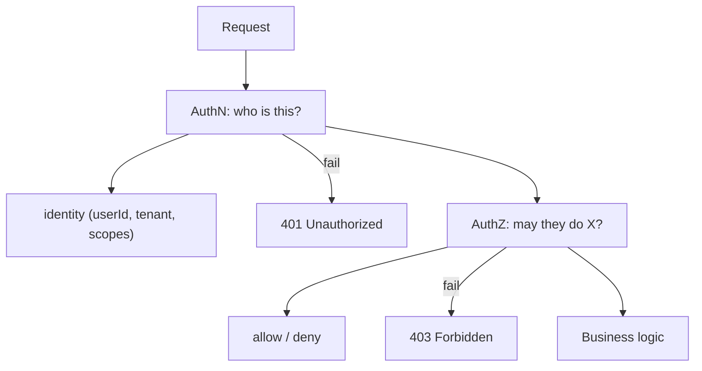
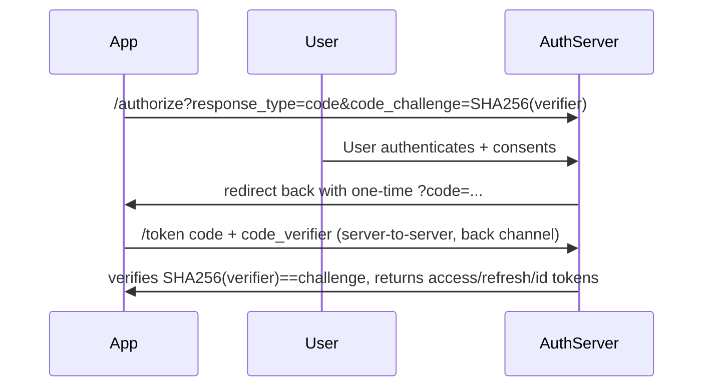

# Security, Authentication and Data Protection

Security shows up in almost every system-design interview as a cross-cutting concern:
"how do you authenticate users?", "how do you store passwords?", "how do you protect
PII?", "how do two services trust each other?". Unlike most subsystems, security is
graded on **trade-offs and threat models**, not on a single "correct" architecture.
The strongest answers reason about *what you gain, what you give up, and what attacker
you are defending against* for every choice.

This document is layered: for each concept you get intuition → how it works →
real-world usage → **trade-offs and when to pick it**. Two mental models to keep
throughout:

- **Defense in depth**: no single control is trusted; you layer independent controls
  so a single failure is not catastrophic.
- **Least privilege + assume breach (zero trust)**: grant the minimum access needed,
  and design as if the network, a host, or a credential is already compromised.

A recurring interview theme: **security almost always trades latency, cost, or
developer/operator complexity for a reduced blast radius.** Say that out loud and back
it with numbers.

---

## Authentication versus authorization

**Intuition.** *Authentication (authN)* answers "who are you?" — proving identity.
*Authorization (authZ)* answers "what are you allowed to do?" — deciding permissions
for an already-identified principal. They are separate stages: you authenticate once,
then authorize on every action.

**How it works.**



- `401 Unauthorized` really means *unauthenticated* (identity missing/invalid) — a
  naming bug in HTTP. `403 Forbidden` means *authenticated but not permitted*.
- AuthN produces a **principal** (subject). AuthZ consumes the principal plus
  attributes/roles plus the resource + action to render a decision.

**Real-world usage.** An API gateway typically terminates authN (validates a token /
session), attaches identity context, and forwards to services that perform authZ close
to the data. Google's BeyondCorp and AWS IAM both cleanly separate the two: IAM
authenticates a caller (SigV4 signature) and then evaluates policies (authZ).

**Trade-offs.**

- **Centralize authN, distribute authZ.** AuthN benefits from one hardened path
  (fewer places to get token validation wrong). AuthZ often must live next to the data
  because only the service knows resource ownership and fine-grained rules. Centralizing
  authZ (a policy service like Google Zanzibar / AWS AVP / OPA) gives consistency and
  auditability but adds a network hop and a availability dependency on the hot path.
- **Failing open vs closed.** If the authZ service is down, failing *open* preserves
  availability but risks unauthorized access; failing *closed* is safe but causes an
  outage. Security-critical systems fail closed; measure the availability cost.

---

## Sessions versus tokens

**Intuition.** After login you need to remember the user across requests. Two families:
**server-side sessions** (server stores state, client holds an opaque session ID) and
**self-contained tokens** (client holds a signed token like a JWT that *is* the state).

**How it works.**

```
Session (stateful):
  login → server creates session row → returns Set-Cookie: sid=opaque
  each request → server looks up sid in store (Redis/DB) → gets user

Token (stateless JWT):
  login → server signs {sub, exp, scopes} with key → returns token
  each request → server verifies signature + exp locally, no lookup
```

- A **JWT** is `base64(header).base64(payload).signature`. The signature (HMAC with a
  shared secret, or RSA/ECDSA with a private key) lets any holder of the key verify
  integrity *without* a database lookup. **The payload is signed, not encrypted** —
  anyone can read it (use JWE if you must hide claims).
- Sessions keep state server-side; the cookie is just a random opaque handle.

**Comparison.**

| Dimension | Server session (opaque) | JWT / self-contained token |
|---|---|---|
| Validation | DB/cache lookup each request | Local signature check (fast, no I/O) |
| Revocation | Instant (delete the row) | Hard — valid until `exp` unless you add a denylist |
| Horizontal scale | Needs shared session store | Stateless; no shared store on hot path |
| Payload visibility | Server-only | Readable by client (unless JWE) |
| Size on wire | ~tens of bytes | 500 B–1 KB+, sent every request |
| Blast radius of key/store leak | Session store dump | Signing-key leak = forge any identity |

**Trade-offs and when to use what.**

- **Pick sessions when you need instant revocation and central control** — banking,
  admin consoles, anything where "log everyone out now" must be real-time. Cost: a
  read on every request (mitigate with Redis; ~0.2–1 ms) and a shared store to operate.
- **Pick JWTs when you need stateless horizontal scale / cross-service auth** —
  microservices where each service independently verifies a token without calling an
  auth DB. Cost: revocation is weak; a stolen token is valid until expiry.
- **The classic compromise**: short-lived access JWT (5–15 min) + long-lived refresh
  token that *is* stateful (stored server-side, revocable). You get statelessness on
  the hot path and revocation on the cold path. This is the modern default.
- **Never** put JWTs in `localStorage` if you can avoid it (XSS can read it). Prefer
  `HttpOnly`, `Secure`, `SameSite` cookies so JS cannot read the token; pair with CSRF
  defense (double-submit token or SameSite=strict/lax).
- **The modern SPA split:** keep the short-lived **access token in memory** (a JS variable,
  never `localStorage`) and the **refresh token in an `HttpOnly` `Secure` `SameSite` cookie**.
  JS reads the access token to attach it to API calls, but the long-lived refresh token is
  invisible to JS. Residual risk: XSS can still exfiltrate the *in-memory* access token
  while the page is open, but it dies on refresh/tab-close and cannot mint new ones (it
  can't reach the refresh cookie). Contrast the pure-cookie approach (access token also in
  an `HttpOnly` cookie): JS never touches any token so XSS can't exfiltrate one, but you
  now need CSRF defense because the browser auto-attaches the cookie to every request. Each
  retains a distinct residual risk — in-memory trades a small XSS-exfiltration window for
  no CSRF surface; pure-cookie trades CSRF exposure for no readable token.

---

## JWT structure, signing and pitfalls

**Intuition.** A JWT is trustworthy only because of its signature and the discipline
around it. Most JWT vulnerabilities are misuse, not crypto breaks.

**How it works.** Header declares `alg` and `kid` (key id). Claims include registered
ones: `iss` (issuer), `sub` (subject), `aud` (audience), `exp`, `iat`, `nbf`, `jti`
(unique id, useful for denylisting). Symmetric signing (HS256) uses one shared secret;
asymmetric (RS256/ES256/EdDSA) uses a private key to sign and a public key (published
via JWKS endpoint) to verify.

**Worked example — decode a real token.** A JWT is three base64url chunks joined by dots:
`eyJhbGciOiJSUzI1NiIsImtpZCI6ImtleS0xIn0.eyJzdWIiOiJ1c2VyXzQyIiwiaXNzIjoiaHR0cHM6Ly9hdXRoLmV4YW1wbGUuY29tIiwiYXVkIjoiYXBpLmV4YW1wbGUuY29tIiwiZXhwIjoxNzM1Njg5NjAwLCJpYXQiOjE3MzU2ODg3MDB9.<signature-bytes>`

base64url-decode the first two segments (anyone can — it is *not* encrypted):

```
header  = {"alg":"RS256","kid":"key-1"}
payload = {"sub":"user_42","iss":"https://auth.example.com",
           "aud":"api.example.com","exp":1735689600,"iat":1735688700}
```

So `exp − iat = 1735689600 − 1735688700 = 900 seconds = a 15-minute access token`. The
verifier fetches the RSA **public** key whose id is `kid:"key-1"` from the issuer's JWKS
endpoint and checks the signature over `base64url(header) + "." + base64url(payload)`.

**Worked example — trace the RS256 → HS256 algorithm-confusion attack.** The server signs
with RS256 (private key signs, public key `P` verifies) and `P` is published openly.

1. Attacker takes the header and flips one field: `{"alg":"RS256",...}` → `{"alg":"HS256",...}`.
2. Attacker edits the payload freely, e.g. `"sub":"user_42"` → `"sub":"admin"`.
3. Attacker computes `HMAC-SHA256(message, key = the raw PEM bytes of P)` — because `P` is
   public, the attacker *has* this "secret". This yields a valid HS256 signature.
4. A naive verifier reads `alg` from the header, sees `HS256`, and calls
   `verifyHMAC(token, P)` — using the same public key `P` as the HMAC secret. The HMAC
   matches, so the forged `admin` token is **accepted**.

The bug: the verifier let the *attacker-controlled header* pick the algorithm, and reused
the public key as an HMAC secret. **Fix: pin the expected algorithm** (`RS256` only) server-side;
never let `alg` select the verification path, and never feed a public key into an HMAC verifier.

**Pitfalls (interview gold).**

- **`alg: none`** — some libraries accepted an unsigned token. Always pin allowed algs.
- **Algorithm confusion (RS256 → HS256)** — attacker changes `alg` to HS256 and signs
  with the *public* key as the HMAC secret; a naive verifier that keys off `alg` accepts
  it. Fix: verify against the expected alg only.
- **Not validating `aud`/`iss`** — a token minted for service A is replayed at service
  B. Always check audience and issuer.
- **Oversized tokens / claim bloat** — embedding roles and permissions grows the token;
  it is sent on every request, inflating bandwidth and risking header-size limits.

**Trade-offs.**

- **HS256 vs RS256/ES256.** HMAC is fast and simple but every verifier needs the secret
  — so a single leaked verifier can *mint* tokens. Asymmetric keys let many services
  verify with a public key while only the issuer can sign — smaller blast radius, at
  higher CPU cost per verify (still sub-ms). For multi-service or third-party
  verification, use asymmetric. ES256/EdDSA give smaller signatures than RS256.
- **Claims in token vs lookup.** Fat tokens avoid lookups (fast) but go stale (a revoked
  role stays valid until expiry) and leak info; thin tokens + a permission lookup are
  fresh but reintroduce I/O.

---

## Refresh tokens, rotation and revocation

**Intuition.** Access tokens are short-lived so a leak is bounded; refresh tokens let
you get new access tokens without re-login. The danger is that a stolen refresh token
is a long-lived master key, so you defend it with **rotation** and **reuse detection**.

**How it works.**

```
login → {access(15m), refresh(30d)}
access expires → POST /refresh with refresh token
  server issues NEW access + NEW refresh, invalidates old refresh  (rotation)
  if an ALREADY-USED refresh token is presented again → token theft!
     → revoke the entire token family (force re-login)              (reuse detection)
```

- **Rotation**: each refresh use mints a new refresh token and invalidates the prior
  one (one-time use). Requires server-side state (a store of valid/used refresh tokens
  or families) — refresh is stateful even when access is stateless.
- **Revocation strategies for access tokens**: (1) keep them short so revocation is
  "wait it out"; (2) maintain a denylist of `jti`s checked on the hot path (reintroduces
  a lookup — usually a small, fast cache); (3) bump a per-user `token_version` and embed
  it, invalidating all tokens on change.

**Trade-offs.**

- **Access token lifetime.** Short (5 min) → strong security, more refresh traffic and
  load on the auth service. Long (hours) → less traffic but a stolen token is dangerous
  and effectively unrevocable. Tune to threat model; 15 min is a common middle.
- **Denylist vs pure expiry.** A denylist gives near-instant revocation but adds a
  lookup on every request and a store to run — you have partly re-created sessions.
  Pure short expiry keeps the hot path clean but leaves a revocation window.
- **Refresh rotation + reuse detection** is the modern best practice (OAuth 2.0 BCP,
  Auth0/Okta default): it turns a stolen refresh token into a detectable, self-limiting
  event, at the cost of maintaining token-family state and occasionally logging out a
  legitimate user who raced two refreshes (mitigate with a small grace window).

---

## OAuth 2.0 and OpenID Connect flows

**Intuition.** OAuth 2.0 is a **delegated authorization** framework: it lets an app act
on a user's behalf against a resource (e.g., "let this app read your Google Calendar")
*without* the app seeing the password. OIDC is a thin **authentication** layer on top of
OAuth 2.0 that adds an **ID token** (a JWT describing the user) — this is what "Sign in
with Google" uses. Common confusion: OAuth alone is authZ (access), OIDC adds authN
(identity).

**Roles.** Resource Owner (user), Client (the app), Authorization Server (issues
tokens), Resource Server (the API). Tokens: **access token** (call the API), **refresh
token**, and (OIDC) **ID token** (who the user is).

**Authorization Code flow with PKCE** (the modern default for web/mobile/SPA):



- **PKCE (Proof Key for Code Exchange)** stops an attacker who intercepts the redirect
  `code` from redeeming it, because they lack the random `code_verifier`. It was created
  for mobile apps that cannot keep a client secret, and is now recommended for *all*
  clients including SPAs.

**Worked example — why intercepting the `code` is useless under PKCE.** Trace one run with
concrete values:

1. Client generates a random 43-char `code_verifier`, e.g. `dBjftJeZ4CVP-mB92K27uhbUJU1p1r_wW1gFWFOEjXk`.
2. Client derives `code_challenge = base64url(SHA256(verifier))` — a one-way hash, e.g.
   `E9Melhoa2OwvFrEMTJguCHaoeK1t8URWbuGJSstw-cM`. It sends only the *challenge* on the
   front channel: `/authorize?...&code_challenge=E9Mel...&code_challenge_method=S256`.
3. Auth server stashes the challenge with the issued one-time `?code=abc123`, redirected
   back to the client.
4. **Attacker intercepts `code=abc123`** (malicious redirect handler, browser history,
   referer leak) and races to redeem it: `POST /token code=abc123 & code_verifier=???`.
5. The attacker only saw the *challenge* (`E9Mel...`), never the verifier. To forge a
   valid `code_verifier` they would have to invert SHA-256 — find an input that hashes to
   `E9Mel...` — which is computationally infeasible. Their `/token` call fails
   verification; the stolen `code` is worthless.
6. The legitimate client sends the real `verifier`; the server recomputes
   `SHA256(verifier)`, compares to the stored challenge, they match, and tokens are issued.

The insight: the secret (`verifier`) never travels on the interceptable channel — only its
hash does, and a hash cannot be reversed into the secret.
- **Client Credentials flow**: no user at all — a service authenticates as itself
  (client_id + secret) to call an API. Used for machine-to-machine / backend jobs.
- **Device Authorization flow**: for input-constrained devices (TVs) — user enters a
  code on their phone.

**Deprecated flows (know why).** The **Implicit flow** returned tokens directly in the
URL fragment — leaky (browser history, referrer) and no way to authenticate the client;
it is deprecated in favor of Auth Code + PKCE. The **Resource Owner Password Credentials
(ROPC)** flow has the app collect the user's password directly — defeats the whole point
of delegation; deprecated.

**Trade-offs.**

- **Auth Code + PKCE vs Implicit.** PKCE adds one extra request (the token exchange) and
  requires the client to store a verifier briefly, but eliminates token exposure in
  URLs. Always worth it now.
- **Access token as JWT vs opaque + introspection.** A JWT access token lets the
  resource server validate locally (fast, no call to the auth server) but is hard to
  revoke; an **opaque token + `/introspect`** call gives instant revocation and central
  control at the cost of a network hop per request (mitigate with short-TTL caching of
  introspection results, which reopens a small revocation window). Google uses opaque
  access tokens; many internal microservice meshes use JWTs for speed.
- **OIDC vs rolling your own SSO.** OIDC standardizes discovery (`.well-known`), JWKS
  key rotation, and claims — huge interoperability win. The cost is conceptual
  complexity and a hard dependency on the IdP's availability.

---

## RBAC versus ABAC and modern authorization

**Intuition.** **RBAC (Role-Based Access Control)** grants permissions to *roles*, and
users get roles ("admin", "editor"). **ABAC (Attribute-Based Access Control)** decides
based on *attributes* of the subject, resource, action, and environment
("allow if user.dept == doc.dept AND time is business hours AND request.ip is corporate").
**ReBAC (Relationship-Based)** — Google Zanzibar style — decides based on graph
relationships ("user is an editor of folder X, and doc is in folder X").

**Comparison.**

| Model | Decision basis | Granularity | Scales with | Example |
|---|---|---|---|---|
| RBAC | user's roles | coarse (per role) | # roles | "admins can delete" |
| ABAC | arbitrary attributes + policy | fine, contextual | policy complexity | "same-region managers only, 9–5" |
| ReBAC | relationship graph | fine, per-object | # relationships | "editors of parent folder" |

**Real-world usage.** AWS IAM is essentially ABAC (policy conditions on tags, source IP,
MFA). Google Drive / GitHub permissions are ReBAC (Zanzibar / their own graph). Most
enterprise apps start RBAC and add ABAC conditions as needs grow. Engines: OPA/Rego,
AWS Cedar (Verified Permissions), SpiceDB/OpenFGA (Zanzibar-style).

**Trade-offs.**

- **RBAC: simple, auditable, cache-friendly, but role explosion.** As you add tenants,
  regions, and exceptions, you get "role explosion" (thousands of near-duplicate roles).
  Great when permissions are stable and coarse.
- **ABAC: flexible and expressive, but hard to audit and reason about.** "Who can access
  this document?" becomes hard to answer statically because it depends on runtime
  attributes. Policy evaluation adds latency and a policy engine to operate. Pick when
  access truly depends on context (location, time, data classification).
- **ReBAC: perfect for sharing/hierarchies, but needs a consistent, low-latency graph
  store.** Zanzibar solves "check billions of ACLs at <10 ms p95" but is a serious
  distributed system (consistency tokens/"zookies" to avoid the "new enemy" problem).
  Pick for social/collaboration products with nested sharing.
- **Where to evaluate.** Central policy service = consistency + audit, but a hot-path
  dependency and hop; embedded library (OPA sidecar) = low latency + availability, but
  policy/data distribution and staleness challenges.

---

## API keys and mutual TLS

**Intuition.** For service-to-service or developer API access you need machine identity.
**API keys** are simple shared secrets ("who is calling"). **mTLS (mutual TLS)** has both
client and server present X.509 certificates so *each* cryptographically proves identity
at the transport layer.

**How it works.**

- API key: a long random string sent in a header (`Authorization: Bearer sk_live_...`).
  The server looks it up, maps it to an account, checks scopes and rate limits. Keys
  should be hashed at rest (treat like passwords) and prefixed for scanning/rotation.
- mTLS: standard TLS also validates the *client* cert against a trusted CA. Identity is
  bound to the cert (and its private key never leaves the client). Service meshes
  (Istio, Linkerd, AWS App Mesh) auto-issue short-lived certs (SPIFFE/SPIRE identities)
  and rotate them, making mTLS operationally feasible at scale.

**Trade-offs.**

- **API keys: trivial to adopt, terrible to manage at scale.** No built-in expiry, easy
  to leak (committed to Git, logs), coarse identity. Fine for low-risk read APIs,
  developer onboarding, and simple partner integrations. Mitigate with hashing, scoping,
  rotation, prefixing (GitHub secret scanning), and rate limits.
- **mTLS: strong, mutual, no shared bearer secret to steal in transit, but heavy.**
  Requires PKI, cert issuance/rotation/revocation (CRL/OCSP), and client cert management
  — painful for public/browser clients, natural inside a mesh. Pick mTLS for
  zero-trust service-to-service and high-value B2B; pick API keys or OAuth client
  credentials for public developer APIs.
- **mTLS vs OAuth client credentials.** Both do M2M auth. mTLS binds identity to the
  transport and resists bearer-token theft (there is no token to replay); client
  credentials issue a bearer token that is simpler across the internet but stealable.
  Combine them (mTLS-bound tokens, RFC 8705) for the strongest posture.

---

## Encryption in transit

**Intuition.** Encryption in transit protects data moving over a network from
eavesdropping and tampering. TLS is the workhorse.

**How it works.** TLS 1.3 does an authenticated key exchange (ECDHE) to derive a shared
symmetric key, then encrypts with an AEAD cipher (AES-GCM / ChaCha20-Poly1305). The
server proves identity with a certificate signed by a trusted CA. TLS 1.3 cut the
handshake to **1-RTT** (and 0-RTT resumption), dropped legacy ciphers, and gives
**forward secrecy** by default (ephemeral keys mean a later private-key compromise
cannot decrypt old captured traffic).

**Real-world usage.** HTTPS everywhere; Let's Encrypt automated certs; internal traffic
increasingly mTLS. TLS termination commonly happens at the load balancer/CDN edge, then
either re-encrypted to origin (defense in depth) or plaintext inside a trusted VPC
(cheaper, but violates zero trust).

**Trade-offs.**

- **Terminate at edge vs end-to-end.** Terminating TLS at the LB is cheaper (offloads
  crypto, enables L7 routing/WAF inspection) but leaves an internal plaintext hop.
  End-to-end / mTLS to origin closes that gap at CPU and operational cost. Zero-trust
  says encrypt internal hops too.
- **0-RTT resumption** cuts latency but is replayable — only safe for idempotent
  requests.
- **Forward secrecy** costs a little CPU (ephemeral key exchange per session) but is
  now standard; the trade-off is essentially settled in its favor.

---

## Encryption at rest and envelope encryption

**Intuition.** Encryption at rest protects data on disk/backups/snapshots if the storage
medium is stolen or a backup leaks. The hard part is not the cipher — it is **key
management**: where the key lives and who can use it.

**How it works — envelope encryption.**

```
Plaintext ──encrypt with──▶ DEK (data encryption key, random, per-object/per-tenant)
DEK ──encrypt with──▶ KEK (key encryption key, lives in KMS/HSM, never leaves)
Store: ciphertext + encrypted DEK (the "envelope"). To read: KMS decrypts DEK, you
decrypt data locally with the DEK, then discard the plaintext DEK.
```

- The **KEK never leaves the KMS/HSM**; only DEKs go in and out (small, cheap calls).
- This lets you **rotate the KEK cheaply** (re-encrypt only the small DEKs, not petabytes
  of data) and cache decrypted DEKs briefly to avoid a KMS call per object.
- AWS KMS, GCP Cloud KMS, HashiCorp Vault all implement this. Managed disk/S3 encryption
  (SSE-KMS) is envelope encryption under the hood.

**Worked example — the KMS-call math.** Say you must encrypt **1,000,000 objects**.

- **Direct KMS (no envelope):** every object is encrypted/decrypted by calling KMS. To
  read all of them once = **1,000,000 KMS decrypt calls**. AWS KMS is rate-limited (on the
  order of ~10k–30k req/sec/region depending on key type) and billed per call
  (~$0.03 per 10,000 requests), so this run is `1,000,000 ÷ 10,000 × $0.03 = $3` *and*
  can throttle you for ~30–100 seconds at the cap — a hot loop hammering KMS.
- **Envelope:** you generate one DEK per object (or per tenant), encrypt each object
  *locally* with AES-GCM, and store the KEK-wrapped DEK alongside. Reading everything =
  **decrypt each DEK once** — but if you cache decrypted DEKs (say one DEK shared across a
  tenant's 1M objects) it collapses to **1 KMS call**, then 1,000,000 *local* AES-GCM
  operations at memory speed (millions/sec on one core). KMS cost drops from $3 and
  100 s of throttle risk to a single call and effectively zero throttle.

**Worked example — cheap KEK rotation.** Now rotate the master key. Suppose those 1M
objects are covered by **2,000 DEKs** (one per tenant), and the ciphertext totals **50 TB**.

- **Without envelope**, rotating the key means re-encrypting all **50 TB** of data —
  read + decrypt + re-encrypt + rewrite petascale storage, hours to days of I/O.
- **With envelope**, the data stays put. You only re-wrap the **2,000 DEKs** under the new
  KEK: 2,000 tiny KMS operations (a few KB each), done in seconds. The 50 TB of ciphertext
  is never touched. *That* is what "rotate the KEK cheaply" means — you re-encrypt keys,
  not data.

**Trade-offs.**

- **Application-level vs storage-level encryption.** Encrypting at the app layer (before
  it hits the DB) protects against a compromised DB and enables per-tenant/field keys and
  crypto-shredding, but breaks indexing/search/range queries on the encrypted column and
  adds code complexity. Storage/disk-level (TDE, SSE) is transparent and cheap but only
  protects against physical media theft — a compromised app or DBA still reads plaintext.
- **Envelope encryption vs encrypting everything directly with the KMS key.** Envelope
  minimizes KMS calls (one per DEK, then local symmetric crypto) and enables cheap
  rotation; the cost is added moving parts (managing DEKs and caches). Direct KMS
  encryption of large data is slow and rate-limited.
- **Key granularity.** Per-tenant DEKs enable **crypto-shredding** (delete the key →
  data is unrecoverable, satisfying GDPR erasure) and limit blast radius, but multiply
  key-management overhead and KMS cost. One key for everything is simple but a single
  compromise exposes all data and you cannot selectively shred.
- **Managed KMS vs self-hosted HSM.** Managed KMS is easy and cheap; a dedicated HSM
  (CloudHSM) gives you sole custody and meets strict compliance (FIPS 140-2/3, key never
  seen by the provider) at much higher cost and operational burden.

---

## Password hashing and credential storage

**Intuition.** Never store passwords reversibly. Store a **slow, salted, one-way hash**
so that even a full database dump does not hand attackers the plaintext passwords.

**How it works.**

- Use a **password-hashing function designed to be slow and memory-hard**: **Argon2id**
  (modern winner), **scrypt**, or **bcrypt**. General hashes (SHA-256, MD5) are *wrong*
  here because they are fast — a GPU tries billions/sec.
- **Salt** (unique random per user) defeats precomputed rainbow tables and makes equal
  passwords hash differently. **Pepper** (a secret added to all, stored separately e.g.
  in an HSM/KMS) adds a layer a DB dump alone cannot bypass.
- Tune a **work factor** (bcrypt cost, Argon2 memory/iterations) so one hash takes
  ~100–250 ms on your hardware — slow enough to throttle cracking, fast enough for login.

**Worked example — why "fast hash bad" is a number, not a slogan.** Take an 8-character
*lowercase-only* password. The search space is `26^8 ≈ 2.09 × 10^11` candidates.

- **Fast hash (SHA-256).** A single modern GPU rig brute-forces roughly `10^10`
  SHA-256/sec. Cracking the whole space:
  `2.09 × 10^11 ÷ 10^10 ≈ 21 seconds`. The entire keyspace falls in under half a minute —
  and that is *per stolen hash*, in parallel across every user in the dump.
- **Slow hash (bcrypt cost 12).** Cost 12 is tuned to ~250 ms/hash, so that same rig
  manages only `1 ÷ 0.25 = 4 hashes/sec`. Same space:
  `2.09 × 10^11 ÷ 4 ≈ 5.2 × 10^10 sec ≈ 1,650 years`.

Same password, same attacker — 21 seconds versus ~1,650 years. The only thing that
changed is *cost per guess*. Now the dial: bcrypt cost is a base-2 exponent, so **cost 13
doubles the work** — the crack stretches to ~3,300 years, but your *login latency also
doubles* to ~500 ms and each auth burns twice the CPU. That is the whole tuning tension in
one line: every +1 of cost doubles both the attacker's pain and your own login bill.

> [!KEY-TAKEAWAY]
> "Don't use a fast hash" means: at 10^10 guesses/sec a trivially weak password dies in
> seconds; a 250 ms hash makes the *same* attacker spend centuries. You are buying crack
> time with login latency — so rate-limit logins and size the auth tier for peak, because
> a login spike now costs real CPU.

**Trade-offs.**

- **bcrypt vs Argon2id.** bcrypt is battle-tested, ubiquitous, but capped at 72 bytes and
  not memory-hard (more vulnerable to GPU/ASIC). Argon2id is memory-hard (resists GPUs)
  and is OWASP's current recommendation, but is newer and needs careful parameter tuning
  (too much memory can DoS your own login service under load). scrypt sits between.
- **Work factor tuning is a security-vs-latency-vs-cost dial.** Higher cost = harder to
  crack but slower logins and more CPU/RAM per auth — a login spike can exhaust the auth
  tier. Rate-limit login and size for peak.
- **Pepper adds a layer but adds an operational dependency** (if the pepper/HSM is lost,
  no one can log in) and cannot be per-user-rotated easily.
- **Better still: reduce reliance on passwords.** Passkeys/WebAuthn (FIDO2) use
  public-key crypto bound to the device — nothing crackable is stored server-side (only a
  public key), phishing-resistant. The trade-off is recovery/UX complexity and device
  binding.

---

## Multi-factor authentication

**Intuition.** MFA requires two+ of: something you know (password), something you have
(phone, security key), something you are (biometric). It defends against stolen/guessed
passwords — the most common breach vector.

**How it works.** TOTP (RFC 6238) generates a 6-digit code from a shared secret + time.
Push approvals and SMS OTP are common but weaker. **WebAuthn/FIDO2 security keys** use
challenge-response public-key crypto bound to the site origin — **phishing-resistant**
because the credential won't sign for a look-alike domain.

**Trade-offs.**

- **SMS OTP: universal but weak.** Vulnerable to SIM-swap and interception; NIST
  discourages it. Use only as a fallback.
- **TOTP: no network dependency, phishable.** A phishing site can relay the code in
  real time. Good default, cheap.
- **Push with number-matching: better UX, resists "MFA fatigue"** (spamming approvals
  until the user taps yes) only if you require number matching; plain push is fatigable.
- **WebAuthn/passkeys: strongest (phishing-resistant), best UX, but recovery is hard**
  (lost device) and adoption/hardware-support varies. Pick for high-value accounts;
  provide backup factors.

---

## Secrets management

**Intuition.** Secrets (DB passwords, API keys, private keys, tokens) must never live in
source code, images, or plaintext config. A secrets manager stores them encrypted,
controls access via IAM, rotates them, and audits every access.

**How it works.** HashiCorp Vault, AWS Secrets Manager, GCP Secret Manager, or K8s
Secrets (with KMS envelope encryption + RBAC). Apps fetch secrets at runtime via an
authenticated identity (IAM role, Vault token, or workload identity like
SPIFFE/IRSA) — no static credential to bootstrap. **Dynamic secrets** (Vault) generate
short-lived, per-request DB credentials that auto-expire, so a leak is bounded.

**Trade-offs.**

- **Static long-lived secrets vs dynamic short-lived.** Static are simple but a leak is
  open-ended and rotation is disruptive. Dynamic secrets shrink the leak window to
  minutes but require a broker (Vault) integrated with every backend — real operational
  weight.
- **Central secrets service vs baked-in env vars.** A central service gives rotation,
  audit, and revocation but is a runtime dependency on the startup/critical path (cache
  + graceful degradation needed). Env vars/files are simple but leak via process dumps,
  logs, and are hard to rotate.
- **The bootstrapping problem.** You still need *some* identity to fetch secrets — solve
  with platform-provided workload identity (instance role, K8s service account) rather
  than a "secret to get secrets."

---

## Rate limiting, WAF and DDoS defense

**Intuition.** These protect availability and mitigate abuse — a security concern as much
as a scaling one. **Rate limiting** bounds request volume per identity. A **WAF (Web
Application Firewall)** inspects L7 traffic for attack patterns (SQLi, XSS, path
traversal). **DDoS protection** absorbs/deflects volumetric floods.

**How it works.** Rate limiters (token bucket, sliding window) throttle per user/IP/API
key and are essential on auth endpoints to stop brute force and credential stuffing.
WAFs (AWS WAF, Cloudflare, ModSecurity) apply managed rule sets + custom rules and can do
bot detection. DDoS defense (Cloudflare, AWS Shield, Google Cloud Armor) uses anycast,
scrubbing centers, and SYN-cookie/L3-L4 filtering; L7 floods need application-aware rules.

**Trade-offs.**

- **WAF: fast protection with false positives.** Managed rules block known attacks
  immediately (great as a stopgap while you fix code) but generate false positives that
  block legitimate traffic; run in count/monitor mode first, then enforce. A WAF is a
  *layer*, not a substitute for secure code (defense in depth).
- **Rate limit strictness.** Tight limits stop abuse but cause false rejections of
  legitimate bursts; loose limits let brute-force/credential-stuffing through. On login,
  layer per-IP + per-account + global limits and add exponential backoff / CAPTCHA on
  repeated failures.
- **Edge vs origin enforcement.** Blocking at the CDN/edge sheds attack traffic before it
  costs you compute (cheap, scalable) but the edge sees less app context; origin
  enforcement is precise but the flood already reached you.

---

## OWASP Top 10 and common vulnerabilities

**Intuition.** The OWASP Top 10 is the canonical checklist of web app risks. Interviewers
love "how do you prevent X". Know the top ones and their fixes.

**Key items (2021 edition, stable talking points).**

- **A01 Broken Access Control** (#1) — e.g., **IDOR** (change `/orders/123` to `/124` and
  see someone else's order). Fix: authorize every object access server-side against the
  principal; never trust client-supplied IDs.
- **A02 Cryptographic Failures** — plaintext/weak crypto, missing TLS. Fix: TLS, strong
  hashing, proper key management.
- **A03 Injection** (SQLi, command, XSS) — untrusted input reaches an interpreter. Fix:
  **parameterized queries / prepared statements**, output encoding, input validation.
  Note: parameterized queries beat "escaping" or WAF rules as the *root-cause* fix.
- **A05 Security Misconfiguration** — default creds, verbose errors, open S3 buckets.
- **A07 Identification and Authentication Failures** — weak passwords, no MFA, session
  fixation.
- **A08 Software and Data Integrity Failures** — insecure deserialization, unsigned CI/CD
  artifacts, supply-chain (log4shell-style) risks.
- **CSRF & SSRF** — CSRF: forged authenticated requests (fix: SameSite cookies +
  anti-CSRF tokens). SSRF: server tricked into fetching internal URLs (fix: allowlist,
  block link-local `169.254.169.254` metadata endpoint) — the cause of the Capital One
  breach.

**Trade-offs.** Input validation (allowlist) vs sanitization (fix-up): allowlisting
rejects anything unexpected (safer, may block valid edge cases); sanitization tries to
clean input (convenient, error-prone). Prefer allowlist + parameterization. WAF rules buy
time but the durable fix is in code — defense in depth, not defense instead of.

---

## PII, GDPR, tokenization and data residency

**Intuition.** Regulations (GDPR, CCPA, HIPAA, PCI-DSS) impose duties on personal/sensitive
data: minimize collection, protect it, allow users to access/delete it, and sometimes
keep it in-region. Design choices must make these *technically feasible*, not just
policy.

**How it works.**

- **Tokenization vs encryption.** Tokenization replaces sensitive data (e.g., a card
  number) with a meaningless **token**, storing the real value in a separate, highly
  secured **token vault**. The token has no mathematical relationship to the data, so a
  breach of the app store yields nothing. Encryption is reversible with a key;
  tokenization is reversible only via the vault lookup. PCI-DSS scope shrinks
  dramatically because most systems only ever see tokens.
- **Right to erasure ("right to be forgotten").** You must be able to delete a user's
  data — hard with immutable logs, backups, and event streams. **Crypto-shredding**
  (per-user encryption key; delete the key to render data unrecoverable) is the common
  answer for append-only/backup systems.
- **Data residency / sovereignty.** Store/process EU data in the EU. Achieved via
  regional deployments, sharding by region, and blocking cross-region replication of
  regulated fields.
- **Pseudonymization / anonymization / minimization.** Strip or hash direct identifiers;
  collect only what you need; set retention limits.

**Trade-offs.**

- **Tokenization vs encryption.** Tokenization gives the smallest breach blast radius and
  compliance-scope reduction, but the **token vault is a centralized bottleneck / SPOF**
  (must be HA, low-latency, and itself the crown jewel) and detokenization adds a lookup.
  Encryption keeps data self-contained and is simpler operationally but a key leak exposes
  everything and does not reduce PCI scope. Payments overwhelmingly use tokenization
  (Stripe, Adyen); pick it when data is high-value and often *doesn't* need to be read.
- **Crypto-shredding vs physical deletion.** Crypto-shredding makes GDPR erasure feasible
  across backups/immutable logs (you can't rewrite a WORM backup) at the cost of
  per-user key management and the caveat that "deleted" data still exists as ciphertext
  (acceptable to most regulators). Physical deletion is unambiguous but often impossible
  across replicas/snapshots/streams.
- **Data residency vs global architecture.** Regional isolation satisfies sovereignty but
  breaks global single-table designs, complicates a global user who travels, raises cost
  (duplicate infra per region), and hurts cross-region analytics. Cell-based /
  regionalized architectures are the modern answer and also improve blast-radius
  isolation.
- **Data minimization vs product/ML appetite.** Collecting less reduces breach impact and
  compliance burden but limits analytics/personalization/ML features — a real product
  tension you should name.

---

## Zero trust and defense in depth

**Intuition.** **Zero trust**: "never trust, always verify" — there is no trusted
internal network; every request is authenticated, authorized, and encrypted regardless of
origin. **Defense in depth**: layer independent controls so no single failure is fatal.
Together they define modern security architecture (Google BeyondCorp popularized ZT).

**How it works.**

```
Layers (defense in depth):
  Edge:     DDoS scrubbing, WAF, TLS, bot detection
  Network:  segmentation, mTLS between services, no implicit VPC trust
  Identity: strong authN (MFA/passkeys), short-lived creds, least privilege
  App:      authZ on every action, input validation, output encoding
  Data:     encryption at rest, tokenization, per-tenant keys, field-level access
  Audit:    logging, anomaly detection, secrets rotation
```

- Zero trust replaces the "castle-and-moat" (hard perimeter, soft interior) with
  per-request verification and micro-segmentation. Continuous verification: device
  posture + identity + context on each access, not once at VPN login.

**Trade-offs.**

- **Zero trust vs perimeter (VPN/castle-and-moat).** ZT contains lateral movement after a
  breach (an attacker inside the network still can't reach services without valid
  identity) and supports remote/cloud work, but costs far more engineering (identity-aware
  proxies, mTLS everywhere, policy engines) and adds latency (verify every hop).
  Perimeter models are cheap and simple but catastrophic once breached — one foothold
  roams freely.
- **Defense in depth vs cost/latency/complexity.** Each layer reduces breach probability
  and blast radius but adds latency, cost, and operational surface (more to run, more
  false positives, more to break). The engineering judgment is *which* layers earn their
  keep for *your* threat model and data sensitivity — you do not apply every control
  everywhere. Say this explicitly: security is risk management, not maximalism.
- **Fail closed vs fail open** (recurring): security controls that fail closed protect
  data but reduce availability; know your SLA and which failure mode each control takes.

---

## Trade-offs and when to use what

A consolidated cheat sheet for interviews:

| Decision | Pick A when… | Pick B when… |
|---|---|---|
| Sessions vs JWT | Need instant revocation, central control (banking, admin) | Need stateless scale, cross-service auth (microservices) |
| Access token lifetime | Threat is high, revocation matters → short (5–15m) + refresh | Load-sensitive, low risk → longer, but bounded |
| Opaque token + introspect vs JWT | Need real-time revocation, central audit | Need local, fast, offline verification |
| HS256 vs RS256/ES256 | Single trusted verifier, simplicity | Many verifiers / third parties (public-key verify) |
| RBAC vs ABAC vs ReBAC | Stable coarse perms → RBAC | Context-dependent → ABAC; sharing/hierarchy → ReBAC |
| API keys vs mTLS | Public dev APIs, low risk, easy onboarding | Zero-trust service mesh, high-value B2B |
| App-level vs storage-level encryption | Defend against compromised DB, need per-tenant keys/shredding | Only physical-theft threat, want transparency + queryability |
| Tokenization vs encryption | High-value data rarely read, want PCI scope reduction | Data must be read/computed on, want self-contained |
| bcrypt vs Argon2id | Ubiquity, proven, constrained env | Max GPU resistance, modern greenfield (OWASP pick) |
| Zero trust vs perimeter | Cloud/remote, contain lateral movement | Legacy/simple, cost-constrained (accept risk) |
| Fail closed vs open | Security-critical data | Availability-critical, low-sensitivity |

**Golden rules to repeat in interviews:**

1. AuthN ≠ authZ; 401 = who are you, 403 = not allowed.
2. Short-lived access token + revocable refresh token with rotation + reuse detection is
   the modern default.
3. Encrypt in transit *and* at rest; the hard part is key management (use envelope
   encryption + KMS).
4. Hash passwords with Argon2id/bcrypt (slow, salted); never a fast hash.
5. Least privilege + assume breach; layer controls (defense in depth); prefer failing
   closed for sensitive data.
6. Every security control trades latency/cost/complexity for reduced blast radius — name
   the trade explicitly.

---

## Common interview follow-up questions

- "A user's laptop is stolen with an active session — how do you revoke access, and how
  does your answer differ between sessions and JWTs?"
- "Design 'Sign in with Google' for your app. Walk through the OAuth/OIDC flow and where
  PKCE fits."
- "Your JWT signing key leaked. What is the blast radius and your incident response?
  How would asymmetric keys have helped?"
- "How do you store passwords? Why not SHA-256? Tune the work factor for a login spike."
- "How do two internal microservices authenticate each other with zero trust?"
- "A GDPR user requests deletion but their data is in immutable event logs and backups.
  How do you comply?" (crypto-shredding)
- "Design tokenization for credit-card storage to minimize PCI scope. What's the SPOF?"
- "How do you stop credential stuffing on your login endpoint?" (rate limit layers, MFA,
  breached-password checks, CAPTCHA, device fingerprinting)
- "Where do you terminate TLS, and what are the trade-offs of edge vs end-to-end?"
- "Explain envelope encryption and why you'd use per-tenant DEKs."
- "What's the difference between RBAC and ABAC, and when does RBAC break down?"
- "Access-control-service is down — do you fail open or closed, and why?"
- "How would you prevent IDOR / SSRF in your design?"

## References

- Alex Xu, *System Design Interview* Vol. 1 & 2 (ByteByteGo) — auth, rate limiting,
  and security chapters.
- ByteByteGo blog & newsletter: "Password Storage", "JWT vs Session", "OAuth 2.0
  Explained", "How HTTPS Works" (bytebytego.com).
- OWASP Top 10 (2021) — owasp.org/Top10; OWASP Cheat Sheet Series (Password Storage,
  Authentication, JWT, Transport Layer Protection).
- OWASP Password Storage Cheat Sheet — Argon2id / bcrypt guidance and work-factor tuning.
- IETF: RFC 6749 (OAuth 2.0), RFC 7519 (JWT), RFC 7636 (PKCE), RFC 8705 (mTLS-bound
  tokens), RFC 6238 (TOTP), OAuth 2.0 Security Best Current Practice (draft-ietf-oauth-security-topics).
- OpenID Connect Core spec (openid.net).
- AWS: KMS envelope encryption docs, IAM policy evaluation, AWS Shield/WAF, CloudHSM;
  AWS Well-Architected Security Pillar.
- Google: "BeyondCorp: A New Approach to Enterprise Security" (research.google);
  Zanzibar paper ("Google's Consistent, Global Authorization System", USENIX ATC 2019).
- Cloudflare Learning Center: DDoS, WAF, mTLS, zero-trust articles.
- Kleppmann, *Designing Data-Intensive Applications* — data integrity, encryption,
  and derived-data/erasure discussions.
- WebAuthn / FIDO2 (w3.org/TR/webauthn), passkeys (fidoalliance.org).
- NIST SP 800-63B (Digital Identity Guidelines — MFA, SMS OTP guidance).
- YouTube: ByteByteGo ("Session vs Token Authentication", "OAuth 2.0"), Hussein Nasser
  ("JWT", "TLS 1.3 handshake", "mTLS"), Gaurav Sen (system design security), "Jordan has
  no life" (auth deep dives).
