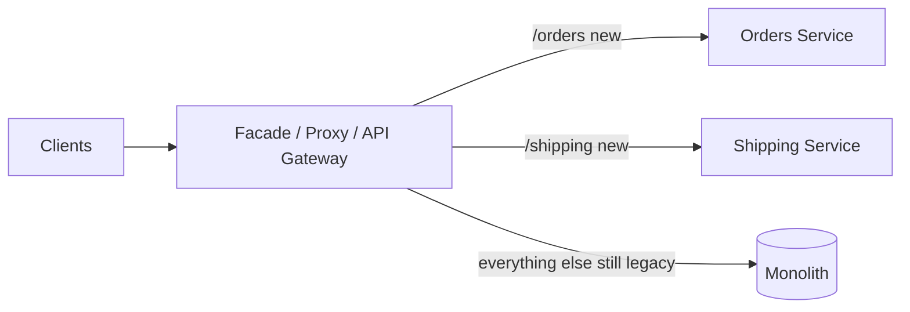
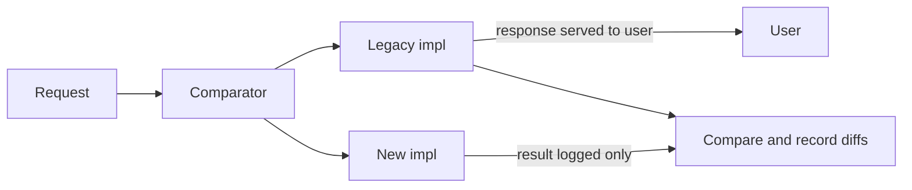
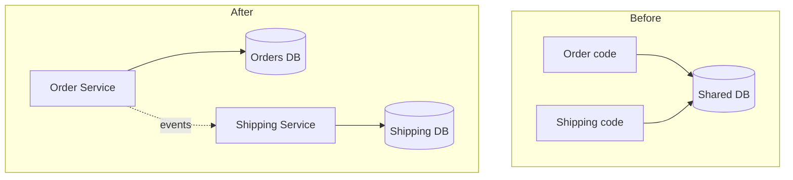

# Strangler Fig & Monolith-to-Microservices Migration

Breaking a monolith into services is one of the most common — and most dangerous —
system-design efforts a senior engineer will lead. The central lesson of the last two
decades is that **incremental, reversible migration almost always beats a big-bang
rewrite**. This topic covers the patterns that make incremental migration safe:
Strangler Fig, branch by abstraction, parallel run / dark launch, seam identification,
and (the hard part) migrating the data.

> [!INTERVIEW]
> Interviewers rarely ask "define the Strangler Fig pattern" in isolation. They ask
> "you have a 10-year-old monolith and the business wants to move to services — walk me
> through it." A strong answer sequences: (1) find seams / low-risk high-value slices,
> (2) put a facade/proxy in front, (3) extract one capability behind branch-by-abstraction,
> (4) migrate its data with CDC/outbox (not dual-write), (5) parallel-run to verify,
> (6) cut over with a fast rollback, (7) delete the old code. And say clearly *when you
> would NOT migrate at all*.

See also: **microservices-monolith-api-design** (service boundaries, DDD, API gateway,
when-not-to-use microservices) and **event-driven-cqrs-saga-cdc** (outbox, CDC/Debezium,
saga, dual-write problem in depth). This topic focuses on the *migration mechanics*.

## The big-bang rewrite trap

The instinct when a monolith becomes painful is to stop the world and rewrite it from
scratch on a clean architecture. This is the pattern that "goes down in flames most of
the time" (Fowler). Why it fails:

- **You freeze value delivery for months or years.** The business still needs changes;
  now you maintain the old system *and* build the new one, doubling the work.
- **Requirements are undocumented and encoded in behavior.** The monolith's real spec is
  its edge cases, tax rules, and "why is this if-statement here" hacks — accumulated from
  years of production incidents. A rewrite silently drops them and reintroduces old bugs.
- **The moving target.** The old system keeps changing while you rebuild it, so you are
  chasing a spec that never settles.
- **All-or-nothing cutover.** You get zero feedback until the end, and the switch is a
  single high-risk event with no partial rollback.

> [!WARNING]
> "Second-system syndrome" (Brooks): the rewrite is over-engineered with every feature
> the team wished the original had, making it late and bloated. The Netscape 6 rewrite is
> the canonical cautionary tale — years lost, market share gone.

Big-bang *can* be defensible for a tiny system, a hard external deadline (e.g. a platform
is being shut down), or when the domain is genuinely well understood and small. For
anything large and business-critical, prefer incremental.

## The Strangler Fig pattern

Named by Martin Fowler after Australian strangler fig vines that germinate in the canopy,
grow roots down around a host tree, and eventually leave a self-supporting structure in
the host's shape after the host dies. Applied to software: you **grow a new system around
the edges of the monolith, gradually routing functionality to it until the monolith is
"strangled" and can be removed** — with no big-bang cutover.

The mechanics:

1. Put an **interception point** in front of the monolith (a facade, HTTP proxy, or API
   gateway) so calls can be routed to either the old or the new implementation.
2. Pick one slice of functionality, build it in a new service, and **route just that
   slice** to the new service while everything else still hits the monolith.
3. Repeat slice by slice. The monolith shrinks; the new system grows.
4. When the last slice is moved, delete the monolith and (optionally) the routing layer.



Benefits Fowler emphasizes: **risk is reduced** (each replaced piece is small), **value
arrives earlier and visibly** (new slices ship as they land), and the team **learns**
between slices, improving later decisions. The cost is **transitional architecture** —
routing layers and glue that exist only during migration and get thrown away later. That
apparent waste is the price of safety.

> [!KEY-TAKEAWAY]
> Strangler Fig turns one terrifying migration into a series of small, independently
> shippable, independently reversible steps. The monolith keeps running and serving
> traffic the entire time.

## Event interception and asset capture

Two low-level techniques that make Strangler Fig possible (from Fowler's "Legacy
Displacement" writing):

- **Event interception** — insert a mechanism that captures a request/event *before* it
  reaches the monolith so you can redirect it. In practice this is the proxy/facade: it
  sees each inbound call and decides "legacy or new." Because interception sits at a
  well-defined boundary (HTTP path, message topic, function call), you can move traffic
  at fine granularity and roll back by flipping the route.
- **Asset capture** — reclaim a *capability* (an "asset") from the legacy system into the
  new one. This includes moving the data the capability owns, which is usually the hardest
  part (see data-migration sections below).

The interception point is also where you handle cross-cutting concerns during migration:
auth, rate limiting, request logging for the parallel-run comparison, and shadow traffic.

## Branch by abstraction

Strangler Fig routes *external* traffic. **Branch by abstraction** is the *in-code*
sibling: it lets you replace an internal component (a module, a data-access layer, a
third-party library) gradually while the code keeps building and shipping on the mainline
— no long-lived feature branch. The steps (Fowler / Hammant):

1. **Create an abstraction layer** over the current implementation — an interface that
   captures how clients interact with the thing you want to replace.
2. **Migrate all clients** to call the abstraction instead of the concrete component
   (improving test coverage as you go).
3. **Build the new implementation** behind the *same* abstraction.
4. **Switch** clients to the new implementation (often behind a feature flag), verify.
5. **Delete** the old implementation, and optionally the abstraction once it is no longer
   needed.

```java
// 1. Abstraction both implementations satisfy
interface PricingEngine {
    Money price(Cart cart);
}

// old + new coexist; a flag chooses at runtime
class PricingRouter implements PricingEngine {
    Money price(Cart cart) {
        return flags.isOn("new-pricing")
            ? newEngine.price(cart)
            : legacyEngine.price(cart);
    }
}
```

> [!TIP]
> Branch by abstraction keeps the trunk always releasable and enables trunk-based
> development / continuous delivery through a big change. Contrast with a VCS feature
> branch, which diverges for weeks and produces a painful merge. It also pairs naturally
> with parallel run: the router can call *both* implementations and compare.

Branch by abstraction is often *how* you extract a slice for the strangler: introduce the
abstraction inside the monolith, build the new service behind it, then flip.

## Identifying seams and extraction order

A **seam** (Michael Feathers) is a place where you can alter behavior without editing in
that place — a natural boundary you can cut along. Good service seams follow **business
capabilities / bounded contexts**, not technical layers. (Boundary-finding via DDD is
covered in microservices-monolith-api-design — see also.)

How to prioritize *which slice to extract first*. Rank candidates on two axes and pick
**low-risk, high-value edges** first:

| Extract early when the module is... | Extract late when it is... |
|---|---|
| Loosely coupled to the rest (few DB joins, clean API) | Deeply entangled ("god" tables joined everywhere) |
| High business value or changing fast (frequent deploys) | Stable, rarely touched (little payoff) |
| A distinct capability with a clear owner | Cross-cutting with fuzzy ownership |
| Read-heavy or easily made idempotent | Core transactional heart of the system |

Practical tactics: build a **dependency graph** of modules (static analysis, call graphs)
to find weakly-connected components; look for tables that are *not* widely joined; start
with **leaf** capabilities (notifications, reporting, PDF generation) to build muscle and
tooling before tackling the transactional core (orders, payments) last.

> [!WARNING]
> A common anti-pattern is extracting the easiest *technical* layer first — e.g. pulling
> out "the data access layer" as a service. That creates a distributed monolith: chatty,
> synchronous, and no team owns a whole capability. Cut along capabilities, not layers.

## The facade / routing layer

The interception point is the backbone of the migration. Options, from coarse to fine:

- **Reverse proxy** (NGINX, Envoy, HAProxy) routing by URL path or header.
- **API gateway** (managed or self-hosted) — adds auth, rate limiting, canary weights,
  and per-route metrics. See microservices-monolith-api-design for gateway/BFF depth.
- **In-process facade** — inside the monolith, an interface that delegates to legacy code
  or an HTTP call to the new service (this *is* branch by abstraction at the boundary).

```nginx
# Route the already-migrated slice to the new service; everything else stays legacy.
location /api/v1/shipping/ {
    proxy_pass http://shipping-service;
}
location / {
    proxy_pass http://legacy-monolith;   # default: nothing changes
}
```

Design points the router must handle:

- **Fine-grained routing** so you can move one endpoint (or a % of traffic) at a time.
- **Fast, config-driven rollback** — flipping a route back to the monolith must be a
  config change, not a redeploy.
- **Canary / weighted routing** — send 1% → 10% → 100% to the new service, watching
  error and latency metrics.
- **Avoid the router becoming a bottleneck or SPOF** — it is now on every request path;
  make it horizontally scalable and observable.
- **URL stability** — clients should not see the internal reshuffle; keep public URLs
  stable so migration is invisible to callers.

## Parallel run

**Run the old and new implementations side by side on real production input, compare
their outputs, but keep serving the OLD result to the user** until you trust the new one.
This is the highest-confidence verification technique for behavior-preserving migrations
(e.g. re-implementing a pricing or risk engine).



Key rules:

- **The legacy result is authoritative and returned to the user.** The new result is
  computed and compared but *not* served — so bugs in the new code cannot hurt users.
- **Log and alert on divergences**, then investigate: is the new code wrong, or was the
  old behavior a bug you are now fixing (an "acceptable diff")?
- **Beware side effects.** If both paths write to a DB, send emails, or charge a card, the
  new path will double them. Run the new path in a **no-side-effect / shadow mode**, or
  route its writes to a scratch store. This is the biggest operational hazard of parallel
  run.
- **Cost.** You pay to run both systems and do the comparison — justified for
  high-stakes correctness (billing, fraud, tax), overkill for trivial CRUD.

GitHub's `Scientist` library is the canonical tool: it runs the "control" and "candidate"
in random order, compares, swallows candidate exceptions, and reports mismatches.

## Dark launching and shadow traffic

**Dark launch** = deploy and exercise new functionality in production *without exposing
it to users*, to test it under real load and data.

- **Shadow / mirror traffic**: the proxy duplicates live requests to the new service
  (Envoy `request_mirror_policies`, or a tee at the gateway). The mirrored response is
  discarded. This validates capacity, latency, and (with response comparison) correctness
  under real traffic — again, guard against duplicate side effects.
- **Feature flags / allowlists**: turn the new path on for internal users or a small %
  first (a "canary" of users rather than traffic).

> [!TIP]
> Distinguish the terms: **parallel run** compares outputs and serves the old one;
> **dark launch / shadow** exercises the new path in prod invisibly; **canary** shifts a
> small slice of *real* traffic to the new path and watches metrics. They compose:
> shadow first, then canary, then full cutover.

## Migrating the data: shared DB to database-per-service

Splitting the *code* is the easy half. The monolith almost always has **one big shared
database**, and the target is **database-per-service** (each service privately owns its
schema; others reach it only through its API/events). This is where migrations get hard,
because a single ACID transaction across tables becomes a distributed problem.

The rough journey:

1. **Shared database, split services** (transitional). Multiple services still read/write
   the same schema.
2. **Split the schema / views** so each service uses only "its" tables; break cross-table
   foreign keys and joins, replacing them with API calls or replicated/denormalized data.
3. **Physically separate databases**, one per service, syncing data during the transition
   with **CDC/outbox** (below).
4. **Retire the shared DB.**



Losses you must design around: no cross-service **JOINs** (use API composition or a
read model — see microservices-monolith-api-design), no cross-service **foreign-key
constraints** (enforce in app logic / sagas), and no multi-table **ACID transaction**
(use sagas — see event-driven-cqrs-saga-cdc).

## The transitional shared-database anti-pattern

During migration you will likely pass through a phase where **two services share a
database**. That is acceptable *as a temporary transitional state*, but it is an
**anti-pattern to leave in place**:

- It **couples deployments** — a schema change for one service can break the other, so
  they can no longer deploy independently (the whole point of microservices).
- It **hides ownership** — nobody truly owns the schema, so it rots.
- It **defeats fault isolation** — the shared DB is a shared failure domain and a
  contention point.

> [!WARNING]
> "We'll split the databases later" is where migrations die. Teams split the code, ship a
> demo, declare victory, and leave a shared DB forever — producing a *distributed
> monolith*: the operational cost of microservices with none of the independence.
> Sequence it: split the schema *before or with* the service, not "someday."

## The dual-write trap

The naive way to keep two datastores (or a DB and a message broker) in sync during
migration is to have the application **write to both**:

```java
// ANTI-PATTERN: dual write with no shared transaction
orderRepo.save(order);          // write 1: succeeds
eventPublisher.publish(event);  // write 2: process crashes here -> inconsistent
```

There is no atomicity across two systems. If the second write fails (crash, timeout,
broker down) you get **permanent divergence** — the DB and the new service/broker disagree
and nothing reconciles them. Reordering the writes, adding retries, or wrapping in a
try/catch does not fix it: any interleaving can fail between the two. Distributed
transactions (2PC/XA) technically solve atomicity but are slow, reduce availability, and
are widely avoided.

> [!KEY-TAKEAWAY]
> Never solve migration data-sync with dual writes. Make **one** local, atomic write, then
> derive the second system's update from it — that is exactly what outbox and CDC do.
> (Deep dive in event-driven-cqrs-saga-cdc.)

## CDC and the outbox pattern for sync during migration

To keep the old and new datastores consistent *without* dual writes, capture changes from
the authoritative store and propagate them:

- **Transactional outbox**: in the *same local transaction* that updates the business
  table, insert a row into an `outbox` table. A separate relay reads the outbox and
  publishes to the new service/broker. One atomic write → no dual-write gap. The relay is
  at-least-once, so consumers must be **idempotent**.
- **Change Data Capture (CDC)**: tail the database's transaction log (e.g. **Debezium**
  reading MySQL binlog / Postgres WAL) and stream every committed change to the new store.
  CDC needs *no application change* to the monolith — ideal for legacy systems you can't
  easily modify — and can also read the outbox table (the "Outbox Event Router").

```sql
BEGIN;
  INSERT INTO orders (id, status) VALUES (42, 'PLACED');
  INSERT INTO outbox (aggregate, type, payload)
    VALUES ('order', 'OrderPlaced', '{"id":42,"status":"PLACED"}');
COMMIT;                          -- both or neither; relay/CDC ships the outbox row
```

Migration-specific uses:

- **Backfill + tail**: snapshot existing data into the new DB, then CDC-stream ongoing
  changes so the new store stays current while you migrate readers.
- **Direction of sync**: early on the monolith DB is authoritative and you sync *to* the
  new service; after cutover you may sync *back* to the monolith for not-yet-migrated
  consumers. Two-way sync is risky (loops) — prefer one authoritative writer per datum.

See event-driven-cqrs-saga-cdc for outbox/CDC/Debezium internals and delivery semantics.

## Rollback safety and reversibility

The reason incremental migration is *safe* is that every step is reversible. Bake that in:

- **Route-level rollback**: flipping a route (or feature flag) back to the monolith must
  be instant and config-driven — no redeploy, no data migration to undo.
- **Keep the monolith path alive** until the new service has proven itself in production
  for a meaningful period; don't delete legacy code the day you cut over.
- **Expand/contract (parallel change) for schema**: change schemas in
  backward-compatible steps — *expand* (add new column/table, write both), *migrate*
  (backfill, switch reads), *contract* (drop old) — so you can roll back at any stage and
  never take a breaking change in one shot.
- **Data rollback is the hard part.** Routing rolls back cheaply; *data written by the new
  service* may not exist in the old store. Keep CDC syncing both ways during the risky
  window, or design the new writes to be replayable back into the monolith.
- **Small blast radius**: because each slice is small, a failed cutover affects one
  capability, not the whole system.

> [!TIP]
> "Reversible until proven" — treat every cutover as provisional. The migration is only
> as safe as your ability to undo the *current* step quickly.

## When NOT to migrate

The most senior answer often is "don't." Migrating a healthy monolith to microservices
adds distributed-systems tax (network failures, eventual consistency, operational
complexity — see the fallacies-of-distributed-computing and operational-tax sections in
microservices-monolith-api-design). Don't migrate when:

- **The monolith is working.** If it deploys fine, scales enough, and the team ships
  features at an acceptable pace, migration is cost with no clear benefit.
- **The team is small.** One small team operating many services drowns in ops overhead;
  a **modular monolith** (clean modules, one deployable) often gives you most of the
  boundary benefits without the distribution cost.
- **Boundaries are unclear.** If you can't identify stable bounded contexts yet, splitting
  now bakes in wrong boundaries that are expensive to move later. Modularize in-process
  first, extract once boundaries stabilize.
- **The real problem is elsewhere** — poor test coverage, a slow build, no CI/CD, or team
  process. Microservices won't fix those and often make them worse.

Legitimate drivers *to* migrate: independent scaling of hot components, independent
deployability for many teams (Conway's Law alignment), fault isolation, and polyglot needs.

> [!INTERVIEW]
> Saying "I'd first ask *why* — what problem are we solving?" and being willing to
> recommend *modular monolith* or *no migration* is a strong senior signal. Microservices
> are a means (usually team autonomy at scale), not the goal.

## Incremental versus big-bang: the trade-off

| Dimension | Incremental (Strangler Fig) | Big-bang rewrite |
|---|---|---|
| Risk | Low, per-slice, reversible | Very high, one cutover |
| Time to first value | Early (each slice ships) | Only at the end |
| Feedback | Continuous | None until launch |
| Old + new coexist | Yes (adds transitional complexity) | No |
| Rollback | Flip a route / flag | Restore backups, hope |
| Total effort | Higher overall (glue, dual-run) | Lower *if* it succeeds (it usually doesn't) |
| Best for | Large, business-critical, long-lived systems | Tiny systems, forced platform shutdown |

The incremental path costs more *engineering* (transitional architecture, running two
systems, data sync) but drastically less *risk*. For anything that matters, the
industry consensus is: **strangle, don't rewrite.**

## Common follow-up questions

- **"Where does the Strangler Fig name come from and what's the core idea?"** A vine that
  grows around a host tree until it can stand on its own and the host is gone — grow the
  new system around the monolith, route slices to it, delete the monolith at the end. No
  big-bang cutover.
- **"Why not just rewrite from scratch?"** Frozen value delivery, undocumented behavior
  encoded in the old code, a moving target, and an all-or-nothing risky cutover. Rewrites
  usually fail on large systems.
- **"How do you decide what to extract first?"** Low-risk / high-value edges: loosely
  coupled, high-churn or high-value, clear ownership. Leave the deeply entangled
  transactional core for last.
- **"Dual write vs outbox vs CDC — which and why?"** Never dual-write (no cross-system
  atomicity → permanent divergence). Use the transactional outbox (one atomic local write
  + relay) or CDC (tail the log; no app change to the legacy DB), both at-least-once so
  consumers must be idempotent.
- **"Difference between parallel run, dark launch, and canary?"** Parallel run computes
  and compares both outputs but serves the old one; dark launch exercises the new path in
  prod invisibly (e.g. shadow traffic); canary shifts a small % of real traffic and
  watches metrics.
- **"What is branch by abstraction and when do you use it?"** An in-code technique:
  introduce an abstraction, migrate clients to it, build the new impl behind it, switch
  (often via flag), delete the old — all on the mainline. Use it to extract an internal
  component or a service behind the facade.
- **"How do you roll back a slice safely?"** Route/flag flip (instant, no redeploy), keep
  the legacy path warm, use expand/contract for schema, and keep data sync running so the
  new writes can be reconciled back.
- **"Is a shared database during migration OK?"** As a *temporary transitional* state,
  yes; as a permanent design, no — it couples deployments and hides ownership, giving you
  a distributed monolith. Split the schema before/with the service.
- **"When would you NOT migrate?"** Healthy monolith, small team, unclear boundaries, or
  when the real problem is testing/CI/process. Consider a modular monolith instead.

## References

- Martin Fowler, "StranglerFigApplication" — martinfowler.com/bliki/StranglerFigApplication.html
- Martin Fowler / Paul Hammant, "BranchByAbstraction" — martinfowler.com/bliki/BranchByAbstraction.html
- Sam Newman, *Monolith to Microservices* (O'Reilly, 2019) — strangler fig, branch by
  abstraction, parallel run, database decomposition patterns.
- Sam Newman, *Building Microservices*, 2nd ed. (O'Reilly, 2021).
- Chris Richardson, *Microservices Patterns* (Manning) & microservices.io — Strangler
  Application, Transactional Outbox, CDC, Saga, Database-per-Service.
- Michael Feathers, *Working Effectively with Legacy Code* — seams.
- GitHub, "Scientist" — github.com/github/scientist (parallel run / refactoring under
  measurement).
- Debezium documentation — CDC and the Outbox Event Router — debezium.io.
- Microsoft Azure Architecture Center, "Strangler Fig pattern" —
  learn.microsoft.com/azure/architecture/patterns/strangler-fig.
- AWS Prescriptive Guidance, "Strangler fig pattern" for application modernization.
