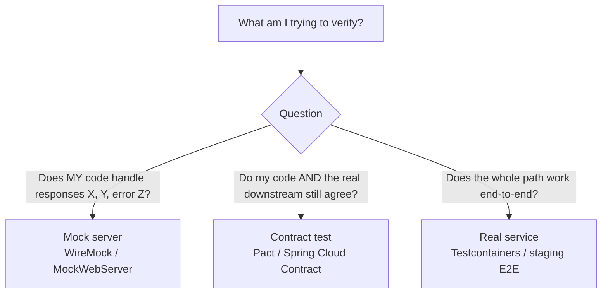
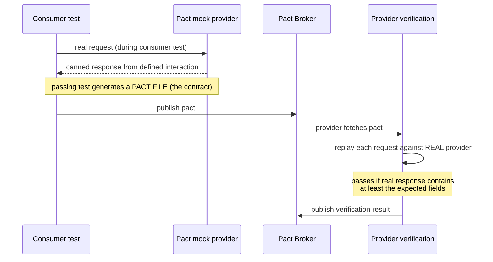
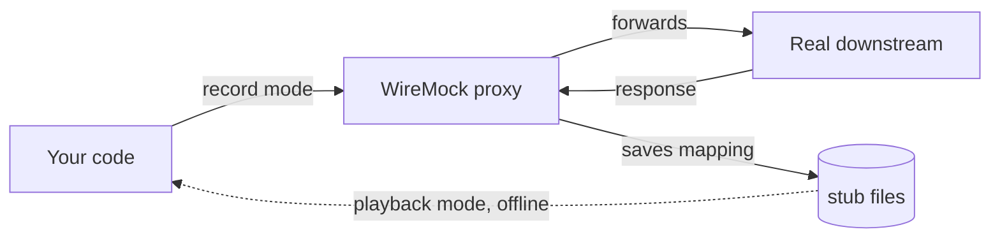

# API & HTTP Service Testing with Mock Servers

Modern backends are mostly **integration points**: your service calls other HTTP APIs
(payment gateways, auth, inventory) and exposes its own. Testing these boundaries well is
the difference between "green build, broken in prod" and confident releases. This topic is
about the **test techniques** for HTTP: how to fake the *servers your code calls*
(WireMock, OkHttp MockWebServer), how to exercise *the API your code exposes* (REST
Assured), and how to guard the *contract* between the two (Pact / consumer-driven
contracts), plus fault injection, retries/circuit-breaker testing, record-and-playback,
and golden-file assertions.

> [!KEY-TAKEAWAY]
> There are three fundamentally different things you can test against, and interviewers
> want you to name the trade-off: a **mock server** (fast, deterministic, but can drift
> from reality), the **real service** (accurate, but slow/flaky/shared), or a **contract**
> (cheap like a mock *and* kept honest by verifying the real provider). Good test suites
> use all three at different layers of the pyramid.

This guide uses the JVM ecosystem (JUnit 5, WireMock, OkHttp MockWebServer, REST Assured,
Pact, Testcontainers) for concrete examples, but the principles are language-agnostic.
For **Spring-specific** slices (`@WebMvcTest` + `MockMvc`, `@SpringBootTest` +
`WebTestClient`) see `spring-boot/testing-spring-boot-applications` — this topic only
points at them. For the general test-double vocabulary (stub/mock/fake) see
`test-doubles-and-mocking-taxonomy`.

---

## Testing HTTP boundaries: what a mock server is and why it matters

An HTTP interaction has two sides. Your service is an **HTTP client** when it calls a
downstream API, and an **HTTP server** when it answers requests. Both sides need tests,
and the hard part is the *other end* of the wire — the downstream you don't control, or
the real network you don't want in a unit test.

A **mock server** (a.k.a. stub server / API simulator) is a real HTTP server you run
in-process or in a container during the test. It listens on a real port, your code makes
**real HTTP calls** through its **real HTTP client** (connection pool, serialization,
timeouts, interceptors), and the mock returns **canned responses** you programmed. This is
different from mocking the client *object* with Mockito:

| Approach | What runs | Catches | Misses |
|---|---|---|---|
| Mock the client class (Mockito) | No HTTP, no serialization | Your logic given a response | Serialization bugs, URL/header/timeout config, retry wiring |
| **Mock server** (WireMock) | Real socket, real client, real JSON | Everything above + wire format | Whether the *real downstream* actually behaves this way |
| Real downstream | Everything | Reality | Speed, determinism, isolation — flaky and slow |

> [!TIP]
> If a bug lives in your `RestTemplate`/`WebClient`/`HttpClient` configuration —
> a wrong base URL, a missing header, a timeout that's too long, a broken retry — a
> Mockito mock of the client **cannot** catch it. A mock server can, because the request
> travels through the real client stack.

**Why it matters in interviews:** the classic failure is a service that "passed all unit
tests" but broke because the downstream returned `application/hal+json` not
`application/json`, or a 429 the code never handled. Mock servers let you reproduce those
wire-level realities deterministically.

---

## Choosing between a mock server, the real service, and a contract

These three strategies sit at different layers of the test pyramid, and each answers a
different question.



| | Mock server | Contract test | Real service (E2E) |
|---|---|---|---|
| Speed | ms | ms | seconds–minutes |
| Determinism | high | high | low (shared, networked) |
| Catches downstream drift | **no** | **yes** (provider side verifies) | yes |
| Where in pyramid | many (integration layer) | some | few |
| Main risk | mock drifts from reality → false confidence | requires both sides to run Pact | flaky, slow, hard to set up error cases |

The **central danger of mock servers** is **stub drift**: you hand-write a stub for how you
*think* the downstream behaves, the downstream changes, your stub doesn't, and your tests
stay green while production breaks. Contract testing exists precisely to solve this — the
contract used to stub the consumer is *the same artifact* verified against the real
provider, so drift becomes a failing build.

> [!INTERVIEW]
> "How do you test a service that calls three downstreams?" A strong answer layers it:
> mock those downstreams with WireMock for your service's own integration tests (fast,
> covers error paths); add **consumer-driven contract tests** so you find out when a
> downstream breaks the contract; keep a *small* number of real end-to-end tests in a
> staging pipeline for the happy path. Don't try to cover error injection at the E2E layer.

---

## WireMock: stubbing responses and matching requests

**WireMock** is the JVM's de-facto standalone mock HTTP server. It runs as a JUnit 5
extension (`@WireMockTest`), a `WireMockServer` you start manually, a standalone JAR, or a
Docker/Testcontainers image. You **stub**: "when a request matches *this*, return *that*."

```java
@WireMockTest  // starts server on a random port, injects the info
class PaymentClientTest {

  @Test
  void chargesCard(WireMockRuntimeInfo wm) {
    stubFor(post(urlPathEqualTo("/charges"))
        .withHeader("Content-Type", equalTo("application/json"))
        .withRequestBody(matchingJsonPath("$.amount", equalTo("1000")))
        .willReturn(okJson("{\"id\":\"ch_1\",\"status\":\"paid\"}")
            .withStatus(201)));

    PaymentClient client = new PaymentClient(wm.getHttpBaseUrl());
    Charge c = client.charge(1000);

    assertThat(c.status()).isEqualTo("paid");
  }
}
```

**Request matching** is the heart of WireMock. You can match on:

- **URL**: `urlEqualTo("/a?b=c")` (path+query, exact), `urlMatching(regex)`,
  `urlPathEqualTo("/a")` (path only — order-invariant query), `urlPathMatching(regex)`,
  and path templates `urlPathTemplate("/contacts/{id}")`.
- **Method**: `get`, `post`, `any(...)`, etc.
- **Headers / query params / cookies**: operators `equalTo`, `equalToIgnoreCase`,
  `containing`, `matching` (regex), `absent`, `notMatching`, and combinators
  `.and(...)` / `.or(...)` / `not(...)`.
- **Body**: `equalToJson(json, ignoreArrayOrder, ignoreExtraElements)` (semantic JSON
  compare — beats string equality because key order/whitespace don't matter),
  `matchingJsonPath("$.items[0].sku")`, `equalToXml`, `matchingXPath`,
  `matchingJsonSchema`.

> [!WARNING]
> Prefer `urlPathEqualTo` + explicit `.withQueryParam(...)` over `urlEqualTo("/x?a=1&b=2")`.
> The latter is **order-sensitive** on the query string, so a client that sends `?b=2&a=1`
> makes the stub miss and you get a confusing 404 from WireMock's "no match" handler.

**Stub priority:** when several stubs could match a request, WireMock picks the one with
the lowest `atPriority(n)` value (1 is highest priority); ties fall back to
most-recently-registered. This lets you register a broad "catch-all" default and override
specific cases.

**Good stub vs bad stub:** a *bad* stub matches only the URL and returns a body — it passes
even if your code sends the wrong method, forgets the auth header, or malforms the body.
A *good* stub also asserts the request shape via matchers, so the test fails when your
client is wrong.

---

## Verifying requests your code sent

Stubbing controls the *response*; **verification** asserts the *request(s)* your code
actually made — method, URL, headers, body, and count. This is how you test that, e.g.,
your code sent the idempotency key or retried exactly twice.

```java
verify(exactly(1), postRequestedFor(urlPathEqualTo("/charges"))
    .withHeader("Idempotency-Key", matching("[0-9a-f-]{36}"))
    .withRequestBody(matchingJsonPath("$.currency", equalTo("USD"))));

verify(0, deleteRequestedFor(urlMatching("/charges/.*"))); // never deleted
```

WireMock records every incoming request; `verify(...)` queries that journal with the same
matchers used for stubbing. `exactly(n)`, `moreThan(n)`, `lessThanOrExactly(n)`, and
`0`/never are all available.

> [!TIP]
> Verification vs stubbing maps onto the general **stub vs mock** distinction (see
> `test-doubles-and-mocking-taxonomy`): a *stub* provides canned answers (state
> verification of your code's output); a *mock* asserts that specific interactions
> happened (behaviour verification). WireMock does both. Over-verifying the exact request
> body on every field makes tests brittle — verify what *matters* (the idempotency key,
> the currency), not every field.

---

## OkHttp MockWebServer and WireMock compared

**OkHttp MockWebServer** is a lightweight scriptable HTTP server from the OkHttp project.
Its model is a **FIFO queue**: you `enqueue` responses and they are returned in the order
enqueued, regardless of which request arrives. (The current artifact is
`com.squareup.okhttp3:mockwebserver3`.)

```java
MockWebServer server = new MockWebServer();
server.enqueue(new MockResponse.Builder()
    .code(200).body("{\"ok\":true}")
    .addHeader("Content-Type", "application/json").build());
server.start();

String base = server.url("/").toString();
// ... call your client against `base` ...

RecordedRequest req = server.takeRequest();      // inspect what was sent
assertThat(req.getMethod()).isEqualTo("GET");
assertThat(req.getPath()).isEqualTo("/v1/items");
server.close();  // instances are single-use, cannot be reused
```

For **request-dependent** responses (not just FIFO order) you override a `Dispatcher` and
route by path.

| | WireMock | MockWebServer |
|---|---|---|
| Response selection | **request matching** (URL/header/body patterns) | **FIFO queue** (or custom `Dispatcher`) |
| Request assertions | `verify(...)` matcher DSL | `takeRequest()` → `RecordedRequest` |
| Rich matching / JSON path | rich, built-in | manual (custom dispatcher) |
| Fault injection | extensive `Fault` enum + delays | `throttleBody`, socket policies |
| Weight / setup | heavier, feature-rich | tiny, great for a single client's unit tests |
| Best for | complex APIs, standalone server, contract-ish stubs | quick, focused HTTP-client unit tests |

**Rule of thumb:** MockWebServer for a couple of focused tests of one client; WireMock when
you need request matching, many scenarios, fault injection, or a shared/standalone stub
server.

---

## Simulating faults: errors, timeouts, latency, and rate limits

The whole point of a mock server over a real one is that you can *make it misbehave on
demand*. Real downstreams rarely return a 503 or a truncated body when you want them to.

**Error status codes** are trivial — return `.withStatus(429)` / `503` and assert your
error handling. **Rate limits**: return `429` with a `Retry-After` header and verify your
client backs off.

**Latency / timeouts** in WireMock:

- `withFixedDelay(2000)` — wait 2s before responding (test that your read timeout fires).
- `withUniformRandomDelay(15, 25)` / `withLogNormalRandomDelay(median, sigma)` — sampled
  delays to simulate a realistic long tail.
- `withChunkedDribbleDelay(numberOfChunks, totalDuration)` — drip the body slowly across
  chunks (simulates a slow/stalled network stream).

**Connection-level faults** via `withFault(Fault.X)`:

| `Fault` value | Behaviour |
|---|---|
| `EMPTY_RESPONSE` | connection accepted, completely empty response |
| `MALFORMED_RESPONSE_CHUNK` | sends OK status, then garbage, then closes |
| `RANDOM_DATA_THEN_CLOSE` | sends garbage then closes the connection |
| `CONNECTION_RESET_BY_PEER` | resets the socket (SO_LINGER=0) → "connection reset" |

MockWebServer's equivalents are `throttleBody(bytes, period, unit)` for slow streaming and
socket policies (e.g. no-response / disconnect) for connection faults.

```java
stubFor(get("/inventory").willReturn(aResponse().withFixedDelay(3000)));
// assert client throws a read-timeout / falls back within its SLA
```

> [!WARNING]
> A timeout test must fire the timeout *faster than the delay*. Set the client's read
> timeout to e.g. 500ms and the stub delay to 3000ms. And test **both** connect and read
> timeouts — they're configured separately and a common prod incident is having a read
> timeout set but no connect timeout (or vice-versa).

---

## Testing retries, backoff, and circuit breakers

Resilience logic (Resilience4j, Spring Retry, client-native retries) is notoriously
undertested because it only triggers on failure — exactly what a real service won't do on
demand. Mock servers make it deterministic using **stateful stubs** or ordered responses.

**WireMock scenarios** model a state machine so successive identical requests get different
responses — perfect for "fail twice then succeed":

```java
stubFor(get("/data").inScenario("retry")
    .whenScenarioStateIs(STARTED)
    .willReturn(serviceUnavailable())
    .willSetStateTo("one-failure"));

stubFor(get("/data").inScenario("retry")
    .whenScenarioStateIs("one-failure")
    .willReturn(serviceUnavailable())
    .willSetStateTo("two-failures"));

stubFor(get("/data").inScenario("retry")
    .whenScenarioStateIs("two-failures")
    .willReturn(okJson("{\"ok\":true}")));

Result r = client.fetch();                 // should succeed after 2 retries
verify(exactly(3), getRequestedFor(urlEqualTo("/data")));  // proves retry count
```

To test a **circuit breaker**: stub a persistent failure, drive enough calls to trip the
breaker to OPEN, then assert that subsequent calls **fail fast without hitting the server**
— verified by `verify(...)` showing the request count stopped rising. Advance a fake clock
(inject `Clock`) to test the HALF_OPEN transition rather than sleeping real time.

> [!WARNING]
> Beware testing retries with real `Thread.sleep`-based backoff — it makes tests slow and
> flaky. Inject the scheduler/clock so backoff is virtual. And watch for **double
> retrying**: if both your HTTP client *and* a Resilience4j `@Retry` retry, three logical
> attempts can become nine wire calls. A `verify(exactly(n), ...)` catches that.

---

## REST Assured: testing the API your service exposes

Where WireMock fakes downstreams, **REST Assured** is a fluent Java DSL for testing *your
own* REST endpoints (or any live API) end-to-end over HTTP. It reads as
**given / when / then** (a BDD-style arrange/act/assert) and has first-class JSON/XML path
assertions.

```java
given()
    .baseUri("http://localhost:" + port)
    .contentType(ContentType.JSON)
    .body("{\"name\":\"Ada\"}")
.when()
    .post("/users")
.then()
    .statusCode(201)
    .header("Location", matchesPattern(".*/users/\\d+"))
    .body("name", equalTo("Ada"))
    .body("id", notNullValue())
    .body("roles.size()", greaterThan(0));
```

- **`given()`** sets up the request (headers, query/path params, body, auth).
- **`when()`** fires the HTTP method against a path.
- **`then()`** asserts status, headers, and body using **GPath / JsonPath** expressions
  (`"roles[0].name"`, `"items.find { it.sku == 'X' }.qty"`) with Hamcrest matchers.

You can extract values (`.extract().path("id")`) to chain calls, and validate the response
against a **JSON schema** with `matchesJsonSchemaInClasspath("user-schema.json")`.

> [!TIP]
> REST Assured tests a *running* server, so pair it with `@SpringBootTest(webEnvironment =
> RANDOM_PORT)` (or Testcontainers) to boot the real app. That makes it a broad integration
> test — accurate but slower than a `MockMvc` slice. Use it for the critical API contracts,
> not for every branch.

---

## MockMvc and WebTestClient (pointer to the Spring domain)

Spring provides its own in-process HTTP-testing tools that **don't open a real socket**:

- **`MockMvc`** — drives the Spring MVC dispatcher directly (no server, no real network),
  great for controller slices via `@WebMvcTest`.
- **`WebTestClient`** — the reactive/WebFlux client, works bound to a controller,
  application context, or a real running server.

These are **Spring-framework-specific** and are covered in depth in
`spring-boot/testing-spring-boot-applications` and `spring-core/testing-spring-applications`.
The key distinction for *this* topic: `MockMvc` tests your **server side** without a socket
(fast, but doesn't exercise the real HTTP client/serialization stack), whereas REST Assured
and full `@SpringBootTest(RANDOM_PORT)` go over a real port. Choose based on whether the bug
you fear lives in your handler logic (MockMvc) or in the wire/HTTP layer (real port).

---

## Consumer-driven contract testing (Pact, Spring Cloud Contract)

A **contract test** verifies that a consumer and provider agree on the shape of their
interactions — without running both together. **Consumer-Driven Contracts (CDC)** invert
who writes the contract: the **consumer** declares exactly what it needs, and the
**provider** proves it still satisfies that.

**Pact** workflow:



1. **Consumer side:** you write a test using Pact's DSL and a **mock provider**. Pact
   records the expected request/response as **interactions** and, when the test passes,
   emits a **pact file** (JSON contract). This mock provider replaces WireMock for
   contract purposes — but its stub is *the contract itself*.
2. **Provider side:** the provider's build fetches the pact and **replays each request
   against the real provider**, asserting the actual response **contains at least** the
   fields the consumer expects (Postel's law — providers may add fields; they mustn't
   remove ones the consumer uses). **Provider states** (`given("user 123 exists")`) set up
   the data each interaction needs; interactions are independent.
3. **Pact Broker** stores contracts and verification results; **`can-i-deploy`** gates
   deployment on whether a given consumer/provider version pair is verified compatible.

This is what kills **stub drift**: the artifact used to stub the consumer is the same one
verified against the real provider, so a breaking provider change fails a build.

| | WireMock stub | Pact contract |
|---|---|---|
| Who writes it | consumer team, by hand | generated from consumer's real expectations |
| Kept honest vs real provider | **no** | **yes** (provider verification) |
| Good for | error/latency injection, arbitrary scenarios | preventing breaking API changes between teams |

**Spring Cloud Contract** is the Spring-native alternative: the **provider** writes
contracts (Groovy/YAML DSL), which generate both provider verification tests *and* a
**stub JAR** the consumer uses (via WireMock under the hood) — a producer-driven flavour.

> [!INTERVIEW]
> "WireMock vs Pact — when each?" WireMock is a *mock server* you control to test your own
> code against arbitrary responses (including failures). Pact is a *contract* that keeps two
> independently deployed services honest. They're complementary: Pact for cross-team API
> compatibility, WireMock for your service's resilience/error-path tests. Contract tests do
> **not** replace functional tests — they check message shape, not behaviour.

---

## Record-and-playback (proxy recording)

Rather than hand-writing every stub, most mock servers can **record** real traffic and
**play it back**. WireMock runs in **proxy/record mode**: point it at the real downstream,
run your interactions, and it captures request/response pairs into stub mappings you can
later replay offline.



**Trade-offs:** recording is fast to bootstrap a realistic fixture set and captures wire
details you'd miss by hand. But recorded stubs are the **most prone to drift** (they're a
snapshot of one moment), can be over-specific (they match the exact recorded request,
including volatile headers/timestamps), and may capture **secrets/PII** that must be
scrubbed. Treat recordings as a starting point to be trimmed and generalized, not a
permanent oracle — and re-record periodically, or better, back them with a contract test.

> [!WARNING]
> Recorded fixtures give a *false* sense of safety against downstream changes: they're
> frozen at record time and will happily keep passing after the real API changes. That's
> the same drift problem as any hand-written stub — recording doesn't fix it.

---

## Snapshot / golden-file testing of payloads

**Snapshot (golden-file / approval) testing** asserts that a produced payload matches a
stored reference file. The first run **writes** the golden file (a human reviews and
commits it); later runs **compare** the current output against it and fail on any
difference. It's ideal for large, structured outputs (a serialized JSON response, an
event payload) where writing field-by-field assertions is tedious.

```java
String actual = objectMapper.writeValueAsString(order);
// Approval-style: compares against order.approved.json, writes order.received.json on diff
Approvals.verify(actual);
```

**For JSON specifically**, compare **semantically**, not as raw strings — use JSONAssert
(`assertEquals(expectedJson, actualJson, JSONCompareMode.STRICT)` or `LENIENT`) or a
normalized/pretty-printed form so key order and whitespace don't cause spurious failures.

| Strength | Weakness / gotcha |
|---|---|
| Catches *any* unintended change to a payload cheaply | Approving a wrong golden file bakes in the bug ("just hit approve") |
| Great for wide, structured outputs | Non-determinism (timestamps, UUIDs, ordering) → flaky; must be masked/normalized |
| Diffs read well in review | Doesn't express *intent* — a reviewer must understand why the change is right |

> [!WARNING]
> Snapshot tests are only as good as the review of the golden file. The classic anti-pattern
> is a developer who sees a red snapshot test, blindly re-approves the new output, and
> silently commits a regression. Normalize volatile fields (freeze the `Clock`, stub the ID
> generator) and review golden-file diffs as carefully as code.

---

## Common follow-up questions

- "Why not just mock the HTTP client with Mockito instead of running WireMock?" —
  Mocking the client object skips serialization, URL/header construction, timeout config,
  and interceptors/retry wiring. A mock server exercises the real client stack over a real
  socket, catching wire-level bugs a Mockito mock can't.
- "How do you test that your code retries and then trips a circuit breaker?" — Use a
  WireMock **scenario** (stateful stub) to fail N times then succeed; `verify(exactly(N))`
  the request count to prove retry behaviour; for the breaker, drive persistent failures and
  verify calls stop hitting the server once it's OPEN; inject a `Clock` for HALF_OPEN.
- "Mock server vs contract test — what does a contract catch that a mock doesn't?" —
  Downstream drift. A hand-written/recorded stub stays green when the real provider changes;
  a contract is verified against the real provider, so a breaking change fails a build.
- "How do you simulate a downstream timeout / connection reset?" — WireMock
  `withFixedDelay` (with the client's read timeout set lower) for timeouts;
  `withFault(Fault.CONNECTION_RESET_BY_PEER)` / `EMPTY_RESPONSE` for connection faults.
- "MockWebServer vs WireMock?" — MockWebServer is a tiny FIFO-queue server, ideal for a
  focused client unit test; WireMock does rich request matching, verification, fault
  injection, recording, and standalone/container deployment.
- "When is REST Assured the wrong tool?" — When you only want to test controller logic
  in isolation and speed matters — a `MockMvc`/`@WebMvcTest` slice avoids booting a server.
  REST Assured shines for full-stack API contract tests over a real port.
- "How do you keep snapshot tests from becoming rubber-stamps?" — Mask non-deterministic
  fields, compare JSON semantically (JSONAssert), and review golden-file changes as code.
- "Where do these tests sit in the pyramid?" — Mock-server and contract tests are the
  integration layer (many); real end-to-end tests are few (happy path only).

## References

- WireMock docs — Request Matching, Stubbing, Verifying, Simulating Faults, Record & Playback:
  <https://wiremock.org/docs/>
- OkHttp MockWebServer: <https://github.com/square/okhttp/tree/master/mockwebserver>
- REST Assured docs & usage guide: <https://rest-assured.io/> ,
  <https://github.com/rest-assured/rest-assured/wiki/Usage>
- Pact — "How Pact works", provider states, Pact Broker, can-i-deploy:
  <https://docs.pact.io/>
- Spring Cloud Contract reference: <https://docs.spring.io/spring-cloud-contract/reference/>
- Martin Fowler — "Consumer-Driven Contracts", "Mocks Aren't Stubs", Test Pyramid:
  <https://martinfowler.com/articles/consumerDrivenContracts.html> ,
  <https://martinfowler.com/articles/mocksArentStubs.html>
- JSONAssert: <https://github.com/skyscreamer/JSONassert> ; ApprovalTests (approval/golden):
  <https://github.com/approvals/ApprovalTests.Java>
- Testcontainers (running WireMock or real dependencies as containers):
  <https://testcontainers.com/modules/wiremock/>
</content>
</invoke>
