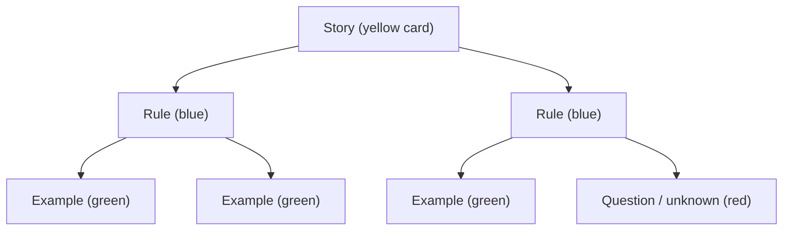
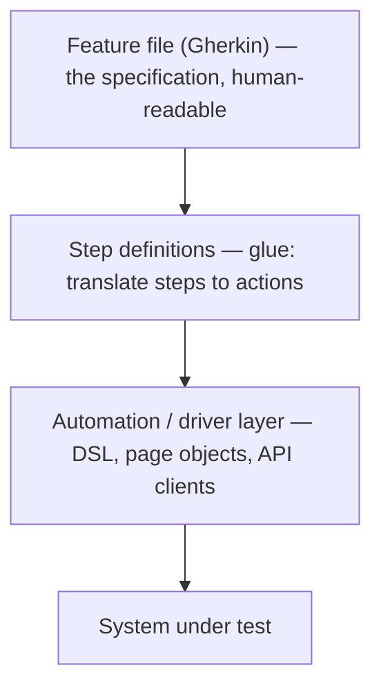
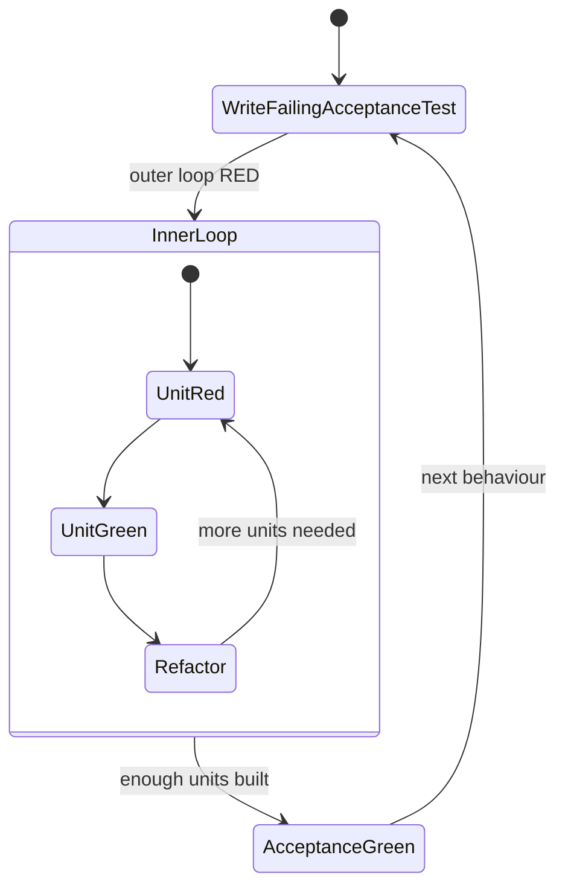

# BDD & Specification by Example

Behaviour-Driven Development (BDD) is a collaborative practice — originated by Dan
North around 2006 — that grew out of Test-Driven Development (TDD). Its core insight
is that most software defects trace back not to bad code but to **misunderstood
requirements**: developers building the wrong thing correctly. BDD attacks that by
using concrete, shared examples of behaviour, written in a business-readable
Given-When-Then form, to align product, developers, and testers *before* code is
written — and then keeping those examples alive as automated tests and documentation.

**Specification by Example (SbE)** — the term Gojko Adzic popularised (2011) for
essentially the same discipline — emphasises the same thing from the requirements
side: illustrate requirements with realistic concrete examples, refine them
collaboratively, and automate them so they double as living documentation. BDD and
SbE are largely two names/lineages for the same set of practices; interviewers use
them interchangeably but may probe the distinction.

> [!KEY-TAKEAWAY]
> The point of BDD is **collaboration and shared understanding**, not the Cucumber
> tool. Teams that adopt Gherkin/Cucumber purely to automate tests — with no
> three-amigos conversation — get the cost of BDD (extra layer of indirection) with
> none of the benefit. "The tooling is the least important part."

This topic owns the general BDD discipline. Spring-specific test slices
(`@WebMvcTest`, `@SpringBootTest`) live in the `spring-boot`/`spring-core` domains;
contract testing (Pact/CDC) has its own topic; TDD's red-green-refactor mechanics are
covered in `tdd-red-green-refactor`.

---

## BDD as an evolution of TDD

Dan North created BDD after teaching TDD and noticing that the word "test" confused
people: developers didn't know *what* to test, *where* to start, or *how much* to
test in one go, and the word "test" made stakeholders tune out. His reframing:

- Replace **"test"** with **"behaviour"** and **"should"**. A method named
  `shouldTransferFundsWhenBalanceSufficient` reads as a *specification of behaviour*,
  not a test of code. This tells you what to write next (the next behaviour) and
  doubles as documentation when it fails.
- Describe behaviour in a structured sentence: *Given* a context, *When* an event
  occurs, *Then* an outcome is expected. This became **Given-When-Then**, the ubiquitous
  BDD template — a plain-language rendering of TDD's Arrange-Act-Assert.
- Push the conversation **up** to requirements: use the same Given-When-Then form to
  capture *acceptance criteria* with the business, so the examples that drive
  development come from a shared conversation rather than a developer's guess.

So BDD is TDD with two shifts: **vocabulary** (behaviour/should instead of test) and
**audience** (business-readable examples produced collaboratively, not just
developer-written unit tests). TDD asks "does this code do what I intended?"; BDD asks
"are we building the right behaviour, and do we all agree what it is?"

| | TDD (classic) | BDD |
|---|---|---|
| Unit of thought | A test of a class/method | A behaviour/example of the system |
| Language | Code + assertion | Given-When-Then, ubiquitous language |
| Primary author | Developer | Whole team (three amigos) |
| Main artifact | Unit test suite | Executable specs + living docs |
| Failure message | "assertEquals failed" | "shouldRejectWithdrawalWhenOverdrawn failed" |

> [!INTERVIEW]
> A common trap question: "Is BDD just TDD with different syntax?" The nuanced answer:
> mechanically the red-green-refactor loop is the same, but BDD adds the collaborative
> requirements-discovery layer (three amigos, example mapping) and a shift from
> testing implementation to specifying behaviour in shared language. Saying "it's just
> Cucumber" is the wrong answer.

---

## Ubiquitous language and living documentation

**Ubiquitous language** (a term from Eric Evans' Domain-Driven Design) is a single
vocabulary — for domain concepts, actors, and actions — shared by business and
engineering and used *everywhere*: conversations, feature files, code, and tests. BDD
operationalises it: the words in the Gherkin scenarios should be the same words the
business uses ("account is *overdrawn*", not "balance field is negative"). This kills
a whole class of translation bugs where a "customer" means one thing to the analyst
and another to the developer.

**Living documentation** is the payoff of executable specifications: because the
Gherkin scenarios are run against the real system on every build, they cannot silently
drift out of date. If a scenario no longer describes the system's behaviour, its test
fails and someone fixes either the code or the spec. Contrast with a Word/Confluence
requirements doc, which rots the moment it's written because nothing forces it to stay
true.

- **Beginner:** living documentation = human-readable specs that are also automated
  tests, so the docs are always accurate.
- **Intermediate:** tools like Cucumber Reports, Serenity BDD, or Pickles generate
  browsable HTML from the feature files + run results, so non-technical stakeholders
  can read *what the system does* (passing scenarios) without reading code.
- **Advanced / gotcha:** living documentation only stays trustworthy if scenarios are
  written at the **domain/behaviour level**, not the UI-mechanics level. A scenario
  full of "click button #save-btn" is neither readable nor durable — it breaks on cosmetic
  UI changes and reads like a script, defeating the documentation goal.

---

## Given-When-Then and Gherkin

**Given-When-Then (GWT)** is the canonical structure for a behaviour example:

- **Given** — the context / preconditions; put the system into a known state. Should
  describe state, not actions.
- **When** — the single event or action under test (ideally exactly one).
- **Then** — the expected, *observable* outcome. Assertions about state or output the
  actor can see, not internal implementation.
- **And / But** — continue the previous keyword for readability (multiple Givens,
  multiple Thens). `*` can substitute for any step keyword for list-like steps.

**Gherkin** is the structured, mostly-natural-language syntax that encodes GWT so it's
both human-readable and machine-parseable. Its keywords:

| Keyword | Purpose |
|---|---|
| `Feature` | Names and describes the feature (one per file) |
| `Rule` | (Gherkin 6+) groups scenarios illustrating one business rule |
| `Scenario` / `Example` | A single concrete example (synonyms) |
| `Given` / `When` / `Then` / `And` / `But` / `*` | Steps |
| `Background` | `Given` steps run before *every* scenario in the file/rule |
| `Scenario Outline` / `Scenario Template` | Parameterised scenario template (synonyms) |
| `Examples` / `Scenarios` | Table of value rows feeding a Scenario Outline (synonyms) |
| `"""` | Doc String (multi-line text argument) |
| `\|` | Data Table |
| `@` | Tag |
| `#` | Comment |

```gherkin
Feature: Fund transfer between accounts

  Background:
    Given a customer "Alice" with a checking account

  Scenario: Successful transfer within balance
    Given her checking account has a balance of 500.00 USD
    When she transfers 200.00 USD to her savings account
    Then her checking balance should be 300.00 USD
    And her savings balance should increase by 200.00 USD

  Scenario: Transfer rejected when funds insufficient
    Given her checking account has a balance of 100.00 USD
    When she attempts to transfer 200.00 USD to her savings account
    Then the transfer should be rejected
    And her checking balance should remain 100.00 USD
```

> [!WARNING]
> A frequent smell is **imperative, UI-driven** scenarios ("When I enter '200' in field
> #amt and click #submit"). Prefer **declarative, domain-level** steps ("When she
> transfers 200.00 USD"). Declarative scenarios survive UI refactors, read as
> documentation, and are reusable. Also: keep **one `When`** per scenario — multiple
> When/Then pairs usually mean two scenarios crammed into one.

Best practices interviewers reward: write in third person / passive domain language,
one behaviour per scenario, avoid conjunctions hiding two actions in one step, and
never leak technical detail (SQL, JSON payloads) into `Then` unless the actor really
observes it.

---

## Feature files and step definitions (Cucumber)

Cucumber (Cucumber-JVM on the JVM) is the reference BDD tool. Two artifacts:

1. **Feature files** (`.feature`) — the Gherkin scenarios, business-readable, checked
   in beside the code. These are the "what."
2. **Step definitions** — Java/Kotlin methods annotated so Cucumber can match a Gherkin
   step to executable code (the "how"). They form the **glue** that binds plain-text
   steps to the system under test.

```java
// io.cucumber.java.en.*  — Cucumber Expressions ({int}, {string}, {word}, ...)
public class TransferSteps {

    private final Bank bank = new Bank();
    private TransferResult result;

    @Given("her checking account has a balance of {double} USD")
    public void checkingBalanceIs(double amount) {
        bank.setBalance("checking", Money.usd(amount));
    }

    @When("she transfers {double} USD to her savings account")
    public void sheTransfers(double amount) {
        result = bank.transfer("checking", "savings", Money.usd(amount));
    }

    @Then("the transfer should be rejected")
    public void transferRejected() {
        assertThat(result.isRejected()).isTrue();   // AssertJ
    }
}
```

Key mechanics an interviewer probes:

- **Cucumber Expressions vs regex.** Modern Cucumber-JVM prefers *Cucumber Expressions*
  (`{int}`, `{string}`, `{double}`, custom parameter types) for readability; raw regex
  (`^she transfers (\d+) USD$`) is still supported. The step keyword (`Given`/`When`/
  `Then`) is *not* part of matching — Cucumber matches on the text only, so a `@Given`
  method can match a `When` step. Keywords are for humans.
- **Data tables & doc strings** are passed as the **last** parameter (`DataTable`, or a
  `List<Map<String,String>>` etc.; a doc string arrives as a `String`).
- **Hooks:** `@Before`/`@After` (per scenario), `@BeforeStep`/`@AfterStep`,
  `@BeforeAll`/`@AfterAll`, and conditional hooks via tag expressions
  (`@After("@db and not @readonly")`). Hooks are invisible to feature-file readers, so
  prefer `Background` for setup people should see.
- **Running on JUnit 5:** use `cucumber-junit-platform-engine`. Point the platform at a
  suite, e.g. a class annotated with `@Suite @IncludeEngines("cucumber")` plus
  `@SelectClasspathResource("features")` and `cucumber.glue` in
  `junit-platform.properties`. (JUnit 4 used the older
  `@RunWith(Cucumber.class)` + `@CucumberOptions` runner — a common "which is current?"
  question.)
- **Glue** = the package(s) where step defs and hooks live; configured via
  `cucumber.glue` / `--glue`.

> [!WARNING]
> Step-definition **state sharing** between steps is a classic gotcha. Steps in one
> scenario need to share objects (the `result` above). Cucumber creates a fresh
> step-definition instance per scenario, so instance fields are safe per-scenario; to
> share across *multiple* step-def classes use **dependency injection** (PicoContainer,
> Spring — `cucumber-spring`). Using `static` fields to share state causes flaky,
> order-dependent tests because state leaks across scenarios.

---

## Specification by Example and example mapping

**Specification by Example (SbE)**, per Gojko Adzic's *Specification by Example* (2011),
is a set of process patterns: derive scope from goals, **specify collaboratively**,
**illustrate using examples**, refine the specification, automate without changing the
specification, validate frequently, and evolve a living documentation. The concrete
examples *are* the specification — you don't write abstract "the system shall…" prose,
you write realistic cases with real data, including edge and negative cases.

**Example Mapping** (Matt Wynne, 2015) is the most-used *technique* for the
collaborative conversation. In a ~25-minute session the team uses four colours of
index cards:



- **Yellow** = the user story under discussion.
- **Blue** = the business rules / acceptance criteria.
- **Green** = concrete examples illustrating each rule.
- **Red** = open questions / unknowns nobody in the room can answer.

Outcomes: if a story sprouts many rules it's too big (split it); if it has lots of red
cards it isn't ready (needs analysis); a story with clear rules and examples and no reds
is ready to build. The green examples map directly onto Gherkin scenarios, and blue
rules onto `Rule:` blocks or feature groupings. Example mapping is prized because it
surfaces misunderstanding *cheaply, before coding*.

---

## The three amigos

The **three amigos** (also "specification workshop" or "discovery workshop") is the
meeting where three perspectives examine a story together, ideally before it's built:

- **Business / Product** ("What problem are we solving?") — the perspective of value and
  intended behaviour.
- **Development** ("How might we build it? What's technically hard?") — feasibility,
  edge cases the business didn't consider.
- **Testing / QA** ("What could go wrong? What about this weird case?") — the
  adversarial, "what-if" perspective that generates negative and boundary examples.

"Three" is a role count, not a headcount — the point is the three *viewpoints* meet.
The output is a shared set of concrete examples (feeding Gherkin) and a list of
questions to resolve. The value is **catching misunderstanding early**: a five-minute
disagreement in the room is vastly cheaper than shipping the wrong behaviour and finding
out in UAT or production. Example mapping is a common format for running the three-amigos
conversation.

---

## Executable specifications

An **executable specification** is a specification (the concrete examples) that is *also*
an automated test: the same artifact is read by humans as a requirement and executed by
a machine as verification. This is the mechanism that makes living documentation work.

The layering, top to bottom:



Fowler and Adzic stress the **separation of layers**: keep the *what* (Gherkin) free of
technical noise, keep the *how* in step defs and a thin automation layer. A well-kept
automation layer (a domain DSL, page objects, test API clients) means UI or wiring
changes touch one place, not hundreds of scenarios.

- **Advantage:** requirements can't rot — a false spec fails the build.
- **Cost / trade-off:** there are now *three* things to keep in sync (feature, step
  defs, code) and Gherkin adds a layer of indirection over a plain assertion. That cost
  is only worth paying when non-technical stakeholders actually read the specs. For
  pure developer-facing logic, a plain JUnit test is often clearer.

> [!TIP]
> Rule of thumb: use executable Gherkin specs for **business-facing behaviour** that a
> product owner cares to read and validate. Use ordinary JUnit/Mockito unit tests for
> **implementation detail and algorithmic edge cases**. Gherkin over a hashing utility
> is pure overhead.

---

## BDD vs TDD vs ATDD

These three are constantly confused in interviews.

| | TDD | ATDD | BDD |
|---|---|---|---|
| Full name | Test-Driven Development | Acceptance-Test-Driven Development | Behaviour-Driven Development |
| Question answered | "Am I building the code right?" | "Am I building the right thing (acceptance)?" | "Do we share understanding of the behaviour?" |
| Level | Unit / class | Acceptance / feature | Feature + unit (via outside-in) |
| Written by | Developer | Team (dev + QA + business) | Team (three amigos) |
| Language | Code | Acceptance criteria / examples | Ubiquitous language, Given-When-Then |
| Emphasis | Design & fast feedback on code | Meeting acceptance criteria | **Collaboration & communication** |

- **TDD** is a developer design discipline: write a failing unit test, make it pass,
  refactor. Scope = code correctness. No inherent business collaboration.
- **ATDD** drives development from **acceptance criteria** agreed with the customer:
  write the acceptance test first, then build until it passes. Scope = "did we satisfy
  the agreed criteria?"
- **BDD** overlaps heavily with ATDD (both are outside-in, both use examples), but its
  distinctive emphasis is the **shared language and conversation** — reducing
  ambiguity through ubiquitous language and Given-When-Then. In practice ATDD and BDD
  are often used as synonyms; the honest interview answer is "they're closely related,
  BDD stresses communication and a common vocabulary; ATDD stresses the acceptance
  criteria as the driver — and both wrap TDD's inner loop."

> [!INTERVIEW]
> If asked to rank by scope: TDD ⊂ (unit level) while ATDD/BDD operate at the
> acceptance/feature level and *contain* TDD as their inner loop (see outside-in
> development). BDD ≈ ATDD + ubiquitous language + explicit three-amigos collaboration.

---

## Outside-in development (double-loop TDD)

BDD is typically practised **outside-in**: start from the user-visible behaviour (the
outer acceptance/BDD test) and work inward to the units needed to satisfy it. This is
often drawn as **double-loop TDD**:



- **Outer loop (slow, BDD/acceptance):** a failing Given-When-Then scenario expresses
  the behaviour you want. It stays red until the feature works end-to-end.
- **Inner loop (fast, TDD unit):** to make the acceptance test pass you drive out the
  collaborating classes with ordinary red-green-refactor unit tests, often discovering
  interfaces via mocks (the "London school" / mockist style pairs naturally with
  outside-in — see `test-doubles-and-mocking-taxonomy`).

Outside-in keeps you building only what the behaviour needs (avoids speculative code)
and ensures every unit exists to serve an actual user-facing requirement. The contrast
is **inside-out** (classicist): build and test leaf components first, then compose
upward.

---

## Scenario outlines and data tables

Two Gherkin mechanisms for handling multiple data cases without duplicating scenarios.

**Scenario Outline + Examples** — a scenario *template* with `<placeholders>`, run once
per data row (the header row doesn't count). Use it when the *same behaviour* should
hold across many input/output combinations, especially boundaries:

```gherkin
Scenario Outline: Withdrawal limit enforcement
  Given an account with a balance of <balance> USD
  When the customer withdraws <amount> USD
  Then the withdrawal should be <result>

  Examples:
    | balance | amount | result   |
    | 100.00  | 50.00  | approved |
    | 100.00  | 100.00 | approved |
    | 100.00  | 100.01 | rejected |
    | 0.00    | 0.01   | rejected |
```

**Data Table** — a table attached to a *single* step, passed to the step definition as
the last argument. Use it to pass a *structured collection* into one step (e.g. seed
several rows, or assert on a list), not to repeat a whole scenario:

```gherkin
Scenario: Batch account setup
  Given the following accounts exist:
    | owner | type     | balance |
    | Alice | checking | 500.00  |
    | Bob   | savings  | 1000.00 |
  When the monthly interest run executes
  Then Bob's balance should be 1004.17 USD
```

```java
@Given("the following accounts exist:")
public void accountsExist(io.cucumber.datatable.DataTable table) {
    List<Map<String, String>> rows = table.asMaps();  // one map per row
    rows.forEach(r -> bank.open(r.get("owner"), r.get("type"),
                                new BigDecimal(r.get("balance"))));
}
```

> [!WARNING]
> The classic mix-up: **Scenario Outline `Examples`** parameterises the *entire
> scenario* (each row = one full test run); a **Data Table** is data for *one step*
> within a single run. Choosing the wrong one is a frequent interview/PR-review catch.

---

## When BDD helps vs when it adds overhead

BDD is not free — the Gherkin + step-definition + automation layering is an investment.
Senior engineers are expected to know *when it pays off*.

**BDD tends to help when:**
- Requirements are **ambiguous or high-risk** and involve **non-technical
  stakeholders** who need to read and validate behaviour.
- The domain has rich business rules with many examples/edge cases (pricing, eligibility,
  regulatory logic) — example mapping shines here.
- Multiple teams/roles must share understanding; living documentation reduces
  onboarding and tribal-knowledge risk.

**BDD tends to add overhead (net cost) when:**
- The team adopts Cucumber **only as a test runner**, skipping the three-amigos
  conversation — then it's just JUnit with a slow, brittle text-parsing layer on top.
- The logic is **purely technical / developer-facing** (algorithms, data structures,
  infrastructure) — no business reader benefits from Gherkin.
- Scenarios are written **imperatively at the UI level**, making them brittle and
  unreadable — you pay maintenance cost for negative documentation value.
- Nobody maintains the automation layer, so step defs rot and the suite becomes flaky
  and ignored.

> [!KEY-TAKEAWAY]
> The recurring anti-pattern is **"Cucumber without collaboration."** If the feature
> files are written *after* coding, by developers alone, and never read by the
> business, you have all the cost of BDD and none of its value — a plain unit/integration
> test would be cheaper and clearer.

---

## Collaboration vs automation: the real value

The single most important BDD interview message: **the primary value of BDD is the
conversation and shared understanding it forces, not the automated tests it produces.**
Automation is a *by-product* that keeps the shared understanding honest over time.

- Dan North, Liz Keogh, Gojko Adzic, and Aslak Hellesøy (Cucumber's creator) all
  repeatedly stress this. Hellesøy has said that if teams could only keep one part of
  BDD, it should be the **conversations**, not the tool.
- The examples surfaced in the three-amigos/example-mapping conversation catch
  misunderstandings *before* code is written — where they are cheapest to fix. That
  defect-prevention is where most of BDD's ROI comes from.
- The Gherkin artifact is valuable chiefly because it *captures* that shared
  understanding in a durable, executable, business-readable form (living
  documentation).

A team can get 80% of BDD's value from the conversations and example mapping *without*
ever adopting Cucumber. A team can adopt Cucumber and get *negative* value if it skips
the conversation. That asymmetry is the crux of every senior BDD question.

---

## Common follow-up questions

- "Isn't BDD just TDD with Cucumber?" No — mechanically the inner loop is TDD, but
  BDD adds collaborative requirements discovery (three amigos, example mapping),
  ubiquitous language, and a behaviour framing. Cucumber is optional; the conversation
  isn't.
- "Who should write the feature files?" The whole team, collaboratively (three
  amigos). If developers write them alone after coding, you've lost the point.
- "Why not just automate everything through Gherkin?" Because Gherkin adds an
  indirection layer only worth paying for business-facing behaviour that stakeholders
  read. Use plain JUnit/Mockito for technical/unit-level logic.
- "How do you keep a Cucumber suite from becoming slow and flaky?" Write declarative
  domain-level steps (not UI-mechanics), keep a clean automation layer (page
  objects/DSL), push most coverage to fast unit tests (test pyramid), share state via DI
  not statics, and don't drive everything through the UI.
- "Scenario Outline vs Data Table — when do you use each?" Outline parameterises a
  *whole scenario* across many rows; a data table passes a *collection to one step*.
- "What's the difference between BDD and ATDD?" They heavily overlap and are often
  used interchangeably; BDD stresses communication and ubiquitous language, ATDD stresses
  driving from agreed acceptance criteria. Both wrap TDD's inner loop and are outside-in.
- "How does BDD relate to the test pyramid?" BDD acceptance scenarios sit near the
  top (fewer, slower, high-value); they should *not* replace the broad base of fast unit
  tests. Over-using Gherkin end-to-end scenarios inverts the pyramid ("ice-cream cone").

## References

- Dan North, *Introducing BDD* (2006) — dannorth.net/introducing-bdd
- Gojko Adzic, *Specification by Example* (Manning, 2011) — specificationbyexample.com
- Matt Wynne, *Introducing Example Mapping* (2015) — cucumber.io/blog/bdd/example-mapping-introduction
- Cucumber docs — Gherkin Reference: cucumber.io/docs/gherkin/reference
- Cucumber docs — Step Definitions, Cucumber Expressions, Hooks: cucumber.io/docs/cucumber
- Cucumber JUnit Platform Engine: github.com/cucumber/cucumber-jvm/tree/main/cucumber-junit-platform-engine
- Martin Fowler — *GivenWhenThen*, *BusinessReadableDSL*, *SpecificationByExample*: martinfowler.com
- Liz Keogh — writings on BDD & discovery: lizkeogh.com
- Kent Beck, *Test-Driven Development: By Example* (2002) — the TDD baseline BDD builds on
