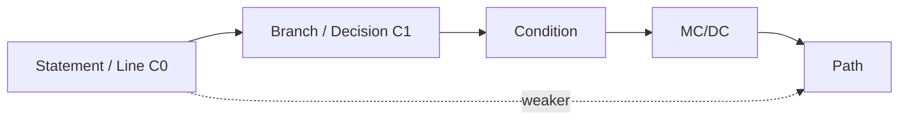
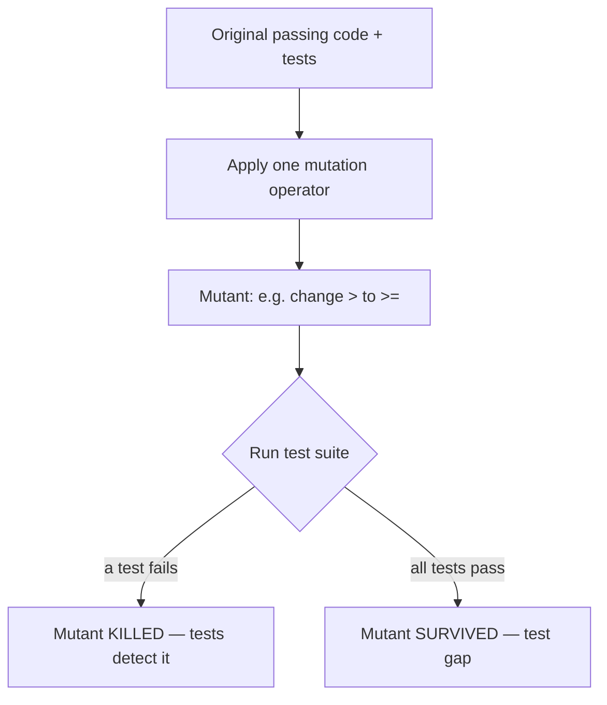
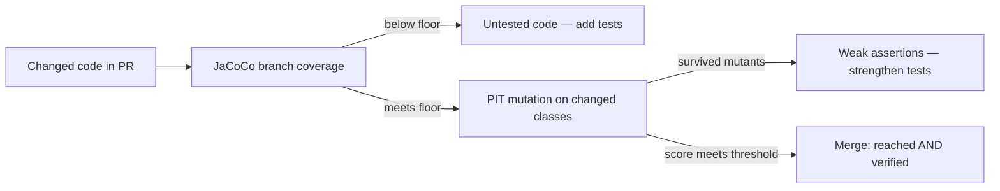

# Code Coverage & Mutation Testing

Code coverage answers "which lines/branches of production code did my tests *execute*?" Mutation
testing answers the far harder question "do my tests actually *detect bugs*?" The two are
complementary: coverage is necessary but wildly insufficient, and mutation testing is the standard
technique for measuring the *effectiveness* (fault-detection strength) of a test suite rather than
its mere reach. This topic covers the coverage metric hierarchy (line/statement, branch, condition,
MC/DC, path), how JaCoCo measures coverage on the JVM, why a high coverage number does not mean good
tests, Goodhart's law applied to coverage targets, and how mutation testing with PIT (PITest) fills
the gap — including mutants, killed vs survived, mutation score, equivalent mutants, and cost.

> [!INTERVIEW]
> The signature senior question is: *"We have 90% code coverage — are we well tested?"* The answer
> the interviewer wants: coverage measures **execution**, not **assertion quality**. A test that
> calls a method but asserts nothing still counts as covering it. Coverage is a **floor, not a
> goal**; mutation testing is what tells you whether the assertions would actually catch a bug.

Principles are stated tool-neutrally first, then shown with **JaCoCo** and **PIT** on the JVM.

---

## Why Coverage Is Necessary but Not Sufficient

**Beginner.** *Code coverage* is the percentage of production code exercised by your test suite while
the tests run. It is collected by instrumenting the code (adding probes) and recording which parts
got hit. High coverage of a region means "at least one test caused this code to run."

**The critical limitation:** coverage records **execution**, not **verification**. A test can execute
a line and assert *nothing* about the result — the line is "covered" but no behavior is checked. So
coverage tells you where you have *zero* tests (genuinely useful — uncovered code is definitely
untested) but says almost nothing about whether covered code is *correctly* tested.

```java
// This test yields 100% line + branch coverage of discount(), yet asserts NOTHING useful.
@Test
void coversEverythingAssertsNothing() {
    pricing.discount(100, true);   // executes both branches over two calls
    pricing.discount(100, false);
    // no assertion — a bug that returns the wrong number is invisible
}
```

**Intermediate.** The correct mental model:

- **Low coverage is a reliable *negative* signal** — code with 0% coverage is untested, full stop.
- **High coverage is a weak *positive* signal** — it proves the code *ran*, not that it was
  *checked*. Assertion-free tests, over-mocked tests, and tests that swallow exceptions all inflate
  coverage without adding protection.

**Advanced.** This is why the mature framing is: *coverage is a floor, not a target.* Use it to find
the untested holes; use **mutation testing** to judge whether the covered code is actually protected.
Coverage + mutation score together give real signal: coverage bounds *where* you could catch a bug,
mutation score estimates *whether you would*.

> [!KEY-TAKEAWAY]
> Coverage measures which code *executed*, not whether its behavior was *asserted*. 100% coverage
> with weak/absent assertions catches nothing. Treat coverage as a floor to find untested code, not
> as proof of test quality.

---

## Coverage Metrics: Line, Statement, Branch, Condition, MC/DC, Path

**Beginner.** There is a hierarchy of coverage criteria, from weakest (easiest to satisfy) to
strongest (hardest). Each *subsumes* the weaker ones — satisfying a stronger criterion generally
implies the weaker.

| Metric | What it requires | Also called |
|---|---|---|
| **Statement / Line** | Every statement (or source line) executed at least once | C0 |
| **Branch / Decision** | Every branch of every decision taken (each `if` true *and* false, each `switch` case) | C1, decision coverage |
| **Condition** | Every boolean *sub-condition* evaluated both true and false | — |
| **Condition/Decision (C/DC)** | Both condition coverage *and* decision coverage | — |
| **MC/DC** | Each condition independently shown to affect the decision outcome | Modified Condition/Decision Coverage |
| **Path** | Every possible path through the control-flow graph executed | — |

**Intermediate — line vs branch, the everyday distinction.** Line coverage is misleadingly generous
because a single line can contain a branch:

```java
String classify(int n) {
    return n > 0 ? "pos" : "nonpos";   // one line, TWO branches
}
```

One test with `n = 5` gives **100% line coverage** but only **50% branch coverage** — the negative
branch never ran. This is why branch coverage is the more honest default target.

**Condition vs branch.** With a compound decision like `if (a && b)`, *branch* coverage only needs the
whole expression to be true once and false once (e.g. `a=T,b=T` and `a=F`). *Condition* coverage
additionally requires each of `a` and `b` to be both true and false. Short-circuit evaluation (`&&`,
`||`) means the JVM may never evaluate `b` when `a` is false, which interacts with how tools count.

**Advanced — MC/DC and path coverage.**

- **MC/DC (Modified Condition/Decision Coverage)** is the aviation-grade criterion (DO-178C, safety-
  critical software). It requires, for each condition, a pair of test cases where flipping *only that
  condition* flips the decision outcome — proving each condition *independently* matters. For *n*
  conditions it is achievable with *n+1* well-chosen tests (vs 2ⁿ for full multiple-condition
  coverage), which is why it's the pragmatic strong criterion for safety-critical code.
- **Path coverage** requires every distinct route through the control-flow graph. It is the strongest
  structural criterion but usually **infeasible** — loops make the path count explode (potentially
  infinite), so it's largely theoretical.



> [!WARNING]
> "100% coverage" almost always means **line** coverage unless stated otherwise. Ask *which* metric.
> 100% line with 60% branch is common and hides the untested `else`/false paths that carry bugs.

---

## JaCoCo: How JVM Coverage Is Measured

**Beginner.** **JaCoCo** (Java Code Coverage) is the de-facto JVM coverage tool, integrated via the
Maven/Gradle plugins and IDEs. It reports several **counters**: Instructions, Branches, Lines,
Methods, Classes, and Cyclomatic Complexity.

**Intermediate — it works on bytecode.** JaCoCo instruments **Java bytecode**, not source. Its most
fundamental counter is **Instructions (C0)** — individual JVM bytecode instructions — which is
"completely independent from source formatting and always available, even in absence of debug
information." Because it's bytecode-based, it can measure coverage even without source.

- **Line coverage** requires the classes to be **compiled with debug information** (`-g`); a line
  counts as covered when at least one instruction mapped to it executed. Lines render as red (none),
  yellow (partial), or green (full).
- **Branch coverage (C1)** is computed for all `if` and `switch` statements. Importantly, **exception
  handling (try/catch) is *not* counted as branches** by JaCoCo.
- **Cyclomatic complexity** is derived as `v(G) = B − D + 1`. Since exceptions aren't branches,
  try/catch does not raise the reported complexity.

**Advanced — instrumentation modes and gotchas.**

- JaCoCo uses **on-the-fly instrumentation** via a Java agent by default (a class-loading hook adds
  probes), or offline instrumentation when an agent can't be attached.
- A "yellow" (partially covered) line is a strong hint of a missed branch — the source-level
  diamond markers show which side of a decision was never taken.
- Lambdas, `switch` on strings/enums (desugared into extra branches), and synthetic bridge/`assert`
  code can produce surprising partial-coverage results because you're seeing *bytecode* branches, not
  source branches.

```xml
<!-- Maven: fail the build below a branch-coverage floor -->
<plugin>
  <groupId>org.jacoco</groupId>
  <artifactId>jacoco-maven-plugin</artifactId>
  <executions>
    <execution><goals><goal>prepare-agent</goal></goals></execution>
    <execution>
      <id>check</id>
      <goals><goal>check</goal></goals>
      <configuration>
        <rules>
          <rule>
            <element>BUNDLE</element>
            <limits>
              <limit><counter>BRANCH</counter><value>COVEREDRATIO</value><minimum>0.80</minimum></limit>
            </limits>
          </rule>
        </rules>
      </configuration>
    </execution>
  </executions>
</plugin>
```

> [!TIP]
> When you set a JaCoCo gate, gate on **BRANCH** (or instruction), not just LINE. Line-only gates are
> the easiest to game and let untested `else` paths through.

---

## Why High Coverage ≠ Good Tests

**Beginner.** A high coverage number can coexist with a terrible test suite. Coverage counts
*execution*; it cannot see whether your assertions would fail when the code is wrong.

**Intermediate — the ways coverage lies:**

| Anti-pattern | Effect on coverage | Effect on bug detection |
|---|---|---|
| **Assertion-free tests** (call, no assert) | Inflates coverage | Zero — bugs pass silently |
| **Over-mocking** (mock the thing under test's logic away) | Inflates coverage | Tests verify the mock, not real behavior |
| **Testing getters/toString/generated code** | Inflates coverage cheaply | Low value; hides thin real-logic coverage |
| **Swallowed exceptions** (`try { } catch (Exception e) {}`) | Line runs | Failures hidden |
| **Loose assertions** (`assertNotNull` instead of exact value) | Same coverage | Weak — wrong-but-present values pass |

**Advanced — good vs bad test at identical coverage.**

```java
// BAD: 100% coverage of parseAmount, catches almost no bug
@Test void bad() {
    assertNotNull(parser.parseAmount("12.34"));   // passes even if it returns 0.0
}

// GOOD: same coverage, real fault detection
@Test void good() {
    assertThat(parser.parseAmount("12.34")).isEqualByComparingTo("12.34");
    assertThatThrownBy(() -> parser.parseAmount("abc"))
        .isInstanceOf(NumberFormatException.class);
}
```

Both hit the same lines and branches; only the second would catch a regression. This is precisely the
gap **mutation testing** measures — it deliberately breaks the code and checks whether *some* test
notices.

> [!KEY-TAKEAWAY]
> Coverage is an *input* metric (did code run) not an *outcome* metric (would a bug be caught). Two
> suites with identical coverage can have vastly different fault-detection power. Judge assertion
> quality, not just the coverage percentage.

---

## Goodhart's Law and Coverage Targets

**Beginner.** *Goodhart's law*: "When a measure becomes a target, it ceases to be a good measure."
Applied to coverage: the moment you mandate "everyone must hit 90% coverage," developers optimize the
*number*, not the *testing*.

**Intermediate — how coverage targets get gamed:**

- Tests that execute code with no assertions to bump the percentage.
- Testing trivial code (getters, DTOs, generated builders) because it's easy coverage.
- Excluding hard-to-cover code from the denominator until the ratio looks good.
- Deleting or `@Disabled`-ing failing tests to keep the build green rather than fixing behavior.

**Advanced — the pragmatic stance interviewers reward.** Coverage targets aren't useless, but they
must be framed correctly:

- Use coverage as a **floor / regression ratchet** ("don't let it drop"), not a hard vanity goal.
- Prefer gating on **new/changed code** ("diff coverage" / patch coverage) rather than a whole-repo
  number — this is far more actionable and less gameable.
- Recognize diminishing returns: the jump from 40%→80% finds real gaps; chasing 95%→100% often means
  testing trivia or writing brittle tests. Martin Fowler's guidance: coverage is useful for finding
  *untested* code, not as a numeric goal — a fixation on a specific percentage is counterproductive.
- The real quality gate is a *combination*: coverage floor **plus** mutation score, reviewed on the
  diff.

> [!WARNING]
> A blanket "we require 100% coverage" mandate is a red flag, not a badge. It incentivizes
> assertion-free and trivial tests. Interviewers want to hear coverage-as-floor + diff coverage +
> mutation score, not a single sacred percentage.

---

## Mutation Testing: Mutants, Killed vs Survived

**Beginner.** *Mutation testing* measures how good your tests are at *detecting bugs* by deliberately
introducing small faults into the production code and checking whether your existing tests fail. Each
tiny modified copy of the code is a **mutant**. If a test fails when run against a mutant, the mutant
is **killed** (good — your tests caught the injected bug). If all tests still pass, the mutant
**survived** (bad — a real bug of that shape would slip through undetected).



**Intermediate — the intuition.** Coverage tells you a line *ran*. Mutation testing changes that
line's behavior and asks: *did any assertion notice?* A **survived mutant on covered code** is the
smoking gun that coverage misses — the line executed but nothing verified its result. Surviving
mutants are a concrete, actionable to-do list: each one shows a specific behavior your tests don't
pin down.

Mutants can also end up in other outcomes:

- **NO_COVERAGE** — no test even executed the mutated code (a coverage gap, not a strength gap).
- **TIMED_OUT** — the mutation caused an infinite loop; PIT counts this as killed (a test detected it
  via timeout).
- **NON_VIABLE / memory error** — the mutant didn't compile/load; ignored.

**Advanced.** Mutation testing rests on two hypotheses from the literature: the **Competent Programmer
Hypothesis** (real bugs are small deviations from correct code, so small syntactic mutants resemble
real faults) and the **Coupling Effect** (tests that catch simple faults also tend to catch complex
ones). Together they justify using tiny single-point mutations as proxies for real bugs.

> [!KEY-TAKEAWAY]
> A mutant is a one-change bug injected into your code. **Killed** = a test failed (good). **Survived**
> = all tests still passed (a real gap). Survived mutants on *covered* code are exactly the weak
> assertions coverage can't detect.

---

## Mutation Operators and PIT (PITest)

**Beginner.** **PIT / PITest** is the standard JVM mutation-testing tool. It mutates **bytecode**
(fast — no recompilation) and runs your JUnit/TestNG suite against each mutant. Its default set is the
**DEFAULTS** mutator group.

**Intermediate — common PIT default mutators:**

| Mutator | What it does | Example |
|---|---|---|
| **CONDITIONALS_BOUNDARY** | Swaps relational operators for boundary counterparts | `<` → `<=`, `>=` → `>` |
| **NEGATE_CONDITIONALS** | Flips conditionals | `==` → `!=`, `<=` → `>` |
| **MATH** | Replaces an arithmetic op with another | `+` → `-`, `*` → `/` |
| **INCREMENTS** | Mutates local-variable increments/decrements | `i++` → `i--` |
| **INVERT_NEGS** | Inverts numeric negation | `-i` → `i` |
| **VOID_METHOD_CALLS** | Removes calls to void methods | `list.clear();` → *(removed)* |
| **EMPTY_RETURNS** | Returns an "empty" value for the type | `String` → `""`, `List` → empty |
| **FALSE_RETURNS / TRUE_RETURNS** | Replaces boolean returns | `return x;` → `return false;`/`true;` |
| **NULL_RETURNS** | Replaces return value with `null` | `return obj;` → `return null;` |
| **PRIMITIVE_RETURNS** | Replaces numeric primitive return with 0 | `return n;` → `return 0;` |

PIT's newer **returns** mutator set (EMPTY/FALSE/TRUE/NULL/PRIMITIVE_RETURNS) superseded the older
`RETURN_VALS` mutator (now in OLD_DEFAULTS). Stronger groups (`STRONGER`, `ALL`) add operators like
removed conditionals and constructor-call removal at the cost of more mutants and runtime.

**Advanced — how a run works and reads.** For each mutant, PIT uses coverage data to run *only the
tests that reach the mutated line*, then stops at the first failing test (fail-fast). Output is an
HTML report with per-line mutation status and a **mutation score**. Example Maven config:

```xml
<plugin>
  <groupId>org.pitest</groupId>
  <artifactId>pitest-maven</artifactId>
  <configuration>
    <targetClasses><param>com.acme.pricing.*</param></targetClasses>
    <targetTests><param>com.acme.pricing.*Test</param></targetTests>
    <mutationThreshold>75</mutationThreshold>   <!-- fail build under 75% -->
  </configuration>
</plugin>
```

> [!TIP]
> Use the JUnit 5 support via the `pitest-junit5-plugin` dependency — PIT needs it to discover Jupiter
> tests. Without it, PIT reports "no tests" and every mutant shows NO_COVERAGE.

---

## Mutation Score and Test Strength

**Beginner.** The **mutation score** = killed mutants ÷ total *non-equivalent* mutants (often expressed
as a percentage). It is a direct proxy for **test-suite strength / fault-detection power** — unlike
coverage, which only measures reach.

**Intermediate — PIT's two headline numbers.** PIT reports both:

- **Line coverage** — the traditional reach metric.
- **Mutation coverage / score** — % of mutants killed. PIT also reports **test strength** = killed ÷
  *mutants that were covered* (excluding NO_COVERAGE), isolating assertion quality from coverage gaps.

A high mutation score with high coverage is the real "well tested" signal. A high coverage but *low*
mutation score is the classic "we run the code but don't check it" smell.

```
                 High mutation score        Low mutation score
High coverage    Strong suite (goal)        Executes but doesn't assert (danger)
Low coverage     (rare/impossible)          Genuinely untested
```

**Advanced.** Because mutation score can never realistically hit 100% (equivalent mutants, see below),
teams gate on a *threshold* and, like coverage, prefer **ratcheting on changed code**. Track the score
trend rather than an absolute — a dropping mutation score on new code flags eroding test quality even
when line coverage stays flat.

> [!KEY-TAKEAWAY]
> Mutation score = killed ÷ non-equivalent mutants; it measures test *strength*, not reach. PIT's "test
> strength" further factors out coverage gaps so you see pure assertion quality on the code your tests
> actually touch.

---

## Equivalent Mutants and the Cost of Mutation Testing

**Beginner.** Two practical problems keep mutation testing from being a silver bullet: **equivalent
mutants** and **runtime cost**.

**Equivalent mutants** are mutations that change the code but *not its observable behavior* — so no
test could ever kill them, yet they count against a naive score. Classic example:

```java
for (int i = 0; i < list.size(); i++) { ... }
// Mutate < to != :  i != list.size()
// Behaviorally identical here (i only ever increases by 1), so UNKILLABLE — an equivalent mutant.
```

Detecting equivalent mutants is, in general, **undecidable** (it reduces to program equivalence), so
they can't be fully automated away. This is why a 100% mutation score is usually unattainable and you
should not chase it — you'd be trying to kill mutants that are logically unkillable.

**Intermediate — the cost problem.** Mutation testing is expensive: it runs (a subset of) the test
suite once *per mutant*, and a real codebase generates thousands of mutants → potentially N× the
normal test time. PIT mitigates this heavily:

- **Coverage-directed test selection** — only runs tests that actually reach each mutant.
- **Fail-fast** — stops at the first killing test.
- **Bytecode mutation** — no recompilation per mutant.
- **`incremental analysis` / `withHistory`** — only re-mutates code changed since the last run.
- **`scmMutationCoverage`** — mutate only files changed in the current branch/commit.

**Advanced — practical adoption strategy.** Because of cost, teams rarely run full-repo mutation
testing on every commit. Common patterns:

- Run mutation testing on **changed classes only** in PR/CI (diff-scoped), full runs nightly.
- Scope `targetClasses` to core business logic; skip DTOs, config, generated code.
- Suppress known equivalents / low-value mutators rather than letting them drag the score.
- Treat surviving mutants as a review artifact — each is a prompt "write a test that pins this down."

> [!WARNING]
> Do not target 100% mutation score. Equivalent mutants are provably unkillable and detecting them is
> undecidable. Chasing the last few percent wastes effort on logically impossible kills.

---

## What to Exclude, and Combining Coverage + Mutation for Real Signal

**Beginner.** Not all code deserves coverage/mutation pressure. Reasonable exclusions:

- **Generated code** (Lombok, MapStruct, protobuf, `@Generated`).
- **Simple DTOs / value objects** with only getters/setters/`equals`/`toString`.
- **Framework glue / configuration** classes with no branching logic.
- **`main` methods, module-info, generated builders.**

JaCoCo honors an `<excludes>` list and (since 0.8.2) the `@Generated`/`lombok.Generated` annotation;
PIT has `excludedClasses`/`excludedMethods`.

**Intermediate — exclude honestly.** The danger is using exclusions to game the number ("exclude
everything hard until coverage looks good"). Exclude only code with *no meaningful logic to test*, and
document why. Excluding a branchy service just because it's hard is hiding risk.

**Advanced — combining the two for real signal.** The mature quality gate uses coverage and mutation
together, scoped to the diff:



- **Coverage** finds code that isn't even *reached* (the cheap, fast floor).
- **Mutation** finds reached code that isn't *verified* (the expensive, high-signal strength check).
- Neither alone is enough: coverage without mutation misses weak assertions; mutation without coverage
  awareness just reports NO_COVERAGE everywhere.

> [!INTERVIEW]
> Strong closing answer: "I gate PRs on branch coverage of changed code as a floor, run PIT mutation
> testing on the changed classes to catch weak assertions, exclude only generated/DTO code, and never
> chase 100% on either metric because of assertion-free gaming and equivalent mutants."

---

## Common follow-up questions

- "You have 90% line coverage — are you well tested?" No — line coverage measures execution, not
  assertion quality; check branch coverage and, more importantly, mutation score. Assertion-free tests
  can produce 90% and catch nothing.
- "Line vs branch coverage — give an example where they differ." A ternary/`if` on one line: one
  test gives 100% line but 50% branch because only one side of the decision runs.
- "What is MC/DC and where is it required?" Modified Condition/Decision Coverage — each condition
  independently shown to affect the outcome; required for safety-critical software (DO-178C, avionics).
- "What does JaCoCo instrument — source or bytecode?" Bytecode, via a Java agent (on-the-fly).
  Line coverage needs debug info; exceptions aren't counted as branches.
- "What is a mutant? Killed vs survived?" A one-change bug injected into the code. Killed = a test
  failed (good); survived = all tests passed (a real gap).
- "What is a mutation score and why can't it be 100%?" Killed ÷ non-equivalent mutants; equivalent
  mutants are behaviorally identical and unkillable, and detecting them is undecidable.
- "Coverage says 100%, mutation score says 55% — what's happening?" Tests execute the code but
  don't assert enough; strengthen assertions to kill the surviving mutants.
- "Isn't mutation testing too slow for CI?" Run it diff-scoped (changed classes) in PRs with
  incremental/history analysis; full runs nightly.
- "How do you stop coverage targets being gamed (Goodhart)?" Gate on diff/patch coverage of
  changed code, combine with mutation score, and review assertion quality — not a single vanity %.
- "What should you exclude from coverage?" Generated code, trivial DTOs, config glue — never
  branchy logic just because it's hard.

## References

- JaCoCo documentation — Coverage Counters (instructions/C0, branches/C1, lines, complexity):
  https://www.eclemma.org/jacoco/trunk/doc/counters.html
- JaCoCo — implementation & on-the-fly instrumentation: https://www.eclemma.org/jacoco/trunk/doc/
- PIT (PITest) — Mutators / DEFAULTS group: https://pitest.org/quickstart/mutators/
- PIT — Basic concepts (killed/survived/mutation score): https://pitest.org/quickstart/basic_concepts/
- pitest-junit5-plugin (JUnit 5 support): https://github.com/pitest/pitest-junit5-plugin
- Martin Fowler — "Test Coverage": https://martinfowler.com/bliki/TestCoverage.html
- Goodhart's law: https://en.wikipedia.org/wiki/Goodhart%27s_law
- MC/DC (DO-178C) — Modified Condition/Decision Coverage:
  https://en.wikipedia.org/wiki/Modified_condition/decision_coverage
- Offutt & Untch, mutation testing foundations (competent programmer / coupling effect); DeMillo,
  Lipton & Sayward (1978), "Hints on Test Data Selection".
