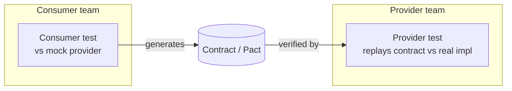
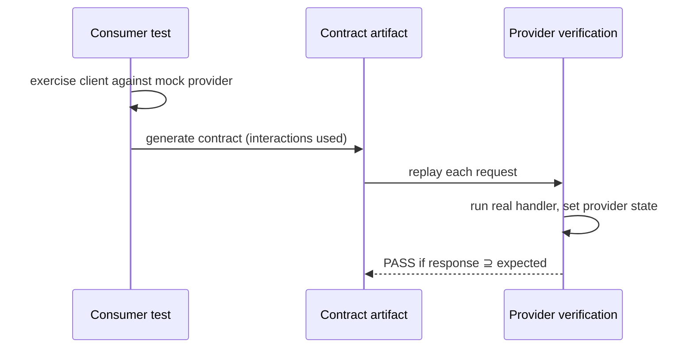
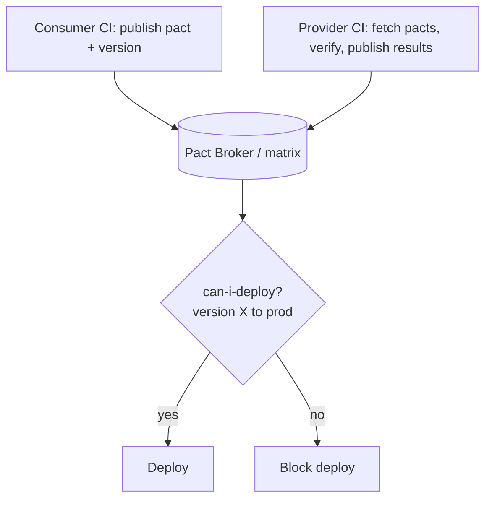
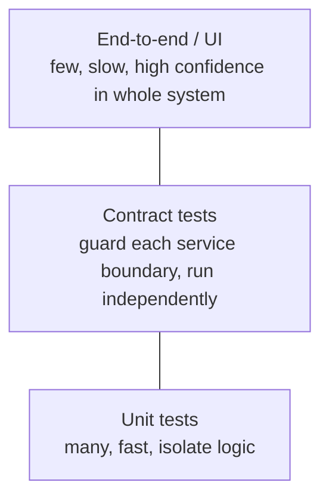

# Contract Testing

Contract testing verifies that two services that talk over a network — a
**consumer** (the client that makes the request) and a **provider** (the service
that answers it) — agree on the shape and semantics of the messages they
exchange. Instead of standing up both services and driving a real end-to-end
call, each side is tested **independently against a shared contract**: the
consumer is tested against a mock provider generated from its expectations, and
the provider is tested by replaying those expectations against the real
implementation. If both sides pass against the same contract, they are safe to
integrate — without ever running together.

This makes contract testing the pragmatic answer to a hard problem in
microservices: **broad integration and end-to-end tests do not scale** as the
number of independently deployable services grows. Contract tests catch the
class of bug that unit tests miss (the API drifted) *and* the class that e2e
tests catch too slowly and too flakily (a breaking change across a service
boundary).

> [!INTERVIEW]
> The framing interviewers want: contract testing sits **between** the fast,
> isolated unit tests and the slow, brittle end-to-end tests. Its whole point is
> to give you confidence that two services are compatible **without deploying
> them together**. If you can explain the consumer-driven handshake (consumer
> generates → provider verifies → broker gates the deploy) and when a contract
> test is the *wrong* tool, you have answered the question.

Spring-specific test slices (`@WebMvcTest`, `@SpringBootTest`, `MockMvc`) live in
the `spring-boot` / `spring-core` domains; broad integration testing lives in
`integration-testing-strategies`. This topic owns the contract-testing discipline
and the two dominant JVM toolchains, **Pact** and **Spring Cloud Contract**.

---

## The problem contract testing solves

In a monolith, a method call either compiles or it does not — the compiler is
your contract check. Split that monolith into services communicating over HTTP or
a message broker and the compiler can no longer see across the boundary. A
provider can rename a field, change a status code, or tighten validation and its
own unit tests still pass green; the break only surfaces when the consumer calls
it — often in production.

The traditional defences both scale badly:

| Defence | Why it fails at scale |
|---|---|
| **Broad integration / e2e tests** | Require *all* services (and their databases, brokers, config) running together. Slow, expensive to maintain, and flaky — one service being down fails unrelated tests. Combinatorial explosion: N services with M versions is an untestable matrix. |
| **Shared "test environment"** | Becomes a bottleneck everyone fights over; a bad deploy by one team blocks everyone; results are non-deterministic. |
| **Manual coordination / API docs** | Docs drift from reality; humans forget to tell consumers about changes. |

Contract testing replaces the *cross-service* portion of that testing with two
**independent, fast, deterministic** test suites tied together by a contract
artifact. No shared environment, no combinatorial matrix, no waiting on other
teams' deploys.

> [!KEY-TAKEAWAY]
> Contract testing exists because integration/e2e testing across many
> independently deployable services is slow, flaky, and combinatorially
> unscalable. It replaces "run everything together" with "test each side against
> a shared contract, independently."



---

## What a contract is

A **contract** is a set of **interactions**. Each interaction records an expected
**request** (method, path, headers, body/matchers) and the **minimal expected
response** (status, headers, body). "Minimal" is important: Pact-style
verification passes if the provider's real response *contains at least* what the
consumer expected — extra fields the consumer does not use do not fail the test.
This is what makes contracts tolerant of additive change.

A contract is **behavioural and consumer-scoped**, not a full description of the
API. It captures only the interactions a *particular* consumer actually relies
on. Two different consumers of the same provider produce two different contracts.
This is the crucial distinction from a schema (see *Contract vs schema/OpenAPI
testing*): a schema describes the whole API surface; a contract describes the
subset one client uses.

> [!TIP]
> Contracts should assert **structure and types**, not exact values, wherever
> possible. Use matchers (regex, type, "like") so the contract does not break
> when the provider returns a different-but-valid value (a different timestamp, a
> different generated id). Asserting exact values is the #1 cause of brittle,
> constantly-failing contract tests.

---

## Consumer-driven contracts (CDC)

**Consumer-driven contracts** flip the direction of authority: the *consumer*
defines what it needs from the provider, and the provider's job is to keep those
expectations satisfied. The contract is generated *from the consumer's tests*, so
it can only ever describe interactions the consumer genuinely exercises.

The benefits:

- The provider learns **exactly which fields and endpoints are actually used**,
  so it can safely change or remove anything no consumer depends on.
- A breaking change is caught on the *provider* side, before deploy, as a failed
  verification against a real consumer's expectations — not in production.
- It documents real usage, not aspirational API design.

CDC is the model behind **Pact**. **Spring Cloud Contract** is more often used in
a **producer-driven** style (the provider authors the contract), though it can be
driven by consumers too. The distinction is *who owns/authors the contract*, not
the tooling per se.

> [!WARNING]
> Consumer-driven does **not** mean the consumer dictates the API design. It
> means the contract reflects real consumer usage. The provider still owns its
> API; CDC just gives it a precise, test-enforced picture of what breaking a
> given field would actually break.



---

## Pact: consumer side (generating the pact)

**Pact** is the dominant CDC toolset (polyglot: JVM, JS, .NET, Go, etc.). On the
consumer side you write a normal unit test that talks to a **Pact mock provider**
instead of the real service. You register the expected request/response with the
Pact DSL; Pact stands up a local HTTP mock that returns your stubbed response
*only if the real request your client code sends matches the expectation*.

```java
// Pact JUnit 5 consumer test
@ExtendWith(PactConsumerTestExt.class)
@PactTestFor(providerName = "order-service")
class OrderClientPactTest {

    @Pact(consumer = "checkout-service")
    RequestResponsePact getOrder(PactDslWithProvider builder) {
        return builder
            .given("order 42 exists")                // provider state
            .uponReceiving("a request for order 42")
                .path("/orders/42").method("GET")
            .willRespondWith()
                .status(200)
                .body(new PactDslJsonBody()
                    .stringType("id", "42")          // matcher: any string
                    .numberType("total", 1999))      // matcher: any number
            .toPact();
    }

    @Test
    @PactTestFor(pactMethod = "getOrder")
    void fetchesOrder(MockServer mock) {
        var client = new OrderClient(mock.getUrl());
        Order o = client.getOrder("42");
        assertThat(o.total()).isEqualTo(1999);       // asserts the client parses it
    }
}
```

Two things happen: (1) the test verifies your **client code actually sends the
request it claims and can parse the response**, and (2) on success Pact writes a
**pact file** (JSON) recording every interaction. That pact file is the artifact
the provider must later satisfy. Each interaction is tested **independently** —
there is no chaining of "create then read," which is why provider states exist.

---

## Provider states

Because interactions are isolated, a provider needs a way to get into the right
**precondition** before a request is replayed — e.g. "order 42 exists" or "the
user is an admin." That precondition is a **provider state**. The consumer names
the state in the interaction (`.given("order 42 exists")`); the provider registers
a matching state handler that seeds the data (inserts the row, sets up the mock)
before the request is replayed.

```java
// Provider side (Pact JUnit 5)
@Provider("order-service")
@PactBroker(url = "https://broker.example.com")
class OrderServiceProviderTest {

    @BeforeEach
    void setTarget(PactVerificationContext ctx) {
        ctx.setTarget(new HttpTestTarget("localhost", port));
    }

    @State("order 42 exists")                 // matches consumer's .given(...)
    void order42Exists() {
        orderRepository.save(new Order("42", 1999));  // seed the precondition
    }

    @TestTemplate
    @ExtendWith(PactVerificationInvocationContextProvider.class)
    void verify(PactVerificationContext ctx) {
        ctx.verifyInteraction();              // replays request, checks response
    }
}
```

> [!WARNING]
> Provider states are the most common source of confusion. The *string* must
> match exactly between consumer's `given(...)` and provider's `@State(...)`. A
> mismatch means the state handler never runs, so the data is not seeded and
> verification fails for a reason unrelated to the actual contract. Provider
> states should set up data via the fastest reliable path (repository/DB seed or
> stubbed downstream), **not** by driving other API calls.

---

## Provider verification

Provider verification is **entirely driven by the Pact framework**: it takes the
pact file, replays each recorded request against the *running provider*, and
compares the actual response to the minimal expected response. It passes when the
real response **contains at least** the expected data. Extra fields are fine;
missing/renamed fields or wrong status codes fail.

Key properties senior candidates should name:

- Verification runs against the **real provider implementation** (its controllers,
  serialization, validation) — not a mock. That is what makes it trustworthy.
- Downstream dependencies of the provider are usually **stubbed** so verification
  stays fast and deterministic; you are testing the provider's contract surface,
  not its whole dependency graph.
- A provider can be verified against pacts from **multiple consumers** at once —
  it must satisfy all of them.
- Verification **results are published back** to the broker, keyed by provider
  version, so the broker knows which provider versions satisfy which consumer
  versions. This is what powers the deployment gate.

---

## Pact Broker and can-i-deploy (the deployment gate)

The **Pact Broker** (or hosted **PactFlow**) is the central exchange for contracts
and verification results. Consumers publish pacts to it; providers fetch pacts
from it and publish verification results back. It stores, versions, and visualises
the network of who-depends-on-whom (the **matrix**).

Its killer feature is **`can-i-deploy`**: a CLI/API query you run in CI *before*
deploying that answers, "given the exact versions I'm about to deploy, is every
consumer/provider pair on the target environment verified compatible?" It consults
the matrix and returns pass/fail.

```bash
# In CI, gate the deploy on real compatibility with what's in production:
pact-broker can-i-deploy \
  --pacticipant checkout-service \
  --version "$GIT_SHA" \
  --to-environment production
# exit 0 => safe to deploy; non-zero => a counterpart isn't verified compatible
```



> [!KEY-TAKEAWAY]
> The broker turns contract tests into a **deployment gate**. `can-i-deploy`
> lets a service deploy independently and safely: it deploys only when the broker
> confirms the *specific versions* it will meet in the target environment are
> already verified compatible. This is what enables independent deployment
> without a shared staging environment.

The broker also tracks which version is deployed/released to which environment
(via **`record-deployment`** / environments), so `can-i-deploy` reasons about the
*actual* target-environment state rather than "latest."

---

## Versioning contracts

Every party is a **pacticipant** with a **version** — conventionally the git SHA
(or a semver + build). Contracts and verification results are stored **per
version**, and pacticipant versions are labelled with **tags** or associated with
**branches** and **environments** so the broker can answer version-specific
questions.

Concepts that come up:

- **Consumer version tags / branches** — e.g. tag a pact with `main` or `prod` so
  the provider knows which consumer versions to verify against.
- **Pending pacts** — when a *new* consumer contract (e.g. from a feature branch)
  arrives, the provider can verify it as "pending" so a not-yet-satisfied
  expectation does **not** break the provider's build. It lets the consumer share
  intent early without blocking the provider.
- **Work-in-progress (WIP) pacts** — automatically include newly-changed pacts in
  provider verification without configuration, also in a non-blocking way.
- **Backward compatibility rule** — you should deploy the **provider first** when
  it adds capability, and keep old interactions verifiable until every consumer
  has migrated. Never break an interaction a currently-deployed consumer relies
  on.

> [!TIP]
> Use the git commit SHA as the pacticipant version. It is unique, ties the
> contract to exact code, and lets `can-i-deploy` reason about precisely the
> artifact you are shipping. "latest" is not a version — it is a moving target
> that breaks the deployment gate's guarantees.

---

## Spring Cloud Contract

**Spring Cloud Contract (SCC)** is the JVM-native alternative, most often used
**producer-driven**: the provider authors contracts in a **Groovy DSL or YAML**
under `src/test/resources/contracts`. From those contracts the build:

1. **Generates provider verification tests** (default mode `MockMvc`; also
   `WebTestClient` for WebFlux, `JAXRS`) that run against the real controllers and
   fail until the implementation satisfies the contract.
2. **Publishes a stubs JAR** (`*-stubs.jar`) containing WireMock mappings derived
   from the same contracts.

Consumers then use **Stub Runner** (`@AutoConfigureStubRunner`) to download the
provider's stub JAR from the artifact repo and spin up a **WireMock** server that
behaves exactly as the contract says — so the consumer tests against a stub that
is guaranteed to match the provider's verified behaviour.

```java
// SCC consumer test — runs WireMock from the provider's published stubs
@SpringBootTest(webEnvironment = WebEnvironment.NONE)
@AutoConfigureStubRunner(
    ids = "com.example:order-service:+:stubs:8090",
    stubsMode = StubRunnerProperties.StubsMode.LOCAL)   // or REMOTE
class CheckoutStubRunnerTest {
    @Test void callsOrderService() { /* client hits localhost:8090 WireMock */ }
}
```

| | Pact | Spring Cloud Contract |
|---|---|---|
| **Default authority** | Consumer-driven | Producer-driven (consumer-driven possible) |
| **Contract source** | Generated from consumer test code | Hand-written Groovy DSL / YAML |
| **Provider check** | Framework replays pact | Generated JUnit tests (MockMvc/WebTestClient) |
| **Consumer stub** | Pact mock server | WireMock from published stub JAR |
| **Exchange/gate** | Pact Broker + `can-i-deploy` | Artifact repo (Nexus/Artifactory) / Git; Stub Runner |
| **Polyglot** | Yes (many languages) | JVM-centric |

> [!TIP]
> Choose Pact when you have polyglot services and want a broker-driven deployment
> gate. Choose Spring Cloud Contract when you are all-JVM/Spring and prefer the
> provider to author contracts as version-controlled DSL files reused as both
> tests and stubs.

---

## Bi-directional contract testing

**Bi-directional contract testing (BDCT)** is a newer, looser model (popularised
by PactFlow) that avoids the provider having to *replay* consumer pacts. Instead:

- The **provider** publishes a **provider contract** — typically its **OpenAPI
  spec** — verified by its own existing provider tests.
- The **consumer** publishes its **consumer contract** (the interactions it uses),
  from its own tests.
- The **broker performs a static compatibility check (cross-contract
  comparison)**: does the consumer's expected request/response fit inside what the
  provider's OpenAPI spec allows?

The trade-off vs classic CDC:

- **Pro:** lower coupling and effort — the provider just maintains its OpenAPI +
  normal tests; it does not run consumer pacts. Great for third-party or
  hard-to-instrument providers.
- **Con:** it is only as good as the provider contract. The comparison is
  **static**, so it verifies *stated* behaviour, not *actual runtime* behaviour —
  if the OpenAPI spec lies about the implementation, BDCT will not catch it,
  whereas classic verification (which runs the real provider) would.

> [!INTERVIEW]
> If asked "unidirectional (classic Pact CDC) vs bi-directional," the crisp
> answer: classic CDC replays the consumer's expectations against the **real
> running provider** (higher confidence, higher provider effort/coupling); BDCT
> **statically compares** the consumer contract to the provider's own verified
> spec (lower effort/coupling, but confidence is bounded by how accurate that
> spec is).

---

## Contract vs schema (OpenAPI) testing

A **schema** (OpenAPI/JSON Schema/Protobuf/Avro) describes the **whole API
surface**: every endpoint, every field, its types and constraints. **Schema
validation** checks that a message conforms to that structure. It is valuable and
cheap, but it answers a different question than a contract test.

| | Schema testing (OpenAPI) | Contract testing |
|---|---|---|
| **Scope** | Entire declared API surface | Only interactions a specific consumer uses |
| **Question answered** | "Is this message structurally valid per the spec?" | "Do this consumer and this provider actually agree on what's exchanged?" |
| **Knows real usage?** | No — can't tell which fields matter to whom | Yes — driven by real consumer expectations |
| **Catches "removed a field a consumer needs"?** | Only if it's still spec-required | Yes — a consumer's contract fails verification |
| **Catches "implementation diverges from spec"?** | No (spec is the source, not the code) | Yes for classic CDC (runs real provider) |

Schema and contract testing are **complementary**: schema/compatibility rules
(e.g. Avro/Protobuf backward-compatibility checks in a schema registry) are great
for message/event pipelines and broad structural validation; contract tests add
the consumer-specific, behaviour-level guarantee and the deployment gate.
Bi-directional contract testing (above) explicitly *uses* the OpenAPI schema as
the provider contract.

---

## Where it fits in the pyramid and the e2e trade-off

Contract tests occupy the **service/integration band** of the test pyramid — above
unit tests, below end-to-end. They are fast and deterministic like unit tests
(each side runs alone, no shared environment), yet they guard the cross-service
boundary that unit tests cannot see.



The core trade-off vs end-to-end tests:

| | Contract tests | End-to-end tests |
|---|---|---|
| **Environment** | Each side alone, no shared env | All services + infra running together |
| **Speed / determinism** | Fast, deterministic | Slow, flaky |
| **Scales with #services** | Yes (linear) | No (combinatorial) |
| **Catches integration/API drift** | Yes, per boundary | Yes |
| **Catches whole-system/workflow bugs** | **No** — never runs the real end-to-end path | Yes |
| **Enables independent deploy** | Yes (`can-i-deploy`) | Needs everything together |

Contract testing does **not** replace end-to-end testing entirely — it replaces
the *bulk* of it. You still keep a **small number** of e2e tests for critical
user journeys and genuinely emergent, cross-service behaviour (auth flows,
multi-service workflows, infra/config). Everything the contract can express, push
down to contract tests; reserve e2e for what only running the whole system can
prove.

> [!KEY-TAKEAWAY]
> Contract tests give you *most* of the integration confidence at *unit-test*
> cost and reliability, and unlock independent deployment. They do not verify the
> whole system behaves correctly end to end — keep a thin layer of e2e tests for
> that.

---

## Common follow-up questions

- **"Why not just run integration tests across services?"** They need a shared
  environment and scale combinatorially with the number of services/versions;
  they are slow and flaky. Contract tests give per-boundary confidence with each
  side tested independently.
- **"Walk me through the consumer-driven handshake."** Consumer test runs against
  a mock provider and generates a pact → pact published to broker → provider
  fetches it, sets up provider states, replays requests against the real impl,
  publishes results → `can-i-deploy` gates the deploy on the matrix.
- **"What is a provider state and why is it needed?"** A named precondition the
  provider seeds before an interaction is replayed, because interactions are
  tested in isolation (no chaining). The string must match consumer `given` and
  provider `@State`.
- **"How does `can-i-deploy` work?"** It queries the broker's matrix for the
  specific pacticipant version and target environment and returns whether every
  counterpart is verified compatible — a hard gate in CI.
- **"How do you version contracts?"** Pacticipant version = git SHA; tag/branch to
  associate with environments; use pending/WIP pacts so new expectations don't
  break provider builds; deploy provider-first for additive change.
- **"Pact vs Spring Cloud Contract?"** Pact = consumer-driven, polyglot, broker +
  `can-i-deploy`. SCC = usually producer-driven, JVM/Spring, Groovy/YAML DSL that
  generates provider tests and WireMock stubs.
- **"Unidirectional vs bi-directional?"** Classic replays consumer expectations
  against the real provider (more confidence, more coupling); BDCT statically
  compares the consumer contract against the provider's OpenAPI spec (less
  coupling, confidence bounded by spec accuracy).
- **"Contract vs OpenAPI/schema testing?"** Schema = whole surface, structural,
  spec-as-truth. Contract = consumer-specific, behavioural, and (for classic CDC)
  runs the real provider. Complementary.
- **"Does contract testing replace e2e?"** It replaces most of it; keep a thin
  layer of e2e for critical whole-system journeys it cannot express.
- **"How do you avoid brittle contracts?"** Use matchers (type/regex/"like") to
  assert structure not exact values; capture only interactions the consumer
  actually uses; don't over-specify headers/fields.

## References

- Pact — "How Pact works": https://docs.pact.io/getting_started/how_pact_works
- Pact — Provider states: https://docs.pact.io/getting_started/provider_states
- Pact Broker & `can-i-deploy`: https://docs.pact.io/pact_broker/can_i_deploy
- Pact — versioning / branches & environments: https://docs.pact.io/pact_broker/branches
- Pact — pending & WIP pacts: https://docs.pact.io/pact_broker/advanced_topics/pending_pacts
- Spring Cloud Contract reference: https://docs.spring.io/spring-cloud-contract/reference/
- Martin Fowler — "Consumer-Driven Contracts": https://martinfowler.com/articles/consumerDrivenContracts.html
- Martin Fowler — "Contract Test": https://martinfowler.com/bliki/ContractTest.html
- Ham Vocke / Fowler — "The Practical Test Pyramid" (contract tests section): https://martinfowler.com/articles/practical-test-pyramid.html
- PactFlow — Bi-directional contract testing: https://docs.pactflow.io/docs/bi-directional-contract-testing
- WireMock docs: https://wiremock.org/docs/
