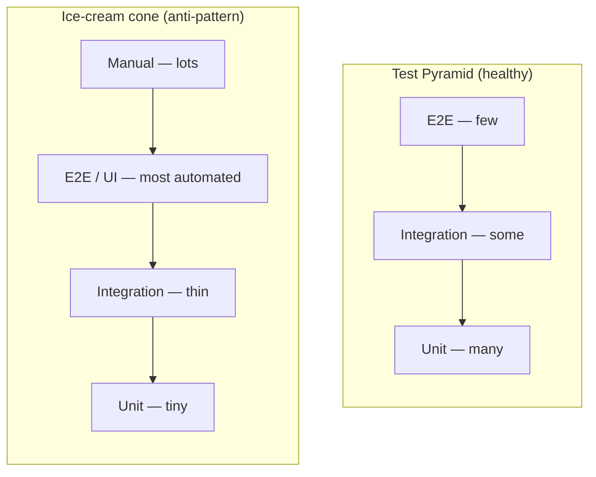
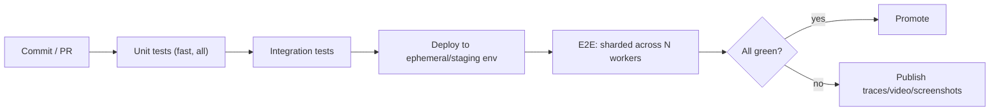

# End-to-End & UI Testing

End-to-end (E2E) testing exercises a system the way a real user does: driving the
**application through its outermost interface** — a browser UI or a public API —
and asserting on behaviour that emerges from the *whole* stack wired together
(front end, back end, database, caches, third-party integrations). Where a unit
test isolates one class and an integration test verifies one boundary, an E2E
test verifies a *complete user journey*: "a customer can search, add to cart,
check out, and receive a confirmation."

This power is also the cost. E2E tests are the **slowest, most brittle, and most
expensive** tests you own, so they sit at the *top* of the test pyramid — you
keep few of them, reserved for the handful of critical journeys where a
whole-system regression would be catastrophic. Getting the count, scope,
determinism, and CI strategy right is the whole game.

> [!INTERVIEW]
> The most common senior probe here is: *"Your E2E suite is slow and flaky and
> the team ignores it. What do you do?"* A strong answer separates **flakiness**
> (bad waits, test data coupling, shared state, network) from **scope creep**
> (too many E2E tests testing logic that belongs lower in the pyramid), names
> concrete fixes (auto-waiting tools, Page Objects, deterministic data, retries
> as a smell not a cure, sharding), and re-frames the suite around *critical
> journeys only*.

Spring-specific test slices (`@WebMvcTest`, `@SpringBootTest`, `MockMvc`) belong
to the `spring-boot` / `spring-core` domains; API-*design* and capacity planning
belong to `rest-api-design` / `system-design`. This topic owns the E2E/UI
*testing technique*.

---

## E2E scope: testing through the UI or API

An E2E test treats the system as a **black box** and drives it through its real
outer interface with no internal mocking of the components under test:

- **UI E2E** — a browser automation tool (Selenium/WebDriver, Playwright,
  Cypress) clicks buttons, fills forms, and asserts on rendered DOM, driving the
  real front end → real back end → real database.
- **API E2E** — a client (REST-assured, an HTTP client, Postman/Newman) calls
  the deployed public API and asserts on responses and side effects, exercising
  the full server stack but skipping the browser.

The defining trait: **nothing under test is stubbed**. The value is confidence
that the deployed system actually works together — the wiring, config,
serialization, auth, and data flow that unit and integration tests each verify
only in part.

| Layer | What it isolates | Speed | Confidence about "does the product work?" |
|---|---|---|---|
| Unit | one class/function | ms | low (logic only) |
| Integration | one boundary (DB, broker, HTTP) | 10s–100s ms | medium |
| E2E | the whole journey through UI/API | seconds–minutes | high |

> [!KEY-TAKEAWAY]
> E2E answers a question no lower test can: *"When everything is deployed and
> wired together, can a user actually complete this journey?"* That is why you
> keep a few — and why you must keep them few.

```java
// API-level E2E with REST-assured against a running deployment.
@Test
void customerCanPlaceOrderEndToEnd() {
    String token = given().body(loginJson).post("/auth/login")
        .then().statusCode(200).extract().path("token");

    int orderId = given().header("Authorization", "Bearer " + token)
        .body(orderJson).post("/orders")
        .then().statusCode(201).extract().path("id");

    // side effect visible through the API: order is retrievable and CONFIRMED
    given().header("Authorization", "Bearer " + token)
        .get("/orders/" + orderId)
        .then().statusCode(200).body("status", equalTo("CONFIRMED"));
}
```

## Why few E2E tests: slow, flaky, expensive

E2E tests earn their place at the top of the pyramid because every property that
makes them powerful also makes them costly:

- **Slow** — each test boots browsers, does real network round-trips, and waits
  on real rendering/DB writes. Seconds to minutes each vs. milliseconds for a
  unit test.
- **Flaky** — the more moving parts, the more nondeterminism: timing/async, test
  data, shared environment state, third-party outages, animation, network
  jitter. A test that fails 1% of the time is worse than useless at scale — it
  erodes trust in the whole suite.
- **Expensive to maintain** — coupled to UI structure and copy; a button rename
  can break dozens of tests. Debugging a failure means bisecting the *entire*
  stack, not one unit.
- **Poor localization** — a red E2E test tells you *something* broke, rarely
  *what*. A failing unit test points at one function.

The economic argument (Fowler, Google "Test Sizes"): push each check to the
**lowest layer that can catch the bug**. Test business logic in unit tests,
boundaries in integration tests, and reserve E2E for verifying that the critical
journeys hold *together*.

> [!WARNING]
> A flaky test that people "just re-run" is a liability, not an asset. It
> trains the team to ignore red builds, which means the one time it catches a
> real regression, nobody believes it. Quarantine or fix flaky E2E tests
> aggressively.

## The test pyramid and the ice-cream-cone anti-pattern

Mike Cohn's **test pyramid** prescribes many fast unit tests at the base, fewer
integration tests in the middle, and a thin cap of E2E tests. The **ice-cream
cone** (or "inverted pyramid") is the anti-pattern: a huge blob of manual +
E2E/UI tests on top, a pinched middle, and almost no unit tests. Teams drift
into it because E2E tests feel "realistic" and are often written by a separate
QA function after the fact.



Symptoms of the cone: builds take an hour, the suite is chronically flaky,
regressions still slip through, and developers stop trusting CI. The fix is not
"delete E2E tests" but **re-balance**: move logic checks down to unit/integration
level, and keep only the critical-journey E2E tests at the top.

> [!TIP]
> Fowler's heuristic: if an E2E test is failing because of logic that *could*
> have been caught by a unit test, that bug is a signal you have a coverage gap
> lower in the pyramid — write the cheap test and let the E2E test go back to
> guarding the journey.

## When E2E is worth it: critical user journeys

Because E2E tests are expensive, you spend the budget only where a whole-system
failure would be a business emergency. Choose journeys by **revenue/risk
impact**, not by code coverage:

- Login / authentication and session handling
- The primary revenue path (search → cart → checkout → payment → confirmation)
- Sign-up / onboarding
- Anything with legal/compliance or data-integrity consequences

Rules of thumb for a healthy E2E suite:

- **Count in the tens, not thousands.** If it is growing unbounded, logic is
  leaking up the pyramid.
- **One journey per test**, asserting the user-visible outcome, not internal
  state.
- **Independent of each other** — no test depends on another having run first.
- Cover *variations* (invalid card, out-of-stock) with cheaper integration/unit
  tests, not more E2E permutations.

> [!KEY-TAKEAWAY]
> Ask "if this exact flow broke in production for an hour, would we page
> someone?" If yes, it deserves an E2E test. If no, push the check down the
> pyramid.

## Selenium WebDriver vs Playwright vs Cypress

The three dominant browser-automation tools differ mainly in **architecture** and
**how they fight flakiness**.

| | Selenium/WebDriver | Playwright | Cypress |
|---|---|---|---|
| Architecture | Client drives browser via W3C WebDriver protocol (out-of-process) | Drives browsers via DevTools/CDP-style protocols (out-of-process) | Runs *inside* the browser event loop alongside your app |
| Auto-wait | **No** — you add explicit waits | **Yes** — built into every action | **Yes** — built-in retry-ability |
| Language support | Java, C#, Python, JS, Ruby, … | JS/TS, Python, Java, .NET | JS/TS only |
| Cross-browser | Broadest (all major, real browsers, Grid) | Chromium, Firefox, WebKit | Chromium-family + Firefox/WebKit (with limits) |
| Multi-tab / multi-origin | Yes | Yes | Historically limited (runs in one browser context) |
| Parallelism | Selenium Grid | Built-in workers | Paid dashboard / plugins for orchestration |
| Typical flakiness source | **Manual waits done wrong** | Fewer (auto-wait + web-first assertions) | Fewer, but architecture constrains some scenarios |

The key evolution: **Selenium has no auto-waiting**, so a huge fraction of
Selenium flakiness comes from developers guessing at `Thread.sleep()` or writing
waits incorrectly. **Playwright and Cypress auto-wait** — every action first
checks the element is actionable and retries until a timeout — which eliminates
the most common class of flaky UI test by design.

```java
// Selenium: YOU must wait explicitly. This is where flakiness creeps in.
WebDriverWait wait = new WebDriverWait(driver, Duration.ofSeconds(10));
wait.until(ExpectedConditions.elementToBeClickable(By.id("checkout"))).click();
```

```js
// Playwright: the click auto-waits for the element to be visible, stable,
// enabled, and hit-testable. No explicit wait needed.
await page.getByRole('button', { name: 'Checkout' }).click();
```

> [!INTERVIEW]
> "Why do teams migrate from Selenium to Playwright/Cypress?" — Primarily
> **auto-waiting** (kills the biggest flakiness source), plus faster execution,
> better debugging (trace viewer, time-travel), network interception, and
> parallelism out of the box. The trade-off: Selenium's broader language +
> real-browser/Grid ecosystem and W3C-standard protocol.

## Explicit vs implicit waits and the flakiness they fight

The root cause of most UI flakiness is **timing**: the test acts before the app
is ready (element not yet rendered, still animating, still disabled, or covered
by an overlay). Three strategies:

- **Fixed sleep (`Thread.sleep`)** — always wrong. Too short → flaky; too long →
  slow. Never encodes the *actual* condition you care about.
- **Implicit wait** — a session-wide setting (Selenium) that makes *every*
  element lookup poll for up to N seconds before failing. Default is **0**. It
  is coarse and cannot wait for conditions beyond "element present."
- **Explicit wait** — poll for a *specific condition* (visible, clickable, text
  present) up to a timeout, then proceed as soon as it is true. This is the
  correct tool: it waits exactly as long as needed for the exact condition.

```java
// BAD: fixed sleep — flaky and slow at the same time.
Thread.sleep(3000);
driver.findElement(By.id("checkout")).click();

// GOOD: explicit wait on the real condition.
new WebDriverWait(driver, Duration.ofSeconds(10))
    .until(ExpectedConditions.elementToBeClickable(By.id("checkout")))
    .click();
```

> [!WARNING]
> **Do not mix implicit and explicit waits.** The Selenium docs warn this causes
> unpredictable wait times — e.g. a 10s implicit + 15s explicit can produce a
> timeout at ~20s+. Pick explicit waits and set the implicit wait to 0.

**Playwright/Cypress auto-waiting** is the modern answer: the framework's
`click`/`fill` internally performs explicit-wait-style **actionability checks**
before acting, and assertions auto-retry until the condition holds. You get
correct waiting without writing (or mis-writing) it.

## Actionability and web-first (auto-retrying) assertions

Playwright's auto-waiting works by running **actionability checks** before each
action and retrying until they pass or the timeout fires. For a click the
element must be:

- **Visible** — non-empty bounding box, not `visibility:hidden`/`display:none`
  (note: `opacity:0` still counts as visible).
- **Stable** — same bounding box across two consecutive animation frames (not
  mid-animation).
- **Enabled** — not `[disabled]`, not in a disabled `<fieldset>`.
- **Receives events** — it is the hit target at the click point (not covered by
  an overlay/modal).
- **Editable** — (for `fill`) enabled and not `readonly`.

Different actions require different subsets (e.g. `fill` needs
visible+enabled+editable; `click` needs visible+stable+enabled+receives-events).

Crucially, **web-first assertions auto-retry**: `expect(locator).toBeVisible()`
polls until true or times out, instead of evaluating once. This is what makes
modern UI tests robust against async rendering — the assertion, not just the
action, waits.

```js
// Auto-retrying assertion: waits until the toast appears, no manual wait.
await expect(page.getByText('Order confirmed')).toBeVisible();
```

## Page Object Model (POM)

The **Page Object Model** is the dominant design pattern for maintainable UI
tests. Each page/component gets a class that encapsulates its **locators** and
**interactions**, exposing intent-revealing methods. Tests speak in business
terms; the fragile CSS/XPath selectors live in one place.

```java
public class CheckoutPage {
    private final WebDriver driver;
    private final By promoField = By.id("promo");
    private final By applyBtn  = By.id("apply-promo");
    private final By total     = By.cssSelector("[data-test=order-total]");

    public CheckoutPage(WebDriver driver) { this.driver = driver; }

    public CheckoutPage applyPromo(String code) {
        driver.findElement(promoField).sendKeys(code);
        driver.findElement(applyBtn).click();
        return this;                       // fluent chaining
    }
    public String orderTotal() { return driver.findElement(total).getText(); }
}
```

Why it matters:

- **DRY / single source of truth for locators** — a UI change touches one class,
  not every test.
- **Readable tests** — `checkout.applyPromo("SAVE10")` reads like the journey.
- **Reuse** across many tests hitting the same screen.

Modern refinements: **component objects** (per reusable widget, not per full
page), and prefer **user-facing/role/`data-test` locators** over brittle
CSS/XPath tied to styling. Playwright's fixtures and Cypress custom commands
serve a similar role.

> [!TIP]
> Keep **assertions out of page objects**. A page object models *interactions*
> and *state exposure*; the *test* owns the assertions. Mixing them makes page
> objects less reusable and hides what a test is really verifying.

## Selectors and locator strategy

Flaky, brittle selectors are a top cause of E2E maintenance pain. Preference
order (most to least robust):

1. **User-facing / accessibility** — role + accessible name (`getByRole`),
   label text, placeholder. Resilient to markup churn and doubles as an a11y
   check.
2. **Dedicated test IDs** — `data-testid` / `data-test` attributes added
   deliberately for tests; decoupled from styling and copy.
3. **Stable IDs** — semantic `id` attributes if they are truly stable.
4. **CSS selectors** — tied to structure/classes; break on restyling.
5. **XPath by position/index** (`//div[3]/span`) — most brittle; avoid.

> [!WARNING]
> Selecting by CSS class or DOM position couples tests to styling and layout,
> not behaviour. A designer's refactor then "breaks" tests that the *user* would
> never notice. Prefer `data-testid` or role/label locators.

## Test data and environment setup

E2E tests need realistic data in a realistic environment — the hardest
operational problem in E2E testing. Options and trade-offs:

| Strategy | Pros | Cons |
|---|---|---|
| **Seed via API/DB before each test** | Fast, deterministic, isolated | Must maintain setup code; may bypass real creation path |
| **Create via the UI in the test** | Exercises the real path | Slow, couples tests, fragile |
| **Shared long-lived test data** | No setup cost | Tests interfere; order-dependent; drift |
| **Ephemeral environment per run** (Testcontainers/Docker Compose, preview envs) | Clean, isolated, parallel-safe | Infra cost/complexity, slower startup |

Principles for deterministic E2E data:

- **Each test owns its data** — create what it needs (ideally via a fast API/DB
  seed), assert, and clean up. No reliance on data another test created.
- **Unique keys per test/run** — randomize emails/usernames (`user+{uuid}@…`) to
  avoid collisions under parallel execution.
- **Control non-determinism at the edges** — stub time, freeze the clock, seed
  RNG, and stub genuinely external third parties (payment gateways) even in E2E,
  or use their sandbox.
- **Isolate state** — separate DB/schema per run, or reset between tests, so
  parallel shards don't collide.

> [!KEY-TAKEAWAY]
> Test-data coupling ("test B assumes test A ran and left a user") is one of the
> top causes of E2E flakiness and of the dreaded "passes alone, fails in the
> suite." Independence and per-test data are non-negotiable.

## Headless vs headed execution

- **Headed** — a visible browser window. Used for **local debugging** — you
  watch the test drive the UI.
- **Headless** — no visible UI; the browser runs without rendering to a screen.
  Faster, lower resource use, and required on CI servers that have no display.

Modern headless (Chrome's `--headless=new`, Playwright/Cypress headless) is
close to headed in fidelity, but subtle differences remain (default window size,
some GPU/rendering paths, font availability), so a test can occasionally behave
differently between modes. Best practice: **run headless in CI**, headed locally
for debugging, and capture **screenshots/video/traces** on failure so you can
diagnose headless CI failures without re-running headed.

> [!TIP]
> If a test passes headed but fails headless, suspect **viewport/window size**
> (responsive layout hiding an element) or a **timing** difference, and turn on
> trace/video artifacts rather than debugging blind.

## Visual regression testing

Functional assertions check *behaviour*; **visual regression testing** catches
*appearance* bugs — a broken layout, wrong color, overlapping text — that pass
every functional assertion. It works by capturing a **screenshot** of a
page/component and comparing it pixel-by-pixel (or perceptually) against an
approved **baseline**; a diff above a threshold fails the test.

```js
// Playwright built-in visual comparison against a stored baseline snapshot.
await expect(page).toHaveScreenshot('checkout.png', { maxDiffPixels: 100 });
```

Challenges and mitigations:

- **False positives** from anti-aliasing, font rendering, dynamic content
  (dates, ads, animations). Mitigate with tolerance thresholds, masking dynamic
  regions, freezing time/animations, and pinning the rendering environment
  (same OS/browser, often via a container) so baselines are reproducible.
- **Baseline management** — baselines must be reviewed and updated deliberately
  when the UI *intentionally* changes; blindly "update all" defeats the point.
- Tools: Playwright/Cypress built-ins, Percy, Applitools (AI/perceptual diffing
  to reduce pixel-noise false positives).

> [!WARNING]
> Naive pixel-diffing is notoriously flaky across OSes and browser versions
> because font/anti-aliasing rendering differs. Pin the environment (a
> container image) so baselines are captured and compared under identical
> rendering.

## E2E in CI: parallelization, sharding, retries

Because E2E suites are slow, CI strategy is where you make them tolerable:

- **Parallelization** — run tests concurrently across workers/machines. Requires
  test independence and isolated data (see above), or parallel runs corrupt
  shared state.
- **Sharding** — split the test set into N shards run on N machines, then merge
  reports. Cuts wall-clock time roughly linearly. Balance shards by historical
  duration, not test count, to avoid a straggler shard.
- **Retries** — auto-retry a failed test a small number of times. A pragmatic
  buffer against residual nondeterminism, but a **smell, not a cure**: track
  which tests only pass on retry and fix them. Retrying everything hides real
  regressions and inflates run time.
- **Fail-fast vs full run** — fail-fast surfaces breakage sooner; full runs give
  a complete flakiness picture. Often: fail-fast on PRs, full run nightly.
- **Artifacts on failure** — screenshots, video, traces, DOM snapshots, logs, so
  a CI failure is diagnosable without local reproduction.
- **Placement in the pipeline** — E2E runs *after* unit/integration (fail cheap
  tests first), often against a deployed staging/ephemeral environment, and may
  gate promotion to production.



> [!INTERVIEW]
> "How do you keep a large E2E suite under a time budget in CI?" — shard across
> machines balanced by duration, run headless, ensure test independence so
> parallelism is safe, use limited retries with flaky-test tracking, run E2E
> after cheaper stages, and keep the *count* small by pushing logic checks down
> the pyramid.

## Common follow-up questions

- **"Where do E2E tests sit in the pyramid and why so few?"** Top of the
  pyramid; slow, flaky, expensive, and poor at localizing failures — so reserve
  them for critical journeys and push logic checks to unit/integration.
- **"Selenium vs Playwright/Cypress — why migrate?"** Auto-waiting eliminates the
  biggest flakiness source; plus speed, tracing/time-travel debugging, network
  interception, built-in parallelism. Trade-off: Selenium's broader
  language/browser/Grid ecosystem and W3C standard.
- **"How do you fix a flaky E2E test?"** Diagnose the cause: replace fixed sleeps
  with explicit/auto waits, remove test-data coupling and shared state, use
  robust locators (role/`data-testid`), stub time/RNG/external services, and
  isolate data per test. Retries hide flakiness, they don't fix it.
- **"Implicit vs explicit waits?"** Implicit = coarse session-wide poll for
  presence (default 0). Explicit = poll for a specific condition. Prefer
  explicit; never mix the two.
- **"What is the ice-cream-cone anti-pattern?"** Inverted pyramid: too many
  manual/E2E tests, too few unit tests → slow, flaky, expensive, still leaky.
  Fix by re-balancing down the pyramid.
- **"What does Page Object Model buy you?"** Encapsulates locators/interactions
  per page so UI changes touch one class; makes tests readable and reusable.
  Keep assertions in the test, not the page object.
- **"How do you handle E2E test data?"** Each test owns its data, seeded fast via
  API/DB with unique keys, in an isolated/ephemeral environment; stub external
  services and freeze time for determinism.
- **"What is visual regression testing and why is it flaky?"** Screenshot vs
  baseline diffing; flaky due to font/anti-aliasing/dynamic content differences —
  mitigate with thresholds, masking, and a pinned rendering environment.
- **"Headless vs headed?"** Headless (no UI) for CI/speed; headed for local
  debugging; capture traces/screenshots so headless failures are diagnosable.

## References

- Martin Fowler — *TestPyramid*, *The Practical Test Pyramid* (Ham Vocke),
  *Page Object*, *On the Diverse And Fantastical Shapes of Testing* (ice-cream
  cone). martinfowler.com
- Mike Cohn — *Succeeding with Agile* (origin of the test pyramid).
- Google Testing Blog — "Just Say No to More End-to-End Tests"; test sizes.
- Playwright docs — *Actionability / Auto-waiting*, *Assertions* (web-first),
  *Visual comparisons*, *Test parallelism & sharding*. playwright.dev
- Cypress docs — *Retry-ability*, *Best Practices* (selectors, test
  independence). docs.cypress.io
- Selenium docs — *Waits* (implicit/explicit/fluent), *WebDriver*, *Grid*.
  selenium.dev
- Selenium docs — *Page object models* / encapsulation guidance.
