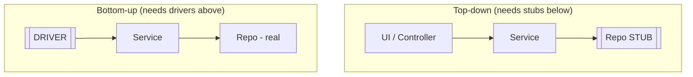
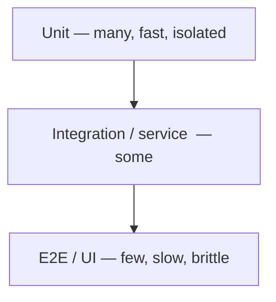
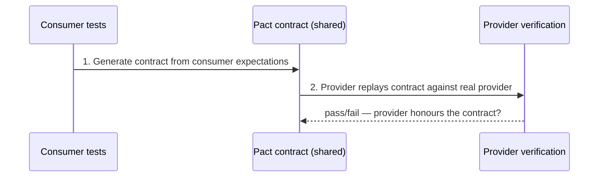

# Integration Testing Strategies

Integration testing verifies that separately developed units work correctly
**together** across a boundary — the boundary between your code and a database,
a message broker, an external HTTP service, the filesystem, or another module.
Where a unit test isolates one piece of logic (usually replacing collaborators
with test doubles), an integration test deliberately exercises the *wiring*: the
SQL your ORM emits, the JSON your client serializes, the transaction semantics,
the connection pool, the retry logic against a real (or realistic) dependency.

This topic covers the *general discipline* of integration testing: what it
covers, how to sequence it (big-bang vs incremental), the narrow-vs-broad
spectrum (Fowler), in-memory vs real dependencies (H2 vs Testcontainers), test
data isolation, where these tests sit in the pyramid, sources of flakiness, and
when a **contract test** is a better tool than a broad integration test.

> [!INTERVIEW]
> The single most common senior-level probe here is: *"Your integration suite
> is slow and flaky. What do you do?"* A strong answer names concrete causes
> (shared mutable state, real network, ordering, time/async, big-bang scope),
> concrete fixes (Testcontainers for isolation, per-test data setup, narrow
> tests, contract tests to replace broad ones), and the trade-offs of each.

Spring-specific test slices (`@DataJpaTest`, `@WebMvcTest`, `@SpringBootTest`,
`MockMvc`) are covered in the `spring-boot` / `spring-core` domains — this topic
owns the framework-neutral discipline and points there where relevant.

---

## What integration testing covers

An integration test asserts behaviour **across a boundary between components**.
The classic boundaries a backend engineer tests:

| Boundary | What breaks that a unit test misses |
|---|---|
| **Code ↔ database** | Wrong SQL/JPQL, bad mappings, missing indexes/constraints, transaction/isolation bugs, dialect differences, migration errors |
| **Code ↔ external HTTP service** | Serialization mismatches, wrong URL/headers, timeout/retry behaviour, error-status handling |
| **Code ↔ message broker** | Serialization, topic/queue config, redelivery, ordering, ack semantics |
| **Module ↔ module** | Interface mismatches, DI/wiring errors, config binding, classpath issues |
| **Code ↔ filesystem / cache / clock** | Path/permission handling, encoding, TTL/eviction |

The defining trait: the test is only meaningful because *two things are talking
to each other for real*. If you mock the database, you are testing your code's
logic, not the integration — that is a unit test.

> [!KEY-TAKEAWAY]
> Unit test = "does this piece of logic compute the right answer in isolation?"
> Integration test = "do these pieces actually work together across the wire /
> the driver / the mapping?" Both are necessary; they catch different bugs.

```java
// Integration test: real Postgres via Testcontainers, real repository, real SQL.
@Testcontainers
class OrderRepositoryIT {
    @Container
    static PostgreSQLContainer<?> pg = new PostgreSQLContainer<>("postgres:16-alpine");

    @Test
    void savesAndFindsByStatus() {
        var repo = new OrderRepository(dataSourceFor(pg));
        repo.save(new Order("A-1", Status.PENDING));

        var pending = repo.findByStatus(Status.PENDING); // exercises real SQL

        assertThat(pending).extracting(Order::ref).containsExactly("A-1");
    }
}
```

---

## Big-bang vs incremental integration

These are strategies for the **order** in which you combine modules and start
testing their interactions.

- **Big-bang integration:** integrate *all* modules at once, then test the whole
  assembled system. Little setup up front, but when something fails, the fault
  could be anywhere — fault localization is poor, and you can only start once
  every module is code-complete (late feedback).
- **Incremental integration:** add and test modules a few at a time, so each new
  interaction is exercised as soon as it exists. Faults are localized to the
  most recently added interaction. Three variants:

| Variant | Order | Needs | Note |
|---|---|---|---|
| **Top-down** | High-level modules first, drilling down | **Stubs** for not-yet-built lower modules | Validates architecture/UX flow early; lower modules tested late |
| **Bottom-up** | Low-level modules first, building up | **Drivers** to invoke lower modules | Foundational modules tested early; top-level flow validated late |
| **Sandwich / hybrid** | Middle-out, both directions meeting in a target layer | Both stubs and drivers | Balances the two; more complex to coordinate |

> [!TIP]
> Remember the pairing: **top-down needs stubs** (stand-ins for the modules
> *below* that aren't built yet); **bottom-up needs drivers** (stand-ins for the
> callers *above*). A stub is called by the code under test; a driver calls the
> code under test.



In modern CI-driven development, pure big-bang is rare; teams integrate
continuously (each merge), which is incremental by construction. The
terminology still shows up in interviews and in test-strategy discussions.

---

## Narrow vs broad integration tests (Fowler)

Martin Fowler warns that "integration test" is ambiguous and splits it into two:

- **Narrow integration test:** exercises *only the code in your service that
  talks to a separate service*, using a **test double** (in-process fake or a
  local mock server like WireMock) in place of the real remote. Many small,
  focused tests; often no bigger than a unit test and run in the same framework;
  fast and reliable; run early in the pipeline.
- **Broad integration test:** requires **live versions of all services** and
  real network/environment access. Exercises full code paths across services.
  Slow, expensive, flaky; Fowler prefers to call these "system tests" or
  "end-to-end tests."

| Aspect | Narrow | Broad |
|---|---|---|
| Scope | Your service's boundary code only | Multiple live services end-to-end |
| Dependency | Test double / mock server | Real deployed services |
| Speed | Fast (seconds) | Slow (minutes+) |
| Reliability | High | Prone to flakiness |
| Pipeline stage | Early / commit stage | Late / dedicated env |
| Fault localization | Precise | Poor |

> [!WARNING]
> Many developers hear "integration test" and assume the *broad* meaning. When
> someone else means the *narrow* one, you get talking-past-each-other. In an
> interview, disambiguate explicitly ("narrow integration against a WireMock
> stub" vs "broad end-to-end across live services").

Fowler's guidance: prefer **many narrow** integration tests plus **contract
tests**, and keep broad/system tests to a small number of critical journeys.

---

## Test slices vs full-context integration

When integrating against your own application's framework (e.g. Spring), you
choose how much of the application context to load.

- **Test slice:** boot only the layer under test with a minimal set of
  collaborators. Faster, more focused, fewer moving parts. Spring examples:
  `@DataJpaTest` (JPA + a datasource, nothing else), `@WebMvcTest` (MVC layer +
  `MockMvc`, no persistence). *(Detail lives in the spring-boot domain.)*
- **Full-context integration:** boot the *entire* application
  (`@SpringBootTest(webEnvironment = RANDOM_PORT)`), wire every bean, hit real
  endpoints over HTTP. Highest fidelity, slowest, most fragile.

| | Slice | Full context |
|---|---|---|
| Startup cost | Low (partial context) | High (whole app) |
| Fidelity | Layer-realistic | System-realistic |
| Best for | Repository SQL, controller mapping | Cross-cutting concerns, security, filters, config |
| Risk | Misses inter-layer wiring bugs | Slow, brittle, hard to debug |

> [!TIP]
> Use the **narrowest slice that still exercises the boundary you care about**,
> and reuse the loaded context across tests (Spring caches contexts by
> configuration) to keep the suite fast.

---

## In-memory vs real dependencies (H2 vs Testcontainers)

A recurring decision: back your DB integration tests with an **in-memory
database** (H2, HSQLDB, Derby) or a **real instance of production DB** run in a
container (Testcontainers).

**In-memory (e.g. H2):** fast startup, zero external deps, easy in CI. But it is
a *different database*, so it silently diverges from production:

- SQL dialect gaps — native queries, window functions, `JSONB`, arrays, `ON
  CONFLICT`/upsert, recursive CTEs, vendor functions behave differently or not
  at all. H2's "PostgreSQL compatibility mode" is only approximate.
- Type/precision, sequence, and constraint-timing differences.
- You can pass tests that would fail against production and vice-versa —
  **false confidence**.

**Real DB via Testcontainers:** spins up the *actual* engine (Postgres, MySQL,
Mongo, Kafka…) in Docker for the test, then throws it away. Production-fidelity;
catches dialect/migration bugs; the ~modern default. Cost: needs Docker
available, slower startup than H2 (mitigated by container reuse / a shared
lifecycle).

```java
// Real Postgres — catches dialect bugs H2 would hide (e.g. JSONB, upsert).
@Testcontainers
class PaymentRepositoryIT {
    @Container
    static PostgreSQLContainer<?> pg = new PostgreSQLContainer<>("postgres:16");
    // point Flyway/Hibernate at pg.getJdbcUrl(); run real migrations
}
```

> [!WARNING]
> The classic H2 pitfall: your team writes a native `INSERT ... ON CONFLICT DO
> UPDATE` (Postgres upsert), the H2 test can't parse it (or you special-case the
> SQL for tests), and you either can't test it or you test *different code* than
> ships. Test against the engine you deploy. (Testcontainers detail: see
> `testcontainers-for-integration-testing`.)

---

## Test data management & isolation

The number-one source of integration-test flakiness is **shared mutable state**:
one test leaves data behind, another test (or a re-run) sees it. Each test must
start from a known state. Common strategies, cheapest→strongest isolation:

| Strategy | How | Pros | Cons |
|---|---|---|---|
| **Transaction rollback** | Wrap each test in a transaction; roll back at the end (`@Transactional` on the test in Spring) | Very fast; no cleanup code | Hides commit-time behaviour: flush timing, triggers, `AFTER COMMIT` hooks, DB-generated values, real isolation. Breaks when the code under test manages its own transactions or spans threads |
| **Truncate / delete between tests** | `@AfterEach`/`@BeforeEach` clears affected tables | Real commits; realistic | Must know all tables; ordering with FKs; slower |
| **Recreate schema per test/class** | Drop & rebuild (or fresh container) | Maximum isolation | Slowest |
| **Fresh container per class/method** | New Testcontainer | Total isolation, parallel-safe | Startup cost |

Complementary practices:

- **Build data inside the test** (test-data builders / object mothers) rather
  than relying on a big shared seed fixture, so each test declares exactly what
  it needs and is readable in isolation.
- Prefer **unique keys per test** (random UUIDs, unique emails) so tests don't
  collide even if cleanup is imperfect or tests run in parallel.
- Avoid inter-test ordering dependencies — tests must pass in any order and
  individually.

> [!WARNING]
> `@Transactional` test rollback is convenient but *lies about production*. It
> never commits, so it can't catch `flush`-time constraint violations, deferred
> constraints, database triggers, generated columns, or the fact that your
> service opens its own transaction. For code where commit semantics matter, use
> truncate/recreate against a real DB instead.

---

## The integration test in the pyramid

The **test pyramid** (Mike Cohn, popularized by Fowler) prescribes many fast
unit tests at the base, fewer integration/service tests in the middle, and very
few slow end-to-end/UI tests at the top.



- Integration tests are the **middle layer**: more coverage of real behaviour
  than units, far cheaper and more stable than end-to-end.
- The **"ice-cream cone"** anti-pattern inverts the pyramid (mostly manual/E2E,
  few units) → slow, flaky, expensive to maintain.
- Newer framings (the **"testing trophy"**, Kent C. Dodds) argue integration
  tests deserve the *largest* share for many apps because they give the best
  confidence-per-cost. The pyramid vs trophy debate is a good senior discussion:
  the right shape depends on where your bugs actually live and how expensive
  each layer is *for your stack* (Testcontainers made mid-layer tests cheaper).

> [!KEY-TAKEAWAY]
> Whatever the shape, the invariant holds: push assertions **down** to the
> cheapest layer that can catch the bug. Don't verify pure business logic
> through a broad integration test when a unit test would do.

---

## Test doubles at integration boundaries

Test doubles (Meszaros' taxonomy: **dummy, stub, spy, mock, fake**) don't
disappear in integration testing — they move to the *outer* boundaries. The
skill is choosing which dependency to fake and which to keep real.

- **Keep real** the dependency the test exists to verify (e.g. the DB in a
  repository test; the HTTP client's wire behaviour in a client test).
- **Fake / stub** the dependencies *beyond* that boundary — the third-party
  payment API, an email sender, a downstream service you don't own — using a
  **mock server** (WireMock, MockWebServer) rather than mocking the HTTP client
  object, so you still exercise real serialization and the real network stack
  locally.

| Double | Role at an integration boundary |
|---|---|
| **Fake** | Working lightweight impl — an embedded broker, an in-memory queue, a local S3 (LocalStack) |
| **Stub (mock server)** | Canned HTTP responses for a remote service you don't own (WireMock) |
| **Mock** | Verify the *interaction* happened (e.g. an event was published) |

```java
// Narrow integration test of an HTTP client against a WireMock stub:
stubFor(get("/rates/USD").willReturn(okJson("{\"rate\":1.09}")));

var client = new RatesClient(wireMockUrl());   // real HTTP client + real JSON parsing
BigDecimal rate = client.fetch("USD");

assertThat(rate).isEqualByComparingTo("1.09");
```

> [!TIP]
> Prefer a **mock server** over mocking the HTTP-client object at an integration
> boundary. Mocking the client tests almost nothing about the integration (it
> skips URL building, headers, timeouts, and JSON (de)serialization); a mock
> server exercises all of that over a real socket. (More in
> `api-and-http-service-testing-with-mock-servers`.)

---

## Sources of flakiness

A **flaky test** passes or fails nondeterministically on the same code. Flaky
integration tests erode trust in the whole suite ("just re-run it") and are a
top interview topic. Common causes and fixes:

| Cause | Symptom | Fix |
|---|---|---|
| **Shared/leaked state** | Fails only after another test / on re-run | Per-test isolation (fresh container, truncate, unique keys) |
| **Test-order dependence** | Passes alone, fails in suite (or vice-versa) | Remove ordering assumptions; randomize order to expose it |
| **Async / timing** | Intermittent "expected 1 but was 0" | Poll with a condition (Awaitility) — never `Thread.sleep` a fixed guess |
| **Real network / external service** | Fails on outages, rate limits, latency | Replace with local mock server / contract test |
| **Time & timezone** | Fails at midnight / month-end / in another TZ | Inject a fixed `Clock`; pin timezone/locale |
| **Fixed ports / resources** | "Address already in use" under parallelism | Random/dynamic ports; container-managed ports |
| **Non-deterministic order in DB** | `SELECT` returns rows in a different order | `ORDER BY` in queries and assertions; use order-agnostic assertions |
| **Unseeded randomness** | Rare failures | Seed RNG; make data deterministic |

```java
// BAD: guesses at timing → flaky.
publisher.publish(event);
Thread.sleep(500);
assertThat(repo.count()).isEqualTo(1);

// GOOD: wait for the condition, up to a bound.
publisher.publish(event);
await().atMost(Duration.ofSeconds(5))
       .untilAsserted(() -> assertThat(repo.count()).isEqualTo(1));
```

> [!WARNING]
> Auto-retrying a failing test until it passes hides real bugs (a genuine race
> condition or a real intermittent production fault). Quarantine flaky tests,
> track them, and fix the root cause — don't normalize retries as a policy.
> (CI/quarantine detail: `test-automation-in-cicd-and-flaky-tests`.)

---

## Contract testing as an alternative to broad integration

For service-to-service integration, **consumer-driven contract testing** (Pact,
Spring Cloud Contract) is often a better tool than a broad integration test.

- **Broad integration** spins up both the consumer and the real provider (and
  its transitive deps) together — slow, flaky, requires a shared environment,
  and couples the two teams' deploy cadences.
- **Contract testing** splits the interaction into two independently runnable
  checks against a shared **contract** (the expected request/response):
  1. On the **consumer** side, tests run against a stub generated from the
     contract, proving the consumer works *if* the provider honours it.
  2. On the **provider** side, the contract is **replayed/verified** against the
     real provider, proving it still satisfies every consumer's expectations.

Neither side needs the other running at the same time; each runs fast in its own
pipeline. The contract catches breaking API changes *before* deploy.



**Trade-off:** contract tests verify the *shape and semantics of the
interaction*, not full end-to-end business behaviour across many hops. Use
narrow + contract tests to cover the vast majority of integration risk, and keep
a *thin* set of broad end-to-end tests for the few critical user journeys.
(Depth: `contract-testing`.)

> [!KEY-TAKEAWAY]
> Contract tests give you much of the safety of broad integration testing
> (catching provider/consumer mismatches) without the cost and flakiness of
> standing up every service together — because each side is tested independently
> against the agreed contract.

---

## Common follow-up questions

- "When is a test an integration test vs a unit test?" If a real
  cross-boundary collaborator (DB, broker, network, filesystem) participates, it
  is an integration test; if all collaborators are doubles and you test logic in
  isolation, it is a unit test. (Fowler complicates this with "sociable" unit
  tests — flag the ambiguity.)
- "Why not just use H2 for speed?" It's a different database; dialect and
  behaviour gaps give false confidence. Testcontainers runs the real engine at
  acceptable cost for production-fidelity.
- "Your integration suite is slow and flaky — what do you do?" Push
  assertions down the pyramid; make narrow tests; ensure per-test isolation
  (fresh/truncated data, unique keys); replace real-network deps with mock
  servers/contract tests; kill `Thread.sleep` in favour of Awaitility; inject a
  fixed `Clock`; reuse cached contexts/containers.
- "Rollback vs truncate for test data?" Rollback is fastest but never
  commits, so it hides flush/trigger/commit-time behaviour and breaks when code
  manages its own transactions; truncate against a real DB is slower but
  faithful.
- "Top-down vs bottom-up — who needs stubs, who needs drivers?" Top-down
  needs stubs for the unbuilt modules below; bottom-up needs drivers to invoke
  the modules from above.
- "Contract test vs broad integration test — when each?" Contract tests for
  most service-to-service API compatibility (fast, decoupled, per-team); a small
  number of broad end-to-end tests only for critical whole-system journeys.
- "How do you test async / event-driven flows without flakiness?" Poll for a
  condition with a timeout (Awaitility), assert on eventual state, avoid fixed
  sleeps, and isolate broker state per test.

## References

- Martin Fowler — ["IntegrationTest"](https://martinfowler.com/bliki/IntegrationTest.html) (narrow vs broad; ambiguity of the term)
- Martin Fowler — ["TestPyramid"](https://martinfowler.com/bliki/TestPyramid.html) and ["The Practical Test Pyramid"](https://martinfowler.com/articles/practical-test-pyramid.html)
- Martin Fowler — ["TestDouble"](https://martinfowler.com/bliki/TestDouble.html) and ["Mocks Aren't Stubs"](https://martinfowler.com/articles/mocksArentStubs.html)
- Martin Fowler — ["ContractTest"](https://martinfowler.com/bliki/ContractTest.html) and ["Eradicating Non-Determinism in Tests"](https://martinfowler.com/articles/nonDeterminism.html)
- Testcontainers documentation — <https://testcontainers.com/> / <https://java.testcontainers.org/>
- Pact — Consumer-Driven Contract testing docs — <https://docs.pact.io/>
- Spring Cloud Contract reference — <https://docs.spring.io/spring-cloud-contract/reference/>
- WireMock documentation — <https://wiremock.org/docs/>
- Awaitility — <https://github.com/awaitility/awaitility>
- JUnit 5 User Guide — <https://junit.org/junit5/docs/current/user-guide/>
- Kent C. Dodds — ["The Testing Trophy and Testing Classifications"](https://kentcdodds.com/blog/the-testing-trophy-and-testing-classifications)
