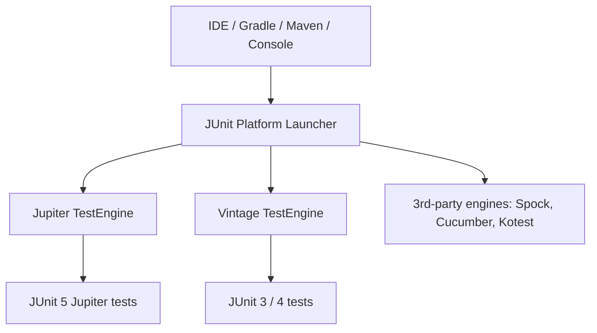

# JUnit 5: Lifecycle, Assertions & Extensions

JUnit 5 (released 2017) is a ground-up rewrite of the de-facto standard testing framework
for the JVM. It is **not** a single library but a modular platform, and it replaced JUnit
4's `@RunWith`/`@Rule`/`@ClassRule` machinery with a single, composable **extension model**.

This topic teaches the framework mechanics a backend/senior interview probes: the
architecture (Platform / Jupiter / Vintage), the test lifecycle and *instance* lifecycle,
the assertion and assumption APIs (plus AssertJ), conditional execution, and — the part
that separates seniors from juniors — how the extension model works and how you migrate a
JUnit 4 suite. Testing *principles* (pyramid, test doubles, TDD) live in sibling topics;
Spring's test slices (`@WebMvcTest`, `@DataJpaTest`, `@SpringBootTest`) live in the
`spring-boot`/`spring-core` domains and are only pointed to here.

> [!KEY-TAKEAWAY]
> JUnit 5 = **Platform** (launcher + `TestEngine` SPI) + **Jupiter** (the new programming
> and extension model) + **Vintage** (runs old JUnit 3/4 tests). The single biggest
> conceptual shift from JUnit 4 is that everything extra — `@Rule`, `@RunWith`, custom
> parameter injection — collapses into one **`Extension`** interface registered with
> `@ExtendWith` or `@RegisterExtension`.

---

## JUnit 5 architecture: Platform, Jupiter, and Vintage

JUnit 5 is three sub-projects that ship as separate artifacts:

| Sub-project | Role | Key artifacts |
|---|---|---|
| **JUnit Platform** | Foundation for *launching* test frameworks on the JVM. Defines the `TestEngine` SPI, the `Launcher` API, and console/IDE/build-tool integration. | `junit-platform-launcher`, `junit-platform-engine`, `junit-platform-console-standalone` |
| **JUnit Jupiter** | The new programming model (`@Test`, `@BeforeEach`, assertions…) **and** extension model. Ships its own `TestEngine`. | `junit-jupiter-api`, `junit-jupiter-engine`, `junit-jupiter-params` |
| **JUnit Vintage** | A `TestEngine` that runs legacy **JUnit 3 and 4** tests on the Platform, so you can migrate incrementally. | `junit-vintage-engine` |

**Why this split matters.** The Platform is a *contract*: any framework (Jupiter,
Vintage, Spock, Cucumber, ArchUnit, Kotest) can implement a `TestEngine` and be discovered
and run by the same Platform launcher, IDEs, and Gradle/Maven plugins. Before JUnit 5, the
runner (`@RunWith`) was the only extension point and it was *single* — you could not use a
Spring runner and a Mockito runner at once. The Platform + engine model breaks that
monopoly.



**Aggregator artifact.** `junit-jupiter` is a convenience POM that pulls in
`junit-jupiter-api`, `junit-jupiter-params`, and (at runtime) `junit-jupiter-engine`. In
build tools the *API* is a compile dependency and the *engine* is a runtime dependency —
your test code compiles only against the API, and the engine is discovered at run time.

> [!INTERVIEW]
> "What are the three parts of JUnit 5 and why is it split that way?" is the single most
> common opener. Answer: Platform (launch + engine SPI), Jupiter (new model), Vintage
> (legacy runner) — and the *why* is that the `TestEngine` SPI lets multiple frameworks run
> side by side on one platform, ending JUnit 4's single-`@RunWith` limitation.

---

## Test lifecycle: @BeforeAll, @BeforeEach, @AfterEach, @AfterAll

Jupiter defines four lifecycle callbacks around the `@Test` methods in a class:

| Annotation | Runs | JUnit 4 equivalent |
|---|---|---|
| `@BeforeAll` | Once, **before all** tests in the class | `@BeforeClass` |
| `@BeforeEach` | Before **each** `@Test` method | `@Before` |
| `@AfterEach` | After **each** `@Test` method | `@After` |
| `@AfterAll` | Once, **after all** tests in the class | `@AfterClass` |

```java
class OrderServiceTest {
    @BeforeAll  static void bootExpensiveResource() { /* start DB container once */ }
    @BeforeEach void freshFixture()  { /* new SUT + mocks per test */ }
    @Test        void placesOrder()  { /* ... */ }
    @AfterEach   void verifyNoLeaks(){ /* ... */ }
    @AfterAll   static void tearDown(){ /* stop container */ }
}
```

**Key rules:**

- With the **default** (per-method) instance lifecycle, `@BeforeAll`/`@AfterAll` **must be
  `static`** — there is no single instance to attach them to (see next section).
- `@BeforeEach`/`@AfterEach` are **instance** methods; they run for every test, giving each
  test a fresh, isolated fixture. This isolation is the whole point — shared mutable state
  between tests is the #1 cause of order-dependent flakiness.
- **Inheritance:** superclass `@BeforeAll`/`@BeforeEach` run **before** the subclass's;
  `@AfterEach`/`@AfterAll` run in **reverse** (subclass first, then superclass). They are
  *not* overridden — all inherited non-private callbacks execute.
- Callbacks that are `private` are silently not discovered; a common bug is a `private
  @BeforeEach` that never runs. Use package-private/`protected`.
- Return type must be `void`; a non-void `@BeforeEach` is a configuration error.

**Ordering when combined with extensions and `@Nested`** (outer → inner for "before",
inner → outer for "after"):

```
BeforeAllCallback (extensions)
  @BeforeAll
    BeforeEachCallback (extensions)
      @BeforeEach              ← for each test
        @Test
      @AfterEach
    AfterEachCallback (extensions)
  @AfterAll
AfterAllCallback (extensions)
```

> [!WARNING]
> A `@BeforeEach` that throws will **skip the `@Test`** but Jupiter still runs the matching
> `@AfterEach` (and `AfterEachCallback`s) so cleanup happens. Don't assume "before failed →
> nothing else runs."

---

## Test instance lifecycle: per-method vs per-class (@TestInstance)

By default, **Jupiter creates a new instance of the test class for every `@Test` method**
(`TestInstance.Lifecycle.PER_METHOD`). This guarantees test isolation: instance fields are
reset between tests, so one test cannot leak state into another.

```java
@TestInstance(TestInstance.Lifecycle.PER_CLASS)
class CounterTest {
    int calls;                         // survives across tests in PER_CLASS
    @BeforeAll void setup() { ... }    // NON-static allowed under PER_CLASS
}
```

| | `PER_METHOD` (default) | `PER_CLASS` |
|---|---|---|
| Instances created | one per `@Test` | one per class |
| `@BeforeAll`/`@AfterAll` | must be **`static`** | may be **non-static** |
| Instance-field isolation | full (reset each test) | none (shared) — risk of coupling |
| Use when | almost always | expensive per-instance setup, `@TestFactory`, non-static `@BeforeAll` desired |

**Why the default is per-method.** Isolation by construction. If you `PER_CLASS` and let
tests mutate shared fields, you reintroduce the ordering dependencies JUnit tries to
prevent — and Jupiter deliberately does **not** guarantee execution order unless you add
`@TestMethodOrder`.

**Setting it globally:** `junit.jupiter.testinstance.lifecycle.default = per_class` in
`junit-platform.properties` flips the default, but that's a big hammer; prefer the
annotation per class.

> [!TIP]
> `PER_CLASS` is what lets you write a non-static `@BeforeAll`, which is convenient when the
> setup needs injected fields (e.g., a `@RegisterExtension` instance field). It pairs
> naturally with `@TestInstance(PER_CLASS)` + `@Nested` + `@TestMethodOrder`.

---

## Structuring tests: @DisplayName, @Nested, @Tag

**`@DisplayName`** gives a test/class a human-readable name shown in reports and IDEs,
free of Java identifier rules (spaces, emoji, punctuation). `@DisplayNameGeneration` (e.g.
`ReplaceUnderscores`) can auto-generate them from method names.

```java
@DisplayName("Order checkout")
class CheckoutTest {
    @Test @DisplayName("rejects an empty cart with 400")
    void rejectsEmptyCart() { ... }
}
```

**`@Nested`** lets you group related tests into inner (non-static) classes to model a
context hierarchy ("given a logged-in user" → "when the cart is empty"). Outer
`@BeforeEach` methods run before inner ones, so nesting expresses shared setup naturally.

```java
class UserServiceTest {
    @Nested class WhenNew {
        @BeforeEach void createUser() { ... }
        @Test void isInactive() { ... }
    }
    @Nested class AfterActivation {
        @BeforeEach void activate() { ... }
        @Test void canLogin() { ... }
    }
}
```

- `@Nested` classes must be **non-static inner** classes (they hold a reference to the
  enclosing instance). A `static` nested class is treated as a top-level test class.

**`@Tag`** attaches string labels (`@Tag("slow")`, `@Tag("integration")`) used to
**filter** which tests run — e.g. `-DexcludedGroups=slow` in Maven Surefire, or
`includeTags("fast")` in Gradle. Tags are the JUnit 5 replacement for JUnit 4 Categories
and are how you split fast unit tests from slow integration tests in CI.

> [!TIP]
> Compose meta-annotations: define `@Fast` as `@Tag("fast") @Test` and reuse it. Jupiter
> annotations are `@Inherited`-style composable, which cuts boilerplate across a suite.

---

## Assertions: assertEquals, assertThrows, assertAll, assertTimeout

Jupiter's built-in assertions live in `org.junit.jupiter.api.Assertions` (static methods).
Key differences from JUnit 4:

- **Message is the *last* argument** (JUnit 4 put it first): `assertEquals(expected,
  actual, "message")`. The message can be a `Supplier<String>` so it's only built on
  failure (lazy — avoids expensive string construction on the happy path).
- No `assertThat` in the core API — Jupiter deliberately delegates rich matching to
  **AssertJ or Hamcrest** (next section).

**`assertThrows`** — asserts an exception is thrown and **returns** it so you can assert on
its message/cause:

```java
var ex = assertThrows(IllegalArgumentException.class, () -> service.parse("bad"));
assertEquals("unparseable", ex.getMessage());
```
(`assertThrowsExactly` requires the *exact* class, not a subclass.)

**`assertAll`** — groups independent assertions so **all** are evaluated and *all* failures
reported together (throws `MultipleFailuresError`), instead of stopping at the first:

```java
assertAll("point",
    () -> assertEquals(1, p.x()),
    () -> assertEquals(2, p.y()));   // both checked even if x fails
```
Use `assertAll` for asserting several properties of *one* object; do **not** use it to
stuff unrelated assertions into one test.

**`assertTimeout` vs `assertTimeoutPreemptively`** — a classic gotcha:

| | `assertTimeout` | `assertTimeoutPreemptively` |
|---|---|---|
| Thread | runs the code in the **calling** thread | runs it in a **separate** thread |
| On timeout | waits for the code to **finish**, then fails | **aborts** the code as soon as the limit is hit |
| `ThreadLocal` / transactions | preserved (same thread) | **broken** — separate thread; Spring `@Transactional`, `SecurityContext`, MDC do not propagate |

```java
assertTimeout(Duration.ofMillis(100), () -> mightBeSlow());          // waits, then fails
assertTimeoutPreemptively(Duration.ofMillis(100), () -> mightHang()); // kills at 100ms
```

> [!WARNING]
> `assertTimeoutPreemptively` runs your code in a **different thread**. Anything relying on
> thread-bound state — Spring's transactional test rollback, `ThreadLocal`, security
> context, SLF4J MDC — will misbehave. Prefer plain `assertTimeout` unless you specifically
> need to interrupt a hang.

Other essentials: `assertEquals/assertNotEquals`, `assertTrue/assertFalse`,
`assertNull/assertNotNull`, `assertSame/assertNotSame`, `assertArrayEquals`,
`assertIterableEquals`, `assertLinesMatch`, and `fail(...)`. Floating-point `assertEquals`
takes a **delta** — `assertEquals(0.3, a + b, 1e-9)`.

---

## AssertJ and Hamcrest fluent assertions

Because Jupiter's core assertions are intentionally minimal, most teams add a fluent
matcher library. **AssertJ** is the modern default:

```java
import static org.assertj.core.api.Assertions.assertThat;

assertThat(order.getItems())
    .hasSize(3)
    .extracting(Item::sku)
    .containsExactly("A", "B", "C");

assertThat(order.getTotal()).isCloseTo(new BigDecimal("42.00"), within(new BigDecimal("0.01")));

assertThatThrownBy(() -> service.parse("bad"))
    .isInstanceOf(IllegalArgumentException.class)
    .hasMessageContaining("unparseable");
```

**Why AssertJ over Hamcrest / core:**

- **Discoverable, chainable API** — IDE autocomplete after `assertThat(x).` shows every
  applicable matcher; no need to memorize static `Matcher` factories.
- **Rich failure messages** — `containsExactly` prints the missing/extra elements and index
  of first difference, far better than a bare `assertTrue(list.equals(...))`.
- **Type-specific assertions** for collections, `Optional`, streams, exceptions, dates,
  `BigDecimal`, files, etc.

**Hamcrest** (`assertThat(actual, is(equalTo(expected)))`) predates AssertJ and pairs
`Matcher` objects; it's still used (Spring MockMvc's `jsonPath(...).value(matcher)` takes
Hamcrest matchers) but is more verbose and less discoverable than AssertJ.

> [!TIP]
> A good assertion reads like the spec and fails with a message that tells you *what* was
> wrong. `assertTrue(list.contains(x))` fails with just "expected true but was false";
> `assertThat(list).contains(x)` names the element and prints the actual list. Prefer the
> latter.

---

## Assumptions: skipping tests when preconditions aren't met

**Assumptions** (`org.junit.jupiter.api.Assumptions`) express *preconditions* for a test.
If an assumption fails, the test is **aborted** (reported as *skipped*), **not failed**:

```java
import static org.junit.jupiter.api.Assumptions.*;

@Test void onlyOnCi() {
    assumeTrue("CI".equals(System.getenv("ENV")));   // aborts (skips) if not on CI
    // ... the rest only runs on CI
}

@Test void conditionalBlock() {
    assumingThat("prod".equals(env),
        () -> { /* extra checks only in prod */ });   // still runs the rest either way
}
```

| API | Behavior on false |
|---|---|
| `assumeTrue(cond)` / `assumeFalse(cond)` | **abort** the whole test (skipped) |
| `assumingThat(cond, executable)` | run `executable` **only if** true; the rest of the test runs regardless |

**Assumption vs assertion — the interview distinction:** an **assertion** failing means the
code is *wrong* (test fails, red). An **assumption** failing means the test is *not
applicable* in this environment (test skipped, not a failure). Use assumptions for
environment gating (OS, CI, external service availability); use them sparingly — a test
that's always skipped provides no signal and can hide regressions.

> [!WARNING]
> Overusing assumptions silently erodes coverage: a test `assumeTrue(dbAvailable())` that's
> skipped in CI because the DB was never started looks *green* but tested nothing. Prefer
> `@Disabled` with a reason, `@EnabledIf...` conditions, or Testcontainers so the
> precondition is actually met.

---

## Disabling and conditional test execution

**`@Disabled`** unconditionally skips a test or class, ideally **with a reason** (a
tracking ticket) so it's not forgotten:

```java
@Disabled("flaky until JIRA-1234 fixes the clock dependency")
@Test void computesExpiry() { ... }
```

**Conditional annotations** run/skip based on the environment (they're built on the
`ExecutionCondition` extension point):

| Annotation | Condition |
|---|---|
| `@EnabledOnOs(MAC)` / `@DisabledOnOs(WINDOWS)` | operating system |
| `@EnabledOnJre(JAVA_17)` / `@EnabledForJreRange(min=JAVA_17)` | JRE version |
| `@EnabledIfSystemProperty(named="env", matches="ci")` | system property regex |
| `@EnabledIfEnvironmentVariable(named="ENV", matches="CI")` | env-var regex |
| `@EnabledIf("methodName")` | custom boolean method |

**`@Disabled`/conditions vs assumptions:** conditions/`@Disabled` are **declarative** and
evaluated *before* the test instance is created — cleaner and visible in reports as
disabled with a reason. Assumptions are **imperative**, evaluated *inside* the test body,
useful when the precondition depends on runtime values you can only compute mid-test.

> [!TIP]
> Prefer a conditional annotation (`@EnabledOnOs`, `@EnabledIfEnvironmentVariable`) over an
> `assumeTrue(...)` at the top of a method: it self-documents in the test report and doesn't
> even instantiate the class when disabled.

---

## The Extension model: replacing @RunWith, @Rule, and @ClassRule

JUnit 4 had **three** competing extension mechanisms: `@RunWith` (one runner per class),
`@Rule`/`@ClassRule` (method/class interceptors), and `TestRule`/`MethodRule`. JUnit 5
unifies **all** of them into **one** `Extension` marker interface, with fine-grained
sub-interfaces you implement as needed. Crucially, a class can register **many**
extensions — no more single-runner limit.

| JUnit 4 | JUnit 5 |
|---|---|
| `@RunWith(SpringRunner.class)` | `@ExtendWith(SpringExtension.class)` |
| `@RunWith(MockitoJUnitRunner.class)` | `@ExtendWith(MockitoExtension.class)` |
| `@Rule TemporaryFolder` | `@TempDir` (built in) |
| `@Rule` / `@ClassRule` | custom `Extension` + `@ExtendWith`/`@RegisterExtension` |

**The main extension callback interfaces** (implement only what you need):

| Interface | Fires |
|---|---|
| `BeforeAllCallback` / `AfterAllCallback` | around all tests in a container |
| `BeforeEachCallback` / `AfterEachCallback` | around each test |
| `BeforeTestExecutionCallback` / `AfterTestExecutionCallback` | tightest wrap around the `@Test` body only |
| `ParameterResolver` | inject params into constructors/test/lifecycle methods |
| `TestInstancePostProcessor` | post-process the test instance (e.g., inject `@Mock` fields) |
| `ExecutionCondition` | enable/disable programmatically (powers `@Disabled`, `@EnabledOnOs`) |
| `TestExecutionExceptionHandler` | intercept/swallow/translate exceptions from a test |
| `TestWatcher` | observe test results (passed/failed/aborted/disabled) |

**`ParameterResolver`** is how `@Test void t(TestInfo info, TestReporter r)` works, and how
Mockito injects `@Mock` params or Spring injects beans as arguments.

**Callback ordering (the onion model):** for a given test, *before* callbacks run in
**registration order**, and *after* callbacks run in **reverse** — extensions wrap each
other like `try/finally` layers. Relative order of user code vs extensions:
`BeforeEachCallback` → `@BeforeEach` → `BeforeTestExecutionCallback` → **test** →
`AfterTestExecutionCallback` → `@AfterEach` → `AfterEachCallback`.

```java
public class TimingExtension implements BeforeTestExecutionCallback, AfterTestExecutionCallback {
    private static final Namespace NS = Namespace.create(TimingExtension.class);
    public void beforeTestExecution(ExtensionContext ctx) {
        ctx.getStore(NS).put("start", System.nanoTime());
    }
    public void afterTestExecution(ExtensionContext ctx) {
        long start = ctx.getStore(NS).get("start", long.class);
        System.out.printf("%s took %d ns%n", ctx.getDisplayName(), System.nanoTime() - start);
    }
}
```

**`ExtensionContext.Store`** is the sanctioned way to pass state between callbacks (keyed by
a `Namespace`), rather than instance fields — because a single extension instance may be
shared across many tests.

> [!INTERVIEW]
> "How does JUnit 5 replace `@Rule` and `@RunWith`?" → One `Extension` interface with
> focused callbacks (`BeforeEachCallback`, `ParameterResolver`, `TestInstancePostProcessor`,
> `ExecutionCondition`, `TestExecutionExceptionHandler`…), registered declaratively or
> programmatically, and **composable** — you can stack `SpringExtension` + `MockitoExtension`
> + your own, which JUnit 4's single `@RunWith` could not do.

---

## Extension registration: @ExtendWith vs @RegisterExtension

Three ways to register an extension:

**1. `@ExtendWith` — declarative.** Put it on a class, method, or a custom composed
annotation. You give the extension *class*; JUnit instantiates it. You **cannot configure**
the instance because you don't create it.

```java
@ExtendWith(MockitoExtension.class)
class OrderServiceTest { ... }
```

**2. `@RegisterExtension` — programmatic.** Annotate a **field** holding an extension
*instance* you create — so you can **configure it via its constructor/builder**:

```java
class HttpClientTest {
    @RegisterExtension
    static WireMockExtension wm = WireMockExtension.newInstance()
        .options(wireMockConfig().dynamicPort())
        .build();               // configured instance — impossible with @ExtendWith
}
```
- A **`static`** `@RegisterExtension` field participates in **class-level** callbacks
  (`BeforeAllCallback`); a **non-static** field participates only in **instance-level**
  callbacks (`BeforeEachCallback`).

**3. Automatic / global** via `ServiceLoader` (`junit.jupiter.extensions.autodetection.
enabled=true`) — registers extensions on the classpath for the whole suite (e.g. a
company-wide logging extension).

| | `@ExtendWith` | `@RegisterExtension` |
|---|---|---|
| Registration | declarative (class/method) | programmatic (field) |
| You provide | the extension **class** | an extension **instance** |
| Can configure the instance? | **no** | **yes** (constructor/builder) |
| Typical use | `SpringExtension`, `MockitoExtension` | WireMock, Testcontainers `@Container` when config is needed, anything parameterized |

> [!TIP]
> Rule of thumb: use `@ExtendWith` for zero-config extensions; reach for
> `@RegisterExtension` the moment you need to *configure* the extension (ports, options,
> builders) or register multiple differently-configured instances of the same extension in
> one class.

---

## Migrating from JUnit 4 to JUnit 5

You rarely migrate a large suite in one shot. Strategy:

1. **Run both at once.** Add the **`junit-vintage-engine`** alongside `junit-jupiter-engine`.
   Vintage runs your existing JUnit 3/4 tests on the Platform unchanged, so you migrate
   test-by-test while everything stays green.
2. **Swap the annotations** (they moved packages and some renamed):

| JUnit 4 (`org.junit`) | JUnit 5 (`org.junit.jupiter.api`) |
|---|---|
| `@Test` | `@Test` (different package; no `expected`/`timeout` attributes) |
| `@Before` / `@After` | `@BeforeEach` / `@AfterEach` |
| `@BeforeClass` / `@AfterClass` | `@BeforeAll` / `@AfterAll` |
| `@Ignore` | `@Disabled` |
| `@Category` | `@Tag` |
| `@RunWith(X.class)` | `@ExtendWith(XExtension.class)` |
| `@Rule` / `@ClassRule` | `Extension` + `@RegisterExtension`/`@ExtendWith` |
| `Assert.assertEquals(msg, exp, act)` | `assertEquals(exp, act, msg)` — **message moved to last** |
| `@Test(expected=E.class)` | `assertThrows(E.class, …)` |
| `@Test(timeout=100)` | `assertTimeout(Duration…, …)` or `@Timeout` |

3. **Beware behavioral traps:** the assertion **message argument moved from first to last**
   — a silent bug if code compiles by coincidence; there's **no method-level `@Test(expected)`
   / `timeout`**; `@RunWith` runners (Spring, Mockito) need their JUnit 5 extension
   equivalents; and JUnit 4 `@Rule`s have no automatic conversion.

> [!WARNING]
> The `assertEquals(message, expected, actual)` → `assertEquals(expected, actual, message)`
> reordering is the classic migration bug. If your "message" happens to be assignment-
> compatible, the test silently compares the wrong things. Grep for 3-arg assertions during
> migration.

---

## Common follow-up questions

- **What are the three modules of JUnit 5 and why?** Platform (launcher + `TestEngine`
  SPI), Jupiter (new programming/extension model + its engine), Vintage (runs JUnit 3/4).
  The SPI lets many engines run on one platform, ending JUnit 4's single-`@RunWith` limit.
- **Why is `@BeforeAll` usually `static`?** Because the default per-method instance
  lifecycle has no single instance to bind it to; it must belong to the class. `@TestInstance
  (PER_CLASS)` creates one instance for the class and lets `@BeforeAll` be non-static.
- **`assertTimeout` vs `assertTimeoutPreemptively`?** The former runs in the calling thread
  and waits then fails; the latter runs in a separate thread and aborts on timeout — which
  breaks `ThreadLocal`/transactional/security-context state.
- **How do you assert on a thrown exception?** `assertThrows` returns the exception; assert
  on its message/cause. Or AssertJ's `assertThatThrownBy(...).hasMessageContaining(...)`.
- **Assertion vs assumption?** Failed assertion = test *fails* (bug). Failed assumption =
  test *aborted/skipped* (not applicable here). Don't hide missing coverage behind
  assumptions.
- **How do you make several assertions all report together?** `assertAll(...)` — evaluates
  every executable and throws a `MultipleFailuresError` with all failures.
- **`@ExtendWith` vs `@RegisterExtension`?** Declarative (class you can't configure) vs
  programmatic (field instance you *can* configure via builder/constructor).
- **How would you migrate a JUnit 4 suite?** Add `junit-vintage-engine` to run both, migrate
  test-by-test, swap annotations, and watch the reordered assertion message and the loss of
  `@Test(expected/timeout)`.
- **How do you split fast vs slow tests in CI?** `@Tag` them and include/exclude tags in
  Surefire/Gradle; or use conditional annotations for environment gating.

## References

- JUnit 5 User Guide — https://docs.junit.org/current/user-guide/
- JUnit 5 Assertions API (`org.junit.jupiter.api.Assertions`) — https://docs.junit.org/current/api/org.junit.jupiter.api/org/junit/jupiter/api/Assertions.html
- JUnit 5 Extension model — https://docs.junit.org/current/user-guide/#extensions
- Test instance lifecycle — https://docs.junit.org/current/user-guide/#writing-tests-test-instance-lifecycle
- Migrating from JUnit 4 — https://docs.junit.org/current/user-guide/#migrating-from-junit4
- AssertJ documentation — https://assertj.github.io/doc/
- Mockito JUnit 5 extension — https://javadoc.io/doc/org.mockito/mockito-junit-jupiter/latest/
- Martin Fowler, "Mocks Aren't Stubs" — https://martinfowler.com/articles/mocksArentStubs.html
