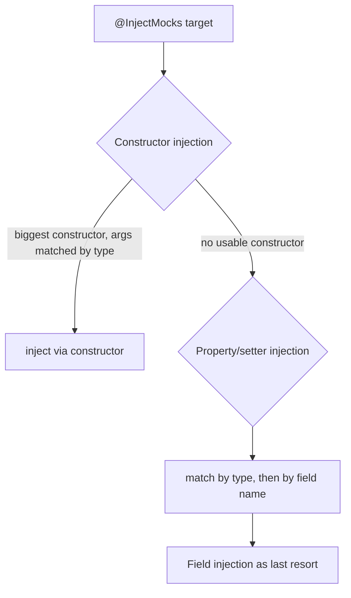

# Mockito & Stubbing Frameworks

A **mocking framework** lets you replace a class-under-test's collaborators with
programmable **test doubles** so a unit test can run in isolation, deterministically,
and fast. **Mockito** is the de-facto standard on the JVM: it generates mock objects at runtime
via ByteBuddy — the classic *subclass* mock-maker creates a dynamic subclass of the
type (so it can't touch `final`/`static`/`private`), while the *inline* mock-maker
(ByteBuddy plus a Java instrumentation agent, the default since 5.x) can. Either way the
generated object records every interaction, lets you **stub** return values/exceptions,
and later **verify** that the expected calls happened. This topic covers Mockito's core API — mock/spy creation, stubbing, argument
matchers, verification, ArgumentCaptor, strictness, spies, mocking statics/finals, and
BDDMockito — plus the discipline of *what not to mock*.

> [!KEY-TAKEAWAY]
> Mockito is two tools in one: a **stubbing** engine (`when(...).thenReturn(...)` —
> "make this collaborator return X") and a **verification** engine
> (`verify(mock).method()` — "assert this collaborator was called"). Confusing the two,
> or over-using verification, produces brittle tests coupled to implementation.

This guide targets **Mockito 5.x** (Java 11+, inline mock-maker by default) and
**JUnit 5 (Jupiter)**. Where behavior changed across major versions (strictness in 3.x,
inline-by-default in 5.x) it is called out. For the general test-double taxonomy
(dummy/stub/spy/mock/fake) see `test-doubles-and-mocking-taxonomy`; for Spring-specific
mocking (`@MockitoBean`/`@MockBean`) see `spring-boot/testing-spring-boot-applications`.

---

## Mock, spy, and the role of a mocking framework

A **mock** is an object with the same type as a real collaborator but **no real
behavior** — every method returns a default (`null`, `0`, `false`, empty collection)
until you stub it. A **spy** wraps a **real** object: calls run the real method unless
you stub them. Mockito manufactures both dynamically at runtime, so you never hand-write
a fake class.

| Double | Real code runs? | Default return | Use when |
|---|---|---|---|
| `mock(Foo.class)` | No | type default (null/0/false/empty) | You want full control; collaborator is slow, non-deterministic, or has side effects |
| `spy(realFoo)` | **Yes**, unless stubbed | delegates to real method | You want mostly-real behavior but override one or two methods (partial mock) |

```java
List<String> mock = mock(List.class);
mock.add("x");                 // does nothing real
assertThat(mock.size()).isZero();   // unstubbed -> default 0, "x" not stored

List<String> spy = spy(new ArrayList<>());
spy.add("x");                  // real ArrayList.add runs
assertThat(spy.size()).isOne();     // real state
```

**Why it matters:** mocks isolate the unit under test so a failure points at *your*
code, not a collaborator; they also make otherwise-untestable paths (a repository
throwing `SQLException`, a clock at a fixed instant) trivially reproducible.

**Advanced:** Mockito records interactions in an `InvocationContainer` per mock. A mock
has *no* real identity beyond its type — `equals` and `hashCode` **cannot be stubbed**
(Mockito uses them internally for its own bookkeeping), so a mock keeps reference
identity/`equals` semantics. Mockito's
default answer is `RETURNS_DEFAULTS` (via `ReturnsEmptyValues`), which is why unstubbed
methods never return `null` for collections/`Optional` — they return empties.

> [!TIP]
> `mock(Foo.class, RETURNS_DEEP_STUBS)` auto-stubs chained calls
> (`a.getB().getC()`), and `mock(Foo.class, CALLS_REAL_METHODS)` behaves spy-like without
> a real instance. Use sparingly — deep stubs usually signal a Law-of-Demeter smell.

---

## Creating mocks: @Mock, @Spy, @InjectMocks, and MockitoExtension

You can create mocks programmatically (`mock()`, `spy()`) or declaratively with
annotations. Annotations need an **initializer** to process them. In JUnit 5 the
idiomatic way is the **`MockitoExtension`**:

```java
@ExtendWith(MockitoExtension.class)
class OrderServiceTest {
    @Mock OrderRepository repo;          // a fresh mock per test method
    @Spy  AuditLog audit = new AuditLog();
    @InjectMocks OrderService service;   // Mockito injects repo + audit into this

    @Test void placesOrder() {
        when(repo.save(any())).thenReturn(new Order(1L));
        service.place(new Cart());
        verify(audit).record(any());
    }
}
```

Alternatives to the extension:
- `MockitoAnnotations.openMocks(this)` in an `@BeforeEach` (returns a closeable; older
  `initMocks` is deprecated).
- `@RunWith(MockitoJUnitRunner.class)` — **JUnit 4 only**.

**`@InjectMocks`** tells Mockito to instantiate the target and inject the other
`@Mock`/`@Spy` fields. Resolution order:



**Gotchas interviewers probe:**
- `@InjectMocks` **never fails loudly** if it can't inject a field — the field stays
  `null`, and you get an NPE at runtime. Prefer **constructor injection** in production
  code and just `new` the object in tests to sidestep this magic.
- When two `@Mock` fields have the **same type**, Mockito falls back to matching by
  **field name**; a mismatch silently injects the wrong one.
- `@InjectMocks` does **not** inject into a mock — the target is a real instance.

---

## Stubbing with when/thenReturn, thenThrow, and thenAnswer

**Stubbing** programs a mock's response. The canonical form is
`when(mock.method(args)).thenReturn(value)`:

```java
when(repo.findById(1L)).thenReturn(Optional.of(user));
when(repo.findById(2L)).thenThrow(new EntityNotFoundException());
when(clock.instant()).thenReturn(Instant.parse("2026-01-01T00:00:00Z"));
```

| Stub method | Effect |
|---|---|
| `thenReturn(v)` | Return `v`. Multiple values → consecutive calls: `thenReturn(a, b)` returns `a` then `b`, then `b` forever |
| `thenThrow(ex)` | Throw. Checked exceptions must be declared on the method's signature |
| `thenAnswer(inv -> ...)` | Compute the result from the actual arguments (`inv.getArgument(0)`) |
| `thenCallRealMethod()` | Delegate to the real implementation (rare on a mock) |
| `.then(...)` | Alias of `thenAnswer` |

**`thenReturn` vs `thenAnswer`:** `thenReturn` is evaluated **once, eagerly, at stub
time** — `thenReturn(list.get(0))` captures a value now. `thenAnswer` is a lambda
evaluated **on each call**, so it can echo inputs (`inv -> inv.getArgument(0)`) or vary
per invocation. Use `thenAnswer` for identity/echo behavior and stateful mocks.

```java
when(repo.save(any(User.class)))
    .thenAnswer(inv -> {                 // return the saved entity with an id
        User u = inv.getArgument(0);
        return u.withId(42L);
    });
```

**Consecutive stubbing** models sequences — e.g. a flaky call that fails then succeeds:

```java
when(gateway.charge(any()))
    .thenThrow(new TimeoutException())   // 1st call
    .thenReturn(Receipt.ok());           // 2nd call onward
```

> [!WARNING]
> `when(...)` calls the mock method for real to capture the invocation. On a **spy**
> that triggers the real method — see the doReturn gotcha below. Also, you can only stub
> a **method return**; you cannot stub `void` with `when(...)` — use
> `doThrow(...).when(mock).voidMethod()` / `doNothing()` for void methods.

---

## Argument matchers and the can't-mix-raw-and-matchers rule

By default a stub matches by `equals`. **Argument matchers** relax or widen matching:

| Matcher | Matches |
|---|---|
| `any()` / `any(T.class)` | any value; `any(T.class)` matches non-null of that type (Mockito 2+) |
| `anyInt()`, `anyString()`, `anyList()` | any value of the primitive/type (**not null** for reference overloads) |
| `eq(value)` | exactly `value` (needed to mix with other matchers) |
| `isNull()` / `isNotNull()` / `nullable(T.class)` | null-ness constraints |
| `argThat(predicate)` | custom `ArgumentMatcher<T>` — arbitrary condition |
| `contains`, `startsWith`, `matches(regex)` | string matchers |

**The rule that trips everyone up:** *if you use a matcher for **one** argument, you must
use matchers for **all** arguments.* Mixing a raw value with a matcher throws
`InvalidUseOfMatchersException`:

```java
// BROKEN: raw 1L mixed with any()
when(repo.update(1L, any())).thenReturn(true);      // InvalidUseOfMatchersException
// FIX: wrap the literal in eq()
when(repo.update(eq(1L), any())).thenReturn(true);  // OK
```

**Why:** matchers work via **side effects** — each matcher call pushes a matcher onto a
thread-local stack; Mockito pops them when the stubbed method is invoked. A raw value
pushes nothing, so the stack count no longer lines up with the argument count, and
Mockito detects the mismatch (or, worse, misassigns matchers). This same mechanism is
why you can't extract a matcher into a variable used across arguments.

> [!TIP]
> `anyString()`, `anyList()` etc. do **not** match `null` in Mockito 2+. Use
> `nullable(String.class)` or `isNull()` when the argument may be null. `any()` (no
> class) *does* match null.

For a custom matcher, `argThat` takes a lambda; for reuse, implement `ArgumentMatcher<T>`
and give it a `toString()` for readable failure messages.

---

## Verifying interactions: times, never, atLeast, inOrder

**Verification** asserts that an interaction happened (behavior verification), as opposed
to asserting state. `verify(mock).method()` checks the method was called **exactly once**
by default.

```java
verify(repo).save(order);                      // exactly once (times(1))
verify(repo, times(3)).save(any());            // exactly 3 times
verify(repo, never()).delete(any());           // 0 times
verify(repo, atLeastOnce()).findById(1L);      // >= 1
verify(repo, atLeast(2)).findById(any());      // >= 2
verify(repo, atMost(5)).findById(any());       // <= 5
verify(repo, timeout(100)).flush();            // async: wait up to 100ms
```

| Verifier | Meaning |
|---|---|
| `times(n)` | exactly n calls |
| `never()` | equivalent to `times(0)` |
| `atLeast(n)` / `atLeastOnce()` | at least n |
| `atMost(n)` | at most n |
| `only()` | this is the *only* method called on the mock |
| `verifyNoInteractions(mock)` | mock was never touched |
| `verifyNoMoreInteractions(mock)` | no un-verified calls remain (use sparingly — brittle) |

**Order-sensitive** verification uses `InOrder`:

```java
InOrder inOrder = inOrder(repo, gateway);
inOrder.verify(gateway).charge(any());
inOrder.verify(repo).save(any());      // fails if save happened before charge
```

**Advanced / gotchas:**
- `verifyZeroInteractions` is **deprecated** — use `verifyNoInteractions`.
- `verifyNoMoreInteractions` is a common source of **fragile tests**: adding any
  harmless call later breaks unrelated tests. Prefer verifying the specific interactions
  you care about.
- **Don't verify what you already stubbed** just to be safe — under STRICT_STUBS a stub
  that is exercised needs no separate `verify`. Verify only *outputs to collaborators*
  that have no return value observed elsewhere (classic "command" calls).

> [!INTERVIEW]
> "When do you `verify` vs assert on state?" Verify **outgoing commands** with no return
> value you can otherwise observe (e.g. `emailSender.send(...)`). For **queries** that
> return a value, stub them and assert on the result — verifying a query is redundant and
> couples the test to how many times you happened to call it.

---

## Capturing arguments with ArgumentCaptor

An **`ArgumentCaptor`** grabs the actual argument passed to a mock so you can assert on
it *after* the call — useful when the argument is constructed inside the unit under test.

```java
@Captor ArgumentCaptor<Order> orderCaptor;   // or ArgumentCaptor.forClass(Order.class)

service.place(cart);

verify(repo).save(orderCaptor.capture());
Order saved = orderCaptor.getValue();
assertThat(saved.total()).isEqualByComparingTo("42.00");
assertThat(saved.status()).isEqualTo(NEW);
```

For multiple calls use `getAllValues()` (returns a `List` in call order).

**Captor vs `argThat`:**

| | `ArgumentCaptor` | `argThat` matcher |
|---|---|---|
| When it asserts | **After** the call, in the test body | **During** matching |
| Failure message | Rich AssertJ/JUnit assertions on captured value | Terse "argument did not match" |
| Best for | **Verifying** complex arguments after the fact | **Stubbing** conditionally on the argument |
| Multiple fields | Easy — assert each | Awkward — one boolean |

> [!TIP]
> Prefer a captor for **verification** of a rich object and `argThat`/`eq` for
> **stubbing**. Using a captor during stubbing works but reads poorly. Since Mockito 5,
> `@Captor` and `ArgumentCaptor` are fully generic/type-aware, so you rarely need raw
> types or `@SuppressWarnings`.

---

## Strictness: STRICT_STUBS and UnnecessaryStubbingException

**Strictness** controls how Mockito reacts to stubs that don't line up with actual calls.
Since **Mockito 2.x** the `MockitoExtension` (and `MockitoJUnitRunner.Strict`) default to
**`Strictness.STRICT_STUBS`**, which:

1. Throws **`UnnecessaryStubbingException`** at the end of the test if a stub was declared
   but **never used** — dead stubs signal a copy-paste or a test that no longer tests what
   it says.
2. Throws **`PotentialStubbingProblem`** when a stubbed method is called with **different
   arguments** than were stubbed — usually a real bug or a wrong matcher.
3. Reports **argument mismatches** with helpful diffs.

```java
// STRICT_STUBS
when(repo.findById(1L)).thenReturn(Optional.of(a));
service.load(2L);   // calls findById(2L) -> PotentialStubbingProblem
// and if findById is never called at all -> UnnecessaryStubbingException
```

| Strictness | Behavior |
|---|---|
| `LENIENT` | No complaints; legacy behavior. Silent unused stubs |
| `WARN` | Prints warnings (old `MockitoJUnitRunner` default) |
| `STRICT_STUBS` | **Default** for extension/runner; fails on unused stubs & arg mismatch |

**Escape hatches** when a stub *legitimately* isn't always used (e.g. shared setup across
parameterized tests):

```java
lenient().when(repo.ping()).thenReturn(true);      // per-stub
@Mock(lenient = true) Repo repo;                    // per-mock
@MockitoSettings(strictness = Strictness.LENIENT)   // per-class
```

**Why it matters:** STRICT_STUBS catches whole classes of test rot — stubs that no longer
match production call sites, and "just in case" stubs that give false confidence. It makes
tests fail *fast and locally*.

> [!WARNING]
> Reaching for `lenient()` to silence an `UnnecessaryStubbingException` is usually the
> wrong fix — the exception is telling you the stub is dead. Delete the stub instead,
> unless it is genuinely shared conditional setup.

---

## Spies: partial mocking and the doReturn-vs-when gotcha

A **spy** delegates to the real object, so calling `when(spy.method())` **executes the
real method** while Mockito tries to record the stub. If that real method has side effects
or throws (e.g. `get(0)` on an empty list → `IndexOutOfBoundsException`), your *stub setup*
blows up before the stub is even installed.

```java
List<String> spy = spy(new ArrayList<>());

// BROKEN: real get(0) runs during stubbing -> IndexOutOfBoundsException
when(spy.get(0)).thenReturn("x");

// FIX: doReturn/when never calls the real method
doReturn("x").when(spy).get(0);            // OK
```

**Rule:** on **spies** (and for **void** methods, and when you deliberately want to skip
the real call), use the **`doReturn`/`doThrow`/`doAnswer`/`doNothing`… .when(mock)** family
— the argument to `.when()` is *not* invoked for real.

| Style | Calls real method during stubbing? | Use for |
|---|---|---|
| `when(mock.m()).thenReturn(x)` | Yes (mock's default is a no-op, so harmless on a pure mock) | Pure mocks, non-void methods |
| `doReturn(x).when(mock).m()` | **No** | Spies, void methods, avoiding side effects |

Other spy caveats:
- A spy holds a **copy** of the real object's state? No — it wraps the instance, but
  Mockito **cannot** intercept calls the real object makes to its **own** methods
  (self-invocation): if `real.a()` internally calls `this.b()`, stubbing `spy.b()` has
  **no effect** on that internal call, because the real method calls `this`, not the spy.
- Prefer redesigning toward a proper mock over a spy; a spy usually signals the collaborator
  is doing too much or the seam is wrong.

---

## Mocking statics, finals, and constructors

Historically Mockito could not mock `static`, `final`, or `private` methods, nor
constructors — the classic subclass mock-maker can't override them. The **inline
mock-maker** (bytecode instrumentation via ByteBuddy) can.

- **Mockito 2/3/4:** add the separate **`mockito-inline`** artifact (or a
  `mockito-extensions/org.mockito.plugins.MockMaker` file) to enable inline mocking.
- **Mockito 5+:** the **inline mock-maker is the default** — `mockito-core` alone mocks
  finals and statics; no extra artifact. (If you *need* the old subclass maker — e.g.
  GraalVM native image — you add `mockito-subclass`.) Minimum Java is 11.

```java
try (MockedStatic<UUID> uuid = mockStatic(UUID.class)) {
    uuid.when(UUID::randomUUID).thenReturn(FIXED_ID);
    assertThat(idService.next()).isEqualTo(FIXED_ID);
}   // static stub is torn down at end of try-with-resources

try (MockedConstruction<HttpClient> mc = mockConstruction(HttpClient.class,
        (mock, ctx) -> when(mock.send(any())).thenReturn(okResponse))) {
    // any `new HttpClient()` inside this block returns a mock
    service.callOut();
}
```

**Critical gotchas:**
- `MockedStatic`/`MockedConstruction` are **scoped and thread-local** — always use
  **try-with-resources** (or register/deregister) so the static stub doesn't leak into
  other tests and cause flaky failures. Leaking a static mock is a classic cross-test
  contamination bug.
- Static mocking is registered **per thread** — a static call on another thread inside the
  block is not mocked.
- Needing to mock statics often points at a design smell (hard-wired `Instant.now()`,
  `UUID.randomUUID()`). Injecting a `Clock`/`Supplier<UUID>` is usually cleaner and avoids
  the inline maker entirely.

> [!WARNING]
> You still **cannot** mock `private` methods directly, nor `equals`/`hashCode` reliably,
> and you should not mock `static` methods of JDK types you don't own casually — prefer
> injecting a seam. `final` fields/classes are mockable under the inline maker but that's
> a capability, not a license.

---

## BDDMockito: given/willReturn

**`BDDMockito`** is a thin alias layer that renames Mockito's API to
**given/when/then** (Behavior-Driven Development) vocabulary so tests read as
Arrange-Act-Assert. It is functionally identical to classic Mockito.

```java
import static org.mockito.BDDMockito.*;

// given (arrange)
given(repo.findById(1L)).willReturn(Optional.of(user));
// when (act)
User result = service.load(1L);
// then (assert)
then(repo).should().findById(1L);           // == verify(repo).findById(1L)
then(repo).should(never()).delete(any());
```

| Classic Mockito | BDDMockito equivalent |
|---|---|
| `when(x).thenReturn(v)` | `given(x).willReturn(v)` |
| `when(x).thenThrow(e)` | `given(x).willThrow(e)` |
| `when(x).thenAnswer(a)` | `given(x).willAnswer(a)` |
| `doReturn(v).when(m).x()` | `willReturn(v).given(m).x()` |
| `verify(m).x()` | `then(m).should().x()` |

**Why:** purely stylistic — it aligns the stub keyword (`given`) with the "Given" of a
BDD scenario. Many teams standardize on it because "given/should" reads more naturally in
the Arrange/Assert phases than "when/verify". No behavioral difference, same strictness
rules apply.

---

## What not to mock

Mocking is a tool with a cost: every mock **couples the test to the interaction shape** of
a collaborator, and over-mocking produces tests that pass while the system is broken.
Guidelines interviewers look for:

| Don't mock | Why | Do instead |
|---|---|---|
| **Value objects / DTOs** (`Money`, `LocalDate`, records, `String`) | They have no behavior worth faking; construction is cheap | Use the **real** object |
| **Types you don't own** (third-party/JDK classes) | You'd hard-code assumptions about *their* API that may be wrong; upgrades break silently | Wrap them in an adapter you own and mock **that** |
| **The class under test** | You'd be testing the mock, not the code | Test the real instance |
| **Simple collections / data holders** | Real ones are trivial and correct | Use real `List`/`Map` |
| **Everything, to reach 100% isolation** | Yields "mockery" tests coupled to implementation, high maintenance, low bug-catching | Prefer real collaborators (sociable unit tests) where cheap; mock only slow/nondeterministic/side-effecting seams |

**"Don't mock what you don't own"** (Steve Freeman & Nat Pryce, *GOOS*): mocking a
third-party API bakes your *assumptions* about its behavior into the test. If the library
behaves differently (or an upgrade changes it), the mock still passes but production
fails. Instead, define a **thin adapter interface** that you own, mock the adapter in unit
tests, and cover the adapter itself with an **integration/contract test** against the real
dependency.

> [!INTERVIEW]
> A frequent senior-level probe: "Your tests are green but a bug shipped — why?" A strong
> answer names **over-mocking**: mocks encode assumed behavior, so a test can be perfectly
> green while the mocked assumption diverges from reality. The fix is fewer, better-placed
> mocks plus integration/contract tests at the seams you don't own.

---

## Common follow-up questions

- **Why does `when(spy.get(0))` throw but `doReturn(...).when(spy).get(0)` doesn't?**
  `when(...)` evaluates its argument, which runs the real method on a spy; the
  `doReturn(...).when(spy)` form never invokes the real method.
- **My test fails with `InvalidUseOfMatchersException` — why?** You mixed a raw value with
  a matcher in the same call. Wrap literals in `eq(...)`; all args must be matchers or all
  raw.
- **What is `UnnecessaryStubbingException` telling me?** Under STRICT_STUBS you declared a
  stub that no test path exercised. Delete the dead stub, or mark it `lenient()` only if it
  is legitimate shared conditional setup.
- **`@InjectMocks` field is null at runtime — why?** Mockito couldn't match a field for
  injection (type/name mismatch) and injection fails silently. Prefer constructor injection
  and plain `new` in tests.
- **How do I stub a `void` method?** `doNothing()/doThrow()/doAnswer().when(mock).voidM()` —
  you cannot use `when(mock.voidM())`.
- **Do I still need `mockito-inline` to mock statics?** Not on Mockito 5+ (inline is
  default). On 2–4 you add the `mockito-inline` artifact.
- **`thenReturn` vs `thenAnswer`?** `thenReturn` fixes a value at stub time; `thenAnswer`
  is a lambda run per call that can read the actual arguments.
- **When do you verify vs assert state?** Verify commands (side-effecting, void); assert
  state/returned values for queries.
- **Is BDDMockito more powerful than plain Mockito?** No — pure syntax alias
  (given/willReturn/then-should).

---

## References

- Mockito Javadoc / User Manual — `org.mockito.Mockito` (main reference), `BDDMockito`,
  `ArgumentCaptor`, `MockedStatic`, `MockedConstruction`, `Strictness`.
- Mockito 5.0.0 release notes — inline mock-maker made default, minimum Java 11,
  `mockito-subclass` for the legacy maker.
- "What's new in Mockito 2" (Mockito wiki) — mock-maker engine switched from CGLIB to
  ByteBuddy; `anyX()` / `any(SomeType.class)` matchers changed to reject `null` and
  check type (only bare `any()` still matches `null`).
- Mockito wiki: "How to write good tests", "Using Mockito with JUnit 5",
  "Strict stubbing", "Mocking Object Methods".
- JUnit 5 User Guide — `@ExtendWith`, extension model (for `MockitoExtension`).
- Martin Fowler, *Mocks Aren't Stubs* — stub vs mock, state vs behavior verification,
  classicist vs mockist styles.
- Steve Freeman & Nat Pryce, *Growing Object-Oriented Software, Guided by Tests* —
  "don't mock what you don't own", mock roles not objects.
