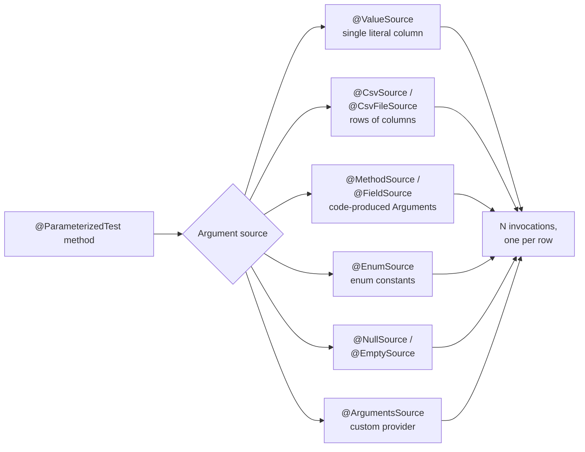
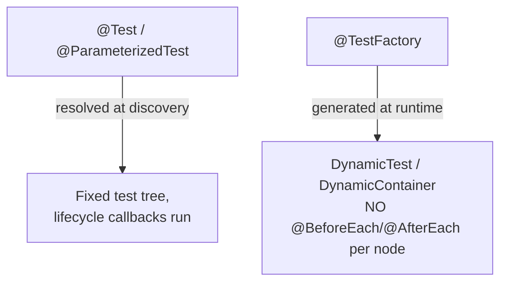
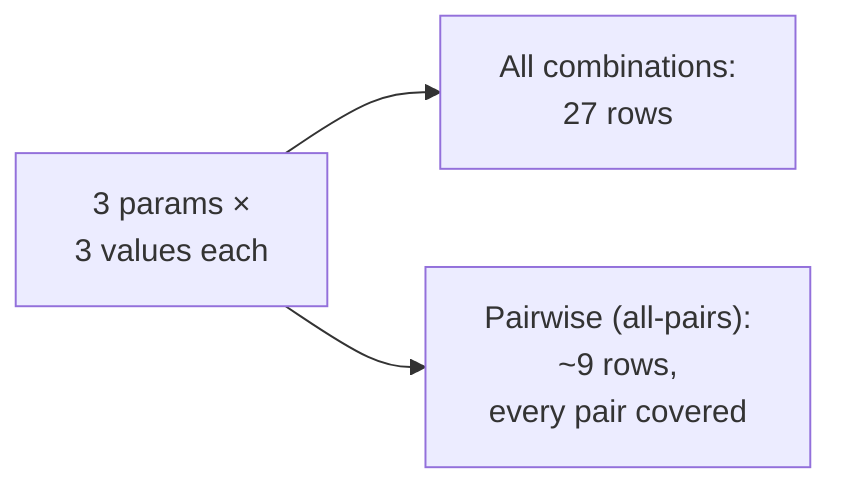

# Parameterized, Dynamic & Property-Based Tests

Most bugs hide in the *inputs you didn't type out by hand*. This topic is about
techniques that let one piece of test logic run against **many inputs**, or even
against **inputs the machine invents for you**:

- **Parameterized tests** — one test method, a table of input rows (JUnit 5
  `@ParameterizedTest` with `@ValueSource`/`@CsvSource`/`@MethodSource`/…). The
  classic "data-driven" pattern.
- **Dynamic tests** — tests *generated at runtime* from data you compute while the
  test runs (JUnit 5 `@TestFactory` returning `DynamicTest` nodes).
- **Property-based tests** — you assert a *property/invariant* that must hold for
  **all** inputs; the framework (jqwik, QuickCheck, Hypothesis) generates hundreds
  of random inputs and **shrinks** any failure to a minimal counterexample.
- **Combinatorial / pairwise** techniques to keep the input explosion manageable.

These are language-agnostic ideas; the concrete examples use **JUnit 5 (Jupiter)**
and **jqwik** to match this library's JVM stack. Interviewers use this area to
separate people who write three copy-pasted `@Test` methods from people who think
in terms of *equivalence classes, boundaries, and invariants*.

> [!KEY-TAKEAWAY]
> Example-based tests prove your code works for the cases *you thought of*.
> Property-based tests attack the cases *you didn't*. Parameterized tests are the
> cheap, readable way to cover a known table of cases without duplication.

> [!INTERVIEW]
> Spring-specific slices (`@WebMvcTest`, `@DataJpaTest`, `@SpringBootTest`) live in
> the `spring-boot`/`spring-core` testing topics. Here we own the *general*
> technique — how to feed many inputs into any test — independent of Spring.

---

## Why parameterized and data-driven tests

The problem they solve is **duplication of test logic across inputs**. Without
them you either copy-paste a `@Test` per case (bad: drifts, hard to add a case) or
loop inside one test (bad: first failing assertion stops the loop and you lose the
other results; a single "pass/fail" hides *which* input broke).

A **data-driven test** separates the *test logic* from the *test data*. The data
is a table of rows; each row is an independent test invocation with its own
pass/fail, its own name, and its own entry in the report.

```java
// BAD: three near-identical tests, logic duplicated
@Test void rejectsNegative() { assertThrows(IllegalArgumentException.class, () -> sqrt(-1)); }
@Test void rejectsNegative2(){ assertThrows(IllegalArgumentException.class, () -> sqrt(-5)); }

// GOOD: one logic, a table of inputs, independent invocations
@ParameterizedTest
@ValueSource(ints = {-1, -5, -100, Integer.MIN_VALUE})
void rejectsNegative(int n) {
    assertThrows(IllegalArgumentException.class, () -> sqrt(n));
}
```

**Why it matters in interviews:** the technique is a vehicle for good test
*design*. You pick inputs by **equivalence partitioning** (one representative per
class of behavior) and **boundary-value analysis** (values at and around edges:
0, 1, max, max+1, empty, null). A parameterized test makes those chosen values
explicit and greppable.

**Key property:** each row is a **separate invocation**. If row 3 fails, rows 4–10
still run and report independently — unlike a `for` loop inside one `@Test`, where
the first failed assertion aborts the rest.

| Approach | Independent pass/fail per case? | Easy to add a case? | Shows which input failed? |
|---|---|---|---|
| Copy-pasted `@Test` methods | yes | no (copy + edit) | yes |
| `for` loop inside one `@Test` | **no** (first failure aborts) | yes | only if you build the message |
| **`@ParameterizedTest`** | **yes** | **yes** (add a row) | **yes** (per-invocation name) |

---

## @ParameterizedTest and the argument sources

`@ParameterizedTest` (from `org.junit.jupiter.params`, requires the
`junit-jupiter-params` artifact) **replaces** `@Test` — you use one *or* the other,
never both on the same method. It must be paired with **at least one argument
source** that supplies the values for the method parameters.



The built-in sources:

| Source | Supplies | Best for |
|---|---|---|
| `@ValueSource` | a single column of literals (`ints`, `longs`, `doubles`, `strings`, `classes`, …) | one-parameter tests |
| `@NullSource` / `@EmptySource` / `@NullAndEmptySource` | `null` and/or empty (String, collection, array, map) | null/empty edge cases |
| `@EnumSource` | enum constants (all, or a filtered subset) | exhaustively covering an enum |
| `@CsvSource` | inline CSV rows → multiple typed columns | small hand-written tables |
| `@CsvFileSource` | CSV rows from a classpath/file resource | large external datasets |
| `@MethodSource` | a `Stream`/`Iterable`/array of `Arguments` from a factory method | computed or complex objects |
| `@FieldSource` | arguments from a static (or `@TestInstance(PER_CLASS)`) field | reusable static datasets |
| `@ArgumentsSource` | a custom `ArgumentsProvider` | reusable programmatic sources |

You can stack **multiple sources** on one method; invocations are the concatenation
of all of them.

> [!WARNING]
> A `@ParameterizedTest` with **no argument source**, or a source that yields
> **zero** arguments, fails by default (`PreconditionViolationException` /
> "Configuration error"). Set `@ParameterizedTest` in newer Jupiter with
> `allowZeroInvocations = true`, or guard the source, if an empty set is legitimate.

---

## @ValueSource, @NullSource and @EmptySource

`@ValueSource` is the simplest source: **exactly one** array attribute, feeding a
**single-parameter** method. Supported element types include `shorts`, `bytes`,
`ints`, `longs`, `floats`, `doubles`, `chars`, `booleans`, `strings`, and
`classes` (`Class<?>`).

```java
@ParameterizedTest
@ValueSource(strings = {"racecar", "level", "noon"})
void palindromes(String s) {
    assertTrue(isPalindrome(s));
}
```

`@ValueSource` **cannot express `null`** — array literals of primitives can't hold
it, and Java forbids `null` in an annotation array in a way JUnit maps to a value.
That's what the null/empty sources are for:

| Annotation | Injects |
|---|---|
| `@NullSource` | a single `null` (parameter must be a reference type, not a primitive) |
| `@EmptySource` | a single empty value: `""`, empty `List`/`Set`/`Map`, or empty array, matching the parameter type |
| `@NullAndEmptySource` | both of the above (composed meta-annotation) |

```java
@ParameterizedTest
@NullAndEmptySource
@ValueSource(strings = {"  ", "\t"})
void blankStringsAreRejected(String input) {
    assertThrows(IllegalArgumentException.class, () -> requireNonBlank(input));
}
// runs for: null, "", "  ", "\t"
```

> [!WARNING]
> `@NullSource` on a **primitive** parameter (`int`, `boolean`) fails — `null`
> can't be unboxed into a primitive. Use the wrapper type (`Integer`) if you need
> a null case.

---

## @CsvSource and @CsvFileSource

CSV sources feed **multiple columns** — one CSV column per method parameter — so
they're the go-to for multi-arg tables written inline.

```java
@ParameterizedTest
@CsvSource({
    "1, 1, 2",
    "2, 3, 5",
    "10, -4, 6"
})
void adds(int a, int b, int expected) {
    assertEquals(expected, a + b);
}
```

Key knobs and rules:

- **`delimiter` / `delimiterString`** — default is a comma; override for data that
  contains commas (e.g. `delimiter = ';'`).
- **Quoting** — a value wrapped in single quotes preserves whitespace/special chars:
  `"'hello, world', 42"` is two columns. `quoteCharacter` changes the quote char.
- **`null` vs empty** — an **unquoted empty** cell (`"foo, , bar"` middle) becomes
  `null`; an **empty quoted string** `''` becomes `""`. Use `nullValues = {"NULL"}`
  to map a token to `null` explicitly.
- **`useHeadersInDisplayName`** — treat row 1 as headers for nicer display names.
- Implicit conversion turns the string cell into the declared parameter type
  (see *Argument converters*).

```java
@ParameterizedTest
@CsvSource(nullValues = "NULL", value = {
    "apple,   1",
    "NULL,    0"   // first column injected as null
})
void handlesNulls(String name, int count) { /* ... */ }
```

`@CsvFileSource` reads rows from a **classpath resource** (`resources = "/data.csv"`)
or filesystem (`files = "..."`), with `numLinesToSkip` (skip a header row),
`delimiter`, `encoding`, `lineSeparator`, and `maxCharsPerColumn`. Use it when the
dataset is large, shared, or maintained by non-developers.

> [!TIP]
> Prefer `@CsvSource` for a handful of readable rows and `@CsvFileSource` for big
> or externally-owned datasets. Reach for `@MethodSource` the moment a column needs
> to be a **real object** rather than a string/number, because CSV is text-only.

---

## @MethodSource and @FieldSource

`@MethodSource` points at a **factory method** that returns the arguments as a
`Stream`, `Iterable`, `Iterator`, or array. Use it when arguments are computed, are
domain objects, or are too complex for CSV.

```java
@ParameterizedTest
@MethodSource("orderScenarios")
void totalsAreCorrect(Order order, Money expectedTotal) {
    assertThat(order.total()).isEqualTo(expectedTotal);
}

static Stream<Arguments> orderScenarios() {
    return Stream.of(
        Arguments.of(Order.of(item("book", 2)), Money.of(20)),
        Arguments.of(Order.empty(),             Money.ZERO)
    );
}
```

Rules and gotchas:

- The factory **must be `static`** unless the test class is annotated
  `@TestInstance(Lifecycle.PER_CLASS)` (then a non-static instance method is
  allowed, because one instance is shared across the class).
- If the referenced name is **omitted** (`@MethodSource` with no value), JUnit looks
  for a factory method **with the same name as the test method**.
- Each element becomes one invocation. For a **single-parameter** test, the factory
  may return a `Stream<String>`/`Stream<Integer>`/etc. directly — no `Arguments`
  wrapper needed. For **multiple parameters**, wrap each row in `Arguments.of(...)`
  (a.k.a. `arguments(...)`).
- A factory in **another class** is referenced with a fully-qualified name:
  `@MethodSource("com.acme.TestData#orderScenarios")`.

`@FieldSource` (Jupiter 5.11+) is the field analogue: it reads a **static field**
(or an instance field under `PER_CLASS`) that holds a `Collection`/array/`Supplier`
of `Arguments`, letting you share one dataset field across several tests.

```java
static final List<Arguments> SCENARIOS = List.of(
    arguments("", false), arguments("ok", true));

@ParameterizedTest
@FieldSource("SCENARIOS")
void validates(String in, boolean valid) { /* ... */ }
```

---

## @EnumSource

`@EnumSource` runs the test once per **enum constant**, which is the clean way to
guarantee every case of an enum is exercised (and the test breaks if someone adds a
new constant and forgets to handle it — a nice regression guard).

```java
@ParameterizedTest
@EnumSource(Status.class)          // all constants
void everyStatusHasALabel(Status s) {
    assertNotNull(s.label());
}
```

Filter with `names` + `mode`:

| `mode` | Effect of `names` |
|---|---|
| `INCLUDE` (default) | run **only** the listed constants |
| `EXCLUDE` | run all **except** the listed constants |
| `MATCH_ALL` | `names` are regexes; a constant runs if it matches **all** |
| `MATCH_ANY` | `names` are regexes; a constant runs if it matches **any** |

```java
@ParameterizedTest
@EnumSource(mode = EXCLUDE, names = {"UNKNOWN", "DEPRECATED"})
void allActiveStatuses(Status s) { /* skips UNKNOWN, DEPRECATED */ }

@ParameterizedTest
@EnumSource(mode = MATCH_ANY, names = {"^ERROR_.*", ".*_FATAL$"})
void errorLike(Status s) { /* regex match */ }
```

If the parameter type *is* the enum, you can even omit the class value — JUnit
infers it from the parameter. Since Jupiter 5.12 `from`/`to` attributes support
selecting a **range** of constants by declaration order.

---

## @ArgumentsSource and custom ArgumentsProvider

When you want a **reusable, programmatic** source (e.g. read from a DB fixture,
build a matrix, or share across many tests), implement `ArgumentsProvider` and wire
it with `@ArgumentsSource`. All the built-in sources (`@ValueSource`, etc.) are
themselves thin annotations backed by providers.

```java
class TimeZoneArgumentsProvider implements ArgumentsProvider {
    @Override
    public Stream<? extends Arguments> provideArguments(ExtensionContext ctx) {
        return ZoneId.getAvailableZoneIds().stream()
                     .filter(z -> z.startsWith("Europe/"))
                     .map(Arguments::of);
    }
}

@ParameterizedTest
@ArgumentsSource(TimeZoneArgumentsProvider.class)
void everyEuropeanZoneParses(String zoneId) {
    assertDoesNotThrow(() -> ZoneId.of(zoneId));
}
```

You can also make a **custom composed annotation**: pair `@ArgumentsSource` (or an
`@ArgumentsSources` container) with an `@interface` and an `AnnotationConsumer` so
the provider can read attributes from your annotation — this is how you'd build a
project-specific `@CsvFromDb("query")`-style source.

> [!TIP]
> The `provideArguments` signature and `AnnotationBasedArgumentsProvider` helper
> have evolved across 5.x minor versions. Pin your JUnit BOM version and check the
> current interface; the *concept* (return a `Stream<Arguments>`) is stable.

---

## Argument converters

Sources like `@CsvSource` and `@ValueSource(strings=...)` produce **strings**, but
your method may declare typed parameters. JUnit applies **conversion** in two ways:

1. **Implicit / fallback conversion** — a string is auto-converted to the declared
   type for many built-ins: primitives and wrappers, `enum`s (by name),
   `java.time` types (`LocalDate` via ISO-8601), `UUID`, `File`/`Path`, `URI`/`URL`,
   `BigDecimal`, and any type with a **single-String constructor** or a static
   `valueOf(String)`/`of(String)`/`parse(String)` factory.

   ```java
   @ParameterizedTest
   @ValueSource(strings = {"2026-01-31", "2026-12-25"})
   void parsesDates(LocalDate date) {   // String -> LocalDate implicitly
       assertEquals(2026, date.getYear());
   }
   ```

2. **Explicit conversion** with `@ConvertWith` + an `ArgumentConverter` (or the
   type-safe `TypedArgumentConverter<S,T>`), for custom mappings.

   ```java
   class SlugToUserConverter extends TypedArgumentConverter<String, User> {
       SlugToUserConverter() { super(String.class, User.class); }
       @Override protected User convert(String slug) { return Users.bySlug(slug); }
   }

   @ParameterizedTest
   @CsvSource({"alice, ADMIN", "bob, USER"})
   void roleCheck(@ConvertWith(SlugToUserConverter.class) User user, Role expected) {
       assertEquals(expected, user.role());
   }
   ```

> [!WARNING]
> Implicit conversion of an enum is **by constant name** and is case-sensitive; a
> CSV cell `admin` won't map to `Role.ADMIN`. Fix the data or use a converter.

---

## Argument aggregators

When one logical object is spread across **several CSV columns**, injecting them as
separate parameters is noisy. **Aggregators** collapse a group of columns into one
object.

- **`ArgumentsAccessor`** — declare a single parameter of this type and JUnit hands
  you *all* the row's arguments with typed getters (`getInteger(0)`, `getString(1)`,
  `get(2, LocalDate.class)`). Good for ad-hoc access.
- **`ArgumentsAggregator` + `@AggregateWith`** — a reusable custom aggregator that
  builds a domain object from the row, so the *test* signature stays clean.
- `@CsvToPoint`-style **custom composed annotations** can wrap `@AggregateWith`.

```java
class PersonAggregator implements ArgumentsAggregator {
    @Override public Person aggregateArguments(ArgumentsAccessor a, ParameterContext ctx) {
        return new Person(a.getString(0), a.getInteger(1));
    }
}

@ParameterizedTest
@CsvSource({"Jane, 30", "John, 41"})
void greets(@AggregateWith(PersonAggregator.class) Person person) {
    assertThat(greet(person)).contains(person.name());
}
```

An `ArgumentsAccessor` parameter can be **mixed** with regular indexed parameters,
but it must come after them / be positioned to receive the whole row.

---

## Display name templates

Each parameterized invocation gets its own name in the report. Control it with the
`name` attribute using placeholders:

| Placeholder | Renders |
|---|---|
| `{displayName}` | the method's display name |
| `{index}` | 1-based invocation index |
| `{arguments}` | full, comma-separated argument list |
| `{argumentsWithNames}` | arguments with parameter names |
| `{0}`, `{1}`, … | the individual argument at that index |

```java
@ParameterizedTest(name = "[{index}] sqrt({0}) rejected")
@ValueSource(ints = {-1, -5})
void rejectsNegative(int n) { /* → "[1] sqrt(-1) rejected" */ }
```

Good display names make a failing CI report say **which input** broke without
opening the source. The default template (`DISPLAY_NAME_PLACEHOLDER` + index +
arguments) can be set globally via the `junit.jupiter.params.displayname.default`
configuration parameter.

---

## Dynamic tests and @TestFactory

Parameterized tests are resolved at **compile/discovery time** — the number and
identity of invocations is fixed before the run. **Dynamic tests** are generated at
**runtime**: a `@TestFactory` method *returns* a collection of test nodes computed
while it executes.

```java
@TestFactory
Stream<DynamicTest> dynamicPalindromeTests() {
    return Stream.of("racecar", "radar", "hello")
        .map(word -> DynamicTest.dynamicTest(
            "palindrome? " + word,
            () -> assertEquals(isPalindrome(word), word.equals(new StringBuilder(word).reverse().toString()))));
}
```

- A `@TestFactory` method returns a `DynamicNode` or a `Stream`/`Collection`/
  `Iterable`/`Iterator`/array of them. `DynamicNode` has two subtypes:
  **`DynamicTest`** (a leaf with a display name + an `Executable`) and
  **`DynamicContainer`** (a named group holding child nodes → a tree).
- Because they are generated on the fly, they suit cases where the **inputs aren't
  known until runtime** — e.g. iterate every file in a directory, every row a
  service returns, or a `Stream` you build lazily.



> [!WARNING]
> **Lifecycle callbacks do not wrap individual dynamic tests.** `@BeforeEach`/
> `@AfterEach` run once for the *factory method*, **not** before/after each
> generated `DynamicTest`. If each dynamic case needs setup/teardown, do it inside
> the `Executable`. This is the #1 gotcha interviewers probe. Dynamic tests also
> can't be `@ParameterizedTest`, and reporting/IDE navigation is weaker than for
> static tests.

**Choosing:** prefer `@ParameterizedTest` when the input set is known statically
(better tooling, per-invocation lifecycle). Reach for `@TestFactory` only when the
cases must be *computed at runtime* or you need a nested container structure.

---

## Property-based testing: the model

Example-based testing asserts behavior for **specific inputs you chose**.
**Property-based testing (PBT)** flips it: you state a **property** (an invariant
that must hold for *all* valid inputs), and the framework **generates** many random
inputs to try to falsify it. Pioneered by Haskell's **QuickCheck**; on the JVM the
main library is **jqwik** (also Python's Hypothesis, Scala's ScalaCheck).

Core pieces (jqwik terminology):

- **`@Property`** — replaces `@Test`; the method's parameters are all annotated
  `@ForAll`. By default jqwik runs **1000 tries** (configurable via `tries`).
- **Generators / Arbitraries** — `@ForAll` parameters are produced by an
  `Arbitrary<T>`. Defaults exist for common types; customize via `Arbitraries.*`
  fluent builders, or a `@Provide` method referenced by
  `@ForAll("methodName")`. Arbitraries compose with `map`, `filter`, `flatMap`,
  `combine`.
- **Shrinking** — when a property fails, the framework **shrinks** the failing
  input toward a *minimal* counterexample (e.g. from a 400-char string to `""` or a
  single char), which is far easier to debug than a huge random value.
- **Assumptions** — `Assume.that(condition)` discards inputs that don't meet a
  precondition (with a `maxDiscardRatio` guard so you don't silently generate
  nothing useful).
- **Reproducibility** — each run prints a **seed**; rerun with that seed to
  reproduce a failure deterministically. Edge cases (0, min, max, empty) are mixed
  in deliberately, not left to chance.

```java
@Property
void reverseTwiceIsIdentity(@ForAll List<Integer> xs) {
    assertThat(reverse(reverse(xs))).isEqualTo(xs);   // holds for ALL lists
}

@Property
void encodeThenDecodeRoundTrips(@ForAll @StringLength(max = 100) String s) {
    assertThat(decode(encode(s))).isEqualTo(s);
}
```

> [!KEY-TAKEAWAY]
> The mental shift: stop asking "what output do I expect for input X?" and start
> asking "what must be **true of the output for every input?**" — a property/
> invariant. The generator + shrinker then hunt for a violation and hand you the
> smallest one.

---

## When property-based beats example-based

PBT shines when a **general truth** is easier to state than an exhaustive table of
outputs. Common property patterns interviewers love:

| Pattern | Property | Example |
|---|---|---|
| **Round-trip** | `decode(encode(x)) == x` | serialization, compression, parsing |
| **Inverse** | `f⁻¹(f(x)) == x` | encrypt/decrypt, insert/delete |
| **Invariant** | a property of the output always holds | `sort(xs)` is ordered & same multiset |
| **Idempotence** | `f(f(x)) == f(x)` | normalization, `distinct`, `abs` |
| **Commutativity/assoc.** | order doesn't change result | merge, addition, set union |
| **Oracle / model** | matches a simpler reference impl | fast impl vs brute-force |
| **Metamorphic** | related inputs → related outputs | `sort(reverse(xs)) == sort(xs)` |

**Trade-offs:**

- PBT **finds edge cases you'd never enumerate** (empty inputs, Unicode, huge
  values, off-by-one boundaries) and shrinks them to a minimal repro.
- But it's **non-deterministic-looking** (random inputs — mitigated by seeds), needs
  a well-chosen property (a weak property passes vacuously), can be **slower**
  (1000 runs), and generators for complex domain objects take effort to write.
- **They're complementary, not exclusive.** Use example-based tests for known
  business cases and regressions (a fixed bug → a specific example test), and PBT
  for algorithmic/pure logic where invariants are clear. A failing PBT run should
  often be *pinned* into a concrete example test afterwards.

> [!WARNING]
> A property that's too weak passes for the wrong reason. `assertThat(sort(xs)).hasSameSizeAs(xs)`
> alone would accept a broken sort that returns the input unsorted — you must also
> assert **ordering** and the **same multiset of elements**.

---

## Combinatorial and pairwise testing

When behavior depends on **several parameters each with several values**, the full
Cartesian product explodes: 4 params × 5 values each = **625** combinations. Testing
all of them (**combinatorial / all-combinations** testing) is often infeasible.

**Pairwise (a.k.a. all-pairs, 2-wise) testing** is the key optimization: empirical
studies (NIST) show the large majority of defects are triggered by the interaction
of **at most two** parameters. So instead of every combination, you generate a
minimal set of rows such that **every pair of values (across any two parameters)
appears together at least once**. That collapses hundreds of combinations into a few
dozen while keeping most of the defect-detection power. **t-wise** generalizes it
(t=2 pairwise, t=3 three-wise) for higher assurance at higher cost.



Tooling: **jqwik** offers `@ForAll` combined with combination/pairwise support and
`Combinators`; standalone generators include Microsoft **PICT** and NIST **ACTS**.
In JUnit you'd feed the generated rows through `@MethodSource`/`@CsvFileSource`.

> [!INTERVIEW]
> If asked "you have 6 feature flags — how do you test the combinations?", the
> senior answer is: 2⁶ = 64 combinations is borderline, but with more flags you'd
> use **pairwise generation** to cover all flag-pair interactions in a fraction of
> the rows, because most bugs come from pairwise interactions, not 6-way ones.

---

## Table-driven tests

**Table-driven testing** is the general pattern behind all of the above: define a
**table** of `{inputs → expected}` rows, then run identical logic over each row. It's
idiomatic in Go (a slice of struct literals + a `for`/`t.Run` loop) and in the JVM is
expressed via `@CsvSource`/`@MethodSource`.

The value is **readability and low cost-to-extend**: adding a case = adding a row,
and the table doubles as documentation of the specification. Contrast the two styles:

```java
// Table-driven via @MethodSource: table is data, logic is written once
static Stream<Arguments> discountTable() {
    return Stream.of(
        arguments(0,    Tier.STD,  0.00),
        arguments(100,  Tier.STD,  0.05),
        arguments(100,  Tier.GOLD, 0.15),
        arguments(1000, Tier.GOLD, 0.25));
}
@ParameterizedTest(name = "amount={0}, tier={1} -> {2}")
@MethodSource("discountTable")
void discount(int amount, Tier tier, double expected) {
    assertThat(discountRate(amount, tier)).isEqualTo(expected);
}
```

Good table-driven tests keep each row **independent and self-describing**, name the
columns, and put the *expected* value in the row (not computed by re-implementing the
logic under test — that's the "test mirrors the code" anti-pattern). When each row
would need branching logic, that's a smell that you actually have distinct tests, not
one table.

---

## Common follow-up questions

- **`@ParameterizedTest` vs `@RepeatedTest`?** `@RepeatedTest(n)` runs the *same*
  test with *no* varying input (retries/timing/flakiness probing); parameterized
  runs with *different* inputs per invocation.
- **Why did my `@MethodSource` method fail to resolve?** It's not `static` (and the
  class isn't `PER_CLASS`), the name is wrong, or it's in another class without the
  `FQCN#method` form.
- **Do `@BeforeEach` hooks run for each dynamic test?** No — only once around the
  `@TestFactory` method. Static `@ParameterizedTest` invocations *do* get per-invocation
  lifecycle callbacks.
- **How is `null` passed via `@CsvSource`?** An unquoted empty cell → `null`; an
  empty quoted string `''` → `""`; or map a token with `nullValues`.
- **When would you choose PBT over a big `@CsvSource`?** When you can state an
  invariant that must hold for *all* inputs (round-trip, ordering, idempotence) —
  let the generator find edge cases instead of enumerating rows by hand.
- **How do you make a random PBT failure reproducible?** Re-run with the reported
  **seed**; then pin the shrunk counterexample as a concrete example test.
- **Is pairwise testing always enough?** It catches ~2-way interaction bugs, which
  dominate empirically, but not bugs needing a specific 3+-way combination — raise
  `t` for critical components.
- **How do you avoid a zero-invocation error?** Ensure the source is non-empty, or
  (newer Jupiter) set `allowZeroInvocations = true` when empty is legitimate.

## References

- JUnit 5 User Guide — *Parameterized Tests* and *Dynamic Tests*:
  https://docs.junit.org/current/user-guide/
- JUnit 5 Javadoc — `org.junit.jupiter.params.provider` (`ValueSource`, `CsvSource`,
  `MethodSource`, `EnumSource`, `FieldSource`, `ArgumentsProvider`), `ArgumentsAccessor`,
  `ArgumentsAggregator`, `DynamicTest`, `DynamicContainer`, `TestFactory`.
- jqwik User Guide — properties, arbitraries, shrinking, statistics, combinators:
  https://jqwik.net/docs/current/user-guide.html
- QuickCheck (Claessen & Hughes, 2000) — the original property-based testing paper.
- NIST — *Practical Combinatorial Testing* (SP 800-142), on pairwise/t-wise coverage.
- Martin Fowler — *Data-Driven Tests* and testing writings: https://martinfowler.com/
