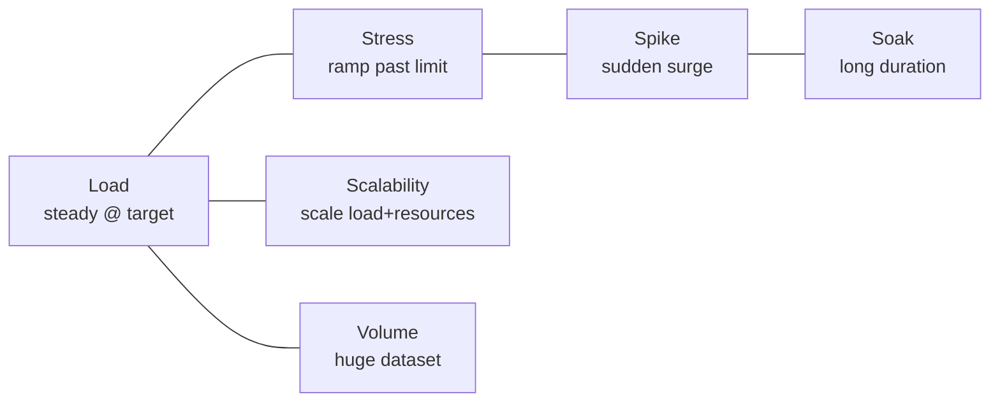
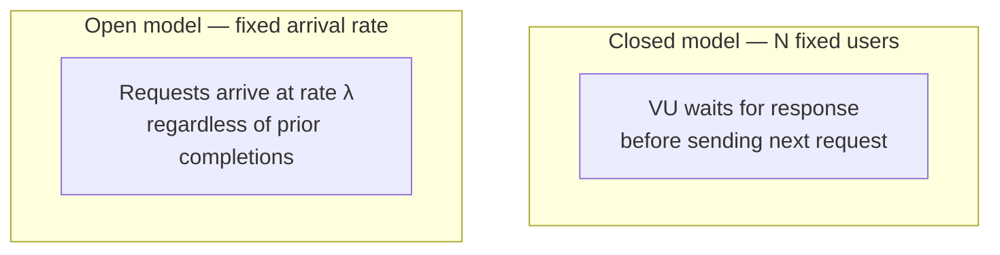
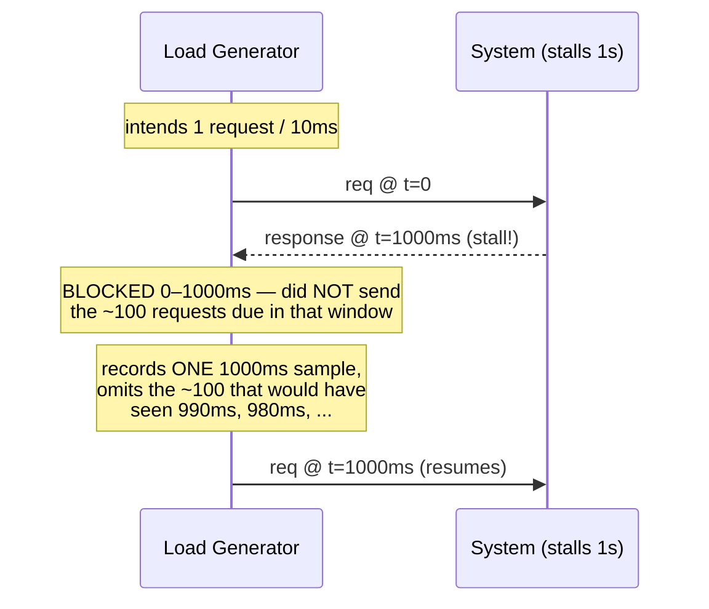
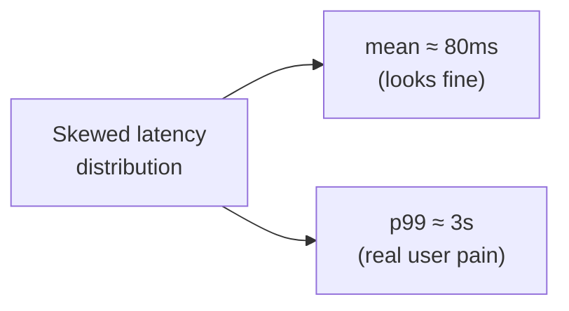
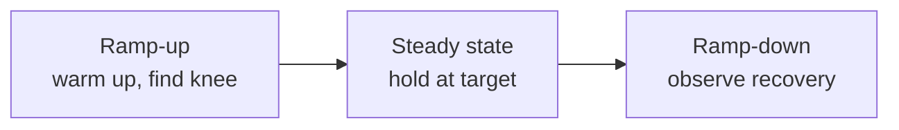
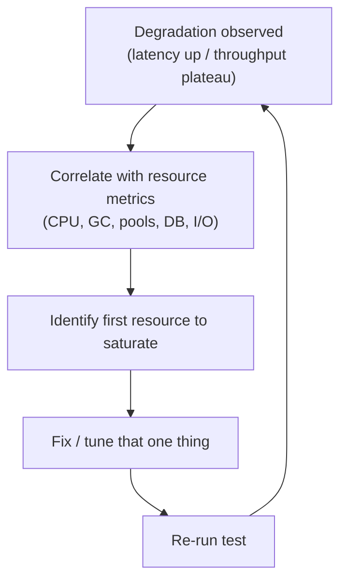
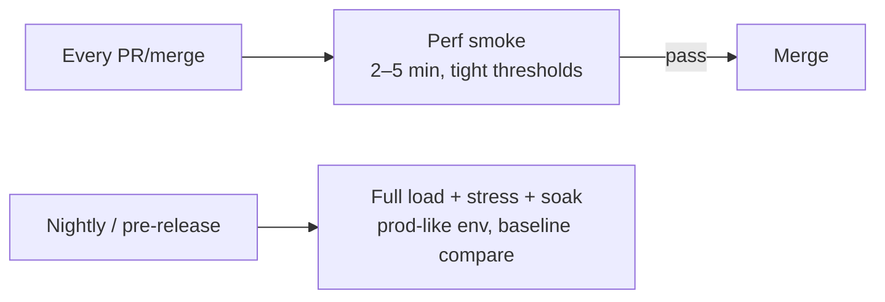

# Performance Testing: Load, Stress, Soak & Spike

Performance testing is the **testing discipline** that measures how a system
behaves under a controlled, reproducible workload: how fast it responds
(latency), how much traffic it can sustain (throughput), how many users it can
serve concurrently, and where and how it breaks. It is not "run it and see if it
feels fast" — it is an experiment with a defined workload model, defined
success criteria (SLOs), a realistic-enough environment, and a measurement
method that does not lie to you.

This topic owns the *testing technique*: the categories of performance test
(load, stress, soak, spike, scalability, volume), the tools (JMeter, Gatling,
k6, Locust), the two workload models (open vs closed) and why the difference is
decisive, the **coordinated omission** trap that makes average latency
meaningless, percentiles (p95/p99/p999), Little's Law, think time and pacing,
ramp-up, defining pass/fail, bottleneck analysis, environment fidelity, and
running performance tests in CI. *Capacity planning and sizing* (how many hosts
you need for real traffic) live in the `system-design` domain — here we stay at
the level of *how to design and run the test and read the numbers*.

> [!INTERVIEW]
> The two probes that separate a senior answer from a junior one here are:
> (1) *"Why is average latency a bad metric?"* — the answer is percentiles **and**
> coordinated omission, not just "use the mean of a skewed distribution."
> (2) *"What's the difference between a closed and an open load test, and which
> did your tool use?"* — most engineers have run a load test without knowing
> their tool silently applied back-pressure that hid the real latency.

---

## What performance testing is and why it matters

Performance testing answers questions functional tests never ask: *how fast*,
*how much*, and *for how long*. A feature can be 100% functionally correct and
still fail in production because it falls over at 500 requests/second, leaks
memory over 12 hours, or has a p99 latency of 4 seconds even though its average
is 80 ms.

The discipline exists because performance problems are:

- **Emergent** — they only appear under concurrency, contention, and volume, so
  they are invisible in unit and integration tests.
- **Expensive to find late** — a scalability ceiling discovered in production is
  an outage; found in a load test it is a backlog item.
- **Non-linear** — response time does not degrade gracefully; systems tend to
  be fine up to a knee and then collapse (queues build, thread pools exhaust,
  GC thrashes).

Performance testing is a **non-functional** test: it validates *quality
attributes* (latency, throughput, resource use, stability) rather than *what the
system computes*. It sits outside the classic test pyramid — you run it against
a deployed, integrated system, not a unit — and it is usually gated on a
performance environment rather than on every commit.

> [!KEY-TAKEAWAY]
> Functional testing asks "does it produce the right answer?" Performance
> testing asks "does it still produce the right answer *fast enough*, for
> *enough* concurrent users, *without degrading over time*?" You need both.

---

## Types of performance tests

The word "performance test" is an umbrella. Interviewers expect you to name and
distinguish the specific types, because each has a different goal, workload
shape, and pass/fail criterion.

| Type | Goal | Workload shape | What it finds |
|---|---|---|---|
| **Load** | Verify behavior at *expected* / peak-normal traffic | Steady, at target level | Whether SLOs hold at planned load |
| **Stress** | Find the *breaking point* and failure mode | Ramp *past* capacity until it breaks | Max capacity, how it fails (graceful vs cliff) |
| **Soak / endurance** | Verify stability *over time* | Moderate load, long duration (hours→days) | Memory leaks, resource exhaustion, log/disk growth, connection-pool drift |
| **Spike** | Verify reaction to a *sudden surge* | Sharp jump up then down | Auto-scaling lag, queue overflow, recovery behavior |
| **Scalability** | Measure how capacity grows with resources | Increase load *and* resources | Linearity, horizontal/vertical scaling limits |
| **Volume (flood)** | Behavior with a large *data* set | Normal load, huge data volume | Slow queries, index gaps, pagination/memory issues |



Key distinctions interviewers probe:

- **Load vs stress:** load confirms you *meet* your target; stress deliberately
  *exceeds* it to learn the ceiling and the failure mode. A load test that
  passes tells you nothing about your safety margin — that is what stress is for.
- **Soak is about time, not intensity.** A leak of 2 MB/minute is invisible in a
  10-minute load test and fatal in a 24-hour soak. Soak tests catch memory
  leaks, unclosed connections, unbounded caches, and log-file growth.
- **Spike vs stress:** stress ramps gradually to find the ceiling; a spike jumps
  instantly (e.g., 10× in seconds) to test elasticity and recovery — does
  autoscaling react in time, do queues absorb the burst, does the system recover
  when the spike ends or stay degraded?

> [!WARNING]
> "Stress test" is often used loosely to mean "any heavy load test." In an
> interview, be precise: stress specifically means driving *beyond* capacity to
> observe the breaking point and whether failure is graceful (shed load, return
> 503s, stay up) or catastrophic (cascading timeouts, crash).

---

## Open vs closed workload models

This is the single most important and most misunderstood concept in performance
testing. It determines what your test actually measures.

- **Closed model:** a *fixed number of virtual users (VUs)*. Each VU does
  request → wait for response → (think time) → next request, in a loop. A new
  request is only issued *after* the previous one returns. The number of
  in-flight requests is capped by the VU count.
- **Open model:** requests **arrive at a specified rate** (e.g., 500 req/s),
  independent of whether prior requests have completed. New arrivals do not wait
  for old ones to finish; concurrency grows if the system slows down.



**Why it matters:** In a closed model, when the system slows down, VUs
automatically slow down too — they are blocked waiting for responses, so they
send *fewer* requests. This is **back-pressure the load generator applies to
itself**, and it is unrealistic: real users and upstream services do not stop
arriving just because your server got slow. Closed-model tests therefore
*understate* latency and *mask* overload, because the offered load drops exactly
when the system is struggling.

Real internet traffic is almost always **open**: users click when they click.
So for services facing open traffic, an **open (arrival-rate) model** is usually
the correct choice — it keeps offering load at the target rate even as the
system degrades, exposing queue growth and the true tail latency.

| | Closed model | Open model |
|---|---|---|
| Control variable | Number of VUs | Arrival rate (req/s) |
| New request issued | After previous completes | On schedule, regardless |
| Concurrency under slowdown | Bounded (self-throttles) | Grows (queues build) |
| Realistic for | Fixed pool of clients (e.g., N worker threads, connection pool) | Open internet traffic |
| Risk | Hides overload via back-pressure | Can overwhelm generator/target quickly |

Tool mapping (worth knowing by name):

- **k6:** `constant-vus` / `ramping-vus` are **closed**; `constant-arrival-rate`
  / `ramping-arrival-rate` are **open**.
- **Gatling:** open injection via `constantUsersPerSec`, `rampUsersPerSec`,
  `stressPeakUsers`; closed via `constantConcurrentUsers` /
  `rampConcurrentUsers`.
- **JMeter:** thread-group model is fundamentally **closed** (fixed threads);
  approximating open load requires plugins (e.g., Throughput Shaping Timer,
  Concurrency Thread Group) and care.

> [!INTERVIEW]
> A killer answer: "I use an open model for internet-facing services because a
> closed model self-throttles under load — when the server slows, VUs wait, so
> the test stops offering the load that would actually reveal the problem. This
> is closely related to coordinated omission."

---

## The coordinated omission problem

Coordinated omission (a term coined by Gil Tene of Azul) is a measurement bug
that makes almost every naive load-test latency number *optimistic — often by
orders of magnitude at the tail.*

The setup: a load generator intends to send a request every 10 ms. A request
hits a system that stalls for 1 second (GC pause, lock, failover). During that
stall, the generator is *blocked waiting for the response* (closed model) and so
it **does not send** the ~100 requests it was supposed to send during that
second. It records *one* 1-second sample, then resumes.

The problem: those ~100 omitted requests, had they been sent, would each have
experienced most of that 1-second stall (the 2nd one would see ~990 ms, the 3rd
~980 ms, etc.). By *omitting* them, the generator throws away exactly the worst
latency samples — the ones that a real user hitting the system during the stall
*would* have suffered. The result: your histogram is missing its bad tail, so
p99/p999 look far better than reality.



Why "coordinated": the *pauses in measurement coordinate with the pauses in the
system under test* — you stop sampling exactly when things are worst.

**Consequences:**

- The **average is meaningless** — it is dominated by the many fast samples and
  the omission removes the slow ones.
- **Tail percentiles are wildly understated** — the true p99.9 might be seconds
  while the reported one is milliseconds.

**Fixes:**

- Use an **open workload model** so the generator keeps issuing requests on
  schedule even while the system is stalled (arrivals queue up rather than being
  skipped).
- **Correct for coordinated omission in the recorder.** HdrHistogram provides
  `recordValueWithExpectedInterval()` (and
  `copyCorrectedForCoordinatedOmission()`), which back-fill the synthetic samples
  that *would* have occurred during a stall given the expected interval. `wrk2`
  and modern k6/Gatling arrival-rate modes are built to avoid it.
- **Measure latency as "intended send time → response," not "actual send time →
  response."** The delay a request spends waiting in the generator's own queue
  is part of the latency a real user would feel.

> [!WARNING]
> A load test that reports a beautiful p99 while the target's CPU is pegged and
> queues are growing is almost certainly suffering coordinated omission. Trust
> the server-side saturation signals over a suspiciously clean client-side tail.

---

## Latency percentiles: why the average lies

Latency distributions are **right-skewed and multi-modal** (fast cache hits,
slower DB hits, occasional GC pauses). The mean is pulled around by outliers and
tells you nothing about the experience of the unlucky requests.

- **The average hides the tail.** A service with an 80 ms average can still have
  a 3 s p99. If you serve 10M requests/day, "1% slow" is 100,000 bad experiences.
- **Report percentiles, not just p95.** p50 (median, "typical"), p95, p99,
  **p99.9 (p999)** and max. The tail is where real user pain and SLA violations
  live.
- **Percentiles compound across dependencies (tail amplification).** If one
  request fans out to 10 backends and each has a 1% chance of a slow response,
  the probability the *overall* request is slow is `1 − 0.99¹⁰ ≈ 9.6%`. So a
  backend's p99 can become the *fan-out caller's* median-ish problem. This is
  why Google's "The Tail at Scale" argues you must attack tail latency directly.



Averaging pitfalls to name in an interview:

- **You cannot average percentiles.** The average of per-minute p99 values is
  *not* the p99 over the hour. To aggregate correctly you need the underlying
  distribution (e.g., merge HdrHistograms), not pre-computed percentiles.
- **Beware pre-aggregated metrics.** Many dashboards store only mean + count per
  interval; you literally cannot recover percentiles from them.

> [!KEY-TAKEAWAY]
> "Measure percentiles (p95/p99/p999), not the average, and never average the
> percentiles." The average is optimistic and non-actionable; the tail is what
> your SLOs and your users care about.

---

## Throughput, latency, concurrency & Little's Law

These three are the vocabulary of performance and they are linked by a simple,
powerful law.

- **Latency (response time):** how long one request takes. Measured in time
  (ms), reported as percentiles.
- **Throughput:** how many requests complete per unit time (req/s, TPS). This is
  the system's *rate*.
- **Concurrency:** how many requests are *in flight* at once.

**Little's Law:** for a stable system,

```
L = λ × W
```

where **L** = average number of requests in the system (concurrency), **λ** =
arrival/throughput rate, and **W** = average time in the system (latency). It
holds for any stable queueing system regardless of distribution.

Practical uses interviewers love:

- **Derive the concurrency you need to test.** To sustain 2,000 req/s (λ) at a
  100 ms average latency (W), you need `L = 2000 × 0.1 = 200` concurrent
  requests in flight. So ~200 VUs *in a closed model with no think time* — but
  see below.
- **Explain the throughput ceiling.** If latency stays flat as you add load,
  throughput rises linearly. Once you hit a bottleneck, latency climbs, and by
  Little's Law throughput plateaus (or drops) while concurrency piles up in
  queues — the classic "knee" of the curve.
- **Diagnose direction of causation:** rising concurrency with flat throughput
  and rising latency = you are past saturation; the extra load is just queueing.

> [!TIP]
> Little's Law is why **closed-model VU count and open-model arrival rate are
> not interchangeable.** `VUs = arrival_rate × (latency + think_time)`. If you
> pick a VU count and latency degrades, your *effective* offered rate silently
> falls — another reason open models are safer for internet-facing SLO tests.

---

## Think time, pacing & ramp-up

Realistic load tests model *how users actually behave*, not a tight
fire-as-fast-as-possible loop.

- **Think time:** the pause a real user takes between actions (reading a page,
  filling a form) — typically modeled as a random delay (e.g., 3–10 s,
  often drawn from a distribution). Omitting think time makes each VU hammer far
  harder than a human, so a "100-user" test without think time can generate the
  load of thousands of real users — badly misrepresenting capacity.
- **Pacing:** controlling the *rate of iterations* per VU (e.g., "one checkout
  per VU per 30 s") so throughput matches a target regardless of how fast
  responses come back. Pacing turns a closed model into something closer to a
  fixed-rate profile.
- **Ramp-up (and ramp-down):** gradually increasing load rather than starting at
  full blast. Ramp-up (a) lets connection pools, JIT compilation, caches, and
  autoscalers warm up, avoiding a false failure from a cold start, and (b) lets
  you *see the knee* — the load level where latency starts climbing — instead of
  jumping straight past it. Ramp-down helps observe recovery.



> [!WARNING]
> Two classic mistakes: (1) *no think time* → you overstate the load per user
> and understate capacity; (2) *no ramp-up* → cold caches/JIT/pools make the
> first minute look like a failure that has nothing to do with steady-state
> performance. But note: a **spike test intentionally skips ramp-up** because
> the sudden jump *is* the thing under test.

---

## Tools: JMeter, Gatling, k6, Locust

| Tool | Language / script | Model | Notes |
|---|---|---|---|
| **Apache JMeter** | GUI + XML (`.jmx`), Java | Closed (thread groups); open via plugins | Mature, huge protocol support, GUI-heavy; GUI mode is for building — run load in **non-GUI/CLI** mode |
| **Gatling** | Scala/Java/Kotlin DSL, code | Open **and** closed injection | Efficient (async, Netty/Akka), code-as-test, great HTML reports |
| **k6** | JavaScript (Go engine) | Executors for both open & closed | Developer-friendly, CLI-first, CI-friendly, low footprint |
| **Locust** | Python, code | Closed (users) | Pythonic, distributed via workers |

Themes an interviewer will reward:

- **Code-as-test tools (Gatling, k6, Locust) fit CI and version control** better
  than JMeter's XML; the scripts are diff-able and reviewable.
- **Run JMeter in non-GUI mode for actual load.** The GUI is for authoring; it
  cannot generate high load and skews results.
- **Load generators need enough headroom.** If the generator is CPU/network
  bound it becomes the bottleneck and you measure *it*, not the system. Use
  distributed generators for high load, and always monitor the generator too.
- **Pick the model, not just the tool.** The important question is not "JMeter or
  Gatling?" but "open or closed workload, and does my chosen tool/executor
  implement it correctly (avoiding coordinated omission)?"

```java
// A JUnit 5 "smoke performance" guard — NOT a substitute for a real load test,
// but useful as a coarse CI regression gate on a hot path.
@Test
void encodeStaysUnderBudget() {
    var payload = TestData.largeOrder();
    long start = System.nanoTime();
    for (int i = 0; i < 10_000; i++) {
        codec.encode(payload);
    }
    long p = (System.nanoTime() - start) / 10_000; // ns/op, single-threaded
    assertThat(p).as("per-op encode latency")
                 .isLessThan(Duration.ofMicros(50).toNanos());
}
// For real microbenchmarks use JMH (warmup, forks, dead-code elimination),
// not a hand-rolled loop — the JIT will mislead you otherwise.
```

---

## Defining SLOs and pass/fail criteria

A performance test without explicit pass/fail criteria is just data collection.
You must decide *before the run* what "passing" means, and encode it as
**thresholds** in the tool so the test fails the build automatically.

- **SLI (indicator):** the measured signal — e.g., request latency, error rate.
- **SLO (objective):** the target for that signal — e.g., "p99 latency < 300 ms
  and error rate < 0.1% at 1,000 req/s."
- **SLA:** the contractual promise (with penalties) — usually looser than the
  internal SLO.

Good performance-test pass/fail criteria are **percentile- and error-based**,
not average-based:

```javascript
// k6 thresholds — the test process exits non-zero if any threshold is breached,
// so CI fails the build automatically.
export const options = {
  scenarios: {
    api: { executor: 'constant-arrival-rate', rate: 1000, timeUnit: '1s',
           duration: '10m', preAllocatedVUs: 200, maxVUs: 500 }, // OPEN model
  },
  thresholds: {
    http_req_duration: ['p(95)<250', 'p(99)<500'], // latency SLO
    http_req_failed:   ['rate<0.001'],             // <0.1% errors
  },
};
```

Tips:

- **State the load level with the target.** "p99 < 500 ms" is meaningless without
  "at X req/s" — latency is a function of load.
- **Include error rate.** A system can hit its latency SLO by shedding load
  (returning fast 5xx). Always gate on error rate too.
- **Fail on the tail, warn on the trend.** Hard-fail on SLO breach; also compare
  against a baseline to catch gradual regressions before they cross the SLO.

---

## Bottleneck analysis

The point of stress and load tests is not the pretty graph — it is finding *what
limits you* so you can fix it. Bottleneck analysis is systematic.

- **Correlate client-side metrics with server-side resource metrics.** When
  latency/throughput degrades, look at CPU, memory/GC, thread pools, connection
  pools, DB query time, disk I/O, network, and lock contention *at the same
  timestamp*. The resource that saturates first (hits 100% or its configured
  limit) is the bottleneck.
- **The USE method (Brendan Gregg):** for every resource check **U**tilization,
  **S**aturation, **E**rrors. Saturation (queue depth) often signals a
  bottleneck before utilization hits 100%.
- **Common backend bottlenecks:** database (missing index, N+1, lock contention,
  connection-pool exhaustion), thread-pool starvation, synchronous blocking
  calls, GC pauses (heap too small / allocation rate too high), and downstream
  service limits.
- **Fix one at a time.** Removing one bottleneck reveals the next; re-run after
  each change. Chasing several at once makes it impossible to attribute the
  improvement.



> [!TIP]
> A throughput curve that flattens while latency climbs and a specific resource
> pins at its limit is the textbook bottleneck signature. If *nothing* on the
> server is saturated but throughput still plateaus, suspect the **load
> generator** or a client-side limit (connection reuse, DNS, ephemeral ports).

---

## Test environment fidelity

Your numbers are only as trustworthy as the environment that produced them.

- **Prod-like beats prod-lite.** Ideally the perf environment matches production
  in instance types, count, network topology, DB size/version, and config. A
  test on a 2-vCPU box with an empty database predicts nothing about a 32-vCPU
  fleet with 500 GB of data.
- **Scale down *ratios*, not blindly.** If you must use a smaller environment,
  keep resource *ratios* consistent and be explicit that results are directional,
  not absolute. Non-linearities (GC, cache hit rates, DB plans) mean you cannot
  simply multiply.
- **Data volume matters as much as request volume.** Queries that are instant on
  1,000 rows do full-table scans on 50M. Seed a **realistic data set** (volume
  testing) or your latency numbers are fiction.
- **Beware shared/noisy environments.** Other tenants, throttling, or a
  co-located CI job add variance. Isolate the perf environment and pin/record
  versions so runs are comparable.
- **Warm up before measuring.** JIT compilation, connection pools, and caches
  need to reach steady state; discard or separate the warm-up window.

> [!WARNING]
> The most common way a "passing" load test lies: it ran against an empty or
> tiny database. Data volume changes query plans and cache behavior — always
> test against production-scale data.

---

## Performance testing in CI

Performance tests are valuable in CI *if* you scope them correctly — you cannot
run a 24-hour soak on every PR.

- **Two tiers.** A **short, small "perf smoke"** (e.g., 2–5 min, modest rate)
  runs on every merge as a **regression gate** with tight thresholds; a **full
  load/stress/soak** runs nightly or pre-release against the prod-like
  environment.
- **Gate on thresholds, not eyeballing.** The tool must exit non-zero on SLO
  breach (k6 `thresholds`, Gatling assertions) so the pipeline fails
  automatically — no human needs to read a graph.
- **Compare against a baseline to catch regressions.** Absolute thresholds catch
  cliffs; baseline comparison catches slow creep (e.g., "p99 grew 20% vs last
  release"). Store historical results.
- **Control variance for meaningful CI signal.** Shared CI runners are noisy;
  pin dedicated hardware for the perf job, fix data, and require a margin (or
  multiple runs) before failing to avoid flaky gates.
- **Keep microbenchmarks separate.** JMH-style microbenchmarks answer "is this
  function faster?"; load tests answer "does the service meet its SLO under
  traffic?" Don't conflate them.



> [!KEY-TAKEAWAY]
> In CI, split perf tests into a fast per-PR regression gate (threshold-driven,
> auto-fail) and a heavier scheduled suite (full load/stress/soak, baseline
> comparison) against a prod-like environment. Never gate a merge on a flaky
> full-scale run.

---

## Common follow-up questions

- "Why is average latency a bad metric?" It is pulled by outliers on a
  skewed distribution and hides the tail; it is also usually corrupted by
  coordinated omission. Report percentiles (p95/p99/p999) and never average
  percentiles across intervals.
- "What is coordinated omission and how do you avoid it?" A closed-model
  generator stops sending requests while the system stalls, omitting exactly the
  worst samples, so the tail looks artificially good. Avoid it with an open
  (arrival-rate) model and/or HdrHistogram's coordinated-omission correction.
- "Open vs closed workload — which and why?" Closed = fixed VUs, self-
  throttles under load (unrealistic for internet traffic, hides overload). Open
  = fixed arrival rate, keeps offering load as the system degrades — usually
  correct for internet-facing services.
- "How do you pick the number of VUs / arrival rate?" Little's Law:
  `concurrency = throughput × latency` (add think time). Derive one from the
  others; don't guess.
- "How would you detect a memory leak?" A soak/endurance test — moderate load
  over many hours — watching heap-after-GC, RSS, and connection counts trend
  upward. A short load test cannot see it.
- "Load test passes but prod is slow — why?" Environment fidelity: empty/
  small DB, non-prod instance types, missing think time, closed-model back-
  pressure, or coordinated omission hiding the tail.
- "Stress vs spike?" Stress ramps *gradually past* capacity to find the
  ceiling and failure mode; spike jumps *instantly* to test elasticity/recovery.
- "Where do performance tests fit in the pyramid?" They sit outside it —
  they run against a deployed, integrated system, not a unit — typically as a
  scheduled/pre-release stage plus a lightweight per-PR smoke gate.

## References

- Gil Tene — *"How NOT to Measure Latency"* (coordinated omission), talk & slides.
- HdrHistogram documentation — `recordValueWithExpectedInterval` /
  coordinated-omission correction.
- Jeffrey Dean & Luiz André Barroso — *"The Tail at Scale"*, CACM 2013 (tail
  latency, fan-out amplification).
- k6 docs — Scenarios & Executors (open vs closed: arrival-rate vs VU executors);
  Thresholds.
- Gatling docs — Injection profiles (open vs closed model).
- Apache JMeter User Manual — non-GUI mode, thread groups, timers.
- Locust documentation — users, tasks, distributed load generation.
- Brendan Gregg — *Systems Performance* / the USE method (utilization,
  saturation, errors).
- John D. C. Little — Little's Law (`L = λW`).
- Google SRE Book — SLIs, SLOs, SLAs.
- Martin Fowler — bliki (test pyramid context for where perf tests sit).
