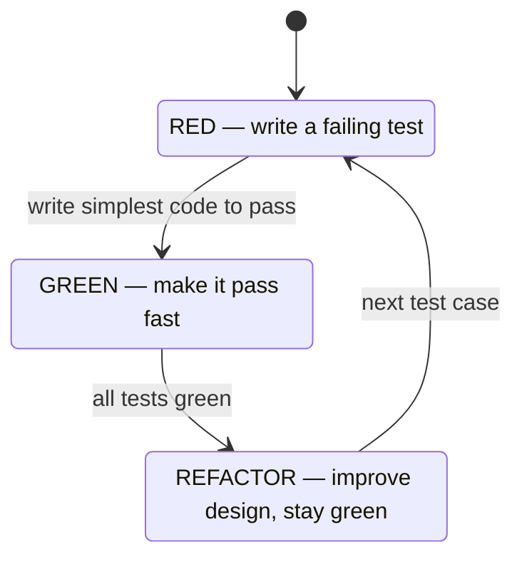
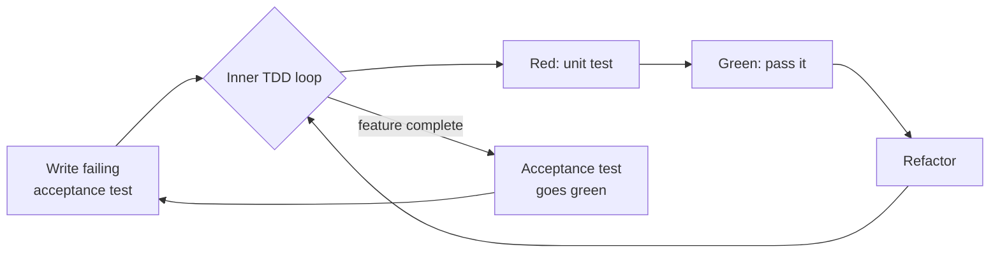

# Test-Driven Development (Red-Green-Refactor)

Test-Driven Development (TDD) is a development discipline in which you write a
**failing test before** the production code that makes it pass, then refactor. It was
codified by Kent Beck in the late 1990s as part of Extreme Programming (XP), building on
the xUnit frameworks he wrote. TDD is *not primarily a testing technique* — it is a
**design and workflow technique** whose test suite is a valuable by-product. The tests
are the *specification you write first*; the design emerges as you satisfy it in tiny
increments.

This topic covers the general TDD discipline language-agnostically, with JUnit 5 /
Mockito examples. For Spring-specific test slices (`@WebMvcTest`, `@DataJpaTest`,
`@SpringBootTest`) see `spring-boot/testing-spring-boot-applications`. For the mocking
taxonomy see `testing/test-doubles-and-mocking-taxonomy`.

> [!KEY-TAKEAWAY]
> TDD's loop is **Red → Green → Refactor**: write a test that fails, write the *simplest*
> code to pass it, then improve the design while the test stays green. The value is
> continuous design feedback and a regression net that you trust because you saw it fail.

---

## The Red-Green-Refactor Cycle

The core TDD loop has three phases, repeated in very short iterations (seconds to a few
minutes each):

1. **Red** — write a small test for the next slice of behaviour and watch it **fail**.
   The failure must be for the *expected reason* (e.g. an assertion mismatch, not a
   compile error or a typo'd test). Seeing red proves the test can actually fail — a
   test that never fails is worthless.
2. **Green** — write the **simplest** production code that makes the test pass, even if
   it is "ugly" or hard-codes a value. The goal is to get to green *fast*, not to write
   the final design. All existing tests must stay green too.
3. **Refactor** — with a passing suite as a safety net, improve the structure of both
   the new code and the surrounding code (remove duplication, rename, extract methods)
   **without changing behaviour**. No new functionality is added here, so no new tests
   are needed; the green bar tells you the refactor was safe.



The most common failure mode, per Fowler, is **skipping refactor** — you then "end up
with a messy aggregation of code fragments." Refactoring is not optional; it is where TDD
earns its design benefit. A useful preliminary discipline (Beck's "Canon TDD") is to
**write a list of test cases first**, then pick them in an order that drives you quickly
to the interesting parts of the design.

> [!WARNING]
> If your new test passes *without* writing any production code, something is wrong: the
> behaviour already exists, the test asserts nothing meaningful, or you tested the wrong
> thing. Always confirm the red before making it green.

---

## Test-First vs Test-After

**Test-first (TDD)** writes the test before the implementation. **Test-after** (a.k.a.
test-last) writes production code first and adds tests afterward. Both can produce a test
suite, but they differ in what they optimise:

| Aspect | Test-first (TDD) | Test-after |
|---|---|---|
| Drives API/interface design | Yes — you feel awkward APIs immediately | No — design is already fixed |
| Verifies the test can fail | Yes (you see red) | Rarely — a test written after passing code may be a false-positive that never fails |
| Coverage bias | Behaviour you *specified* | Behaviour that was *easy to test* after the fact |
| Risk of testing the implementation | Lower | Higher (tests mirror the code you just wrote) |
| Confidence that tests catch regressions | High | Depends on discipline |

The subtle, underrated benefit of test-first is **you observe the failure**. A test-after
test that is subtly broken (wrong assertion, wrong setup) can pass forever and give false
confidence. In TDD, every test earns its keep by failing first, then passing.

> [!INTERVIEW]
> "Test-after still gives me tests, so why bother with test-first?" Answer with two
> points: (1) test-first exerts *design pressure* — hard-to-test code is a signal of poor
> decoupling you fix *before* it ossifies; (2) test-first guarantees you've *seen the test
> fail*, so a passing test actually means something.

---

## The Three Rules of TDD

Robert C. Martin ("Uncle Bob") distilled TDD into three rules that describe the *micro*
rhythm:

1. You are **not allowed to write any production code** unless it is to make a failing
   unit test pass.
2. You are **not allowed to write more of a unit test** than is sufficient to fail — and
   **compilation failures are failures**.
3. You are **not allowed to write more production code** than is sufficient to pass the
   one failing test.

Together these force cycles of tens of seconds: you're never more than a minute or so from
a green bar. Rule 2's "compilation failures count as failing" is why you can write
`assertEquals(4, calc.add(2, 2))` referencing a method that doesn't exist yet — the
non-compiling test *is* the red state, and rule 3 says you write just enough (`add`
returning `4`, or `a + b`) to compile and pass.

> [!TIP]
> The three rules are an *ideal training rhythm*, not a legal code. Experienced
> practitioners take larger steps when confident and shrink back to baby steps when a
> problem gets hard or a test surprises them.

---

## Baby Steps, Triangulation & Fake It Till You Make It

Beck's *TDD by Example* names concrete techniques for getting from red to green:

- **Fake it till you make it** — return a hard-coded constant to pass the first test,
  then generalise as more tests force it. Example: first test expects `add(2,2)==4`, so
  `add` simply `return 4;`. It's deliberately wrong-in-general but green *now*.
- **Triangulation** — add a **second** (differing) assertion/test that the fake can't
  satisfy, forcing you to generalise. Once `add(2,2)==4` *and* `add(3,5)==8` both must
  pass, `return 4;` no longer works and you're driven to `return a + b;`. You triangulate
  the real implementation from two or more concrete examples.
- **Obvious implementation** — when the real code is trivial and you're confident, just
  write it directly (skip faking). Fall back to faking/triangulation when you get red
  unexpectedly.
- **Baby steps** — take the smallest increment that still moves forward; if you're
  guessing, make the step smaller.

```java
// RED: first test — fake it
@Test void addsTwoNumbers() {
    assertEquals(4, calculator.add(2, 2)); // impl: return 4;  (fake, but green)
}

// RED: triangulate — the fake can no longer pass
@Test void addsDifferentNumbers() {
    assertEquals(8, calculator.add(3, 5)); // forces impl: return a + b;
}
```

> [!KEY-TAKEAWAY]
> Faking-it is not cheating — it is a way to keep the bar green while you *incrementally*
> discover the general solution. Triangulation is how a second example proves the fake is
> insufficient and pulls out the real algorithm.

---

## TDD Benefits: Design Pressure, Regression Safety, Documentation

TDD's payoffs, most-to-least emphasised by practitioners:

- **Design pressure / testability-as-feedback** — writing the test first means you are
  the *first client* of your own API. Painful setup (huge constructors, many mocks, static
  dependencies, hidden global state) shows up *immediately* as test pain, nudging you
  toward small, decoupled, dependency-injected units. This is the primary reason Beck and
  Fowler value TDD.
- **Regression safety** — you accumulate a fast, trustworthy suite. Trustworthy because
  each test has *demonstrably failed once*, so a later red genuinely signals a regression.
  This "self-testing code" lets you refactor and add features fearlessly.
- **Living documentation** — well-named tests (`transferFailsWhenBalanceInsufficient`)
  read as executable specifications of intended behaviour that can't drift out of date the
  way comments do; a stale test *fails*.
- **Fine-grained progress & focus** — the red/green rhythm keeps you working on one small
  thing, reducing the "big design up front then debug for a week" trap.

> [!WARNING]
> The empirical evidence is *mixed*: controlled studies show a small positive effect on
> external quality and little-to-no clear effect on raw productivity. Don't oversell TDD
> as a guaranteed quality/speed multiplier — sell it as design feedback plus a regression
> net whose value compounds over a codebase's life.

---

## TDD Limits, Myths & When It's Less Useful

TDD is a tool, not a religion. It is **less useful or harder to apply** when:

- **You don't yet understand the problem or the API you want.** TDD assumes you can state
  the next expected behaviour. For exploratory/spike work, prototype first, then delete
  the spike and TDD the real thing.
- **The "hard part" is not logic but integration/environment** — UIs, complex SQL,
  distributed timing, hardware, security properties. These need integration/E2E/property
  tests, not just fast unit TDD. TDD "is not a substitute for other forms of testing."
- **Output is inherently fuzzy or hard to assert** — ML models, rendering, heuristics.
- **Throwaway code** with no future maintenance.

Common **myths** to correct in interviews:

| Myth | Reality |
|---|---|
| "TDD means 100% coverage / no bugs" | It reduces defects but tests can share the *same misunderstanding* as the code — false confidence is possible. |
| "TDD replaces QA/exploratory/integration testing" | It complements them; it mostly produces *unit* tests. |
| "TDD is slower because you write extra code" | Upfront cost, but pays back via fewer debug cycles and safe refactoring; net effect on productivity is roughly neutral in studies. |
| "You must always take baby steps" | The rhythm scales — take bigger steps when confident. |
| "TDD forbids any up-front design" | It favours *emergent* design but doesn't ban thinking; you still choose architecture and write a test list first. |

---

## Classicist vs Mockist TDD

There are two schools of *how* to isolate the unit under test, described by Fowler in
"Mocks Aren't Stubs":

- **Classicist / Detroit / "Chicago" school** (Beck's original style) — use **real
  collaborators** wherever practical and only substitute doubles for awkward dependencies
  (network, DB, time). Verify by **state**: call the method, assert on the resulting
  state/return value.
- **Mockist / London school** (Freeman & Pryce, *Growing Object-Oriented Software Guided
  by Tests*) — isolate the unit by **mocking every collaborator**, and verify by
  **behaviour/interaction**: assert that the unit called its collaborators with the right
  arguments. This drives "outside-in" design and tell-don't-ask messaging.

| | Classicist (state) | Mockist (interaction) |
|---|---|---|
| Collaborators | Real where possible | Mocked |
| Assertion style | State / return value | Verify interactions |
| Design driven | Emergent, bottom-up | Outside-in, protocol/role-focused |
| Refactor resilience | Tests survive internal refactors | Tests can break on internal refactors (coupled to calls) |
| Risk | May test too much at once | Over-specification / tests mirror implementation |

```java
// Classicist: real collaborator, assert on state
@Test void deductsFromBalance() {
    Account acct = new Account(100);            // real object
    new TransferService().withdraw(acct, 30);
    assertEquals(70, acct.balance());           // state assertion
}

// Mockist: mock collaborator, verify interaction
@Test void publishesEventOnWithdrawal() {
    EventBus bus = mock(EventBus.class);
    new TransferService(bus).withdraw(new Account(100), 30);
    verify(bus).publish(new WithdrawnEvent(30)); // interaction assertion
}
```

> [!INTERVIEW]
> The mature answer isn't "one is right." Mock at *architectural seams* you own (ports,
> external services); prefer real objects for value objects and cheap in-process
> collaborators. Over-mockist tests become "change-detector" tests that break on every
> refactor without catching real bugs.

---

## TDD and Emergent Design

**Emergent design** means the architecture is *grown* one test at a time rather than fully
designed up front. Each refactor step consolidates duplication and reveals abstractions
*after* you have concrete examples, which tends to produce designs that fit the actual
requirements (guided by YAGNI — "You Aren't Gonna Need It" — and DRY).

Key mechanics:

- **Duplication is the signal.** Beck's heuristic: remove duplication in the refactor
  step; abstractions (methods, classes, strategies) emerge naturally where duplication
  clusters.
- **Rule of Three** — don't abstract on the first or second occurrence; let the third
  concrete case justify the generalisation, avoiding premature/wrong abstractions.
- TDD does **not** replace deliberate architecture. High-level structure (bounded
  contexts, service boundaries, choosing a framework) is still decided consciously;
  emergent design operates mostly at the class/method level *inside* those boundaries.

> [!TIP]
> "Make it work, make it right, make it fast" — get green (work), refactor (right), then
> optimise only with a test/benchmark proving a need (fast). Don't skip to fast.

---

## TDD on Legacy Code & Characterization Tests

Legacy code (Michael Feathers' definition: **code without tests**) resists TDD because
you can't safely change it to make it testable, and you can't test it without changing it.
The way in is the **characterization test** (a.k.a. *golden master* / approval test):

1. Find a **seam** — a place you can alter behaviour without editing in place (e.g.
   subclass-and-override, extract-interface + inject).
2. Write a test that **pins the current behaviour** — including bugs — by asserting on
   whatever the code *actually* does now. You often *learn* the expected value by running
   the test with a placeholder assertion, reading the actual output, and pasting it in.
3. Build up enough of these tests to form a regression net, **then** refactor toward
   testability, **then** TDD new changes normally.

```java
// Characterization test: capture what legacy code CURRENTLY returns, bugs and all.
@Test void characterizeLegacyPricing() {
    // Not "what SHOULD it be" — "what IS it today", so a refactor can't change it silently.
    assertEquals("42.00", LegacyPricer.quote(cart)); // value discovered by running once
}
```

The mindset is opposite to greenfield TDD: you are **not specifying desired behaviour**;
you are **freezing existing behaviour** so refactoring is safe. Approval-testing tools
(e.g. ApprovalTests, or JUnit 5 + a golden file) automate the "record the actual output as
the baseline" step for large outputs.

> [!KEY-TAKEAWAY]
> Characterization tests pin current behaviour (including bugs) to make legacy refactoring
> safe. They are the bridge that lets you *start* TDD in code that has none.

---

## Test-Induced Design Damage Debate

In 2014 David Heinemeier Hansson (DHH) declared "TDD is dead," arguing that dogmatic TDD —
especially heavy mocking and isolating every class for fast unit tests — leads to
**test-induced design damage**: indirection, extra layers, and interfaces introduced
*solely to make code testable in isolation*, harming the design instead of helping it.
This sparked a series of "Is TDD Dead?" conversations with Kent Beck and Martin Fowler.

The nuanced consensus that emerged:

- **DHH's valid point**: optimising for *isolated, fast unit tests* can push you to mock
  collaborators (e.g. the database) and add seams that make the code more abstract and
  harder to read than a straightforward integration test would require.
- **Beck/Fowler response**: that's a symptom of *over-isolation and dogma*, not of TDD
  itself. Fowler advocates the **test pyramid** with a healthy mix — many unit tests, but
  also integration tests hitting real collaborators — and warns against treating "unit =
  single class, everything else mocked" as the only valid approach.
- **Takeaway**: let tests inform design, but if a test is forcing an abstraction that
  makes the *production* design worse, that's feedback to change the *test strategy* (test
  a larger unit, use a real DB via Testcontainers) — not to damage the design.

> [!INTERVIEW]
> Show you know both sides: "TDD gives design feedback, but if the feedback is 'add
> three interfaces to mock a database,' that's often a sign to test that slice as an
> integration test against a real datastore rather than to warp the design for
> testability."

---

## Double-Loop TDD with Acceptance Tests

**Double-loop (ATDD/outside-in) TDD** nests two feedback loops:

- **Outer loop (slow):** write a failing **acceptance test** expressing the feature from
  the user's/business perspective (often in a BDD Given/When/Then style — see
  `testing/bdd-and-specification-by-example`). It stays red until the whole feature works.
- **Inner loop (fast):** the classic red-green-refactor unit cycle. You spin the inner
  loop many times, growing the units needed, until the outer acceptance test finally goes
  green.



This is the method in *Growing Object-Oriented Software, Guided by Tests* (Freeman &
Pryce): start from the outside (acceptance test defines "done" for the feature), work
inward with unit TDD, and let the acceptance suite confirm the pieces integrate into
working, demonstrable behaviour. The outer loop guards against "all units green but the
feature doesn't actually work."

> [!TIP]
> Keep acceptance tests few and high-value (they're slower and broader). The inner unit
> loop should carry the bulk of your tests — this is just the test pyramid applied to the
> TDD workflow.

---

## Common follow-up questions

- **"What does 'red' actually prove?"** That the test is capable of failing and fails for
  the *expected* reason — so a future green genuinely means the behaviour works and the
  test isn't a false positive.
- **"Why write the simplest/faked code to pass?"** To reach green fast and let subsequent
  tests (triangulation) *drive* the real implementation, avoiding speculative
  generality (YAGNI).
- **"When would you NOT do TDD?"** Spikes/exploration, throwaway code, or where the risk is
  integration/UI/perf rather than unit logic — cover those with integration/E2E/perf tests.
- **"Classicist or mockist — which do you use?"** Prefer real collaborators; mock at owned
  architectural seams and external systems. Avoid interaction tests that just mirror the
  implementation.
- **"How do you TDD legacy code?"** Add characterization tests at seams to pin current
  behaviour, then refactor to testability, then TDD changes.
- **"Isn't TDD dead (DHH)?"** No — his critique targets over-isolation/mock-heavy dogma;
  the fix is a balanced test pyramid, not abandoning test-first.
- **"Does TDD guarantee good design or fewer bugs?"** It exerts design pressure and gives a
  regression net; evidence is a modest quality gain, roughly neutral productivity. Tests
  can share the code's misunderstandings, so it's not a silver bullet.

## References

- Kent Beck, *Test-Driven Development: By Example* (2002) — the canonical source for
  red-green-refactor, fake-it, triangulation, baby steps.
- Kent Beck, "Canon TDD" (2023) — restatement of the core loop and the test-list step.
- Martin Fowler, "Test Driven Development" (bliki) — https://martinfowler.com/bliki/TestDrivenDevelopment.html
- Martin Fowler, "Mocks Aren't Stubs" — classicist vs mockist, state vs interaction verification.
- Martin Fowler, "Self Testing Code" and "Test Pyramid" (bliki).
- Robert C. Martin, "The Three Rules of TDD" / *Clean Code* — the three-rules formulation.
- Steve Freeman & Nat Pryce, *Growing Object-Oriented Software, Guided by Tests* (2009) —
  mockist/outside-in, double-loop TDD.
- Michael Feathers, *Working Effectively with Legacy Code* (2004) — seams, characterization tests.
- DHH, "TDD is dead. Long live testing." (2014) and the "Is TDD Dead?" DHH/Fowler/Beck series.
- JUnit 5 User Guide — https://junit.org/junit5/docs/current/user-guide/
- Mockito documentation — https://javadoc.io/doc/org.mockito/mockito-core/latest/org/mockito/Mockito.html
