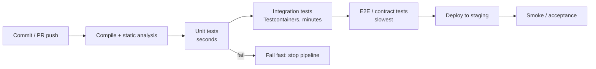
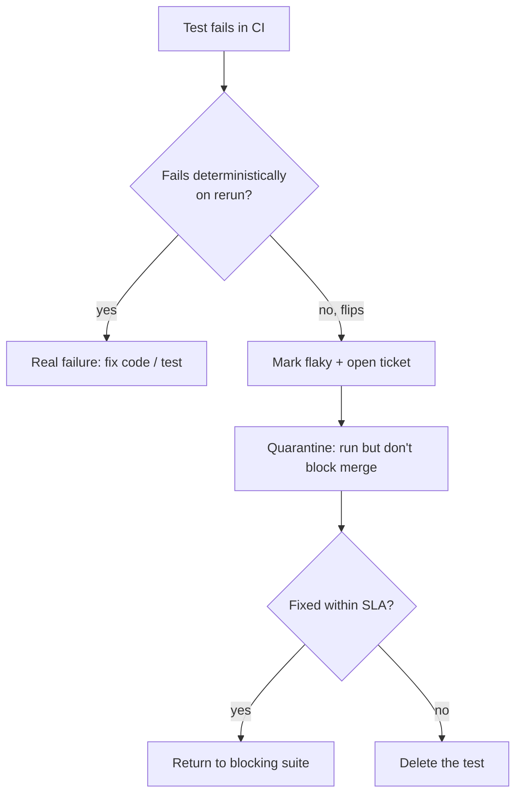
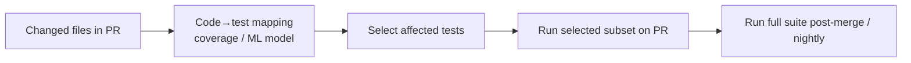

# Test Automation in CI/CD & Flaky Tests

A test suite only pays off when it runs **automatically, fast, and reliably** on
every change. This topic is about the *operational* side of testing: how tests
are staged in a CI/CD pipeline, how build/quality gates use their results to
decide whether code ships, and the single biggest threat to that whole machine —
**flaky tests**: tests that pass or fail nondeterministically on the same code.

The discipline here is language-agnostic (test stages, fail-fast, quarantine,
determinism, test impact analysis), but the concrete examples use the JVM
ecosystem this library standardises on: JUnit 5 (Jupiter), Mockito, Testcontainers,
JVM build tools (Maven Surefire/Failsafe, Gradle), and load tools where relevant.

> [!INTERVIEW]
> The signature senior probe is: *"Your CI is red half the time but the failures
> are flaky, not real. What do you do?"* A strong answer separates **detecting**
> flakiness (rerun analysis, flip-rate tracking) from **containing** it
> (quarantine, don't block the mainline) from **fixing the root cause**
> (determinism: control time/random/order/shared state/network) — and treats
> blanket retries as a last resort that hides bugs, not a fix.

Spring-specific test slices (`@WebMvcTest`, `@DataJpaTest`, `@SpringBootTest`)
live in the `spring-boot`/`spring-core` domains; this topic owns the general
CI/CD test discipline and points there only where relevant.

---

## Test stages in a CI/CD pipeline

Tests are arranged into **stages ordered by speed and cost**, so the cheapest,
most-localised tests run first and fail the build as early as possible
(**fail-fast**). This mirrors the test pyramid: many fast unit tests at the
bottom, fewer integration tests, and a thin layer of end-to-end (E2E) tests on
top.



Why this order:

- **Fast feedback.** A compile error or unit failure should be reported in
  seconds, not after a 30-minute E2E run.
- **Cost.** Unit tests need no external infrastructure; E2E tests spin up real
  services and are the most expensive and brittle.
- **Signal locality.** A failing unit test points at a specific class; a failing
  E2E test could be anything.

In Maven this maps to **Surefire** (unit tests, `*Test`, runs in the `test`
phase) vs **Failsafe** (integration tests, `*IT`, runs in `integration-test`/
`verify`). Separating them lets the pipeline run unit tests first and gate on
them before paying for integration setup.

> [!KEY-TAKEAWAY]
> Order stages by *speed and blast radius*: unit → integration → E2E. Fail-fast
> on the cheap stages so engineers get a red build in seconds, not after the
> slow suite.

## Test parallelization and sharding

As suites grow, **wall-clock time** becomes the constraint. Two orthogonal
techniques cut it:

- **Parallelization** — run tests concurrently *within one process/machine*
  using multiple threads. JUnit 5 supports this via
  `junit.jupiter.execution.parallel.enabled=true` and a config strategy
  (`dynamic`/`fixed`). Tests must be thread-safe and isolated, or you introduce
  flakiness.
- **Sharding (test splitting)** — partition the test set across *multiple
  machines/CI agents*, each running a disjoint subset, then aggregate results.
  Splitting by historical timing (not by count) balances shards best.

```properties
# JUnit 5 platform config: parallel execution
junit.jupiter.execution.parallel.enabled=true
junit.jupiter.execution.parallel.mode.default=concurrent
junit.jupiter.execution.parallel.config.strategy=dynamic
```

The catch: parallelism *surfaces* latent shared-state and order-dependence bugs.
A suite that passes serially but fails concurrently was never truly isolated —
parallelization is both a speedup and a flakiness detector.

> [!WARNING]
> `@ResourceLock` in JUnit 5 serialises access to a shared resource (a static
> field, a system property, a file) so parallel tests don't clobber each other.
> If you find yourself locking everything, the real fix is removing the shared
> state, not the lock.

## Build gates and quality gates

A **build gate** is a pass/fail condition the pipeline enforces before code
advances. The most basic gate is "all tests pass." **Quality gates** extend this
to *metrics*: coverage thresholds, static-analysis violations, security scan
findings, mutation score, performance budgets.

| Gate | Example condition | Tool |
|---|---|---|
| Test gate | 0 failing tests | Surefire/Failsafe, Gradle |
| Coverage gate | line/branch coverage ≥ 80% on new code | JaCoCo, SonarQube |
| Static analysis | 0 new blocker issues | SonarQube, SpotBugs, Error Prone |
| Mutation gate | mutation score ≥ threshold | PIT |
| Security gate | 0 critical CVEs | dependency scanners |

Two design principles that separate mature gates from naive ones:

1. **Gate on new/changed code, not the whole repo.** A "80% coverage overall"
   gate is easy to game and punishes legacy code; SonarQube's *"clean as you
   code"* gates the *diff*. This makes the gate actionable and fair.
2. **Gates must be trustworthy.** A gate that fails for flaky reasons trains
   engineers to hit "re-run" or "override" reflexively, which destroys the
   gate's value. Flakiness is therefore a *quality-gate* problem, not just a
   test problem.

> [!TIP]
> Coverage is a *necessary-not-sufficient* signal: 100% line coverage can still
> assert nothing. Pair a coverage gate with mutation testing (PIT) to check the
> assertions actually catch injected bugs.

## The flaky test problem

A **flaky test** is one that produces different results (pass/fail) on the same
code and the same inputs, without any change — it is **nondeterministic**. Flaky
tests are corrosive because they destroy trust: once engineers learn that red
might mean nothing, they stop reading failures, and *real* regressions slip
through.

Common **causes** (memorise this taxonomy — it is the most-asked flaky
question):

| Cause | What happens | Typical fix |
|---|---|---|
| **Async / timing** | Assert before an async op completes; `Thread.sleep` races | Poll with Awaitility; deterministic waits |
| **Order dependence** | Test B only passes if Test A ran first (leaked state) | Isolate state; randomise order to expose |
| **Shared mutable state** | Static fields, singletons, DB rows bleed across tests | Reset/rebuild per test; no shared mutables |
| **External dependencies** | Real network/3rd-party service is slow/down/rate-limited | Mock/stub (WireMock); Testcontainers for owned infra |
| **Nondeterminism** | `new Random()`, `LocalDateTime.now()`, HashMap/Set iteration order, locale/timezone | Inject Clock/seeded Random; sort before asserting |
| **Concurrency** | Race conditions, thread scheduling in the code under test | Deterministic scheduling; CountDownLatch; make code testable |
| **Resource leaks** | Ports, files, connections not released; test machine load | Clean up; unique resources per test |

```java
// FLAKY: races against an async handler and against the machine's speed.
@Test
void publishesEvent_flaky() {
    service.publish(order);
    Thread.sleep(100);                      // hope 100ms is "enough"
    assertThat(listener.received()).isTrue();
}

// STABLE: waits for the actual condition, with a bounded timeout.
@Test
void publishesEvent_stable() {
    service.publish(order);
    await().atMost(Duration.ofSeconds(5))   // Awaitility polls until true
           .untilAsserted(() -> assertThat(listener.received()).isTrue());
}
```

> [!KEY-TAKEAWAY]
> Flakiness is almost always the test (or the test's environment) being
> nondeterministic — not the framework. The cure is *determinism*: control time,
> randomness, ordering, shared state, concurrency, and external I/O.

## Detecting and quarantining flaky tests

You cannot fix what you cannot see. **Detection** techniques:

- **Rerun-on-failure analysis.** If a test fails then passes on retry with no
  code change, flag it as flaky (this is what "flaky" means operationally).
- **Flip-rate / historical tracking.** CI systems and tools (Gradle Enterprise/
  Develocity, Datadog CI Visibility, GitHub, JUnit XML history) track per-test
  pass/fail over time; a test that flips intermittently is flaky.
- **Deliberate order randomisation** (`@TestMethodOrder(Random.class)` mindset,
  Surefire `runOrder=random`) surfaces order-dependence.
- **Repeated / stress runs** (`@RepeatedTest`, running the suite N× under load)
  to reproduce timing races.

**Quarantine** = move a known-flaky test out of the blocking gate (into a
non-blocking bucket that still runs and reports) so it stops failing the
mainline, while a ticket tracks fixing or deleting it.



> [!WARNING]
> Quarantine is a *time-boxed* holding pen, not a graveyard. Without an SLA and
> ownership, the quarantine grows unboundedly and you lose the coverage the test
> was providing. A flaky test left running-but-ignored is worse than no test:
> it costs CI time and teaches people to ignore red.

## Retries: a smell vs a necessity

Automatically **retrying** a failed test (e.g. Maven Surefire `rerunFailingTestsCount`,
JUnit 5 extensions, `@RepeatedTest`-style wrappers) makes CI greener — but it is
usually **masking** a bug rather than fixing it.

- **Retries as a smell:** retrying a *unit* test is almost always wrong. A unit
  test has no I/O and no concurrency it doesn't control, so a flaky unit test is
  a genuine determinism bug (shared state, ordering, clock/random) that retrying
  hides. The green build now lies.
- **Retries as a pragmatic necessity:** at the *E2E/system* boundary you depend
  on real networks and third parties that have irreducible transient failures.
  A bounded retry there can be a reasonable *mitigation* — but only paired with
  flakiness tracking so you still see the flip-rate and fix what you can.

> [!TIP]
> A good rule: **retry only at the layer where nondeterminism is legitimately
> outside your control** (network, external service), never in unit tests, and
> always record that a retry happened so it shows up in flakiness metrics.
> "Retry until green" with no visibility is how a suite silently rots.

## Test isolation and idempotency

A test is **isolated** when its outcome does not depend on any other test and
leaves no state behind that affects others. It is **idempotent** when running it
once or many times (or re-running after a failure) yields the same result. These
two properties are what make parallelization, sharding, retries, and random
ordering safe.

Sources of broken isolation and their fixes:

- **Static / singleton state** → reset in `@AfterEach`, or design it out.
- **Database rows** → each test creates its own data with unique keys and rolls
  back or truncates; don't rely on a shared seeded dataset that tests mutate.
- **Filesystem / temp files** → JUnit 5 `@TempDir` gives each test a fresh dir.
- **System properties / env** → save and restore, or use JUnit Pioneer's
  `@SetSystemProperty`/`@RestoreSystemProperties`.
- **Ports** → bind to port 0 (ephemeral) instead of a fixed port.

```java
// Isolated: fresh temp dir per test, no shared state to leak.
@Test
void writesReport(@TempDir Path dir) throws IOException {
    Path out = dir.resolve("report.csv");
    reporter.writeTo(out);
    assertThat(Files.readString(out)).contains("total");
}
```

> [!KEY-TAKEAWAY]
> The litmus test for isolation: **run your suite in a random order and in
> parallel.** If it still passes, tests are isolated; if it flips, you have
> hidden ordering/shared-state coupling to fix.

## Deterministic tests: controlling time, randomness, concurrency

Nondeterminism is the root of most flakiness, and the three big sources are
**time, randomness, and concurrency**. The fix is the same pattern each time:
*inject the source of nondeterminism so the test can control it.*

- **Time.** Never call `Instant.now()`/`LocalDateTime.now()` directly in code
  under test. Inject a `java.time.Clock`; in production use `Clock.systemUTC()`,
  in tests use `Clock.fixed(...)`. This makes "expires after 30 days" testable
  without sleeping.
- **Randomness.** Inject a seeded `Random` (or a `RandomGenerator`), or a
  UUID/ID supplier, so "random" output is reproducible in tests.
- **Concurrency.** Don't assert on wall-clock timing. Use `CountDownLatch`,
  `CompletableFuture`, or Awaitility to synchronise on the actual event; make
  scheduling deterministic where possible.
- **Iteration order.** `HashMap`/`HashSet` iteration order is unspecified; sort
  before asserting, or assert with order-insensitive matchers
  (`containsExactlyInAnyOrder`).
- **Locale/timezone/encoding.** Pin them in the test (or the build) rather than
  inheriting the CI machine's defaults.

```java
class SubscriptionTest {
    // Clock is injected, so "now" is fixed and expiry is deterministic.
    private final Clock clock = Clock.fixed(
        Instant.parse("2026-01-01T00:00:00Z"), ZoneOffset.UTC);

    @Test
    void expiresAfter30Days() {
        var sub = new Subscription(clock, Duration.ofDays(30));
        assertThat(sub.isExpiredAt(Instant.parse("2026-02-01T00:00:00Z")))
            .isTrue();   // no Thread.sleep, no real wall clock
    }
}
```

> [!WARNING]
> `Thread.sleep` in a test is almost always a flakiness bug. It either wastes
> time (sleep too long) or races (sleep too short) — and the "right" duration
> depends on machine load, so CI will eventually flip. Replace it with a
> condition-based wait (Awaitility) or a controlled clock.

## Test data hygiene

Test data is a leading cause of both flakiness and slow suites. Principles:

- **Each test owns its data.** Prefer building the exact fixture the test needs
  (data builders / object mothers) over a giant shared seed script that many
  tests read *and mutate*. Shared mutable data is order-dependence waiting to
  happen.
- **Unique keys.** Generate unique identifiers (per-test UUIDs, sequence
  offsets) so parallel tests don't collide on primary keys or unique constraints.
- **Clean boundaries.** Roll back the transaction, truncate tables, or (with
  Testcontainers) throw away the whole container per class. Don't leave residue
  the next test trips over.
- **Realistic but minimal.** Insert only the rows the assertion needs; large
  fixtures slow every test and obscure what's actually under test.

| Anti-pattern | Problem | Better |
|---|---|---|
| One shared seeded DB all tests mutate | Order dependence, flakiness | Per-test data, rollback/truncate |
| Fixed IDs (`id = 1`) | Collisions under parallelism | Unique/UUID keys |
| Reusing prod data dumps | Slow, PII/compliance risk, brittle | Purpose-built minimal fixtures |
| Asserting on today's date via `now()` | Time-dependent flakiness | Controlled `Clock` |

## Test result reporting and trends

CI value depends on **making results visible over time**, not just red/green on
one run. The lingua franca is **JUnit XML** (originally Ant's format), which
almost every CI system, IDE, and reporting tool consumes to show test counts,
durations, failures, and stack traces.

What mature teams track:

- **Trends**, not snapshots: pass rate, suite duration, and per-test flip-rate
  over time expose slow degradation and flaky tests you'd miss per-run.
- **Slowest tests** report — the fat tail of a few very slow tests usually
  dominates wall-clock time and is where speedups pay off.
- **Flakiness dashboards** — flip-rate per test, so quarantine decisions are
  data-driven, not anecdotal (Develocity, Datadog CI Visibility, Buildkite Test
  Analytics do this).
- **Attribution** — link failures to the commit/PR and owner so red gets fixed
  fast.

> [!TIP]
> "Test time" is a first-class metric. If you don't graph suite duration, it
> only ever grows — every engineer adds tests, nobody removes or speeds them up,
> and one day the PR build takes 40 minutes and everyone routes around it.

## Running tests on pull requests

The **PR (pre-merge) build** is the primary quality gate: run enough of the
suite on every PR to catch regressions *before* they reach the mainline, while
keeping the build fast enough that engineers don't route around it.

- **Required checks / branch protection** make specified checks mandatory before
  merge — this is where the test gate is actually enforced (e.g. GitHub required
  status checks).
- **Right-size the PR suite.** Run all unit + integration tests on PRs; the
  slowest E2E/soak/performance suites often run **post-merge** or on a schedule
  (nightly), because blocking every PR on a 45-minute E2E run kills throughput.
- **Merge queues** re-run tests against the *actual merged result* of several
  queued PRs, catching "each PR is green alone but they conflict" (semantic
  merge conflicts / logical races) — a class of failure a plain PR build misses.
- Flaky tests hit hardest here: a flaky required check blocks unrelated PRs, so
  PR-blocking suites must be the *most* trustworthy (hence quarantine).

> [!KEY-TAKEAWAY]
> The PR build is a trade-off between *coverage* (catch more before merge) and
> *speed* (don't stall developers). Put fast, reliable, high-signal tests in the
> blocking PR gate; push slow or flaky ones to post-merge/nightly.

## The cost of slow test suites

A slow suite is not just an annoyance — it degrades quality directly:

- **Broken feedback loop.** If tests take 30 minutes, engineers context-switch,
  batch changes, and stop running tests locally — so bugs are found later and in
  bigger, harder-to-debug batches.
- **Gate avoidance.** Slow gates get bypassed ("merge override", skipping tests)
  precisely when the team is under pressure and most needs the gate.
- **Cost.** CI compute for a bloated suite run on every PR is a real, recurring
  bill.

Levers to speed a suite up (roughly in order of leverage):

1. **Rebalance the pyramid** — most slow suites are E2E-heavy; push logic down
   into fast unit tests.
2. **Parallelize and shard** across cores and agents.
3. **Test impact analysis / selective runs** — only run tests affected by the
   change (below).
4. **Kill the slow tail** — profile the slowest tests and fix or remove them.
5. **Reuse expensive fixtures** — share a Testcontainers container across a
   class (`@Container` static) instead of per method; use container reuse.
6. **Cache** — build caches, dependency caches, incremental compilation.

## Test impact analysis and selective test runs

**Test impact analysis (TIA)** / **predictive test selection** runs *only the
tests affected by a change* instead of the whole suite, using a map from
production code to the tests that exercise it (built from coverage data and/or
ML models over historical runs). On a large monorepo this can cut PR test time
by an order of magnitude.



Trade-offs and gotchas:

- **Soundness risk.** If the mapping misses an affected test (reflection, config,
  dynamic wiring, indirect coupling), TIA can *skip a test that would have
  caught the bug*. Mitigation: run the **full suite** on a schedule / post-merge
  as a safety net, and treat selection as a *speed optimisation on PRs*, not a
  replacement for full coverage.
- **Best on large suites.** For a small fast suite, just run everything —
  TIA's mapping overhead and risk aren't worth it.
- Tools: Gradle/Develocity Predictive Test Selection, Bazel's dependency-graph-
  based selection, Datadog Intelligent Test Runner.

> [!WARNING]
> Selective runs trade completeness for speed. Never let TIA be the *only* thing
> that ever runs your full suite — schedule a full run so a stale/incomplete
> mapping can't let regressions through indefinitely.

## Common follow-up questions

- **"How do you tell a flaky failure from a real one?"** Re-run the exact same
  commit: a real failure reproduces deterministically; a flaky one flips. Track
  flip-rate historically rather than judging per-run.
- **"A test is flaky and blocking everyone. What now?"** Quarantine it (move out
  of the blocking gate but keep running/reporting), open an owned ticket with an
  SLA, then fix the determinism root cause or delete it — don't leave it
  ignored-but-running.
- **"Should you retry failed tests in CI?"** Not unit tests — a flaky unit test
  is a determinism bug retrying only hides. A bounded retry at the E2E/network
  boundary can be pragmatic, but only with flakiness tracking so you still see
  and fix it.
- **"Your PR build takes 40 minutes. How do you fix it?"** Rebalance the pyramid,
  parallelize/shard, apply test impact analysis on PRs (full suite nightly),
  reuse expensive fixtures, and kill the slow tail — measure suite duration as a
  tracked metric.
- **"Why not just require 100% coverage?"** Coverage measures execution, not
  assertion quality; it's gameable and punishes legacy code. Gate on new-code
  coverage and pair it with mutation testing.
- **"Tests pass locally but fail in CI — why?"** Environment nondeterminism:
  timezone/locale/encoding defaults, machine speed (timing races), test ordering,
  shared state, ephemeral vs fixed ports, missing external deps.

## References

- JUnit 5 User Guide — Parallel Execution, `@Timeout`, `@RepeatedTest`,
  `@TempDir`, Test Execution Order.
- Martin Fowler — *Eradicating Non-Determinism in Tests*; *TestPyramid*;
  *Continuous Integration*.
- Google Testing Blog — *Flaky Tests at Google and How We Mitigate Them*;
  *Where do our flaky tests come from?*
- Maven Surefire / Failsafe plugin docs — rerunFailingTestsCount, forkCount,
  runOrder; unit vs integration test separation.
- Testcontainers docs — container lifecycle, reuse, `@Container`/`@Testcontainers`.
- Awaitility docs — condition-based waiting instead of `Thread.sleep`.
- Gradle / Develocity docs — Test Distribution, Predictive Test Selection, flaky
  test detection.
- SonarQube docs — Quality Gates, "Clean as You Code", new-code coverage.
- PIT (pitest) docs — mutation testing / mutation score.
